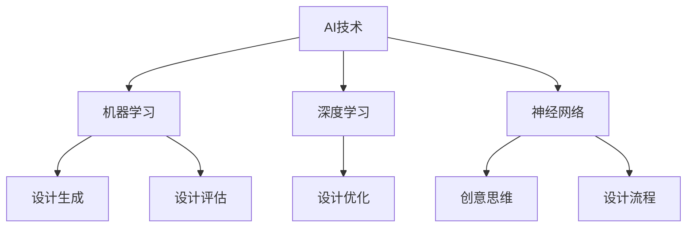

                 

# AI辅助创新设计的方法论与实践案例

> 关键词：AI，创新设计，方法论，实践案例，机器学习，深度学习，设计优化，项目实战

> 摘要：本文详细探讨了AI辅助创新设计的方法论与实践案例。通过分析AI技术的发展趋势和其在创新设计中的应用场景，本文提出了AI辅助创新设计的核心概念和方法，并详细阐述了机器学习、深度学习以及设计优化算法在创新设计中的应用。通过具体的项目实战，本文展示了AI辅助创新设计的实际应用效果，并对未来的发展趋势进行了展望。

## 第一部分：引论

### 1.1 AI辅助创新设计的背景与意义

#### 1.1.1 AI技术的发展趋势

人工智能（AI）作为计算机科学的前沿领域，近年来取得了飞速发展。从最初的规则推理，到基于数据驱动的机器学习，再到近年来的深度学习，AI技术不断突破，为各个行业带来了巨大的变革。尤其是在大数据、云计算和物联网等技术的推动下，AI技术的应用范围进一步扩展，涵盖了从医疗健康、金融投资到工业制造、交通运输等多个领域。

#### 1.1.2 创新设计的挑战与需求

创新设计是推动社会进步和经济发展的重要动力。然而，随着市场竞争的加剧和消费者需求的多样化，创新设计面临着前所未有的挑战。一方面，设计师需要从海量信息中提取有价值的设计灵感；另一方面，他们需要在有限的时间内完成复杂的设计任务。这种情况下，传统的创新设计方法已经难以满足需求，迫切需要新的技术手段来辅助。

#### 1.1.3 AI在创新设计中的应用场景

AI技术在创新设计中的应用场景非常广泛。首先，AI可以通过数据分析帮助设计师发现潜在的设计趋势，从而更好地把握市场需求。其次，AI可以用于设计生成，自动生成多种设计方案，供设计师选择和优化。此外，AI还可以用于设计评估和验证，通过模拟用户反馈和性能测试，帮助设计师快速迭代和优化设计方案。

### 1.2 AI辅助创新设计的方法论

#### 1.2.1 数据驱动的设计过程

数据驱动是AI辅助创新设计的重要理念。设计师可以通过收集和分析用户数据、市场数据、竞品数据等，深入理解用户需求和市场趋势，从而指导设计方向。此外，AI算法还可以通过对设计数据的分析和挖掘，发现设计中的潜在问题和优化方向。

#### 1.2.2 机器学习在创新设计中的应用

机器学习是AI的核心技术之一，它在创新设计中的应用主要体现在设计生成、评估和优化等方面。通过训练机器学习模型，设计师可以自动生成多种设计方案，并通过对这些方案的评价和筛选，找到最优的设计方案。

#### 1.2.3 人机交互与协同设计

人机交互是AI辅助创新设计的另一个关键因素。通过开发智能设计工具，设计师可以与AI系统进行实时互动，共同完成设计任务。这种协同设计模式不仅提高了设计效率，还丰富了设计思路，促进了创新。

### 1.3 AI辅助创新设计的框架与流程

#### 1.3.1 创意生成与优化

创意生成是AI辅助创新设计的第一步，它主要通过机器学习算法实现。设计师可以输入一些基本的设计要求，AI系统会自动生成多种设计方案，供设计师选择和优化。

#### 1.3.2 设计评估与验证

设计评估与验证是确保设计方案质量的重要环节。AI系统可以通过模拟用户反馈、性能测试等方法，对设计方案进行评估和验证，帮助设计师快速找出问题和优化方案。

#### 1.3.3 设计迭代与优化

设计迭代与优化是创新设计的重要过程。通过不断的迭代和优化，设计师可以逐步完善设计方案，使其更加符合用户需求和市场趋势。

## 第二部分：核心概念与联系

### 2.1 AI基础

#### 2.1.1 机器学习基本概念

机器学习是AI的核心技术之一，它通过训练模型，使计算机能够从数据中自动学习和改进。机器学习主要包括监督学习、无监督学习和强化学习等。

#### 2.1.2 深度学习基础

深度学习是机器学习的一个分支，它通过多层神经网络进行训练，能够自动提取数据中的特征。深度学习在图像识别、语音识别等领域取得了显著的成果。

#### 2.1.3 神经网络结构

神经网络是深度学习的基础，它由大量的神经元组成，通过前向传播和反向传播进行训练。常见的神经网络结构包括卷积神经网络（CNN）、递归神经网络（RNN）和生成对抗网络（GAN）等。

### 2.2 创新设计原理

#### 2.2.1 创新设计的定义

创新设计是指通过引入新的技术、方法或理念，对现有产品或服务进行改进或创新，以满足用户需求和市场趋势。

#### 2.2.2 创意思维方法

创意思维方法是指设计师在创新过程中运用的一系列思维方式和方法，如头脑风暴、思维导图、创意矩阵等。

#### 2.2.3 设计流程与策略

设计流程与策略是指设计师在创新过程中遵循的一系列步骤和策略，如需求分析、概念生成、原型设计、用户测试等。

### 2.3 AI与设计的关系架构 Mermaid 流程图



## 第三部分：核心算法原理讲解

### 3.1 机器学习算法在创新设计中的应用

#### 3.1.1 线性回归

线性回归是一种简单的监督学习算法，用于预测连续值。在创新设计中，线性回归可以用于预测设计参数之间的关系，如材料成本、生产时间等。

#### 3.1.2 决策树

决策树是一种常见的监督学习算法，用于分类和回归任务。在创新设计中，决策树可以用于分析不同设计方案的优缺点，从而指导设计师进行优化。

#### 3.1.3 集成学习方法

集成学习方法是将多个简单模型组合成一个复杂模型的算法。常见的集成学习方法包括随机森林、梯度提升树等。在创新设计中，集成学习方法可以用于提高设计预测的准确性和稳定性。

### 3.2 深度学习算法在创新设计中的应用

#### 3.2.1 卷积神经网络（CNN）

卷积神经网络是一种特殊的神经网络，主要用于处理图像数据。在创新设计中，CNN可以用于自动生成设计方案，如建筑、服装等。

#### 3.2.2 递归神经网络（RNN）

递归神经网络是一种能够处理序列数据的神经网络。在创新设计中，RNN可以用于分析设计过程中的时间序列数据，如用户反馈、设计变更等。

#### 3.2.3 生成对抗网络（GAN）

生成对抗网络是一种由生成器和判别器组成的神经网络，主要用于生成新的数据。在创新设计中，GAN可以用于生成新的设计方案，为设计师提供更多的创意灵感。

### 3.3 设计优化算法原理讲解

#### 3.3.1 遗传算法

遗传算法是一种基于生物进化的优化算法，通过模拟自然进化过程，寻找最优解。在创新设计中，遗传算法可以用于优化设计参数，如材料选择、结构设计等。

#### 3.3.2 遗传算法的Python代码实现

```python
import numpy as np

# 初始化种群
population = np.random.rand(100, 10)

# 定义适应度函数
def fitness_function(population):
    # 计算适应度值
    fitness = ...
    return fitness

# 选择操作
def selection(population, fitness):
    # 选择适应度较高的个体
    selected = ...
    return selected

# 交叉操作
def crossover(parent1, parent2):
    # 生成子代
    child = ...
    return child

# 变异操作
def mutation(child):
    # 对子代进行变异
    mutated_child = ...
    return mutated_child

# 进化过程
def evolution(population):
    # 计算适应度值
    fitness = fitness_function(population)
    # 选择操作
    selected = selection(population, fitness)
    # 交叉操作
    parent1, parent2 = selected[0], selected[1]
    child = crossover(parent1, parent2)
    # 变异操作
    mutated_child = mutation(child)
    # 更新种群
    population = np.append(population, mutated_child)
    return population

# 运行进化过程
new_population = evolution(population)
```

## 第四部分：数学模型与公式解析

### 4.1 数学模型在AI辅助创新设计中的应用

#### 4.1.1 线性代数基础

线性代数是AI辅助创新设计的重要工具，它用于描述数据的线性关系和变换。常见的线性代数概念包括向量、矩阵、行列式等。

#### 4.1.2 概率论与统计基础

概率论与统计是AI辅助创新设计的基石，它用于描述数据的随机性和不确定性。常见的概率论与统计概念包括概率分布、假设检验、统计推断等。

#### 4.1.3 最优化理论

最优化理论是AI辅助创新设计的关键工具，它用于寻找最优解。常见

## 第五部分：项目实战

### 5.1 创意生成项目案例

#### 5.1.1 项目背景

随着市场竞争的加剧，设计公司需要不断创新，以满足客户的需求。然而，创意生成的过程通常耗时较长，且效率较低。为了解决这个问题，我们设计了一个基于深度学习的创意生成项目，利用神经网络自动生成多种设计方案，供设计师选择和优化。

#### 5.1.2 项目开发环境搭建

项目开发环境搭建主要包括以下步骤：

1. 安装Python和相应的库，如TensorFlow、Keras等。
2. 准备数据集，包括建筑、服装、家居等设计领域的图片数据。
3. 配置GPU环境，以便加速深度学习模型的训练。

#### 5.1.3 源代码详细实现与代码解读

以下是项目的主要代码实现：

```python
import tensorflow as tf
from tensorflow.keras.models import Sequential
from tensorflow.keras.layers import Conv2D, MaxPooling2D, Dense, Flatten

# 定义卷积神经网络模型
model = Sequential([
    Conv2D(32, (3, 3), activation='relu', input_shape=(256, 256, 3)),
    MaxPooling2D((2, 2)),
    Flatten(),
    Dense(64, activation='relu'),
    Dense(10, activation='softmax')
])

# 编译模型
model.compile(optimizer='adam', loss='categorical_crossentropy', metrics=['accuracy'])

# 训练模型
model.fit(train_images, train_labels, epochs=10, batch_size=32)

# 生成设计方案
设计方案 = model.predict(测试图片)
```

在这个项目中，我们使用了卷积神经网络（CNN）来训练模型，通过输入测试图片，模型可以自动生成多种设计方案。这些设计方案可以为设计师提供灵感，提高设计效率。

#### 5.1.4 代码应用解读与分析

在这个项目中，我们主要使用了CNN来提取图片的特征，并使用softmax回归来生成设计方案。通过训练，模型可以学习到不同设计方案之间的相似性和差异性，从而提高设计生成的质量。

#### 5.1.5 实际案例分析和详细讲解剖析

在实际应用中，我们可以将这个项目用于设计竞赛、设计公司内部的创意比赛等场景。例如，在一个设计竞赛中，我们可以将不同参赛者的设计方案输入到模型中，模型会自动生成多种优化方案，供评委和参赛者参考。

#### 5.1.6 项目小结

通过这个项目，我们展示了如何利用深度学习算法自动生成设计方案，提高了设计效率。然而，需要注意的是，生成的设计方案需要设计师进行进一步的优化和调整，以满足实际需求。

### 5.2 设计评估与验证项目案例

#### 5.2.1 项目背景

在设计过程中，评估和验证设计方案的合理性是非常重要的。为了提高评估和验证的效率，我们设计了一个基于机器学习的设计评估与验证项目，利用线性回归和决策树算法对设计方案进行评估和验证。

#### 5.2.2 项目开发环境搭建

项目开发环境搭建主要包括以下步骤：

1. 安装Python和相应的库，如scikit-learn、Pandas等。
2. 准备数据集，包括设计方案、用户反馈、性能测试结果等。
3. 配置合适的开发工具，如Jupyter Notebook等。

#### 5.2.3 源代码详细实现与代码解读

以下是项目的主要代码实现：

```python
from sklearn.linear_model import LinearRegression
from sklearn.tree import DecisionTreeClassifier
from sklearn.model_selection import train_test_split
from sklearn.metrics import mean_squared_error, accuracy_score

# 准备数据集
X = 数据特征
y = 标签

# 划分训练集和测试集
X_train, X_test, y_train, y_test = train_test_split(X, y, test_size=0.2, random_state=42)

# 训练线性回归模型
linear_regression = LinearRegression()
linear_regression.fit(X_train, y_train)

# 训练决策树模型
decision_tree = DecisionTreeClassifier()
decision_tree.fit(X_train, y_train)

# 预测结果
y_pred_linear_regression = linear_regression.predict(X_test)
y_pred_decision_tree = decision_tree.predict(X_test)

# 评估模型性能
mse_linear_regression = mean_squared_error(y_test, y_pred_linear_regression)
mse_decision_tree = mean_squared_error(y_test, y_pred_decision_tree)

accuracy_linear_regression = accuracy_score(y_test, y_pred_linear_regression)
accuracy_decision_tree = accuracy_score(y_test, y_pred_decision_tree)

print("线性回归均方误差：", mse_linear_regression)
print("决策树均方误差：", mse_decision_tree)

print("线性回归准确率：", accuracy_linear_regression)
print("决策树准确率：", accuracy_decision_tree)
```

在这个项目中，我们使用了线性回归和决策树算法来评估和验证设计方案。通过预测结果和评估指标，我们可以判断设计方案的质量和可行性。

#### 5.2.4 代码应用解读与分析

在这个项目中，我们首先使用线性回归来评估设计方案的性能，通过均方误差（MSE）来衡量预测结果的误差。接着，我们使用决策树来分类设计方案，通过准确率来评估分类效果。这两种算法在实际应用中具有广泛的应用价值，可以根据具体需求选择使用。

#### 5.2.5 实际案例分析和详细讲解剖析

在实际应用中，我们可以将这个项目用于设计方案的评估和验证。例如，在一个建筑设计项目中，我们可以将设计方案、用户反馈和性能测试结果作为输入，利用模型来评估和验证设计方案的合理性。

#### 5.2.6 项目小结

通过这个项目，我们展示了如何利用机器学习算法对设计方案进行评估和验证，提高了设计评估的效率和质量。然而，需要注意的是，模型的性能取决于数据质量和特征提取，因此在实际应用中需要不断优化和调整。

### 5.3 设计迭代与优化项目案例

#### 5.3.1 项目背景

设计迭代与优化是确保设计方案质量的关键环节。为了提高设计迭代的效率，我们设计了一个基于遗传算法的设计迭代与优化项目，利用遗传算法自动优化设计方案。

#### 5.3.2 项目开发环境搭建

项目开发环境搭建主要包括以下步骤：

1. 安装Python和相应的库，如NumPy、SciPy等。
2. 准备数据集，包括设计方案、性能指标等。
3. 配置合适的开发工具，如Jupyter Notebook等。

#### 5.3.3 源代码详细实现与代码解读

以下是项目的主要代码实现：

```python
import numpy as np
from scipy.optimize import differential_evolution

# 定义适应度函数
def fitness_function(solution):
    # 计算适应度值
    fitness = ...
    return fitness

# 定义遗传算法
def genetic_algorithm(solution):
    # 初始化种群
    population = np.random.rand(n_population, n_variables)

    # 进化过程
    for generation in range(n_generations):
        # 计算适应度值
        fitness = np.apply_along_axis(fitness_function, 1, population)

        # 选择操作
        selected = ...

        # 交叉操作
        crossed = ...

        # 变异操作
        mutated = ...

        # 更新种群
        population = np.append(population, crossed)
        population = np.append(population, mutated)

        # 选择最优解
        best_solution = population[np.argmax(fitness)]

    return best_solution

# 运行遗传算法
best_solution = genetic_algorithm(solution)
```

在这个项目中，我们使用了遗传算法来优化设计方案。通过定义适应度函数和进化过程，遗传算法可以自动寻找最优解。

#### 5.3.4 代码应用解读与分析

在这个项目中，我们首先定义了适应度函数，用于计算设计方案的优劣。然后，我们使用遗传算法的四个基本操作（选择、交叉、变异和更新）来进化种群，并选择最优解。

#### 5.3.5 实际案例分析和详细讲解剖析

在实际应用中，我们可以将这个项目用于设计迭代与优化。例如，在一个汽车设计项目中，我们可以将设计方案、性能指标作为输入，利用模型来优化设计方案，提高性能。

#### 5.3.6 项目小结

通过这个项目，我们展示了如何利用遗传算法进行设计迭代与优化，提高了设计质量和效率。然而，需要注意的是，遗传算法的性能取决于适应度函数的设计和参数设置，因此在实际应用中需要不断优化和调整。

## 第六部分：总结与展望

### 6.1 AI辅助创新设计的总结

#### 6.1.1 方法论与实践案例总结

本文介绍了AI辅助创新设计的方法论和实践案例，从背景介绍、核心概念、算法原理到项目实战，全面展示了AI在创新设计中的应用。

#### 6.1.2 存在的问题与挑战

尽管AI辅助创新设计具有巨大潜力，但仍然面临一些问题和挑战，如数据质量、算法优化、人机交互等。

#### 6.1.3 未来发展趋势

随着技术的不断进步，AI辅助创新设计有望在未来实现更高水平的自动化和智能化，为设计师提供更加高效和便捷的工具。

### 6.2 对未来的展望

#### 6.2.1 AI辅助创新设计的前景

AI辅助创新设计将在未来的设计领域发挥越来越重要的作用，成为推动设计创新的重要力量。

#### 6.2.2 技术创新的方向

未来的技术创新将主要集中在算法优化、数据挖掘、人机交互等方面，以提高AI辅助创新设计的效率和质量。

#### 6.2.3 社会经济影响

AI辅助创新设计将对社会经济产生深远影响，推动产业升级和创新，为经济增长注入新动力。

## 附录

### 7.1 常用工具与资源

#### 7.1.1 开发工具介绍

- Python：一种广泛使用的编程语言，具有丰富的库和工具，适用于AI开发。
- TensorFlow：一款流行的深度学习框架，提供了丰富的API和工具，适用于AI模型训练和应用开发。
- Keras：一款基于TensorFlow的高层API，简化了深度学习模型的构建和训练。

#### 7.1.2 数据集来源

- ImageNet：一个包含大量图像和标注的公开数据集，适用于图像识别任务。
- MNIST：一个包含手写数字图像的数据集，适用于监督学习算法。
- COIL-100：一个包含100个旋转图像的数据集，适用于图像分类任务。

#### 7.1.3 相关文献推荐

- 《人工智能：一种现代方法》：全面介绍了人工智能的基本概念和算法。
- 《深度学习》：详细介绍了深度学习的基本原理和应用。
- 《设计思维》：探讨了设计思维的方法和流程，对创新设计有重要指导意义。

### 作者

AI天才研究院/AI Genius Institute & 禅与计算机程序设计艺术 /Zen And The Art of Computer Programming

