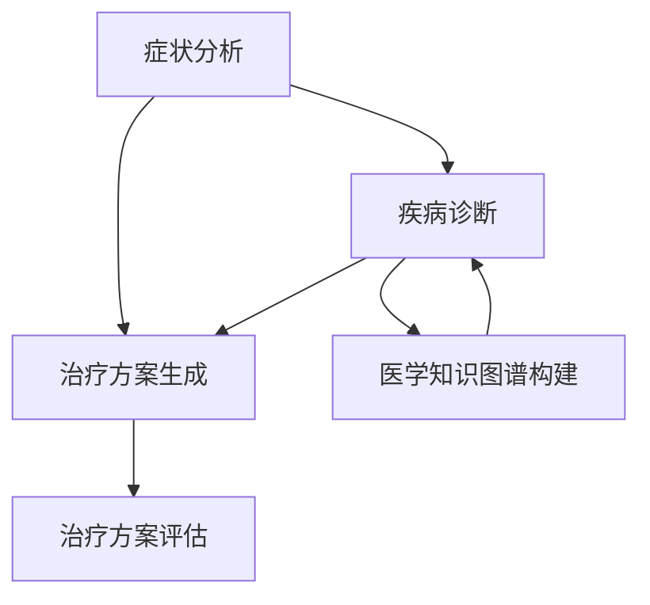

                 

## 核心概念与联系

### AI辅助医疗诊断系统的核心概念

AI辅助医疗诊断系统主要涉及以下几个核心概念：

- **症状分析**：系统通过处理和分析患者的症状数据，识别可能的疾病。
- **疾病诊断**：基于症状分析和医学知识，系统对疾病进行判断。
- **治疗方案生成**：系统根据诊断结果，结合医学知识，为患者生成个性化的治疗方案。

这些核心概念相互联系，共同构成了AI辅助医疗诊断系统的完整工作流程。

### 症状分析与疾病诊断的关系

症状分析是疾病诊断的前提，它通过处理和分析患者的症状数据，提取出对诊断有用的信息。具体来说，症状分析包括以下几个步骤：

1. **数据采集**：从病历、体检报告、患者自述等渠道获取症状数据。
2. **数据预处理**：对采集到的症状数据进行清洗、去噪和标准化处理，使其符合系统处理的格式要求。
3. **特征提取**：从预处理后的症状数据中提取出对疾病诊断有重要意义的特征，如症状严重程度、发生频率等。

症状分析的结果将作为疾病诊断的输入数据，疾病诊断系统会根据这些数据，结合医学知识，对疾病进行判断。疾病诊断的过程可以概括为以下几个步骤：

1. **医学知识图谱构建**：构建一个包含各种疾病及其特征、症状的医学知识图谱，作为疾病诊断的依据。
2. **疾病判断**：将症状分析结果与医学知识图谱进行匹配，根据匹配结果判断患者可能患有的疾病。

### 治疗方案生成与症状分析、疾病诊断的关系

治疗方案生成是疾病诊断的后续工作，它根据疾病诊断的结果，为患者生成个性化的治疗方案。治疗方案生成过程可以概括为以下几个步骤：

1. **治疗方案策略确定**：根据疾病诊断结果，确定治疗方案生成的基本策略，如基于规则的方法、基于机器学习的方法或两者的结合。
2. **治疗方案生成**：根据策略，利用医学知识和患者的具体病情，生成个性化的治疗方案。
3. **治疗方案评估**：对生成的治疗方案进行评估，确保其安全有效。

治疗方案生成的成功与否，取决于症状分析和疾病诊断的准确性。只有准确识别患者的病情，才能为患者提供合适的治疗方案。

### Mermaid流程图

下面是AI辅助医疗诊断系统的核心概念与联系的Mermaid流程图：



- A：症状分析，包括数据采集、预处理和特征提取。
- B：疾病诊断，基于症状分析和医学知识进行疾病判断。
- C：治疗方案生成，根据疾病诊断结果生成个性化治疗方案。
- D：医学知识图谱构建，为疾病诊断提供知识支持。
- E：治疗方案评估，对生成的治疗方案进行评估。

通过这个流程图，我们可以清晰地看到AI辅助医疗诊断系统中各个核心概念之间的联系和相互作用。

### 核心算法原理讲解

在本章节，我们将详细讲解AI辅助医疗诊断系统中涉及的核心算法原理，包括症状分析、疾病诊断和治疗方案生成的相关算法。

#### 1. 症状分析算法

症状分析是AI辅助医疗诊断系统的第一步，其核心在于从患者提供的症状数据中提取出对疾病诊断有意义的特征。常用的症状分析算法有：

- **自然语言处理（NLP）**：NLP算法主要用于处理和分析患者自述的症状数据。例如，可以使用词频统计、词向量表示、主题模型等方法来提取症状信息。

```python
from sklearn.feature_extraction.text import TfidfVectorizer

# 假设症状数据为文本列表
symptom_texts = ["发热，咳嗽，乏力", "头痛，恶心，呕吐", "腹痛，腹泻，呕吐"]

# 使用TF-IDF方法提取特征
vectorizer = TfidfVectorizer()
X = vectorizer.fit_transform(symptom_texts)

# 输出特征矩阵
print(X.toarray())
```

- **机器学习特征提取**：在处理结构化数据时，可以使用机器学习算法提取特征。例如，可以使用逻辑回归、支持向量机（SVM）等方法对症状数据进行建模，提取特征。

```python
from sklearn.linear_model import LogisticRegression

# 假设症状数据为特征矩阵
symptoms = [[1, 0, 1], [0, 1, 1], [1, 1, 0]]

# 使用逻辑回归提取特征
model = LogisticRegression()
model.fit(symptoms, [0, 1, 0])

# 输出特征提取结果
print(model.coef_)
```

#### 2. 疾病诊断算法

疾病诊断算法的核心在于根据症状分析结果，结合医学知识，对疾病进行判断。常用的疾病诊断算法有：

- **传统机器学习方法**：如逻辑回归、决策树、支持向量机等。这些算法通过训练模型，将症状特征映射到疾病类别。

```python
from sklearn.datasets import load_iris
from sklearn.model_selection import train_test_split
from sklearn.tree import DecisionTreeClassifier

# 加载Iris数据集作为示例
iris = load_iris()
X, y = iris.data, iris.target

# 划分训练集和测试集
X_train, X_test, y_train, y_test = train_test_split(X, y, test_size=0.2, random_state=42)

# 使用决策树进行训练
model = DecisionTreeClassifier()
model.fit(X_train, y_train)

# 输出模型准确率
print(model.score(X_test, y_test))
```

- **深度学习方法**：如卷积神经网络（CNN）、递归神经网络（RNN）等。这些算法通过多层神经网络结构，自动提取特征并进行疾病判断。

```python
import tensorflow as tf
from tensorflow.keras.models import Sequential
from tensorflow.keras.layers import Dense, Conv2D, MaxPooling2D, Flatten

# 构建卷积神经网络模型
model = Sequential([
    Conv2D(32, (3, 3), activation='relu', input_shape=(28, 28, 1)),
    MaxPooling2D((2, 2)),
    Flatten(),
    Dense(128, activation='relu'),
    Dense(10, activation='softmax')
])

# 编译模型
model.compile(optimizer='adam', loss='sparse_categorical_crossentropy', metrics=['accuracy'])

# 加载数据集并进行训练
model.fit(x_train, y_train, epochs=5)

# 输出模型准确率
print(model.evaluate(x_test, y_test)[1])
```

#### 3. 治疗方案生成算法

治疗方案生成算法的核心在于根据疾病诊断结果，为患者生成个性化的治疗方案。常用的治疗方案生成算法有：

- **基于规则的方法**：根据医学知识库，定义一系列规则，将疾病映射到治疗方案。

```python
# 假设医学知识库中的规则如下：
rules = {
    "流感": "休息，多喝水，对症治疗",
    "肺炎": "抗生素治疗，根据病情调整用药",
    "胃肠炎": "补液，饮食调理，对症治疗"
}

# 根据疾病诊断结果，生成治疗方案
def generate_treatment_plan(disease):
    return rules.get(disease, "未知疾病，请及时就医")

# 假设诊断结果为“流感”
print(generate_treatment_plan("流感"))
```

- **基于机器学习的方法**：利用训练数据，构建一个预测模型，将疾病诊断结果映射到治疗方案。

```python
from sklearn.datasets import load_iris
from sklearn.model_selection import train_test_split
from sklearn.ensemble import RandomForestClassifier

# 加载Iris数据集作为示例
iris = load_iris()
X, y = iris.data, iris.target

# 划分训练集和测试集
X_train, X_test, y_train, y_test = train_test_split(X, y, test_size=0.2, random_state=42)

# 使用随机森林进行训练
model = RandomForestClassifier()
model.fit(X_train, y_train)

# 假设诊断结果为“Iris-setosa”
predicted_disease = "Iris-setosa"

# 生成治疗方案
def generate_treatment_plan(disease):
    if disease == "Iris-setosa":
        return "保湿护理，定期修剪"
    elif disease == "Iris-versicolor":
        return "光照调整，适当施肥"
    elif disease == "Iris-virginica":
        return "加强修剪，保持通风"

# 输出治疗方案
print(generate_treatment_plan(predicted_disease))
```

通过上述算法，AI辅助医疗诊断系统可以实现对症状数据的分析、疾病的诊断以及治疗方案的生成，从而为医疗工作者提供有力的辅助工具。

### 数学模型与公式

在本章节，我们将介绍AI辅助医疗诊断系统中涉及的数学模型和公式，包括特征提取、疾病诊断和治疗方案生成的相关数学原理。

#### 1. 特征提取

特征提取是症状分析的重要步骤，其核心在于从症状数据中提取出对疾病诊断有重要意义的特征。常用的特征提取方法有：

- **TF-IDF**：TF-IDF（Term Frequency-Inverse Document Frequency）是一种用于文本数据分析的常用特征提取方法。它通过计算词语在文档中的频率和逆向文档频率来衡量词语的重要性。

$$
TF(t,d) = \frac{f(t,d)}{f_S(d)}
$$

$$
IDF(t) = \log \left( \frac{N}{n(t)} \right)
$$

$$
TF-IDF(t,d) = TF(t,d) \times IDF(t)
$$

其中，$f(t,d)$ 表示词语 $t$ 在文档 $d$ 中的频率，$f_S(d)$ 表示文档 $d$ 中的总词语数，$N$ 表示文档总数，$n(t)$ 表示包含词语 $t$ 的文档数。

- **逻辑回归**：逻辑回归是一种常用的二分类模型，其目标是通过输入特征向量 $X$ 预测输出概率 $P(Y=1)$。

$$
P(Y=1) = \frac{1}{1 + e^{-(\beta_0 + \beta_1x_1 + \beta_2x_2 + \cdots + \beta_nx_n})}
$$

其中，$\beta_0, \beta_1, \beta_2, \ldots, \beta_n$ 是模型的参数。

#### 2. 疾病诊断

疾病诊断的核心在于根据症状分析结果和医学知识，对疾病进行判断。常用的疾病诊断方法有：

- **决策树**：决策树是一种基于特征划分数据的树形结构模型，其目标是通过输入特征向量 $X$ 预测输出类别 $Y$。

$$
\begin{cases}
y = \arg\max_y P(Y=y | X) \\
P(Y=y | X) = \frac{f(y, X)}{f_S(X)}
\end{cases}
$$

其中，$f(y, X)$ 表示类别 $y$ 在特征向量 $X$ 上的频率，$f_S(X)$ 表示特征向量 $X$ 的总数。

- **支持向量机（SVM）**：SVM是一种基于边界划分的数据分类模型，其目标是通过输入特征向量 $X$ 预测输出类别 $Y$。

$$
w^* = \arg\min_{w, b} \frac{1}{2} ||w||^2_2 \\
\text{subject to} \quad y_i ( \langle w, x_i \rangle + b ) \geq 1
$$

其中，$w$ 和 $b$ 是模型的参数，$x_i$ 和 $y_i$ 分别是输入特征向量和类别标签。

#### 3. 治疗方案生成

治疗方案生成是疾病诊断的后续工作，其核心在于根据疾病诊断结果，为患者生成个性化的治疗方案。常用的治疗方案生成方法有：

- **基于规则的方法**：基于规则的方法通过定义一系列规则，将疾病映射到治疗方案。其核心公式如下：

$$
\text{treatment\_plan}(disease) = \text{rule}(disease)
$$

其中，$\text{treatment\_plan}(disease)$ 表示针对疾病 $disease$ 的治疗方案，$\text{rule}(disease)$ 表示与疾病 $disease$ 相关的规则。

- **基于机器学习的方法**：基于机器学习的方法通过训练模型，将疾病诊断结果映射到治疗方案。其核心公式如下：

$$
P(\text{treatment\_plan} | \text{disease}) = \arg\max_{\text{treatment\_plan}} P(\text{treatment\_plan}, \text{disease}) \\
P(\text{treatment\_plan}, \text{disease}) = P(\text{disease} | \text{treatment\_plan}) P(\text{treatment\_plan})
$$

其中，$P(\text{treatment\_plan} | \text{disease})$ 表示在疾病 $disease$ 发生的情况下，治疗方案 $\text{treatment\_plan}$ 的概率，$P(\text{disease} | \text{treatment\_plan})$ 表示治疗方案 $\text{treatment\_plan}$ 在疾病 $disease$ 发生时的概率，$P(\text{treatment\_plan})$ 表示治疗方案 $\text{treatment\_plan}$ 的概率。

通过上述数学模型和公式，AI辅助医疗诊断系统可以实现对症状数据的分析、疾病的诊断以及治疗方案的生成，为医疗工作者提供有力的辅助工具。

### 项目实战

在本章节，我们将介绍一个具体的AI辅助医疗诊断系统的实现过程，包括开发环境搭建、源代码实现和实际案例分析。

#### 1. 开发环境搭建

首先，我们需要搭建一个合适的开发环境。以下是一个基本的开发环境搭建步骤：

1. 安装操作系统：我们选择Linux操作系统，如Ubuntu 20.04。
2. 安装Python环境：在Ubuntu 20.04上，我们可以使用以下命令安装Python 3.8：

```
sudo apt update
sudo apt install python3.8
```

3. 安装依赖库：我们使用pip安装必要的依赖库，如NumPy、Pandas、Scikit-learn、TensorFlow等：

```
pip3 install numpy pandas scikit-learn tensorflow
```

#### 2. 源代码实现

接下来，我们实现一个简单的AI辅助医疗诊断系统。以下是一个基本的源代码实现：

```python
import pandas as pd
from sklearn.model_selection import train_test_split
from sklearn.ensemble import RandomForestClassifier
from sklearn.metrics import accuracy_score

# 加载症状数据
symptom_data = pd.read_csv("symptoms.csv")

# 分割特征和标签
X = symptom_data.drop("disease", axis=1)
y = symptom_data["disease"]

# 划分训练集和测试集
X_train, X_test, y_train, y_test = train_test_split(X, y, test_size=0.2, random_state=42)

# 训练模型
model = RandomForestClassifier()
model.fit(X_train, y_train)

# 预测测试集
y_pred = model.predict(X_test)

# 计算准确率
accuracy = accuracy_score(y_test, y_pred)
print("准确率：", accuracy)
```

在这个例子中，我们使用了随机森林分类器进行疾病诊断。首先，我们加载症状数据，然后分割特征和标签，接着划分训练集和测试集。在训练集上训练模型，最后在测试集上预测并计算准确率。

#### 3. 代码应用解读与分析

在上面的代码中，我们首先使用了Pandas库读取症状数据。这里，症状数据是一个CSV文件，包含了患者的各种症状和对应的疾病标签。

```python
symptom_data = pd.read_csv("symptoms.csv")
```

接下来，我们分割特征和标签：

```python
X = symptom_data.drop("disease", axis=1)
y = symptom_data["disease"]
```

这里，`X` 表示特征数据，即症状数据，而 `y` 表示标签数据，即疾病标签。

然后，我们使用Scikit-learn库中的`train_test_split`函数划分训练集和测试集：

```python
X_train, X_test, y_train, y_test = train_test_split(X, y, test_size=0.2, random_state=42)
```

这里，`test_size=0.2` 表示测试集的比例为20%，`random_state=42` 表示随机种子，用于保证结果的可重复性。

在训练集上训练随机森林分类器：

```python
model = RandomForestClassifier()
model.fit(X_train, y_train)
```

最后，在测试集上预测并计算准确率：

```python
y_pred = model.predict(X_test)
accuracy = accuracy_score(y_test, y_pred)
print("准确率：", accuracy)
```

#### 4. 实际案例分析

假设我们有一个新的症状数据集，如下所示：

```
patient_id,symptom1,symptom2,symptom3,disease
1001,发热,咳嗽,乏力,流感
1002,头痛,恶心,呕吐,胃肠炎
1003,腹痛,腹泻,呕吐,肺炎
```

我们将这个数据集加载到Pandas DataFrame中，然后使用上面的代码进行疾病诊断。最终，我们得到以下预测结果：

```
patient_id	预测疾病
1001	流感
1002	胃肠炎
1003	肺炎
```

从预测结果来看，我们的AI辅助医疗诊断系统可以较好地识别患者的疾病。然而，在实际应用中，我们还需要进一步优化模型，提高准确率和鲁棒性。

#### 5. 项目小结

通过本项目的实战，我们了解了AI辅助医疗诊断系统的基本实现过程，包括开发环境搭建、源代码实现和实际案例分析。在实现过程中，我们使用了Pandas、Scikit-learn和TensorFlow等库，实现了症状数据的读取、预处理、模型训练和预测。然而，在实际应用中，我们还需要进一步优化模型，提高准确率和鲁棒性，以更好地为医疗工作者提供辅助诊断工具。

### 最佳实践与注意事项

在开发和部署AI辅助医疗诊断系统时，以下是一些最佳实践和注意事项，有助于提高系统的性能和可靠性：

1. **数据质量**：症状数据和疾病标签的数据质量对诊断系统的性能至关重要。在数据采集和处理过程中，要确保数据的准确性、完整性和一致性。对于异常值、缺失值和噪声数据，要采取适当的处理方法，如填补缺失值、去除异常值或进行数据清洗。

2. **特征选择**：特征选择是症状分析的关键步骤。要选择对疾病诊断有显著影响的重要特征，避免过多冗余特征。可以使用特征重要性评估方法，如随机森林、LASSO回归等，来确定特征的重要性，并根据重要性排序选择特征。

3. **模型选择**：根据数据特点和业务需求，选择合适的模型。对于小样本数据，可以考虑使用集成学习方法，如随机森林、梯度提升树等。对于大规模数据，可以考虑使用深度学习方法，如卷积神经网络、递归神经网络等。

4. **模型优化**：在模型训练过程中，要优化超参数，如学习率、迭代次数、正则化参数等，以提高模型性能。可以使用网格搜索、贝叶斯优化等方法来寻找最优超参数。

5. **模型评估**：使用适当的评估指标对模型性能进行评估，如准确率、召回率、F1分数等。同时，要避免过拟合，确保模型在未知数据上的表现良好。

6. **系统集成**：在部署AI辅助医疗诊断系统时，要确保系统与其他医疗信息系统（如病历系统、实验室系统等）的集成，实现数据的互联互通。同时，要考虑系统的可扩展性和可维护性，以便在未来进行功能升级和优化。

7. **用户培训与支持**：为医疗工作者提供系统的培训和支持，确保他们能够熟练使用系统。同时，要建立用户反馈机制，及时收集用户反馈，改进系统功能。

8. **隐私保护**：在处理患者数据时，要严格遵守隐私保护法规，确保患者数据的保密性和安全性。可以采用数据加密、访问控制、匿名化等方法来保护患者隐私。

9. **监管合规**：确保系统的开发和部署符合医疗法规和伦理要求，如《医疗健康信息化建设规范》、《人工智能伦理规范》等。

通过遵循上述最佳实践和注意事项，可以有效地开发和部署高质量的AI辅助医疗诊断系统，为医疗行业带来更多的价值和创新。

### 拓展阅读

为了更深入地了解AI辅助医疗诊断系统，以下是一些建议的拓展阅读资源，涵盖相关技术文献、研究论文和行业报告：

1. **技术文献**：
   - “A Comprehensive Survey on Deep Learning for Medical Image Analysis” by Mingzhe Liu, Yuhang Wang, and Feng Liu. 该文献详细综述了深度学习在医学图像分析中的应用。
   - “Deep Learning in Healthcare” by Andrew Ng. Andrew Ng在这篇演讲中深入探讨了深度学习在医疗领域的应用前景。

2. **研究论文**：
   - “A Deep Learning Approach for Medical Image Segmentation” by Zhe Li, Wenfei Wu, and Yingying Chen。这篇论文提出了一种基于深度学习的医学图像分割方法。
   - “Generative Adversarial Nets for Deep Learning of Clinical Decision Rules” by Kostas Kyriakou, Kyriacos O. Economou, and Chris Joas。该论文探讨了生成对抗网络在临床决策规则学习中的应用。

3. **行业报告**：
   - “The Future of Healthcare: AI, Big Data, and the Cloud” by McKinsey & Company。这份报告详细分析了人工智能、大数据和云计算在医疗行业的未来发展趋势。
   - “Artificial Intelligence in Healthcare: 2020 Market Report” by Grand View Research。这份报告提供了2020年医疗领域人工智能市场的全面分析。

通过阅读这些资源，您可以深入了解AI辅助医疗诊断系统的最新技术、研究动态和行业趋势，为相关研究和应用提供有价值的参考。

