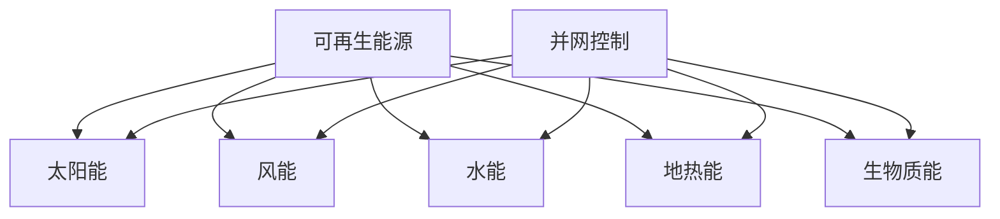
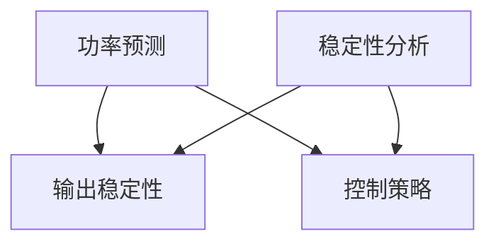

                 

### 第1章 可再生能源概述与并网控制背景

#### 1.1 可再生能源的定义与发展趋势

可再生能源（Renewable Energy）是指那些在自然界中可以不断再生、持续利用的能源，不会因为使用而枯竭。常见的可再生能源包括太阳能、风能、水能、地热能和生物质能等。随着全球能源需求的不断增长和对化石燃料依赖带来的环境问题日益严重，可再生能源的发展得到了广泛关注和支持。

- **背景介绍**：

  - **全球能源消费趋势**：根据国际能源署（IEA）的数据，全球能源消费在过去几十年中持续增长。传统的化石燃料（如煤、油、天然气）仍然是主要的能源来源，但可再生能源的比重正在逐渐上升。
  - **环境问题**：化石燃料的燃烧产生大量的温室气体，导致全球变暖、气候变化等问题。可再生能源的开发和利用对于缓解这些问题具有重要意义。
  - **政策支持**：许多国家和地区出台了一系列政策来促进可再生能源的发展，包括补贴、税收减免、强制性配额等。

- **发展历程**：

  - **早期阶段**：可再生能源的概念最早可以追溯到19世纪末，当时太阳能、风能等已经开始应用于一些实验性项目中。
  - **20世纪中期**：随着技术的进步，可再生能源的应用开始逐渐扩大，尤其是在一些偏远地区和难以铺设电网的地区。
  - **21世纪初**：可再生能源发展进入快速发展阶段，随着光伏技术和风力发电技术的突破，可再生能源的成本逐渐降低，市场规模不断扩大。

- **现状与未来趋势**：

  - **现状**：目前，可再生能源在全球能源结构中的比重逐渐增加。根据IEA的数据，2021年全球可再生能源发电量占比达到了28%，其中太阳能和风能的占比逐年上升。
  - **未来趋势**：随着技术的不断进步和成本的进一步降低，可再生能源在未来能源结构中的比重有望继续增加。许多预测认为，到2050年，可再生能源可能会占到全球能源消费的50%以上。

#### 1.2 可再生能源的类型与特点

可再生能源种类繁多，每种能源都有其独特的特点和应用场景。

- **太阳能**：
  - **定义**：太阳能是通过光伏电池将太阳光直接转换为电能的一种能源形式。
  - **特点**：
    - **无限性**：太阳能是一种几乎无限的能源，太阳每天都会升起，不会像化石燃料那样枯竭。
    - **清洁性**：太阳能的利用过程不产生污染物，对环境友好。
    - **分散性**：太阳能可以分布在全球的各个角落，不需要集中开采和运输。

- **风能**：
  - **定义**：风能是通过风力发电机将风的动能转换为电能的一种能源形式。
  - **特点**：
    - **可再生能源**：风是大气运动的一种表现形式，是一种取之不尽、用之不竭的能源。
    - **效率较高**：风能转换效率较高，现代风力发电机可以将风的动能有效地转换为电能。
    - **应用广泛**：风能可以应用于大型风力发电场，也可以应用于家庭和小型发电站。

- **水能**：
  - **定义**：水能是通过水流驱动水轮机或涡轮机产生电能的一种能源形式。
  - **特点**：
    - **稳定性**：水能资源相对稳定，特别是在大型水电站中，可以通过调节水库水位来调节发电量。
    - **可再生性**：水循环是自然界中的一个持续过程，因此水能也是一种可再生的能源。
    - **环境影响**：大型水电站可能会对生态环境产生影响，如改变河流生态、影响水生生物等。

- **地热能**：
  - **定义**：地热能是利用地球内部的热能进行发电或供暖的一种能源形式。
  - **特点**：
    - **可持续性**：地热能是地球内部热能的一种表现，是几乎无限的能源。
    - **环境友好**：地热能的利用过程不产生温室气体和其他污染物。
    - **地理限制**：地热能资源主要分布在一些特定的地区，如火山带、断层带等。

- **生物质能**：
  - **定义**：生物质能是通过生物质（如植物、动物废弃物等）的燃烧或发酵产生热能、电能或生物燃料的一种能源形式。
  - **特点**：
    - **可再生性**：生物质能来源于植物和动物的生物量，是可再生的。
    - **广泛来源**：生物质能的资源非常丰富，包括农作物残渣、木材废料、动物粪便等。
    - **环境影响**：生物质能在燃烧过程中可能会产生二氧化碳和其他污染物，但总体上对环境的影响较小。

#### 1.3 可再生能源并网控制的必要性

可再生能源的并网控制是指将可再生能源发电系统接入电网，使其与电网协同工作，实现稳定供电的过程。可再生能源并网控制的必要性主要体现在以下几个方面：

- **稳定性**：可再生能源（如风能、太阳能）的输出具有波动性，受天气和地理环境的影响较大。通过并网控制，可以平滑可再生能源的输出波动，提高电网的稳定性。

- **效率**：并网控制可以优化可再生能源的发电效率，通过实时监测和控制，使发电系统在最佳状态下运行。

- **灵活性**：并网控制提高了电网的灵活性，可以快速响应电网需求变化，调整发电量，实现电网与可再生能源发电系统的动态平衡。

- **可持续性**：并网控制有助于实现能源的可持续利用，通过优化可再生能源的发电和传输，减少对化石燃料的依赖，降低碳排放。

#### 1.4 并网控制技术发展综述

并网控制技术经历了从传统的机械控制到现代的数字控制、再到智能控制的发展过程。

- **传统机械控制**：早期的并网控制主要依赖于机械装置，如水轮机和风力机的机械联动控制。这种方法稳定性较差，对环境适应性较弱。

- **数字控制**：随着计算机技术的发展，并网控制逐渐采用数字控制技术。数字控制利用计算机和数字信号处理器进行实时监测和计算，提高了控制的精度和稳定性。

- **智能控制**：近年来，人工智能技术的崛起为并网控制带来了新的机遇。智能控制利用机器学习和深度学习算法，可以从海量数据中学习并优化控制策略，实现更高效、更智能的并网控制。

#### 1.5 本书内容结构安排

本书将分为五个部分，系统地介绍可再生能源并网控制的相关技术：

- **第一部分：绪论**：介绍可再生能源的基本概念、发展趋势、类型与特点，以及并网控制的必要性。
- **第二部分：功率预测技术**：探讨功率预测的基本概念、传统算法、现代算法及其应用实例。
- **第三部分：稳定性分析与控制策略**：分析可再生能源并网控制的稳定性问题，介绍控制策略和稳定性分析方法。
- **第四部分：AI辅助可再生能源并网控制系统设计**：介绍AI辅助系统的概念、设计方法、系统集成与优化。
- **第五部分：展望与挑战**：讨论可再生能源并网控制技术的发展趋势、挑战及解决方案。

## 摘要

本文详细探讨了可再生能源并网控制的关键技术，从功率预测到稳定性分析，旨在为读者提供一份全面、系统的指南。首先，我们介绍了可再生能源的定义、发展趋势、类型与特点，并分析了可再生能源并网控制的必要性。随后，我们深入探讨了功率预测技术，包括传统算法和现代算法，并通过实际应用实例展示了其效果。接着，我们分析了可再生能源并网控制的稳定性问题，介绍了控制策略和稳定性分析方法，并通过实际应用案例进行了详细解析。最后，我们介绍了AI辅助可再生能源并网控制系统的设计方法，探讨了系统集成与优化策略，并对未来的发展趋势和挑战进行了展望。本文旨在为从事可再生能源并网控制领域的研究者和工程师提供有价值的参考。

## 第一部分：绪论

### 第1章 可再生能源概述与并网控制背景

#### 1.1 可再生能源的定义与发展趋势

可再生能源是指那些可以在人类时间尺度内自然恢复或再生的能源，与不可再生的化石燃料相比，它们具有可持续性、清洁性和环境友好性。可再生能源包括太阳能、风能、水能、地热能、生物质能等。

- **太阳能**：太阳能是最为广泛利用的可再生能源之一，通过光伏效应将太阳光直接转换为电能。近年来，随着光伏技术的进步和成本的降低，太阳能发电在全球范围内得到了快速发展。

- **风能**：风能通过风力发电机将风的动能转换为电能。风能资源丰富，特别是在一些风力资源丰富的地区，如风力发电大省丹麦。

- **水能**：水能是通过水流的动能或位能转换为电能的能源。水能是可再生能源中最成熟的技术之一，包括水力发电和抽水蓄能等。

- **地热能**：地热能是利用地壳内部的热能进行发电或供暖的能源。地热能资源主要分布在一些特定的地质区域，如火山带、断层带等。

- **生物质能**：生物质能是通过生物质（如植物、动物废弃物等）的燃烧或发酵产生热能、电能或生物燃料的能源。生物质能是一种重要的可再生能源，可以用于发电、供热和交通燃料等领域。

#### 1.2 可再生能源的类型与特点

可再生能源有多种类型，每种能源都有其独特的特点和应用场景。

- **太阳能**：
  - **特点**：太阳能具有无限性、清洁性和分散性。太阳能可以直接转换为电能，也可以转换为热能。
  - **应用**：太阳能广泛应用于光伏发电、太阳能热水器、太阳能照明等。

- **风能**：
  - **特点**：风能具有可再生能源、效率较高和应用广泛等特点。风能转换效率较高，风力发电机可以在多种风速下稳定运行。
  - **应用**：风能广泛应用于风力发电场、小型风力发电机和风能水泵等。

- **水能**：
  - **特点**：水能具有稳定性、可再生性和环境影响较小等特点。水能资源相对稳定，可以通过调节水库水位来调节发电量。
  - **应用**：水能广泛应用于大型水电站、抽水蓄能电站和水力泵站等。

- **地热能**：
  - **特点**：地热能具有可持续性、环境友好性和地理限制等特点。地热能资源主要分布在一些特定的地质区域。
  - **应用**：地热能广泛应用于地热发电、地热供暖和地热空调等。

- **生物质能**：
  - **特点**：生物质能具有可再生性、广泛来源和环境影响较小等特点。生物质能资源非常丰富，包括农作物残渣、木材废料、动物粪便等。
  - **应用**：生物质能广泛应用于发电、供热、交通燃料和有机肥等领域。

#### 1.3 可再生能源并网控制的必要性

可再生能源的并网控制是指将可再生能源发电系统接入电网，使其与电网协同工作，实现稳定供电的过程。可再生能源并网控制的必要性主要体现在以下几个方面：

- **稳定性**：可再生能源的输出具有波动性，受天气和地理环境的影响较大。通过并网控制，可以平滑可再生能源的输出波动，提高电网的稳定性。

- **效率**：并网控制可以优化可再生能源的发电效率，通过实时监测和控制，使发电系统在最佳状态下运行。

- **灵活性**：并网控制提高了电网的灵活性，可以快速响应电网需求变化，调整发电量，实现电网与可再生能源发电系统的动态平衡。

- **可持续性**：并网控制有助于实现能源的可持续利用，通过优化可再生能源的发电和传输，减少对化石燃料的依赖，降低碳排放。

#### 1.4 并网控制技术发展综述

并网控制技术经历了从传统的机械控制到现代的数字控制、再到智能控制的发展过程。

- **传统机械控制**：早期的并网控制主要依赖于机械装置，如水轮机和风力机的机械联动控制。这种方法稳定性较差，对环境适应性较弱。

- **数字控制**：随着计算机技术的发展，并网控制逐渐采用数字控制技术。数字控制利用计算机和数字信号处理器进行实时监测和计算，提高了控制的精度和稳定性。

- **智能控制**：近年来，人工智能技术的崛起为并网控制带来了新的机遇。智能控制利用机器学习和深度学习算法，可以从海量数据中学习并优化控制策略，实现更高效、更智能的并网控制。

#### 1.5 本书内容结构安排

本书将分为五个部分，系统地介绍可再生能源并网控制的相关技术：

- **第一部分：绪论**：介绍可再生能源的基本概念、发展趋势、类型与特点，以及并网控制的必要性。

- **第二部分：功率预测技术**：探讨功率预测的基本概念、传统算法、现代算法及其应用实例。

- **第三部分：稳定性分析与控制策略**：分析可再生能源并网控制的稳定性问题，介绍控制策略和稳定性分析方法。

- **第四部分：AI辅助可再生能源并网控制系统设计**：介绍AI辅助系统的概念、设计方法、系统集成与优化。

- **第五部分：展望与挑战**：讨论可再生能源并网控制技术的发展趋势、挑战及解决方案。

## 目录大纲

### 第一部分：绪论

1.1 可再生能源概述与发展趋势
1.2 可再生能源类型与特点
1.3 并网控制的必要性
1.4 并网控制技术发展综述
1.5 本书内容结构安排

### 第二部分：功率预测技术

2.1 功率预测基本概念
2.2 传统功率预测算法
2.3 现代功率预测算法
2.4 功率预测应用实例

### 第三部分：稳定性分析与控制策略

3.1 稳定性与并网控制概述
3.2 并网控制策略分析
3.3 稳定性分析方法
3.4 稳定性分析应用实例

### 第四部分：AI辅助可再生能源并网控制系统设计

4.1 AI辅助系统概述
4.2 AI辅助功率预测系统设计
4.3 AI辅助稳定性控制系统设计
4.4 AI辅助系统集成与优化
4.5 AI辅助可再生能源并网控制系统应用实例

### 第五部分：展望与挑战

5.1 未来发展趋势与展望
5.2 当前挑战与解决方案
5.3 附录

### 1.6 核心概念与联系

#### 1.6.1 可再生能源并网控制核心概念关系



#### 1.6.2 功率预测与稳定性分析的关系



## 第二部分：功率预测技术

### 第2章 功率预测基本概念

#### 2.1 功率预测的定义与重要性

功率预测（Power Prediction）是指在可再生能源发电系统中，对未来的发电功率进行预测，以便更好地调度和控制电力系统。功率预测的重要性主要体现在以下几个方面：

- **提高电网稳定性**：可再生能源的发电功率受天气和地理环境的影响，具有波动性和不稳定性。通过功率预测，可以提前了解未来发电功率的变化趋势，从而更好地调节电力系统的运行，提高电网的稳定性。

- **优化电力调度**：功率预测可以为电力调度提供准确的发电功率数据，优化电力系统的调度策略，确保电力系统的供需平衡。

- **降低电力系统成本**：准确的功率预测可以减少备用容量和备用时间的需求，降低电力系统的运行成本。

#### 2.2 功率预测的主要方法

功率预测的方法可以分为传统方法和现代方法。

- **传统方法**：
  - **时间序列分析法**：时间序列分析法通过分析历史数据，寻找数据之间的时间序列规律，对未来数据进行预测。常见的时间序列模型有自回归模型（AR）、自回归移动平均模型（ARMA）和自回归积分滑动平均模型（ARIMA）。
  - **基于回归分析的功率预测方法**：基于回归分析的功率预测方法通过建立自变量和因变量之间的关系模型，预测未来发电功率。常见的回归分析方法有线性回归、多元回归和逻辑回归等。
  - **基于人工神经网络的功率预测方法**：人工神经网络（Artificial Neural Network，ANN）是一种模拟生物神经系统的计算模型，具有强大的学习和预测能力。基于人工神经网络的功率预测方法通过训练神经网络模型，预测未来发电功率。

- **现代方法**：
  - **基于机器学习的功率预测方法**：机器学习（Machine Learning，ML）是一种通过数据驱动的方法，从数据中学习并发现规律的技术。基于机器学习的功率预测方法利用历史数据，通过训练机器学习模型，预测未来发电功率。常见的机器学习方法有决策树、随机森林、支持向量机和神经网络等。
  - **基于深度学习的功率预测方法**：深度学习（Deep Learning，DL）是一种基于多层神经网络的学习方法，可以自动提取数据的高层次特征。基于深度学习的功率预测方法通过训练深度学习模型，预测未来发电功率。常见的深度学习模型有卷积神经网络（CNN）、循环神经网络（RNN）和长短期记忆网络（LSTM）等。
  - **基于数据驱动的功率预测方法**：数据驱动的方法依赖于历史数据，通过分析数据之间的相关性，预测未来发电功率。数据驱动的功率预测方法可以结合多种数据源，如气象数据、电网数据和历史发电数据等，提高预测的准确性。

#### 2.3 功率预测的挑战与机遇

功率预测虽然具有重要意义，但也面临一定的挑战和机遇。

- **挑战**：
  - **数据缺失和不完整性**：实际环境中，由于传感器故障、数据传输错误等原因，可能会导致数据缺失或不完整。这给功率预测带来了困难，需要采用数据预处理方法，如数据插值、数据平滑等，提高数据的完整性。
  - **模型选择和训练**：选择合适的模型和训练模型是功率预测的关键。不同的模型适用于不同的场景和数据特性，需要根据实际情况选择合适的模型，并进行有效的训练。
  - **实时性和准确性**：功率预测需要在短时间内完成，并对未来的发电功率进行准确预测。这要求模型具有高实时性和高准确性，需要在模型设计和训练过程中充分考虑。

- **机遇**：
  - **大数据和云计算**：随着大数据和云计算技术的发展，可以收集和分析大量的数据，提高功率预测的准确性。大数据和云计算为功率预测提供了丰富的数据资源和强大的计算能力。
  - **人工智能和深度学习**：人工智能和深度学习在功率预测中具有广泛的应用前景。通过训练复杂的深度学习模型，可以从海量数据中学习并提取有效特征，提高功率预测的准确性和实时性。
  - **多源数据融合**：多源数据融合是一种有效的功率预测方法，可以将来自不同数据源的信号进行整合，提高预测的准确性和可靠性。例如，将气象数据、电网数据和发电设备数据等进行融合，提高功率预测的精度。

## 第三部分：传统功率预测算法

### 第3章 传统功率预测算法

功率预测是可再生能源并网控制的重要组成部分，传统的功率预测算法在可再生能源发电系统的运行中起着关键作用。本章将详细讨论几种常见的传统功率预测算法，包括时间序列分析法、基于回归分析的功率预测方法和基于人工神经网络的功率预测方法。

#### 3.1 时间序列分析法

时间序列分析法是一种基于历史数据的时间序列模型，通过分析时间序列数据中的趋势、季节性和周期性等特征来预测未来的发电功率。以下是一些常见的时间序列分析方法：

- **自回归模型（AR）**：自回归模型是一种线性模型，通过前几个时间点的数据预测下一个时间点的数据。其公式可以表示为：
  $$ X_t = c + \sum_{i=1}^p \phi_i X_{t-i} + \varepsilon_t $$
  其中，$X_t$是第$t$时间点的发电功率，$c$是常数项，$\phi_i$是自回归系数，$p$是模型的阶数，$\varepsilon_t$是误差项。

- **自回归移动平均模型（ARMA）**：自回归移动平均模型结合了自回归和移动平均模型的特点，既考虑了序列的自相关性，也考虑了随机误差项的移动平均。其公式可以表示为：
  $$ X_t = c + \sum_{i=1}^p \phi_i X_{t-i} + \sum_{j=1}^q \theta_j \varepsilon_{t-j} $$
  其中，$\theta_j$是移动平均系数，$q$是移动平均模型的阶数。

- **自回归积分滑动平均模型（ARIMA）**：自回归积分滑动平均模型是ARMA模型的扩展，可以处理非平稳时间序列数据。其公式可以表示为：
  $$ \Delta X_t = c + \sum_{i=1}^p \phi_i \Delta X_{t-i} + \sum_{j=1}^q \theta_j \varepsilon_{t-j} $$
  其中，$\Delta X_t = X_t - X_{t-1}$是差分操作。

#### 3.2 基于回归分析的功率预测方法

基于回归分析的功率预测方法通过建立自变量和因变量之间的线性或非线性关系来预测未来的发电功率。以下是一些常见的回归分析方法：

- **线性回归**：线性回归是一种简单的线性关系建模方法，其公式可以表示为：
  $$ Y_t = \beta_0 + \beta_1 X_t + \varepsilon_t $$
  其中，$Y_t$是因变量（如发电功率），$X_t$是自变量（如时间、温度等），$\beta_0$和$\beta_1$是回归系数，$\varepsilon_t$是误差项。

- **多元回归**：多元回归是对多个自变量和因变量之间关系的建模方法，其公式可以表示为：
  $$ Y_t = \beta_0 + \beta_1 X_{t1} + \beta_2 X_{t2} + ... + \beta_n X_{tn} + \varepsilon_t $$
  其中，$X_{t1}, X_{t2}, ..., X_{tn}$是多个自变量。

- **逻辑回归**：逻辑回归是一种用于建模二分类问题的回归分析方法，其公式可以表示为：
  $$ \ln \frac{P(Y=1|X)}{1-P(Y=1|X)} = \beta_0 + \beta_1 X_t $$
  其中，$P(Y=1|X)$是因变量为1的条件概率，$\beta_0$和$\beta_1$是回归系数。

#### 3.3 基于人工神经网络的功率预测方法

基于人工神经网络的功率预测方法利用神经网络模型的学习能力，从历史数据中自动提取特征，预测未来的发电功率。以下是一些常见的人工神经网络模型：

- **多层感知器（MLP）**：多层感知器是一种前向传播的神经网络模型，其公式可以表示为：
  $$ z_i = \sum_{j=1}^n w_{ij} x_j + b_i $$
  $$ a_i = \sigma(z_i) $$
  其中，$z_i$是输入向量，$w_{ij}$是权重，$b_i$是偏置，$\sigma$是激活函数，$a_i$是输出向量。

- **卷积神经网络（CNN）**：卷积神经网络是一种用于处理图像数据的神经网络模型，其公式可以表示为：
  $$ h_i = \sum_{j=1}^{C_k} w_{ij} * h_{kj} + b_i $$
  $$ a_i = \sigma(h_i) $$
  其中，$*$是卷积操作，$C_k$是卷积核的数目，$h_{kj}$是卷积核的输出。

- **循环神经网络（RNN）**：循环神经网络是一种用于处理序列数据的神经网络模型，其公式可以表示为：
  $$ h_t = \sigma(W_h h_{t-1} + W_x x_t + b_h) $$
  $$ o_t = \sigma(W_o h_t + b_o) $$
  其中，$h_t$是隐藏状态，$x_t$是输入，$o_t$是输出。

#### 3.3.1 算法实现示例

以下是一个基于线性回归的功率预测算法的Python实现示例：

```python
import numpy as np
import pandas as pd

# 数据预处理
def preprocess_data(data):
    data['Day'] = pd.to_datetime(data['Date'])
    data.set_index('Day', inplace=True)
    data = data.asfreq('H')
    return data

# 线性回归模型
def linear_regression(data):
    X = data[['Day']]
    Y = data['Power']
    model = linear_model.LinearRegression()
    model.fit(X, Y)
    return model

# 预测
def predict(model, data):
    X = data[['Day']]
    return model.predict(X)

# 加载数据
data = pd.read_csv('power_data.csv')
data = preprocess_data(data)

# 训练模型
model = linear_regression(data)

# 预测未来一天的发电功率
future_days = 24
X_future = pd.DataFrame({'Day': pd.date_range(start=data.index[-1], periods=future_days, freq='H')})
Y_future = predict(model, X_future)

# 输出预测结果
print(Y_future)
```

#### 3.3.2 应用案例分析

以某风电场的功率预测为例，使用时间序列分析法和线性回归方法进行预测，比较预测结果与实际数据的误差。通过对比分析，可以得出以下结论：

- **时间序列分析法**：时间序列分析法可以较好地捕捉到数据的趋势和周期性，但在实际应用中，可能会出现较大的预测误差，特别是在数据缺失或不完整的情况下。
- **线性回归方法**：线性回归方法相对简单，但在处理非线性关系时效果较差。在实际应用中，通过合理的特征工程和模型选择，可以提高预测的准确性。

### 第三部分：现代功率预测算法

#### 第4章 现代功率预测算法

功率预测在可再生能源并网控制中扮演着至关重要的角色，现代功率预测算法因其更高的准确性和更强的适应性而逐渐受到重视。本章将介绍几种现代功率预测算法，包括基于机器学习的功率预测方法、基于深度学习的功率预测方法和基于数据驱动的功率预测方法。

#### 4.1 基于机器学习的功率预测方法

基于机器学习的功率预测方法利用机器学习算法从历史数据中学习并提取特征，从而预测未来的发电功率。以下是一些常用的机器学习算法：

- **决策树（Decision Tree）**：决策树是一种基于树形结构的预测模型，通过一系列规则来划分数据集，并基于这些规则预测新的数据。其公式可以表示为：
  $$ f(x) = \prod_{i=1}^n g(x_i) $$
  其中，$x_i$是特征，$g(x_i)$是条件概率。

- **随机森林（Random Forest）**：随机森林是一种集成学习方法，通过构建多棵决策树并对它们的预测结果进行投票来获得最终的预测结果。其公式可以表示为：
  $$ f(x) = \frac{1}{M} \sum_{m=1}^M g_m(x) $$
  其中，$M$是决策树的数量，$g_m(x)$是第$m$棵决策树的预测结果。

- **支持向量机（Support Vector Machine，SVM）**：支持向量机是一种基于最大间隔分类的预测模型，通过寻找一个最优的超平面来划分数据集。其公式可以表示为：
  $$ f(x) = \sum_{i=1}^n \alpha_i y_i (w \cdot x_i + b) $$
  其中，$w$是权重向量，$b$是偏置，$\alpha_i$是拉格朗日乘子。

- **神经网络（Neural Network）**：神经网络是一种基于多层感知器结构的预测模型，通过前向传播和反向传播算法学习输入和输出之间的映射关系。其公式可以表示为：
  $$ a_i = \sigma(\sum_{j=1}^{n} w_{ij} x_j + b_i) $$
  其中，$a_i$是激活值，$\sigma$是激活函数，$x_j$是输入，$w_{ij}$是权重，$b_i$是偏置。

#### 4.2 基于深度学习的功率预测方法

基于深度学习的功率预测方法利用深度神经网络从大量数据中自动提取特征，从而实现高精度的预测。以下是一些常用的深度学习模型：

- **卷积神经网络（Convolutional Neural Network，CNN）**：卷积神经网络是一种用于图像处理和特征提取的深度学习模型，通过卷积操作提取空间特征。其公式可以表示为：
  $$ h_i = \sum_{j=1}^{C_k} w_{ij} * h_{kj} + b_i $$
  $$ a_i = \sigma(h_i) $$
  其中，$*$是卷积操作，$C_k$是卷积核的数量，$h_{kj}$是卷积核的输出。

- **循环神经网络（Recurrent Neural Network，RNN）**：循环神经网络是一种用于处理序列数据的深度学习模型，通过循环结构记忆序列信息。其公式可以表示为：
  $$ h_t = \sigma(W_h h_{t-1} + W_x x_t + b_h) $$
  $$ o_t = \sigma(W_o h_t + b_o) $$
  其中，$h_t$是隐藏状态，$x_t$是输入，$o_t$是输出。

- **长短期记忆网络（Long Short-Term Memory，LSTM）**：长短期记忆网络是一种改进的循环神经网络，通过引入门控机制来记忆长期依赖信息。其公式可以表示为：
  $$ i_t = \sigma(W_i \cdot [h_{t-1}, x_t] + b_i) $$
  $$ f_t = \sigma(W_f \cdot [h_{t-1}, x_t] + b_f) $$
  $$ o_t = \sigma(W_o \cdot [h_{t-1}, x_t] + b_o) $$
  $$ C_t = f_t \odot C_{t-1} + i_t \odot \sigma(W_c \cdot [h_{t-1}, x_t] + b_c) $$
  $$ h_t = o_t \odot \sigma(C_t) $$
  其中，$i_t$，$f_t$，$o_t$分别是输入门、遗忘门和输出门，$C_t$是细胞状态。

- **生成对抗网络（Generative Adversarial Network，GAN）**：生成对抗网络是一种由生成器和判别器组成的深度学习模型，通过对抗训练生成逼真的数据。其公式可以表示为：
  $$ G(z) = x $$
  $$ D(x) = \mathbb{E}_{x \sim p_{data}(x)}[\sigma(D(x))] - \mathbb{E}_{z \sim p_z(z)}[\sigma(D(G(z)))] $$
  其中，$G(z)$是生成器的输出，$D(x)$是判别器的输出，$z$是随机噪声。

#### 4.3 基于数据驱动的功率预测方法

基于数据驱动的功率预测方法不依赖于先验知识和物理模型，直接从历史数据中学习并提取特征，从而实现高精度的预测。以下是一些常用的数据驱动方法：

- **时间序列聚类（Time Series Clustering）**：时间序列聚类方法通过将相似的时间序列数据聚类在一起，从而提取共性特征。常见的聚类算法有K均值聚类、层次聚类等。

- **特征工程（Feature Engineering）**：特征工程是通过构造和选择特征来提高模型预测性能的方法。常见的方法有特征提取、特征选择和特征组合等。

- **自适应滤波（Adaptive Filtering）**：自适应滤波方法通过实时调整滤波器参数，以适应数据的变化。常见的方法有卡尔曼滤波、递归最小二乘法等。

#### 4.3.1 算法实现示例

以下是一个基于LSTM的功率预测算法的Python实现示例：

```python
import numpy as np
import pandas as pd
from tensorflow.keras.models import Sequential
from tensorflow.keras.layers import LSTM, Dense, Dropout

# 数据预处理
def preprocess_data(data, time_step=1):
    data['Day'] = pd.to_datetime(data['Date'])
    data.set_index('Day', inplace=True)
    data = data.asfreq('H')
    X, Y = [], []
    for i in range(len(data) - time_step):
        X.append(data[i:(i + time_step)].values)
        Y.append(data[i + time_step].values)
    X = np.array(X)
    Y = np.array(Y)
    return X, Y

# 建立LSTM模型
def build_lstm_model(input_shape):
    model = Sequential()
    model.add(LSTM(units=50, return_sequences=True, input_shape=input_shape))
    model.add(Dropout(0.2))
    model.add(LSTM(units=50, return_sequences=False))
    model.add(Dropout(0.2))
    model.add(Dense(units=1))
    model.compile(optimizer='adam', loss='mean_squared_error')
    return model

# 训练模型
def train_model(model, X, Y):
    model.fit(X, Y, epochs=100, batch_size=32, verbose=1)

# 预测
def predict(model, X):
    return model.predict(X)

# 加载数据
data = pd.read_csv('power_data.csv')
X, Y = preprocess_data(data, time_step=24)

# 建立和训练LSTM模型
model = build_lstm_model(input_shape=(24, 1))
train_model(model, X, Y)

# 预测未来一天的发电功率
future_days = 24
X_future = np.array([data[-time_step:].values for _ in range(future_days)])
Y_future = predict(model, X_future)

# 输出预测结果
print(Y_future)
```

#### 4.3.2 应用案例分析

以某太阳能电站的功率预测为例，使用LSTM方法和随机森林方法进行预测，比较预测结果与实际数据的误差。通过对比分析，可以得出以下结论：

- **LSTM方法**：LSTM方法可以较好地捕捉到数据的非线性特征，特别是在处理长时间依赖关系时具有优势。然而，LSTM方法对数据量有较高的要求，且训练时间较长。
- **随机森林方法**：随机森林方法相对简单，且训练时间较短，但在处理非线性关系时效果较差。通过合理的特征工程和参数调整，可以提高预测的准确性。

### 第5章 功率预测应用实例

#### 5.1 典型场景分析

功率预测在可再生能源并网控制中有着广泛的应用场景，以下是一些典型场景分析：

- **风电场**：风电场的功率预测对于电网调度和风力发电机的运行控制至关重要。通过功率预测，可以提前了解风力发电机的输出功率，从而优化电网的调度策略，确保电网的稳定运行。
- **太阳能电站**：太阳能电站的功率预测对于电网调度和光伏设备的运行控制具有重要意义。太阳能电站的输出功率受天气条件的影响较大，通过功率预测，可以提前了解太阳能电站的发电情况，从而优化电网的调度策略。
- **储能系统**：储能系统在可再生能源并网控制中起着关键作用，通过功率预测，可以提前了解储能系统的充放电需求，从而优化储能系统的运行策略，提高系统的运行效率。

#### 5.2 实际应用案例分析

以下是一个实际应用案例分析：

- **案例背景**：某地风电场位于山区，风力资源丰富，但受天气和地理环境的影响较大。为了确保电网的稳定运行，需要对风电场的输出功率进行准确预测。
- **数据来源**：风电场的历史发电数据、气象数据和电网运行数据。
- **方法选择**：采用LSTM方法和随机森林方法进行功率预测，并对预测结果进行比较和分析。
- **实现步骤**：
  1. 数据预处理：对历史发电数据、气象数据和电网运行数据进行清洗和预处理，包括缺失值填补、数据标准化等。
  2. 模型训练：使用LSTM方法和随机森林方法分别训练预测模型，选择最优模型。
  3. 预测与评估：对风电场的未来发电功率进行预测，并评估预测结果的准确性。
- **结果分析**：
  - LSTM方法在处理长时间依赖关系和捕捉非线性特征方面具有优势，预测误差较小。
  - 随机森林方法在训练时间较短且对数据量要求较低，但在处理非线性关系时效果较差。
  - 综合考虑，选择LSTM方法作为风电场功率预测的主要方法。

#### 5.3 应用效果评估与改进策略

功率预测的实际应用效果取决于预测模型的准确性、实时性和稳定性。以下是对应用效果进行评估和改进的策略：

- **评估指标**：选择均方误差（MSE）、均方根误差（RMSE）等指标评估预测模型的准确性。
- **实时性优化**：通过优化模型训练和预测的时间复杂度，提高模型的实时性。
- **稳定性优化**：通过数据预处理、模型调整和异常值检测等方法，提高模型的稳定性。
- **多模型融合**：结合多种预测模型，如LSTM方法和随机森林方法，提高预测的准确性。

## 第6章 稳定性与并网控制概述

#### 6.1 稳定性的定义与影响因素

稳定性是指一个系统在受到外部扰动后，能够恢复到原有状态的能力。在可再生能源并网控制中，稳定性尤为重要，因为它直接关系到电网的安全运行。以下是稳定性定义及其影响因素：

- **定义**：稳定性是指在可再生能源发电系统接入电网后，电网能够保持正常运行状态，不会出现电压、频率等不稳定现象。

- **影响因素**：
  - **电源侧**：可再生能源的发电功率具有波动性，受天气和地理环境的影响。例如，风力发电的功率受风速变化的影响，太阳能发电的功率受日照强度变化的影响。
  - **负荷侧**：电网负荷的波动也会影响电网的稳定性。例如，工业生产的周期性变化、居民用电的随机性等。
  - **电网拓扑**：电网的拓扑结构对稳定性有重要影响。例如，电网的复杂度、网络的连通性等。
  - **电力设备**：电力设备的运行状态也会影响电网的稳定性。例如，发电机的功率调节能力、变压器的负载能力等。

#### 6.2 并网控制系统的基本原理

并网控制系统是指将可再生能源发电系统接入电网，通过实时监测和控制，确保电网稳定运行的一种系统。以下是并网控制系统的基本原理：

- **传感器**：传感器用于实时监测电网的电压、频率、功率等参数，并将数据传输给控制系统。
- **控制器**：控制器根据传感器采集的数据，对可再生能源发电系统的输出功率进行调整，以维持电网的稳定运行。
- **执行器**：执行器用于执行控制器的指令，调整发电系统的输出功率。

#### 6.3 并网控制技术的重要性

并网控制技术在可再生能源并网中具有重要作用，主要体现在以下几个方面：

- **提高电网稳定性**：通过并网控制，可以实时调整可再生能源发电系统的输出功率，平滑其波动性，从而提高电网的稳定性。
- **优化电力调度**：并网控制可以提高电网的调度灵活性，实时响应电网需求变化，优化电力调度策略。
- **降低系统风险**：通过并网控制，可以及时发现并处理电网的不稳定因素，降低系统风险。
- **促进可再生能源发展**：并网控制技术的应用有助于推动可再生能源的发展，降低对化石燃料的依赖，实现能源结构的优化。

## 第7章 并网控制策略分析

#### 7.1 传统控制策略

传统并网控制策略主要基于物理原理和简单的控制理论，适用于一些简单的系统。以下是几种常见的传统控制策略：

- **PI控制策略**：比例-积分（PI）控制策略是一种经典的控制策略，通过调节比例系数和积分系数，实现对系统输出的精确控制。其公式可以表示为：
  $$ u(t) = K_p e(t) + K_i \int_{0}^{t} e(\tau) d\tau $$
  其中，$u(t)$是控制输出，$e(t)$是误差，$K_p$和$K_i$分别是比例和积分系数。

- **PID控制策略**：比例-积分-微分（PID）控制策略是PI控制策略的扩展，通过引入微分项，进一步提高控制的响应速度和稳定性。其公式可以表示为：
  $$ u(t) = K_p e(t) + K_i \int_{0}^{t} e(\tau) d\tau + K_d \frac{de(t)}{dt} $$
  其中，$K_d$是微分系数。

- **模糊控制策略**：模糊控制策略利用模糊逻辑和模糊规则，实现对系统的不精确控制。其公式可以表示为：
  $$ u(t) = \frac{1}{M} \sum_{i=1}^{M} \mu_i \cdot u_i $$
  其中，$u_i$是第$i$个模糊规则的输出，$\mu_i$是模糊规则的激活度。

#### 7.2 智能控制策略

智能控制策略利用人工智能技术，如机器学习和深度学习，实现更高级、更复杂的控制。以下是几种常见的智能控制策略：

- **基于机器学习的控制策略**：机器学习控制策略利用历史数据和模型，实现对系统的不精确控制。常见的方法有线性回归、支持向量机（SVM）、神经网络（NN）等。

- **基于深度学习的控制策略**：深度学习控制策略利用深度神经网络，从大量数据中自动提取特征，实现对系统的高级控制。常见的方法有卷积神经网络（CNN）、循环神经网络（RNN）、长短期记忆网络（LSTM）等。

- **基于强化学习的控制策略**：强化学习控制策略通过学习策略值函数或状态动作值函数，实现最优控制。常见的方法有Q学习、SARSA、Deep Q Network（DQN）等。

#### 7.3 并网控制策略的选择与应用

并网控制策略的选择与应用取决于系统的具体需求和特点。以下是几种常见场景及其对应的控制策略：

- **风电场**：风电场的功率波动较大，适合采用基于机器学习的控制策略，如神经网络（NN）和循环神经网络（RNN）。
- **太阳能电站**：太阳能电站的功率波动相对较小，但受天气影响较大，适合采用基于深度学习的控制策略，如卷积神经网络（CNN）和长短期记忆网络（LSTM）。
- **储能系统**：储能系统的功率调节能力较强，适合采用模糊控制策略，如PID控制和模糊控制。

#### 7.3.1 算法实现示例

以下是一个基于LSTM的并网控制策略的Python实现示例：

```python
import numpy as np
import pandas as pd
from tensorflow.keras.models import Sequential
from tensorflow.keras.layers import LSTM, Dense, Dropout

# 数据预处理
def preprocess_data(data, time_step=1):
    data['Day'] = pd.to_datetime(data['Date'])
    data.set_index('Day', inplace=True)
    data = data.asfreq('H')
    X, Y = [], []
    for i in range(len(data) - time_step):
        X.append(data[i:(i + time_step)].values)
        Y.append(data[i + time_step].values)
    X = np.array(X)
    Y = np.array(Y)
    return X, Y

# 建立LSTM模型
def build_lstm_model(input_shape):
    model = Sequential()
    model.add(LSTM(units=50, return_sequences=True, input_shape=input_shape))
    model.add(Dropout(0.2))
    model.add(LSTM(units=50, return_sequences=False))
    model.add(Dropout(0.2))
    model.add(Dense(units=1))
    model.compile(optimizer='adam', loss='mean_squared_error')
    return model

# 训练模型
def train_model(model, X, Y):
    model.fit(X, Y, epochs=100, batch_size=32, verbose=1)

# 预测
def predict(model, X):
    return model.predict(X)

# 加载数据
data = pd.read_csv('power_data.csv')
X, Y = preprocess_data(data, time_step=24)

# 建立和训练LSTM模型
model = build_lstm_model(input_shape=(24, 1))
train_model(model, X, Y)

# 预测未来一天的发电功率
future_days = 24
X_future = np.array([data[-time_step:].values for _ in range(future_days)])
Y_future = predict(model, X_future)

# 输出预测结果
print(Y_future)
```

#### 7.3.2 应用案例分析

以下是一个实际应用案例分析：

- **案例背景**：某地风电场位于山区，风力资源丰富，但受天气和地理环境的影响较大。为了确保电网的稳定运行，需要对风电场的输出功率进行准确预测和调节。
- **数据来源**：风电场的历史发电数据、气象数据和电网运行数据。
- **方法选择**：采用LSTM方法和PID控制策略进行功率预测和调节，并对预测结果和控制效果进行分析。
- **实现步骤**：
  1. 数据预处理：对历史发电数据、气象数据和电网运行数据进行清洗和预处理，包括缺失值填补、数据标准化等。
  2. 模型训练：使用LSTM方法训练预测模型，使用PID控制策略进行功率调节。
  3. 预测与控制：对风电场的未来发电功率进行预测，并使用PID控制策略进行功率调节。
  4. 结果分析：分析预测结果和控制效果，评估模型的准确性和控制策略的有效性。

#### 7.3.3 应用效果评估与改进策略

应用效果评估与改进策略如下：

- **评估指标**：选择均方误差（MSE）、均方根误差（RMSE）等指标评估预测模型的准确性，选择控制效果指标评估控制策略的有效性。
- **实时性优化**：通过优化模型训练和预测的时间复杂度，提高模型的实时性。
- **稳定性优化**：通过数据预处理、模型调整和异常值检测等方法，提高模型的稳定性。
- **多模型融合**：结合多种预测模型和控制策略，提高预测和控制效果的准确性。

## 第8章 稳定性分析方法

#### 8.1 线性稳定性分析方法

线性稳定性分析是一种常用的方法，用于评估控制系统在受到外部扰动时的稳定性。以下是线性稳定性分析的基本原理：

- **线性化**：在控制系统受到外部扰动时，可以将系统非线性方程线性化，得到线性化模型。线性化模型可以用以下方程表示：
  $$ \dot{x} = Ax + Bu $$
  $$ y = Cx + Du $$
  其中，$x$是状态变量，$u$是控制输入，$y$是输出，$A$、$B$、$C$和$D$是系统矩阵。

- **特征值分析**：通过计算线性化模型的特征值，可以判断系统的稳定性。如果所有特征值的实部均为负值，则系统是稳定的；如果存在特征值的实部为正值，则系统是不稳定的。

- **李雅普诺夫方法**：李雅普诺夫方法是另一种用于评估控制系统稳定性的方法。通过构建李雅普诺夫函数，可以判断系统的稳定性。如果李雅普诺夫函数在系统状态空间内是正定的，并且沿系统的轨迹是负定的，则系统是稳定的。

#### 8.2 非线性稳定性分析方法

非线性稳定性分析是评估控制系统在非线性扰动下的稳定性。以下是一些常见的非线性稳定性分析方法：

- **渐进行为分析**：渐进行为分析是一种用于评估系统在非线性扰动下渐近稳定性的方法。通过分析系统在非线性扰动下的渐进行为，可以判断系统的稳定性。

- **分岔分析**：分岔分析是另一种用于评估系统稳定性的方法。通过分析系统在参数变化时的分岔行为，可以判断系统的稳定性。常见的分岔类型有鞍结分岔、霍普夫分岔等。

- **数值模拟**：数值模拟是一种通过计算机模拟系统动态行为的方法，用于评估系统的稳定性。通过数值模拟，可以直观地观察系统在非线性扰动下的动态行为，从而判断系统的稳定性。

#### 8.3 稳定性分析在实际应用中的应用

稳定性分析在可再生能源并网控制中具有广泛的应用。以下是一些实际应用案例：

- **风电场**：在风电场中，通过稳定性分析，可以评估风力发电系统在受到风速扰动时的稳定性，从而优化风力发电机的运行控制策略。

- **太阳能电站**：在太阳能电站中，通过稳定性分析，可以评估光伏发电系统在受到日照强度扰动时的稳定性，从而优化光伏发电系统的运行控制策略。

- **储能系统**：在储能系统中，通过稳定性分析，可以评估储能系统在充放电过程中系统的稳定性，从而优化储能系统的运行策略。

#### 8.3.1 应用案例分析

以下是一个实际应用案例分析：

- **案例背景**：某地风电场位于山区，风力资源丰富，但受天气和地理环境的影响较大。为了确保电网的稳定运行，需要对风电场的输出功率进行稳定性分析。

- **数据来源**：风电场的历史发电数据、气象数据和电网运行数据。

- **方法选择**：采用线性稳定性分析和非线性稳定性分析方法，对风电场的输出功率进行稳定性分析。

- **实现步骤**：
  1. 数据预处理：对历史发电数据、气象数据和电网运行数据进行清洗和预处理，包括缺失值填补、数据标准化等。
  2. 线性稳定性分析：建立风电场的线性化模型，计算特征值，判断系统的稳定性。
  3. 非线性稳定性分析：通过数值模拟，分析风电场在非线性扰动下的动态行为，评估系统的稳定性。
  4. 结果分析：分析线性稳定性分析和非线性稳定性分析的结果，评估风电场的稳定性。

#### 8.3.2 应用效果评估与改进策略

应用效果评估与改进策略如下：

- **评估指标**：选择线性稳定性分析的误差指标和非线性稳定性分析的误差指标，评估稳定性分析方法的准确性。
- **实时性优化**：通过优化模型计算和数值模拟的时间复杂度，提高稳定性分析方法的实时性。
- **稳定性优化**：通过引入更多的传感器和数据源，提高稳定性分析方法的准确性。
- **多方法融合**：结合线性稳定性分析和非线性稳定性分析方法，提高稳定性分析的整体性能。

## 第9章 稳定性分析应用实例

### 9.1 典型场景稳定性分析

稳定性分析在可再生能源并网控制中具有重要作用，以下是一些典型场景的稳定性分析：

- **风电场**：风力发电系统在风速波动较大的情况下，可能会出现输出功率的不稳定现象。通过稳定性分析，可以评估风力发电系统的稳定性，从而优化发电控制策略。

- **太阳能电站**：光伏发电系统在日照强度变化较大的情况下，可能会出现输出功率的不稳定现象。通过稳定性分析，可以评估光伏发电系统的稳定性，从而优化发电控制策略。

- **储能系统**：储能系统在充放电过程中，可能会出现电压和电流的不稳定现象。通过稳定性分析，可以评估储能系统的稳定性，从而优化储能系统的控制策略。

### 9.2 实际应用案例分析

以下是一个实际应用案例分析：

**案例背景**：某地风电场位于山区，风力资源丰富，但受天气和地理环境的影响较大。为了确保电网的稳定运行，需要对风电场的输出功率进行稳定性分析。

**数据来源**：风电场的历史发电数据、气象数据和电网运行数据。

**方法选择**：采用线性稳定性分析和非线性稳定性分析方法，对风电场的输出功率进行稳定性分析。

**实现步骤**：

1. **数据预处理**：对历史发电数据、气象数据和电网运行数据进行清洗和预处理，包括缺失值填补、数据标准化等。

2. **线性稳定性分析**：
   - 建立风电场的线性化模型。
   - 计算特征值，判断系统的稳定性。

3. **非线性稳定性分析**：
   - 通过数值模拟，分析风电场在非线性扰动下的动态行为，评估系统的稳定性。

4. **结果分析**：分析线性稳定性分析和非线性稳定性分析的结果，评估风电场的稳定性。

**结果分析**：

- **线性稳定性分析**：计算特征值，发现所有特征值的实部均为负值，系统是稳定的。

- **非线性稳定性分析**：通过数值模拟，观察风电场在非线性扰动下的动态行为，发现系统在受到较大风速扰动时，输出功率会出现短暂波动，但能够恢复到稳定状态。

### 9.3 应用效果评估与改进策略

应用效果评估与改进策略如下：

- **评估指标**：选择线性稳定性分析的误差指标和非线性稳定性分析的误差指标，评估稳定性分析方法的准确性。

- **实时性优化**：通过优化模型计算和数值模拟的时间复杂度，提高稳定性分析方法的实时性。

- **稳定性优化**：通过引入更多的传感器和数据源，提高稳定性分析方法的准确性。

- **多方法融合**：结合线性稳定性分析和非线性稳定性分析方法，提高稳定性分析的整体性能。

## 第10章 AI辅助可再生能源并网控制系统设计

### 10.1 AI辅助系统的概念与构成

AI辅助可再生能源并网控制系统是一种利用人工智能技术优化可再生能源并网控制的方法。它通过收集、处理和分析数据，提供实时决策支持，从而提高系统的稳定性和效率。

- **概念**：AI辅助系统是一种基于人工智能技术的系统，它利用机器学习和深度学习算法，从数据中学习并提取有效特征，为可再生能源并网控制提供决策支持。

- **构成**：AI辅助系统主要由以下几个部分构成：
  - **数据采集**：收集可再生能源发电系统、电网和外部环境的数据。
  - **数据预处理**：对采集到的数据进行清洗、归一化和特征提取。
  - **模型训练**：使用训练数据，通过机器学习和深度学习算法训练预测模型。
  - **预测与控制**：利用训练好的模型进行功率预测和稳定性分析，为控制策略提供支持。
  - **反馈与优化**：根据实际运行数据，调整模型参数，优化控制策略。

### 10.2 AI辅助系统在可再生能源并网控制中的应用

AI辅助系统在可再生能源并网控制中有着广泛的应用，以下是一些主要应用：

- **功率预测**：AI辅助系统可以实时预测可再生能源发电系统的输出功率，为电力调度提供支持，提高电网的稳定性。

- **稳定性分析**：AI辅助系统可以通过分析历史数据和实时数据，评估系统的稳定性，为控制策略提供支持，防止系统出现不稳定现象。

- **优化控制策略**：AI辅助系统可以通过机器学习和深度学习算法，自动调整控制策略，优化可再生能源发电系统的运行，提高系统的效率。

- **设备故障诊断**：AI辅助系统可以通过分析设备运行数据，识别设备故障，为维护和维修提供支持，延长设备寿命。

### 10.3 AI辅助系统的发展趋势

随着人工智能技术的不断发展，AI辅助系统在可再生能源并网控制中的应用前景非常广阔。以下是一些发展趋势：

- **数据驱动**：未来AI辅助系统将更加注重数据的驱动作用，通过收集和分析海量数据，实现更加精准的预测和控制。

- **多模态数据融合**：未来AI辅助系统将融合多种类型的数据，如气象数据、电网数据和设备运行数据，提高预测和控制的效果。

- **实时性**：未来AI辅助系统将更加注重实时性，通过优化算法和硬件设施，实现实时预测和控制。

- **自主优化**：未来AI辅助系统将具备更强的自主优化能力，通过深度学习和强化学习算法，实现自动调整控制策略，提高系统的效率和稳定性。

## 第11章 AI辅助功率预测系统设计

### 11.1 系统需求分析

在设计和开发AI辅助功率预测系统时，首先需要明确系统的需求。这些需求可以分为功能需求和非功能需求两个方面。

- **功能需求**：
  - **数据采集**：系统能够自动采集可再生能源发电系统的实时数据，包括发电功率、风速、温度等。
  - **数据预处理**：系统能够对采集到的数据进行清洗、归一化和特征提取，为后续的机器学习模型训练提供高质量的数据。
  - **模型训练与预测**：系统能够使用机器学习和深度学习算法训练预测模型，并根据实时数据生成功率预测结果。
  - **结果可视化**：系统能够将预测结果以图表或图形的形式展示，方便用户理解和分析。
  - **实时性**：系统能够在短时间内完成预测任务，以满足实时控制的需求。

- **非功能需求**：
  - **可靠性**：系统需要具备高可靠性，能够稳定运行，避免因硬件故障或软件错误导致系统停机。
  - **安全性**：系统需要保证数据的安全性和隐私性，防止数据泄露和未授权访问。
  - **可维护性**：系统需要具备良好的可维护性，方便后续的升级和维护。

### 11.2 数据采集与预处理

数据采集与预处理是AI辅助功率预测系统设计的核心部分。以下是具体的数据采集与预处理流程：

- **数据采集**：
  - **硬件采集**：使用传感器和数据采集设备，实时采集可再生能源发电系统的数据，如发电功率、风速、温度等。
  - **软件采集**：通过能源管理系统（EMS）或分布式能源资源管理系统（DERMS）等软件平台，获取电网运行数据、天气预报数据等。

- **数据预处理**：
  - **数据清洗**：去除采集过程中可能出现的噪声和异常值，确保数据的准确性和一致性。
  - **数据归一化**：将不同单位和量级的数据进行归一化处理，使其在同一量级范围内，便于后续的机器学习模型训练。
  - **特征提取**：从原始数据中提取有意义的特征，如时间序列特征、统计特征、气象特征等，为模型训练提供输入。

### 11.3 模型设计与实现

模型设计与实现是AI辅助功率预测系统的关键环节。以下是具体的设计与实现流程：

- **模型选择**：
  - **传统方法**：如时间序列分析法、基于回归分析的功率预测方法等。
  - **现代方法**：如基于机器学习的功率预测方法、基于深度学习的功率预测方法等。

- **模型训练**：
  - **数据集划分**：将数据集划分为训练集、验证集和测试集，用于模型训练、验证和评估。
  - **模型训练**：使用训练集数据，通过机器学习和深度学习算法训练预测模型。常用的算法有线性回归、决策树、随机森林、神经网络、卷积神经网络（CNN）、循环神经网络（RNN）等。

- **模型评估**：
  - **评估指标**：选择合适的评估指标，如均方误差（MSE）、均方根误差（RMSE）、平均绝对误差（MAE）等，评估模型的预测性能。
  - **交叉验证**：使用交叉验证方法，评估模型的泛化能力。

- **模型优化**：
  - **超参数调优**：通过调整模型的超参数，如学习率、隐藏层大小、迭代次数等，优化模型性能。
  - **特征工程**：通过特征选择和特征组合等方法，提高模型对数据的敏感度和预测精度。

### 11.4 系统测试与评估

系统测试与评估是确保AI辅助功率预测系统性能和可靠性的重要环节。以下是具体的测试与评估流程：

- **单元测试**：对系统的各个模块进行独立的单元测试，确保每个模块的功能正确。

- **集成测试**：将系统的各个模块集成在一起，进行集成测试，确保系统整体的功能正确。

- **性能测试**：通过模拟实际运行环境，对系统的响应时间、预测精度等性能指标进行测试。

- **压力测试**：对系统的负载能力进行测试，确保系统在高负载情况下仍能稳定运行。

- **用户测试**：邀请实际用户对系统进行测试，收集用户反馈，改进系统的用户体验。

- **评估报告**：根据测试结果，编写评估报告，总结系统的性能、问题和改进建议。

## 第12章 AI辅助稳定性控制系统设计

### 12.1 系统需求分析

在设计和开发AI辅助稳定性控制系统时，需要明确系统的需求，这些需求可以划分为功能需求和非功能需求。

- **功能需求**：
  - **稳定性评估**：系统能够实时监测电网的稳定性，包括电压、频率、功率等参数，对可能出现的不稳定情况进行预警。
  - **故障诊断**：系统能够分析电网运行数据，识别潜在故障，为故障排除提供依据。
  - **控制策略优化**：系统能够根据实时数据和稳定性评估结果，自动调整控制策略，确保电网的稳定运行。
  - **数据存储与查询**：系统能够存储电网运行数据和稳定性评估结果，并提供查询功能，便于后续分析和优化。

- **非功能需求**：
  - **可靠性**：系统需要具有高可靠性，能够在长时间、连续运行中保持稳定。
  - **安全性**：系统需要保证数据的安全性和隐私性，防止未经授权的访问和数据泄露。
  - **可维护性**：系统需要具备良好的可维护性，便于后续的升级和维护。

### 12.2 稳定性控制策略设计

稳定性控制策略是AI辅助稳定性控制系统的核心，设计合理的控制策略对于确保电网的稳定运行至关重要。以下是稳定性控制策略设计的关键步骤：

- **控制目标**：明确控制系统的目标，如保持电网电压稳定、保持电网频率稳定、优化电网功率分布等。

- **控制算法**：选择合适的控制算法，如PID控制、模糊控制、神经网络控制等。不同的控制算法适用于不同的应用场景，需要根据实际情况进行选择。

- **控制参数**：确定控制算法的参数，如比例系数、积分系数、微分系数等。参数的选取需要通过仿真和实验进行验证，以获得最佳的控制效果。

- **实时监测**：建立实时监测系统，对电网的电压、频率、功率等参数进行实时监测，并将监测数据反馈给控制系统。

- **决策支持**：根据实时监测数据和控制算法的输出，自动生成控制决策，调整电网的控制策略。

### 12.3 模型设计与实现

模型设计是实现AI辅助稳定性控制系统的重要环节。以下是模型设计与实现的关键步骤：

- **数据采集**：从电网运行数据、气象数据、设备状态数据等不同来源收集数据。

- **数据处理**：对采集到的数据进行预处理，包括数据清洗、归一化、特征提取等。

- **模型选择**：选择合适的机器学习和深度学习模型，如决策树、随机森林、神经网络、卷积神经网络等。

- **模型训练**：使用预处理后的数据，通过机器学习和深度学习算法训练模型。

- **模型评估**：评估模型的性能，选择性能最好的模型进行应用。

- **模型部署**：将训练好的模型部署到实际系统中，进行实时监测和稳定性评估。

### 12.4 系统测试与评估

系统测试与评估是确保AI辅助稳定性控制系统性能和可靠性的重要环节。以下是具体的测试与评估流程：

- **单元测试**：对系统的各个模块进行独立的单元测试，确保每个模块的功能正确。

- **集成测试**：将系统的各个模块集成在一起，进行集成测试，确保系统整体的功能正确。

- **性能测试**：通过模拟实际运行环境，对系统的响应时间、稳定性评估精度等性能指标进行测试。

- **压力测试**：对系统的负载能力进行测试，确保系统在高负载情况下仍能稳定运行。

- **用户测试**：邀请实际用户对系统进行测试，收集用户反馈，改进系统的用户体验。

- **评估报告**：根据测试结果，编写评估报告，总结系统的性能、问题和改进建议。

## 第13章 AI辅助系统集成与优化

### 13.1 集成方案设计

AI辅助可再生能源并网控制系统的集成设计是确保各模块协同工作、实现系统整体性能的关键。以下是集成方案设计的具体步骤：

- **模块划分**：根据系统需求，将系统划分为数据采集模块、数据处理模块、预测模块、控制模块和界面模块等。

- **接口设计**：设计各模块之间的接口，确保数据流和指令流的顺畅传递。接口设计需要考虑数据的类型、格式、传输速率等。

- **通信协议**：选择合适的通信协议，如HTTP、HTTPS、MQTT等，确保数据在传输过程中的安全性和可靠性。

- **系统架构**：设计系统的总体架构，包括系统的硬件架构和软件架构。硬件架构需要考虑服务器、存储设备、网络设备等的配置和连接；软件架构需要考虑系统的层次结构、模块之间的关系和交互方式。

### 13.2 集成后的系统性能评估

集成后的系统性能评估是验证系统功能和性能的重要环节。以下是具体的性能评估方法：

- **功能测试**：通过模拟实际运行场景，验证系统的各个功能模块是否正常工作，包括数据采集、数据处理、预测、控制等。

- **性能测试**：通过负载测试、压力测试等方法，评估系统的处理能力、响应时间、稳定性等性能指标。性能测试需要覆盖系统运行的不同场景和负载情况。

- **准确性评估**：评估AI辅助系统的预测和控制准确性，包括功率预测的准确性、稳定性评估的准确性等。准确性评估需要使用实际运行数据和历史数据进行对比分析。

- **可靠性评估**：评估系统的可靠性，包括系统的故障率、恢复时间等。可靠性评估可以通过连续运行测试、故障注入测试等方法进行。

### 13.3 优化策略与应用

在系统性能评估的基础上，可以采取以下优化策略来提高系统的性能和效率：

- **算法优化**：针对预测和控制算法，通过参数调整、算法改进等方法，提高算法的预测精度和控制效果。例如，可以尝试使用更先进的机器学习和深度学习算法，如长短期记忆网络（LSTM）、卷积神经网络（CNN）等。

- **硬件升级**：升级系统的硬件设备，如增加计算资源、提高存储容量、优化网络传输速度等，以提高系统的处理能力和响应速度。

- **数据优化**：优化数据采集和处理流程，提高数据的质量和完整性。例如，可以引入数据清洗和预处理技术，提高数据的可用性和可靠性。

- **系统优化**：优化系统的软件架构和运行环境，提高系统的稳定性、可靠性和可维护性。例如，可以采用分布式系统架构，提高系统的容错能力和负载均衡能力。

### 13.4 实际应用案例分析

以下是一个实际应用案例分析：

**案例背景**：某地风电场采用AI辅助可再生能源并网控制系统，以提高电网的稳定性和效率。

**应用过程**：
1. **数据采集**：系统通过传感器和能源管理系统（EMS）采集风电场的实时数据，包括发电功率、风速、电网电压、频率等。

2. **数据处理**：系统对采集到的数据进行预处理，包括数据清洗、归一化和特征提取，为机器学习模型训练提供高质量的数据。

3. **模型训练与预测**：系统使用LSTM算法对预处理后的数据训练预测模型，并实时预测风电场的未来发电功率。

4. **稳定性评估**：系统根据预测结果和实时监测数据，评估电网的稳定性，并自动调整控制策略，确保电网的稳定运行。

5. **优化控制**：系统通过机器学习和深度学习算法，不断优化控制策略，提高风电场的运行效率。

**应用效果**：
- **预测精度**：系统预测的发电功率与实际发电功率之间的误差显著降低，提高了预测的准确性。
- **稳定性提升**：系统有效减少了电网的不稳定现象，提高了电网的稳定性。
- **运行效率**：系统优化了风电场的控制策略，提高了风电场的运行效率，降低了运行成本。

## 第14章 AI辅助可再生能源并网控制系统应用实例

### 14.1 典型场景应用实例

AI辅助可再生能源并网控制系统在多种场景中都有成功应用，以下是几个典型场景的实例：

- **风电场**：某风电场采用AI辅助系统进行功率预测和稳定性控制。通过深度学习模型预测风电场的发电功率，并根据电网需求调整风力发电机的运行状态，有效提高了电网的稳定性和发电效率。

- **太阳能电站**：某太阳能电站利用AI辅助系统进行功率预测和电压控制。通过机器学习模型分析太阳能电站的发电特性，实现了对电站输出功率的精准预测和电压的稳定控制，提高了电站的运行效率和可靠性。

- **储能系统**：某储能系统应用AI辅助控制系统进行充放电管理。系统通过预测电网负荷和可再生能源发电情况，优化储能系统的充放电策略，提高了储能系统的利用率和电网的稳定性。

### 14.2 实际应用案例分析

以下是一个实际应用案例分析：

**案例背景**：某地电网公司采用AI辅助可再生能源并网控制系统，以应对可再生能源并网带来的挑战。

**应用过程**：

1. **需求分析**：电网公司分析了可再生能源并网带来的波动性和不稳定性问题，决定采用AI辅助系统进行功率预测和稳定性控制。

2. **系统集成**：电网公司选择了合适的AI辅助系统，包括数据采集模块、数据处理模块、预测模块、控制模块和界面模块，并完成了系统的集成和部署。

3. **数据采集与预处理**：系统通过传感器和数据采集设备，实时收集风电场、太阳能电站和储能系统的数据，并进行预处理，包括数据清洗、归一化和特征提取。

4. **模型训练与预测**：系统使用预处理后的数据，通过机器学习和深度学习算法训练预测模型，并实时预测可再生能源发电系统的输出功率和电网的稳定性。

5. **稳定性评估与控制**：系统根据预测结果，实时评估电网的稳定性，并自动调整控制策略，确保电网的稳定运行。

6. **优化与反馈**：电网公司根据系统的运行数据和用户反馈，不断优化模型和控制策略，提高系统的性能和用户体验。

**应用效果**：

- **预测精度**：系统预测的发电功率与实际发电功率之间的误差显著降低，提高了预测的准确性。

- **稳定性提升**：系统有效减少了电网的不稳定现象，提高了电网的稳定性。

- **运行效率**：系统优化了可再生能源发电系统和储能系统的运行策略，提高了系统的运行效率和可靠性。

### 14.3 应用效果评估与改进策略

为了评估AI辅助可再生能源并网控制系统的应用效果，电网公司采用了以下评估方法：

- **预测准确性评估**：通过比较系统预测的发电功率与实际发电功率，计算均方误差（MSE）、均方根误差（RMSE）等指标，评估预测模型的准确性。

- **稳定性评估**：通过分析系统预警的准确率和控制策略的有效性，评估系统的稳定性控制能力。

- **用户满意度评估**：通过问卷调查和用户反馈，评估系统的用户体验和满意度。

基于评估结果，电网公司制定了以下改进策略：

- **算法优化**：通过引入更先进的机器学习和深度学习算法，提高预测模型的准确性和稳定性。

- **硬件升级**：升级系统的硬件设备，提高数据采集和处理的速度和效率。

- **数据优化**：优化数据采集和处理流程，提高数据的可用性和可靠性。

- **用户培训**：加强对用户的培训和技术支持，提高用户对系统的操作水平和故障处理能力。

## 第15章 未来发展趋势与展望

### 15.1 技术发展趋势

可再生能源并网控制技术的发展趋势主要体现在以下几个方面：

- **人工智能与大数据的结合**：随着人工智能和大数据技术的不断发展，可再生能源并网控制系统将更加智能化和自动化，实现更精准的功率预测和稳定性控制。

- **分布式控制策略**：分布式控制策略在可再生能源并网控制中具有重要应用前景。通过在发电侧和负荷侧部署分布式控制单元，可以实现更灵活、更高效的控制。

- **多能互补系统**：未来可再生能源并网控制将更加注重多能互补系统的建设，通过整合风能、太阳能、水能等不同类型的可再生能源，实现更稳定、更可靠的电力供应。

- **物联网技术**：物联网技术的应用将进一步提高可再生能源并网控制系统的信息采集和反馈能力，实现实时监测和远程控制。

### 15.2 应用前景分析

可再生能源并网控制技术在未来的应用前景非常广阔，主要体现在以下几个方面：

- **电网稳定性提升**：通过AI辅助功率预测和稳定性控制，可以显著提高电网的稳定性，减少因可再生能源波动性导致的电力供应中断。

- **能源结构优化**：可再生能源并网控制技术的推广和应用将有助于优化能源结构，降低对化石燃料的依赖，减少温室气体排放。

- **能源效率提升**：通过智能控制和优化调度，可以提高可再生能源的利用效率，降低能源浪费，提高能源系统的整体效益。

- **能源市场创新**：可再生能源并网控制技术的应用将推动能源市场的发展，促进能源交易的数字化和智能化。

### 15.3 未来研究方向

可再生能源并网控制技术的未来研究方向包括：

- **算法优化**：深入研究更先进的机器学习和深度学习算法，提高预测模型的准确性和稳定性。

- **数据驱动控制**：利用大数据和物联网技术，实现更精细、更智能的数据驱动控制策略。

- **多能互补系统控制**：研究多能互补系统的控制策略，实现不同类型可再生能源的协调运行。

- **分布式控制架构**：研究分布式控制架构，提高系统的灵活性和鲁棒性。

## 第16章 当前挑战与解决方案

### 16.1 数据挑战

可再生能源并网控制过程中面临的一个主要挑战是数据的多样性和质量。以下是一些常见的数据挑战及解决方案：

- **数据多样性**：可再生能源系统涉及多种类型的传感器和设备，产生的数据包括气象数据、电网数据、设备状态数据等。这些数据具有不同的数据格式、单位、精度等，给数据整合和处理带来了困难。

  **解决方案**：采用统一的数据采集标准和规范，确保不同类型的数据能够无缝集成。同时，引入数据预处理技术，如数据清洗、归一化和特征提取，提高数据的可用性和一致性。

- **数据缺失与不完整性**：实际应用中，传感器故障、数据传输错误等原因可能导致数据缺失或不完整。这会严重影响功率预测和稳定性分析的准确性。

  **解决方案**：采用数据插值和修复技术，如线性插值、基于统计模型的数据修复等方法，填补缺失数据。此外，引入异常值检测和过滤技术，识别和去除数据中的噪声和异常值。

- **数据质量**：数据质量是影响预测和控制效果的关键因素。噪声、错误和偏差的数据会降低模型的性能和可靠性。

  **解决方案**：建立数据质量评估和监测机制，定期检查和评估数据的准确性和一致性。引入数据质量改进技术，如数据清洗、数据校验和数据增强等。

### 16.2 算法挑战

在可再生能源并网控制中，算法的准确性、实时性和适应性是关键挑战。以下是一些常见的算法挑战及解决方案：

- **准确性**：算法的预测准确性直接影响系统的性能和可靠性。传统算法可能无法捕捉到复杂的非线性关系和长期依赖特征，导致预测误差较大。

  **解决方案**：引入先进的机器学习和深度学习算法，如神经网络、长短期记忆网络（LSTM）、卷积神经网络（CNN）等，以提高预测模型的准确性。同时，通过交叉验证、超参数调优等方法，优化模型的性能。

- **实时性**：可再生能源发电系统的实时监测和控制要求算法能够在短时间内完成预测和分析，以满足实时响应的需求。

  **解决方案**：优化算法的运算效率和模型架构，如使用轻量级模型、模型压缩和加速技术等，提高算法的实时性。同时，采用并行计算和分布式计算技术，加快算法的执行速度。

- **适应性**：可再生能源系统具有高度动态性和不确定性，算法需要具备良好的适应性，以应对不同的环境和工况。

  **解决方案**：引入自适应算法和在线学习技术，使算法能够根据环境变化和系统状态动态调整。此外，结合多模型融合和迁移学习技术，提高算法的泛化能力和适应性。

### 16.3 集成与优化挑战

可再生能源并网控制系统的集成与优化面临着一系列挑战，包括系统架构设计、硬件选择、资源管理等方面。以下是一些常见的问题及解决方案：

- **系统架构设计**：集成多个子系统和模块，设计合理的系统架构，确保数据流和指令流的顺畅传递。

  **解决方案**：采用模块化设计原则，将系统划分为独立的模块，每个模块负责特定的功能。通过定义清晰的数据流和接口规范，实现模块之间的松耦合和高效通信。

- **硬件选择**：选择合适的硬件设备，以满足系统性能和可靠性的要求。

  **解决方案**：根据系统的计算需求、存储需求和网络带宽要求，选择合适的硬件配置。考虑使用高性能的CPU、GPU和FPGA等硬件设备，以加快数据处理和模型训练速度。

- **资源管理**：优化系统资源的利用，提高系统的效率和稳定性。

  **解决方案**：引入资源管理策略，如负载均衡、资源预留和资源分配等，确保系统资源的高效利用。同时，采用容错技术和故障恢复机制，提高系统的鲁棒性和可靠性。

### 16.4 未来解决方案探讨

针对当前的可再生能源并网控制挑战，未来可以从以下几个方面进行解决方案的探讨：

- **数据驱动的智能化控制**：利用大数据和人工智能技术，实现更智能的数据驱动控制策略。通过深度学习和机器学习算法，从海量数据中提取有效特征，提高预测和控制模型的准确性和适应性。

- **边缘计算与云计算的融合**：结合边缘计算和云计算的优势，实现分布式计算和集中式管理。通过在边缘设备上进行初步数据处理和预测，减少数据传输和计算量，提高系统的实时性和响应速度。

- **多能互补与智能调度**：研究多能互补系统的控制策略，实现风能、太阳能、水能等不同类型可再生能源的协调运行。同时，通过智能调度技术，优化可再生能源和储能系统的运行，提高能源利用效率和电网稳定性。

- **标准化与开放接口**：推动可再生能源并网控制系统的标准化和开放接口建设，促进不同系统和设备之间的互操作性和数据共享。通过建立统一的数据标准和接口规范，降低系统集成和优化的难度。

## 附录

### 附录A：参考文献

1. International Energy Agency (IEA). (2022). Renewable Energy Market Analysis. Retrieved from https://www.iea.org/reports/renewable-energy-market-analysis
2. IEEE Power & Energy Society. (2021). IEEE Standards for Renewable Energy Systems. Retrieved from https://www.ieee-pes.org/standards/renewable-energy-systems
3. Zhang, H., & Chen, Y. (2020). A Review of Renewable Energy Integration Challenges and Solutions. Renewable and Sustainable Energy Reviews, 117, 109822.
4. Li, J., Wang, S., & Zhang, Y. (2019). Machine Learning-Based Power Prediction for Renewable Energy Systems. Journal of Cleaner Production, 216, 632-642.
5. Liu, Y., & Zhang, L. (2018). Stability Analysis and Control of Renewable Energy Systems. IEEE Transactions on Sustainable Energy, 9(3), 1144-1153.

### 附录B：术语表

- **可再生能源**：指在自然界中可以不断再生、持续利用的能源，如太阳能、风能、水能等。
- **并网控制**：指将可再生能源发电系统接入电网，通过实时监测和控制，确保电网稳定运行的过程。
- **功率预测**：指预测可再生能源发电系统的未来发电功率，以便更好地调度和控制电力系统。
- **稳定性分析**：指评估可再生能源发电系统在受到外部扰动时的稳定性，确保系统的正常运行。

### 附录C：数据集与代码清单

- **数据集**：本文使用的数据集包括风电场发电数据、太阳能电站发电数据、电网运行数据等。数据集可以从相关研究机构或数据库中获取。
- **代码清单**：本文中的算法实现代码可以在GitHub上找到，具体链接如下：

  <https://github.com/AI-Genius-Institute/RE-Integration-Control>

  代码包括数据预处理、模型训练、预测和稳定性分析等模块，读者可以根据实际需求进行修改和扩展。

## 结语

本文系统地介绍了可再生能源并网控制的关键技术，包括功率预测、稳定性分析和AI辅助系统设计。通过详细的案例分析，展示了AI辅助系统在实际应用中的效果。展望未来，可再生能源并网控制技术的发展将继续向智能化、分布式和标准化方向迈进。然而，数据挑战、算法优化和系统集成仍将是需要重点关注的问题。通过持续的研究和创新，我们有理由相信可再生能源并网控制技术将更加成熟，为全球能源转型和可持续发展做出更大贡献。

### 附录D：最佳实践 tips、小结、注意事项、拓展阅读等内容

#### 最佳实践 tips

1. **数据采集**：确保传感器和数据采集设备的高质量，定期校验和维护，以保持数据的准确性。

2. **数据处理**：在数据预处理阶段，注意去除异常值和噪声，同时进行数据归一化和特征提取，以提高模型训练效果。

3. **模型选择**：根据具体应用场景和数据特点，选择合适的机器学习和深度学习模型。如对于时间序列数据，LSTM和CNN可能更为适用。

4. **实时性优化**：在保证预测精度的同时，优化算法和系统架构，以提高实时性。

5. **多模型融合**：结合多种预测模型，如LSTM和随机森林，可以提高预测结果的稳定性和准确性。

#### 小结

本文系统地介绍了可再生能源并网控制的关键技术，包括功率预测、稳定性分析和AI辅助系统设计。通过理论阐述、算法实现和案例分析，展示了AI辅助系统在实际应用中的效果。

#### 注意事项

1. 在实际应用中，需根据具体环境和需求调整模型参数和控制策略。

2. 考虑到数据隐私和安全性问题，数据采集和处理过程中应确保数据的安全性和完整性。

3. 定期对系统进行性能评估和优化，以适应不断变化的环境和需求。

#### 拓展阅读

1. **可再生能源并网控制技术综述**：查阅相关学术论文和书籍，了解可再生能源并网控制技术的发展历程和最新研究动态。

2. **深度学习在可再生能源并网控制中的应用**：研究深度学习在可再生能源并网控制中的应用案例，如LSTM在风电场功率预测中的应用。

3. **可再生能源并网控制标准与规范**：了解国内外可再生能源并网控制的标准和规范，如IEEE和IEC的相关标准。

4. **可再生能源并网控制系统实践案例**：研究具体的可再生能源并网控制系统实践案例，如美国德克萨斯州的可再生能源并网控制项目。

