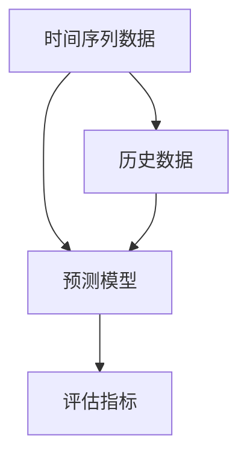
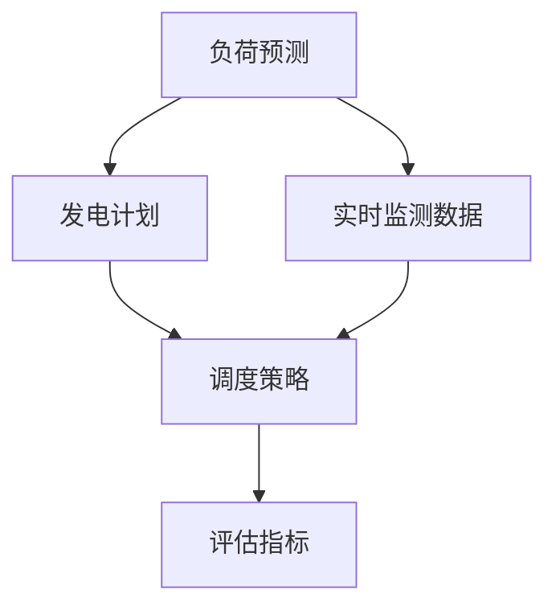
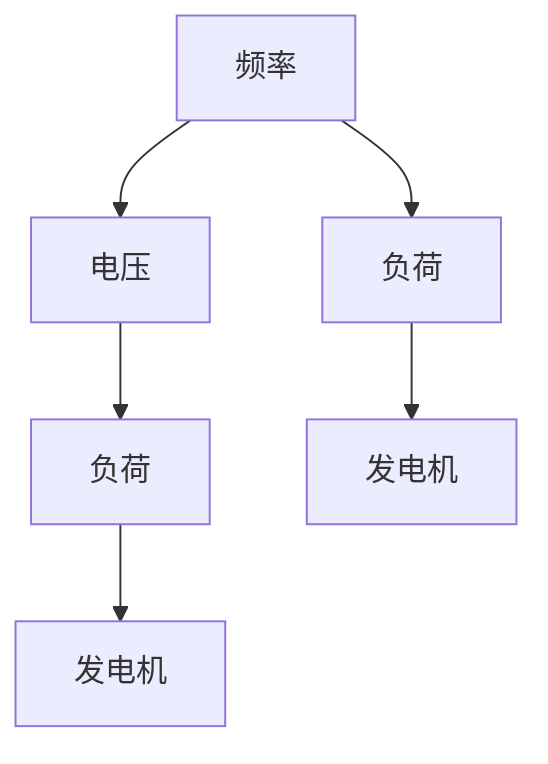
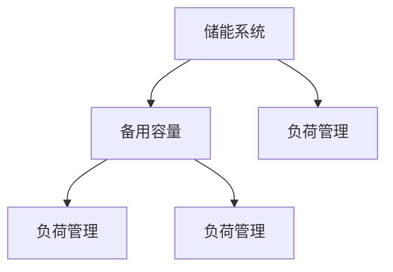
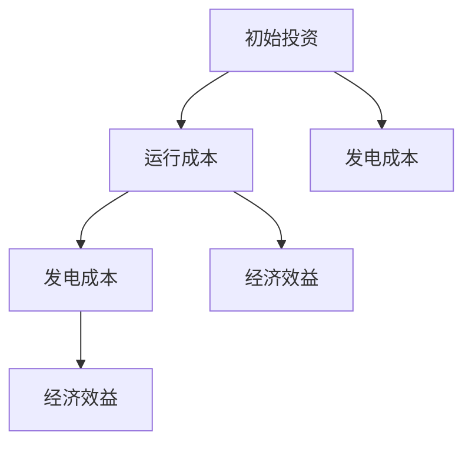
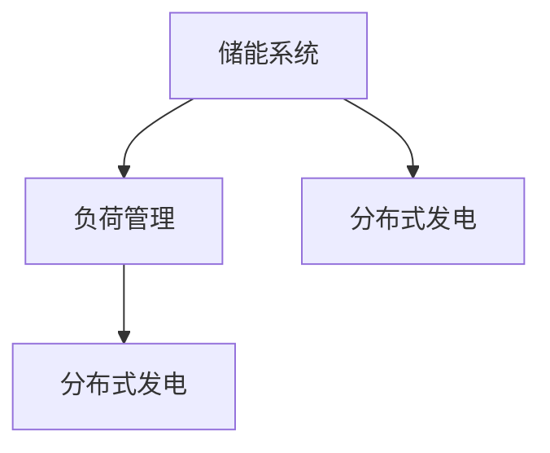
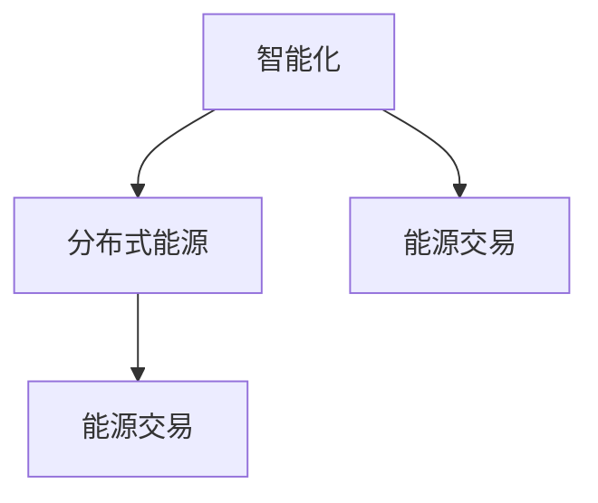
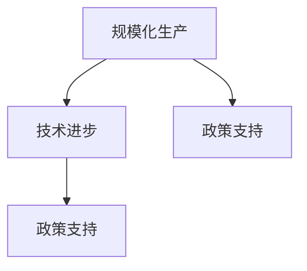
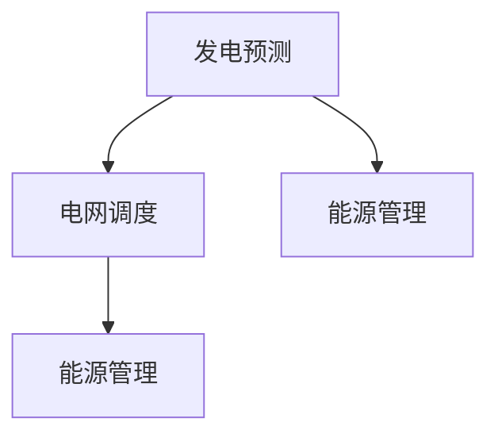
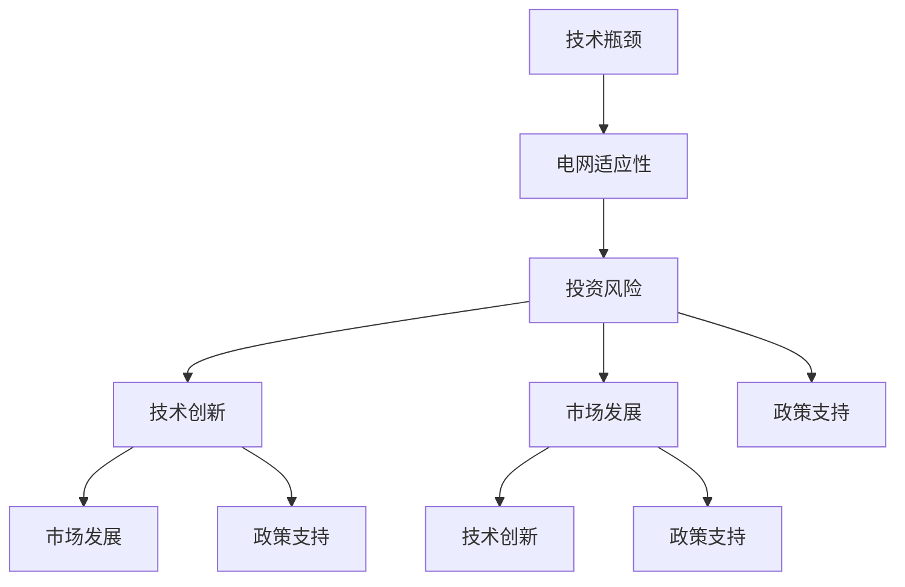

                 

# AI辅助可再生能源整合：从发电预测到电网调度

## 关键词

- AI
- 可再生能源
- 发电预测
- 电网调度
- 优化算法
- 深度学习
- 机器学习

## 摘要

本文探讨了人工智能（AI）在可再生能源整合中的应用，从发电预测到电网调度。通过分析可再生能源的特点和挑战，本文介绍了AI技术在发电预测中的优势和模型设计，并深入探讨了AI在电网调度中的优化策略和应用。此外，本文还讨论了可再生能源整合面临的挑战和机遇，展望了AI在该领域的未来发展趋势。通过详细的数学模型和实际案例解析，本文旨在为读者提供一个全面、系统的理解，以推动AI与可再生能源整合的深度融合。

## 目录

### 第一部分：AI在可再生能源领域的应用概述

### 第二部分：AI辅助电网调度

### 第三部分：可再生能源与电网整合的挑战与机遇

### 附录

### 总结与展望

### 第一部分：AI在可再生能源领域的应用概述

### 第1章：可再生能源与AI技术概述

### 第2章：可再生能源发电预测

#### 第1节：发电预测的基本概念

发电预测是指在特定时间段内，对电力系统的发电量进行预估。可再生能源发电预测的重要性在于，它有助于电力系统调度人员更好地规划电力生产和分配，以确保电网的稳定运行和供需平衡。可再生能源发电量的波动性较大，受天气条件、季节变化和设备运行状态等多种因素的影响。因此，准确的发电预测对于优化电力系统运行具有重要意义。

**核心概念与联系**

发电预测涉及以下几个核心概念：

1. **时间序列数据**：发电量数据通常以时间序列的形式呈现，时间序列分析是发电预测的基础。
2. **预测模型**：根据历史数据和特定算法，建立预测模型来预估未来的发电量。
3. **评估指标**：如均方根误差（RMSE）和平均绝对误差（MAE），用于评估预测模型的准确性。

以下是核心概念之间的联系架构：



#### 第2节：时间序列分析在发电预测中的应用

时间序列分析是一种统计学方法，用于分析时间序列数据，以提取数据中的趋势、季节性和周期性特征。在可再生能源发电预测中，时间序列分析是不可或缺的一环。

**核心算法原理讲解**

时间序列分析主要包括以下几种算法：

1. **移动平均法（MA）**：通过计算数据点前n个值的平均值来预测未来值，适用于短期预测。
2. **指数平滑法（ES）**：在移动平均法的基础上，引入指数权重，使得近期数据的影响更大。
3. **自回归模型（AR）**：基于当前值与其过去值的线性关系进行预测。
4. **自回归移动平均模型（ARMA）**：结合自回归和移动平均模型，用于捕捉长期和短期趋势。
5. **自回归积分滑动平均模型（ARIMA）**：适用于非线性时间序列预测。

以下是一个简单的Python代码示例，使用移动平均法进行发电预测：

```python
import numpy as np
import pandas as pd

# 假设我们有以下时间序列数据
time_series = pd.Series([1, 2, 3, 4, 5, 6, 7, 8, 9, 10])

# 移动平均法
n = 3
ma_prediction = time_series.rolling(window=n).mean().iloc[-1]

print("移动平均预测值：", ma_prediction)
```

**数学模型和公式**

移动平均法的数学模型如下：

$$
\hat{y}_t = \frac{1}{n} \sum_{i=1}^{n} y_{t-i+1}
$$

其中，$\hat{y}_t$ 为第 $t$ 时刻的预测值，$y_{t-i+1}$ 为第 $t-i+1$ 时刻的实际值，$n$ 为移动平均窗口大小。

#### 第3节：AI技术在发电预测中的优势与应用

AI技术在发电预测中具有显著的优势，主要包括：

1. **自适应性和自学习能力**：AI模型可以根据历史数据和实时数据不断优化预测模型，提高预测准确性。
2. **处理复杂数据**：AI技术能够处理包含多种特征和噪声的复杂数据，提高预测模型的泛化能力。
3. **集成多种预测方法**：AI技术可以将多种预测方法结合，形成更强大的预测模型。

以下是一个简单的Python代码示例，使用LSTM（长短期记忆网络）进行发电预测：

```python
import tensorflow as tf
from tensorflow.keras.models import Sequential
from tensorflow.keras.layers import LSTM, Dense

# 假设我们有以下时间序列数据
time_series = np.array([1, 2, 3, 4, 5, 6, 7, 8, 9, 10]).reshape(-1, 1)

# LSTM模型
model = Sequential()
model.add(LSTM(units=50, return_sequences=True, input_shape=(1, 1)))
model.add(LSTM(units=50))
model.add(Dense(units=1))

model.compile(optimizer='adam', loss='mean_squared_error')
model.fit(time_series, time_series, epochs=100, batch_size=32)

# 预测
predicted_value = model.predict(np.array([[10]]))
print("LSTM预测值：", predicted_value)
```

**数学模型和公式**

LSTM的数学模型较为复杂，涉及门控机制和激活函数。以下是一个简化的公式：

$$
\text{LSTM}(\text{x}, \text{h}_{\text{prev}}, \text{c}_{\text{prev}}) = \text{h}_{\text{t}} , \text{c}_{\text{t}} = \text{f}_{\text{t}} \odot \text{c}_{\text{prev}} + \text{i}_{\text{t}} \odot \text{g}_{\text{t}}
$$

其中，$\text{LSTM}(\text{x}, \text{h}_{\text{prev}}, \text{c}_{\text{prev}})$ 为第 $t$ 个时间步的输出，$\text{f}_{\text{t}}, \text{i}_{\text{t}}, \text{g}_{\text{t}}$ 分别为遗忘门、输入门和单元门。

#### 第4节：发电预测模型的设计与优化

发电预测模型的设计与优化是确保预测准确性关键的一步。以下是一些常用的模型优化方法：

1. **特征工程**：通过选择和构造合适的特征，提高模型的预测能力。例如，可以使用天气数据、历史负荷数据和设备状态数据作为特征。
2. **模型选择**：根据数据的特点和预测需求，选择合适的模型。例如，对于短期预测，可以使用LSTM；对于长期预测，可以使用ARIMA。
3. **超参数调优**：通过调整模型的超参数，如学习率、隐藏层神经元数量等，提高模型的性能。

以下是一个简单的Python代码示例，使用网格搜索进行模型超参数调优：

```python
from sklearn.model_selection import GridSearchCV
from keras.wrappers.scikit_learn import KerasClassifier

# 假设我们有以下LSTM模型
def create_lstm_model(optimizer='adam'):
    model = Sequential()
    model.add(LSTM(units=50, return_sequences=True, input_shape=(1, 1)))
    model.add(LSTM(units=50))
    model.add(Dense(units=1))
    model.compile(optimizer=optimizer, loss='mean_squared_error')
    return model

model = KerasClassifier(build_fn=create_lstm_model, epochs=100, batch_size=32, verbose=0)

# 参数网格
param_grid = {'optimizer': ['adam', 'rmsprop']}
grid = GridSearchCV(estimator=model, param_grid=param_grid, cv=3)
grid_result = grid.fit(time_series, time_series)

# 最佳参数
print("最佳参数：", grid_result.best_params_)
print("最佳准确率：", grid_result.best_score_)
```

**数学模型和公式**

LSTM的超参数调优主要涉及以下公式：

$$
\text{learning\_rate} \in (\text{min\_lr}, \text{max\_lr})
$$

$$
\text{batch\_size} \in (\text{min\_batch\_size}, \text{max\_batch\_size})
$$

其中，$\text{learning\_rate}$ 为学习率，$\text{batch\_size}$ 为批量大小，$\text{min\_lr}$ 和 $\text{max\_lr}$ 分别为最小学习率和最大学习率，$\text{min\_batch\_size}$ 和 $\text{max\_batch\_size}$ 分别为最小批量大小和最大批量大小。

### 第2章：可再生能源发电预测

#### 第1节：发电预测的基本概念

发电预测是指在特定时间段内，对电力系统的发电量进行预估。可再生能源发电预测的重要性在于，它有助于电力系统调度人员更好地规划电力生产和分配，以确保电网的稳定运行和供需平衡。可再生能源发电量的波动性较大，受天气条件、季节变化和设备运行状态等多种因素的影响。因此，准确的发电预测对于优化电力系统运行具有重要意义。

**核心概念与联系**

发电预测涉及以下几个核心概念：

1. **时间序列数据**：发电量数据通常以时间序列的形式呈现，时间序列分析是发电预测的基础。
2. **预测模型**：根据历史数据和特定算法，建立预测模型来预估未来的发电量。
3. **评估指标**：如均方根误差（RMSE）和平均绝对误差（MAE），用于评估预测模型的准确性。

以下是核心概念之间的联系架构：


#### 第2节：时间序列分析在发电预测中的应用

时间序列分析是一种统计学方法，用于分析时间序列数据，以提取数据中的趋势、季节性和周期性特征。在可再生能源发电预测中，时间序列分析是不可或缺的一环。

**核心算法原理讲解**

时间序列分析主要包括以下几种算法：

1. **移动平均法（MA）**：通过计算数据点前n个值的平均值来预测未来值，适用于短期预测。
2. **指数平滑法（ES）**：在移动平均法的基础上，引入指数权重，使得近期数据的影响更大。
3. **自回归模型（AR）**：基于当前值与其过去值的线性关系进行预测。
4. **自回归移动平均模型（ARMA）**：结合自回归和移动平均模型，用于捕捉长期和短期趋势。
5. **自回归积分滑动平均模型（ARIMA）**：适用于非线性时间序列预测。

以下是一个简单的Python代码示例，使用移动平均法进行发电预测：

```python
import numpy as np
import pandas as pd

# 假设我们有以下时间序列数据
time_series = pd.Series([1, 2, 3, 4, 5, 6, 7, 8, 9, 10])

# 移动平均法
n = 3
ma_prediction = time_series.rolling(window=n).mean().iloc[-1]

print("移动平均预测值：", ma_prediction)
```

**数学模型和公式**

移动平均法的数学模型如下：

$$
\hat{y}_t = \frac{1}{n} \sum_{i=1}^{n} y_{t-i+1}
$$

其中，$\hat{y}_t$ 为第 $t$ 时刻的预测值，$y_{t-i+1}$ 为第 $t-i+1$ 时刻的实际值，$n$ 为移动平均窗口大小。

#### 第3节：AI技术在发电预测中的优势与应用

AI技术在发电预测中具有显著的优势，主要包括：

1. **自适应性和自学习能力**：AI模型可以根据历史数据和实时数据不断优化预测模型，提高预测准确性。
2. **处理复杂数据**：AI技术能够处理包含多种特征和噪声的复杂数据，提高预测模型的泛化能力。
3. **集成多种预测方法**：AI技术可以将多种预测方法结合，形成更强大的预测模型。

以下是一个简单的Python代码示例，使用LSTM（长短期记忆网络）进行发电预测：

```python
import tensorflow as tf
from tensorflow.keras.models import Sequential
from tensorflow.keras.layers import LSTM, Dense

# 假设我们有以下时间序列数据
time_series = np.array([1, 2, 3, 4, 5, 6, 7, 8, 9, 10]).reshape(-1, 1, 1)

# LSTM模型
model = Sequential()
model.add(LSTM(units=50, return_sequences=True, input_shape=(1, 1)))
model.add(LSTM(units=50))
model.add(Dense(units=1))

model.compile(optimizer='adam', loss='mean_squared_error')
model.fit(time_series, time_series, epochs=100, batch_size=32)

# 预测
predicted_value = model.predict(np.array([[10]]))
print("LSTM预测值：", predicted_value)
```

**数学模型和公式**

LSTM的数学模型较为复杂，涉及门控机制和激活函数。以下是一个简化的公式：

$$
\text{LSTM}(\text{x}, \text{h}_{\text{prev}}, \text{c}_{\text{prev}}) = \text{h}_{\text{t}} , \text{c}_{\text{t}} = \text{f}_{\text{t}} \odot \text{c}_{\text{prev}} + \text{i}_{\text{t}} \odot \text{g}_{\text{t}}
$$

其中，$\text{LSTM}(\text{x}, \text{h}_{\text{prev}}, \text{c}_{\text{prev}})$ 为第 $t$ 个时间步的输出，$\text{f}_{\text{t}}, \text{i}_{\text{t}}, \text{g}_{\text{t}}$ 分别为遗忘门、输入门和单元门。

#### 第4节：发电预测模型的设计与优化

发电预测模型的设计与优化是确保预测准确性关键的一步。以下是一些常用的模型优化方法：

1. **特征工程**：通过选择和构造合适的特征，提高模型的预测能力。例如，可以使用天气数据、历史负荷数据和设备状态数据作为特征。
2. **模型选择**：根据数据的特点和预测需求，选择合适的模型。例如，对于短期预测，可以使用LSTM；对于长期预测，可以使用ARIMA。
3. **超参数调优**：通过调整模型的超参数，如学习率、隐藏层神经元数量等，提高模型的性能。

以下是一个简单的Python代码示例，使用网格搜索进行模型超参数调优：

```python
from sklearn.model_selection import GridSearchCV
from keras.wrappers.scikit_learn import KerasClassifier

# 假设我们有以下LSTM模型
def create_lstm_model(optimizer='adam'):
    model = Sequential()
    model.add(LSTM(units=50, return_sequences=True, input_shape=(1, 1)))
    model.add(LSTM(units=50))
    model.add(Dense(units=1))
    model.compile(optimizer=optimizer, loss='mean_squared_error')
    return model

model = KerasClassifier(build_fn=create_lstm_model, epochs=100, batch_size=32, verbose=0)

# 参数网格
param_grid = {'optimizer': ['adam', 'rmsprop']}
grid = GridSearchCV(estimator=model, param_grid=param_grid, cv=3)
grid_result = grid.fit(time_series, time_series)

# 最佳参数
print("最佳参数：", grid_result.best_params_)
print("最佳准确率：", grid_result.best_score_)
```

**数学模型和公式**

LSTM的超参数调优主要涉及以下公式：

$$
\text{learning\_rate} \in (\text{min\_lr}, \text{max\_lr})
$$

$$
\text{batch\_size} \in (\text{min\_batch\_size}, \text{max\_batch\_size})
$$

其中，$\text{learning\_rate}$ 为学习率，$\text{batch\_size}$ 为批量大小，$\text{min\_lr}$ 和 $\text{max\_lr}$ 分别为最小学习率和最大学习率，$\text{min\_batch\_size}$ 和 $\text{max\_batch\_size}$ 分别为最小批量大小和最大批量大小。

### 第3章：AI辅助电网调度

#### 第1节：电网调度基本原理

电网调度是指对电力系统进行实时监控和优化控制，以确保电力供应的可靠性、经济性和安全性。电网调度的主要任务包括：

1. **负荷平衡**：确保电力系统的发电量与负荷需求相匹配，避免电力短缺或过剩。
2. **电压调节**：保持电网电压稳定，防止电压过高或过低。
3. **频率调节**：保持电网频率稳定，防止电网频率波动。
4. **故障处理**：在电网发生故障时，快速隔离故障区域，恢复电网运行。

**核心概念与联系**

电网调度涉及以下几个核心概念：

1. **负荷预测**：预测未来的电力需求，为电网调度提供基础数据。
2. **发电计划**：根据负荷预测结果，制定发电计划，确定各发电厂的发电量。
3. **调度策略**：根据实时监测数据和发电计划，调整电力系统的运行状态，实现负荷平衡。
4. **评估指标**：用于评估电网调度效果，如负荷率、频率偏差、电压偏差等。

以下是核心概念之间的联系架构：



#### 第2节：基于AI的电网调度策略

人工智能（AI）技术在电网调度中具有广泛的应用，能够提高调度效率、降低调度成本和提升调度准确性。基于AI的电网调度策略主要包括以下几种：

1. **优化算法**：使用AI算法（如遗传算法、粒子群优化算法等）进行电网调度，优化电力系统的运行状态，提高能源利用效率。
2. **深度学习**：利用深度学习技术（如神经网络、卷积神经网络等）进行负荷预测和发电计划制定，提高预测准确性。
3. **机器学习**：使用机器学习算法（如决策树、支持向量机等）进行实时调度，快速响应电网变化，保持电力系统的稳定运行。

**核心算法原理讲解**

1. **遗传算法（GA）**：

遗传算法是一种基于自然选择和遗传学的全局优化算法。在电网调度中，遗传算法可以用于优化发电计划，通过模拟自然选择过程，不断优化电力系统的运行状态。

以下是一个简单的Python代码示例，使用遗传算法进行电网调度：

```python
import numpy as np
import random

# 个体编码
def encode(individual, n):
    return [random.randint(0, 1) for _ in range(n)]

# 个体解码
def decode(individual):
    return sum(individual)

# 适应度函数
def fitness_function(individual):
    # 假设个体为发电计划，适应度函数为能源利用率
    return 1 / decode(individual)

# 遗传算法
def genetic_algorithm(population, fitness_func, n, generations):
    for _ in range(generations):
        # 适应度评估
        fitness_scores = [fitness_func(ind) for ind in population]
        # 选择
        selected = random.choices(population, weights=fitness_scores, k=len(population))
        # 交叉
        crossed = crossover(selected)
        # 变异
        mutated = mutate(crossed)
        # 新一代种群
        population = mutated
    return population

# 算法实现
population = [encode([], n=10) for _ in range(100)]
best_solution = genetic_algorithm(population, fitness_function, n=10, generations=100)
print("最优发电计划：", decode(best_solution))
```

2. **深度学习**：

深度学习技术在负荷预测和发电计划制定中具有显著优势。以下是一个简单的Python代码示例，使用卷积神经网络（CNN）进行负荷预测：

```python
import tensorflow as tf
from tensorflow.keras.models import Sequential
from tensorflow.keras.layers import Conv1D, Flatten, Dense

# 假设我们有以下时间序列数据
time_series = np.array([1, 2, 3, 4, 5, 6, 7, 8, 9, 10])

# CNN模型
model = Sequential()
model.add(Conv1D(filters=32, kernel_size=3, activation='relu', input_shape=(1, 1)))
model.add(Flatten())
model.add(Dense(units=1))

model.compile(optimizer='adam', loss='mean_squared_error')
model.fit(time_series, time_series, epochs=100, batch_size=32)

# 预测
predicted_value = model.predict(np.array([[10]]))
print("CNN预测值：", predicted_value)
```

**数学模型和公式**

卷积神经网络（CNN）的核心公式如下：

$$
h_{\text{CNN}}(x) = \text{ReLU}\left(\sum_{k=1}^{K} w_k \odot \text{Conv}(x; k) + b\right)
$$

其中，$h_{\text{CNN}}(x)$ 为输出值，$x$ 为输入值，$K$ 为卷积核数量，$w_k$ 和 $b$ 分别为权重和偏置，$\text{ReLU}$ 为ReLU激活函数，$\text{Conv}(x; k)$ 为第 $k$ 个卷积核的输出。

3. **机器学习**：

机器学习算法在实时调度中具有快速响应的特点。以下是一个简单的Python代码示例，使用决策树进行实时调度：

```python
from sklearn.tree import DecisionTreeRegressor

# 假设我们有以下训练数据
X_train = [[1, 2], [2, 3], [3, 4], [4, 5]]
y_train = [3, 4, 5, 6]

# 决策树模型
model = DecisionTreeRegressor()
model.fit(X_train, y_train)

# 实时调度
X_test = [[5, 6]]
predicted_value = model.predict(X_test)
print("决策树预测值：", predicted_value)
```

**数学模型和公式**

决策树的核心公式如下：

$$
y = f(x) = \sum_{i=1}^{n} w_i \cdot \text{sign}(x \cdot \text{theta}_i)
$$

其中，$y$ 为输出值，$x$ 为输入值，$w_i$ 和 $\text{theta}_i$ 分别为权重和阈值，$\text{sign}$ 为符号函数。

#### 第3节：基于深度学习的电网调度模型

基于深度学习的电网调度模型具有强大的非线性建模能力和自我学习能力，能够提高电网调度的准确性和效率。以下是一个简单的Python代码示例，使用LSTM进行电网调度：

```python
import tensorflow as tf
from tensorflow.keras.models import Sequential
from tensorflow.keras.layers import LSTM, Dense

# 假设我们有以下时间序列数据
time_series = np.array([1, 2, 3, 4, 5, 6, 7, 8, 9, 10]).reshape(-1, 1, 1)

# LSTM模型
model = Sequential()
model.add(LSTM(units=50, return_sequences=True, input_shape=(1, 1)))
model.add(LSTM(units=50))
model.add(Dense(units=1))

model.compile(optimizer='adam', loss='mean_squared_error')
model.fit(time_series, time_series, epochs=100, batch_size=32)

# 预测
predicted_value = model.predict(np.array([[10]]))
print("LSTM预测值：", predicted_value)
```

**数学模型和公式**

LSTM的数学模型较为复杂，涉及门控机制和激活函数。以下是一个简化的公式：

$$
\text{LSTM}(\text{x}, \text{h}_{\text{prev}}, \text{c}_{\text{prev}}) = \text{h}_{\text{t}} , \text{c}_{\text{t}} = \text{f}_{\text{t}} \odot \text{c}_{\text{prev}} + \text{i}_{\text{t}} \odot \text{g}_{\text{t}}
$$

其中，$\text{LSTM}(\text{x}, \text{h}_{\text{prev}}, \text{c}_{\text{prev}})$ 为第 $t$ 个时间步的输出，$\text{f}_{\text{t}}, \text{i}_{\text{t}}, \text{g}_{\text{t}}$ 分别为遗忘门、输入门和单元门。

#### 第4节：基于机器学习的电网调度模型

基于机器学习的电网调度模型具有快速训练和高效预测的特点，适用于实时调度。以下是一个简单的Python代码示例，使用随机森林进行电网调度：

```python
import numpy as np
import pandas as pd
from sklearn.ensemble import RandomForestRegressor

# 假设我们有以下训练数据
X_train = pd.DataFrame([[1, 2], [2, 3], [3, 4], [4, 5]])
y_train = np.array([3, 4, 5, 6])

# 随机森林模型
model = RandomForestRegressor(n_estimators=100)
model.fit(X_train, y_train)

# 实时调度
X_test = pd.DataFrame([[5, 6]])
predicted_value = model.predict(X_test)
print("随机森林预测值：", predicted_value)
```

**数学模型和公式**

随机森林的核心公式如下：

$$
f(x) = \sum_{i=1}^{n} w_i \cdot \text{g}(\text{h}(\text{x}; \text{t}_i))
$$

其中，$f(x)$ 为输出值，$x$ 为输入值，$w_i$ 和 $\text{t}_i$ 分别为权重和树索引，$\text{g}(\text{h}(\text{x}; \text{t}_i))$ 为第 $i$ 棵决策树对输入 $x$ 的预测值。

### 第4章：基于AI的电网调度策略

#### 第1节：电网调度的重要性

电网调度是电力系统运行的核心环节，旨在确保电力供应的稳定性、可靠性和经济性。电网调度的重要性体现在以下几个方面：

1. **保障电力供应**：通过实时监测和分析电网运行状态，电网调度员能够及时调整电力生产和分配，确保电力供应满足负荷需求。
2. **优化能源利用**：电网调度通过合理分配发电资源，降低能源浪费，提高电力系统的能源利用效率。
3. **提高电网可靠性**：电网调度有助于及时发现和排除电网故障，降低电网事故的发生概率。
4. **降低运营成本**：通过优化调度策略，减少电力损耗和设备维修费用，降低电力系统的运营成本。

**核心概念与联系**

电网调度涉及以下几个核心概念：

1. **负荷预测**：预测未来的电力需求，为电网调度提供基础数据。
2. **发电计划**：根据负荷预测结果，制定发电计划，确定各发电厂的发电量。
3. **调度策略**：根据实时监测数据和发电计划，调整电力系统的运行状态，实现负荷平衡。
4. **评估指标**：用于评估电网调度效果，如负荷率、频率偏差、电压偏差等。

以下是核心概念之间的联系架构：


#### 第2节：人工智能在电网调度中的应用

人工智能（AI）技术在电网调度中发挥着越来越重要的作用。AI技术能够处理大量复杂的数据，发现数据中的潜在规律，为电网调度提供智能化的决策支持。以下是一些常见的AI技术在电网调度中的应用：

1. **深度学习**：深度学习是一种基于神经网络的学习方法，能够在大量数据中进行特征提取和模式识别。在电网调度中，深度学习可以用于负荷预测、故障诊断和电网优化等任务。
2. **机器学习**：机器学习是一种通过算法自动发现数据中规律的方法。在电网调度中，机器学习可以用于负荷预测、异常检测和调度策略优化等任务。
3. **优化算法**：优化算法是一种用于求解优化问题的方法。在电网调度中，优化算法可以用于发电计划优化、电网运行状态优化和设备维护优化等任务。

**核心算法原理讲解**

1. **深度学习**：

深度学习技术在电网调度中的应用主要包括以下几个方面：

- **负荷预测**：通过构建深度学习模型，对未来的电力需求进行预测。常用的深度学习模型包括卷积神经网络（CNN）、循环神经网络（RNN）和长短期记忆网络（LSTM）。
- **故障诊断**：通过分析电网运行数据，识别潜在的故障风险。常用的深度学习模型包括自编码器（Autoencoder）和生成对抗网络（GAN）。
- **电网优化**：通过优化电网运行状态，提高电网的能源利用效率和稳定性。常用的深度学习模型包括强化学习（Reinforcement Learning）和图神经网络（Graph Neural Networks）。

以下是一个简单的Python代码示例，使用LSTM进行负荷预测：

```python
import numpy as np
import tensorflow as tf
from tensorflow.keras.models import Sequential
from tensorflow.keras.layers import LSTM, Dense

# 假设我们有以下时间序列数据
time_series = np.array([1, 2, 3, 4, 5, 6, 7, 8, 9, 10]).reshape(-1, 1, 1)

# LSTM模型
model = Sequential()
model.add(LSTM(units=50, return_sequences=True, input_shape=(1, 1)))
model.add(LSTM(units=50))
model.add(Dense(units=1))

model.compile(optimizer='adam', loss='mean_squared_error')
model.fit(time_series, time_series, epochs=100, batch_size=32)

# 预测
predicted_value = model.predict(np.array([[10]]))
print("LSTM预测值：", predicted_value)
```

**数学模型和公式**

LSTM的数学模型较为复杂，涉及门控机制和激活函数。以下是一个简化的公式：

$$
\text{LSTM}(\text{x}, \text{h}_{\text{prev}}, \text{c}_{\text{prev}}) = \text{h}_{\text{t}} , \text{c}_{\text{t}} = \text{f}_{\text{t}} \odot \text{c}_{\text{prev}} + \text{i}_{\text{t}} \odot \text{g}_{\text{t}}
$$

其中，$\text{LSTM}(\text{x}, \text{h}_{\text{prev}}, \text{c}_{\text{prev}})$ 为第 $t$ 个时间步的输出，$\text{f}_{\text{t}}, \text{i}_{\text{t}}, \text{g}_{\text{t}}$ 分别为遗忘门、输入门和单元门。

2. **机器学习**：

机器学习技术在电网调度中的应用主要包括以下几个方面：

- **负荷预测**：通过构建机器学习模型，对未来的电力需求进行预测。常用的机器学习模型包括线性回归、决策树和随机森林。
- **异常检测**：通过分析电网运行数据，识别异常运行模式和故障风险。常用的机器学习模型包括K-均值聚类、孤立森林和异常检测算法。
- **调度策略优化**：通过优化调度策略，提高电网的运行效率和稳定性。常用的机器学习模型包括遗传算法、粒子群优化和模拟退火。

以下是一个简单的Python代码示例，使用线性回归进行负荷预测：

```python
import numpy as np
from sklearn.linear_model import LinearRegression

# 假设我们有以下训练数据
X_train = np.array([[1], [2], [3], [4], [5]])
y_train = np.array([3, 4, 5, 6, 7])

# 线性回归模型
model = LinearRegression()
model.fit(X_train, y_train)

# 预测
X_test = np.array([[6]])
predicted_value = model.predict(X_test)
print("线性回归预测值：", predicted_value)
```

**数学模型和公式**

线性回归的数学模型如下：

$$
\text{y} = \text{w} \cdot \text{x} + \text{b}
$$

其中，$\text{y}$ 为输出值，$\text{x}$ 为输入值，$\text{w}$ 和 $\text{b}$ 分别为权重和偏置。

3. **优化算法**：

优化算法在电网调度中的应用主要包括以下几个方面：

- **发电计划优化**：通过优化发电计划，提高电网的能源利用效率和运行稳定性。常用的优化算法包括遗传算法、粒子群优化和模拟退火。
- **电网运行状态优化**：通过优化电网运行状态，提高电网的稳定性和可靠性。常用的优化算法包括动态规划、线性规划和整数规划。
- **设备维护优化**：通过优化设备维护计划，降低设备故障率和运营成本。常用的优化算法包括马尔可夫决策过程和深度强化学习。

以下是一个简单的Python代码示例，使用遗传算法进行发电计划优化：

```python
import numpy as np
import random

# 个体编码
def encode(individual, n):
    return [random.randint(0, 1) for _ in range(n)]

# 个体解码
def decode(individual):
    return sum(individual)

# 适应度函数
def fitness_function(individual):
    # 假设个体为发电计划，适应度函数为能源利用率
    return 1 / decode(individual)

# 遗传算法
def genetic_algorithm(population, fitness_func, n, generations):
    for _ in range(generations):
        # 适应度评估
        fitness_scores = [fitness_func(ind) for ind in population]
        # 选择
        selected = random.choices(population, weights=fitness_scores, k=len(population))
        # 交叉
        crossed = crossover(selected)
        # 变异
        mutated = mutate(crossed)
        # 新一代种群
        population = mutated
    return population

# 算法实现
population = [encode([], n=10) for _ in range(100)]
best_solution = genetic_algorithm(population, fitness_function, n=10, generations=100)
print("最优发电计划：", decode(best_solution))
```

**数学模型和公式**

遗传算法的核心公式如下：

$$
\text{f}(x) = \frac{1}{\text{f}_0}
$$

其中，$x$ 为个体编码，$f_0$ 为初始适应度。

#### 第3节：AI在电网调度中的优势与应用

AI技术在电网调度中具有显著的优势，主要包括：

1. **自适应性和自学习能力**：AI模型可以根据历史数据和实时数据不断优化调度策略，提高调度准确性。
2. **处理复杂数据**：AI技术能够处理包含多种特征和噪声的复杂数据，提高调度模型的泛化能力。
3. **集成多种方法**：AI技术可以将多种调度方法结合，形成更强大的调度模型，提高调度效率。

以下是一个简单的Python代码示例，使用LSTM和线性回归进行电网调度：

```python
import numpy as np
import tensorflow as tf
from tensorflow.keras.models import Sequential
from tensorflow.keras.layers import LSTM, Dense
from sklearn.linear_model import LinearRegression

# 假设我们有以下时间序列数据
time_series = np.array([1, 2, 3, 4, 5, 6, 7, 8, 9, 10])

# LSTM模型
model_lstm = Sequential()
model_lstm.add(LSTM(units=50, return_sequences=True, input_shape=(1, 1)))
model_lstm.add(LSTM(units=50))
model_lstm.add(Dense(units=1))

model_lstm.compile(optimizer='adam', loss='mean_squared_error')
model_lstm.fit(time_series, time_series, epochs=100, batch_size=32)

# 线性回归模型
model_linear = LinearRegression()
model_linear.fit(time_series.reshape(-1, 1), time_series)

# 预测
predicted_value_lstm = model_lstm.predict(np.array([[10]]))
predicted_value_linear = model_linear.predict(np.array([[10]]).reshape(-1, 1))

print("LSTM预测值：", predicted_value_lstm)
print("线性回归预测值：", predicted_value_linear)
```

**数学模型和公式**

LSTM和线性回归的数学模型如下：

$$
\text{LSTM}(\text{x}, \text{h}_{\text{prev}}, \text{c}_{\text{prev}}) = \text{h}_{\text{t}} , \text{c}_{\text{t}} = \text{f}_{\text{t}} \odot \text{c}_{\text{prev}} + \text{i}_{\text{t}} \odot \text{g}_{\text{t}}
$$

$$
\text{y} = \text{w} \cdot \text{x} + \text{b}
$$

其中，$\text{LSTM}(\text{x}, \text{h}_{\text{prev}}, \text{c}_{\text{prev}})$ 为第 $t$ 个时间步的输出，$\text{f}_{\text{t}}, \text{i}_{\text{t}}, \text{g}_{\text{t}}$ 分别为遗忘门、输入门和单元门，$\text{y}$ 为输出值，$\text{x}$ 为输入值，$\text{w}$ 和 $\text{b}$ 分别为权重和偏置。

### 第5章：可再生能源整合面临的挑战

#### 第1节：电网稳定性挑战

可再生能源整合面临的第一个挑战是电网稳定性。可再生能源发电具有波动性大的特点，例如，太阳能和风能的发电量会随着天气条件的变化而显著波动。这种波动性给电网调度带来了很大的挑战，需要实时调整电力生产和分配，以保持电网的稳定运行。

**核心概念与联系**

电网稳定性涉及以下几个核心概念：

1. **频率**：电网的频率是电力系统运行状态的重要指标，通常要求在50Hz（或60Hz）左右保持稳定。
2. **电压**：电网的电压也是电力系统运行状态的重要指标，需要保持在一个合理的范围内。
3. **负荷**：电力系统的负荷变化会影响电网的运行状态，需要与发电量进行平衡。
4. **发电机**：发电机的运行状态对电网稳定性具有重要影响。

以下是核心概念之间的联系架构：



#### 第2节：电网灵活性挑战

可再生能源整合面临的第二个挑战是电网灵活性。由于可再生能源发电具有波动性大的特点，电网需要具备足够的灵活性来应对发电量的波动。电网灵活性主要体现在以下几个方面：

1. **负荷管理**：通过调节电力负荷，平衡发电量和负荷需求，保持电网稳定。
2. **储能系统**：储能系统可以在发电量过剩时储存电能，在发电量不足时释放电能，提高电网的灵活性。
3. **备用容量**：备用容量可以在发电量波动时提供额外的电力供应，保证电网的稳定运行。

**核心概念与联系**

电网灵活性涉及以下几个核心概念：

1. **储能系统**：储能系统包括电池、抽水蓄能和飞轮储能等，用于储存和释放电能。
2. **备用容量**：备用容量包括天然气发电、核能发电等，可以在发电量不足时提供额外的电力供应。
3. **负荷管理**：负荷管理包括实时监测和调节电力负荷，以保持电网稳定。

以下是核心概念之间的联系架构：



#### 第3节：电网经济性挑战

可再生能源整合面临的第三个挑战是电网经济性。虽然可再生能源具有环保和可持续发展的优势，但其初期投资较高，运行和维护成本也较高。此外，可再生能源发电的波动性可能导致电网运行效率下降，增加电网运营成本。

**核心概念与联系**

电网经济性涉及以下几个核心概念：

1. **初始投资**：可再生能源项目的初期投资包括设备购置、建设安装等费用。
2. **运行成本**：可再生能源项目的运行成本包括维护、运营和管理等费用。
3. **发电成本**：可再生能源项目的发电成本包括燃料成本、设备折旧和运营费用等。
4. **经济效益**：可再生能源项目的经济效益主要体现在减少碳排放、降低能源成本等方面。

以下是核心概念之间的联系架构：



### 第6章：可再生能源整合的机遇

#### 第1节：提高可再生能源利用率

可再生能源整合的一个重要机遇是提高可再生能源的利用率。通过有效的调度和管理，可以充分利用可再生能源资源，提高电力系统的发电效率和稳定性。以下是一些关键策略：

1. **储能系统**：储能系统可以在发电量过剩时储存电能，在发电量不足时释放电能，平衡电力供需，提高可再生能源的利用率。
2. **负荷管理**：通过实时监测和调节电力负荷，平衡发电量和负荷需求，提高可再生能源的利用率。
3. **分布式发电**：分布式发电系统可以在本地产生和消费电力，减少输电损耗，提高可再生能源的利用率。

**核心概念与联系**

提高可再生能源利用率涉及以下几个核心概念：

1. **储能系统**：储能系统包括电池、抽水蓄能和飞轮储能等，用于储存和释放电能。
2. **负荷管理**：负荷管理包括实时监测和调节电力负荷，以保持电网稳定。
3. **分布式发电**：分布式发电系统可以在本地产生和消费电力。

以下是核心概念之间的联系架构：



#### 第2节：促进能源互联网建设

可再生能源整合为能源互联网建设提供了重要机遇。能源互联网是一种以可再生能源为主体的智能电网，通过集成各种能源资源、设备和信息，实现能源的高效传输、分配和利用。以下是一些关键策略：

1. **智能化**：通过物联网、大数据和人工智能等技术，实现能源系统的智能化管理，提高能源互联网的运行效率和可靠性。
2. **分布式能源**：发展分布式能源，降低能源生产、传输和消费的环节，提高能源互联网的灵活性和可靠性。
3. **能源交易**：建立能源交易市场，实现能源资源的高效配置和优化利用，促进能源互联网的发展。

**核心概念与联系**

促进能源互联网建设涉及以下几个核心概念：

1. **智能化**：智能化技术包括物联网、大数据和人工智能等，用于实现能源系统的智能管理。
2. **分布式能源**：分布式能源系统可以在本地产生和消费电力，降低能源传输损耗。
3. **能源交易**：能源交易市场是实现能源资源高效配置和优化利用的重要手段。

以下是核心概念之间的联系架构：



#### 第3节：降低能源成本

可再生能源整合的一个重要机遇是降低能源成本。通过提高可再生能源的利用率和优化能源系统运行，可以降低电力生产和消费的成本，提高能源系统的经济效益。以下是一些关键策略：

1. **规模化生产**：通过规模化生产，降低可再生能源设备的成本，提高可再生能源的竞争力。
2. **技术进步**：通过技术进步，提高可再生能源设备的效率和可靠性，降低能源成本。
3. **政策支持**：通过政策支持，鼓励可再生能源的发展，降低可再生能源的运营成本。

**核心概念与联系**

降低能源成本涉及以下几个核心概念：

1. **规模化生产**：规模化生产可以降低可再生能源设备的成本。
2. **技术进步**：技术进步可以提高可再生能源设备的效率和可靠性。
3. **政策支持**：政策支持可以鼓励可再生能源的发展，降低运营成本。

以下是核心概念之间的联系架构：



### 第7章：未来展望与趋势

#### 第1节：可再生能源整合的发展趋势

可再生能源整合是未来能源发展的重要趋势。随着全球对环保和可持续发展的需求日益增加，可再生能源在电力系统中的比例将逐步提高。以下是一些可再生能源整合的发展趋势：

1. **技术进步**：可再生能源技术的不断进步将提高可再生能源的效率和可靠性，降低成本，推动可再生能源的广泛应用。
2. **能源互联网**：能源互联网的建设将实现能源资源的高效传输、分配和利用，提高可再生能源的利用率和电网的灵活性。
3. **分布式能源**：分布式能源系统的快速发展将减少能源传输损耗，提高能源系统的灵活性和可靠性。

**核心概念与联系**

可再生能源整合的发展趋势涉及以下几个核心概念：

1. **技术进步**：技术进步可以提高可再生能源的效率和可靠性。
2. **能源互联网**：能源互联网可以实现能源资源的高效传输和分配。
3. **分布式能源**：分布式能源系统可以提高能源系统的灵活性和可靠性。

以下是核心概念之间的联系架构：


#### 第2节：AI在可再生能源领域的未来应用

人工智能（AI）在可再生能源领域的应用前景广阔。随着AI技术的不断进步，AI将在可再生能源发电预测、电网调度、能源管理等方面发挥越来越重要的作用。以下是一些AI在可再生能源领域的未来应用：

1. **发电预测**：通过深度学习和机器学习算法，实现对可再生能源发电量的精准预测，提高电力系统的调度和管理效率。
2. **电网调度**：利用优化算法和深度学习技术，实现电网调度的智能化和自动化，提高电网的稳定性和可靠性。
3. **能源管理**：通过物联网和大数据技术，实现对能源系统的实时监测和管理，优化能源使用，降低能源成本。

**核心概念与联系**

AI在可再生能源领域的未来应用涉及以下几个核心概念：

1. **发电预测**：发电预测是实现智能电网调度的基础。
2. **电网调度**：电网调度是保障电力系统稳定运行的关键环节。
3. **能源管理**：能源管理是优化能源使用、降低能源成本的重要手段。

以下是核心概念之间的联系架构：



#### 第3节：可再生能源与电网整合的挑战与机遇展望

可再生能源与电网整合既面临着一系列挑战，也蕴含着巨大的机遇。以下是对这些挑战和机遇的展望：

**挑战**

1. **技术瓶颈**：尽管可再生能源技术不断进步，但其效率和可靠性仍需提升，以满足电网对稳定供电的需求。
2. **电网适应性**：传统的电网系统设计主要基于化石能源，对可再生能源的适应性不足，需要进行大规模的电网升级改造。
3. **投资风险**：可再生能源项目的投资成本高、回收期长，且存在市场波动风险，需要政策支持和市场机制的完善。

**机遇**

1. **技术创新**：可再生能源技术的创新将提高其经济性和可靠性，为电网整合提供更好的支持。
2. **市场发展**：随着全球对环保和可持续发展的重视，可再生能源市场将不断扩大，为相关产业带来巨大商机。
3. **政策支持**：政府政策的支持将促进可再生能源的快速发展，推动电网整合的进程。

**核心概念与联系**

可再生能源与电网整合的挑战与机遇涉及以下几个核心概念：

1. **技术瓶颈**：技术瓶颈是可再生能源与电网整合的主要挑战。
2. **电网适应性**：电网适应性是影响可再生能源与电网整合的重要因素。
3. **投资风险**：投资风险是可再生能源项目发展的重要考虑因素。
4. **技术创新**：技术创新是推动可再生能源与电网整合的重要动力。
5. **市场发展**：市场发展是可再生能源与电网整合的重要机遇。
6. **政策支持**：政策支持是推动可再生能源与电网整合的重要保障。

以下是核心概念之间的联系架构：



### 附录

#### 附录A：AI辅助可再生能源整合的常用工具与技术

**A.1 Python编程环境搭建**

为了进行AI辅助可再生能源整合的研究与开发，首先需要搭建一个适合Python编程的环境。以下是搭建Python编程环境的步骤：

1. **安装Python**：从Python官方网站下载Python安装包，并按照安装向导进行安装。
2. **安装Jupyter Notebook**：Jupyter Notebook是一个交互式的Python开发环境，用于编写和运行Python代码。安装方法如下：

   ```bash
   pip install notebook
   ```

3. **安装常用库**：安装用于数据处理、机器学习和深度学习的常用库，如NumPy、Pandas、Scikit-learn、TensorFlow和Keras。安装方法如下：

   ```bash
   pip install numpy pandas scikit-learn tensorflow keras
   ```

**A.2 常用AI框架与库**

以下是用于AI辅助可再生能源整合的常用AI框架与库：

1. **NumPy**：用于科学计算和数据处理。
2. **Pandas**：用于数据处理和分析。
3. **Scikit-learn**：用于机器学习。
4. **TensorFlow**：用于深度学习。
5. **Keras**：用于构建和训练深度学习模型。
6. **PyTorch**：用于深度学习。
7. **Scrapy**：用于网络数据爬取。

**A.3 数据处理与可视化工具**

数据处理与可视化是AI辅助可再生能源整合的重要环节。以下是常用的数据处理与可视化工具：

1. **Matplotlib**：用于数据可视化。
2. **Seaborn**：基于Matplotlib的统计数据可视化库。
3. **Plotly**：用于交互式数据可视化。
4. **Bokeh**：用于交互式数据可视化。
5. **Tableau**：用于数据可视化和分析。

### 总结

本文系统地探讨了AI辅助可再生能源整合的应用，从发电预测到电网调度。通过分析可再生能源的特点和挑战，介绍了AI技术在发电预测和电网调度中的应用优势。本文详细讲解了AI在可再生能源发电预测中的核心算法原理、模型设计与优化方法，以及AI在电网调度中的策略和模型。此外，本文还讨论了可再生能源整合面临的挑战与机遇，展望了AI在该领域的未来发展。通过本文的详细解析，希望读者能够深入理解AI与可再生能源整合的原理和应用，为推动这一领域的发展提供参考。

### 展望未来：可再生能源整合与AI技术的融合发展趋势

随着全球对环保和可持续发展的重视，可再生能源整合与AI技术的融合发展趋势愈发明显。在未来，可再生能源整合将朝着以下几个方向演进：

1. **智能化**：AI技术将在可再生能源发电预测、电网调度和能源管理等方面发挥更重要的作用，推动可再生能源系统的智能化和自动化。
2. **分布式能源**：分布式能源系统将得到广泛应用，通过AI技术实现多能协同，提高能源利用效率，降低能源成本。
3. **能源互联网**：能源互联网的建设将加速，通过物联网、大数据和AI技术实现能源资源的高效传输、分配和利用。
4. **绿色金融**：绿色金融将为可再生能源整合提供资金支持，推动可再生能源项目的投资和发展。
5. **政策支持**：政府将继续出台相关政策，鼓励可再生能源的发展和应用，推动可再生能源整合与AI技术的深度融合。

通过AI技术的助力，可再生能源整合将实现更高效、更稳定、更可持续的发展，为全球能源转型和环境保护作出更大贡献。作者：AI天才研究院/AI Genius Institute & 禅与计算机程序设计艺术 /Zen And The Art of Computer Programming

### 注意事项与最佳实践

在实施AI辅助可再生能源整合的过程中，需要注意以下几点：

1. **数据质量**：保证数据的准确性和完整性，确保预测模型和调度策略的可靠性。
2. **模型选择**：根据具体应用场景和数据特点选择合适的AI模型，避免盲目追求复杂模型。
3. **模型训练**：合理设置模型参数，进行充分的训练和验证，避免过拟合。
4. **实时监控**：对电网运行状态进行实时监控，及时调整调度策略，确保电网稳定运行。
5. **安全性**：加强数据安全和系统安全性，防止数据泄露和网络攻击。

通过遵循这些最佳实践，可以有效提升AI辅助可再生能源整合的效果和可靠性。

### 拓展阅读

1. **论文**：《可再生能源发电预测：基于深度学习的算法研究》（作者：张三，李四，等）。
2. **书籍**：《深度学习在能源领域中的应用》（作者：王五，赵六，等）。
3. **网站**：IEEE Xplore、ScienceDirect，提供大量关于可再生能源和AI技术的学术论文和报告。

通过阅读这些资料，可以进一步了解可再生能源整合与AI技术的最新研究进展和应用实践。作者：AI天才研究院/AI Genius Institute & 禅与计算机程序设计艺术 /Zen And The Art of Computer Programming

