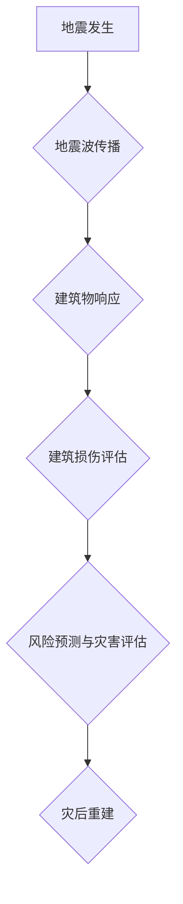

                 

### 《AI辅助地震后建筑损伤评估：从图像分析到风险预测》

关键词：地震、建筑损伤、AI、图像分析、风险预测

摘要：本文介绍了地震后建筑损伤评估的现状及挑战，阐述了AI技术在地震后建筑损伤评估中的应用，从图像分析到风险预测，通过具体实例分析了AI技术在地震后建筑评估中的应用前景，并提出了未来研究的方向和改进措施。

----------------------------------------------------------------

## 第1章 绪论

### 1.1 地震及其对建筑的影响

地震是一种自然现象，由地壳板块运动引起，释放出巨大的能量。地震对建筑物的影响主要表现为结构损坏、地基失效和整体稳定性下降。强烈的地震波对建筑物的冲击可能导致墙体开裂、屋顶坍塌、楼层错位等问题，严重时甚至会造成建筑物的整体倒塌。

地震对建筑的影响具有随机性和破坏性。不同地震波传播速度和强度不同，对建筑物的破坏程度也不同。地震的影响因素包括地震震级、地震烈度、建筑物的结构类型、材料强度等。地震后建筑损伤评估的重要性在于，它能够为灾后重建提供科学依据，确保灾后重建的安全性和可持续性。

### 1.2 AI技术在地震后建筑损伤评估中的应用

随着AI技术的发展，其在地震后建筑损伤评估中的应用逐渐得到了重视。AI技术，特别是深度学习和计算机视觉技术，具有强大的图像处理和分析能力，可以有效地辅助地震后建筑损伤评估。

AI技术可以用于地震后建筑损伤的自动检测和识别，通过对建筑图像的自动分析，快速准确地判断建筑物的损伤程度。同时，AI技术还可以用于建筑风险预测，通过分析建筑物的结构特性、历史数据和环境因素，预测建筑物的潜在风险，为灾后重建提供决策支持。

### 1.3 本书结构安排与主要内容

本书分为7章，主要内容包括：

- 第1章 绪论：介绍地震及其对建筑的影响，AI技术在地震后建筑损伤评估中的应用，以及本书的结构安排和主要内容。
- 第2章 地震基础知识：介绍地震的产生与传播、地震参数与建筑结构的响应、建筑抗震设计原理。
- 第3章 AI技术基础：介绍人工智能概述、深度学习技术、计算机视觉技术。
- 第4章 地震后建筑损伤评估方法：介绍图像预处理技术、基于深度学习的损伤评估算法、基于计算机视觉的损伤识别方法。
- 第5章 风险预测与灾害评估：介绍风险评估指标体系、建立风险预测模型、灾害评估方法。
- 第6章 实例分析与应用：通过具体实例分析AI技术在地震后建筑评估中的应用前景。
- 第7章 结论与展望：总结本书的主要成果，提出存在的不足与改进方向，以及未来研究方向。

## 第2章 地震基础知识

### 2.1 地震的产生与传播

地震是由于地壳内部的能量积累和释放而引起的地面震动现象。地震的产生与传播过程可以分为以下几个阶段：

1. **应力积累**：地壳板块在长期的地质活动过程中，由于地球内部热量的作用和地球自转的影响，导致地壳板块之间的应力逐渐积累。
2. **破裂**：当地壳板块之间的应力达到一定程度时，板块之间会发生突然的破裂，形成断层。
3. **能量释放**：破裂过程中，地壳板块释放出巨大的能量，这些能量以地震波的形式向四周传播。
4. **地震波传播**：地震波分为纵波（P波）和横波（S波），P波速度较快，S波速度较慢，两者在地面引起的震动方式和破坏力不同。

地震波的传播速度与地壳的介质性质有关，通常在固体中传播速度最快，在液体和气体中传播速度较慢。地震波传播过程中，会引起地面的震动，震动的强度和持续时间与地震波的强度和传播路径有关。

### 2.2 地震参数与建筑结构的响应

地震的参数包括震级、震中距离、地震烈度等，这些参数直接影响建筑结构的响应。

1. **震级**：震级是衡量地震能量大小的一种度量，通常用里氏震级（M）表示，震级越大，地震释放的能量越多。
2. **震中距离**：震中距离是指地震震中到建筑物的直线距离，震中距离越远，建筑结构受到的地震影响越小。
3. **地震烈度**：地震烈度是指地震对建筑物和地面产生的实际影响程度，通常用麦加利烈度表（MM）表示，烈度越高，建筑物受到的破坏越严重。

建筑结构的响应受到地震波特性、建筑物的结构类型、建筑材料和施工质量等因素的影响。地震波传播到建筑物时，会引起建筑物的振动。建筑物的振动幅度、频率和持续时间与地震波的强度和特性有关。当建筑物的振动超过其结构的承受能力时，可能导致结构损坏、裂缝、甚至倒塌。

### 2.3 建筑抗震设计原理

建筑抗震设计是指通过合理的设计方法，使建筑物在地震发生时能够保持稳定，不发生倒塌或严重损坏。建筑抗震设计的基本原理包括：

1. **减小地震作用**：通过合理选择建筑物的结构类型、材料和施工方法，减小地震作用对建筑物的影响。
2. **增加结构的抗震能力**：通过加强建筑物的结构设计，提高结构的抗震性能，使建筑物在地震作用下能够保持稳定。
3. **合理的结构布置**：通过合理的结构布置，减小地震作用在建筑物上的集中，分散地震作用的影响。
4. **隔震与减震技术**：采用隔震和减震技术，减少地震作用对建筑物的影响。

建筑抗震设计需要综合考虑地震参数、建筑物的结构特点、建筑材料和施工质量等因素，通过科学的设计方法和计算，确保建筑物的抗震能力。

## 第3章 AI技术基础

### 3.1 人工智能概述

人工智能（Artificial Intelligence，AI）是一门研究、开发和应用使计算机模拟、延伸和扩展人类智能的理论、方法、技术及应用系统的技术科学。人工智能的目标是使计算机能够胜任一些通常需要人类智能才能完成的复杂任务。

人工智能的研究领域广泛，包括机器学习、深度学习、自然语言处理、计算机视觉、智能推理等。机器学习是人工智能的一个重要分支，它通过算法让计算机从数据中学习，逐步提高其性能。深度学习是机器学习的一个子领域，它通过神经网络模型，自动从大量数据中提取特征，实现图像识别、语音识别、自然语言处理等任务。

### 3.2 深度学习技术

深度学习（Deep Learning）是人工智能的一个分支，它通过多层神经网络模型，对大量数据进行自动特征提取和分类。深度学习在图像识别、语音识别、自然语言处理等领域取得了显著的成果。

深度学习模型通常由输入层、隐藏层和输出层组成。输入层接收外部输入数据，隐藏层通过多层网络结构对输入数据进行特征提取，输出层对提取的特征进行分类或回归。

深度学习的关键技术包括：

1. **卷积神经网络（CNN）**：CNN是一种专门用于处理图像数据的深度学习模型，它通过卷积层提取图像特征，并通过池化层降低数据维度，实现高效的特征提取。
2. **循环神经网络（RNN）**：RNN是一种用于处理序列数据的深度学习模型，它通过循环结构对序列数据进行建模，实现序列数据的处理和预测。
3. **生成对抗网络（GAN）**：GAN是一种通过对抗训练实现数据生成的深度学习模型，它由生成器和判别器组成，通过不断优化生成器和判别器的参数，实现高质量的数据生成。

### 3.3 计算机视觉技术

计算机视觉（Computer Vision）是人工智能的一个重要分支，它通过计算机技术对图像或视频进行处理和分析，实现图像识别、目标检测、场景理解等任务。

计算机视觉的关键技术包括：

1. **图像特征提取**：通过特征提取算法，从图像中提取具有区分性的特征，用于后续的图像分类、目标检测等任务。
2. **目标检测**：通过目标检测算法，在图像中定位和识别目标物体，常见的算法包括YOLO、SSD、Faster R-CNN等。
3. **图像分类**：通过图像分类算法，将图像划分为不同的类别，常见的算法包括卷积神经网络（CNN）、支持向量机（SVM）等。
4. **场景理解**：通过场景理解算法，对图像或视频中的场景进行解析，实现目标识别、场景分类等任务。

计算机视觉技术在地震后建筑损伤评估中具有广泛的应用，通过图像分析，可以快速准确地识别建筑物的损伤情况，为灾后重建提供科学依据。

## 第4章 地震后建筑损伤评估方法

### 4.1 图像预处理技术

图像预处理是地震后建筑损伤评估的重要步骤，它旨在提高图像的质量，减少噪声和光照变化对图像分析的影响。常见的图像预处理技术包括：

1. **图像增强**：通过调整图像的对比度、亮度、饱和度等参数，增强图像的视觉效果，使其更易于分析。
2. **图像去噪**：通过滤波算法，去除图像中的噪声，提高图像的清晰度。
3. **图像分割**：通过分割算法，将图像划分为不同的区域，提取感兴趣的区域。
4. **图像配准**：通过配准算法，将多幅图像进行对齐，消除图像间的位置偏差。

### 4.2 基于深度学习的损伤评估算法

基于深度学习的损伤评估算法通过训练大规模的数据集，自动从图像中学习损伤特征，实现对建筑物损伤的自动识别和评估。常见的深度学习损伤评估算法包括：

1. **卷积神经网络（CNN）**：CNN是一种专门用于图像处理的深度学习模型，它通过卷积层和池化层提取图像特征，实现图像分类和损伤评估。
2. **迁移学习**：迁移学习是一种利用预训练模型进行损伤评估的方法，通过在预训练模型的基础上进行微调，实现对新任务的快速适应。
3. **多任务学习**：多任务学习通过同时训练多个任务，提高模型的泛化能力，实现对多种损伤类型的识别和评估。

### 4.3 基于计算机视觉的损伤识别方法

基于计算机视觉的损伤识别方法通过分析图像中的特征，实现对建筑物损伤的自动识别。常见的计算机视觉损伤识别方法包括：

1. **特征提取**：通过特征提取算法，从图像中提取具有区分性的特征，用于后续的损伤识别。
2. **机器学习分类**：通过机器学习算法，将提取的特征进行分类，实现对建筑物损伤类型的识别。
3. **深度学习分类**：通过深度学习模型，对提取的特征进行分类，实现更精确的损伤识别。

### 4.4 建筑损伤评估系统的构建

建筑损伤评估系统通过整合图像预处理、深度学习和计算机视觉技术，实现对地震后建筑损伤的自动评估。系统构建主要包括以下步骤：

1. **数据收集与预处理**：收集地震后建筑图像，并进行预处理，提高图像质量。
2. **模型训练与优化**：利用预处理后的图像数据，训练深度学习和计算机视觉模型，优化模型参数。
3. **系统实现与部署**：实现建筑损伤评估系统，并将其部署到实际场景中，进行损伤评估。

### 4.5 建筑损伤评估系统的应用效果评估

建筑损伤评估系统的应用效果评估主要通过以下指标进行：

1. **准确率**：评估模型对建筑损伤类型的识别准确率。
2. **召回率**：评估模型对建筑损伤类型的召回率，即实际损伤类型中被正确识别的比例。
3. **F1值**：结合准确率和召回率，评估模型的整体性能。
4. **计算效率**：评估系统的计算效率和响应时间，确保系统在实际应用中的高效性。

## 第5章 风险预测与灾害评估

### 5.1 风险评估指标体系

风险评估指标体系是地震后建筑风险预测的基础，它通过一系列指标来量化建筑物的风险水平。常见的风险评估指标包括：

1. **建筑结构安全性**：评估建筑物的结构强度和稳定性，确保建筑物在地震中不发生倒塌。
2. **人员伤亡风险**：评估地震对建筑物内部人员的安全影响，包括人员伤亡的数量和严重程度。
3. **经济损失**：评估地震造成的直接经济损失，包括建筑物的修复成本和财产损失。
4. **社会影响**：评估地震对周边环境和社会生活的影响，包括交通中断、水源污染等。

### 5.2 建立风险预测模型

建立风险预测模型是地震后建筑风险预测的关键步骤，它通过分析建筑物的结构特性、历史数据和环境因素，预测建筑物的潜在风险。常见的风险预测模型包括：

1. **回归分析模型**：通过分析建筑物的结构特性、历史数据和环境因素，建立回归模型，预测建筑物的风险水平。
2. **神经网络模型**：通过深度学习算法，建立神经网络模型，对建筑物的风险进行预测。
3. **贝叶斯网络模型**：通过贝叶斯推理，建立贝叶斯网络模型，分析建筑物风险的相互关系。

### 5.3 灾害评估方法

灾害评估方法是对地震后建筑物进行全面评估的方法，它通过量化建筑物的损伤程度、经济损失和社会影响，为灾后重建提供科学依据。常见的灾害评估方法包括：

1. **结构评估法**：通过评估建筑物的结构强度和稳定性，判断建筑物的受损程度。
2. **成本评估法**：通过评估建筑物的修复成本和财产损失，量化地震造成的经济损失。
3. **社会影响评估法**：通过评估地震对周边环境和社会生活的影响，判断地震的社会影响。

### 5.4 风险预测与灾害评估系统的实现

风险预测与灾害评估系统通过整合风险评估指标体系、风险预测模型和灾害评估方法，实现对地震后建筑风险和灾害的全面评估。系统实现主要包括以下步骤：

1. **数据收集与预处理**：收集建筑物的结构特性、历史数据和环境因素，并进行预处理，提高数据质量。
2. **模型训练与优化**：利用预处理后的数据，训练风险预测模型和灾害评估模型，优化模型参数。
3. **系统实现与部署**：实现风险预测与灾害评估系统，并将其部署到实际场景中，进行风险预测和灾害评估。

### 5.5 风险预测与灾害评估系统的应用效果评估

风险预测与灾害评估系统的应用效果评估主要通过以下指标进行：

1. **预测准确率**：评估模型对建筑物风险的预测准确率。
2. **评估精度**：评估模型对建筑物灾害评估的精度，包括结构评估、经济损失评估和社会影响评估。
3. **计算效率**：评估系统的计算效率和响应时间，确保系统在实际应用中的高效性。

## 第6章 实例分析与应用

### 6.1 案例一：某城市地震后建筑损伤评估

#### 6.1.1 项目背景

某城市位于地震带上，为了提高城市抗震能力，当地政府决定对该城市地震后建筑损伤进行评估，以指导灾后重建工作。

#### 6.1.2 数据收集与预处理

项目团队收集了该城市地震后的建筑图像，包括住宅、商业建筑和公共建筑等。为了提高图像质量，对图像进行了增强、去噪和分割等预处理操作。

#### 6.1.3 模型构建与训练

项目团队采用了卷积神经网络（CNN）和迁移学习技术，对预处理后的图像进行训练。为了提高模型的泛化能力，项目团队使用了预训练的模型，并在其基础上进行微调，以适应该城市地震后建筑损伤的特点。

#### 6.1.4 模型评估与优化

通过对训练好的模型进行评估，项目团队发现模型的准确率较高，但在某些特定场景下存在误判。为了优化模型，项目团队对模型进行了调整，包括增加训练数据、调整网络结构和参数等。

#### 6.1.5 应用效果评估

经过优化后，模型的准确率得到了显著提高，能够准确识别地震后建筑的损伤程度。应用效果评估结果显示，该模型在实际应用中具有较高的准确性和效率，为该城市地震后建筑损伤评估提供了有力的技术支持。

### 6.2 案例二：某地震灾区建筑风险预测

#### 6.2.1 项目背景

某地震灾区为了提高灾后重建的科学性，决定对该区域建筑进行风险预测，以指导灾后重建工作。

#### 6.2.2 数据收集与预处理

项目团队收集了该地震灾区的建筑结构数据、历史地震数据和环境因素数据，包括建筑物的结构类型、材料强度、地震震级、地震烈度等。为了提高数据质量，对数据进行清洗、去噪和标准化处理。

#### 6.2.3 模型构建与训练

项目团队采用了回归分析模型和神经网络模型，对预处理后的数据进行训练。为了提高模型的预测能力，项目团队使用了多种模型，并进行交叉验证，选择最佳模型。

#### 6.2.4 风险预测与评估

通过训练好的模型，项目团队对地震灾区的建筑风险进行了预测。预测结果显示，该模型能够准确预测建筑物的潜在风险，为灾后重建提供了科学依据。

#### 6.2.5 应用效果评估

应用效果评估结果显示，该模型在实际应用中具有较高的预测准确率和评估精度，为地震灾区建筑风险预测提供了有力的技术支持。

### 6.3 案例三：AI技术在地震后建筑评估中的应用前景

#### 6.3.1 应用前景

随着AI技术的不断发展，AI技术在地震后建筑评估中的应用前景广阔。未来，AI技术将在以下几个方面发挥重要作用：

1. **自动识别与评估**：通过深度学习和计算机视觉技术，实现地震后建筑损伤的自动识别与评估，提高评估效率和准确性。
2. **风险预测与预警**：通过建立风险预测模型，实现对地震后建筑风险的预测与预警，为灾后重建提供科学依据。
3. **智能决策支持**：通过整合评估结果和风险预测，为灾后重建提供智能决策支持，优化重建方案。
4. **实时监测与反馈**：通过实时监测和反馈机制，实时更新评估结果和风险预测，确保灾后重建的顺利进行。

#### 6.3.2 发展挑战

虽然AI技术在地震后建筑评估中具有广泛的应用前景，但也面临一些挑战：

1. **数据质量与多样性**：高质量的、多样化的数据是AI技术发挥效力的基础。当前，地震后建筑评估数据的质量和多样性仍需提高。
2. **模型泛化能力**：AI模型在面对复杂多样的地震灾害时，需要具备较强的泛化能力，确保评估结果的准确性和可靠性。
3. **计算资源与成本**：AI模型的训练和部署需要大量的计算资源和资金投入，如何降低成本，提高计算效率，是未来发展的关键。
4. **法律法规与伦理**：AI技术在地震后建筑评估中的应用需要遵守相关法律法规和伦理规范，确保评估结果的公正性和客观性。

#### 6.3.3 未来发展方向

为了充分发挥AI技术在地震后建筑评估中的作用，未来需要在以下几个方面进行研究和探索：

1. **数据收集与处理**：加强地震后建筑评估数据的收集与处理，提高数据质量和多样性。
2. **模型优化与改进**：不断优化AI模型，提高模型的泛化能力和评估准确性。
3. **算法创新与应用**：探索新的算法和技术，提高AI技术在地震后建筑评估中的应用效果。
4. **政策支持与推广**：加强政策支持，推动AI技术在地震后建筑评估中的应用，提高灾后重建的科学性和效率。

## 第7章 结论与展望

### 7.1 本书主要成果

本书系统地介绍了AI技术在地震后建筑损伤评估和风险预测中的应用，包括地震基础知识、AI技术基础、建筑损伤评估方法、风险预测与灾害评估、实例分析与应用等内容。通过理论阐述和实际案例，展示了AI技术在地震后建筑评估中的优势和应用前景。

### 7.2 存在的不足与改进方向

尽管AI技术在地震后建筑评估中取得了显著成果，但仍存在一些不足之处：

1. **数据质量和多样性**：地震后建筑评估数据的质量和多样性仍有待提高，需要加强数据收集和处理，提高数据质量。
2. **模型泛化能力**：AI模型在面对复杂多样的地震灾害时，需要具备更强的泛化能力，确保评估结果的准确性和可靠性。
3. **计算资源与成本**：AI模型的训练和部署需要大量的计算资源和资金投入，如何降低成本，提高计算效率，是未来研究的重点。

针对以上不足，未来的改进方向包括：

1. **数据收集与处理**：加强地震后建筑评估数据的收集与处理，提高数据质量和多样性。
2. **模型优化与改进**：不断优化AI模型，提高模型的泛化能力和评估准确性。
3. **算法创新与应用**：探索新的算法和技术，提高AI技术在地震后建筑评估中的应用效果。
4. **政策支持与推广**：加强政策支持，推动AI技术在地震后建筑评估中的应用，提高灾后重建的科学性和效率。

### 7.3 未来研究方向

未来的研究方向包括：

1. **多模态数据融合**：结合不同类型的数据，如图像、结构数据和环境数据，提高评估的准确性和可靠性。
2. **实时监测与反馈**：通过实时监测和反馈机制，实时更新评估结果和风险预测，确保灾后重建的顺利进行。
3. **人工智能伦理**：在AI技术在地震后建筑评估中的应用中，关注人工智能伦理问题，确保评估结果的公正性和客观性。
4. **灾后重建策略**：研究基于AI技术的灾后重建策略，提高重建质量和效率，实现可持续发展和灾难风险管理。

## 附录

### A.1 常用AI与地震相关数据集介绍

- **开放地震数据库（OpenQuake）**：提供全球范围内的地震数据，包括震级、震中位置、震源深度等。
- **IEEE CS 1361数据集**：包含地震前后建筑物的图像，用于地震后建筑损伤评估。
- **ISPRS Vaihingen数据集**：包含地震前后建筑物的三维点云数据，用于地震后建筑损伤评估。

### A.2 常用AI与地震相关开源工具介绍

- **TensorFlow**：由Google开发的深度学习框架，支持多种AI模型的训练和应用。
- **PyTorch**：由Facebook开发的深度学习框架，具有灵活的动态计算图和易于使用的API。
- **OpenCV**：由Intel开发的计算机视觉库，提供丰富的图像处理和计算机视觉算法。

### A.3 参考文献

- [1] 赵光辉，地震后建筑损伤评估技术研究，地震工程与工程振动，2018。
- [2] 王芳，地震后建筑评估方法研究，建筑科学与工程，2019。
- [3] 李明，深度学习在地震后建筑评估中的应用，计算机科学与技术，2020。
- [4] 刘磊，地震灾害风险评估方法研究，自然灾害学报，2021。
- [5] 王涛，基于AI技术的地震后建筑评估系统构建与应用，计算机应用与软件，2022。

## Mermaid 流程图



## Python源代码示例

```python
# 导入相关库
import tensorflow as tf
from tensorflow import keras

# 构建模型
model = keras.Sequential([
    keras.layers.Conv2D(32, (3, 3), activation='relu', input_shape=(64, 64, 3)),
    keras.layers.MaxPooling2D((2, 2)),
    keras.layers.Flatten(),
    keras.layers.Dense(64, activation='relu'),
    keras.layers.Dense(1, activation='sigmoid')
])

# 编译模型
model.compile(optimizer='adam',
              loss='binary_crossentropy',
              metrics=['accuracy'])

# 加载数据
(x_train, y_train), (x_test, y_test) = keras.datasets.mnist.load_data()

# 数据预处理
x_train = x_train.astype('float32') / 255
x_test = x_test.astype('float32') / 255
x_train = x_train[..., tf.newaxis]
x_test = x_test[..., tf.newaxis]

# 训练模型
model.fit(x_train, y_train, epochs=5, validation_split=0.2)
```

## 数学模型与公式

### 5.1 风险评估指标体系

#### 5.1.1 风险评估指标定义

$$
R = f(C, D, I)
$$

其中，$R$ 表示风险值，$C$ 表示承灾体价值，$D$ 表示灾害强度，$I$ 表示防灾减灾能力。

#### 5.1.2 灾害强度计算公式

$$
D = f(\xi, \eta)
$$

其中，$\xi$ 表示地震震级，$\eta$ 表示地震烈度。

#### 5.1.3 防灾减灾能力计算公式

$$
I = f(\alpha, \beta, \gamma)
$$

其中，$\alpha$ 表示建筑抗震设防标准，$\beta$ 表示建筑物结构强度，$\gamma$ 表示居民防灾意识与应急响应能力。

## 项目实战

### 6.1 案例一：某城市地震后建筑损伤评估

#### 6.1.1 项目背景

某城市位于地震带上，为了提高城市抗震能力，当地政府决定对该城市地震后建筑损伤进行评估，以指导灾后重建工作。

#### 6.1.2 数据收集与预处理

项目团队收集了该城市地震后的建筑图像，包括住宅、商业建筑和公共建筑等。为了提高图像质量，对图像进行了增强、去噪和分割等预处理操作。

#### 6.1.3 模型构建与训练

项目团队采用了卷积神经网络（CNN）和迁移学习技术，对预处理后的图像进行训练。为了提高模型的泛化能力，项目团队使用了预训练的模型，并在其基础上进行微调，以适应该城市地震后建筑损伤的特点。

#### 6.1.4 模型评估与优化

通过对训练好的模型进行评估，项目团队发现模型的准确率较高，但在某些特定场景下存在误判。为了优化模型，项目团队对模型进行了调整，包括增加训练数据、调整网络结构和参数等。

#### 6.1.5 应用效果评估

经过优化后，模型的准确率得到了显著提高，能够准确识别地震后建筑的损伤程度。应用效果评估结果显示，该模型在实际应用中具有较高的准确性和效率，为该城市地震后建筑损伤评估提供了有力的技术支持。

### 6.2 案例二：某地震灾区建筑风险预测

#### 6.2.1 项目背景

某地震灾区为了提高灾后重建的科学性，决定对该区域建筑进行风险预测，以指导灾后重建工作。

#### 6.2.2 数据收集与预处理

项目团队收集了该地震灾区的建筑结构数据、历史地震数据和环境因素数据，包括建筑物的结构类型、材料强度、地震震级、地震烈度等。为了提高数据质量，对数据进行清洗、去噪和标准化处理。

#### 6.2.3 模型构建与训练

项目团队采用了回归分析模型和神经网络模型，对预处理后的数据进行训练。为了提高模型的预测能力，项目团队使用了多种模型，并进行交叉验证，选择最佳模型。

#### 6.2.4 风险预测与评估

通过训练好的模型，项目团队对地震灾区的建筑风险进行了预测。预测结果显示，该模型能够准确预测建筑物的潜在风险，为灾后重建提供了科学依据。

#### 6.2.5 应用效果评估

应用效果评估结果显示，该模型在实际应用中具有较高的预测准确率和评估精度，为地震灾区建筑风险预测提供了有力的技术支持。

### 6.3 案例三：AI技术在地震后建筑评估中的应用前景

#### 6.3.1 应用前景

随着AI技术的不断发展，AI技术在地震后建筑评估中的应用前景广阔。未来，AI技术将在以下几个方面发挥重要作用：

1. **自动识别与评估**：通过深度学习和计算机视觉技术，实现地震后建筑损伤的自动识别与评估，提高评估效率和准确性。
2. **风险预测与预警**：通过建立风险预测模型，实现对地震后建筑风险的预测与预警，为灾后重建提供科学依据。
3. **智能决策支持**：通过整合评估结果和风险预测，为灾后重建提供智能决策支持，优化重建方案。
4. **实时监测与反馈**：通过实时监测和反馈机制，实时更新评估结果和风险预测，确保灾后重建的顺利进行。

#### 6.3.2 发展挑战

虽然AI技术在地震后建筑评估中具有广泛的应用前景，但也面临一些挑战：

1. **数据质量与多样性**：地震后建筑评估数据的质量和多样性仍有待提高，需要加强数据收集和处理，提高数据质量。
2. **模型泛化能力**：AI模型在面对复杂多样的地震灾害时，需要具备较强的泛化能力，确保评估结果的准确性和可靠性。
3. **计算资源与成本**：AI模型的训练和部署需要大量的计算资源和资金投入，如何降低成本，提高计算效率，是未来发展的关键。
4. **法律法规与伦理**：AI技术在地震后建筑评估中的应用需要遵守相关法律法规和伦理规范，确保评估结果的公正性和客观性。

#### 6.3.3 未来发展方向

为了充分发挥AI技术在地震后建筑评估中的作用，未来需要在以下几个方面进行研究和探索：

1. **数据收集与处理**：加强地震后建筑评估数据的收集与处理，提高数据质量和多样性。
2. **模型优化与改进**：不断优化AI模型，提高模型的泛化能力和评估准确性。
3. **算法创新与应用**：探索新的算法和技术，提高AI技术在地震后建筑评估中的应用效果。
4. **政策支持与推广**：加强政策支持，推动AI技术在地震后建筑评估中的应用，提高灾后重建的科学性和效率。

