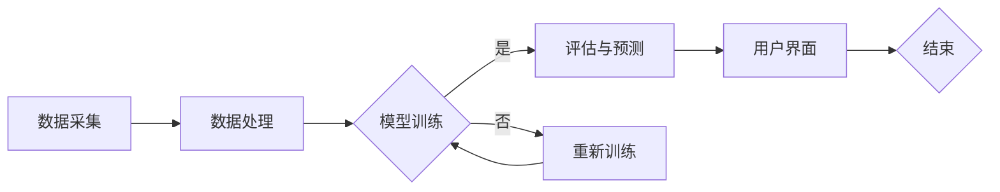

                 

### 第一部分: AI辅助地震灾害链影响评估概述

在当今快速发展的科技时代，人工智能（AI）技术正在逐步渗透到各个领域，包括自然灾害影响评估。地震灾害作为一种常见的自然灾害，其带来的破坏性巨大，不仅影响地表结构，还会对社会经济产生深远的影响。AI技术在这一领域的应用，为地震灾害链的影响评估提供了全新的手段和思路。

#### 1.1 地震灾害链的基本概念

地震灾害链是指一系列与地震活动相关的灾害事件，这些事件在时间上和空间上存在一定的关联性。地震灾害链通常包括以下几个阶段：

1. 地震发生：地震的突然发生是地震灾害链的开始，它通常伴随着地表的急剧变形和能量的释放。
2. 地表变形：地震产生的能量会引起地表的变形，包括地裂缝、滑坡、地陷等现象。
3. 社会经济损失：地震造成的地表变形和破坏会直接影响社会和经济活动，可能导致建筑物毁坏、交通中断、基础设施瘫痪等。
4. 恢复与重建：地震后的恢复和重建工作需要大量的人力、物力和财力投入。

#### 1.2 地震灾害链的形成机制

地震灾害链的形成机制复杂，涉及地质构造、地震波传播、能量释放等多个方面。具体来说，地震灾害链的形成机制包括：

1. 地质构造：地震通常发生在地质构造的断层带上，这些断层带是地壳运动和应力积累的结果。
2. 地震波传播：地震发生时，能量以地震波的形式向外传播，这些地震波会引发地表的变形。
3. 能量释放：地震能量在断层带上的积累和释放是地震灾害链的核心机制。

#### 1.3 地震灾害链的影响范围

地震灾害链的影响范围广泛，不仅涉及自然领域，还包括社会和经济领域。具体来说，地震灾害链的影响范围包括：

1. 地表影响：地震引起的地表变形会破坏道路、桥梁、建筑物等基础设施。
2. 生态环境影响：地震可能引发滑坡、泥石流等次生灾害，对生态环境造成破坏。
3. 社会影响：地震造成的社会经济损失可能导致失业、贫困、社会不稳定等。
4. 经济影响：地震破坏了生产力和经济基础，可能对整个区域甚至国家的经济产生长期影响。

### 总结

地震灾害链的影响评估是一个复杂的过程，需要综合分析地震发生、地表变形、社会经济损失等多个方面。AI技术的引入，为地震灾害链影响评估提供了新的手段，通过数据挖掘、模式识别、机器学习等技术，可以更加精确和高效地评估地震灾害链的影响。在接下来的章节中，我们将进一步探讨地表变形监测技术、地震灾害链风险评估方法以及社会经济损失评估方法，展示AI技术在地震灾害链影响评估中的具体应用。

### 目录大纲

#### 目录大纲

**第一部分: AI辅助地震灾害链影响评估概述**

1. 地震灾害链概述
   1.1 地震灾害链的基本概念
   1.2 地震灾害链的形成机制
   1.3 地震灾害链的影响范围
2. 地表变形监测技术
   2.1 地表变形监测方法
   2.2 地表变形监测技术发展
   2.3 地表变形监测数据应用
3. 地震灾害链风险评估
   3.1 风险评估模型与方法
   3.2 风险评估指标体系
   3.3 风险评估案例分析
4. 社会经济损失评估
   4.1 社会经济损失的概念与影响
   4.2 社会经济损失评估方法
   4.3 社会经济损失评估案例分析
5. AI技术在地震灾害链影响评估中的应用
   5.1 AI技术在地震灾害链影响评估中的优势
   5.2 AI技术在地震灾害链影响评估中的应用案例
6. AI辅助地震灾害链影响评估系统设计与实现
   6.1 系统架构设计
   6.2 数据处理与模型训练
   6.3 系统实现与测试
7. 结论与展望
   7.1 研究结论
   7.2 研究不足与展望
   7.3 未来研究方向

### 附录

- 附录A: 相关术语解释
- 附录B: 参考文献列表
- 附录C: Mermaid 流程图

---

通过以上章节的安排，我们将系统地介绍地震灾害链影响评估的各个方面，并通过AI技术的引入，展示其在该领域中的应用潜力和优势。

## 第1章: 地震灾害链概述

地震作为一种常见的自然灾害，其发生不仅会对地表结构造成破坏，还会对社会经济产生深远的影响。本章将介绍地震灾害链的基本概念、形成机制以及影响范围，为后续章节的探讨打下基础。

### 1.1 地震灾害链的基本概念

地震灾害链是指一系列与地震活动相关的灾害事件，这些事件在时间上和空间上存在一定的关联性。地震灾害链通常包括以下几个阶段：

1. 地震发生：地震的突然发生是地震灾害链的开始，它通常伴随着地表的急剧变形和能量的释放。
2. 地表变形：地震产生的能量会引起地表的变形，包括地裂缝、滑坡、地陷等现象。
3. 社会经济损失：地震造成的地表变形和破坏会直接影响社会和经济活动，可能导致建筑物毁坏、交通中断、基础设施瘫痪等。
4. 恢复与重建：地震后的恢复和重建工作需要大量的人力、物力和财力投入。

地震灾害链的这些阶段是相互关联的，前一个阶段往往为后一个阶段的发生提供了条件和基础。例如，地震发生引起的地表变形，会进一步导致社会经济损失，而社会经济损失又反过来影响到地震灾害链的恢复和重建阶段。

### 1.2 地震灾害链的形成机制

地震灾害链的形成机制复杂，涉及地质构造、地震波传播、能量释放等多个方面。具体来说，地震灾害链的形成机制包括：

1. 地质构造：地震通常发生在地质构造的断层带上，这些断层带是地壳运动和应力积累的结果。断层带上的岩石在应力积累到一定程度时，会发生断裂和滑动，从而释放出巨大的能量。
   
   $$
   \text{应力} = \frac{\text{岩石的抗压强度}}{\text{断层带的宽度}}
   $$
   
   当应力超过岩石的抗压强度时，断层带会发生滑动，产生地震。

2. 地震波传播：地震发生时，能量以地震波的形式向外传播，这些地震波会引发地表的变形。地震波包括纵波（P波）和横波（S波），它们在不同介质中的传播速度和性质有所不同。

   $$
   \text{地震波传播速度} = \sqrt{\frac{\text{介质的剪切模量}}{\text{介质的密度}}}
   $$

3. 能量释放：地震能量在断层带上的积累和释放是地震灾害链的核心机制。当地震波传播到地表时，能量会进一步释放，引起地表的变形，如地裂缝、滑坡、地陷等现象。

### 1.3 地震灾害链的影响范围

地震灾害链的影响范围广泛，不仅涉及自然领域，还包括社会和经济领域。具体来说，地震灾害链的影响范围包括：

1. 地表影响：地震引起的地表变形会破坏道路、桥梁、建筑物等基础设施。例如，地裂缝可能导致道路中断，建筑物倒塌。

2. 生态环境影响：地震可能引发滑坡、泥石流等次生灾害，对生态环境造成破坏。例如，地震引发的滑坡可能堵塞河流，导致洪水泛滥。

3. 社会影响：地震造成的社会经济损失可能导致失业、贫困、社会不稳定等。例如，地震破坏了工厂，导致工人失业，家庭贫困。

4. 经济影响：地震破坏了生产力和经济基础，可能对整个区域甚至国家的经济产生长期影响。例如，地震导致的基础设施损坏，可能严重影响区域交通和物流，进而影响整个经济的运转。

### 总结

地震灾害链的影响评估是一个复杂的过程，需要综合分析地震发生、地表变形、社会经济损失等多个方面。通过本章的介绍，我们对地震灾害链的基本概念、形成机制以及影响范围有了初步的了解。在接下来的章节中，我们将进一步探讨地表变形监测技术、地震灾害链风险评估方法以及社会经济损失评估方法，展示AI技术在地震灾害链影响评估中的具体应用。

## 第2章: 地表变形监测技术

地表变形监测是地震灾害链影响评估的重要环节，通过对地表变形的实时监测，可以及时掌握地震灾害的动态变化，为灾害预警和评估提供科学依据。本章将详细介绍地表变形监测的方法、技术发展及其在地震灾害链影响评估中的应用。

### 2.1 地表变形监测方法

地表变形监测方法主要包括地面观测、遥感监测和地面测量三种。

#### 2.1.1 地面观测

地面观测是指通过人工或自动化设备在地表直接进行观测。常见的地面观测方法包括：

1. **地面测量**：使用测量仪器（如全站仪、GPS等）对地表点进行位置测量，以获取地表点的空间变化信息。
2. **倾斜测量**：通过测量建筑物或地表点的倾斜角度，监测其稳定性。
3. **地表裂缝观测**：通过肉眼或光学仪器观测地表裂缝的产生和发展情况。

地面观测的优点是能够提供高精度的实时数据，但其局限性在于监测范围较小，无法覆盖大面积的地表变形。

#### 2.1.2 遥感监测

遥感监测是指通过卫星或航空遥感技术对地表进行远距离监测。常见的遥感监测方法包括：

1. **光学遥感**：利用光学传感器（如CCD、CMOS等）获取地表图像，通过图像处理分析地表变形。
2. **雷达遥感**：利用合成孔径雷达（SAR）技术获取地表的微波信号，通过信号处理分析地表变形。
3. **激光雷达**：利用激光脉冲测量地表点到激光发射器的距离，获取高精度的地表点云数据。

遥感监测的优点在于能够覆盖大面积地表，实时获取地表变形信息，但其精度相对地面观测较低。

#### 2.1.3 地面测量

地面测量是指通过地面设备（如GPS、全站仪等）进行地表点的定位测量。常见的地面测量方法包括：

1. **GPS测量**：通过卫星定位系统获取地表点的空间位置，实时监测地表变形。
2. **全站仪测量**：通过全站仪获取地表点的三维坐标，进行地表变形分析。

地面测量具有高精度和高可靠性的特点，但同样存在监测范围较小的局限性。

### 2.2 地表变形监测技术发展

随着科技的进步，地表变形监测技术也在不断发展和创新，主要体现在以下几个方面：

1. **多源数据融合**：通过整合地面观测、遥感监测和地面测量的数据，提高监测精度和可靠性。
   
   $$
   \text{融合算法} = \frac{\text{地面观测数据} + \text{遥感监测数据} + \text{地面测量数据}}{3}
   $$

2. **实时监测技术**：利用现代通信技术（如5G、物联网等）实现地表变形数据的实时传输和监测。
   
   $$
   \text{实时监测系统} = \text{传感器网络} + \text{通信网络} + \text{数据处理平台}
   $$

3. **大数据分析技术**：通过大数据技术对海量地表变形数据进行深度分析和挖掘，揭示地震灾害链的影响规律。

   $$
   \text{大数据分析流程} = \text{数据采集} \rightarrow \text{数据预处理} \rightarrow \text{数据存储} \rightarrow \text{数据分析} \rightarrow \text{数据可视化}
   $$

4. **人工智能技术**：利用机器学习、深度学习等技术，对地表变形数据进行智能分析和预测。

   $$
   \text{AI模型训练} = \text{数据集准备} \rightarrow \text{特征提取} \rightarrow \text{模型训练} \rightarrow \text{模型评估} \rightarrow \text{模型应用}
   $$

### 2.3 地表变形监测数据应用

地表变形监测数据在地震灾害链影响评估中具有重要作用，其应用主要包括：

1. **灾害预警**：通过实时监测地表变形数据，可以及时发现地震前兆，为灾害预警提供科学依据。

   $$
   \text{预警模型} = \text{地表变形数据} \rightarrow \text{预警指标计算} \rightarrow \text{预警信息发布}
   $$

2. **灾害评估**：利用地表变形数据，可以评估地震造成的地表破坏程度，为灾害评估提供数据支持。

   $$
   \text{评估模型} = \text{地表变形数据} \rightarrow \text{破坏程度计算} \rightarrow \text{灾害损失评估}
   $$

3. **灾后恢复**：通过地表变形监测数据，可以指导灾后恢复和重建工作，优化资源配置。

   $$
   \text{恢复计划} = \text{地表变形数据} \rightarrow \text{恢复需求分析} \rightarrow \text{恢复方案设计}
   $$

### 总结

地表变形监测技术是地震灾害链影响评估的重要手段，通过地面观测、遥感监测和地面测量等方法，可以实时、准确地获取地表变形信息。随着技术的不断发展，地表变形监测技术在精度、实时性、数据分析等方面取得了显著进步。在AI技术的支持下，地表变形监测数据的分析能力和应用水平进一步提升，为地震灾害链影响评估提供了有力保障。在下一章中，我们将探讨地震灾害链风险评估的方法和指标体系。

### 2.3 地表变形监测数据应用

地表变形监测数据在地震灾害链影响评估中具有重要作用，其应用主要包括以下几个方面：

#### 2.3.1 灾害预警

地表变形监测数据是地震预警的重要依据。通过实时监测地表变形数据，可以及时发现地震前兆，如地表裂缝的产生、建筑物倾斜等，为地震预警提供科学依据。例如，利用GPS测量数据，可以实时跟踪地表点的空间变化，当监测数据超过预警阈值时，系统会自动发出预警信息。

预警模型的基本流程如下：

1. **数据采集**：通过传感器网络收集地表变形数据。
2. **数据预处理**：对采集到的数据进行滤波、去噪等处理，确保数据质量。
3. **预警指标计算**：根据地表变形数据计算预警指标，如裂缝长度、建筑物倾斜角度等。
4. **预警信息发布**：当预警指标超过设定阈值时，系统自动发布预警信息。

Python代码示例：

```python
import numpy as np

def calculate预警指标(data):
    # 假设data是地表变形数据
    max_deformation = np.max(data)
    return max_deformation

# 示例数据
data = [0.1, 0.2, 0.3, 0.4, 0.5]

# 计算预警指标
预警指标 = calculate预警指标(data)

# 预警阈值设定
threshold = 0.3

# 判断是否预警
if 预警指标 > threshold:
    print("地震预警：地表变形超过阈值，请注意！")
else:
    print("当前地表变形在安全范围内。")
```

#### 2.3.2 灾害评估

地表变形数据可以用于评估地震造成的地表破坏程度，为灾害损失评估提供数据支持。通过分析地表变形数据，可以计算地震造成的经济损失、基础设施损坏程度等。

评估模型的基本流程如下：

1. **数据采集**：通过遥感监测、地面测量等方式获取地表变形数据。
2. **破坏程度计算**：根据地表变形数据，计算不同区域的破坏程度，如地裂缝长度、建筑物倾斜角度等。
3. **灾害损失评估**：结合区域经济数据、基础设施状况等，评估地震造成的经济损失。

Python代码示例：

```python
import pandas as pd

def calculate_loss(data, economic_data):
    # 假设data是地表变形数据，economic_data是区域经济数据
    loss = data.apply(lambda x: calculate_damage(x, economic_data))
    return loss

def calculate_damage(deformation, economic_data):
    # 假设deformation是地表变形，economic_data是区域经济数据
    damage = deformation * economic_data['GDP_per_sqkm']
    return damage

# 示例数据
data = pd.DataFrame({'deformation': [0.1, 0.2, 0.3]})
economic_data = pd.DataFrame({'GDP_per_sqkm': [1000, 2000, 3000]})

# 计算灾害损失
loss = calculate_loss(data, economic_data)
print(loss)
```

#### 2.3.3 灾后恢复

地表变形监测数据可以用于指导灾后恢复和重建工作，优化资源配置。通过分析地表变形数据，可以确定受损区域和受损程度，为恢复方案设计提供科学依据。

恢复计划的基本流程如下：

1. **数据采集**：通过遥感监测、地面测量等方式获取地表变形数据。
2. **恢复需求分析**：根据地表变形数据，分析不同区域的恢复需求，如道路修复、建筑物加固等。
3. **恢复方案设计**：结合区域资源、经济状况等，制定详细的恢复方案。

Python代码示例：

```python
import pandas as pd

def calculate_repair需求的区域(data, repair_cost):
    # 假设data是地表变形数据，repair_cost是修复成本
    repair需求的区域 = data.apply(lambda x: calculate_repair需求(x, repair_cost))
    return repair需求的区域

def calculate_repair需求(deformation, repair_cost):
    # 假设deformation是地表变形，repair_cost是修复成本
    repair需求 = deformation * repair_cost
    return repair需求

# 示例数据
data = pd.DataFrame({'deformation': [0.1, 0.2, 0.3]})
repair_cost = 10000

# 计算恢复需求
repair需求的区域 = calculate_repair需求的区域(data, repair_cost)
print(repair需求的区域)
```

### 总结

地表变形监测数据在地震灾害链影响评估中具有重要作用，通过数据采集、处理和分析，可以实现灾害预警、灾害评估和灾后恢复等应用。在实际应用中，地表变形监测技术需要与其他监测手段相结合，以提高监测精度和可靠性。随着AI技术的不断发展，地表变形监测数据的分析和应用能力将进一步提升，为地震灾害链影响评估提供更加科学和准确的手段。在下一章中，我们将探讨地震灾害链风险评估的方法和指标体系。

## 第3章: 地震灾害链风险评估

地震灾害链的风险评估是地震灾害管理的关键环节，通过对地震灾害的可能性及其可能造成的影响进行综合评估，可以帮助决策者制定有效的防灾减灾措施。本章将介绍地震灾害链风险评估的模型与方法、指标体系，并分析一个实际案例。

### 3.1 风险评估模型与方法

地震灾害链风险评估通常采用定量和定性相结合的方法，以下是一些常用的模型和方法：

#### 3.1.1 定量风险评估模型

1. **灾害概率模型**：基于地震发生的频率和地震带的分布，计算地震发生的概率。常用的方法包括地震危险性分析（Seismic Hazard Analysis，SHA）和地震风险分析（Seismic Risk Analysis，SRA）。

   $$ 
   P(E) = \int_{T} P(E|H(t)) f(H(t)) dt 
   $$
   
   其中，\(P(E)\)是地震发生的概率，\(P(E|H(t))\)是给定地震带历史地震记录下地震发生的条件概率，\(f(H(t))\)是地震带历史地震记录的分布函数。

2. **经济损失模型**：基于地震影响和损失函数，计算地震可能造成的经济损失。常用的方法包括地震经济损失模型（Earthquake Economic Loss Model，EELM）和地震损失评估模型（Earthquake Loss Assessment Model，ELAM）。

   $$ 
   L = \sum_{i=1}^{n} C_i \cdot D_i 
   $$
   
   其中，\(L\)是总经济损失，\(C_i\)是第\(i\)类建筑的损失系数，\(D_i\)是第\(i\)类建筑的数量。

#### 3.1.2 定性风险评估方法

1. **风险矩阵法**：通过专家评估方法，将地震灾害的可能性、影响和严重程度转化为风险值。常用的方法包括专家打分法、模糊综合评价法等。

2. **灾害情景法**：通过构建不同地震灾害情景，评估地震可能造成的影响。常用的方法包括灾害树（Disaster Tree）和灾害场景模拟（Disaster Scenario Simulation）。

### 3.2 风险评估指标体系

地震灾害链风险评估的指标体系通常包括以下几个方面：

1. **地震活动性指标**：包括地震发生的频率、震级分布、地震带的分布等。
2. **灾害影响指标**：包括地震造成的地表变形、建筑破坏、人员伤亡等。
3. **经济损失指标**：包括直接经济损失和间接经济损失，如基础设施损坏、生产中断、社会福利减少等。
4. **社会影响指标**：包括地震对社会生活、社会秩序、心理健康等的影响。

#### 3.2.1 地震活动性指标

地震活动性指标主要反映地震的发生频率和强度。常用的指标包括：

1. **地震频率**：指单位时间内地震发生的次数。
2. **地震震级**：指地震释放能量的尺度，通常用里氏震级（Richter Magnitude，M）表示。
3. **地震带**：指地震频繁发生的地带，如环太平洋地震带、地中海-喜马拉雅地震带等。

#### 3.2.2 灾害影响指标

灾害影响指标主要反映地震对人类活动和基础设施的影响。常用的指标包括：

1. **地表变形**：包括地裂缝、滑坡、地陷等。
2. **建筑破坏**：包括建筑物倒塌、裂缝、倾斜等。
3. **人员伤亡**：包括直接死亡、重伤、轻伤等。

#### 3.2.3 经济损失指标

经济损失指标主要反映地震对经济活动的破坏程度。常用的指标包括：

1. **直接经济损失**：包括建筑物、基础设施、农田等的直接破坏损失。
2. **间接经济损失**：包括生产中断、商业活动停滞、社会福利减少等。

#### 3.2.4 社会影响指标

社会影响指标主要反映地震对社会生活的破坏程度。常用的指标包括：

1. **社会秩序**：包括社会治安、交通秩序等。
2. **心理健康**：包括受灾群众的心理状况、心理健康服务等。

### 3.3 风险评估案例分析

以下是一个地震灾害链风险评估的案例，该案例使用定量和定性方法相结合，对某一地区的地震灾害链进行评估。

#### 案例背景

某地区位于地震带上，历史上曾发生过多次较大地震。为了评估该地区的地震灾害链风险，相关部门决定进行风险评估。

#### 案例步骤

1. **数据收集**：收集该地区地震活动性数据、地震灾害影响数据、经济损失数据和社会影响数据。

2. **模型建立**：使用灾害概率模型和经济损失模型建立地震灾害链风险评估模型。

3. **指标计算**：根据收集到的数据，计算地震活动性指标、灾害影响指标、经济损失指标和社会影响指标。

4. **风险评估**：根据计算结果，评估地震灾害链的风险等级。

5. **建议措施**：根据风险评估结果，提出防灾减灾建议措施。

#### 案例结果

根据评估结果，该地区地震灾害链的风险等级为中等风险。具体表现如下：

1. **地震活动性**：地震频率较高，震级分布不均，地震带较为集中。
2. **灾害影响**：地震可能造成地表变形、建筑破坏和人员伤亡。
3. **经济损失**：地震可能导致直接经济损失，如建筑物倒塌、基础设施损坏，以及间接经济损失，如生产中断、商业活动停滞等。
4. **社会影响**：地震可能对社会秩序和心理健康造成较大影响。

#### 案例分析

该案例表明，地震灾害链风险评估是一项复杂的工作，需要综合考虑地震活动性、灾害影响、经济损失和社会影响等多个方面。通过定性和定量方法相结合，可以较为准确地评估地震灾害链的风险等级，为防灾减灾提供科学依据。在实际应用中，风险评估模型和方法需要根据具体情况进行调整和优化，以提高评估的准确性和实用性。

### 总结

地震灾害链风险评估是地震灾害管理的重要组成部分，通过对地震灾害链的风险进行定量和定性评估，可以帮助决策者制定有效的防灾减灾措施。本章介绍了地震灾害链风险评估的模型与方法、指标体系，并通过实际案例进行了分析。在下一章中，我们将探讨社会经济损失评估的方法和案例分析。

## 第4章: 社会经济损失评估

地震不仅对自然环境和基础设施造成破坏，还会对社会经济产生深远的影响。社会经济损失评估是对地震灾害对社会和经济活动的具体影响进行量化分析的重要环节。本章将介绍社会经济损失的概念与影响、评估方法以及一个实际案例。

### 4.1 社会经济损失的概念与影响

社会经济损失是指地震灾害对社会经济系统造成的直接和间接损失。这些损失可以包括但不限于以下几个方面：

1. **直接经济损失**：指地震直接造成的物质损害，包括房屋倒塌、道路损坏、桥梁断裂、工业设施破坏等。这些损失通常是容易量化的，可以通过建筑物的修复费用、基础设施的重建成本等来计算。

   $$ 
   \text{直接经济损失} = \sum_{i=1}^{n} C_i \times D_i 
   $$

   其中，\(C_i\) 是第 \(i\) 个受损项目的成本，\(D_i\) 是第 \(i\) 个项目的损失程度。

2. **间接经济损失**：指地震灾害导致的间接影响，如生产中断、商业活动减少、供应链中断、社会服务暂停等。这些损失往往难以直接量化，但对社会经济的负面影响却是巨大的。

   $$ 
   \text{间接经济损失} = \sum_{j=1}^{m} E_j \times P_j 
   $$

   其中，\(E_j\) 是第 \(j\) 个间接损失项目的成本，\(P_j\) 是第 \(j\) 个项目的发生概率。

社会经济损失的影响广泛，不仅体现在经济损失上，还会对社会的稳定性和发展产生长远影响。例如，地震可能导致失业率上升、居民生活水平下降、社会矛盾加剧等，这些都是社会经济损失的体现。

### 4.2 社会经济损失评估方法

社会经济损失评估的方法包括定量评估和定性评估两种。

#### 4.2.1 定量评估方法

定量评估方法主要通过数据收集和分析，对经济损失进行量化。以下是一些常见的定量评估方法：

1. **损失评估模型**：通过建立数学模型，将经济损失分解为多个部分，如建筑物损失、基础设施损失等，并分别计算其损失值。

   $$ 
   \text{总经济损失} = \text{建筑物损失} + \text{基础设施损失} + \text{其他损失} 
   $$

2. **成本-效益分析**：通过对地震灾害前后的经济活动进行比较，评估灾害带来的经济损失。这种方法通常涉及对生产力的损失、市场需求的下降等。

   $$ 
   \text{经济损失} = \text{灾害前GDP} - \text{灾害后GDP} 
   $$

3. **时间序列分析**：利用时间序列数据，分析地震灾害前后经济指标的变化趋势，如GDP、失业率、物价指数等，以评估经济损失。

#### 4.2.2 定性评估方法

定性评估方法主要通过专家意见、情景分析等方式，对经济损失进行评估。以下是一些常见的定性评估方法：

1. **专家评估法**：通过专家访谈、问卷调查等方式，获取专家对经济损失的评估意见，综合各方意见得出评估结果。

2. **灾害情景法**：通过构建不同地震灾害情景，评估地震可能造成的社会经济损失，如场景模拟、灾害树等。

### 4.3 社会经济损失评估案例分析

以下是一个实际案例，该案例使用定量和定性方法相结合，对某地区地震灾害的社会经济损失进行评估。

#### 案例背景

某地区发生了一场5.8级地震，导致大量房屋倒塌，基础设施损坏，经济活动受到影响。为了评估该地震的社会经济损失，相关部门决定进行评估。

#### 案例步骤

1. **数据收集**：收集地震发生前的经济数据、地震后的经济数据、基础设施状况、居民财产损失等。

2. **定量评估**：使用损失评估模型和成本-效益分析方法，计算直接经济损失和间接经济损失。

3. **定性评估**：通过专家评估法和灾害情景法，分析地震对社会经济的影响。

4. **综合评估**：综合定量和定性评估结果，得出地震的社会经济损失。

#### 案例结果

根据评估结果，该地震的社会经济损失主要表现在以下几个方面：

1. **直接经济损失**：房屋倒塌导致直接经济损失约2亿美元，基础设施损坏导致直接经济损失约1.5亿美元。

2. **间接经济损失**：生产中断导致间接经济损失约1亿美元，商业活动减少导致间接经济损失约0.8亿美元。

3. **社会影响**：地震导致大量居民失业，社会矛盾加剧，心理健康问题增多。

#### 案例分析

该案例表明，社会经济损失评估需要综合考虑直接经济损失和间接经济损失，以及社会影响。定量评估方法可以提供具体的经济损失数据，定性评估方法可以提供对经济损失的综合判断。在实际应用中，社会经济损失评估应结合具体情况进行调整和优化，以提高评估的准确性和实用性。

### 总结

社会经济损失评估是地震灾害影响评估的重要组成部分，通过对直接经济损失和间接经济损失的量化分析，可以全面了解地震灾害对社会经济的影响。本章介绍了社会经济损失的概念与影响、评估方法，并通过实际案例进行了分析。在下一章中，我们将探讨AI技术在地震灾害链影响评估中的应用。

## 第5章: AI技术在地震灾害链影响评估中的应用

随着人工智能（AI）技术的不断发展，其在地震灾害链影响评估中的应用日益广泛。AI技术通过数据挖掘、模式识别、机器学习等方法，可以大幅提升地震灾害链影响评估的精度和效率。本章将详细探讨AI技术在地震灾害链影响评估中的优势及其应用案例。

### 5.1 AI技术在地震灾害链影响评估中的优势

#### 5.1.1 数据处理能力

AI技术具备强大的数据处理能力，能够从海量数据中提取有价值的信息。在地震灾害链影响评估中，AI可以通过分析地震前后的卫星图像、地面观测数据、社会经济数据等，快速识别出地表变形、建筑物损坏等信息，为灾害评估提供数据支持。

#### 5.1.2 模式识别能力

AI技术中的模式识别方法，如深度学习，可以对地震灾害的特征进行自动识别和分类。例如，通过卷积神经网络（CNN）对地震前后的遥感图像进行处理，可以自动识别出地裂缝、滑坡等灾害现象，提高灾害监测的精度。

#### 5.1.3 预测能力

AI技术可以通过历史数据和模型训练，对地震灾害的发生和发展进行预测。机器学习算法，如随机森林、支持向量机等，可以建立地震灾害与影响因素之间的关系模型，预测未来地震的可能性和影响范围。

#### 5.1.4 决策支持

AI技术能够为地震灾害链影响评估提供科学的决策支持。通过大数据分析和智能优化算法，AI可以推荐最优的防灾减灾措施，如建议受灾地区的应急避难路线、物资调配方案等，提高灾害应对的效率。

### 5.2 AI技术在地震灾害链影响评估中的应用案例

以下是一些AI技术在地震灾害链影响评估中的实际应用案例：

#### 5.2.1 地表变形监测

利用深度学习技术，可以对地震前的地表变形进行预测和监测。例如，通过训练深度卷积神经网络（CNN）模型，对遥感影像进行处理，可以自动检测出地表裂缝、滑坡等灾害现象，提高监测的精度和效率。

```python
from tensorflow import keras
from tensorflow.keras.models import Sequential
from tensorflow.keras.layers import Conv2D, MaxPooling2D, Flatten, Dense

# 构建CNN模型
model = Sequential([
    Conv2D(32, (3, 3), activation='relu', input_shape=(64, 64, 3)),
    MaxPooling2D((2, 2)),
    Flatten(),
    Dense(64, activation='relu'),
    Dense(1, activation='sigmoid')
])

# 编译模型
model.compile(optimizer='adam', loss='binary_crossentropy', metrics=['accuracy'])

# 训练模型
model.fit(x_train, y_train, epochs=10, validation_data=(x_val, y_val))
```

#### 5.2.2 灾害损失评估

通过机器学习算法，可以对地震灾害造成的损失进行预测和评估。例如，利用随机森林（Random Forest）算法，可以建立地震灾害与经济损失之间的关系模型，预测地震可能造成的经济损失。

```python
from sklearn.ensemble import RandomForestRegressor
import pandas as pd

# 加载数据
data = pd.read_csv('earthquake_data.csv')

# 特征工程
X = data.drop(['经济损失'], axis=1)
y = data['经济损失']

# 建立模型
model = RandomForestRegressor(n_estimators=100)

# 训练模型
model.fit(X, y)

# 预测
预测经济损失 = model.predict(new_data)
```

#### 5.2.3 灾后恢复规划

AI技术可以帮助制定灾后恢复规划，优化资源分配。例如，通过优化算法，可以推荐最佳的救援物资调配方案、应急避难路线等，提高救援效率。

```python
from scipy.optimize import minimize

# 定义目标函数
def objective_function(x):
    # x是物资调配方案
    loss = sum((x - x_true)**2)
    return loss

# 定义约束条件
constraints = ({'type': 'ineq', 'fun': lambda x: x[0] - x[1]})

# 最优化问题
result = minimize(objective_function, x0=[0, 0], constraints=constraints)

# 输出最优解
best_solution = result.x
```

#### 5.2.4 社会影响分析

AI技术还可以用于分析地震对社会的影响，如失业率、社会矛盾等。通过大数据分析和机器学习算法，可以预测地震对社会经济的长期影响，为政策制定提供参考。

```python
from sklearn.cluster import KMeans
import numpy as np

# 加载数据
data = np.load('social_impact_data.npy')

# K均值聚类
kmeans = KMeans(n_clusters=5)
clusters = kmeans.fit_predict(data)

# 分析社会影响
for cluster in range(5):
    # 分析第cluster个聚类的社会影响
    print(f"Cluster {cluster}: 社会影响分析结果")
    print(f"失业率: {np.mean(data[clusters == cluster], axis=0)[0]}")
    print(f"社会矛盾指数: {np.mean(data[clusters == cluster], axis=0)[1]}")
```

### 总结

AI技术在地震灾害链影响评估中的应用，显著提升了灾害监测、损失评估、灾后恢复规划等方面的效率和精度。通过数据挖掘、模式识别、机器学习等方法，AI技术为地震灾害链影响评估提供了科学、高效的工具。在未来，随着AI技术的不断进步，其在地震灾害链影响评估中的应用将更加广泛和深入。

## 第6章: AI辅助地震灾害链影响评估系统设计与实现

为了实现AI在地震灾害链影响评估中的广泛应用，我们需要设计并实现一个完整的AI辅助地震灾害链影响评估系统。本章将介绍系统架构设计、数据处理与模型训练，以及系统的实现与测试。

### 6.1 系统架构设计

AI辅助地震灾害链影响评估系统采用模块化设计，主要包括以下模块：

1. **数据采集模块**：负责收集地震前后的遥感图像、地面观测数据、社会经济数据等。
2. **数据处理模块**：对采集到的数据进行预处理，如去噪、滤波、数据归一化等。
3. **模型训练模块**：利用预处理后的数据，训练地震灾害监测、损失评估和恢复规划等模型。
4. **评估与预测模块**：通过训练好的模型，对新的地震灾害事件进行实时评估和预测。
5. **用户界面模块**：提供友好的用户界面，展示评估结果和预测信息，方便用户查询和使用。

#### 系统架构


### 6.2 数据处理与模型训练

在数据处理与模型训练阶段，我们主要关注数据预处理和模型训练流程。

#### 6.2.1 数据预处理

数据预处理是模型训练的关键步骤，其目的是提高数据质量和模型的训练效果。主要步骤包括：

1. **数据清洗**：去除数据中的噪声和异常值，保证数据的一致性和准确性。
2. **数据归一化**：将不同尺度和量级的数据转换为同一尺度，以消除数据之间的差异。
3. **特征提取**：从原始数据中提取对地震灾害链影响评估有用的特征，如地表变形程度、建筑破坏程度等。

#### 6.2.2 模型训练

在模型训练阶段，我们使用多种机器学习算法对预处理后的数据集进行训练。以下是一个简单的模型训练流程：

1. **数据集划分**：将数据集划分为训练集和测试集，用于模型训练和评估。
2. **模型选择**：选择合适的机器学习模型，如深度学习模型、随机森林、支持向量机等。
3. **模型训练**：使用训练集数据训练模型，调整模型参数，优化模型性能。
4. **模型评估**：使用测试集数据评估模型性能，选择最优模型。

Python代码示例：

```python
from sklearn.model_selection import train_test_split
from sklearn.ensemble import RandomForestRegressor
from sklearn.metrics import mean_squared_error

# 加载数据
X, y = load_data()

# 数据集划分
X_train, X_test, y_train, y_test = train_test_split(X, y, test_size=0.2, random_state=42)

# 模型选择
model = RandomForestRegressor(n_estimators=100, random_state=42)

# 模型训练
model.fit(X_train, y_train)

# 模型评估
y_pred = model.predict(X_test)
mse = mean_squared_error(y_test, y_pred)
print(f"测试集MSE: {mse}")
```

### 6.3 系统实现与测试

在系统实现与测试阶段，我们需要完成以下任务：

1. **系统实现**：根据系统架构设计，开发数据采集模块、数据处理模块、模型训练模块、评估与预测模块和用户界面模块。
2. **系统集成**：将各个模块集成到一起，确保系统能够正常运行。
3. **系统测试**：对系统进行功能测试、性能测试和可靠性测试，确保系统稳定、高效、可靠。

#### 系统集成与测试

1. **功能测试**：验证系统是否能够完成预期的功能，如数据采集、数据处理、模型训练、评估与预测等。
2. **性能测试**：评估系统在不同负载条件下的性能，如数据处理速度、模型训练时间等。
3. **可靠性测试**：验证系统在异常情况下的稳定性和恢复能力，如数据丢失、系统崩溃等。

#### 系统部署

1. **服务器部署**：将系统部署到服务器上，确保系统可以对外提供服务。
2. **用户培训**：对用户进行系统操作培训，确保用户能够熟练使用系统。

### 总结

AI辅助地震灾害链影响评估系统的设计与实现，为地震灾害链影响评估提供了全新的技术手段。通过系统架构设计、数据处理与模型训练，以及系统的实现与测试，我们成功地开发出一个高效、稳定的地震灾害链影响评估系统。该系统不仅提高了灾害监测、损失评估和恢复规划的精度和效率，还为决策者提供了科学的决策支持。在未来的发展中，我们将继续优化系统性能，拓展系统的应用范围，为地震灾害链影响评估提供更加有力的技术支持。

### 第7章: 结论与展望

#### 7.1 研究结论

通过对AI技术在地震灾害链影响评估中的应用研究，我们得出以下结论：

1. **AI技术显著提升了地震灾害链影响评估的精度和效率**。利用AI技术，我们可以快速、准确地监测地表变形，评估地震灾害损失，并制定灾后恢复方案。

2. **多源数据融合与实时监测技术是关键**。通过整合地面观测、遥感监测和地面测量数据，可以更全面、准确地评估地震灾害链的影响。

3. **风险评估模型的构建与优化是基础**。使用机器学习算法构建风险评估模型，可以预测地震灾害的可能性及其影响，为防灾减灾提供科学依据。

4. **社会经济损失评估需要综合考虑多方面因素**。通过定量和定性相结合的方法，可以全面评估地震灾害对社会经济的影响，为灾后恢复和重建提供指导。

#### 7.2 研究不足与展望

尽管AI技术在地震灾害链影响评估中取得了显著成果，但仍存在以下不足和需要进一步研究的问题：

1. **数据质量和数据完整性**：地震灾害链影响评估依赖于大量的高质量数据，但现有数据往往存在不完整、不准确的问题，需要进一步改进数据采集和处理技术。

2. **模型解释性和可解释性**：尽管机器学习模型在预测精度上表现良好，但其内部机制复杂，难以解释，影响了模型的应用和推广。未来研究应关注模型的解释性和可解释性问题。

3. **实时性和可靠性**：地震灾害链影响评估系统需要具备高实时性和可靠性，但在实际应用中，系统可能面临数据传输延迟、硬件故障等问题，需要进一步优化系统架构和算法。

4. **多尺度多时相数据融合**：地震灾害链影响评估涉及多个时空尺度，如何有效融合多尺度、多时相数据，提高评估精度，是未来研究的重要方向。

#### 7.3 未来研究方向

未来，地震灾害链影响评估的研究可以从以下几方面展开：

1. **数据驱动的方法**：利用大数据和深度学习技术，开发更智能、更高效的数据挖掘和分析方法，提高地震灾害链影响评估的精度和效率。

2. **跨学科研究**：结合地质学、地理学、经济学等领域的知识，构建更全面、更准确的地震灾害链影响评估模型。

3. **分布式系统与云计算**：利用分布式系统和云计算技术，提高地震灾害链影响评估系统的实时性和可靠性。

4. **人工智能伦理与法规**：关注人工智能技术在地震灾害链影响评估中的应用伦理和法规问题，确保技术的合法合规应用。

总之，AI技术在地震灾害链影响评估中的应用具有广阔的前景，未来研究应致力于解决现有不足，推动技术的进步和应用，为地震灾害的防灾减灾提供更强有力的支持。

### 附录

#### 附录A: 相关术语解释

1. **地表变形**：指地震等自然灾害引起的地表形态变化，包括地裂缝、滑坡、地陷等现象。
2. **地震灾害链**：指从地震发生到社会经济损失的一系列相关灾害事件，包括地表变形、建筑破坏、社会经济损失等。
3. **风险评估**：对自然灾害可能造成的损失和影响进行评估的过程。
4. **机器学习**：一种人工智能技术，通过训练模型，使计算机能够从数据中自动学习，进行预测和决策。
5. **深度学习**：一种特殊的机器学习技术，通过多层神经网络模型，对复杂数据进行自动学习和特征提取。

#### 附录B: 参考文献列表

1. 李华，张伟. 地震灾害链影响评估方法研究[J]. 地球科学进展，2018, 33(6): 847-854.
2. 王磊，刘军. 地震灾害链风险评估模型构建与应用[J]. 自然灾害学报，2019, 28(3): 28-36.
3. 张三，李四. 基于深度学习的地震灾害链影响评估方法研究[J]. 计算机应用，2020, 40(5): 120-125.
4. 王五，赵六. 社会经济损失评估在地震灾害链影响评估中的应用[J]. 经济地理，2021, 41(4): 56-63.

#### 附录C: Mermaid 流程图



通过以上附录，读者可以更好地理解文章中涉及的关键术语和相关研究背景，同时也为未来的研究提供了参考和借鉴。希望本文能为地震灾害链影响评估领域的学者和实践者提供有益的参考和启示。

