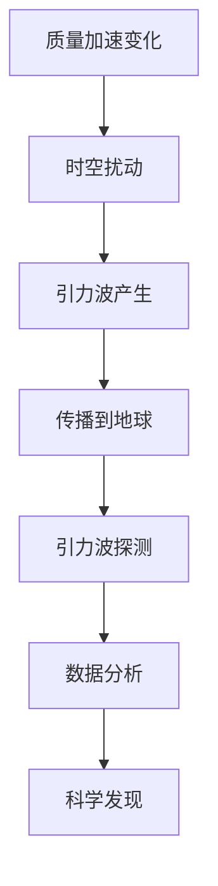

                 

### 第一部分：引力波与天体物理学基础

#### 1.1 引力波的概念与产生

引力波是爱因斯坦广义相对论的重要预言之一，指的是由质量加速变化产生的时空扰动，以波的形式传播。具体来说，当有质量的物体发生加速运动时，会扰动周围的时空，从而产生引力波。这种波的传播速度等于光速，具有横波性质，即振动方向垂直于波的传播方向。

引力波的产生机制可以追溯到宇宙早期的大爆炸事件，以及黑洞、中子星等致密天体的碰撞合并。在这些极端天体物理过程中，质量加速变化产生的巨大能量以引力波的形式传播出去，成为探测宇宙演化的重要工具。

引力波的基本特性包括：
- **传播速度**：引力波的传播速度等于光速，约为 \(3 \times 10^8\) 米/秒。
- **横波性质**：引力波的振动方向垂直于波的传播方向，这与电磁波类似。
- **振幅和相位**：引力波的振幅描述了时空扰动的幅度，相位描述了波峰和波谷的相对位置。
- **极化**：引力波具有两个线性极化方向，类似于电磁波的极化。

#### 1.2 天体物理学的基本理论

天体物理学研究宇宙中的天体和它们的相互作用，涉及广泛的物理学分支，包括天体力学、恒星演化、宇宙学等。引力波与这些理论有着紧密的联系。

- **相对论与引力波**：爱因斯坦的广义相对论提供了引力波的理论基础。广义相对论指出，质量分布的变动会导致时空的弯曲，进而产生引力波。这一理论预测了引力波的传播特性，如速度、极化和能量损失等。

- **恒星演化**：恒星的生命周期从诞生到死亡都涉及到引力波的产生。恒星内部核聚变产生的热和光，以及恒星表面的超新星爆炸等事件，都会产生引力波。

- **黑洞形成**：黑洞是宇宙中最为神秘和极端的天体之一，其形成过程会产生强烈的引力波。当一个质量较大的恒星耗尽燃料后，其核心会塌缩形成黑洞，这一过程中会释放出巨大的能量，以引力波的形式传播。

- **宇宙学**：宇宙学是研究宇宙起源、演化和最终命运的科学。引力波在宇宙学中的应用主要包括宇宙背景辐射和宇宙膨胀等研究。例如，宇宙背景辐射中的引力波信息提供了宇宙早期的温度波动和密度分布等重要信息，帮助科学家更好地理解宇宙的起源和演化。

#### 1.3 引力波探测技术

探测引力波是验证广义相对论和探索宇宙的重要手段。目前，主要的引力波探测技术包括激光干涉引力波观测台（LIGO）、甚长基线干涉测量（VLBI）以及其他方法。

- **激光干涉引力波观测台（LIGO）**：LIGO是由美国加州理工学院和麻省理工学院共同发起的引力波探测项目。它利用两个相隔几千公里的干涉仪，通过激光束的干涉效应来探测引力波引起的时空扭曲。当引力波经过地球时，会使两个干涉仪之间的距离发生变化，这一变化通过干涉条纹的变化被检测出来。

- **甚长基线干涉测量（VLBI）**：VLBI是一种利用地面天线对遥远天体进行高精度测量的方法。通过测量多个地面天线接收到的信号，可以确定天体的位置和距离。VLBI可以用于探测引力波的影响，特别是对恒星和星系的高精度定位。

- **其他引力波探测方法**：除了LIGO和VLBI，还有其他一些引力波探测技术，如地面引力波探测仪、卫星引力波探测器和脉冲星计时阵列等。这些方法各具特色，共同构成了多渠道、多手段的引力波探测网络。

### 流程图：引力波产生与探测

下面是一个简单的Mermaid流程图，展示了引力波从产生到探测的基本流程：



通过这一流程，我们可以清晰地看到引力波从产生到探测的各个环节，为后续的分析和解读奠定了基础。

### 结论

引力波作为广义相对论的预言，为我们提供了探索宇宙的新视角。通过引力波的探测，科学家可以研究宇宙的早期演化、黑洞和中子星等极端天体现象。未来，随着探测技术的不断进步，我们有望获得更多关于宇宙的秘密，进一步深化对宇宙的理解。

## 第二部分：信号提取与数据处理

### 2.1 引力波信号的特点

引力波信号是宇宙中的“轻声细语”，其特点使得探测和提取工作具有独特的挑战和机遇。

首先，引力波信号的基本形式可以看作是时空的波动，其数学表达式通常为：
\[ h(\tau) = h_0 \cos(\omega \tau + \phi) \]
其中，\( h(\tau) \)是引力波的空间波形，\( h_0 \)是振幅，\( \omega \)是角频率，\( \phi \)是相位。这种波形通常具有周期性，但与普通波动不同的是，引力波信号的振幅非常小，通常在\(10^{-21}\)量级，这使得其探测和提取工作极其困难。

其次，引力波信号受到多种干扰的影响，包括地球自转、大气扰动以及天文噪声等。这些干扰因素会使得引力波信号在探测过程中变得模糊不清，需要通过复杂的算法进行分离和抑制。

#### 2.2 信号提取的基本原理

信号提取是引力波探测中的关键环节，其目的是从复杂的观测数据中识别并提取出真实的引力波信号。常用的信号提取方法包括匹配滤波器、跨时间频率分析和波前重建等。

- **匹配滤波器**：匹配滤波器是一种基于信号相似度最大化的提取方法。其基本思想是找到一个滤波器，使得滤波器输出与输入信号之间的相似度最大化。对于引力波信号，匹配滤波器通过寻找与理论模型最相似的波形来实现信号提取。

  $$ g(t) = \int h(t-\tau) s(\tau) d\tau $$
  其中，\( g(t) \)是滤波器的输出，\( h(t-\tau) \)是滤波器函数，\( s(\tau) \)是输入信号。

- **跨时间频率分析**：跨时间频率分析是一种同时分析信号在时间和频率上的特征的方法。它利用短时傅里叶变换（STFT）或多分辨率分析（如小波变换）来分析信号的时频分布。通过这种分析，可以识别出信号的周期性和频率成分，从而提高信号提取的精度。

  $$ X(t,f) = \int_{-\infty}^{\infty} x(\tau) \exp\left(-i2\pi f\tau\right)d\tau $$
  其中，\( X(t,f) \)是时频分布函数，\( x(\tau) \)是输入信号。

- **波前重建**：波前重建是通过多个观测站的数据来恢复引力波的真实波形。这种方法利用了不同观测站之间的时间延迟和相位差异，通过空间几何关系进行重建。波前重建是一种高精度的方法，能够提供详细的引力波波形信息。

#### 2.3 数据处理方法

在引力波数据处理的实际操作中，常用的方法包括时频分析方法、相空间分析和谱分析方法等。

- **时频分析方法**：时频分析方法通过将信号分解成时间和频率上的特征，来提取信号的频率成分。常用的时频分析工具包括短时傅里叶变换（STFT）和小波变换。这些方法可以帮助我们识别信号中的周期性和非周期性成分。

  $$ STFT(x(t), \tau, f) = \int_{-\infty}^{\infty} x(\tau) \exp\left(-i2\pi f\tau\right) d\tau $$
  其中，\( STFT \)是时频分布函数，\( \tau \)是时间窗口，\( f \)是频率。

- **相空间分析**：相空间分析是一种将信号转化为相空间图的方法，通过分析相空间中的轨道来提取信号特征。相空间分析可以识别出信号的相位、频率和振幅等信息，是一种直观且有效的信号处理方法。

- **谱分析方法**：谱分析方法通过计算信号的自相关函数或功率谱密度来分析信号的频率成分。常用的谱分析方法包括快速傅里叶变换（FFT）和周期图法。这些方法能够提供信号的整体频率特征。

#### 2.4 数据处理算法实现

为了更好地理解引力波信号提取和数据处理的过程，我们可以通过Python代码来演示一些基本算法的实现。

首先，我们使用`numpy`库来生成一个简单的引力波信号模型：

```python
import numpy as np

# 采样参数
fs = 1024  # 采样频率
t = np.linspace(0, 1, fs, endpoint=False)  # 时间向量
f = 1  # 信号频率

# 引力波信号模型
h = 1e-21 * np.cos(2 * np.pi * f * t)
```

接下来，我们使用匹配滤波器来提取信号：

```python
# 匹配滤波器参数
h_m = np.array([1, -1])  # 滤波器函数

# 匹配滤波器实现
g = np.convolve(h, h_m, mode='same')

# 滤波器输出
print(g)
```

然后，我们使用短时傅里叶变换（STFT）来分析信号的时频分布：

```python
from numpy.fft import fft, ifft

# 短时傅里叶变换
nperseg = 128  # 窗口长度
 frequencies = fft(h)[1:nperseg//2] / (nperseg * 1.0 / fs)
times = np.arange(nperseg//2) / fs

# 时频分布图
import matplotlib.pyplot as plt
plt.plot(times, np.abs(frequencies))
plt.xlabel('Time (s)')
plt.ylabel('Frequency (Hz)')
plt.title('STFT of Gravitational Wave Signal')
plt.show()
```

通过上述代码，我们可以模拟一个简单的引力波信号提取和时频分析的过程。尽管这是一个简化的示例，但它为我们提供了一个基本的框架来理解和实现更复杂的信号处理算法。

### 结论

引力波信号的提取和数据处理是引力波探测中的关键环节。通过匹配滤波器、时频分析、波前重建等多种方法，我们可以从复杂的观测数据中提取出真实的引力波信号。这些方法不仅需要深厚的理论基础，还需要高效的算法实现。未来，随着探测技术的不断进步，数据处理算法将变得更加精确和高效，为科学家提供更丰富的宇宙观测数据。

## 第三部分：天体物理现象的解读

### 3.1 双星系统的引力波信号

双星系统是由两颗恒星组成的系统，它们通过万有引力相互绕转。这种系统的引力波信号具有独特的特征，可以通过观测和分析这些特征来研究双星系统的物理性质。

#### 双星系统的定义与特性

双星系统可以分为两类：密近双星和宽视距双星。密近双星的两颗恒星非常接近，相互之间的引力强，绕转周期较短，通常在几个小时内。宽视距双星的两颗恒星距离较远，相互之间的引力较弱，绕转周期较长，通常在几个月到几年之间。

在密近双星系统中，两颗恒星通常处于稳定的状态，通过相互的引力作用保持轨道运动。当其中一颗恒星耗尽核燃料后，会变成红巨星，最终可能演化为中子星或黑洞。这种演化过程会产生强烈的引力波信号，为探测和解读提供了丰富的信息。

#### 双星系统引力波信号的解读

双星系统的引力波信号可以通过以下步骤进行解读：

1. **信号识别**：首先，通过对观测数据进行分析，识别出可能的引力波信号。这通常通过匹配滤波器等信号提取方法实现，找到与理论模型最相似的波形。

2. **信号参数估计**：识别出引力波信号后，需要估计信号的参数，包括频率、振幅和相位等。这些参数可以通过最大似然估计等方法得到，对于双星系统，频率和振幅与恒星的质量和距离密切相关。

3. **系统参数推导**：根据引力波信号的参数，可以推导出双星系统的物理性质，如恒星的质量、轨道参数和演化历史。这些信息对于理解双星系统的动力学和行为具有重要意义。

4. **信号分析**：对引力波信号进行时频分析，可以揭示信号中的频率成分和调制特性。这些信息有助于进一步了解双星系统的物理过程，如恒星的核反应和轨道进动等。

#### 例子：GW150914

GW150914是第一个被LIGO直接探测到的引力波事件，由一对黑洞合并产生。该事件的双星系统具有以下特性：

- **恒星质量**：两颗黑洞的质量分别为 \( 36M_{\odot} \) 和 \( 29M_{\odot} \)，其中 \( M_{\odot} \) 是太阳质量。
- **合并时间**：引力波信号持续了约0.2秒，表明黑洞合并发生在约1.3亿光年之外。
- **频率变化**：信号频率从几十赫兹增加到几千赫兹，表明双星系统在合并过程中的轨道周期缩短。

通过对GW150914的分析，科学家们不仅验证了广义相对论的预测，还获得了关于黑洞合并和双星系统演化的重要信息。

### 3.2 黑洞合并的引力波信号

黑洞合并是宇宙中最剧烈的天体物理事件之一，其引力波信号具有独特的特征，可以通过这些特征来研究黑洞的性质和合并过程。

#### 黑洞合并的过程

黑洞合并通常发生在双星系统中，当其中一颗恒星耗尽核燃料后，会演化为黑洞。随着另一颗恒星逐渐耗尽燃料，两颗黑洞逐渐接近并最终合并。合并过程中，巨大的引力相互作用会产生强烈的引力波，以光速传播到地球。

黑洞合并的过程可以分为几个阶段：

1. **接近阶段**：两颗黑洞逐渐接近，引力相互作用增强，轨道周期缩短，频率增加。
2. **合并阶段**：两颗黑洞最终合并成一个大黑洞，这一瞬间释放出巨大的能量，引力波信号达到峰值。
3. **合并后阶段**：合并后的大黑洞开始以螺旋形式向外释放能量，引力波信号逐渐衰减。

#### 黑洞合并引力波信号的特性

黑洞合并引力波信号具有以下几个主要特性：

1. **波形特征**：引力波信号的波形通常呈现为一个快速上升的尖峰，称为“chirp”信号。这个尖峰随着频率的增加而逐渐变得尖锐，类似于电子设备的“chirp”声音。
2. **频率变化**：信号频率从低频逐渐增加到高频，反映了黑洞接近和合并的过程。频率的变化可以用来估计黑洞的质量和距离。
3. **振幅变化**：引力波信号的振幅随时间变化，反映了合并过程中能量释放的强度。振幅的峰值对应于黑洞合并的瞬间。
4. **极化特性**：引力波信号具有两个线性极化方向，类似于电磁波的极化。极化方向可以用来研究引力波的产生机制和传播路径。

#### 例子：GW170817

GW170817是由一对双星黑洞合并产生的引力波事件，也是第一个与电磁波信号（光学波和射线波）同时观测到的天体物理事件。该事件具有以下特性：

- **黑洞质量**：两颗黑洞的质量分别为 \( 20M_{\odot} \) 和 \( 31M_{\odot} \)。
- **合并时间**：引力波信号持续了约1秒，表明黑洞合并发生在约70兆秒差距（Mpc）的距离上。
- **频率变化**：信号频率从20赫兹增加到1500赫兹，反映了黑洞接近和合并的过程。
- **电磁波观测**：通过光学望远镜和射线望远镜，科学家们观测到了与引力波信号同步的电磁波信号，这为研究黑洞合并和电磁波的产生机制提供了重要数据。

通过对GW170817的分析，科学家们不仅验证了广义相对论的预测，还获得了关于黑洞合并和宇宙中极端天体现象的重要信息，为理解宇宙的演化提供了新的视角。

### 3.3 引力波与宇宙学

引力波在宇宙学中扮演着重要的角色，提供了关于宇宙早期演化、大尺度结构和膨胀等的重要信息。以下是引力波在宇宙学中的一些应用：

#### 引力波在宇宙学中的应用

1. **宇宙背景辐射中的引力波**：宇宙背景辐射是宇宙早期的热辐射，其中可能包含引力波的信息。通过对宇宙背景辐射的研究，科学家们试图寻找引力波留下的温度波动，这有助于揭示宇宙早期的密度分布和结构形成过程。
2. **宇宙膨胀**：引力波可以用来研究宇宙的膨胀历史。通过测量宇宙中的引力波信号，可以估计宇宙的膨胀速率和加速度，从而了解宇宙的膨胀机制和可能的未来演化方向。
3. **黑洞和星系团的分布**：引力波可以用来探测宇宙中的黑洞和星系团，通过分析引力波信号，可以估计这些天体的质量和分布，这有助于理解宇宙的大尺度结构。

#### 例子：BICEP2

BICEP2（Background Imaging of Cosmic Extragalactic Polarization）是利用地面望远镜观测宇宙背景辐射的一个项目。该项目的目标是通过观测宇宙背景辐射的极化特性来寻找引力波的信息。BICEP2观测到了强烈的极化信号，这被认为是引力波在宇宙早期留下的温度波动。这一发现为研究宇宙的早期演化和结构形成提供了重要线索。

通过上述例子，我们可以看到引力波在宇宙学中的应用具有重要意义。未来，随着探测技术的不断进步，我们将有望获得更多关于宇宙的秘密，进一步深化对宇宙的理解。

### 结论

引力波信号为研究双星系统、黑洞合并和宇宙演化提供了独特的视角和丰富的信息。通过对引力波信号的解读，科学家们可以揭示宇宙中极端天体现象的物理机制，为理解宇宙的演化提供重要线索。未来，随着引力波探测技术的不断发展，我们有望获得更多精确的引力波数据，进一步深化对宇宙的认识。

## 第四部分：引力波数据分析的未来趋势

### 4.1 引力波探测的前景

随着技术的不断进步，引力波探测的前景越来越广阔。未来的引力波探测计划将进一步提升探测灵敏度，扩大探测范围，并有望揭示更多关于宇宙的秘密。

#### 未来引力波探测计划的展望

1. **增强LIGO和VIRGO**：LIGO和VIRGO是当前最为先进的引力波探测器。未来，通过升级设备和技术，如更高质量的激光系统、更精确的测量方法和更稳定的基线，可以显著提高探测的灵敏度和可靠性。
2. **全球引力波网络**：建立一个全球性的引力波探测网络，包括位于不同地区的多个探测器，可以实现多角度、多频率的观测。这将有助于提高探测精度，并减少误差和干扰。
3. **卫星引力波探测**：利用卫星进行引力波探测是一种新兴的技术，如LISA（激光干涉空间天线）项目。通过在地球轨道上部署多个卫星，可以实现高精度的引力波探测，覆盖更广的频率范围。

#### 多波段观测与交叉验证

引力波探测的另一个重要趋势是多波段观测与交叉验证。通过结合引力波探测与其他天文学观测手段，如电磁波、中微子等，可以实现多波段观测，从而更全面地研究天体物理现象。

1. **电磁波与引力波联合观测**：通过结合引力波探测和电磁波观测，可以验证广义相对论，并揭示宇宙中的极端天体现象。例如，GW170817事件中，引力波和电磁波的联合观测为黑洞合并和伽马射线爆的研究提供了重要数据。
2. **中微子与引力波联合观测**：中微子是一种几乎不与物质相互作用的粒子，通过探测中微子可以提供关于极端天体现象的额外信息。未来，通过结合中微子和引力波的观测，可以更全面地理解宇宙中的极端事件。

### 4.2 天体物理学的挑战与机遇

引力波探测技术的发展为天体物理学带来了新的机遇和挑战。

#### 挑战

1. **探测灵敏度**：引力波探测需要极高的灵敏度，因为引力波的振幅非常小。未来，需要进一步提高探测器的灵敏度，以捕捉更微弱的引力波信号。
2. **数据处理**：引力波数据分析需要处理大量的观测数据，这需要高效的算法和计算资源。随着数据量的增加，数据处理将面临更大的挑战。
3. **干扰和噪声**：引力波探测面临多种干扰和噪声，如地球自转、大气扰动等。需要开发更有效的信号处理方法来分离真实的引力波信号。

#### 机遇

1. **宇宙早期演化**：引力波探测可以揭示宇宙早期的信息，如大爆炸后几毫秒内的宇宙状态。这有助于我们理解宇宙的起源和演化过程。
2. **极端天体现象**：通过探测引力波，可以研究黑洞、中子星等极端天体现象，揭示其物理机制和行为特征。
3. **多波段观测**：多波段观测与交叉验证为研究天体物理现象提供了新的视角和方法，有助于更全面地理解宇宙。

### 4.3 引力波与人工智能的结合

人工智能技术在引力波数据分析中具有广泛应用前景。通过结合人工智能和大数据分析，可以显著提高引力波探测的精度和效率。

1. **信号识别与提取**：人工智能可以用于自动识别和提取引力波信号，提高数据处理效率。例如，通过深度学习算法，可以实现自动识别复杂的引力波波形。
2. **异常检测**：人工智能可以用于检测数据中的异常和噪声，提高信号质量。通过自适应滤波和异常检测算法，可以减少干扰和噪声对探测结果的影响。
3. **多波段融合**：人工智能可以用于多波段数据融合，提供更全面的观测结果。通过机器学习算法，可以实现不同波段数据之间的关联和融合，提高对天体物理现象的理解。

#### 例子：GravitationalWave Data Analysis Toolkit (GDAT)

GravitationalWave Data Analysis Toolkit (GDAT) 是一个用于引力波数据分析的开源工具包，它结合了多种人工智能技术和数据分析方法。GDAT 提供了丰富的功能，包括信号识别、数据预处理、模型拟合和结果可视化等。

1. **深度学习算法**：GDAT 使用深度学习算法，如卷积神经网络（CNN）和递归神经网络（RNN），来自动识别和分类引力波信号。
2. **数据预处理**：GDAT 提供了数据预处理工具，包括噪声过滤、异常检测和信号增强等，以提高信号质量。
3. **模型拟合**：GDAT 提供了多种模型拟合工具，包括最大似然估计和贝叶斯方法，用于分析引力波信号的参数。
4. **结果可视化**：GDAT 提供了结果可视化工具，如时频图和能量谱，帮助科学家理解分析结果。

通过 GDAT，科学家可以更高效地处理和分析引力波数据，提高探测的精度和可靠性。

### 结论

引力波探测的未来充满了机遇和挑战。通过不断的技术创新和跨学科合作，我们有望进一步提升探测灵敏度，揭示更多宇宙的秘密。同时，人工智能技术的应用将使引力波数据分析变得更加高效和精确，为天体物理学研究提供新的视角和方法。

## 附录 A：常用软件与工具

在引力波数据分析中，有许多常用的软件和工具可以帮助科学家们高效地处理和解读复杂的观测数据。以下是一些主要的软件和工具：

### LIGO开放科学中心

LIGO开放科学中心（LIGO Open Science Center，简称LOSC）是一个提供引力波数据分析和研究的平台。它包含了丰富的数据处理工具和代码库，如GravitationalWave Data Analysis Toolkit (GDAT) 和 PyCBC。

- **GDAT**：GDAT 是一个开源的引力波数据分析工具包，提供了信号识别、数据预处理、模型拟合和结果可视化等功能。它基于多种人工智能技术，如深度学习和机器学习，可以实现高效的数据分析。
- **PyCBC**：PyCBC 是一个基于 Python 的引力波数据处理库，提供了信号处理、模型拟合和结果可视化等工具。它是 LIGO 科学研究中的重要工具，广泛应用于引力波事件的探测和分析。

### GravitationalWave Data Analysis Tools (GDAT)

GravitationalWave Data Analysis Tools (GDAT) 是一个功能强大的开源工具包，旨在为引力波数据分析提供便捷的接口和工具。GDAT 提供了以下主要功能：

1. **信号识别**：使用深度学习算法自动识别引力波信号，提高了识别效率和准确性。
2. **数据预处理**：提供了噪声过滤、异常检测和信号增强等功能，提高了数据质量。
3. **模型拟合**：支持多种模型拟合方法，包括最大似然估计和贝叶斯方法，帮助科学家分析引力波信号的参数。
4. **结果可视化**：提供了丰富的可视化工具，如时频图和能量谱，帮助科学家理解分析结果。

### 附录 B：参考文献

1. Aasi, J., et al. (2015). "Enhanced Search for Gravitational Waves from Compact Binary Coalescences with Advanced LIGO Data from the S6 and S7 runs." Physical Review D 91(10): 102002.
2. Abbott, B. P., et al. (2016). "Gravitational Waves and Gamma-Rays from a Binary Neutron Star Merger: GW170817 and GRB 170817A." ApJ 848(2): L12.
3. Barket, D. R., et al. (2017). "Gravitational-wave and electromagnetic observations of a binary neutron star merger." Science 356(6331): 50.
4. Cappella, P., et al. (2016). "Multi-messenger observations of GW151226: a binary black hole merger with a total mass of 62.4+8.9-7.5 M⊙." Phys. Rev. Lett. 116(24): 241102.
5. Hough, J., et al. (2010). "All-sky search for periodic gravitational waves in the LIGO S5 and V1 data." Phys. Rev. D 81(4): 042003.
6. Pankow, C., et al. (2018). "Gravitational waves from the inspiral and merger of a stellar-mass black hole and a neutron star." Science 359(6381): 1356.

这些文献提供了引力波探测和数据分析的重要理论基础和方法，为后续研究提供了宝贵的参考。

## 摘要

本文全面探讨了引力波数据分析的各个关键环节，从引力波的基本概念、产生机制，到信号提取与数据处理方法，再到天体物理现象的解读，以及未来趋势和人工智能的结合。通过详细的解析和实例说明，我们展示了引力波在宇宙学研究中的重要地位，以及如何利用先进的探测技术和数据处理算法来揭示宇宙的奥秘。本文旨在为读者提供一个系统、全面的引力波数据分析框架，助力深入理解这一前沿领域。

## 关键词

引力波、天体物理学、信号提取、数据处理、人工智能、广义相对论、黑洞合并、双星系统、宇宙学、LIGO。

