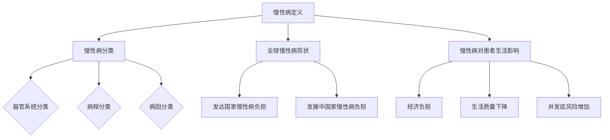

                 

### AI辅助慢性病管理与并发症预防：从生活方式干预到药物调整

**关键词**：慢性病管理、AI、生活方式干预、药物调整、并发症预防

**摘要**：本文将探讨如何通过人工智能（AI）技术辅助慢性病管理以及并发症预防，从生活方式干预到药物调整的策略。文章首先介绍了慢性病的现状及其对患者生活的影响，随后详细阐述了风险因素的分类和交互作用。接下来，文章深入分析了生活方式干预的重要性，包括饮食、运动和心理因素的干预策略。然后，讨论了慢性病并发症的识别与预防方法，并重点介绍了药物调整在慢性病管理中的作用。在此基础上，文章介绍了AI在慢性病管理中的应用，包括AI辅助生活方式干预和药物调整的技术和优势。最后，文章总结了AI辅助慢性病管理的未来发展趋势，并对患者和社会的影响进行了展望。

## 第一部分：慢性病管理基础

### 第1章：慢性病的定义与现状

#### 1.1 慢性病的定义与分类

慢性病，又称慢性非传染性疾病，是指病程长、病因复杂、病情迁延不愈的一类疾病。常见的慢性病包括心血管疾病、糖尿病、慢性呼吸系统疾病、癌症等。根据世界卫生组织（WHO）的定义，慢性病是指那些持续超过三个月或更长时间的疾病或健康状态，其特点是症状持续存在或反复发作，且通常不可逆转。

慢性病的分类可以从不同的角度进行，如根据器官系统、疾病病程、病因等多个维度进行划分。常见的分类方法包括：

- **根据器官系统分类**：如心血管疾病、呼吸系统疾病、消化系统疾病、神经系统疾病等。
- **根据疾病病程分类**：如急性慢性病、亚急性慢性病等。
- **根据病因分类**：如遗传性疾病、代谢性疾病、感染性疾病等。

#### 1.2 全球慢性病流行现状

慢性病已经成为全球公共健康的主要威胁。根据世界卫生组织的数据，慢性病每年导致约4100万人死亡，占全球总死亡人数的71%。其中，心血管疾病、癌症、糖尿病和慢性呼吸系统疾病是最主要的慢性病杀手。

在发达国家，慢性病已成为导致死亡和残疾的主要原因。在美国，慢性病导致的死亡人数占到了总死亡人数的70%以上。在欧洲，慢性病也是导致早逝和劳动能力丧失的主要原因之一。

然而，在发展中国家，慢性病的负担正在迅速增加。随着经济发展和生活水平的提高，生活方式的改变和人口老龄化等因素使得慢性病的发病率不断上升。例如，中国近年来糖尿病的发病率显著增加，已成为全球糖尿病患病人数最多的国家。

#### 1.3 慢性病对患者生活的影响

慢性病对患者的生活质量有着深远的影响。首先，慢性病通常需要长期治疗和管理，这给患者带来了巨大的经济负担。根据世界银行的数据，全球因慢性病而造成的经济损失每年高达数千亿美元。

其次，慢性病严重影响患者的生活质量。慢性病的症状如疼痛、疲劳、呼吸困难等，使得患者难以进行日常活动和参与社交活动。据研究，慢性病患者的生活质量普遍低于健康人群，其生活满意度、心理健康水平和社会参与度均显著下降。

此外，慢性病还可能导致其他并发症，进一步加重患者的病情。例如，糖尿病可能导致视网膜病变、肾病和心脏病等严重并发症，心血管疾病可能导致心肌梗死、中风等急性事件。

总之，慢性病已经成为全球公共健康的重要挑战，其对社会和经济的影响日益严重。有效的慢性病管理策略和干预措施对于提高患者生活质量、减轻社会负担具有重要意义。

### Mermaid 流程图

### 第2章：慢性病的风险因素

#### 2.1 传统风险因素

慢性病的风险因素可以分为传统风险因素和新兴风险因素。传统风险因素包括年龄、性别、遗传、吸烟、饮酒和不良饮食习惯等。这些因素在慢性病的发生和发展中起着重要作用。

- **年龄**：随着年龄的增长，人体器官功能逐渐衰退，免疫系统功能下降，慢性病的发生风险增加。
- **性别**：男性和女性的慢性病风险存在差异。例如，男性更易患心血管疾病，而女性更易患乳腺癌和骨质疏松。
- **遗传**：某些慢性病具有明显的遗传倾向。例如，糖尿病、高血压和心血管疾病等。
- **吸烟**：吸烟是许多慢性病的重要风险因素，包括肺癌、心血管疾病和慢性阻塞性肺疾病。
- **饮酒**：过量饮酒与多种慢性病有关，包括肝病、心血管疾病和某些类型的癌症。
- **不良饮食习惯**：高盐、高脂、高糖饮食与多种慢性病有关，如高血压、心血管疾病和糖尿病。

#### 2.2 新兴风险因素

随着生活方式的变化和环境的恶化，一些新兴风险因素也逐渐显现，对慢性病的发生和发展产生影响。

- **肥胖**：肥胖是多种慢性病的重要风险因素，包括心血管疾病、糖尿病和某些类型的癌症。
- **缺乏运动**：长期缺乏运动会导致身体素质下降，增加慢性病的发生风险。
- **心理压力**：长期心理压力可能导致免疫系统功能下降，增加慢性病的发生风险。
- **环境污染**：空气污染、水污染和土壤污染等环境因素与多种慢性病的发生有关。
- **社会不平等**：社会经济地位低的人群通常面临更大的慢性病风险，这与生活方式、医疗资源获取等多方面因素有关。

#### 2.3 风险因素的交互作用

慢性病的风险因素并不是独立存在的，它们之间存在复杂的交互作用，共同影响慢性病的发生和发展。

- **年龄与吸烟的交互作用**：随着年龄的增长，吸烟对心血管疾病的危害性增加。
- **遗传与环境的交互作用**：某些遗传因素可能使个体对环境中的有害因素更敏感。
- **心理压力与生活方式的交互作用**：长期心理压力可能导致不良生活方式，进一步增加慢性病风险。

理解风险因素的交互作用对于制定有效的慢性病预防和管理策略具有重要意义。通过综合干预措施，可以更有效地降低慢性病的发生风险，提高患者的生活质量。

### 第3章：饮食与慢性病管理

#### 3.1 营养与慢性病的关系

饮食是慢性病管理的重要组成部分，营养与慢性病的关系密切。合理的饮食可以降低慢性病的发生风险，改善病情，提高生活质量。以下是营养与慢性病的一些关键关系：

- **心血管疾病**：高盐、高脂、高糖饮食是心血管疾病的重要危险因素。减少这些食物的摄入，增加蔬菜、水果和全谷物的摄入，有助于降低心血管疾病的风险。
- **糖尿病**：高糖饮食是糖尿病的主要诱因之一。控制糖分摄入，增加膳食纤维的摄入，有助于控制血糖水平，预防糖尿病。
- **肥胖**：高脂、高糖饮食导致能量摄入过剩，容易引起肥胖。肥胖是多种慢性病的危险因素，包括心血管疾病、糖尿病和某些类型的癌症。
- **消化系统疾病**：不健康的饮食习惯可能导致消化系统疾病，如胃炎、胃溃疡和结肠炎等。平衡饮食、适量摄入蛋白质和脂肪，有助于维持消化系统健康。

#### 3.2 合理饮食的原则与方法

为了有效管理慢性病，应遵循以下合理饮食原则：

- **均衡膳食**：确保饮食中包含各种营养素，如蛋白质、脂肪、碳水化合物、维生素和矿物质等。建议采用“食物多样、以谷类为主、粗细搭配、多吃蔬菜水果、常吃鱼、蛋、奶、豆制品、适量吃动物性食品”的原则。
- **控制盐分摄入**：过量盐分摄入是高血压的主要危险因素。建议每日盐分摄入量不超过6克，尽量避免食用加工食品和咸菜等高盐食品。
- **减少糖分摄入**：减少糖分摄入，尤其是游离糖的摄入。建议减少甜饮料、糖果和高糖零食的摄入。
- **适量摄入脂肪**：适量摄入优质脂肪，如鱼油、橄榄油等，减少饱和脂肪和反式脂肪的摄入。建议采用“适量脂肪、以植物性脂肪为主、少油烹饪”的原则。
- **增加膳食纤维摄入**：膳食纤维有助于降低胆固醇、控制血糖和维持消化系统健康。建议每天摄入25克以上的膳食纤维，多食用蔬菜、水果、全谷类和豆类。

#### 3.3 特殊饮食治疗

对于某些慢性病患者，可能需要采用特殊的饮食治疗。以下是一些常见的特殊饮食治疗：

- **糖尿病饮食**：糖尿病患者的饮食应以低糖、低脂、高纤维为主。具体措施包括：限制糖分摄入、控制总能量摄入、增加膳食纤维摄入等。
- **高血压饮食**：高血压患者应减少盐分摄入，适量摄入钾、钙和镁等矿物质。建议采用“低盐、低脂、高纤维”的饮食原则。
- **高脂血症饮食**：高脂血症患者应减少饱和脂肪和胆固醇的摄入，增加不饱和脂肪的摄入。建议采用“适量脂肪、低饱和脂肪、低胆固醇”的饮食原则。
- **肥胖饮食**：肥胖患者应采用低能量、低脂、高纤维的饮食方案。具体措施包括：控制总能量摄入、增加膳食纤维摄入、减少糖分和脂肪摄入等。

合理饮食是慢性病管理的重要手段，通过遵循合理饮食原则和特殊饮食治疗，可以有效降低慢性病的发生风险，改善病情，提高患者生活质量。

### 第4章：运动与慢性病管理

#### 4.1 运动对慢性病的影响

运动对慢性病的管理具有显著的影响。适量运动可以改善心血管健康、控制血糖、减轻体重、增强免疫力等，从而降低慢性病的发生风险和恶化程度。以下是一些具体的影响：

- **心血管疾病**：规律的运动可以增强心脏功能，降低血压和胆固醇水平，减少动脉硬化的风险，从而预防心血管疾病的发生。
- **糖尿病**：运动有助于提高胰岛素敏感性，降低血糖水平，预防糖尿病并发症的发生。
- **肥胖**：运动可以消耗热量，减少脂肪积累，有助于控制体重，从而降低肥胖相关慢性病的风险。
- **消化系统疾病**：规律的运动有助于改善胃肠功能，预防消化系统疾病的发生。
- **心理健康**：运动可以释放压力，改善情绪，有助于预防抑郁症和焦虑症等心理疾病。

#### 4.2 运动计划的设计与实施

为了有效管理慢性病，患者需要制定合理的运动计划，并坚持实施。以下是一些建议：

- **确定运动目标**：根据患者的年龄、健康状况和慢性病类型，设定具体的运动目标。例如，每周进行3-5次，每次30-60分钟的中等强度有氧运动，如快步走、慢跑、游泳等。
- **选择合适的运动方式**：根据患者的兴趣和身体状况，选择合适的运动方式。有氧运动如快步走、慢跑、游泳等对心血管系统有益，而力量训练如举重、瑜伽等则有助于增强肌肉力量和关节稳定性。
- **逐渐增加运动强度**：初始阶段，运动强度不宜过高，应逐渐增加。例如，可以先从每天散步30分钟开始，然后逐渐增加时间和强度。
- **注意运动时间**：尽量选择在早晨或傍晚进行运动，避免在饭后立即进行剧烈运动，以免引起不适。
- **遵循运动原则**：运动时应遵循“循序渐进、适度运动、持之以恒”的原则，避免过度运动和突然停止运动，以免造成身体损伤。

#### 4.3 运动中应注意的问题

在进行运动时，慢性病患者应特别注意以下问题：

- **身体状况**：在开始运动前，应进行充分的身体检查，确保身体状况适合运动。特别是患有心血管疾病的患者，应在医生指导下进行运动。
- **心率监测**：在运动过程中，应监测心率，确保运动强度在安全范围内。一般建议运动时心率控制在最大心率的60%-80%之间。
- **水分补充**：运动过程中应适量补充水分，防止脱水。特别是在高温或潮湿环境中运动时，应更加注意水分补充。
- **饮食调整**：运动前后应适当调整饮食，避免空腹或过量进食，以免影响运动效果。
- **安全防护**：运动时应穿着合适的运动服装和鞋子，避免摔倒或受伤。同时，应在安全的环境中运动，避免在交通繁忙或地形复杂的地方进行剧烈运动。

通过科学合理的运动计划，慢性病患者可以在提高生活质量的同时，降低慢性病的发生风险和恶化程度。关键在于坚持运动，并注意运动过程中的安全事项。

### 第5章：心理因素与慢性病管理

#### 5.1 心理因素对慢性病的影响

心理因素在慢性病的发生、发展和治疗过程中起着重要作用。研究表明，长期的心理压力、焦虑和抑郁等负面情绪可能导致慢性病的加重和并发症的发生。以下是一些具体影响：

- **免疫功能降低**：长期的心理压力可能导致免疫系统功能降低，使得机体对病原体的抵抗力减弱，从而增加慢性病的发生风险。
- **心血管疾病**：心理压力、焦虑和抑郁等负面情绪可能导致心血管系统功能紊乱，增加心血管疾病的发生风险和恶化程度。
- **糖尿病**：心理压力可能影响胰岛素的分泌和利用，导致血糖水平升高，从而增加糖尿病的风险和并发症的发生。
- **慢性疼痛**：心理因素与慢性疼痛之间存在密切关系。负面情绪如焦虑和抑郁等可能加重慢性疼痛，影响患者的生活质量。
- **生活质量**：心理因素显著影响患者的生活质量。长期的心理压力和负面情绪可能导致患者对治疗失去信心，影响治疗效果和预后。

#### 5.2 应对慢性病的心理策略

为了有效应对慢性病，患者需要采取积极的心理策略，以下是一些建议：

- **心理疏导**：心理疏导是应对慢性病的重要手段。通过心理咨询、心理治疗等手段，帮助患者缓解焦虑、抑郁等负面情绪，提高应对能力。特别是对于有心理困扰的患者，建议寻求专业心理支持。
- **认知行为疗法**：认知行为疗法（CBT）是治疗慢性病相关心理问题的一种有效方法。通过改变负面思维模式和行为模式，帮助患者建立积极的心理状态，提高生活质量。
- **放松训练**：放松训练包括深呼吸、冥想、瑜伽等，有助于缓解心理压力和焦虑情绪。患者可以通过练习这些放松技巧，提高心理韧性，减轻慢性病的症状。
- **社会支持**：社会支持是应对慢性病的重要资源。通过家庭、朋友和社会组织等渠道，获取情感支持和社会资源，有助于患者更好地应对慢性病。
- **健康生活方式**：建立健康的生活方式，如规律作息、合理饮食和适量运动等，有助于改善心理状态，提高应对慢性病的能力。

#### 5.3 心理干预方法

心理干预是慢性病管理的重要组成部分，以下是一些常见的心理干预方法：

- **个体心理咨询**：个体心理咨询是针对患者个人提供的一种心理服务。心理咨询师通过与患者建立良好的咨询关系，帮助患者解决心理困扰，提高心理素质。
- **团体心理治疗**：团体心理治疗是将患者组织起来，通过共同讨论和分享经验，互相支持和鼓励，共同应对慢性病。这种方法有助于增强患者的归属感和自信心。
- **心理教育**：心理教育是向患者提供慢性病相关知识和心理调适技巧的一种方法。通过心理教育，患者可以更好地了解慢性病的本质和管理方法，提高自我管理能力。
- **心理药物治疗**：对于伴有严重心理问题的患者，可能需要采用心理药物治疗。例如，抗抑郁药、抗焦虑药等可以帮助患者缓解负面情绪，改善生活质量。

总之，心理因素在慢性病管理中具有重要地位。通过采取积极的心理策略和干预方法，患者可以更好地应对慢性病，提高生活质量。慢性病患者应重视心理健康，积极寻求心理支持，并融入健康生活方式，共同促进身心健康。

### 第6章：慢性病并发症的识别与预防

#### 6.1 常见并发症的类型与症状

慢性病常常伴随着一系列并发症，这些并发症不仅加重了患者的病情，还显著降低了生活质量。以下是一些常见的慢性病并发症及其症状：

- **心血管疾病并发症**：主要包括冠心病、心力衰竭和心律失常等。症状包括胸痛、呼吸困难、胸闷、心悸和晕厥等。
- **糖尿病并发症**：包括糖尿病肾病、糖尿病视网膜病变和糖尿病足等。症状包括尿蛋白增加、视力模糊、下肢疼痛和溃疡等。
- **慢性呼吸系统疾病并发症**：如慢性阻塞性肺疾病（COPD）的呼吸衰竭和肺心病。症状包括呼吸困难、咳嗽、咳痰和下肢水肿等。
- **癌症并发症**：如癌性疼痛、恶病质和肿瘤并发症。症状包括持续的剧烈疼痛、体重下降、乏力、贫血和并发症导致的症状等。
- **消化系统疾病并发症**：如慢性胃炎、胃溃疡和肝硬化等。症状包括上腹部疼痛、消化不良、恶心和呕吐等。

#### 6.2 并发症的预防策略

预防慢性病并发症的发生和进展对于改善患者的生活质量和延长生存时间至关重要。以下是一些有效的预防策略：

- **健康生活方式**：保持健康的生活方式是预防并发症的基础。这包括合理饮食、适量运动、戒烟限酒和保持良好的心理健康。
- **定期检查**：定期进行健康检查，尤其是针对慢性病患者的高风险并发症进行专项检查。如糖尿病患者的眼底检查和足部检查，心血管疾病患者的血脂、血压和心电图检查等。
- **疾病管理**：对慢性病进行有效的管理，包括按时服药、遵循医嘱、定期复诊和监测病情变化。通过良好的疾病管理，可以控制病情，减少并发症的发生。
- **健康教育**：提高患者的健康知识水平，使他们了解并发症的风险和预防方法。通过健康教育，患者可以更好地参与疾病管理，提高自我保健能力。
- **早期干预**：对于已经出现早期并发症迹象的患者，应采取积极的早期干预措施，如改变生活方式、调整药物剂量和进行针对性治疗等。

#### 6.3 并发症的早期识别

早期识别并发症对于及时干预和有效控制病情至关重要。以下是一些早期识别并发症的方法：

- **症状监测**：关注身体出现的任何异常症状，如疼痛、乏力、视力模糊、呼吸困难等，并及时向医生报告。
- **自我管理**：患者应学会自我监测和记录病情变化，如血糖、血压、体重等指标。通过自我管理，患者可以及时发现病情的变化，采取相应的措施。
- **医患沟通**：与医生保持良好的沟通，定期复诊，详细报告病情和症状。医生可以通过专业的评估和检查，早期发现并发症的迹象。
- **医学检测**：定期进行医学检测，如实验室检查、影像学检查和心电图等，有助于早期发现并发症。

通过上述方法，患者可以更早期地识别并发症，及时采取干预措施，从而改善预后，提高生活质量。

### 第7章：药物调整在慢性病管理中的作用

#### 7.1 药物的类型与作用机制

在慢性病的管理中，药物治疗是至关重要的一个环节。通过合理的药物调整，可以有效控制病情，降低并发症风险，提高患者的生活质量。以下是一些常见的慢性病治疗药物及其作用机制：

- **降压药物**：用于治疗高血压。常见的降压药物包括ACE抑制剂（如贝那普利）、ARBs（如氯沙坦）和钙通道阻滞剂（如氨氯地平）。它们通过不同的机制降低血压，减少心脏负担。
- **降糖药物**：用于治疗糖尿病。常见的降糖药物包括胰岛素、磺脲类药物（如格列本脲）和二甲双胍等。胰岛素通过补充体内胰岛素不足，促进葡萄糖利用；磺脲类药物通过刺激胰岛β细胞分泌胰岛素；二甲双胍通过减少肝脏葡萄糖生成和促进组织对葡萄糖的摄取。
- **降脂药物**：用于治疗高脂血症。常见的降脂药物包括他汀类药物（如阿托伐他汀）、贝特类药物（如非诺贝特）和胆固醇吸收抑制剂（如依泽替米）等。这些药物通过抑制胆固醇合成或促进胆固醇排泄，降低血液中的胆固醇水平。
- **抗血小板药物**：用于预防心脑血管事件。常见的抗血小板药物包括阿司匹林和氯吡格雷。它们通过抑制血小板聚集，减少血栓形成风险。
- **抗凝药物**：用于预防血栓性疾病，如深静脉血栓和肺栓塞。常见的抗凝药物包括华法林和达比加群。这些药物通过抑制凝血酶活性或凝血因子的生成，防止血栓形成。

#### 7.2 药物调整的原则与策略

药物调整在慢性病管理中需要遵循一定的原则和策略，以确保治疗效果和安全性。以下是一些建议：

- **个体化**：药物调整应根据患者的具体情况，如病情、年龄、性别、肝肾功能和并发症等进行个体化调整。
- **目标导向**：药物调整应以达到治疗目标为原则，如控制血压在140/90 mmHg以下、血糖在7.0%以下等。
- **阶梯治疗**：对于病情较轻的患者，可以采用单药治疗；对于病情较重的患者，可能需要联合用药。阶梯治疗有助于逐步控制病情，减少药物副作用。
- **定期评估**：定期评估药物疗效和安全性，根据病情变化进行调整。这包括监测药物副作用、调整药物剂量和更换药物等。
- **患者教育**：加强对患者的教育，使他们了解药物的适应症、禁忌症、用法用量和注意事项等，提高患者的依从性。

#### 7.3 药物治疗的潜在风险与应对措施

尽管药物治疗在慢性病管理中具有重要作用，但同时也存在潜在风险。以下是一些常见的药物副作用及应对措施：

- **降压药物的副作用**：常见的副作用包括头痛、面红、干咳和低血压等。应对措施包括调整药物剂量、更换药物或联合用药等。
- **降糖药物的副作用**：常见的副作用包括低血糖、消化不良和体重增加等。应对措施包括监测血糖、调整饮食和运动等。
- **降脂药物的副作用**：常见的副作用包括肌肉痛、肝功能异常和消化不良等。应对措施包括定期监测肝功能和肌肉酶，调整药物剂量或更换药物等。
- **抗血小板药物的副作用**：常见的副作用包括出血倾向增加、消化不良和皮肤反应等。应对措施包括减少剂量、更换药物或加强监测等。
- **抗凝药物的副作用**：常见的副作用包括出血、肝功能异常和血栓形成等。应对措施包括定期监测出血时间、肝功能和国际标准化比值（INR），调整药物剂量等。

通过合理的药物调整和有效的风险控制，可以最大限度地发挥药物治疗的效果，减少副作用，提高患者的生活质量。

### 第8章：AI在慢性病管理中的应用

#### 8.1 AI在慢性病管理中的优势

人工智能（AI）技术在慢性病管理中的应用日益广泛，其优势主要体现在以下几个方面：

- **数据挖掘与分析能力**：AI能够从大量的医疗数据中挖掘出有用的信息，通过数据分析和模式识别，帮助医生更好地了解患者的病情，制定个性化的治疗方案。
- **个性化医疗**：基于患者的基因、病史和生活方式等数据，AI可以帮助医生为患者制定个性化的预防和治疗方案，提高治疗效果。
- **智能监测与预警**：AI可以通过智能设备实时监测患者的生命体征和病情变化，及时发现潜在的健康风险，为医生提供预警信息，降低并发症的发生风险。
- **优化药物管理**：AI可以帮助医生调整药物剂量和用药时间，减少药物副作用，提高药物治疗的效率。
- **提高医疗资源利用率**：AI可以通过智能分配和调度医疗资源，提高医疗机构的运营效率，减少患者的等待时间。

#### 8.2 AI辅助慢性病管理的应用场景

AI技术在慢性病管理中的应用场景非常广泛，以下是一些典型的应用场景：

- **糖尿病管理**：AI可以通过智能手环、血糖仪等设备实时监测患者的血糖水平，结合饮食和运动数据，为患者提供个性化的饮食和运动建议，帮助患者更好地控制血糖。
- **心血管疾病管理**：AI可以通过智能穿戴设备监测患者的心率、血压等生命体征，结合患者的病史和家族遗传背景，为患者提供个性化的预防措施和治疗建议，降低心血管事件的发生风险。
- **呼吸系统疾病管理**：AI可以通过智能设备监测患者的呼吸频率、血氧饱和度等指标，结合病史和诊断结果，为医生提供辅助诊断和治疗建议，提高呼吸系统疾病的诊疗效果。
- **癌症管理**：AI可以通过影像学数据和基因检测数据，帮助医生进行早期筛查和诊断，制定个性化的治疗方案，提高癌症的治愈率和患者的生活质量。
- **综合慢性病管理**：AI可以通过集成多个慢性病管理模块，为患者提供全面的健康管理服务，包括健康监测、疾病预警、个性化饮食和运动建议等，帮助患者更好地管理多种慢性病。

#### 8.3 AI技术在不同慢性病管理中的应用

以下是一些AI技术在慢性病管理中的具体应用实例：

- **糖尿病管理中的应用**：谷歌的DeepMind公司开发了一种名为“DeepMind Diabetes”的AI系统，通过分析患者的血糖、饮食和运动数据，提供个性化的血糖控制建议。该系统已在英国的一些医院投入使用，取得了显著的效果。
- **心血管疾病管理中的应用**：IBM的Watson Health开发了一种名为“Watson for Cardiovascular Disease”的AI系统，通过分析患者的电子健康记录、基因数据和生活方式数据，为医生提供个性化的心血管疾病诊断和治疗建议。该系统已在多个国家的医疗机构得到应用。
- **呼吸系统疾病管理中的应用**：微软的Azure Health Bot提供了一种智能健康助手，可以帮助患者进行呼吸系统疾病的自我管理。该助手可以回答患者的问题、提供健康建议，并在必要时将患者转诊至医生。
- **癌症管理中的应用**：美国癌症研究协会（AACR）开发了一种名为“Cancer AI”的AI平台，通过整合多种数据源，为医生提供癌症诊断、分期和治疗方案的建议。该平台已在全球范围内推广，为癌症患者提供了更加精准的诊疗服务。
- **综合慢性病管理中的应用**：苹果公司的HealthKit平台集成了多种慢性病管理功能，包括血糖监测、血压监测、药物提醒和健康咨询等。用户可以通过该平台与医生进行远程互动，实时管理自己的慢性病。

通过上述应用实例可以看出，AI技术在慢性病管理中具有巨大的潜力，可以为患者提供更加精准、高效和个性化的健康管理服务。

### 第9章：AI辅助生活方式干预

#### 9.1 AI辅助饮食建议

在慢性病管理中，饮食建议至关重要。AI技术可以通过分析患者的饮食习惯、健康状况和营养需求，提供个性化的饮食建议，帮助患者更好地控制病情。以下是一些具体的AI辅助饮食建议：

- **营养分析**：AI系统可以分析患者的饮食习惯，包括每日摄入的热量、蛋白质、脂肪、碳水化合物、维生素和矿物质等，评估其营养均衡状况。根据分析结果，AI可以提供针对性的饮食调整建议，如增加蔬菜和水果摄入、减少高糖和高脂食物的摄入等。
- **个性化饮食方案**：基于患者的身体状况、疾病类型和营养需求，AI可以制定个性化的饮食方案。例如，对于糖尿病患者，AI可以推荐低糖、高纤维的食物，如燕麦、豆类和绿叶蔬菜；对于心血管疾病患者，AI可以推荐富含Omega-3脂肪酸的鱼类和坚果。
- **饮食跟踪与反馈**：AI可以通过智能手机应用程序或智能设备，实时跟踪患者的饮食情况。通过分析饮食数据，AI可以提供实时反馈，如提醒患者饮食过量或营养不足，建议适当调整饮食。
- **饮食教育**：AI可以提供饮食教育的视频、文章和互动课程，帮助患者了解健康饮食的知识，提高饮食自我管理能力。

#### 9.2 AI辅助运动计划

运动是慢性病管理的重要手段之一。AI技术可以分析患者的身体状况、运动习惯和慢性病类型，制定个性化的运动计划，帮助患者科学地进行运动。以下是一些AI辅助运动计划的实例：

- **运动建议**：AI可以根据患者的年龄、体重、慢性病类型和身体状况，提供合适的运动建议。例如，对于心血管疾病患者，AI可以推荐低至中等强度的有氧运动，如快步走、游泳和骑自行车；对于糖尿病患者，AI可以推荐有氧运动和力量训练相结合。
- **运动计划制定**：AI可以根据患者的日常时间安排和运动偏好，制定个性化的运动计划。例如，AI可以建议患者每周进行3-5次，每次30-60分钟的中等强度运动，如快步走和慢跑。
- **运动跟踪与反馈**：AI可以通过智能手机应用程序或智能设备，实时跟踪患者的运动情况。通过分析运动数据，AI可以提供实时反馈，如提醒患者运动过量或不足，建议适当调整运动强度和时间。
- **运动教育**：AI可以提供运动教育的视频、文章和互动课程，帮助患者了解运动的好处、正确的运动方法和注意事项，提高运动自我管理能力。

通过AI辅助饮食建议和运动计划，患者可以更科学、更有效地管理慢性病，提高生活质量。

### 第10章：AI辅助药物调整

#### 10.1 AI在药物剂量调整中的应用

在慢性病管理中，药物剂量调整是确保治疗效果和减少副作用的关键环节。AI技术在药物剂量调整中具有显著优势，通过大数据分析和机器学习算法，AI可以帮助医生制定个性化的药物剂量调整方案。以下是一些具体的应用实例：

- **剂量优化**：AI可以分析患者的电子健康记录、病史、实验室检测结果等数据，预测最佳药物剂量。例如，对于糖尿病患者，AI可以根据血糖水平、体重、年龄等因素，推荐个性化的胰岛素剂量。
- **剂量调整建议**：AI可以实时监测患者的药物疗效和副作用，提供剂量调整建议。例如，如果患者的血糖水平过高或过低，AI可以建议医生调整胰岛素剂量。
- **剂量预测模型**：AI可以通过建立剂量预测模型，预测患者在不同时间点的药物剂量需求。例如，对于高血压患者，AI可以根据血压波动和服药时间，预测每日的最佳药物剂量。
- **药物相互作用分析**：AI可以分析患者同时服用的多种药物，预测可能的药物相互作用和副作用。通过提前识别潜在风险，AI可以帮助医生调整药物组合和剂量，确保患者用药安全。

#### 10.2 AI在药物选择中的应用

药物选择是慢性病管理中的重要环节，AI技术可以通过数据分析，为医生提供个性化的药物选择建议。以下是一些具体的应用实例：

- **药物推荐系统**：AI可以分析患者的病史、基因信息、实验室检测结果等数据，推荐最适合患者的药物。例如，对于心血管疾病患者，AI可以根据患者的血脂水平、血压和糖尿病史，推荐最有效的降脂药物和降压药物。
- **药物效果预测**：AI可以通过分析患者的电子健康记录和药物使用数据，预测不同药物的治疗效果。例如，对于高血压患者，AI可以预测不同降压药物的效果，帮助医生选择最佳药物。
- **药物不良反应预测**：AI可以分析患者的药物使用记录和副作用报告，预测患者可能出现的药物不良反应。通过提前识别潜在风险，AI可以帮助医生选择更安全、副作用更小的药物。
- **药物组合优化**：AI可以分析患者的药物使用记录和临床试验数据，推荐最佳的药物组合方案。例如，对于多种慢性病患者，AI可以推荐同时使用多种药物，以最大化治疗效果，最小化副作用。

#### 10.3 AI在药物副作用监测中的应用

药物副作用是慢性病管理中的一个重要问题，AI技术可以通过大数据分析和实时监测，提供药物副作用的预警和监测服务。以下是一些具体的应用实例：

- **副作用预警**：AI可以分析患者的药物使用记录、电子健康记录和临床试验数据，预测患者可能出现的不良反应。通过提前预警，医生可以及时采取措施，减少副作用的发生。
- **实时监测**：AI可以通过智能设备实时监测患者的生命体征和药物代谢指标，及时发现药物副作用。例如，AI可以监测患者的血糖水平、血压和肝肾功能等指标，预警潜在的药物副作用。
- **副作用报告分析**：AI可以分析患者的副作用报告，识别常见和罕见的药物副作用。通过分析副作用报告，AI可以帮助医生了解不同药物的副作用风险，优化药物治疗方案。
- **个性化风险评估**：AI可以根据患者的基因、病史和药物使用记录，评估其药物副作用的个性化风险。通过个性化风险评估，医生可以更好地了解患者的药物副作用风险，制定更安全的用药方案。

通过AI在药物剂量调整、药物选择和药物副作用监测中的应用，慢性病患者可以获得更加精准、个性化的药物治疗方案，提高治疗效果，减少副作用，从而提高生活质量。

### 第11章：AI辅助慢性病管理的未来发展趋势

#### 11.1 AI辅助慢性病管理的挑战

尽管AI在慢性病管理中展现出巨大潜力，但其广泛应用仍面临诸多挑战。以下是一些主要的挑战：

- **数据隐私与安全**：慢性病管理中涉及大量患者隐私数据，如健康记录、生物特征等。如何确保数据安全，防止数据泄露，是一个亟待解决的问题。
- **技术复杂性**：AI算法和模型的构建、训练和优化需要高水平的技术知识和计算资源。许多医疗机构和技术公司可能面临技术复杂性带来的挑战。
- **法规与伦理**：AI在慢性病管理中的应用需要遵循严格的法规和伦理规范。如何确保AI系统的公正性、透明性和可解释性，是一个重要的伦理问题。
- **技术普及与接受度**：AI技术需要普及到基层医疗机构，并得到患者的广泛接受。目前，许多患者和医护人员可能对AI技术的接受度较低，需要加强教育和宣传。

#### 11.2 AI辅助慢性病管理的未来发展方向

展望未来，AI辅助慢性病管理将在以下几个方面取得重要发展：

- **大数据整合与共享**：随着医疗大数据的不断积累，AI技术将能够更全面地整合和分析患者数据，为慢性病管理提供更加精准的支持。
- **多模态数据应用**：AI技术将能够处理和分析多种数据类型，如基因数据、影像数据、生理信号数据等，为慢性病诊断、治疗和预防提供更加全面的视角。
- **个性化治疗与预测**：基于大数据和机器学习，AI将能够为患者提供个性化的治疗建议和预测，实现精准医疗。
- **远程监测与互动**：随着5G和物联网技术的发展，AI辅助慢性病管理将实现更加便捷的远程监测和互动，提高患者依从性和治疗效果。
- **智能辅助诊断与治疗**：AI将在辅助诊断、治疗决策和术后管理等方面发挥更大作用，减轻医生的工作负担，提高诊疗效率。

#### 11.3 对患者和社会的影响

AI辅助慢性病管理对患者和社会将产生深远的影响：

- **提高生活质量**：AI技术将帮助患者更好地管理慢性病，减轻症状，提高生活质量。
- **降低医疗成本**：通过预防并发症和提高治疗效果，AI技术有望降低医疗成本，减轻社会负担。
- **优化医疗资源分配**：AI技术可以帮助医疗机构更合理地分配医疗资源，提高医疗服务的可及性和效率。
- **促进医疗创新**：AI技术的应用将推动医疗领域的创新，促进新药物、新疗法和新技术的研发。

总之，AI辅助慢性病管理具有巨大的发展潜力，将在未来为患者和社会带来更多福祉。

### 附录A：慢性病管理相关资源

#### A.1 常见慢性病管理指南

- **世界卫生组织（WHO）慢性病管理指南**：https://www.who.int/chronic_conditions
- **美国心脏协会（AHA）心血管疾病管理指南**：https://www.heart.org/en/health-topics
- **美国糖尿病协会（ADA）糖尿病管理指南**：https://www.diabetes.org

#### A.2 慢性病管理相关研究论文

- **"The Burden of Non-communicable Diseases: A Global Overview"** by Majid Ezzati et al. (2015)
- **"Global burden of chronic diseases and interventions to address them"** by the Global Burden of Disease Study 2013 Collaborators (2015)
- **"Telemonitoring for chronic disease management: A systematic review and meta-analysis"** by David A. Bedsted et al. (2017)

#### A.3 慢性病管理相关应用案例

- **"IBM Watson Health for Cardiovascular Disease Management"**：https://www.ibm.com/watson/health/solutions/cardiovascular-disease-management
- **"Google DeepMind Diabetes Management"**：https://www.google.com/search?q=deepmind+diabetes+management
- **"Apple HealthKit Chronic Disease Management"**：https://www.apple.com/health/chronic-disease/

### 附录B：AI技术在慢性病管理中的应用案例

#### B.1 某AI公司慢性病管理平台介绍

某AI公司开发的慢性病管理平台集成了智能监测、个性化建议和远程医疗等功能，为患者提供全方位的健康管理服务。该平台的特点包括：

- **智能监测**：平台通过智能设备实时监测患者的生命体征，如血糖、血压、心率等，提供实时数据分析和预警。
- **个性化建议**：平台根据患者的病史、基因数据和生活方式，提供个性化的饮食、运动和药物调整建议。
- **远程医疗**：平台提供在线咨询和远程会诊服务，患者可以随时与医生进行沟通，获得专业的医疗建议。

#### B.2 某医院AI辅助慢性病管理实践

某医院在慢性病管理中引入AI技术，取得了显著成效。以下是其实践案例：

- **糖尿病管理**：医院利用AI技术监测糖尿病患者的生活习惯和血糖变化，通过智能设备实时收集数据，为患者提供个性化的饮食和运动建议。
- **心血管疾病管理**：医院采用AI技术进行心血管疾病的风险评估和预警，通过分析患者的电子健康记录和生理信号，提前识别潜在风险，及时采取措施。
- **综合管理**：医院将AI技术应用于多种慢性病的综合管理，通过数据整合和智能分析，为患者提供全方位的健康管理服务。

#### B.3 某慢性病管理APP的使用体验

某慢性病管理APP结合了AI技术，为患者提供便捷的健康管理服务。以下是其使用体验：

- **界面友好**：APP界面简洁直观，患者可以方便地查看自己的健康数据和医疗建议。
- **智能建议**：APP根据患者的健康数据，提供个性化的饮食、运动和药物调整建议，帮助患者更好地管理慢性病。
- **互动性强**：APP提供在线咨询和社区互动功能，患者可以随时与医生和病友交流，获取更多的健康知识和支持。
- **数据安全**：APP注重数据隐私和安全，采用加密技术保护患者数据，确保信息安全。

通过上述案例，可以看出AI技术在慢性病管理中的应用已经取得了显著成效，为患者提供了更加精准、便捷和个性化的健康管理服务。随着AI技术的不断进步，慢性病管理将迎来更加美好的未来。

