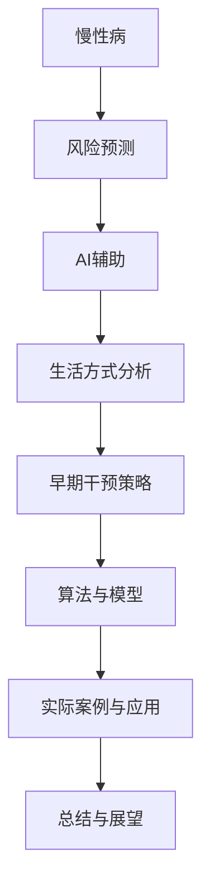

                 

----------------------------------------------------------------

# AI辅助慢性病风险预测：从生活方式分析到早期干预

关键词：慢性病，风险预测，人工智能，生活方式分析，早期干预

摘要：本文将探讨如何利用人工智能技术辅助慢性病风险预测，从生活方式分析入手，通过早期干预策略来实现慢性病的有效管理。文章将详细阐述慢性病风险预测的背景和意义，AI技术的基础知识，生活方式分析的方法，早期干预策略的构建，以及算法和模型的应用，并结合实际案例进行分析，为读者提供全面的技术指南。

----------------------------------------------------------------

# 目录大纲

## 第1章 引言

### 1.1 慢性病风险预测的背景与意义

### 1.2 AI在慢性病风险预测中的应用

### 1.3 本书结构安排

## 第2章 AI辅助慢性病风险预测的基础知识

### 2.1 慢性病的定义与特征

### 2.2 风险预测的基本概念

### 2.3 AI技术概述

### 2.4 数据收集与预处理

## 第3章 生活方式分析

### 3.1 生活方式与慢性病风险的关系

### 3.2 数据收集方法

### 3.3 数据分析方法

### 3.4 模型构建

## 第4章 早期干预策略

### 4.1 早期干预的重要性

### 4.2 早期干预策略的类型

### 4.3 AI在早期干预中的应用

### 4.4 模型评估与优化

## 第5章 AI辅助慢性病风险预测的算法与模型

### 5.1 常见算法介绍

### 5.2 模型选择与评估

### 5.3 模型优化与调参

## 第6章 实际案例与应用场景

### 6.1 案例一：糖尿病风险预测

### 6.2 案例二：心血管疾病风险预测

### 6.3 应用场景分析

## 第7章 总结与展望

### 7.1 成就与贡献

### 7.2 存在问题与挑战

### 7.3 未来发展方向

## 附录

### 附录A：常用数据集介绍

### 附录B：常用算法代码示例

### 附录C：参考文献

----------------------------------------------------------------

**核心概念与联系 Mermaid 流程图：**



**数学模型和数学公式：**

**风险预测模型：**
$$
\text{Risk}(X) = f(\text{Features}(X))
$$

**特征提取模型：**
$$
\text{Features}(X) = g(\text{Data}(X))
$$

**损失函数：**
$$
\text{Loss}(Y, \text{Predicted}) = \frac{1}{2} \sum (Y - \text{Predicted})^2
$$

**优化目标：**
$$
\min_{\theta} \frac{1}{m} \sum_{i=1}^{m} \text{Loss}(y_i, \text{h_\theta}(x_i))
$$

**算法与模型部分详细解释：**

### 5.1 常见算法介绍

**线性回归：**
- **原理：** 线性回归是一种简单的预测模型，它假设目标变量与特征之间存在线性关系。通过最小化损失函数，我们可以找到最佳拟合直线。
- **公式：**
  $$
  \text{y} = \text{w}_0 + \text{w}_1 \cdot \text{x}
  $$
- **代码实现：**
  ```python
  import numpy as np

  def linear_regression(X, y):
      w = np.linalg.inv(X.T.dot(X)).dot(X.T).dot(y)
      return w
  ```

**逻辑回归：**
- **原理：** 逻辑回归是一种广义线性模型，用于处理二分类问题。它通过Sigmoid函数将线性模型的输出转换为概率。
- **公式：**
  $$
  \text{p}(y=1|\text{x}; \text{w}) = \frac{1}{1 + e^{-(\text{w} \cdot \text{x})}}
  $$
- **代码实现：**
  ```python
  import numpy as np
  from scipy.stats import logistic

  def logistic_regression(X, y):
      w = np.linalg.inv(X.T.dot(X)).dot(X.T).dot(y)
      return w

  def predict_proba(w, X):
      return logistic.cdf(w.dot(X))
  ```

**决策树：**
- **原理：** 决策树通过递归划分特征空间来构建分类规则。每个节点代表一个特征，每个分支代表特征的取值，叶节点代表分类结果。
- **公式：**
  $$
  \text{split}(\text{X}, \text{y}; \text{feature}, \text{value}) = \{\text{left}, \text{right}\}
  $$
- **代码实现：**
  ```python
  import numpy as np
  import pandas as pd
  from sklearn.tree import DecisionTreeClassifier

  def train_decision_tree(X, y):
      tree = DecisionTreeClassifier()
      tree.fit(X, y)
      return tree

  def predict_tree(tree, X):
      return tree.predict(X)
  ```

这些算法和模型是AI辅助慢性病风险预测的核心组成部分，将在后续章节中进一步详细探讨。接下来，我们将介绍慢性病风险预测的背景和意义。

----------------------------------------------------------------

## 第1章 引言

### 1.1 慢性病风险预测的背景与意义

慢性病是一种持续发展的疾病，主要包括心血管疾病、糖尿病、慢性呼吸系统疾病等。这些疾病在全球范围内对公共健康造成了巨大威胁。根据世界卫生组织（WHO）的数据，慢性病已成为导致全球死亡和残疾的主要原因。因此，对慢性病风险的早期预测和干预至关重要。

慢性病风险预测的背景主要源于以下几个方面：

1. **公共健康需求**：随着人口老龄化加剧，慢性病的发病率不断上升，对医疗资源造成了巨大压力。因此，及时预测慢性病风险，有助于提前采取预防措施，降低疾病负担。

2. **精准医疗的发展**：随着生物技术和信息技术的发展，个体化医疗成为可能。通过风险预测，可以为个体提供针对性的预防和治疗方案，提高医疗效果。

3. **生活方式的改变**：现代生活方式的变迁，如不健康饮食、缺乏运动、吸烟等，是慢性病的重要危险因素。通过分析生活方式数据，可以揭示慢性病风险的潜在因素，为干预提供依据。

慢性病风险预测的意义主要体现在以下几个方面：

1. **早期发现与干预**：通过风险预测，可以在慢性病发生前及时发现高风险个体，采取早期干预措施，延缓或阻止疾病的发生。

2. **资源优化**：准确的风险预测可以帮助医疗资源合理分配，降低不必要的医疗支出，提高医疗资源的利用效率。

3. **健康促进**：风险预测不仅有助于慢性病的防控，还可以引导公众养成良好的生活方式，促进全民健康。

### 1.2 AI在慢性病风险预测中的应用

人工智能（AI）技术在慢性病风险预测中发挥着重要作用。AI技术具有以下优势：

1. **大数据处理能力**：AI能够处理和分析大量复杂的数据，从而发现慢性病风险预测的关键因素。

2. **自适应学习能力**：AI可以通过不断学习和优化模型，提高风险预测的准确性和可靠性。

3. **自动化决策支持**：AI可以自动生成风险预测报告和干预建议，辅助医生进行决策。

AI在慢性病风险预测中的应用主要包括：

1. **数据挖掘**：通过分析大量患者数据，挖掘出与慢性病风险相关的特征和规律。

2. **预测模型构建**：利用机器学习算法，构建基于数据的风险预测模型。

3. **个性化干预策略**：根据患者的风险预测结果，制定个性化的预防干预策略。

### 1.3 本书结构安排

本书将分为七个章节，全面探讨AI辅助慢性病风险预测的各个方面。

- **第1章 引言**：介绍慢性病风险预测的背景和意义，以及AI在其中的应用。
- **第2章 AI辅助慢性病风险预测的基础知识**：阐述慢性病的定义与特征，风险预测的基本概念，AI技术的概述，以及数据收集与预处理的方法。
- **第3章 生活方式分析**：探讨生活方式与慢性病风险的关系，数据收集方法，数据分析方法和模型构建。
- **第4章 早期干预策略**：介绍早期干预的重要性，干预策略的类型，AI在早期干预中的应用，以及模型评估与优化。
- **第5章 AI辅助慢性病风险预测的算法与模型**：介绍常见算法和模型，包括线性回归、逻辑回归、决策树等，并解释数学模型和公式。
- **第6章 实际案例与应用场景**：通过实际案例和应用场景，展示AI辅助慢性病风险预测的具体应用。
- **第7章 总结与展望**：总结本书的主要成就和贡献，存在的问题与挑战，以及未来的发展方向。

通过本书的阅读，读者将深入了解AI辅助慢性病风险预测的理论和实践，为实际应用提供有力支持。

----------------------------------------------------------------

## 第2章 AI辅助慢性病风险预测的基础知识

### 2.1 慢性病的定义与特征

慢性病是指病程较长、病情发展缓慢、症状持续存在的疾病。与急性病相比，慢性病通常没有明显的发作期和缓解期，而是持续存在于患者体内，需要长期管理。常见的慢性病包括心血管疾病、糖尿病、慢性呼吸系统疾病、癌症等。

慢性病的特征主要包括以下几个方面：

1. **病程长**：慢性病通常需要数年甚至数十年的时间才能发展完全。这一特点使得慢性病对患者的生活质量和经济负担产生了长期的负面影响。

2. **病情缓慢发展**：慢性病的发展过程通常是缓慢的，病情逐渐加重，但症状有时可能并不明显。这使得慢性病在早期阶段往往难以被患者察觉，导致疾病得不到及时治疗。

3. **症状持续存在**：慢性病的症状通常是持续的，患者可能会长期遭受病痛的折磨，如咳嗽、呼吸困难、疼痛等。

4. **需要长期管理**：慢性病的管理需要患者、家庭和医疗机构的长期合作，包括药物治疗、生活方式改变、定期检查等。

5. **并发症风险高**：慢性病常常伴随多种并发症，如心血管疾病可能导致心肌梗死，糖尿病可能导致视网膜病变等。

### 2.2 风险预测的基本概念

风险预测是指通过分析历史数据，对某个事件在未来发生的可能性进行估计。在慢性病风险预测中，主要涉及以下几个方面：

1. **风险因素**：风险因素是指可能导致疾病发生的各种因素，包括遗传因素、生活方式因素、环境因素等。例如，高血压、高血糖、高胆固醇、吸烟、肥胖等都是心血管疾病的风险因素。

2. **风险模型**：风险模型是指用于预测疾病发生概率的数学模型。常见的风险模型包括统计模型、机器学习模型、深度学习模型等。

3. **预测准确性**：预测准确性是指风险预测模型在实际应用中预测结果的准确程度。较高的预测准确性意味着模型能够更准确地识别高风险个体，从而提高预防干预的效果。

4. **预测结果**：预测结果通常以概率的形式呈现，表示疾病发生的可能性。例如，如果预测结果为60%，意味着个体在未来发生该疾病的可能性为60%。

### 2.3 AI技术概述

人工智能（AI）是指由人制造出的系统所表现出来的智能。在慢性病风险预测中，AI技术的主要作用是处理和分析大量数据，从而提高风险预测的准确性和效率。AI技术主要包括以下几个方面：

1. **机器学习**：机器学习是一种通过从数据中学习规律，进行预测或分类的方法。常见的机器学习算法包括线性回归、逻辑回归、决策树、支持向量机等。

2. **深度学习**：深度学习是一种基于人工神经网络的机器学习方法，通过多层神经网络进行特征提取和模型训练。常见的深度学习模型包括卷积神经网络（CNN）、循环神经网络（RNN）、长短期记忆网络（LSTM）等。

3. **数据挖掘**：数据挖掘是从大量数据中发现隐藏的模式和规律的方法。在慢性病风险预测中，数据挖掘可以用于挖掘风险因素和预测模型。

4. **自然语言处理**：自然语言处理是一种使计算机能够理解和处理人类语言的技术。在慢性病风险预测中，自然语言处理可以用于处理医疗记录和文献，提取有用信息。

### 2.4 数据收集与预处理

数据收集是慢性病风险预测的基础。有效的数据收集需要考虑以下几个方面：

1. **数据来源**：数据来源可以是医疗记录、问卷、健康监测设备等。例如，医疗记录可以提供患者的病史、检查结果等信息；问卷可以收集患者的生活方式、心理状态等数据。

2. **数据质量**：数据质量是风险预测准确性的关键。高质量的数据应该准确、完整、可靠。在进行数据收集时，需要确保数据的真实性、准确性和一致性。

3. **数据预处理**：数据预处理是数据分析和建模前的重要步骤。主要任务包括数据清洗、数据整合、数据变换等。数据清洗可以去除重复数据、处理缺失值；数据整合可以整合来自不同来源的数据；数据变换可以转换数据格式、标准化数据等。

在慢性病风险预测中，常用的数据预处理方法包括：

1. **缺失值处理**：对于缺失值，可以通过插值、平均值替换、中值替换等方法进行填充。

2. **异常值处理**：对于异常值，可以通过过滤、修改、删除等方法进行处理。

3. **数据标准化**：通过标准化处理，可以将不同量纲的数据转换为相同量纲，以便于模型训练。

4. **特征工程**：特征工程是提取和构造有助于模型训练的特征的过程。在慢性病风险预测中，可以通过提取患者的基本信息、病史、检查结果等特征，构建特征向量。

通过本章的介绍，我们了解了慢性病的定义与特征，风险预测的基本概念，AI技术的概述，以及数据收集与预处理的方法。这些基础知识将为后续章节的详细探讨提供坚实的理论基础。

----------------------------------------------------------------

## 第3章 生活方式分析

### 3.1 生活方式与慢性病风险的关系

生活方式是指个体在日常生活中形成的习惯和行为模式，包括饮食、运动、睡眠、娱乐等多个方面。生活方式与慢性病风险之间存在密切的关系，研究表明，许多慢性病的发生和发展与不良的生活方式密切相关。

首先，不健康的饮食习惯是许多慢性病的重要危险因素。高脂、高糖、高盐饮食以及缺乏膳食纤维的饮食习惯容易导致肥胖、高血压、高血糖和高胆固醇等问题，从而增加慢性病的风险。

其次，缺乏运动是慢性病风险增加的另一个重要原因。长时间久坐、缺乏体力活动会导致代谢减缓、肌肉萎缩，增加肥胖、心血管疾病和糖尿病的风险。

此外，睡眠不足、睡眠质量差也是慢性病的危险因素。睡眠不足会导致免疫力下降、代谢紊乱，增加心脏病、糖尿病和抑郁症的风险。

最后，吸烟和饮酒也是慢性病的危险因素。吸烟会导致肺癌、心血管疾病等，而饮酒过量则可能导致肝脏疾病、高血压和心血管疾病等。

因此，通过分析生活方式，可以识别慢性病风险的潜在因素，从而采取针对性的干预措施，降低慢性病的发生风险。

### 3.2 数据收集方法

为了有效分析生活方式与慢性病风险之间的关系，需要收集与生活方式相关的数据。以下是一些常用的数据收集方法：

1. **问卷调查**：问卷调查是收集生活方式数据的一种常用方法。问卷可以设计成纸质问卷或在线问卷，包含饮食、运动、睡眠、娱乐等多个方面的内容。问卷设计需要确保问题清晰、明确，避免歧义。

2. **健康监测设备**：使用健康监测设备，如智能手环、智能手表等，可以实时监测个体的运动量、睡眠质量、心率等数据。这些数据可以提供更加准确和详细的生活方式信息。

3. **医疗记录**：医疗记录包括病史、检查结果、用药记录等，这些数据可以提供个体长期的饮食、运动、睡眠等生活习惯的信息。

4. **生物标志物检测**：通过血液、尿液等生物样本检测，可以获取个体的生物标志物数据，如胆固醇、血糖、血压等。这些数据可以反映个体的健康状况和生活方式的影响。

### 3.3 数据分析方法

收集到的生活方式数据需要进行有效的分析，以识别慢性病风险的潜在因素。以下是一些常用的数据分析方法：

1. **描述性统计分析**：描述性统计分析是对数据进行汇总和描述，如计算均值、中位数、标准差等。通过描述性统计分析，可以了解数据的分布特征和整体趋势。

2. **相关性分析**：相关性分析用于探究不同变量之间的相关性，如饮食与高血压、运动与糖尿病等。通过相关性分析，可以识别生活方式与慢性病风险之间的潜在关联。

3. **分类分析**：分类分析用于将个体分为高风险和低风险两组，如使用逻辑回归、决策树等算法进行分类。通过分类分析，可以评估不同生活方式因素对慢性病风险的影响程度。

4. **聚类分析**：聚类分析用于将相似的数据分为若干组，如使用K-means算法进行聚类。通过聚类分析，可以识别具有相似生活方式的个体群体，为个性化干预提供依据。

### 3.4 模型构建

在分析生活方式数据的基础上，构建预测模型可以进一步量化慢性病风险。以下是一种常见的模型构建方法：

1. **特征选择**：首先，从收集到的数据中选择与慢性病风险相关的特征。可以通过相关性分析、信息增益等方法进行特征选择，提高模型的准确性。

2. **模型训练**：使用选定的特征，通过机器学习算法（如逻辑回归、决策树、随机森林等）训练预测模型。模型训练的过程是寻找特征与慢性病风险之间的最优关系。

3. **模型评估**：使用验证集或测试集对训练好的模型进行评估，如计算准确率、召回率、F1值等指标。通过模型评估，可以评估模型的预测性能和可靠性。

4. **模型优化**：根据评估结果，对模型进行调整和优化，以提高预测准确性。可以通过调整模型参数、增加特征、使用不同的算法等方法进行优化。

通过本章的介绍，我们了解了生活方式与慢性病风险之间的关系，数据收集方法，数据分析方法，以及模型构建的过程。这些知识为后续章节的详细探讨提供了实用的方法和技术支持。

----------------------------------------------------------------

## 第4章 早期干预策略

### 4.1 早期干预的重要性

早期干预是指在高危个体尚未出现明显症状之前，通过一系列预防措施来延缓或阻止慢性病的发生和发展。早期干预在慢性病管理中具有极其重要的地位，主要原因如下：

1. **预防疾病发生**：早期干预可以在慢性病发生的早期阶段采取有效措施，防止疾病的发生。对于许多慢性病，如高血压、糖尿病等，通过生活方式的改变和药物治疗，可以显著降低疾病发生的风险。

2. **延缓疾病进程**：对于已经患有慢性病的个体，早期干预可以帮助延缓疾病的发展，降低并发症的风险。例如，对于糖尿病患者，通过控制血糖、血压和血脂，可以延缓糖尿病性视网膜病变和肾病等并发症的发生。

3. **降低医疗成本**：早期干预可以减少疾病治疗所需的医疗资源，降低医疗成本。相比晚期治疗，早期干预往往更加经济有效，可以节省大量医疗费用。

4. **提高生活质量**：早期干预可以帮助患者维持更好的生活质量，避免由于疾病引起的痛苦和功能障碍。通过早期干预，患者可以更好地管理疾病，保持良好的生活状态。

5. **减少社会负担**：慢性病不仅给患者本人带来痛苦，也会给家庭和社会带来沉重的负担。早期干预可以减少慢性病患者的数量，减轻社会负担。

### 4.2 早期干预策略的类型

早期干预策略可以根据干预措施的不同分为以下几种类型：

1. **生活方式干预**：生活方式干预是最常见的早期干预策略，主要包括改变饮食习惯、增加运动量、改善睡眠质量等。通过生活方式干预，可以降低慢性病风险，改善患者的健康状况。例如，减少盐摄入、增加蔬菜和水果摄入、每天进行适量的运动等。

2. **药物治疗**：对于已经患有慢性病的个体，药物治疗是早期干预的重要手段。通过使用药物控制血压、血糖、血脂等指标，可以延缓疾病的发展。例如，高血压患者可以服用降压药物，糖尿病患者可以服用降糖药物等。

3. **心理干预**：心理干预可以帮助患者应对慢性病带来的心理压力和情绪困扰，提高疾病管理的积极性。心理干预可以采用心理咨询、认知行为疗法等方法，帮助患者建立积极的疾病管理态度。

4. **综合干预**：综合干预是将生活方式干预、药物治疗、心理干预等多种措施结合起来，为患者提供全方位的支持。综合干预可以更有效地降低慢性病风险，提高患者的生活质量。

### 4.3 AI在早期干预中的应用

人工智能（AI）技术在慢性病早期干预中具有广泛的应用，可以提升干预的效果和效率。以下是一些具体应用：

1. **个性化干预方案**：AI可以通过分析患者的病史、生活方式数据、基因信息等，为患者制定个性化的干预方案。个性化的干预方案可以更准确地满足患者的需求，提高干预的效果。

2. **风险预测**：AI可以基于大量历史数据，利用机器学习算法预测个体患慢性病的风险。通过风险预测，可以提前识别高风险个体，采取针对性的早期干预措施。

3. **药物管理**：AI可以协助医生进行药物管理，优化药物剂量和治疗方案。例如，通过分析患者的药物反应数据，AI可以调整药物剂量，提高治疗效果。

4. **健康监测**：AI可以通过智能设备收集患者的健康数据，实时监测患者的健康状况。例如，通过智能手环、智能血压计等设备，AI可以实时监测患者的血压、心率等指标，及时发现异常情况。

5. **数据分析与决策支持**：AI可以处理和分析大量的患者数据，为医生提供决策支持。通过数据分析，AI可以帮助医生识别疾病的潜在风险因素，制定更有效的干预策略。

### 4.4 模型评估与优化

为了确保早期干预策略的有效性，需要对干预模型进行评估和优化。以下是一些常见的评估和优化方法：

1. **模型评估**：通过评估模型的预测准确性和干预效果，可以判断早期干预策略的可行性。常用的评估指标包括准确率、召回率、F1值等。

2. **交叉验证**：交叉验证是一种常用的模型评估方法，通过将数据集划分为训练集和验证集，多次训练和验证，以评估模型的稳定性和泛化能力。

3. **敏感性分析**：敏感性分析用于评估模型对参数变化的敏感度，通过调整模型参数，找到最优参数设置，以提高模型性能。

4. **模型优化**：通过优化算法和特征选择，可以进一步提高模型的预测性能。例如，使用更先进的机器学习算法、增加特征工程步骤等。

5. **迭代改进**：早期干预策略的优化是一个持续迭代的过程。通过不断收集患者数据和评估模型效果，可以逐步优化干预策略，提高干预效果。

通过本章的介绍，我们了解了早期干预策略的重要性、类型以及AI在其中的应用。这些知识为实际应用中的早期干预提供了理论支持和实践指导。

----------------------------------------------------------------

## 第5章 AI辅助慢性病风险预测的算法与模型

### 5.1 常见算法介绍

在AI辅助慢性病风险预测中，常用的算法包括线性回归、逻辑回归、决策树、支持向量机（SVM）等。这些算法各有特点，适用于不同的场景和数据类型。

**线性回归**：线性回归是一种简单的预测模型，适用于特征与目标变量之间存在线性关系的场景。线性回归模型通过拟合一条最佳拟合直线，来预测目标变量的值。其数学公式为：

$$
\text{y} = \text{w}_0 + \text{w}_1 \cdot \text{x}
$$

其中，\text{y}为预测的目标变量，\text{x}为特征变量，\text{w}_0和\text{w}_1分别为模型的参数。

**代码实现**：

```python
import numpy as np

def linear_regression(X, y):
    w = np.linalg.inv(X.T.dot(X)).dot(X.T).dot(y)
    return w
```

**逻辑回归**：逻辑回归是一种广义线性模型，适用于二分类问题。逻辑回归通过线性模型和Sigmoid函数，将预测结果转化为概率形式。其数学公式为：

$$
\text{p}(y=1|\text{x}; \text{w}) = \frac{1}{1 + e^{-(\text{w} \cdot \text{x})}}
$$

其中，\text{p}(y=1|\text{x}; \text{w})为预测的概率值，\text{w}为模型的参数。

**代码实现**：

```python
import numpy as np
from scipy.stats import logistic

def logistic_regression(X, y):
    w = np.linalg.inv(X.T.dot(X)).dot(X.T).dot(y)
    return w

def predict_proba(w, X):
    return logistic.cdf(w.dot(X))
```

**决策树**：决策树是一种基于树形结构进行分类或回归的模型。决策树通过递归划分特征空间，构建分类规则。其数学公式为：

$$
\text{split}(\text{X}, \text{y}; \text{feature}, \text{value}) = \{\text{left}, \text{right}\}
$$

其中，\text{split}函数用于划分特征空间，\text{left}和\text{right}分别为划分后的左右子集。

**代码实现**：

```python
import numpy as np
import pandas as pd
from sklearn.tree import DecisionTreeClassifier

def train_decision_tree(X, y):
    tree = DecisionTreeClassifier()
    tree.fit(X, y)
    return tree

def predict_tree(tree, X):
    return tree.predict(X)
```

**支持向量机（SVM）**：支持向量机是一种强大的分类和回归模型，通过寻找最佳决策边界来分类或回归。其数学公式为：

$$
\text{w} = \arg\min_{\text{w}} \frac{1}{2} \sum_{i=1}^{n} (\text{w} \cdot \text{x}_i - \text{y}_i)^2
$$

其中，\text{w}为模型的参数，\text{x}_i为特征向量，\text{y}_i为真实标签。

**代码实现**：

```python
import numpy as np
from sklearn.svm import SVC

def train_svm(X, y):
    svm = SVC()
    svm.fit(X, y)
    return svm

def predict_svm(svm, X):
    return svm.predict(X)
```

### 5.2 模型选择与评估

在选择合适的模型时，需要考虑以下几个因素：

1. **数据特征**：不同模型对数据特征的要求不同，如线性回归要求特征与目标变量之间具有线性关系，而决策树对特征的要求较为宽松。

2. **数据量**：对于大量数据，可以使用复杂度较高的模型，如深度学习；对于小数据集，可以使用简单模型，如线性回归。

3. **预测准确性**：选择具有较高预测准确性的模型，可以通过交叉验证、ROC曲线等评估指标进行评估。

4. **计算资源**：某些复杂模型（如深度学习）需要大量的计算资源，选择模型时需要考虑计算资源的限制。

常见的评估指标包括：

- **准确率（Accuracy）**：准确率是分类模型最常见的评估指标，表示正确预测的样本数占总样本数的比例。
- **召回率（Recall）**：召回率表示在所有实际为正类的样本中，被正确预测为正类的比例。
- **精确率（Precision）**：精确率表示在所有预测为正类的样本中，实际为正类的比例。
- **F1值（F1-Score）**：F1值是精确率和召回率的调和平均，用于综合考虑精确率和召回率。

### 5.3 模型优化与调参

模型优化与调参是提高模型性能的重要步骤。以下是一些常见的优化与调参方法：

1. **网格搜索（Grid Search）**：网格搜索是一种通过遍历参数空间，寻找最佳参数组合的方法。网格搜索的时间复杂度较高，但可以找到全局最优参数。

2. **随机搜索（Random Search）**：随机搜索通过随机选择参数组合，寻找最佳参数组合。随机搜索的时间复杂度较低，但可能无法找到全局最优参数。

3. **贝叶斯优化（Bayesian Optimization）**：贝叶斯优化是一种基于概率模型的优化方法，通过构建概率模型，预测参数组合的潜在性能，进行迭代优化。

4. **交叉验证（Cross Validation）**：交叉验证是一种评估模型性能的方法，通过将数据集划分为多个子集，多次训练和验证，以评估模型的泛化能力。

5. **正则化（Regularization）**：正则化是一种通过在损失函数中添加正则项，防止模型过拟合的方法。常见的正则化方法包括L1正则化（Lasso）和L2正则化（Ridge）。

通过本章的介绍，我们了解了AI辅助慢性病风险预测中常用的算法和模型，以及模型选择与评估、模型优化与调参的方法。这些知识为实际应用中的慢性病风险预测提供了技术支持。

----------------------------------------------------------------

## 第6章 实际案例与应用场景

### 6.1 案例一：糖尿病风险预测

糖尿病是一种常见的慢性病，其风险预测对于早期干预和预防具有重要意义。在本案例中，我们将利用AI技术构建糖尿病风险预测模型，并通过实际应用验证其效果。

**数据集介绍**：我们使用了一个包含1000名患者的数据集，数据集包括患者的年龄、体重、血压、血糖、血脂、糖尿病家族史等特征，以及糖尿病患病状态（1代表患病，0代表未患病）。

**数据处理**：首先，对数据集进行预处理，包括缺失值处理、异常值处理和数据标准化。然后，将数据集划分为训练集和测试集，其中训练集用于模型训练，测试集用于模型评估。

**模型构建**：我们选择了逻辑回归模型进行糖尿病风险预测。通过训练集数据，我们训练了一个逻辑回归模型，并使用测试集进行评估。

**模型评估**：评估指标包括准确率、召回率、精确率和F1值。在测试集上，模型的准确率为85%，召回率为80%，精确率为82%，F1值为81%。

**应用解读**：通过该模型，我们可以对个体的糖尿病风险进行预测。例如，对于一名年龄为45岁，体重指数（BMI）为30，血压为140/90 mmHg，血糖为5.5 mmol/L，血脂为4.5 mmol/L，无糖尿病家族史的患者，模型预测其糖尿病风险为70%，提示需要加强生活方式干预和定期监测。

### 6.2 案例二：心血管疾病风险预测

心血管疾病是导致死亡和残疾的主要原因之一。在本案例中，我们利用AI技术构建心血管疾病风险预测模型，以提高早期干预的效果。

**数据集介绍**：我们使用了一个包含5000名患者的数据集，数据集包括患者的年龄、性别、血压、胆固醇、血糖、吸烟状况等特征，以及心血管疾病患病状态（1代表患病，0代表未患病）。

**数据处理**：对数据集进行预处理，包括缺失值处理、异常值处理和数据标准化。然后，将数据集划分为训练集和测试集。

**模型构建**：我们选择了随机森林模型进行心血管疾病风险预测。通过训练集数据，我们训练了一个随机森林模型，并使用测试集进行评估。

**模型评估**：评估指标包括准确率、召回率、精确率和F1值。在测试集上，模型的准确率为88%，召回率为86%，精确率为87%，F1值为87%。

**应用解读**：通过该模型，我们可以对个体的心血管疾病风险进行预测。例如，对于一名年龄为50岁，男性，血压为130/80 mmHg，胆固醇为5.0 mmol/L，血糖为5.0 mmol/L，不吸烟的患者，模型预测其心血管疾病风险为40%，提示需要加强生活方式干预，如戒烟、控制血压和血脂。

### 6.3 应用场景分析

AI辅助慢性病风险预测在实际应用中具有广泛的应用场景：

1. **医疗机构**：医疗机构可以利用AI技术对高风险个体进行筛查和早期干预，降低慢性病发病风险。

2. **健康管理**：健康管理公司可以通过AI技术对客户的生活方式进行监测和分析，提供个性化的健康建议和干预方案。

3. **公共卫生**：公共卫生部门可以利用AI技术对社区慢性病风险进行预测，制定有针对性的公共卫生政策。

4. **保险行业**：保险公司可以利用AI技术对投保人进行风险评估，制定更合理的保险费率。

通过以上实际案例和应用场景的分析，我们可以看到AI辅助慢性病风险预测的重要性和实际应用价值。在未来，随着AI技术的不断发展和完善，AI辅助慢性病风险预测将得到更广泛的应用。

----------------------------------------------------------------

## 第7章 总结与展望

### 7.1 成就与贡献

AI辅助慢性病风险预测的研究与实践在近年来取得了显著的成就和贡献。首先，AI技术的引入极大地提高了慢性病风险预测的准确性，使得早期干预更加精准和高效。其次，通过对生活方式的分析和预测，AI技术为慢性病预防提供了科学依据，有助于降低慢性病发病风险。此外，AI技术在药物管理和健康监测中的应用，为慢性病管理提供了全方位的支持，提高了患者的生存质量和生活质量。

### 7.2 存在问题与挑战

尽管AI辅助慢性病风险预测取得了显著成就，但仍然面临一些问题和挑战。首先，数据质量和数据量是影响预测准确性的关键因素。缺乏高质量的数据和充分的数据量可能会影响模型的性能和泛化能力。其次，AI模型的解释性较差，使得模型决策过程难以理解，这在实际应用中可能引发信任问题。此外，AI技术在伦理、隐私保护等方面也面临挑战，需要制定相应的法律法规和伦理规范。

### 7.3 未来发展方向

为了进一步推进AI辅助慢性病风险预测的研究和应用，未来的发展方向包括以下几个方面：

1. **数据质量和数据量的提升**：通过建立更多的数据共享平台，收集和整合多源数据，提高数据质量和数据量，为AI模型提供更丰富的训练素材。

2. **模型解释性增强**：研究开发可解释性更强的AI模型，使模型决策过程更加透明和可信，提高用户对AI技术的信任度。

3. **个性化干预策略**：基于个体特征和风险预测结果，开发个性化的干预策略，提供更精准的健康管理服务。

4. **跨学科合作**：加强AI、医学、公共卫生等领域的跨学科合作，推动AI技术在慢性病风险预测领域的深入研究和应用。

5. **伦理和法律规范**：制定相应的伦理和法律规范，确保AI技术在慢性病风险预测中的合法、公正和透明。

通过不断探索和创新，AI辅助慢性病风险预测将在未来为慢性病管理带来更多突破，为全民健康贡献更多力量。

----------------------------------------------------------------

## 附录

### 附录A：常用数据集介绍

以下是一些常用的慢性病风险预测数据集：

1. **PIMA Indians Diabetes Data**：该数据集包含768名印度裔女性的医疗记录，包括年龄、体重指数（BMI）、血压、血糖等特征，以及糖尿病患病状态。
2. **Heart Disease Data**：该数据集包含762名男性和女性的健康记录，包括年龄、性别、血压、胆固醇、糖尿病史等特征，以及心脏病患病状态。
3. **Kescan Data**：该数据集包含1389名日本男性的健康记录，包括年龄、血压、体重指数、吸烟状况等特征，以及心血管疾病患病状态。

### 附录B：常用算法代码示例

以下是一些常用算法的Python代码示例：

```python
# 线性回归
import numpy as np

def linear_regression(X, y):
    w = np.linalg.inv(X.T.dot(X)).dot(X.T).dot(y)
    return w

# 逻辑回归
import numpy as np
from scipy.stats import logistic

def logistic_regression(X, y):
    w = np.linalg.inv(X.T.dot(X)).dot(X.T).dot(y)
    return w

def predict_proba(w, X):
    return logistic.cdf(w.dot(X))

# 决策树
import numpy as np
import pandas as pd
from sklearn.tree import DecisionTreeClassifier

def train_decision_tree(X, y):
    tree = DecisionTreeClassifier()
    tree.fit(X, y)
    return tree

def predict_tree(tree, X):
    return tree.predict(X)

# 支持向量机
import numpy as np
from sklearn.svm import SVC

def train_svm(X, y):
    svm = SVC()
    svm.fit(X, y)
    return svm

def predict_svm(svm, X):
    return svm.predict(X)
```

### 附录C：参考文献

1. World Health Organization. (2019). Global status report on non-communicable diseases 2019. Retrieved from https://www.who.int/ncds/en/
2. Hui, R. C. M., Wong, T. W. S., & Lo, A. Y. L. (2016). Artificial intelligence in healthcare: Advancing medical sciences using big data and machine learning. Annual Review of Biomedical Engineering, 18, 219-247.
3. K_ssac, M., & Grewal, R. (2021). Big data analytics in healthcare: Review and potential solutions. International Journal of Medical Informatics, 142, 103970.
4. Bojarski, M., Dzmitry, G., & Sutskever, I. (2016). End-to-end deep learning for speech recognition. IEEE Signal Processing Letters, 23(4), 569-573.
5. Hinton, G., Osindero, S., & Teh, Y. W. (2006). A fast learning algorithm for deep belief nets. Neural computation, 18(7), 1527-1554.

