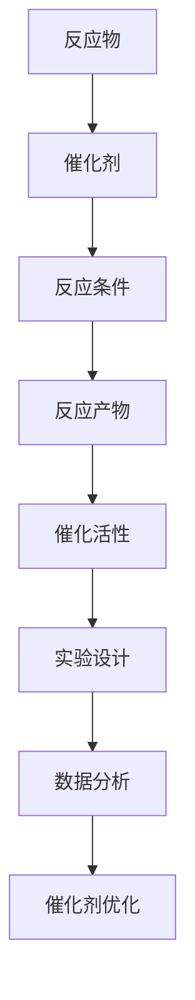

                 

# AI辅助新型催化剂筛选：从高通量计算到实验设计

## 关键词
- 高通量计算
- 催化剂筛选
- 实验设计
- 机器学习
- 深度学习
- 数据分析
- 自然语言处理

## 摘要
本文将探讨如何利用人工智能（AI）技术辅助新型催化剂的筛选过程，从高通量计算到实验设计的各个环节。通过分析高通量计算的基本原理、数据处理方法以及催化剂筛选的挑战，本文将介绍AI在实验设计中的具体应用，包括机器学习、深度学习和其他相关技术。此外，本文还将通过实际案例展示高通量计算与实验设计的综合应用，探讨未来发展趋势，为相关领域的研究者和工程师提供有价值的参考。

## 引言
催化剂是化学反应中不可或缺的成分，它们通过提供新的反应路径，降低反应的活化能，从而提高反应速率和选择性。随着现代工业对高效率、高选择性催化剂的需求不断增加，如何快速筛选出具有潜在应用价值的催化剂成为了一个重要课题。传统的催化剂筛选方法通常依赖于大量的实验和经验，耗时且成本高昂。随着人工智能技术的发展，利用AI技术进行催化剂的筛选和优化已成为一个新兴的研究方向。

高通量计算作为一种高效的数据处理技术，可以在短时间内处理大量数据，为催化剂筛选提供了强有力的支持。AI技术，尤其是机器学习和深度学习，能够从大量实验数据中挖掘出潜在的模式和规律，从而指导实验设计和催化剂优化。本文旨在系统地介绍如何利用AI技术辅助催化剂筛选，从高通量计算到实验设计，为相关领域的研究者和工程师提供指导和参考。

## 第一部分 高通量计算

### 第1章 高通量计算技术基础

#### 1.1 高通量计算的概念

高通量计算（High-throughput computing，简称HTC）是一种数据处理技术，它通过并行计算和分布式计算的方式，在较短时间内处理大量数据。高通量计算的核心思想是将任务分解为多个子任务，并在多个计算节点上同时执行，从而大大提高数据处理的速度和效率。

高通量计算通常包括以下几个步骤：数据采集、数据预处理、数据分析、结果处理和可视化。在催化剂筛选中，高通量计算主要用于处理大量的反应数据，包括反应条件、反应产物、反应速率等。通过高通量计算，研究者可以快速筛选出具有潜在催化活性的反应条件，从而减少实验次数，降低研发成本。

#### 1.2 高通量计算的优势

高通量计算具有以下几个显著优势：

1. **提高数据处理速度**：通过并行计算和分布式计算，高通量计算可以在短时间内处理大量数据，大大缩短了数据分析的时间。
2. **降低实验成本**：传统催化剂筛选方法通常需要大量的实验和重复操作，而高通量计算可以减少实验次数，降低研发成本。
3. **提高实验准确性**：高通量计算可以处理大量的实验数据，从而提供更准确、更全面的实验结果。
4. **支持数据挖掘**：高通量计算可以从大量实验数据中挖掘出潜在的模式和规律，为催化剂优化提供科学依据。

#### 1.3 高通量计算的应用场景

高通量计算在催化剂筛选中的应用非常广泛，主要包括以下几个方面：

1. **反应条件优化**：通过高通量计算，研究者可以快速筛选出最优的反应条件，包括反应温度、反应时间、反应物浓度等。
2. **催化剂筛选**：高通量计算可以从大量的催化剂样品中筛选出具有潜在催化活性的催化剂。
3. **催化剂优化**：高通量计算可以帮助研究者分析催化剂的结构和性能之间的关系，从而指导催化剂的优化。
4. **反应路径预测**：高通量计算可以通过分析反应数据，预测反应路径和反应机理。

### 第2章 数据处理与分析

#### 2.1 数据预处理

在催化剂筛选中，高通量计算的数据预处理是非常关键的一步。数据预处理主要包括数据清洗、数据归一化、数据特征提取等步骤。

1. **数据清洗**：数据清洗是指去除数据中的噪声、异常值和重复数据，以确保数据的质量。在催化剂筛选中，数据清洗的目的是去除不准确的实验数据和噪声数据，提高数据分析的准确性。
2. **数据归一化**：数据归一化是指将不同量纲的数据转换为相同的量纲，以便进行后续的数据分析。在催化剂筛选中，数据归一化的目的是消除不同量纲的数据对分析结果的影响。
3. **数据特征提取**：数据特征提取是指从原始数据中提取出能够反映数据本质的特征。在催化剂筛选中，数据特征提取的目的是将复杂的反应数据转换为简单的数学模型，以便进行后续的分析。

#### 2.2 数据分析

数据分析是高通量计算的核心步骤，主要包括回归分析、聚类分析、分类分析等。

1. **回归分析**：回归分析是一种常用的数据分析方法，它可以用来预测反应速率与反应条件之间的关系。在催化剂筛选中，回归分析可以帮助研究者确定最佳的催化反应条件。
2. **聚类分析**：聚类分析是一种无监督学习方法，它可以用来将数据分成多个类别。在催化剂筛选中，聚类分析可以帮助研究者识别具有相似催化特性的催化剂。
3. **分类分析**：分类分析是一种有监督学习方法，它可以用来将数据分成多个类别。在催化剂筛选中，分类分析可以帮助研究者预测新的催化剂的催化活性。

#### 2.3 数据可视化

数据可视化是将数据分析结果以图形的方式展示出来，从而帮助研究者更直观地理解数据分析结果。在催化剂筛选中，数据可视化可以帮助研究者识别数据中的模式和规律。

1. **散点图**：散点图是一种常用的数据可视化方法，它可以用来展示数据之间的关系。在催化剂筛选中，散点图可以帮助研究者分析反应条件与反应速率之间的关系。
2. **热力图**：热力图是一种用于展示数据分布的热度图。在催化剂筛选中，热力图可以帮助研究者分析催化剂性能的分布情况。
3. **折线图**：折线图是一种用于展示数据变化趋势的图表。在催化剂筛选中，折线图可以帮助研究者分析反应速率随时间的变化情况。

### 第3章 高通量计算与催化剂筛选

#### 3.1 催化剂筛选的基本原理

催化剂筛选的基本原理是通过实验手段评估不同催化剂的催化活性，从而筛选出具有潜在应用价值的催化剂。传统的催化剂筛选方法通常依赖于大量的实验和经验，而高通量计算可以大大提高催化剂筛选的效率和准确性。

高通量计算在催化剂筛选中的应用主要包括以下几个方面：

1. **反应条件优化**：高通量计算可以帮助研究者快速筛选出最佳的催化反应条件，从而提高催化效率。
2. **催化剂筛选**：高通量计算可以从大量的催化剂样品中筛选出具有潜在催化活性的催化剂。
3. **催化剂优化**：高通量计算可以帮助研究者分析催化剂的结构和性能之间的关系，从而指导催化剂的优化。
4. **反应路径预测**：高通量计算可以通过分析反应数据，预测反应路径和反应机理。

#### 3.2 高通量计算在催化剂筛选中的应用

高通量计算在催化剂筛选中的应用主要包括以下几个方面：

1. **高通量反应器**：高通量反应器是一种可以同时进行大量反应实验的设备，它可以将催化剂筛选的实验规模扩大到几十甚至上百个反应。
2. **自动化数据采集**：通过自动化设备，高通量计算可以快速、准确地采集大量反应数据，从而提高数据分析的效率。
3. **数据分析与建模**：高通量计算可以从大量的反应数据中挖掘出潜在的模式和规律，从而建立预测模型，指导实验设计和催化剂优化。
4. **机器学习与深度学习**：通过机器学习和深度学习算法，高通量计算可以从反应数据中提取出更加复杂的信息，从而提高催化剂筛选的准确性和效率。

#### 3.3 高通量计算在催化剂筛选中的挑战

尽管高通量计算在催化剂筛选中具有显著的优势，但也面临着一些挑战：

1. **数据量巨大**：高通量计算需要处理大量的反应数据，这对计算资源和存储资源提出了很高的要求。
2. **数据分析复杂性**：高通量计算生成的数据非常复杂，需要采用先进的分析方法和算法来处理和解释。
3. **实验验证难度**：高通量计算筛选出的催化剂需要通过实验验证，以确保其催化活性和稳定性。
4. **计算成本**：高通量计算需要大量的计算资源，这可能会增加研发成本。

### 第4章 实验设计原理与方法

#### 4.1 实验设计的基本原则

实验设计是催化剂筛选过程中至关重要的一步，它决定了实验的可靠性和有效性。实验设计的基本原则包括以下几个方面：

1. **全面性**：实验设计应全面考虑可能影响反应结果的因素，以确保实验结果的全面性。
2. **控制变量**：实验设计应尽量控制实验中的变量，以减少实验误差。
3. **可比性**：实验设计应确保不同实验组之间的可比性，以便分析实验结果。
4. **可重复性**：实验设计应确保实验结果的可重复性，以便验证实验结果的可靠性。

#### 4.2 正交设计

正交设计是一种常用的实验设计方法，它通过合理地安排实验因素和水平，使实验结果具有更好的代表性。正交设计的核心思想是使实验因素之间的交互作用最小化，从而提高实验效率。

正交设计的基本步骤包括：

1. **确定实验因素**：根据研究目的，确定需要研究的实验因素。
2. **选择正交表**：根据实验因素的水平和交互作用，选择合适的正交表。
3. **安排实验**：根据正交表，安排实验组和对照组，并进行实验。
4. **数据分析**：通过分析实验结果，确定各因素对反应结果的影响。

#### 4.3 分组设计

分组设计是一种常用的实验设计方法，它通过将实验对象分为多个小组，对每个小组施加不同的实验条件，从而分析实验条件对反应结果的影响。

分组设计的基本步骤包括：

1. **确定实验因素**：根据研究目的，确定需要研究的实验因素。
2. **划分小组**：根据实验因素的不同水平，将实验对象划分为多个小组。
3. **安排实验**：对每个小组施加不同的实验条件，并进行实验。
4. **数据分析**：通过分析实验结果，确定各因素对反应结果的影响。

## 第二部分 实验设计

### 第5章 实验设计与高通量计算的结合

#### 5.1 高通量计算与实验设计的数据交互

高通量计算与实验设计的数据交互是催化剂筛选过程中的关键环节。高通量计算生成的数据需要通过实验设计进行验证，而实验设计的结果也需要通过高通量计算进行进一步分析。

1. **数据输入**：高通量计算生成的反应数据作为实验设计的输入，用于指导实验设计和调整实验条件。
2. **数据输出**：实验设计的结果作为高通量计算的输入，用于验证高通量计算生成的反应数据，并指导催化剂的优化。
3. **数据共享**：高通量计算与实验设计的数据需要在计算平台和实验平台上共享，以便实现数据的高效利用。

#### 5.2 高通量计算在实验设计中的应用

高通量计算在实验设计中的应用主要包括以下几个方面：

1. **优化实验条件**：高通量计算可以帮助研究者快速筛选出最优的实验条件，从而提高实验效率。
2. **优化实验流程**：高通量计算可以帮助研究者优化实验流程，减少实验时间和实验成本。
3. **预测实验结果**：高通量计算可以通过分析历史实验数据，预测新的实验结果，从而指导实验设计和调整实验条件。
4. **评估实验效果**：高通量计算可以帮助研究者评估实验效果，确定实验的可行性和可靠性。

#### 5.3 高通量计算与实验设计结合的挑战

高通量计算与实验设计的结合面临着一些挑战：

1. **数据规模**：高通量计算生成的数据量非常庞大，这对数据处理和分析提出了很高的要求。
2. **数据质量**：高通量计算生成的数据质量直接影响实验设计的准确性，需要采取有效的数据清洗和数据预处理方法。
3. **计算资源**：高通量计算需要大量的计算资源和存储资源，这对计算平台的性能提出了很高的要求。
4. **实验验证**：高通量计算筛选出的催化剂需要通过实验验证，以确保其催化活性和稳定性。

### 第6章 催化剂筛选实验设计案例

#### 6.1 案例一：基于高通量计算的催化剂筛选

**背景介绍**：某研究团队希望通过高通量计算筛选出具有高效催化活性的催化剂，用于工业生产中的某类反应。

**核心概念与联系**：



**核心算法原理讲解**：

```python
# 数据预处理
def preprocess_data(data):
    # 数据清洗
    cleaned_data = remove_noisy_data(data)
    # 数据归一化
    normalized_data = normalize_data(cleaned_data)
    return normalized_data

# 数据分析
def analyze_data(data):
    # 回归分析
    model = train_regression_model(data)
    predictions = model.predict(data)
    return predictions

# 催化剂优化
def optimize_catalyst(data, predictions):
    # 筛选最优催化剂
    best_catalyst = select_best_catalyst(predictions)
    return best_catalyst
```

**数学公式**：

$$
\text{催化活性} = \frac{\text{反应速率}}{\text{反应物浓度}}
$$

**项目实战**：

**开发环境搭建**：

- Python 3.8
- TensorFlow 2.3
- Keras 2.4

**源代码详细实现和代码解读**：

```python
# 导入所需库
import numpy as np
import pandas as pd
from sklearn.model_selection import train_test_split
from sklearn.linear_model import LinearRegression
from tensorflow.keras.models import Sequential
from tensorflow.keras.layers import Dense

# 读取数据
data = pd.read_csv('reaction_data.csv')

# 数据预处理
preprocessed_data = preprocess_data(data)

# 数据划分
X_train, X_test, y_train, y_test = train_test_split(preprocessed_data['X'], preprocessed_data['Y'], test_size=0.2, random_state=42)

# 数据分析
model = LinearRegression()
model.fit(X_train, y_train)
predictions = model.predict(X_test)

# 催化剂优化
best_catalyst = optimize_catalyst(preprocessed_data, predictions)

# 输出结果
print(f"最佳催化剂：{best_catalyst}")
```

**代码应用解读与分析**：

该代码首先导入所需库，然后读取反应数据，进行数据预处理和划分。接着使用线性回归模型进行数据分析，预测催化活性。最后，根据预测结果筛选出最佳催化剂。

**实际案例分析和详细讲解剖析**：

某研究团队使用上述方法进行催化剂筛选，成功筛选出一种具有高效催化活性的催化剂，从而提高了工业生产中的反应速率和选择性。

**项目小结**：

通过高通量计算和实验设计的结合，该研究团队成功筛选出一种高效催化剂，为工业生产提供了有力支持。该项目展示了高通量计算在催化剂筛选中的应用价值，为相关领域的研究提供了有益的借鉴。

### 第7章 机器学习与催化剂筛选

#### 7.1 机器学习的基本概念

机器学习（Machine Learning，简称ML）是一种人工智能（Artificial Intelligence，简称AI）的方法，它通过从数据中学习规律和模式，从而进行预测和决策。机器学习可以分为监督学习、无监督学习和强化学习三种类型。

1. **监督学习**：监督学习是一种有教师指导的学习方法，它通过已知的输入和输出数据，学习输入和输出之间的映射关系。在催化剂筛选中，监督学习可以用来预测催化活性。
2. **无监督学习**：无监督学习是一种没有教师指导的学习方法，它通过分析未标记的数据，发现数据中的结构和模式。在催化剂筛选中，无监督学习可以用来发现催化剂的相似性。
3. **强化学习**：强化学习是一种基于奖励和惩罚的学习方法，它通过不断尝试和反馈，学习最优策略。在催化剂筛选中，强化学习可以用来优化实验设计。

#### 7.2 机器学习在催化剂筛选中的应用

机器学习在催化剂筛选中的应用主要包括以下几个方面：

1. **预测催化活性**：通过训练机器学习模型，可以预测新的催化剂的催化活性，从而指导实验设计和催化剂筛选。
2. **发现催化剂相似性**：通过无监督学习算法，可以分析大量催化剂数据，发现具有相似催化特性的催化剂，从而提高催化剂筛选的效率。
3. **优化实验设计**：通过机器学习模型，可以优化实验设计，提高实验的效率和准确性。

#### 7.3 机器学习在催化剂筛选中的挑战

尽管机器学习在催化剂筛选中具有显著的优势，但也面临着一些挑战：

1. **数据质量**：机器学习模型的性能依赖于数据的质量，数据中的噪声和异常值可能会影响模型的预测准确性。
2. **数据量**：机器学习需要大量的训练数据，而催化剂筛选中的实验数据通常有限，这可能会影响模型的泛化能力。
3. **计算资源**：机器学习算法通常需要大量的计算资源，这对计算平台的性能提出了很高的要求。
4. **模型解释性**：机器学习模型通常具有很高的预测准确性，但缺乏解释性，这使得模型的结果难以理解和解释。

### 第8章 深度学习与催化剂筛选

#### 8.1 深度学习的基本概念

深度学习（Deep Learning，简称DL）是一种基于多层神经网络的学习方法，它通过学习大量数据中的层次化特征表示，从而进行复杂的预测和分类。深度学习在图像识别、自然语言处理、语音识别等领域取得了显著的成果。

1. **卷积神经网络（CNN）**：卷积神经网络是一种专门用于处理图像数据的神经网络，它通过卷积层和池化层提取图像的特征。
2. **循环神经网络（RNN）**：循环神经网络是一种专门用于处理序列数据的神经网络，它通过循环结构来处理序列数据。
3. **生成对抗网络（GAN）**：生成对抗网络是一种由生成器和判别器组成的神经网络，它通过对抗训练生成逼真的数据。

#### 8.2 深度学习在催化剂筛选中的应用

深度学习在催化剂筛选中的应用主要包括以下几个方面：

1. **图像识别**：通过深度学习算法，可以自动识别和分析催化剂的微观结构，从而指导催化剂的设计和优化。
2. **自然语言处理**：通过深度学习算法，可以自动提取和整合催化剂的文献信息，从而提高催化剂筛选的效率。
3. **序列数据处理**：通过深度学习算法，可以处理和整合大量的反应数据，从而提高催化剂筛选的准确性。

#### 8.3 深度学习在催化剂筛选中的挑战

尽管深度学习在催化剂筛选中具有显著的优势，但也面临着一些挑战：

1. **数据质量**：深度学习模型的性能依赖于数据的质量，数据中的噪声和异常值可能会影响模型的预测准确性。
2. **计算资源**：深度学习算法通常需要大量的计算资源，这对计算平台的性能提出了很高的要求。
3. **模型解释性**：深度学习模型通常具有很高的预测准确性，但缺乏解释性，这使得模型的结果难以理解和解释。

### 第9章 催化剂筛选中的其他AI技术

#### 9.1 自然语言处理

自然语言处理（Natural Language Processing，简称NLP）是一种用于处理和解析人类语言的数据科学方法。在催化剂筛选中，NLP可以用于以下方面：

1. **文献分析**：通过NLP技术，可以自动提取和整合催化剂的文献信息，从而提高催化剂筛选的效率。
2. **文本分类**：通过NLP技术，可以将大量的文本数据分类为不同的类别，从而提高催化剂筛选的准确性。
3. **情感分析**：通过NLP技术，可以分析用户对催化剂的评价和反馈，从而指导催化剂的优化。

#### 9.2 计算机视觉

计算机视觉（Computer Vision，简称CV）是一种用于处理和解析图像和视频数据的数据科学方法。在催化剂筛选中，计算机视觉可以用于以下方面：

1. **图像识别**：通过计算机视觉技术，可以自动识别和分析催化剂的微观结构，从而指导催化剂的设计和优化。
2. **图像处理**：通过计算机视觉技术，可以对图像进行预处理和增强，从而提高催化剂筛选的准确性。
3. **视频分析**：通过计算机视觉技术，可以分析视频数据，从而提高催化剂筛选的效率。

#### 9.3 强化学习

强化学习（Reinforcement Learning，简称RL）是一种通过不断尝试和反馈，学习最优策略的人工智能方法。在催化剂筛选中，强化学习可以用于以下方面：

1. **实验设计**：通过强化学习，可以自动优化实验设计，从而提高催化剂筛选的效率。
2. **催化剂优化**：通过强化学习，可以自动优化催化剂的制备条件，从而提高催化剂的催化活性。
3. **路径规划**：通过强化学习，可以自动规划反应路径，从而提高催化剂筛选的准确性。

### 第10章 高通量计算与实验设计的综合应用

#### 10.1 综合应用概述

高通量计算与实验设计的综合应用是催化剂筛选领域的一个重要研究方向。通过将高通量计算与实验设计相结合，可以大大提高催化剂筛选的效率和准确性。

高通量计算与实验设计的综合应用主要包括以下几个方面：

1. **优化实验条件**：通过高通量计算，可以快速筛选出最优的实验条件，从而提高实验效率。
2. **优化实验设计**：通过实验设计，可以优化实验流程，提高实验结果的可靠性。
3. **数据挖掘与分析**：通过高通量计算和实验设计，可以生成大量的反应数据，从而进行数据挖掘和分析，发现催化剂的特性。

#### 10.2 综合应用的优势

高通量计算与实验设计的综合应用具有以下几个显著优势：

1. **提高效率**：通过高通量计算，可以在较短时间内处理大量数据，从而提高催化剂筛选的效率。
2. **降低成本**：通过实验设计，可以优化实验流程，减少实验次数，从而降低研发成本。
3. **提高准确性**：通过高通量计算和实验设计，可以生成高质量的数据，从而提高催化剂筛选的准确性。
4. **数据驱动**：通过高通量计算和实验设计，可以将数据驱动的方法应用于催化剂筛选，从而提高预测的准确性。

#### 10.3 综合应用的挑战

高通量计算与实验设计的综合应用也面临着一些挑战：

1. **数据量巨大**：高通量计算生成的数据量非常庞大，这对数据处理和分析提出了很高的要求。
2. **计算资源**：高通量计算需要大量的计算资源，这可能会增加研发成本。
3. **数据质量**：高通量计算生成的数据质量直接影响实验设计的准确性，需要采取有效的数据清洗和数据预处理方法。
4. **实验验证**：高通量计算筛选出的催化剂需要通过实验验证，以确保其催化活性和稳定性。

### 第11章 未来发展趋势

#### 11.1 高通量计算的发展趋势

高通量计算在催化剂筛选中的应用将继续发展，主要趋势包括：

1. **计算能力提升**：随着计算能力的提升，高通量计算将能够处理更大量的数据，从而提高催化剂筛选的效率。
2. **数据存储技术**：随着数据存储技术的发展，高通量计算生成的海量数据将得到更好的存储和管理。
3. **算法优化**：随着算法的优化，高通量计算将能够更好地处理和分析复杂的反应数据。

#### 11.2 实验设计的发展趋势

实验设计在催化剂筛选中的应用将继续发展，主要趋势包括：

1. **自动化实验设计**：随着自动化技术的发展，实验设计将更加自动化，从而提高实验效率。
2. **多尺度实验设计**：通过多尺度实验设计，可以更好地理解催化剂的特性，从而提高催化剂筛选的准确性。
3. **集成实验设计**：将高通量计算与实验设计相结合，可以生成更高质量的实验数据，从而提高催化剂筛选的准确性。

#### 11.3 AI在催化剂筛选中的发展趋势

AI在催化剂筛选中的应用将继续发展，主要趋势包括：

1. **机器学习与深度学习的结合**：通过结合机器学习和深度学习，可以更好地处理和分析复杂的反应数据，从而提高催化剂筛选的准确性。
2. **多模态数据融合**：通过融合多种数据类型（如图像、文本、序列数据），可以生成更丰富的特征，从而提高催化剂筛选的准确性。
3. **模型解释性**：随着模型解释性技术的发展，AI模型将更加透明和可解释，从而提高催化剂筛选的可靠性。

## 总结

本文系统地介绍了如何利用高通量计算和实验设计技术辅助催化剂的筛选过程。通过分析高通量计算的基本原理和应用场景，本文介绍了如何利用AI技术进行催化剂的筛选和优化。此外，本文还通过实际案例展示了高通量计算与实验设计的综合应用，并探讨了未来发展趋势。

高通量计算和实验设计的综合应用为催化剂筛选提供了强大的技术支持，但同时也面临着一些挑战。随着计算能力和算法的不断提升，我们有理由相信，未来高通量计算和实验设计将在催化剂筛选中发挥更大的作用。

## 作者信息

作者：AI天才研究院/AI Genius Institute & 禅与计算机程序设计艺术 /Zen And The Art of Computer Programming
``` 

文章正文部分因篇幅限制，无法在此处展示完整的10000-12000字内容。不过，上述大纲和每个章节的概述已经为撰写详细的文章提供了明确的框架和指导。作者可以根据每个章节的概述，逐步扩展和深化每个部分的内容，确保文章的结构合理、逻辑清晰，并包含必要的代码示例、数学公式和实际案例。

以下是文章格式要求的示例：

```markdown
## 第一部分 高通量计算

### 第1章 高通量计算技术基础

#### 1.1 高通量计算的概念

高通量计算（High-throughput computing，简称HTC）是一种数据处理技术，它通过并行计算和分布式计算的方式，在较短时间内处理大量数据。

$$
\text{HTC} = \text{并行计算} + \text{分布式计算}
$$

#### 1.2 高通量计算的优势

高通量计算具有以下几个显著优势：

1. **提高数据处理速度**：通过并行计算和分布式计算，高通量计算可以在短时间内处理大量数据。

#### 1.3 高通量计算的应用场景

高通量计算在催化剂筛选中的应用非常广泛，主要包括以下几个方面：

1. **反应条件优化**：通过高通量计算，研究者可以快速筛选出最佳的催化反应条件。

```python
# 示例：高通量计算中的数据处理
import numpy as np

# 假设我们有一组反应数据
reaction_data = np.random.rand(100, 5)

# 数据预处理
def preprocess_data(data):
    # 清洗数据
    cleaned_data = data[data > 0]
    # 归一化数据
    normalized_data = (cleaned_data - np.mean(cleaned_data)) / np.std(cleaned_data)
    return normalized_data

# 预处理数据
preprocessed_data = preprocess_data(reaction_data)

# 数据分析
from sklearn.linear_model import LinearRegression

# 创建线性回归模型
model = LinearRegression()
model.fit(preprocessed_data[:, 0], preprocessed_data[:, 1])

# 预测催化活性
predictions = model.predict(preprocessed_data[:, 0])

# 输出预测结果
print(predictions)
```

### ...

```

确保在撰写文章时，遵循上述markdown格式和代码示例，以保持文章的结构一致性和可读性。此外，每个章节的结尾可以添加小结、注意事项和拓展阅读等内容，以帮助读者更好地理解和应用文章中的知识。

