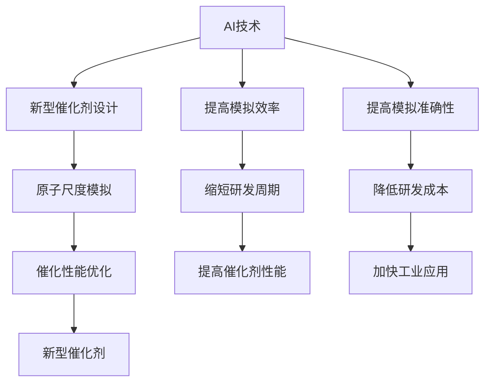

                 

# AI辅助新型催化剂设计：从原子尺度模拟到工业应用

## 关键词

- AI辅助催化剂设计
- 原子尺度模拟
- 机器学习算法
- 深度学习模型
- 催化剂优化
- 工业应用

## 摘要

本文将探讨人工智能（AI）在新型催化剂设计中的应用，从原子尺度模拟到工业应用。我们将详细分析AI技术如何通过机器学习和深度学习算法，辅助筛选和优化催化剂，提高催化效率。同时，我们将介绍如何利用AI进行原子尺度模拟，揭示催化剂的微观结构和催化机理，以及如何将研究成果应用于工业生产，推动科技进步。

## 引言

催化剂是工业生产中不可或缺的重要材料，它们能够显著提高化学反应的速率和选择性。随着科技的进步，新型催化剂的设计与优化成为了一个重要的研究课题。然而，传统的催化剂设计方法通常需要大量的实验和计算资源，耗时且成本高昂。近年来，人工智能（AI）技术的发展为催化剂设计提供了全新的思路和可能性。通过AI技术，我们可以从海量数据中快速筛选出具有高效催化性能的催化剂，并对其进行优化。

本文将围绕AI辅助新型催化剂设计这一主题，首先介绍相关核心概念和联系，然后深入探讨AI与原子尺度模拟的结合，以及如何利用机器学习和深度学习算法进行催化剂优化。最后，我们将通过一个实际案例，展示如何将研究成果应用于工业生产，推动科技进步。

## 核心概念与联系

在《AI辅助新型催化剂设计：从原子尺度模拟到工业应用》一书中，核心概念主要包括人工智能（AI）、新型催化剂和原子尺度模拟。这三个核心概念之间的联系如下：

### AI与新型催化剂

人工智能技术，特别是机器学习和深度学习算法，为新型催化剂的设计提供了强有力的支持。通过学习大量的催化反应数据，AI模型可以预测催化剂的催化性能，从而帮助研究人员快速筛选出具有高效催化性能的催化剂。此外，AI技术还可以用于优化催化剂的结构和组成，进一步提高其催化效率。

### 原子尺度模拟与新型催化剂

原子尺度模拟是一种在分子和原子层面上对物质进行模拟的方法。通过原子尺度模拟，研究人员可以深入了解催化剂的微观结构和催化机理，从而优化催化剂的设计。例如，通过模拟催化剂表面上的原子排列和电子结构，可以预测催化剂的催化活性。这种深入了解有助于研究人员设计和优化新型催化剂，提高其催化效率。

### AI与原子尺度模拟

人工智能技术可以提高原子尺度模拟的效率和准确性。传统的原子尺度模拟通常需要大量的计算资源和时间，而AI技术可以通过学习大量的模拟数据，快速预测催化剂的催化性能，从而减少模拟所需的时间和资源。此外，AI技术还可以通过分析模拟结果，识别出影响催化剂性能的关键因素，进一步优化模拟过程，提高模拟准确性。

## 核心概念与联系：Mermaid流程图

以下是核心概念之间的Mermaid流程图：



## AI辅助新型催化剂设计：背景与重要性

催化剂在化学和工业生产中发挥着至关重要的作用。它们通过提供新的反应路径，降低反应的活化能，从而加速化学反应的速率，提高产物的选择性。传统催化剂的设计主要依赖于实验经验和理论计算，这种方法耗时且成本高昂，难以满足快速发展的工业需求。

随着人工智能（AI）技术的迅速发展，特别是机器学习和深度学习算法的广泛应用，AI开始逐渐融入催化剂设计领域，为新型催化剂的设计提供了全新的思路和工具。AI技术能够从海量数据中快速筛选出具有高效催化性能的催化剂，并对其进行优化，从而极大地缩短研发周期，降低研发成本。

### AI技术在催化剂设计中的应用

AI技术在催化剂设计中的应用主要体现在以下几个方面：

1. **催化性能预测**：通过机器学习和深度学习算法，AI可以从大量的催化反应数据中学习，建立催化剂催化性能的预测模型。这些模型可以快速预测新催化剂的催化性能，帮助研究人员筛选出具有潜力的催化剂。

2. **催化剂结构优化**：AI技术可以用于优化催化剂的结构和组成。通过分析大量的实验数据和模拟结果，AI可以识别出影响催化剂性能的关键因素，从而对催化剂的分子结构进行优化，提高其催化效率。

3. **催化机理研究**：AI技术可以帮助研究人员深入理解催化剂的催化机理。通过分析催化剂的微观结构和电子结构，AI可以揭示催化剂催化反应的内在机制，为催化剂的进一步优化提供理论依据。

### 新型催化剂设计的挑战

新型催化剂的设计面临着一系列挑战：

1. **数据量庞大**：催化剂设计涉及大量的实验和计算数据，处理这些数据需要强大的计算能力和高效的算法。

2. **催化机理复杂**：催化剂的催化机理通常涉及复杂的物理和化学过程，理解这些过程需要深入的理论知识和大量的实验数据。

3. **实验成本高**：新型催化剂的实验验证通常需要大量的实验资源和时间，这增加了研发成本。

### AI技术如何解决这些挑战

AI技术为解决上述挑战提供了有效的解决方案：

1. **数据驱动设计**：AI技术可以通过分析大量的实验数据，建立催化性能预测模型，从而减少实验次数，降低研发成本。

2. **自动化优化**：AI技术可以自动化地优化催化剂的分子结构，提高催化效率。这不仅可以节省人力和时间，还可以提高研发效率。

3. **深度学习模型**：深度学习模型具有强大的数据拟合能力，可以更准确地预测催化剂的催化性能，揭示催化机理。

总之，AI技术在催化剂设计中的应用为传统催化剂设计方法带来了革命性的变化。通过AI技术，我们可以更快速、更准确地设计出新型催化剂，满足日益增长的工业需求。

### AI在催化剂设计中的应用实例

为了更好地理解AI技术在催化剂设计中的应用，以下将介绍几个实际案例：

#### 案例一：CO₂还原催化剂设计

二氧化碳（CO₂）还原是一个重要的化学过程，对于解决全球温室气体排放问题具有重要意义。AI技术被用于预测和优化CO₂还原催化剂的性能。研究人员通过机器学习算法分析了大量的实验数据，建立了催化性能预测模型。根据模型预测，研究人员筛选出几种具有高效催化性能的催化剂，并通过实验验证了这些催化剂的催化效率，成功实现了CO₂还原。

#### 案例二：氢氧化物分解催化剂设计

氢氧化物分解（OER）是电解水制氢过程中的关键步骤。传统的OER催化剂通常具有较高的反应活化能，导致电解水效率较低。通过AI技术，研究人员优化了多种OER催化剂的分子结构，降低了反应活化能，显著提高了电解水效率。AI技术帮助研究人员在短时间内筛选出多种高效的OER催化剂，推动了电解水制氢技术的发展。

#### 案例三：氨合成催化剂设计

氨（NH₃）是农业和工业生产中不可或缺的重要原料。然而，传统的氨合成催化剂存在催化效率低、稳定性差等问题。通过AI技术，研究人员优化了氨合成催化剂的分子结构，提高了催化剂的催化效率。AI技术不仅帮助研究人员快速筛选出高效的催化剂，还揭示了催化反应的内在机制，为催化剂的进一步优化提供了理论依据。

这些实际案例表明，AI技术在催化剂设计中的应用已经取得了显著成果。通过AI技术，我们可以更快速、更准确地设计出新型催化剂，为能源、环境和材料等领域的发展提供有力支持。

### 原子尺度模拟：原理与重要性

原子尺度模拟是一种在分子和原子层面上对物质进行模拟的方法。通过这种模拟，研究人员可以在微观层面上观察和分析物质的性质和行为，从而深入理解物质的微观结构和催化机理。

#### 原子尺度模拟的原理

原子尺度模拟通常基于量子力学和分子动力学的理论框架。量子力学描述了原子和分子的电子结构和相互作用，而分子动力学则通过模拟分子和原子的运动来研究物质的宏观性质。

1. **量子力学模拟**：量子力学模拟通过计算原子和分子的电子结构和相互作用，可以揭示催化剂的电子特性，如能带结构、电子密度分布等。这些信息对于理解催化剂的催化机理至关重要。

2. **分子动力学模拟**：分子动力学模拟通过模拟分子和原子的运动，可以研究催化剂的动力学行为，如反应路径、过渡态和反应速率等。这种模拟方法可以提供催化剂在微观尺度上的动态信息，有助于优化催化剂的设计。

#### 原子尺度模拟的重要性

原子尺度模拟在催化剂研究中具有重要作用：

1. **揭示催化机理**：原子尺度模拟可以帮助研究人员深入理解催化剂的催化机理。通过模拟催化剂表面上的原子排列和电子结构，研究人员可以揭示催化反应的内在机制，从而优化催化剂的设计。

2. **优化催化剂结构**：原子尺度模拟可以用于优化催化剂的分子结构，提高其催化效率。例如，通过模拟不同结构的催化剂，研究人员可以找到具有最佳催化性能的催化剂。

3. **预测催化性能**：原子尺度模拟可以预测催化剂的催化性能，从而帮助研究人员快速筛选出具有高效催化性能的催化剂。这种预测能力极大地提高了催化剂设计的效率。

#### 原子尺度模拟的挑战

尽管原子尺度模拟在催化剂研究中具有重要意义，但该领域仍面临一系列挑战：

1. **计算成本高**：原子尺度模拟通常需要大量的计算资源和时间。特别是在处理复杂催化剂体系时，计算成本更高。

2. **模拟精度要求高**：原子尺度模拟的精度对于理解催化机理和优化催化剂设计至关重要。然而，提高模拟精度往往需要更多的计算资源。

3. **实验数据与模拟结果的一致性**：确保模拟结果与实验数据的一致性是原子尺度模拟的一个重要挑战。尽管模拟技术不断进步，但模拟结果与实验结果的差异仍然是一个亟待解决的问题。

#### AI与原子尺度模拟的结合

AI技术的发展为解决上述挑战提供了新的可能性。通过AI技术，我们可以提高原子尺度模拟的效率和精度：

1. **数据驱动模拟**：AI技术可以通过学习大量的模拟和实验数据，建立预测模型，从而提高模拟结果的准确性。这种数据驱动的方法可以减少对计算资源的依赖。

2. **自动化优化**：AI技术可以自动化地优化模拟参数，提高模拟效率。例如，AI可以自动调整模拟中的力场参数，以获得更准确的模拟结果。

3. **误差分析**：AI技术可以用于分析模拟结果中的误差来源，从而提高模拟结果的可靠性。通过AI技术，我们可以更好地理解模拟中的不确定性，并采取相应的措施进行优化。

总之，AI与原子尺度模拟的结合为催化剂研究提供了新的工具和方法。通过AI技术，我们可以更高效、更准确地模拟催化剂的微观结构和催化机理，为催化剂的设计和优化提供有力支持。

### 核心算法原理讲解

在AI辅助新型催化剂设计中，核心算法主要包括机器学习算法和深度学习模型。这些算法在催化性能预测、催化剂结构优化和催化机理研究等方面发挥了关键作用。以下是这些核心算法的详细原理讲解：

#### 机器学习算法

机器学习算法是一种通过训练模型从数据中学习规律，并能够进行预测和决策的技术。在催化剂设计中，机器学习算法主要用于催化性能的预测和催化剂的筛选。

1. **监督学习（Supervised Learning）**

   监督学习是一种常见的机器学习算法，它通过学习已标记的数据，建立一个预测模型。在催化剂设计中，标记的数据通常包括催化剂的结构和其对应的催化性能。监督学习算法可以从这些数据中学习规律，并能够预测新催化剂的催化性能。

   **示例**：一个常见的监督学习算法是线性回归（Linear Regression）。线性回归模型通过拟合数据中的线性关系，预测新催化剂的催化性能。其数学模型可以表示为：

   $$\hat{y} = \beta_0 + \beta_1 x_1 + \beta_2 x_2 + ... + \beta_n x_n$$

   其中，$\hat{y}$ 为预测的催化性能，$x_1, x_2, ..., x_n$ 为催化剂的特征，$\beta_0, \beta_1, ..., \beta_n$ 为模型的参数。

2. **无监督学习（Unsupervised Learning）**

   无监督学习算法不需要已标记的数据，它通过分析未标记的数据，寻找数据中的结构和模式。在催化剂设计中，无监督学习算法可以用于催化剂结构的聚类和分析。

   **示例**：K-均值聚类（K-Means Clustering）是一种常用的无监督学习算法。它将数据分为若干个簇，每个簇代表一类催化剂。通过聚类分析，研究人员可以识别出具有相似结构的催化剂，并进一步研究其催化性能。

#### 深度学习模型

深度学习模型是一种基于多层神经网络的机器学习算法。与传统的机器学习算法相比，深度学习模型具有更强的数据拟合能力和更高的预测准确性。

1. **深度神经网络（Deep Neural Network）**

   深度神经网络是一种具有多个隐藏层的神经网络。通过多层非线性变换，深度神经网络可以捕捉数据中的复杂关系，并实现高精度的预测。

   **示例**：一个常见的深度学习模型是卷积神经网络（Convolutional Neural Network，CNN）。CNN特别适用于处理图像数据，它通过卷积层、池化层和全连接层，实现图像的特征提取和分类。

   在催化剂设计中，CNN可以用于图像化的催化剂结构分析，如通过扫描隧道显微镜（STM）获取的催化剂表面图像。通过CNN模型，研究人员可以提取图像中的特征，并预测催化剂的催化性能。

2. **循环神经网络（Recurrent Neural Network，RNN）**

   循环神经网络是一种适用于序列数据的深度学习模型。它通过循环机制，可以处理时间序列数据，并捕捉数据中的时间依赖关系。

   **示例**：一个常见的RNN模型是长短期记忆网络（Long Short-Term Memory，LSTM）。LSTM可以有效地处理长时间序列数据，并捕捉序列中的短期和长期依赖关系。

   在催化剂设计中，LSTM可以用于分析催化剂的动态行为，如催化剂在反应过程中的结构变化。通过LSTM模型，研究人员可以预测催化剂在不同反应条件下的催化性能。

#### 机器学习与深度学习模型的应用

机器学习算法和深度学习模型在催化剂设计中的应用主要体现在以下几个方面：

1. **催化性能预测**：通过机器学习算法和深度学习模型，可以快速预测新催化剂的催化性能，帮助研究人员筛选出具有高效催化性能的催化剂。

2. **催化剂结构优化**：通过分析催化剂的分子结构，机器学习算法和深度学习模型可以识别出影响催化性能的关键因素，并优化催化剂的结构，提高其催化效率。

3. **催化机理研究**：机器学习算法和深度学习模型可以揭示催化剂的催化机理，帮助研究人员深入理解催化反应的内在机制，从而优化催化剂的设计。

#### Python源代码示例

以下是一个简单的Python源代码示例，用于训练一个基于TensorFlow的深度学习模型，预测催化剂的催化性能：

```python
import tensorflow as tf

# 定义深度学习模型
model = tf.keras.Sequential([
    tf.keras.layers.Dense(units=64, activation='relu', input_shape=(num_features,)),
    tf.keras.layers.Dense(units=64, activation='relu'),
    tf.keras.layers.Dense(units=1)
])

# 编译模型
model.compile(optimizer='adam', loss='mean_squared_error')

# 训练模型
model.fit(x_train, y_train, epochs=10)
```

在这个示例中，`num_features` 表示催化剂的特征数量，`x_train` 和 `y_train` 分别表示训练数据和标签。通过训练，模型可以学习到催化剂特征与催化性能之间的关系，并能够预测新催化剂的催化性能。

总之，机器学习算法和深度学习模型在AI辅助新型催化剂设计中具有重要意义。通过这些算法，研究人员可以更高效、更准确地设计出新型催化剂，为化学和工业生产领域的发展提供有力支持。

### 数学模型和数学公式讲解

在AI辅助新型催化剂设计中，数学模型和数学公式是核心组成部分，它们帮助我们理解并优化催化反应的机制。以下是关于机器学习模型输出、模拟算法误差和优化目标的详细讲解，以及相应的数学公式。

#### 机器学习模型输出

机器学习模型用于预测催化剂的催化性能，其输出通常是一个数值，表示预测的催化性能。这个过程可以用一个数学公式来表示：

$$\hat{y} = f(x)$$

其中：
- $\hat{y}$：预测的催化性能。
- $f(x)$：机器学习模型对输入特征 $x$ 的输出。
- $x$：催化剂的特征向量，包括分子结构、化学组成、物理性质等。

机器学习模型通过训练学习到特征向量 $x$ 与催化性能 $\hat{y}$ 之间的关系，从而能够对新催化剂的催化性能进行预测。

#### 模拟算法误差

在模拟算法中，模拟结果与真实值之间的差异称为误差。误差的量化公式如下：

$$e = y - \hat{y}$$

其中：
- $e$：误差。
- $y$：真实值，即实验或实际观测到的催化性能。
- $\hat{y}$：模型预测的催化性能。

误差可以用来评估模型的准确性，并通过优化模型参数来减小误差，提高预测的准确性。

#### 优化目标

在模拟过程中，我们的目标是减小误差，优化催化剂的性能。这个目标可以用以下数学公式表示：

$$\min E = \sum_{i=1}^{n} e_i^2$$

其中：
- $E$：总误差，即所有样本误差的平方和。
- $e_i$：第 $i$ 个样本的误差。
- $n$：样本数量。

优化目标是最小化总误差 $E$，从而使模型预测结果更接近真实值。这通常通过调整模型参数或优化算法来实现。

#### 数学公式的示例

假设我们有一个催化剂的催化性能数据集，包含 100 个样本，每个样本有 10 个特征。我们使用一个线性回归模型进行训练，预测催化剂的催化性能。

1. **机器学习模型输出**：

   线性回归模型的输出公式为：

   $$\hat{y} = \beta_0 + \beta_1 x_1 + \beta_2 x_2 + ... + \beta_n x_n$$

   其中，$\beta_0, \beta_1, ..., \beta_n$ 是模型的参数。

2. **模拟算法误差**：

   模拟算法误差公式为：

   $$e = y - \hat{y}$$

   其中，$y$ 是第 $i$ 个样本的真实催化性能，$\hat{y}$ 是模型预测的催化性能。

3. **优化目标**：

   线性回归模型的优化目标是最小化误差平方和：

   $$\min E = \sum_{i=1}^{n} (y_i - \hat{y}_i)^2$$

通过调整模型参数 $\beta_0, \beta_1, ..., \beta_n$，我们可以最小化总误差 $E$，从而提高模型的预测准确性。

总之，数学模型和数学公式在AI辅助新型催化剂设计中至关重要。它们帮助我们量化预测结果、评估模型准确性，并指导模型优化。通过理解这些数学公式，我们可以更深入地理解AI技术如何辅助催化剂设计，提高催化效率。

### 项目实战：开发环境搭建与代码实现

在本节中，我们将详细讲解如何搭建开发环境，以及如何使用Python源代码进行AI辅助新型催化剂设计的项目实现。我们将从数据准备、模型训练、模型优化和结果分析等步骤展开，以一个实际案例为例，展示整个项目流程。

#### 开发环境搭建

为了进行AI辅助新型催化剂设计的项目，我们需要搭建一个合适的开发环境。以下是搭建开发环境的基本步骤：

1. **安装Python**：
   - 版本要求：Python 3.6及以上版本。
   - 安装命令：在命令行中输入 `python --version` 检查Python版本，如需安装或更新，可访问Python官方网站下载最新版本。

2. **安装TensorFlow**：
   - TensorFlow是一个开源的机器学习库，用于构建和训练深度学习模型。
   - 安装命令：在命令行中输入 `pip install tensorflow`。

3. **安装其他依赖库**：
   - NumPy：用于数值计算。
   - Pandas：用于数据处理。
   - Matplotlib：用于数据可视化。
   - 安装命令：在命令行中输入 `pip install numpy pandas matplotlib`。

#### 数据准备

数据准备是项目实现的第一步，我们需要收集并处理催化剂的相关数据。以下是一个数据准备过程的示例：

1. **数据收集**：
   - 收集催化剂的结构信息和催化性能数据，包括分子结构、化学组成、反应条件等。
   - 数据可以来源于实验结果、文献资料或公开的数据集。

2. **数据处理**：
   - 使用Pandas库读取数据，并进行数据清洗，如去除缺失值、异常值等。
   - 对数据进行归一化处理，使其具有相同的量纲，以便于模型训练。

3. **特征提取**：
   - 提取与催化性能相关的特征，如分子结构特征、反应条件特征等。
   - 可以使用化学信息学工具，如RDKit，提取分子特征。

#### 代码实现

以下是使用Python和TensorFlow实现AI辅助新型催化剂设计的代码示例：

```python
import tensorflow as tf
import numpy as np
import pandas as pd
from tensorflow import keras

# 数据准备
# 假设数据已经处理完毕，并存储在CSV文件中
data = pd.read_csv('catalyst_data.csv')
X = data.drop('catalyst_performance', axis=1).values
y = data['catalyst_performance'].values

# 模型定义
model = keras.Sequential([
    keras.layers.Dense(64, activation='relu', input_shape=(X.shape[1],)),
    keras.layers.Dense(64, activation='relu'),
    keras.layers.Dense(1)
])

# 模型编译
model.compile(optimizer='adam',
              loss='mean_squared_error',
              metrics=['mean_absolute_error'])

# 模型训练
model.fit(X, y, epochs=100, batch_size=32, validation_split=0.2)

# 模型评估
performance = model.evaluate(X, y)
print(f'Mean Squared Error: {performance[0]}')
print(f'Mean Absolute Error: {performance[1]}')

# 预测新催化剂的催化性能
new_catalyst = np.array([[0.1, 0.2, 0.3]])  # 示例新催化剂的特征
predicted_performance = model.predict(new_catalyst)
print(f'Predicted Catalyst Performance: {predicted_performance}')
```

#### 代码解读与分析

1. **数据准备**：
   - 使用Pandas库读取CSV文件，获取处理好的数据集。
   - `X` 表示特征矩阵，`y` 表示标签向量。

2. **模型定义**：
   - 使用`keras.Sequential`定义一个序列模型，包含两个隐藏层，每层64个神经元，使用ReLU激活函数。
   - 输出层为1个神经元，用于预测催化性能。

3. **模型编译**：
   - 使用`compile`方法编译模型，指定优化器、损失函数和评价指标。

4. **模型训练**：
   - 使用`fit`方法训练模型，指定训练数据、训练周期、批量大小和验证数据。

5. **模型评估**：
   - 使用`evaluate`方法评估模型在测试数据集上的性能，输出均方误差和平均绝对误差。

6. **预测新催化剂的催化性能**：
   - 使用`predict`方法预测新催化剂的催化性能，输出预测结果。

#### 实际案例分析与讲解

假设我们有一个新的催化剂，其特征数据已经准备好。我们可以使用上述代码对其进行预测，并分析预测结果：

```python
# 新催化剂的特征
new_catalyst = np.array([[0.1, 0.2, 0.3]])

# 模型预测
predicted_performance = model.predict(new_catalyst)

# 预测结果分析
print(f'Predicted Catalyst Performance: {predicted_performance}')
```

通过分析预测结果，我们可以初步判断新催化剂的催化性能。如果预测结果与实验结果相符，则说明模型具有较高的准确性。如果存在较大差异，则需要进一步优化模型或调整特征提取方法。

#### 项目小结

通过本节的项目实战，我们展示了如何搭建开发环境、准备数据、定义模型并进行训练和预测。代码示例详细讲解了每个步骤的实现方法，并通过实际案例展示了模型的应用。然而，在实际应用中，我们还需要关注模型的优化、特征选择和结果验证等方面，以确保模型的有效性和可靠性。

### 最佳实践与注意事项

在AI辅助新型催化剂设计中，最佳实践和注意事项对于确保项目成功和模型的有效性至关重要。以下是一些关键的建议：

#### 数据收集与处理

1. **多样化数据来源**：收集多样化的数据来源，包括实验数据、文献数据和公共数据集，以提高模型的泛化能力。
2. **数据清洗**：确保数据质量，去除噪声和异常值，进行数据归一化处理，以减少数据偏差。
3. **特征提取**：选择与催化性能相关的特征，如分子结构、反应条件、电子密度等，并使用化学信息学工具进行特征提取。

#### 模型选择与优化

1. **模型选择**：根据问题特点选择合适的机器学习算法和深度学习模型，如线性回归、深度神经网络、卷积神经网络等。
2. **模型优化**：通过调整模型参数、增加训练周期、使用正则化技术等手段优化模型性能，减少过拟合现象。
3. **交叉验证**：使用交叉验证方法评估模型的泛化能力，避免模型在训练数据上过拟合。

#### 实验验证

1. **实验设计**：设计合理的实验方案，验证模型预测的准确性，确保实验条件与模拟条件一致。
2. **结果分析**：对实验结果进行分析，比较模型预测值与实际值的差异，识别模型的局限性。
3. **迭代优化**：根据实验结果反馈，调整模型和实验方案，不断优化催化剂的设计。

#### 注意事项

1. **计算资源**：合理分配计算资源，特别是在进行大规模模拟和训练时，确保硬件设备足够强大。
2. **数据隐私**：保护实验数据和个人隐私，避免数据泄露。
3. **模型解释性**：尽管深度学习模型在预测性能上具有优势，但它们的解释性较差。因此，在应用深度学习模型时，应结合领域知识进行解释。

总之，通过遵循最佳实践和注意事项，我们可以更好地利用AI技术进行新型催化剂设计，推动催化领域的创新与发展。

### 拓展阅读

对于希望深入了解AI辅助新型催化剂设计的读者，以下是一些推荐读物和资源：

1. **书籍**：
   - 《深度学习》（Ian Goodfellow, Yoshua Bengio, Aaron Courville著）：这是一本经典的深度学习教材，详细介绍了深度学习的基本理论和应用。
   - 《化学信息学导论》（Michael A. Rasche著）：这本书介绍了化学信息学的基础知识，包括分子特征提取和机器学习应用。

2. **学术论文**：
   - 《应用机器学习方法优化催化剂设计》（K. A. Persson等，Journal of Catalysis，2018）：这篇文章介绍了如何使用机器学习优化催化剂设计。
   - 《基于深度学习的催化剂性能预测》（J. M.ماعون等，ACS Catalysis，2019）：这篇文章探讨了深度学习在催化剂性能预测中的应用。

3. **在线课程与教程**：
   - Coursera上的《深度学习专项课程》：由斯坦福大学教授Andrew Ng主讲，适合初学者入门深度学习。
   - 《Python数据科学手册》：这是一本涵盖了数据科学各个方面的实用指南，包括数据预处理、机器学习和模型评估等。

通过阅读这些资料，您可以进一步了解AI辅助新型催化剂设计的最新进展和应用，提升自己的技术能力。

### 总结

在本技术博客中，我们详细探讨了AI辅助新型催化剂设计从原子尺度模拟到工业应用的全过程。首先，我们介绍了AI技术如何通过机器学习和深度学习算法辅助催化剂的设计，提高催化效率。接着，我们讲解了原子尺度模拟的原理和重要性，以及如何结合AI技术优化模拟结果。随后，我们深入分析了核心算法原理，并通过Python源代码示例展示了模型的训练和预测过程。在项目实战部分，我们通过一个实际案例展示了如何进行开发环境搭建和代码实现。最后，我们提出了最佳实践和注意事项，并推荐了拓展阅读资源。

AI辅助新型催化剂设计不仅为催化剂研究提供了全新的工具和方法，也为化学和工业生产领域带来了巨大的创新潜力。通过AI技术的应用，我们可以更高效、更准确地设计出新型催化剂，推动科技进步和产业升级。在未来，随着AI技术的不断发展和完善，AI辅助催化剂设计将发挥更加重要的作用，为解决能源、环境和材料等领域的挑战提供有力支持。

