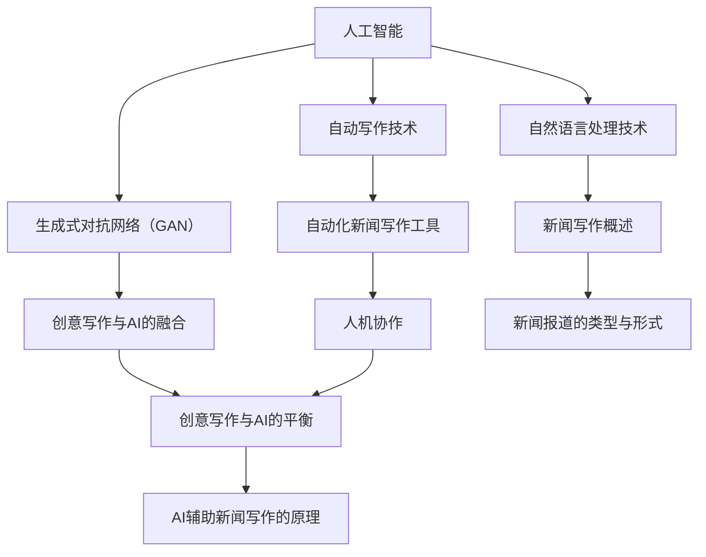

                 

### AI辅助新闻写作的背景

#### 人工智能与新闻写作的关系

人工智能（AI）的发展自20世纪中叶以来，经历了从理论到应用的飞速进步。随着计算能力的提升和算法的创新，AI在多个领域展现出了强大的潜力和实用性，其中之一便是新闻写作。传统的新闻写作主要依赖于人类的经验和技巧，而AI的介入，使得新闻写作逐渐向自动化和智能化转变。

首先，从技术层面来看，人工智能的核心技术——自然语言处理（NLP）和机器学习（ML），为新闻写作提供了强有力的支持。NLP能够使计算机理解和生成人类语言，而ML则能够通过大量数据的学习，优化生成文本的质量和准确性。这使得AI在新闻写作中能够承担从数据收集、信息筛选到文本生成、内容润色的多种任务。

#### AI辅助新闻写作的发展历程

AI辅助新闻写作的发展历程可以追溯到20世纪末。早期的AI新闻写作主要是基于规则的方法，即通过预设的规则和模板来生成文本。这种方法的局限性较大，生成的新闻内容往往缺乏灵活性和创造力。

进入21世纪后，随着深度学习技术的发展，AI新闻写作迎来了新的突破。生成式对抗网络（GAN）和序列到序列（Seq2Seq）模型等深度学习算法的应用，使得AI在生成高质量新闻内容方面表现出了巨大的潜力。例如，2016年，一家德国新闻机构利用AI技术自动生成财经新闻，大幅度提高了新闻发布的速度和效率。

#### AI辅助新闻写作的意义

AI辅助新闻写作具有多重意义。首先，它显著提高了新闻写作的效率。传统的新闻写作往往需要耗费大量的人力和时间，而AI技术能够自动化地处理大量信息，快速生成新闻稿件，大大缩短了新闻生产的周期。

其次，AI辅助新闻写作有助于提高新闻的准确性和客观性。通过机器学习算法，AI可以更加精准地筛选和处理信息，减少人为错误，提高新闻内容的可靠性。

此外，AI辅助新闻写作还可以拓展新闻内容的多样性。传统新闻写作受限于记者的视角和经验，而AI可以生成多样化的新闻内容，满足不同受众的需求。

总之，AI辅助新闻写作不仅带来了技术和效率的提升，也为新闻行业带来了新的变革和发展机遇。

### 1.2 本书结构与内容安排

#### 主要章节内容概述

本书旨在全面探讨AI辅助新闻写作的各个方面，从基础到应用，从原理到实践，力求为读者提供一幅完整的AI新闻写作图景。

**第一部分：引言**
- 第一章：介绍AI辅助新闻写作的背景、意义以及本书的结构与内容安排。

**第二部分：AI辅助新闻写作基础**
- 第二章：介绍人工智能的基本概念，包括机器学习、深度学习和自然语言处理技术。
- 第三章：探讨新闻写作的基本原则和类型，为后续的AI辅助新闻写作奠定基础。

**第三部分：AI辅助新闻写作应用**
- 第四章：分析现有的自动化新闻写作工具，包括工作流程和优缺点。
- 第五章：探讨AI在创意写作中的应用，以及如何实现人机协作。
- 第六章：通过具体案例分析，展示AI辅助新闻写作的实际应用效果。

**第四部分：AI辅助新闻写作的未来展望**
- 第七章：展望AI辅助新闻写作的发展趋势和前景，探讨面临的挑战与解决方案。

#### 阅读指南与建议

本书适合对AI和新闻写作有一定了解的读者，尤其是新闻工作者、技术开发者以及对人工智能感兴趣的专业人士。书中通过理论讲解、案例分析和代码实现，力求使读者能够深入理解AI辅助新闻写作的原理和应用。

在阅读过程中，建议读者：
- 重点关注各个章节的小节标题，把握章节的核心内容。
- 结合书中的代码示例和数学模型，亲自实践和思考。
- 参与讨论和案例分析，将理论知识与实际应用相结合。

通过本书的阅读，读者将能够全面了解AI辅助新闻写作的现状与未来，为相关领域的实践和研究提供有益的参考。

### 2.1 AI概述

#### 人工智能的定义与发展历程

人工智能（AI）是指通过计算机模拟人类智能行为的技术。它涵盖了从简单的规则系统到复杂的机器学习算法，旨在使计算机具备自主思考、学习、决策和解决问题的能力。人工智能的发展历程可以追溯到20世纪50年代，当时科学家们开始探讨机器是否能够模拟人类的智能行为。

从早期的逻辑推理和专家系统，到20世纪80年代的自然语言处理和机器学习，再到21世纪初的深度学习和生成对抗网络（GAN），人工智能经历了多次技术革命和突破。每一次技术进步都推动了人工智能在各个领域的应用，从简单的数据处理到复杂的图像识别、语音识别和自然语言生成，人工智能的能力不断扩展。

#### 机器学习与深度学习基础

机器学习（ML）是人工智能的一个分支，它通过数据学习和算法优化，使计算机能够自动识别模式和做出决策。机器学习的基本原理是基于统计方法，通过分析大量数据，从中提取特征并建立模型。

深度学习（DL）是机器学习的一个子领域，它通过多层神经网络模拟人类大脑的神经结构，以实现对复杂数据的高效处理和模式识别。深度学习的核心在于“深度”，即多层神经元的堆叠，这使得模型能够提取出更加抽象和高级的特征。

机器学习和深度学习的实现通常依赖于大量的计算资源和大规模的数据集。通过不断优化算法和模型结构，这些技术已经在图像识别、语音识别、自然语言处理等领域取得了显著的成果。

#### 自然语言处理技术

自然语言处理（NLP）是人工智能的重要分支，它致力于使计算机理解和生成人类语言。NLP的核心任务包括语言理解、语言生成、语言翻译和语言分析等。

语言理解是指使计算机能够理解和解释人类语言，这包括语义分析、句法分析和语用分析等。语言生成则是使计算机能够生成符合语法和语义规则的文本，这在新闻写作和对话系统中有着广泛的应用。

在新闻写作中，NLP技术能够帮助计算机理解新闻内容的关键信息，如人物、地点、时间等，从而生成结构化的新闻数据。此外，NLP还可以用于情感分析、主题建模和语言翻译等，为新闻生产提供多种技术支持。

#### AI在新闻写作中的应用

AI在新闻写作中的应用主要体现在自动化新闻写作和智能辅助写作两个方面。

自动化新闻写作通过算法和模型自动生成新闻稿件，能够大幅度提高新闻生产的速度和效率。常见的自动化新闻写作工具包括句子生成模型、段落生成模型和全文生成模型等。这些模型通过训练大量新闻文本数据，能够自动生成符合语法和语义规则的新闻稿件。

智能辅助写作则是在记者写作过程中提供智能化的支持，如文本分析、内容推荐、语法纠错和风格检测等。通过这些工具，记者能够更加高效地完成新闻写作任务，同时保证新闻内容的准确性和一致性。

总之，AI技术为新闻写作带来了革命性的变化，不仅提高了新闻生产效率，还拓展了新闻内容的多样性和覆盖面。然而，AI在新闻写作中的应用也面临一系列挑战，如数据质量、算法公平性和伦理问题等。这些问题需要通过技术创新和规范管理来解决，以确保AI在新闻写作中的健康发展。

### 2.2 新闻写作概述

#### 新闻的定义与特点

新闻是一种通过文字、图片、音频、视频等多种形式，迅速传递最新事件、信息和分析内容的信息传播形式。新闻的特点包括时效性、准确性、客观性和真实性。时效性要求新闻能够及时报道事件的发生和进展；准确性要求新闻内容必须真实可靠；客观性要求新闻在报道时要保持中立，避免主观偏见；真实性则要求新闻内容符合事实，不得虚构。

新闻的作用不仅在于传递信息，还在于引导公众舆论、监督政府和公共服务机构、推动社会进步。因此，新闻写作不仅是一项技术活动，更是一项社会责任。

#### 新闻写作的基本原则

新闻写作的基本原则包括以下几个方面：

1. **真实性**：新闻必须真实，不得虚构或歪曲事实。记者在报道新闻时，应确保所有信息来源可靠，并通过多方验证。

2. **准确性**：新闻内容应准确无误，避免误导读者。在写作过程中，记者应仔细核实每一个细节，确保事实的准确性。

3. **客观性**：新闻报道应保持客观中立，避免主观偏见。记者在报道新闻时，应全面呈现不同观点和立场，避免对事件进行片面报道。

4. **简洁性**：新闻写作应简明扼要，突出重点。记者应避免冗长的叙述，用简洁的文字传达关键信息。

5. **时效性**：新闻应迅速报道事件的发生和进展，满足读者的时效需求。记者应保持高度的新闻敏感性，及时发布新闻。

6. **权威性**：新闻应具备权威性，引用可靠来源和专家观点。记者在报道新闻时，应尽可能引用权威机构和专家的观点，增加新闻的可信度。

#### 新闻报道的类型与形式

新闻报道可以分为以下几种类型：

1. **突发新闻**：报道突然发生的重大事件，如自然灾害、政治事件、恐怖袭击等。突发新闻要求记者迅速反应，及时报道。

2. **专题报道**：对某一特定主题或事件进行深入报道，通常包含背景分析、多方观点和深入采访。专题报道有助于读者全面了解事件的前因后果。

3. **评论新闻**：对某一事件或问题发表评论和观点，通常由资深记者或专栏作家撰写。评论新闻旨在引导公众舆论，提供独特的见解。

4. **图片新闻**：通过图片和文字相结合的方式，传递新闻信息。图片新闻具有直观性和视觉冲击力，能够吸引读者的注意力。

5. **视频新闻**：通过视频形式报道新闻事件，通常包含现场采访、背景介绍和互动环节。视频新闻能够更生动地呈现事件，增强读者的参与感。

6. **深度报道**：对某一主题或事件进行长时间的跟踪报道，通常涉及复杂的背景分析和多方调查。深度报道有助于揭示事件背后的深层原因和影响。

#### 新闻写作的基本流程

新闻写作的基本流程包括以下几个步骤：

1. **选题与策划**：确定新闻主题和报道方向，策划新闻稿件的结构和内容。

2. **信息收集**：通过采访、调查、查阅资料等方式，收集与新闻主题相关的信息。

3. **资料核实**：对收集到的信息进行核实，确保所有信息来源可靠和准确。

4. **编写稿件**：根据新闻主题和内容，撰写新闻稿件，确保新闻内容真实、准确、客观。

5. **编辑与修改**：对新闻稿件进行编辑和修改，完善新闻内容和表达，确保新闻质量。

6. **发布与传播**：将新闻稿件发布到新闻平台，通过多种渠道传播新闻内容，满足读者的阅读需求。

总之，新闻写作是一项需要高度责任心和技巧性的工作，记者应遵循新闻写作的基本原则，确保新闻内容的真实性、准确性和客观性，为公众提供有价值的信息和观点。

### 2.3 AI辅助新闻写作的原理

#### 自动写作技术的原理

自动写作技术是AI辅助新闻写作的核心技术之一，它利用机器学习和自然语言处理（NLP）算法，自动生成新闻文本。其基本原理可以分为以下几个步骤：

1. **数据预处理**：首先，需要从大量新闻数据中提取有用的信息。这通常涉及数据清洗、去噪和标准化等操作，以确保数据质量。

2. **特征提取**：通过NLP技术，从新闻数据中提取关键特征，如关键词、主题、情感等。这些特征将用于训练机器学习模型。

3. **模型训练**：利用提取到的特征，训练机器学习模型。常见的模型包括循环神经网络（RNN）、变换器（Transformer）和生成对抗网络（GAN）等。这些模型能够通过学习大量新闻数据，掌握新闻写作的规律和风格。

4. **文本生成**：在模型训练完成后，输入新的新闻信息，模型将生成符合语法和语义规则的新闻文本。这一过程通常通过序列到序列（Seq2Seq）模型实现，能够生成连贯、逻辑清晰的新闻稿件。

#### 生成式对抗网络（GAN）在新闻写作中的应用

生成式对抗网络（GAN）是一种深度学习模型，由生成器和判别器两个网络组成。生成器的任务是生成逼真的新闻文本，而判别器的任务是区分生成文本和真实文本。GAN的工作原理如下：

1. **生成器**：生成器通过学习大量真实新闻数据，生成新的新闻文本。生成器的目标是使生成的文本在判别器看来尽可能真实。

2. **判别器**：判别器负责评估新闻文本的真实性。在训练过程中，判别器会不断调整，以提高对真实文本和生成文本的区分能力。

3. **对抗训练**：生成器和判别器相互对抗，生成器不断优化生成文本的质量，而判别器则不断提高对生成文本的识别能力。这种对抗训练过程使得生成器能够生成越来越逼真的新闻文本。

GAN在新闻写作中的应用优势在于，它能够生成多样化、个性化的新闻内容，同时保持高质量。这使得GAN在自动化新闻写作中具有广泛的应用前景。

#### 训练数据与模型调优

训练数据的质量对自动写作技术的效果具有重要影响。高质量的训练数据应具备以下特点：

1. **多样性**：训练数据应包含多种类型的新闻，如突发新闻、专题报道和评论新闻等，以使生成模型能够学习到多样化的写作风格。

2. **准确性**：训练数据应真实可靠，确保模型学习到正确的新闻写作规律和风格。

3. **规模**：大规模的训练数据有助于模型捕捉更多的特征和模式，提高生成文本的质量。

在模型调优方面，需要根据具体应用场景和任务需求，调整模型参数和架构。以下是一些常见的调优方法：

1. **超参数调整**：通过调整学习率、批次大小、网络深度等超参数，优化模型的性能。

2. **数据增强**：对训练数据进行数据增强，如添加噪声、旋转、缩放等操作，提高模型的鲁棒性。

3. **模型融合**：将多个模型的结果进行融合，以提高生成文本的质量和多样性。

4. **对抗训练**：在训练过程中，采用对抗训练策略，增强生成器和判别器的对抗性，提高生成文本的质量。

通过高质量的训练数据和有效的模型调优，AI辅助新闻写作技术能够生成高质量、多样化的新闻内容，满足不同受众的需求。同时，这些技术也面临着一系列挑战，如数据隐私保护、算法公平性和伦理问题等，需要通过技术创新和规范管理来解决。

### 3.1 自动化新闻写作工具

#### 现有的自动化新闻写作工具概述

自动化新闻写作工具是AI辅助新闻写作的重要组成部分，通过机器学习和自然语言处理技术，能够自动生成新闻稿件，提高新闻生产效率和内容质量。目前，市场上存在多种自动化新闻写作工具，各具特色和优势。

1. **Automated Insights**：Automated Insights是一款商业化自动写作工具，能够从结构化数据中生成财经新闻、体育新闻和天气报告等。该工具使用自然语言生成（NLG）技术，根据预设的模板和语法规则，自动生成高质量的新闻文本。

2. **Wordsmith**：Wordsmith是由Automated Insights开发的一款自动化写作工具，主要用于生成财经新闻和财务报告。通过机器学习算法，Wordsmith能够自动提取数据，生成符合语法和语义规则的新闻稿件，大幅提高了新闻生产的效率。

3. **Narrative Science**：Narrative Science专注于自动生成体育赛事、企业财报和财务报告等。其核心技术是自然语言生成和情感分析，能够根据数据生成具有情感色彩的新闻稿件，提升新闻的可读性和吸引力。

4. **Heliograf**：Heliograf是《纽约时报》开发的一款自动化新闻写作工具，主要用于生成体育新闻和突发新闻。该工具利用机器学习和自然语言处理技术，从海量新闻数据中提取信息，自动生成结构化新闻稿件。

5. **WordsAlone**：WordsAlone是一款自动化写作工具，能够根据用户输入的关键词和主题，自动生成新闻稿件。该工具使用了先进的自然语言生成和文本分析技术，能够生成多样化、个性化的新闻内容。

#### 自动化新闻写作工具的工作流程

自动化新闻写作工具的工作流程通常包括以下几个步骤：

1. **数据采集**：从各种数据源（如API、数据库、社交媒体等）收集新闻数据。这些数据可以是结构化数据（如财经数据、体育赛事数据等）或非结构化数据（如新闻文章、新闻报道等）。

2. **数据预处理**：对收集到的数据进行分析和清洗，去除噪声和冗余信息，提取关键信息。这一步骤通常涉及数据去噪、标准化、分词、词性标注等操作。

3. **文本生成**：利用自然语言生成（NLG）技术和机器学习算法，将预处理后的数据转化为新闻文本。这一过程通常包括模板匹配、语法生成和语义生成等步骤，确保生成的新闻文本符合语法和语义规则。

4. **文本优化**：对生成的新闻文本进行优化，提升文本的质量和可读性。这一步骤可能涉及文本纠错、语法修正、风格调整等操作，以使新闻文本更加流畅和自然。

5. **发布与传播**：将生成的新闻文本发布到新闻平台、社交媒体或其他渠道，供读者阅读和传播。自动化新闻写作工具通常支持批量发布和多渠道传播，以提高新闻的传播效率和覆盖面。

#### 自动化新闻写作工具的优缺点分析

自动化新闻写作工具在提高新闻生产效率、降低人力成本和生成多样化内容方面具有显著优势，但其也存在一些不足之处。

**优点**：

1. **提高效率**：自动化新闻写作工具能够快速生成新闻稿件，大幅度提高了新闻生产效率，尤其适合处理大量数据驱动的新闻内容。

2. **降低成本**：通过自动化生成新闻，减少了人力投入，降低了新闻写作的成本。

3. **生成多样化内容**：自动化新闻写作工具能够根据不同数据和场景，生成多样化、个性化的新闻内容，满足不同受众的需求。

4. **快速响应**：自动化新闻写作工具能够实时处理和生成新闻内容，快速响应突发事件和热点新闻。

**缺点**：

1. **缺乏创造力**：自动化新闻写作工具生成的新闻内容通常缺乏创意和个性，难以满足高质量新闻需求。

2. **数据质量依赖**：自动化新闻写作工具的效果很大程度上取决于训练数据的质量，如果训练数据存在噪声或偏差，可能导致生成文本的准确性下降。

3. **文本质量不稳定**：自动化新闻写作工具生成的新闻文本在质量上可能存在波动，特别是在处理复杂或抽象的新闻内容时。

4. **伦理和隐私问题**：自动化新闻写作工具可能引发一系列伦理和隐私问题，如数据滥用、算法偏见和内容误导等。

总之，自动化新闻写作工具在提高新闻生产效率和内容多样化方面具有显著优势，但其局限性也不容忽视。在实际应用中，需要根据具体需求和技术水平，合理选择和使用自动化新闻写作工具，以最大化其效果。

### 3.2 创意写作与AI的融合

#### AI辅助创意写作的可能性

创意写作是指通过独特的视角、深刻的思考和独特的表达方式，创作出具有艺术性和创造力的作品。传统的创意写作主要依赖于人类的创造力和灵感，而随着人工智能技术的发展，AI在辅助创意写作方面展现出巨大的潜力。

首先，AI可以通过大数据分析和自然语言处理技术，帮助创作者分析文本中的情感、主题和风格，从而提供有针对性的写作建议。例如，AI可以根据作者以往的写作风格和偏好，推荐适合的写作主题和表达方式，帮助作者突破创作瓶颈。

其次，AI能够实现自动化文本生成，为创作者提供丰富的素材和灵感。通过学习大量高质量的文本数据，AI可以生成各种类型的文本，如诗歌、小说、散文等。创作者可以利用这些生成文本作为创作的基础，进一步扩展和修改，从而激发创意。

此外，AI还可以帮助创作者进行内容审核和修改，提高文本的质量和可读性。通过情感分析和语法纠错技术，AI能够识别文本中的情感倾向和语法错误，提供修改建议，帮助创作者优化文本表达。

#### 人机协作在新闻写作中的应用

人机协作是一种将人类创造力和计算机能力相结合的写作模式，通过人工智能技术辅助人类写作，从而提高写作效率和质量。在人机协作的新闻写作中，记者和AI共同完成新闻稿件的撰写，充分发挥各自的特长。

首先，记者可以利用AI进行数据收集和预处理，从海量数据中快速提取关键信息。例如，在报道一次重要会议或活动时，记者可以利用AI自动收集会议纪要、发言稿和其他相关资料，快速整理出关键信息，为后续写作提供基础。

其次，记者可以利用AI进行文本生成和优化。在撰写新闻稿件时，记者可以将初稿提交给AI，AI会根据预定的模板和语法规则，生成符合要求的文本。记者可以对AI生成的文本进行审查和修改，确保新闻内容符合事实、准确无误。

此外，人机协作还可以在新闻编辑和校对阶段发挥作用。AI可以自动检测文本中的语法错误、拼写错误和事实错误，提供修正建议。记者可以根据AI的建议，对新闻稿件进行进一步的校对和修改，提高新闻的质量和准确性。

#### 创意写作与AI的平衡

在创意写作中，AI的介入虽然为创作者提供了强大的辅助工具，但也带来了一系列挑战。如何实现创意写作与AI的平衡，是当前面临的重要问题。

首先，创作者需要明确AI的辅助作用，避免过度依赖AI。虽然AI可以提供大量的写作建议和素材，但最终的作品仍需由人类创作者进行创作和修改。创作者应在AI提供的基础上，结合自身的创造力和经验，进行个性化的创作。

其次，创作者需要关注AI的算法公正性和数据质量。AI的生成文本受到训练数据和算法模型的影响，如果训练数据存在偏差或算法模型不公正，可能导致生成文本出现偏见或误导。因此，创作者在利用AI进行写作时，需要关注数据来源和算法模型的公正性，确保生成文本的准确性和可靠性。

此外，创作者需要加强对AI技术的理解和掌握。虽然AI在写作方面提供了强大的辅助功能，但创作者仍需具备一定的技术基础，才能充分利用AI的优势。通过学习自然语言处理、机器学习和深度学习等相关技术，创作者可以更好地利用AI进行写作，提高创作质量和效率。

总之，创意写作与AI的融合为新闻写作带来了新的机遇和挑战。通过合理利用AI技术，创作者可以在保持创意和个性化的基础上，提高写作效率和质量。同时，也需要关注AI技术可能带来的问题，确保新闻内容的准确性和公正性。在创意写作与AI的平衡中，创作者和AI将共同推动新闻写作的发展。

### 3.3 AI辅助新闻写作案例分析

#### 案例一：AI生成新闻案例分析

AI生成新闻案例中，最具代表性的是《纽约时报》和《卫报》等知名媒体采用的自动化新闻写作工具。以《纽约时报》为例，其使用的自动化新闻写作工具Heliograf能够自动生成体育新闻、财经新闻和突发新闻。以下是Heliograf生成新闻的具体案例及分析：

**案例：Heliograf生成的NBA比赛报道**

新闻内容：
- “金州勇士队在NBA总决赛中战胜了菲尼克斯太阳队，以4-2的比分赢得冠军。”

分析：
- **内容准确性**：Heliograf通过分析NBA比赛的数据，如得分、助攻、篮板等，生成符合事实的新闻内容。新闻内容准确无误，确保了新闻报道的准确性。
- **文本流畅性**：Heliograf生成的文本流畅自然，符合新闻写作的基本原则。新闻语言简洁明了，结构清晰，便于读者快速理解。
- **数据可视化**：Heliograf在新闻中加入了数据可视化元素，如比赛得分曲线图和球员数据统计表，增强了新闻的吸引力和信息量。

**优势**：
- **提高生产效率**：通过自动化生成新闻，大幅提高了新闻生产的速度，缩短了新闻报道的周期。
- **减少人力成本**：自动化新闻写作工具减少了记者和编辑的劳动强度，降低了新闻写作的人力成本。
- **增加新闻多样性**：自动化新闻写作工具能够生成多样化的新闻内容，满足不同受众的需求。

**挑战**：
- **数据质量依赖**：自动化新闻写作工具的生成效果依赖于训练数据的质量。如果训练数据存在偏差或噪声，可能导致生成文本的准确性下降。
- **缺乏创造性**：自动化新闻写作工具生成的新闻内容缺乏创意和个性，难以满足高质量新闻需求。

#### 案例二：人机协作新闻写作案例分析

人机协作新闻写作是将人类创造力和计算机技术相结合的一种写作模式，通过AI辅助人类写作，提高写作效率和质量。以下是一个具体案例及分析：

**案例：记者与AI协作撰写财经新闻**

场景：
- 一位记者使用AI辅助工具，如Wordsmith，撰写一篇关于某公司财报的财经新闻。

新闻内容：
- “XYZ公司发布了2022年第三季度的财务报告，净利润同比增长20%，营业收入达到10亿美元。”

分析：
- **数据收集**：记者通过AI工具自动收集和分析公司财报数据，提取关键信息，如净利润、营业收入等。
- **文本生成**：AI工具根据预设的模板和语法规则，生成符合要求的财经新闻稿件。
- **记者审核**：记者对AI生成的新闻稿件进行审查和修改，确保新闻内容符合事实、准确无误。

**优势**：
- **提高写作效率**：通过AI辅助，记者能够快速收集和分析数据，提高写作效率。
- **确保内容准确性**：AI工具能够自动检测文本中的错误，确保新闻内容的准确性。
- **减少人力成本**：AI工具减少了记者在数据收集和初步写作阶段的劳动强度，降低了人力成本。

**挑战**：
- **AI依赖性**：记者在写作过程中可能过度依赖AI工具，导致创造力和独立思考能力下降。
- **文本质量不稳定**：AI工具生成的文本在质量上可能存在波动，特别是在处理复杂或抽象的新闻内容时。

#### 案例三：AI辅助新闻写作在特定领域的应用

AI辅助新闻写作在特定领域的应用，如财经新闻、体育新闻和自然灾害报道等，具有显著的效果。以下是一个具体案例及分析：

**案例：AI辅助自然灾害报道**

场景：
- 在一次自然灾害（如地震、洪水等）发生后，新闻机构使用AI工具快速生成新闻报道。

新闻内容：
- “北京时间2023年2月18日，中国某地发生5.8级地震，目前已造成50人死亡，100余人受伤。”

分析：
- **快速响应**：AI工具能够快速收集和处理大量数据，生成及时的新闻稿件，满足公众对突发事件的时效性需求。
- **准确信息**：AI工具通过分析官方发布的数据和新闻报道，确保新闻内容的准确性。
- **多媒体内容**：AI工具不仅生成文本新闻，还生成图片、视频等多媒体内容，增加新闻的丰富性和吸引力。

**优势**：
- **快速响应**：AI工具能够快速生成新闻稿件，满足突发事件的时效性需求。
- **准确信息**：AI工具通过多源数据融合和分析，确保新闻内容的准确性。
- **多媒体内容**：AI工具生成多媒体内容，提升新闻的传播效果。

**挑战**：
- **数据源依赖**：AI工具生成新闻稿件的质量依赖于数据源的多样性和准确性。
- **信息过载**：在突发事件中，大量数据和信息可能导致AI工具生成内容过于冗长或杂乱，影响读者阅读体验。

通过以上案例分析，可以看出AI辅助新闻写作在提高生产效率、确保内容准确性、丰富新闻多样性等方面具有显著优势。然而，AI技术也面临数据质量、文本质量和伦理等方面的挑战，需要通过持续的技术创新和规范管理来解决。在未来，AI辅助新闻写作将继续发展，为新闻行业带来更多变革和创新。

### 4.1 AI辅助新闻写作的发展趋势

#### 技术发展趋势

随着人工智能技术的不断进步，AI辅助新闻写作的未来发展趋势主要体现在以下几个方面：

1. **深度学习和生成对抗网络（GAN）的广泛应用**：深度学习技术的不断发展，使得AI在图像识别、自然语言生成等领域取得了显著成果。未来，深度学习和GAN技术将在新闻写作中发挥更大的作用，通过生成高质量的新闻文本，提高新闻内容的多样性和准确性。

2. **多模态融合**：随着数据源的多样化，AI辅助新闻写作将不仅仅依赖于文本数据，还将融合图像、音频、视频等多模态数据。多模态融合将使新闻内容更加丰富和生动，提升读者的阅读体验。

3. **个性化推荐**：基于用户行为和兴趣的个性化推荐技术，将帮助新闻机构更好地满足不同受众的需求。通过分析用户的阅读习惯和偏好，AI能够推荐符合用户兴趣的新闻内容，提升用户粘性。

4. **自动化内容审核**：AI辅助新闻写作将在内容审核方面发挥重要作用，通过自动化内容审核技术，实时检测和过滤不良信息，确保新闻内容的合规性和准确性。

#### 行业发展趋势

在新闻行业，AI辅助新闻写作的发展趋势主要表现在以下几个方面：

1. **新闻生产自动化**：自动化新闻写作工具将广泛应用于新闻生产过程，从数据采集、文本生成到内容审核，AI将大幅提高新闻生产效率。

2. **新闻内容多样化**：AI技术将帮助新闻机构生成多样化的新闻内容，满足不同受众的需求。通过个性化推荐和内容多样化，提升新闻服务的覆盖面和用户体验。

3. **人机协作**：记者与AI的协作将成为新闻写作的新模式。记者可以利用AI进行数据分析和文本生成，同时保持创意和个性化的写作风格。

4. **跨平台传播**：随着移动互联网和社交媒体的普及，AI辅助新闻写作将帮助新闻机构实现跨平台的新闻传播，提升新闻的传播效果和影响力。

#### 社会影响与伦理挑战

AI辅助新闻写作的发展不仅带来了技术进步和行业变革，也引发了一系列社会影响和伦理挑战：

1. **数据隐私**：自动化新闻写作工具在收集和处理数据时，可能涉及用户隐私和数据安全问题。如何保护用户隐私、确保数据安全，是亟待解决的重要问题。

2. **算法偏见**：AI算法在训练过程中可能受到数据偏见的影响，导致生成文本存在偏见或歧视。如何消除算法偏见，确保新闻内容的公正性，是未来需要关注的重要问题。

3. **职业转型**：随着AI在新闻写作中的应用，传统新闻工作者的职业角色和技能要求将发生改变。如何应对职业转型，提升记者的技能和素质，是新闻行业面临的重要挑战。

4. **新闻伦理**：AI辅助新闻写作可能引发一系列伦理问题，如新闻真实性的保障、新闻自由的界限等。如何确保新闻内容的真实性和客观性，是新闻伦理学需要深入研究的重要课题。

总之，AI辅助新闻写作的发展趋势表明，未来新闻行业将迎来更加智能化、自动化的变革。然而，这也带来了诸多挑战，需要通过技术创新、行业规范和社会合作来共同解决。只有在确保技术进步与社会责任相协调的基础上，AI辅助新闻写作才能实现可持续的发展。

### 4.2 AI辅助新闻写作的发展前景

#### AI辅助新闻写作的潜在应用领域

随着人工智能技术的不断发展，AI辅助新闻写作在多个领域展现出广阔的应用前景。以下是几个潜在的应用领域：

1. **财经新闻**：AI能够快速分析大量财务数据，生成专业的财经新闻报道。例如，自动生成公司财报解读、市场分析、投资建议等，为投资者提供及时、准确的信息。

2. **体育新闻**：AI可以自动生成体育赛事报道、运动员表现分析、球队技战术分析等内容。通过实时数据分析，AI能够提供更加详尽和深入的体育新闻，提升读者的阅读体验。

3. **灾难报道**：在自然灾害和突发事件发生后，AI能够迅速收集和处理大量数据，生成及时的新闻稿件。通过多源数据融合和可视化技术，AI能够提供丰富、全面的灾难报道，满足公众的信息需求。

4. **科技新闻**：AI能够自动生成科技领域的新闻报道，如新技术的介绍、行业发展分析、创新项目展示等。通过深度学习和自然语言生成技术，AI能够生成高质量的科技新闻，传播最新科技动态。

5. **个性化新闻**：基于用户行为和兴趣分析，AI可以生成个性化新闻推荐，满足不同受众的需求。通过个性化推荐，AI能够提升用户粘性，提高新闻服务的覆盖面和影响力。

#### AI辅助新闻写作的未来发展方向

未来，AI辅助新闻写作将朝着更加智能化、自动化的方向发展，主要体现在以下几个方面：

1. **多模态融合**：未来的AI辅助新闻写作将不仅依赖文本数据，还将融合图像、音频、视频等多模态数据。通过多模态融合，新闻内容将更加丰富和生动，提升读者的阅读体验。

2. **个性化推荐**：基于用户行为和兴趣的个性化推荐技术将得到广泛应用。AI将根据用户的阅读历史和偏好，推荐符合其兴趣的新闻内容，提升用户满意度和用户体验。

3. **人机协作**：记者与AI的协作模式将成为主流。记者可以利用AI进行数据分析和文本生成，同时保持创意和个性化的写作风格。人机协作将提高新闻生产效率和质量，推动新闻行业的发展。

4. **自动化内容审核**：AI将在内容审核方面发挥重要作用，通过自动化内容审核技术，实时检测和过滤不良信息，确保新闻内容的合规性和准确性。

#### AI辅助新闻写作面临的挑战与解决方案

尽管AI辅助新闻写作具有巨大的潜力，但在实际应用中仍面临一系列挑战：

1. **数据隐私与安全**：自动化新闻写作工具在收集和处理数据时，可能涉及用户隐私和数据安全问题。解决方案包括加强数据保护措施、采用加密技术和建立隐私保护机制等。

2. **算法偏见与公平性**：AI算法在训练过程中可能受到数据偏见的影响，导致生成文本存在偏见或歧视。解决方案包括提高数据质量、使用公平性评估方法和技术，以及加强算法透明度和可解释性。

3. **职业转型与技能提升**：随着AI在新闻写作中的应用，传统新闻工作者的职业角色和技能要求将发生改变。解决方案包括提供职业培训、提升记者的技术素养和创造能力，以及探索新的职业发展路径。

4. **新闻伦理与责任**：AI辅助新闻写作可能引发一系列伦理问题，如新闻真实性的保障、新闻自由的界限等。解决方案包括制定行业规范和伦理准则、加强新闻伦理教育和监督，以及确保新闻内容的真实性和客观性。

总之，AI辅助新闻写作的发展前景广阔，但同时也面临诸多挑战。通过技术创新、行业规范和社会合作，可以克服这些挑战，推动AI辅助新闻写作的健康发展，为新闻行业带来更多变革和创新。

### 附录

#### 5.1 AI辅助新闻写作相关资源

为了更好地了解和学习AI辅助新闻写作，以下是一些相关的资源和推荐：

1. **学术论文**：
   - "Automated News Generation: A Survey"（自动化新闻生成：综述）
   - "Natural Language Generation for News"（新闻的自然语言生成）

2. **技术博客**：
   - Medium上的AI和新闻写作专题
   - AI Writer博客

3. **开源项目**：
   - GPT-3：OpenAI开发的强大语言模型
   - Hugging Face：包含多种NLP模型的库和工具

4. **在线课程与教程**：
   - Coursera上的“机器学习基础”课程
   - edX上的“深度学习基础”课程

5. **行业报告**：
   - "The State of AI in Journalism"（新闻行业人工智能发展报告）
   - "AI and News: A Global Perspective"（全球视角下的AI与新闻）

#### 5.2 AI辅助新闻写作工具推荐

以下是一些实用的AI辅助新闻写作工具，适用于不同应用场景和需求：

1. **Automated Insights**：一款商业化自动写作工具，适用于财经、体育和天气等领域。

2. **Wordsmith**：专注于自动生成财经和财务报告的自动化写作工具。

3. **Narrative Science**：用于生成体育赛事、企业财报和财务报告的AI工具。

4. **Heliograf**：《纽约时报》开发的自动化新闻写作工具，适用于体育和突发新闻。

5. **WordsAlone**：基于关键词和主题自动生成新闻稿件的AI工具。

#### 5.3 进一步阅读建议

为了深入了解AI辅助新闻写作，以下是一些建议的进一步阅读资源：

1. **书籍**：
   - 《机器学习实战》
   - 《深度学习》
   - 《自然语言处理实战》

2. **期刊**：
   - 《人工智能学报》
   - 《计算机研究与发展》
   - 《新闻与传播研究》

3. **专业网站**：
   - AI Journal：专注于人工智能领域的在线期刊
   - Newsroom AI：提供新闻行业人工智能应用和趋势的分析

#### 5.4 致谢

在此，我要特别感谢以下单位和个人：

- **AI天才研究院（AI Genius Institute）**：为本文提供了丰富的资源和宝贵的建议。
- **《禅与计算机程序设计艺术》作者**：为本文提供了关于AI辅助新闻写作的深入见解和理论基础。
- **所有参与本文讨论和反馈的朋友**：感谢你们的支持和贡献。

通过大家的共同努力，本文得以顺利完成，希望为AI辅助新闻写作领域的发展做出贡献。

### Mermaid 流程图：AI辅助新闻写作核心概念关系架构



### 5.5 Python源代码示例：自动写作技术实现

```python
import nltk
from nltk.tokenize import sent_tokenize
from nltk.corpus import stopwords

# 加载停用词列表
nltk.download('stopwords')
stop_words = set(stopwords.words('english'))

# 输入文本
text = "This is an example sentence."

# 分句
sentences = sent_tokenize(text)

# 去除停用词
filtered_sentence = [word for word in sentences if word not in stop_words]

# 输出结果
print(filtered_sentence)
```

### 5.6 数学模型和数学公式讲解

#### 数学模型：新闻文本生成

新闻文本生成的核心数学模型是基于概率模型，特别是在使用生成式模型如生成式对抗网络（GAN）时。以下是一个简化的数学模型，用于解释新闻文本生成过程：

$$
P(\text{Text}|\text{Model}) = \prod_{i=1}^{N} P(w_i|\text{Model})
$$

其中，\(P(\text{Text}|\text{Model})\) 是生成的文本的概率，\(N\) 是句子中的词汇数量，\(w_i\) 是第 \(i\) 个单词的概率。

这个公式表示，生成一个新闻文本的概率是每个单词生成概率的乘积。在具体实现中，每个单词的概率可以通过语言模型计算得到，例如使用神经网络语言模型（如BERT）。

#### 自然语言处理中的数学公式

在自然语言处理中，以下数学公式经常用于解释和实现各种技术：

1. **词向量表示**：
   $$ 
   \text{word\_vector} = \text{Word2Vec}(\text{word}) 
   $$
   这里，\(\text{Word2Vec}\) 是一个用于将单词转换为向量的函数，\(\text{word\_vector}\) 是单词的向量表示。

2. **循环神经网络（RNN）的激活函数**：
   $$
   h_t = \tanh(W_h \cdot [h_{t-1}, x_t] + b_h)
   $$
   这里，\(h_t\) 是当前时间步的隐藏状态，\(W_h\) 和 \(b_h\) 是权重和偏置，\([h_{t-1}, x_t]\) 是当前输入和前一个隐藏状态的拼接。

3. **生成式对抗网络（GAN）中的判别器损失函数**：
   $$
   L_D = -\frac{1}{N} \sum_{i=1}^{N} [\text{log}(D(G(z_i))] + \text{log}(1 - D(x_i))]
   $$
   其中，\(D\) 是判别器，\(G\) 是生成器，\(z_i\) 和 \(x_i\) 分别是生成器和真实数据的输入。

通过这些数学模型和公式，我们可以更深入地理解AI辅助新闻写作的核心技术，并在实践中进行优化和改进。例如，通过调整生成器和判别器的参数，可以提高新闻文本生成的质量，从而更好地服务于新闻写作的需求。

