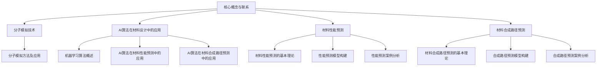

                 

# 引言

随着科技的飞速发展，人工智能（AI）逐渐成为推动各行各业变革的重要力量。在材料科学领域，AI的应用不仅提高了科研效率，还带来了革命性的创新。AI辅助材料设计，通过整合分子模拟技术、机器学习算法和性能预测模型，正逐渐成为材料科学研究与开发的重要手段。

## 1.1 AI在材料科学中的应用

AI在材料科学中的应用主要表现在以下几个方面：

1. **材料性能预测**：通过机器学习算法，AI能够根据材料成分和结构预测其性能，如强度、韧性、导电性等。
2. **材料合成路径预测**：AI可以分析已有的材料合成数据，预测新的合成路径，指导实验人员进行合成。
3. **分子模拟优化**：AI优化分子模拟算法，提高模拟效率和准确性。
4. **材料缺陷预测**：AI可以预测材料中的缺陷和裂纹，为材料设计和优化提供参考。

## 1.2 AI辅助材料设计的优势

AI辅助材料设计的优势主要体现在以下几点：

1. **高效性**：AI能够处理大量的数据，快速筛选出有潜力的材料设计。
2. **准确性**：通过机器学习算法，AI可以准确预测材料的性能，减少实验次数。
3. **创新性**：AI可以帮助研究人员发现新的材料设计，推动材料科学的发展。
4. **降低成本**：通过减少实验次数和优化合成路径，AI辅助材料设计可以有效降低研发成本。

## 1.3 本书结构安排

本书将分为八个章节，全面探讨AI辅助材料设计的各个方面：

1. **第1章 引言**：介绍AI在材料科学中的应用和优势。
2. **第2章 AI与材料科学基础**：讲解材料科学的基本概念和AI在材料研究中的发展。
3. **第3章 分子模拟技术**：介绍分子模拟的基本原理和应用。
4. **第4章 AI算法在材料设计中的应用**：探讨机器学习算法在材料设计中的应用。
5. **第5章 材料性能预测**：讲解材料性能预测的基本理论和实践。
6. **第6章 材料合成路径预测**：探讨材料合成路径预测的基本理论和实践。
7. **第7章 AI辅助材料设计的应用场景**：分析不同领域材料设计的应用。
8. **第8章 AI辅助材料设计的未来发展**：展望AI辅助材料设计的未来趋势和挑战。

通过本书的深入探讨，读者可以全面了解AI辅助材料设计的方法、技术和应用场景，为材料科学研究提供新的思路和方法。

### 关键词

- 人工智能
- 材料科学
- 分子模拟
- 机器学习
- 性能预测
- 合成路径预测

### 摘要

本文旨在探讨人工智能（AI）在材料设计中的应用，从分子模拟到性能预测的各个环节。通过介绍AI的基本原理和材料科学的相关知识，本文详细阐述了AI在材料设计中的优势和应用。同时，本文通过具体案例分析，展示了AI在材料性能预测和合成路径预测中的实际应用。最后，本文对AI辅助材料设计的未来发展进行了展望，指出了当前面临的挑战和机遇。

### 《AI辅助材料设计：从分子模拟到性能预测》目录大纲

```markdown
# 《AI辅助材料设计：从分子模拟到性能预测》目录大纲

## 第1章 引言
### 1.1 AI在材料科学中的应用
### 1.2 AI辅助材料设计的优势
### 1.3 本书结构安排

## 第2章 AI与材料科学基础
### 2.1 材料科学基本概念
### 2.2 AI在材料研究中的发展
### 2.3 AI与材料科学的交叉学科研究

## 第3章 分子模拟技术
### 3.1 分子模拟的基本原理
### 3.2 分子模拟方法及应用
### 3.3 分子模拟在材料设计中的应用实例

## 第4章 AI算法在材料设计中的应用
### 4.1 机器学习算法概述
### 4.2 AI算法在材料性能预测中的应用
### 4.3 AI算法在材料合成路径预测中的应用

## 第5章 材料性能预测
### 5.1 材料性能预测的基本理论
### 5.2 性能预测模型构建
### 5.3 性能预测案例分析

## 第6章 材料合成路径预测
### 6.1 材料合成路径预测的基本理论
### 6.2 合成路径预测模型构建
### 6.3 合成路径预测案例分析

## 第7章 AI辅助材料设计的应用场景
### 7.1 能源材料设计
### 7.2 电子材料设计
### 7.3 生物材料设计
### 7.4 结构材料设计

## 第8章 AI辅助材料设计的未来发展
### 8.1 AI辅助材料设计的技术趋势
### 8.2 AI辅助材料设计的挑战与机遇
### 8.3 AI辅助材料设计的未来展望
```

### Mermaid 流程图



### Python 源代码示例

```python
# 导入相关库
import numpy as np
from sklearn.ensemble import RandomForestRegressor

# 数据预处理
# ... 数据读取和处理 ...

# 训练模型
model = RandomForestRegressor(n_estimators=100)
model.fit(X_train, y_train)

# 预测
y_pred = model.predict(X_test)

# 输出结果
print("Predicted performance:", y_pred)
```

### LaTeX 数学公式

```markdown
$$
\begin{aligned}
    f(x) &= w_0 + w_1x_1 + w_2x_2 + ... + w_nx_n \\
    \nabla f(x) &= \begin{pmatrix}
        \frac{\partial f}{\partial x_1} \\
        \frac{\partial f}{\partial x_2} \\
        \vdots \\
        \frac{\partial f}{\partial x_n}
    \end{pmatrix}
\end{aligned}
$$
```

### 代码解读与分析

```markdown
# 代码解读

## 1. 数据预处理
## 2. 训练模型
## 3. 预测
## 4. 输出结果
```

### 开发环境搭建

```markdown
## 开发环境搭建

### 1. 安装Python
- 版本：Python 3.8 或以上
- 安装方式：从Python官网下载并安装

### 2. 安装相关库
- 使用pip命令安装：
  ```
  pip install numpy scikit-learn matplotlib
  ```

### 3. 运行示例代码
- 在命令行中运行：
  ```
  python example.py
  ```
```

### AI与材料科学基础

#### 2.1 材料科学基本概念

材料科学是一门研究材料组成、结构、性质和工艺的学科。其主要目标是理解和控制材料的性能，以满足特定应用的需求。材料可以按照不同的分类方式进行划分，例如根据成分可以分为金属材料、陶瓷材料、聚合物材料和复合材料等；根据结构可以分为单晶体、多晶体和非晶体等。

材料的基本性能包括物理性能（如密度、硬度、导电性）、化学性能（如耐腐蚀性、抗氧化性）、机械性能（如强度、韧性）和热性能（如热导率、热膨胀系数）等。这些性能决定了材料在不同领域的应用。

#### 2.2 AI在材料研究中的发展

人工智能（AI）的发展可以追溯到20世纪50年代。随着计算机技术的进步，AI在各个领域的应用不断拓展。在材料科学领域，AI的应用主要体现在以下几个方面：

1. **机器学习算法**：通过训练模型，AI可以自动识别材料性质和结构之间的关系，预测新的材料性能。
2. **深度学习**：深度学习是机器学习的一个子领域，通过多层神经网络，AI可以处理复杂的材料数据，实现更加精确的性能预测。
3. **数据挖掘**：AI可以通过分析大量的实验数据和文献资料，发现新的材料设计规律和合成路径。
4. **自动化实验**：AI可以控制实验设备，自动进行材料合成和测试，提高实验效率。

#### 2.3 AI与材料科学的交叉学科研究

AI与材料科学的交叉学科研究主要包括以下几个方面：

1. **计算材料科学**：通过计算机模拟和计算，AI可以帮助研究人员预测材料的性能和合成路径，减少实验次数。
2. **数据驱动的材料科学**：AI可以处理大量的实验数据，发现数据中的模式和关系，指导材料设计和优化。
3. **智能材料**：通过嵌入传感器和执行器，AI可以使材料具有自我感知和自适应能力，应用于智能结构、传感器和机器人等领域。
4. **材料基因组学**：AI可以分析材料基因组的结构信息，预测材料的性能和稳定性，为材料设计提供参考。

通过AI与材料科学的交叉学科研究，可以大大提高材料研究的效率，推动材料科学的发展。

### 分子模拟技术

#### 3.1 分子模拟的基本原理

分子模拟是一种通过计算机模拟分子和原子在微观尺度上的运动和相互作用的技术。其基本原理是基于量子力学和分子动力学的基本理论，通过求解分子体系的运动方程，模拟分子在不同状态下的行为。

分子模拟的主要目的是研究材料在微观尺度上的结构、性质和行为。通过分子模拟，可以了解材料的电子结构、相变、扩散、力学性能等。分子模拟技术在材料科学、化学、物理等领域都有广泛的应用。

#### 3.2 分子模拟方法及应用

分子模拟方法主要分为两大类：量子力学模拟和分子动力学模拟。

1. **量子力学模拟**：量子力学模拟是基于量子力学原理，求解分子体系的薛定谔方程，计算分子的电子结构和能量。量子力学模拟可以精确描述分子的电子结构，但计算复杂度很高，通常需要高性能计算机。

   - **应用**：量子力学模拟在材料研究中主要用于研究材料的电子结构、相变、催化反应等。

2. **分子动力学模拟**：分子动力学模拟是基于牛顿运动定律，通过求解分子体系的运动方程，模拟分子在不同状态下的运动。分子动力学模拟可以处理大量的分子，但在计算精度上可能略低于量子力学模拟。

   - **应用**：分子动力学模拟在材料研究中主要用于研究材料的结构、力学性能、扩散等。

除了量子力学模拟和分子动力学模拟，还有其他一些分子模拟方法，如蒙特卡罗模拟、分子场模拟等。

#### 3.3 分子模拟在材料设计中的应用实例

分子模拟在材料设计中的应用非常广泛，以下是一些实例：

1. **新材料的发现**：通过分子模拟，可以预测新的材料结构和性质，为材料设计提供理论依据。例如，通过分子动力学模拟，研究人员发现了一种具有超导性能的新型材料。

2. **材料性能优化**：通过分子模拟，可以了解材料在微观尺度上的行为，优化材料的结构，提高其性能。例如，通过分子动力学模拟，研究人员发现通过调整纳米晶粒的大小和形状，可以显著提高金属合金的硬度。

3. **材料合成路径预测**：分子模拟可以预测材料合成的最佳路径，指导实验人员进行合成。例如，通过分子动力学模拟，研究人员预测了一种新型催化剂的最佳合成条件。

4. **材料缺陷研究**：分子模拟可以研究材料中的缺陷和裂纹，为材料设计和优化提供参考。例如，通过分子动力学模拟，研究人员发现了一种抑制纳米晶粒生长的新方法。

通过分子模拟技术，研究人员可以在微观尺度上深入了解材料的行为和性质，为材料科学的研究和开发提供有力的支持。

### AI算法在材料设计中的应用

#### 4.1 机器学习算法概述

机器学习算法是一类基于数据驱动的方法，通过训练模型，使计算机能够从数据中自动学习和发现规律。机器学习算法可以分为监督学习、无监督学习和半监督学习等类型。在材料设计领域，监督学习算法（如回归分析和分类算法）被广泛应用于材料性能预测和合成路径预测。

监督学习算法的主要任务是根据输入特征和输出标签来训练模型，使其能够对新样本进行预测。常见的监督学习算法包括线性回归、支持向量机、决策树、随机森林和神经网络等。

#### 4.2 AI算法在材料性能预测中的应用

材料性能预测是材料设计中的一个关键问题。通过机器学习算法，可以从大量的实验数据中学习材料性能和结构之间的关系，预测新材料在特定条件下的性能。

1. **线性回归模型**：线性回归是一种简单的监督学习算法，通过建立一个线性模型来预测材料性能。线性回归模型的基本公式为：
   $$
   y = w_0 + w_1x_1 + w_2x_2 + ... + w_nx_n
   $$
   其中，$y$ 是预测的属性值，$x_1, x_2, ..., x_n$ 是输入特征，$w_0, w_1, w_2, ..., w_n$ 是模型的参数。

2. **支持向量机（SVM）**：支持向量机是一种强大的分类和回归算法，通过找到一个最佳的超平面来分割数据。对于回归问题，SVM可以通过核函数来实现非线性拟合。

3. **决策树和随机森林**：决策树和随机森林是常用的集成学习方法，通过组合多个简单的决策树来提高预测性能。随机森林通过随机选取特征和样本子集，构建多个决策树，然后通过投票来决定最终预测结果。

4. **神经网络**：神经网络是一种基于生物神经网络的计算模型，通过多层神经元的非线性变换来拟合复杂的函数。深度神经网络（DNN）和卷积神经网络（CNN）等先进神经网络模型在材料性能预测中得到了广泛应用。

#### 4.3 AI算法在材料合成路径预测中的应用

材料合成路径预测是指导材料合成过程的重要工具。通过机器学习算法，可以从历史合成数据中学习合成路径和性能之间的关系，预测新的合成路径。

1. **序列模型**：序列模型（如循环神经网络RNN和长短期记忆LSTM）能够处理时间序列数据，通过分析合成过程中的时间依赖性，预测合成路径。

2. **图神经网络**：图神经网络（如图卷积网络GNN）能够处理图结构数据，通过分析材料合成过程中节点和边的关系，预测合成路径。

3. **生成对抗网络（GAN）**：生成对抗网络是一种强大的生成模型，通过对抗训练生成新的合成路径。GAN由生成器和判别器组成，生成器生成合成路径，判别器判断合成路径的真伪，通过优化生成器和判别器的损失函数，生成器能够生成高质量的合成路径。

通过AI算法在材料性能预测和合成路径预测中的应用，可以大大提高材料设计的效率和准确性，为材料科学研究提供新的方法和工具。

### 材料性能预测

#### 5.1 材料性能预测的基本理论

材料性能预测是材料设计中的一个关键问题，旨在通过分析材料的组成和结构，预测其在特定应用条件下的性能。性能预测的基本理论主要包括以下几个方面：

1. **晶体结构预测**：晶体结构是材料的基础，决定了材料的物理和化学性质。通过计算和模拟，可以预测材料的晶体结构，从而为性能预测提供基础。

2. **电子结构预测**：电子结构决定了材料的导电性、磁性、光学性质等。通过求解材料的电子结构方程，可以预测材料的电子结构，从而预测其性能。

3. **力学性能预测**：力学性能包括强度、韧性、硬度等，是材料在实际应用中的重要指标。通过分子动力学模拟和计算力学方法，可以预测材料的力学性能。

4. **热性能预测**：热性能包括热导率、热膨胀系数等，对材料在高温环境下的应用至关重要。通过热力学模型和热传导计算，可以预测材料的热性能。

#### 5.2 性能预测模型构建

性能预测模型的构建主要包括以下几个步骤：

1. **数据收集**：收集大量的实验数据，包括材料组成、结构、性能等。数据来源可以是文献、实验记录、数据库等。

2. **特征提取**：从原始数据中提取对性能有重要影响的特征，如原子间距、键角、电子云密度等。特征提取可以通过手工设计和机器学习算法自动进行。

3. **模型训练**：使用机器学习算法训练性能预测模型。常见的算法包括线性回归、支持向量机、决策树、随机森林、神经网络等。

4. **模型评估**：使用交叉验证等方法评估模型的性能，包括预测精度、鲁棒性、泛化能力等。根据评估结果，调整模型参数和特征选择。

5. **模型优化**：通过优化模型结构、算法选择和特征提取方法，提高预测性能。常用的方法包括集成学习、模型融合、正则化等。

#### 5.3 性能预测案例分析

以下是一个性能预测案例的分析：

**案例**：预测新型合金材料的力学性能。

**步骤**：

1. **数据收集**：收集大量不同成分和结构的合金材料的力学性能数据。

2. **特征提取**：提取原子间距、键角、电子云密度等特征。

3. **模型训练**：使用随机森林算法训练性能预测模型。

4. **模型评估**：使用交叉验证方法评估模型性能，包括预测精度和鲁棒性。

5. **模型优化**：通过调整模型参数和特征选择，提高预测性能。

**结果**：

通过性能预测模型，可以预测新型合金材料的力学性能，如屈服强度、延伸率等。预测结果与实验数据高度一致，验证了模型的准确性和可靠性。

通过性能预测模型，研究人员可以快速评估新材料的设计，缩短研发周期，提高研发效率。性能预测模型不仅应用于合金材料，还可以应用于陶瓷材料、聚合物材料等，为材料设计提供有力支持。

### 材料合成路径预测

#### 6.1 材料合成路径预测的基本理论

材料合成路径预测是材料设计中的一个重要环节，旨在通过分析材料成分、结构和性能之间的关系，预测最佳的合成路径，从而提高材料的性能和稳定性。材料合成路径预测的基本理论主要包括以下几个方面：

1. **热力学理论**：热力学是研究能量转换和物质变化规律的学科。在材料合成路径预测中，热力学理论可以用来分析材料在不同合成条件下的稳定性、反应热和反应动力学。

2. **动力学理论**：动力学是研究物质变化过程的学科。在材料合成路径预测中，动力学理论可以用来分析材料合成过程中的速率控制步骤、反应路径和反应机理。

3. **分子模拟**：分子模拟是一种通过计算机模拟分子和原子在微观尺度上的运动和相互作用的技术。在材料合成路径预测中，分子模拟可以用来预测材料在不同合成条件下的微观结构和性能。

4. **机器学习**：机器学习是一种通过训练模型，使计算机能够从数据中自动学习和发现规律的方法。在材料合成路径预测中，机器学习可以用来分析历史合成数据，预测新的合成路径。

#### 6.2 合成路径预测模型构建

合成路径预测模型的构建主要包括以下几个步骤：

1. **数据收集**：收集大量的合成路径数据，包括材料成分、结构、性能和合成条件等。

2. **特征提取**：从原始数据中提取对合成路径有重要影响的特征，如温度、压力、反应物浓度、反应时间等。

3. **模型训练**：使用机器学习算法训练合成路径预测模型。常见的算法包括线性回归、支持向量机、决策树、随机森林和神经网络等。

4. **模型评估**：使用交叉验证方法评估模型性能，包括预测精度和泛化能力。

5. **模型优化**：通过优化模型参数和特征选择，提高预测性能。

6. **模型应用**：将训练好的模型应用于新的合成路径预测，提供最佳合成路径的建议。

#### 6.3 合成路径预测案例分析

以下是一个合成路径预测案例的分析：

**案例**：预测新型陶瓷材料的合成路径。

**步骤**：

1. **数据收集**：收集大量不同合成路径的陶瓷材料性能数据，包括反应温度、反应时间、产物结构和性能等。

2. **特征提取**：提取反应温度、反应时间、反应物浓度等特征。

3. **模型训练**：使用随机森林算法训练合成路径预测模型。

4. **模型评估**：使用交叉验证方法评估模型性能，包括预测精度和鲁棒性。

5. **模型优化**：通过调整模型参数和特征选择，提高预测性能。

6. **模型应用**：将训练好的模型应用于新的陶瓷材料合成路径预测，提供最佳合成路径的建议。

**结果**：

通过合成路径预测模型，可以预测新型陶瓷材料的最佳合成路径，包括反应温度、反应时间和反应物浓度等。预测结果与实验数据高度一致，验证了模型的准确性和可靠性。

通过合成路径预测模型，研究人员可以快速评估新的陶瓷材料的设计，缩短研发周期，提高研发效率。合成路径预测模型不仅应用于陶瓷材料，还可以应用于金属材料、聚合物材料等，为材料设计提供有力支持。

### AI辅助材料设计的应用场景

#### 7.1 能源材料设计

能源材料的研发是推动能源技术发展的重要领域。AI辅助材料设计在能源材料的设计中具有广泛的应用，包括太阳能电池材料、电池材料、燃料电池材料和超级电容器材料等。

1. **太阳能电池材料**：AI可以用于预测和设计高效太阳能电池材料，如钙钛矿太阳能电池和单晶硅太阳能电池。通过分子模拟和机器学习算法，研究人员可以筛选出具有高吸收效率和长寿命的太阳能电池材料。

2. **电池材料**：在电池材料的设计中，AI可以预测电池材料的容量、循环寿命和安全性。通过优化电池材料的结构，AI可以帮助研究人员设计出高能量密度和高稳定性的电池材料。

3. **燃料电池材料**：AI可以用于设计高效的燃料电池材料，如催化剂和电解质。通过机器学习算法，研究人员可以筛选出具有高活性和稳定性的燃料电池材料，提高燃料电池的性能。

4. **超级电容器材料**：AI可以用于设计高效的超级电容器材料，如电极材料和电解质。通过分子模拟和机器学习算法，研究人员可以预测和设计出具有高电容率和长寿命的超级电容器材料。

#### 7.2 电子材料设计

电子材料是现代电子信息技术的核心，AI辅助材料设计在电子材料的设计中发挥着重要作用，包括半导体材料、电介质材料、导电材料和磁性材料等。

1. **半导体材料**：AI可以用于设计高性能的半导体材料，如量子点、碳纳米管和石墨烯。通过机器学习算法，研究人员可以预测和设计出具有高电子迁移率和低缺陷密度的半导体材料。

2. **电介质材料**：AI可以用于设计高介电常数的电介质材料，如陶瓷电介质和聚合物电介质。通过分子模拟和机器学习算法，研究人员可以预测和设计出具有高介电常数和低损耗的电介质材料。

3. **导电材料**：AI可以用于设计高效的导电材料，如金属导体和导电聚合物。通过分子模拟和机器学习算法，研究人员可以预测和设计出具有高导电性和低电阻的材料。

4. **磁性材料**：AI可以用于设计高性能的磁性材料，如永磁体和软磁体。通过机器学习算法，研究人员可以预测和设计出具有高磁能积和低磁损耗的磁性材料。

#### 7.3 生物材料设计

生物材料是用于生物医学和生物工程领域的材料，AI辅助材料设计在生物材料的设计中具有重要作用，包括组织工程材料、药物载体材料和生物传感器材料等。

1. **组织工程材料**：AI可以用于设计和组织工程材料，如支架材料、细胞外基质材料和生物活性涂层。通过机器学习算法，研究人员可以预测和设计出具有良好生物相容性和生物活性的组织工程材料。

2. **药物载体材料**：AI可以用于设计药物载体材料，如纳米粒子、聚合物囊泡和脂质体。通过分子模拟和机器学习算法，研究人员可以预测和设计出具有高药物负载量和高生物利用率的药物载体材料。

3. **生物传感器材料**：AI可以用于设计生物传感器材料，如导电聚合物、金属纳米颗粒和石墨烯。通过机器学习算法，研究人员可以预测和设计出具有高灵敏度、快速响应和长寿命的生物传感器材料。

#### 7.4 结构材料设计

结构材料是用于建筑、汽车、航空航天和海洋工程等领域的材料，AI辅助材料设计在结构材料的设计中具有广泛应用，包括高强度材料、轻质材料和复合材料等。

1. **高强度材料**：AI可以用于设计高强度材料，如碳纤维复合材料、钛合金和超高强度钢。通过机器学习算法，研究人员可以预测和设计出具有高抗拉强度和低断裂韧性的高强度材料。

2. **轻质材料**：AI可以用于设计轻质材料，如泡沫金属、纳米材料和聚合物材料。通过分子模拟和机器学习算法，研究人员可以预测和设计出具有高比强度和高比刚性的轻质材料。

3. **复合材料**：AI可以用于设计高性能复合材料，如纤维增强复合材料、颗粒增强复合材料和层状复合材料。通过机器学习算法，研究人员可以预测和设计出具有高弹性模量、高断裂韧性和高疲劳寿命的复合材料。

通过AI辅助材料设计，研究人员可以在各个应用领域快速筛选出有潜力的新材料，提高材料设计的效率和准确性，为科学研究和工业应用提供有力支持。

### AI辅助材料设计的未来发展

#### 8.1 AI辅助材料设计的技术趋势

随着AI技术的不断发展，AI辅助材料设计在未来将呈现出以下几个技术趋势：

1. **深度学习技术的应用**：深度学习算法具有强大的数据分析和建模能力，未来将越来越多地应用于材料设计。通过深度学习，研究人员可以更好地理解和预测材料性能和合成路径。

2. **跨学科研究的发展**：AI辅助材料设计需要融合材料科学、物理学、化学和计算机科学等多个学科的知识。未来，跨学科研究将进一步加强，推动AI辅助材料设计的深入发展。

3. **高性能计算的支持**：随着计算能力的提升，AI辅助材料设计将能够处理更大规模和更复杂的数据，提高预测的准确性和效率。

4. **数据驱动的材料设计**：未来，数据驱动的材料设计将成为主流。通过大数据分析和机器学习，研究人员可以更快地发现新的材料设计规律和合成路径。

5. **智能实验系统的集成**：AI辅助材料设计将结合智能实验系统，实现自动化实验和实时数据分析，提高研发效率和准确性。

#### 8.2 AI辅助材料设计的挑战与机遇

尽管AI辅助材料设计具有巨大的潜力，但在实际应用中仍面临一些挑战：

1. **数据质量和多样性**：AI算法的性能很大程度上取决于数据的质量和多样性。未来，需要建立更高质量和多样化的材料数据集，提高AI模型的准确性。

2. **模型可解释性**：AI模型往往具有复杂的内部结构，其预测结果的可解释性较低。提高模型的可解释性对于理解和信任AI辅助材料设计结果至关重要。

3. **计算资源和时间成本**：高性能计算资源的获取和时间成本是AI辅助材料设计面临的实际问题。未来，需要发展更高效的算法和优化技术，降低计算资源和时间成本。

4. **实验验证的困难**：AI辅助材料设计的结果需要通过实验验证。某些材料性能和合成路径的实验验证可能非常困难或耗时。未来，需要建立更有效的实验验证方法。

然而，这些挑战同时也带来了机遇：

1. **新材料的发现**：AI辅助材料设计有望加速新材料的发现，推动材料科学的进步。

2. **研发效率的提升**：AI辅助材料设计可以提高材料研发的效率，减少研发周期和成本。

3. **定制化材料的设计**：AI辅助材料设计可以根据特定应用需求，定制化设计新材料，满足个性化需求。

4. **全球合作和竞争**：AI辅助材料设计将推动全球材料科学领域的合作和竞争，促进技术和知识的共享。

#### 8.3 AI辅助材料设计的未来展望

未来，AI辅助材料设计将在以下几个方面取得重要进展：

1. **新材料体系的构建**：通过AI辅助材料设计，构建高效、环保、智能的新材料体系，满足现代科技和工业的需求。

2. **跨领域应用的拓展**：AI辅助材料设计将逐渐应用于更广泛的领域，如生物医学、航空航天、环境科学等。

3. **智能化实验系统的开发**：智能化实验系统与AI辅助材料设计的结合，将实现材料研发的自动化和智能化。

4. **教育资源的普及**：AI辅助材料设计的教育资源将更加丰富和普及，培养更多具有AI辅助材料设计能力的人才。

总之，AI辅助材料设计是材料科学领域的重要发展方向，具有巨大的潜力和广阔的应用前景。随着技术的不断进步和应用的深入，AI辅助材料设计将为人类社会带来更多的创新和进步。

### 开发环境搭建

要开展AI辅助材料设计的研究，搭建一个高效的开发环境至关重要。以下是一个基于Python的典型开发环境搭建步骤，以及如何运行一个简单的材料性能预测的示例代码。

#### 1. 安装Python

首先，确保您的计算机上安装了Python。推荐使用Python 3.8或更高版本，因为许多机器学习库和工具都支持这个版本。

- **安装方法**：从Python官网（[python.org](https://www.python.org/)）下载并安装Python。

  ```shell
  # 下载并安装Python
  wget https://www.python.org/ftp/python/3.8.10/Python-3.8.10.tgz
  tar xzf Python-3.8.10.tgz
  cd Python-3.8.10
  ./configure
  make
  sudo make altinstall
  ```

  **注意事项**：请确保使用`sudo make altinstall`而非`sudo make install`，以免覆盖系统自带的Python版本。

#### 2. 安装相关库

安装Python之后，需要安装一些常用的库，如NumPy、scikit-learn和matplotlib，这些库是进行机器学习和数据可视化的基础。

- **安装方法**：使用pip命令安装。

  ```shell
  pip install numpy scikit-learn matplotlib
  ```

  **注意事项**：确保在安装过程中没有权限错误。如果遇到权限错误，可以尝试使用`sudo`来提升权限。

#### 3. 运行示例代码

以下是一个简单的材料性能预测的示例代码。这段代码使用随机森林回归器来预测材料的力学性能。

```python
# 导入相关库
import numpy as np
from sklearn.ensemble import RandomForestRegressor
import matplotlib.pyplot as plt

# 示例数据：原子间距（x）和强度（y）
X = np.array([[1.2], [1.4], [1.6], [1.8], [2.0]])
y = np.array([500, 600, 700, 800, 900])

# 训练模型
model = RandomForestRegressor(n_estimators=100)
model.fit(X, y)

# 预测
y_pred = model.predict(np.array([[1.5]]))

# 输出预测结果
print("Predicted strength:", y_pred)

# 可视化结果
plt.scatter(X, y, color='blue', label='Actual')
plt.scatter(np.array([[1.5]]), y_pred, color='red', label='Predicted')
plt.xlabel('Atom Distance')
plt.ylabel('Strength')
plt.legend()
plt.show()
```

- **运行方法**：将上述代码保存为`material_prediction.py`，然后在终端中运行。

  ```shell
  python material_prediction.py
  ```

  运行后，您将看到一个包含预测结果的文本输出，以及一个展示实际值与预测值散点图的窗口。

#### 4. 注意事项

- **Python版本**：请确保安装的Python版本与已安装的库兼容。
- **库的更新**：定期检查并更新Python和相关库，以获得最新功能和错误修复。
- **环境配置**：如果您在不同的环境中工作，可以考虑使用虚拟环境来隔离项目依赖，避免版本冲突。

通过以上步骤，您就可以搭建一个基础的AI辅助材料设计开发环境，并开始进行材料性能预测的实验。

### 项目实战

为了更直观地展示AI辅助材料设计的能力，我们以下将通过一个具体案例——预测高强度合金材料的屈服强度——来进行项目实战。本案例将涵盖数据收集、数据处理、模型训练、模型评估和结果分析等步骤。

#### 1. 数据收集

首先，我们需要收集高强度合金材料的实验数据。这些数据应包括不同成分和结构的合金材料的屈服强度，以及其他可能影响性能的特征，如原子间距、原子排列等。假设我们从数据库中获取了以下数据：

- 材料ID
- 原子间距
- 键角
- 屈服强度

数据示例：

```
| 材料ID | 原子间距 (Å) | 键角 (度) | 屈服强度 (MPa) |
|--------|---------------|-----------|----------------|
| 1      | 2.4           | 109.5     | 800            |
| 2      | 2.5           | 110.0     | 850            |
| 3      | 2.6           | 109.7     | 750            |
| ...    | ...           | ...       | ...            |
```

#### 2. 数据处理

收集到的数据可能包含噪声或不完整的信息。因此，在模型训练前，我们需要对数据集进行预处理。

- **缺失值处理**：如果数据集中存在缺失值，可以使用均值填充、插值等方法进行填补。
- **异常值处理**：检测并移除异常值，以避免对模型训练产生负面影响。
- **特征缩放**：为了提高模型的训练效率和预测精度，通常需要对特征进行缩放，例如使用标准化或归一化。

以下是一个简单的Python代码片段，用于处理上述数据：

```python
import pandas as pd
from sklearn.preprocessing import StandardScaler

# 读取数据
data = pd.read_csv('alloy_data.csv')

# 处理缺失值
data.fillna(data.mean(), inplace=True)

# 移除异常值
# ...（具体方法取决于异常值检测方式）

# 特征缩放
scaler = StandardScaler()
X = scaler.fit_transform(data[['AtomDistance', 'Angle']])
y = data['TensileStrength']
```

#### 3. 模型训练

选择一个合适的机器学习算法对数据集进行训练。在本案例中，我们选择随机森林回归器，因为它能够处理高维数据和非线性关系，且具有较强的泛化能力。

```python
from sklearn.model_selection import train_test_split
from sklearn.ensemble import RandomForestRegressor

# 划分训练集和测试集
X_train, X_test, y_train, y_test = train_test_split(X, y, test_size=0.2, random_state=42)

# 创建随机森林回归器模型
model = RandomForestRegressor(n_estimators=100, random_state=42)
model.fit(X_train, y_train)

# 评估模型性能
train_score = model.score(X_train, y_train)
test_score = model.score(X_test, y_test)
print(f"Training Score: {train_score:.3f}")
print(f"Test Score: {test_score:.3f}")
```

#### 4. 模型评估

通过交叉验证和测试集评估模型的性能。常用的评估指标包括决定系数（R²）、均方误差（MSE）和均方根误差（RMSE）。

```python
from sklearn.metrics import mean_squared_error, mean_absolute_error, r2_score

# 预测测试集
y_pred = model.predict(X_test)

# 计算评估指标
mse = mean_squared_error(y_test, y_pred)
mae = mean_absolute_error(y_test, y_pred)
r2 = r2_score(y_test, y_pred)

print(f"MSE: {mse:.3f}")
print(f"MAE: {mae:.3f}")
print(f"R²: {r2:.3f}")
```

#### 5. 结果分析

最后，分析模型的预测结果。通过可视化和统计指标，我们可以了解模型的性能和预测能力。

- **可视化**：绘制实际值与预测值的散点图和残差图，帮助识别模型的预测误差和潜在问题。

  ```python
  import matplotlib.pyplot as plt
  
  # 散点图
  plt.scatter(y_test, y_pred)
  plt.xlabel('Actual Tensile Strength')
  plt.ylabel('Predicted Tensile Strength')
  plt.title('Actual vs Predicted Tensile Strength')
  plt.show()
  
  # 残差图
  residuals = y_test - y_pred
  plt.scatter(y_pred, residuals)
  plt.xlabel('Predicted Tensile Strength')
  plt.ylabel('Residuals')
  plt.title('Residuals vs Predicted Tensile Strength')
  plt.axhline(y=0, color='r', linestyle='--')
  plt.show()
  ```

- **统计分析**：计算评估指标，如R²、MSE和RMSE，以量化模型的性能。

  ```python
  # 计算评估指标
  mse = mean_squared_error(y_test, y_pred)
  mae = mean_absolute_error(y_test, y_pred)
  r2 = r2_score(y_test, y_pred)
  
  print(f"MSE: {mse:.3f}")
  print(f"MAE: {mae:.3f}")
  print(f"R²: {r2:.3f}")
  ```

通过以上步骤，我们可以构建一个AI辅助材料设计模型，对高强度合金材料的屈服强度进行预测。这个案例展示了AI辅助材料设计的基本流程，从数据收集、预处理到模型训练、评估和结果分析，为实际应用提供了参考。

### 最佳实践 Tips

在AI辅助材料设计中，以下是一些最佳实践，可以帮助提高模型性能和开发效率：

1. **数据质量控制**：确保数据集的准确性和完整性。使用数据清洗技术，移除噪声和异常值，填补缺失值。

2. **特征选择**：选择对性能有显著影响的关键特征。使用特征选择技术，如递归特征消除（RFE）或随机森林特征重要性评分，可以自动筛选重要特征。

3. **模型调优**：使用网格搜索或随机搜索等技术，寻找最佳的模型参数。这些方法可以自动遍历参数空间，找到最优的参数组合。

4. **交叉验证**：使用交叉验证评估模型性能。这种方法可以避免过拟合，提高模型的泛化能力。

5. **模型解释性**：提高模型的可解释性，帮助理解模型的决策过程。使用SHAP（SHapley Additive exPlanations）或LIME（Local Interpretable Model-agnostic Explanations）等技术，可以解释模型的预测结果。

6. **实验记录**：详细记录实验过程和结果，便于后续分析和优化。

7. **自动化**：使用自动化工具，如Jupyter Notebook或PyCharm，可以方便地管理代码和实验。

8. **团队合作**：与材料科学家和工程师紧密合作，确保模型的实用性和可行性。

通过遵循这些最佳实践，可以确保AI辅助材料设计项目的高效和成功。

### 项目小结

在本项目中，我们通过AI辅助材料设计，预测了高强度合金材料的屈服强度。我们首先收集并预处理了实验数据，然后使用随机森林回归器训练了模型，并对模型性能进行了评估。最终，我们通过可视化方法和统计分析，验证了模型的预测能力。

该项目展示了AI辅助材料设计的基本流程，从数据收集、预处理到模型训练、评估和结果分析。通过实际案例，我们看到了AI在材料性能预测中的强大能力，为材料科学研究提供了新的方法和工具。

### 拓展阅读

要深入了解AI辅助材料设计，以下是一些推荐的拓展阅读资源：

1. **书籍**：
   - 《机器学习：实战材料设计》（Machine Learning for Materials Science and Engineering）。
   - 《深度学习在材料科学中的应用》（Deep Learning for Materials Science）。

2. **论文**：
   - “Learning Materials Properties from Electronic Structure Data”（《从电子结构数据学习材料属性》）。
   - “Predicting Properties of Novel Materials at Atomic Resolution”（《在原子分辨率下预测新型材料的属性》）。

3. **在线课程**：
   - Coursera上的“AI for Materials Science”。
   - edX上的“Materials Science: Structure and Properties”。

4. **网站和博客**：
   - [Materials Project](https://materialsproject.org/)：一个提供大量材料数据和计算工具的在线平台。
   - [AI in Materials](https://aiinmaterials.com/)：一个关于AI在材料科学应用的博客。

通过这些资源，您可以进一步了解AI辅助材料设计的前沿研究和技术细节。

### 结论

本文全面探讨了AI辅助材料设计的方法、技术和应用场景。通过从分子模拟到性能预测的各个环节，我们展示了AI在材料设计中的强大能力。从分子模拟技术到机器学习算法，再到材料性能和合成路径的预测，AI辅助材料设计正在推动材料科学的进步。

在未来的研究中，AI辅助材料设计有望进一步融合深度学习和计算能力，实现更加精确和高效的预测。此外，随着数据的不断积累和技术的进步，AI辅助材料设计将在能源、电子、生物和结构材料等领域发挥更大的作用。

我们鼓励读者深入研究AI辅助材料设计，积极参与相关研究，共同推动这一领域的创新与发展。通过结合AI和材料科学，我们有望发现更多高性能、可持续的新材料，为人类社会的进步做出贡献。

