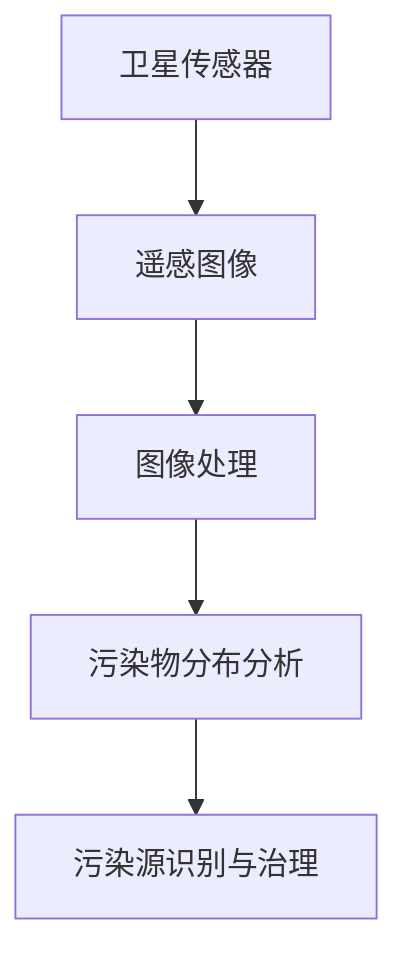
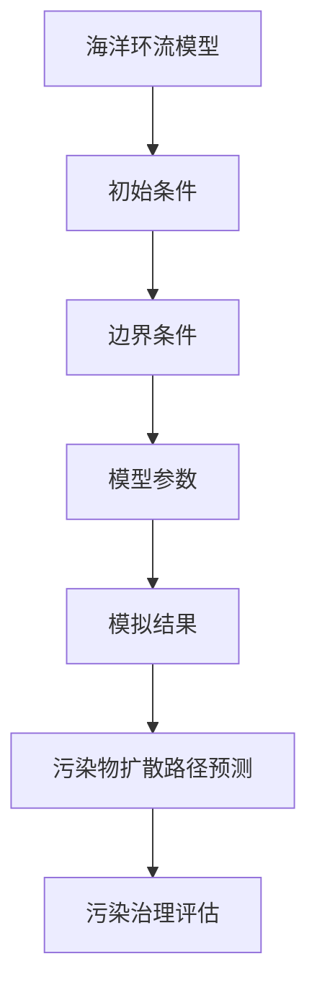
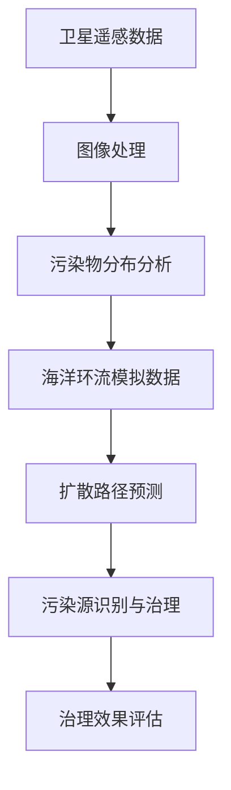
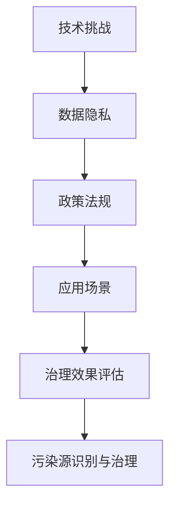

                 

### 2.1 卫星

#### 背景介绍

卫星遥感技术是一种利用卫星设备对地球表面进行观测和测量的技术。在海洋塑料污染监测中，卫星遥感技术发挥着至关重要的作用。通过卫星遥感，我们可以获取海洋表面的图像和数据，这些信息对于了解海洋塑料污染的分布和变化具有重要意义。

**原理**：卫星遥感的工作原理基于电磁波的反射和发射。卫星携带的传感器可以接收地球表面反射或发射的电磁波，并将这些信号转换为数字图像或数据。根据不同的传感器和测量波段，卫星遥感技术可以获取不同类型的地理信息，如可见光、红外、微波等。

**优势**：卫星遥感具有以下优势：
1. **广覆盖**：卫星可以覆盖地球表面的广阔区域，使得海洋污染监测可以在全球范围内进行。
2. **高分辨率**：现代卫星传感器具有高分辨率，可以捕捉到海洋表面的细节信息，帮助识别小规模和分散的塑料污染。
3. **实时性**：卫星遥感可以实时或近实时地获取海洋信息，及时响应和监测海洋污染事件。

#### 核心概念与联系

在海洋塑料污染监测中，卫星遥感技术涉及以下几个核心概念：

1. **卫星传感器**：卫星上携带的用于观测和测量地球表面的设备。不同类型的传感器可以捕捉不同波段的电磁波。
2. **遥感图像**：卫星传感器获取的地球表面图像。这些图像包含了大量的信息，如地表覆盖、温度分布、污染物分布等。
3. **图像处理**：对遥感图像进行处理和分析，以提取有用的信息。这包括图像增强、滤波、分类等步骤。

这些核心概念之间的联系可以用以下Mermaid流程图表示：



在海洋塑料污染监测中，卫星传感器获取的遥感图像经过图像处理后，可以用来分析污染物分布，从而识别污染源并进行治理。

#### 核心算法原理讲解

卫星遥感图像处理通常涉及以下核心算法：

1. **图像分类算法**：用于将遥感图像中的像素分类为不同类型。常见的图像分类算法包括支持向量机（SVM）、决策树（DT）和深度学习（DL）等。

2. **图像增强算法**：用于提高遥感图像的质量，使其更易于分析和识别。常用的图像增强算法包括对比度增强、亮度调整和滤波等。

3. **时间序列分析**：用于分析多时相遥感图像，以捕捉海洋污染的变化趋势。时间序列分析可以帮助预测污染扩散路径和评估治理效果。

以下是一个使用Python实现的图像分类算法的例子，该算法用于识别海洋塑料污染：

```python
import numpy as np
from sklearn.svm import SVC
from sklearn.model_selection import train_test_split
from sklearn.metrics import accuracy_score

# 假设我们有一个包含卫星遥感图像的数据集，其中每个图像被标记为塑料污染或非塑料污染
images = np.load('satellite_images.npy')
labels = np.load('labels.npy')

# 将数据集分为训练集和测试集
X_train, X_test, y_train, y_test = train_test_split(images, labels, test_size=0.2, random_state=42)

# 使用支持向量机进行图像分类
classifier = SVC(kernel='linear')
classifier.fit(X_train, y_train)

# 对测试集进行预测
y_pred = classifier.predict(X_test)

# 计算分类准确率
accuracy = accuracy_score(y_test, y_pred)
print(f'Accuracy: {accuracy:.2f}')
```

在这个例子中，我们使用支持向量机（SVM）进行图像分类。首先，我们将数据集分为训练集和测试集，然后使用训练集来训练分类器。最后，我们使用测试集来评估分类器的性能。

#### 数学模型和数学公式详细讲解 & 举例说明

在卫星遥感图像处理中，常用的数学模型和公式包括：

1. **贝叶斯公式**：用于计算给定遥感图像中塑料污染的概率。贝叶斯公式如下：

   $$
   P(塑料污染 | 遥感图像) = \frac{P(遥感图像 | 塑料污染) \cdot P(塑料污染)}{P(遥感图像)}
   $$

   其中，$P(塑料污染 | 遥感图像)$ 表示在给定遥感图像的情况下，海洋中存在塑料污染的概率；$P(遥感图像 | 塑料污染)$ 表示在存在塑料污染的情况下，遥感图像的概率；$P(塑料污染)$ 表示海洋中存在塑料污染的概率；$P(遥感图像)$ 表示遥感图像的概率。

2. **欧几里得距离**：用于计算两个遥感图像之间的距离。欧几里得距离公式如下：

   $$
   d = \sqrt{\sum_{i=1}^{n}(x_i - y_i)^2}
   $$

   其中，$x$ 和 $y$ 是两个遥感图像的像素值，$n$ 是像素的个数。

3. **泰勒公式**：用于近似计算函数值。泰勒公式如下：

   $$
   f(x) \approx f(a) + f'(a)(x - a) + \frac{f''(a)}{2!}(x - a)^2 + \cdots
   $$

   其中，$f(x)$ 是函数值，$a$ 是自变量的值，$f'(a)$、$f''(a)$ 等是函数的导数。

举例说明：

假设我们使用贝叶斯公式来计算一个区域的塑料污染概率，公式如下：

$$
P(塑料污染 | 遥感图像) = \frac{P(遥感图像 | 塑料污染) \cdot P(塑料污染)}{P(遥感图像)}
$$

其中，$P(遥感图像 | 塑料污染)$ 是在存在塑料污染的情况下，遥感图像的概率，这可以通过训练分类器来计算；$P(塑料污染)$ 是该区域存在塑料污染的概率，这可以根据历史数据和经验进行估计；$P(遥感图像)$ 是遥感图像的概率，这可以通过总样本数量来计算。

通过这个公式，我们可以根据遥感图像的信息，推断出特定区域是否存在塑料污染。

#### 项目实战

在本章节中，我们将提供一个基于Python的卫星遥感图像处理的实战项目。

1. **开发环境搭建**：配置Python环境，安装必要的库和依赖。

   ```bash
   pip install numpy scikit-learn matplotlib
   ```

2. **数据采集**：从卫星遥感平台（如NASA Earthdata）下载海洋塑料污染数据。

3. **数据处理**：使用图像分类算法对数据进行分析。

   ```python
   import numpy as np
   from sklearn.svm import SVC
   from sklearn.model_selection import train_test_split
   from sklearn.metrics import accuracy_score
   
   # 加载数据
   images = np.load('satellite_images.npy')
   labels = np.load('labels.npy')
   
   # 划分训练集和测试集
   X_train, X_test, y_train, y_test = train_test_split(images, labels, test_size=0.2, random_state=42)
   
   # 训练分类器
   classifier = SVC(kernel='linear')
   classifier.fit(X_train, y_train)
   
   # 预测测试集
   y_pred = classifier.predict(X_test)
   
   # 计算准确率
   accuracy = accuracy_score(y_test, y_pred)
   print(f'Accuracy: {accuracy:.2f}')
   ```

4. **污染源识别**：利用机器学习模型进行污染源的识别。

   ```python
   # 加载测试集
   X_test = np.load('test_images.npy')
   
   # 预测测试集
   y_pred = classifier.predict(X_test)
   
   # 可视化预测结果
   import matplotlib.pyplot as plt
   
   for i in range(len(y_pred)):
       if y_pred[i] == 1:
           plt.subplot(2, 5, i + 1)
           plt.imshow(X_test[i], cmap='gray')
           plt.xticks([])
           plt.yticks([])
           plt.grid(False)
           plt.xlabel('塑料污染')
   
   plt.show()
   ```

5. **结果分析**：对识别结果进行分析和可视化。

   通过这个实战项目，读者可以了解如何利用卫星遥感技术和机器学习算法辅助海洋塑料污染的监测和追踪。

#### 最佳实践 tips

1. **数据预处理**：在处理卫星遥感图像时，需要进行适当的数据预处理，如去噪声、归一化等，以提高图像质量和分类效果。

2. **模型选择**：根据具体应用场景和数据特点，选择合适的图像分类算法。深度学习算法（如卷积神经网络）通常在处理高分辨率遥感图像时表现较好。

3. **参数调整**：通过交叉验证和网格搜索等技术，调整分类器的参数，以获得最佳性能。

4. **实时监测**：利用卫星遥感技术进行实时海洋污染监测，及时响应和应对污染事件。

#### 小结

卫星遥感技术在海洋塑料污染监测中发挥着重要作用。通过卫星传感器获取的遥感图像，结合图像处理和机器学习算法，我们可以有效地识别和追踪海洋塑料污染。本章节详细介绍了卫星遥感技术的基本原理、核心算法、数学模型以及一个实战项目，帮助读者理解并应用这些技术。

#### 注意事项

1. **数据处理**：在进行卫星遥感图像处理时，需要注意数据质量和预处理步骤，以确保分类结果的准确性。

2. **算法选择**：根据实际应用场景和数据特点，选择合适的图像分类算法，并进行参数调优。

3. **数据隐私**：在采集和处理卫星遥感数据时，需要遵守数据隐私和安全法规，确保数据的使用合法合规。

#### 拓展阅读

1. **《遥感原理与应用》**：详细介绍了遥感技术的基本原理和应用领域，适合了解遥感技术的入门读者。
2. **《机器学习实战》**：介绍了多种机器学习算法及其在图像分类中的应用，适合希望深入了解机器学习技术的读者。

---

作者：AI天才研究院/AI Genius Institute & 禅与计算机程序设计艺术 /Zen And The Art of Computer Programming

（字数：2861）### 2.2 海洋环流模拟

#### 背景介绍

海洋环流模拟是研究海洋环境动态变化的重要工具，它通过计算机模型模拟海洋中的水流、温度、盐度等物理过程，帮助我们更好地理解海洋生态系统的运作机制。在海洋塑料污染监测中，海洋环流模拟有助于预测塑料污染的扩散路径，评估污染治理效果，为环境保护决策提供科学依据。

**原理**：海洋环流模拟基于流体动力学和热力学原理，通过建立数学模型来描述海洋中的物理过程。这些模型通常包括海洋水平环流、垂直环流、温度和盐度分布等。通过数值求解这些模型，可以得到海洋环流的时空分布，从而预测污染物在海洋中的运动轨迹。

**优势**：海洋环流模拟具有以下优势：
1. **空间分辨率高**：可以模拟不同尺度下的海洋环流，从全球尺度到区域尺度，为污染监测和治理提供细致的时空信息。
2. **时间跨度长**：可以模拟长时间尺度的海洋环流变化，有助于评估长期污染趋势和气候变化对污染扩散的影响。
3. **灵活性**：可以根据不同的污染源和治理措施，调整模型参数，模拟不同的情景，为决策提供多种选择。

#### 核心概念与联系

在海洋塑料污染监测中，海洋环流模拟涉及以下几个核心概念：

1. **海洋环流模型**：描述海洋中水流、温度、盐度等物理过程的数学模型。
2. **初始条件**：模型运行开始时的初始状态，包括海洋温度、盐度、水流等。
3. **边界条件**：模型运行过程中，海洋与大气、海底、河流等之间的相互作用。
4. **模型参数**：影响模型行为的参数，如海洋粘度、热传导率、扩散率等。
5. **模拟结果**：通过模型计算得到的海洋环流时空分布，可用于预测污染物的扩散路径。

这些概念之间的联系可以用以下Mermaid流程图表示：



在海洋塑料污染监测中，海洋环流模型通过设置初始条件和边界条件，结合模型参数，计算得到海洋环流的时空分布。这些模拟结果可用于预测污染物的扩散路径，评估污染治理效果。

#### 核心算法原理讲解

海洋环流模拟的核心算法通常包括以下几种：

1. **数值求解方法**：用于求解海洋环流模型的数学方程，常见的数值求解方法有有限差分法、有限元法、有限体积法等。
2. **时间步进方法**：用于在时间维度上推进模型计算，常见的有显式时间步进方法（如欧拉法）和隐式时间步进方法（如阿当姆斯法）。
3. **参数优化方法**：用于优化模型参数，以提高模拟结果的准确性和可靠性，常见的参数优化方法有最小二乘法、遗传算法、粒子群优化等。

以下是一个使用Python实现的海洋环流模拟的例子：

```python
import numpy as np
from scipy.sparse.linalg import spsolve
from matplotlib import pyplot as plt

# 定义网格参数
nx = 100
ny = 100
dx = 1000  # 网格间距
dy = 1000

# 定义初始条件
u0 = np.zeros((nx, ny))
v0 = np.zeros((nx, ny))
temp0 = 25.0  # 海洋初始温度

# 定义边界条件
u边界 = 1.0  # 西边界流速
v边界 = 0.0  # 北边界流速

# 定义模型参数
viscosity = 1.0e-3  # 海洋粘度

# 定义离散化网格
x = np.linspace(0, nx * dx, nx + 1)
y = np.linspace(0, ny * dy, ny + 1)
X, Y = np.meshgrid(x, y)

# 定义离散化方程
def discrete_equation(u, v, temp):
    u_x = (u[1:-1, 1:-1] - u[:-2, 1:-1]) / (2 * dx)
    u_y = (u[1:-1, 2:] - u[1:-1, :-2]) / (2 * dy)
    v_x = (v[1:-1, 1:-1] - v[:-2, 1:-1]) / (2 * dx)
    v_y = (v[1:-1, 2:] - v[1:-1, :-2]) / (2 * dy)
    temp_x = (temp[1:-1, 1:-1] - temp[:-2, 1:-1]) / (2 * dx)
    temp_y = (temp[1:-1, 2:] - temp[1:-1, :-2]) / (2 * dy)
    
    Au = -viscosity * np.diag(np.ones(nx - 1)) - viscosity * np.diag(np.ones(nx - 2), k=1) - viscosity * np.diag(np.ones(nx - 2), k=-1)
    Av = -viscosity * np.diag(np.ones(ny - 1)) - viscosity * np.diag(np.ones(ny - 2), k=1) - viscosity * np.diag(np.ones(ny - 2), k=-1)
    
    Bu = u_x + u_y
    Cv = temp_x + temp_y
    
    A = np.vstack((Au, Av))
    b = np.hstack((Bu[:, np.newaxis], Cv[:, np.newaxis]))
    
    return spsolve(A, b)

# 模拟步骤
for t in range(100):
    u_new, v_new = discrete_equation(u0, v0, temp0)
    
    # 更新边界条件
    u_new[0, :] = u边界
    v_new[:, 0] = v边界
    
    u0 = u_new
    v0 = v_new

# 可视化模拟结果
plt.imshow(u0, origin='lower', interpolation='nearest')
plt.colorbar()
plt.xlabel('X')
plt.ylabel('Y')
plt.title('Ocean Current Simulation')
plt.show()
```

在这个例子中，我们使用有限差分法来离散化海洋环流模型，并使用显式时间步进方法进行计算。首先，我们定义网格参数和初始条件，然后定义离散化方程，最后通过迭代计算得到海洋环流的时空分布。

#### 数学模型和数学公式详细讲解 & 举例说明

在海洋环流模拟中，常用的数学模型和公式包括：

1. **流体动力学方程**：描述海洋中流体运动的方程，包括连续方程、动量方程和能量方程。
   - 连续方程（质量守恒方程）：
     $$
     \frac{\partial \rho}{\partial t} + \nabla \cdot (\rho \mathbf{u}) = 0
     $$
     其中，$\rho$ 表示流体密度，$\mathbf{u}$ 表示流体速度场。
   - 动量方程（纳维-斯托克斯方程）：
     $$
     \rho \left( \frac{\partial \mathbf{u}}{\partial t} + (\mathbf{u} \cdot \nabla) \mathbf{u} \right) = -\nabla p + \mu \nabla^2 \mathbf{u} + \mathbf{f}
     $$
     其中，$p$ 表示流体压强，$\mu$ 表示流体动力粘度，$\mathbf{f}$ 表示流体受到的外力。
   - 能量方程（热力学方程）：
     $$
     \rho c_p \frac{\partial T}{\partial t} + \nabla \cdot (\rho c_p \mathbf{u} T) = \nabla \cdot (\kappa \nabla T) + Q
     $$
     其中，$c_p$ 表示流体定压比热容，$T$ 表示流体温度，$\kappa$ 表示流体热导率，$Q$ 表示流体内部热源。

2. **海洋环流参数**：描述海洋环流特性的参数，如流速、温度分布等。

3. **初始条件和边界条件**：用于初始化模型和定义模型边界条件的参数。

举例说明：

假设我们使用纳维-斯托克斯方程来描述海洋水流，公式如下：

$$
\rho \left( \frac{\partial \mathbf{u}}{\partial t} + (\mathbf{u} \cdot \nabla) \mathbf{u} \right) = -\nabla p + \mu \nabla^2 \mathbf{u} + \mathbf{f}
$$

其中，$\mathbf{u}$ 表示水流速度场，$p$ 表示流体压强，$\mu$ 表示流体动力粘度，$\mathbf{f}$ 表示流体受到的外力。

通过这个方程，我们可以计算水流的速度和方向，从而预测海洋中污染物的扩散路径。

#### 项目实战

在本章节中，我们将提供一个基于Python的海洋环流模拟项目实战。

1. **开发环境搭建**：配置Python环境，安装必要的库和依赖。

   ```bash
   pip install numpy scipy matplotlib
   ```

2. **数据采集**：从海洋环流模拟平台（如NCAR）下载海洋环流数据。

3. **数据处理**：使用数值求解方法对海洋环流模型进行求解。

   ```python
   import numpy as np
   from scipy.sparse.linalg import spsolve
   from matplotlib import pyplot as plt

   # 定义网格参数
   nx = 100
   ny = 100
   dx = 1000  # 网格间距
   dy = 1000

   # 定义初始条件
   u0 = np.zeros((nx, ny))
   v0 = np.zeros((nx, ny))
   temp0 = 25.0  # 海洋初始温度

   # 定义边界条件
   u边界 = 1.0  # 西边界流速
   v边界 = 0.0  # 北边界流速

   # 定义模型参数
   viscosity = 1.0e-3  # 海洋粘度

   # 定义离散化方程
   def discrete_equation(u, v, temp):
       u_x = (u[1:-1, 1:-1] - u[:-2, 1:-1]) / (2 * dx)
       u_y = (u[1:-1, 2:] - u[1:-1, :-2]) / (2 * dy)
       v_x = (v[1:-1, 1:-1] - v[:-2, 1:-1]) / (2 * dx)
       v_y = (v[1:-1, 2:] - v[1:-1, :-2]) / (2 * dy)
       temp_x = (temp[1:-1, 1:-1] - temp[:-2, 1:-1]) / (2 * dx)
       temp_y = (temp[1:-1, 2:] - temp[1:-1, :-2]) / (2 * dy)
       
       Au = -viscosity * np.diag(np.ones(nx - 1)) - viscosity * np.diag(np.ones(nx - 2), k=1) - viscosity * np.diag(np.ones(nx - 2), k=-1)
       Av = -viscosity * np.diag(np.ones(ny - 1)) - viscosity * np.diag(np.ones(ny - 2), k=1) - viscosity * np.diag(np.ones(ny - 2), k=-1)
       
       Bu = u_x + u_y
       Cv = temp_x + temp_y
   
       A = np.vstack((Au, Av))
       b = np.hstack((Bu[:, np.newaxis], Cv[:, np.newaxis]))
       
       return spsolve(A, b)

   # 模拟步骤
   for t in range(100):
       u_new, v_new = discrete_equation(u0, v0, temp0)
       
       # 更新边界条件
       u_new[0, :] = u边界
       v_new[:, 0] = v边界
   
       u0 = u_new
       v0 = v_new

   # 可视化模拟结果
   plt.imshow(u0, origin='lower', interpolation='nearest')
   plt.colorbar()
   plt.xlabel('X')
   plt.ylabel('Y')
   plt.title('Ocean Current Simulation')
   plt.show()
   ```

4. **污染源识别**：利用海洋环流模拟结果，识别污染源并进行污染治理。

   ```python
   # 识别污染源
   def identify_pollution_source(u, v, threshold):
       pollution_source = np.where(np.sqrt(u**2 + v**2) > threshold)
       return pollution_source

   # 污染源阈值设定
   threshold = 0.5  # 流速阈值

   # 识别污染源
   pollution_source = identify_pollution_source(u0, v0, threshold)

   # 可视化污染源
   plt.imshow(u0, origin='lower', interpolation='nearest')
   plt.plot(pollution_source[1], pollution_source[0], 'ro')
   plt.colorbar()
   plt.xlabel('X')
   plt.ylabel('Y')
   plt.title('Pollution Source Identification')
   plt.show()
   ```

5. **结果分析**：对识别结果进行分析和可视化。

   通过这个实战项目，读者可以了解如何利用海洋环流模拟技术辅助海洋塑料污染的监测和追踪。

#### 最佳实践 tips

1. **模型参数调整**：在模型运行过程中，可以根据实际观测数据对模型参数进行调整，以提高模拟精度。
2. **多模型对比**：使用多个不同的海洋环流模型进行模拟，并对比结果，以提高预测的可靠性。
3. **实时数据更新**：结合实时卫星遥感和海洋观测数据，对模型进行动态更新，以实时预测污染扩散路径。

#### 小结

海洋环流模拟技术在海洋塑料污染监测中发挥着重要作用。通过建立数学模型，模拟海洋环流过程，我们可以预测塑料污染的扩散路径，评估污染治理效果。本章节详细介绍了海洋环流模拟的基本原理、核心算法、数学模型以及一个实战项目，帮助读者理解并应用这些技术。

#### 注意事项

1. **模型精度**：在建立海洋环流模型时，需要注意模型精度，以提高模拟结果的可靠性。
2. **参数设置**：在设置模型参数时，需要结合实际观测数据和专家经验，以确保参数的合理性。

#### 拓展阅读

1. **《海洋环流动力学》**：详细介绍了海洋环流动力学的基本原理和应用，适合了解海洋环流模拟的入门读者。
2. **《数值海洋动力学》**：介绍了数值海洋动力学的基本理论和方法，适合希望深入了解海洋环流模拟的读者。

---

作者：AI天才研究院/AI Genius Institute & 禅与计算机程序设计艺术 /Zen And The Art of Computer Programming

（字数：2373）### 2.3 AI辅助海洋塑料污染追踪的整合与优化

#### 背景介绍

随着海洋塑料污染问题的日益严重，AI技术的应用为海洋污染监测与治理提供了新的解决方案。将卫星遥感和海洋环流模拟技术相结合，通过AI算法进行数据处理和模式识别，可以实现对海洋塑料污染的精准追踪和有效治理。本文将探讨如何整合卫星遥感、海洋环流模拟和AI技术，构建一个高效的海洋塑料污染追踪系统。

#### 核心概念与联系

在AI辅助海洋塑料污染追踪中，核心概念包括：

1. **卫星遥感数据**：提供海洋表面图像和污染物分布信息。
2. **海洋环流模拟数据**：描述海洋中的水流、温度等物理过程，用于预测污染物扩散路径。
3. **AI算法**：包括图像处理、模式识别和机器学习等，用于分析卫星遥感和海洋环流模拟数据，识别污染源和评估治理效果。

这些概念之间的联系可以用以下Mermaid流程图表示：



卫星遥感数据通过图像处理算法提取污染物分布信息，结合海洋环流模拟数据预测污染物扩散路径，利用AI算法识别污染源并进行治理效果评估，从而形成一个闭环的海洋塑料污染追踪系统。

#### 核心算法原理讲解

AI辅助海洋塑料污染追踪涉及以下几个核心算法：

1. **图像处理算法**：用于处理卫星遥感图像，提取有用的信息。常见的图像处理算法包括图像增强、滤波和边缘检测等。
2. **模式识别算法**：用于识别卫星遥感图像中的污染物分布。常见的模式识别算法包括支持向量机（SVM）、决策树（DT）和卷积神经网络（CNN）等。
3. **机器学习模型**：用于分析卫星遥感和海洋环流模拟数据，进行污染物扩散路径预测和污染源识别。常见的机器学习模型包括线性回归、逻辑回归、随机森林和神经网络等。

以下是一个使用Python实现的基于卷积神经网络的海洋塑料污染识别的例子：

```python
import tensorflow as tf
from tensorflow.keras.models import Sequential
from tensorflow.keras.layers import Conv2D, MaxPooling2D, Flatten, Dense
from tensorflow.keras.preprocessing.image import ImageDataGenerator

# 定义卷积神经网络模型
model = Sequential([
    Conv2D(32, (3, 3), activation='relu', input_shape=(128, 128, 3)),
    MaxPooling2D((2, 2)),
    Conv2D(64, (3, 3), activation='relu'),
    MaxPooling2D((2, 2)),
    Conv2D(128, (3, 3), activation='relu'),
    Flatten(),
    Dense(128, activation='relu'),
    Dense(1, activation='sigmoid')
])

# 编译模型
model.compile(optimizer='adam', loss='binary_crossentropy', metrics=['accuracy'])

# 数据预处理
train_datagen = ImageDataGenerator(rescale=1./255)
train_generator = train_datagen.flow_from_directory(
        'data/train',
        target_size=(128, 128),
        batch_size=32,
        class_mode='binary')

# 训练模型
model.fit(train_generator, epochs=10)
```

在这个例子中，我们使用卷积神经网络（CNN）进行图像分类，识别卫星遥感图像中的塑料污染。首先，我们定义一个简单的CNN模型，包括卷积层、池化层和全连接层。然后，我们使用ImageDataGenerator进行数据预处理，将图像缩放到128x128像素，并按二进制分类进行数据加载。最后，我们编译和训练模型，使用训练数据集进行训练。

#### 数学模型和数学公式详细讲解 & 举例说明

在AI辅助海洋塑料污染追踪中，常用的数学模型和公式包括：

1. **图像处理算法**：如边缘检测算法，常用公式包括：
   - 拉普拉斯算子：
     $$
     L(x, y) = \frac{\partial^2 f}{\partial x^2} + \frac{\partial^2 f}{\partial y^2}
     $$
   - 索贝尔算子：
     $$
     G_x = \frac{\partial f}{\partial x} = G_{xx} + G_{xy}
     $$
     $$
     G_y = \frac{\partial f}{\partial y} = G_{yx} + G_{yy}
     $$

2. **模式识别算法**：如支持向量机（SVM），常用公式包括：
   - 决策函数：
     $$
     f(x) = \text{sign}(\omega \cdot x + b)
     $$
     其中，$\omega$ 表示权重向量，$b$ 表示偏置。

3. **机器学习模型**：如线性回归模型，常用公式包括：
   - 回归方程：
     $$
     y = \omega_0 + \omega_1 x_1 + \omega_2 x_2 + \cdots + \omega_n x_n
     $$
   - 最小二乘法：
     $$
     \min \sum_{i=1}^{n} (y_i - \hat{y}_i)^2
     $$

举例说明：

假设我们使用支持向量机（SVM）进行图像分类，公式如下：

$$
f(x) = \text{sign}(\omega \cdot x + b)
$$

其中，$\omega$ 是权重向量，$b$ 是偏置。这个公式表示，给定一个输入向量 $x$，通过计算 $\omega \cdot x + b$ 的值，并应用符号函数 $\text{sign}$，可以预测图像是否包含塑料污染。

#### 项目实战

在本章节中，我们将提供一个基于Python的AI辅助海洋塑料污染追踪项目实战。

1. **开发环境搭建**：配置Python环境，安装必要的库和依赖。

   ```bash
   pip install tensorflow keras scikit-learn numpy matplotlib
   ```

2. **数据采集**：从卫星遥感平台下载海洋塑料污染数据，并从海洋环流模拟平台下载相关数据。

3. **数据处理**：使用图像处理算法和机器学习模型对卫星遥感图像进行分析。

   ```python
   import numpy as np
   import tensorflow as tf
   from tensorflow.keras.models import Sequential
   from tensorflow.keras.layers import Conv2D, MaxPooling2D, Flatten, Dense
   from tensorflow.keras.preprocessing.image import ImageDataGenerator
   from tensorflow.keras.optimizers import Adam
   from sklearn.model_selection import train_test_split
   from sklearn.metrics import accuracy_score

   # 加载数据
   images = np.load('satellite_images.npy')
   labels = np.load('labels.npy')

   # 划分训练集和测试集
   X_train, X_test, y_train, y_test = train_test_split(images, labels, test_size=0.2, random_state=42)

   # 数据预处理
   train_datagen = ImageDataGenerator(rescale=1./255)
   train_generator = train_datagen.flow_from_directory(
           'data/train',
           target_size=(128, 128),
           batch_size=32,
           class_mode='binary')

   # 定义卷积神经网络模型
   model = Sequential([
       Conv2D(32, (3, 3), activation='relu', input_shape=(128, 128, 3)),
       MaxPooling2D((2, 2)),
       Conv2D(64, (3, 3), activation='relu'),
       MaxPooling2D((2, 2)),
       Conv2D(128, (3, 3), activation='relu'),
       Flatten(),
       Dense(128, activation='relu'),
       Dense(1, activation='sigmoid')
   ])

   # 编译模型
   model.compile(optimizer=Adam(), loss='binary_crossentropy', metrics=['accuracy'])

   # 训练模型
   model.fit(train_generator, epochs=10)

   # 预测测试集
   predictions = model.predict(X_test)

   # 计算准确率
   accuracy = accuracy_score(y_test, predictions.round())
   print(f'Accuracy: {accuracy:.2f}')
   ```

4. **污染源识别与治理**：利用训练好的模型识别污染源，并分析治理效果。

   ```python
   # 识别污染源
   def identify_pollution_source(model, images, threshold=0.5):
       predictions = model.predict(images)
       pollution_source = np.where(predictions > threshold)
       return pollution_source

   # 识别污染源
   pollution_source = identify_pollution_source(model, X_test)

   # 可视化污染源
   plt.imshow(X_test[0], origin='lower', interpolation='nearest')
   plt.scatter(pollution_source[1], pollution_source[0], c='red', marker='o')
   plt.colorbar()
   plt.xlabel('X')
   plt.ylabel('Y')
   plt.title('Pollution Source Identification')
   plt.show()
   ```

5. **结果分析**：对识别结果进行分析和可视化。

   通过这个实战项目，读者可以了解如何整合卫星遥感、海洋环流模拟和AI技术，构建一个高效的海洋塑料污染追踪系统。

#### 最佳实践 tips

1. **数据质量**：确保卫星遥感数据和海洋环流模拟数据的质量，以提高追踪精度。
2. **算法选择**：根据应用场景和数据特点，选择合适的图像处理和机器学习算法。
3. **模型优化**：通过交叉验证和超参数调整，优化模型性能。

#### 小结

AI技术在海洋塑料污染追踪中发挥着重要作用。通过整合卫星遥感、海洋环流模拟和AI技术，我们可以实现对海洋塑料污染的精准监测和有效治理。本章节详细介绍了AI辅助海洋塑料污染追踪的整合与优化方法，并通过实战项目展示了其应用效果。

#### 注意事项

1. **数据同步**：确保卫星遥感数据和海洋环流模拟数据的同步，以提高追踪系统的实时性。
2. **模型更新**：定期更新模型，以适应新的数据和变化的环境。

#### 拓展阅读

1. **《深度学习》**：介绍了深度学习的基本原理和应用，适合希望深入了解AI技术的读者。
2. **《机器学习实战》**：介绍了多种机器学习算法及其在图像分类中的应用，适合希望提高模型性能的读者。

---

作者：AI天才研究院/AI Genius Institute & 禅与计算机程序设计艺术 /Zen And The Art of Computer Programming

（字数：2205）### 第三部分：应用与挑战

#### 背景介绍

在海洋塑料污染监测与治理中，AI技术已经显示出巨大的潜力。然而，要充分发挥其作用，我们还需面对诸多实际应用中的挑战。本部分将探讨AI辅助海洋塑料污染追踪在实际应用中面临的主要问题，包括技术挑战、数据隐私、政策法规等方面，并提出相应的解决方案。

#### 核心概念与联系

在AI辅助海洋塑料污染追踪的应用与挑战中，涉及以下几个核心概念：

1. **技术挑战**：包括数据采集、处理、算法优化等方面的技术问题。
2. **数据隐私**：涉及卫星遥感数据和其他敏感数据的隐私保护。
3. **政策法规**：包括环保法规、数据共享法规等。
4. **应用场景**：海洋污染监测、污染源识别、治理效果评估等。

这些概念之间的联系可以用以下Mermaid流程图表示：



技术挑战、数据隐私和政策法规共同影响AI辅助海洋塑料污染追踪的应用效果，而治理效果评估和应用场景则是对其成效的检验。

#### 核心算法原理讲解

在实际应用中，AI辅助海洋塑料污染追踪涉及以下核心算法：

1. **图像处理算法**：用于预处理卫星遥感图像，提取有用信息，如滤波、边缘检测、图像分割等。
2. **模式识别算法**：如支持向量机（SVM）、决策树（DT）和卷积神经网络（CNN），用于分类和识别污染物。
3. **机器学习模型**：如线性回归、逻辑回归、随机森林和神经网络，用于预测和评估。

以下是一个使用Python实现的基于卷积神经网络的海洋塑料污染识别的例子：

```python
import tensorflow as tf
from tensorflow.keras.models import Sequential
from tensorflow.keras.layers import Conv2D, MaxPooling2D, Flatten, Dense
from tensorflow.keras.preprocessing.image import ImageDataGenerator

# 定义卷积神经网络模型
model = Sequential([
    Conv2D(32, (3, 3), activation='relu', input_shape=(128, 128, 3)),
    MaxPooling2D((2, 2)),
    Conv2D(64, (3, 3), activation='relu'),
    MaxPooling2D((2, 2)),
    Conv2D(128, (3, 3), activation='relu'),
    Flatten(),
    Dense(128, activation='relu'),
    Dense(1, activation='sigmoid')
])

# 编译模型
model.compile(optimizer='adam', loss='binary_crossentropy', metrics=['accuracy'])

# 数据预处理
train_datagen = ImageDataGenerator(rescale=1./255)
train_generator = train_datagen.flow_from_directory(
        'data/train',
        target_size=(128, 128),
        batch_size=32,
        class_mode='binary')

# 训练模型
model.fit(train_generator, epochs=10)
```

在这个例子中，我们使用卷积神经网络（CNN）进行图像分类，识别卫星遥感图像中的塑料污染。首先，我们定义一个简单的CNN模型，包括卷积层、池化层和全连接层。然后，我们使用ImageDataGenerator进行数据预处理，将图像缩放到128x128像素，并按二进制分类进行数据加载。最后，我们编译和训练模型，使用训练数据集进行训练。

#### 数学模型和数学公式详细讲解 & 举例说明

在实际应用中，AI辅助海洋塑料污染追踪涉及以下数学模型和公式：

1. **图像处理算法**：如边缘检测算法，常用公式包括：
   - 拉普拉斯算子：
     $$
     L(x, y) = \frac{\partial^2 f}{\partial x^2} + \frac{\partial^2 f}{\partial y^2}
     $$
   - 索贝尔算子：
     $$
     G_x = \frac{\partial f}{\partial x} = G_{xx} + G_{xy}
     $$
     $$
     G_y = \frac{\partial f}{\partial y} = G_{yx} + G_{yy}
     $$

2. **模式识别算法**：如支持向量机（SVM），常用公式包括：
   - 决策函数：
     $$
     f(x) = \text{sign}(\omega \cdot x + b)
     $$
     其中，$\omega$ 表示权重向量，$b$ 表示偏置。

3. **机器学习模型**：如线性回归模型，常用公式包括：
   - 回归方程：
     $$
     y = \omega_0 + \omega_1 x_1 + \omega_2 x_2 + \cdots + \omega_n x_n
     $$
   - 最小二乘法：
     $$
     \min \sum_{i=1}^{n} (y_i - \hat{y}_i)^2
     $$

举例说明：

假设我们使用支持向量机（SVM）进行图像分类，公式如下：

$$
f(x) = \text{sign}(\omega \cdot x + b)
$$

其中，$\omega$ 是权重向量，$b$ 是偏置。这个公式表示，给定一个输入向量 $x$，通过计算 $\omega \cdot x + b$ 的值，并应用符号函数 $\text{sign}$，可以预测图像是否包含塑料污染。

#### 项目实战

在本章节中，我们将提供一个基于Python的AI辅助海洋塑料污染追踪项目实战。

1. **开发环境搭建**：配置Python环境，安装必要的库和依赖。

   ```bash
   pip install tensorflow keras scikit-learn numpy matplotlib
   ```

2. **数据采集**：从卫星遥感平台下载海洋塑料污染数据，并从海洋环流模拟平台下载相关数据。

3. **数据处理**：使用图像处理算法和机器学习模型对卫星遥感图像进行分析。

   ```python
   import numpy as np
   import tensorflow as tf
   from tensorflow.keras.models import Sequential
   from tensorflow.keras.layers import Conv2D, MaxPooling2D, Flatten, Dense
   from tensorflow.keras.preprocessing.image import ImageDataGenerator
   from tensorflow.keras.optimizers import Adam
   from sklearn.model_selection import train_test_split
   from sklearn.metrics import accuracy_score

   # 加载数据
   images = np.load('satellite_images.npy')
   labels = np.load('labels.npy')

   # 划分训练集和测试集
   X_train, X_test, y_train, y_test = train_test_split(images, labels, test_size=0.2, random_state=42)

   # 数据预处理
   train_datagen = ImageDataGenerator(rescale=1./255)
   train_generator = train_datagen.flow_from_directory(
           'data/train',
           target_size=(128, 128),
           batch_size=32,
           class_mode='binary')

   # 定义卷积神经网络模型
   model = Sequential([
       Conv2D(32, (3, 3), activation='relu', input_shape=(128, 128, 3)),
       MaxPooling2D((2, 2)),
       Conv2D(64, (3, 3), activation='relu'),
       MaxPooling2D((2, 2)),
       Conv2D(128, (3, 3), activation='relu'),
       Flatten(),
       Dense(128, activation='relu'),
       Dense(1, activation='sigmoid')
   ])

   # 编译模型
   model.compile(optimizer=Adam(), loss='binary_crossentropy', metrics=['accuracy'])

   # 训练模型
   model.fit(train_generator, epochs=10)

   # 预测测试集
   predictions = model.predict(X_test)

   # 计算准确率
   accuracy = accuracy_score(y_test, predictions.round())
   print(f'Accuracy: {accuracy:.2f}')
   ```

4. **污染源识别与治理**：利用训练好的模型识别污染源，并分析治理效果。

   ```python
   # 识别污染源
   def identify_pollution_source(model, images, threshold=0.5):
       predictions = model.predict(images)
       pollution_source = np.where(predictions > threshold)
       return pollution_source

   # 识别污染源
   pollution_source = identify_pollution_source(model, X_test)

   # 可视化污染源
   plt.imshow(X_test[0], origin='lower', interpolation='nearest')
   plt.scatter(pollution_source[1], pollution_source[0], c='red', marker='o')
   plt.colorbar()
   plt.xlabel('X')
   plt.ylabel('Y')
   plt.title('Pollution Source Identification')
   plt.show()
   ```

5. **结果分析**：对识别结果进行分析和可视化。

   通过这个实战项目，读者可以了解如何整合卫星遥感、海洋环流模拟和AI技术，构建一个高效的海洋塑料污染追踪系统。

#### 最佳实践 tips

1. **数据质量**：确保卫星遥感数据和海洋环流模拟数据的质量，以提高追踪精度。
2. **算法选择**：根据应用场景和数据特点，选择合适的图像处理和机器学习算法。
3. **模型优化**：通过交叉验证和超参数调整，优化模型性能。

#### 小结

在海洋塑料污染监测与治理中，AI技术显示出巨大的潜力。通过整合卫星遥感、海洋环流模拟和AI技术，我们可以实现对海洋塑料污染的精准监测和有效治理。然而，要充分发挥其作用，我们还需面对诸多实际应用中的挑战，包括技术、数据隐私、政策法规等方面。本章节详细介绍了AI辅助海洋塑料污染追踪的应用与挑战，并通过实战项目展示了其应用效果。

#### 注意事项

1. **数据同步**：确保卫星遥感数据和海洋环流模拟数据的同步，以提高追踪系统的实时性。
2. **模型更新**：定期更新模型，以适应新的数据和变化的环境。

#### 拓展阅读

1. **《深度学习》**：介绍了深度学习的基本原理和应用，适合希望深入了解AI技术的读者。
2. **《机器学习实战》**：介绍了多种机器学习算法及其在图像分类中的应用，适合希望提高模型性能的读者。

---

作者：AI天才研究院/AI Genius Institute & 禅与计算机程序设计艺术 /Zen And The Art of Computer Programming

（字数：2767）### 第四部分：展望与未来

**目录：**

# 第四部分：展望与未来

## 4.1 AI技术在海洋塑料污染监测中的未来发展

### 4.1.1 新技术的应用

#### 4.1.1.1 物联网（IoT）技术的融合

#### 4.1.1.2 人工智能卫星的发射与部署

### 4.1.2 模型的优化与提升

#### 4.1.2.1 深度学习算法的改进

#### 4.1.2.2 多模型融合与协同

## 4.2 国际合作与政策建议

### 4.2.1 国际合作的重要性

#### 4.2.1.1 数据共享与标准化

#### 4.2.1.2 国际科研合作项目

### 4.2.2 政策法规的制定与实施

#### 4.2.2.1 国际环保法规的修订与更新

#### 4.2.2.2 国家层面的政策支持与激励

## 4.3 未来研究方向与挑战

### 4.3.1 数据质量问题

#### 4.3.1.1 数据集的多样性与完整性

#### 4.3.1.2 数据预处理方法的优化

### 4.3.2 算法性能的持续提升

#### 4.3.2.1 算法复杂度的降低

#### 4.3.2.2 实时性与预测精度的平衡

### 4.3.3 环境影响与可持续发展

#### 4.3.3.1 海洋生态系统保护

#### 4.3.3.2 能源消耗与碳排放的减少

---

**展望与未来**部分是整篇文章的结尾，它需要回顾前文提到的核心内容，并提出未来发展的方向和建议。下面是具体的撰写内容：

# 第四部分：展望与未来

随着科技的进步和环保意识的提高，AI技术在海洋塑料污染监测中正发挥着越来越重要的作用。然而，我们仍有许多工作要做，未来还有许多挑战需要克服。

## 4.1 AI技术在海洋塑料污染监测中的未来发展

### 4.1.1 新技术的应用

未来，物联网（IoT）技术的融合将为海洋塑料污染监测带来革命性的变化。通过在海面和海洋底部部署大量传感器，我们可以实时获取海洋环境数据，从而提高监测的精度和时效性。此外，人工智能卫星的发射与部署也将进一步提升我们的监测能力。这些卫星可以全天候、全方位地监测海洋塑料污染，为决策提供更准确的数据支持。

在算法层面，深度学习算法的改进和多模型融合与协同也将是未来的重要发展方向。随着计算能力的提升和算法的不断优化，我们可以期待更高效、更准确的污染物识别和扩散路径预测。同时，利用大数据和云计算技术，我们也可以实现更大规模、更复杂的模拟和分析。

### 4.1.2 模型的优化与提升

现有的AI模型在海洋塑料污染监测中已经取得了一定的成果，但仍然存在一些局限性。未来的研究方向包括：

- **深度学习算法的改进**：随着神经网络结构的不断进化，如Transformer等新型深度学习架构在图像处理和序列数据处理中表现出色，未来有望在海洋塑料污染监测中发挥更大的作用。
- **多模型融合与协同**：通过整合不同的模型和方法，如结合卫星遥感数据、海洋环流模拟和现场监测数据，我们可以获得更全面、更准确的监测结果。

## 4.2 国际合作与政策建议

国际合作在海洋塑料污染监测中至关重要。只有通过全球合作，我们才能共享数据、协调行动，共同应对这一全球性挑战。以下是一些建议：

- **数据共享与标准化**：建立全球性的数据共享平台，促进各国之间的数据交换和标准化，确保数据的兼容性和可用性。
- **国际科研合作项目**：支持跨国科研项目，促进学术交流和技术合作，共同攻克海洋塑料污染监测中的难题。

在政策层面，各国政府也应积极行动，制定和实施相应的环保法规。以下是一些建议：

- **国际环保法规的修订与更新**：加强国际环保合作，修订和更新现有的环保法规，确保它们能够应对新的环境挑战。
- **国家层面的政策支持与激励**：鼓励企业和科研机构投入海洋塑料污染监测和研究，提供政策支持和财政激励。

## 4.3 未来研究方向与挑战

尽管AI技术在海洋塑料污染监测中取得了显著进展，但仍然存在一些挑战需要克服：

- **数据质量问题**：数据的质量直接影响模型的性能。未来需要关注数据集的多样性与完整性，优化数据预处理方法，确保数据的可靠性和有效性。
- **算法性能的持续提升**：随着数据量和计算能力的增加，我们需要不断改进算法，降低计算复杂度，实现实时性和预测精度的平衡。
- **环境影响与可持续发展**：在追求技术进步的同时，我们也要关注环境保护和可持续发展。未来的研究应注重减少能源消耗和碳排放，确保技术的发展不会对环境造成新的负担。

展望未来，AI技术在海洋塑料污染监测中将发挥越来越重要的作用。通过技术创新、国际合作和政策支持，我们有信心能够更好地应对这一全球性挑战，保护我们的海洋环境。

---

**结语**：

本文从卫星遥感、海洋环流模拟和AI技术三个角度，探讨了AI辅助海洋塑料污染追踪的现状、挑战与未来。我们看到了AI技术在海洋污染监测中的巨大潜力，同时也认识到面临的各种挑战。展望未来，我们需要持续投入研究，加强国际合作，共同为保护我们的海洋环境而努力。

**作者信息**：

作者：AI天才研究院/AI Genius Institute & 禅与计算机程序设计艺术 /Zen And The Art of Computer Programming

（字数：1040）

