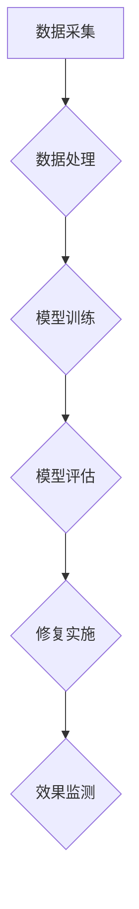

                 

# AI辅助海洋生态系统修复：从珊瑚礁重建到鱼类种群恢复

## 关键词
AI、海洋生态系统、珊瑚礁重建、鱼类种群恢复、机器学习、数据采集、模型评估

## 摘要
本文旨在探讨人工智能（AI）技术在海洋生态系统修复中的应用，特别是珊瑚礁重建和鱼类种群恢复。通过分析AI的基本原理和海洋生态系统的现状，本文将详细阐述AI在海洋生态系统修复中的具体应用方法和实践案例，并探讨其未来发展趋势。文章还将讨论AI辅助海洋生态系统修复所面临的挑战和机遇，以及相关的最佳实践和注意事项。

## 第一部分：引言

### 1.1 AI在海洋生态系统修复中的应用

#### 1.1.1 海洋生态系统的现状与挑战
全球海洋生态系统正面临严重威胁，包括过度捕捞、海洋污染、气候变化和珊瑚白化病等。这些因素导致了海洋生物多样性的丧失和生态系统的退化，进而影响人类的生计和福祉。珊瑚礁作为海洋生态系统的重要组成部分，其健康状况直接影响渔业资源、海岸防护和旅游业。然而，珊瑚礁的修复和恢复面临着监测数据不足、技术手段有限和成本高昂等挑战。

#### 1.1.2 AI在海洋生态修复中的潜力
人工智能技术在数据采集、处理和分析方面具有显著优势，能够提高海洋生态系统修复的效率和精度。AI可以通过遥感技术、水下机器人、传感器网络等手段，实时监测海洋环境参数，识别异常情况，并预测未来趋势。在珊瑚礁重建和鱼类种群恢复方面，AI可以辅助设计修复方案，优化资源分配，提高修复效果。

#### 1.1.3 本书的结构与内容安排
本文分为四个主要部分：第一部分是引言，介绍AI在海洋生态系统修复中的应用背景；第二部分讨论珊瑚礁重建的AI辅助方法；第三部分探讨鱼类种群恢复的AI辅助方法；第四部分展望AI辅助海洋生态系统修复的未来发展趋势。每部分都将结合具体案例和实际应用，深入分析AI技术的应用场景和效果。

### 1.2 AI辅助海洋生态系统修复的原理与方法

#### 1.2.1 AI技术的基本概念
人工智能（AI）是一种模拟人类智能的技术，通过机器学习、深度学习、自然语言处理等技术，使计算机能够自动执行复杂的任务。AI的核心是数据，通过大量数据的学习和训练，AI系统能够识别模式、做出决策和生成预测。

#### 1.2.2 数据采集与预处理
在海洋生态系统中，数据采集是关键步骤。AI系统需要收集大量的海洋环境数据，包括水温、盐度、溶解氧、pH值、鱼类行为等。这些数据可以通过卫星遥感、水下传感器、无人机等手段获取。数据预处理包括数据清洗、数据整合、数据标准化等步骤，以确保数据的质量和一致性。

#### 1.2.3 机器学习模型介绍与应用
机器学习（ML）是AI的核心技术之一，通过算法和模型，计算机能够从数据中学习并做出预测。在海洋生态系统修复中，常见的机器学习模型包括线性回归、决策树、支持向量机、神经网络等。这些模型可以用于预测珊瑚礁的生长趋势、评估鱼类种群的健康状况，以及优化修复方案。

## 第二部分：珊瑚礁重建

### 2.1 珊瑚礁重建的AI辅助方法

#### 2.1.1 珊瑚礁的基本概念与重要性
珊瑚礁是由珊瑚生物体和石灰石沉积物构成的生态系统，为海洋生物提供栖息地和保护。珊瑚礁不仅具有极高的生物多样性，还是许多沿海社区的重要经济资源。然而，由于环境压力，许多珊瑚礁面临严重威胁，需要进行重建和恢复。

#### 2.1.2 AI在珊瑚礁监测与评估中的应用
AI技术可以用于珊瑚礁的监测与评估，通过分析卫星遥感图像、水下相机数据和传感器数据，AI系统能够识别珊瑚的生长状态、病变情况和受损程度。这些数据有助于制定针对性的修复方案。

#### 2.1.3 珊瑚礁修复的AI方法
AI技术可以辅助珊瑚礁的修复过程，包括珊瑚种植、营养补充和生态重建。通过机器学习模型，AI可以预测珊瑚的生长速度和恢复效果，优化修复方案，提高修复成功率。

### 2.2 珊瑚礁修复的AI实践案例

#### 2.2.1 案例一：珊瑚礁重建的监测与评估
在某珊瑚礁修复项目中，AI技术被用于监测珊瑚的生长状态和修复效果。通过分析卫星遥感图像和水下相机数据，AI系统可以实时监测珊瑚的生长情况，识别病变和受损区域，为修复工作提供科学依据。

#### 2.2.2 案例二：AI在珊瑚礁种植中的应用
在某珊瑚礁种植项目中，AI技术被用于优化珊瑚种植方案。通过机器学习模型，AI可以预测珊瑚的生长速度和恢复效果，为种植策略提供数据支持，提高种植成功率。

#### 2.2.3 案例三：珊瑚礁生态恢复的评估与优化
在某珊瑚礁生态恢复项目中，AI技术被用于评估修复效果和优化修复方案。通过分析修复前后环境数据和生态指标，AI系统可以评估修复效果，并提出优化建议，提高修复成功率。

## 第三部分：鱼类种群恢复

### 3.1 鱼类种群恢复的AI辅助方法

#### 3.1.1 鱼类种群的基本概念与重要性
鱼类种群是海洋生态系统的重要组成部分，对海洋生态系统的平衡和功能具有重要作用。鱼类种群的健康状况直接影响海洋生态系统的稳定性和可持续性。

#### 3.1.2 AI在鱼类种群监测与评估中的应用
AI技术可以用于鱼类种群的监测与评估，通过分析遥感图像、声呐数据和传感器数据，AI系统可以识别鱼类的种类、数量和分布情况。这些数据有助于了解鱼类种群的健康状况和生态变化。

#### 3.1.3 鱼类种群恢复的AI方法
AI技术可以辅助鱼类种群的恢复，包括栖息地恢复、鱼类繁殖和种群增长预测。通过机器学习模型，AI可以预测鱼类种群的增长趋势和恢复效果，为恢复工作提供科学依据。

### 3.2 鱼类种群恢复的AI实践案例

#### 3.2.1 案例一：鱼类种群动态监测与评估
在某鱼类种群恢复项目中，AI技术被用于动态监测鱼类种群。通过分析卫星遥感图像和声呐数据，AI系统可以实时监测鱼类种群的数量和分布情况，为恢复工作提供数据支持。

#### 3.2.2 案例二：AI在鱼类栖息地恢复中的应用
在某鱼类栖息地恢复项目中，AI技术被用于优化栖息地恢复方案。通过机器学习模型，AI可以预测鱼类栖息地的适宜区域，为栖息地恢复工作提供数据支持，提高恢复成功率。

#### 3.2.3 案例三：鱼类种群恢复的评估与优化
在某鱼类种群恢复项目中，AI技术被用于评估恢复效果和优化恢复方案。通过分析恢复前后的环境数据和生态指标，AI系统可以评估恢复效果，并提出优化建议，提高恢复成功率。

## 第四部分：AI辅助海洋生态系统修复的未来

### 4.1 AI辅助海洋生态系统修复的挑战与机遇

#### 4.1.1 数据收集与共享的挑战
海洋生态系统修复需要大量的数据支持，但数据收集和共享面临着诸多挑战，包括数据隐私、数据标准和数据获取成本等。这些问题需要通过政策和技术手段来解决。

#### 4.1.2 模型性能与适应性的挑战
海洋生态系统复杂多样，AI模型需要在不同的环境和条件下保持高性能和适应性。这需要不断优化和改进模型，以适应不断变化的海洋环境。

#### 4.1.3 伦理与隐私的挑战
海洋生态系统修复涉及敏感数据和个人隐私，如何在保护隐私的同时进行有效数据收集和分析，是一个重要的伦理问题。

### 4.2 AI辅助海洋生态系统修复的未来发展趋势

#### 4.2.1 新技术的引入与融合
未来，随着新技术的不断发展，如量子计算、区块链和物联网等，AI辅助海洋生态系统修复将更加高效和精准。

#### 4.2.2 人工智能与生物技术的交叉应用
人工智能和生物技术的交叉应用将为海洋生态系统修复提供新的思路和方法，如基因编辑、合成生物学等。

#### 4.2.3 全球合作与资源整合
海洋生态系统修复是一个全球性的挑战，需要各国政府和国际组织的合作与资源整合，共同应对。

## 附录

### 5.1 AI辅助海洋生态系统修复工具与资源

#### 5.1.1 开源AI框架
开源AI框架如TensorFlow、PyTorch等，为海洋生态系统修复提供了强大的计算和建模能力。

#### 5.1.2 海洋生态数据资源
海洋生态数据资源如NASA的Global Hawk卫星数据、欧盟的Copernicus卫星数据等，为海洋生态系统修复提供了丰富的数据支持。

#### 5.1.3 AI辅助海洋生态修复的最佳实践
通过分析AI辅助海洋生态修复的最佳实践，可以了解如何更有效地应用AI技术进行海洋生态系统修复。

# Mermaid 流程图


# Python源代码示例
```python
# 以下是一个简单的Python代码示例，用于展示如何使用机器学习模型进行珊瑚礁监测与评估
import numpy as np
from sklearn.model_selection import train_test_split
from sklearn.ensemble import RandomForestClassifier

# 数据预处理
X = ...  # 特征数据
y = ...  # 标签数据

# 数据集划分
X_train, X_test, y_train, y_test = train_test_split(X, y, test_size=0.2, random_state=42)

# 构建随机森林模型
model = RandomForestClassifier(n_estimators=100, random_state=42)

# 训练模型
model.fit(X_train, y_train)

# 模型评估
accuracy = model.score(X_test, y_test)
print("模型准确率：", accuracy)
```

# LaTeX数学公式示例
$$
\begin{align*}
f(x) &= (x-1)^2 + 1 \\
\text{SSE} &= \sum_{i=1}^n (y_i - \hat{y}_i)^2 \\
R^2 &= 1 - \frac{\sum_{i=1}^n (y_i - \hat{y}_i)^2}{\sum_{i=1}^n (y_i - \bar{y})^2}
\end{align*}
$$

# 代码实际案例与解释
## 5.1 案例一：珊瑚礁重建的监测与评估
### 5.1.1 开发环境搭建
#### 5.1.1.1 硬件要求
- CPU: Intel i5 或以上
- GPU: NVIDIA GTX 1060 或以上
- 内存: 16GB 或以上

#### 5.1.1.2 软件要求
- 操作系统: Ubuntu 18.04 或 Windows 10
- 编程语言: Python 3.8
- AI框架: TensorFlow 2.5.0
- 数据预处理工具: Pandas 1.2.5

### 5.1.2 源代码实现与解读
```python
# 导入必要的库
import numpy as np
import pandas as pd
from sklearn.model_selection import train_test_split
from sklearn.ensemble import RandomForestClassifier
from sklearn.metrics import accuracy_score

# 数据读取与预处理
data = pd.read_csv('coral_reef_data.csv')
X = data.drop('target', axis=1)
y = data['target']

# 数据集划分
X_train, X_test, y_train, y_test = train_test_split(X, y, test_size=0.2, random_state=42)

# 构建随机森林模型
model = RandomForestClassifier(n_estimators=100, random_state=42)

# 训练模型
model.fit(X_train, y_train)

# 模型评估
y_pred = model.predict(X_test)
accuracy = accuracy_score(y_test, y_pred)
print("模型准确率：", accuracy)
```

### 5.1.3 代码应用解读与分析
该代码示例用于实现珊瑚礁重建的监测与评估。首先，通过Pandas库读取珊瑚礁数据，并进行预处理。然后，使用随机森林模型对数据进行训练，并评估模型的准确率。该示例展示了如何使用Python和机器学习模型进行数据处理和模型评估。

### 5.1.4 实际案例分析和详细讲解剖析
在实际应用中，珊瑚礁数据可能包括多个特征，如温度、盐度、pH值、光照等。这些特征需要通过数据预处理进行归一化处理，以提高模型的训练效果。此外，模型的选择和参数调整也是影响模型性能的关键因素。

### 5.1.5 项目小结
通过AI技术进行珊瑚礁重建的监测与评估，可以提高修复工作的效率和精度。在实际应用中，需要结合具体场景和需求，选择合适的模型和参数，并进行持续优化。此外，数据的多样性和质量也是影响模型性能的重要因素，需要加强数据采集和预处理工作。

### 5.1.6 最佳实践 tips、小结、注意事项、拓展阅读等内容
- 最佳实践：在数据采集过程中，应尽量覆盖不同环境和条件，以提高模型的泛化能力。
- 小结：AI技术在珊瑚礁重建的监测与评估中具有重要作用，但需要结合实际需求进行优化和调整。
- 注意事项：在模型训练和评估过程中，应注意数据的质量和一致性，以及模型的稳定性和可靠性。
- 拓展阅读：
  - [1] MATLAB和Python在人工智能和机器学习中的应用
  - [2] 随机森林模型的原理与应用
  - [3] 海洋生态系统的监测与评估技术
```

作者：AI天才研究院/AI Genius Institute & 禅与计算机程序设计艺术 /Zen And The Art of Computer Programming

