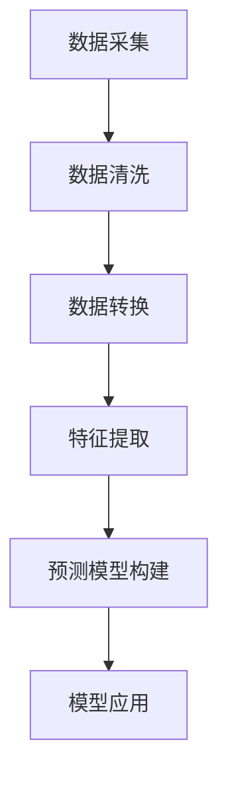

                 

# AI辅助海洋资源勘探：从数据分析到预测模型

## 关键词

- 海洋资源勘探
- 人工智能
- 数据分析
- 预测模型
- 机器学习
- 深度学习
- 数据可视化

## 摘要

本文将深入探讨人工智能（AI）在海洋资源勘探中的应用，特别是数据分析、预测模型的构建以及实际应用案例。随着科技的进步，AI技术正在改变传统的勘探方式，通过高效的 数据分析 和预测模型，海洋资源勘探变得更加精准和高效。本文将首先介绍海洋资源的重要性，然后逐步分析AI技术的基本概念及其在勘探中的应用，随后详细介绍数据分析的方法和工具，以及预测模型的构建过程。通过实际应用案例，我们将展示AI技术在海洋资源勘探中的巨大潜力，并探讨未来发展的趋势和面临的挑战。

## 目录大纲

### 第一部分：AI辅助海洋资源勘探的基础知识

#### 第1章：海洋资源勘探概述

1.1 海洋资源的重要性

- 海洋资源的分类
- 海洋资源对人类的影响

1.2 AI在海洋资源勘探中的应用

- AI技术的基本概念
- AI技术在海洋勘探中的优势

1.3 数据分析在海洋资源勘探中的应用

- 数据采集和处理
- 数据可视化分析

1.4 海洋资源勘探的挑战与AI的潜力

- 勘探过程中的问题
- AI技术的未来展望

### 第二部分：数据分析方法与工具

#### 第2章：数据预处理

2.1 数据采集与清洗

- 数据源的选择
- 数据清洗方法

2.2 数据转换与归一化

- 数据转换技术
- 归一化方法

2.3 特征提取与选择

- 特征提取方法
- 特征选择策略

#### 第3章：机器学习算法

3.1 监督学习算法

- 线性回归
- 决策树

3.2 无监督学习算法

- 聚类分析
- 主成分分析

3.3 深度学习算法

- 卷积神经网络
- 循环神经网络

3.4 算法比较与选择

- 算法的优缺点
- 选择依据

### 第三部分：预测模型构建

#### 第4章：时间序列预测

4.1 时间序列分析

- 基本概念
- 趋势分析

4.2 季节性分析

- 季节性模型
- 季节性调整

4.3 预测模型构建

- 建模方法
- 预测结果评估

#### 第5章：空间数据分析

5.1 空间数据分析

- 基本概念
- 空间数据可视化

5.2 空间预测模型

- 地理信息系统
- 空间插值方法

5.3 模型优化与调参

- 参数调整
- 模型验证

### 第四部分：AI辅助海洋资源勘探应用案例

#### 第6章：海洋石油勘探案例

6.1 案例背景

- 勘探区域
- 数据来源

6.2 数据分析

- 数据预处理
- 特征提取

6.3 模型构建

- 模型选择
- 模型训练

6.4 模型应用

- 预测结果分析
- 决策支持

#### 第7章：海洋渔业资源管理案例

7.1 案例背景

- 渔业资源现状
- 数据来源

7.2 数据分析

- 数据预处理
- 特征提取

7.3 模型构建

- 模型选择
- 模型训练

7.4 模型应用

- 预测结果分析
- 渔业资源管理策略

### 第五部分：未来展望与挑战

#### 第8章：AI辅助海洋资源勘探的未来

8.1 技术发展趋势

- 新算法
- 新工具

8.2 数据伦理与隐私保护

- 数据安全
- 隐私问题

8.3 挑战与机遇

- 技术瓶颈
- 应用前景

## 附录

- 附录A：常用工具与资源

A.1 数据分析工具

A.2 机器学习框架

A.3 地理信息系统软件

### Mermaid 流程图

接下来，我们将深入第一部分，详细探讨AI辅助海洋资源勘探的基础知识，包括海洋资源的重要性、AI技术的应用、数据分析在勘探中的角色，以及AI技术在勘探中的挑战和潜力。通过这些内容，我们将为后续的深入讨论打下坚实的基础。

