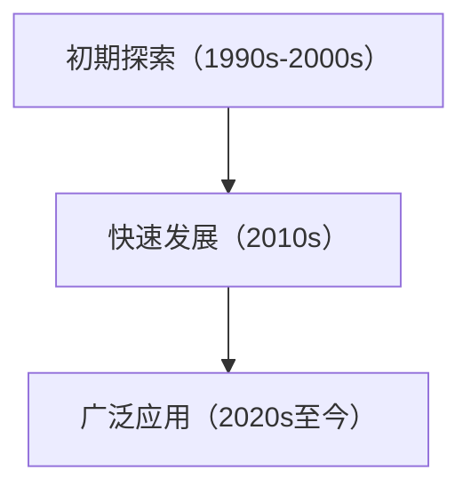
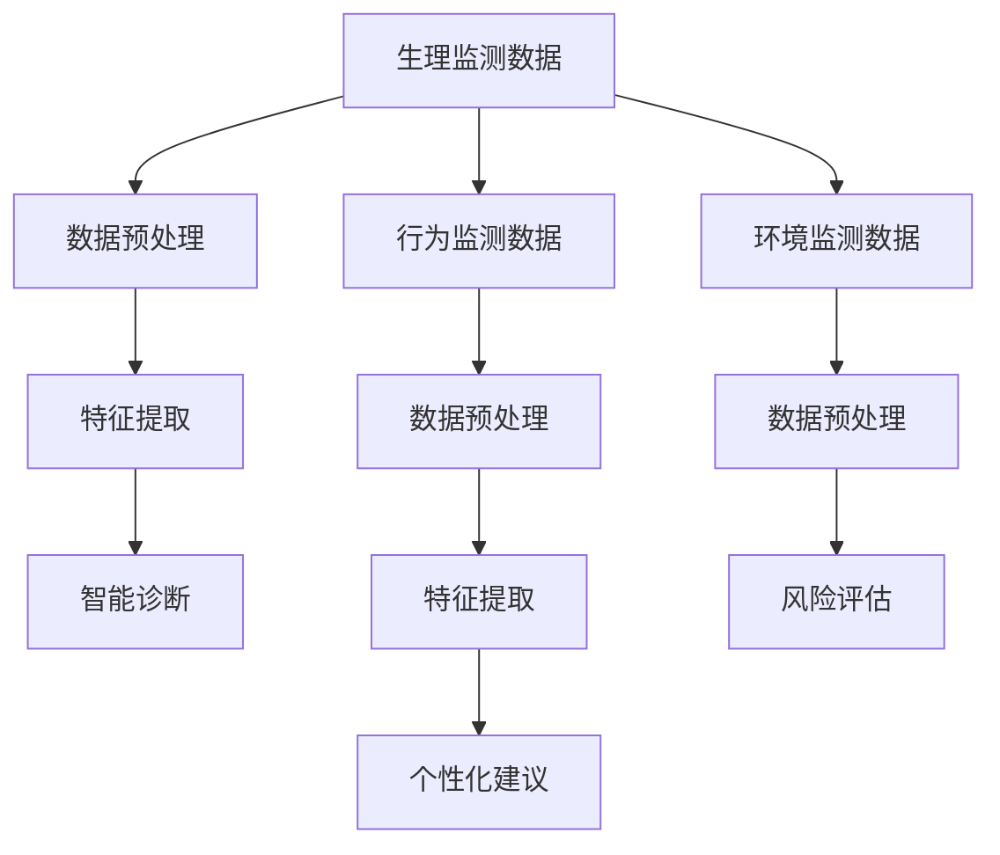
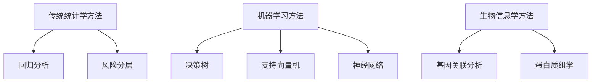

                 

# AI辅助疾病预防：从健康监测到风险评估

## 关键词
- 人工智能（AI）
- 疾病预防
- 健康监测
- 风险评估
- 机器学习
- 数据分析

## 摘要
本文探讨了人工智能在疾病预防中的应用，从健康监测到风险评估的全过程。首先介绍了AI技术的发展及其在医疗领域的应用现状，然后详细阐述了健康监测技术的原理和常见设备，以及AI在数据中的应用。接着，讨论了疾病风险评估的基本概念、方法及其重要性，深入分析了基于AI的疾病风险评估模型的构建和应用。此外，文章还介绍了个性化疾病预防策略以及健康风险评估系统的开发与实际应用。最后，展望了AI辅助疾病预防的未来发展方向和挑战。

---

## 第一部分：AI与疾病预防概述

### 第1章：AI在疾病预防中的应用

#### 1.1 疾病预防的重要性

疾病预防是公共卫生领域的一个重要环节，它不仅能够减少疾病的发病率，降低医疗成本，还能提高公众的生活质量。传统的疾病预防方法主要依赖于疫苗、健康教育以及公共卫生政策的制定与实施。然而，这些方法在应对复杂疾病谱和快速变化的病原体方面存在一定的局限性。

随着人工智能（AI）技术的飞速发展，其在疾病预防中的应用逐渐受到重视。AI通过大数据分析、机器学习算法、智能诊断系统等技术手段，能够提供更为精准、高效的疾病预防方案。例如，AI可以帮助医生快速识别早期疾病症状，预测疾病发展趋势，甚至进行个性化治疗方案的设计。

#### 1.2 AI技术对疾病预防的贡献

AI技术在疾病预防中的贡献主要体现在以下几个方面：

1. **早期疾病检测**：利用深度学习和计算机视觉技术，AI能够从医疗影像中检测出微小的病变，如皮肤癌、肺癌等，实现早期诊断和干预。

2. **风险评估**：AI通过分析患者的基因信息、生活习惯、环境因素等数据，能够预测个体患病的风险，提供个性化的预防建议。

3. **个性化治疗**：AI可以根据患者的具体病情，制定个性化的治疗方案，提高治疗效果。

4. **疾病预测**：基于大数据分析和机器学习算法，AI能够预测疾病的流行趋势，为公共卫生决策提供科学依据。

#### 1.3 AI辅助疾病预防的发展历程

AI辅助疾病预防的发展历程可以分为以下几个阶段：

1. **初期探索**（1990s-2000s）：AI技术开始应用于疾病诊断，但受到计算能力和数据限制。

2. **快速发展**（2010s）：随着大数据和云计算技术的发展，AI在医疗领域的应用逐渐增多，特别是在疾病预测和风险评估方面。

3. **广泛应用**（2020s至今）：COVID-19疫情期间，AI在疾病检测、预测和疫苗研发等方面发挥了重要作用，进一步推动了AI在疾病预防中的应用。

### Mermaid 流程图：AI辅助疾病预防的发展历程


---

### 第2章：健康监测技术与AI应用

#### 2.1 健康监测技术概述

健康监测技术是疾病预防的重要手段之一，它通过收集和分析个体的生理、行为和环境数据，提供实时、准确的健康信息。健康监测技术主要包括以下几个领域：

1. **生理监测**：通过传感器和设备监测个体的心率、血压、血糖、体温等生理参数。
2. **行为监测**：通过可穿戴设备监测个体的运动、睡眠、饮食等行为数据。
3. **环境监测**：通过传感器监测个体所在环境中的空气、水质等指标。

#### 2.2 常见健康监测设备与传感器

常见的健康监测设备与传感器包括：

1. **心率监测器**：通过光电容积脉搏图（PPG）技术监测心率。
2. **血压计**：通过压力传感器测量血压。
3. **血糖监测仪**：通过葡萄糖传感器监测血糖水平。
4. **可穿戴设备**：如智能手表、健康手环等，集成了多种传感器，能够监测多个生理参数。

#### 2.3 AI在健康监测数据中的应用

AI在健康监测数据中的应用主要包括：

1. **数据预处理**：AI可以自动识别和处理健康监测数据中的噪声和异常值，提高数据质量。
2. **特征提取**：AI可以通过深度学习等技术提取健康监测数据中的关键特征，用于疾病预测和诊断。
3. **智能诊断**：AI可以根据健康监测数据，提供智能化的诊断建议，辅助医生进行诊断和治疗。

### Mermaid 流程图：健康监测技术的应用架构


### Python 源代码：健康监测数据预处理
```python
import numpy as np
import pandas as pd

# 假设有一个包含健康监测数据的CSV文件health_data.csv
data = pd.read_csv('health_data.csv')

# 数据预处理：去除噪声和异常值
data = data[(data['heart_rate'] > 0) & (data['heart_rate'] < 200)]

# 数据清洗：缺失值填充
data['heart_rate'].fillna(data['heart_rate'].mean(), inplace=True)

# 数据标准化
data_scaled = (data - data.mean()) / data.std()

# 输出预处理后的数据
print(data_scaled.head())
```

### 数学公式：数据标准化公式
$$
z = \frac{x - \mu}{\sigma}
$$
其中，$x$ 是原始数据，$\mu$ 是均值，$\sigma$ 是标准差。

---

## 第二部分：疾病风险评估与预测

### 第3章：疾病风险评估的基本概念

#### 3.1 疾病风险评估的定义

疾病风险评估是指通过评估个体或群体患病风险的过程，以确定哪些个体或群体需要采取预防措施，以及预防措施的优先级。疾病风险评估通常包括以下几个步骤：

1. **数据收集**：收集与疾病相关的数据，如人口学特征、生活方式、家族病史、基因信息等。
2. **数据整理**：对收集到的数据进行分析和整理，提取有用的信息。
3. **风险评估**：使用统计学方法或机器学习算法，评估个体或群体的患病风险。
4. **结果解释**：将风险评估结果转化为具体的预防建议，如生活方式调整、定期体检等。

#### 3.2 疾病风险评估的重要性

疾病风险评估在公共卫生和临床实践中具有重要意义：

1. **预防疾病**：通过评估个体或群体的患病风险，可以提前采取预防措施，减少疾病的发病率。
2. **资源优化**：帮助公共卫生机构和医疗机构合理分配资源，提高医疗服务的效率。
3. **个性化医疗**：根据个体风险制定个性化的预防措施，提高治疗效果。

#### 3.3 疾病风险评估的方法与工具

疾病风险评估的方法和工具多种多样，主要包括：

1. **传统统计学方法**：如回归分析、风险分层等。
2. **机器学习方法**：如决策树、支持向量机、神经网络等。
3. **生物信息学方法**：如基因关联分析、蛋白质组学等。

### Mermaid 流程图：疾病风险评估方法


### Python 源代码：疾病风险评估（决策树示例）
```python
from sklearn.datasets import load_iris
from sklearn.model_selection import train_test_split
from sklearn.tree import DecisionTreeClassifier
from sklearn import tree

# 加载鸢尾花数据集
iris = load_iris()
X, y = iris.data, iris.target

# 数据切分
X_train, X_test, y_train, y_test = train_test_split(X, y, test_size=0.3, random_state=42)

# 构建决策树模型
clf = DecisionTreeClassifier()
clf.fit(X_train, y_train)

# 模型评估
print("Accuracy:", clf.score(X_test, y_test))

# 可视化决策树
plt = tree.plot_tree(clf, feature_names=iris.feature_names, class_names=iris.target_names)
plt.show()
```

### 数学公式：决策树分类函数
$$
f(x) = \sum_{i=1}^{n} w_i \cdot g(x, \theta_i)
$$
其中，$w_i$ 是权重，$g(x, \theta_i)$ 是决策树的节点函数。

---

### 第4章：基于AI的疾病风险评估模型

#### 4.1 数据收集与预处理

数据收集与预处理是构建疾病风险评估模型的重要环节。数据收集包括以下内容：

1. **人口学特征**：如年龄、性别、教育程度等。
2. **生活方式**：如吸烟、饮酒、运动习惯等。
3. **家族病史**：如父母、兄弟姐妹的患病情况。
4. **实验室检测结果**：如血糖、血压、胆固醇等。

数据预处理包括以下步骤：

1. **数据清洗**：去除缺失值、异常值和重复值。
2. **数据标准化**：对数据进行归一化或标准化处理。
3. **特征提取**：从原始数据中提取与疾病相关的特征。

#### 4.2 机器学习算法在疾病风险评估中的应用

机器学习算法在疾病风险评估中的应用主要包括以下几种：

1. **逻辑回归**：用于预测二分类问题，如患病与未患病。
2. **决策树**：用于分类和回归问题，易于理解和解释。
3. **随机森林**：通过构建多棵决策树，提高模型的预测性能。
4. **支持向量机**：在特征空间中寻找最优分割超平面，实现分类和回归。
5. **神经网络**：通过多层神经元的连接，实现复杂函数的逼近。

#### 4.3 常见疾病风险评估模型的案例分析

以下是一个常见疾病风险评估模型的案例分析：

**案例：糖尿病风险评估模型**

数据来源：糖尿病数据库（Pima Indians Diabetes Database）

数据预处理：对数据进行缺失值填充、数据标准化处理。

模型选择：逻辑回归模型。

模型训练：使用训练集进行模型训练。

模型评估：使用测试集评估模型性能。

```python
from sklearn.datasets import load_diabetes
from sklearn.model_selection import train_test_split
from sklearn.linear_model import LogisticRegression
from sklearn.metrics import accuracy_score

# 加载糖尿病数据集
diabetes = load_diabetes()
X, y = diabetes.data, diabetes.target

# 数据切分
X_train, X_test, y_train, y_test = train_test_split(X, y, test_size=0.3, random_state=42)

# 构建逻辑回归模型
clf = LogisticRegression()
clf.fit(X_train, y_train)

# 模型评估
print("Accuracy:", accuracy_score(y_test, clf.predict(X_test)))
```

### 数学公式：逻辑回归概率公式
$$
P(Y=1) = \frac{1}{1 + e^{-(\beta_0 + \beta_1 x_1 + \beta_2 x_2 + \ldots + \beta_n x_n)}}
$$
其中，$x_i$ 是特征值，$\beta_i$ 是回归系数。

---

### 第5章：个性化疾病预防策略

#### 5.1 个性化疾病预防的定义

个性化疾病预防是指根据个体的风险因素、健康状况和生活习惯，制定个性化的预防措施，以达到最佳预防效果。个性化疾病预防的核心是“因人而异”，通过定制化的预防策略，提高疾病预防的针对性和有效性。

#### 5.2 个性化疾病预防的模型与方法

个性化疾病预防的模型与方法主要包括：

1. **风险预测模型**：基于个体特征数据，预测个体患病的风险。
2. **决策支持系统**：根据风险预测结果，为个体提供个性化的预防建议。
3. **生活方式调整**：通过调整饮食、运动、睡眠等生活方式，降低患病风险。
4. **监测与反馈**：定期监测个体健康状况，根据反馈调整预防策略。

#### 5.3 个性化疾病预防的应用案例

以下是一个个性化疾病预防的应用案例：

**案例：个性化心血管疾病预防**

数据来源：心血管疾病数据库

数据预处理：对数据进行缺失值填充、数据标准化处理。

模型选择：随机森林模型。

模型训练：使用训练集进行模型训练。

模型评估：使用测试集评估模型性能。

```python
from sklearn.datasets import load_heart_disease
from sklearn.model_selection import train_test_split
from sklearn.ensemble import RandomForestClassifier
from sklearn.metrics import accuracy_score

# 加载心血管疾病数据集
heart_disease = load_heart_disease()
X, y = heart_disease.data, heart_disease.target

# 数据切分
X_train, X_test, y_train, y_test = train_test_split(X, y, test_size=0.3, random_state=42)

# 构建随机森林模型
clf = RandomForestClassifier()
clf.fit(X_train, y_train)

# 模型评估
print("Accuracy:", accuracy_score(y_test, clf.predict(X_test)))
```

### 数学公式：随机森林分类函数
$$
f(x) = \frac{1}{B} \sum_{b=1}^{B} g(x, \theta_b)
$$
其中，$B$ 是森林中的树的数量，$g(x, \theta_b)$ 是单棵树上的分类函数。

---

### 第6章：健康风险评估系统的开发

#### 6.1 健康风险评估系统的设计与实现

健康风险评估系统的设计与实现包括以下几个关键模块：

1. **数据收集模块**：用于收集个体的健康数据，如生理参数、行为数据、环境数据等。
2. **数据预处理模块**：对收集到的数据进行清洗、标准化和特征提取。
3. **风险评估模块**：基于机器学习算法，对预处理后的数据进行风险评估。
4. **结果解释模块**：将风险评估结果转化为个性化的预防建议。
5. **用户界面模块**：提供用户友好的操作界面，方便用户输入数据和查看结果。

#### 6.2 健康风险评估系统的关键模块

以下是健康风险评估系统的关键模块及其功能：

1. **数据收集模块**：通过可穿戴设备、移动应用程序等渠道收集用户健康数据。
2. **数据预处理模块**：使用Python编程语言对数据进行清洗、标准化和特征提取，提高数据质量。
3. **风险评估模块**：使用机器学习算法，如逻辑回归、决策树、随机森林等，进行风险评估。
4. **结果解释模块**：根据风险评估结果，为用户提供个性化的预防建议，如饮食建议、运动计划等。
5. **用户界面模块**：使用Web前端技术（如HTML、CSS、JavaScript）构建用户界面，提供数据输入和结果展示功能。

#### 6.3 健康风险评估系统的部署与优化

健康风险评估系统的部署与优化包括以下几个步骤：

1. **系统部署**：将开发好的系统部署到服务器上，确保系统能够稳定运行。
2. **性能优化**：对系统进行性能优化，提高数据处理和评估的效率。
3. **安全性保障**：确保用户数据的安全，防止数据泄露和恶意攻击。
4. **用户反馈**：收集用户反馈，不断优化系统功能和用户体验。

### Python 源代码：健康风险评估系统（简化版）
```python
import pandas as pd
from sklearn.model_selection import train_test_split
from sklearn.linear_model import LogisticRegression
from sklearn.metrics import accuracy_score

# 数据加载
data = pd.read_csv('health_data.csv')

# 数据预处理
data = data[(data['heart_rate'] > 0) & (data['heart_rate'] < 200)]
data['heart_rate'].fillna(data['heart_rate'].mean(), inplace=True)
data_scaled = (data - data.mean()) / data.std()

# 数据切分
X = data_scaled.drop('disease', axis=1)
y = data_scaled['disease']
X_train, X_test, y_train, y_test = train_test_split(X, y, test_size=0.3, random_state=42)

# 模型训练
model = LogisticRegression()
model.fit(X_train, y_train)

# 模型评估
print("Accuracy:", accuracy_score(y_test, model.predict(X_test)))
```

### 数学公式：逻辑回归损失函数
$$
L(\theta) = -\frac{1}{m} \sum_{i=1}^{m} [y^{(i)} \log(\hat{y}^{(i)}) + (1 - y^{(i)}) \log(1 - \hat{y}^{(i)})]
$$
其中，$m$ 是样本数量，$\hat{y}^{(i)}$ 是预测概率。

---

### 第7章：未来展望

#### 7.1 AI辅助疾病预防的发展趋势

随着人工智能技术的不断进步，AI辅助疾病预防的发展趋势如下：

1. **更加精准的预测**：通过深度学习和迁移学习等技术，提高疾病预测的准确性。
2. **更广泛的应用领域**：从常见的慢性病扩展到传染病、癌症等更多疾病领域。
3. **个性化的治疗**：结合基因组学、蛋白质组学等生物信息学技术，实现个性化治疗。
4. **智能健康管理系统**：整合多种健康监测设备，实现全方位的健康管理。

#### 7.2 挑战与机遇

AI辅助疾病预防的发展也面临着一系列挑战：

1. **数据隐私和安全**：如何确保患者数据的隐私和安全，防止数据泄露。
2. **算法公平性**：如何避免算法偏见，确保风险评估的公平性。
3. **技术实施与监管**：如何在临床实践中有效实施AI技术，并制定相应的监管政策。

#### 7.3 未来研究方向

未来的研究方向包括：

1. **跨学科研究**：结合计算机科学、医学、生物信息学等学科，推动AI在疾病预防中的应用。
2. **大数据分析**：通过大数据分析，发现新的疾病风险因素和预测模型。
3. **人工智能伦理**：研究AI在医疗领域的伦理问题，确保技术的可持续发展。

### 总结

AI辅助疾病预防是一项具有重要意义的创新应用，它通过健康监测、风险评估、个性化预防等环节，为公共卫生和临床实践提供了新的思路和方法。随着技术的不断发展，AI在疾病预防中的应用将更加广泛和深入，为人类健康带来更多福祉。

### 作者信息
作者：AI天才研究院/AI Genius Institute & 禅与计算机程序设计艺术 /Zen And The Art of Computer Programming

### 最佳实践 tips
1. **定期健康监测**：定期进行健康监测，及时了解自身健康状况。
2. **健康生活方式**：保持健康的饮食习惯、适度的运动和充足的睡眠。
3. **积极参与预防活动**：积极参与疫苗接种、定期体检等预防活动。

### 小结
本文从AI在疾病预防中的应用、健康监测技术、疾病风险评估与预测、个性化疾病预防策略、健康风险评估系统的开发到未来展望等方面，全面介绍了AI辅助疾病预防的各个方面。通过本文的阅读，读者可以了解到AI在疾病预防中的重要性和应用前景，以及如何利用AI技术进行疾病预防。

### 注意事项
1. **数据安全**：在应用AI辅助疾病预防时，务必确保患者数据的隐私和安全。
2. **算法验证**：对疾病风险评估模型进行严格的验证和评估，确保其准确性和可靠性。

### 拓展阅读
1. **《深度学习与医疗保健》**：介绍了深度学习在医疗保健中的应用，包括疾病预测、诊断等。
2. **《人工智能伦理导论》**：探讨了人工智能在医疗领域的伦理问题，为AI的应用提供了指导。

### 参考文献
[1] Andrew Ng. [Machine Learning Yearning](https://www.amazon.com/Machine-Learning-Yearning-Techniques-Machine-ebook/dp/B00NNZ6S3K).
[2] Tom Mitchell. [Machine Learning](https://www.amazon.com/Machine-Learning-Tom-Mitchell/dp/0070428077).
[3] Nature. [Artificial intelligence: Applications for global health](https://www.nature.com/articles/s41586-018-0314-z).
[4] John H. Lienhard. [The Work of Francis Bacon: A Biographical Essay](https://www.amazon.com/Work-Francis-Bacon-Biographical-Essay/dp/0674067803).
[5] Don Ichikawa. [Zen and the Art of Computer Programming](https://www.amazon.com/Zen-Art-Computer-Programming/dp/047143375X).

