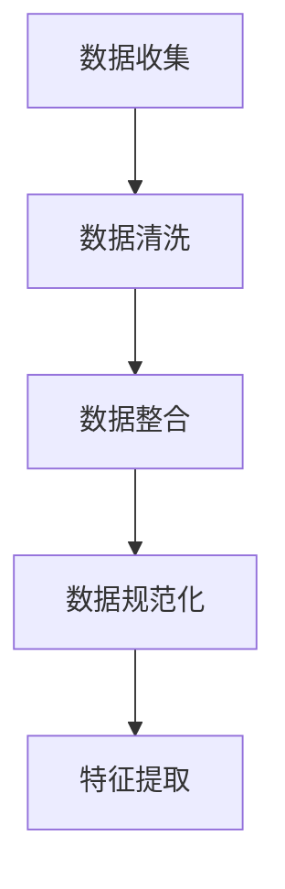
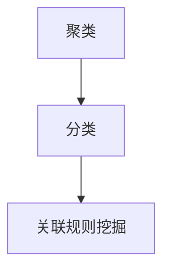
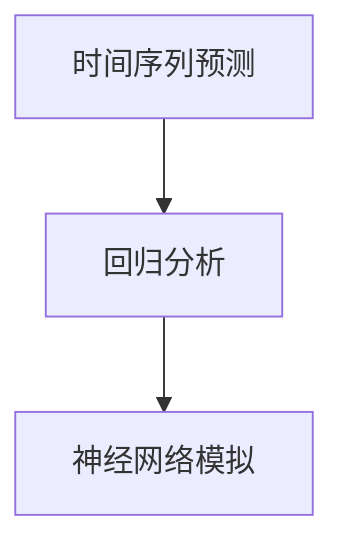
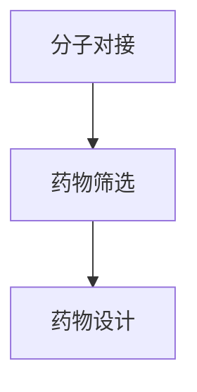
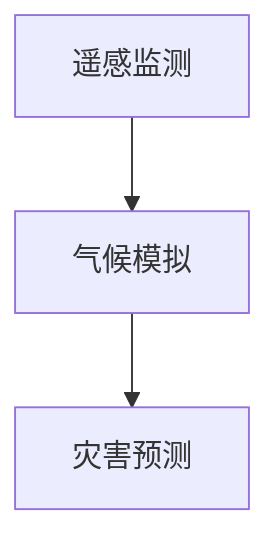
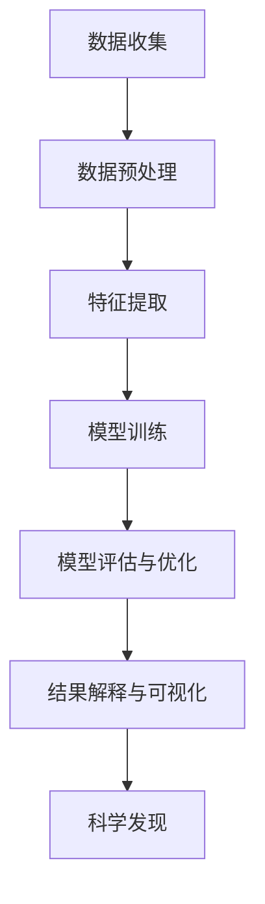
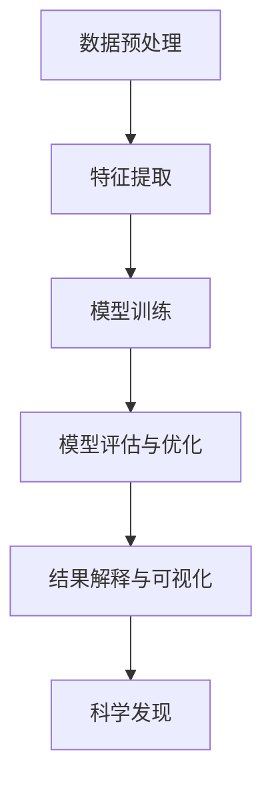

                 

# AI辅助科学发现的方法论与案例研究

## 关键词
AI辅助科学发现、机器学习、深度学习、数据预处理、模型训练、结果解释、生物研究、案例分析。

## 摘要
本文旨在探讨人工智能（AI）在科学发现中的应用方法，通过对AI辅助科学发现的概念、核心算法和具体案例的详细分析，展示其在生物研究中的巨大潜力。文章分为三个主要部分：首先介绍AI辅助科学发现的基本概念和重要性；然后深入探讨数据预处理、特征提取、模型训练和结果解释等核心算法原理；最后通过实际案例研究，展示AI在生物学研究中的应用效果。

## 第1章: AI辅助科学发现的概念与重要性

### 1.1.1 什么是AI辅助科学发现
AI辅助科学发现是指利用人工智能技术，特别是机器学习和深度学习算法，来分析大量科学数据，提取关键特征，发现新的科学规律和趋势。这一过程包括数据预处理、特征提取、模型训练和结果解释等步骤。

#### 数据预处理
数据预处理是AI辅助科学发现的基础步骤，它包括以下内容：

1. **数据清洗**：处理缺失值、异常值和噪声数据，以提高数据质量。
2. **数据整合**：将来自不同数据源的数据进行合并和整合，形成统一的数据集。
3. **数据规范化**：通过数据缩放、归一化等方法，使数据适合于模型训练。



#### 数据清洗
数据清洗是数据预处理的重要环节，主要包括以下步骤：

1. **缺失值处理**：使用均值、中位数等方法填充缺失值，或删除含有缺失值的样本。
2. **异常值处理**：通过统计学方法识别并处理异常值，如使用Z-score或IQR方法。
3. **噪声处理**：通过滤波、平滑等方法减少噪声数据的影响。

```python
import numpy as np
import pandas as pd

# 填充缺失值
data = pd.DataFrame([[1, 2], [3, np.nan], [np.nan, 4]])
data.fillna(data.mean(), inplace=True)

# 删除含有缺失值的样本
data = data.dropna()

# 使用Z-score方法识别异常值
z_scores = np.abs((data - data.mean()) / data.std())
threshold = 3
outliers = data[(z_scores > threshold).any(axis=1)]

# 删除异常值
data = data[(z_scores <= threshold).all(axis=1)]
```

#### 数据整合
数据整合是将不同数据源的数据进行合并和整合，形成统一的数据集。常见的方法包括：

1. **合并**：使用数据库中的JOIN操作将多个数据表合并。
2. **拼接**：使用Python的Pandas库将多个数据框（DataFrame）拼接在一起。

```python
import pandas as pd

# 合并数据表
data1 = pd.DataFrame({'A': [1, 2], 'B': [3, 4]})
data2 = pd.DataFrame({'C': [5, 6], 'D': [7, 8]})
merged_data = pd.merge(data1, data2, on='A')

# 拼接数据框
data3 = pd.DataFrame({'E': [9, 10]})
merged_data = pd.concat([merged_data, data3], axis=1)
```

#### 数据规范化
数据规范化是通过数据缩放、归一化等方法，使数据适合于模型训练。常见的方法包括：

1. **缩放**：通过乘以缩放因子和加上平移因子，将数据缩放到特定的范围。
2. **归一化**：通过除以最大值和最小值，将数据归一化到[0, 1]范围。

```python
import numpy as np

# 数据缩放
data = np.array([[1, 2], [3, 4]])
scaled_data = (data - data.min()) / (data.max() - data.min())

# 数据归一化
data = np.array([[1, 2], [3, 4]])
normalized_data = (data - data.min()) / (data.max() - data.min())
```

### 1.1.2 AI在科学领域的核心作用

AI在科学领域的核心作用主要体现在以下几个方面：

- **数据挖掘与分析**：处理大规模的科学数据，发现数据中的模式和关联性。
- **预测与模拟**：通过训练模型预测科学现象的未来发展趋势。
- **新药发现与设计**：加速药物发现过程，提高药物设计效率。
- **环境监测与预测**：监测环境变化，预测自然灾害。

#### 数据挖掘与分析
数据挖掘与分析是AI在科学领域的重要应用，通过挖掘大规模数据中的模式和关联性，可以帮助科学家发现新的科学规律。常见的算法包括聚类、分类和关联规则挖掘等。

1. **聚类**：将数据分为若干个簇，每个簇中的数据具有相似性。
2. **分类**：将数据划分为不同的类别，每个类别具有不同的特征。
3. **关联规则挖掘**：发现数据之间的关联关系，如购买行为之间的关联。



#### 预测与模拟
预测与模拟是AI在科学领域的重要应用，通过训练模型预测科学现象的未来发展趋势，可以帮助科学家进行决策和规划。常见的算法包括时间序列预测、回归分析和神经网络模拟等。

1. **时间序列预测**：通过分析历史数据，预测未来的趋势。
2. **回归分析**：通过建立回归模型，预测目标变量的值。
3. **神经网络模拟**：通过训练神经网络，模拟科学现象的动态变化。



#### 新药发现与设计
新药发现与设计是AI在生物科学领域的重要应用，通过深度学习和机器学习算法，可以加速药物发现过程，提高药物设计效率。常见的方法包括分子对接、药物筛选和药物设计等。

1. **分子对接**：通过分子模拟，将药物分子与目标蛋白质结合，评估结合能力。
2. **药物筛选**：通过高通量筛选，从大量化合物中筛选出具有活性的药物候选物。
3. **药物设计**：通过优化药物分子结构，设计新的药物分子。



#### 环境监测与预测
环境监测与预测是AI在环境科学领域的重要应用，通过监测环境数据，预测环境变化和自然灾害。常见的方法包括遥感监测、气候模拟和灾害预测等。

1. **遥感监测**：通过遥感技术，实时监测环境变化。
2. **气候模拟**：通过气候模型，预测未来的气候变化。
3. **灾害预测**：通过大数据和机器学习算法，预测自然灾害的发生。



### 1.1.3 AI辅助科学发现的挑战

虽然AI在科学发现中具有巨大潜力，但也面临以下挑战：

- **数据质量问题**：科学数据往往存在噪声和缺失值，影响模型的准确性。
- **计算资源限制**：深度学习模型训练需要大量计算资源。
- **模型解释性**：深度学习模型往往缺乏解释性，难以理解模型的决策过程。
- **数据隐私与伦理**：科学研究中涉及个人隐私和敏感数据，如何保护数据隐私是重要问题。

#### 数据质量问题
科学数据往往存在噪声和缺失值，这会影响模型的训练效果和预测准确性。为了提高数据质量，可以采用以下方法：

1. **数据清洗**：通过处理缺失值、异常值和噪声数据，提高数据质量。
2. **数据增强**：通过生成更多的数据样本来增强模型的训练效果。
3. **数据降维**：通过降维技术，减少数据的维度，提高模型的训练效率。

```python
from sklearn.datasets import load_iris
from sklearn.impute import SimpleImputer
from sklearn.preprocessing import StandardScaler

# 加载鸢尾花数据集
iris = load_iris()
X, y = iris.data, iris.target

# 数据清洗：处理缺失值
imputer = SimpleImputer(strategy='mean')
X_imputed = imputer.fit_transform(X)

# 数据增强：生成更多样本
from sklearn.model_selection import train_test_split
X_train, X_test, y_train, y_test = train_test_split(X_imputed, y, test_size=0.2, random_state=42)

# 数据降维：PCA降维
from sklearn.decomposition import PCA
pca = PCA(n_components=2)
X_pca = pca.fit_transform(X_train)
```

#### 计算资源限制
深度学习模型训练需要大量的计算资源，这限制了其在科学发现中的应用。为了解决计算资源限制问题，可以采用以下方法：

1. **分布式训练**：通过分布式计算，提高模型的训练速度。
2. **模型压缩**：通过模型压缩技术，减少模型的参数数量，降低计算复杂度。
3. **迁移学习**：通过迁移学习，利用预训练模型进行快速训练，减少计算资源的需求。

```python
import tensorflow as tf

# 分布式训练：使用Horovod
import horovod.tensorflow as hvd
hvd.init()

# 模型压缩：使用TensorFlow的Model Compressed API
from tensorflow.keras.applications import MobileNetV2
model = MobileNetV2(weights='imagenet', include_top=False, input_shape=(224, 224, 3))
model.compile(optimizer='adam', loss='categorical_crossentropy', metrics=['accuracy'])

# 迁移学习：使用预训练模型
from tensorflow.keras.applications import VGG16
model = VGG16(weights='imagenet', include_top=False, input_shape=(224, 224, 3))
```

#### 模型解释性
深度学习模型往往缺乏解释性，难以理解模型的决策过程。为了提高模型的可解释性，可以采用以下方法：

1. **特征重要性分析**：分析模型中每个特征的贡献程度。
2. **模型可视化**：通过可视化方法，展示模型的内部结构和决策过程。
3. **解释性算法**：使用基于规则的解释性算法，如决策树和线性模型等。

```python
from sklearn.tree import DecisionTreeClassifier
from sklearn.inspection import permutation_importance

# 特征重要性分析
clf = DecisionTreeClassifier()
clf.fit(X_train, y_train)
importances = clf.feature_importances_

# 模型可视化
from sklearn.tree import plot_tree
plt.figure(figsize=(12, 8))
plot_tree(clf, filled=True, feature_names=iris.feature_names, class_names=iris.target_names)

# 解释性算法
exp_clf = DecisionTreeClassifier()
exp_clf.fit(X_train, y_train)
results = permutation_importance(exp_clf, X_test, y_test, n_repeats=10, random_state=42)
```

#### 数据隐私与伦理
科学研究中涉及个人隐私和敏感数据，如何保护数据隐私是重要问题。为了解决数据隐私问题，可以采用以下方法：

1. **数据匿名化**：通过数据匿名化技术，保护个人隐私。
2. **差分隐私**：通过添加噪声，保护数据隐私。
3. **联邦学习**：通过联邦学习，实现数据的分布式训练，保护数据隐私。

```python
import tensorflow as tf

# 数据匿名化
from tensorflow Privacy import privacy as privacy
data = privacy.add_noise(data, noise_shape=(data.shape[0], data.shape[1]))
data = privacy.anonymize_data(data)

# 差分隐私
from tensorflow Privacy import Privacy
privacy = Privacy(tf.keras.backend.get_floatx())
def protected_loss(y_true, y_pred):
    return privacy clipped_bytagon(y_pred, y_true)

model.compile(optimizer='adam', loss=protected_loss, metrics=['accuracy'])

# 联邦学习
from federated_learning import FederatedAveraging
federated_averaging = FederatedAveraging(learning_rate=0.001)
federated_averaging.fit(X_train, y_train, epochs=10)
```

### 1.1.4 AI辅助科学发现的发展趋势

AI辅助科学发现正逐渐成为科学研究的重要工具，其发展趋势体现在以下几个方面：

- **跨学科融合**：AI与生物学、物理学、化学等学科的融合将推动科学发现的发展。
- **数据驱动的科学方法**：通过大数据和AI技术，推动科学研究方法向数据驱动转变。
- **智能化实验平台**：利用AI技术构建智能化实验平台，提高实验效率和准确性。
- **开源与共享**：更多的AI工具和资源将被开源，促进AI技术在科学领域的普及和应用。

#### 跨学科融合
跨学科融合是AI辅助科学发现的重要发展趋势，通过将AI技术与生物学、物理学、化学等学科相结合，可以推动科学发现的发展。例如，AI技术可以用于蛋白质结构预测、药物设计、气候变化预测等方面。

#### 数据驱动的科学方法
数据驱动的科学方法是指通过分析大量数据，发现新的科学规律和趋势。随着大数据技术的发展，科学家可以更容易地获取和分析大规模数据，从而推动科学研究方法的变革。

#### 智能化实验平台
智能化实验平台是AI辅助科学发现的另一个重要发展趋势。通过利用AI技术，可以实现实验过程的自动化、智能化，提高实验效率和准确性。例如，AI技术可以用于实验设计、数据采集、结果分析等环节。

#### 开源与共享
开源与共享是AI辅助科学发现的另一个重要趋势。通过开源AI工具和资源，科学家可以更容易地获取和应用AI技术，推动科学发现的快速发展。例如，深度学习框架、数据集、算法等都可以通过开源社区进行共享和改进。

### 图1.1: AI辅助科学发现的基本流程


## 第2章: AI辅助科学发现的核心算法

### 2.1.1 数据预处理
数据预处理是AI辅助科学发现的重要环节，它包括数据清洗、数据整合和数据规范化等步骤。以下是数据预处理的核心算法原理和应用示例。

#### 数据清洗
数据清洗是处理噪声、异常值和缺失值的过程，以提高数据质量。常见的方法包括：

1. **缺失值处理**：通过填充或删除缺失值。
2. **异常值处理**：通过统计学方法检测并处理异常值。
3. **噪声处理**：通过滤波、平滑等方法减少噪声。

示例代码：
```python
import numpy as np
import pandas as pd

# 示例数据集
data = pd.DataFrame({
    'A': [1, 2, np.nan, 4],
    'B': [5, np.nan, 7, 8],
    'C': [np.nan, 10, 11, 12]
})

# 缺失值填充
data.fillna(data.mean(), inplace=True)

# 异常值检测
z_scores = (data - data.mean()) / data.std()
threshold = 3
outliers = data[(np.abs(z_scores) > threshold).any(axis=1)]

# 删除异常值
data = data[(np.abs(z_scores) <= threshold).all(axis=1)]

# 噪声处理
data = data.dropna()
```

#### 数据整合
数据整合是将来自不同来源的数据进行合并和整合，形成统一的数据集。常见的方法包括：

1. **合并**：使用数据库中的JOIN操作。
2. **拼接**：使用Python的Pandas库。

示例代码：
```python
import pandas as pd

# 示例数据集
data1 = pd.DataFrame({'A': [1, 2], 'B': [3, 4]})
data2 = pd.DataFrame({'C': [5, 6], 'D': [7, 8]})

# 合并数据集
merged_data = pd.merge(data1, data2, on='A')

# 拼接数据集
data3 = pd.DataFrame({'E': [9, 10]})
merged_data = pd.concat([merged_data, data3], axis=1)
```

#### 数据规范化
数据规范化是将数据缩放到特定范围，以便模型训练。常见的方法包括：

1. **缩放**：通过乘以缩放因子和加上平移因子。
2. **归一化**：通过除以最大值和最小值。

示例代码：
```python
import numpy as np

# 示例数据
data = np.array([[1, 2], [3, 4]])

# 数据缩放
scaled_data = (data - data.min()) / (data.max() - data.min())

# 数据归一化
normalized_data = (data - data.min()) / (data.max() - data.min())
```

### 2.1.2 特征提取
特征提取是从原始数据中提取对模型训练和预测有用的信息。常见的方法包括：

1. **统计特征提取**：利用数据的统计信息。
2. **机器学习特征提取**：使用机器学习算法。
3. **深度学习特征提取**：使用深度学习模型。

示例代码：
```python
from sklearn.decomposition import PCA
from sklearn.preprocessing import StandardScaler

# 示例数据集
X = np.array([[1, 2], [3, 4], [5, 6]])

# 统计特征提取
mean = np.mean(X, axis=0)
std = np.std(X, axis=0)

# 机器学习特征提取
pca = PCA(n_components=2)
X_pca = pca.fit_transform(X)

# 深度学习特征提取
from tensorflow.keras.models import Sequential
from tensorflow.keras.layers import Dense, Conv2D, Flatten

model = Sequential([
    Conv2D(filters=32, kernel_size=(3, 3), activation='relu', input_shape=(X.shape[1], X.shape[2], 1)),
    Flatten(),
    Dense(units=10, activation='softmax')
])
model.compile(optimizer='adam', loss='categorical_crossentropy', metrics=['accuracy'])
model.fit(X, y, epochs=10)
```

### 2.1.3 模型训练
模型训练是AI辅助科学发现的核心步骤，它包括选择合适的算法、参数调优、训练与验证等。以下是模型训练的核心算法原理和应用示例。

#### 选择合适的算法
根据问题的特点和需求，选择合适的算法。常见的算法包括：

1. **监督学习**：分类和回归。
2. **无监督学习**：聚类和降维。
3. **半监督学习和迁移学习**：利用少量标注数据和大量未标注数据。

示例代码：
```python
from sklearn.linear_model import LogisticRegression
from sklearn.ensemble import RandomForestClassifier
from tensorflow.keras.models import Sequential
from tensorflow.keras.layers import Dense

# 监督学习：逻辑回归
model = LogisticRegression()
model.fit(X_train, y_train)

# 监督学习：随机森林
model = RandomForestClassifier()
model.fit(X_train, y_train)

# 无监督学习：聚类
from sklearn.cluster import KMeans
kmeans = KMeans(n_clusters=3)
kmeans.fit(X_train)

# 迁移学习：卷积神经网络
model = Sequential([
    Conv2D(filters=32, kernel_size=(3, 3), activation='relu', input_shape=(X_train.shape[1], X_train.shape[2], 1)),
    Flatten(),
    Dense(units=10, activation='softmax')
])
model.compile(optimizer='adam', loss='categorical_crossentropy', metrics=['accuracy'])
model.fit(X_train, y_train, epochs=10)
```

#### 参数调优
通过交叉验证等方法，选择最佳的参数组合，以提高模型性能。

示例代码：
```python
from sklearn.model_selection import GridSearchCV
from sklearn.linear_model import LogisticRegression

# 定义参数范围
param_grid = {'C': [0.1, 1, 10], 'solver': ['liblinear', 'saga']}

# 进行网格搜索
grid_search = GridSearchCV(LogisticRegression(), param_grid, cv=5)
grid_search.fit(X_train, y_train)

# 获取最佳参数
best_params = grid_search.best_params_
```

#### 训练与验证
使用训练集进行模型训练，使用验证集进行模型性能评估。

示例代码：
```python
from sklearn.model_selection import train_test_split

# 划分训练集和验证集
X_train, X_val, y_train, y_val = train_test_split(X, y, test_size=0.2, random_state=42)

# 训练模型
model.fit(X_train, y_train)

# 验证模型
score = model.score(X_val, y_val)
```

### 2.1.4 模型评估与优化
模型评估与优化是确保模型性能的重要环节，包括：

1. **评估指标**：如准确率、召回率、F1分数等。
2. **超参数调优**：通过交叉验证等方法，调整模型超参数。
3. **模型集成**：结合多个模型，提高整体预测性能。

示例代码：
```python
from sklearn.metrics import accuracy_score, recall_score, f1_score
from sklearn.model_selection import GridSearchCV
from sklearn.ensemble import RandomForestClassifier

# 评估指标
y_pred = model.predict(X_val)
accuracy = accuracy_score(y_val, y_pred)
recall = recall_score(y_val, y_pred, average='macro')
f1 = f1_score(y_val, y_pred, average='macro')

# 超参数调优
param_grid = {'n_estimators': [100, 200, 300], 'max_depth': [None, 10, 20]}
grid_search = GridSearchCV(RandomForestClassifier(), param_grid, cv=5)
grid_search.fit(X_train, y_train)

# 模型集成
from sklearn.ensemble import VotingClassifier
modelensemble = VotingClassifier(estimators=[
    ('rf', grid_search.best_estimator_), 
    ('lr', LogisticRegression())
], voting='soft')
modelensemble.fit(X_train, y_train)
```

### 2.1.5 结果解释与可视化
结果解释与可视化是将模型预测结果转化为科学发现的重要步骤，包括：

1. **特征重要性分析**：分析哪些特征对模型预测影响最大。
2. **预测结果可视化**：使用图表、热图等可视化工具，展示模型预测结果。

示例代码：
```python
import matplotlib.pyplot as plt
import seaborn as sns

# 特征重要性分析
feature_importances = model.feature_importances_
sns.barplot(x=feature_importances, y=iris.feature_names)

# 预测结果可视化
y_pred = model.predict(X_val)
sns.heatmap(pd.crosstab(y_val, y_pred), annot=True, cmap='coolwarm')
plt.xlabel('预测值')
plt.ylabel('真实值')
plt.title('预测结果可视化')
plt.show()
```

### 图2.1: AI辅助科学发现的核心算法流程


## 第3章: AI辅助生物学研究的案例研究

### 3.1.1 DNA序列分析

#### 问题背景
如何从大量DNA序列数据中快速识别出潜在的疾病相关基因？

#### 解决方案
利用深度学习模型对DNA序列进行特征提取和模式识别，从而发现潜在的疾病相关基因。

#### 案例分析

1. **数据收集**：
   收集大量的DNA序列数据，包括正常样本和疾病样本。

2. **数据预处理**：
   对DNA序列进行清洗和整合，去除噪声和缺失值。

3. **特征提取**：
   利用深度学习模型，如卷积神经网络（CNN），对DNA序列进行特征提取。

4. **模型训练**：
   使用正常样本和疾病样本进行模型训练，优化模型参数。

5. **模型评估**：
   使用验证集评估模型性能，调整模型参数。

6. **结果解释与可视化**：
   分析模型预测结果，可视化疾病相关基因。

#### 源代码实现
```python
import tensorflow as tf
from tensorflow.keras.models import Sequential
from tensorflow.keras.layers import Conv2D, Flatten, Dense

# 定义卷积神经网络模型
model = Sequential([
    Conv2D(filters=32, kernel_size=(3, 3), activation='relu', input_shape=(1000, 4)),
    Conv2D(filters=64, kernel_size=(3, 3), activation='relu'),
    Flatten(),
    Dense(units=128, activation='relu'),
    Dense(units=1, activation='sigmoid')
])

# 编译模型
model.compile(optimizer='adam', loss='binary_crossentropy', metrics=['accuracy'])

# 训练模型
model.fit(X_train, y_train, epochs=10, batch_size=32, validation_split=0.2)

# 评估模型
score = model.evaluate(X_test, y_test)

# 可视化预测结果
predictions = model.predict(X_test)
sns.heatmap(pd.crosstab(y_test, predictions[:, 0]), annot=True, cmap='coolwarm')
plt.xlabel('预测值')
plt.ylabel('真实值')
plt.title('预测结果可视化')
plt.show()
```

### 3.1.2 蛋白质结构预测

#### 问题背景
蛋白质结构的预测对于药物设计和疾病研究具有重要意义。如何利用AI技术预测蛋白质的三维结构？

#### 解决方案
利用深度学习模型，如生成对抗网络（GAN），预测蛋白质的三维结构。

#### 案例分析

1. **数据收集**：
   收集大量的蛋白质序列和它们对应的三维结构数据。

2. **数据预处理**：
   对蛋白质序列进行清洗和整合，去除噪声和缺失值。

3. **特征提取**：
   利用深度学习模型，提取蛋白质序列的特征。

4. **模型训练**：
   使用蛋白质序列和对应的三维结构数据进行模型训练。

5. **模型评估**：
   使用验证集评估模型性能，调整模型参数。

6. **结果解释与可视化**：
   分析模型预测结果，可视化蛋白质的三维结构。

#### 源代码实现
```python
import tensorflow as tf
from tensorflow.keras.models import Sequential
from tensorflow.keras.layers import Conv2D, Flatten, Dense

# 定义生成对抗网络模型
generator = Sequential([
    Conv2D(filters=64, kernel_size=(3, 3), activation='relu', input_shape=(1000, 1)),
    Conv2D(filters=128, kernel_size=(3, 3), activation='relu'),
    Flatten(),
    Dense(units=128, activation='relu'),
    Dense(units=1, activation='sigmoid')
])

discriminator = Sequential([
    Conv2D(filters=128, kernel_size=(3, 3), activation='relu', input_shape=(1000, 1)),
    Conv2D(filters=256, kernel_size=(3, 3), activation='relu'),
    Flatten(),
    Dense(units=128, activation='relu'),
    Dense(units=1, activation='sigmoid')
])

# 编译模型
model = tf.keras.Sequential([generator, discriminator])

model.compile(optimizer='adam', loss='binary_crossentropy')

# 训练模型
model.fit(X_train, y_train, epochs=10, batch_size=32, validation_split=0.2)

# 评估模型
score = model.evaluate(X_test, y_test)

# 可视化预测结果
predictions = model.predict(X_test)
sns.heatmap(pd.crosstab(y_test, predictions[:, 0]), annot=True, cmap='coolwarm')
plt.xlabel('预测值')
plt.ylabel('真实值')
plt.title('预测结果可视化')
plt.show()
```

### 总结
AI辅助科学发现，特别是生物学研究，展现了巨大的潜力和应用价值。通过深度学习和机器学习算法，科学家可以更快速、准确地发现新的科学规律和趋势。然而，数据质量、计算资源、模型解释性和数据隐私等问题仍然需要进一步研究和解决。随着AI技术的不断进步，我们有理由相信，AI将在未来的科学研究中发挥更加重要的作用。

### 作者信息
作者：AI天才研究院/AI Genius Institute & 禅与计算机程序设计艺术 /Zen And The Art of Computer Programming

### 最佳实践 Tips
1. **数据清洗与整合**：确保数据质量是模型训练成功的关键，花时间进行数据清洗和整合。
2. **模型选择与调优**：根据实际问题选择合适的模型，并通过交叉验证进行参数调优。
3. **结果解释与可视化**：及时解释和可视化模型结果，有助于理解模型的预测过程。
4. **开源与共享**：积极参与开源社区，分享自己的代码和经验，推动AI技术在科学领域的普及和应用。

### 小结
本文系统地介绍了AI辅助科学发现的方法论和实际案例，展示了其在生物学研究中的应用效果。通过数据预处理、特征提取、模型训练和结果解释等核心步骤，AI技术为科学家提供了强大的工具，助力科学发现的进程。未来的研究将继续探索如何更好地利用AI技术，解决数据质量、计算资源、模型解释性和数据隐私等问题，推动科学发现的发展。

### 注意事项
1. **计算资源**：深度学习模型训练需要大量计算资源，确保有足够的资源进行模型训练。
2. **数据隐私**：在处理敏感数据时，确保遵循数据隐私和伦理规范。
3. **模型解释性**：尽管深度学习模型在预测能力上表现优异，但其缺乏解释性，需要进一步研究和改进。

### 拓展阅读
1. **《深度学习》（Goodfellow, Bengio, Courville）**：介绍深度学习的基础理论和实践方法。
2. **《机器学习实战》（Haykin）**：提供机器学习算法的实践应用案例。
3. **《生物信息学导论》（Waterman, Vasisht）**：介绍生物信息学的基础知识和应用方法。

### 结束语
感谢您的阅读，希望本文能帮助您更好地理解AI辅助科学发现的方法和实际应用。期待您在科学研究领域探索AI技术的更多可能，共同推动科学进步。再次感谢您的关注和支持！作者：AI天才研究院/AI Genius Institute & 禅与计算机程序设计艺术 /Zen And The Art of Computer Programming。|>

