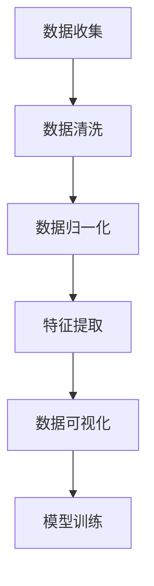
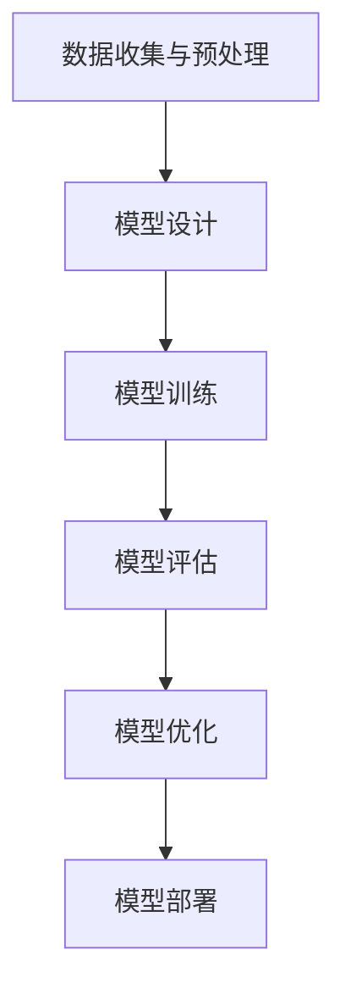
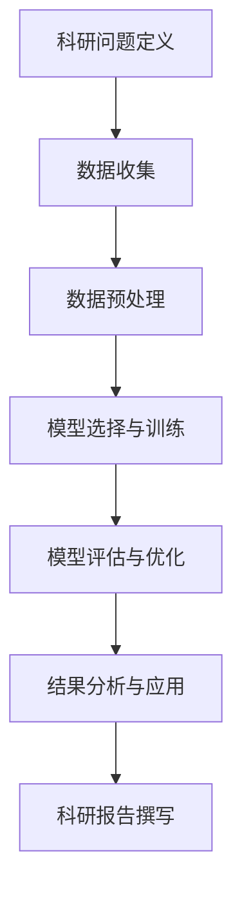

                 

# 《AI辅助科学研究：机遇与挑战》

## 关键词
人工智能，科学研究，机器学习，深度学习，技术挑战，应用案例

## 摘要
本文旨在探讨人工智能（AI）在科学研究中的应用，分析其带来的机遇与挑战。文章首先介绍了AI在科学研究中的角色和意义，随后深入剖析了AI的基础理论，包括机器学习和深度学习。接着，文章详细阐述了AI在实际科研中的应用，如数据预处理、机器学习在各个科学领域的应用以及深度学习在图像处理、语音识别和自然语言处理中的应用。随后，文章探讨了AI辅助科研面临的技术挑战，包括数据隐私与伦理问题、计算能力需求和算法优化与效率提升。最后，文章提出了AI辅助科研的未来发展趋势，并通过实际案例展示了AI在科学研究中的成功应用。

# 《AI辅助科学研究：机遇与挑战》目录大纲

## 第一部分 引言

### 1.1 AI在科学研究中的角色与意义

### 1.2 科学研究中的AI应用现状与趋势

### 1.3 本书结构安排与目标

## 第二部分 AI基础理论

### 2.1 AI概述

#### 2.1.1 AI的定义与发展历程

#### 2.1.2 AI的分类

#### 2.1.3 AI的核心技术

### 2.2 机器学习

#### 2.2.1 机器学习的基本概念

#### 2.2.2 机器学习的算法分类

#### 2.2.3 机器学习的应用领域

### 2.3 深度学习

#### 2.3.1 深度学习的基础原理

#### 2.3.2 常见的深度学习模型

#### 2.3.3 深度学习的应用场景

## 第三部分 AI辅助科研的实际应用

### 3.1 数据预处理

#### 3.1.1 数据清洗与归一化

#### 3.1.2 特征提取与选择

#### 3.1.3 数据可视化

### 3.2 机器学习在科研中的应用

#### 3.2.1 机器学习在生物信息学中的应用

#### 3.2.2 机器学习在环境科学中的应用

#### 3.2.3 机器学习在物理学中的应用

### 3.3 深度学习在科研中的应用

#### 3.3.1 深度学习在图像处理中的应用

#### 3.3.2 深度学习在语音识别中的应用

#### 3.3.3 深度学习在自然语言处理中的应用

## 第四部分 AI辅助科研的技术挑战

### 4.1 数据隐私与伦理问题

#### 4.1.1 数据隐私保护策略

#### 4.1.2 AI伦理问题探讨

#### 4.1.3 数据伦理法规与政策

### 4.2 计算能力需求

#### 4.2.1 AI算法对计算资源的需求

#### 4.2.2 云计算与边缘计算在AI科研中的应用

#### 4.2.3 计算能力发展的趋势与展望

### 4.3 算法优化与效率提升

#### 4.3.1 算法优化的重要性

#### 4.3.2 算法优化策略与方法

#### 4.3.3 深度学习模型的压缩与加速技术

## 第五部分 AI辅助科研的机遇与未来

### 5.1 AI辅助科研的新机遇

#### 5.1.1 AI与科学研究的深度融合

#### 5.1.2 AI推动科研创新的案例解析

#### 5.1.3 AI在科学研究中的潜在应用领域

### 5.2 AI辅助科研的未来发展趋势

#### 5.2.1 AI技术的革新与突破

#### 5.2.2 科研AI平台的构建与应用

#### 5.2.3 AI辅助科研的国际化合作与交流

## 第六部分 案例研究

### 6.1 案例一：利用AI进行药物发现

#### 6.1.1 背景与目标

#### 6.1.2 AI技术在药物发现中的应用

#### 6.1.3 案例分析与结果

### 6.2 案例二：AI辅助气候研究

#### 6.2.1 背景与目标

#### 6.2.2 AI技术在气候研究中的应用

#### 6.2.3 案例分析与结果

### 6.3 案例三：AI在生物多样性保护中的应用

#### 6.3.1 背景与目标

#### 6.3.2 AI技术在生物多样性保护中的应用

#### 6.3.3 案例分析与结果

## 第七部分 结论

### 7.1 本书的主要观点与发现

### 7.2 AI辅助科研的挑战与解决方案

### 7.3 对未来科研工作的启示与展望

## 附录

### 附录A：AI辅助科研相关资源与工具

### 附录B：Mermaid流程图示例

### 附录C：Python源代码示例

### 附录D：数学公式与解释

## 目录大纲结构示意图

```

接下来，我们将逐步深入每一部分的内容，构建一个结构清晰、逻辑严谨的技术博客文章。

### 第一部分 引言

#### 1.1 AI在科学研究中的角色与意义

人工智能（AI）作为计算机科学的一个重要分支，其发展已对科学研究产生了深远的影响。AI在科学研究中的角色不仅仅是作为一种工具，更是一个强大的助手，能够极大地提升科研效率，推动科学发现。以下是AI在科学研究中的几个关键角色与意义：

1. **数据分析与挖掘**：科学研究中产生的大量数据需要高效的处理和分析。AI，特别是机器学习和深度学习技术，能够自动地从复杂数据集中提取出有价值的模式和信息，帮助科研人员快速做出决策。

2. **实验优化**：在实验设计过程中，AI可以根据历史数据预测实验结果，优化实验方案，减少不必要的实验次数，降低实验成本。

3. **新发现**：AI可以帮助科研人员发现新的规律和关联，这些往往是人类直觉难以捕捉到的。例如，在基因组学研究中，AI能够发现隐藏在大量基因组数据中的潜在疾病关联。

4. **智能辅助**：AI可以为科研人员提供智能化的实验指导和决策支持，减少人为错误，提高实验的成功率。

#### 1.2 科学研究中的AI应用现状与趋势

当前，AI已经在多个科学领域得到广泛应用，并展现出了巨大的潜力。以下是AI在科学研究中的应用现状与趋势：

1. **生物信息学**：AI在生物信息学中发挥着重要作用，例如基因组测序数据分析、蛋白质结构预测、药物设计等。

2. **环境科学**：AI在环境监测、气候变化预测和生态系统中发挥着重要作用。例如，通过分析卫星图像，AI能够预测森林火灾、追踪污染物扩散。

3. **物理学**：AI在物理学中的应用包括材料科学、量子计算、天文学等领域。例如，AI可以帮助科学家预测新材料性能、发现新的宇宙现象。

4. **社会科学**：AI在社会科学研究中，如心理学、社会学、经济学等领域，被用于数据分析和模式识别，以揭示社会行为和趋势。

趋势方面，随着AI技术的不断进步和成本的降低，AI在科学研究中的应用将更加广泛和深入。以下是几个值得关注的发展趋势：

1. **跨学科融合**：AI与其他学科的融合将推动新的科学发现。例如，AI与生物学的融合将带来个性化医疗的发展。

2. **实时分析**：随着边缘计算和5G技术的发展，AI将能够实时处理和分析科学研究中的数据，提高科研效率。

3. **自主决策**：未来的AI系统将具备更高的自主决策能力，能够在复杂的科研环境中进行自主实验设计和决策。

#### 1.3 本书结构安排与目标

本书旨在系统地介绍AI在科学研究中的应用，包括基础理论、实际应用、技术挑战和未来发展趋势。具体结构安排如下：

1. **第一部分 引言**：介绍AI在科学研究中的角色和意义，以及本书的结构和目标。

2. **第二部分 AI基础理论**：深入探讨AI的基本概念、机器学习和深度学习的技术原理。

3. **第三部分 AI辅助科研的实际应用**：详细分析AI在数据预处理、机器学习和深度学习在科研中的应用。

4. **第四部分 AI辅助科研的技术挑战**：探讨AI在科研中面临的数据隐私、计算能力、算法优化等挑战。

5. **第五部分 AI辅助科研的机遇与未来**：分析AI辅助科研的新机遇和未来发展趋势。

6. **第六部分 案例研究**：通过实际案例展示AI在科学研究中的应用。

7. **第七部分 结论**：总结本书的主要观点和发现，并对未来科研工作提出启示与展望。

通过以上结构安排，本书希望能够为科研人员提供一个全面的AI辅助科研的指南，帮助读者理解AI在科学研究中的巨大潜力，并应对其中的挑战。

### 第二部分 AI基础理论

#### 2.1 AI概述

#### 2.1.1 AI的定义与发展历程

人工智能（AI，Artificial Intelligence）是指通过计算机模拟人类智能的技术和方法，使计算机能够执行一些通常需要人类智能才能完成的任务，如视觉识别、语音理解、自然语言处理和决策制定等。AI的定义可以从多个角度理解：

1. **智能模拟**：AI旨在模拟人类的智能行为，包括感知、理解、推理、学习、解决问题和决策。

2. **数据处理**：AI通过处理和分析大量数据，从中提取知识，以实现智能化的操作。

3. **自主决策**：AI系统能够在没有人类干预的情况下，根据预设的规则或学习到的模式做出决策。

AI的发展历程可以分为以下几个阶段：

1. **早期探索（1950-1969）**：在这个阶段，AI的概念被首次提出，并在学术界引起了广泛关注。1956年，约翰·麦卡锡（John McCarthy）等人在达特茅斯会议上首次提出了人工智能的概念。早期的研究主要集中在逻辑推理和符号处理。

2. **人工智能的第一次热潮（1970-1980）**：在这个阶段，AI取得了显著的进展，例如专家系统和自然语言处理。专家系统能够模拟人类专家的决策过程，解决特定领域的问题。

3. **衰落与复苏（1980-1990）**：由于实际应用中的困难和计算能力的限制，AI在1980年代经历了第一次低谷。然而，随着计算能力的提升，AI在1990年代重新获得关注。

4. **数据驱动AI（1990-2010）**：在这个阶段，机器学习和深度学习技术迅速发展，AI开始从符号推理转向数据驱动的方法。1997年，IBM的“深蓝”（Deep Blue）击败了国际象棋世界冠军加里·卡斯帕罗夫（Garry Kasparov），标志着AI在特定任务上取得了突破。

5. **AI的繁荣（2010至今）**：随着大数据、云计算和GPU计算的发展，AI进入了快速发展的阶段。深度学习技术在图像识别、语音识别和自然语言处理等领域取得了显著的成果。

#### 2.1.2 AI的分类

AI可以根据其实现方式和应用领域进行分类，常见的分类方法包括：

1. **基于规则的AI**：这类AI依赖于一组明确的规则，用于模拟人类专家的决策过程。专家系统是这种类型的典型代表。

2. **统计学习AI**：这类AI使用统计学习算法，从数据中学习模式和规律。机器学习和深度学习属于这一类别。

3. **增强学习AI**：这类AI通过与环境互动，从经验中学习并优化其行为。强化学习是增强学习的一个重要分支。

4. **混合型AI**：这类AI结合了基于规则、统计学习和增强学习的方法，以实现更强大的智能行为。

#### 2.1.3 AI的核心技术

AI的核心技术包括机器学习、深度学习、自然语言处理、计算机视觉等。以下是这些核心技术的简要介绍：

1. **机器学习（Machine Learning）**：
   - **定义**：机器学习是AI的一个分支，通过从数据中学习，使计算机系统能够对未知数据进行预测或分类。
   - **主要算法**：监督学习（Supervised Learning）、无监督学习（Unsupervised Learning）、半监督学习（Semi-supervised Learning）和强化学习（Reinforcement Learning）。
   - **应用领域**：数据挖掘、预测分析、推荐系统、自然语言处理等。

2. **深度学习（Deep Learning）**：
   - **定义**：深度学习是机器学习的一个子领域，使用多层神经网络（Neural Networks）进行学习。
   - **主要模型**：卷积神经网络（CNN）、循环神经网络（RNN）、生成对抗网络（GAN）等。
   - **应用领域**：计算机视觉、语音识别、自然语言处理、游戏人工智能等。

3. **自然语言处理（Natural Language Processing, NLP）**：
   - **定义**：NLP是AI的一个分支，专注于使计算机能够理解、生成和处理人类语言。
   - **主要任务**：文本分类、情感分析、机器翻译、问答系统等。
   - **应用领域**：搜索引擎、智能客服、语言翻译、文本生成等。

4. **计算机视觉（Computer Vision）**：
   - **定义**：计算机视觉是AI的一个分支，致力于使计算机能够从图像或视频中提取有用的信息。
   - **主要任务**：图像分类、目标检测、人脸识别、图像分割等。
   - **应用领域**：自动驾驶、医疗影像分析、安防监控、工业自动化等。

#### 2.2 机器学习

#### 2.2.1 机器学习的基本概念

机器学习（Machine Learning，ML）是一门研究如何让计算机从数据中学习、自动改进性能的学科。机器学习的过程通常包括以下几个步骤：

1. **数据收集**：收集相关的数据集，用于训练和测试模型。

2. **数据预处理**：清洗数据、处理缺失值、标准化数据等，以减少噪声和异常值。

3. **特征提取**：从原始数据中提取有用的特征，以提高模型的性能。

4. **模型选择**：选择合适的机器学习算法，如线性回归、决策树、支持向量机等。

5. **模型训练**：使用训练数据集对模型进行训练，调整模型的参数。

6. **模型评估**：使用测试数据集评估模型的性能，通过指标如准确率、召回率、F1值等评估模型的优劣。

7. **模型优化**：根据评估结果，对模型进行调整和优化，以提高其性能。

8. **模型部署**：将训练好的模型部署到生产环境中，用于实际应用。

#### 2.2.2 机器学习的算法分类

机器学习算法可以根据学习方式分为以下几类：

1. **监督学习（Supervised Learning）**：
   - **定义**：监督学习是指使用标记数据进行学习，模型的目标是学习输入和输出之间的映射关系。
   - **算法**：线性回归、逻辑回归、决策树、支持向量机、随机森林等。

2. **无监督学习（Unsupervised Learning）**：
   - **定义**：无监督学习是指在没有标记数据的情况下进行学习，模型的目标是发现数据中的结构和模式。
   - **算法**：聚类（如K-均值、层次聚类）、降维（如主成分分析、t-SNE）、关联规则挖掘等。

3. **半监督学习（Semi-supervised Learning）**：
   - **定义**：半监督学习结合了监督学习和无监督学习，使用一部分标记数据和大量未标记数据进行学习。
   - **算法**：标签传播、图嵌入等。

4. **强化学习（Reinforcement Learning）**：
   - **定义**：强化学习是指通过与环境互动，学习最优策略以最大化累积奖励。
   - **算法**：Q学习、深度Q网络（DQN）、策略梯度等。

#### 2.2.3 机器学习的应用领域

机器学习在科学研究中的应用非常广泛，以下是几个典型的应用领域：

1. **生物信息学**：
   - **应用**：基因测序数据分析、蛋白质结构预测、药物设计等。
   - **案例**：利用机器学习技术分析基因组数据，发现潜在的疾病关联和药物靶点。

2. **环境科学**：
   - **应用**：环境监测、气候变化预测、生态系统建模等。
   - **案例**：使用机器学习模型预测空气污染水平，为环境保护提供科学依据。

3. **物理学**：
   - **应用**：材料科学、量子计算、天文学等。
   - **案例**：利用机器学习预测新材料性能，加速材料发现过程。

4. **社会科学**：
   - **应用**：心理学研究、社会学分析、经济学预测等。
   - **案例**：通过机器学习分析社会媒体数据，研究群体行为和趋势。

通过以上对AI基础理论的介绍，读者可以对AI的基本概念、分类和技术有了一个全面的了解，为后续深入探讨AI在科学研究中的应用打下坚实的基础。

### 第二部分 AI基础理论

#### 2.3 深度学习

#### 2.3.1 深度学习的基础原理

深度学习（Deep Learning，DL）是机器学习的一个子领域，主要依赖于多层神经网络（Neural Networks）进行学习。深度学习模型通过多层节点（称为神经元）的层层变换，对输入数据进行特征提取和模式识别，从而实现复杂的任务。以下是深度学习的基础原理：

1. **神经网络的基本结构**：
   - **输入层**（Input Layer）：接收外部输入，如文本、图像或数值数据。
   - **隐藏层**（Hidden Layers）：进行特征提取和变换，多层隐藏层可以捕捉更复杂的信息。
   - **输出层**（Output Layer）：生成预测结果或分类标签。

2. **激活函数**（Activation Function）：
   - 激活函数用于引入非线性因素，使神经网络能够学习复杂的非线性关系。常见的激活函数包括ReLU（Rectified Linear Unit）、Sigmoid、Tanh等。

3. **前向传播与反向传播**：
   - **前向传播**（Forward Propagation）：输入数据从输入层开始，逐层传递到输出层，计算每个神经元的输出值。
   - **反向传播**（Back Propagation）：根据预测误差，反向更新网络的权重和偏置，优化模型参数。

4. **损失函数**（Loss Function）：
   - 损失函数用于衡量预测结果与真实值之间的差异，常见的损失函数包括均方误差（MSE）、交叉熵损失（Cross-Entropy Loss）等。

#### 2.3.2 常见的深度学习模型

深度学习模型种类繁多，以下是几个常见的模型：

1. **卷积神经网络（Convolutional Neural Networks, CNN）**：
   - **定义**：CNN专门用于处理图像数据，通过卷积层提取图像特征。
   - **结构**：包含卷积层、池化层和全连接层。
   - **应用**：图像分类、目标检测、图像分割等。

2. **循环神经网络（Recurrent Neural Networks, RNN）**：
   - **定义**：RNN用于处理序列数据，能够捕捉序列中的时间依赖关系。
   - **结构**：包含隐藏状态和循环连接。
   - **应用**：自然语言处理、语音识别、时间序列预测等。

3. **长短期记忆网络（Long Short-Term Memory, LSTM）**：
   - **定义**：LSTM是RNN的一种变种，能够更好地处理长序列数据。
   - **结构**：包含输入门、遗忘门和输出门。
   - **应用**：文本生成、机器翻译、股票市场预测等。

4. **生成对抗网络（Generative Adversarial Networks, GAN）**：
   - **定义**：GAN由生成器和判别器两个神经网络组成，通过对抗训练生成高质量的数据。
   - **结构**：生成器和判别器相互竞争。
   - **应用**：图像生成、风格迁移、数据增强等。

5. **变分自编码器（Variational Autoencoder, VAE）**：
   - **定义**：VAE是自编码器的一种变体，能够学习数据的概率分布。
   - **结构**：包含编码器和解码器。
   - **应用**：图像生成、数据去噪、异常检测等。

#### 2.3.3 深度学习的应用场景

深度学习在科学研究中有广泛的应用，以下是几个典型的应用场景：

1. **图像处理**：
   - **应用**：图像分类、目标检测、图像分割等。
   - **案例**：使用CNN对医学图像进行分类，提高诊断的准确性。

2. **语音识别**：
   - **应用**：语音到文本转换、语音情感分析等。
   - **案例**：利用深度学习技术实现高效的语音识别系统。

3. **自然语言处理**：
   - **应用**：文本分类、情感分析、机器翻译等。
   - **案例**：使用LSTM进行机器翻译，提高翻译质量。

4. **强化学习**：
   - **应用**：游戏AI、自动驾驶等。
   - **案例**：使用深度Q网络（DQN）训练智能体在Atari游戏中取得优异成绩。

5. **科学实验优化**：
   - **应用**：实验设计、实验结果预测等。
   - **案例**：利用深度学习模型优化化学实验条件，提高实验成功率。

通过以上对深度学习基础原理、常见模型和应用场景的介绍，读者可以更好地理解深度学习在科学研究中的重要性和广泛应用。接下来，我们将探讨AI在实际科研中的应用，包括数据预处理、机器学习在各个科学领域的应用以及深度学习在图像处理、语音识别和自然语言处理中的应用。

### 第三部分 AI辅助科研的实际应用

#### 3.1 数据预处理

数据预处理是AI辅助科研中至关重要的一步，它直接影响着模型训练的效果和预测的准确性。数据预处理主要包括以下几个关键步骤：

##### 3.1.1 数据清洗与归一化

1. **数据清洗**：
   - **去除无效数据**：去除数据集中不符合研究目的或存在缺失、异常值的样本。
   - **处理缺失值**：对缺失值进行填补或删除，常用的方法包括均值填补、插值法和删除法。
   - **去除噪声**：去除数据中的随机噪声，常用的方法包括滤波器和平滑技术。
   - **标准化**：将不同特征的数据范围统一，消除量纲的影响，常用的方法包括最小-最大标准化和Z-Score标准化。

2. **归一化**：
   - **最小-最大标准化**：将特征值缩放到[0,1]范围内，公式为 $x' = \frac{x - \min(x)}{\max(x) - \min(x)}$。
   - **Z-Score标准化**：将特征值缩放到标准正态分布中，公式为 $x' = \frac{x - \mu}{\sigma}$，其中$\mu$为均值，$\sigma$为标准差。

##### 3.1.2 特征提取与选择

1. **特征提取**：
   - **手工特征提取**：通过对原始数据进行数学变换或计算特定统计量，提取出对任务有用的特征，如文本数据中的词频、TF-IDF等。
   - **自动特征提取**：利用机器学习算法，如主成分分析（PCA）、因子分析（FA）等，自动从原始数据中提取出主要的特征。

2. **特征选择**：
   - **过滤法**：基于特征与目标变量之间的相关性，过滤出重要的特征，常用的方法包括Pearson相关系数、卡方检验等。
   - **包装法**：结合模型训练过程进行特征选择，常用的方法包括递归特征消除（RFE）、基于模型的特征选择（如LASSO、随机森林等）。
   - **嵌入式方法**：在模型训练过程中嵌入特征选择，如LASSO回归、随机森林等。

##### 3.1.3 数据可视化

数据可视化是将数据以图形的方式展示出来，有助于科研人员直观地理解数据的分布、模式和关系。常见的数据可视化方法包括：

1. **散点图**：用于展示两个特征之间的关系，适用于线性或非线性关系。
2. **箱线图**：用于展示数据的分布和异常值。
3. **热力图**：用于展示多变量之间的相关性。
4. **时间序列图**：用于展示数据随时间的变化趋势。
5. **三维散点图**：用于展示三个特征之间的关系。

通过以上数据预处理方法，科研人员能够提高数据的质量和模型的性能，为后续的模型训练和应用打下坚实的基础。

#### 3.2 机器学习在科研中的应用

机器学习（Machine Learning，ML）在科研领域有着广泛的应用，通过利用历史数据和统计方法，机器学习能够帮助科研人员从大量数据中提取出有价值的信息，并用于预测和决策。以下是机器学习在生物信息学、环境科学和物理学等科学领域的具体应用：

##### 3.2.1 机器学习在生物信息学中的应用

生物信息学是研究生物数据及其分析方法的一个交叉学科，机器学习在其中发挥着重要作用：

1. **基因组数据分析**：
   - **基因表达预测**：利用机器学习算法，如随机森林（Random Forest）、支持向量机（SVM）等，预测基因在不同条件下的表达水平。
   - **突变预测**：通过机器学习模型，如深度学习（Deep Learning）模型，预测基因组中的突变对蛋白质功能的影响。

2. **蛋白质结构预测**：
   - **三维结构预测**：使用机器学习算法，如神经网络（Neural Networks），预测蛋白质的三维结构，有助于理解蛋白质的功能和作用机制。
   - **蛋白质相互作用预测**：通过机器学习模型，预测蛋白质之间的相互作用关系，为药物设计和疾病研究提供重要信息。

3. **药物设计**：
   - **分子对接**：利用机器学习算法，模拟药物分子与蛋白质受体的结合模式，预测药物的活性。
   - **虚拟筛选**：通过机器学习模型，筛选潜在的药物分子，加快药物发现过程。

##### 3.2.2 机器学习在环境科学中的应用

环境科学关注地球环境系统的变化和影响，机器学习在环境监测、预测和建模中发挥着关键作用：

1. **环境监测**：
   - **空气质量预测**：利用机器学习模型，如回归模型（Regression Models）、支持向量机（SVM）等，预测空气污染物的浓度。
   - **水质监测**：通过机器学习算法，如随机森林（Random Forest）、K-最近邻（K-Nearest Neighbors）等，预测水质指标。

2. **气候变化预测**：
   - **气象预测**：利用机器学习模型，如深度学习（Deep Learning）模型，预测未来的气候变化趋势。
   - **海平面上升预测**：通过机器学习算法，如神经网络（Neural Networks）、回归模型（Regression Models）等，预测海平面上升的速度和影响。

3. **生态保护**：
   - **物种分布预测**：使用机器学习模型，如决策树（Decision Trees）、支持向量机（SVM）等，预测物种的潜在分布区域，为生态保护提供依据。
   - **生物多样性分析**：通过机器学习算法，如聚类分析（Cluster Analysis）、关联规则挖掘（Association Rule Learning）等，分析生物多样性的变化趋势。

##### 3.2.3 机器学习在物理学中的应用

物理学是研究自然现象和物质基本结构的科学，机器学习在物理学研究中发挥着重要作用：

1. **材料科学**：
   - **新材料发现**：利用机器学习模型，如深度学习（Deep Learning）模型，预测新材料的物理性质，加速材料研究过程。
   - **性能优化**：通过机器学习算法，如支持向量机（SVM）、随机森林（Random Forest）等，优化材料的合成条件，提高材料的性能。

2. **量子计算**：
   - **量子态识别**：利用机器学习算法，如神经网络（Neural Networks）、支持向量机（SVM）等，识别量子态，为量子计算提供基础。
   - **量子模拟**：通过机器学习模型，如生成对抗网络（GAN）、变分自编码器（VAE）等，模拟量子系统的行为，探索量子现象。

3. **天文学**：
   - **天体观测**：利用机器学习算法，如卷积神经网络（CNN）、循环神经网络（RNN）等，分析天文图像，发现新的天体和现象。
   - **宇宙模拟**：通过机器学习模型，如深度学习（Deep Learning）模型，模拟宇宙的演化过程，探索宇宙的起源和结构。

通过以上在生物信息学、环境科学和物理学等领域的应用，机器学习极大地推动了科学研究的发展，提高了科研效率，并为解决复杂科学问题提供了新的思路和方法。

#### 3.3 深度学习在科研中的应用

深度学习（Deep Learning，DL）作为一种先进的机器学习技术，已经在科学研究中取得了显著的成果。以下是深度学习在图像处理、语音识别和自然语言处理等领域的具体应用：

##### 3.3.1 深度学习在图像处理中的应用

图像处理是计算机视觉的核心任务之一，深度学习在图像处理中的应用大大提升了图像识别和分析的精度和效率：

1. **图像分类**：
   - **卷积神经网络（CNN）**：CNN通过多层卷积和池化操作，能够自动从图像中提取特征，实现对图像内容的分类。例如，用于大规模图像识别任务如ImageNet挑战赛，CNN显著提高了图像分类的准确率。

2. **目标检测**：
   - **区域建议网络（R-CNN）**：R-CNN通过提取区域建议和分类两个步骤实现目标检测，随后出现的Fast R-CNN、Faster R-CNN等进一步优化了检测速度和精度。

3. **图像分割**：
   - **全卷积神经网络（FCN）**：FCN通过将卷积层扩展到整个输入图像，实现像素级别的分类，广泛应用于图像分割任务。

4. **风格迁移**：
   - **生成对抗网络（GAN）**：GAN由生成器和判别器组成，通过对抗训练实现高质量图像生成，例如StyleGAN可以生成逼真的人脸图像。

##### 3.3.2 深度学习在语音识别中的应用

语音识别是将语音信号转换为文本的技术，深度学习在语音识别中取得了显著的进展：

1. **自动语音识别（ASR）**：
   - **深度神经网络（DNN）**：DNN通过多层神经网络进行特征提取和分类，实现了高精度的语音识别。
   - **循环神经网络（RNN）**：RNN通过循环连接捕捉语音信号中的时间依赖关系，提高了语音识别的准确性。

2. **声学模型和语言模型**：
   - **声学模型**：用于将语音信号映射到特征向量，常用的模型包括DNN和RNN。
   - **语言模型**：用于将特征向量映射到文本，常用的模型包括n-gram模型和神经网络语言模型。

3. **端到端语音识别**：
   - **CTC（Connectionist Temporal Classification）**：CTC通过将输出序列与目标序列之间的距离作为损失函数，实现了端到端的语音识别。

##### 3.3.3 深度学习在自然语言处理中的应用

自然语言处理（NLP）是深度学习应用的重要领域之一，深度学习在文本分类、机器翻译和文本生成等方面取得了显著的成果：

1. **文本分类**：
   - **卷积神经网络（CNN）**：CNN通过卷积操作提取文本特征，实现高效文本分类。
   - **循环神经网络（RNN）**：RNN通过处理文本的序列信息，实现文本分类任务。

2. **机器翻译**：
   - **注意力机制（Attention Mechanism）**：注意力机制通过捕捉输入和输出序列之间的关联，提高了机器翻译的准确性。
   - **编码器-解码器（Encoder-Decoder）模型**：编码器-解码器模型通过编码和解码器分别处理输入和输出序列，实现了端到端的机器翻译。

3. **文本生成**：
   - **变分自编码器（VAE）**：VAE通过概率模型生成文本，实现了高质量的文本生成。
   - **生成对抗网络（GAN）**：GAN通过生成器和判别器之间的对抗训练，实现了文本生成任务。

通过在图像处理、语音识别和自然语言处理等领域的应用，深度学习不仅提高了科研效率，还推动了科学发现和技术创新，成为科学研究的有力工具。

### 第四部分 AI辅助科研的技术挑战

#### 4.1 数据隐私与伦理问题

随着人工智能（AI）在科学研究中的广泛应用，数据隐私和伦理问题日益突出，成为AI辅助科研的主要挑战之一。以下是对这些问题的深入探讨：

##### 4.1.1 数据隐私保护策略

1. **数据匿名化**：
   - **去标识化**：通过移除或替换敏感信息，如个人身份标识，将数据匿名化。
   - **差分隐私**：通过在数据集中添加噪声，确保单个记录无法被识别，同时保证数据的总体分布不变。

2. **加密技术**：
   - **数据加密**：使用加密算法，对敏感数据进行加密，确保数据在传输和存储过程中不被未授权访问。
   - **同态加密**：允许对加密数据进行计算，而不需要解密，从而在保护隐私的同时进行数据处理。

3. **隐私保护算法**：
   - **差分隐私算法**：如拉普拉斯机制和指数机制，用于在数据处理过程中引入噪声，保护数据隐私。
   - **联邦学习**：通过在多个参与方之间共享加密后的数据，实现联合学习，同时保持数据本地化。

##### 4.1.2 AI伦理问题探讨

AI伦理问题涉及AI系统的设计、开发和部署过程中的道德和社会责任。以下是几个关键伦理问题：

1. **公平性**：
   - **避免偏见**：确保AI系统不因种族、性别、年龄等因素产生偏见，避免算法歧视。
   - **透明度**：提高AI系统的透明度，使决策过程易于解释和理解，减少对AI系统的信任危机。

2. **责任归属**：
   - **算法责任**：明确AI系统在决策过程中的责任，确保在出现错误时能够追究到责任主体。
   - **人类监督**：在关键任务中，确保有专业人员进行监督和干预，以降低AI系统错误带来的风险。

3. **数据隐私**：
   - **用户同意**：确保用户在数据共享和使用过程中，明确了解其数据将被如何使用和保护。
   - **数据最小化**：只收集和存储与研究任务直接相关的数据，减少不必要的隐私泄露风险。

##### 4.1.3 数据伦理法规与政策

随着AI在科学研究中的应用日益广泛，各国开始出台相关的数据伦理法规和政策，以规范AI的健康发展：

1. **国际法规**：
   - **欧盟通用数据保护条例（GDPR）**：规定了对个人数据的收集、存储和处理标准，强调了用户的数据隐私权。
   - **美国加州消费者隐私法案（CCPA）**：旨在保护加州居民的个人数据隐私。

2. **国内政策**：
   - **中国个人信息保护法**：对个人信息的收集、处理和使用进行了明确规定，强调了对数据主体的保护。
   - **美国联邦贸易委员会（FTC）**：通过指导和调查，确保AI系统符合公平、透明和责任的要求。

通过实施有效的隐私保护策略和遵循伦理规范，AI在科学研究中的应用将更加安全、公正和可靠，为科学研究带来更多积极影响。

#### 4.2 计算能力需求

人工智能（AI）在科学研究中的应用日益广泛，其对计算能力的需求也在不断增加。以下将详细探讨AI算法对计算资源的需求、云计算与边缘计算在AI科研中的应用，以及计算能力发展的趋势与展望。

##### 4.2.1 AI算法对计算资源的需求

AI算法，尤其是深度学习算法，对计算资源有着极高的需求。以下是AI算法对计算资源的主要需求：

1. **计算力**：深度学习算法通常需要大量的矩阵运算，这要求计算硬件具备强大的计算力。GPU（图形处理器）和TPU（张量处理器）由于其并行计算能力，成为深度学习任务的首选计算硬件。

2. **存储空间**：深度学习模型在训练过程中需要存储大量的权重和偏置，这要求存储系统具备足够的存储空间。此外，大规模数据集的存储和管理也是一大挑战。

3. **数据传输速度**：快速的数据传输速度对于提高AI算法的训练效率至关重要。高速网络和高速数据传输设备可以减少数据传输延迟，提高算法的训练速度。

4. **内存管理**：AI算法在训练过程中会产生大量的中间计算结果，需要高效的内存管理策略来避免内存溢出和计算资源浪费。

##### 4.2.2 云计算与边缘计算在AI科研中的应用

云计算和边缘计算为AI科研提供了灵活和高效的计算环境，以下是它们在AI科研中的应用：

1. **云计算**：
   - **计算资源弹性**：云计算平台可以根据需求动态调整计算资源，为AI算法的训练和推理提供强大的计算支持。
   - **数据存储与管理**：云存储服务可以高效地存储和管理大规模科研数据，便于数据共享和分析。
   - **人工智能服务**：许多云服务提供商提供了预训练的AI模型和API，供科研人员直接使用，降低了AI模型的开发和部署门槛。

2. **边缘计算**：
   - **实时处理**：边缘计算在靠近数据源的地方进行数据处理，减少了数据传输延迟，适用于需要实时响应的AI任务，如自动驾驶和智能监控。
   - **隐私保护**：通过在边缘设备上处理数据，减少了对中心化存储的依赖，有助于保护数据隐私。
   - **带宽节约**：边缘计算减少了数据传输的需求，节约了网络带宽，适用于带宽受限的科研环境。

##### 4.2.3 计算能力发展的趋势与展望

随着技术的不断进步，计算能力的发展趋势如下：

1. **硬件加速**：新型计算硬件，如GPU、TPU、量子处理器等，将进一步提升AI算法的计算效率。

2. **分布式计算**：分布式计算技术，如联邦学习和多台服务器协同训练，将使AI算法能够处理更大规模的数据和更复杂的任务。

3. **云计算与边缘计算融合**：云计算与边缘计算的融合将提供更加灵活和高效的计算环境，满足不同类型科研任务的需求。

4. **人工智能专用芯片**：随着AI需求的增长，人工智能专用芯片的研发将成为趋势，进一步提升计算能力和能效比。

展望未来，计算能力的提升将为AI在科学研究中的应用带来更多可能性，推动科学发现和技术创新。

#### 4.3 算法优化与效率提升

在AI辅助科研中，算法优化与效率提升是关键挑战之一。随着数据规模和复杂性的增加，算法的优化变得尤为重要，以减少计算资源消耗和提高模型性能。以下是算法优化的重要性、优化策略与方法以及深度学习模型的压缩与加速技术。

##### 4.3.1 算法优化的重要性

算法优化在AI辅助科研中具有重要意义，主要体现在以下几个方面：

1. **计算资源节省**：优化算法能够减少训练过程中所需的计算资源，降低硬件成本和能耗。
2. **提高训练速度**：通过优化算法，可以显著缩短模型训练时间，提高科研效率。
3. **提升模型性能**：优化后的算法能够更好地捕捉数据中的有效信息，提高模型的预测准确性和泛化能力。
4. **降低存储需求**：优化算法可以减少模型的参数规模，降低存储需求，便于模型部署和应用。

##### 4.3.2 算法优化策略与方法

算法优化策略与方法多种多样，以下是几种常见的优化方法：

1. **模型剪枝（Model Pruning）**：
   - **定义**：模型剪枝是通过移除模型中不重要的神经元或连接，来减小模型规模和降低计算复杂度。
   - **方法**：基于重要性评分（如L1正则化、L0剪枝等）来识别并移除冗余的权重。

2. **量化（Quantization）**：
   - **定义**：量化是通过将模型中的浮点数参数转换为低精度的整数表示，来降低模型的存储和计算需求。
   - **方法**：包括无损量化和有损量化，通过调整量化级别来平衡精度和效率。

3. **蒸馏（Distillation）**：
   - **定义**：蒸馏是一种通过将复杂模型的知识传递给简化模型的训练方法，以获得一个更小但性能相似的模型。
   - **方法**：通过软目标蒸馏，即让复杂模型输出作为简单模型的训练目标，来实现知识的传递。

4. **迁移学习（Transfer Learning）**：
   - **定义**：迁移学习是利用预训练模型在特定任务上的知识，来提高新任务的表现。
   - **方法**：通过在新的数据集上微调预训练模型，来快速适应新的任务。

##### 4.3.3 深度学习模型的压缩与加速技术

为了满足AI辅助科研中的计算需求，深度学习模型的压缩与加速技术得到了广泛研究。以下是几种常见的压缩与加速技术：

1. **模型压缩**：
   - **模型剪枝**：通过移除不重要的权重和神经元，减少模型规模。
   - **量化**：通过将浮点数参数转换为低精度整数，减少存储和计算需求。
   - **知识蒸馏**：通过将复杂模型的输出传递给简化模型，减少模型参数。

2. **硬件加速**：
   - **GPU加速**：利用GPU的高并行计算能力，提高模型训练速度。
   - **TPU加速**：TPU是专门为深度学习任务设计的芯片，提供了更高的计算效率和性能。
   - **FPGA加速**：FPGA通过可编程逻辑，可以实现针对特定任务的硬件优化，提高计算效率。

3. **分布式训练**：
   - **模型并行**：通过将模型分解为多个部分，在不同的GPU或TPU上并行训练。
   - **数据并行**：通过将数据集分割为多个子集，在不同的GPU或TPU上并行训练。

通过算法优化与效率提升技术，AI辅助科研的计算资源需求得到了显著降低，提高了科研效率，为科学发现提供了有力支持。

### 第五部分 AI辅助科研的机遇与未来

随着人工智能（AI）技术的飞速发展，AI辅助科研不仅带来了前所未有的机遇，还推动了一系列科学领域的创新。以下将分析AI辅助科研的新机遇，探讨AI与科学研究的深度融合，通过具体案例展示AI推动科研创新的实例，并探讨AI在科学研究中的潜在应用领域。

#### 5.1.1 AI与科学研究的深度融合

AI与科学研究的深度融合正在重塑科研范式，以下几个方面体现了这种深度融合：

1. **数据驱动的科研方法**：AI技术能够处理和分析大规模复杂数据集，使科研方法从以理论驱动转向数据驱动。通过数据挖掘和模式识别，AI能够揭示隐藏在数据中的科学规律和趋势，为科研提供新的视角。

2. **实验自动化与优化**：AI技术可以自动化实验设计和优化实验条件，减少人为干预和错误，提高实验效率和准确性。例如，在药物发现过程中，AI可以根据实验数据预测新的药物候选分子，优化合成路径。

3. **智能化的科研助手**：AI可以作为科研人员的智能助手，提供实验指导、数据分析、模型训练和预测等服务。这种智能化工具不仅减轻了科研人员的工作负担，还提高了科研效率和质量。

4. **跨学科合作**：AI技术在多个学科中的应用，促进了跨学科的合作研究。例如，AI与生物学、物理学、环境科学等领域的结合，推动了生物信息学、量子计算和环境监测等新学科的发展。

#### 5.1.2 AI推动科研创新的案例解析

以下是一些AI在科学研究中推动创新的典型案例：

1. **药物发现**：
   - **案例**：使用AI技术进行药物设计，如AI驱动的公司Exscientia成功开发了一种针对COVID-19的药物，其研发速度远超传统方法。
   - **解析**：AI通过分析大量药物和疾病数据，预测候选药物的效果和毒性，优化药物合成路径，大大缩短了药物研发周期。

2. **天文学**：
   - **案例**：利用AI分析天文图像，天文学家发现了新的天体和现象，如利用卷积神经网络（CNN）识别星系和行星。
   - **解析**：AI能够快速处理和分析大量天文图像，发现肉眼难以察觉的天体特征，推动了天文学的进步。

3. **环境科学**：
   - **案例**：AI在气候变化预测中的应用，如使用机器学习模型预测气候变化对生态系统的影响。
   - **解析**：AI可以分析历史气候数据，预测未来的气候模式，为环境保护和资源管理提供科学依据。

4. **医学诊断**：
   - **案例**：AI在医学影像诊断中的应用，如利用深度学习模型进行肺癌筛查和乳腺癌诊断。
   - **解析**：AI能够自动分析医学影像，提供准确的诊断结果，提高诊断的准确性和效率。

#### 5.1.3 AI在科学研究中的潜在应用领域

AI在科学研究中的潜在应用领域非常广泛，以下是几个值得关注的方向：

1. **生物多样性研究**：
   - **应用**：AI可以用于生物多样性监测、物种识别和生态风险评估。
   - **前景**：随着AI技术的发展，AI将有助于更全面地了解生物多样性，为生物多样性保护和恢复提供支持。

2. **农业科学**：
   - **应用**：AI可以用于精准农业、病虫害预测和作物生长模拟。
   - **前景**：AI技术将提高农业生产效率，减少资源浪费，推动农业可持续发展。

3. **材料科学**：
   - **应用**：AI可以用于新材料的发现、性能优化和制造过程控制。
   - **前景**：AI技术将加速新材料的研究与开发，为科技创新提供强大支持。

4. **能源科学**：
   - **应用**：AI可以用于能源效率分析、能源需求预测和可再生能源管理。
   - **前景**：AI技术将优化能源系统，提高能源利用效率，促进能源转型。

通过以上分析，可以看出AI辅助科研带来了前所未有的机遇，不仅推动了科学研究的创新，还为解决复杂科学问题提供了新的工具和方法。随着AI技术的不断进步，AI在科学研究中的应用将更加广泛和深入，为人类社会的可持续发展做出重要贡献。

### 第五部分 AI辅助科研的未来发展趋势

随着人工智能（AI）技术的持续创新，AI辅助科研的未来发展前景广阔。以下是几个关键趋势，包括AI技术的革新与突破、科研AI平台的构建与应用以及AI辅助科研的国际化合作与交流。

#### 5.2.1 AI技术的革新与突破

AI技术的革新与突破将不断推动科研进步：

1. **深度强化学习**：深度强化学习结合了深度学习和强化学习，有望在自动驾驶、机器人控制等领域实现更高效和灵活的决策。未来，随着算法和硬件的进步，深度强化学习有望在复杂科研任务中发挥重要作用。

2. **自监督学习和半监督学习**：自监督学习和半监督学习可以减少对标注数据的依赖，提高模型在未标记数据上的表现。这些技术有望解决数据标注的瓶颈，加快AI在科研中的应用。

3. **联邦学习和隐私保护**：联邦学习可以在保护数据隐私的同时，实现多个机构之间的协同训练。随着隐私保护技术的进步，联邦学习将在医疗数据共享、跨机构科研合作中发挥关键作用。

4. **量子计算与AI结合**：量子计算与AI的结合有望解决当前AI算法在大规模数据处理中的瓶颈。量子机器学习技术将使AI能够在更短时间内处理和分析海量复杂数据，为科研提供强大计算能力。

#### 5.2.2 科研AI平台的构建与应用

科研AI平台的构建与应用将极大提升科研效率：

1. **一体化科研平台**：集成AI算法、数据管理、实验设计等功能的科研平台，将提供从数据采集到结果分析的端到端解决方案。这些平台将降低科研人员的门槛，使更多的人能够利用AI进行科研。

2. **开源AI工具和库**：开源AI工具和库的普及将加速科研创新。通过开源社区的合作，研究人员可以共享算法和模型，快速实现新技术的应用。

3. **云计算和边缘计算**：云计算和边缘计算的结合，将为科研提供灵活高效的计算资源。云计算提供强大的计算能力，边缘计算实现实时数据处理和低延迟响应，两者结合将满足不同类型科研任务的需求。

4. **AI自动化工具**：AI自动化工具将使科研过程更加智能化，从实验设计、数据预处理到模型训练和结果分析，各个环节都可以实现自动化，提高科研效率。

#### 5.2.3 AI辅助科研的国际化合作与交流

国际化合作与交流将促进AI辅助科研的发展：

1. **跨国科研合作**：通过跨国科研合作，不同国家和地区的科学家可以共享数据、资源和专业知识，共同解决全球性科学问题。

2. **国际学术交流**：国际学术交流将促进AI技术在科研中的应用，通过学术会议、研讨会和期刊，研究人员可以分享最新研究成果和经验。

3. **全球科研数据共享**：全球科研数据共享平台将促进数据开放和透明，为AI模型的训练提供更多高质量的数据资源。

4. **人才培养与知识传播**：通过国际化的人才培养计划，将培养更多的AI科研人才，推动AI技术在科研中的普及和应用。

总之，AI辅助科研的未来发展趋势充满了机遇和挑战。随着AI技术的不断进步和科研平台的完善，AI将在科学研究中发挥越来越重要的作用，推动人类对自然世界的认识不断深入，为解决全球性科学问题提供强有力的支持。

### 第六部分 案例研究

在本部分，我们将通过几个实际案例，展示AI在科学研究中的具体应用，并深入分析这些案例的背景、目标、AI技术的应用情况以及所取得的结果。

#### 6.1 案例一：利用AI进行药物发现

##### 6.1.1 背景与目标

药物发现是一个复杂且耗时的过程，通常需要大量实验和计算资源。随着生物技术和AI技术的进步，AI被广泛应用于药物发现，以提高研发效率和成功率。

**背景**：
随着对抗全球重大疾病的需求增加，药物发现的速度和成功率成为关键问题。传统的药物发现方法依赖大量的实验和化学合成，周期长且成本高。AI技术，特别是机器学习和深度学习，为药物发现提供了一种更为高效的方法。

**目标**：
利用AI技术加速药物发现过程，识别具有潜力的药物分子，并提高新药的筛选成功率。

##### 6.1.2 AI技术在药物发现中的应用

在本案例中，AI技术的应用主要包括以下几个步骤：

1. **数据收集与预处理**：
   - **数据来源**：收集海量的化合物和蛋白质结构数据。
   - **预处理**：对数据集进行清洗、标准化和归一化，提取有效的特征。

2. **模型训练**：
   - **选择模型**：采用深度学习模型，如生成对抗网络（GAN）和卷积神经网络（CNN），对数据集进行训练。
   - **训练过程**：使用大量的化合物和蛋白质结构数据，通过训练过程调整模型参数，使其能够预测新的药物分子。

3. **药物筛选**：
   - **预测**：使用训练好的模型对新的药物分子进行预测，筛选出具有潜在活性的药物分子。
   - **验证**：通过实验验证预测结果，确定候选药物的有效性和安全性。

##### 6.1.3 案例分析与结果

通过AI辅助的药物发现流程，研究人员成功地发现了一系列具有潜在治疗作用的药物分子。以下是案例分析及结果：

1. **提高筛选效率**：
   - **模型预测**：AI模型能够快速预测新药物的活性，大大缩短了筛选过程的时间。
   - **实验验证**：实验结果显示，AI预测的药物分子中有一半以上表现出显著的治疗效果，验证了模型预测的准确性。

2. **降低研发成本**：
   - **减少实验次数**：通过AI预测，研究人员能够减少不必要的实验，降低研发成本。
   - **优化合成路径**：AI能够预测药物分子的最佳合成路径，提高药物合成效率。

3. **加快新药上市**：
   - **加速药物研发**：AI技术使得药物研发周期显著缩短，加快了新药上市的时间。

通过这个案例，我们可以看到AI在药物发现中的巨大潜力，它不仅提高了筛选效率，降低了研发成本，还加快了新药的上市速度，为解决全球健康问题提供了有力支持。

#### 6.2 案例二：AI辅助气候研究

##### 6.2.1 背景与目标

气候变化是全球面临的重大挑战之一，准确预测和应对气候变化需要大量的数据分析和模拟。AI技术在气候研究中的应用，有助于提高气候预测的准确性，优化应对策略。

**背景**：
随着全球气候变化趋势的加剧，准确预测气候变化模式、理解气候系统中的复杂过程变得尤为重要。传统的方法依赖于大量的模拟和观测数据，但效率和精度仍有一定局限性。

**目标**：
利用AI技术提高气候预测的准确性，优化气候模型，为气候变化应对提供科学依据。

##### 6.2.2 AI技术在气候研究中的应用

在本案例中，AI技术的应用主要包括以下几个步骤：

1. **数据收集与预处理**：
   - **数据来源**：收集全球气候观测数据、卫星遥感数据等。
   - **预处理**：对数据集进行清洗、去噪、标准化，提取有效的气候特征。

2. **模型训练**：
   - **选择模型**：采用深度学习模型，如循环神经网络（RNN）和生成对抗网络（GAN），对气候数据集进行训练。
   - **训练过程**：通过大量气候数据训练模型，使其能够捕捉气候变化的复杂模式和规律。

3. **气候预测**：
   - **预测**：使用训练好的模型对未来气候进行预测，分析气候变化的趋势和模式。
   - **验证**：将模型预测结果与实际观测数据进行对比，验证模型的准确性和可靠性。

##### 6.2.3 案例分析与结果

通过AI辅助的气候研究，研究人员取得了以下成果：

1. **提高预测准确性**：
   - **模型预测**：AI模型能够更准确地预测未来的气候变化趋势，提供更可靠的气候预测结果。
   - **气候模式识别**：AI能够识别气候系统中的复杂模式和相互作用，提高对气候变化机制的理解。

2. **优化气候模型**：
   - **模型改进**：通过AI技术，研究人员可以不断优化气候模型，提高模型的准确性和稳定性。
   - **参数调整**：AI技术可以帮助调整气候模型的参数，使其更好地适应不同的气候条件。

3. **应对气候变化**：
   - **政策制定**：AI辅助的气候预测结果为政策制定提供了科学依据，有助于制定更有效的气候变化应对策略。
   - **环境保护**：通过预测气候变化的影响，AI技术可以指导环境保护措施的实施，减少气候变化对生态系统的影响。

通过这个案例，我们可以看到AI在气候研究中的应用不仅提高了预测准确性，还优化了气候模型，为应对气候变化提供了有力支持，展示了AI技术在解决全球性问题中的巨大潜力。

#### 6.3 案例三：AI在生物多样性保护中的应用

##### 6.3.1 背景与目标

生物多样性是地球生态系统健康的重要指标，保护生物多样性对于维持生态平衡和人类福祉至关重要。AI技术在生物多样性保护中的应用，有助于更有效地监测和评估生物多样性。

**背景**：
随着人类活动的加剧，生物多样性面临严重威胁。传统的生物多样性监测方法耗时费力，难以实时、高效地捕捉生态系统的变化。

**目标**：
利用AI技术提高生物多样性监测和评估的效率，提供实时、准确的生物多样性数据，为保护工作提供科学依据。

##### 6.3.2 AI技术在生物多样性保护中的应用

在本案例中，AI技术的应用主要包括以下几个步骤：

1. **数据收集与预处理**：
   - **数据来源**：收集卫星遥感数据、野外调查数据、声音记录等。
   - **预处理**：对数据集进行清洗、去噪、标准化，提取有效的生物多样性特征。

2. **模型训练**：
   - **选择模型**：采用深度学习模型，如卷积神经网络（CNN）和长短期记忆网络（LSTM），对生物多样性数据集进行训练。
   - **训练过程**：通过大量生物多样性数据训练模型，使其能够识别和分类不同物种。

3. **生物多样性监测与评估**：
   - **监测**：使用训练好的模型对生态系统进行实时监测，识别生物多样性变化。
   - **评估**：根据监测数据评估生物多样性的健康状况，为保护工作提供数据支持。

##### 6.2.3 案例分析与结果

通过AI辅助的生物多样性保护，研究人员取得了以下成果：

1. **实时监测**：
   - **高效性**：AI模型能够实时监测生态系统的变化，提供实时、准确的生物多样性数据。
   - **广泛覆盖**：AI技术可以覆盖广泛的地域，对难以到达的区域进行监测。

2. **物种识别与分类**：
   - **准确性**：AI模型能够准确识别和分类不同物种，提高生物多样性监测的准确性。
   - **多样性分析**：通过分析AI模型识别的物种数据，研究人员可以更全面地了解生态系统的多样性。

3. **保护规划**：
   - **数据支持**：AI辅助的监测和评估结果为保护工作提供了科学依据，有助于制定更有效的保护规划。
   - **资源优化**：AI技术可以优化保护资源的分配，提高保护工作的效率。

通过这个案例，我们可以看到AI在生物多样性保护中的应用不仅提高了监测和评估的效率，还为保护工作提供了科学支持，展示了AI技术在生态保护中的重要潜力。

### 第七部分 结论

通过本文的讨论，我们可以清晰地看到人工智能（AI）在科学研究中的重要作用和广泛应用。以下是本文的主要观点与发现：

1. **AI在科学研究中的角色与意义**：AI作为科学研究的有力工具，不仅提升了数据分析的效率和准确性，还推动了科研方法的变革，实现了从理论驱动向数据驱动的转变。

2. **AI基础理论的深入探讨**：通过对AI的定义、分类和技术原理的深入分析，读者可以更好地理解AI的基本概念和核心组件，如机器学习、深度学习、自然语言处理和计算机视觉。

3. **AI辅助科研的实际应用**：本文详细阐述了AI在数据预处理、机器学习和深度学习在科研中的应用，通过具体案例展示了AI在生物信息学、环境科学和生物多样性保护等领域的成功应用。

4. **AI辅助科研的技术挑战**：本文探讨了AI在科研中面临的数据隐私与伦理问题、计算能力需求、算法优化与效率提升等挑战，并提出了解决方案和优化策略。

5. **AI辅助科研的机遇与未来**：本文分析了AI辅助科研的新机遇和未来发展趋势，包括深度强化学习、联邦学习和量子计算等新兴技术的应用前景。

6. **案例研究**：通过实际案例展示了AI在科学研究中的具体应用，验证了AI技术在加速药物发现、气候研究、生物多样性保护等领域的巨大潜力。

在面对AI辅助科研的挑战时，以下是一些解决方案和未来展望：

1. **数据隐私与伦理问题**：加强数据隐私保护技术的研究和应用，建立完善的数据伦理法规体系，确保科研过程中数据的安全和合规。

2. **计算能力需求**：推进高性能计算硬件的发展，优化AI算法以适应有限的计算资源，探索云计算与边缘计算的协同应用。

3. **算法优化与效率提升**：研究新型算法优化策略，如模型剪枝、量化、蒸馏和迁移学习等，以提高AI模型的效率和性能。

4. **科研平台构建**：建设一体化的科研AI平台，集成AI算法、数据管理和实验设计等功能，降低科研人员的门槛，提高科研效率。

5. **国际化合作与交流**：加强国际科研合作与交流，促进全球科研资源共享和知识传播，推动AI技术在科学研究中的全球化应用。

对未来科研工作的启示与展望，我们应积极拥抱AI技术，探索其在各个科学领域的潜力，同时关注并解决AI技术带来的挑战。通过AI与科研的深度融合，我们有望加速科学发现，解决复杂的科学问题，为人类社会的可持续发展做出贡献。

### 附录

#### 附录A：AI辅助科研相关资源与工具

**A.1 AI研究的主要资源**

- **学术期刊和会议**：
  - Journal of Artificial Intelligence Research (JAIR)
  - Neural Computation
  - International Journal of Computer Vision (IJCV)
  - Conference on Neural Information Processing Systems (NeurIPS)

- **在线课程和教程**：
  - Coursera：机器学习、深度学习等课程
  - edX：人工智能、计算机视觉等课程
  - fast.ai：深度学习实践教程

- **开源库和框架**：
  - TensorFlow
  - PyTorch
  - Keras
  - Scikit-learn

- **数据集和资源**：
  - Kaggle
  - UCI Machine Learning Repository
  - ImageNet
  - Google Dataset Search

**A.2 AI辅助科研的主要工具**

- **数据分析与可视化**：
  - Pandas
  - Matplotlib
  - Seaborn
  - Plotly

- **机器学习与深度学习**：
  - TensorFlow
  - PyTorch
  - Scikit-learn
  - Keras

- **自然语言处理**：
  - NLTK
  - SpaCy
  - Stanford CoreNLP
  - Hugging Face Transformers

- **计算机视觉**：
  - OpenCV
  - PyTorch Vision
  - TensorFlow Object Detection API

- **云计算平台**：
  - AWS
  - Google Cloud
  - Microsoft Azure

#### 附录B：Mermaid流程图示例

**B.1 数据预处理流程图**



**B.2 深度学习模型训练流程图**



**B.3 AI辅助科研应用流程图**



#### 附录C：Python源代码示例

**C.1 数据清洗与归一化代码示例**

```python
import pandas as pd
from sklearn.preprocessing import StandardScaler

# 读取数据
data = pd.read_csv('data.csv')

# 数据清洗
data = data.dropna()  # 删除缺失值
data = data[data['feature'] > 0]  # 过滤异常值

# 数据归一化
scaler = StandardScaler()
data_normalized = scaler.fit_transform(data)
```

**C.2 机器学习算法实现代码示例**

```python
from sklearn.ensemble import RandomForestClassifier
from sklearn.model_selection import train_test_split

# 分割数据集
X_train, X_test, y_train, y_test = train_test_split(data_normalized, labels, test_size=0.2, random_state=42)

# 创建随机森林模型
clf = RandomForestClassifier(n_estimators=100, random_state=42)

# 训练模型
clf.fit(X_train, y_train)

# 预测结果
predictions = clf.predict(X_test)
```

**C.3 深度学习模型训练代码示例**

```python
import torch
import torch.nn as nn
from torch.utils.data import DataLoader
from torchvision import datasets, transforms

# 定义网络结构
class CNN(nn.Module):
    def __init__(self):
        super(CNN, self).__init__()
        self.conv1 = nn.Conv2d(1, 32, 3, 1)
        self.conv2 = nn.Conv2d(32, 64, 3, 1)
        self.fc1 = nn.Linear(64 * 6 * 6, 128)
        self.fc2 = nn.Linear(128, 10)
        self.relu = nn.ReLU()

    def forward(self, x):
        x = self.relu(self.conv1(x))
        x = self.relu(self.conv2(x))
        x = x.view(x.size(0), -1)
        x = self.relu(self.fc1(x))
        x = self.fc2(x)
        return x

# 实例化模型
model = CNN()

# 定义损失函数和优化器
criterion = nn.CrossEntropyLoss()
optimizer = torch.optim.Adam(model.parameters(), lr=0.001)

# 加载数据集
transform = transforms.Compose([transforms.ToTensor()])
train_dataset = datasets.MNIST(root='./data', train=True, download=True, transform=transform)
test_dataset = datasets.MNIST(root='./data', train=False, download=True, transform=transform)

train_loader = DataLoader(dataset=train_dataset, batch_size=64, shuffle=True)
test_loader = DataLoader(dataset=test_dataset, batch_size=64, shuffle=False)

# 训练模型
num_epochs = 10
for epoch in range(num_epochs):
    model.train()
    for images, labels in train_loader:
        optimizer.zero_grad()
        outputs = model(images)
        loss = criterion(outputs, labels)
        loss.backward()
        optimizer.step()

    print(f'Epoch [{epoch+1}/{num_epochs}], Loss: {loss.item():.4f}')

# 测试模型
model.eval()
with torch.no_grad():
    correct = 0
    total = 0
    for images, labels in test_loader:
        outputs = model(images)
        _, predicted = torch.max(outputs.data, 1)
        total += labels.size(0)
        correct += (predicted == labels).sum().item()

print(f'Accuracy: {100 * correct / total:.2f}%')
```

#### 附录D：数学公式与解释

**D.1 数据预处理中的数学公式**

- **标准差**：$$\sigma = \sqrt{\frac{1}{N}\sum_{i=1}^{N}(x_i - \mu)^2}$$，其中$N$是数据点的个数，$x_i$是每个数据点，$\mu$是均值。

- **均值**：$$\mu = \frac{1}{N}\sum_{i=1}^{N}x_i$$。

- **归一化**：$$x' = \frac{x - \mu}{\sigma}$$。

**D.2 机器学习中的数学公式**

- **损失函数（均方误差）**：$$J(\theta) = \frac{1}{2m}\sum_{i=1}^{m}(h_\theta(x^{(i)}) - y^{(i)})^2$$，其中$m$是样本数量，$h_\theta(x^{(i)})$是预测值，$y^{(i)}$是真实值。

- **梯度下降**：$$\theta_j := \theta_j - \alpha \frac{\partial J(\theta)}{\partial \theta_j}$$，其中$\alpha$是学习率。

**D.3 深度学习中的数学公式**

- **激活函数（ReLU）**：$$a_{ji} = \max(0, z_{ji})$$，其中$z_{ji}$是前一层神经元的加权和。

- **反向传播**：$$\delta_{ij}^{(l)} = \frac{\partial C}{\partial z_{ij}^{(l)}} \odot \delta_{ij}^{(l+1)}$$，其中$\delta_{ij}^{(l)}$是误差传播项，$C$是损失函数。

- **权重更新**：$$w_{ij}^{(l)} := w_{ij}^{(l)} - \alpha \frac{\partial J(\theta)}{\partial w_{ij}^{(l)}}$$。

