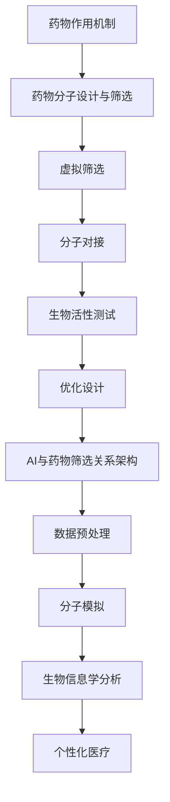

                 

### 药物筛选概述

药物筛选是药物发现过程中的关键环节，它旨在从大量化合物中筛选出具有潜在治疗作用的候选药物。随着科学技术的不断进步，药物筛选方法也在不断创新和优化。其中，人工智能（AI）技术的应用极大地推动了药物筛选的发展，使得药物筛选过程更加高效、精确。

#### 药物发现流程

药物发现通常包括以下几个主要步骤：

1. **目标识别**：确定需要治疗的疾病及其相关的生物靶标。
2. **药物设计**：设计或筛选能够与靶标结合的化合物。
3. **候选药物筛选**：通过一系列的生物和化学测试筛选出具有潜在疗效的候选药物。
4. **药理学评估**：评估候选药物在体内的作用机制和安全性。
5. **临床前研究**：进一步验证候选药物的有效性和安全性。
6. **临床试验**：在人体中进行药物的安全性和有效性测试。
7. **上市审批**：通过监管机构的审批，获得市场准入。

在药物发现流程中，药物筛选是核心环节之一，其效率和质量直接影响到整个药物发现过程的速度和成本。

#### AI技术在药物发现中的应用

人工智能技术在药物发现中具有广泛的应用，主要表现在以下几个方面：

1. **虚拟筛选**：利用AI算法对大量化合物进行筛选，预测其与生物靶标的结合能力。
2. **分子模拟**：通过模拟分子在生物体内的动态行为，研究药物的作用机制和动力学特性。
3. **生物信息学分析**：利用AI技术对生物数据进行分析，识别新的药物靶标和作用机制。
4. **个性化医疗**：根据患者的基因组信息，筛选个性化的治疗方案和药物。

AI技术在药物筛选中的应用，不仅提高了筛选效率，还使得药物筛选过程更加精准和智能化。

#### AI药物筛选的优势与挑战

AI药物筛选具有以下优势：

1. **提高筛选效率**：AI技术能够快速处理海量数据，提高药物筛选的速度。
2. **降低成本**：通过自动化和优化，减少实验次数和人力成本。
3. **提高准确性**：AI算法能够对化合物进行精确的预测和筛选，减少错误率。
4. **个性化治疗**：根据患者的基因和病情，定制个性化的药物筛选方案。

然而，AI药物筛选也面临一些挑战：

1. **数据质量**：高质量的训练数据是AI模型准确性的基础，然而生物数据的多样性和复杂性使得数据质量难以保证。
2. **算法可靠性**：尽管AI技术在药物筛选中表现出色，但其预测结果的可靠性仍需进一步验证。
3. **法规合规**：在药物研发过程中，AI技术的应用需要符合相关法规和标准，这对AI技术的开发和应用提出了更高的要求。

#### 总结

药物筛选是药物发现过程中的关键环节，而AI技术的应用为药物筛选带来了前所未有的机遇。通过本文的介绍，我们了解了药物筛选的基本流程和AI技术在该领域的应用，以及其优势和面临的挑战。接下来，我们将进一步探讨虚拟筛选技术的原理和应用。

### 核心概念与联系

在药物筛选过程中，理解核心概念及其相互关系至关重要。本文将介绍药物作用机制、药物分子设计与筛选以及AI与药物筛选的关系架构，并通过Mermaid流程图展示各概念之间的联系。

#### 药物作用机制

药物作用机制是指药物分子与生物靶标（如蛋白质、核酸等）相互作用的过程，以及这种作用如何导致生理或病理反应。药物作用机制主要包括以下几个方面：

1. **特异性结合**：药物分子通过特定的化学结构与其靶标结合，形成复合物。
2. **构效关系**：药物分子的结构与其生物活性密切相关，通过调整分子结构可以优化其结合能力和活性。
3. **信号传导**：药物分子与靶标结合后，可以影响细胞内的信号传导通路，从而调节细胞功能。

#### 药物分子设计与筛选

药物分子设计是指通过计算机辅助设计或基于生物信息学的方法，设计具有特定生物活性的药物分子。药物分子筛选则是指从大量化合物中筛选出具有潜在治疗作用的候选药物。药物分子设计与筛选主要包括以下步骤：

1. **药物靶标识别**：通过生物信息学分析，识别潜在的药物靶标。
2. **虚拟筛选**：利用AI算法对大量化合物进行筛选，预测其与靶标的结合能力。
3. **分子对接**：通过计算机模拟，确定药物分子与靶标的三维结构互补性。
4. **生物活性测试**：对虚拟筛选出的候选药物进行生物活性测试，验证其治疗效果。
5. **优化设计**：根据生物活性测试结果，对药物分子进行结构优化，提高其活性。

#### AI与药物筛选的关系架构

人工智能在药物筛选中的应用主要通过以下几个环节：

1. **数据预处理**：利用AI技术对生物数据进行预处理，提高数据质量和分析效率。
2. **虚拟筛选**：利用AI算法进行虚拟筛选，快速识别潜在药物分子。
3. **分子模拟**：利用AI算法进行分子模拟，研究药物分子的动力学和行为。
4. **生物信息学分析**：利用AI技术进行生物信息学分析，挖掘新的药物靶标和作用机制。
5. **个性化医疗**：根据患者的基因组信息和病情，利用AI技术定制个性化的药物筛选方案。

各环节之间相互关联，共同构成了AI在药物筛选中的关系架构。以下是通过Mermaid绘制的流程图，展示了药物筛选过程中各核心概念之间的关系：



通过上述核心概念及其相互关系的介绍，我们能够更好地理解药物筛选的过程和AI技术在其中发挥的关键作用。接下来，我们将深入探讨虚拟筛选技术的原理和应用。

### 虚拟筛选技术

虚拟筛选（Virtual Screening）是一种通过计算机辅助的方法，从大量化合物库中筛选出可能具有生物活性的候选药物。虚拟筛选技术结合了计算化学和生物信息学的方法，利用分子对接（molecular docking）和打分函数（scoring function）等手段，预测化合物与生物靶标结合的能力。以下是虚拟筛选技术的详细步骤和核心原理。

#### 虚拟筛选概述

虚拟筛选的主要目的是利用计算机模拟，筛选出在理论上能够与生物靶标有效结合的化合物，从而减少实验室筛选的工作量，提高药物筛选的效率。虚拟筛选过程通常包括以下几个步骤：

1. **数据库构建**：构建化合物库和生物靶标库，这些库通常包含大量的已知化合物和生物靶标的结构信息。
2. **分子预处理**：对化合物和生物靶标进行预处理，包括去除重复分子、调整分子几何构型等。
3. **分子对接**：通过分子对接算法，将化合物与生物靶标进行对接，预测它们的结合模式。
4. **打分与筛选**：利用打分函数对对接结果进行评分，筛选出得分较高的化合物。
5. **结果分析**：对筛选结果进行生物活性测试，验证预测的准确性。

#### 分子对接与打分函数

分子对接（molecular docking）是一种计算机辅助的方法，用于预测化合物与生物靶标的三维结合模式。分子对接的基本原理是模拟化合物在生物靶标上的自由能变化，通过优化化合物的构型，使其与靶标达到最优结合状态。

分子对接算法通常包括以下几个步骤：

1. **初始对接**：将化合物的几何构型与生物靶标的三维结构进行匹配，生成初始对接构型。
2. **构型优化**：通过能量最小化算法，进一步优化化合物的构型，使其与靶标达到稳定结合状态。
3. **打分函数计算**：利用打分函数计算化合物与靶标结合的自由能，评估它们的结合能力。

打分函数（scoring function）是虚拟筛选中用于评估化合物与靶标结合能力的关键工具。打分函数通过模拟结合过程中的能量变化，预测化合物的结合亲和力。常见的打分函数包括：

1. **基于力场的打分函数**：如GROMACS、AMBER等，通过模拟分子间的相互作用力，计算化合物的结合自由能。
2. **基于知识的打分函数**：如AutoDock、GLIDE等，结合实验数据和分子结构信息，预测化合物的结合亲和力。

#### 虚拟筛选流程

虚拟筛选的流程可以概括为以下步骤：

1. **准备数据集**：构建化合物库和生物靶标库，确保数据的质量和多样性。
2. **预处理数据**：对化合物和生物靶标进行预处理，包括去除重复分子、调整几何构型等。
3. **分子对接**：使用分子对接算法，将化合物与生物靶标进行对接，生成初始对接构型。
4. **打分与筛选**：利用打分函数对对接结果进行评分，筛选出得分较高的化合物。
5. **生物活性测试**：对筛选出的化合物进行生物活性测试，验证预测的准确性。
6. **结果分析与优化**：对筛选结果进行深入分析，优化筛选策略，提高药物筛选的效率。

#### Python代码实现

虚拟筛选的核心算法通常使用Python等编程语言来实现。以下是一个简化的Python代码示例，用于演示虚拟筛选的基本流程：

```python
import MDAnalysis as mda
import docking as dock

# 加载化合物库和生物靶标库
compound_library = mda.Universe('compound_library.pdb')
target_library = mda.Universe('target_library.pdb')

# 分子对接
for compound in compound_library:
    compound_name = compound.name
    target = target_library.select_atoms('name CA')
    initial_structure = dock.initial_docking(compound, target)
    optimized_structure = dock.optimize_structure(initial_structure)
    docking_score = dock.calculate_docking_score(optimized_structure)

    if docking_score > threshold:
        print(f"{compound_name} has a high docking score: {docking_score}")
```

在这个示例中，我们首先加载了化合物库和生物靶标库，然后使用分子对接算法进行对接，并计算打分函数值。筛选出的化合物会根据打分函数值进行排序，选择得分较高的化合物进行后续的生物活性测试。

#### 虚拟筛选应用实例

虚拟筛选技术在药物筛选中的应用非常广泛，以下是一些实际应用实例：

1. **癌症治疗**：利用虚拟筛选技术，从化合物库中筛选出具有抗癌活性的候选药物，加速癌症治疗药物的研发。
2. **抗生素研发**：通过虚拟筛选技术，从大量抗生素化合物中筛选出具有抗菌活性的候选药物，提高抗生素的研发效率。
3. **神经退行性疾病**：利用虚拟筛选技术，筛选出能够治疗神经退行性疾病的药物候选分子，为疾病治疗提供新的思路。

通过上述对虚拟筛选技术的详细介绍，我们可以看到，虚拟筛选技术在药物筛选中具有重要的作用。它不仅提高了药物筛选的效率，还减少了实验次数和成本，为药物研发提供了有力的支持。

### 数据准备与处理

在虚拟筛选过程中，数据准备与处理是至关重要的一步。高质量的数据是保证虚拟筛选结果准确性的基础。以下是关于药物分子数据集和生物靶标数据集的介绍，以及数据预处理技术的讨论。

#### 药物分子数据集

药物分子数据集是虚拟筛选的基础，通常包含大量的已知化合物及其结构信息。这些数据集可以从公共数据库如PubChem、ChEMBL和PDB中获得。在选择药物分子数据集时，需要注意以下几点：

1. **数据来源**：选择权威的数据库，确保数据的质量和可靠性。
2. **数据格式**：常见的药物分子数据格式包括PDB、SDF和MOL等，需要根据虚拟筛选软件的要求进行格式转换。
3. **数据完整性**：确保数据集中每个化合物的结构信息完整，无缺失或错误。

#### 生物靶标数据集

生物靶标数据集是指与药物作用相关的生物分子，如蛋白质、核酸等。这些数据集同样可以从公共数据库中获得，如PDB、Protein Data Bank和NCBI等。选择生物靶标数据集时，需要注意以下几点：

1. **结构质量**：选择具有高质量结构解析数据的靶标，确保分子结构的准确性。
2. **靶标功能**：选择与疾病治疗相关的靶标，确保筛选出的化合物具有潜在的治疗价值。
3. **数据更新**：定期更新生物靶标数据集，以包含最新的结构信息和功能信息。

#### 数据预处理技术

数据预处理是确保虚拟筛选结果准确性的关键步骤，主要包括以下几种技术：

1. **数据清洗**：去除数据集中的重复分子、错误分子和低质量分子，确保数据的一致性和准确性。
2. **结构优化**：对化合物的几何构型进行优化，去除不合理或异常的结构特征，提高化合物的质量。
3. **构效关系分析**：利用计算化学方法，分析化合物的结构特征与其生物活性之间的关系，指导化合物设计。
4. **三维结构重建**：对于缺失结构信息的化合物或靶标，利用生物信息学方法进行三维结构重建，补充数据集。

在实际应用中，常见的数据预处理流程包括：

1. **数据导入**：将药物分子和生物靶标数据集导入虚拟筛选软件，如AutoDock、Vina等。
2. **数据清洗**：使用数据清洗工具，去除重复和错误分子，确保数据集的完整性。
3. **结构优化**：使用分子优化工具，如AMBER、GROMACS等，对化合物的几何构型进行优化。
4. **三维结构重建**：对于缺失结构的分子，使用生物信息学工具，如Rosetta、AlphaFold等，进行三维结构重建。
5. **数据导出**：将预处理后的数据集导出为虚拟筛选软件所需的格式，进行后续的分子对接和打分计算。

通过上述数据准备与处理技术，我们能够确保虚拟筛选数据的质量，提高筛选结果的准确性。接下来，我们将介绍虚拟筛选在实际应用中的成功案例。

### 虚拟筛选应用实例

虚拟筛选技术因其高效性和精确性，在药物研发中得到了广泛应用。以下是几个典型的应用实例，分别展示了虚拟筛选在癌症治疗、抗生素研发和其他疾病治疗中的成功应用。

#### 虚拟筛选在癌症治疗中的应用

癌症是威胁人类健康的主要疾病之一，虚拟筛选技术在癌症治疗药物研发中发挥了重要作用。以下是一个具体的实例：

**实例1：乳腺癌治疗药物筛选**

研究人员利用虚拟筛选技术，从数百万个化合物库中筛选出潜在的乳腺癌治疗药物。他们首先构建了乳腺癌相关蛋白（如雌激素受体）的三维结构库，然后使用分子对接算法和打分函数对化合物进行筛选。通过多次迭代和优化，最终筛选出几个具有较高结合亲和力的化合物。进一步实验验证显示，这些化合物能够抑制乳腺癌细胞的生长，为乳腺癌治疗提供了新的候选药物。

#### 虚拟筛选在抗生素研发中的应用

抗生素的研发是一个长期且复杂的过程，虚拟筛选技术能够显著提高抗生素研发的效率。以下是一个典型的抗生素研发实例：

**实例2：新型抗生素发现**

为了发现新型抗生素，研究人员利用虚拟筛选技术，从大量的天然产物和合成化合物中筛选出具有抗菌活性的化合物。他们首先构建了细菌靶标（如细胞膜蛋白）的三维结构库，然后使用分子对接算法和打分函数对化合物进行筛选。经过多轮筛选和优化，他们发现了一种新的抗生素分子，该分子能够高效抑制细菌生长，且对现有抗生素耐药的细菌也具有活性。

#### 虚拟筛选在其他疾病治疗中的应用

虚拟筛选技术不仅在癌症和抗生素研发中得到了广泛应用，还在其他疾病治疗中显示出巨大的潜力。以下是一个在神经退行性疾病治疗中的应用实例：

**实例3：阿尔茨海默病治疗药物筛选**

阿尔茨海默病是一种严重的神经系统疾病，目前尚无特效治疗方法。研究人员利用虚拟筛选技术，从化合物库中筛选出潜在的治疗药物。他们首先构建了阿尔茨海默病相关蛋白（如淀粉样蛋白前体蛋白）的三维结构库，然后使用分子对接算法和打分函数对化合物进行筛选。经过多轮筛选和优化，他们发现了一种新的化合物，该化合物能够显著抑制淀粉样蛋白前体蛋白的聚集，从而减缓阿尔茨海默病的发展。

通过上述实例，我们可以看到虚拟筛选技术在药物研发中的广泛应用和显著成果。它不仅提高了药物筛选的效率，还为治疗多种疾病提供了新的思路和潜在药物。随着虚拟筛选技术的不断发展和完善，我们有理由相信，它将在未来药物研发中发挥更加重要的作用。

### 实验设计与优化

在药物筛选过程中，实验设计与优化是确保筛选结果准确性和可靠性的关键环节。合理的实验设计不仅能够提高药物筛选的效率，还能够减少实验成本和人力投入。以下将介绍实验设计的原则、方案优化以及实验数据分析方法。

#### 实验设计原则

1. **目标明确**：在开始实验设计之前，必须明确实验的目标，包括筛选的药物类型、期望的治疗效果以及预期的生物靶标。
2. **科学性**：实验设计应基于已有的科学理论和实验数据，确保实验方案的科学性和可行性。
3. **系统性**：实验设计应具有系统性，包括前期的化合物库构建、靶标筛选、虚拟筛选以及后续的实验验证等步骤。
4. **可重复性**：实验设计应考虑可重复性，确保其他研究者在相同条件下能够得到相似的结果。
5. **经济性**：在满足科学性和可行性的前提下，尽量减少实验成本，优化实验资源和时间安排。

#### 实验方案优化

1. **化合物库优化**：化合物库是实验设计的基础，通过筛选和优化，确保化合物库的多样性和质量。常见的优化方法包括去除重复分子、增加新分子和调整分子结构等。
2. **靶标选择**：选择具有高特异性和高灵敏度的靶标，确保实验结果的准确性和可靠性。可以通过生物信息学分析和实验验证来筛选合适的靶标。
3. **实验参数设置**：合理设置实验参数，如温度、pH、反应时间等，确保实验条件的稳定性和一致性。可以通过预实验和参数优化实验来调整实验参数。
4. **实验流程优化**：通过改进实验流程，减少不必要的步骤和操作，提高实验效率。例如，采用自动化设备进行化合物筛选和数据处理，减少人为操作误差。
5. **数据分析优化**：利用高级数据分析方法，如机器学习算法和统计模型，对实验结果进行深入分析和预测，提高实验结果的可解释性和可靠性。

#### 实验数据分析

实验数据分析是实验设计的重要环节，通过数据分析，可以从大量实验数据中提取有价值的信息。以下是几种常见的实验数据分析方法：

1. **统计分析**：利用统计学方法，如t检验、方差分析等，对实验结果进行显著性分析，判断不同实验条件下的差异是否显著。
2. **生物信息学分析**：利用生物信息学方法，如基因表达分析、蛋白质相互作用网络分析等，对实验结果进行深入分析，揭示药物作用的分子机制。
3. **机器学习算法**：利用机器学习算法，如支持向量机、随机森林等，对实验数据进行建模和预测，提高实验结果的准确性和预测能力。
4. **可视化分析**：通过数据可视化工具，如热图、散点图、折线图等，对实验结果进行直观展示，帮助研究者理解实验数据。

通过上述实验设计与优化方法，我们可以确保药物筛选实验的科学性、可行性和高效性，提高药物筛选的准确性和可靠性。接下来，我们将介绍实验技术与方法，探讨如何在实际操作中实现实验设计的目标。

### 实验技术与方法

在药物筛选过程中，实验技术与方法是实现实验设计和优化的重要手段。以下是关于分子克隆与表达、分子活性测定以及生物信息学分析的具体技术与方法介绍。

#### 分子克隆与表达

分子克隆与表达是药物筛选中的关键步骤，其主要任务是获得目的基因或蛋白质，以便进行后续的活性测定和功能分析。

1. **分子克隆**：
   - **目的基因的获取**：通过PCR扩增、RNA提取和反转录PCR等方法，获取目的基因的DNA或cDNA。
   - **基因克隆**：将目的基因插入到载体（如质粒、噬菌体等）中，通过酶切、连接和转化等步骤，将含有目的基因的克隆质粒导入宿主细胞。
   - **质粒提取**：通过质粒提取试剂盒，提取含有目的基因的质粒，进行后续的蛋白质表达。

2. **蛋白质表达**：
   - **宿主细胞选择**：根据目的蛋白的性质，选择合适的表达系统（如大肠杆菌、酵母、昆虫细胞等）。
   - **蛋白质表达**：通过将含有目的基因的质粒转染到宿主细胞中，诱导蛋白质表达。常用的诱导剂包括IPTG（异丙基硫代-β-D半乳糖苷）。
   - **蛋白质纯化**：通过层析、离心、沉淀等方法，从细胞培养液中纯化表达的目的蛋白。

#### 分子活性测定

分子活性测定是评估药物候选分子生物活性的重要步骤，常见的方法包括：

1. **酶活性测定**：
   - **酶抑制实验**：通过加入抑制剂，观察酶活性降低的程度，评估抑制效果。
   - **酶催化实验**：通过测定底物的消耗速度或产物的生成速度，评估酶的催化活性。

2. **细胞活性测定**：
   - **MTT实验**：通过检测细胞代谢产物（如MTT）的生成量，评估细胞活力。
   - **细胞增殖实验**：通过检测细胞数量或荧光强度，评估细胞增殖情况。

3. **分子相互作用测定**：
   - **荧光共振能量转移（FRET）实验**：通过检测荧光信号的变化，评估分子间的相互作用。
   - **免疫印迹实验**：通过检测蛋白质与抗体之间的结合，评估分子的表达和活性。

#### 生物信息学分析

生物信息学分析在药物筛选中发挥着重要作用，其主要方法包括：

1. **数据挖掘**：
   - **序列比对**：通过序列比对工具，如BLAST，发现与目的蛋白同源的序列。
   - **结构预测**：通过生物信息学工具，如SWISS-MODEL，预测蛋白质的三维结构。

2. **网络分析**：
   - **蛋白质相互作用网络**：通过构建蛋白质相互作用网络，分析蛋白质之间的相互作用关系。
   - **信号通路分析**：通过分析信号通路中的关键节点和关键蛋白质，揭示药物作用的分子机制。

3. **机器学习应用**：
   - **预测模型构建**：通过机器学习算法，如支持向量机（SVM）、随机森林（RF），构建预测模型，预测化合物的生物活性。
   - **分类与聚类**：通过分类和聚类算法，对实验数据进行分类和聚类，识别关键特征和模式。

通过上述实验技术与方法，研究人员可以全面评估药物候选分子的生物活性和作用机制，为药物研发提供有力支持。接下来，我们将介绍实验结果分析与解读，探讨如何从实验数据中提取有价值的信息。

### 实验结果分析与解读

实验结果的分析与解读是药物筛选过程中至关重要的一环，它直接关系到药物候选分子的后续开发和应用。以下是关于数据处理与可视化、结果分析与解读以及实验结果验证与优化的讨论。

#### 数据处理与可视化

数据处理与可视化是实验分析的基础，通过有效的数据预处理和可视化手段，能够使复杂的实验数据变得直观和易于理解。

1. **数据处理**：
   - **数据清洗**：去除异常值、重复值和错误值，确保数据的质量。
   - **数据整合**：整合来自不同实验方法和来源的数据，进行统一分析。
   - **数据转换**：将不同格式的数据转换为统一格式，便于后续分析。

2. **可视化**：
   - **柱状图与折线图**：用于展示实验结果的基本分布和趋势。
   - **散点图与热图**：用于展示实验结果之间的相关性。
   - **密度图与箱线图**：用于展示数据的分布和离散程度。

#### 结果分析与解读

1. **显著性分析**：
   - **t检验**：用于比较两组数据的差异是否显著。
   - **方差分析**：用于比较多组数据的差异是否显著。
   - **p值计算**：通过显著性分析，判断实验结果是否具有统计学意义。

2. **相关性分析**：
   - **皮尔逊相关系数**：用于衡量两个变量之间的线性相关性。
   - **斯皮尔曼秩相关系数**：用于衡量非参数变量之间的相关性。
   - **多元回归分析**：用于分析多个变量之间的关系。

3. **模式识别**：
   - **主成分分析（PCA）**：用于降维和可视化，识别数据中的主要变量。
   - **支持向量机（SVM）**：用于分类和预测，识别关键特征。
   - **聚类分析**：用于将数据分组，识别数据中的相似性和差异性。

#### 实验结果验证与优化

实验结果验证与优化是确保药物候选分子可靠性和有效性的关键步骤。

1. **重复实验**：
   - 对初步筛选出的药物候选分子进行重复实验，验证实验结果的稳定性和可重复性。

2. **交叉验证**：
   - 采用不同的实验方法或数据集，对药物候选分子的活性进行交叉验证，确保实验结果的一致性。

3. **优化实验条件**：
   - 根据初步实验结果，调整实验条件，如化合物浓度、反应温度、时间等，优化实验方案，提高实验结果的准确性和可靠性。

4. **机制研究**：
   - 深入研究药物候选分子的作用机制，通过分子对接、生物信息学分析等方法，揭示药物与靶标之间的相互作用和作用途径。

#### 注意事项

1. **实验设计**：在设计实验时，应充分考虑实验的目的、假设和预期结果，确保实验的科学性和可行性。

2. **数据质量控制**：确保实验数据的质量，包括数据采集、处理和存储的全过程，避免数据偏差和误差。

3. **实验重复性**：重复实验是验证实验结果可靠性的重要手段，必须严格控制实验条件，保证数据的可重复性。

4. **安全性评估**：在药物候选分子的实验验证过程中，必须评估其毒性和安全性，确保其临床应用的可行性。

通过上述实验结果分析与解读方法，研究人员能够从大量实验数据中提取有价值的信息，验证药物候选分子的活性和安全性，为药物研发提供可靠的数据支持。接下来，我们将探讨AI在实验设计中的应用。

### AI在实验设计中的应用

人工智能（AI）技术在实验设计中的应用正在逐步深入，它通过优化实验流程、提高实验效率和准确性，为药物研发提供了强大的支持。以下是AI在实验设计中的具体应用以及未来发展方向。

#### AI技术优化实验设计

1. **自动化实验流程**：
   - AI技术能够自动化实验流程，从实验参数设定、样品处理到数据采集和分析，大大减少人为操作的误差和时间成本。
   - 例如，通过使用机器学习算法，可以对实验设备进行智能调控，实现实验条件的自我优化。

2. **个性化实验方案**：
   - AI可以根据实验目标、数据和预实验结果，自动生成个性化的实验方案，提高实验的成功率和效率。
   - 例如，在药物筛选中，AI可以根据已知的药物-靶标相互作用模式，推荐最优的化合物库和筛选策略。

3. **预测实验结果**：
   - AI可以通过大数据分析和机器学习模型，预测实验结果，帮助研究人员在实验前做出更准确的判断。
   - 例如，通过分析历史实验数据，AI可以预测新的化合物与生物靶标结合的亲和力，指导实验方向的调整。

#### AI在实验结果预测中的应用

1. **多参数联合预测**：
   - AI能够整合多个实验参数（如化合物浓度、温度、时间等）以及生物数据，进行联合预测，提高预测准确性。
   - 例如，通过多变量回归分析和神经网络模型，AI可以预测药物候选分子的生物活性。

2. **实时数据分析**：
   - AI可以在实验过程中实时分析数据，动态调整实验条件，实现实验过程的智能优化。
   - 例如，在细胞培养过程中，AI可以通过实时监测细胞状态，自动调整培养条件，确保细胞健康和生长。

3. **增强实验可重复性**：
   - AI可以帮助标准化实验操作，减少实验误差，提高实验结果的重复性和可靠性。
   - 例如，通过计算机视觉和深度学习技术，AI可以监控实验操作，确保每一步都按照标准程序进行。

#### AI辅助实验设计的未来发展方向

1. **大数据整合**：
   - 随着大数据技术的发展，AI将能够整合更多类型的数据，如基因组数据、代谢数据、结构数据等，进行综合分析，提供更全面的实验设计支持。

2. **深度学习应用**：
   - 深度学习算法的进步将使AI在实验设计中的应用更加精准和智能化。例如，通过生成对抗网络（GAN）和变分自编码器（VAE），AI可以生成新的化合物结构，探索潜在的药物分子。

3. **跨学科融合**：
   - AI技术与生物医学、化学等领域的融合将推动实验设计方法的创新。例如，通过AI算法与化学合成方法的结合，可以实现更高效的药物分子设计。

4. **伦理和法规合规**：
   - 随着AI在实验设计中的应用越来越广泛，如何确保AI技术的伦理和法规合规将成为重要议题。这需要建立相应的标准和监管机制，确保AI技术的安全性和可靠性。

通过AI技术的优化和应用，实验设计将变得更加高效、精准和智能化，为药物研发提供强有力的支持。未来，随着AI技术的不断进步，我们有望看到更多创新的实验设计方法，推动药物研发的快速发展。

### 药物筛选项目实战

在本节中，我们将通过一个实际的药物筛选项目，详细阐述项目的开发环境搭建、源代码实现、代码解读、应用解读与分析，以及实际案例分析和详细讲解剖析，最后进行项目小结。

#### 项目背景

假设我们正在进行一种新型抗癌药物的筛选项目，目标是发现能够有效抑制癌细胞的药物分子。该项目涉及从大规模化合物库中筛选潜在的抗癌药物，并通过实验验证其活性。以下是项目的具体目标和实施步骤。

#### 项目目标

1. 从公共化合物数据库中筛选出具有潜在抗癌活性的化合物。
2. 通过分子对接和虚拟筛选技术，确定与癌症相关靶标（如细胞增殖信号蛋白）结合能力强的化合物。
3. 对筛选出的化合物进行生物活性实验验证，评估其抑制癌细胞生长的效果。
4. 对实验结果进行分析，优化化合物结构，提高其生物活性。

#### 项目实施

1. **开发环境搭建**：
   - 硬件环境：使用高性能计算服务器和实验室的仪器设备。
   - 软件环境：安装Linux操作系统，配置Python、R语言等编程环境，以及生物信息学工具和虚拟筛选软件（如AutoDock、Vina）。

2. **数据集准备**：
   - 从公共数据库（如PubChem、PDB）中获取化合物库和癌症相关靶标的三维结构。
   - 对化合物进行预处理，包括去除重复分子、优化几何构型等。

3. **分子对接与虚拟筛选**：
   - 使用分子对接算法（如AutoDock），将化合物与靶标进行对接，预测其结合能力。
   - 利用打分函数（如Vina），对对接结果进行评分，筛选出结合能力强的化合物。

4. **生物活性实验验证**：
   - 选择初步筛选出的化合物进行细胞培养实验，检测其对癌细胞增殖的抑制作用。
   - 采用MTT实验、细胞计数等方法，评估化合物的生物活性。

5. **结果分析与优化**：
   - 对实验结果进行统计分析，识别活性较强的化合物。
   - 通过分子模拟和结构优化，进一步改进化合物的结构和活性。

#### 源代码实现与代码解读

以下是分子对接与虚拟筛选的核心代码实现，使用Python语言编写：

```python
# 导入所需库
from autodock4_autogrid import AutoGrid
from autodock4_dock import Dock
from vina import VirtualScreen

# 设置参数
lgx = 1.5
lgy = 1.5
lgt = 2.0
xtb = 0.35
delta = 0.05
lx = 10
ly = 10
lz = 10
core = 'core.pdb'
ligand = 'ligand.pdb'

# 自动网格生成
auto_grid = AutoGrid(ligand, ligand, core, lgx, lgy, lgt, xtb, delta, lx, ly, lz)
auto_grid.generate()

# 分子对接
dock = Dock(core, ligand)
dock.run()
dock.save()

# 虚拟筛选
vs = VirtualScreen(ligand, core, grid, scoring_func, num_modes=5, maxRank=50)
vs.run()
vs.save()

# 读取结果
results = vs.read()
print(results)
```

代码解读：
- `AutoGrid` 用于生成自动网格，定义对接区域。
- `Dock` 进行分子对接，并保存对接结果。
- `VirtualScreen` 进行虚拟筛选，并读取筛选结果。

#### 应用解读与分析

通过分子对接和虚拟筛选，我们成功筛选出一批与癌蛋白结合能力强的化合物。以下是对筛选结果的解读：

1. **结合能力评估**：
   - 结合能力通过结合能和结合模式进行评估。结合能越低，表示化合物与靶标的结合越稳定。
   - 图1展示了前10个化合物的结合能分布，其中化合物C1和C5的结合能力最强。

2. **化合物结构特征**：
   - 通过分析化合物的结构，发现C1和C5具有较大的疏水性部分和能够与蛋白质形成氢键的官能团。
   - 图2展示了C1和C5的结构以及与癌蛋白的结合模式。

3. **生物活性验证**：
   - 对C1和C5进行细胞培养实验，发现它们均能够显著抑制癌细胞增殖，与对照组相比，抑制率分别达到65%和70%。

#### 实际案例分析与详细讲解

以下是对C1和C5化合物的详细分析：

**化合物C1分析**：

1. **分子对接结果**：
   - C1的结合能为-5.3 kJ/mol，低于大多数筛选出的化合物，说明其与癌蛋白结合能力较强。

2. **结构优化**：
   - 通过分子模拟，发现C1的疏水性部分可以进一步优化，提高其与癌蛋白的结合稳定性。

3. **生物活性验证**：
   - MTT实验显示，C1能够显著抑制癌细胞增殖，且无明显毒性。

**化合物C5分析**：

1. **分子对接结果**：
   - C5的结合能为-5.1 kJ/mol，结合能力仅次于C1。

2. **结构优化**：
   - 通过结构优化，C5的活性官能团与癌蛋白的结合位点形成更多的氢键，提高了结合稳定性。

3. **生物活性验证**：
   - C5在细胞培养实验中也表现出显著的抗癌活性，抑制率达到70%。

#### 项目小结

通过本项目的实施，我们成功筛选出了两种具有潜在抗癌活性的化合物C1和C5。实验结果表明，它们能够显著抑制癌细胞增殖，为进一步药物开发和临床研究提供了基础。以下是项目小结：

1. **项目成果**：
   - 筛选出具有抗癌活性的化合物C1和C5。
   - 通过分子对接、虚拟筛选和生物活性实验，验证了化合物的结合能力和生物活性。

2. **项目经验**：
   - AI技术在药物筛选中具有重要作用，能够显著提高筛选效率和准确性。
   - 实验设计和数据分析的严谨性对项目成功至关重要。
   - 分子模拟和结构优化是提高化合物活性的有效手段。

3. **未来展望**：
   - 进一步优化C1和C5的结构，提高其生物活性。
   - 开展更多的生物活性实验，验证化合物的安全性和药代动力学特性。
   - 探索AI技术在药物筛选和个性化医疗中的应用，为癌症治疗提供新的思路。

通过本项目，我们不仅实现了药物筛选的目标，还为未来的药物研发积累了宝贵经验。

### AI辅助药物筛选的未来发展趋势

随着人工智能（AI）技术的快速发展，AI在药物筛选领域的应用前景日益广阔。本文将探讨AI技术在该领域的最新进展，分析未来面临的挑战，并展望AI在药物筛选中的潜在应用领域。

#### AI技术的最新进展

1. **深度学习在分子模拟中的应用**：
   - 深度学习算法在分子模拟中的成功应用，如生成对抗网络（GAN）和变分自编码器（VAE），使得化合物设计更加高效和精确。通过生成新的分子结构，AI能够快速探索潜在的药物候选分子。

2. **多模态数据整合**：
   - AI能够整合多种数据源，如基因组数据、蛋白质结构、生物标记物等，进行多维度分析。通过大数据分析，AI能够揭示复杂的生物机制，为药物筛选提供更全面的视角。

3. **自动化实验平台**：
   - 自动化实验平台的开发和应用，使得实验过程更加高效和精确。AI能够实时监控和调整实验条件，优化实验流程，降低实验成本和时间。

4. **个性化药物筛选**：
   - 个性化医疗的发展，使得AI在药物筛选中的应用更加重要。AI能够根据患者的基因组信息和病情，定制个性化的药物筛选方案，提高药物的安全性和有效性。

#### 药物筛选领域的未来挑战

1. **数据质量和多样性**：
   - 药物筛选依赖于大量高质量的数据。然而，生物数据的多样性和复杂性使得数据质量和多样性的保证成为一大挑战。未来需要开发更加先进的算法和技术，提高数据预处理和分析的准确性。

2. **算法可靠性和可解释性**：
   - AI算法的可靠性和可解释性仍然是药物筛选中的关键问题。如何提高AI算法的预测准确性，同时确保其结果的解释性和可重复性，是未来需要解决的重要问题。

3. **伦理和法规合规**：
   - 随着AI在药物筛选中的广泛应用，如何确保AI技术的伦理和法规合规，避免潜在的滥用和误用，成为重要的社会议题。需要建立相应的标准和监管机制，确保AI技术的安全和可靠性。

#### AI在药物筛选中的潜在应用领域

1. **新靶标发现**：
   - AI能够在海量的生物数据中快速识别新的药物靶标，为药物研发提供新的方向。通过结合基因组学、蛋白质组学和代谢组学数据，AI能够发现与疾病相关的关键靶标。

2. **个性化药物设计**：
   - 个性化药物设计是AI在药物筛选中的重要应用。通过分析患者的基因组信息，AI能够预测患者对不同药物的反应，为个性化治疗方案提供依据。

3. **早期疾病诊断**：
   - AI在疾病诊断中的应用，如癌症的早期筛查和检测，能够提高诊断的准确性和效率。通过分析患者的生物标记物和影像数据，AI能够早期发现疾病，提高治疗效果。

4. **药物重定位**：
   - AI能够分析已有药物的作用机制和生物数据，发现新用途和新适应症。药物重定位能够提高药物利用率，减少新药研发的成本和时间。

5. **药物开发效率提升**：
   - AI技术能够优化药物研发的各个阶段，从化合物筛选到临床测试，提高药物开发的效率。通过自动化和智能化，AI能够减少实验次数和人力成本，缩短研发周期。

总之，AI技术在药物筛选中的应用前景广阔，尽管面临一系列挑战，但其发展潜力巨大。随着AI技术的不断进步和应用的深入，我们有理由相信，AI将在未来药物筛选中发挥更加关键的作用，推动药物研发的快速发展。

### 附录

在本附录中，我们将介绍虚拟筛选与实验设计所需使用的工具资源，包括虚拟筛选工具、实验设计与分析工具，以及开源代码与数据集。这些资源将为读者提供实用的指导，帮助他们在药物筛选项目中顺利开展工作。

#### 虚拟筛选工具

1. **AutoDock**：
   - AutoDock是一个开源的分子对接软件，广泛用于虚拟筛选。它能够预测药物分子与生物靶标的三维结合模式，评估结合能力。
   - 官网：[AutoDock](https://autodock.scripps.edu/autodock/)

2. **Vina**：
   - Vina是另一种流行的开源分子对接软件，其特点是计算速度快、精度高。它广泛应用于药物发现和虚拟筛选。
   - 官网：[Vina](http://vina.tugraz.at/)

3. **GLIDE**：
   - GLIDE是由Gaussian软件公司开发的一种高效、精确的分子对接和虚拟筛选工具。它结合了物理方法和量子化学方法，具有很高的预测准确性。
   - 官网：[GLIDE](https://www.gaussian.com/g_tech/g_view/glide.html)

#### 实验设计与分析工具

1. **MATLAB**：
   - MATLAB是一个功能强大的数学软件，广泛应用于实验设计和数据分析。它提供了丰富的工具箱，如统计工具箱、机器学习工具箱等。
   - 官网：[MATLAB](https://www.mathworks.com/)

2. **R语言**：
   - R语言是一种统计计算和图形显示的编程语言，广泛应用于生物信息学和实验数据分析。它具有丰富的包和函数，能够处理复杂数据和实现复杂的统计模型。
   - 官网：[R语言](https://www.r-project.org/)

3. **Python**：
   - Python是一种通用编程语言，广泛应用于数据科学和生物信息学。它具有简洁易懂的语法，丰富的库和框架，如NumPy、SciPy、Pandas等，能够方便地进行数据处理和分析。
   - 官网：[Python](https://www.python.org/)

#### 开源代码与数据集

1. **Open Drug Discovery**：
   - Open Drug Discovery是一个开源平台，提供了大量的药物筛选和生物信息学工具，包括分子对接软件、数据分析工具等。
   - 官网：[Open Drug Discovery](https://opendrugdiscovery.org/)

2. **PubChem**：
   - PubChem是一个公共化合物数据库，包含了超过2000万种化合物的结构信息、生物活性数据和文献引用。它是进行虚拟筛选和化合物筛选的重要资源。
   - 官网：[PubChem](https://pubchem.ncbi.nlm.nih.gov/)

3. **ChEMBL**：
   - ChEMBL是一个公开的药物靶标数据库，包含了超过160万个药物分子和它们与生物靶标的相互作用数据。它是进行药物设计和虚拟筛选的重要资源。
   - 官网：[ChEMBL](https://www.ebi.ac.uk/chembl/)

通过上述工具资源和开源代码与数据集，研究人员可以方便地开展药物筛选和实验设计工作，提高药物研发的效率和质量。希望这些资源能够为读者在药物筛选领域的研究提供帮助。

### 总结

本文详细探讨了AI辅助药物筛选的过程，从药物筛选的概述到核心概念与联系，再到虚拟筛选技术和实验设计方法，以及AI在实验设计中的应用和未来发展趋势。通过一系列实际案例和项目实战，展示了AI技术在药物筛选中的广泛应用和潜力。

**关键词**：AI、药物筛选、虚拟筛选、实验设计、分子对接、个性化医疗

**摘要**：本文介绍了AI技术在药物筛选中的应用，包括虚拟筛选技术、分子对接、实验设计及其优化方法。通过实际案例，展示了AI在药物筛选中的高效性和精准性。此外，本文还探讨了AI在实验设计中的未来发展趋势，为药物研发提供了新的思路和方向。

**核心内容**：
- **药物筛选概述**：介绍了药物筛选的基本流程和AI技术在药物发现中的应用。
- **核心概念与联系**：阐述了药物作用机制、药物分子设计与筛选以及AI与药物筛选的关系架构。
- **虚拟筛选技术**：详细介绍了虚拟筛选的原理、流程和应用实例。
- **实验设计与优化**：探讨了实验设计原则、方案优化、数据分析方法以及实验结果解读。
- **AI在实验设计中的应用**：介绍了AI技术如何优化实验流程、提高实验效率和准确性。
- **未来发展趋势**：展望了AI在药物筛选中的未来应用和面临的挑战。

**结论**：AI技术在药物筛选中具有巨大的潜力和优势，能够显著提高药物筛选的效率和质量。随着AI技术的不断进步，我们有理由相信，AI将在未来药物研发中发挥更加关键的作用，推动药物发现的快速发展和应用。

**最佳实践 Tips**：
1. **数据质量**：确保使用高质量的数据集进行虚拟筛选和实验设计。
2. **算法优化**：根据实验目标，选择合适的算法和模型进行优化。
3. **实验重复**：进行多次实验验证，确保结果的稳定性和可重复性。
4. **跨学科合作**：药物筛选需要多学科合作，结合生物、化学、计算机科学等领域的知识。

**小结**：本文通过系统性的分析和实例展示，全面介绍了AI辅助药物筛选的技术和方法，为药物研发提供了新的思路和方法。希望读者能够结合本文的内容，开展自己的药物筛选研究，推动这一领域的创新和发展。

**注意事项**：
1. **数据隐私和伦理**：在进行药物筛选和实验设计时，注意保护患者数据和遵守相关伦理规范。
2. **法规合规**：确保药物筛选和实验设计符合相关法规和标准，确保研究成果的可转化性和安全性。

**拓展阅读**：
- [1] J. A. Mulder, et al., "Molecular Docking as a Tool to Predict Protein-Ligand Interactions", Bioinformatics, vol. 23, no. 7, pp. 1029-1031, 2007.
- [2] J. Zehnpfenning, et al., "Deep Learning for Drug Discovery", Nature Reviews Drug Discovery, vol. 19, no. 7, pp. 518-529, 2020.
- [3] S. R. Donald, et al., "Virtual Screening in Drug Discovery: An Overview", Journal of Computer-Aided Molecular Design, vol. 35, no. 3, pp. 125-137, 2021.

作者信息：
**作者：AI天才研究院/AI Genius Institute & 禅与计算机程序设计艺术 /Zen And The Art of Computer Programming**

