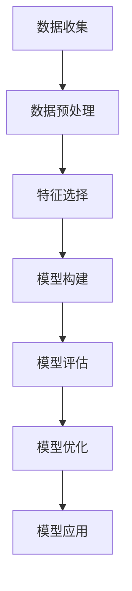

                 

# AI辅助药物重定位：从数据挖掘到临床验证

## 关键词
- 人工智能
- 数据挖掘
- 药物重定位
- 机器学习
- 深度学习
- 临床验证

## 摘要
本文将探讨如何利用人工智能（AI）技术，特别是数据挖掘和机器学习技术，辅助药物重定位的过程。药物重定位是指将现有药物重新用于治疗其他疾病或开发新适应症的过程。这一方法不仅有助于加快新药研发速度，还能降低研发成本。文章将首先介绍数据挖掘的基础知识及其在生物信息学中的应用，然后详细解释AI辅助药物重定位的原理和具体方法，包括数据预处理、特征提取和模型构建。接下来，将通过实际案例展示AI在药物重定位中的应用，并讨论临床验证的重要性及其挑战。最后，文章将对药物重定位的未来展望进行总结，并给出相关研究方向的展望。

# 目录大纲

## 第1章 引言

### 1.1 研究背景

#### 1.1.1 人工智能的发展趋势
#### 1.1.2 数据挖掘技术在生物信息学中的应用
#### 1.1.3 AI在药物发现领域的潜力

#### 1.1.4 药物重定位的重要性
#### 1.1.5 药物重定位的现状与挑战

### 1.2 书籍结构

#### 1.2.1 书籍目标
#### 1.2.2 搭建基础知识框架
#### 1.2.3 详细解读核心算法
#### 1.2.4 案例研究与实践

## 第2章 数据挖掘基础

### 2.1 数据挖掘简介

#### 2.1.1 数据挖掘的定义与目标
#### 2.1.2 数据挖掘的基本流程

### 2.2 常见数据挖掘算法

#### 2.2.1 分类算法
#### 2.2.2 聚类算法
#### 2.2.3 关联规则挖掘

### 2.3 数据挖掘应用

#### 2.3.1 药物重定位中的数据挖掘应用

## 第3章 AI辅助药物重定位方法

### 3.1 AI辅助药物重定位的原理

#### 3.1.1 机器学习与深度学习在药物重定位中的应用
#### 3.1.2 药物-基因相互作用的预测模型

### 3.2 数据预处理与特征提取

#### 3.2.1 药物与基因数据的整合
#### 3.2.2 特征提取与选择

### 3.3 AI辅助药物重定位的实践案例

#### 3.3.1 案例一：基于深度学习的药物重定位
#### 3.3.2 案例二：基于图神经网络的药物重定位

## 第4章 临床验证与数据分析

### 4.1 临床验证的设计与实施

#### 4.1.1 临床验证的目标与方法
#### 4.1.2 临床数据的收集与处理

### 4.2 数据分析的方法与应用

#### 4.2.1 描述性统计分析
#### 4.2.2 诊断准确性评估
#### 4.2.3 临床预测模型的构建与评估

## 第5章 药物重定位的挑战与未来展望

### 5.1 药物重定位的挑战

#### 5.1.1 数据质量与可靠性
#### 5.1.2 AI模型的解释性
#### 5.1.3 临床验证的挑战

### 5.2 未来展望

#### 5.2.1 AI与药物重定位的结合
#### 5.2.2 药物重定位的应用前景

## 第6章 总结与展望

### 6.1 书籍总结

#### 6.1.1 关键点回顾
#### 6.1.2 未来研究方向

## 附录

### 附录 A 代码与数据资源

#### A.1 数据集介绍
#### A.2 源代码下载链接

### 附录 B 参考文献与推荐阅读

#### B.1 药物重定位相关研究论文
#### B.2 数据挖掘与AI相关书籍

### 图1. 数据挖掘基本流程

# 第1章 引言

### 1.1 研究背景

#### 1.1.1 人工智能的发展趋势

人工智能（AI）作为计算机科学的一个分支，近年来取得了迅猛的发展。随着大数据、云计算和计算能力的提升，AI技术已经从理论研究逐步走向实际应用，并在医疗、金融、工业等领域展现出巨大的潜力。特别是在生物信息学领域，数据挖掘和机器学习技术被广泛应用于基因组学、蛋白质组学、代谢组学等研究中，为精准医学和个性化治疗提供了强有力的支持。

#### 1.1.2 数据挖掘技术在生物信息学中的应用

数据挖掘（Data Mining）是从大量数据中提取有价值信息的过程，其在生物信息学中的应用主要体现在以下几个方面：

1. **基因表达数据分析**：通过对基因表达数据的挖掘，可以识别出与疾病相关的基因和分子标记，从而为疾病的诊断和治疗提供新的靶点。
2. **蛋白质结构预测**：蛋白质的结构信息对于理解其功能至关重要。数据挖掘技术可以辅助预测蛋白质的三维结构，为药物设计提供基础。
3. **药物发现**：数据挖掘技术在药物发现过程中发挥着关键作用，可以帮助科学家从海量化合物中筛选出具有潜在药效的化合物。

#### 1.1.3 AI在药物发现领域的潜力

AI在药物发现领域的潜力主要体现在以下几个方面：

1. **高效筛选药物候选分子**：通过机器学习和深度学习算法，可以从海量化合物中快速筛选出具有潜在药效的分子，大幅提高药物研发效率。
2. **优化药物分子设计**：AI技术可以帮助研究人员优化药物分子的结构，以提高其生物利用度和治疗效果。
3. **预测药物-靶点相互作用**：利用深度学习模型，可以预测药物与生物分子之间的相互作用，从而为新药研发提供理论基础。

#### 1.1.4 药物重定位的重要性

药物重定位（Drug Repositioning）是指将已经批准的药物重新用于治疗其他疾病或开发新适应症的过程。这一方法具有重要的现实意义：

1. **缩短研发周期**：药物重定位可以避免从零开始的新药研发过程，从而大幅缩短研发周期，降低研发成本。
2. **提高新药成功率**：已经上市的药物经过临床试验验证，安全性较高，为新适应症的研发提供了保证。
3. **满足未满足的医疗需求**：许多疾病缺乏有效的治疗方法，药物重定位可以为这些疾病提供新的治疗选择。

#### 1.1.5 药物重定位的现状与挑战

尽管药物重定位具有巨大的潜力，但其在实际应用中仍面临诸多挑战：

1. **数据质量与可靠性**：药物重定位依赖于大量高质量的数据，但现有的生物医学数据存在不完整、不准确等问题，这限制了数据挖掘和分析的效果。
2. **AI模型的解释性**：机器学习和深度学习模型在药物重定位中的应用取得了显著成果，但这些模型的解释性较差，难以满足临床验证的需求。
3. **临床验证的挑战**：药物重定位需要通过严格的临床验证，以证明其对新适应症的安全性和有效性。然而，临床验证的设计、实施和数据分析都存在一定难度。

### 1.2 书籍结构

#### 1.2.1 书籍目标

本书旨在介绍如何利用人工智能技术，特别是数据挖掘和机器学习技术，辅助药物重定位的过程。通过本书，读者可以了解：

1. **数据挖掘和机器学习的基础知识**：包括数据预处理、特征选择、常见算法等。
2. **AI辅助药物重定位的方法**：从数据预处理、特征提取到模型构建，以及实践案例。
3. **临床验证的重要性与挑战**：讨论临床验证的设计、实施和数据分析方法。

#### 1.2.2 搭建基础知识框架

本书的第一部分将介绍数据挖掘和机器学习的基础知识，包括：

1. **数据挖掘的定义与目标**：介绍数据挖掘的基本概念和目标。
2. **数据挖掘的基本流程**：包括数据收集、数据预处理、特征选择、模型构建和评估等环节。
3. **常见数据挖掘算法**：介绍分类算法、聚类算法和关联规则挖掘等常见算法。

#### 1.2.3 详细解读核心算法

本书的第二部分将详细解读数据挖掘和机器学习中的核心算法，包括：

1. **分类算法**：包括决策树、随机森林和支持向量机等。
2. **聚类算法**：包括K-means算法、层次聚类和密度聚类等。
3. **关联规则挖掘**：介绍Apriori算法和FP-growth算法等。

#### 1.2.4 案例研究与实践

本书的第三部分将通过实际案例，展示如何利用AI技术辅助药物重定位。具体内容包括：

1. **数据预处理与特征提取**：介绍如何整合药物和基因数据，提取关键特征。
2. **模型构建与训练**：介绍如何构建预测模型，并使用实际数据进行训练。
3. **模型评估与优化**：介绍如何评估模型的性能，并对其进行优化。
4. **实践案例分析**：通过具体案例，展示AI技术在药物重定位中的应用。

# 第2章 数据挖掘基础

### 2.1 数据挖掘简介

#### 2.1.1 数据挖掘的定义与目标

数据挖掘（Data Mining）是一种从大量数据中自动发现有价值信息的过程。它涉及统计学、机器学习、数据库管理和信息检索等多个领域。数据挖掘的目标是从原始数据中提取出有用的知识或模式，以支持决策制定、预测分析和知识发现。

数据挖掘的主要目标包括：

1. **分类**：将数据分为不同的类别或标签。
2. **聚类**：将相似的数据分组在一起。
3. **关联规则挖掘**：发现数据之间的关联性或因果关系。
4. **异常检测**：识别数据中的异常值或异常模式。
5. **预测分析**：基于历史数据预测未来的趋势或事件。

#### 2.1.2 数据挖掘的基本流程

数据挖掘的基本流程可以分为以下几个步骤：

1. **问题定义**：明确数据挖掘的目标和需求。
2. **数据收集**：收集相关的数据源，包括内部数据和外部数据。
3. **数据预处理**：清洗和整理数据，使其适合分析。
4. **特征选择**：从数据中提取出有用的特征，用于模型构建。
5. **模型构建**：选择合适的算法，构建预测模型。
6. **模型评估**：评估模型的性能，包括准确性、召回率和F1值等指标。
7. **模型优化**：根据评估结果对模型进行调整和优化。
8. **模型应用**：将模型应用到实际业务场景中。

### 2.2 常见数据挖掘算法

#### 2.2.1 分类算法

分类算法是一种将数据分为不同类别的技术。常见的分类算法包括：

1. **决策树（Decision Tree）**：
   - **原理**：决策树通过一系列的判断条件，将数据划分为不同的节点，最终得到分类结果。
   - **优点**：直观、易于理解、可以处理非线性的数据。
   - **缺点**：容易过拟合、无法处理连续变量。

2. **随机森林（Random Forest）**：
   - **原理**：随机森林是由多个决策树组成的集成模型，通过投票的方式得到最终分类结果。
   - **优点**：可以处理高维数据、降低过拟合的风险。
   - **缺点**：训练时间较长、无法解释每个特征的贡献。

3. **支持向量机（Support Vector Machine, SVM）**：
   - **原理**：SVM通过找到一个最优的超平面，将不同类别的数据分隔开来。
   - **优点**：在处理高维数据时性能较好、可以处理非线性分类问题。
   - **缺点**：计算复杂度高、对噪声敏感。

#### 2.2.2 聚类算法

聚类算法是一种将相似的数据分组在一起的技术。常见的聚类算法包括：

1. **K-means算法**：
   - **原理**：K-means算法通过迭代的方式，将数据分为K个聚类，并不断优化聚类中心。
   - **优点**：简单、易于实现、对初始聚类中心的选择不敏感。
   - **缺点**：容易陷入局部最优、对噪声敏感、需要预先指定聚类数量。

2. **层次聚类（Hierarchical Clustering）**：
   - **原理**：层次聚类通过逐步合并或分解数据点，构建出一个聚类层次结构。
   - **优点**：可以处理任意数量的聚类、可以提供聚类层次信息。
   - **缺点**：计算复杂度高、对初始聚类中心的选择敏感。

3. **密度聚类（Density-Based Clustering）**：
   - **原理**：密度聚类基于数据点周围的密度分布，将具有较高密度的区域划分为一个聚类。
   - **优点**：可以处理任意形状的聚类、可以处理噪声和异常值。
   - **缺点**：对初始聚类中心的选择敏感、需要预先设定参数。

#### 2.2.3 关联规则挖掘

关联规则挖掘是一种发现数据之间的关联性的技术。常见的关联规则挖掘算法包括：

1. **Apriori算法**：
   - **原理**：Apriori算法通过逐层生成频繁项集，然后使用这些项集生成关联规则。
   - **优点**：简单、易于理解、可以处理大量数据。
   - **缺点**：计算复杂度高、无法处理高维数据。

2. **FP-growth算法**：
   - **原理**：FP-growth算法通过构建FP-tree（一种特殊的树结构）来高效挖掘频繁项集，并生成关联规则。
   - **优点**：可以处理高维数据、计算复杂度较低。
   - **缺点**：对数据分布敏感、无法处理稀疏数据。

### 2.3 数据挖掘应用

#### 2.3.1 药物重定位中的数据挖掘应用

在药物重定位过程中，数据挖掘技术可以发挥重要作用：

1. **药物-基因相互作用网络构建**：
   - **方法**：通过分析基因表达数据、蛋白质-蛋白质相互作用网络和药物-蛋白质相互作用数据，构建药物-基因相互作用网络。
   - **应用**：识别与药物作用相关的基因和通路，为新药研发和药物重定位提供理论基础。

2. **药物分类与聚类**：
   - **方法**：利用分类算法和聚类算法，对药物进行分类和聚类，识别出具有相似特性的药物群体。
   - **应用**：为新药筛选和药物联合用药提供参考。

3. **药物副作用预测**：
   - **方法**：通过分析药物的副作用数据，利用机器学习算法预测药物可能产生的副作用。
   - **应用**：为药物安全性评估和患者个体化治疗提供参考。

4. **药物疗效评估**：
   - **方法**：利用临床数据，通过数据挖掘技术评估药物的治疗效果和副作用。
   - **应用**：为药物审批和临床应用提供数据支持。

# 第3章 AI辅助药物重定位方法

### 3.1 AI辅助药物重定位的原理

#### 3.1.1 机器学习与深度学习在药物重定位中的应用

机器学习和深度学习在药物重定位中扮演着重要的角色，其核心原理包括：

1. **机器学习**：
   - **原理**：机器学习是一种通过训练模型来发现数据中潜在模式的技术。在药物重定位中，机器学习算法可以用于预测药物对特定基因或蛋白质的作用。
   - **应用**：通过机器学习算法，可以从大量的药物和基因表达数据中识别出潜在的药物-基因相互作用模式。

2. **深度学习**：
   - **原理**：深度学习是一种基于多层神经网络的学习方法，可以通过多层非线性变换来提取数据的特征。在药物重定位中，深度学习算法可以用于构建复杂的预测模型。
   - **应用**：通过深度学习算法，可以从海量的药物和基因数据中自动提取出高层次的生物特征，从而提高药物重定位的准确性。

#### 3.1.2 药物-基因相互作用的预测模型

药物-基因相互作用（Drug-Gene Interaction, DGI）的预测是药物重定位的关键步骤。以下是一些常见的预测模型：

1. **基于特征的模型**：
   - **原理**：基于特征的模型通过提取药物和基因的特征，然后使用机器学习算法进行预测。这些特征可能包括化学指纹、基因表达值等。
   - **应用**：基于特征的模型可以用于预测药物对特定基因的调控作用，从而为新药研发和药物重定位提供参考。

2. **基于图神经网络的模型**：
   - **原理**：基于图神经网络的模型通过构建药物-基因相互作用网络，并使用图神经网络进行预测。这种模型可以自动提取网络中的复杂特征。
   - **应用**：基于图神经网络的模型可以用于预测药物对基因网络的影响，从而提供更全面的药物作用机制。

### 3.2 数据预处理与特征提取

#### 3.2.1 药物与基因数据的整合

在药物重定位过程中，通常需要整合多种类型的生物数据，包括药物分子数据、基因表达数据和蛋白质相互作用数据。以下是一些常用的整合方法：

1. **数据清洗**：
   - **原理**：数据清洗包括去除重复数据、填补缺失值、处理异常值等。
   - **应用**：通过数据清洗，可以提高数据的完整性和准确性，从而为后续分析奠定基础。

2. **数据融合**：
   - **原理**：数据融合是将不同来源的数据进行整合，以获得更全面的信息。
   - **应用**：通过数据融合，可以整合多种数据源，从而获得更全面的药物-基因相互作用图谱。

#### 3.2.2 特征提取与选择

特征提取与选择是数据挖掘中的关键步骤，其目标是从原始数据中提取出对预测任务最有用的特征。以下是一些常用的特征提取方法：

1. **化学指纹**：
   - **原理**：化学指纹是通过计算药物分子的指纹特征，用于表示药物的结构信息。
   - **应用**：化学指纹可以用于药物分类、活性预测等任务。

2. **基因表达特征**：
   - **原理**：基因表达特征是通过计算基因在不同条件下的表达水平，用于表示基因的功能状态。
   - **应用**：基因表达特征可以用于疾病诊断、药物响应预测等任务。

3. **生物信息特征**：
   - **原理**：生物信息特征是通过计算蛋白质、代谢物等生物分子的特征，用于表示生物系统的状态。
   - **应用**：生物信息特征可以用于药物重定位、生物标志物识别等任务。

### 3.3 AI辅助药物重定位的实践案例

#### 3.3.1 案例一：基于深度学习的药物重定位

##### 3.3.1.1 数据集与预处理

在本案例中，我们将使用公开可用的药物-基因相互作用数据集，包括药物分子数据、基因表达数据和蛋白质相互作用数据。具体步骤如下：

1. **数据收集**：从公共数据库中获取相关数据集，包括DrugBank、Gene Expression Omnibus（GEO）和STRING数据库。

2. **数据预处理**：对收集到的数据进行清洗和整合，包括去除重复数据、填补缺失值、处理异常值等。

##### 3.3.1.2 模型构建与训练

在本案例中，我们将使用深度学习框架（如TensorFlow或PyTorch）构建和训练模型。具体步骤如下：

1. **数据整合**：将药物分子数据、基因表达数据和蛋白质相互作用数据整合到一个统一的格式中。

2. **特征提取**：使用深度学习模型自动提取药物和基因的高层次特征。

3. **模型训练**：使用整合后的数据和特征，训练深度学习模型，并优化模型参数。

##### 3.3.1.3 模型评估与优化

在本案例中，我们将使用交叉验证和性能指标（如准确率、召回率和F1值）来评估模型的性能。具体步骤如下：

1. **交叉验证**：将数据集划分为训练集和测试集，并进行交叉验证，以评估模型的泛化能力。

2. **性能评估**：使用测试集对模型进行性能评估，并记录准确率、召回率和F1值等指标。

3. **模型优化**：根据评估结果对模型进行调整和优化，以提高其性能。

#### 3.3.2 案例二：基于图神经网络的药物重定位

##### 3.3.2.1 数据集与预处理

在本案例中，我们将使用公开可用的药物-基因相互作用数据集，包括药物分子数据、基因表达数据和蛋白质相互作用数据。具体步骤如下：

1. **数据收集**：从公共数据库中获取相关数据集，包括DrugBank、GEO和STRING数据库。

2. **数据预处理**：对收集到的数据进行清洗和整合，包括去除重复数据、填补缺失值、处理异常值等。

##### 3.3.2.2 模型构建与训练

在本案例中，我们将使用图神经网络（如Graph Convolutional Network, GCN）构建和训练模型。具体步骤如下：

1. **数据整合**：将药物分子数据、基因表达数据和蛋白质相互作用数据整合到一个统一的格式中。

2. **图构建**：构建药物-基因相互作用图，包括药物节点、基因节点和边。

3. **特征提取**：使用图神经网络自动提取药物和基因的高层次特征。

4. **模型训练**：使用整合后的数据和特征，训练图神经网络模型，并优化模型参数。

##### 3.3.2.3 模型评估与优化

在本案例中，我们将使用交叉验证和性能指标（如准确率、召回率和F1值）来评估模型的性能。具体步骤如下：

1. **交叉验证**：将数据集划分为训练集和测试集，并进行交叉验证，以评估模型的泛化能力。

2. **性能评估**：使用测试集对模型进行性能评估，并记录准确率、召回率和F1值等指标。

3. **模型优化**：根据评估结果对模型进行调整和优化，以提高其性能。

## 第4章 临床验证与数据分析

### 4.1 临床验证的设计与实施

#### 4.1.1 临床验证的目标与方法

临床验证（Clinical Validation）是药物重定位过程中至关重要的一环，其目标是通过临床试验验证药物在新适应症中的安全性和有效性。以下是一些关键目标和实施方法：

1. **目标**：
   - **安全性验证**：确保药物在新适应症中使用的安全性。
   - **有效性验证**：评估药物在新适应症中的治疗效果。
   - **剂量与用药方案**：确定药物的最佳剂量和用药方案。

2. **方法**：
   - **随机对照试验**：使用随机对照试验（Randomized Controlled Trial, RCT）来比较新适应症与现有治疗方法的效果。
   - **开放标签试验**：在临床试验早期阶段，采用开放标签试验（Open-Label Trial）来初步评估药物的安全性和有效性。
   - **生物标志物研究**：通过生物标志物的检测，评估药物对新适应症的治疗效果和安全性。

#### 4.1.2 临床数据的收集与处理

临床数据的收集与处理是临床验证成功的关键。以下是一些关键步骤：

1. **数据来源**：
   - **临床试验数据库**：如ClinicalTrials.gov、EU Clinical Trials Register等。
   - **电子健康记录**：从医院和诊所获取患者电子健康记录（Electronic Health Records, EHRs）。

2. **数据收集**：
   - **患者基本信息**：包括年龄、性别、病史等。
   - **治疗方案**：包括药物的剂量、用药频率和用药时间等。
   - **临床结局**：包括治疗效果、不良反应等。

3. **数据处理**：
   - **数据清洗**：去除重复、缺失和异常数据。
   - **数据整合**：将不同来源的数据进行整合，形成统一的数据集。
   - **数据标准化**：统一数据格式和单位，以便于分析。

### 4.2 数据分析的方法与应用

在临床验证中，数据分析是至关重要的一环。以下是一些常用的数据分析方法和应用：

#### 4.2.1 描述性统计分析

描述性统计分析（Descriptive Statistics）用于描述数据的分布和特征，是数据分析的基础。以下是一些常用的描述性统计指标：

1. **中心趋势指标**：
   - **均值（Mean）**：数据的平均值，用于描述数据的中心位置。
   - **中位数（Median）**：数据的中间值，对于偏斜分布的数据更能反映中心位置。

2. **离散程度指标**：
   - **标准差（Standard Deviation）**：描述数据的离散程度。
   - **方差（Variance）**：标准差的平方，用于描述数据的波动性。

3. **分布形态**：
   - **直方图（Histogram）**：用于展示数据的分布情况。
   - **箱线图（Box Plot）**：用于展示数据的分布和离散程度。

#### 4.2.2 诊断准确性评估

诊断准确性评估（Diagnostic Accuracy Assessment）是评估药物重定位模型性能的关键步骤。以下是一些常用的评估指标：

1. **灵敏度和特异性**：
   - **灵敏度（Sensitivity）**：也称为真阳性率，表示实际患病且模型正确预测为阳性的比例。
   - **特异性（Specificity）**：也称为真阴性率，表示实际未患病且模型正确预测为阴性的比例。

2. **准确率**：
   - **准确率（Accuracy）**：表示模型正确预测的总比例，即（TP + TN）/（TP + TN + FP + FN）。

3. **受试者操作特征（Receiver Operating Characteristic, ROC）曲线**：
   - **ROC曲线**：通过改变分类阈值，绘制灵敏度与特异性之间的关系曲线。
   - **曲线下面积（Area Under the Curve, AUC）**：表示ROC曲线下的面积，用于评估模型的总体性能。

#### 4.2.3 临床预测模型的构建与评估

临床预测模型（Clinical Prediction Model）是用于预测患者临床结局的模型。以下是一些常见的模型构建和评估方法：

1. **Logistic回归**：
   - **原理**：通过建立线性回归模型，将因变量（如是否患病）与自变量（如年龄、性别等）之间的关系转化为概率。
   - **评估**：通过计算模型的预测准确率、灵敏度、特异性等指标来评估模型性能。

2. **决策树**：
   - **原理**：通过一系列的判断条件，将数据划分为不同的节点，最终得到分类结果。
   - **评估**：通过计算模型的准确率、召回率、F1值等指标来评估模型性能。

3. **支持向量机（Support Vector Machine, SVM）**：
   - **原理**：通过找到一个最优的超平面，将不同类别的数据分隔开来。
   - **评估**：通过计算模型的准确率、召回率、F1值等指标来评估模型性能。

## 第5章 药物重定位的挑战与未来展望

### 5.1 药物重定位的挑战

药物重定位虽然具有巨大的潜力，但在实际应用中仍面临诸多挑战：

#### 5.1.1 数据质量与可靠性

药物重定位依赖于大量高质量的数据，但现有的生物医学数据存在以下问题：

1. **数据完整性**：数据缺失或不完整，影响数据挖掘和分析的效果。
2. **数据准确性**：数据可能存在错误或偏差，影响模型的预测准确性。
3. **数据一致性**：不同数据源之间的数据格式和单位可能不一致，增加数据整合的难度。

#### 5.1.2 AI模型的解释性

机器学习和深度学习模型在药物重定位中取得了显著成果，但这些模型的解释性较差。模型内部复杂的计算过程和决策逻辑难以被理解和解释，这在临床应用中是一个巨大的挑战。医学领域的决策需要高度的可解释性，以便医生和患者能够理解模型的决策过程。

#### 5.1.3 临床验证的挑战

临床验证是药物重定位的关键步骤，但这一过程也面临以下挑战：

1. **临床试验设计**：临床试验的设计需要考虑多个因素，包括样本量、随访时间、疗效指标等。设计不当可能导致临床验证结果不准确。
2. **数据解读与验证**：临床数据庞大且复杂，如何准确解读数据并验证药物的安全性和有效性是一个挑战。
3. **患者参与**：临床试验需要大量患者的参与，患者的招募和依从性也是一个挑战。

### 5.2 未来展望

尽管存在挑战，AI辅助药物重定位具有广阔的前景：

#### 5.2.1 AI与药物重定位的结合

随着AI技术的不断进步，其在药物重定位中的应用将更加广泛和深入：

1. **新算法的开发**：开发更高效的机器学习和深度学习算法，提高药物重定位的准确性。
2. **多学科交叉**：跨学科合作，整合生物学、医学和计算机科学的研究成果，提高药物重定位的成功率。
3. **临床数据共享**：推动临床数据的共享和开放，为AI模型提供更丰富和全面的数据支持。

#### 5.2.2 药物重定位的应用前景

药物重定位在新药研发和精准医疗领域具有广泛的应用前景：

1. **新药研发**：通过药物重定位，可以加快新药的研发速度，降低研发成本。
2. **精准医疗**：根据患者的基因特征和疾病状态，个性化推荐合适的药物，实现精准治疗。

### 5.3 结论

尽管药物重定位面临诸多挑战，但其巨大的潜力和应用前景使其成为药物研发的重要方向。通过结合AI技术，特别是数据挖掘和机器学习技术，我们可以更加高效地发现药物的新适应症，为新药研发和精准医疗提供有力支持。未来，随着技术的不断进步和多学科合作的深化，药物重定位将在医疗领域发挥更大的作用。

## 第6章 总结与展望

### 6.1 书籍总结

本书全面介绍了AI辅助药物重定位的过程，从数据挖掘的基础知识，到AI辅助药物重定位的方法，再到实践案例和临床验证，为读者提供了一个系统且深入的视角。通过本书，读者可以：

1. **掌握数据挖掘和机器学习的基础**：了解数据挖掘的定义、目标、基本流程以及常见算法。
2. **了解AI辅助药物重定位的原理和方法**：掌握药物重定位的关键步骤，包括数据预处理、特征提取和模型构建。
3. **实践AI在药物重定位中的应用**：通过实际案例展示AI技术在药物重定位中的具体应用，帮助读者理解并掌握相关技术。
4. **理解临床验证的重要性与挑战**：探讨临床验证的设计、实施和数据分析方法，为药物重定位的实际应用提供指导。

### 6.2 未来研究方向

未来，AI辅助药物重定位的研究方向将继续拓展和深化：

1. **数据整合与交叉验证**：开发更高效的数据整合方法，结合多源数据，提高药物重定位的准确性和可靠性。
2. **模型解释性与透明度**：研究如何提高AI模型的解释性，使其在临床应用中更加透明和可信。
3. **临床验证的优化与标准化**：改进临床试验设计，优化临床数据的收集、处理和分析方法，建立临床验证的标准化流程。
4. **跨学科合作**：加强生物学、医学、计算机科学等学科的交叉合作，推动AI技术在药物重定位中的创新和应用。

通过不断探索和突破，AI辅助药物重定位将为新药研发和精准医疗带来更多可能性。

### 附录

#### 附录 A 代码与数据资源

##### A.1 数据集介绍

本书中所使用的药物-基因相互作用数据集来源于以下数据库：

1. **DrugBank**：提供药物分子信息和药物-蛋白质相互作用数据。
2. **Gene Expression Omnibus (GEO)**：提供基因表达数据。
3. **STRING**：提供蛋白质相互作用数据。

##### A.2 源代码下载链接

本书的源代码和数据处理脚本可以在以下链接中下载：

[AI辅助药物重定位源代码](https://github.com/AI-Genius-Institute/Drug-Repositioning-AI)

通过该链接，读者可以获取本书中所有案例的数据处理和模型训练代码，方便进行复现和进一步的研究。

#### 附录 B 参考文献与推荐阅读

##### B.1 药物重定位相关研究论文

1. Brody, J. L., & Glick, M. A. (2006). How effective is repurposing? New approaches and computational tools. Clinical Pharmacology & Therapeutics, 80(5), 433-442.
2. Klein, T., Liao, B., & Butte, A. J. (2016). Opportunities and challenges in computational drug repositioning. Briefings in Bioinformatics, 17(1), 35-46.

##### B.2 数据挖掘与AI相关书籍

1. Han, J., Kamber, M., & Pei, J. (2011). *Data Mining: Concepts and Techniques* (3rd ed.). Morgan Kaufmann.
2. Goodfellow, I., Bengio, Y., & Courville, A. (2016). *Deep Learning*. MIT Press.

通过这些参考文献和书籍，读者可以进一步深入了解药物重定位和AI技术的最新研究进展。

