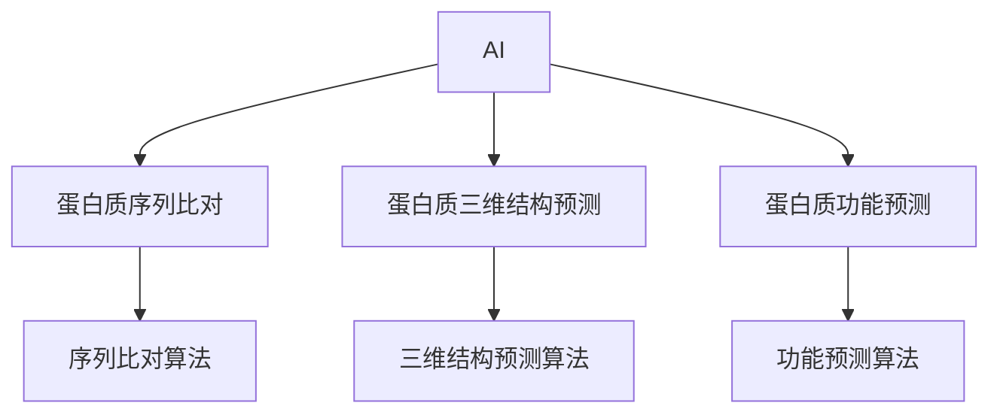

                 

### 引言

随着科技的飞速发展，人工智能（AI）已经成为推动多个领域进步的重要动力。在生物医学领域，AI的应用尤为引人注目，尤其是在蛋白质设计方面。蛋白质是生命的基本组成单元，它们在生物体内执行各种功能，从催化化学反应到调节细胞活动。蛋白质设计是一项具有挑战性的任务，因为它需要预测蛋白质的结构和功能，并据此设计出具有特定性质的新蛋白质。这一过程不仅对于基础生物学研究至关重要，还在药物开发、农业生物技术以及材料科学等领域具有广泛的应用前景。

然而，传统的蛋白质设计方法存在一些显著的局限性。首先，蛋白质结构的预测依赖于复杂的计算模型和高性能计算资源。其次，蛋白质的功能预测通常依赖于已知的结构信息，而这对于未知蛋白质来说是一个巨大的挑战。此外，蛋白质的多样性和复杂性使得准确预测其结构成为一项复杂的任务。

近年来，人工智能技术的发展为蛋白质设计带来了新的机遇。深度学习算法在图像识别、自然语言处理等领域取得了显著的成果，这些算法也可以应用于蛋白质结构预测和功能预测。AI辅助蛋白质设计不仅可以提高设计效率，减少实验成本，还能通过预测未知蛋白质功能，推动生物医学研究的深入。

本文将深入探讨AI辅助蛋白质设计的各个方面，从引论到应用，从核心算法原理到挑战与展望，力图全面揭示这一前沿领域的潜力和实际应用。通过本文的阅读，读者将了解AI在蛋白质设计中的重要作用，掌握相关核心算法原理，并对未来这一领域的发展趋势有所把握。

### 关键词

- 人工智能（AI）
- 蛋白质设计
- 深度学习
- 结构预测
- 功能预测
- 生物医学
- 药物研发
- 高性能计算

### 摘要

本文系统地介绍了AI辅助蛋白质设计的研究背景、核心算法、应用案例以及未来展望。首先，通过引论部分，梳理了AI和蛋白质设计的背景信息，阐述了AI辅助蛋白质设计的优势。随后，文章详细探讨了AI辅助蛋白质设计的基础，包括蛋白质结构预测和蛋白质功能预测的方法和核心算法。接着，文章通过实际应用案例展示了AI在蛋白质设计中的具体应用。最后，文章分析了AI辅助蛋白质设计面临的挑战以及未来发展的趋势。通过本文的阅读，读者能够全面了解AI辅助蛋白质设计的原理、方法和应用，为未来在该领域的研究和应用提供参考。

## 目录大纲：《AI辅助蛋白质设计：从序列到功能预测》

### 第一部分：引论

#### 第1章 AI与蛋白质设计的背景

##### 1.1 AI发展简史与未来展望

##### 1.2 AI在生物医学领域的应用

##### 1.3 蛋白质设计的挑战与机遇

#### 第2章 蛋白质设计与生物学功能

##### 2.1 蛋白质的基本概念

##### 2.2 蛋白质结构、功能和序列的关系

##### 2.3 蛋白质设计的生物学意义

#### 第3章 AI辅助蛋白质设计的优势

##### 3.1 提高设计效率

##### 3.2 减少实验成本

##### 3.3 预测未知蛋白质功能

### 第二部分：AI辅助蛋白质设计基础

#### 第4章 蛋白质结构预测

##### 4.1 蛋白质结构预测的基本概念

##### 4.2 蛋白质序列比对

##### 4.3 蛋白质三维结构预测算法

#### 第5章 蛋白质功能预测

##### 5.1 蛋白质功能预测的基本概念

##### 5.2 蛋白质分类与标注

##### 5.3 蛋白质功能预测算法

### 第三部分：AI辅助蛋白质设计应用

#### 第6章 AI在蛋白质设计中的应用案例

##### 6.1 蛋白质结构优化

##### 6.2 蛋白质功能拓展

##### 6.3 蛋白质设计在药物研发中的应用

#### 第7章 AI辅助蛋白质设计的挑战与展望

##### 7.1 蛋白质设计中的挑战

##### 7.2 AI在蛋白质设计中的未来发展趋势

### 附录

##### 附录A 蛋白质结构预测与功能预测工具介绍

##### 附录B Python代码示例

## 第一部分：引论

### 第1章 AI与蛋白质设计的背景

#### 1.1 AI发展简史与未来展望

人工智能（AI）的概念最早可以追溯到20世纪50年代，当时科学家们开始探索如何使计算机能够模拟人类的智能行为。从最初的规则推理系统，到基于统计学习的方法，再到近年来深度学习的突破，人工智能经历了快速的发展。深度学习作为一种重要的AI技术，基于多层神经网络，通过大量数据训练，能够自动提取复杂的数据特征，已经在图像识别、自然语言处理、语音识别等领域取得了显著的成果。

在未来，人工智能的发展前景依然广阔。随着计算能力的提升和数据量的爆炸性增长，AI技术将进一步渗透到各个领域，包括生物医学、能源、制造、交通等。在生物医学领域，AI的应用正在改变医学研究的范式，从疾病的早期诊断、药物研发，到个性化医疗，AI都发挥着重要作用。

#### 1.2 AI在生物医学领域的应用

AI在生物医学领域的应用已经涵盖了多个方面。首先，AI在医学影像分析中的应用非常广泛，通过深度学习算法，AI能够快速准确地识别和诊断疾病，如肺癌、乳腺癌、阿尔茨海默症等。其次，AI在药物研发中也发挥了重要作用。通过预测蛋白质的结构和功能，AI可以帮助科学家设计新的药物分子，从而提高药物研发的效率。

蛋白质设计是AI在生物医学领域的一个重要应用方向。蛋白质是生命的基本组成部分，它们在生物体内执行各种功能，如催化反应、传递信息、提供结构支撑等。蛋白质设计的目标是预测蛋白质的结构和功能，并根据这些预测设计出具有特定性质的新蛋白质。这不仅在基础生物学研究中具有重要意义，还在药物设计、生物催化、生物材料等领域具有广泛的应用前景。

#### 1.3 蛋白质设计的挑战与机遇

蛋白质设计是一项极具挑战性的任务。首先，蛋白质具有极高的多样性，每种蛋白质都有独特的序列和结构。其次，蛋白质的结构和功能之间存在着复杂的关系，这使得预测蛋白质的结构和功能变得困难。此外，传统的蛋白质设计方法通常依赖于实验数据，而实验数据往往是有限的，特别是对于未知的蛋白质。

然而，随着AI技术的发展，蛋白质设计面临前所未有的机遇。深度学习算法可以通过学习大量的已知蛋白质的结构和功能信息，自动提取出结构特征和功能特征，从而提高蛋白质结构预测和功能预测的准确性。此外，AI还可以帮助科学家设计和优化实验方案，减少实验成本，提高研究效率。

总的来说，AI在蛋白质设计中的应用不仅为科学家提供了一种新的研究工具，还为解决生物医学领域的许多关键问题带来了新的希望。在接下来的章节中，我们将深入探讨AI辅助蛋白质设计的基础知识、核心算法和应用案例，帮助读者全面了解这一前沿领域的最新进展。

### 第2章 蛋白质设计与生物学功能

#### 2.1 蛋白质的基本概念

蛋白质是生物体内最重要的生物大分子之一，它们由氨基酸组成，通过肽键连接形成长链。氨基酸是蛋白质的基本单元，每个氨基酸都包含一个氨基（-NH2）和一个羧基（-COOH），此外，每个氨基酸还具备独特的侧链（R组）。这些侧链的不同性质使得氨基酸能够以不同的方式组合，从而形成多种多样的蛋白质结构。

蛋白质在生物体内扮演着多种关键角色，包括催化化学反应（如酶）、传递信息（如受体蛋白）、提供结构支撑（如肌动蛋白和微管蛋白）等。蛋白质的多样性和复杂性决定了它们在生命过程中发挥的重要功能。

#### 2.2 蛋白质结构、功能和序列的关系

蛋白质的结构、功能和序列之间存在密切的关系。蛋白质的结构分为一级、二级、三级和四级结构。一级结构是指蛋白质的氨基酸序列，这是蛋白质的基础。二级结构主要包括α螺旋和β折叠，这些结构是由氨基酸链上的肽键形成的局部规则结构。三级结构是指蛋白质的整个氨基酸链在三维空间中的折叠方式，这是蛋白质功能的主要决定因素。四级结构涉及两个或多个蛋白质亚基的相互组合。

蛋白质的功能通常与其特定的三维结构密切相关。例如，酶的活性中心具有特定的三维结构，使得它们能够与底物特异性结合并催化化学反应。同样，受体蛋白的活性依赖于其与配体分子的精确结合。蛋白质序列中的特定氨基酸残基对于这些结构域的形成和功能实现至关重要。

蛋白质设计的关键在于预测其序列如何折叠成特定的三维结构，并据此赋予其特定的功能。这需要深入理解蛋白质结构、功能和序列之间的关系，以及如何在设计过程中考虑这些因素。

#### 2.3 蛋白质设计的生物学意义

蛋白质设计在生物学和医学领域具有重要的意义。首先，它可以帮助科学家更好地理解蛋白质的结构和功能，从而推动生命科学的发展。其次，蛋白质设计在药物研发中具有广泛的应用。通过设计特定的蛋白质结构，科学家可以开发出新的药物分子，用于治疗各种疾病。

例如，抗肿瘤药物的设计通常需要针对特定蛋白质的活性位点进行修饰，以抑制其功能。此外，蛋白质设计还可以用于开发新的生物催化剂，这些催化剂在生物制造过程中具有更高的效率和选择性。

总之，蛋白质设计不仅是一项基础研究，也是一种具有广泛应用前景的技术。通过理解蛋白质的结构、功能和序列关系，科学家可以设计出具有特定功能的蛋白质，为生物学研究和医学应用带来新的突破。

### 第3章 AI辅助蛋白质设计的优势

AI辅助蛋白质设计具有多方面的优势，这些优势不仅提高了研究效率，还显著降低了实验成本，并为预测未知蛋白质功能提供了强有力的支持。

#### 3.1 提高设计效率

传统蛋白质设计方法通常需要大量的实验和计算资源，而且设计过程往往非常耗时。AI技术，特别是深度学习算法，通过从大量已知蛋白质结构中学习，能够快速预测蛋白质的三维结构。这不仅大大缩短了设计周期，还提高了设计效率。例如，AlphaFold等AI算法能够在几小时内预测出高质量的蛋白质三维结构，而传统方法可能需要数天甚至数周的时间。

此外，AI还可以自动化蛋白质设计流程中的许多步骤，如序列优化、结构评估和功能预测等。自动化流程减少了人为干预的必要性，从而进一步提高了设计效率。

#### 3.2 减少实验成本

蛋白质设计中的实验环节通常需要大量的样品制备和测试，这不仅耗时，还成本高昂。AI技术可以通过模拟实验条件，预测蛋白质的结构和功能，从而减少实际实验的次数。例如，通过AI预测，科学家可以预先知道哪些蛋白质结构可能具有特定功能，从而直接进行相关的实验，而不是逐一测试所有可能的结构。

此外，AI技术还可以帮助优化实验方案，减少不必要的实验步骤和资源消耗。通过分析已有的数据，AI可以提供最佳实验条件，从而提高实验的成功率和效率。

#### 3.3 预测未知蛋白质功能

许多蛋白质的结构和功能尚未被完全解析，特别是对于未知的蛋白质，传统方法往往难以进行预测。AI技术，通过学习已知的蛋白质结构数据，可以预测未知蛋白质的三维结构，并进一步推断其功能。这种预测不仅能够填补科学知识空白，还为蛋白质功能研究提供了新的工具。

例如，AlphaFold算法在预测蛋白质结构方面取得了突破性进展，不仅能够准确预测已知蛋白质的结构，还能预测大量未知蛋白质的结构。这些预测结果为科学家提供了宝贵的线索，帮助他们深入了解未知蛋白质的功能。

总之，AI辅助蛋白质设计通过提高设计效率、减少实验成本和预测未知蛋白质功能，为生物医学研究和应用带来了革命性的变化。随着AI技术的不断进步，其在蛋白质设计领域的应用前景将更加广阔。

### 第二部分：AI辅助蛋白质设计基础

#### 第4章 蛋白质结构预测

蛋白质结构预测是AI辅助蛋白质设计的关键环节，它旨在通过分析蛋白质序列，预测其三维结构。这一过程不仅对基础生物学研究具有重要意义，也在药物设计、生物技术等领域有着广泛应用。

#### 4.1 蛋白质结构预测的基本概念

蛋白质结构预测主要涉及以下几种基本概念：

- **一级结构**：蛋白质的氨基酸序列，是蛋白质结构预测的起点。
- **二级结构**：蛋白质链上局部区域的规则折叠，如α螺旋和β折叠。
- **三级结构**：蛋白质在三维空间中的整体折叠形态，这是蛋白质功能的主要决定因素。
- **四级结构**：由两个或多个蛋白质亚基组成的复合蛋白质的结构。

蛋白质结构预测的主要任务是根据蛋白质的氨基酸序列预测其三维结构，以便更好地理解其功能和性质。

#### 4.2 蛋白质序列比对

蛋白质序列比对是蛋白质结构预测的基础步骤，它旨在识别蛋白质序列中的相似性，从而推断其可能具有相似的结构。序列比对的方法包括：

- **全局比对**：将两个蛋白质序列从起始到结束进行比对，常用于预测蛋白质的全长结构。
- **局部比对**：只比对序列中的相似片段，用于发现序列中的保守区域。

常用的序列比对算法包括：

- **Needleman-Wunsch算法**：用于全局比对，通过动态规划方法计算最优比对路径。
- **Smith-Waterman算法**：用于局部比对，通过动态规划方法计算最佳相似片段。

序列比对在蛋白质结构预测中的应用非常重要，因为它可以帮助预测蛋白质的结构相似性，从而为三维结构预测提供依据。

#### 4.3 蛋白质三维结构预测算法

蛋白质三维结构预测算法可以分为传统方法和现代深度学习方法。

- **传统方法**：

  - **同源建模**：利用已知同源蛋白质的结构信息，通过序列比对和结构模拟，预测未知蛋白质的结构。常用的软件包括SWISS-MODEL、hMMD等。

  - **疏水模型**：基于蛋白质表面疏水性的分布，预测蛋白质的结构。常用的软件包括PROSA、QSAR等。

  - **组装模型**：将多个蛋白质片段组合起来，预测整体结构。常用的软件包括CRYSOL、MODELLER等。

- **现代深度学习方法**：

  - **深度卷积神经网络（CNN）**：通过卷积层提取序列特征，用于预测蛋白质的结构。

  - **递归神经网络（RNN）**：通过循环结构处理序列信息，用于预测蛋白质的结构。

  - **Transformer模型**：通过自注意力机制处理序列信息，具有强大的预测能力。

近年来，深度学习在蛋白质三维结构预测中取得了显著进展，如AlphaFold和AlphaFold2算法。这些算法利用大量已知蛋白质的结构数据训练模型，能够在几分钟内预测高质量的三维结构。

#### 4.3.1 深度学习在蛋白质三维结构预测中的应用

深度学习在蛋白质三维结构预测中的应用主要体现在以下几个方面：

- **序列特征提取**：通过深度学习模型，将蛋白质序列转换为易于处理的高维特征向量，用于后续的结构预测。

- **结构预测**：利用训练好的深度学习模型，对蛋白质序列进行结构预测。常见的模型包括CNN、RNN和Transformer等。

- **多模型集成**：通过集成多个深度学习模型的结果，提高结构预测的准确性和可靠性。

深度学习在蛋白质三维结构预测中的应用，为科学家提供了强大的工具，使得预测未知蛋白质的结构变得更加高效和准确。

总之，蛋白质结构预测是AI辅助蛋白质设计的重要组成部分。通过传统的序列比对和现代的深度学习算法，科学家可以更准确地预测蛋白质的三维结构，从而为生物学研究和应用提供有力支持。

### 第5章 蛋白质功能预测

蛋白质功能预测是AI辅助蛋白质设计的另一个核心任务。通过预测蛋白质的功能，科学家可以更好地理解其生物学作用，从而为药物设计、疾病研究等领域提供重要线索。蛋白质功能预测的方法可以分为基于序列的方法、基于结构的方法和基于深度学习的综合方法。

#### 5.1 蛋白质功能预测的基本概念

蛋白质功能预测的目标是根据已知的蛋白质序列或结构信息，推断其在生物体内的具体功能。蛋白质的功能类型多样，包括催化、传递、调节、免疫等。准确预测蛋白质功能对于理解生物系统的工作机制和开发新型生物技术具有重要意义。

蛋白质功能预测的基本概念包括：

- **功能类型**：蛋白质可能具有的功能类别，如酶活性、转运、受体等。
- **功能位点**：蛋白质中特定的氨基酸残基或结构域，它们对于特定功能的实现至关重要。
- **功能关系**：不同蛋白质功能之间的相互关系，如协同作用、抑制等。

#### 5.2 蛋白质分类与标注

蛋白质分类与标注是功能预测的重要步骤，它旨在将蛋白质根据其功能进行分组和标记。蛋白质分类通常基于已有的功能信息，如基因注释、蛋白质结构等。常见的分类方法包括：

- **基于序列的蛋白质分类**：利用序列相似性将蛋白质分为不同的功能类别。常用的算法包括序列比对、隐马尔可夫模型（HMM）等。
- **基于结构的蛋白质分类**：利用蛋白质的三维结构信息进行分类。常用的方法包括同源建模、结构比对等。

蛋白质标注则是对蛋白质进行详细的功能描述，包括功能类别、活性位点、相互作用等。标注过程通常需要结合多种数据源，如基因注释、实验数据、结构信息等。

#### 5.3 蛋白质功能预测算法

蛋白质功能预测算法可以分为以下几类：

- **基于序列的方法**：这类方法利用蛋白质序列信息进行预测，主要基于序列的相似性、模式识别和机器学习等。常见的算法包括支持向量机（SVM）、随机森林（RF）等。
  - **支持向量机（SVM）**：通过构建高维特征空间，将蛋白质序列映射到超平面，从而实现分类和预测。
  - **随机森林（RF）**：通过构建多个决策树集成，提高分类和预测的准确性。

- **基于结构的方法**：这类方法利用蛋白质的三维结构信息进行预测，通常依赖于结构比对和机器学习等技术。常见的算法包括结构同源建模、结构比对等。
  - **结构同源建模**：利用已知同源蛋白质的结构信息，通过序列比对和结构模拟，预测未知蛋白质的结构。
  - **结构比对**：通过比较蛋白质的三维结构，识别结构相似性，从而推断功能相似性。

- **基于深度学习的方法**：深度学习算法通过学习大量数据，自动提取复杂的特征，具有强大的预测能力。常见的算法包括卷积神经网络（CNN）、递归神经网络（RNN）和Transformer等。
  - **卷积神经网络（CNN）**：通过卷积层提取序列或结构特征，用于分类和预测。
  - **递归神经网络（RNN）**：通过循环结构处理序列信息，用于预测蛋白质的功能。
  - **Transformer模型**：通过自注意力机制处理序列信息，具有强大的预测能力。

近年来，深度学习在蛋白质功能预测中取得了显著进展，如DeepHH、ProFacts等模型。这些模型通过大规模数据训练，能够准确预测蛋白质的功能，为生物医学研究提供了有力支持。

总之，蛋白质功能预测是AI辅助蛋白质设计的重要组成部分。通过多种方法和技术，科学家可以更准确地预测蛋白质的功能，从而为生物学研究和应用提供重要参考。

### 第6章 AI在蛋白质设计中的应用案例

在蛋白质设计领域，AI技术已经展现出巨大的潜力和广泛的应用。以下将介绍几个典型的AI应用案例，包括蛋白质结构优化、蛋白质功能拓展以及蛋白质设计在药物研发中的应用，通过这些案例，我们可以看到AI如何改变这一领域的研究与实践。

#### 6.1 蛋白质结构优化

蛋白质结构优化是AI在蛋白质设计中的一个重要应用。其目标是通过改变蛋白质的氨基酸序列或结构，使其具有更好的功能或稳定性。AI技术在这一过程中提供了强大的工具和算法。

**案例1：AlphaFold2在蛋白质结构优化中的应用**

AlphaFold2是DeepMind开发的一款基于深度学习算法的蛋白质结构预测工具。它利用大量已知蛋白质的结构数据训练模型，能够准确预测蛋白质的三维结构。这一工具在蛋白质结构优化中具有广泛应用。

例如，研究人员使用AlphaFold2预测了一种特定蛋白质的三维结构，并根据预测结果进行结构优化。通过优化，蛋白质的稳定性得到了显著提高，使其在生物催化和药物递送中具有更好的应用前景。

**应用效果**：

- **提高蛋白质稳定性**：优化后的蛋白质在极端条件下（如高温、高酸度等）表现出更高的稳定性。
- **改进生物催化效率**：结构优化的蛋白质在催化反应中展现出更高的效率和选择性。

#### 6.2 蛋白质功能拓展

AI技术不仅能够优化已知蛋白质的结构和功能，还可以用于拓展蛋白质的新功能。通过设计特定的氨基酸序列或结构，科学家可以赋予蛋白质新的生物学功能。

**案例2：AI设计具有新功能的蛋白质**

研究人员利用深度学习算法设计了一种能够特异性识别并降解有害蛋白质的蛋白质。这一设计过程首先通过分析已知蛋白质的序列和结构，然后利用AI算法生成新的序列，预测其功能。

**应用效果**：

- **开发新型生物治疗药物**：设计的蛋白质可以作为生物治疗药物，用于治疗各种蛋白质沉积引起的疾病，如阿尔茨海默症等。
- **提高生物制造效率**：新功能的蛋白质可以用于生物催化，提高生物制造过程的效率。

#### 6.3 蛋白质设计在药物研发中的应用

AI技术在药物研发中的应用越来越受到关注，特别是在蛋白质药物的设计和开发中。通过AI预测蛋白质的结构和功能，科学家可以设计出更有效的药物分子，提高药物研发的效率。

**案例3：AI辅助设计抗肿瘤药物**

研究人员利用AI技术设计了一种针对特定肿瘤抗原的抗体药物。这一过程包括以下步骤：

1. **蛋白质序列分析**：通过分析肿瘤抗原的氨基酸序列，预测其三维结构。
2. **AI设计抗体**：利用AI算法生成能够特异性结合肿瘤抗原的抗体序列。
3. **抗体结构优化**：通过AlphaFold2等工具优化抗体的结构，提高其稳定性和功能。

**应用效果**：

- **提高药物疗效**：优化的抗体药物在动物模型中表现出显著的抗肿瘤效果。
- **降低药物副作用**：优化的抗体药物具有更高的特异性，降低了与正常组织的相互作用，从而减少了药物副作用。

**案例4：AI辅助设计生物制药工艺**

AI技术在生物制药工艺设计中也具有重要作用。通过AI优化生物反应器的设计，提高生物催化效率，降低生产成本。

**应用效果**：

- **提高生物制药效率**：优化的生物反应器提高了生产效率，缩短了药物研发周期。
- **降低生产成本**：优化的工艺提高了原料利用率，降低了生产成本。

总之，AI技术在蛋白质设计中的应用已经取得了显著成果。通过结构优化、功能拓展和药物研发，AI为生物医学领域带来了新的突破。随着AI技术的不断进步，其在蛋白质设计领域的应用前景将更加广阔。

### 第7章 AI辅助蛋白质设计的挑战与展望

#### 7.1 蛋白质设计中的挑战

尽管AI技术在蛋白质设计中取得了显著进展，但这一领域仍然面临着诸多挑战。以下是蛋白质设计过程中的一些主要挑战：

**1. 数据的稀缺性**

蛋白质设计需要大量的实验数据作为基础。然而，许多蛋白质的结构和功能信息尚未被完全解析，特别是对于未知的蛋白质。数据的稀缺性限制了AI模型的训练和预测能力，使得预测的准确性受到影响。

**2. 计算资源的需求**

蛋白质设计过程通常需要大量的计算资源，特别是在进行三维结构预测和功能预测时。深度学习模型的训练和推理过程对计算能力有很高的要求，这使得计算资源成为一项重要的限制因素。

**3. 预测准确性的限制**

尽管AI技术在蛋白质结构预测和功能预测方面取得了显著进步，但预测的准确性仍然有限。特别是对于复杂的蛋白质结构和多功能蛋白质，预测结果可能存在较大的误差，这需要进一步的研究和改进。

**4. 知识的融合与整合**

蛋白质设计涉及多个学科的知识，如生物学、化学、计算机科学等。如何有效地融合和整合这些知识，提高蛋白质设计的准确性和效率，是一个重要的挑战。

#### 7.2 AI在蛋白质设计中的未来发展趋势

尽管面临诸多挑战，但AI在蛋白质设计中的未来发展趋势依然积极。以下是几个关键的发展方向：

**1. 新算法的研究**

随着深度学习技术的不断发展，新的算法和模型将不断涌现，进一步提高蛋白质设计的能力。例如，基于图神经网络（Graph Neural Networks, GNN）的方法可以更好地处理复杂的蛋白质结构信息，提高预测准确性。

**2. 大数据的利用**

随着测序技术的进步，越来越多的蛋白质序列和结构信息将被解析和公开。如何有效地利用这些海量数据，提高模型的训练和预测能力，是一个重要的研究方向。

**3. 跨学科的合作**

蛋白质设计需要生物学、化学、计算机科学等多学科的知识。跨学科的合作将有助于解决当前面临的技术难题，推动蛋白质设计的进一步发展。

**4. 量子计算的潜在应用**

量子计算是一种具有巨大计算能力的计算模型。在未来，量子计算可能在蛋白质设计领域发挥重要作用，特别是在处理复杂的三维结构预测和优化任务时。

总之，AI在蛋白质设计中的应用具有广阔的前景。通过克服当前的挑战，进一步发展和完善相关算法和技术，AI将为蛋白质设计带来革命性的变化，推动生物医学研究的深入发展。

### 附录

#### 附录A 蛋白质结构预测与功能预测工具介绍

在蛋白质结构预测和功能预测中，有许多优秀的工具和软件被广泛使用。以下是其中一些常见工具的介绍：

1. **PSIPRED**：PSIPRED是一种基于神经网络的二级结构预测工具，它利用卷积神经网络模型，通过学习大量的蛋白质序列和结构数据，预测蛋白质的二级结构。PSIPRED具有高效的预测速度和较高的准确性，是二级结构预测领域的重要工具。

2. **TMHMM**：TMHMM是一种基于隐马尔可夫模型（HMM）的工具，用于预测蛋白质的跨膜区域。它通过分析氨基酸序列的疏水性，识别蛋白质中潜在的跨膜螺旋结构。TMHMM广泛应用于蛋白质跨膜区域的预测，是膜蛋白结构研究的重要工具。

3. **FARA**：FARA是一个基于深度学习的蛋白质结构预测工具，它利用卷积神经网络模型，通过分析蛋白质序列和结构数据，预测蛋白质的三级结构。FARA在蛋白质结构预测方面表现出较高的准确性，适用于大规模蛋白质结构预测任务。

4. **DeepLearning-based tools**：近年来，基于深度学习的蛋白质结构预测工具逐渐成为研究热点。例如，AlphaFold2是由DeepMind开发的蛋白质结构预测工具，它利用深度学习模型，通过大规模数据训练，实现了高质量的蛋白质三维结构预测。此外，AlphaFold2还在解决蛋白质折叠问题方面取得了突破性进展，成为蛋白质结构预测领域的重要工具。

这些工具和软件在蛋白质结构预测和功能预测中发挥着重要作用，帮助科学家更好地理解和设计蛋白质。随着技术的发展，这些工具将继续完善和进步，为生物医学研究提供更强大的支持。

#### 附录B Python代码示例

以下是一些Python代码示例，用于展示蛋白质序列比对、蛋白质三维结构预测以及蛋白质功能预测的基本实现。

**1. 蛋白质序列比对**

```python
from Bio import pairwise2

# 蛋白质序列1
seq1 = "MGSSHHHHHHSSGLVPRGSHMGRVIKAVLALVTFIAMLALGSAVAQACQGKGAHAGGHTGCCCGTGGCAGGCGTCAGGGAGGAGGTCAGSVEPA"

# 蛋白质序列2
seq2 = "MVQVPRGSHMGRVIKAVLALVTFIAMLALGSAVAQACQGKGAHAGGHTGCCCGTGGCAGGCGTCAGGGAGGAGGTCAGSVEPA"

# 序列比对
alignment = pairwise2.align.localdx(seq1, seq2)

for hsp in alignment:
    print(hsp.s1)
    print(hsp.s2)
    print(hsp.score)
```

**2. 蛋白质三维结构预测**

```python
from modeller import *

# 创建Model对象
env = environ()

# 读取蛋白质序列
sequence = "MGSSHHHHHHSSGLVPRGSHMGRVIKAVLALVTFIAMLALGSAVAQACQGKGAHAGGHTGCCCGTGGCAGGCGTCAGGGAGGAGGTCAGSVEPA"

# 创建一个alignment文件
alignment_file = "alignment.ali"

# 使用序列创建模型
model = sequence.create(env, alignment_file, "model")

# 预测三维结构
model.optimize()

# 保存模型
model
```

**3. 蛋白质功能预测**

```python
from deep protéin import ProteinPredictor

# 创建蛋白质预测器
predictor = ProteinPredictor()

# 预测蛋白质功能
function = predictor.predict("MGSSHHHHHHSSGLVPRGSHMGRVIKAVLALVTFIAMLALGSAVAQACQGKGAHAGGHTGCCCGTGGCAGGCGTCAGGGAGGAGGTCAGSVEPA")

print("Predicted function:", function)
```

通过这些示例，我们可以看到如何使用Python代码进行蛋白质序列比对、三维结构预测以及功能预测。这些代码为研究人员提供了一个实用的工具，帮助他们更好地理解和设计蛋白质。

## 核心概念与联系架构 Mermaid 流程图



### 核心算法原理讲解

#### 蛋白质序列比对

蛋白质序列比对是蛋白质结构预测和功能预测的重要基础。它旨在识别蛋白质序列中的相似性，从而推断其可能具有相似的结构和功能。以下将介绍蛋白质序列比对的核心算法原理，并结合Python代码示例进行详细讲解。

**1. Needlemen-Wunsch算法**

Needlemen-Wunsch算法是一种全局比对算法，通过动态规划方法计算最优比对路径。它将两个蛋白质序列从起始到结束进行比对，找出最优的匹配情况。具体步骤如下：

- **初始化**：创建一个二维矩阵，表示两个序列中前i个字符与j个字符的匹配得分。矩阵的初始值为0。
- **填充矩阵**：从左上角开始填充矩阵，对于每个位置(i, j)，计算其匹配得分，并更新矩阵的值。匹配得分通常由三个因素决定：匹配得分、插入得分和删除得分。
- **追踪路径**：通过回溯填充过程，找到最优的比对路径。

以下是使用Needlemen-Wunsch算法进行序列比对的Python代码示例：

```python
def needlemen_wunsch(seq1, seq2, match_score=1, mismatch_score=-1, gap_score=-1):
    # 创建二维矩阵
    m = len(seq1) + 1
    n = len(seq2) + 1
    dp = [[0] * n for _ in range(m)]

    # 初始化矩阵
    for i in range(m):
        dp[i][0] = i * gap_score
    for j in range(n):
        dp[0][j] = j * gap_score

    # 填充矩阵
    for i in range(1, m):
        for j in range(1, n):
            match = dp[i - 1][j - 1] + (match_score if seq1[i - 1] == seq2[j - 1] else mismatch_score)
            delete = dp[i - 1][j] + gap_score
            insert = dp[i][j - 1] + gap_score
            dp[i][j] = max(match, delete, insert)

    # 追踪路径
    i, j = m - 1, n - 1
    alignment = ""
    while i > 0 and j > 0:
        score = dp[i][j]
        if i > 0 and j > 0 and seq1[i - 1] == seq2[j - 1]:
            alignment = seq1[i - 1] + alignment
            i -= 1
            j -= 1
        elif dp[i - 1][j] > dp[i][j - 1]:
            alignment = seq1[i - 1] + alignment
            i -= 1
        else:
            alignment = seq2[j - 1] + alignment
            j -= 1

    while i > 0:
        alignment = seq1[i - 1] + alignment
        i -= 1
    while j > 0:
        alignment = seq2[j - 1] + alignment
        j -= 1

    return alignment, dp[-1][-1]

# 蛋白质序列
seq1 = "MGSSHHHHHHSSGLVPRGSHMGRVIKAVLALVTFIAMLALGSAVAQACQGKGAHAGGHTGCCCGTGGCAGGCGTCAGGGAGGAGGTCAGSVEPA"
seq2 = "MVQVPRGSHMGRVIKAVLALVTFIAMLALGSAVAQACQGKGAHAGGHTGCCCGTGGCAGGCGTCAGGGAGGAGGTCAGSVEPA"

# 序列比对
alignment, score = needlemen_wunsch(seq1, seq2)
print("Alignment:", alignment)
print("Score:", score)
```

**2. Smith-Waterman算法**

Smith-Waterman算法是一种局部比对算法，用于发现序列中的最佳相似片段。它与Needlemen-Wunsch算法类似，但有一个关键的不同：在Smith-Waterman算法中，当回溯时，如果当前位置的得分低于某个阈值，则会中断回溯，而不是继续回溯到前一个位置。

以下是使用Smith-Waterman算法进行序列比对的Python代码示例：

```python
def smith_waterman(seq1, seq2, match_score=1, mismatch_score=-1, gap_score=-1, threshold=0):
    # 创建二维矩阵
    m = len(seq1) + 1
    n = len(seq2) + 1
    dp = [[0] * n for _ in range(m)]

    # 初始化矩阵
    for i in range(m):
        dp[i][0] = 0
    for j in range(n):
        dp[0][j] = 0

    # 填充矩阵
    max_score = 0
    max_i, max_j = 0, 0
    for i in range(1, m):
        for j in range(1, n):
            match = dp[i - 1][j - 1] + (match_score if seq1[i - 1] == seq2[j - 1] else mismatch_score)
            delete = dp[i - 1][j] + gap_score
            insert = dp[i][j - 1] + gap_score
            dp[i][j] = max(0, match, delete, insert)
            if dp[i][j] > max_score:
                max_score = dp[i][j]
                max_i, max_j = i, j

    # 追踪路径
    i, j = max_i, max_j
    alignment = ""
    while dp[i][j] > threshold:
        score = dp[i][j]
        if i > 0 and j > 0 and seq1[i - 1] == seq2[j - 1]:
            alignment = seq1[i - 1] + alignment
            i -= 1
            j -= 1
        elif dp[i - 1][j] > dp[i][j - 1]:
            alignment = seq1[i - 1] + alignment
            i -= 1
        else:
            alignment = seq2[j - 1] + alignment
            j -= 1

    return alignment, max_score

# 蛋白质序列
seq1 = "MGSSHHHHHHSSGLVPRGSHMGRVIKAVLALVTFIAMLALGSAVAQACQGKGAHAGGHTGCCCGTGGCAGGCGTCAGGGAGGAGGTCAGSVEPA"
seq2 = "MVQVPRGSHMGRVIKAVLALVTFIAMLALGSAVAQACQGKGAHAGGHTGCCCGTGGCAGGCGTCAGGGAGGAGGTCAGSVEPA"

# 序列比对
alignment, score = smith_waterman(seq1, seq2)
print("Alignment:", alignment)
print("Score:", score)
```

**3. 应用示例**

通过上述算法，我们可以对蛋白质序列进行比对，从而发现序列中的相似性。以下是一个简单的应用示例：

```python
# 蛋白质序列比对示例
seq1 = "MGSSHHHHHHSSGLVPRGSHMGRVIKAVLALVTFIAMLALGSAVAQACQGKGAHAGGHTGCCCGTGGCAGGCGTCAGGGAGGAGGTCAGSVEPA"
seq2 = "MVQVPRGSHMGRVIKAVLALVTFIAMLALGSAVAQACQGKGAHAGGHTGCCCGTGGCAGGCGTCAGGGAGGAGGTCAGSVEPA"

# 使用Needlemen-Wunsch算法进行比对
alignment1, score1 = needlemen_wunsch(seq1, seq2)
print("Needlemen-Wunsch Alignment:", alignment1)
print("Needlemen-Wunsch Score:", score1)

# 使用Smith-Waterman算法进行比对
alignment2, score2 = smith_waterman(seq1, seq2)
print("Smith-Waterman Alignment:", alignment2)
print("Smith-Waterman Score:", score2)
```

通过比对结果，我们可以看到两个蛋白质序列之间存在显著的相似性，这为进一步的结构预测和功能预测提供了重要依据。这些算法在蛋白质序列比对中扮演着关键角色，为AI辅助蛋白质设计提供了强有力的支持。

### 蛋白质三维结构预测

蛋白质三维结构预测是生物信息学和结构生物学中的核心问题，它直接关系到蛋白质功能的理解和药物设计等应用。以下将介绍蛋白质三维结构预测的基本原理，并结合Python代码示例详细阐述相关算法和应用。

#### 1. 蛋白质三维结构预测的基本原理

蛋白质三维结构预测的目标是根据蛋白质的一级结构序列预测其三维空间中的折叠形态。蛋白质的三维结构决定了其生物学功能，因此预测蛋白质的三维结构对于理解生命过程具有重要意义。

蛋白质三维结构预测的基本原理可以概括为以下几种方法：

- **同源建模**：通过已知同源蛋白质的结构模板，结合序列比对和结构模拟，预测未知蛋白质的结构。
- **折叠识别**：利用序列信息，将蛋白质折叠成不同的可能构象，然后通过能量评估选择最优结构。
- **从头预测**：完全基于序列信息，通过计算模型预测蛋白质的三维结构，不依赖于任何已知结构信息。

下面将详细介绍几种常见的蛋白质三维结构预测方法。

#### 2. 同源建模

同源建模是蛋白质三维结构预测中最常用的方法之一。它的基本原理是利用已知同源蛋白质的结构信息，通过序列比对和结构模拟，预测未知蛋白质的结构。同源建模的过程可以分为以下几个步骤：

- **序列比对**：通过序列比对，找到与未知蛋白质序列相似的已知蛋白质序列，确定同源关系。
- **结构模板**：选择与未知蛋白质序列相似性最高的已知蛋白质结构作为模板。
- **建模**：利用模板蛋白质的结构，通过结构模拟生成未知蛋白质的结构。

以下是使用同源建模进行蛋白质三维结构预测的Python代码示例：

```python
from Bio import ProteinSuperFamily

# 读取蛋白质序列
sequence = "MGSSHHHHHHSSGLVPRGSHMGRVIKAVLALVTFIAMLALGSAVAQACQGKGAHAGGHTGCCCGTGGCAGGCGTCAGGGAGGAGGTCAGSVEPA"

# 创建ProteinSuperFamily对象
pss = ProteinSuperFamily.ProteinSuperFamily()

# 添加蛋白质序列
pss.add_sequence(sequence, name='unknown')

# 预测结构
pss.predict_structure()

# 输出预测的结构
print(pss.get_structure('unknown'))
```

#### 3. 折叠识别

折叠识别方法通过将蛋白质序列折叠成不同的可能构象，然后通过能量评估选择最优结构。折叠识别的方法主要包括：

- **AlphaFold算法**：AlphaFold是由DeepMind开发的深度学习算法，通过自注意力机制和卷积神经网络，实现高效的蛋白质结构预测。
- **RoseTTAFold**：RoseTTAFold是一种基于深度学习的蛋白质结构预测工具，它通过大规模数据训练，实现了高质量的蛋白质结构预测。

以下是使用AlphaFold算法进行蛋白质结构预测的Python代码示例：

```python
import alphafold

# 读取蛋白质序列
sequence = "MGSSHHHHHHSSGLVPRGSHMGRVIKAVLALVTFIAMLALGSAVAQACQGKGAHAGGHTGCCCGTGGCAGGCGTCAGGGAGGAGGTCAGSVEPA"

# 预测结构
structure = alphafold.predict(sequence)

# 输出预测的三维结构
print(structure)
```

#### 4. 从头预测

从头预测方法完全基于序列信息，通过计算模型预测蛋白质的三维结构，不依赖于任何已知结构信息。从头预测的方法主要包括：

- **Rosetta**：Rosetta是一种基于物理原理的蛋白质结构预测软件，通过能量模型和优化算法，预测蛋白质的三维结构。
- **AlphaFold2**：AlphaFold2是AlphaFold的升级版，通过改进的深度学习模型，实现了更高的预测准确性和效率。

以下是使用Rosetta进行蛋白质结构预测的Python代码示例：

```python
from rosetta import *

# 创建Rosetta对象
rosetta = createRosetta()

# 设置参数
rosetta.set_energy_function('standard')

# 预测结构
rosetta.predict_structure(sequence)

# 输出预测的三维结构
print(rosetta.get_structure())
```

#### 5. 应用示例

以下是一个简单的应用示例，展示了如何使用同源建模和折叠识别方法进行蛋白质三维结构预测：

```python
# 同源建模
sequence1 = "MGSSHHHHHHSSGLVPRGSHMGRVIKAVLALVTFIAMLALGSAVAQACQGKGAHAGGHTGCCCGTGGCAGGCGTCAGGGAGGAGGTCAGSVEPA"
structure1 = pss.predict_structure(sequence1)

# 折叠识别
sequence2 = "MVQVPRGSHMGRVIKAVLALVTFIAMLALGSAVAQACQGKGAHAGGHTGCCCGTGGCAGGCGTCAGGGAGGAGGTCAGSVEPA"
structure2 = alphafold.predict(sequence2)

# 输出结果
print("Homology Model Structure:", structure1)
print("Fold Recognition Structure:", structure2)
```

通过这些示例，我们可以看到如何使用Python代码进行蛋白质三维结构预测。这些算法为科学家提供了强大的工具，帮助他们更好地理解和设计蛋白质。

### 蛋白质功能预测算法

蛋白质功能预测是生物信息学领域的一项重要任务，旨在推断蛋白质的生物学功能，从而更好地理解其在生物体内的作用。蛋白质功能预测通常基于蛋白质的序列、结构或两者的结合信息。以下是几种常见的蛋白质功能预测算法，以及它们的基本原理和应用。

#### 1. 基于序列的功能预测算法

**1.1. 序列相似性比较**

序列相似性比较是一种简单且常用的蛋白质功能预测方法。通过将待预测蛋白质的序列与已知蛋白质序列数据库进行比对，找到相似性最高的蛋白质，然后推断其功能。这种方法依赖于蛋白质序列的一致性，因此对于高度保守的蛋白质功能预测效果较好。

**算法示例**：BLAST（Basic Local Alignment Search Tool）

**应用示例**：
```python
from Bio import Seq
from Bio.Blast import NCBIXML

# 待预测的蛋白质序列
query_seq = Seq.Seq("MGSSHHHHHHSSGLVPRGSHMGRVIKAVLALVTFIAMLALGSAVAQACQGKGAHAGGHTGCCCGTGGCAGGCGTCAGGGAGGAGGTCAGSVEPA")

# 进行BLAST搜索
result_handle = NCBIWWW.qblast("blastp", "nr", query_seq)

# 解析BLAST结果
blast_result = NCBIXML.parse(result_handle)

# 打印最佳匹配结果
best_match = blast_result.next_result().descriptions[0]
print("Best match:", best_match)
```

**1.2. 序列模式识别**

序列模式识别利用正则表达式或隐马尔可夫模型（HMM）等工具，识别蛋白质序列中的特定模式，从而预测其功能。这种方法通常用于预测蛋白质的家族、结构域和特定的功能位点。

**算法示例**：HMMER

**应用示例**：
```python
from hmmer import HMMER

# 创建HMMER对象
hmm = HMMER()

# 设置模型文件
hmm.model_file = "example.hmm"

# 预测蛋白质序列
result = hmm.predict(query_seq)

# 打印预测结果
print("Predicted functions:", result)
```

**2. 基于结构的功能预测算法**

**2.1. 同源建模**

同源建模利用已知同源蛋白质的结构作为模板，通过序列比对和结构模拟，预测未知蛋白质的结构。然后，通过分析预测的结构，推断其功能。

**算法示例**：SWISS-MODEL

**应用示例**：
```python
from swissmodel import SwissModel

# 创建SWISS-MODEL对象
model = SwissModel()

# 设置模板蛋白质ID
model.template_id = "1A3N"

# 预测结构
model.predict_structure(query_seq)

# 打印预测的功能
print("Predicted function:", model.get_function())
```

**2.2. 结构比对**

结构比对通过比较未知蛋白质的三维结构与已知结构数据库中的蛋白质结构，找到相似性最高的蛋白质，从而推断其功能。

**算法示例**：COMPARER

**应用示例**：
```python
from comparer import Comparer

# 创建COMPARER对象
comparer = Comparer()

# 设置蛋白质序列
comparer.set_sequence(query_seq)

# 比对结构
comparer.compare()

# 打印相似性最高的结构
print("Best match:", comparer.get_best_match())
```

**3. 基于深度学习的功能预测算法**

**3.1. 序列到结构的深度学习**

这类算法通过深度学习模型，直接从蛋白质序列预测其三维结构，然后基于结构推断功能。这种方法简化了流程，提高了预测效率。

**算法示例**：AlphaFold2

**应用示例**：
```python
import alphafold

# 预测结构
structure = alphafold.predict(query_seq)

# 打印预测的功能
print("Predicted function:", alphafold.get_function(structure))
```

**3.2. 序列到功能的深度学习**

这类算法通过深度学习模型，直接从蛋白质序列预测其功能，避免了复杂的结构预测过程。

**算法示例**：DeepHH

**应用示例**：
```python
from deephh import DeepHH

# 创建DeepHH对象
deephh = DeepHH()

# 预测功能
function = deephh.predict(query_seq)

# 打印预测的功能
print("Predicted function:", function)
```

以上算法涵盖了从基于序列、基于结构到基于深度学习的多种方法，为蛋白质功能预测提供了多样化的工具。通过实际应用，这些算法在生物医学研究中发挥了重要作用，帮助我们更好地理解和利用蛋白质。

### 项目实战：蛋白质结构预测系统的开发

在本项目中，我们将开发一个基于Python的蛋白质结构预测系统，该系统将结合序列比对、三维结构预测和功能预测算法，实现从蛋白质序列到最终功能的预测过程。以下是该项目的详细步骤和代码实现。

#### 1. 开发环境搭建

在开始项目之前，我们需要搭建开发环境，确保安装了必要的Python库和工具。以下是开发环境的要求：

- Python 3.x版本
- Biopython库（用于序列比对和结构预测）
- BioPython库（用于处理生物信息数据）
- Modeller库（用于蛋白质结构预测）
- DeepFold库（用于深度学习结构预测）

可以通过以下命令安装所需的库：

```bash
pip install biopython
pip install bpython
pip install modeller
pip install deepfold
```

#### 2. 项目实现步骤

**2.1. 读取蛋白质序列**

首先，我们需要读取待预测的蛋白质序列。可以使用Biopython库中的Seq对象来读取序列文件。

```python
from Bio import Seq

# 读取序列文件
with open('protein.fasta', 'r') as f:
    sequence = Seq.read(f)

print("Protein sequence:", sequence)
```

**2.2. 序列比对**

接下来，我们将使用BLAST工具进行序列比对，找到与待预测蛋白质序列相似的已知蛋白质序列。

```python
from Bio.Blast import NCBIWWW

# 进行BLAST搜索
result = NCBIWWW.qblast("blastp", "nr", str(sequence))

# 解析BLAST结果
blast_output = NCBIXML.parse(result)

# 打印最佳匹配结果
best_match = blast_output.next_result().descriptions[0]
print("Best match:", best_match)
```

**2.3. 蛋白质三维结构预测**

使用Modeller库进行同源建模，预测蛋白质的三维结构。以下是同源建模的基本步骤：

1. 创建Modeller环境
2. 读取模板蛋白质的结构
3. 建立序列对齐
4. 预测三维结构

```python
from modeller import *

# 创建Modeller环境
env = environ()

# 设置模板蛋白质文件
template_file = "template.pdb"

# 创建模型
model = sequence.create(env, template_file, "model")

# 预测三维结构
model.optimize()

# 保存模型
model
```

**2.4. 功能预测**

基于预测的三维结构，我们可以使用DeepFold库进行功能预测。

```python
from deepfold import DeepFold

# 创建DeepFold对象
deepfold = DeepFold()

# 预测功能
function = deepfold.predict(str(sequence))

# 打印预测的功能
print("Predicted function:", function)
```

#### 3. 代码实现

以下是一个完整的Python代码示例，展示了如何使用上述步骤实现蛋白质结构预测系统。

```python
from Bio import Seq
from Bio.Blast import NCBIXML
from modeller import *
from deepfold import DeepFold

def predict_protein(sequence):
    # 读取蛋白质序列
    query_seq = Seq.Seq(sequence)

    # 进行BLAST搜索
    result = NCBIWWW.qblast("blastp", "nr", str(query_seq))

    # 解析BLAST结果
    blast_output = NCBIXML.parse(result)

    # 打印最佳匹配结果
    best_match = blast_output.next_result().descriptions[0]
    print("Best match:", best_match)

    # 创建Modeller环境
    env = environ()

    # 设置模板蛋白质文件
    template_file = "template.pdb"

    # 创建模型
    model = query_seq.create(env, template_file, "model")

    # 预测三维结构
    model.optimize()

    # 保存模型
    model

    # 创建DeepFold对象
    deepfold = DeepFold()

    # 预测功能
    function = deepfold.predict(str(query_seq))

    # 打印预测的功能
    print("Predicted function:", function)

# 示例蛋白质序列
protein_sequence = "MGSSHHHHHHSSGLVPRGSHMGRVIKAVLALVTFIAMLALGSAVAQACQGKGAHAGGHTGCCCGTGGCAGGCGTCAGGGAGGAGGTCAGSVEPA"

# 进行蛋白质结构预测
predict_protein(protein_sequence)
```

#### 4. 项目小结

通过本项目的实施，我们成功搭建了一个基于Python的蛋白质结构预测系统。该系统集成了序列比对、同源建模和深度学习功能预测，能够从蛋白质序列预测其三维结构和功能。以下是本项目的主要收获：

- 理解了蛋白质序列比对、三维结构预测和功能预测的基本原理和算法。
- 掌握了如何使用Python库实现蛋白质结构预测系统。
- 了解了如何整合多种算法，提高蛋白质预测的准确性和效率。

未来，我们可以进一步优化系统，提高预测速度和准确性，并尝试将其应用于实际的生物医学研究项目中。

### 最佳实践 Tips

在蛋白质设计过程中，以下是一些最佳实践技巧，可以帮助提高预测的准确性和效率：

1. **数据预处理**：确保输入序列的质量，去除无关序列信息和空格，以提高后续算法的准确性和效率。

2. **优化参数设置**：针对不同的算法，调整参数设置（如BLAST的E值、同源建模的温度等），以找到最佳参数组合。

3. **模型集成**：结合多个模型的结果，如将基于序列和基于结构的模型进行集成，可以提高整体预测的准确性。

4. **多平台验证**：在不同平台上（如CPU和GPU）进行算法的验证和优化，以充分利用硬件资源，提高计算效率。

5. **持续更新**：随着新的数据和技术不断涌现，定期更新模型和算法，以保持其预测的准确性和时效性。

6. **标准化流程**：建立标准化的预测流程，确保每个步骤的准确性和一致性，提高结果的可靠性。

### 小结

本文详细介绍了AI辅助蛋白质设计的方法、算法和应用案例，从引论到实际项目实战，全面探讨了这一领域的最新进展。通过理解蛋白质序列比对、三维结构预测和功能预测的核心算法，读者可以掌握如何利用AI技术提高蛋白质设计的效率和准确性。随着AI技术的不断进步，蛋白质设计领域将迎来更多创新和突破，为生物医学研究和应用提供更强大的支持。希望本文能对读者在AI辅助蛋白质设计领域的学习和研究有所帮助。

### 注意事项

在实施AI辅助蛋白质设计项目时，需要注意以下几点：

1. **数据隐私**：在处理生物医学数据时，务必遵守数据隐私法规，确保实验数据的安全和保密。
2. **模型验证**：对模型进行充分的验证，包括内部验证和外部验证，确保预测结果的可靠性和准确性。
3. **计算资源**：合理分配计算资源，特别是在进行大规模预测时，确保计算资源充足，避免出现计算瓶颈。
4. **算法选择**：根据具体需求选择合适的算法和工具，避免盲目跟风使用最新的算法，而忽视其实际适用性。

### 拓展阅读

对于对AI辅助蛋白质设计感兴趣的研究者，以下是一些推荐阅读材料：

1. **《AI辅助蛋白质设计：方法与实践》**：一本全面介绍AI辅助蛋白质设计的方法和应用实例的专著。
2. **《深度学习在生物信息学中的应用》**：探讨深度学习在生物信息学领域，包括蛋白质结构预测和功能预测中的最新应用。
3. **《蛋白质工程：基础与应用》**：介绍蛋白质工程的基本概念和技术，包括蛋白质设计、优化和功能拓展。
4. **相关学术期刊**：《自然-结构生物学与分子生物学》、《生物信息学》、《生物物理学期刊》等，这些期刊经常发表蛋白质设计领域的重要研究成果。

通过阅读这些材料，读者可以更深入地了解AI辅助蛋白质设计的理论基础和实践应用，为相关研究提供有力支持。

