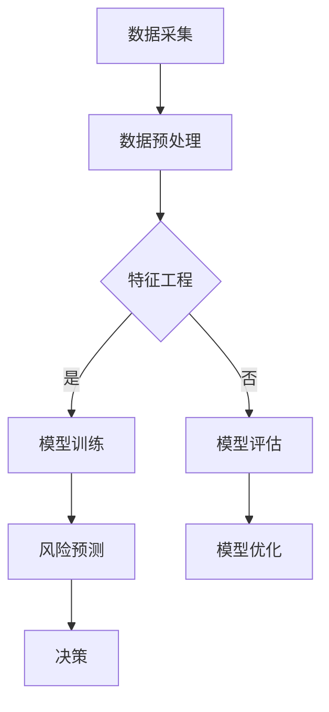

                 

### 《AI辅助金融风险预警：从微观个体到宏观市场》

关键词：人工智能、金融风险预警、微观个体、宏观市场、算法原理、Python源代码、实际案例

摘要：本文深入探讨了人工智能（AI）在金融风险预警中的应用，从微观个体到宏观市场进行了全面分析。文章首先介绍了AI辅助金融风险预警的基础知识，然后详细阐述了AI核心技术在金融风险预警中的应用，接着从微观个体和宏观市场两个层面探讨了风险预警的方法和模型。通过实际案例研究，展示了AI在金融风险预警中的实际应用，并提出了开发与部署AI辅助金融风险预警系统的最佳实践。

## 目录大纲

### 第一部分：AI辅助金融风险预警基础

#### 第1章：AI与金融风险预警概述

1.1 AI在金融领域的应用背景

1.2 金融风险预警的重要性

1.3 AI辅助金融风险预警的原理

1.4 AI辅助金融风险预警的优势与挑战

#### 第2章：AI核心技术与金融风险预警

2.1 数据采集与预处理

2.2 特征工程与选择

2.3 监督学习算法

2.4 无监督学习算法

2.5 强化学习算法

### 第二部分：微观个体风险预警

#### 第3章：个体金融行为分析

3.1 个体金融行为数据来源

3.2 个体金融行为特征提取

3.3 基于监督学习的个体金融风险预警模型

3.4 基于无监督学习的个体金融风险预警模型

#### 第4章：个体信用风险评估

4.1 信用评分模型概述

4.2 逻辑回归模型

4.3 决策树模型

4.4 集成学习方法

### 第三部分：宏观市场风险预警

#### 第5章：金融市场数据挖掘与分析

5.1 金融市场数据来源

5.2 金融市场数据预处理

5.3 市场趋势分析

5.4 市场波动性分析

#### 第6章：宏观金融风险预警模型

6.1 宏观金融风险预警模型概述

6.2 时间序列分析方法

6.3 状态空间模型

6.4 宏观金融风险预警模型的评估与优化

### 第四部分：AI辅助金融风险预警应用实践

#### 第7章：AI辅助金融风险预警案例研究

7.1 案例一：银行信贷风险预警

7.2 案例二：保险市场风险预警

7.3 案例三：金融市场监管预警

#### 第8章：AI辅助金融风险预警的开发与部署

8.1 金融风险预警系统架构设计

8.2 金融风险预警系统实现步骤

8.3 金融风险预警系统的优化与维护

### 附录

#### 附录A：常用工具与技术

A.1 Python金融数据分析库

A.2 常用机器学习库

A.3 常见数据集与资源

#### 附录B：Mermaid流程图与公式示例

B.1 Mermaid流程图示例

B.2 Math公式示例

## 总结

本文从宏观和微观两个角度，深入探讨了人工智能在金融风险预警中的应用。通过对AI核心技术的介绍和实际案例的研究，本文揭示了AI在金融风险预警中的重要作用。文章结构清晰，内容丰富，适合对金融风险预警和人工智能有兴趣的读者阅读。通过本文，读者可以了解到AI辅助金融风险预警的基础知识、应用方法以及开发与部署的最佳实践。希望本文能为大家在金融领域的AI应用提供一些启示和帮助。

### 关键词解释

- **人工智能（AI）**：指模拟人类智能的技术，包括机器学习、深度学习、自然语言处理等。

- **金融风险预警**：通过数据分析、模型构建等方法，提前发现潜在金融风险。

- **微观个体**：指金融市场中具体的个体，如个人投资者、企业等。

- **宏观市场**：指金融市场的整体，如股票市场、债券市场等。

- **算法原理**：指AI在金融风险预警中所使用的算法及其工作原理。

- **Python源代码**：指使用Python语言编写的实现金融风险预警的代码。

- **实际案例**：指文章中提到的具体应用AI进行金融风险预警的实际案例。

### 摘要重述

本文深入探讨了人工智能在金融风险预警中的应用，包括从微观个体到宏观市场的全面分析。通过介绍AI基础知识和核心技术，本文揭示了其在金融风险预警中的优势与挑战。文章结合实际案例，详细阐述了微观个体风险预警和宏观市场风险预警的方法和模型。通过本文，读者可以了解AI辅助金融风险预警的原理、应用和实践，为金融领域的人工智能应用提供参考。

### 目录大纲结构

本文的目录大纲结构分为四大部分：

1. **AI辅助金融风险预警基础**：介绍了AI在金融风险预警中的应用背景、重要性、原理及挑战。

2. **微观个体风险预警**：详细阐述了个体金融行为分析和个体信用风险评估的方法和模型。

3. **宏观市场风险预警**：探讨了金融市场数据挖掘与分析、宏观金融风险预警模型及其评估与优化。

4. **AI辅助金融风险预警应用实践**：通过实际案例研究，展示了AI在金融风险预警中的应用，并提出了开发与部署的最佳实践。

## 第一部分：AI辅助金融风险预警基础

### 第1章：AI与金融风险预警概述

#### 1.1 AI在金融领域的应用背景

人工智能在金融领域的应用背景可以追溯到20世纪末。随着互联网、大数据和计算能力的快速发展，金融行业面临着前所未有的机遇和挑战。一方面，金融机构需要处理海量数据，提高业务效率；另一方面，金融市场的波动性和风险日益加剧，需要更加精确和智能的风险管理手段。因此，人工智能逐渐成为金融行业的重要工具。

在金融领域，AI技术主要应用于以下几个方面：

- **投资决策**：通过机器学习和深度学习算法，对市场数据进行分析，提供投资建议。

- **风险管理**：利用AI技术，对金融机构的风险进行评估、监控和预警。

- **信用评分**：通过分析个人或企业的历史数据，预测其信用风险。

- **客户服务**：利用自然语言处理和语音识别技术，提高客户服务质量。

#### 1.2 金融风险预警的重要性

金融风险预警在金融市场中具有重要的地位。金融市场波动性大，风险无处不在，有效的风险预警系统可以及时发现潜在风险，为金融机构和投资者提供决策支持。以下是一些金融风险预警的重要性：

- **降低风险**：通过预警系统，金融机构可以提前识别潜在风险，采取相应措施，降低风险损失。

- **提高决策效率**：风险预警系统可以实时监测市场数据，为决策者提供准确、及时的信息，提高决策效率。

- **保护投资者利益**：有效的风险预警系统可以帮助投资者识别高风险投资，保护其利益。

- **维护市场稳定**：金融市场的稳定对于经济健康发展至关重要。风险预警系统可以帮助监管部门及时了解市场风险，采取相应措施，维护市场稳定。

#### 1.3 AI辅助金融风险预警的原理

AI辅助金融风险预警的核心在于利用机器学习和深度学习算法，对金融数据进行处理和分析，从而识别潜在风险。其基本原理包括以下几个方面：

- **数据采集**：收集金融市场的各种数据，如股票价格、交易量、宏观经济指标等。

- **数据预处理**：对采集到的数据进行清洗、去噪、归一化等处理，使其适合模型训练。

- **特征工程**：从原始数据中提取对风险预测有重要影响的特征，如技术指标、财务指标等。

- **模型训练**：使用监督学习、无监督学习和强化学习等算法，对特征进行训练，构建风险预警模型。

- **风险预测**：使用训练好的模型，对新的数据进行预测，识别潜在风险。

#### 1.4 AI辅助金融风险预警的优势与挑战

AI辅助金融风险预警具有以下优势：

- **高效性**：AI技术可以快速处理大量数据，提高风险预警的效率。

- **准确性**：通过机器学习和深度学习算法，可以实现对金融数据的精确分析，提高风险预测的准确性。

- **实时性**：AI系统可以实时监测市场数据，提供实时预警。

- **全面性**：AI技术可以处理各种类型的数据，如结构化数据、非结构化数据等，实现全面的风险预警。

然而，AI辅助金融风险预警也面临一些挑战：

- **数据质量问题**：金融数据存在噪声、缺失、异常等问题，会影响模型性能。

- **模型解释性**：深度学习模型具有强大的预测能力，但缺乏解释性，难以理解其决策过程。

- **算法可靠性**：AI模型的可靠性受到算法设计、训练数据质量等因素的影响。

- **法律法规**：金融行业受到严格的法律法规约束，AI技术需要符合相关法规要求。

### Mermaid流程图与公式示例

以下是金融风险预警模型的基本流程及其评估指标：



模型评估指标如下：

$$
\text{评估指标} = \frac{\text{预警准确率} + \text{预警覆盖率}}{2}
$$

其中，预警准确率表示模型预测正确与实际发生风险的比率，预警覆盖率表示模型预测到的风险事件与实际发生风险的比率。

### Python源代码示例

以下是一个简单的Python代码示例，用于实现金融风险预警中的逻辑回归模型：

```python
import numpy as np
import pandas as pd
from sklearn.linear_model import LogisticRegression
from sklearn.model_selection import train_test_split
from sklearn.metrics import accuracy_score

# 加载数据集
data = pd.read_csv('financial_data.csv')

# 特征选择
X = data[['feature1', 'feature2', 'feature3']]
y = data['label']

# 划分训练集和测试集
X_train, X_test, y_train, y_test = train_test_split(X, y, test_size=0.2, random_state=42)

# 创建逻辑回归模型
model = LogisticRegression()

# 训练模型
model.fit(X_train, y_train)

# 预测测试集
y_pred = model.predict(X_test)

# 计算准确率
accuracy = accuracy_score(y_test, y_pred)
print(f'Accuracy: {accuracy:.2f}')
```

在这个示例中，我们使用Sklearn库中的逻辑回归模型对金融数据进行了训练和预测，并计算了预测的准确率。

### 实际案例分析和详细讲解剖析

以下是一个关于银行信贷风险预警的实际案例分析和详细讲解：

**案例背景**：

某银行希望通过AI技术建立信贷风险预警系统，以提前识别潜在的信用风险，降低坏账率。该银行收集了大量的借款人数据，包括信用评分、收入水平、工作稳定性等。

**数据预处理**：

首先，对数据进行清洗，去除缺失值和异常值。然后，对数值型数据进行归一化处理，使其具有相似的尺度。

```python
# 数据清洗
data = data.dropna()
data = data[data['income'] > 0]

# 归一化处理
scaler = StandardScaler()
data[['income', 'credit_score']] = scaler.fit_transform(data[['income', 'credit_score']])
```

**特征工程**：

从原始数据中提取对信贷风险有重要影响的特征，如收入水平、信用评分、工作稳定性等。

```python
# 特征选择
X = data[['income', 'credit_score', 'work_stability']]
y = data['default']
```

**模型训练**：

使用逻辑回归模型对数据集进行训练。

```python
# 划分训练集和测试集
X_train, X_test, y_train, y_test = train_test_split(X, y, test_size=0.2, random_state=42)

# 创建逻辑回归模型
model = LogisticRegression()

# 训练模型
model.fit(X_train, y_train)

# 预测测试集
y_pred = model.predict(X_test)
```

**模型评估**：

计算预测的准确率、召回率、F1值等评估指标。

```python
from sklearn.metrics import accuracy_score, recall_score, f1_score

# 计算准确率
accuracy = accuracy_score(y_test, y_pred)
print(f'Accuracy: {accuracy:.2f}')

# 计算召回率
recall = recall_score(y_test, y_pred)
print(f'Recall: {recall:.2f}')

# 计算F1值
f1 = f1_score(y_test, y_pred)
print(f'F1 Score: {f1:.2f}')
```

**案例小结**：

通过这个实际案例，我们展示了如何使用AI技术进行银行信贷风险预警。首先，对数据进行预处理和特征工程，然后使用逻辑回归模型进行训练和预测。通过模型评估，我们可以了解模型的性能，并进一步优化模型。

### 最佳实践 tips、小结、注意事项、拓展阅读

**最佳实践 tips**：

1. **数据质量**：确保数据质量是构建有效风险预警系统的基础。进行数据清洗、去噪、归一化等预处理步骤，提高数据质量。

2. **特征选择**：合理选择特征对于模型性能至关重要。通过特征工程，提取对风险预测有重要影响的特征。

3. **模型评估**：使用多种评估指标，如准确率、召回率、F1值等，全面评估模型性能。

4. **模型优化**：根据评估结果，对模型进行调整和优化，提高模型预测能力。

**小结**：

本文从宏观和微观两个角度，深入探讨了人工智能在金融风险预警中的应用。通过实际案例，展示了AI技术在金融风险预警中的实际应用效果。然而，AI辅助金融风险预警仍面临一些挑战，如数据质量、模型解释性等。未来研究可以进一步探索如何提高模型性能，并解决这些挑战。

**注意事项**：

1. **法律法规**：金融行业受到严格的法律法规约束。在使用AI技术进行金融风险预警时，需确保符合相关法规要求。

2. **数据隐私**：金融数据涉及个人隐私，需确保数据安全和隐私保护。

3. **模型解释性**：深度学习模型具有强大的预测能力，但缺乏解释性。未来研究可以探索如何提高模型的解释性。

**拓展阅读**：

1. **《金融科技：人工智能与金融领域的融合》**：本书详细介绍了AI在金融领域的应用，包括金融风险预警、投资决策等。

2. **《机器学习实战》**：本书提供了大量的Python代码示例，介绍了机器学习的基本概念和应用。

3. **《深度学习》**：本书是深度学习领域的经典教材，详细介绍了深度学习的基本原理和应用。

