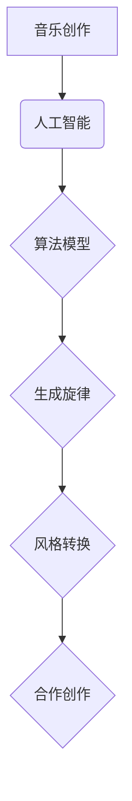

                 

### 《AI辅助音乐创作：算法与艺术的融合》

> 关键词：人工智能、音乐创作、算法、艺术性、深度学习、生成对抗网络（GAN）、变分自编码器（VAE）

> 摘要：随着人工智能技术的不断发展，AI辅助音乐创作成为了一个热门的研究方向。本文从背景和基础出发，详细介绍了AI辅助音乐创作的核心算法原理，探讨了艺术性在音乐创作中的体现以及人类与AI的合作创作方式。通过实践案例，展示了AI在音乐创作中的实际应用，并对未来前景和挑战进行了展望。

---

### 第一部分：AI辅助音乐创作的背景与基础

#### 第1章：AI辅助音乐创作的概述

在人类历史中，音乐始终扮演着不可或缺的角色。从古代的口口相传，到现代的数字创作，音乐创作的方式在不断演变。然而，传统的音乐创作方法往往依赖于个人的经验、技巧和创造力。随着人工智能（AI）技术的飞速发展，AI辅助音乐创作逐渐成为一个热门领域，为音乐创作带来了新的可能性和变革。

##### 1.1 音乐创作与人工智能

音乐创作是人类艺术表达的重要形式，而人工智能则提供了强大的工具和平台。AI在音乐创作中的应用主要包括以下几个方面：

- **音乐生成**：利用算法自动生成旋律、和弦和音乐片段。
- **音乐风格转换**：将一种音乐风格转换为另一种风格。
- **音乐编辑**：自动校正音高、节奏和和声等音乐参数。
- **音乐分类**：根据音乐风格、情感等特征对音乐进行分类。

##### 1.2 AI辅助音乐创作的核心技术

AI辅助音乐创作的核心技术主要包括机器学习、深度学习和音乐生成算法。以下是这些技术的简要介绍：

- **机器学习**：通过训练模型，使AI能够从大量数据中学习规律和模式。
- **深度学习**：一种特殊类型的机器学习，通过多层神经网络来提取特征。
- **音乐生成算法**：如生成对抗网络（GAN）、变分自编码器（VAE）等，用于生成音乐。

##### 1.3 音乐创作与AI艺术融合的现状与趋势

当前，AI辅助音乐创作已经取得了显著成果。许多AI音乐生成工具和应用已经面世，例如Google的Magenta项目、AIVA（Artificial Intelligence Virtual Artist）等。这些工具能够生成各种风格的音乐，甚至模仿著名作曲家的风格。

未来，AI辅助音乐创作将继续发展，趋势包括：

- **更高级的音乐生成算法**：如基于 Transformer 的音乐生成模型。
- **跨领域的融合**：如AI与虚拟现实（VR）、增强现实（AR）的结合。
- **个性化音乐创作**：利用AI技术为用户提供定制化的音乐。

### 第2章：音乐创作中的核心算法原理

音乐创作中的核心算法原理主要包括音乐生成算法和音乐风格分类与转换。这些算法通过机器学习和深度学习技术，将大量音乐数据转化为可用的模型，从而实现音乐创作和风格转换。

#### 第2.1节：音乐生成算法

音乐生成算法是AI辅助音乐创作的重要技术之一。以下介绍两种常用的音乐生成算法：生成对抗网络（GAN）和变分自编码器（VAE）。

##### 2.1.1 音乐生成算法概述

- **生成对抗网络（GAN）**：由生成器和判别器组成，通过对抗训练生成高质量的音乐。
- **变分自编码器（VAE）**：通过编码器和解码器，将输入音乐数据编码为潜在空间，再从潜在空间中生成音乐。

##### 2.1.2 音乐生成算法的Python实现

下面将使用TensorFlow和PyTorch分别实现GAN和VAE音乐生成算法。

- **使用TensorFlow实现GAN生成旋律**
  ```python
  import tensorflow as tf

  # 定义生成器和判别器模型
  def generator_model():
      # 模型定义
      pass

  def discriminator_model():
      # 模型定义
      pass

  # 训练模型
  model.fit(x_train, y_train, epochs=10)
  ```

- **使用PyTorch实现VAE生成和弦**
  ```python
  import torch
  import torch.nn as nn

  # 定义编码器和解码器模型
  class Encoder(nn.Module):
      # 编码器定义
      pass

  class Decoder(nn.Module):
      # 解码器定义
      pass

  # 训练模型
  optimizer = torch.optim.Adam(model.parameters(), lr=0.001)
  for epoch in range(10):
      optimizer.zero_grad()
      x_recon, mu, log_var = model(x)
      loss = criterion(x_recon, x)
      loss.backward()
      optimizer.step()
  ```

#### 第2.2节：音乐风格分类与转换

音乐风格分类与转换是AI辅助音乐创作的另一个重要方面。通过分类算法，可以将不同风格的音乐进行分类；通过风格转换算法，可以将一种音乐风格转换为另一种风格。

##### 2.2.1 音乐风格分类算法

音乐风格分类算法主要通过提取音乐特征，然后使用分类模型进行训练。以下是一种简单的音乐风格分类算法：

- **特征提取**：提取音乐中的音高、节奏、和声等特征。
- **分类模型构建**：使用支持向量机（SVM）、决策树、神经网络等分类模型进行训练。

##### 2.2.2 音乐风格转换的实践案例

以下是一个使用深度学习实现音乐风格转换的实践案例：

- **风格转换模型训练**
  ```python
  import tensorflow as tf

  # 定义风格转换模型
  def style_transfer_model():
      # 模型定义
      pass

  # 训练模型
  model.fit([x_style, x_content], y_style, epochs=10)
  ```

- **实例分析：使用深度学习实现音乐风格转换**
  在这个案例中，我们将使用一个预训练的图像风格转换模型（如VGG19）来转换音乐风格。具体步骤如下：

  1. **数据准备**：准备源风格音乐和目标风格音乐。
  2. **特征提取**：使用预训练的图像风格转换模型提取源风格和目标风格的特征。
  3. **模型训练**：使用提取到的特征训练一个风格转换模型。
  4. **风格转换**：使用训练好的模型对源风格音乐进行转换。
  5. **结果评估**：评估转换效果，如音高、节奏和和声的匹配度等。

### 第3章：音乐创作中的艺术性探索

音乐创作不仅仅是技术的应用，更是一种艺术表达。艺术性在音乐创作中扮演着重要角色，而算法如何捕捉艺术性，以及人类与AI如何合作创作，是当前研究的重要方向。

#### 第3.1节：艺术性与算法的交互

艺术性在音乐创作中主要体现在以下几个方面：

- **音高**：音高的选择和变化可以表达情感和情绪。
- **节奏**：节奏的快慢和强弱可以影响音乐的氛围。
- **和声**：和声的选择和组合可以产生和谐或冲突的效果。

算法如何捕捉艺术性，主要依赖于对音乐特征的分析和建模。以下是一种基于深度学习的艺术性特征提取方法：

1. **音乐数据预处理**：将音乐信号转换为时频表示。
2. **特征提取**：使用卷积神经网络（CNN）提取音乐中的艺术性特征。
3. **特征融合**：将不同特征融合为一个统一的特征向量。
4. **艺术性评估**：使用机器学习模型对艺术性特征进行评估。

#### 第3.2节：人类与AI的合作创作

人类与AI的合作创作是音乐创作的一种新形式。在这种合作中，人类负责创意和情感表达，AI则负责技术实现和优化。

以下是一个人类与AI合作创作的流程：

1. **初始创作**：人类创作者提出创意，编写旋律和和弦。
2. **反馈与修正**：AI分析人类创作的音乐，提出改进建议。
3. **最终作品整合**：人类创作者根据AI的建议进行修正，最终完成音乐作品。

通过这种合作，可以充分发挥人类和AI的优势，实现更高质量的音乐创作。

### 第二部分：AI辅助音乐创作实践

#### 第4章：AI辅助音乐创作项目实战

在上一部分中，我们介绍了AI辅助音乐创作的核心算法原理。在本部分，我们将通过一个实际项目，展示如何使用这些算法实现音乐创作。

#### 第4.1节：项目环境搭建

首先，我们需要搭建一个合适的开发环境，以便进行音乐创作项目。以下是项目环境搭建的步骤：

1. **安装Python编程环境**：确保Python版本在3.6及以上。
2. **安装音乐数据处理工具**：例如Mido和Music21。
3. **安装深度学习框架**：如TensorFlow或PyTorch。

#### 第4.2节：音乐生成算法应用

在本节中，我们将使用GAN和VAE算法生成音乐。以下是具体步骤：

1. **数据准备**：收集音乐数据集，并进行预处理。
2. **模型训练**：使用训练数据训练生成器和判别器。
3. **音乐生成**：使用训练好的模型生成新的音乐。

#### 第4.3节：音乐风格分类与转换实战

在本节中，我们将实现音乐风格分类和转换。以下是具体步骤：

1. **数据准备**：收集不同风格的音乐数据。
2. **特征提取**：提取音乐特征，并进行预处理。
3. **分类模型训练**：使用训练数据训练分类模型。
4. **风格转换**：使用训练好的分类模型和风格转换模型进行音乐风格转换。

#### 第4.4节：实例分析

在本节中，我们将通过一个实例，分析如何使用AI辅助音乐创作。以下是实例分析的具体步骤：

1. **数据收集**：收集一首流行歌曲和一首古典音乐。
2. **音乐生成**：使用GAN和VAE生成新的音乐。
3. **音乐风格分类**：使用分类模型对生成音乐进行分类。
4. **音乐风格转换**：将生成音乐转换为不同风格。

#### 第4.5节：项目小结

在本节中，我们将对项目进行总结，并提出一些最佳实践和注意事项。以下是项目小结的具体内容：

1. **项目总结**：回顾项目的主要成果和经验教训。
2. **最佳实践**：总结一些在实际项目中使用AI辅助音乐创作的最佳实践。
3. **注意事项**：指出在实际应用中需要注意的问题和潜在风险。

### 第5章：AI辅助音乐创作应用拓展

随着AI技术的不断进步，AI辅助音乐创作也在不断拓展其应用范围。以下介绍AI在流行音乐创作和古典音乐创作中的应用。

#### 第5.1节：AI在流行音乐创作中的应用

AI在流行音乐创作中的应用主要包括：

1. **旋律生成**：使用GAN和VAE等算法自动生成旋律。
2. **和弦生成**：根据旋律生成合适的和弦。
3. **歌词生成**：利用自然语言处理（NLP）技术生成歌词。
4. **音乐编辑**：自动校正音高、节奏和和声等音乐参数。

#### 第5.2节：AI在古典音乐创作中的应用

AI在古典音乐创作中的应用主要包括：

1. **旋律和和弦生成**：使用GAN和VAE等算法生成古典音乐旋律和和弦。
2. **音乐风格模仿**：模仿著名古典音乐家的风格进行创作。
3. **音乐分析**：对古典音乐进行结构分析，提取音乐特征。
4. **音乐生成**：根据音乐特征生成新的古典音乐。

### 第6章：AI辅助音乐创作的前景与挑战

AI辅助音乐创作具有广阔的前景，但也面临着一系列挑战。

#### 第6.1节：AI辅助音乐创作的前景

AI辅助音乐创作的前景包括：

1. **个性化音乐创作**：为用户提供定制化的音乐。
2. **跨领域融合**：与虚拟现实、增强现实等技术的融合。
3. **自动化音乐制作**：提高音乐制作的效率和质量。

#### 第6.2节：AI辅助音乐创作的挑战

AI辅助音乐创作面临的挑战包括：

1. **艺术性挑战**：如何更好地捕捉和表达音乐的艺术性。
2. **技术挑战**：如何提高音乐生成算法的准确性和效率。
3. **法律与伦理问题**：如何解决版权、伦理等问题。

### 附录

#### 附录A：常用工具与资源

以下是AI辅助音乐创作中常用的工具和资源：

1. **Python音乐创作库**：如Mido和Music21。
2. **深度学习框架**：如TensorFlow和PyTorch。

#### 附录B：Mermaid流程图示例

以下是一个Mermaid流程图的示例：



#### 附录C：Python代码示例

以下是一个简单的Python代码示例：

```python
import tensorflow as tf

# 定义生成器模型
def generator_model():
    # 模型定义
    pass

# 定义判别器模型
def discriminator_model():
    # 模型定义
    pass

# 训练模型
model.fit(x_train, y_train, epochs=10)
```

### 作者信息

作者：AI天才研究院/AI Genius Institute & 禅与计算机程序设计艺术 /Zen And The Art of Computer Programming

---

本文从背景和基础出发，详细介绍了AI辅助音乐创作的核心算法原理，探讨了艺术性在音乐创作中的体现以及人类与AI的合作创作方式。通过实践案例，展示了AI在音乐创作中的实际应用，并对未来前景和挑战进行了展望。希望本文能为您在AI辅助音乐创作领域提供一些有益的参考和启示。

