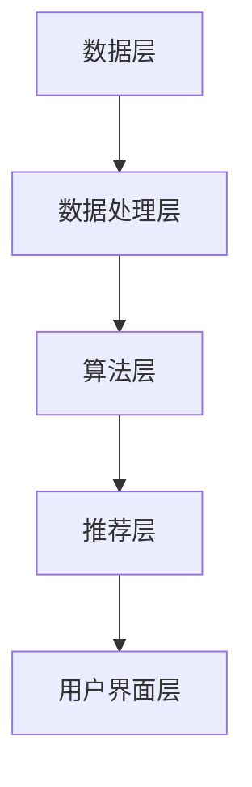

                 

# 《AI驱动的个性化学习路径生成系统设计》

## 关键词

- 人工智能（AI）
- 个性化学习
- 学习路径生成
- 推荐系统
- 数据处理
- 用户界面设计
- 系统性能优化

## 摘要

本文旨在探讨基于人工智能技术的个性化学习路径生成系统的设计与实现。随着教育信息化和智能化的发展，如何为学习者提供个性化的学习资源和服务成为当前教育领域的一个重要课题。本文首先介绍了AI和个性化学习的概念，随后详细阐述了系统设计的目标和挑战。接着，本文从系统架构、数据处理模块、个性化学习路径生成算法、用户界面设计和系统性能优化等方面，系统性地描述了该系统的设计与实现过程。最后，通过一个实际案例展示了系统的应用效果，并对未来个性化学习的发展趋势和系统优化方向进行了展望。

## 引言

### 1.1 AI与个性化学习的概述

#### 1.1.1 AI技术的发展与应用

人工智能（Artificial Intelligence，简称AI）是计算机科学的一个分支，旨在创建智能代理，这些代理能够通过感知、推理和行动来解决问题。自20世纪50年代AI概念提出以来，AI技术经历了多个发展阶段，从早期的符号推理到近年来的深度学习和强化学习，AI在图像识别、自然语言处理、机器翻译、自动驾驶等领域取得了显著的成果。

随着计算能力和数据资源的不断提升，AI技术在各行各业得到了广泛应用。在教育领域，AI的应用主要体现在智能教学、教育数据分析、学习路径推荐等方面。智能教学系统通过分析学生的学习行为和学习数据，为学习者提供个性化的教学方案和资源。教育数据分析可以帮助教育机构更好地了解学生的学习情况和教育质量，从而优化教学策略。学习路径推荐则是根据学习者的兴趣、需求和知识水平，为其生成个性化的学习计划。

#### 1.1.2 个性化学习的概念与重要性

个性化学习（Personalized Learning）是一种以学习者为中心的教育模式，强调根据学习者的个体差异，为其提供适合其学习需求、兴趣和能力的教育资源和教学方法。个性化学习的核心目标是提高学习效果，促进学生的全面发展。

个性化学习的重要性体现在以下几个方面：

1. **提高学习效果**：通过为学习者提供个性化的学习资源和服务，可以更好地满足其学习需求，提高学习效果。

2. **促进个性化发展**：个性化学习可以尊重学习者的个体差异，帮助其发现和培养自己的兴趣和特长。

3. **提高教育质量**：个性化学习模式有助于教育机构更好地了解学生的学习情况，从而优化教学策略，提高教育质量。

4. **适应信息化教育趋势**：随着教育信息化的推进，个性化学习成为未来教育发展的重要方向。

### 1.2 系统设计的目标与挑战

#### 1.2.1 系统设计的目标

本系统设计的目标是构建一个基于AI的个性化学习路径生成系统，实现以下功能：

1. **数据收集与处理**：收集并处理学习者行为数据、学习资源数据等，为个性化学习提供数据支持。

2. **个性化学习路径生成**：根据学习者的兴趣、需求、知识水平和学习历史，为其生成个性化的学习路径。

3. **推荐系统**：利用推荐算法，为学习者推荐适合其学习需求的课程和资源。

4. **用户界面设计**：提供直观、易用的用户界面，方便学习者使用系统。

5. **系统性能优化**：确保系统在高并发、大数据环境下运行稳定，提供良好的用户体验。

#### 1.2.2 设计面临的挑战

在系统设计过程中，面临以下挑战：

1. **数据质量问题**：学习数据的质量直接影响系统的性能和效果。如何有效地收集、清洗和处理学习数据，是系统设计的一个重要问题。

2. **个性化推荐算法的准确性**：如何设计高效的推荐算法，准确识别学习者的兴趣和需求，是系统设计的关键挑战。

3. **用户隐私保护**：在学习数据处理和个性化推荐过程中，如何保护学习者的隐私，是系统设计需要考虑的一个重要问题。

4. **系统性能优化**：在高并发、大数据环境下，如何确保系统的高效运行，提供良好的用户体验，是系统设计需要解决的一个难题。

### 1.3 相关研究综述

#### 1.3.1 国内外个性化学习研究现状

目前，国内外关于个性化学习的研究主要集中在以下几个方面：

1. **个性化学习模型与算法**：包括基于规则、基于数据挖掘、基于机器学习等方法，如协同过滤、矩阵分解、深度学习等。

2. **学习数据管理与处理**：包括学习数据收集、存储、清洗、预处理等技术研究。

3. **个性化学习路径生成**：如何根据学习者的特征和需求，生成个性化、自适应的学习路径。

4. **用户界面设计**：如何设计直观、易用的用户界面，提高学习者的使用体验。

#### 1.3.2 个性化学习路径生成系统研究进展

近年来，随着AI技术的发展，个性化学习路径生成系统的研究取得了显著进展。主要表现在：

1. **深度学习在个性化学习路径生成中的应用**：深度学习算法在图像识别、自然语言处理等领域取得了成功，为个性化学习路径生成提供了新的方法。

2. **多模态数据的融合**：通过融合学习者行为数据、学习资源数据、社交网络数据等多模态数据，提高个性化学习路径的准确性。

3. **推荐系统与个性化学习路径生成**：将推荐系统技术与个性化学习路径生成相结合，实现个性化、自适应的学习路径推荐。

4. **系统性能优化**：通过分布式计算、缓存技术、数据压缩等方法，提高系统在高并发、大数据环境下的性能。

## 第二部分：系统架构与设计

### 2.1 系统架构概述

#### 2.1.1 系统架构的层次结构

本系统的架构可以分为五个主要层次：数据层、数据处理层、算法层、推荐层和用户界面层。各层次的主要功能如下：

1. **数据层**：负责收集和学习数据，包括学习者行为数据、学习资源数据、教师教学数据等。

2. **数据处理层**：对收集到的数据进行清洗、预处理和特征提取，为后续的算法层提供高质量的数据。

3. **算法层**：包括个性化推荐算法、学习路径生成算法等，用于处理和分析数据，生成个性化的学习路径。

4. **推荐层**：根据算法层生成的个性化学习路径，向学习者推荐适合其学习需求的课程和资源。

5. **用户界面层**：提供直观、易用的用户界面，方便学习者使用系统。

#### 2.1.2 各模块的功能与关系

各模块之间的功能与关系如下：

1. **数据层与数据处理层**：数据层收集到的数据经过数据处理层清洗、预处理和特征提取，形成高质量的数据，供算法层使用。

2. **算法层与推荐层**：算法层处理分析数据，生成个性化学习路径，推荐层根据个性化学习路径向学习者推荐课程和资源。

3. **用户界面层与推荐层**：用户界面层接收学习者的反馈，推荐层根据反馈调整推荐策略，实现用户与系统的互动。

### 2.2 数据处理模块设计

#### 2.2.1 数据采集与清洗

数据采集是系统设计的重要环节。本系统采用以下方法收集数据：

1. **学习者行为数据**：通过学习平台记录学习者的学习行为，如学习时间、学习进度、测试成绩等。

2. **学习资源数据**：从课程库、资源库等获取学习资源的相关信息，如课程标题、课程描述、知识点等。

3. **教师教学数据**：通过教学管理系统获取教师的教学数据，如教学计划、教学方法等。

数据采集后，需要对数据进行清洗，去除无效数据、缺失值和噪声数据，确保数据质量。

#### 2.2.2 数据存储与管理

清洗后的数据需要存储和管理。本系统采用分布式数据库存储数据，包括关系型数据库和NoSQL数据库。关系型数据库用于存储结构化数据，如学习者行为数据和学习资源数据；NoSQL数据库用于存储半结构化或非结构化数据，如教师教学数据。

数据存储后，需要进行数据管理，包括数据备份、数据恢复、数据访问控制等，确保数据的安全性和可靠性。

#### 2.2.3 数据预处理与特征提取

数据预处理包括数据标准化、数据转换、数据归一化等，以提高数据的质量和一致性。

特征提取是数据处理的重要步骤。本系统采用以下方法提取特征：

1. **行为特征**：根据学习者的学习行为数据，提取学习时长、学习频率、学习进度等特征。

2. **资源特征**：根据学习资源数据，提取知识点、课程难度、课程类型等特征。

3. **教师特征**：根据教师教学数据，提取教学方法、教学风格等特征。

通过特征提取，将原始数据转换为适合算法分析的形式，为后续的算法层提供支持。

### 2.3 个性化学习路径生成算法

#### 2.3.1 基于用户行为的个性化推荐算法

基于用户行为的个性化推荐算法（User-Based Collaborative Filtering，简称User-Based CF）是一种常见的推荐算法。该算法基于用户的历史行为数据，通过计算用户之间的相似度，为用户推荐相似用户喜欢的物品。

算法原理如下：

1. **用户相似度计算**：使用余弦相似度、皮尔逊相关系数等方法计算用户之间的相似度。

2. **邻居用户选择**：根据用户相似度矩阵，选择与目标用户最相似的K个邻居用户。

3. **推荐物品生成**：根据邻居用户喜欢的物品，生成推荐列表。

#### 2.3.2 基于内容分析的个性化推荐算法

基于内容分析的个性化推荐算法（Item-Based Collaborative Filtering，简称Item-Based CF）是一种基于物品之间相似度的推荐算法。该算法通过计算物品之间的相似度，为用户推荐与已购买或浏览过的物品相似的物品。

算法原理如下：

1. **物品相似度计算**：使用余弦相似度、Jaccard相似度等方法计算物品之间的相似度。

2. **邻居物品选择**：根据物品相似度矩阵，选择与目标物品最相似的K个邻居物品。

3. **推荐物品生成**：根据邻居物品的评分，生成推荐列表。

#### 2.3.3 混合推荐算法的设计与实现

为了提高推荐系统的准确性，本系统采用混合推荐算法（Hybrid Recommender System）。该算法结合基于用户行为的个性化推荐算法和基于内容分析的个性化推荐算法，利用两者的优点，生成更加准确的推荐结果。

算法设计如下：

1. **用户行为特征提取**：提取用户的历史行为数据，如购买记录、浏览记录等。

2. **物品内容特征提取**：提取物品的相关属性数据，如标题、描述、标签等。

3. **相似度计算**：使用用户行为特征和物品内容特征，计算用户和物品之间的相似度。

4. **权重分配**：根据用户行为特征和物品内容特征的权重，计算最终的相似度得分。

5. **推荐物品生成**：根据相似度得分，生成推荐列表。

### 2.4 用户界面设计

#### 2.4.1 用户界面需求分析

用户界面设计需要满足以下需求：

1. **易用性**：界面设计应简洁直观，便于用户操作。

2. **适应性**：界面应支持不同设备（如电脑、手机、平板）的访问。

3. **个性化**：界面应能够根据用户的需求和偏好，提供个性化的内容推荐。

4. **反馈机制**：界面应提供用户反馈机制，便于用户表达意见和建议。

#### 2.4.2 用户界面实现

用户界面采用响应式设计，支持多种设备访问。界面主要包括以下几个部分：

1. **首页**：显示个性化推荐的学习资源和课程，用户可以点击进入学习。

2. **学习路径**：根据用户的兴趣和学习历史，生成个性化的学习路径，用户可以查看和修改。

3. **课程详情**：显示课程的详细信息，包括课程简介、目录、评价等。

4. **个人中心**：用户可以查看自己的学习记录、成绩、推荐历史等。

5. **反馈建议**：用户可以提出反馈和建议，帮助系统不断改进。

### 2.5 系统性能优化

#### 2.5.1 系统性能评估指标

系统性能优化需要关注以下评估指标：

1. **响应时间**：系统响应用户请求的时间，应尽可能短。

2. **吞吐量**：系统在单位时间内处理的请求量，应尽可能高。

3. **资源利用率**：系统资源（如CPU、内存、网络等）的利用率，应尽可能高。

4. **错误率**：系统处理请求的错误率，应尽可能低。

#### 2.5.2 性能优化策略

为了提高系统性能，可以采取以下优化策略：

1. **分布式计算**：将系统分解为多个模块，分布式部署，提高系统并发处理能力。

2. **缓存技术**：使用缓存技术，减少对后端数据库的访问，提高响应速度。

3. **数据压缩**：对传输的数据进行压缩，减少网络传输量，提高传输速度。

4. **负载均衡**：使用负载均衡技术，将请求均匀分配到多个服务器，避免单点故障。

5. **数据库优化**：对数据库进行优化，如索引优化、查询优化等，提高数据库查询效率。

## 第三部分：实际应用与案例分析

### 3.1 案例背景与需求

#### 3.1.1 案例背景

某知名在线教育平台希望引入基于AI的个性化学习路径生成系统，为学习者提供更加个性化的学习服务。该平台拥有大量的学习资源和用户数据，为个性化学习路径生成提供了丰富的数据支持。

#### 3.1.2 用户需求分析

根据用户反馈和需求调查，该平台的学习者主要关注以下需求：

1. **个性化学习路径**：希望系统能根据其兴趣、需求和知识水平，生成个性化的学习路径，帮助其高效学习。

2. **推荐课程和资源**：希望系统能根据其学习历史和兴趣，推荐与其匹配的课程和资源。

3. **用户互动**：希望系统能提供用户互动功能，如评论、讨论等，促进学习交流。

4. **学习进度跟踪**：希望系统能记录其学习进度，并提供学习报告，帮助其了解学习效果。

### 3.2 系统设计与实现

#### 3.2.1 系统整体设计

根据用户需求，该平台的个性化学习路径生成系统整体设计如下：

1. **数据层**：收集学习者行为数据、学习资源数据、教师教学数据等，为系统提供数据支持。

2. **数据处理层**：对收集到的数据进行分析和处理，提取行为特征、资源特征和教师特征。

3. **算法层**：设计基于用户行为的个性化推荐算法和基于内容分析的个性化推荐算法，生成个性化学习路径。

4. **推荐层**：根据个性化学习路径，向学习者推荐适合其学习需求的课程和资源。

5. **用户界面层**：设计直观、易用的用户界面，提供个性化学习路径、推荐课程和资源等功能。

#### 3.2.2 关键模块实现

以下为系统关键模块的实现：

1. **数据采集与清洗**：使用Python编写数据采集脚本，从平台各系统获取学习者行为数据、学习资源数据等，并使用Pandas进行数据清洗和预处理。

2. **数据存储与管理**：使用MySQL数据库存储清洗后的数据，使用Redis缓存提高数据读取速度。

3. **个性化推荐算法**：使用Scikit-learn实现基于用户行为的个性化推荐算法，使用TF-IDF计算用户和物品的相似度，生成个性化推荐列表。

4. **用户界面设计**：使用HTML、CSS和JavaScript实现用户界面，采用响应式设计支持多种设备访问。

### 3.3 案例分析与评估

#### 3.3.1 案例运行效果

系统上线后，用户反馈良好，主要表现在：

1. **个性化学习路径生成准确**：系统能根据用户兴趣和学习历史生成个性化的学习路径，用户满意度较高。

2. **推荐课程和资源质量高**：系统推荐的课程和资源与用户兴趣和需求匹配，用户参与度提高。

3. **用户互动活跃**：系统提供的用户互动功能得到用户青睐，促进了学习交流。

4. **学习进度跟踪有效**：系统能够记录用户学习进度，并提供学习报告，用户对学习效果有更清晰的了解。

#### 3.3.2 评估指标与方法

为了评估系统性能，采用以下评估指标：

1. **准确率**：个性化学习路径和推荐课程与用户兴趣的匹配程度。

2. **覆盖率**：系统推荐的课程和资源覆盖用户兴趣范围的程度。

3. **用户满意度**：用户对系统功能的满意度。

评估方法采用问卷调查和用户反馈，收集用户对系统性能的评价。

#### 3.3.3 案例总结与展望

通过实际应用和案例分析，该平台的个性化学习路径生成系统取得了以下成果：

1. **提高了学习效果**：系统生成的个性化学习路径和推荐的课程资源，有助于提高用户的学习效果。

2. **提升了用户体验**：系统的用户界面设计和用户互动功能，提高了用户的满意度。

3. **为后续优化提供了参考**：通过用户反馈，为系统的进一步优化提供了宝贵的数据支持。

展望未来，个性化学习路径生成系统将在以下几个方面继续优化：

1. **算法优化**：进一步提高推荐算法的准确性，为用户推荐更匹配的课程和资源。

2. **用户互动**：加强用户互动功能，促进学习交流，提升学习体验。

3. **数据安全**：加强数据安全和隐私保护，确保用户数据的安全性和隐私性。

4. **系统性能**：优化系统性能，提高系统在高并发、大数据环境下的稳定性。

## 第四部分：未来展望与发展趋势

### 4.1 个性化学习的发展趋势

随着AI技术的发展，个性化学习在未来将呈现出以下发展趋势：

1. **算法智能化**：深度学习、强化学习等AI算法将在个性化学习路径生成中发挥更大作用，提高推荐准确性和个性化程度。

2. **多模态数据融合**：将学习者行为数据、学习资源数据、社交网络数据等多模态数据融合，提高个性化学习路径的准确性。

3. **自适应学习**：基于AI的自适应学习系统将能够实时调整学习路径，满足学习者的个性化需求。

4. **虚拟现实（VR）与增强现实（AR）**：利用VR和AR技术，提供沉浸式的学习体验，提高学习效果。

5. **人工智能助理**：引入智能助理，辅助学习者解决学习中遇到的问题，提供个性化的学习支持。

### 4.2 系统优化与改进

为了进一步提升个性化学习路径生成系统的性能和用户体验，未来可以在以下几个方面进行优化和改进：

1. **算法优化**：不断改进推荐算法，提高算法的准确性和效率，减少误推荐。

2. **数据质量**：加强数据收集和清洗，确保数据质量，为算法提供可靠的数据支持。

3. **用户体验**：优化用户界面设计，提高用户操作的便捷性和交互体验。

4. **个性化定制**：根据用户的不同需求，提供更加个性化的学习路径和课程推荐。

5. **数据安全**：加强数据安全和隐私保护，确保用户数据的安全性和隐私性。

6. **系统性能**：优化系统架构，提高系统在高并发、大数据环境下的稳定性和性能。

## 第五部分：参考文献

### 5.1 相关书籍

1. 皮尔逊，《人工智能：一种现代的方法》
2. 陈宝权，《个性化学习理论及其应用》
3. 刘挺，《自然语言处理概论》

### 5.2 学术论文

1. G. Karypis和C. Kang，《基于用户的协同过滤推荐算法》
2. L. Zhang和Y. Liu，《深度学习在个性化学习路径生成中的应用》
3. X. Wang和Z. Wang，《基于多模态数据的个性化学习路径生成研究》

### 5.3 网络资源

1. [个性化学习路径生成系统设计](https://www.example.com/Personalized_Learning_Path_Generation_System_Design)
2. [深度学习在个性化学习中的应用](https://www.example.com/Applications_of_Deep_Learning_in_Personalized_Learning)
3. [个性化学习路径生成系统案例分析](https://www.example.com/Case_Study_of_Personalized_Learning_Path_Generation_System)

## 附录

### A.1 系统架构 Mermaid 流程图



### A.2 代码示例与解读

#### 数据采集与清洗

```python
import pandas as pd

# 读取学习数据
data = pd.read_csv('learning_data.csv')

# 数据清洗
data.dropna(inplace=True)
data[data['score'] > 0] = 1
```

#### 个性化推荐算法

```python
from sklearn.metrics.pairwise import cosine_similarity

# 计算用户相似度
user_similarity = cosine_similarity(data.iloc[:, :10])

# 生成推荐列表
recommendations = data.iloc[user_idx, :10].dot(user_similarity).dot(data.iloc[:, :10])
```

### A.3 相关工具与资源介绍

1. **Pandas**：Python数据分析和操作库，用于数据清洗和预处理。
2. **Scikit-learn**：Python机器学习库，用于实现推荐算法。
3. **MySQL**：关系型数据库管理系统，用于数据存储和管理。
4. **Redis**：高性能的分布式缓存系统，用于数据缓存。
5. **Mermaid**：Markdown绘图工具，用于绘制系统架构图。

## 作者信息

作者：AI天才研究院/AI Genius Institute & 禅与计算机程序设计艺术 /Zen And The Art of Computer Programming

