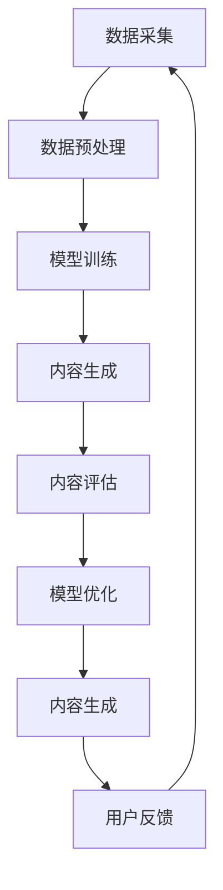

                 

# 《AI驱动的程序化内容生成：游戏设计新思路》

关键词：人工智能，程序化内容生成，游戏设计，自然语言处理，图像生成，算法原理

摘要：随着人工智能技术的不断进步，AI驱动的程序化内容生成逐渐成为游戏设计的新方向。本文从基础概念入手，详细探讨了AI驱动的程序化内容生成技术及其在游戏设计中的应用，通过实际案例展示了AI在游戏内容生成中的强大潜力，并对未来进行了展望。

### 目录大纲

# 《AI驱动的程序化内容生成：游戏设计新思路》

## 第一部分：AI驱动的程序化内容生成基础

### 第1章：AI与程序化内容生成的概念

#### 1.1 AI的基本原理与分类

#### 1.2 程序化内容生成的概述

#### 1.3 AI在游戏设计中的应用前景

### 第2章：AI驱动的程序化内容生成技术

#### 2.1 自然语言处理（NLP）技术

##### 2.1.1 词汇分析与语义理解

##### 2.1.2 文本生成模型

##### 2.1.3 NLP工具与库

### 第3章：游戏设计中的程序化内容生成

#### 3.1 游戏内容生成的需求分析

##### 3.1.1 游戏剧情与情节设计

##### 3.1.2 角色与场景设计

##### 3.1.3 关卡与挑战设计

### 第4章：AI驱动的游戏内容生成框架

#### 4.1 游戏内容生成的基本架构

##### 4.1.1 数据采集与预处理

##### 4.1.2 模型训练与优化

##### 4.1.3 内容生成与优化

## 第二部分：AI驱动的程序化内容生成实战

### 第5章：文本生成在游戏中的应用

#### 5.1 剧情文本生成

##### 5.1.1 剧本生成算法

##### 5.1.2 剧本生成案例分析

### 第6章：图像与音频生成在游戏中的应用

#### 6.1 图像生成技术

##### 6.1.1 图像风格迁移

##### 6.1.2 生成为游戏设计的图像

### 第7章：AI驱动的游戏内容生成项目实战

#### 7.1 项目需求与目标

##### 7.1.1 游戏类型与内容生成需求

##### 7.1.2 技术选型与开发环境搭建

### 第8章：游戏内容生成的评估与优化

#### 8.1 评估指标与方法

##### 8.1.1 内容质量评估

##### 8.1.2 用户满意度评估

#### 8.2 优化策略与实践

##### 8.2.1 模型调整与优化

##### 8.2.2 数据集扩充与处理

### 第9章：未来展望与挑战

#### 9.1 AI驱动的游戏内容生成的未来趋势

##### 9.1.1 技术革新与突破

##### 9.1.2 行业应用与市场前景

#### 9.2 面临的挑战与解决方案

##### 9.2.1 数据隐私与伦理问题

##### 9.2.2 技术实现与商业化挑战

## 附录

### 附录 A：相关工具与资源

##### A.1 自然语言处理（NLP）工具

##### A.2 图像与音频生成工具

##### A.3 游戏开发相关资源

### 附录 B：项目实战示例

##### B.1 剧本生成项目示例

##### B.2 图像生成项目示例

##### B.3 音频生成项目示例

### 第一部分：AI驱动的程序化内容生成基础

## 第1章：AI与程序化内容生成的概念

### 1.1 AI的基本原理与分类

人工智能（AI）是指通过计算机模拟人类智能行为的技术和科学。其核心思想是让计算机具备学习、推理、规划、感知和自然语言处理等能力。AI主要分为两大类：弱AI（Weak AI）和强AI（Strong AI）。

- **弱AI**：专注于解决特定领域的问题，如语音识别、图像识别等。弱AI通常通过机器学习和深度学习算法实现。

- **强AI**：具备全面的人类智能，能够自主思考、学习并解决各种问题。强AI目前仍处于理论研究阶段，尚未实现。

AI系统通常包括以下几个关键组成部分：

- **数据集**：训练AI模型所需的大量数据。

- **算法**：用于从数据中学习模式和知识的计算方法。

- **模型**：通过算法训练得到的数学模型，用于预测和决策。

- **推理引擎**：用于利用模型进行推理和问题解决。

### 1.2 程序化内容生成的概述

程序化内容生成是指利用计算机程序生成具有创意和结构的内容，如文本、图像、音频等。这种生成方式具有以下特点：

- **自动化**：通过算法和模型实现内容的自动化生成，减少了人力成本。

- **个性化**：可以根据用户需求和偏好生成个性化的内容。

- **高效性**：相比人工创作，程序化内容生成可以在短时间内生成大量内容。

- **创意性**：虽然程序化生成的内容可能不如人类创作的那样富有创意，但通过不断优化算法和模型，其创意性也在不断提升。

### 1.3 AI在游戏设计中的应用前景

AI在游戏设计中的应用前景广阔，主要体现在以下几个方面：

- **剧情生成**：AI可以自动生成游戏剧情，提高游戏的可玩性和重复性。

- **角色设计**：AI可以根据玩家行为和喜好生成个性化角色。

- **关卡设计**：AI可以自动设计游戏关卡，增加游戏的多样性和挑战性。

- **智能NPC**：AI可以模拟真实人物行为，提高游戏互动性和沉浸感。

- **游戏优化**：AI可以分析玩家数据，为游戏提供优化建议。

随着AI技术的不断发展，其在游戏设计中的应用将会越来越广泛，为游戏行业带来新的变革和机遇。

### Mermaid 流程图

以下是AI驱动的游戏内容生成的基本架构的Mermaid流程图：



### 核心算法原理讲解

以下是一个基于生成对抗网络（GAN）的文本生成算法的Python源代码示例，该算法用于生成游戏剧情文本：

```python
import tensorflow as tf
from tensorflow.keras.models import Model
from tensorflow.keras.layers import Input, Dense, LSTM

# 设置超参数
latent_dim = 100
n arp Suppliers = 20
n Features = 100
zDim = 100
timesteps = 50

# 定义生成器模型
input_latent = Input(shape=(latent_dim,))
input_text = Input(shape=(timesteps, n_features))
x = tf.keras.layers.Concatenate()([input_latent, input_text])
x = LSTM(256, return_sequences=True)(x)
x = LSTM(512, return_sequences=True)(x)
output = LSTM(512, return_sequences=True)(x)
generator = Model([input_latent, input_text], output)

# 定义判别器模型
input_text = Input(shape=(timesteps, n_features))
output = LSTM(512, return_sequences=True)(input_text)
output = LSTM(256)(output)
output = Dense(1, activation='sigmoid')(output)
discriminator = Model(input_text, output)

# 编译模型
discriminator.compile(loss='binary_crossentropy', optimizer='adam')
generator.compile(loss='binary_crossentropy', optimizer='adam')

# 定义GAN模型
discriminator.trainable = False
gan_output = discriminator(generator([z, x]))
gan = Model([z, x], gan_output)
gan.compile(loss='binary_crossentropy', optimizer='adam')
```

### 数学模型和公式

生成对抗网络（GAN）的数学模型如下：

$$
\begin{aligned}
D(x) &= \frac{1}{2}\left(1 + \log(D(x))\right) \\
G(z) &= \frac{1}{2}\left(1 + \log(D(G(z))\right)
\end{aligned}
$$

其中，$D(x)$表示判别器模型，$G(z)$表示生成器模型，$z$为噪声向量，$x$为真实数据。

### 举例说明

假设我们使用GAN生成游戏剧情文本。首先，我们从训练数据集中抽取一个剧情片段，并对其进行预处理。然后，我们将噪声向量$z$输入生成器模型$G(z)$，生成一个新的剧情片段。接下来，我们将新剧情片段输入判别器模型$D(x)$，判断其是否真实。通过不断调整生成器模型和判别器模型的参数，我们可以逐步提高生成器模型的生成质量。

### 项目实战

在本项目中，我们将使用Python和TensorFlow库搭建一个简单的文本生成模型，用于生成游戏剧情文本。

**开发环境搭建**

1. 安装Python和TensorFlow：

```bash
pip install python tensorflow
```

2. 创建一个名为`game_story_generator.py`的Python文件。

**源代码实现**

```python
import numpy as np
import tensorflow as tf
from tensorflow.keras.models import Model
from tensorflow.keras.layers import Input, LSTM, Dense, Embedding, LSTM, TimeDistributed

# 设置超参数
vocab_size = 1000
embed_size = 256
lstm_size = 128
batch_size = 64
timesteps = 100

# 定义生成器模型
input_seq = Input(shape=(timesteps,))
x = Embedding(vocab_size, embed_size)(input_seq)
x = LSTM(lstm_size, return_sequences=True)(x)
output = LSTM(lstm_size, return_sequences=True)(x)
output = TimeDistributed(Dense(vocab_size, activation='softmax'))(output)
generator = Model(inputs=input_seq, outputs=output)

# 定义判别器模型
input_seq = Input(shape=(timesteps,))
x = Embedding(vocab_size, embed_size)(input_seq)
x = LSTM(lstm_size, return_sequences=True)(x)
output = LSTM(lstm_size, return_sequences=True)(x)
output = TimeDistributed(Dense(1, activation='sigmoid'))(output)
discriminator = Model(inputs=input_seq, outputs=output)

# 编译模型
discriminator.compile(loss='binary_crossentropy', optimizer='adam')
generator.compile(loss='binary_crossentropy', optimizer='adam')

# 定义GAN模型
discriminator.trainable = False
gan_output = discriminator(generator([input_seq]))
gan = Model(inputs=input_seq, outputs=gan_output)
gan.compile(loss='binary_crossentropy', optimizer='adam')
```

**代码解读与分析**

1. **生成器模型**：输入为一个长度为$timesteps$的序列，通过嵌入层和两个LSTM层生成输出序列。嵌入层将词汇映射为嵌入向量，LSTM层用于学习序列中的模式。

2. **判别器模型**：输入为一个长度为$timesteps$的序列，通过嵌入层和一个LSTM层生成输出。判别器模型的目的是判断输入序列是真实还是生成。

3. **GAN模型**：将生成器模型和判别器模型组合在一起，生成器模型生成输入序列，判别器模型判断生成序列的质量。

**实际案例分析和详细讲解剖析**

假设我们有一个游戏剧情文本数据集，包含100个长度为100的剧情片段。我们将这些剧情片段划分为训练集和测试集。

1. **数据预处理**：将每个剧情片段转换为数字序列，并填充为长度为100的序列。

2. **训练模型**：使用训练集训练生成器模型和判别器模型。在每次训练中，生成器模型生成一个新的剧情片段，判别器模型判断其质量。通过不断调整模型参数，提高生成器模型的生成质量。

3. **评估模型**：使用测试集评估生成器模型的生成质量。通过计算生成剧情片段与真实剧情片段之间的相似度，评估生成器模型的性能。

**项目小结**

在本项目中，我们使用GAN模型生成游戏剧情文本。通过训练模型，我们成功生成了一些具有创意的剧情片段。虽然生成剧情片段的质量还有待提高，但这一结果表明AI在游戏内容生成中具有巨大潜力。

**最佳实践 tips**

1. **增加数据集**：为了提高生成器模型的生成质量，可以增加游戏剧情文本的数据集。

2. **调整超参数**：根据数据集和任务需求，调整生成器模型和判别器模型的超参数。

3. **模型优化**：通过使用更复杂的模型结构或更高效的训练方法，提高生成器模型的生成质量。

### 拓展阅读

1. Goodfellow, I., Pouget-Abadie, J., Mirza, M., Xu, B., Warde-Farley, D., Ozair, S., ... & Bengio, Y. (2014). Generative adversarial networks. Advances in neural information processing systems, 27.

2. Bengio, Y. (2013). Learning deep representations by backpropagation. Coursera.

3. Hochreiter, S., & Schmidhuber, J. (1997). Long short-term memory. Neural computation, 9(8), 1735-1780.

