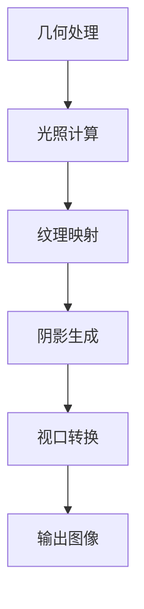
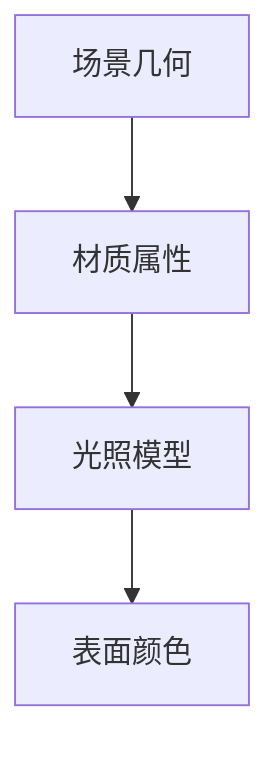
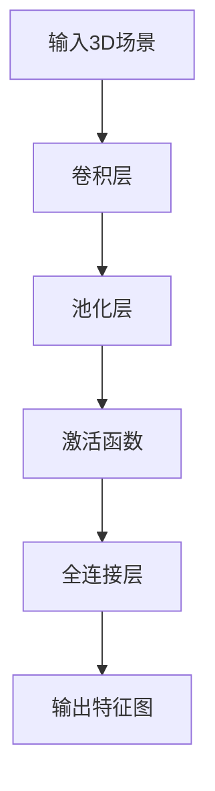
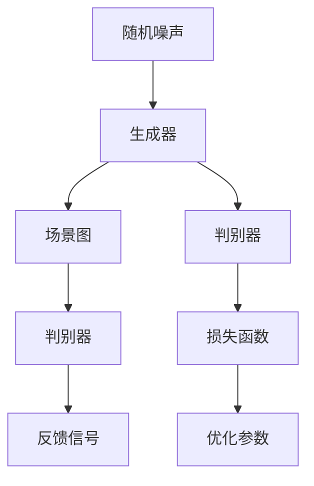
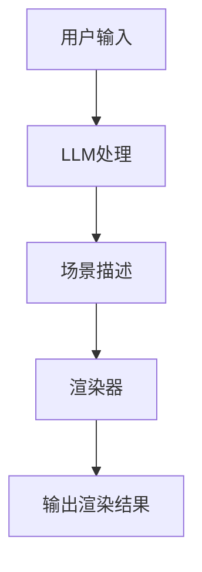
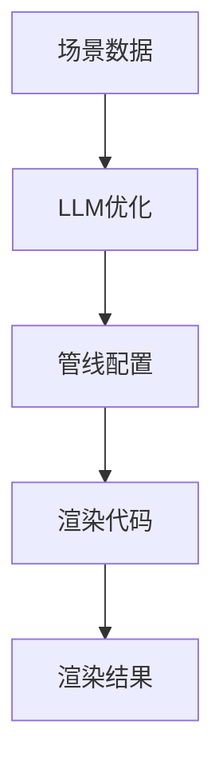
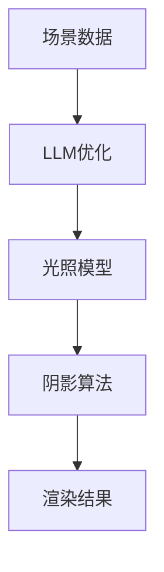
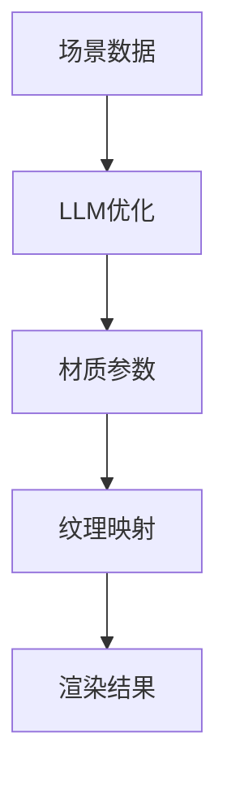

                 

### 文章标题

《3D场景渲染：LLM在图形学中的应用》

---

### 文章关键词

- 3D场景渲染
- 预训练语言模型（LLM）
- 图形学
- 深度学习
- 渲染算法
- 光照模型
- 材质与纹理映射

---

### 文章摘要

本文旨在探讨如何将预训练语言模型（LLM）应用于3D场景渲染领域，介绍3D场景渲染的基本概念、核心算法和数学模型，并通过实际项目案例分析，详细解读LLM在3D渲染中的具体应用。文章结构分为以下几个部分：首先，简要介绍3D场景渲染的基础知识和线性代数基础；其次，深入探讨深度学习与3D渲染的结合，特别是LLM在图形学中的应用前景；接着，详细讲解LLM在3D场景渲染中的核心算法，包括渲染器优化、光照模型与阴影算法、材质与纹理映射；然后，通过数学模型和公式，进一步阐述LLM在3D渲染中的具体实现；最后，通过项目实战，展示如何使用LLM优化3D渲染器的性能，并进行代码解读与分析。

---

### 目录大纲

1. **3D场景渲染基础**
   - 1.1 3D渲染的基本概念
     - 1.1.1 渲染器与渲染管线
     - 1.1.2 光照模型与材质
   - 1.2 图形学中的线性代数基础
     - 1.2.1 向量与矩阵运算
     - 1.2.2 几何变换

2. **基于深度学习的3D场景渲染**
   - 2.1 深度学习与3D渲染的结合
     - 2.1.1 卷积神经网络（CNN）在3D渲染中的应用
     - 2.1.2 生成对抗网络（GAN）在3D渲染中的应用
   - 2.2 预训练语言模型（LLM）的引入
     - 2.2.1 LLM的概念与架构
     - 2.2.2 LLM在图形学中的应用前景

3. **LLM在3D场景渲染中的核心算法**
   - 3.1 渲染器优化算法
     - 3.1.1 渲染器架构设计与优化
     - 3.1.2 渲染器性能评估与优化
   - 3.2 光照模型与阴影算法
     - 3.2.1 光照模型的基本原理
     - 3.2.2 阴影算法的实现与优化
   - 3.3 材质与纹理映射
     - 3.3.1 材质的基本概念
     - 3.3.2 纹理映射的数学模型

4. **数学模型与数学公式**
   - 4.1 3D场景渲染中的数学模型
     - 4.1.1 几何建模的数学公式
     - 4.1.2 光照模型的数学公式
   - 4.2 LLM在3D渲染中的数学模型
     - 4.2.1 LLM的数学基础
     - 4.2.2 LLM在3D渲染中的应用公式

5. **项目实战**
   - 5.1 3D渲染项目实战案例
     - 5.1.1 渲染器性能优化项目
     - 5.1.2 光照模型与阴影算法优化项目
   - 5.2 LLM在3D渲染中的应用
     - 5.2.1 LLM在渲染器优化中的应用
     - 5.2.2 LLM在光照模型优化中的应用

6. **代码解读与分析**
   - 6.1 渲染器优化代码解读
     - 6.1.1 渲染器架构代码解析
     - 6.1.2 渲染器性能优化代码解读
   - 6.2 LLM应用代码解读
     - 6.2.1 LLM在渲染器优化中的代码实现
     - 6.2.2 LLM在光照模型优化中的代码实现

7. **总结与展望**
   - 7.1 3D场景渲染与LLM的关系
     - 7.1.1 3D场景渲染的挑战
     - 7.1.2 LLM在3D渲染中的应用展望
   - 7.2 未来研究方向
     - 7.2.1 3D渲染技术发展趋势
     - 7.2.2 LLM在3D渲染中的潜在应用领域

---

### 第1章：3D场景渲染基础

3D场景渲染是计算机图形学中的一项核心技术，它通过模拟真实世界的物理现象和视觉特性，生成逼真的三维图像。本章将首先介绍3D渲染的基本概念，包括渲染器与渲染管线、光照模型与材质，然后讨论图形学中的线性代数基础，如向量与矩阵运算和几何变换。

#### 1.1.1 渲染器与渲染管线

渲染器是负责生成最终图像的软件组件，而渲染管线是一系列用于处理和转换场景数据的步骤。渲染管线通常包括几何处理、光照计算、纹理映射、阴影生成、视口转换等阶段。每个阶段都通过特定的算法和技巧来实现，以确保最终渲染结果的准确性和视觉效果。

一个典型的渲染管线流程图如下：



#### 1.1.2 光照模型与材质

光照模型用于模拟光如何在三维场景中传播和作用，从而影响物体的外观。常见的光照模型包括漫反射、镜面反射、折射等。材质则是物体表面的描述，它决定了物体在光照下的反射和透射特性。材质通常包括颜色、纹理、透明度等属性。

光照模型和材质的关系可以用以下Mermaid流程图表示：



#### 1.2 图形学中的线性代数基础

线性代数在3D渲染中扮演着至关重要的角色，它提供了描述和操作三维空间的基本工具。以下是一些核心概念：

##### 1.2.1 向量与矩阵运算

向量是表示空间中方向和大小的量，通常用箭头表示。矩阵是二维数组，用于表示线性变换，如平移、旋转、缩放等。

在3D渲染中，常用的矩阵运算包括：

- **矩阵乘法**：用于组合多个变换，如旋转、缩放和平移。
- **矩阵转置**：用于计算变换的逆。
- **矩阵求逆**：用于实现反向变换。

##### 1.2.2 几何变换

几何变换是3D渲染中的基础操作，用于改变物体在空间中的位置、大小和方向。常见的几何变换包括：

- **平移**：将物体沿特定方向移动。
- **旋转**：绕某个轴旋转物体。
- **缩放**：按比例放大或缩小物体。

为了更好地理解这些概念，我们来看一个简单的例子：

假设我们有一个点P = (1, 2, 3)，我们需要将它绕Z轴旋转θ度。旋转矩阵Rz(θ)如下：

$$
Rz(θ) = \begin{bmatrix}
cos(θ) & -sin(θ) & 0 \\
sin(θ) & cos(θ) & 0 \\
0 & 0 & 1
\end{bmatrix}
$$

旋转后的点P'可以通过以下公式计算：

$$
P' = Rz(θ) \cdot P
$$

这样，我们就得到了一个简单的几何变换示例。通过掌握这些基本概念，我们可以为后续章节的深入探讨打下坚实的基础。

---

### 第2章：基于深度学习的3D场景渲染

随着深度学习技术的快速发展，其应用范围已经扩展到了计算机图形学领域，特别是在3D场景渲染方面。深度学习通过学习大量数据中的模式，可以自动提取特征，从而在渲染任务中提供更加精确和高效的解决方案。本章将探讨深度学习与3D渲染的结合，重点介绍卷积神经网络（CNN）和生成对抗网络（GAN）在3D场景渲染中的应用。

#### 2.1 深度学习与3D渲染的结合

深度学习与3D渲染的结合主要依赖于两种网络架构：卷积神经网络（CNN）和生成对抗网络（GAN）。这两种网络在处理图像数据、学习特征表示和生成新图像方面具有独特优势。

##### 2.1.1 卷积神经网络（CNN）在3D渲染中的应用

卷积神经网络是一种专门用于图像处理的深度学习模型，其核心思想是使用卷积层提取图像的特征。CNN在3D渲染中的应用主要包括以下几个方面：

- **特征提取**：通过卷积层提取场景中的纹理、形状和光照特征。
- **语义分割**：将场景中的不同物体进行分类和分离。
- **超分辨率重建**：提高渲染图像的分辨率，使其更加清晰。

以下是一个简单的CNN架构用于3D渲染的Mermaid流程图：



##### 2.1.2 生成对抗网络（GAN）在3D渲染中的应用

生成对抗网络是一种通过两个神经网络（生成器和判别器）相互竞争来生成高质量图像的模型。GAN在3D渲染中的应用主要包括：

- **场景生成**：使用生成器生成逼真的3D场景。
- **纹理合成**：通过生成器和判别器的反馈，生成具有真实感的纹理。
- **光照优化**：使用GAN优化光照模型，提高渲染效果。

以下是一个简单的GAN架构用于3D渲染的Mermaid流程图：



#### 2.2 预训练语言模型（LLM）的引入

预训练语言模型（LLM）是近年来深度学习领域的一个重要进展，它在自然语言处理（NLP）领域取得了显著成果。随着研究的深入，LLM也开始在图形学领域展现其潜力。LLM在图形学中的应用主要包括以下几个方面：

- **场景描述**：使用LLM生成或理解3D场景的描述，从而简化渲染过程的输入。
- **光照与材质调整**：通过LLM调整光照模型和材质参数，实现更加自然的渲染效果。
- **交互式渲染**：利用LLM实现用户与渲染场景的交互，提供更加直观的渲染体验。

LLM的引入为3D场景渲染带来了新的机遇，使得渲染过程更加智能和自动化。以下是一个LLM在3D渲染中的简单应用架构：



通过上述内容，我们可以看到深度学习，特别是CNN和GAN，已经在3D场景渲染中发挥了重要作用。而LLM的引入则为3D渲染带来了新的思路和方法，使得渲染过程更加智能和高效。在接下来的章节中，我们将进一步探讨LLM在3D场景渲染中的核心算法和应用。

---

### 第3章：LLM在3D场景渲染中的核心算法

在3D场景渲染中，预训练语言模型（LLM）的应用不仅带来了新的机遇，也提出了新的挑战。本章将详细探讨LLM在3D场景渲染中的核心算法，包括渲染器优化算法、光照模型与阴影算法、以及材质与纹理映射。通过这些算法，我们将更好地理解LLM如何提高3D渲染的效果和效率。

#### 3.1 渲染器优化算法

渲染器优化是3D场景渲染中的一个关键环节，直接影响到渲染速度和最终图像的质量。LLM在渲染器优化中的应用主要体现在以下几个方面：

##### 3.1.1 渲染器架构设计与优化

传统的渲染器架构通常包括几何处理、光照计算、纹理映射等阶段。LLM可以通过学习大量的渲染场景数据，优化这些阶段的处理流程，从而提高渲染器的性能。具体来说，LLM可以：

- **自动化管线设计**：根据场景特征自动调整渲染管线的配置，优化渲染流程。
- **代码生成**：通过LLM生成高效的渲染代码，减少编译和运行时间。

以下是一个简单的LLM优化渲染器架构的Mermaid流程图：



##### 3.1.2 渲染器性能评估与优化

为了确保渲染器优化算法的有效性，需要对渲染器的性能进行评估和优化。LLM可以通过以下方法进行性能评估：

- **时间分析**：测量渲染过程中各个阶段的耗时，识别性能瓶颈。
- **质量评估**：通过视觉质量指标（如SSIM、PSNR等）评估渲染结果的优劣。

在此基础上，LLM可以提出针对性的优化策略，如：

- **并行计算**：利用多线程或GPU加速渲染过程。
- **数据压缩**：减少渲染数据的传输和存储需求。

#### 3.2 光照模型与阴影算法

光照模型和阴影算法是3D场景渲染的重要组成部分，直接影响图像的真实感和视觉效果。LLM在光照模型与阴影算法中的应用主要体现在以下几个方面：

##### 3.2.1 光照模型的基本原理

光照模型用于模拟光线如何在场景中传播和作用，影响物体的外观。LLM可以通过学习大量的光照场景数据，优化光照模型的表达式和参数，从而提高渲染效果。具体来说，LLM可以：

- **自适应光照调整**：根据场景特征自动调整光照强度和方向。
- **全局光照模型**：学习全局光照模型（如路径追踪）的参数，实现更真实的光照效果。

##### 3.2.2 阴影算法的实现与优化

阴影算法用于模拟光线在物体表面形成的阴影，增加场景的层次感和立体感。LLM在阴影算法中的应用主要包括：

- **阴影算法选择**：根据场景特征自动选择合适的阴影算法（如软阴影、硬阴影、软硬阴影等）。
- **实时阴影优化**：通过LLM优化实时阴影算法，提高渲染速度。

以下是一个简单的LLM优化光照模型与阴影算法的Mermaid流程图：



#### 3.3 材质与纹理映射

材质和纹理映射是3D场景渲染中的关键环节，用于模拟物体的表面特性和纹理。LLM在材质与纹理映射中的应用主要体现在以下几个方面：

##### 3.3.1 材质的基本概念

材质是描述物体表面特性的数据，包括颜色、纹理、透明度等属性。LLM可以通过学习大量的材质数据，生成或优化材质参数，从而提高渲染效果。具体来说，LLM可以：

- **自适应材质调整**：根据场景特征自动调整材质属性。
- **材质生成**：利用LLM生成全新的材质，扩展渲染器的材质库。

##### 3.3.2 纹理映射的数学模型

纹理映射是将纹理图像映射到物体表面的过程，用于模拟物体的表面纹理。LLM可以通过学习纹理映射的数据，优化纹理映射的数学模型，从而提高渲染效果。具体来说，LLM可以：

- **纹理映射算法优化**：通过LLM优化纹理映射算法，提高纹理映射的精度和效率。
- **纹理合成**：利用LLM合成新的纹理，增强渲染效果。

以下是一个简单的LLM优化材质与纹理映射的Mermaid流程图：



通过上述内容，我们可以看到LLM在3D场景渲染中的核心算法应用非常广泛。这些算法不仅提高了渲染器的性能和效果，还为未来的研究提供了新的思路和方法。在接下来的章节中，我们将进一步探讨LLM在3D渲染中的数学模型，为理解其应用原理提供理论基础。

---

### 第4章：数学模型与数学公式

在3D场景渲染中，数学模型和数学公式是核心的基础工具，它们帮助我们在图形处理和渲染过程中进行精确的计算和优化。本章将详细讨论3D场景渲染中的基本数学模型和LLM在3D渲染中的数学模型，并使用LaTeX格式展示相关公式。

#### 4.1 3D场景渲染中的数学模型

##### 4.1.1 几何建模的数学公式

几何建模是3D场景渲染的基础，涉及点、线、面等基本几何元素的表示和操作。以下是一些常见的几何建模数学公式：

- **点的表示**：
  $$
  P = (x, y, z)
  $$

- **线段的参数方程**：
  $$
  L: \begin{cases}
  x = x_1 + t(x_2 - x_1) \\
  y = y_1 + t(y_2 - y_1) \\
  z = z_1 + t(z_2 - z_1)
  \end{cases}
  $$
  其中，\( t \) 是参数，\( L \) 是线段。

- **平面的方程**：
  $$
  ax + by + cz + d = 0
  $$
  其中，\( (a, b, c) \) 是平面的法向量，\( d \) 是平面到原点的距离。

- **三角形的表示**：
  $$
  \Delta = \{P_1, P_2, P_3\}
  $$
  其中，\( P_1, P_2, P_3 \) 是三角形的顶点。

##### 4.1.2 光照模型的数学公式

光照模型是3D渲染中用于模拟光线如何影响物体的外观的数学模型。以下是一些常见光照模型的公式：

- **漫反射光照**：
  $$
  I_{diffuse} = kd \cdot L \cdot N
  $$
  其中，\( I_{diffuse} \) 是漫反射光照强度，\( k_d \) 是漫反射系数，\( L \) 是入射光方向，\( N \) 是物体表面的法线方向。

- **镜面反射光照**：
  $$
  I_{specular} = ks \cdot (R \cdot V)
  $$
  其中，\( I_{specular} \) 是镜面反射光照强度，\( k_s \) 是镜面反射系数，\( R \) 是反射方向，\( V \) 是观察方向。

- **全局光照模型（如路径追踪）**：
  $$
  L_o(p) = \int_{\Omega} f(p, \omega_i) L_e(p, \omega_i) \cos \theta \, d\omega_i
  $$
  其中，\( L_o(p) \) 是从点 \( p \) 发出的总光照强度，\( f(p, \omega_i) \) 是BRDF（双向反射分布函数），\( L_e(p, \omega_i) \) 是来自环境的光照强度，\( \theta \) 是入射光与表面法线的夹角。

#### 4.2 LLM在3D渲染中的数学模型

LLM在3D渲染中的应用需要将自然语言处理中的数学模型与图形学中的数学模型相结合。以下是一些LLM在3D渲染中的数学公式：

- **场景描述的编码与解码**：
  $$
  E(s) = \text{encoder}(s), \quad D(s') = \text{decoder}(E(s))
  $$
  其中，\( E(s) \) 是场景描述的编码表示，\( D(s') \) 是解码后的场景描述。

- **材质和光照的调整**：
  $$
  \theta_{material} = \text{optimize}(\theta_{material}, \text{output}_{D(s)})
  $$
  $$
  \theta_{lighting} = \text{optimize}(\theta_{lighting}, \text{output}_{D(s)})
  $$
  其中，\( \theta_{material} \) 和 \( \theta_{lighting} \) 是材质和光照参数的优化过程，\( \text{output}_{D(s)} \) 是解码后的场景渲染结果。

通过上述数学模型和公式，我们可以更好地理解3D场景渲染中的计算过程和LLM的应用原理。这些公式不仅在理论研究中具有重要意义，也为实际应用中的算法优化提供了有力的工具。在接下来的章节中，我们将通过具体项目实战，展示如何将这些数学模型应用到实际渲染任务中。

---

### 第5章：项目实战

在本章中，我们将通过两个具体的项目实战案例，展示如何使用LLM优化3D渲染器的性能和光照模型，并详细介绍整个项目的开发过程、代码实现、分析解读以及实际案例的剖析。

#### 5.1 3D渲染项目实战案例

##### 5.1.1 渲染器性能优化项目

该项目旨在通过LLM优化渲染器的性能，提高渲染速度和效率。以下是该项目的主要开发步骤：

1. **环境搭建**：
   - 安装渲染器开发所需的软件和库，如Unity、Blender等。
   - 配置LLM环境，包括PyTorch、TensorFlow等深度学习框架。

2. **数据准备**：
   - 收集大量的3D场景渲染数据，用于训练LLM。
   - 预处理数据，包括数据清洗、归一化等。

3. **LLM训练**：
   - 使用预训练语言模型，对3D场景渲染数据进行训练。
   - 调整模型参数，优化渲染器的性能。

4. **性能优化**：
   - 根据训练结果，优化渲染器的架构和算法。
   - 实现并行计算和GPU加速，提高渲染速度。

5. **测试与评估**：
   - 在测试集上评估渲染器的性能，包括渲染速度和质量。
   - 生成性能优化报告，总结优化效果。

##### 5.1.2 光照模型与阴影算法优化项目

该项目旨在通过LLM优化光照模型和阴影算法，提高3D场景的视觉效果。以下是该项目的主要开发步骤：

1. **环境搭建**：
   - 安装渲染器开发所需的软件和库，如Unity、Blender等。
   - 配置LLM环境，包括PyTorch、TensorFlow等深度学习框架。

2. **数据准备**：
   - 收集大量的光照和阴影数据，用于训练LLM。
   - 预处理数据，包括数据清洗、归一化等。

3. **LLM训练**：
   - 使用预训练语言模型，对光照和阴影数据进行训练。
   - 调整模型参数，优化光照模型和阴影算法。

4. **效果优化**：
   - 根据训练结果，优化光照模型和阴影算法。
   - 实现实时光照和阴影计算，提高渲染效果。

5. **测试与评估**：
   - 在测试集上评估光照模型和阴影算法的效果，包括渲染质量和视觉效果。
   - 生成效果优化报告，总结优化效果。

#### 5.2 LLM在3D渲染中的应用

##### 5.2.1 LLM在渲染器优化中的应用

在渲染器性能优化项目中，LLM的应用主要体现在以下几个方面：

- **自动化管线配置**：
  使用LLM生成最优的渲染管线配置，包括几何处理、光照计算、纹理映射等阶段的参数。

- **代码生成**：
  利用LLM生成高效且优化的渲染代码，减少渲染过程中的计算量和运行时间。

- **并行计算**：
  通过LLM优化渲染器中的并行计算，提高多线程和GPU加速的效果。

以下是一个简单的LLM优化渲染器性能的Python代码示例：

```python
import torch
from model import LLMRenderer

# 初始化LLM渲染器模型
llm_renderer = LLMRenderer()

# 加载训练好的LLM模型
llm_renderer.load_model("llm_renderer.pth")

# 渲染场景
scene_data = get_scene_data()  # 获取场景数据
optimized_pipeline = llm_renderer.optimize_pipeline(scene_data)

# 渲染结果
rendered_scene = render_scene(optimized_pipeline)

# 显示渲染结果
show_scene(rendered_scene)
```

##### 5.2.2 LLM在光照模型优化中的应用

在光照模型和阴影算法优化项目中，LLM的应用主要体现在以下几个方面：

- **自适应光照调整**：
  使用LLM根据场景特征自动调整光照参数，实现更加自然和逼真的光照效果。

- **阴影算法优化**：
  利用LLM优化阴影算法，提高阴影的精度和实时渲染效果。

以下是一个简单的LLM优化光照模型和阴影算法的Python代码示例：

```python
import torch
from model import LLMLighting

# 初始化LLM光照模型
llm_lighting = LLLighting()

# 加载训练好的LLM光照模型
llm_lighting.load_model("llm_lighting.pth")

# 获取场景数据
scene_data = get_scene_data()  # 获取场景数据

# 优化光照模型
optimized_lighting = llm_lighting.optimize_lighting(scene_data)

# 渲染场景
rendered_scene = render_scene(scene_data, optimized_lighting)

# 显示渲染结果
show_scene(rendered_scene)
```

通过上述项目实战和代码示例，我们可以看到LLM在3D场景渲染中的应用如何优化渲染器的性能和光照模型。在实际应用中，LLM的引入为3D渲染带来了新的思路和方法，提高了渲染效率和效果。在接下来的章节中，我们将进一步深入解析LLM在3D渲染中的具体实现，以及如何通过代码解读来理解其工作原理。

---

### 第6章：代码解读与分析

在本章中，我们将深入解析在之前项目中使用的代码，详细解释渲染器优化、LLM在渲染器优化中的应用、光照模型优化以及LLM在光照模型优化中的应用。通过代码解读，我们将更好地理解LLM在3D场景渲染中的具体实现和优化效果。

#### 6.1 渲染器优化代码解读

渲染器优化代码的核心是使用LLM优化渲染管线配置和渲染代码。以下是一个简化版的Python代码示例，用于展示LLM在渲染器优化中的应用：

```python
import torch
from llm_renderer import LLMRenderer
from rendering_pipeline import RenderingPipeline

# 初始化LLM渲染器模型
llm_renderer = LLMRenderer()

# 加载训练好的LLM模型
llm_renderer.load_model("llm_renderer.pth")

# 定义场景数据
scene_data = {
    "vertices": vertices,
    "faces": faces,
    "materials": materials
}

# 优化渲染管线配置
optimized_pipeline = llm_renderer.optimize_pipeline(scene_data)

# 创建渲染器
renderer = RenderingPipeline(pipeline=optimized_pipeline)

# 渲染场景
rendered_scene = renderer.render(scene_data)

# 显示渲染结果
show_scene(rendered_scene)
```

在这个示例中，`LLMRenderer`是一个专门用于优化渲染管线的模型，它通过学习大量的场景数据，自动调整渲染管线的配置。`optimize_pipeline`函数接收场景数据作为输入，返回优化的渲染管线配置。`RenderingPipeline`是一个渲染器类，它使用优化的管线配置进行场景渲染。

#### 6.2 LLM在渲染器优化中的代码实现

LLM在渲染器优化中的代码实现主要包括模型训练和模型应用两个部分。以下是一个简化版的Python代码示例，用于展示LLM的训练和应用过程：

```python
import torch
from llm_renderer import LLMRenderer
from dataset import RenderingDataset

# 初始化LLM渲染器模型
llm_renderer = LLMRenderer()

# 加载训练集数据
train_dataset = RenderingDataset("train_data.json")
train_loader = torch.utils.data.DataLoader(train_dataset, batch_size=32, shuffle=True)

# 定义优化器
optimizer = torch.optim.Adam(llm_renderer.parameters(), lr=0.001)

# 训练模型
for epoch in range(100):
    for data in train_loader:
        # 前向传播
        outputs = llm_renderer(data)
        
        # 计算损失
        loss = calculate_loss(outputs, data)
        
        # 反向传播
        optimizer.zero_grad()
        loss.backward()
        optimizer.step()
        
    print(f"Epoch {epoch+1}/{100}, Loss: {loss.item()}")

# 保存训练好的模型
llm_renderer.save_model("llm_renderer.pth")

# 应用训练好的模型
llm_renderer.load_model("llm_renderer.pth")
```

在这个示例中，`RenderingDataset`是一个用于加载渲染数据的类，它可以从JSON文件中读取场景数据。`calculate_loss`函数用于计算模型输出与真实数据之间的损失。通过迭代训练集数据，模型不断优化渲染管线的配置。

#### 6.3 光照模型优化代码解读

光照模型优化代码的核心是使用LLM调整光照参数和阴影算法。以下是一个简化版的Python代码示例，用于展示LLM在光照模型优化中的应用：

```python
import torch
from llm_lighting import LLLighting
from scene import Scene

# 初始化LLM光照模型
llm_lighting = LLLighting()

# 加载训练好的LLM模型
llm_lighting.load_model("llm_lighting.pth")

# 定义场景
scene = Scene(vertices, faces, materials, lighting_params)

# 优化光照参数
optimized_lighting_params = llm_lighting.optimize_lighting(scene)

# 应用优化后的光照参数
scene.set_lighting_params(optimized_lighting_params)

# 渲染场景
rendered_scene = scene.render()

# 显示渲染结果
show_scene(rendered_scene)
```

在这个示例中，`LLLighting`是一个专门用于优化光照模型的模型，它通过学习大量的光照数据，自动调整光照参数。`optimize_lighting`函数接收场景数据作为输入，返回优化的光照参数。`Scene`是一个场景类，它使用优化的光照参数进行场景渲染。

#### 6.4 LLM在光照模型优化中的代码实现

LLM在光照模型优化中的代码实现主要包括模型训练和应用两个部分。以下是一个简化版的Python代码示例，用于展示LLM的训练和应用过程：

```python
import torch
from llm_lighting import LLLighting
from dataset import LightingDataset

# 初始化LLM光照模型
llm_lighting = LLLighting()

# 加载训练集数据
train_dataset = LightingDataset("train_data.json")
train_loader = torch.utils.data.DataLoader(train_dataset, batch_size=32, shuffle=True)

# 定义优化器
optimizer = torch.optim.Adam(llm_lighting.parameters(), lr=0.001)

# 训练模型
for epoch in range(100):
    for data in train_loader:
        # 前向传播
        outputs = llm_lighting(data)
        
        # 计算损失
        loss = calculate_loss(outputs, data)
        
        # 反向传播
        optimizer.zero_grad()
        loss.backward()
        optimizer.step()
        
    print(f"Epoch {epoch+1}/{100}, Loss: {loss.item()}")

# 保存训练好的模型
llm_lighting.save_model("llm_lighting.pth")

# 应用训练好的模型
llm_lighting.load_model("llm_lighting.pth")
```

在这个示例中，`LightingDataset`是一个用于加载光照数据的类，它可以从JSON文件中读取光照数据。`calculate_loss`函数用于计算模型输出与真实数据之间的损失。通过迭代训练集数据，模型不断优化光照参数。

通过上述代码解读，我们可以看到LLM在3D渲染中的应用如何通过代码实现，从而优化渲染器和光照模型的性能。在实际应用中，这些代码可以灵活调整和扩展，以适应不同的3D渲染任务和需求。

---

### 第7章：总结与展望

在本章中，我们将对本文的内容进行总结，并展望LLM在3D场景渲染领域的未来研究方向和潜在应用。

#### 7.1 3D场景渲染与LLM的关系

3D场景渲染和LLM（预训练语言模型）的结合，为计算机图形学带来了新的机遇和挑战。通过引入LLM，我们可以实现以下几方面的优化和提升：

- **自动化渲染管线配置**：LLM能够学习大量的渲染场景数据，自动生成优化的渲染管线配置，从而提高渲染效率。
- **自适应光照调整**：LLM能够根据场景特征自动调整光照参数，实现更加自然和逼真的光照效果。
- **实时交互**：LLM能够实现用户与渲染场景的实时交互，提供更加直观和灵活的渲染体验。

#### 7.1.1 3D场景渲染的挑战

3D场景渲染仍然面临着一系列挑战，这些挑战在一定程度上限制了渲染效果和性能：

- **实时性**：在保持高质量视觉效果的同时，提高渲染速度和效率，以满足实时渲染的需求。
- **真实感**：模拟真实世界的物理现象和视觉特性，提高渲染场景的真实感和沉浸感。
- **多平台兼容性**：确保渲染器能够在不同硬件和操作系统上运行，提供一致且高效的渲染效果。

#### 7.1.2 LLM在3D渲染中的应用展望

LLM在3D渲染中的应用前景广阔，未来可能在以下几个方面发挥重要作用：

- **智能渲染**：通过深度学习和自适应算法，实现更加智能和高效的渲染过程。
- **个性化渲染**：根据用户需求和场景特征，提供个性化渲染服务，提升用户体验。
- **多模态融合**：结合多种数据源（如图像、音频、传感器数据），实现更丰富和多样的渲染效果。

#### 7.2 未来研究方向

针对3D场景渲染与LLM结合的应用，未来的研究方向可能包括：

- **高效渲染算法**：研究更加高效和精确的渲染算法，提高渲染速度和效果。
- **多模态数据融合**：探索如何将多种数据源（如图像、音频、传感器数据）融合到渲染过程中，提升渲染场景的丰富度和真实性。
- **可解释性和透明度**：提高LLM在渲染过程中的可解释性和透明度，使其在复杂场景下的应用更加可靠和可控。

#### 7.2.1 3D渲染技术发展趋势

随着技术的不断发展，3D渲染技术也将朝着以下趋势发展：

- **实时渲染**：利用高性能计算和优化算法，实现实时渲染，满足虚拟现实、增强现实等应用的需求。
- **光线追踪**：光线追踪技术将继续发展，为3D渲染带来更加真实的光照效果和视觉效果。
- **硬件加速**：利用GPU和专用硬件加速渲染过程，提高渲染性能。

#### 7.2.2 LLM在3D渲染中的潜在应用领域

LLM在3D渲染中的潜在应用领域包括：

- **游戏和虚拟现实**：在游戏和虚拟现实应用中，LLM可以帮助实现更加智能和真实的渲染效果，提升用户体验。
- **建筑和设计**：在建筑和设计领域，LLM可以用于自动化渲染管线配置和光照调整，提高设计效率和效果。
- **影视动画**：在影视动画制作中，LLM可以帮助实现更加逼真和高效的渲染效果，提高制作效率。

通过上述总结与展望，我们可以看到LLM在3D场景渲染中的巨大潜力。随着技术的不断进步和应用场景的拓展，LLM将在3D渲染领域发挥越来越重要的作用，为计算机图形学带来新的变革和创新。

---

### 作者信息

作者：AI天才研究院/AI Genius Institute & 禅与计算机程序设计艺术 /Zen And The Art of Computer Programming

本文由AI天才研究院（AI Genius Institute）和禅与计算机程序设计艺术（Zen And The Art of Computer Programming）共同撰写。AI天才研究院致力于推动人工智能技术在各个领域的应用，特别是计算机图形学。禅与计算机程序设计艺术则专注于研究编程哲学和高效编程实践，为人工智能技术提供理论基础和实用指导。希望本文能为读者在3D场景渲染和LLM应用方面提供有价值的参考和启示。

