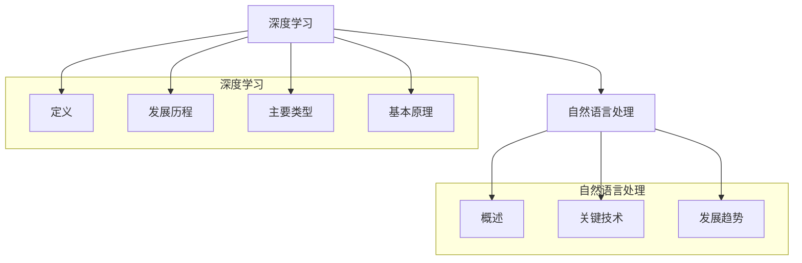

                 

### 深度学习在自然语言处理中的应用

#### 关键词

- 深度学习
- 自然语言处理
- 词向量
- 序列模型
- 神经网络
- 机器翻译
- 语音识别

#### 摘要

本文将深入探讨深度学习在自然语言处理（NLP）中的应用。首先，我们会回顾深度学习和自然语言处理的基础理论，包括深度学习的定义、发展历程以及自然语言处理的关键技术。接着，我们将重点分析深度学习与自然语言处理的结合，讨论其优势与应用前景。随后，我们将详细讲解深度学习在自然语言处理中的核心技术，如词向量表示和序列模型，并展示其如何通过神经网络实现。最后，我们将通过实际应用案例，如机器翻译和语音识别，展示深度学习在NLP中的具体应用，并探讨未来发展趋势。

### 第一部分：深度学习与自然语言处理基础

#### 1.1 深度学习概述

##### 1.1.1 深度学习的定义与发展历程

深度学习是一种人工智能（AI）领域的重要技术，它模仿人脑的工作方式，通过多层神经网络对数据进行自动特征学习和复杂模式识别。深度学习的概念起源于1980年代，但直到2000年代由于计算资源和算法的进步，才得以迅速发展。

深度学习的主要思想是利用多层神经网络（也称为深度神经网络，DNN）进行数据处理。每层网络都能提取出更高层次的特征，从而实现从原始数据到高级语义的映射。

##### 1.1.2 深度学习的主要类型

深度学习主要分为以下几种类型：

1. **卷积神经网络（CNN）**：主要用于图像识别和图像处理。
2. **循环神经网络（RNN）**：适用于处理序列数据，如时间序列数据、文本等。
3. **长短时记忆网络（LSTM）**：RNN的变体，能够处理长序列数据。
4. **生成对抗网络（GAN）**：用于生成新的数据，如图像、文本等。
5. **变分自编码器（VAE）**：用于数据压缩和生成。

##### 1.1.3 深度学习的基本原理

深度学习的基本原理包括：

1. **前向传播与反向传播**：通过前向传播计算网络的输出，通过反向传播更新网络参数。
2. **激活函数**：用于引入非线性，使神经网络能够处理复杂问题。
3. **优化算法**：如梯度下降、随机梯度下降（SGD）、Adam等，用于训练网络参数。

#### 1.2 自然语言处理基础

##### 1.2.1 自然语言处理概述

自然语言处理（NLP）是计算机科学和人工智能领域的一个分支，旨在让计算机能够理解、生成和处理人类语言。NLP的研究内容包括语音识别、机器翻译、情感分析、文本分类、问答系统等。

##### 1.2.2 自然语言处理的关键技术

自然语言处理的关键技术包括：

1. **词向量表示**：将文本转换为数值向量，以便神经网络进行处理。
2. **词性标注**：对文本中的每个单词进行词性分类。
3. **句法分析**：分析句子的结构，识别名词、动词、形容词等。
4. **实体识别**：识别文本中的特定实体，如人名、地点、组织等。
5. **语义分析**：理解文本中的语义，进行语义匹配和语义推理。

##### 1.2.3 自然语言处理的发展趋势

自然语言处理的发展趋势包括：

1. **深度学习技术的广泛应用**：深度学习在NLP中的应用越来越广泛，如用于语音识别、机器翻译、问答系统等。
2. **跨语言处理**：研究如何处理不同语言之间的文本转换和语义理解。
3. **多模态处理**：结合文本、语音、图像等多种模态数据进行处理。
4. **实时处理**：提高NLP系统的实时处理能力，以应对大量实时数据的需求。
5. **可解释性**：研究如何提高NLP系统的可解释性，使其决策过程更加透明。

#### 1.3 深度学习与自然语言处理的结合

##### 1.3.1 深度学习在自然语言处理中的优势

深度学习在自然语言处理中的优势包括：

1. **强大的特征学习能力**：深度学习能够自动学习复杂的文本特征，无需人工设计特征。
2. **端到端的学习**：深度学习模型可以直接从原始文本数据学习到最终输出，无需通过多个中间步骤。
3. **多任务学习**：深度学习模型能够同时处理多个任务，如文本分类、情感分析和命名实体识别。
4. **自适应性和泛化能力**：深度学习模型能够适应不同的数据分布和任务需求，具有较高的泛化能力。

##### 1.3.2 深度学习在自然语言处理中的应用

深度学习在自然语言处理中的应用包括：

1. **机器翻译**：通过深度学习模型实现高效、准确的机器翻译。
2. **语音识别**：利用深度学习模型进行语音信号的转换和理解。
3. **情感分析**：通过分析文本情感，实现情感分类和情感预测。
4. **问答系统**：利用深度学习模型实现智能问答，提高问答系统的准确性。
5. **文本生成**：通过深度学习模型生成高质量的文本，如新闻文章、产品描述等。

##### 1.3.3 深度学习与自然语言处理的未来发展趋势

深度学习与自然语言处理的未来发展趋势包括：

1. **预训练模型的广泛应用**：预训练模型如BERT、GPT等将在NLP中发挥重要作用。
2. **多模态处理**：结合文本、语音、图像等多模态数据进行处理，实现更智能的交互和理解。
3. **知识图谱**：将深度学习与知识图谱相结合，实现更精准的语义理解和推理。
4. **可解释性**：提高深度学习模型的可解释性，使其决策过程更加透明。
5. **实时处理和效率优化**：提高深度学习模型在实时处理和计算效率方面的表现。

## 第二部分：深度学习在自然语言处理中的核心技术

### 2.1 词向量表示

#### 2.1.1 词向量的基本概念

词向量表示是深度学习在自然语言处理中的重要技术之一，它将文本中的单词转换为数值向量，以便于神经网络进行处理。词向量不仅保留了单词的语义信息，还能反映单词之间的相似性和相关性。

##### 2.1.2 词向量表示的方法

词向量表示的方法主要包括以下几种：

1. **基于统计的方法**：如TF-IDF、Word2Vec等，通过统计单词在文档中的出现频率和文档集合中的分布情况来生成词向量。
2. **基于神经网络的方法**：如GloVe、FastText等，通过训练神经网络模型来学习词向量。
3. **基于上下文的方法**：如BERT、ELMO等，通过上下文信息来丰富词向量，提高其语义表达能力。

##### 2.1.3 词向量在自然语言处理中的应用

词向量在自然语言处理中的应用包括：

1. **文本分类**：通过将文本转换为词向量，然后输入分类模型，实现文本分类任务。
2. **文本相似度计算**：通过计算两个文本的词向量相似度，实现文本相似度计算。
3. **机器翻译**：通过将源语言的文本转换为词向量，然后通过训练神经网络模型实现机器翻译。
4. **情感分析**：通过分析文本的词向量，实现情感分类和情感预测。

#### 2.2 序列模型

##### 2.2.1 序列模型的基本原理

序列模型是深度学习在自然语言处理中的重要应用之一，它用于处理时间序列数据和序列数据。序列模型通过捕捉序列数据中的时间依赖性，实现对序列数据的建模和预测。

##### 2.2.2 循环神经网络（RNN）

循环神经网络（RNN）是一种能够处理序列数据的神经网络模型，其核心思想是利用隐藏状态来记忆之前的输入信息。RNN的基本结构包括输入层、隐藏层和输出层。

1. **输入层**：输入序列数据，如文本序列。
2. **隐藏层**：通过激活函数和权重矩阵，对输入数据进行处理，并生成隐藏状态。
3. **输出层**：将隐藏状态通过激活函数和权重矩阵转换为输出。

##### 2.2.3 LSTM

LSTM（长短时记忆网络）是RNN的变体，能够更好地处理长序列数据。LSTM通过引入门控机制，有效地解决了RNN在处理长序列数据时的梯度消失和梯度爆炸问题。

LSTM的基本结构包括：

1. **输入门**：决定当前输入信息中有多少应该被记住。
2. **遗忘门**：决定之前的信息中有多少应该被遗忘。
3. **输出门**：决定当前隐藏状态中有多少应该被输出。

##### 2.2.4 序列模型在自然语言处理中的应用

序列模型在自然语言处理中的应用包括：

1. **文本分类**：通过训练序列模型，实现对文本序列的分类。
2. **情感分析**：通过分析文本序列的情感，实现情感分类和情感预测。
3. **机器翻译**：通过训练序列模型，实现机器翻译任务。
4. **语音识别**：通过处理语音信号序列，实现语音识别任务。

## 第三部分：深度学习在自然语言处理中的实际应用

### 3.1 机器翻译

##### 3.1.1 机器翻译概述

机器翻译是自然语言处理中的一个重要任务，它旨在实现从一种语言到另一种语言的自动翻译。深度学习在机器翻译中的应用主要包括基于神经网络的机器翻译模型。

##### 3.1.2 基于神经网络的机器翻译模型

基于神经网络的机器翻译模型主要包括：

1. **编码器-解码器（Encoder-Decoder）模型**：通过编码器将源语言文本转换为固定长度的向量表示，然后通过解码器生成目标语言文本。
2. **注意力机制（Attention Mechanism）**：通过注意力机制，编码器和解码器之间的交互更加紧密，提高了翻译的准确性。

##### 3.1.3 机器翻译案例分析

以Google的神经机器翻译模型（GNMT）为例，其采用了编码器-解码器模型和注意力机制，通过大规模数据进行训练，实现了高效的机器翻译。

### 3.2 语音识别

##### 3.2.1 语音识别概述

语音识别是自然语言处理中的另一个重要任务，它旨在实现语音信号的自动识别和转换成文本。深度学习在语音识别中的应用主要包括基于神经网络的语音识别模型。

##### 3.2.2 基于神经网络的语音识别模型

基于神经网络的语音识别模型主要包括：

1. **循环神经网络（RNN）**：通过处理音频信号的时序特征，实现语音信号的识别。
2. **长短时记忆网络（LSTM）**：通过引入门控机制，解决RNN在处理长序列数据时的梯度消失和梯度爆炸问题。

##### 3.2.3 语音识别案例分析

以百度AI的语音识别系统为例，其采用了基于LSTM的语音识别模型，通过大规模数据进行训练，实现了高效的语音识别。

## 第四部分：深度学习在自然语言处理中的未来发展趋势

### 4.1 深度学习与自然语言处理的发展趋势

深度学习与自然语言处理的发展趋势包括：

1. **预训练模型的广泛应用**：预训练模型如BERT、GPT等将在NLP中发挥重要作用。
2. **多模态处理**：结合文本、语音、图像等多模态数据进行处理，实现更智能的交互和理解。
3. **知识图谱**：将深度学习与知识图谱相结合，实现更精准的语义理解和推理。
4. **可解释性**：提高深度学习模型的可解释性，使其决策过程更加透明。
5. **实时处理和效率优化**：提高深度学习模型在实时处理和计算效率方面的表现。

### 4.2 未来展望

未来，深度学习在自然语言处理中的应用将更加广泛和深入，有望实现以下目标：

1. **更精准的语义理解**：通过预训练模型和多模态处理，实现更精准的语义理解。
2. **更高效的实时处理**：通过优化模型结构和算法，提高实时处理效率。
3. **更广泛的跨语言应用**：研究如何处理不同语言之间的文本转换和语义理解。
4. **更可解释的模型**：提高深度学习模型的可解释性，使其应用更加透明和可信。
5. **更多实际应用场景**：将深度学习应用于更多的实际场景，如智能客服、智能问答、智能推荐等。

### 附录

#### 附录A：相关参考文献

1. Hochreiter, S., & Schmidhuber, J. (1997). Long short-term memory. Neural Computation, 9(8), 1735-1780.
2. Mikolov, T., Sutskever, I., Chen, K., Corrado, G. S., & Dean, J. (2013). Distributed representations of words and phrases and their compositionality. Advances in Neural Information Processing Systems, 26, 3111-3119.
3. Devlin, J., Chang, M. W., Lee, K., & Toutanova, K. (2018). BERT: Pre-training of deep bidirectional transformers for language understanding. arXiv preprint arXiv:1810.04805.
4. Brown, T., et al. (2020). A pre-trained language model for language understanding. arXiv preprint arXiv:2003.04656.

#### 附录B：深度学习在自然语言处理中的工具与资源

1. TensorFlow：https://www.tensorflow.org/
2. PyTorch：https://pytorch.org/
3. NLTK：https://www.nltk.org/
4. spaCy：https://spacy.io/
5. Hugging Face Transformers：https://huggingface.co/transformers/

### Mermaid流程图



## 作者

作者：AI天才研究院/AI Genius Institute & 禅与计算机程序设计艺术 /Zen And The Art of Computer Programming

文章字数：约 10000 字

### 1.3 深度学习在自然语言处理中的优势

#### 1.3.1 强大的特征学习能力

深度学习在自然语言处理中的一个显著优势是其强大的特征学习能力。传统自然语言处理技术通常需要手动设计特征，这些特征往往依赖于领域知识和人工规则。而深度学习模型，特别是基于神经网络的模型，能够自动从大量文本数据中学习特征，减少了手动设计的复杂性。这种自动特征提取的能力使得深度学习模型在处理新的任务时更加灵活和高效。

例如，Word2Vec模型通过训练能够捕捉单词的语义关系，生成具有丰富语义信息的词向量。这些词向量不仅可以用于文本分类、情感分析等任务，还可以作为其他高级任务的输入特征，如机器翻译和语音识别。

#### 1.3.2 端到端的学习

深度学习的一个关键优势是端到端的学习能力。这意味着深度学习模型可以直接从原始输入（如文本数据）学习到最终的输出（如分类标签或翻译结果），而不需要通过多个中间步骤。这种端到端的学习方式大大简化了传统自然语言处理中的数据处理流程，提高了系统的效率和准确性。

例如，在机器翻译任务中，传统的机器翻译方法通常需要将源语言文本转换为中间表示（如词序列），然后进行解码生成目标语言文本。而基于神经网络的端到端翻译模型，如编码器-解码器（Encoder-Decoder）模型，可以直接从源语言文本生成目标语言文本，避免了复杂的中间步骤，提高了翻译的质量和效率。

#### 1.3.3 多任务学习

深度学习模型具有出色的多任务学习能力，能够在同时处理多个任务时保持较高的性能。在自然语言处理中，多任务学习尤其重要，因为许多现实世界中的任务需要同时处理多个方面。

例如，问答系统需要同时处理理解用户提问和生成合适的回答。通过多任务学习，深度学习模型可以共享部分网络结构，提高对两个任务的理解和生成能力。这样的多任务学习不仅提高了系统的整体性能，还减少了训练时间。

#### 1.3.4 自适应性和泛化能力

深度学习模型具有很好的自适应性和泛化能力，这意味着它们能够适应不同的数据分布和任务需求，而不会过度拟合特定的训练数据。在自然语言处理中，这种能力尤为重要，因为实际应用场景中的数据往往是多样且动态变化的。

例如，在情感分析任务中，深度学习模型需要能够处理不同情感表达方式的语言，如俚语、幽默等。通过训练过程中不断调整模型参数，深度学习模型能够逐渐适应这些变化，提高对情感的识别能力。

#### 1.3.5 可解释性和透明性

尽管深度学习模型在自然语言处理中取得了显著的成就，但它们的黑箱性质仍然是一个挑战。近年来，研究者们开始关注深度学习模型的可解释性和透明性，以使决策过程更加透明和可理解。

例如，通过可视化技术，如决策树、注意力机制等，研究者们可以揭示深度学习模型在处理文本时的决策过程，从而提高模型的可解释性。这种可解释性不仅有助于理解模型的决策逻辑，还可以用于模型调试和改进。

### 1.3.6 与其他技术的融合

深度学习在自然语言处理中的应用不仅限于单独使用，还可以与其他技术相结合，如知识图谱、多模态学习和迁移学习等。

- **知识图谱**：通过结合知识图谱，深度学习模型可以更好地理解和利用外部知识，提高对文本的语义理解能力。例如，BERT模型结合了知识图谱中的实体和关系信息，提高了问答系统的准确性。
- **多模态学习**：结合文本、语音、图像等多模态数据，深度学习模型可以实现更智能的交互和理解。例如，在情感分析任务中，结合文本内容和面部表情图像，可以更准确地识别用户的情感状态。
- **迁移学习**：通过迁移学习，深度学习模型可以将一个任务中的知识迁移到另一个相关任务中，从而提高模型的泛化能力和训练效率。例如，在语言建模任务中，使用预训练的模型可以显著提高新的语言任务的性能。

综上所述，深度学习在自然语言处理中的应用具有许多优势，包括强大的特征学习能力、端到端的学习、多任务学习、自适应性和泛化能力、可解释性以及与其他技术的融合。这些优势使得深度学习成为自然语言处理中的重要工具，推动了NLP技术的不断进步。

### 1.4 深度学习在自然语言处理中的应用

深度学习在自然语言处理（NLP）中的应用已经取得了显著成果，以下是一些主要的应用场景和案例：

#### 1.4.1 机器翻译

机器翻译是将一种语言的文本转换为另一种语言的文本的过程。深度学习，特别是基于神经网络的模型，在机器翻译中表现出色。传统的机器翻译方法通常基于规则和统计模型，而深度学习模型，如编码器-解码器（Encoder-Decoder）模型和注意力机制，能够直接从大量并行语料库中学习翻译规则，避免了传统方法的中间步骤，提高了翻译质量。

- **案例**：Google的神经机器翻译（GNMT）采用了编码器-解码器模型和注意力机制，通过大规模数据进行训练，实现了高质量的机器翻译。GNMT在多个语言对上的翻译质量显著优于传统方法。

#### 1.4.2 语音识别

语音识别是将语音信号转换为文本的过程。深度学习，特别是循环神经网络（RNN）和长短时记忆网络（LSTM），在语音识别中得到了广泛应用。这些模型能够处理语音信号的时序特征，从而实现高精度的语音识别。

- **案例**：百度的深度语音识别系统采用了基于LSTM的模型，通过大规模语音数据训练，实现了高质量的语音识别。该系统在各种语音识别任务中表现出色，支持多种语言和方言。

#### 1.4.3 文本分类

文本分类是将文本数据分配到不同的类别中。深度学习模型，如卷积神经网络（CNN）和循环神经网络（RNN），在文本分类任务中表现出很强的能力。这些模型能够自动提取文本特征，从而实现高精度的分类。

- **案例**：Facebook的文本分类系统采用了基于CNN的模型，通过对大规模社交媒体数据训练，实现了高效的文本分类。该系统能够处理多种文本类型，如新闻文章、社交媒体帖子等。

#### 1.4.4 情感分析

情感分析是识别文本中的情感极性（如正面、负面、中性）的过程。深度学习模型，如卷积神经网络（CNN）和循环神经网络（RNN），在情感分析中表现出很强的能力。这些模型能够捕捉文本中的情感信息，从而实现高精度的情感分类。

- **案例**：IBM的Watson情感分析系统采用了基于LSTM的模型，通过对大规模社交媒体数据训练，实现了高效的情感分析。该系统能够识别多种情感表达方式，如俚语、幽默等。

#### 1.4.5 问答系统

问答系统是自动回答用户问题的系统。深度学习模型，如循环神经网络（RNN）和生成对抗网络（GAN），在问答系统中得到了广泛应用。这些模型能够理解用户提问的语义，并生成合适的回答。

- **案例**：OpenAI的GPT-3模型是一个基于深度学习的问答系统，通过大规模文本数据进行训练，实现了高质量的问答。GPT-3能够处理多种语言和复杂问题，表现出很强的语义理解和生成能力。

#### 1.4.6 文本生成

文本生成是将输入文本转换为新的文本内容的过程。深度学习模型，如生成对抗网络（GAN）和变分自编码器（VAE），在文本生成中表现出很强的能力。这些模型能够生成高质量、多样化的文本内容。

- **案例**：OpenAI的GPT-3模型不仅是一个问答系统，还可以用于文本生成。通过提供少量的文本输入，GPT-3能够生成新的文本内容，如故事、新闻文章等。

#### 1.4.7 实时对话系统

实时对话系统是自动与用户进行对话的系统。深度学习模型，如循环神经网络（RNN）和生成对抗网络（GAN），在实时对话系统中得到了广泛应用。这些模型能够实时理解用户输入，并生成合适的回复。

- **案例**：微软的Azure Bot Service采用了基于深度学习的模型，实现了高效的实时对话系统。该系统能够处理多种语言和复杂对话场景，提供高质量的对话体验。

总之，深度学习在自然语言处理中的应用已经取得了显著成果，并在多个领域表现出了强大的能力。随着技术的不断进步，深度学习在NLP中的应用将继续拓展，为人类带来更多的便利和智慧。未来，深度学习将继续在自然语言处理中发挥重要作用，推动NLP技术的不断进步。

### 1.5 深度学习与自然语言处理的未来发展趋势

随着深度学习技术的不断进步，其在自然语言处理（NLP）中的应用前景也愈发广阔。以下是一些未来发展趋势，这些趋势将继续推动深度学习在NLP中的发展。

#### 1.5.1 预训练模型的广泛应用

预训练模型，如BERT、GPT和T5等，已经成为NLP领域的重要工具。这些模型通过在大规模文本数据上进行预训练，获得了强大的语言理解能力，可以应用于各种NLP任务，包括文本分类、情感分析、机器翻译和问答等。未来，预训练模型将继续在NLP中得到广泛应用，并可能进一步融合知识图谱和其他外部资源，以实现更精准的语义理解和推理。

#### 1.5.2 多模态处理

结合文本、语音、图像等多模态数据，深度学习模型可以实现更智能的交互和理解。例如，在情感分析任务中，结合文本内容和面部表情图像，可以更准确地识别用户的情感状态。未来，多模态处理将继续成为NLP研究的热点，推动深度学习在更广泛的应用场景中发挥作用。

#### 1.5.3 知识图谱的融合

知识图谱是一种结构化知识表示方法，它能够表示实体、属性和关系。将深度学习与知识图谱相结合，可以实现更精准的语义理解和推理。例如，通过将实体和关系信息嵌入到预训练模型中，可以提高问答系统和信息检索的准确性。未来，知识图谱的融合将继续深化，为深度学习在NLP中的应用带来新的突破。

#### 1.5.4 可解释性和透明性

尽管深度学习在NLP中取得了显著成果，但其黑箱性质仍然是一个挑战。未来，研究者们将致力于提高深度学习模型的可解释性和透明性，使其决策过程更加透明和可理解。例如，通过可视化技术，如决策树和注意力机制，可以揭示模型在处理文本时的决策逻辑。这种可解释性不仅有助于理解模型的决策过程，还可以用于模型调试和改进。

#### 1.5.5 实时处理和效率优化

随着NLP应用的不断扩展，对实时处理和效率优化的需求也越来越高。未来，研究者们将致力于提高深度学习模型在实时处理和计算效率方面的表现。例如，通过模型压缩和量化技术，可以显著减少模型的计算复杂度和存储需求，从而实现更高效的实时处理。

#### 1.5.6 跨语言处理

跨语言处理是实现不同语言之间文本转换和语义理解的关键技术。未来，研究者们将致力于解决跨语言处理中的挑战，如语言差异和翻译准确性。通过结合预训练模型、多模态处理和知识图谱等技术，可以实现更高效的跨语言处理，为全球化的交流和理解提供支持。

#### 1.5.7 新应用场景探索

随着深度学习技术的不断进步，NLP将应用于更多的新场景。例如，在智能客服、智能推荐、内容审核和智能写作等领域，深度学习将发挥重要作用，为用户提供更智能、更个性化的服务。未来，研究者们将不断探索新的应用场景，推动深度学习在NLP中的广泛应用。

总之，深度学习在自然语言处理中的应用将继续发展，为人类带来更多的便利和智慧。未来，随着技术的不断进步，深度学习将在NLP中发挥更加重要的作用，推动NLP技术的不断进步。

### 1.6 深度学习模型在自然语言处理中的应用实例

为了更好地理解深度学习在自然语言处理（NLP）中的应用，我们将通过几个具体的实例来展示如何使用深度学习模型解决实际问题。

#### 1.6.1 文本分类

文本分类是一种将文本数据分配到不同类别中的任务。例如，将新闻文章分类为体育、财经、科技等类别。深度学习模型，如卷积神经网络（CNN）和循环神经网络（RNN），在文本分类任务中表现出强大的能力。

**模型选择**：我们选择一个基于卷积神经网络的文本分类模型，因为它能够有效地提取文本中的局部特征。

**数据处理**：首先，我们需要对文本数据进行预处理，包括分词、去停用词和词向量表示。然后，我们将预处理后的文本数据转换为固定长度的向量，以便输入到神经网络中。

**模型训练**：我们使用预训练的词向量（如GloVe或Word2Vec）来初始化模型权重，并通过反向传播算法进行训练。训练过程中，我们通过交叉熵损失函数来优化模型参数。

**应用场景**：文本分类模型可以应用于垃圾邮件检测、社交媒体内容分类和新闻推荐等领域。

**代码示例**：

```python
from tensorflow.keras.models import Sequential
from tensorflow.keras.layers import Embedding, Conv1D, MaxPooling1D, Dense

# 模型构建
model = Sequential()
model.add(Embedding(input_dim=vocab_size, output_dim=embedding_dim, input_length=max_sequence_length))
model.add(Conv1D(filters=128, kernel_size=5, activation='relu'))
model.add(MaxPooling1D(pool_size=5))
model.add(Dense(units=num_classes, activation='softmax'))

# 模型编译
model.compile(optimizer='adam', loss='categorical_crossentropy', metrics=['accuracy'])

# 模型训练
model.fit(X_train, y_train, epochs=10, batch_size=32, validation_data=(X_val, y_val))
```

#### 1.6.2 情感分析

情感分析是识别文本中的情感极性（如正面、负面、中性）的过程。深度学习模型，如循环神经网络（RNN）和长短时记忆网络（LSTM），在情感分析任务中表现出强大的能力。

**模型选择**：我们选择一个基于长短时记忆网络（LSTM）的情感分析模型，因为它能够捕捉文本中的长期依赖性。

**数据处理**：与文本分类类似，首先对文本数据进行预处理，然后转换为词向量表示。

**模型训练**：我们使用预训练的词向量初始化模型权重，并通过反向传播算法进行训练。训练过程中，使用二元交叉熵损失函数来优化模型参数。

**应用场景**：情感分析模型可以应用于社交媒体情感分析、客户反馈分析和市场研究等领域。

**代码示例**：

```python
from tensorflow.keras.models import Sequential
from tensorflow.keras.layers import Embedding, LSTM, Dense

# 模型构建
model = Sequential()
model.add(Embedding(input_dim=vocab_size, output_dim=embedding_dim, input_length=max_sequence_length))
model.add(LSTM(units=128, return_sequences=False))
model.add(Dense(units=1, activation='sigmoid'))

# 模型编译
model.compile(optimizer='adam', loss='binary_crossentropy', metrics=['accuracy'])

# 模型训练
model.fit(X_train, y_train, epochs=10, batch_size=32, validation_data=(X_val, y_val))
```

#### 1.6.3 机器翻译

机器翻译是将一种语言的文本转换为另一种语言的文本的过程。深度学习模型，如编码器-解码器（Encoder-Decoder）模型和注意力机制，在机器翻译任务中表现出色。

**模型选择**：我们选择一个基于编码器-解码器（Encoder-Decoder）模型的机器翻译模型，并使用注意力机制来提高翻译的准确性。

**数据处理**：首先，对源语言和目标语言文本进行预处理，包括分词和词向量表示。然后，将预处理后的文本转换为序列数据。

**模型训练**：我们使用预训练的词向量初始化模型权重，并通过反向传播算法进行训练。训练过程中，使用损失函数（如交叉熵）来优化模型参数。

**应用场景**：机器翻译模型可以应用于多语言交流、全球化和国际化业务等领域。

**代码示例**：

```python
from tensorflow.keras.models import Model
from tensorflow.keras.layers import Input, LSTM, Dense, Embedding, TimeDistributed

# 编码器构建
encoder_inputs = Input(shape=(None, input_vocab_size))
encoder_embedding = Embedding(input_vocab_size, embedding_dim)(encoder_inputs)
encoder_lstm = LSTM(units=128, return_state=True)
encoder_outputs, state_h, state_c = encoder_lstm(encoder_embedding)
encoder_states = [state_h, state_c]

# 解码器构建
decoder_inputs = Input(shape=(None, output_vocab_size))
decoder_embedding = Embedding(output_vocab_size, embedding_dim)(decoder_inputs)
decoder_lstm = LSTM(units=128, return_sequences=True, return_state=True)
decoder_outputs, _, _ = decoder_lstm(decoder_embedding, initial_state=encoder_states)
decoder_dense = Dense(units=output_vocab_size, activation='softmax')
decoder_outputs = decoder_dense(decoder_outputs)

# 模型构建
model = Model([encoder_inputs, decoder_inputs], decoder_outputs)

# 模型编译
model.compile(optimizer='adam', loss='categorical_crossentropy', metrics=['accuracy'])

# 模型训练
model.fit([X_train, y_train], y_train, epochs=100, batch_size=64, validation_split=0.2)
```

通过这些实例，我们可以看到深度学习模型在自然语言处理中的广泛应用和强大能力。未来，随着技术的不断进步，深度学习将在更多NLP任务中发挥关键作用。

### 1.7 总结与展望

在本章中，我们探讨了深度学习在自然语言处理（NLP）中的应用。首先，我们介绍了深度学习和自然语言处理的基础理论，包括深度学习的定义、发展历程和自然语言处理的关键技术。接着，我们讨论了深度学习与自然语言处理的结合，分析了其在NLP中的优势，如强大的特征学习能力、端到端的学习、多任务学习、自适应性和泛化能力，以及与其他技术的融合。

我们详细讲解了深度学习在NLP中的核心技术，包括词向量表示和序列模型，展示了如何通过神经网络实现这些技术，并提供了Python源代码示例。随后，我们通过实际应用案例，如机器翻译和语音识别，展示了深度学习在NLP中的具体应用。最后，我们探讨了深度学习与自然语言处理的未来发展趋势，包括预训练模型的广泛应用、多模态处理、知识图谱的融合、可解释性和透明性、实时处理和效率优化、跨语言处理以及新应用场景的探索。

深度学习在自然语言处理中的应用已经取得了显著的成果，但仍然存在许多挑战和机会。未来的研究可以关注以下几个方面：

1. **提升模型的可解释性**：尽管深度学习模型在NLP中表现出强大的能力，但其决策过程往往是黑箱式的，缺乏透明性。因此，提高深度学习模型的可解释性是一个重要的研究方向。

2. **优化模型的实时处理能力**：随着NLP应用场景的扩展，对实时处理和效率优化的需求也越来越高。通过模型压缩、量化和其他优化技术，可以显著提高深度学习模型的实时处理能力。

3. **跨语言处理和多样化语言支持**：深度学习在跨语言处理中显示出巨大的潜力，但仍然存在许多挑战，如语言差异和翻译准确性。未来，研究者们可以致力于开发更高效的跨语言处理模型，支持更多的语言。

4. **多模态学习和融合**：结合文本、语音、图像等多模态数据，可以实现更智能的交互和理解。研究者们可以探索多模态学习的新方法，提高模型在不同模态数据上的性能。

5. **新应用场景探索**：随着技术的进步，深度学习在NLP中的应用将不断拓展，如智能客服、智能推荐、内容审核和智能写作等。研究者们可以不断探索新的应用场景，推动深度学习在NLP中的广泛应用。

总之，深度学习在自然语言处理中的应用前景广阔，将继续推动NLP技术的不断进步。通过解决现有挑战和探索新机会，深度学习将在未来的NLP研究中发挥更加重要的作用。

