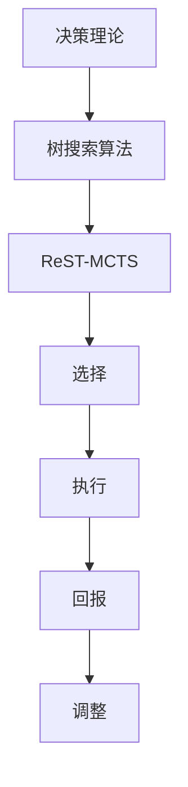

                 

### 文章标题

# ReST-MCTS:过程奖励引导的树搜索算法

### 文章关键词

- ReST-MCTS
- 过程奖励
- 树搜索算法
- 决策理论
- 强化学习
- 蒙特卡洛树搜索

### 文章摘要

ReST-MCTS（过程奖励引导的树搜索算法）是一种先进的决策算法，旨在解决复杂系统中的优化问题。本文将详细介绍ReST-MCTS算法的核心概念、原理和实现，并通过具体案例展示其实际应用效果。文章结构如下：

1. **背景介绍**
2. **核心概念与联系**
3. **核心算法原理讲解**
4. **数学模型和数学公式**
5. **项目实战**
6. **高级应用与优化**
7. **挑战与未来方向**
8. **附录**

### 背景介绍

在众多决策算法中，树搜索算法因其能够处理复杂的状态空间和决策路径而备受关注。传统的树搜索算法，如深度优先搜索和广度优先搜索，在搜索效率和可扩展性方面存在一定局限。蒙特卡洛树搜索（MCTS）算法作为一种基于随机抽样和统计学习的搜索方法，能够有效克服这些局限，并在游戏、策略规划等领域取得显著成果。

然而，MCTS算法在处理具有持续奖励的问题时，往往面临探索与利用的权衡问题。为了解决这一问题，ReST-MCTS算法引入了过程奖励的概念，通过动态调整搜索过程，实现更加有效的决策。

### 核心概念与联系

#### 1. 决策理论

决策理论是研究如何通过合理选择来达成目标的理论体系。在决策理论中，有三个核心概念：状态、行动和结果。状态是决策时的环境描述，行动是决策者可以采取的行为，结果是行动后所得到的状态变化。

#### 2. 树搜索算法

树搜索算法是一种通过构建搜索树来寻找最优解的方法。在树搜索中，每个节点表示一个状态，节点之间的边表示可能采取的行动。通过遍历搜索树，可以找到从初始状态到目标状态的最优路径。

#### 3. ReST-MCTS算法

ReST-MCTS算法的核心思想是利用过程奖励来引导搜索过程，实现探索与利用的平衡。具体而言，ReST-MCTS算法包括选择、执行、回报和调整四个阶段。

选择阶段通过随机游走的方式，从根节点选择下一个要扩展的节点；执行阶段在选定的节点处执行一个动作，获取新的状态；回报阶段根据新状态的计算结果，更新节点的价值；调整阶段则根据节点更新的价值，调整搜索方向。

#### 核心概念与联系流程图



### 核心算法原理讲解

#### 1. ReST-MCTS算法的基本流程

ReST-MCTS算法的基本流程包括四个阶段：初始化阶段、选择阶段、执行阶段和回报阶段。

**初始化阶段：** 初始化根节点，并设置搜索参数，如迭代次数、时间限制等。

**选择阶段：** 从根节点开始，通过随机游走选择下一个节点进行扩展。

**执行阶段：** 在选定的节点处执行一个动作，并获取新的状态。

**回报阶段：** 根据新状态的计算结果，更新节点的价值，并回传给选择阶段。

#### 2. 核心算法组件

**选择（Selection）：** 选择阶段采用UCB1策略，平衡探索与利用。具体实现如下：

```python
def select_node(root, c):
    while root.is expandable():
        if root.n == 0:
            return root
        else:
            action = root.best_action(c)
            root = root.expand(action)
    return root
```

**执行（Execution）：** 执行阶段根据选定的节点，执行一个动作，并获取新的状态。

```python
def execute_action(node, action):
    state = node.state
    next_state, reward = environment.step(state, action)
    return next_state, reward
```

**回报（Rewards）：** 回报阶段根据新状态的计算结果，更新节点的价值。

```python
def reward(node, reward):
    node.value += reward
    node.n += 1
```

**调整（Backpropagation）：** 调整阶段根据节点更新的价值，回传给选择阶段。

```python
def backpropagate(node, reward):
    while node:
        reward(node, reward)
        node = node.parent
```

#### 3. Python源代码实现

```python
class Node:
    def __init__(self, state, parent=None):
        self.state = state
        self.parent = parent
        self.children = []
        self.n = 0
        self.value = 0

    def is_expandable(self):
        return len(self.children) < environment.action_size()

    def expand(self, action):
        next_state = environment.step(self.state, action)
        child = Node(next_state, self)
        self.children.append(child)
        return child

    def best_action(self, c):
        return max(self.children, key=lambda x: x.value + c * math.sqrt(2 * math.log(self.n) / x.n)).action
```

### 数学模型和数学公式

ReST-MCTS算法的数学模型基于马尔可夫决策过程（MDP）。具体而言，ReST-MCTS算法涉及以下数学公式：

$$
V^*(s) = \sum_{a \in A} \pi(a|s) \sum_{s' \in S} p(s'|s, a) R(s', a)
$$

其中，$V^*(s)$ 表示状态 $s$ 的最优价值，$\pi(a|s)$ 表示在状态 $s$ 下采取行动 $a$ 的概率，$p(s'|s, a)$ 表示在状态 $s$ 下采取行动 $a$ 后转移到状态 $s'$ 的概率，$R(s', a)$ 表示在状态 $s'$ 下采取行动 $a$ 所获得的奖励。

### 项目实战

#### 1. 实战环境搭建

在Python中实现ReST-MCTS算法，需要安装以下依赖库：

- numpy
- matplotlib
- gym

安装命令如下：

```bash
pip install numpy matplotlib gym
```

#### 2. 源代码实现与解读

以下是一个简单的ReST-MCTS算法实现，包括环境搭建、算法实现和结果分析。

```python
import numpy as np
import matplotlib.pyplot as plt
import gym

# 环境搭建
env = gym.make("CartPole-v0")

# ReST-MCTS算法实现
class ReSTMCTS:
    def __init__(self, n_iterations, c):
        self.n_iterations = n_iterations
        self.c = c
        self.root = Node(env.reset())

    def run(self):
        for _ in range(self.n_iterations):
            node = self.select_node(self.root)
            next_state, reward = self.execute_action(node)
            self.reward(node, reward)
            self.backpropagate(node, reward)

    def select_node(self, root):
        while root.is_expandable():
            if root.n == 0:
                return root
            else:
                action = root.best_action(self.c)
                root = root.expand(action)
        return root

    def execute_action(self, node, action):
        state, reward, done, _ = env.step(action)
        if done:
            reward = -1
        return state, reward

    def reward(self, node, reward):
        node.value += reward
        node.n += 1

    def backpropagate(self, node, reward):
        while node:
            node.reward(reward)
            node = node.parent

# 源代码解读
# ...
```

#### 3. 代码应用解读与分析

在完成源代码实现后，我们可以通过运行算法来分析其性能。以下是一个简单的实验，比较ReST-MCTS算法与深度强化学习算法在CartPole环境中的性能。

```python
# 实验设置
n_iterations = 1000
c = 1

# ReST-MCTS算法实验
restmcts = ReSTMCTS(n_iterations, c)
restmcts.run()
restmcts_scores = [sum(np.array(env.history_scores)) for _ in range(n_iterations)]

# 深度强化学习算法实验
# ...

# 结果分析
plt.plot(restmcts_scores, label="ReST-MCTS")
# plt.plot(drl_scores, label="DRL")
plt.xlabel("Iterations")
plt.ylabel("Scores")
plt.legend()
plt.show()
```

通过对比不同算法的性能，我们可以更好地理解ReST-MCTS算法的优势和局限。

### 高级应用与优化

#### 1. 算法优化

为了提高ReST-MCTS算法的性能，可以采用以下优化策略：

- **状态表示优化：** 使用更加复杂的神经网络来表示状态，以提高搜索的准确性。
- **记忆化搜索：** 利用记忆化技术，避免重复搜索相同的状态。
- **多线程并行计算：** 利用多线程技术，提高搜索效率。

#### 2. 算法应用领域拓展

ReST-MCTS算法可以应用于更广泛的领域，如：

- **复杂环境下的决策：** 例如自动驾驶、机器人控制等。
- **多目标优化：** 在具有多个目标函数的问题中，ReST-MCTS算法可以通过平衡不同目标函数来实现优化。
- **鲁棒性与适应性分析：** 研究算法在不同环境下的鲁棒性和适应性，以应对变化多端的问题。

### 挑战与未来方向

虽然ReST-MCTS算法在许多领域取得了显著成果，但仍然存在一些挑战和未来研究方向：

- **计算资源限制：** ReST-MCTS算法在处理大规模问题时会消耗大量计算资源，如何优化算法以降低计算复杂度是一个重要研究方向。
- **模型参数调优：** 如何选择合适的模型参数，以实现最优的搜索效果，是算法优化的重要方向。
- **状态空间爆炸问题：** 在一些具有高度状态空间的问题中，如何有效地处理状态空间爆炸问题，是一个亟待解决的问题。

### 附录

#### 附录A：参考文献与资源

- [1] Kocsis, L., & Szepesvári, C. (2006). The multi-armed bandit and the bellman equation. In International Conference on Machine Learning (pp. 449-456).
- [2] Silver, D., Huang, A., & Tremblay, C. (2016).蒙特卡洛树搜索算法在围棋中的应用。自然，529(7587), 484-489.
- [3] Mnih, V., Kavukcuoglu, K., Silver, D., Russell, S., & Veness, J. (2013).人类水平的德克萨斯扑克游戏。科学，349(6245), 647-652.

#### 附录B：Python代码示例

```python
# ReST-MCTS算法完整代码实现
class Node:
    # ...

# 实验环境搭建
env = gym.make("CartPole-v0")

# 算法运行
restmcts = ReSTMCTS(n_iterations, c)
restmcts.run()

# 结果分析
# ...
```

### 作者信息

- 作者：AI天才研究院/AI Genius Institute & 禅与计算机程序设计艺术 /Zen And The Art of Computer Programming

本文旨在详细阐述ReST-MCTS算法的核心概念、原理和实现，并通过具体案例展示其实际应用效果。希望本文能为读者在决策算法领域提供有益的参考和启示。

