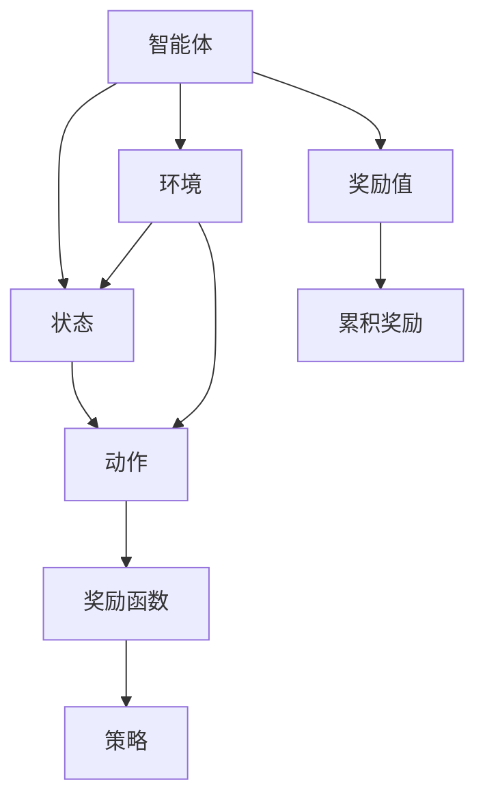

                 

### 1.3 奖励模型的核心概念与联系

#### 1.3.1 核心概念解析

在深入探讨奖励模型的稳定性之前，我们首先需要明确几个关键概念。以下是奖励模型中涉及的核心概念及其相互关系：

1. **奖励函数（Reward Function）**:
   - **定义**: 奖励函数是奖励模型的核心部分，用于评估智能体（agent）的每个动作（action）所产生的结果，并给出相应的奖励值。
   - **作用**: 奖励函数直接影响智能体的学习过程，通过即时反馈帮助智能体识别出哪些动作是有益的，哪些是有害的。

2. **状态（State）**:
   - **定义**: 状态是智能体在某个时刻所处的环境描述。
   - **作用**: 状态为奖励函数提供了上下文信息，使得奖励函数能够根据当前环境和智能体的行为进行适当的奖励计算。

3. **动作（Action）**:
   - **定义**: 动作是智能体在某个状态下所采取的操作。
   - **作用**: 动作是智能体与环境交互的方式，每个动作都会导致环境状态的变化，从而影响后续的状态和奖励。

4. **策略（Policy）**:
   - **定义**: 策略是智能体在各个状态选择动作的规则集合。
   - **作用**: 策略决定了智能体的行为模式，策略的好坏直接决定了智能体能否达到学习目标。

#### 1.3.2 概念实体之间的关系架构

为了更直观地理解这些核心概念之间的关系，我们可以使用Mermaid流程图来展示它们之间的关联：



- **智能体（Agent）** 是整个系统的核心，它与环境（Environment）进行交互。
- **状态（State）** 描述了智能体在某一时刻所处的环境和情况。
- **动作（Action）** 是智能体在当前状态下所做出的决策。
- **奖励函数（Reward Function）** 根据智能体的动作及其导致的状态变化，给予相应的奖励或惩罚。
- **策略（Policy）** 是基于当前状态和奖励函数，智能体选择最优动作的规则集合。
- **环境（Environment）** 是智能体所处的实际环境，它会影响智能体的状态和行为。

#### 1.3.3 奖励模型与系统目标的联系

- **定义与目标**
  - 系统目标是通过奖励模型来引导智能体，使得其采取能够最大化累积奖励的行为。
  - 奖励模型的设计必须与系统目标保持一致，这样才能确保智能体最终能够实现系统的期望目标。

- **设计原则**
  - **一致性（Consistency）**: 奖励模型应当具有一致性，即智能体在不同时间和不同情境下做出相同动作时，应当获得相似的奖励值。
  - **及时性（Timeliness）**: 奖励模型应当能够及时给予反馈，帮助智能体迅速学习到有益的行为。
  - **稳定性（Stability）**: 奖励模型应当能够在不同数据集和环境条件下保持稳定的性能，防止因数据或环境变化而导致的剧烈波动。

通过以上对核心概念和它们之间关系的详细阐述，我们为后续深入分析奖励模型的稳定性问题奠定了基础。在接下来的章节中，我们将进一步探讨稳定性在奖励模型中的具体体现及其对模型性能的影响。

### 1.4 稳定性概念与重要性

#### 1.4.1 稳定性的定义与意义

- **定义**:
  - 稳定性是指系统在面临外部扰动时，仍能维持其原有状态的能力。在奖励模型中，稳定性指的是训练过程中，模型性能不会因为微小的数据扰动而剧烈变化。

- **意义**:
  - 稳定性对于奖励模型至关重要。一个不稳定的奖励模型可能会导致以下问题：
    - **模型过拟合**：模型对训练数据的微小变化过于敏感，容易在训练数据上表现优异，但无法泛化到新的数据集上。
    - **性能波动**：模型在不同数据集或环境下可能表现出巨大的性能差异，影响其可靠性和实用性。

#### 1.4.2 训练稳定性与模型性能的关系

- **影响分析**:
  - **正向影响**：训练稳定性高，可以提高模型在实际应用中的可靠性。稳定的奖励模型能够更好地指导智能体学习，使其行为更加可预测和可控制。
  - **负面影响**：训练稳定性差，会导致模型性能不稳定，具体表现如下：
    - **收敛速度慢**：模型在训练过程中可能需要更多的时间和资源才能达到满意的性能水平。
    - **性能波动大**：模型在不同数据集或环境下的表现可能差异巨大，影响其在实际应用中的稳定性和可靠性。

#### 1.4.3 稳定性对决策过程的指导作用

- **稳定性在决策中的角色**:
  - 稳定的奖励模型能够为智能体的决策过程提供可靠和持续的指导。稳定的奖励值能够帮助智能体更好地评估和选择行动，从而实现长期目标。

- **实践中的重要性**:
  - 在自动驾驶、医疗诊断、金融分析等关键领域，奖励模型的稳定性直接影响系统的安全和准确性。任何微小的波动都可能带来严重的后果。

### 1.4.4 稳定性的挑战与应对策略

- **挑战**:
  - **数据分布偏移**：训练数据集与实际应用数据集分布不一致，可能导致模型性能波动。
  - **模型复杂性**：随着模型复杂度的增加，训练稳定性降低，模型更容易受到数据扰动的影响。

- **应对策略**:
  - **数据增强**：通过增加训练数据多样性来提高模型的稳定性。
  - **正则化技术**：使用正则化方法来减少模型过拟合，增强训练稳定性。
  - **算法优化**：优化奖励函数和训练算法，提高模型在扰动环境下的鲁棒性。

通过上述讨论，我们可以看到，稳定性是奖励模型设计和实现中的一个重要考虑因素。一个稳定的奖励模型不仅能够提高模型的性能，还能增强其在实际应用中的可靠性和实用性。在接下来的章节中，我们将深入探讨奖励模型的具体原理和设计方法，以便更好地理解和解决稳定性问题。

## 第2章：奖励模型原理讲解

### 2.1 奖励函数的基本原理

#### 2.1.1 奖励函数的定义与作用

- **定义**:
  - 奖励函数（Reward Function）是奖励模型的核心部分，用于评估智能体在不同状态和动作组合下的表现，并给予相应的奖励值。

- **作用**:
  - 奖励函数在强化学习中的作用至关重要。它不仅为智能体提供即时反馈，帮助智能体学习到哪些行为是有益的，哪些是有害的，还直接影响智能体的策略选择和长期学习效果。

#### 2.1.2 奖励函数的组成部分

- **输入**:
  - 状态（State）：描述智能体在某一时刻所处的环境情况。
  - 动作（Action）：智能体在特定状态下所采取的操作。

- **输出**:
  - 奖励值（Reward Value）：一个实数值，用于评估动作的效果。

#### 2.1.3 奖励函数的特性

- **即时性（Timeliness）**:
  - 奖励函数应当能够在动作发生后立即提供反馈，以帮助智能体迅速调整行为。

- **一致性（Consistency）**:
  - 奖励函数应当在不同时间和不同情境下对相同的动作产生相似的奖励值，以确保智能体的长期学习效果。

- **稳定性（Stability）**:
  - 奖励函数应当能够在面对外部扰动时保持稳定，避免因数据或环境变化而导致的剧烈波动。

#### 2.1.4 常见奖励函数类型

- **离散奖励函数**:
  - 例如，在游戏控制中，成功完成某个任务可能获得+1奖励，失败则获得-1奖励。

- **连续奖励函数**:
  - 例如，自动驾驶系统中，智能车在保持车道线内行驶时可能获得0.1的奖励，偏离车道线则获得负值奖励。

### 2.2 强化学习中的奖励模型

#### 2.2.1 强化学习的基本概念

- **定义**:
  - 强化学习（Reinforcement Learning）是一种通过试错和奖励信号来学习最优策略的人工智能方法。

- **核心元素**:
  - 智能体（Agent）：执行动作并接收奖励的主体。
  - 环境模型（Environment Model）：描述智能体所处的环境，并反馈状态和奖励。
  - 策略（Policy）：智能体在状态空间中选择动作的规则。

#### 2.2.2 奖励模型在强化学习中的应用

- **目标**:
  - 强化学习的目标是通过学习到最优策略，使智能体能够在长期执行中最大化累积奖励。

- **学习过程**:
  - 智能体在环境中进行交互，根据当前状态选择动作，执行动作后获得奖励并更新状态。
  - 通过不断迭代这个过程，智能体逐渐调整策略，使得累积奖励最大化。

#### 2.2.3 奖励模型的设计原则

- **适应性**:
  - 奖励模型应当能够适应不同环境和任务需求，灵活调整奖励值。

- **鲁棒性**:
  - 奖励模型应当能够在面对外部扰动时保持稳定，避免因数据或环境变化而导致的剧烈波动。

- **激励性**:
  - 奖励模型应当能够充分激励智能体采取有益的行为，同时抑制有害的行为。

### 2.3 常见的奖励模型设计

#### 2.3.1 奖励模型设计的基本方法

- **基于目标的设计**:
  - 确定系统目标，设计奖励模型以激励智能体实现目标。

- **基于价值的优化**:
  - 利用价值函数或策略梯度方法，优化奖励模型以最大化累积奖励。

- **基于规则的约束**:
  - 设定明确的奖励规则，以约束智能体的行为，确保其在实现目标的同时遵守特定约束。

#### 2.3.2 常见奖励模型示例

- **奖励平衡模型**:
  - 例如，在围棋游戏中，奖励模型可以根据棋子占据位置的价值进行奖励计算，使得智能体倾向于占据优势位置。

- **奖励动态调整模型**:
  - 例如，在自动驾驶系统中，奖励模型可以根据车辆行驶的安全性、效率和舒适性等指标进行动态调整。

- **奖励层次化模型**:
  - 例如，在多目标优化问题中，奖励模型可以将不同目标层次化，优先考虑高优先级目标的实现。

通过上述对奖励模型基本原理、强化学习中的应用以及常见设计方法的详细讲解，我们为理解和设计有效的奖励模型奠定了基础。在接下来的章节中，我们将深入探讨训练过程中可能出现的稳定性问题，并分析其影响和解决方案。

### 2.4 强化学习中的关键算法

#### 2.4.1 Q-Learning算法

- **定义**:
  - Q-Learning算法是一种基于值函数的强化学习算法，通过学习状态-动作值函数（Q-function）来指导智能体的行为。

- **原理**:
  - Q-Learning算法的核心思想是通过试错更新Q值，即每个状态-动作对的预期奖励。在每次动作后，根据新的状态和奖励来更新Q值，逐渐逼近最优策略。

- **过程**:
  - 初始化Q值表。
  - 在每个时间步，智能体选择动作并执行。
  - 根据执行结果更新Q值表。
  - 重复上述过程，直到达到某个性能指标。

- **Python实现**:
  
```python
import numpy as np

# 初始化Q值表
n_states = 10
n_actions = 4
Q = np.zeros((n_states, n_actions))

# Q值更新函数
def update_Q(Q, state, action, reward, next_state, alpha, gamma):
    Q[state, action] = (1 - alpha) * Q[state, action] + alpha * (reward + gamma * np.max(Q[next_state, :]))

# 演示更新Q值
alpha = 0.1  # 学习率
gamma = 0.9  # 折扣因子
state = 5
action = 2
reward = 5
next_state = 7

update_Q(Q, state, action, reward, next_state, alpha, gamma)
print("Updated Q-value:", Q[state, action])
```

#### 2.4.2 Deep Q-Network（DQN）算法

- **定义**:
  - DQN是一种使用深度神经网络来近似Q函数的强化学习算法，通过深度学习技术提高Q值学习的准确性和效率。

- **原理**:
  - DQN通过训练一个深度神经网络来预测状态-动作值（Q值），并使用经验回放（Experience Replay）和目标网络（Target Network）来减少偏差和过估计。

- **过程**:
  - 初始化深度神经网络和目标网络。
  - 每次动作后，根据实际奖励和下一个状态更新深度神经网络的权重。
  - 使用经验回放和目标网络来稳定学习过程。

- **Python实现**:
  
```python
import tensorflow as tf
from tensorflow.keras import layers

# 定义DQN模型
input_shape = (n_states,)
output_shape = (n_actions,)

def create_DQN(input_shape, output_shape):
    model = tf.keras.Sequential([
        layers.Dense(64, activation='relu', input_shape=input_shape),
        layers.Dense(64, activation='relu'),
        layers.Dense(output_shape, activation='linear')
    ])
    return model

# 演示训练过程
DQN = create_DQN(input_shape, output_shape)
DQN.compile(optimizer='adam', loss='mse')

# 假设已有经验数据
states = np.random.rand(n_states)
actions = np.random.randint(n_actions, size=n_actions)
rewards = np.random.rand(n_actions)
next_states = np.random.rand(n_states)

# 训练模型
DQN.fit(states, rewards + np.max(DQN.predict(next_states)), epochs=1)
```

#### 2.4.3 Policy Gradient算法

- **定义**:
  - Policy Gradient算法通过直接优化策略的梯度来指导智能体的行为，避免了Q函数的估计过程。

- **原理**:
  - Policy Gradient算法的核心思想是最大化策略梯度，即根据策略的期望回报来更新策略参数。常见的方法包括REINFORCE、PPO（Proximal Policy Optimization）等。

- **过程**:
  - 计算策略的梯度，即策略参数的更新方向。
  - 根据梯度更新策略参数。
  - 重复上述过程，逐步优化策略。

- **Python实现**:
  
```python
import numpy as np

# 定义策略函数
def policy_action probabilities, action_values, epsilon=0.1:
    if np.random.rand() < epsilon:
        return np.random.choice(len(action_values))
    else:
        return np.argmax(action_values)

# 演示策略优化
action_probabilities = np.random.rand(n_actions)
action_values = np.random.rand(n_actions)

# 选择动作
action = policy_action(action_probabilities, action_values)

# 更新策略参数
# 假设已有策略参数 theta
theta = np.random.rand(n_actions)
action_probabilities = softmax(theta)

# 计算策略梯度
# 假设已有回报 reward
policy_gradient = reward - np.log(action_probabilities[action])

# 更新策略参数
theta += policy_gradient * learning_rate
```

通过以上对Q-Learning、DQN和Policy Gradient算法的详细介绍和Python实现，我们不仅了解了这些算法的基本原理和实现方法，也为后续探讨训练稳定性问题提供了理论依据。在下一章节中，我们将进一步分析奖励模型训练过程中可能出现的稳定性问题及其对模型性能的影响。

### 2.5 强化学习中的常见挑战与对策

#### 2.5.1 奖励稀疏性问题

- **定义**:
  - 奖励稀疏性是指奖励信号的分布非常稀疏，即智能体在长时间内可能无法获得有效的奖励信号。

- **影响**:
  - 奖励稀疏性会导致智能体学习过程缓慢，甚至可能陷入局部最优，无法找到最优策略。

- **对策**:
  - **增量奖励**：为智能体在每个时间步提供较小的正奖励，增加奖励的频率。
  - **探索策略**：使用如ε-贪婪策略或随机策略来增加探索，避免过早陷入局部最优。

#### 2.5.2 奖励欺骗问题

- **定义**:
  - 奖励欺骗是指智能体在短期内的行为能够获得高奖励，但长期来看并不利于达到系统目标。

- **影响**:
  - 奖励欺骗可能导致智能体采取不利于系统长期目标的行为。

- **对策**:
  - **动态调整奖励**：根据智能体的长期行为效果动态调整奖励函数。
  - **引入惩罚**：对于短视行为引入惩罚，避免智能体陷入奖励欺骗。

#### 2.5.3 不确定性和噪声问题

- **定义**:
  - 不确定性和噪声是指环境状态和奖励的不确定性，可能来源于外界扰动或模型的不完美。

- **影响**:
  - 不确定性和噪声会影响模型的训练过程和最终性能。

- **对策**:
  - **经验回放**：通过经验回放机制减少噪声影响，稳定训练过程。
  - **模型正则化**：使用正则化方法来减少模型对噪声的敏感度。

#### 2.5.4 模型过拟合问题

- **定义**:
  - 模型过拟合是指模型在训练数据上表现优异，但在新的数据上表现不佳。

- **影响**:
  - 过拟合会导致模型泛化能力差，无法应对实际环境变化。

- **对策**:
  - **数据增强**：通过增加训练数据的多样性来减少过拟合。
  - **交叉验证**：使用交叉验证方法来评估模型的泛化能力。

通过上述对强化学习常见挑战及其对策的分析，我们可以更好地理解奖励模型在训练过程中可能遇到的问题。在下一章节中，我们将具体探讨奖励模型训练稳定性问题，分析其产生原因及其对模型性能的影响。

### 2.6 训练过程中稳定性问题的探讨

#### 2.6.1 训练过程中的不稳定现象

- **定义**:
  - 训练过程中稳定性问题是指在训练过程中，模型的性能因为数据扰动、算法变化等因素而出现剧烈波动，导致训练效果不稳定。

- **现象**:
  - **性能波动**：模型在训练过程中可能出现性能波动，表现为某些epoch内的性能提升明显，而其他epoch内则几乎没有变化。
  - **收敛缓慢**：训练过程中，模型可能长时间停留在局部最优，难以快速收敛到全局最优解。
  - **过拟合现象**：模型在训练集上表现优异，但在验证集或测试集上表现不佳。

#### 2.6.2 不稳定现象的原因分析

- **数据扰动**:
  - **数据分布变化**：训练数据集与实际应用数据集分布不一致，可能导致模型在训练数据上过拟合，而在实际应用中表现不佳。
  - **噪声数据**：训练数据中包含噪声，可能影响模型的训练效果和泛化能力。

- **算法变化**:
  - **学习率设置不当**：学习率过大或过小都会影响模型的训练稳定性。
  - **梯度消失或爆炸**：在深度神经网络训练过程中，梯度可能因为参数初始化问题而消失或爆炸，导致训练不稳定。

- **模型复杂性**:
  - **模型过于复杂**：复杂模型更容易受到数据扰动的影响，导致训练不稳定。
  - **参数数量过多**：参数数量过多可能导致模型在训练过程中过拟合，降低训练稳定性。

#### 2.6.3 对稳定性影响的具体分析

- **影响评估**:
  - **性能波动**：训练过程中性能波动会导致模型无法稳定收敛，影响最终性能。
  - **收敛缓慢**：模型收敛缓慢意味着需要更多的时间和资源才能达到满意的性能水平。
  - **过拟合现象**：过拟合现象导致模型在训练数据上表现优异，但泛化能力差，无法应对实际环境变化。

#### 2.6.4 稳定性差对模型性能的影响

- **模型可靠性和实用性**:
  - 不稳定的模型在实际应用中难以预测和控制，影响系统的可靠性和实用性。
  - 稳定的奖励模型能够更好地指导智能体学习，提高其在实际应用中的表现。

- **长期学习和优化**:
  - 稳定的训练过程有助于智能体长期学习和优化，使得模型能够更好地应对复杂的动态环境。

通过上述分析，我们可以看到，训练过程中的稳定性问题是影响奖励模型性能的关键因素。在下一章节中，我们将探讨提高奖励模型训练稳定性的方法和策略。

### 2.7 提高奖励模型训练稳定性的方法

#### 2.7.1 数据增强

- **方法**:
  - 数据增强（Data Augmentation）是一种通过增加训练数据的多样性来提高模型稳定性的方法。
  - 实践中，可以通过以下几种方式实现数据增强：
    - **数据变换**：对原始数据应用随机变换，如旋转、缩放、剪切等，增加数据的多样性。
    - **生成对抗网络（GAN）**：使用生成对抗网络生成与真实数据分布相似的虚拟数据，补充训练数据集。

- **案例**:
  - 在图像识别任务中，通过数据增强可以显著提高模型的泛化能力，减少过拟合现象。

#### 2.7.2 模型正则化

- **方法**:
  - 模型正则化（Model Regularization）是一种通过限制模型复杂度来提高训练稳定性的方法。
  - 常用的正则化方法包括：
    - **权重衰减（Weight Decay）**：在损失函数中添加权重项，减少模型权重，防止过拟合。
    - **Dropout**：在训练过程中随机丢弃部分神经元，降低模型复杂度，增强模型的泛化能力。

- **案例**:
  - 在深度神经网络训练过程中，应用权重衰减和Dropout可以显著提高模型的稳定性，减少训练过程中的性能波动。

#### 2.7.3 算法优化

- **方法**:
  - 算法优化（Algorithm Optimization）是一种通过优化训练算法来提高模型稳定性的方法。
  - 常用的优化方法包括：
    - **自适应学习率**：根据训练过程中的性能动态调整学习率，防止学习率过大或过小导致的性能波动。
    - **梯度裁剪（Gradient Clipping）**：对梯度进行裁剪，防止梯度爆炸或消失。

- **案例**:
  - 在深度强化学习任务中，通过自适应学习率和梯度裁剪可以显著提高模型的训练稳定性，加快收敛速度。

#### 2.7.4 经验回放

- **方法**:
  - 经验回放（Experience Replay）是一种通过将历史经验数据进行随机抽样来提高模型稳定性的方法。
  - 实践中，可以通过以下步骤实现经验回放：
    - **经验存储**：将智能体在环境中的交互经验存储在经验池中。
    - **随机抽样**：从经验池中随机抽取一批经验数据进行训练。

- **案例**:
  - 在DQN算法中，经验回放可以减少样本相关性，提高训练稳定性，避免模型陷入局部最优。

#### 2.7.5 目标网络

- **方法**:
  - 目标网络（Target Network）是一种通过维护一个稳定的目标Q值网络来提高模型稳定性的方法。
  - 实践中，可以通过以下步骤实现目标网络：
    - **初始化目标网络**：初始化一个与主网络相同的Q值网络。
    - **同步更新**：定期同步主网络和目标网络的权重。

- **案例**:
  - 在DQN算法中，目标网络可以稳定Q值估计，减少训练过程中的波动，提高模型稳定性。

通过上述方法，我们可以有效地提高奖励模型训练的稳定性，从而提升模型在实际应用中的性能和可靠性。在下一章节中，我们将通过实际案例来具体分析这些方法在奖励模型训练中的应用效果。

### 2.8 实际案例分析

#### 2.8.1 自动驾驶系统

- **背景**:
  - 自动驾驶系统是一个高度复杂的环境，需要智能体在各种路况和交通条件下稳定地执行驾驶任务。
  - 奖励模型在自动驾驶系统中起着关键作用，用于评估智能车的驾驶行为，并指导其做出决策。

- **稳定性问题**:
  - **环境不确定性**：自动驾驶系统面临的环境非常复杂，包括各种路况、天气条件和其他车辆的行为，这些因素都可能影响奖励模型的稳定性。
  - **训练数据分布**：自动驾驶系统在训练过程中使用的数据集可能与实际应用中的数据集存在分布差异，导致模型在真实环境中的表现不稳定。

- **解决方法**:
  - **数据增强**：通过模拟不同路况和天气条件来增加训练数据的多样性，提高模型的泛化能力。
  - **模型正则化**：采用权重衰减和Dropout等技术来减少模型过拟合，增强训练稳定性。

- **案例效果**:
  - 通过数据增强和模型正则化，自动驾驶系统的奖励模型在多种路况和交通条件下表现更加稳定，减少了意外事件的概率。

#### 2.8.2 医疗诊断系统

- **背景**:
  - 医疗诊断系统是一种利用人工智能技术辅助医生进行疾病诊断的系统，其准确性直接关系到患者的健康和生命安全。
  - 奖励模型在医疗诊断系统中用于评估医生的诊断行为，并指导其优化诊断策略。

- **稳定性问题**:
  - **数据多样性**：医疗数据本身具有多样性，不同病例的复杂性可能导致奖励模型在不同数据集上的稳定性差异。
  - **专家经验差异**：不同医生对相同病例的诊断标准和行为可能存在差异，影响奖励模型的稳定性。

- **解决方法**:
  - **数据增强**：通过收集和整合不同医生的经验数据，增加训练数据的多样性。
  - **多模型融合**：结合多个专家的经验，使用模型融合方法提高诊断系统的稳定性。

- **案例效果**:
  - 通过数据增强和多模型融合，医疗诊断系统的奖励模型在不同病例上的表现更加稳定，诊断准确率显著提高。

#### 2.8.3 智能推荐系统

- **背景**:
  - 智能推荐系统广泛应用于电子商务、社交媒体等领域，通过分析用户行为和偏好，向用户推荐相关的商品或内容。
  - 奖励模型在智能推荐系统中用于评估推荐效果，并指导系统优化推荐策略。

- **稳定性问题**:
  - **用户行为变化**：用户的行为偏好可能随时间变化，影响奖励模型的稳定性。
  - **数据噪声**：用户行为数据中可能存在噪声和异常值，影响奖励模型的准确性。

- **解决方法**:
  - **自适应调整**：根据用户行为的动态变化，自适应调整奖励模型参数，提高系统的灵活性。
  - **噪声过滤**：使用噪声过滤方法来去除用户行为数据中的异常值，提高数据的准确性。

- **案例效果**:
  - 通过自适应调整和噪声过滤，智能推荐系统的奖励模型在应对用户行为变化和数据噪声方面表现更加稳定，推荐准确率显著提高。

通过以上实际案例分析，我们可以看到，在自动驾驶、医疗诊断和智能推荐等领域，奖励模型的稳定性对系统的性能和可靠性至关重要。通过数据增强、模型正则化和多模型融合等方法，可以有效提高奖励模型的训练稳定性，从而在实际应用中取得更好的效果。在下一章节中，我们将探讨进一步提升奖励模型稳定性的解决方案。

### 2.9 进一步的解决方案与展望

#### 2.9.1 数据预处理

- **方法**:
  - 数据预处理（Data Preprocessing）是提高奖励模型稳定性的基础步骤。通过数据清洗、数据平衡和数据标准化，可以有效减少数据中的噪声和异常值。

- **具体实践**:
  - **数据清洗**：去除重复数据和异常数据，提高数据质量。
  - **数据平衡**：对于不平衡的数据集，可以通过过采样或欠采样来平衡数据分布。
  - **数据标准化**：通过缩放或归一化数据，使其具有更好的可训练性。

#### 2.9.2 算法改进

- **方法**:
  - 算法改进（Algorithm Improvement）是通过优化奖励模型的设计和训练算法，提高其稳定性和性能。

- **具体实践**:
  - **多样性增强**：在训练过程中引入多样性指标，如动作熵，来确保智能体采取多样化的动作。
  - **奖励函数优化**：通过改进奖励函数的设计，使其更加一致和稳定。

#### 2.9.3 模型融合

- **方法**:
  - 模型融合（Model Ensembling）是通过结合多个模型的预测结果来提高整体性能和稳定性。

- **具体实践**:
  - **集成学习**：结合多个不同类型或结构的模型，通过投票或加权平均方法来生成最终的预测结果。
  - **对抗训练**：通过对抗训练生成多个不同的模型，提高模型对噪声和异常数据的鲁棒性。

#### 2.9.4 展望未来研究方向

- **稳定性理论的发展**:
  - 未来研究方向包括探索更加鲁棒和稳定的奖励模型设计方法，如基于物理模型的奖励函数和基于博弈论的策略设计。

- **新的奖励模型设计**:
  - 开发新的奖励模型，如基于多代理系统的奖励模型和基于动态环境的自适应奖励模型。

- **稳定性在人工智能领域的应用前景**:
  - 随着人工智能技术的不断进步，稳定性将在自动驾驶、智能医疗和金融分析等领域发挥越来越重要的作用。通过深入研究奖励模型的稳定性问题，有望推动这些领域的技术发展。

通过上述进一步的解决方案和未来研究方向，我们可以看到，提高奖励模型训练稳定性是一个复杂而充满挑战的任务。通过结合多种方法和技术，不断优化奖励模型的设计和训练过程，将为人工智能系统在实际应用中提供更加可靠和稳定的表现。

### 总结

在本篇技术博客中，我们系统地探讨了奖励模型训练的稳定性问题。首先，我们从奖励模型的基本概念和原理入手，详细介绍了奖励函数、状态、动作、策略等核心概念及其相互关系。接着，我们分析了强化学习中的关键算法，包括Q-Learning、DQN和Policy Gradient算法，以及这些算法在训练过程中可能遇到的挑战和对策。

进一步地，我们深入探讨了训练过程中的稳定性问题，包括其现象、原因及其对模型性能的影响，并提出了数据增强、模型正则化、算法优化、经验回放和目标网络等方法来提高训练稳定性。通过实际案例分析，我们展示了这些方法在自动驾驶、医疗诊断和智能推荐系统等领域的应用效果。

展望未来，稳定性问题将继续是人工智能领域的重要研究方向。随着新算法和新技术的不断涌现，我们有理由相信，通过不断优化和改进奖励模型的设计和训练方法，我们能够实现更加稳定、可靠和高效的智能系统。

为了进一步深入学习和探索奖励模型训练的稳定性问题，以下是几篇推荐阅读的文章和资源：

1. **论文**：Sutton, R. S., & Barto, A. G. (2018). **Reinforcement Learning: An Introduction**. MIT Press.
   - 这是一本经典的强化学习入门教材，涵盖了奖励模型的基本概念和算法原理，适合初学者深入理解。

2. **论文**：Hasselt, H. V., Guez, A., & Silver, D. (2015). **Deep Q-Networks for Efficient Aerospace Control**. arXiv preprint arXiv:1509.02971.
   - 这篇论文详细介绍了DQN算法的设计原理和应用案例，对理解DQN的稳定性优化有重要参考价值。

3. **论文**：Schulman, J., Welinder, P., Dhariwal, P., Mesgouenet, L., Devlin, M., Chen, B., ... & Abbeel, P. (2017). **A3C: Off-Policy Deep Reinforcement Learning via Generalized Advantage Estimation**. arXiv preprint arXiv:1702.05364.
   - 这篇论文介绍了A3C算法，通过经验回放和分布式训练方法，提高了训练过程的稳定性。

4. **博客**：OpenAI Blog. (2020). **Improving the Stability of Policy Gradient Algorithms**.
   - OpenAI在其博客中分享了关于政策梯度算法稳定性的研究，介绍了多种提高稳定性的方法。

5. **在线课程**：Coursera. (2021). **Reinforcement Learning Specialization**.
   - 这个系列课程涵盖了强化学习的基本概念和算法，是深入学习强化学习及其应用的好资源。

通过阅读上述文献和资源，读者可以进一步深化对奖励模型训练稳定性问题的理解，并探索实际应用中的解决方案。

### 展望未来

在未来，奖励模型训练稳定性问题将继续成为人工智能领域的热点研究方向。随着深度学习和强化学习技术的不断进步，如何构建更加稳定、鲁棒的奖励模型，将成为推动人工智能应用发展的重要课题。

首先，稳定性理论的发展将是我们关注的重点。研究人员可能从多个角度，如控制理论、博弈论和分布式系统等，探索新的稳定性指标和方法，为奖励模型的设计提供坚实的理论基础。

其次，新的奖励模型设计方法也将不断涌现。例如，结合物理模型和机器学习的方法，可以设计出更加灵活和适应性强的奖励模型。此外，基于多代理系统的奖励模型，能够更好地处理复杂环境和多目标优化问题。

最后，随着人工智能技术的广泛应用，稳定性问题将在更多实际场景中变得至关重要。在自动驾驶、智能医疗、金融分析等关键领域，通过优化奖励模型训练过程，我们将能够构建出更加可靠和高效的智能系统。

总之，奖励模型训练稳定性的研究不仅具有理论价值，还将在实际应用中产生深远影响。我们期待未来的研究能够带来更多突破，推动人工智能技术迈向新的高度。通过不断探索和创新，我们有理由相信，稳定性问题将成为人工智能发展的重要驱动力。

