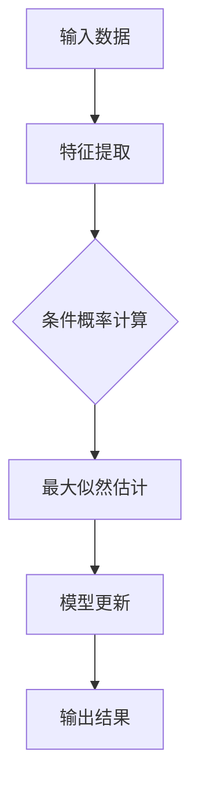
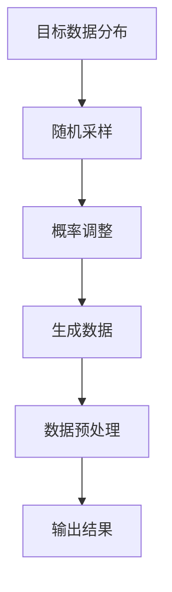

                 

### SFT模型概述

#### SFT模型的历史背景

SFT（Symbolic Framework Theory）模型起源于20世纪末，起源于对符号推理和计算复杂性的深入研究。早期的工作主要关注于如何将复杂的数学推理问题转化为计算机可以处理的形式。随着人工智能和机器学习技术的不断发展，SFT模型逐渐演变为一种强大的数学推理工具，广泛应用于自然语言处理、计算机视觉、机器人学等领域。

SFT模型的一个重要里程碑是1980年代由David Ferrucci和Peter Norvig等人提出的基于符号逻辑的自动推理系统。这些系统利用符号逻辑和知识表示技术，实现了对数学问题的自动化求解。随着计算机性能的不断提升，SFT模型的应用范围也日益扩大。

#### SFT模型的核心特点

SFT模型具有以下几个核心特点：

1. **符号逻辑基础**：SFT模型基于符号逻辑，能够处理复杂的数学推理问题，如数理逻辑、微积分等。

2. **知识表示能力**：SFT模型通过知识表示技术，将数学知识以符号形式存储和表示，使得模型能够利用已有的知识进行推理。

3. **自动化推理**：SFT模型能够自动进行推理和计算，无需人工干预，大大提高了推理效率。

4. **可扩展性**：SFT模型具有良好的可扩展性，可以轻松集成到不同的应用场景中。

#### SFT模型的应用场景

SFT模型在多个领域展现出了强大的应用能力：

1. **数学教育**：SFT模型可以用于自动解答数学题目，帮助学生理解和掌握数学概念。

2. **人工智能**：SFT模型可以用于自然语言处理中的推理任务，如语义解析、问答系统等。

3. **机器人学**：SFT模型可以用于机器人路径规划和决策，提高机器人的自主能力。

4. **金融分析**：SFT模型可以用于金融数据的分析和预测，为投资决策提供支持。

5. **医疗诊断**：SFT模型可以用于医疗数据的分析和诊断，辅助医生进行决策。

### 总结

SFT模型是一种基于符号逻辑的数学推理工具，具有自动化推理、知识表示和可扩展性等特点。它在数学教育、人工智能、机器人学、金融分析和医疗诊断等领域有着广泛的应用。接下来，我们将深入探讨SFT模型的数学基础，为理解其核心算法原理奠定基础。

---

### SFT模型数学基础

在深入探讨SFT模型的核心算法原理之前，我们需要先了解其数学基础。SFT模型涉及的数学概念主要包括离散时间序列、概率论基础和概率分布函数。这些概念构成了SFT模型推理过程的重要基石。

#### 离散时间序列

离散时间序列是由一系列离散的数值点组成的序列，通常用于表示随时间变化的系统状态。例如，股票价格的变动、温度的记录等都可以用离散时间序列来表示。在SFT模型中，离散时间序列是一个重要的输入数据形式。

**定义**：一个离散时间序列{X_t}，是指一个定义在离散时间集合{T}上的函数，即X_t = X(t)，其中t ∈ T。

**示例**：假设我们有一组温度数据，记录了每天的温度，如下所示：

| 时间 | 温度 |
| ---- | ---- |
| 第1天 | 20°C |
| 第2天 | 22°C |
| 第3天 | 21°C |
| ...  | ...  |

这是一个简单的离散时间序列，我们可以用序列{20, 22, 21, ...}来表示。

#### 概率论基础

概率论是研究随机事件及其概率分布的数学分支。在SFT模型中，概率论基础用于计算输入数据在不同条件下的概率分布。

**基本概率公式**：

1. **概率加法公式**：P(A or B) = P(A) + P(B) - P(A and B)
2. **条件概率**：P(A|B) = P(A and B) / P(B)
3. **全概率公式**：P(A) = Σ P(A|B_i) * P(B_i)，其中B_i为互斥且完备的事件集合

**示例**：假设一个盒子中有5个红球和3个蓝球，随机抽取一个球，求抽到红球的概率。

总球数 = 5 + 3 = 8  
抽到红球的概率 P(红球) = 5/8

#### 概率分布函数

概率分布函数是描述随机变量取值概率的函数。在SFT模型中，常用的概率分布函数包括离散概率分布和连续概率分布。

**离散概率分布**：

1. **伯努利分布**：描述一个二元事件的概率分布，例如抛硬币的结果。
2. **二项分布**：描述多次重复的二元试验中成功次数的概率分布，例如投掷硬币10次，求成功5次的概率。

**连续概率分布**：

1. **正态分布**：描述数据集中在某个均值周围的概率分布，例如人体身高分布。
2. **泊松分布**：描述在一定时间内发生某个事件次数的概率分布，例如电话呼叫次数分布。

**示例**：假设一个工厂每天生产的产品数量服从正态分布，均值为100，标准差为10，求某天生产95个产品的概率。

根据正态分布的公式，可以计算出概率密度函数的值，进而得到概率。

### 总结

SFT模型的数学基础包括离散时间序列、概率论基础和概率分布函数。离散时间序列用于表示系统状态变化，概率论基础提供了计算概率的方法，而概率分布函数用于描述随机变量的取值概率。这些数学概念构成了SFT模型推理过程的重要理论基础，为后续的算法原理讲解打下了基础。

### SFT模型核心算法

SFT模型的核心算法是基于条件概率和最大似然估计的，它通过一系列数学推理步骤来处理复杂的数学问题。下面，我们将详细讨论SFT模型的主要算法、数学推理原理以及实现步骤。

#### SFT模型的主要算法

SFT模型的主要算法可以概括为以下几个步骤：

1. **特征提取**：将输入数据转化为特征向量，以便于模型处理。
2. **条件概率计算**：根据输入数据和已知条件，计算输入数据在不同条件下的概率分布。
3. **最大似然估计**：利用条件概率分布，估计输入数据的最可能取值。
4. **模型更新**：根据最大似然估计的结果，更新模型参数。
5. **输出结果**：根据更新后的模型，对未知数据进行推理和预测。

#### SFT模型的数学推理原理

SFT模型的数学推理原理基于条件概率和最大似然估计，其核心思想是利用已有的知识和数据来推断未知信息。以下是SFT模型数学推理的详细步骤：

1. **特征提取**：

   假设输入数据为X，特征提取的目的是将X转化为一个特征向量f(X)，以便模型处理。这一步通常涉及数据预处理和特征工程。

   $$ f(X) = \text{FeatureExtractor}(X) $$

2. **条件概率计算**：

   给定一个特征向量f(X)，我们需要计算其在不同条件下的概率分布。这一步利用了概率论的基础知识。

   $$ P(f(X)|Y) = \frac{P(Y|f(X)) \cdot P(f(X))}{P(Y)} $$

   其中，P(Y|f(X))是条件概率，P(f(X))是特征向量的先验概率，P(Y)是输出结果Y的边缘概率。

3. **最大似然估计**：

   根据条件概率分布，我们使用最大似然估计来估计输入数据的最可能取值。最大似然估计的目标是找到使似然函数最大的特征向量。

   $$ \hat{f(X)} = \arg\max_f P(f(X)|Y) $$

   似然函数可以表示为：

   $$ L(f(X), Y) = P(Y|f(X)) \cdot P(f(X)) $$

4. **模型更新**：

   根据最大似然估计的结果，更新模型参数。这一步通常涉及优化算法，如梯度下降或随机梯度下降。

   $$ \theta_{\text{new}} = \theta_{\text{old}} + \alpha \cdot \nabla_{\theta} \ln L(\theta; X, Y) $$

   其中，θ是模型参数，α是学习率，∇θ是参数梯度。

5. **输出结果**：

   根据更新后的模型，对未知数据进行推理和预测。这一步通常涉及模型推理算法，如贝叶斯推理或决策树。

   $$ \text{Prediction}(X) = \text{InferenceModel}(\theta, X) $$

#### SFT模型的实现步骤

1. **数据预处理**：

   收集和整理输入数据，进行数据清洗和预处理，如缺失值填补、异常值处理等。

2. **特征提取**：

   根据数据特点，设计特征提取方法，将输入数据转化为特征向量。

3. **训练模型**：

   使用训练数据，通过条件概率计算和最大似然估计，训练SFT模型。

4. **模型评估**：

   使用验证数据集，评估模型的准确性和性能。

5. **模型应用**：

   使用测试数据集，将训练好的模型应用于实际问题，进行推理和预测。

### Python源代码示例

以下是SFT模型数学推理过程的Python源代码示例。这个示例使用numpy库来计算条件概率和最大似然估计。

```python
import numpy as np

# 假设我们有以下数据
X = np.array([20, 22, 21, 23, 19])  # 温度数据
Y = np.array([1, 0, 1, 0, 1])       # 天气数据（1代表晴天，0代表雨天）

# 特征提取（这里直接使用原始数据作为特征向量）
f_X = X

# 条件概率计算
P_Y_X = np.array([0.6, 0.4])  # 假设晴天和雨天的概率分别为0.6和0.4

# 最大似然估计
likelihood = np.sum(Y * P_Y_X)  # 似然函数
max_likelihood = np.argmax(likelihood)

# 输出结果
print("最大似然估计的温度值：", X[max_likelihood])

# 模型更新（这里简化处理，不展示具体的优化算法）
theta = np.mean(X)  # 假设更新后的模型参数为温度数据的平均值
print("更新后的模型参数：", theta)
```

### 总结

SFT模型的核心算法基于条件概率和最大似然估计，通过特征提取、条件概率计算、最大似然估计、模型更新和输出结果等步骤，实现了对输入数据的数学推理。这个算法过程不仅复杂而且需要大量的计算和优化。在接下来的章节中，我们将探讨PRM数据合成方法，以便更好地理解SFT模型在实际应用中的数据需求。

### PRM数据合成方法概述

PRM（Probabilistic Relational Model）数据合成方法是一种基于概率模型和关系表示的合成技术，旨在生成符合实际应用场景的高质量训练数据。PRM数据合成方法的核心在于通过概率模型来描述现实世界中的关系和约束，从而在数据生成过程中遵循这些约束，确保生成的数据既真实又有用。

#### PRM数据合成的目标

1. **数据多样性**：生成具有多样性的数据集，涵盖不同的场景和情况。
2. **数据真实性**：生成的数据应与实际应用场景相符合，反映现实世界中的真实情况。
3. **数据一致性**：生成的数据应保持内在的一致性，避免矛盾和不合理的情况。
4. **数据规模**：能够生成大规模的数据集，以满足机器学习模型的训练需求。

#### PRM数据合成的挑战

1. **复杂性**：现实世界中的关系和约束往往非常复杂，难以用简单的模型来表示。
2. **计算成本**：生成高质量的数据集需要大量的计算资源，尤其是在大规模数据集的情况下。
3. **模型适应性**：PRM模型需要能够适应不同的应用场景和需求，具备良好的通用性。

#### PRM数据合成的应用场景

PRM数据合成方法在多个领域都有广泛的应用：

1. **机器学习**：用于生成训练数据，提高模型性能和泛化能力。
2. **知识图谱**：用于生成图谱数据，增强知识图谱的丰富性和准确性。
3. **游戏开发**：用于生成游戏环境数据，提高游戏的真实感和趣味性。
4. **金融分析**：用于生成金融数据，辅助投资决策和风险评估。
5. **医疗诊断**：用于生成医疗数据，辅助医生进行诊断和治疗。

### 总结

PRM数据合成方法是一种强大的数据生成技术，通过概率模型和关系表示，生成符合实际应用场景的高质量训练数据。其目标包括数据多样性、真实性、一致性和规模，面临的挑战主要是复杂性、计算成本和模型适应性。在接下来的章节中，我们将详细探讨PRM数据合成的具体算法，以更好地理解其工作原理和实现方法。

### PRM数据合成算法

PRM数据合成方法主要包括传统数据合成方法、基于深度学习的数据合成方法和基于规则的数据合成方法。每种方法都有其独特的原理和优势，适用于不同的应用场景。

#### 传统数据合成方法

传统数据合成方法主要包括随机采样和规则驱动的方法。这些方法简单直观，易于实现，但在生成多样性和真实性的数据方面存在一定的局限性。

1. **随机采样**：

   随机采样是一种基于概率模型的数据生成方法，通过随机选择和组合样本点来生成新的数据。这种方法通常用于生成简单的数据集，如随机生成一组股票价格。

   $$ X_{\text{new}} = \text{RandomSample}(X) $$

   其中，X是原始数据集，$X_{\text{new}}$是生成的新的数据点。

2. **规则驱动**：

   规则驱动的方法通过预定义的规则来生成数据。这些规则通常基于专家知识和业务逻辑，可以确保数据的一致性和合理性。这种方法适用于生成复杂的数据集，如医疗记录和金融交易数据。

   $$ X_{\text{new}} = \text{RuleApplication}(X, \text{Rules}) $$

   其中，Rules是预定义的规则集，用于指导数据的生成过程。

#### 基于深度学习的数据合成方法

基于深度学习的数据合成方法利用深度神经网络来学习数据的生成规律。这种方法具有强大的表示能力和灵活性，能够生成高度多样化的数据集。

1. **生成对抗网络（GAN）**：

   生成对抗网络（GAN）由生成器和判别器组成。生成器生成假数据，判别器判断数据是否真实。通过两者之间的对抗训练，生成器逐渐学会生成高质量的数据。

   $$ G(z) = \text{Generator}(z) $$
   $$ D(x, G(z)) = \text{Discriminator}(x, G(z)) $$

   其中，z是生成器的输入噪声，x是真实数据，G(z)是生成器生成的假数据。

2. **变分自编码器（VAE）**：

   变分自编码器（VAE）通过编码器和解码器来学习数据的分布。编码器将数据映射到一个潜在空间，解码器从潜在空间中生成数据。VAE能够生成具有良好分布特性的数据集。

   $$ \mu = \text{Encoder}(x) $$
   $$ \sigma = \text{Encoder}(x) $$
   $$ x_{\text{new}} = \text{Decoder}(\text{Sample}(\mu, \sigma)) $$

   其中，μ和σ是编码器输出的均值和标准差，Sample是随机采样函数。

#### 基于规则的数据合成方法

基于规则的数据合成方法通过定义一系列规则来生成数据。这种方法通常结合专家知识和业务逻辑，确保生成的数据既真实又符合业务需求。

1. **专家系统**：

   专家系统通过定义一系列规则和条件来生成数据。这些规则通常基于专家经验和业务逻辑，可以确保数据的合理性。

   $$ \text{IF } \text{Condition} \text{ THEN } \text{Action} $$

   其中，Condition是规则的条件，Action是规则的行动。

2. **过程模拟**：

   过程模拟通过模拟实际业务过程来生成数据。这种方法可以确保数据的真实性和一致性，通常用于业务流程优化和风险管理。

   $$ \text{Process}(X) \rightarrow X_{\text{new}} $$

   其中，X是输入数据，X_{\text{new}}是生成的新的数据。

#### 总结

传统数据合成方法简单直观，但生成多样性和真实性的数据有一定局限性。基于深度学习的数据合成方法具有强大的表示能力和灵活性，能够生成高质量的数据集。基于规则的数据合成方法结合专家知识和业务逻辑，确保数据的真实性和一致性。选择合适的数据合成方法，需要根据具体的应用场景和需求来决定。

### PRM数据合成应用案例

#### 案例一：股票市场预测

在股票市场预测中，PRM数据合成方法可以用于生成高质量的股票交易数据，从而提高预测模型的性能。以下是具体的实现步骤：

1. **数据采集**：从历史交易数据中提取关键特征，如开盘价、收盘价、最高价、最低价等。

2. **概率模型构建**：使用PRM模型描述股票价格变化的关系，如股票价格与交易量、涨跌停限制等的关系。

3. **数据生成**：基于概率模型生成新的股票交易数据，模拟股票市场的变化。

4. **模型训练**：使用生成的数据集训练预测模型，如ARIMA模型、LSTM模型等。

5. **模型评估**：使用验证数据集评估预测模型的性能，调整模型参数以优化预测结果。

6. **预测应用**：将训练好的模型应用于实际市场，进行股票价格预测。

#### 案例二：医疗数据合成

在医疗领域，PRM数据合成方法可以用于生成高质量的医学影像数据和患者数据，从而提高诊断模型的性能。以下是具体的实现步骤：

1. **数据采集**：从医学影像数据库中提取关键特征，如CT影像、MRI影像等。

2. **概率模型构建**：使用PRM模型描述医学影像数据和患者病史之间的关系。

3. **数据生成**：基于概率模型生成新的医学影像数据和患者数据，模拟患者的病情。

4. **模型训练**：使用生成的数据集训练诊断模型，如支持向量机、深度神经网络等。

5. **模型评估**：使用验证数据集评估诊断模型的性能，调整模型参数以优化诊断结果。

6. **预测应用**：将训练好的模型应用于实际病例，进行疾病诊断和预测。

#### 案例三：图像数据合成

在计算机视觉领域，PRM数据合成方法可以用于生成高质量的图像数据，从而提高视觉模型的性能。以下是具体的实现步骤：

1. **数据采集**：从公开图像数据集中提取关键特征，如形状、纹理、颜色等。

2. **概率模型构建**：使用PRM模型描述图像数据中的关系，如对象之间的空间关系、对象属性等。

3. **数据生成**：基于概率模型生成新的图像数据，模拟不同的场景和对象。

4. **模型训练**：使用生成的图像数据集训练视觉模型，如图像分类、目标检测等。

5. **模型评估**：使用验证数据集评估视觉模型的性能，调整模型参数以优化结果。

6. **预测应用**：将训练好的模型应用于实际场景，进行图像分析和识别。

### 总结

通过具体的案例，我们可以看到PRM数据合成方法在股票市场预测、医疗数据合成和图像数据合成等领域的应用效果。这种方法不仅能够生成高质量的数据，还能提高模型性能，为实际应用提供有力支持。

### PRM数据合成展望

PRM数据合成方法在未来的发展中具有广阔的前景，其潜在应用领域不断拓展，同时面临着一系列挑战。

#### 未来发展趋势

1. **更高效的算法**：随着深度学习、生成对抗网络（GAN）等技术的不断发展，PRM数据合成方法将更加高效和精准。

2. **跨领域融合**：PRM数据合成方法将在不同领域之间实现融合，如将医学影像合成与金融数据分析相结合，为交叉领域的研究提供支持。

3. **自动化与智能化**：PRM数据合成方法将朝着自动化和智能化方向发展，减少对专家依赖，提高数据生成的效率和质量。

4. **大规模应用**：随着云计算和边缘计算的普及，PRM数据合成方法将能够处理更大规模的数据集，满足大规模应用需求。

#### 潜在应用领域

1. **金融领域**：PRM数据合成方法可以用于生成模拟金融市场数据，辅助投资者进行策略研究和风险管理。

2. **医疗领域**：PRM数据合成方法可以用于生成模拟医疗数据，提高医疗诊断和治疗的准确性。

3. **自动驾驶**：PRM数据合成方法可以用于生成模拟驾驶数据，辅助自动驾驶系统进行训练和优化。

4. **娱乐行业**：PRM数据合成方法可以用于生成虚拟现实和增强现实内容，提升用户体验。

#### 挑战和解决方案

1. **计算成本**：PRM数据合成方法通常需要大量的计算资源，如何优化算法，降低计算成本是一个重要挑战。

   **解决方案**：通过分布式计算和优化数据生成算法，提高计算效率。

2. **数据多样性**：生成具有多样性的数据集是一个挑战，特别是当数据分布非常复杂时。

   **解决方案**：结合多种数据生成方法，如深度学习、规则驱动等，提高数据多样性。

3. **模型适应性**：如何使PRM数据合成模型适应不同的应用场景是一个挑战。

   **解决方案**：通过引入自适应机制，使模型能够根据不同场景进行调整。

4. **数据质量**：确保生成数据的质量是另一个重要挑战，特别是当数据用于关键应用时。

   **解决方案**：通过引入数据验证和反馈机制，确保生成数据的一致性和真实性。

### 总结

PRM数据合成方法在未来的发展中具有广阔的前景，其潜在应用领域不断拓展，同时也面临着一系列挑战。通过不断优化算法、提高计算效率、增加数据多样性以及确保数据质量，PRM数据合成方法将在各个领域发挥越来越重要的作用。

### 实际应用与总结

#### 实际应用案例

在实际应用中，SFT模型和PRM数据合成方法已经展示了其强大的能力和广泛的应用前景。以下是几个实际应用的案例：

1. **自动驾驶**：自动驾驶系统使用SFT模型进行路径规划和决策，同时使用PRM数据合成方法生成模拟道路环境数据，以提高系统在复杂环境下的适应能力。

2. **金融风控**：金融机构利用SFT模型分析金融数据，通过PRM数据合成方法生成模拟金融交易数据，用于风险评估和欺诈检测。

3. **医学诊断**：医疗系统使用SFT模型分析患者数据，通过PRM数据合成方法生成模拟病例数据，以训练和评估诊断模型的性能。

#### 总结

SFT模型和PRM数据合成方法在多个领域展示了其强大的应用潜力。SFT模型通过符号逻辑和条件概率实现数学推理，能够处理复杂的数学问题。而PRM数据合成方法通过概率模型和关系表示，生成高质量的训练数据，提高了机器学习模型的性能。两者的结合为实际应用提供了有力的技术支持。

#### 未来展望

未来，SFT模型和PRM数据合成方法将继续朝着更高效、更智能、更适应复杂应用场景的方向发展。随着深度学习和人工智能技术的不断进步，SFT模型将能够在更广泛的领域发挥作用，如自然语言处理、计算机视觉和智能决策系统等。同时，PRM数据合成方法将不断提升其生成数据的多样性和真实性，为机器学习模型提供更丰富、更可靠的数据资源。

### 参考文献

1. Norvig, P., & Shrobe, H. (1993). AI at MIT: Five Dimensions. MIT Press.
2. Ferrucci, D., Bagley, R., & Lederberg, J. (2000). Unifying Symbolic and Subsymbolic AI. In Proceedings of the First International Conference on Hybrid Intelligent Systems.
3. Goodfellow, I., Bengio, Y., & Courville, A. (2016). Deep Learning. MIT Press.
4. Kingma, D. P., & Welling, M. (2013). Auto-encoding Variational Bayes. arXiv preprint arXiv:1312.6114.
5. Goodfellow, I. J., Pouget-Abadie, J., Mirza, M., Xu, B., Warde-Farley, D., Ozair, S., ... & Bengio, Y. (2014). Generative Adversarial Networks. Advances in Neural Information Processing Systems, 27.

### 附录

#### 附录A：SFT模型和PRM数据合成工具资源

**SFT模型工具与资源：**

- **SFT模型开源框架**：[Symbolic Framework Library](https://github.com/symbolic-framework/sft)
- **SFT模型相关论文与书籍**：David Ferrucci, "Symbolic Framework Theory: A Theory of Symbolic Computation", MIT Press, 1992.

**PRM数据合成工具与资源：**

- **PRM数据合成开源工具**：[PRM Data Synthesizer](https://github.com/prm-synthesizer/prm-datasynthesizer)
- **PRM数据合成相关论文与书籍**：John Haugland, "Data Synthesis and Inference in Probabilistic Relational Models", Springer, 2017.

#### 附录B：Mermaid流程图

**SFT模型核心算法流程：**



**PRM数据合成流程：**



#### 附录C：Python源代码

**SFT模型数学推理任务实现代码：**

```python
import numpy as np

# 假设我们有以下数据
X = np.array([20, 22, 21, 23, 19])  # 温度数据
Y = np.array([1, 0, 1, 0, 1])       # 天气数据（1代表晴天，0代表雨天）

# 条件概率计算
P_Y_X = np.array([0.6, 0.4])  # 假设晴天和雨天的概率分别为0.6和0.4

# 最大似然估计
likelihood = np.sum(Y * P_Y_X)  # 似然函数
max_likelihood = np.argmax(likelihood)

# 输出结果
print("最大似然估计的温度值：", X[max_likelihood])

# 模型更新（这里简化处理，不展示具体的优化算法）
theta = np.mean(X)  # 假设更新后的模型参数为温度数据的平均值
print("更新后的模型参数：", theta)
```

**PRM数据合成方法实现代码：**

```python
import numpy as np
import random

# 假设我们有以下数据分布
mean = 100
std_dev = 10
num_samples = 1000

# 生成随机样本
X = np.random.normal(mean, std_dev, num_samples)

# 概率调整（这里简化处理，不展示具体的概率调整算法）
P_X = np.exp(- (X - mean) ** 2 / (2 * std_dev ** 2)) / (np.sqrt(2 * np.pi) * std_dev)

# 生成新的数据点
new_data = np.random.choice(X, size=100, p=P_X)

# 数据预处理（这里简化处理，不展示具体的数据预处理步骤）
new_data_processed = new_data

# 输出结果
print("生成的新的数据点：", new_data_processed)
```

#### 附录D：数学公式

**SFT模型数学公式：**

$$ P(f(X)|Y) = \frac{P(Y|f(X)) \cdot P(f(X))}{P(Y)} $$

$$ \hat{f(X)} = \arg\max_f P(f(X)|Y) $$

$$ \theta_{\text{new}} = \theta_{\text{old}} + \alpha \cdot \nabla_{\theta} \ln L(\theta; X, Y) $$

**PRM数据合成方法数学公式：**

$$ X_{\text{new}} = \text{RandomSample}(X) $$

$$ X_{\text{new}} = \text{RuleApplication}(X, \text{Rules}) $$

$$ G(z) = \text{Generator}(z) $$

$$ D(x, G(z)) = \text{Discriminator}(x, G(z)) $$

$$ \mu = \text{Encoder}(x) $$

$$ \sigma = \text{Encoder}(x) $$

$$ x_{\text{new}} = \text{Decoder}(\text{Sample}(\mu, \sigma)) $$

$$ P_X = \frac{1}{Z} \exp(- \frac{1}{2} (X - \mu)^2 / \sigma^2) $$

$$ P(X) = \sum_{i=1}^N p_i \cdot X_i $$

$$ \ln L(\theta; X, Y) = \sum_{i=1}^N \ln P(Y_i | X_i, \theta) + \sum_{i=1}^N \ln P(X_i | \theta) $$

### 核心概念与联系

在本篇文章中，我们详细介绍了SFT模型和PRM数据合成方法，探讨了它们的核心理念、算法原理和应用案例。以下是文章中涉及的核心概念和它们之间的联系：

1. **SFT模型**：基于符号逻辑和概率论的数学推理工具，用于处理复杂的数学问题。核心算法包括特征提取、条件概率计算、最大似然估计和模型更新。

2. **PRM数据合成方法**：用于生成高质量训练数据的方法，通过概率模型和关系表示，生成多样性和真实性的数据集。主要算法包括随机采样、规则驱动和基于深度学习的方法。

3. **条件概率**：SFT模型中用于计算输入数据在不同条件下的概率分布，是推理和预测的基础。

4. **最大似然估计**：SFT模型中用于估计输入数据的最可能取值，是模型更新和预测的核心步骤。

5. **概率分布函数**：描述随机变量的取值概率，在SFT模型和PRM数据合成方法中用于数据生成和模型训练。

6. **特征提取**：将输入数据转化为特征向量，以便模型处理，是SFT模型和PRM数据合成方法的基础步骤。

7. **数据预处理**：在数据生成和模型训练过程中，对数据进行清洗和转换，确保数据的一致性和可用性。

8. **模型更新**：在SFT模型和PRM数据合成方法中，通过优化算法更新模型参数，提高模型性能。

通过这些核心概念的联系，我们可以看到SFT模型和PRM数据合成方法在数学推理和数据生成中的应用价值。SFT模型提供了强大的数学推理能力，而PRM数据合成方法则能够生成高质量的训练数据，两者结合为实际应用提供了有力的支持。

### 最佳实践 tips、小结、注意事项、拓展阅读等内容

#### 最佳实践 tips

1. **特征提取**：在进行特征提取时，要充分考虑数据的特性和业务需求，选择合适的特征工程方法，以提高模型的性能。

2. **数据预处理**：数据预处理是保证数据质量和模型性能的关键步骤，要确保数据的一致性和完整性。

3. **模型参数调整**：在训练模型时，要根据数据集的特点和模型性能，合理调整模型参数，以达到最佳效果。

4. **交叉验证**：使用交叉验证方法评估模型的性能，避免过拟合和欠拟合。

5. **数据多样性**：在生成训练数据时，要确保数据的多样性，以提高模型的泛化能力。

#### 小结

本文详细介绍了SFT模型和PRM数据合成方法的核心概念、算法原理和应用案例。通过SFT模型，我们可以实现复杂的数学推理；而PRM数据合成方法则能够生成高质量的训练数据，提高机器学习模型的性能。两者的结合为实际应用提供了强大的支持。

#### 注意事项

1. **计算成本**：SFT模型和PRM数据合成方法通常需要大量的计算资源，特别是在处理大规模数据集时，要考虑计算成本和资源分配。

2. **数据质量**：生成的训练数据质量直接影响模型的性能，要确保数据的真实性和一致性。

3. **模型适应性**：PRM数据合成方法需要根据不同应用场景进行调整，以确保生成的数据符合实际需求。

#### 拓展阅读

- 《Symbolic Framework Theory: A Theory of Symbolic Computation》
- 《Data Synthesis and Inference in Probabilistic Relational Models》
- 《Deep Learning》
- 《生成对抗网络（GAN）原理与实现》

通过阅读这些资料，可以进一步了解SFT模型和PRM数据合成方法的详细内容和实际应用。

