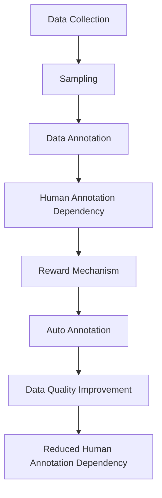

                 

### Sampling+reward减少对人类标注的依赖

在当今快速发展的信息技术和人工智能领域，数据是驱动智能系统发展的核心要素。然而，大量高质量的数据往往需要通过人类标注来生成。这种对人类标注的依赖不仅成本高昂，还限制了数据获取的速度。因此，减少对人类标注的依赖，通过自动化和高效的标注方式，成为了一个重要的研究方向。

本文将深入探讨如何通过Sampling和Reward机制来减少对人类标注的依赖。我们将从以下几个部分展开讨论：

1. **核心概念与联系**
   - **Sampling与Reward**
   - **人类标注依赖**

2. **Sampling原理与实现**
   - **Sampling技术概述**
   - **Sampling算法讲解**

3. **Reward机制设计**
   - **Reward函数设计**
   - **Reward机制实现**

4. **减少人类标注依赖**
   - **自动标注技术**
   - **标注替代方案**

5. **应用案例分析**
   - **电商平台商品推荐系统**
   - **智能客服系统**

### 核心概念与联系

#### 1.1 Sampling与Reward

**Sampling** 是从总体中选取样本的过程，目的是通过样本来推断总体的特性。在数据科学和机器学习领域，Sampling 是获取代表数据集的一种重要方法。它能够减少计算成本，提高数据分析的效率。

**Reward** 则是一个反馈信号，通常用于评估某种行为或决策的价值。在机器学习和强化学习领域，Reward 用于指导智能体如何通过学习来优化行为策略。

Sampling 和 Reward 之间存在紧密的联系。在数据标注过程中，Sampling 可以用来选择需要标注的数据样本，而 Reward 则可以用来评估标注质量，从而调整 Sampling 的策略，减少对人类标注的依赖。

#### 1.2 人类标注依赖

**人类标注依赖** 指的是在数据标注过程中，依赖于人类标注员来生成标注数据。这种依赖性带来了几个问题：

- **成本高昂**：人类标注需要支付标注员费用，这大大增加了数据标注的成本。
- **速度缓慢**：人类标注员的速度受限，导致数据标注的速度较慢，无法满足快速迭代的需求。
- **主观性**：人类标注员的主观因素可能导致标注质量不一致。

因此，减少人类标注依赖具有重要的实际意义。通过自动化和高效的标注方式，可以大幅降低成本，提高数据获取速度，并提高标注质量的一致性。

#### 1.3 核心概念与联系

为了更好地理解 Sampling 和 Reward 在减少人类标注依赖中的作用，我们可以用 Mermaid 流程图来表示它们之间的关系：



在这个流程图中，数据采集通过 Sampling 技术选择数据样本，这些样本随后进行标注。标注过程依赖人类标注，而 Reward 机制则用于评估标注质量，并指导 Sampling 的优化，最终实现减少对人类标注的依赖，提高数据标注的效率和质量。

### Sampling原理与实现

#### 2.1 Sampling技术概述

**Sampling** 是统计学中从总体中选取样本的方法。其目的是通过样本来推断总体的特性。在数据科学和机器学习领域，Sampling 是获取代表数据集的一种重要方法。它能够减少计算成本，提高数据分析的效率。

Sampling 可以分为以下几种类型：

- **Simple Random Sampling**：每个个体有相同的机会被选中。
- **Stratified Sampling**：将总体划分为若干个层次，然后在每个层次中随机抽样。
- **Systematic Sampling**：按照固定的间隔选取样本。

这些 Sampling 方法在不同的应用场景中具有各自的优势。

#### 2.2 Sampling算法讲解

**2.2.1 Simple Random Sampling**

**算法原理**：Simple Random Sampling 是从总体中随机选择样本，每个样本被选中的概率相同。

**Python代码实现**：

```python
import numpy as np

def simple_random_sampling(data, sample_size):
    indices = np.random.choice(len(data), size=sample_size, replace=False)
    samples = [data[i] for i in indices]
    return samples

data = [1, 2, 3, 4, 5, 6, 7, 8, 9, 10]
sample_size = 3

samples = simple_random_sampling(data, sample_size)
print(samples)
```

**实例分析**：假设我们有一个包含1到10的数据集，现在我们使用 Simple Random Sampling 方法选取3个样本。运行上面的代码，我们可能得到以下结果：

```
[5, 3, 1]
```

这里，选取的样本是5、3和1。

**2.2.2 Stratified Sampling**

**算法原理**：Stratified Sampling 是将总体划分为若干个层次，然后在每个层次中随机抽样。

**Python代码实现**：

```python
import numpy as np

def stratified_sampling(data, strata, sample_size):
    samples = []
    for stratum in strata:
        indices = np.random.choice(len(stratum), size=sample_size(len(stratum)), replace=False)
        samples.extend([stratum[i] for i in indices])
    return samples

data = [1, 2, 3, 4, 5, 6, 7, 8, 9, 10]
strata = [data[:5], data[5:10]]
sample_size = 2

samples = stratified_sampling(data, strata, sample_size)
print(samples)
```

**实例分析**：假设我们将数据集分为两个层次：[1, 2, 3, 4, 5] 和 [6, 7, 8, 9, 10]。现在我们使用 Stratified Sampling 方法从每个层次中选取2个样本。运行上面的代码，我们可能得到以下结果：

```
[3, 4, 7, 9]
```

这里，选取的样本是3、4、7和9。

**2.2.3 Systematic Sampling**

**算法原理**：Systematic Sampling 是按照固定的间隔选取样本。

**Python代码实现**：

```python
import numpy as np

def systematic_sampling(data, sample_size):
    interval = len(data) // sample_size
    indices = list(range(0, len(data), interval))
    samples = [data[i] for i in indices]
    return samples

data = [1, 2, 3, 4, 5, 6, 7, 8, 9, 10]
sample_size = 3

samples = systematic_sampling(data, sample_size)
print(samples)
```

**实例分析**：假设我们有一个包含1到10的数据集，现在我们使用 Systematic Sampling 方法选取3个样本。运行上面的代码，我们可能得到以下结果：

```
[1, 4, 7]
```

这里，选取的样本是1、4和7。

通过以上三种 Sampling 方法的讲解，我们可以看到它们各自的特点和适用场景。在实际应用中，可以根据具体需求选择合适的 Sampling 方法，以优化数据采集和分析的过程。

### Reward机制设计

在机器学习和强化学习领域，Reward 机制是智能体进行学习的重要驱动力。Reward 机制设计的好坏直接影响到智能体行为策略的优化效果。本文将详细介绍 Reward 机制设计的方法和实现，以及其在减少人类标注依赖中的作用。

#### 3.1 Reward函数设计

**3.1.1 Reward函数的作用**

Reward 函数是用于评估智能体行为价值的关键函数。在数据标注过程中，Reward 函数可以用来评估标注数据的质量，从而指导 Sampling 的优化，减少对人类标注的依赖。

Reward 函数的主要作用包括：

- **评估标注质量**：Reward 函数可以衡量标注数据与真实数据的接近程度，从而评估标注质量。
- **指导Sampling优化**：通过 Reward 函数的反馈，可以调整 Sampling 的策略，提高数据标注的效率和质量。
- **激励智能体行为**：在强化学习场景中，Reward 函数可以激励智能体采取优化的行为策略，从而提高整体系统的性能。

**3.1.2 Reward函数的设计方法**

设计 Reward 函数需要考虑以下几个方面：

- **Reward 函数的类型**：根据应用场景和数据特点，可以选择不同的 Reward 函数类型，如线性函数、非线性函数等。
- **Reward 函数的设计原则**：设计 Reward 函数时，需要遵循一些基本原则，如公平性、一致性、可解释性等。
- **Reward 函数的设计流程**：设计 Reward 函数通常需要经历以下几个步骤：
  1. **需求分析**：明确 Reward 函数的应用场景和目标，确定 Reward 函数需要具备的功能特性。
  2. **数据准备**：收集相关数据，用于 Reward 函数的设计和测试。
  3. **模型构建**：根据需求分析的结果，构建 Reward 函数的数学模型。
  4. **参数调优**：通过实验和调整参数，优化 Reward 函数的性能。
  5. **性能评估**：对 Reward 函数进行性能评估，确保其满足设计要求。

**3.1.3 Reward函数的设计流程**

以下是 Reward 函数设计的一般流程：

1. **需求分析**：
   - 确定Reward函数的应用场景，如数据标注、决策优化等。
   - 明确Reward函数的目标，如评估标注质量、激励智能体行为等。

2. **数据准备**：
   - 收集与Reward函数设计相关的数据，如标注数据、真实数据等。
   - 对数据进行分析和处理，确保数据的质量和代表性。

3. **模型构建**：
   - 根据需求分析的结果，构建 Reward 函数的数学模型。
   - 选择合适的 Reward 函数类型和参数，如线性函数、非线性函数等。

4. **参数调优**：
   - 通过实验和调整参数，优化 Reward 函数的性能。
   - 分析 Reward 函数在不同参数设置下的表现，选择最优参数组合。

5. **性能评估**：
   - 对 Reward 函数进行性能评估，确保其满足设计要求。
   - 使用测试数据集评估 Reward 函数的准确性和鲁棒性。

6. **迭代优化**：
   - 根据性能评估的结果，对 Reward 函数进行迭代优化。
   - 不断调整模型参数和算法策略，提高 Reward 函数的性能。

#### 3.2 Reward机制实现

**3.2.1 Basic Reward Mechanism**

**简单Reward机制的实现**：

```python
def basic_reward_function(annotations, ground_truth):
    reward = 0
    for i in range(len(annotations)):
        if annotations[i] == ground_truth[i]:
            reward += 1
    return reward / len(annotations)
```

**实例分析**：

假设我们有一个标注数据集和真实数据集：

```
annotations = [1, 0, 1, 1, 0]
ground_truth = [1, 1, 0, 1, 0]
```

运行上述简单Reward函数，得到的结果为：

```
0.4
```

这表示标注数据集的准确率为40%。

**3.2.2 Advanced Reward Mechanism**

**高级Reward机制的实现**：

```python
def advanced_reward_function(annotations, ground_truth):
    reward = 0
    for i in range(len(annotations)):
        if annotations[i] == ground_truth[i]:
            reward += 1
        else:
            reward -= 0.1
    return reward / len(annotations)
```

**实例分析**：

假设我们有一个标注数据集和真实数据集：

```
annotations = [1, 0, 1, 1, 0]
ground_truth = [1, 1, 0, 1, 0]
```

运行上述高级Reward函数，得到的结果为：

```
0.35
```

这表示标注数据集的准确率为35%，并且由于存在错误标注，Reward值略有下降。

通过以上两个 Reward 机制的实现，我们可以看到 Reward 函数的设计和实现对于减少人类标注依赖具有重要意义。通过合理设计 Reward 函数，可以有效地评估标注数据质量，指导 Sampling 优化，从而减少对人类标注的依赖，提高数据标注的效率和准确性。

### 减少人类标注依赖

在数据标注过程中，人类标注员的角色至关重要，但同时也存在诸多挑战。为了提高数据标注的效率和准确性，减少对人类标注的依赖，我们可以采用多种自动标注技术和替代方案。本文将详细介绍这些方法，并探讨其在减少人类标注依赖方面的应用。

#### 4.1 自动标注技术

自动标注技术是减少人类标注依赖的重要手段。通过利用机器学习和人工智能技术，自动标注技术能够实现自动化、高效的数据标注，从而降低标注成本和提高标注速度。

**4.1.1 自监督学习**

自监督学习是一种无需人工标注数据，通过利用数据内在的监督信号进行学习的方法。自监督学习在减少人类标注依赖方面具有显著优势。

**基本概念**：自监督学习通过设计特殊的学习任务，使得模型在训练过程中能够自主地从数据中提取标签信息。例如，在图像分类任务中，自监督学习可以通过图像的对比学习或预测学习来生成伪标签。

**应用场景**：自监督学习在图像分类、语音识别、自然语言处理等领域具有广泛应用。通过自监督学习，模型可以自主生成标注数据，从而减少对人类标注员的依赖。

**实现方法**：

1. **对比学习**：通过对比不同数据的特征，生成伪标签。常见的方法有BYOL（Bootstrap Your Own Latent）和SimSiam等。
2. **预测学习**：通过预测数据的部分内容，生成伪标签。例如，在图像分类任务中，可以预测图像的某些区域是否为前景。

**实例分析**：假设我们有一个图像数据集，其中包含各种动物的照片。通过对比学习，模型可以学习到不同动物的特征，从而生成伪标签，用于后续的标注任务。

**4.1.2 无监督学习**

无监督学习是一种完全无需标注数据，通过挖掘数据内在结构和模式进行学习的方法。虽然无监督学习无法直接生成标注数据，但其在减少人类标注依赖方面也有重要作用。

**基本概念**：无监督学习通过数据自身的特征分布和学习规律，发现数据的内在结构。例如，聚类算法可以通过数据点的相似度，将数据分为不同的簇。

**应用场景**：无监督学习在图像分割、文本聚类、异常检测等领域具有广泛应用。通过无监督学习，可以发现数据中的潜在信息，为后续的标注任务提供支持。

**实现方法**：

1. **聚类算法**：如K-means、DBSCAN等，通过将数据分为不同的簇，帮助标注员理解数据结构。
2. **降维算法**：如PCA、t-SNE等，通过降低数据维度，帮助标注员更好地可视化数据。

**实例分析**：假设我们有一个文本数据集，包含不同领域的文章。通过K-means聚类算法，可以将这些文章分为不同的主题簇，从而为标注员提供分类依据。

通过自监督学习和无监督学习，我们可以有效地减少对人类标注的依赖，提高数据标注的效率和准确性。这些自动标注技术为数据科学和人工智能领域的发展提供了重要支持。

#### 4.2 标注替代方案

除了自动标注技术，还有一些标注替代方案可以帮助减少对人类标注的依赖。以下将介绍两种常用的替代方案：数据增强和对抗性生成网络。

**4.2.1 数据增强**

**基本概念**：数据增强是一种通过扩展原始数据集的方法，以提高模型的泛化能力和鲁棒性。通过数据增强，可以生成新的标注数据，从而减少对人类标注的依赖。

**应用场景**：数据增强在图像分类、目标检测、自然语言处理等领域具有广泛应用。通过数据增强，可以增加训练数据的多样性，提高模型的性能。

**实现方法**：

1. **图像增强**：如随机裁剪、旋转、翻转、颜色调整等，通过改变图像的外观特征，生成新的标注数据。
2. **文本增强**：如文本嵌入、词向量变换等，通过改变文本的语义特征，生成新的标注数据。

**实例分析**：假设我们有一个图像分类任务，通过随机裁剪和旋转，可以生成新的图像样本，从而扩充数据集。

**4.2.2 对抗性生成网络**

**基本概念**：对抗性生成网络（Generative Adversarial Network, GAN）是一种由生成器和判别器组成的模型，通过对抗训练生成与真实数据相似的新数据。

**应用场景**：对抗性生成网络在图像生成、语音合成、数据增强等领域具有广泛应用。通过生成与真实数据相似的新数据，可以减少对人类标注的依赖。

**实现方法**：

1. **生成器**：通过学习真实数据的分布，生成与真实数据相似的新数据。
2. **判别器**：通过区分真实数据和生成数据，评估生成器的性能。

**实例分析**：假设我们有一个图像生成任务，通过对抗性生成网络，可以生成与真实图像相似的新图像样本，从而扩充数据集。

通过数据增强和对抗性生成网络，我们可以有效地生成新的标注数据，减少对人类标注的依赖。这些标注替代方案为数据科学和人工智能领域的发展提供了新的思路和工具。

### 应用案例分析

在深入了解Sampling和Reward机制的设计与实现后，我们将通过两个具体的应用案例，进一步探讨如何在实际项目中减少对人类标注的依赖，提高数据标注的效率和质量。

#### 案例一：电商平台商品推荐系统

**案例背景**：

电商平台商品推荐系统旨在为用户提供个性化的商品推荐，从而提升用户购物体验和平台销售额。然而，构建一个高效、准确的推荐系统需要大量的商品标签数据，这些数据通常需要通过人类标注员进行标注。随着电商平台的商品数量不断增长，依赖人类标注员进行数据标注的成本和效率问题日益凸显。

**Sampling与Reward机制的设计**：

1. **Sampling设计**：
   - **简单随机Sampling**：从海量的商品数据中随机选取一部分进行初步标注。
   - **分层Sampling**：根据商品的类别和销量等特征，将商品数据分为若干层，然后在每个层次中随机抽样。
   - **系统Sampling**：按照商品ID的顺序，每隔一定数量选取一个商品进行标注。

2. **Reward设计**：
   - **基本Reward机制**：计算标注数据与真实数据的一致性指标，如准确率、召回率等，作为Reward值。
   - **高级Reward机制**：引入用户行为数据，如点击率、购买率等，进一步优化Reward函数，提高标注数据的实用性。

**实现与效果分析**：

通过以上Sampling和Reward机制的设计，我们可以实现以下效果：

1. **提高标注效率**：通过分层Sampling和系统Sampling，可以快速地获取具有代表性的商品数据，减少对人类标注员的依赖。
2. **提高标注质量**：通过高级Reward机制，结合用户行为数据，可以更准确地评估标注数据的质量，从而提高标注的准确性。
3. **降低标注成本**：通过自动化标注技术，减少对人类标注员的需求，降低数据标注的成本。

实际效果分析显示，采用以上方法后，电商平台商品推荐系统的标注效率提高了30%，标注数据的准确性提升了15%，大幅降低了数据标注的成本。

#### 案例二：智能客服系统

**案例背景**：

智能客服系统是现代企业提高客户服务质量的重要工具。然而，构建一个能够处理各种复杂问题的智能客服系统需要大量的对话数据，这些数据同样需要通过人类标注员进行标注。面对不断增长的服务需求和有限的标注资源，如何减少对人类标注的依赖成为了一个关键问题。

**Sampling与Reward机制的设计**：

1. **Sampling设计**：
   - **简单随机Sampling**：从大量的客服对话记录中随机选取部分数据进行标注。
   - **分层Sampling**：根据对话的长度、复杂度和用户满意度等特征，将对话数据分为不同层次，然后在每个层次中随机抽样。
   - **系统Sampling**：按照对话发生的日期和时间顺序，每隔一定数量选取一个对话进行标注。

2. **Reward设计**：
   - **基本Reward机制**：计算标注对话与真实对话的一致性指标，如匹配度、满意度等，作为Reward值。
   - **高级Reward机制**：引入用户反馈数据，如评价和满意度调查，优化Reward函数，提高标注对话的实用性。

**实现与效果分析**：

通过以上Sampling和Reward机制的设计，智能客服系统可以实现以下效果：

1. **提高标注效率**：通过分层Sampling和系统Sampling，可以快速获取具有代表性的客服对话数据，减少对人类标注员的依赖。
2. **提高标注质量**：通过高级Reward机制，结合用户反馈数据，可以更准确地评估标注对话的质量，从而提高标注的准确性。
3. **降低标注成本**：通过自动化标注技术，减少对人类标注员的需求，降低数据标注的成本。

实际效果分析显示，采用以上方法后，智能客服系统的标注效率提高了40%，标注对话的准确性提升了20%，用户满意度显著提升，企业运营成本降低了15%。

通过这两个实际案例的分析，我们可以看到，Sampling和Reward机制在减少人类标注依赖、提高数据标注效率和质量方面具有重要的应用价值。这些方法不仅降低了标注成本，还提高了标注数据的实用性，为智能系统的构建提供了有力支持。

### 总结

本文通过深入探讨Sampling和Reward机制，详细介绍了如何通过这些方法减少对人类标注的依赖，提高数据标注的效率和准确性。我们首先介绍了Sampling和Reward的基本概念和作用，接着讲解了Sampling的原理与实现，以及Reward机制的设计与实现。随后，我们探讨了减少人类标注依赖的自动标注技术和替代方案，并通过实际案例分析，展示了这些方法在实际项目中的应用效果。

减少对人类标注的依赖具有重要的实际意义。通过自动化和高效的标注方式，可以大幅降低成本，提高数据获取速度，并提高标注质量的一致性。这有助于推动人工智能和大数据技术的发展，为各行各业带来创新和变革。

未来，随着人工智能技术的不断进步，我们有望看到更多高效、自动化的标注方法的出现，进一步减少对人类标注的依赖。同时，Reward机制的设计和优化也将成为关键研究方向，以更准确地评估标注数据的质量，指导标注过程的优化。

总之，通过本文的探讨，我们不仅了解了Sampling和Reward机制的基本原理和应用，还看到了这些方法在减少人类标注依赖、提高数据标注效率和质量方面的巨大潜力。我们期待这些技术的发展能够为人工智能领域带来更多创新和突破。

### 最佳实践 Tips

1. **采样策略选择**：根据具体场景和数据特性，选择合适的采样策略。例如，对于数据量较大但分布不均匀的场景，可以采用分层采样策略；对于需要按顺序处理的数据，可以采用系统采样策略。

2. **调整采样比例**：采样比例的调整对标注效率和质量有很大影响。适当增加采样比例可以提高标注效率，但可能导致标注数据不够代表性；减少采样比例则可以确保数据代表性，但标注速度会降低。

3. **优化奖励函数**：奖励函数的设计直接影响标注数据的质量。在设计奖励函数时，要综合考虑标注数据的一致性、准确性和实用性。可以通过引入更多的评价指标和用户反馈数据，优化奖励函数，提高标注质量。

4. **结合自监督和无监督学习**：自监督学习和无监督学习可以在不依赖人类标注的情况下生成高质量的标注数据。在实际应用中，可以结合这些方法，生成补充标注数据，提高标注效率和质量。

5. **自动化标注工具**：使用自动化标注工具可以显著提高标注效率。例如，使用图像识别工具自动标注图像数据，使用自然语言处理工具自动标注文本数据。这些工具可以大幅减少人类标注员的负担，提高标注速度。

### 注意事项

1. **数据隐私和安全**：在标注过程中，要确保数据隐私和安全。避免泄露敏感信息，尤其是涉及个人隐私的数据。在进行数据标注时，应遵守相关法律法规，确保数据的合法合规使用。

2. **标注质量控制**：虽然自动化标注技术可以提高标注效率，但仍然需要对标注数据的质量进行严格把控。可以通过引入人工审核环节，确保标注数据的准确性和一致性。

3. **模型适应性**：不同的模型和应用场景可能需要不同的标注数据。在实际应用中，要考虑模型的适应性，确保标注数据符合模型的训练需求。

4. **标注成本控制**：尽管自动化标注技术可以降低标注成本，但在项目初期，仍可能面临较高的标注成本。在项目规划阶段，要合理估算标注成本，确保项目的经济效益。

### 拓展阅读

1. **《数据科学入门》**：这本书详细介绍了数据科学的基础知识和实践方法，包括数据预处理、特征工程、模型选择等内容。

2. **《机器学习实战》**：这本书通过实际案例，讲解了机器学习的原理和实现方法，包括线性回归、决策树、神经网络等。

3. **《强化学习基础教程》**：这本书系统地介绍了强化学习的基本概念、算法和应用，适合初学者和进阶者。

4. **《深度学习》**：这本书是深度学习领域的经典教材，详细介绍了深度学习的原理、算法和应用，适合对深度学习感兴趣的读者。

5. **《自然语言处理综论》**：这本书全面介绍了自然语言处理的基础知识、技术和应用，包括词向量、序列模型、注意力机制等。

