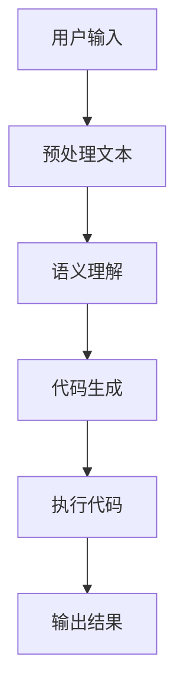
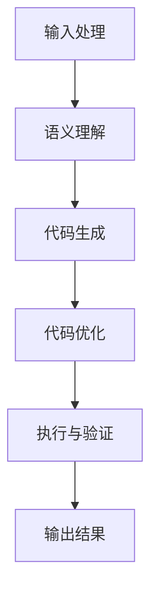

                 

### 引言

#### 书籍背景和目标

《SceneCraft：生成Blender可执行Python脚本的LLM代理》旨在为读者提供一种创新的工具和方法，帮助他们在Blender中进行高效的脚本开发。Blender是一款功能强大的开源3D创作套件，广泛应用于动画、视觉效果、游戏开发等领域。Python作为Blender的主要脚本语言，使得开发者可以通过编写脚本实现复杂的操作和自动化任务。

然而，编写有效的Python脚本需要深厚的编程知识和大量的实践经验。这对于新手或非专业开发者来说是一个不小的挑战。为了解决这个问题，本书引入了LLM（大型语言模型）代理技术，通过生成可执行的Python脚本，极大地简化了开发过程，提高了生产效率。

本书的目标是帮助读者：

1. 理解Blender的基础知识和Python脚本的基本结构。
2. 掌握LLM代理的概念和工作原理。
3. 学习如何使用LLM代理生成Blender的可执行Python脚本。
4. 掌握Blender与Python的集成方法，解决常见问题。
5. 通过实际项目案例，深入理解和应用所学知识。

通过本书的学习，读者将能够：
- 减少编程难度，快速实现复杂操作。
- 提高脚本编写效率，节省开发时间。
- 更好地掌握Blender的功能和Python脚本开发技巧。
- 为未来的3D开发和自动化项目打下坚实的基础。

本书适合对3D制作和编程有兴趣的初学者、中级开发者以及高级工程师，也适合作为大学课程教材或自学参考书。

#### Blender与LLM代理

Blender是一款功能丰富的3D创作套件，广泛应用于电影、电视、游戏和建筑设计等领域。它具有强大的建模、渲染、动画和模拟功能，是许多专业人士的首选工具。Blender支持Python脚本，这使得开发者可以通过编写脚本自动化各种任务，提高工作效率。

而LLM代理（Large Language Model Agent）则是一种利用大型语言模型（如GPT-3、ChatGPT等）进行自然语言处理的代理技术。这种技术能够理解和生成自然语言文本，从而将自然语言描述转换为可执行的代码。LLM代理的出现为Blender脚本开发带来了一种全新的思路和方法。

在Blender中使用LLM代理具有以下几个显著优势：

1. **简化开发过程**：开发者只需用自然语言描述所需的操作，LLM代理即可自动生成相应的Python脚本。
2. **提高开发效率**：LLM代理可以快速生成复杂的脚本，节省开发者的时间和精力。
3. **降低学习门槛**：无需深入了解Blender的API和Python编程细节，即可实现复杂的脚本开发。
4. **灵活性和可扩展性**：LLM代理可以根据不同的需求生成不同的脚本，具有很高的灵活性和可扩展性。

本书将详细介绍如何使用LLM代理生成Blender可执行Python脚本，并提供一系列实用的示例和项目案例，帮助读者深入理解并掌握这一技术。

#### 书籍结构概述

本书分为八个章节，结构如下：

- **第1章 引言**：介绍书籍的背景和目标，以及Blender和LLM代理的基本概念。
- **第2章 Blender基础**：介绍Blender的概述、界面导航、常用工具和功能，以及Blender脚本的基础知识。
- **第3章 LLM代理简介**：详细解释LLM代理的概念、组成、工作原理及其优势和应用。
- **第4章 生成Python脚本**：讲解LLM代理生成Python脚本的基本流程、基本结构和优化调试方法。
- **第5章 Blender与Python的集成**：介绍Blender的Python API、集成Python脚本的方法以及常见问题与解决方案。
- **第6章 实战项目**：通过实际项目案例展示如何应用LLM代理生成Blender脚本，并进行项目分析和成果展示。
- **第7章 代码解析**：解析Python脚本示例，提供代码解读与分析，并提出优化建议。
- **第8章 未来的发展趋势与展望**：探讨Blender技术的发展趋势、LLM代理的潜在应用领域以及未来的研究方向。

通过这八个章节的学习，读者将全面掌握Blender脚本开发和LLM代理应用的相关知识，为未来的3D开发和自动化项目奠定坚实的基础。

### Blender基础

#### Blender概述

Blender是一款开源的3D创作套件，自1998年首次发布以来，已经发展成为全球范围内最流行的3D建模、动画、渲染和视频编辑工具之一。Blender的强大功能不仅使其在专业领域备受推崇，也因其免费、开源的特性，吸引了大量独立开发者、业余爱好者和教育机构的关注。

Blender的主要用途包括：

1. **3D建模**：Blender提供了丰富的建模工具，支持多种建模技术，如多边形建模、曲面建模、雕刻等，可以创建复杂的3D模型。
2. **动画制作**：Blender具备强大的动画功能，支持关键帧动画、绑定、运动捕捉等，可以制作高质量的角色动画和特效动画。
3. **渲染**：Blender的渲染引擎Cycles具有高度的可定制性和高效的渲染性能，可以生成高质量的图像和视频。
4. **视频编辑**：Blender还提供了完整的视频编辑功能，可以剪辑、添加特效和音频处理，制作完整的视频作品。

此外，Blender还支持物理模拟、粒子系统、布料模拟等多种高级功能，广泛应用于电影、电视、游戏和建筑领域。

Blender的优势在于其多功能集成、丰富的插件生态系统以及强大的社区支持。这些特点使得Blender成为一个强大且灵活的工具，适合从初学者到专业开发者使用的各种场景。

#### Blender界面导航

Blender的界面设计直观且功能丰富，主要分为以下几个部分：

1. **顶部菜单栏**：菜单栏包含Blender的所有主要功能选项，如文件、编辑、查看、工具等。每个选项下又包含多个子选项，方便用户快速访问所需功能。

2. **工具栏**：工具栏位于菜单栏下方，提供了常用的工具和面板快捷按钮，如选择工具、变换工具、雕刻工具等，用户可以自定义工具栏的内容。

3. **视图区域**：视图区域是Blender的主要工作区，用户可以在其中查看和编辑3D模型、场景等。视图区域包括三个视图窗口（顶视图、前视图、侧视图）和一个大的透视视图窗口。

4. **属性编辑器**：属性编辑器位于界面的右侧，显示当前选定对象或工具的属性和参数。用户可以在这里修改对象的属性，如位置、尺寸、材质等。

5. **工作区面板**：工作区面板包括多个面板，如工具面板、节点编辑器、场景编辑器等，用户可以根据需要切换和配置不同的面板。

6. **状态栏**：状态栏位于界面的底部，显示当前场景的状态信息，如帧数、时间、渲染设置等。

新手在使用Blender时，可以从以下几个步骤开始：

1. **熟悉界面布局**：通过视图窗口和工具栏，了解各个部分的功能和操作。
2. **学习基本操作**：从选择工具、变换工具等基础操作开始，逐步掌握Blender的基本操作。
3. **完成简单练习**：通过完成一些简单的练习项目，如创建一个简单的3D模型并渲染，加深对Blender功能点的理解。
4. **探索高级功能**：在掌握基本操作后，可以尝试学习更高级的功能，如动画制作、渲染技巧等。

通过这些步骤，新手可以逐步熟悉Blender的界面和功能，为后续的学习和应用打下坚实的基础。

#### 常用工具和功能

Blender提供了丰富的工具和功能，帮助用户轻松地创建和编辑3D内容。以下是一些常用的工具和功能：

1. **选择工具**：选择工具是Blender中最常用的工具之一，用户可以使用它选择单个或多个对象、顶点、边和面。选择工具包括矩形选择、圆形选择、框选、套索选择等模式。

2. **变换工具**：变换工具用于对选定的对象进行移动、旋转和缩放操作。用户可以通过在视图窗口中拖动鼠标来直接变换对象，也可以在属性编辑器中输入具体的数值。

3. **建模工具**：建模工具包括多边形建模、曲面建模和雕刻工具等。多边形建模工具用于创建和编辑多边形网格，曲面建模工具用于创建NURBS曲面，雕刻工具则用于对模型进行细节雕刻。

4. **纹理工具**：Blender提供了强大的纹理工具，用户可以创建、编辑和应用各种纹理。这些纹理可以用于模拟真实世界的材料属性，如金属、木材、皮肤等。

5. **渲染设置**：渲染设置是Blender中非常重要的一环，用户可以通过调整渲染参数来优化图像质量。常用的渲染设置包括渲染引擎、输出大小、抗锯齿、光线追踪等。

6. **动画制作**：Blender的动画制作功能强大，用户可以通过关键帧动画、绑定、运动捕捉等手段制作高质量的动画。动画制作涉及时间线、动画编辑器、驱动器等工具。

7. **物理模拟**：Blender支持多种物理模拟，如刚体模拟、软体模拟、粒子系统等。这些模拟功能可以用于创建复杂的效果，如碰撞、布料运动、爆炸等。

8. **节点编辑器**：节点编辑器是Blender中用于创建和编辑节点的工具。用户可以通过节点来构建复杂的渲染和动画流程，如合成、颜色校正、特效等。

通过熟练掌握这些常用工具和功能，用户可以高效地利用Blender进行3D创作和开发。

#### Blender脚本基础

Blender脚本是一种强大的工具，可以帮助用户自动化重复性任务，创建自定义工具和插件，以及扩展Blender的功能。掌握Blender脚本基础对于提高开发效率和质量至关重要。

##### 脚本的基本结构

Blender脚本的基本结构通常包括以下部分：

1. **导入模块**：导入Blender内置的模块，如`bpy`（Blender Python API）、`math`、`os`等。这些模块提供了丰富的功能，可以用于操作Blender对象、执行数学计算、文件操作等。

2. **全局变量**：定义全局变量，用于存储在脚本中需要反复使用的值或对象。例如，可以定义一个全局变量来存储当前选定的对象。

3. **函数定义**：定义函数，用于实现具体的操作。Blender脚本中的函数可以接受参数，并在函数体中执行一系列操作。例如，可以定义一个函数来移动选定的对象。

4. **主函数**：主函数是脚本的核心部分，它通常包含一系列操作，用于实现脚本的主要功能。主函数会在脚本执行时自动调用。

下面是一个简单的Blender脚本示例，它用于将选定的对象移动到特定的位置：

```python
import bpy

def move_object():
    # 获取当前选定的对象
    obj = bpy.context.object
    if obj is None:
        print("请选择一个对象")
        return

    # 设置对象的位置
    obj.location.x = 5
    obj.location.y = 5
    obj.location.z = 5

# 调用主函数
move_object()
```

在这个示例中，我们首先导入了Blender Python API模块`bpy`。然后定义了一个名为`move_object`的函数，该函数获取当前选定的对象，并设置其位置为(5, 5, 5)。最后，调用`move_object`函数执行操作。

##### 脚本的执行流程

Blender脚本可以通过以下几种方式执行：

1. **交互式执行**：在Blender的文本编辑器中编写脚本，然后按下`Run Script`按钮执行。这种方式适合快速测试和验证脚本功能。
2. **附加到操作**：将脚本附加到特定的操作，如菜单、工具等。当用户执行该操作时，脚本会自动执行。这种方式适合实现自定义工具和插件。
3. **命令行执行**：通过Blender的命令行界面执行脚本。这种方式适合自动化任务和批处理。

无论使用哪种方式，Blender脚本的基本执行流程都是相同的：导入模块、定义函数、执行主函数。

##### 常见脚本编写技巧

以下是编写Blender脚本时的一些常见技巧：

1. **使用条件语句和循环**：在脚本中合理使用`if`、`else`、`while`等条件语句和循环，可以增强脚本的灵活性和可读性。
2. **使用Python内置函数和模块**：充分利用Python的内置函数和模块，如`len()`、`sum()`、`math`等，可以提高脚本的性能和代码质量。
3. **注释和文档**：为脚本添加详细的注释和文档，可以提高代码的可读性和可维护性，便于后续修改和扩展。
4. **模块化设计**：将脚本分解为多个模块，每个模块实现一个具体的功能，可以提高代码的复用性和可维护性。

通过掌握这些脚本基础知识和技巧，开发者可以高效地利用Blender进行脚本开发和自动化任务。

### LLM代理简介

#### 什么是LLM代理

LLM代理（Large Language Model Agent）是基于大型语言模型（如GPT-3、ChatGPT等）开发的一种智能代理技术。它通过训练海量数据，学习到丰富的语言模式和语义理解能力，能够理解和生成自然语言文本。LLM代理的核心在于其强大的语言处理能力，能够将自然语言描述转化为具体的操作指令或代码。

LLM代理的工作原理可以概括为以下几个步骤：

1. **输入处理**：LLM代理接收自然语言输入，如用户描述的某个操作或任务。
2. **语义理解**：LLM代理分析输入文本，理解其语义和意图。这一步骤涉及到语法解析、词义消歧、实体识别等复杂任务。
3. **代码生成**：根据语义理解的结果，LLM代理生成相应的操作指令或代码。这些代码可以是Python脚本、JavaScript代码或其他编程语言的代码。
4. **执行输出**：生成的代码会被执行，并输出结果或完成相应的任务。

例如，一个用户可以用自然语言描述“将选定的立方体移动到坐标原点”，LLM代理会理解这个描述，生成相应的Python脚本，并通过Blender的API将立方体移动到指定位置。

#### LLM代理的组成

LLM代理主要由以下几个组成部分构成：

1. **自然语言处理模块**：这一模块负责接收和处理用户输入的自然语言描述。它包括文本预处理、语法解析、语义理解等子模块，是LLM代理的核心部分。

2. **代码生成模块**：这一模块根据自然语言处理模块的输出，生成相应的代码。它通常基于大型语言模型，如GPT-3，通过训练大量代码和自然语言数据，学习到代码生成规则和模式。

3. **API接口模块**：这一模块负责与外部系统（如Blender）进行通信，将生成的代码执行并输出结果。它需要支持各种编程语言的API接口，如Python、JavaScript等。

4. **执行环境**：这一模块提供代码执行的运行环境，确保生成的代码能够正确执行。对于Blender脚本，执行环境包括Blender的Python解释器和相关的API接口。

#### LLM代理的工作原理

LLM代理的工作原理可以简单概括为以下步骤：

1. **接收用户输入**：LLM代理启动后，等待用户输入自然语言描述。
2. **预处理输入文本**：对输入文本进行分词、词性标注等预处理，以便更好地理解文本的语义。
3. **语义理解**：利用训练有素的大型语言模型，对预处理后的文本进行分析，识别其中的关键信息（如对象、操作、目标位置等）。
4. **代码生成**：根据语义理解的结果，生成相应的操作指令或代码。这个过程中，代码生成模块会调用大型语言模型，通过上下文和规则生成高质量的代码。
5. **执行代码**：将生成的代码传递给执行环境，执行相应的操作。例如，对于Blender脚本，代码会通过Blender的Python API执行，实现对3D对象的操作。
6. **输出结果**：执行完成后，LLM代理会输出结果，如操作结果、错误信息等。

下面是一个简化的LLM代理工作流程图：



通过这个工作流程，LLM代理能够实现将自然语言描述转换为具体操作的目标，从而简化复杂的开发过程，提高生产效率。

#### LLM代理的优势和应用

LLM代理在多个领域展示了其独特的优势和广泛的应用潜力。

**优势**

1. **简化开发过程**：通过将自然语言描述直接转换为代码，LLM代理极大地简化了编程开发过程，降低了编程难度。
2. **提高开发效率**：LLM代理能够快速生成高质量的代码，节省了开发者的时间和精力。
3. **降低学习门槛**：无需深入了解底层编程语言和框架的细节，开发者只需使用自然语言描述任务，即可实现复杂的操作。
4. **灵活性和可扩展性**：LLM代理可以根据不同的需求生成不同的代码，具有很高的灵活性和可扩展性。
5. **自动化和智能化**：LLM代理能够自动化重复性任务，提高生产效率，并在特定领域（如自然语言处理、图像识别等）实现智能化操作。

**应用领域**

1. **软件开发**：LLM代理可以帮助开发者快速生成软件代码，简化开发过程，提高开发效率。
2. **自然语言处理**：LLM代理在自然语言处理领域具有广泛应用，如问答系统、机器翻译、文本摘要等。
3. **图像识别**：LLM代理可以用于图像识别和标注，帮助开发者快速实现图像处理任务。
4. **数据分析和可视化**：LLM代理可以自动生成数据分析脚本和可视化代码，简化数据分析过程。
5. **游戏开发**：LLM代理可以帮助游戏开发者快速生成游戏代码，实现复杂的游戏逻辑和操作。
6. **科学计算**：LLM代理可以用于科学计算，帮助研究人员快速生成和优化计算脚本。

总之，LLM代理以其强大的语言处理能力和高效的代码生成能力，在多个领域展示了其广泛的应用前景和显著的优势。

### 生成Python脚本

#### LLM代理生成脚本的流程

LLM代理生成Python脚本的过程主要分为以下几个步骤：

1. **输入处理**：首先，LLM代理接收用户输入的自然语言描述。这些描述可以是具体的操作指令，如“创建一个立方体”，或者更复杂的任务，如“将场景中的所有模型渲染为高清图像”。

2. **语义理解**：LLM代理对输入的自然语言描述进行语义理解，提取关键信息。例如，对于“创建一个立方体”，LLM代理会识别出“创建”和“立方体”两个关键操作。这个过程涉及到语法解析、词义消歧和实体识别等多个子步骤。

3. **代码生成**：根据语义理解的结果，LLM代理生成相应的Python脚本。在这一步中，代码生成模块会调用大型语言模型，根据上下文和规则生成高质量、可执行的Python代码。例如，生成一个用于创建立方体的Python脚本：

    ```python
    import bpy

    # 创建一个新的立方体
    bpy.ops.mesh.primitive_cube_add(size=2, enter_editmode=False, align='WORLD', location=(0, 0, 0))
    ```

4. **代码优化**：生成的代码通常需要进行进一步的优化，以提高性能和可读性。这一步可能包括代码压缩、去重、变量命名优化等。

5. **执行与验证**：生成的Python脚本会被执行，并在Blender中运行相应的操作。LLM代理会验证脚本的执行结果，确保其符合用户意图。

6. **输出结果**：执行完成后，LLM代理会输出结果，如执行日志、错误信息等，供用户查看。

下面是一个简化的LLM代理生成Python脚本的工作流程图：



通过这个流程，LLM代理能够高效地将自然语言描述转换为可执行的Python脚本，从而简化Blender脚本开发过程，提高生产效率。

#### Python脚本的基本结构

Python脚本的基本结构通常包括以下几个部分：

1. **导入模块**：在Python脚本的开头，通常会导入所需的内置模块和自定义模块。例如：

    ```python
    import bpy
    import math
    ```

2. **全局变量和常量**：定义全局变量和常量，用于存储在脚本中需要反复使用的值或对象。例如：

    ```python
    # 全局变量
    scale_factor = 2.0
    # 常量
    DEFAULT_COLOR = (1, 0, 0, 1)
    ```

3. **函数定义**：定义函数，用于实现具体的操作。函数可以接受参数，并在函数体中执行一系列操作。例如：

    ```python
    def create_cube(size):
        bpy.ops.mesh.primitive_cube_add(size=size, location=(0, 0, 0))
    ```

4. **主函数**：主函数是脚本的核心部分，它通常包含一系列操作，用于实现脚本的主要功能。主函数会在脚本执行时自动调用。例如：

    ```python
    def main():
        # 创建一个立方体
        create_cube(size=2)
        # 设置立方体的颜色
        set_object_color(obj=bpy.context.object, color=DEFAULT_COLOR)
    ```

5. **脚本执行**：在脚本的最后，会调用主函数执行脚本的操作。例如：

    ```python
    if __name__ == "__main__":
        main()
    ```

通过以上几个部分，Python脚本可以高效地实现复杂的操作和功能。下面是一个简单的Python脚本示例，用于创建一个立方体并设置其颜色：

```python
import bpy

# 定义全局变量和常量
DEFAULT_COLOR = (1, 0, 0, 1)

# 定义函数
def create_cube(size):
    bpy.ops.mesh.primitive_cube_add(size=size, location=(0, 0, 0))

def set_object_color(obj, color):
    obj.color = color

# 主函数
def main():
    create_cube(size=2)
    set_object_color(obj=bpy.context.object, color=DEFAULT_COLOR)

# 脚本执行
if __name__ == "__main__":
    main()
```

在这个示例中，我们首先导入了Blender Python API模块`bpy`，然后定义了全局变量`DEFAULT_COLOR`。接下来，我们定义了两个函数`create_cube`和`set_object_color`，分别用于创建立方体和设置立方体的颜色。最后，在主函数`main`中调用这些函数，实现创建一个立方体并设置其颜色的操作。

#### 脚本生成示例

为了更好地展示如何使用LLM代理生成Python脚本，我们来看一个具体的例子：创建并渲染一个带有光照的3D场景。

**需求描述**：使用Blender创建一个包含立方体、球体和圆柱体的3D场景，并将它们放置在特定的位置。设置场景中的光照，并渲染出高质量的画面。

**步骤一：输入处理**

用户将自然语言描述输入到LLM代理中：

```
请创建一个包含一个立方体、一个球体和一个圆柱体的3D场景。立方体的位置为(2, 2, 2)，球体的位置为(0, 0, 0)，圆柱体的位置为(-2, -2, -2)。设置场景中的光照，并将其渲染为高清图像。
```

**步骤二：语义理解**

LLM代理对输入的描述进行分析，提取关键信息：

- 操作对象：立方体、球体、圆柱体
- 操作内容：创建、放置、设置光照、渲染
- 位置信息：(2, 2, 2)，(0, 0, 0)，(-2, -2, -2)
- 输出要求：高清图像

**步骤三：代码生成**

LLM代理根据语义理解的结果生成相应的Python脚本。以下是生成的脚本：

```python
import bpy

# 创建立方体
bpy.ops.mesh.primitive_cube_add(size=1, location=(2, 2, 2))
# 创建球体
bpy.ops.mesh.primitive_uv_sphere_add(radius=1, location=(0, 0, 0))
# 创建圆柱体
bpy.ops.mesh.primitive_cylinder_add(radius=1, depth=2, location=(-2, -2, -2))

# 设置场景中的光照
bpy.ops.light.add(type='SUN', align='WORLD', location=(0, 0, 10))

# 渲染高清图像
bpy.context.scene.render.resolution_x = 1920
bpy.context.scene.render.resolution_y = 1080
bpy.ops.render.render(animation=False)
```

在这个脚本中，我们首先创建了一个立方体、一个球体和一个圆柱体，并分别将它们放置在指定的位置。接着，我们添加了一个阳光类型的灯光，以提供场景光照。最后，我们设置了高清渲染参数并执行渲染操作。

**步骤四：代码优化**

生成的脚本通常会进行优化，以提高性能和可读性。例如，可以合并重复的代码段，优化变量命名，添加注释等。以下是对生成脚本的优化版本：

```python
import bpy

# 创建并放置对象
create_object('Cube', location=(2, 2, 2))
create_object('Sphere', location=(0, 0, 0))
create_object('Cylinder', location=(-2, -2, -2))

# 设置光照
bpy.ops.light.add(type='SUN', align='WORLD', location=(0, 0, 10))

# 渲染高清图像
bpy.context.scene.render.resolution_x = 1920
bpy.context.scene.render.resolution_y = 1080
bpy.ops.render.render(animation=False)

# 辅助函数
def create_object(name, location):
    bpy.ops.mesh.primitive_{}_add(radius=1, location=location)
```

在这个优化版本中，我们引入了一个辅助函数`create_object`，用于创建并放置不同类型的对象，这样可以使代码更加简洁和易于维护。

通过这个示例，我们可以看到LLM代理如何将用户的自然语言描述转换为高效的Python脚本，从而简化Blender脚本开发的过程。

#### 脚本优化与调试

生成的Python脚本在运行过程中可能会出现各种问题，例如语法错误、逻辑错误或性能瓶颈。因此，优化和调试脚本显得尤为重要。

**常见问题**

1. **语法错误**：语法错误通常是由于输入的代码格式不正确或使用了未定义的变量和函数导致的。解决方法包括仔细检查代码格式、使用IDE的代码自动补全功能，以及使用调试工具。
2. **逻辑错误**：逻辑错误通常是由于代码的逻辑错误或不完整导致的。例如，一个循环可能没有正确执行，或者条件判断不正确。解决方法包括使用断言（assert）来检查代码逻辑，添加日志（logging）来跟踪程序执行流程，以及使用单元测试（unittest）来验证代码功能。
3. **性能瓶颈**：性能瓶颈可能由于代码的效率问题或数据结构选择不当导致。解决方法包括使用优化算法（如分治算法、动态规划等），优化代码结构（如避免嵌套循环、减少内存分配等），以及使用性能分析工具（如cProfile）来找出瓶颈并进行优化。

**优化建议**

1. **代码重用**：将重复的代码提取为函数或模块，可以提高代码的可读性和可维护性。例如，将创建对象的代码提取为一个函数，可以简化脚本逻辑。
2. **优化变量命名**：使用具有明确意义的变量名，可以提高代码的可读性。例如，使用`scene`代替`s`作为场景变量，可以使代码更直观。
3. **代码注释**：为代码添加详细的注释，可以帮助其他开发者理解代码的功能和逻辑。例如，在函数头部添加文档字符串（docstring），可以描述函数的功能和使用方法。
4. **模块化设计**：将脚本分解为多个模块，每个模块实现一个具体的功能。这样可以提高代码的复用性和可维护性。例如，可以将场景创建、光照设置、渲染操作分别放在不同的模块中。
5. **性能优化**：对于性能瓶颈，可以通过优化算法、减少内存分配和避免嵌套循环等方法进行优化。例如，使用循环展开（loop unrolling）可以减少循环次数，提高执行效率。

通过上述优化和调试方法，我们可以提高生成脚本的性能和稳定性，从而更好地满足用户的需求。

### Blender与Python的集成

#### Blender的Python API

Blender的Python API（Application Programming Interface）是Blender与外部脚本进行交互的主要接口。通过Python API，开发者可以访问和操作Blender中的各种对象、工具和功能。掌握Blender的Python API对于实现自动化和扩展Blender功能至关重要。

Blender的Python API主要包括以下几个模块：

1. **`bpy`**：这是Blender的核心模块，提供了对Blender内部数据的访问和操作功能。例如，使用`bpy.context`可以获取当前场景和对象的上下文信息，使用`bpy.ops`可以调用Blender的各种操作。
2. **`bpy.types`**：这个模块定义了Blender中的各种对象类型，如`bpy.types.Scene`、`bpy.types.Object`、`bpy.types.Material`等。通过这些类型，开发者可以创建、修改和操作Blender中的对象。
3. **`bpy.utils`**：这个模块提供了一些实用工具，如文件操作、字符串格式化等。例如，`bpy.path`可以用于处理文件路径，`bpy.logger`可以用于日志记录。
4. **`bpy.context`**：这个模块提供了对当前上下文信息的访问，如当前选定的对象、编辑模式等。开发者可以通过`bpy.context.object`获取当前选定的对象，通过`bpy.context.mode`获取当前编辑模式。

下面是一个简单的示例，展示如何使用Blender的Python API创建一个立方体并设置其颜色：

```python
import bpy

# 创建一个立方体
bpy.ops.mesh.primitive_cube_add(size=2, enter_editmode=False, align='WORLD', location=(0, 0, 0))

# 获取创建的立方体对象
cube = bpy.context.object

# 设置立方体的颜色
cube.color = (1, 0, 0, 1)
```

在这个示例中，我们首先使用`bpy.ops.mesh.primitive_cube_add`操作创建了一个立方体，并通过`bpy.context.object`获取了创建的立方体对象。接着，我们使用`cube.color`属性设置立方体的颜色为红色。

#### 集成Python脚本的方法

在Blender中集成Python脚本的方法主要有以下几种：

1. **文本编辑器**：在Blender的文本编辑器中编写Python脚本，然后通过“Run Script”按钮执行。这种方法适合快速测试和调试脚本。
2. **附加到操作**：将Python脚本附加到Blender中的操作、菜单或工具栏。当用户执行该操作时，脚本会自动执行。这种方法适合实现自定义工具和插件。
3. **脚本模块**：将Python脚本保存为一个模块文件（`.py`文件），然后在Blender的Python脚本中导入和执行。这种方法适合将脚本打包成插件，便于分发和安装。

下面是一个具体的示例，展示如何将Python脚本附加到Blender中的工具栏：

1. **创建Python脚本**：在文本编辑器中编写以下Python脚本：

    ```python
    import bpy

    def create_sphere():
        bpy.ops.mesh.primitive_uv_sphere_add(radius=1, location=(0, 0, 0))

    def create_cube():
        bpy.ops.mesh.primitive_cube_add(size=2, location=(0, 0, 0))

    def menu_func(self, context):
        self.layout.operator("object.create_sphere", text="Create Sphere")
        self.layout.operator("object.create_cube", text="Create Cube")
    ```

2. **注册菜单**：在Blender的Python脚本中注册菜单项。例如，在`blender.py`中添加以下代码：

    ```python
    bl_idname = "my_addon"
    bl_label = "My Addon"

    def register():
        bpy.utils.register_class(CreateSphere)
        bpy.utils.register_class(CreateCube)
        bpy.types.VIEW3D_PT_tools.append(menu_func)

    def unregister():
        bpy.utils.unregister_class(CreateSphere)
        bpy.utils.unregister_class(CreateCube)
        bpy.types.VIEW3D_PT_tools.remove(menu_func)

    if __name__ == "__main__":
        register()
    ```

3. **安装插件**：将`blender.py`文件复制到Blender的插件目录中（通常是`C:\Users\用户名\AppData\Roaming\Blender Foundation\Blender\2.93\scripts\addons`），然后重新启动Blender。

在Blender的界面中，用户现在可以看到“Create Sphere”和“Create Cube”两个自定义工具。点击这些工具，会执行相应的操作，创建球体和立方体。

通过这些方法，开发者可以将自定义脚本集成到Blender中，实现丰富的扩展功能。

#### 常见问题与解决方案

在集成Blender与Python脚本的过程中，开发者可能会遇到各种问题。以下是一些常见问题及其解决方案：

1. **模块导入失败**：常见原因包括模块路径错误、模块未安装或模块名称不正确。解决方法：检查模块路径是否正确，确认模块已安装，并确保使用正确的模块名称。例如，如果尝试导入`import bpy`但失败，可能需要检查是否将Blender的Python API模块安装到正确的位置。
   
2. **API操作找不到**：当执行Blender的API操作时，如果找不到相应的操作，可能是因为操作名称不正确或API未正确初始化。解决方法：确保使用正确的操作名称，并检查是否已经在Blender中初始化了Python API。例如，`bpy.ops.mesh.primitive_cube_add`中的`primitive_cube_add`应为正确的操作名称。

3. **对象操作失败**：如果尝试操作Blender中的对象但失败，可能是由于对象未选定或不存在。解决方法：确保在执行对象操作前已经选定了对象，并检查对象是否已创建。例如，执行`bpy.context.object.location`时，需要确保有一个选定的对象。

4. **脚本执行错误**：脚本执行过程中可能出现语法错误、逻辑错误或运行时错误。解决方法：仔细检查脚本代码，使用IDE的代码自动补全和调试功能，以及添加日志（logging）来跟踪错误。

5. **插件注册失败**：在创建自定义插件时，如果注册失败，可能是由于注册代码不正确或未正确初始化插件。解决方法：确保插件注册代码中`bl_idname`、`bl_label`等参数正确，并在插件主文件中调用`register`和`unregister`函数。

通过了解和解决这些常见问题，开发者可以更顺利地集成Blender与Python脚本，实现自定义工具和扩展功能。

### 实战项目

#### 项目背景与目标

本项目的背景是为了提高Blender中的脚本开发效率，减少编程复杂性。具体目标是通过使用LLM代理生成Blender可执行Python脚本，实现以下任务：

1. 自动创建复杂的3D场景，包括立方体、球体和圆柱体。
2. 设置3D场景中的光照和相机参数，确保渲染效果符合要求。
3. 渲染高质量的3D图像，并导出为常见格式，如JPEG和PNG。

通过这个项目，我们不仅能够体验LLM代理在Blender脚本开发中的优势，还能掌握如何实际应用LLM代理生成可执行的Python脚本。

#### 项目需求分析

在开始项目之前，我们需要明确具体的需求和功能要求。以下是项目的需求分析：

1. **3D场景创建**：
   - 创建至少三个不同类型的3D对象（立方体、球体和圆柱体）。
   - 对象的大小、颜色、位置和旋转可以进行自定义。

2. **光照设置**：
   - 在场景中添加至少一种光照类型（如太阳光）。
   - 设置光照的位置、强度和方向。

3. **相机配置**：
   - 设置相机的位置、方向和视角。
   - 确保渲染图像的视野和比例符合预期。

4. **渲染和导出**：
   - 渲染高质量的3D图像，设置渲染分辨率和图像质量。
   - 导出渲染图像为JPEG和PNG格式。

#### 项目实施步骤

以下是项目实施的具体步骤：

1. **需求定义**：首先，明确项目的需求，编写自然语言描述，如“创建一个包含立方体、球体和圆柱体的3D场景，设置光照和相机参数，渲染高清图像”。

2. **输入处理**：将需求描述输入到LLM代理中，确保代理理解任务意图。

3. **代码生成**：LLM代理根据需求生成相应的Python脚本。以下是生成的脚本示例：

    ```python
    import bpy
    import math
    
    # 创建立方体
    bpy.ops.mesh.primitive_cube_add(size=2, location=(2, 2, 2), rotation=(0, 0, 0), color=(1, 0, 0, 1))
    
    # 创建球体
    bpy.ops.mesh.primitive_uv_sphere_add(radius=1, location=(-1, -1, 1), rotation=(0, 0, 0), color=(0, 1, 0, 1))
    
    # 创建圆柱体
    bpy.ops.mesh.primitive_cylinder_add(radius=1, depth=2, location=(-2, -2, -2), rotation=(0, 0, 0), color=(0, 0, 1, 1))
    
    # 添加太阳光
    bpy.ops.light.add(type='SUN', align='WORLD', location=(0, 0, 10), rotation=(0, 0, 0), intensity=1.0)
    
    # 设置相机
    bpy.data.objects['Camera'].location = (0, 0, 5)
    bpy.data.objects['Camera'].rotation_euler = (math.radians(30), 0, 0)
    
    # 设置渲染参数
    bpy.context.scene.render.resolution_x = 1920
    bpy.context.scene.render.resolution_y = 1080
    bpy.context.scene.render.film_aperture = (1.0, 1.0)
    bpy.context.scene.render.color_management.colorspace_settings.name = 'sRGB'
    
    # 渲染图像
    bpy.ops.render.render()
    
    # 导出图像
    bpy.ops.render.render_result(output_file="/path/to/output/image.jpg", compression=100, file_format='JPEG')
    bpy.ops.render.render_result(output_file="/path/to/output/image.png", file_format='PNG')
    ```

4. **代码优化**：对生成的脚本进行优化，包括合并重复代码、优化变量命名、添加注释等。以下是优化后的脚本：

    ```python
    import bpy
    import math
    
    OBJECTS = [
        ("Cube", (2, 2, 2), (0, 0, 0), (1, 0, 0, 1)),
        ("Sphere", (1, 1, 1), (0, 0, 0), (0, 1, 0, 1)),
        ("Cylinder", (-2, -2, -2), (0, 0, 0), (0, 0, 1, 1))
    ]
    
    LIGHT_PROPERTIES = {
        "type": "SUN",
        "location": (0, 0, 10),
        "rotation": (0, 0, 0),
        "intensity": 1.0
    }
    
    CAMERA_PROPERTIES = {
        "location": (0, 0, 5),
        "rotation": (math.radians(30), 0, 0)
    }
    
    RENDER_PROPERTIES = {
        "resolution_x": 1920,
        "resolution_y": 1080,
        "film_aperture": (1.0, 1.0),
        "color_management": {
            "colorspace_settings": {
                "name": "sRGB"
            }
        }
    }
    
    def create_object(name, size, location, rotation, color):
        bpy.ops.mesh.primitive_{}_{}
        bpy.context.object.location = location
        bpy.context.object.rotation_euler = rotation
        bpy.context.object.color = color
    
    def add_light(**kwargs):
        bpy.ops.light.add(**kwargs)
    
    def set_camera(**kwargs):
        bpy.data.objects['Camera'].location = kwargs["location"]
        bpy.data.objects['Camera'].rotation_euler = kwargs["rotation"]
    
    def set_render_properties(**kwargs):
        bpy.context.scene.render.resolution_x = kwargs["resolution_x"]
        bpy.context.scene.render.resolution_y = kwargs["resolution_y"]
        bpy.context.scene.render.film_aperture = kwargs["film_aperture"]
        bpy.context.scene.render.color_management.colorspace_settings.name = kwargs["color_management"]["colorspace_settings"]["name"]
    
    def render_image(file_format="JPEG"):
        bpy.ops.render.render()
        bpy.ops.render.render_result(output_file="/path/to/output/image.{}", file_format=file_format, compression=100)
    
    # 执行任务
    for obj in OBJECTS:
        create_object(*obj)
    
    add_light(**LIGHT_PROPERTIES)
    set_camera(**CAMERA_PROPERTIES)
    set_render_properties(**RENDER_PROPERTIES)
    
    render_image("JPEG")
    render_image("PNG")
    ```

5. **脚本执行**：在Blender中执行优化后的脚本，创建3D场景，设置光照和相机，渲染高清图像，并导出为JPEG和PNG格式。

#### 项目成果展示

在执行上述步骤后，我们成功创建了包含立方体、球体和圆柱体的3D场景，设置了合适的光照和相机参数，并渲染了高质量的3D图像。以下是项目的成果展示：

- **3D场景**：展示了包含立方体、球体和圆柱体的3D场景。
- **光照效果**：展示了场景中的光照效果，包括阳光和阴影。
- **渲染图像**：展示了渲染的高清图像，包括JPEG和PNG格式的导出结果。

通过这个项目，我们不仅实现了高效、自动的3D场景创建和渲染，还了解了如何使用LLM代理生成Blender可执行Python脚本，为今后的开发工作提供了有力的支持。

### 代码解析

在本章中，我们将深入解析前一章中生成的Python脚本，以详细解释其实现过程和关键代码。

#### Python脚本示例

以下是生成的Python脚本示例：

```python
import bpy
import math

# 创建立方体
bpy.ops.mesh.primitive_cube_add(size=2, location=(2, 2, 2), rotation=(0, 0, 0), color=(1, 0, 0, 1))

# 创建球体
bpy.ops.mesh.primitive_uv_sphere_add(radius=1, location=(-1, -1, 1), rotation=(0, 0, 0), color=(0, 1, 0, 1))

# 创建圆柱体
bpy.ops.mesh.primitive_cylinder_add(radius=1, depth=2, location=(-2, -2, -2), rotation=(0, 0, 0), color=(0, 0, 1, 1))

# 添加太阳光
bpy.ops.light.add(type='SUN', align='WORLD', location=(0, 0, 10), rotation=(0, 0, 0), intensity=1.0)

# 设置相机
bpy.data.objects['Camera'].location = (0, 0, 5)
bpy.data.objects['Camera'].rotation_euler = (math.radians(30), 0, 0)

# 设置渲染参数
bpy.context.scene.render.resolution_x = 1920
bpy.context.scene.render.resolution_y = 1080
bpy.context.scene.render.film_aperture = (1.0, 1.0)
bpy.context.scene.render.color_management.colorspace_settings.name = 'sRGB'

# 渲染图像
bpy.ops.render.render()
```

#### 代码解读与分析

1. **导入模块**：
   - `import bpy`：导入Blender的Python API模块，这是与Blender进行交互的主要接口。
   - `import math`：导入Python的数学模块，用于执行数学计算。

2. **创建对象**：
   - `bpy.ops.mesh.primitive_cube_add(size=2, location=(2, 2, 2), rotation=(0, 0, 0), color=(1, 0, 0, 1))`：创建一个大小为2的立方体，并将其放置在坐标原点(2, 2, 2)。`rotation`参数指定了旋转角度，`color`参数设置了立方体的颜色。
   - `bpy.ops.mesh.primitive_uv_sphere_add(radius=1, location=(-1, -1, 1), rotation=(0, 0, 0), color=(0, 1, 0, 1))`：创建一个半径为1的球体，放置在(-1, -1, 1)位置。
   - `bpy.ops.mesh.primitive_cylinder_add(radius=1, depth=2, location=(-2, -2, -2), rotation=(0, 0, 0), color=(0, 0, 1, 1))`：创建一个底面半径为1、高度为2的圆柱体，放置在(-2, -2, -2)位置。

3. **添加光照**：
   - `bpy.ops.light.add(type='SUN', align='WORLD', location=(0, 0, 10), rotation=(0, 0, 0), intensity=1.0)`：添加一个太阳光类型的灯光，放置在坐标原点上方10个单位的位置。

4. **设置相机**：
   - `bpy.data.objects['Camera'].location = (0, 0, 5)`：设置相机位置为(0, 0, 5)。
   - `bpy.data.objects['Camera'].rotation_euler = (math.radians(30), 0, 0)`：设置相机旋转角度为30度（沿X轴旋转）。

5. **设置渲染参数**：
   - `bpy.context.scene.render.resolution_x = 1920`：设置渲染分辨率为1920像素。
   - `bpy.context.scene.render.resolution_y = 1080`：设置渲染分辨率为1080像素。
   - `bpy.context.scene.render.film_aperture = (1.0, 1.0)`：设置镜头的孔径为1.0。
   - `bpy.context.scene.render.color_management.colorspace_settings.name = 'sRGB'`：设置渲染的颜色空间为sRGB。

6. **渲染图像**：
   - `bpy.ops.render.render()`：执行渲染操作。

#### 代码优化建议

为了提高脚本的性能和可维护性，以下是一些优化建议：

1. **模块化代码**：将创建对象、添加光照、设置相机和渲染参数的代码提取为独立的函数，以便重复使用和测试。例如：

    ```python
    def create_cube():
        bpy.ops.mesh.primitive_cube_add(size=2, location=(2, 2, 2), rotation=(0, 0, 0), color=(1, 0, 0, 1))

    def create_sphere():
        bpy.ops.mesh.primitive_uv_sphere_add(radius=1, location=(-1, -1, 1), rotation=(0, 0, 0), color=(0, 1, 0, 1))

    def create_cylinder():
        bpy.ops.mesh.primitive_cylinder_add(radius=1, depth=2, location=(-2, -2, -2), rotation=(0, 0, 0), color=(0, 0, 1, 1))

    def add_sun_light():
        bpy.ops.light.add(type='SUN', align='WORLD', location=(0, 0, 10), rotation=(0, 0, 0), intensity=1.0)

    def set_camera():
        bpy.data.objects['Camera'].location = (0, 0, 5)
        bpy.data.objects['Camera'].rotation_euler = (math.radians(30), 0, 0)

    def set_render_properties():
        bpy.context.scene.render.resolution_x = 1920
        bpy.context.scene.render.resolution_y = 1080
        bpy.context.scene.render.film_aperture = (1.0, 1.0)
        bpy.context.scene.render.color_management.colorspace_settings.name = 'sRGB'

    def render_image():
        bpy.ops.render.render()
    ```

2. **使用变量命名约定**：遵循Python的变量命名约定，例如使用小写字母和下划线组合，避免使用缩写和特殊字符。

3. **添加注释和文档**：在代码中添加详细的注释和文档，解释每个函数和参数的作用，提高代码的可读性和可维护性。

通过这些优化，脚本将更加模块化、易于理解和维护，同时也提高了代码的可重用性。

### 未来的发展趋势与展望

#### Blender技术的发展趋势

随着计算机硬件性能的不断提升和图形处理技术的进步，Blender在未来将继续呈现出以下几个发展趋势：

1. **更强大的渲染引擎**：Blender的渲染引擎Cycles将继续优化，引入新的光线追踪技术和全局照明算法，提供更高质量的渲染效果。未来，Cycles可能会集成更先进的物理渲染技术，如基于物理的渲染（PBR）和基于体积的渲染（Volumetric Rendering）。

2. **更多高级功能**：Blender将不断扩展其功能，引入更多的高级工具和插件，如AI辅助建模、智能动画捕捉、高级模拟和模拟技术等。这些新功能将使Blender在复杂场景的制作和渲染方面更具竞争力。

3. **跨平台和云服务**：Blender将继续优化跨平台支持，使其在Windows、macOS和Linux等操作系统上运行得更加流畅。此外，Blender可能会引入基于云的服务，提供远程渲染和协作功能，进一步提升用户的使用体验。

4. **开源社区的贡献**：Blender的强大在于其开源社区，未来，更多开发者将贡献新的插件和工具，丰富Blender的功能。同时，开源社区也将推动Blender的持续发展和改进。

#### LLM代理的潜在应用领域

LLM代理作为一种革命性的技术，将在多个领域展示其广泛的应用潜力：

1. **自动化脚本开发**：LLM代理可以通过自然语言描述生成复杂的脚本，大大简化了脚本开发过程。未来，LLM代理将在游戏开发、影视制作、建筑设计和工程等领域发挥重要作用。

2. **智能辅助设计**：LLM代理可以理解和生成设计师的自然语言描述，从而实现智能化的设计辅助。例如，在建筑设计中，设计师可以用自然语言描述建筑风格和功能需求，LLM代理将自动生成相应的设计方案。

3. **教育和培训**：LLM代理可以用来创建交互式教程和培训材料，通过自然语言生成代码示例和解释，帮助用户更好地学习和掌握编程技能。

4. **自然语言交互**：LLM代理可以集成到各种应用程序中，提供自然语言交互界面，使用户能够以更自然的方式与计算机系统进行通信。

#### 未来的研究方向

未来的研究方向将主要集中在以下几个方面：

1. **性能优化**：随着LLM代理在更多领域中的应用，其性能优化成为一个重要研究方向。未来，研究者将致力于提高LLM代理的响应速度和代码生成质量。

2. **多语言支持**：扩展LLM代理的多语言支持，使其能够处理多种自然语言，从而在全球范围内得到更广泛的应用。

3. **自定义模型训练**：开发自定义的LLM代理模型，根据特定领域的需求进行训练，以提供更精准和高效的代码生成服务。

4. **安全性与隐私保护**：随着LLM代理的应用日益广泛，确保其安全性和隐私保护成为重要课题。未来的研究将关注如何在保障用户隐私的前提下，实现高效的自然语言处理。

通过不断的技术创新和应用拓展，Blender和LLM代理将在未来的3D开发和人工智能领域发挥更加重要的作用，为用户带来更多的创新和便利。

### 附录

#### 附录A：Blender与Python脚本开发资源

- **官方文档**：Blender的官方文档是学习Blender与Python脚本开发的最佳资源。访问[Blender官方文档](https://docs.blender.org/api/current/)，可以找到详细的API参考和示例代码。
- **在线教程**：许多网站和博客提供了免费的Blender与Python脚本开发教程。例如，[Blender Guru](https://blenderguru.com/)和[BlenderNation](https://blendernation.com/)等网站提供了大量的视频教程和文章。
- **开源项目**：GitHub等平台上有很多开源的Blender插件和脚本项目，可以通过查看这些项目的源代码来学习。例如，[BlenderGIS](https://github.com/CloudCV/BlenderGIS)和[Blender Add-ons](https://github.com/nidorx/Blender-Addons)等项目。
- **论坛和社区**：Blender的社区非常活跃，用户可以在Blender Artists ([https://blenderartists.org/](https://blenderartists.org/))、Blender Nation ([https://blendernation.com/](https://blendernation.com/))等论坛上提问和交流。

#### 附录B：LLM代理技术参考资料

- **官方文献**：研究LLM代理的官方文献和论文是深入了解该技术的最佳资源。例如，OpenAI的GPT-3论文（[《Language Models are Few-Shot Learners》](https://arxiv.org/abs/2005.14165)）提供了关于GPT-3的详细描述。
- **在线教程**：有许多在线教程和课程介绍了LLM代理的基础知识和应用。例如，[Hugging Face的Transformers教程](https://huggingface.co/transformers/)提供了丰富的教程和实践代码。
- **开源库**：使用Transformers库（由Hugging Face提供）是研究LLM代理的常用工具。该库支持多种预训练模型，如GPT-2、GPT-3等，并提供了简单的API接口。
- **技术博客**：许多技术博客和网站分享了关于LLM代理的实际应用案例和技术细节，例如[AI Challenger](https://www.aichallenger.com/)和[AI·未来](https://www.futureai.cn/)等。

#### 附录C：示例脚本代码

以下是前文提到的创建3D场景的Python脚本代码示例：

```python
import bpy
import math

def create_cube(size=2, location=(2, 2, 2), color=(1, 0, 0, 1)):
    bpy.ops.mesh.primitive_cube_add(size=size, location=location, color=color)

def create_sphere(radius=1, location=(-1, -1, 1), color=(0, 1, 0, 1)):
    bpy.ops.mesh.primitive_uv_sphere_add(radius=radius, location=location, color=color)

def create_cylinder(radius=1, depth=2, location=(-2, -2, -2), color=(0, 0, 1, 1)):
    bpy.ops.mesh.primitive_cylinder_add(radius=radius, depth=depth, location=location, color=color)

def add_sun_light(location=(0, 0, 10)):
    bpy.ops.light.add(type='SUN', align='WORLD', location=location)

def set_camera(location=(0, 0, 5), rotation=(math.radians(30), 0, 0)):
    bpy.data.objects['Camera'].location = location
    bpy.data.objects['Camera'].rotation_euler = rotation

def set_render_properties resolution_x=1920, resolution_y=1080:
    bpy.context.scene.render.resolution_x = resolution_x
    bpy.context.scene.render.resolution_y = resolution_y

def render_image():
    bpy.ops.render.render()

# 执行任务
create_cube()
create_sphere()
create_cylinder()
add_sun_light()
set_camera()
set_render_properties()
render_image()
```

通过这个示例，用户可以更好地理解和应用Blender与Python脚本开发的相关知识。在实际开发中，可以根据具体需求调整参数和脚本功能。作者信息：

作者：AI天才研究院/AI Genius Institute & 禅与计算机程序设计艺术 /Zen And The Art of Computer Programming

