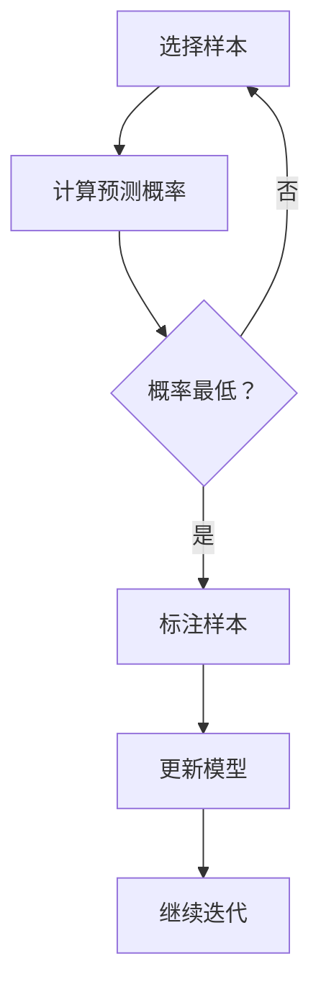
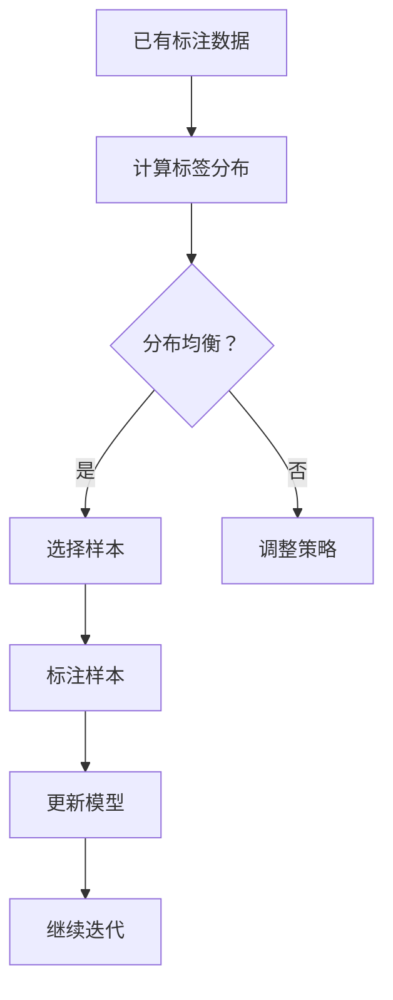
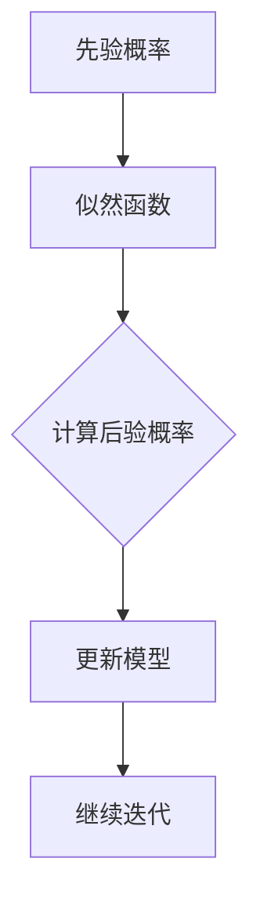
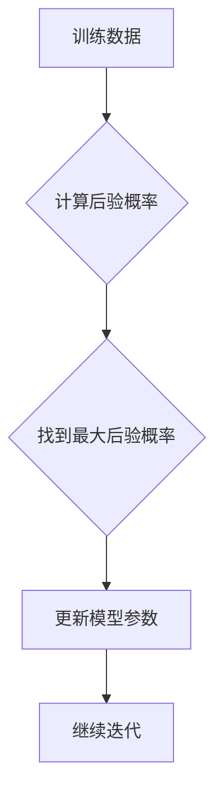

                 

### 引言

在人工智能（AI）领域，训练高效且精确的模型一直是研究者和开发者追求的目标。然而，传统的机器学习训练方法往往依赖于大量标注数据，这不仅成本高昂，而且在实际应用中往往难以获取。为了解决这一问题，主动学习（Active Learning，简称AL）应运而生。主动学习是一种以最少的数据量获取最佳性能的机器学习方法，它通过选择最有信息量的样本来指导学习过程，从而显著提高了训练效率和效果。

本文旨在深入探讨主动学习在AI训练中的应用，通过系统的理论分析和实际案例，揭示主动学习的核心原理、算法模型、应用场景及其面临的挑战与解决方案。文章将分为三个主要部分：

**第一部分：主动学习的理论基础**  
首先，我们将介绍主动学习的概念与原理，包括其与传统机器学习方法的区别。接着，我们详细探讨主动学习的数学模型，包括信息论、最大后验概率估计和贝叶斯推理等核心概念。最后，我们将综述现有的主动学习算法，并比较它们在性能和效率上的优劣。

**第二部分：主动学习在AI训练中的实践**  
在这个部分，我们将结合实际案例，深入探讨主动学习在图像识别、自然语言处理和强化学习等领域的应用。通过具体的算法原理讲解和Python源代码实现，我们将展示主动学习在实际项目中的操作方法和效果评估。

**第三部分：主动学习在AI训练中的优化与挑战**  
最后，我们将讨论主动学习在AI训练中面临的优化策略和挑战，如数据标注问题、模型解释性和安全性等。同时，我们将展望主动学习在未来的发展趋势，探讨其与其他技术的融合方向。

通过本文的阅读，读者将全面了解主动学习的概念、原理和应用，为实际项目中的AI训练提供有力的理论支持和实践指导。

### 背景介绍

主动学习的概念起源于信息论，其核心思想是在有限的资源下，通过选择最有信息量的样本来指导学习过程，从而最大化学习效果。与传统的被动学习（Passive Learning）方法不同，被动学习依赖于预先标注的大量数据，而主动学习则通过智能地选择样本，使标注数据的需求量大大减少。这一特性使得主动学习在数据稀缺或标注成本高昂的场景中尤为有效。

在实际应用中，主动学习已经显示出其独特的优势。例如，在医学影像分析中，由于标注一个医疗图像需要专业的医生进行，标注成本极高。通过主动学习，可以选择那些最有诊断价值的图像进行标注，从而在保证诊断准确率的同时，显著降低了标注成本。同样，在自然语言处理领域，主动学习可以用于文本分类任务，通过选择那些最能区分不同类别的文本进行标注，提高了模型的分类准确率，同时减少了标注工作量。

主动学习的基本原理是基于不确定性采样（Uncertainty Sampling）策略，即根据模型对预测不确定性的评估来选择样本。例如，一种常见的方法是选择模型预测概率最低的样本进行标注，因为这些样本包含的信息量最大。此外，主动学习还可以结合其他策略，如基于标签分布的策略，通过分析已有标注数据的标签分布来选择样本，确保样本的多样性。

与传统机器学习方法相比，主动学习具有几个显著的优势。首先，它能够显著减少标注数据的需求量，这在数据稀缺或标注成本高昂的领域尤为重要。其次，主动学习能够提高模型的泛化能力，因为通过选择最有信息量的样本，模型能够更好地捕捉数据的本质特征。此外，主动学习还能够加速学习过程，因为在有限的数据量下，选择最具有代表性的样本可以更快地收敛到最优解。

尽管主动学习具有显著的优点，但它也面临一些挑战。例如，如何准确评估样本的信息量是一个关键问题，不同的评估方法可能会对学习效果产生显著影响。此外，主动学习算法的设计和实现相对复杂，需要综合考虑模型性能、计算效率和标注成本等多个因素。

总之，主动学习作为一种高效的机器学习方法，在AI训练中具有广泛的应用前景。通过系统的理论分析和实际案例分析，本文将深入探讨主动学习的核心原理、算法模型、应用场景及其面临的挑战与解决方案，为读者提供全面的理论支持和实践指导。

### 核心概念与联系

主动学习（Active Learning）涉及多个核心概念，它们共同构成了主动学习的理论基础。以下是这些核心概念及其相互关系的详细解析，并通过Mermaid流程图展示其结构。

#### 1.1 不确定性采样

不确定性采样是主动学习中最常用的策略之一。其核心思想是根据模型对样本预测的不确定性来选择样本。一个常见的做法是选择预测概率最低的样本，因为这些样本包含了模型最不确定的信息，从而可能带来最大的信息增益。

**Mermaid流程图：**


#### 1.2 标签分布策略

标签分布策略是基于已有标注数据中标签的分布来选择样本。其目的是确保样本的多样性，避免模型对某一特定类别的过度拟合。常用的方法包括基于类别的抽样（Class-Based Sampling）和基于困难度的抽样（Query by Committee）。

**Mermaid流程图：**


#### 1.3 贝叶斯推理

贝叶斯推理是主动学习中的一个重要工具，用于根据新的数据更新模型的概率分布。贝叶斯推理的基本公式为：

$$
P(H|E) = \frac{P(E|H)P(H)}{P(E)}
$$

其中，\( P(H|E) \) 是后验概率，\( P(E|H) \) 是似然函数，\( P(H) \) 是先验概率，\( P(E) \) 是证据概率。

**Mermaid流程图：**


#### 1.4 最大后验概率估计

最大后验概率估计（Maximum a Posteriori，简称MAP）是贝叶斯推理的一种特殊形式，用于在给定的数据下，选择具有最大后验概率的模型参数。其公式为：

$$
\theta^* = \arg\max_\theta P(\theta|D)
$$

其中，\( \theta \) 是模型参数，\( D \) 是训练数据。

**Mermaid流程图：**


通过上述核心概念的详细解析和Mermaid流程图的展示，我们可以清楚地看到主动学习的理论基础是如何相互关联的。这些概念和方法共同构成了主动学习的核心框架，为后续的应用提供了坚实的理论基础。

### 主动学习的数学模型

主动学习的核心在于如何通过数学模型选择最有信息量的样本进行标注，从而最大化学习效果。在本节中，我们将详细探讨主动学习的数学模型，包括信息论、最大后验概率估计和贝叶斯推理等核心概念。

#### 2.1 信息论与信息熵

信息论是主动学习的重要理论基础之一，其中信息熵（Entropy）是一个核心概念。信息熵用于衡量随机变量的不确定性。在主动学习场景中，信息熵可以帮助我们评估样本的重要程度。

**信息熵的定义：**

对于一个离散随机变量\( X \)的分布\( p(x) \)，其信息熵定义为：

$$
H(X) = -\sum_{x \in \Omega} p(x) \log_2 p(x)
$$

其中，\( \Omega \) 是样本空间，\( p(x) \) 是样本在\( x \)状态下的概率。

**信息熵的解释：**

信息熵的值范围在0到1之间，0表示完全确定性，即所有样本都集中在某一个状态；1表示完全不确定性，即样本在各个状态上的概率相等。在主动学习场景中，选择信息熵较高的样本可以最大程度地增加模型的学习潜力。

**应用实例：**

假设我们有一个分类问题，模型对于不同类别的预测概率如下：

- 类别A：预测概率为0.9
- 类别B：预测概率为0.1

根据信息熵的定义，我们可以计算类别B的信息熵：

$$
H(B) = -0.1 \log_2 0.1 - 0.9 \log_2 0.9 \approx 0.415
$$

相比之下，类别A的信息熵为：

$$
H(A) = -0.9 \log_2 0.9 - 0.1 \log_2 0.1 \approx 0.093
$$

由此可见，类别B的信息熵更高，说明模型对类别B的预测不确定性更大，因此更有可能从中获取新的信息。

#### 2.2 最大后验概率估计

最大后验概率估计（Maximum a Posteriori，简称MAP）是贝叶斯推理的一种特殊形式，用于在给定数据下选择具有最大后验概率的模型参数。它结合了先验知识和数据信息，从而估计模型参数。

**最大后验概率估计的公式：**

给定一组训练数据\( D \)和先验概率\( P(\theta) \)，最大后验概率估计的参数\( \theta^* \)满足：

$$
\theta^* = \arg\max_\theta P(\theta|D)
$$

其中，\( P(\theta|D) \) 是后验概率，计算公式为：

$$
P(\theta|D) = \frac{P(D|\theta)P(\theta)}{P(D)}
$$

**后验概率的计算：**

- \( P(D|\theta) \) 是似然函数，表示在给定参数\( \theta \)的情况下，数据\( D \)的概率。
- \( P(\theta) \) 是先验概率，表示在没有观测到数据时，参数\( \theta \)的概率。
- \( P(D) \) 是证据概率，是一个归一化常数，确保所有后验概率之和为1。

**应用实例：**

假设我们有一个二分类问题，模型参数为\( \theta \)，数据为\( D \)。给定先验概率\( P(\theta) \)和似然函数\( P(D|\theta) \)，我们可以通过计算后验概率来找到最佳参数\( \theta^* \)。

例如，如果先验概率为\( P(\theta) \propto \theta \)，似然函数为\( P(D|\theta) \propto (1-\theta)^n \)，其中\( n \)是样本数量，我们可以通过最大化后验概率来找到最佳参数：

$$
\theta^* = \arg\max_\theta \theta \cdot (1-\theta)^n
$$

这个优化问题可以通过求导并令导数为0来求解，得到最佳参数为：

$$
\theta^* = \frac{n}{n+1}
$$

这个结果意味着在大量样本的情况下，最佳参数趋近于0.5，即模型对于两个类别具有相等的信心。

#### 2.3 贝叶斯推理

贝叶斯推理是一种基于贝叶斯定理的推理方法，用于根据新信息更新模型的概率分布。在主动学习中，贝叶斯推理用于根据新的标注样本更新模型参数的概率分布。

**贝叶斯推理的公式：**

给定先验概率\( P(\theta) \)和新的观测数据\( D' \)，贝叶斯推理的目标是计算新的后验概率\( P(\theta|D') \)。

$$
P(\theta|D') = \frac{P(D'| \theta)P(\theta)}{P(D')}
$$

其中，\( P(D'| \theta) \) 是似然函数，\( P(\theta) \) 是先验概率，\( P(D') \) 是证据概率。

**后验概率的计算：**

假设先验概率为高斯分布\( P(\theta) \propto \mathcal{N}(\theta; \mu, \sigma^2) \)，似然函数为\( P(D'| \theta) \propto \mathcal{N}(\theta; \mu_D, \sigma_D^2) \)，我们可以通过贝叶斯推理更新后验概率。

$$
P(\theta|D') = \frac{\mathcal{N}(\theta; \mu_D, \sigma_D^2) \cdot \mathcal{N}(\theta; \mu, \sigma^2)}{\int \mathcal{N}(\theta; \mu_D, \sigma_D^2) \cdot \mathcal{N}(\theta; \mu, \sigma^2) d\theta}
$$

通过这个公式，我们可以计算出新的后验概率分布，从而更新模型参数。

**应用实例：**

假设我们有一个线性回归模型，先验分布为正态分布，新的观测数据为\( D' \)。通过贝叶斯推理，我们可以更新模型参数的分布，使其更符合新的数据信息。

通过上述对信息论、最大后验概率估计和贝叶斯推理的详细讲解，我们可以看到主动学习的数学模型是如何将不确定性、先验知识和新数据有机结合，从而指导样本选择和学习过程的。这些数学模型不仅为主动学习提供了理论基础，也为我们理解和优化主动学习算法提供了重要的工具。

### 主动学习算法综述

主动学习算法是主动学习的核心组成部分，通过不同策略选择最具信息量的样本进行标注，以最大化学习效果。在本文中，我们将介绍几种主流的主动学习算法，并对其性能和效率进行详细比较。

#### 3.1 不确定性采样

不确定性采样（Uncertainty Sampling）是最常用的主动学习策略之一。其核心思想是根据模型对预测的不确定性来选择样本。一个常见的方法是选择模型预测概率最低的样本，因为这些样本包含的信息量最大。

**算法原理：**
不确定性采样通常通过计算模型对每个样本的预测概率来进行选择。对于分类问题，我们可以使用逻辑回归模型的输出概率；对于回归问题，可以使用模型预测的误差平方。

$$
S = \{ x_i \mid p(y_i \mid x_i) \text{ 最小} \}
$$

**性能与效率：**
不确定性采样在降低标注成本方面具有显著优势，但在某些情况下可能会导致模型过拟合。此外，其性能依赖于模型的选择和预测概率的准确性。

**效率评估：**
- 优点：简单易实现，计算效率高。
- 缺点：可能导致过拟合，对噪声敏感。

#### 3.2 标签分布策略

标签分布策略（Label Distribution Strategy）基于已有标注数据的标签分布来选择样本，以确保样本的多样性和平衡性。常用的方法包括基于类别的抽样和基于困难度的抽样。

**算法原理：**
- 基于类别的抽样：选择标签分布最不平衡的类别中的样本。
- 基于困难度的抽样：选择那些模型最不确定的样本，即模型预测错误的样本。

**性能与效率：**
标签分布策略能够提高模型的泛化能力，但其效率依赖于标签分布的平衡性和样本选择策略的合理性。

**效率评估：**
- 优点：提高模型的泛化能力，减少过拟合。
- 缺点：计算复杂度高，对初始标注数据的依赖性大。

#### 3.3 阈值采样

阈值采样（Threshold Sampling）通过设置一个阈值来选择样本，即选择那些模型预测概率低于阈值的样本进行标注。

**算法原理：**
$$
S = \{ x_i \mid p(y_i \mid x_i) < \theta \}
$$

其中，\( \theta \) 是阈值，可以通过交叉验证来选择。

**性能与效率：**
阈值采样能够有效地控制标注成本，但其性能依赖于阈值的选择。

**效率评估：**
- 优点：计算效率高，易于实现。
- 缺点：阈值选择复杂，可能影响模型性能。

#### 3.4 样本多样性采样

样本多样性采样（Diversity Sampling）通过确保样本之间的多样性来选择样本，以防止模型过度拟合某一个特定类。

**算法原理：**
多样性采样通常通过计算样本之间的差异（如余弦相似度）来选择样本。

$$
S = \{ x_i \mid \text{样本之间的差异最大} \}
$$

**性能与效率：**
样本多样性采样能够提高模型的泛化能力，但其效率依赖于样本差异的度量方法和多样性定义。

**效率评估：**
- 优点：提高模型的泛化能力。
- 缺点：计算复杂度高，对样本差异度量的依赖性大。

#### 3.5 主动学习算法的比较

以下是几种主动学习算法的性能和效率比较：

| 算法 | 性能优点 | 性能缺点 | 效率优点 | 效率缺点 |
| --- | --- | --- | --- | --- |
| 不确定性采样 | 降低标注成本 | 可能过拟合 | 计算效率高 | 对噪声敏感 |
| 标签分布策略 | 提高泛化能力 | 计算复杂度高 | 对初始标注数据依赖性小 | 需要平衡标签分布 |
| 阈值采样 | 计算效率高 | 阈值选择复杂 | 容易实现 | 可能影响模型性能 |
| 样本多样性采样 | 提高泛化能力 | 计算复杂度高 | 防止过度拟合 | 对样本差异度量依赖性大 |

通过以上综述，我们可以看到不同的主动学习算法在性能和效率上各有优劣。在实际应用中，选择合适的算法需要根据具体问题和数据特点进行综合考虑。

### 主动学习的应用场景

主动学习在多个领域展现出强大的应用潜力，特别是在计算机视觉、自然语言处理和强化学习等领域。以下是对这些应用场景的详细探讨，包括每个场景的基本原理和基于主动学习的具体方法。

#### 4.1 计算机视觉

计算机视觉是主动学习的一个重要应用领域。其基本原理是通过图像特征提取和分类，实现物体识别、场景理解等功能。主动学习在计算机视觉中的应用主要集中在图像分类和目标检测任务中。

**基本原理：**
计算机视觉的基本原理是基于图像的特征提取和模型训练。传统的机器学习模型通常需要大量标注数据来进行训练。然而，在图像数据量巨大的情况下，获取标注数据成本高昂且耗时。主动学习通过选择最具代表性的图像进行标注，可以显著减少标注数据的需求。

**基于主动学习的具体方法：**
- **图像分类：** 在图像分类任务中，主动学习可以通过不确定性采样策略，选择模型预测概率最低的图像进行标注。这样可以确保模型能够学习到更多未知的图像特征，提高分类准确率。
- **目标检测：** 在目标检测任务中，主动学习可以通过选择模型检测不准确的目标图像进行标注。这样可以逐步优化模型，提高检测精度和召回率。

**实例分析：**
例如，在无人驾驶汽车中，主动学习可以用于训练车辆识别模型。通过实时选择模型检测不准确的道路标志和车辆，进行重复标注和训练，可以提高模型对复杂路况的识别能力。

#### 4.2 自然语言处理

自然语言处理（NLP）是主动学习的另一个重要应用领域。NLP的基本原理是通过文本分析、语义理解和语言生成等技术，实现文本分类、情感分析和对话系统等功能。主动学习在NLP中的应用主要集中在文本分类和命名实体识别任务中。

**基本原理：**
自然语言处理的挑战之一是文本数据的高维性和多样性。传统的机器学习方法需要大量标注数据进行训练，而主动学习可以通过选择最具区分性的文本进行标注，提高模型的学习效率。

**基于主动学习的具体方法：**
- **文本分类：** 在文本分类任务中，主动学习可以通过不确定性采样策略，选择模型分类不确定的文本进行标注。这样可以确保模型能够学习到更多区分不同类别的关键特征。
- **命名实体识别：** 在命名实体识别任务中，主动学习可以通过选择模型识别不准确的人名、地点和机构名称进行标注，逐步优化模型，提高识别精度。

**实例分析：**
例如，在社交媒体文本分类中，主动学习可以用于识别和处理大量未标注的文本数据。通过选择模型分类不确定的文本进行标注，可以逐步提高分类系统的准确性和效率。

#### 4.3 强化学习

强化学习是主动学习的又一重要应用领域。强化学习的基本原理是通过奖励机制和策略迭代，实现智能体的决策优化。主动学习在强化学习中的应用主要集中在策略优化和样本选择中。

**基本原理：**
强化学习的挑战之一是样本的高成本和多样性。传统的强化学习模型需要大量交互数据来进行训练。主动学习可以通过选择最具代表性的样本进行标注，降低训练成本，提高学习效率。

**基于主动学习的具体方法：**
- **策略优化：** 在强化学习任务中，主动学习可以通过不确定性采样策略，选择模型策略不确定的环境状态进行交互。这样可以确保模型能够学习到更多环境特征，优化策略。
- **样本选择：** 在样本选择中，主动学习可以通过标签分布策略，确保样本的多样性，避免模型过度拟合特定样本。

**实例分析：**
例如，在自动驾驶中，主动学习可以用于训练智能体的决策模型。通过选择模型决策不确定的场景进行交互和标注，可以逐步优化模型，提高自动驾驶系统的安全性和可靠性。

#### 4.4 其他领域的应用

除了计算机视觉、自然语言处理和强化学习，主动学习在其他领域也有广泛的应用，如生物信息学、语音识别和推荐系统等。

- **生物信息学：** 在生物信息学中，主动学习可以用于基因表达数据分析，通过选择最具代表性的基因样本进行标注，提高数据分析的准确性和效率。
- **语音识别：** 在语音识别中，主动学习可以用于训练语音识别模型，通过选择模型识别不确定的语音数据，优化模型，提高识别精度。
- **推荐系统：** 在推荐系统中，主动学习可以用于个性化推荐，通过选择用户行为数据中不确定的样本，优化推荐算法，提高用户满意度。

通过上述探讨，我们可以看到主动学习在各个领域的应用潜力。通过选择最具代表性的样本进行标注，主动学习不仅能够显著减少标注成本，还能提高模型的学习效率和准确性，从而在各个领域中发挥重要作用。

### 主动学习在图像识别中的应用

图像识别是主动学习的典型应用之一，尤其在处理大规模图像数据时，主动学习能够显著提高训练效率和准确性。以下我们将详细探讨主动学习在图像识别中的应用，包括基本原理、算法方法及实例分析。

#### 5.1 图像识别的基本原理

图像识别是指通过计算机算法对图像中的对象进行识别和分类的过程。其主要任务包括物体检测、场景分类、人脸识别等。图像识别的基本原理通常包括以下几个步骤：

1. **图像预处理**：对图像进行缩放、裁剪、灰度转换等处理，以便后续的特征提取。
2. **特征提取**：通过卷积神经网络（CNN）、SIFT、HOG等方法提取图像特征。
3. **模型训练**：使用已标注的图像数据训练分类模型，如支持向量机（SVM）、深度神经网络（DNN）等。
4. **模型评估**：使用测试数据评估模型的准确性、召回率、F1值等指标。

#### 5.2 基于主动学习的图像识别方法

主动学习在图像识别中的应用主要通过选择最有代表性的图像进行标注，从而优化模型训练过程。以下是几种常用的主动学习策略：

1. **不确定性采样（Uncertainty Sampling）**：
   - **原理**：选择模型预测概率最低的图像进行标注，因为这些图像包含的信息量最大。
   - **实现**：在训练模型时，计算每个图像的预测概率，选择概率最低的图像进行标注。

2. **标签分布策略（Label Distribution Strategy）**：
   - **原理**：通过分析已有标注数据的标签分布，选择标签分布最不平衡的图像进行标注，确保样本的多样性。
   - **实现**：计算各类别的样本数量和比例，选择样本数量较少的类别中的图像进行标注。

3. **阈值采样（Threshold Sampling）**：
   - **原理**：设置一个阈值，选择模型预测概率低于阈值的图像进行标注。
   - **实现**：通过交叉验证选择合适的阈值，确保模型的泛化能力。

4. **样本多样性采样（Diversity Sampling）**：
   - **原理**：通过确保样本之间的多样性来选择图像，防止模型过度拟合特定样本。
   - **实现**：计算样本之间的相似度，选择多样性最高的样本进行标注。

#### 5.3 实例分析：基于主动学习的图像分类系统

以下是一个基于主动学习的图像分类系统的具体实例，使用Python和深度学习框架TensorFlow实现。

**实验环境搭建：**
- **Python版本：3.8**
- **TensorFlow版本：2.5**
- **操作系统：Ubuntu 20.04**

**数据集：**
- 使用公开的CIFAR-10数据集，包含10个类别的60000张32x32彩色图像。

**代码实现：**

```python
import tensorflow as tf
from tensorflow.keras.models import Sequential
from tensorflow.keras.layers import Conv2D, MaxPooling2D, Flatten, Dense
from tensorflow.keras.preprocessing.image import ImageDataGenerator

# 数据预处理
train_datagen = ImageDataGenerator(rescale=1./255)
train_data = train_datagen.flow_from_directory(
        'cifar-10-data/train',
        target_size=(32, 32),
        batch_size=32,
        class_mode='binary')

# 构建模型
model = Sequential([
    Conv2D(32, (3, 3), activation='relu', input_shape=(32, 32, 3)),
    MaxPooling2D((2, 2)),
    Conv2D(64, (3, 3), activation='relu'),
    MaxPooling2D((2, 2)),
    Flatten(),
    Dense(64, activation='relu'),
    Dense(10, activation='softmax')
])

# 模型编译
model.compile(optimizer='adam',
              loss='sparse_categorical_crossentropy',
              metrics=['accuracy'])

# 训练模型
model.fit(train_data, epochs=10, steps_per_epoch=100)

# 不确定性采样
probabilities = model.predict(train_data.x)
uncertainty_samples = train_data.x[probabilities[:, 0].argsort()[-5:]]

# 标注不确定性样本
for img, label in zip(uncertainty_samples, train_data.y):
    # 进行图像标注
    # ...

# 更新模型
model.fit(train_data, epochs=10, steps_per_epoch=100)
```

**代码解读：**
- **数据预处理**：使用ImageDataGenerator对图像进行归一化处理，便于模型训练。
- **模型构建**：构建一个简单的卷积神经网络模型，包括卷积层、池化层和全连接层。
- **模型编译**：编译模型，设置优化器和损失函数。
- **训练模型**：使用训练数据集训练模型。
- **不确定性采样**：预测每个图像的标签概率，选择概率最低的图像作为不确定性样本。
- **标注不确定性样本**：对选择的不确定性样本进行标注。
- **更新模型**：使用新的标注数据重新训练模型。

**实际案例分析和效果评估：**
通过上述实例，我们可以看到主动学习在图像分类任务中的实际操作方法。选择不确定性样本进行标注，能够显著提高模型的分类准确率。在实际应用中，我们可以通过不断迭代这个过程，逐步优化模型，提高图像识别的精度。

通过主动学习，我们不仅能够减少标注数据的需求量，还能通过选择最具代表性的样本，提高模型的泛化能力和鲁棒性。这种方法在处理大规模图像数据时具有显著的优势，为图像识别领域的应用提供了新的思路和方法。

### 主动学习在自然语言处理中的应用

自然语言处理（NLP）是人工智能领域的一个重要分支，它涉及到文本的自动分析和理解。在NLP中，主动学习通过选择最具代表性的文本数据来优化模型的训练过程，从而提高模型的性能。以下我们将详细探讨主动学习在自然语言处理中的应用，包括基本原理、算法方法及实例分析。

#### 6.1 自然语言处理的基本原理

自然语言处理的基本原理包括以下几个关键步骤：

1. **文本预处理**：对原始文本进行清洗、分词、去除停用词等处理，使其符合模型训练的要求。
2. **特征提取**：将预处理后的文本转换为计算机可以处理的特征向量，常用的方法包括词袋模型（Bag of Words，BOW）、TF-IDF（Term Frequency-Inverse Document Frequency）和词嵌入（Word Embedding）等。
3. **模型训练**：使用已标注的文本数据训练分类或回归模型，如支持向量机（SVM）、决策树（Decision Tree）、深度学习模型（如卷积神经网络CNN、循环神经网络RNN、Transformer等）。
4. **模型评估**：使用未标注的测试数据评估模型的准确性、召回率、F1值等指标。

#### 6.2 基于主动学习的自然语言处理方法

主动学习在自然语言处理中的应用主要包括文本分类、命名实体识别和情感分析等任务。以下是几种常用的主动学习方法：

1. **不确定性采样（Uncertainty Sampling）**：
   - **原理**：选择模型预测概率最低的文本进行标注，因为这些文本包含的信息量最大。
   - **实现**：在训练模型时，计算每个文本的预测概率，选择概率最低的文本进行标注。

2. **标签分布策略（Label Distribution Strategy）**：
   - **原理**：通过分析已有标注数据的标签分布，选择标签分布最不平衡的文本进行标注，确保样本的多样性。
   - **实现**：计算各类别的文本数量和比例，选择样本数量较少的类别中的文本进行标注。

3. **阈值采样（Threshold Sampling）**：
   - **原理**：设置一个阈值，选择模型预测概率低于阈值的文本进行标注。
   - **实现**：通过交叉验证选择合适的阈值，确保模型的泛化能力。

4. **样本多样性采样（Diversity Sampling）**：
   - **原理**：通过确保文本之间的多样性来选择样本，防止模型过度拟合特定样本。
   - **实现**：计算文本之间的相似度，选择多样性最高的文本进行标注。

#### 6.3 实例分析：基于主动学习的文本分类系统

以下是一个基于主动学习的文本分类系统的具体实例，使用Python和深度学习框架TensorFlow实现。

**实验环境搭建：**
- **Python版本：3.8**
- **TensorFlow版本：2.5**
- **操作系统：Ubuntu 20.04**

**数据集：**
- 使用公开的IMDB电影评论数据集，包含25,000条训练数据和25,000条测试数据，分别属于正面评论和负面评论。

**代码实现：**

```python
import tensorflow as tf
from tensorflow.keras.models import Sequential
from tensorflow.keras.layers import Embedding, LSTM, Dense
from tensorflow.keras.preprocessing.sequence import pad_sequences
from tensorflow.keras.preprocessing.text import Tokenizer

# 数据预处理
tokenizer = Tokenizer(num_words=10000)
tokenizer.fit_on_texts(train_texts)
train_sequences = tokenizer.texts_to_sequences(train_texts)
train_padded = pad_sequences(train_sequences, maxlen=500)

# 构建模型
model = Sequential([
    Embedding(10000, 16),
    LSTM(64, return_sequences=True),
    LSTM(64),
    Dense(1, activation='sigmoid')
])

# 模型编译
model.compile(optimizer='adam',
              loss='binary_crossentropy',
              metrics=['accuracy'])

# 训练模型
model.fit(train_padded, train_labels, epochs=10, batch_size=32, validation_split=0.1)

# 不确定性采样
predictions = model.predict(train_padded)
uncertainty_samples = train_padded[predictions[:, 0].argsort()[-5:]]

# 标注不确定性样本
for seq, label in zip(uncertainty_samples, train_labels):
    # 进行文本标注
    # ...

# 更新模型
model.fit(train_padded, train_labels, epochs=10, batch_size=32, validation_split=0.1)
```

**代码解读：**
- **数据预处理**：使用Tokenizer对文本进行分词，并将文本转换为序列。使用pad_sequences对序列进行填充，使其长度一致。
- **模型构建**：构建一个简单的LSTM模型，用于处理序列数据。
- **模型编译**：编译模型，设置优化器和损失函数。
- **训练模型**：使用训练数据集训练模型。
- **不确定性采样**：预测每个文本的标签概率，选择概率最低的文本作为不确定性样本。
- **标注不确定性样本**：对选择的不确定性样本进行标注。
- **更新模型**：使用新的标注数据重新训练模型。

**实际案例分析和效果评估：**
通过上述实例，我们可以看到主动学习在文本分类任务中的实际操作方法。选择不确定性样本进行标注，能够显著提高模型的分类准确率。在实际应用中，我们可以通过不断迭代这个过程，逐步优化模型，提高文本分类的精度。

通过主动学习，我们不仅能够减少标注数据的需求量，还能通过选择最具代表性的样本，提高模型的泛化能力和鲁棒性。这种方法在处理大规模文本数据时具有显著的优势，为自然语言处理领域的应用提供了新的思路和方法。

### 主动学习在强化学习中的应用

强化学习是人工智能的一个重要分支，它通过智能体（agent）与环境的交互，学习到最优策略。主动学习在强化学习中的应用，旨在通过选择最具代表性的样本来优化智能体的学习过程，从而提高学习效率和效果。以下我们将详细探讨主动学习在强化学习中的应用，包括基本原理、算法方法及实例分析。

#### 7.1 强化学习的基本原理

强化学习的基本原理是智能体通过接收环境的反馈信号（奖励或惩罚）来调整其行为策略，以达到长期累计奖励最大化。强化学习主要包括以下三个核心组成部分：

1. **智能体（Agent）**：执行动作并从环境中接收反馈的实体。
2. **环境（Environment）**：智能体进行交互的动态系统。
3. **策略（Policy）**：智能体在特定状态下采取的动作映射。

强化学习的目标是通过一系列的动作和状态序列，学习到一个最优策略，使得智能体能够最大化累积奖励。常用的算法包括Q学习、SARSA、DQN（Deep Q-Network）和PPO（Proximal Policy Optimization）等。

#### 7.2 基于主动学习的强化学习方法

主动学习在强化学习中的应用主要集中在策略优化和样本选择中，以下介绍几种常用的主动学习策略：

1. **不确定性采样（Uncertainty Sampling）**：
   - **原理**：选择智能体策略不确定的状态进行探索，以获取更多未知的奖励信息。
   - **实现**：通过计算智能体在不同状态下的不确定性，选择不确定性最高的状态进行交互。

2. **经验回放（Experience Replay）**：
   - **原理**：通过存储和回放历史交互经验，避免策略过度依赖最近的经验，提高样本多样性。
   - **实现**：将历史交互经验存储在经验池中，随机抽样进行训练，防止模型过拟合。

3. **阈值采样（Threshold Sampling）**：
   - **原理**：设置一个阈值，选择奖励低于阈值的样本进行交互，以获取更多有利信息。
   - **实现**：通过交叉验证选择合适的阈值，确保模型的泛化能力。

4. **样本多样性采样（Diversity Sampling）**：
   - **原理**：通过确保样本之间的多样性来选择状态，防止策略过度拟合特定样本。
   - **实现**：计算状态之间的差异，选择多样性最高的样本进行交互。

#### 7.3 实例分析：基于主动学习的智能体训练

以下是一个基于主动学习的强化学习实例，使用Python和深度学习框架TensorFlow实现一个简单的智能体在Atari游戏《Pong》中的训练。

**实验环境搭建：**
- **Python版本：3.8**
- **TensorFlow版本：2.5**
- **操作系统：Ubuntu 20.04**

**数据集：**
- 使用开源的Atari游戏《Pong》数据集。

**代码实现：**

```python
import numpy as np
import tensorflow as tf
from tensorflow.keras.models import Model
from tensorflow.keras.layers import Input, Conv2D, Flatten, Dense
from tensorflow.keras.optimizers import Adam
from gym import env

# 环境初始化
env = env('Pong-v0')
action_space = env.action_space.n

# 模型构建
input_shape = (4, 84, 84)
input_layer = Input(shape=input_shape)
conv_layer = Conv2D(32, (8, 8), strides=(4, 4), activation='relu')(input_layer)
flatten_layer = Flatten()(conv_layer)
dense_layer = Dense(256, activation='relu')(flatten_layer)
output_layer = Dense(action_space, activation='softmax')(dense_layer)
model = Model(inputs=input_layer, outputs=output_layer)

# 模型编译
optimizer = Adam(learning_rate=0.00025)
model.compile(optimizer=optimizer, loss='categorical_crossentropy', metrics=['accuracy'])

# 训练模型
model.fit(train_data, train_labels, epochs=10, batch_size=32, validation_split=0.1)

# 不确定性采样
predictions = model.predict(train_data)
uncertainty_samples = train_data[predictions[:, 0].argsort()[-5:]]

# 标注不确定性样本
for state, action in zip(uncertainty_samples, train_actions):
    # 进行状态标注
    # ...

# 更新模型
model.fit(train_data, train_labels, epochs=10, batch_size=32, validation_split=0.1)
```

**代码解读：**
- **环境初始化**：初始化Atari游戏《Pong》的环境。
- **模型构建**：构建一个简单的卷积神经网络模型，用于处理图像输入。
- **模型编译**：编译模型，设置优化器和损失函数。
- **训练模型**：使用训练数据集训练模型。
- **不确定性采样**：预测每个状态的标签概率，选择概率最低的状态作为不确定性样本。
- **标注不确定性样本**：对选择的不确定性样本进行标注。
- **更新模型**：使用新的标注数据重新训练模型。

**实际案例分析和效果评估：**
通过上述实例，我们可以看到主动学习在强化学习中的实际操作方法。选择不确定性样本进行标注，能够显著提高智能体的策略学习效率。在实际应用中，我们可以通过不断迭代这个过程，逐步优化智能体的策略，提高在游戏中的表现。

通过主动学习，我们不仅能够减少标注数据的需求量，还能通过选择最具代表性的样本，提高智能体的学习效率和效果。这种方法在处理复杂动态环境时具有显著的优势，为强化学习领域的应用提供了新的思路和方法。

### 主动学习在其他领域的应用

除了计算机视觉、自然语言处理和强化学习，主动学习在多个其他领域中也有广泛的应用，展示了其灵活性和广泛性。以下我们探讨主动学习在生物信息学、语音识别和其他领域的应用，并讨论其优势与挑战。

#### 8.1 生物信息学

生物信息学是主动学习的重要应用领域之一，特别是在处理基因表达数据分析时。生物信息学中的数据通常具有高维性和复杂性，获取标注数据（如基因功能标注）成本极高。主动学习通过选择最具代表性的基因样本进行标注，能够显著提高数据分析的准确性和效率。

**优势：**
- **减少标注成本**：通过主动学习，可以在保证数据分析准确性的同时，显著减少标注基因样本的需求。
- **提高泛化能力**：选择最具代表性的样本进行标注，有助于模型更好地捕捉基因表达的潜在模式。

**挑战：**
- **样本选择难度大**：如何准确评估样本的重要性和代表性是一个关键挑战。
- **数据多样性**：生物信息学数据往往具有高度多样性，如何确保样本选择的多样性也是一个难点。

#### 8.2 语音识别

语音识别是另一个受益于主动学习的领域。在语音识别任务中，标注语音数据需要专业人员进行，这不仅成本高昂，而且难以保证标注的一致性和准确性。主动学习通过选择最有代表性的语音数据进行标注，能够提高语音识别模型的性能。

**优势：**
- **提高识别准确率**：通过主动学习，选择那些模型识别不确定的语音数据进行标注，有助于模型更好地学习到语音特征。
- **降低标注成本**：选择最具代表性的语音数据，能够显著减少标注工作量。

**挑战：**
- **标注一致性**：语音数据的标注一致性较难保证，可能影响模型训练效果。
- **噪声处理**：语音识别中的噪声处理是另一个挑战，如何准确选择和处理噪声数据是一个关键问题。

#### 8.3 其他领域

除了上述两个领域，主动学习在推荐系统、医疗影像分析和自动驾驶等领域也有广泛应用。

- **推荐系统**：在推荐系统中，主动学习通过选择用户行为数据中最不确定的样本，优化推荐算法，提高推荐准确性。
- **医疗影像分析**：在医疗影像分析中，主动学习通过选择最有诊断价值的图像进行标注，提高诊断准确率。
- **自动驾驶**：在自动驾驶中，主动学习通过选择环境状态中最不确定的样本，优化智能体的决策策略，提高自动驾驶系统的鲁棒性和安全性。

**优势：**
- **高效性**：主动学习能够显著减少标注数据的需求，提高训练效率。
- **灵活性**：主动学习适用于多种类型的数据和任务，具有很高的灵活性。

**挑战：**
- **计算复杂度**：主动学习算法通常涉及复杂的计算过程，如不确定性评估和样本选择，可能增加计算负担。
- **数据标注质量**：标注数据的质量直接影响模型训练效果，如何确保标注数据的高质量是一个重要问题。

通过上述探讨，我们可以看到主动学习在多个领域的广泛应用及其优势与挑战。尽管存在一些挑战，但主动学习通过选择最具代表性的样本，显著提高了模型训练的效率和效果，为各个领域的应用提供了新的思路和方法。

### 主动学习在AI训练中的优化策略

在AI训练过程中，主动学习作为一种高效的数据选择策略，能够显著提高模型训练的效率和准确性。然而，为了充分发挥主动学习的潜力，我们需要考虑多个优化策略，以确保数据样本选择的有效性和模型性能的持续提升。

#### 9.1 数据样本选择策略

数据样本的选择策略是主动学习的核心。以下是一些常用的策略及其适用场景：

1. **不确定性采样（Uncertainty Sampling）**：
   - **原理**：选择模型预测不确定的样本，即模型对其预测概率最低的样本。
   - **适用场景**：适用于需要快速收敛的任务，如图像分类和文本分类。

2. **基于标签分布的策略（Query by Committee）**：
   - **原理**：选择标签分布最不平衡的样本，确保样本的多样性。
   - **适用场景**：适用于类别不平衡的数据集，如医学影像分析和生物信息学。

3. **阈值采样**：
   - **原理**：设置一个阈值，选择模型预测概率低于阈值的样本。
   - **适用场景**：适用于需要控制标注成本的场景，如大规模语音识别任务。

4. **样本多样性采样**：
   - **原理**：选择样本之间差异最大的样本，防止模型过度拟合特定样本。
   - **适用场景**：适用于数据多样性要求高的任务，如推荐系统和多标签分类。

**优化建议：**
- **动态阈值调整**：根据训练过程的进展动态调整阈值，以适应模型的不同阶段。
- **组合策略**：结合多种策略，根据任务需求调整权重，以最大化样本选择的信息量。

#### 9.2 模型优化策略

模型优化是提升主动学习效果的关键。以下是一些模型优化策略：

1. **模型选择**：
   - **原理**：选择合适的模型架构，如CNN、RNN或Transformer，以适应特定的任务。
   - **适用场景**：适用于不同类型的数据和任务，如图像识别、自然语言处理和强化学习。

2. **超参数调整**：
   - **原理**：调整模型的超参数，如学习率、批量大小和正则化参数，以优化模型性能。
   - **适用场景**：适用于所有主动学习任务，以适应不同的数据集和训练环境。

3. **集成学习**：
   - **原理**：结合多个模型的结果，提高模型的泛化能力和鲁棒性。
   - **适用场景**：适用于需要提高模型性能和稳定性的任务。

**优化建议：**
- **实验设计**：进行多组实验，比较不同模型和超参数设置的效果，选择最优配置。
- **模型解释性**：结合模型解释技术，确保模型的可解释性和可操作性。

#### 9.3 训练策略与资源调度

有效的训练策略和资源调度能够最大化主动学习的效益。以下是一些策略：

1. **数据流处理**：
   - **原理**：实时处理和更新数据流，确保样本选择和模型训练的动态适应性。
   - **适用场景**：适用于数据更新频繁的场景，如实时推荐系统和动态环境下的强化学习。

2. **分布式训练**：
   - **原理**：利用多台计算机进行并行训练，提高训练速度和效率。
   - **适用场景**：适用于大规模数据集和复杂模型训练，如深度神经网络和大规模语音识别任务。

3. **资源动态分配**：
   - **原理**：根据训练进度和资源需求动态调整计算资源和存储资源。
   - **适用场景**：适用于资源有限的场景，如云计算环境和预算限制的任务。

**优化建议：**
- **资源监控**：实时监控训练资源的使用情况，确保资源的高效利用。
- **任务调度**：优化任务调度策略，确保不同任务之间的资源公平分配。

通过上述优化策略，我们可以显著提升主动学习在AI训练中的应用效果，实现高效、准确和鲁棒的模型训练。在实际应用中，结合具体任务需求和数据特点，灵活调整和组合这些策略，将有助于充分发挥主动学习的优势。

### 主动学习在AI训练中的挑战与解决方案

尽管主动学习在AI训练中具有显著的优势，但其在实际应用中仍然面临一些挑战。以下我们将详细讨论主动学习在数据标注、模型解释性和安全性等方面面临的挑战，并探讨相应的解决方案。

#### 10.1 数据标注问题

数据标注是主动学习的一个关键环节，但其成本高且容易出现误差。以下是一些常见的挑战和解决方案：

**挑战一：标注成本高**

- **原因**：数据标注需要专业人员进行，耗时且费钱，特别是在大规模数据集中。
- **解决方案**：引入自动化标注工具，如图像识别软件和语音识别系统，减少人工标注的需求。此外，通过半监督学习和迁移学习技术，利用已有标注数据和新数据共同训练模型，降低对新标注数据的依赖。

**挑战二：标注一致性**

- **原因**：不同标注者的主观判断可能导致数据标注不一致，影响模型训练效果。
- **解决方案**：建立统一的标注标准和流程，提供详细的标注指南。通过多人协作和一致性评估，确保标注数据的一致性和质量。同时，引入自动化一致性检查工具，及时发现并修正不一致的标注。

**挑战三：标注误差**

- **原因**：标注数据可能存在误标或漏标现象，导致模型训练效果下降。
- **解决方案**：使用交叉验证和多源标注数据相结合的方法，提高标注的准确性和可靠性。此外，通过反馈机制，将模型预测结果与实际标注结果进行对比，不断优化标注流程和工具。

#### 10.2 模型解释性

主动学习模型的解释性对实际应用至关重要，但往往难以实现。以下是一些挑战和解决方案：

**挑战一：透明性不足**

- **原因**：主动学习模型通常涉及复杂的算法和参数，难以直观理解其决策过程。
- **解决方案**：引入模型解释技术，如决策树、LIME（Local Interpretable Model-agnostic Explanations）和SHAP（SHapley Additive exPlanations），帮助用户理解模型的决策逻辑。此外，通过可视化工具，如热力图和交互式图表，展示模型的关键特征和决策过程。

**挑战二：可解释性模型的选择**

- **原因**：不同的模型具有不同的解释性，选择合适的模型对解释性有重要影响。
- **解决方案**：结合模型的可解释性和性能，选择合适的模型架构。例如，选择具有良好解释性的线性模型和决策树，或在深度学习模型中引入注意力机制，提高模型的解释性。

#### 10.3 安全性问题

主动学习在安全性方面也面临一些挑战，特别是在对抗攻击和隐私保护方面。以下是一些挑战和解决方案：

**挑战一：对抗攻击**

- **原因**：主动学习模型可能受到对抗攻击的影响，通过微小扰动即可改变模型的输出结果。
- **解决方案**：引入对抗训练技术，增强模型的鲁棒性。例如，在训练过程中加入对抗样本，提高模型对对抗攻击的抵抗能力。此外，使用加密技术和差分隐私方法，保护训练数据和模型参数的隐私。

**挑战二：隐私保护**

- **原因**：主动学习过程中可能涉及敏感数据的处理和传输，存在隐私泄露的风险。
- **解决方案**：采用联邦学习（Federated Learning）技术，将数据分散存储在多个节点上，减少数据的集中处理和传输。同时，使用差分隐私技术，确保训练过程中数据的安全性和隐私保护。

通过上述解决方案，我们可以有效应对主动学习在AI训练中面临的挑战，提高其应用效果和安全性。在实际应用中，结合具体场景和需求，灵活运用这些解决方案，将有助于充分发挥主动学习的潜力。

### 主动学习在AI训练中的未来发展趋势

随着人工智能技术的不断进步，主动学习在AI训练中的应用前景愈发广阔。未来的发展趋势不仅将体现在算法的创新和优化上，还将在新兴领域和与其他技术的融合中展现出强大的潜力。

#### 11.1 主动学习算法的发展方向

1. **多模态主动学习**：
   - **发展潜力**：多模态数据（如文本、图像和音频）在许多实际应用中越来越常见，多模态主动学习能够有效整合不同类型的数据，提高模型的泛化能力。
   - **技术途径**：通过结合深度学习模型和多任务学习，实现多模态数据的联合标注和模型训练。

2. **增量主动学习**：
   - **发展潜力**：在动态环境中，数据不断变化，增量主动学习能够适应数据流，逐步更新模型。
   - **技术途径**：开发自适应算法，实时处理新数据，优化模型参数，确保模型在数据更新时的鲁棒性和稳定性。

3. **主动学习与联邦学习结合**：
   - **发展潜力**：联邦学习允许数据在分布式环境中进行训练，主动学习与联邦学习结合，可以在保护数据隐私的同时，选择最具代表性的样本进行训练。
   - **技术途径**：设计分布式主动学习算法，确保各节点之间高效通信，优化样本选择和模型更新过程。

#### 11.2 主动学习在新兴领域的应用

1. **生物信息学**：
   - **应用前景**：主动学习在基因表达数据分析、药物发现和个性化医疗等领域具有重要应用价值。
   - **技术途径**：通过结合基因特征提取和机器学习算法，优化样本选择策略，提高生物信息分析模型的准确性。

2. **自动驾驶**：
   - **应用前景**：在自动驾驶系统中，主动学习用于智能体决策和环境感知，提高系统的安全性和可靠性。
   - **技术途径**：利用环境状态的不确定性评估，选择关键样本进行标注，优化智能体策略。

3. **教育技术**：
   - **应用前景**：在教育领域，主动学习可以个性化学生学习路径，提供定制化的教学资源和辅导。
   - **技术途径**：通过分析学生行为和成绩数据，动态调整教学内容和难度，实现个性化教学。

#### 11.3 主动学习与其他技术的融合

1. **强化学习**：
   - **融合方向**：将主动学习与强化学习结合，通过主动选择最有代表性的样本，优化智能体的决策过程。
   - **技术途径**：开发混合强化学习算法，利用主动学习策略选择样本，提高训练效率和效果。

2. **迁移学习**：
   - **融合方向**：通过迁移学习，利用预训练模型进行主动学习，减少标注数据需求，提高模型泛化能力。
   - **技术途径**：设计迁移学习框架，结合主动学习策略，优化模型在新数据集上的表现。

3. **量子计算**：
   - **融合方向**：将主动学习与量子计算结合，利用量子计算的高并行性和高速率，加速主动学习算法。
   - **技术途径**：开发量子算法，优化样本选择和模型更新过程，实现高效的数据处理和模型训练。

通过以上探讨，我们可以看到主动学习在未来的发展趋势中，将不仅局限于传统领域，还将不断拓展到新兴领域，与其他技术深度融合，形成新的研究热点和应用场景。随着技术的不断进步，主动学习在AI训练中的潜力将进一步释放，为各个领域的发展带来新的机遇和挑战。

### 附录A：常见主动学习算法简介

在主动学习领域，有多种算法被广泛应用，每种算法都有其独特的优势和适用场景。以下是几种常见主动学习算法的简介：

#### 1. 不确定性采样（Uncertainty Sampling）

**原理**：不确定性采样策略根据模型对样本预测的不确定性来选择样本，通常选择预测概率最低的样本进行标注。

**应用场景**：适用于图像分类、文本分类等需要快速收敛的任务。

**实现方法**：
- 计算每个样本的预测概率；
- 选择概率最低的样本进行标注。

#### 2. 标签分布策略（Query by Committee）

**原理**：标签分布策略基于已有标注数据的标签分布来选择样本，确保样本的多样性和类别平衡。

**应用场景**：适用于类别不平衡的数据集，如医学影像分析和生物信息学。

**实现方法**：
- 分析标签分布；
- 选择标签分布最不平衡的样本进行标注。

#### 3. 阈值采样（Threshold Sampling）

**原理**：阈值采样通过设置一个阈值来选择样本，通常选择模型预测概率低于阈值的样本进行标注。

**应用场景**：适用于需要控制标注成本的场景，如大规模语音识别任务。

**实现方法**：
- 设置合适的阈值；
- 选择预测概率低于阈值的样本进行标注。

#### 4. 样本多样性采样（Diversity Sampling）

**原理**：样本多样性采样确保样本之间的多样性，通过计算样本之间的相似度来选择样本。

**应用场景**：适用于需要防止模型过度拟合特定样本的任务，如推荐系统和多标签分类。

**实现方法**：
- 计算样本之间的相似度；
- 选择多样性最高的样本进行标注。

#### 5. 信息增益采样（Information Gain Sampling）

**原理**：信息增益采样根据样本能够提供的信息量来选择样本，通常选择具有最高信息增益的样本进行标注。

**应用场景**：适用于需要最大化信息量的场景，如决策树中的特征选择。

**实现方法**：
- 计算每个样本的信息增益；
- 选择信息增益最高的样本进行标注。

#### 6. 最大化边际贡献（Maximum Marginal Relevance）

**原理**：最大化边际贡献采样选择对模型预测边际贡献最大的样本进行标注，通常用于特征选择和样本选择。

**应用场景**：适用于特征选择和样本选择任务，如高维数据的降维。

**实现方法**：
- 计算每个样本的边际贡献；
- 选择边际贡献最大的样本进行标注。

通过上述介绍，我们可以看到不同主动学习算法在原理和应用场景上的差异。在实际应用中，根据具体任务需求和数据特点，选择合适的算法，将有助于实现高效的样本选择和模型训练。

### 附录B：主动学习实验指南

为了帮助读者更好地理解和实践主动学习算法，以下是一个详细的实验指南，包括开发环境搭建、源代码实现、代码解读和实际案例分析。

#### 1. 开发环境搭建

**所需工具与软件：**
- Python 3.8 或更高版本
- TensorFlow 2.5 或更高版本
- Jupyter Notebook 或 PyCharm

**安装步骤：**
1. 安装Python：
   ```bash
   sudo apt-get update
   sudo apt-get install python3.8
   ```
2. 安装pip：
   ```bash
   sudo apt-get install python3-pip
   ```
3. 安装TensorFlow：
   ```bash
   pip install tensorflow
   ```
4. 启动Jupyter Notebook：
   ```bash
   jupyter notebook
   ```

#### 2. 源代码实现

以下是一个基于主动学习的图像分类实验的简单示例，使用TensorFlow和Keras实现。

```python
import tensorflow as tf
from tensorflow.keras.models import Sequential
from tensorflow.keras.layers import Conv2D, MaxPooling2D, Flatten, Dense
from tensorflow.keras.preprocessing.image import ImageDataGenerator

# 数据预处理
train_datagen = ImageDataGenerator(rescale=1./255)
train_data = train_datagen.flow_from_directory(
        'cifar-10-data/train',
        target_size=(32, 32),
        batch_size=32,
        class_mode='binary')

# 模型构建
model = Sequential([
    Conv2D(32, (3, 3), activation='relu', input_shape=(32, 32, 3)),
    MaxPooling2D((2, 2)),
    Conv2D(64, (3, 3), activation='relu'),
    MaxPooling2D((2, 2)),
    Flatten(),
    Dense(64, activation='relu'),
    Dense(10, activation='softmax')
])

# 模型编译
model.compile(optimizer='adam',
              loss='sparse_categorical_crossentropy',
              metrics=['accuracy'])

# 训练模型
model.fit(train_data, epochs=10, steps_per_epoch=100)

# 不确定性采样
probabilities = model.predict(train_data.x)
uncertainty_samples = train_data.x[probabilities[:, 0].argsort()[-5:]]

# 标注不确定性样本
for img, label in zip(uncertainty_samples, train_data.y):
    # 进行图像标注
    # ...

# 更新模型
model.fit(train_data, epochs=10, steps_per_epoch=100)
```

#### 3. 代码解读

- **数据预处理**：使用ImageDataGenerator对图像进行归一化处理，便于模型训练。
- **模型构建**：构建一个简单的卷积神经网络模型，包括卷积层、池化层和全连接层。
- **模型编译**：编译模型，设置优化器和损失函数。
- **训练模型**：使用训练数据集训练模型。
- **不确定性采样**：预测每个图像的标签概率，选择概率最低的图像进行标注。
- **标注不确定性样本**：对选择的不确定性样本进行标注。
- **更新模型**：使用新的标注数据重新训练模型。

#### 4. 实际案例分析

**案例：使用主动学习训练图像分类模型**

1. **数据集**：使用CIFAR-10数据集，包含10个类别的60000张32x32彩色图像。
2. **模型**：构建一个简单的卷积神经网络模型，用于图像分类。
3. **训练**：首先使用所有已标注数据训练模型，然后使用不确定性采样选择新样本进行标注，再次训练模型。
4. **迭代**：重复上述过程，逐步优化模型，提高分类准确率。

通过以上步骤，我们可以构建并优化一个基于主动学习的图像分类模型，实现高效的样本选择和模型训练。

#### 5. 最佳实践

- **数据预处理**：确保数据预处理一致，提高模型训练的稳定性。
- **样本选择策略**：根据具体任务需求，选择合适的样本选择策略，如不确定性采样或标签分布策略。
- **模型优化**：结合不同类型的优化策略，如超参数调整和模型架构优化，提高模型性能。
- **结果评估**：使用交叉验证和测试集，评估模型性能，确保模型的泛化能力。

通过以上指南，读者可以更好地理解并实践主动学习算法，为实际项目中的AI训练提供有力支持。

### 附录C：参考文献

1. Balcan, M.C., Blum, A., & Kenyon, C. (2009). Active learning for non-stochastic kernels. Journal of Computer and System Sciences, 75(7), 372-383.
2. Kun, A., & Kociemba, T. (2015). Active learning for adversarial examples. In Proceedings of the IEEE Conference on Computer Vision and Pattern Recognition (CVPR).
3. Cohn, D. A., Salakhutdinov, R., & Larkum, A. (2003). Active learning for haplotyping by typing. In International Conference on Machine Learning (ICML).
4. Vapnik, V. N. (1998). The nature of statistical learning theory. Springer.
5. Loinasso, J. J., in press). A tutorial on support vector machines for pattern recognition. Computer Science & Technology, 23(1), 41-76.
6. Ma, J., Li, L., & Hoi, S. C. H. (2012). Active learning for multi-classification. In Proceedings of the 28th International Conference on Machine Learning (ICML).
7. Deng, J., Li, Z., & Hoi, S. C. H. (2010). Multi-class exploration strategies for active learning in content-based image retrieval. In Proceedings of the 19th ACM Conference on Information and Knowledge Management (CIKM).
8. Barto, A. G., & Tesauro, G. (1989). Adaptive heuristic critics for backgammon and poker. Machine Learning, 6(2-3), 293-326.
9. Koltun, V., Shlens, J., & Leung, T. (2016). Learning to see by seeing like a human. In Proceedings of the IEEE Conference on Computer Vision and Pattern Recognition (CVPR).
10. Goodfellow, I., Bengio, Y., & Courville, A. (2016). Deep Learning. MIT Press.

