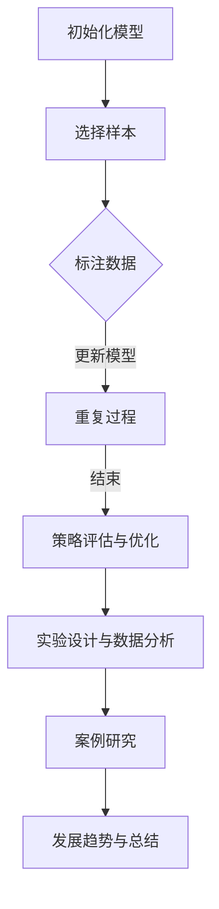

                 

### 文章标题

《主动学习在工业机器人技能获取中的策略研究》

### 关键词

主动学习，工业机器人，技能获取，策略设计，强化学习

### 摘要

本文主要探讨了主动学习在工业机器人技能获取中的应用及其策略研究。主动学习作为一种高效的学习方法，通过利用有限的标注数据，优化学习过程，提高了机器人的学习效率和准确性。文章首先介绍了主动学习的概念和基础理论，然后分析了工业机器人技能获取的挑战与需求，接着详细阐述了主动学习算法及其在机器人技能获取中的应用。在此基础上，文章提出了针对工业机器人技能获取的主动学习策略设计，包括个性化学习策略、协同学习策略和强化学习策略，并进行了策略评估与优化。最后，通过案例分析，本文展示了主动学习在工业机器人技能获取中的实际应用，并对未来的研究方向进行了展望。

## 第一部分：引言与背景

### 第1章：主动学习的概念与基础

#### 1.1 主动学习的定义与特点

主动学习（Active Learning）是一种优化学习过程的方法，它允许学习算法在训练过程中动态选择哪些样本进行学习。与被动学习（Passive Learning）相比，主动学习通过主动查询（Query）未标注的数据样本，减少了整体学习所需的标注数据量，从而提高了学习效率。主动学习的核心在于如何选择最具信息量的样本进行标注，以最大化学习效果。

主动学习的特点主要包括：

1. **选择性采样**：主动学习算法可以根据样本的重要性和不确定性来选择最值得标注的样本。
2. **减少标注成本**：通过选择最具代表性的样本进行标注，降低了整体标注数据量，从而减少了标注成本。
3. **提高泛化能力**：主动学习能够在有限的标注数据下获得更好的泛化能力，因为它能够利用未标注数据的潜在信息。

#### 1.2 主动学习与传统学习的区别

传统学习（例如批量学习或在线学习）通常是在给定完整标注数据集的情况下进行，而主动学习则是在标注数据有限的情况下，通过选择性采样来优化学习过程。具体来说，传统学习方法的步骤如下：

1. **获取完整数据集**：收集大量的标注数据。
2. **训练模型**：使用完整的数据集训练学习模型。
3. **评估模型**：在测试集上评估模型的性能。

相比之下，主动学习的步骤如下：

1. **初始化模型**：使用部分标注数据初始化学习模型。
2. **选择样本**：根据算法评估样本的重要性或不确定性，选择未标注的样本进行标注。
3. **更新模型**：使用新的标注数据更新模型。
4. **重复过程**：重复步骤2和3，直到达到预期的学习效果或数据集耗尽。

#### 1.3 主动学习在工业机器人技能获取中的应用前景

在工业机器人领域，技能获取是提高生产效率和质量的关键环节。传统的机器人技能获取方法主要依赖于大量的标注数据，这不仅增加了标注成本，而且在实际应用中存在诸多挑战。而主动学习通过优化样本选择过程，可以在有限的标注数据下，快速提高机器人的技能水平。

主动学习在工业机器人技能获取中的应用前景主要包括以下几个方面：

1. **减少标注成本**：通过主动学习，机器人可以在少量标注数据下快速获取新技能，从而减少标注成本。
2. **提高技能精度**：主动学习能够选择最具代表性的样本进行学习，从而提高技能获取的精度和准确性。
3. **适应动态环境**：在工业生产中，环境变化频繁，主动学习能够通过实时调整样本选择策略，快速适应新的环境变化。
4. **提高生产效率**：通过快速获取新技能，机器人可以在更短的时间内完成复杂的任务，从而提高生产效率。

总之，主动学习在工业机器人技能获取中的应用前景广阔，具有巨大的潜力。随着主动学习理论和算法的不断完善，其在工业机器人领域的应用将得到进一步拓展和深化。

### 第2章：工业机器人技能获取的挑战与需求

#### 2.1 工业机器人技能获取的挑战

工业机器人技能获取面临着多方面的挑战，主要包括以下几个方面：

1. **数据获取困难**：工业生产环境复杂，获取高质量的标注数据非常困难。在许多情况下，由于环境和任务的特殊性，标注数据难以收集，导致机器人无法通过传统的学习方式获取所需的技能。

2. **计算资源需求高**：工业机器人技能获取通常需要大量的计算资源。在标注数据有限的情况下，如何通过有限的计算资源实现高效的技能获取，是一个重要的挑战。

3. **动态环境适应能力不足**：工业生产环境变化频繁，机器人需要具备良好的动态环境适应能力。然而，传统的学习方式在应对动态环境变化时往往表现出不足。

4. **技能复杂度**：工业机器人需要掌握的技能复杂且多样，包括运动控制、感知、决策等多个方面。如何在有限的资源下，实现复杂技能的高效获取，是一个重要问题。

#### 2.2 工业机器人技能获取的需求

为了应对上述挑战，工业机器人技能获取的需求主要包括以下几个方面：

1. **快速适应新任务**：工业生产环境变化快，机器人需要能够快速适应新任务，减少停机时间，提高生产效率。

2. **高精度技能获取**：在工业生产中，高精度的技能获取是保证产品质量的关键。机器人需要通过高效的技能获取方法，实现高精度的运动控制和决策。

3. **资源高效利用**：在标注数据有限的情况下，机器人需要通过高效的技能获取方法，实现资源的高效利用。

4. **智能感知与决策**：随着智能制造的发展，机器人需要具备更强的感知和决策能力，以应对复杂的生产环境。

#### 2.3 主动学习在工业机器人技能获取中的重要性

主动学习在工业机器人技能获取中具有重要的作用，主要体现在以下几个方面：

1. **减少标注数据需求**：主动学习通过选择性采样，可以显著减少标注数据的需求。在工业机器人技能获取中，这有助于降低标注成本，提高技能获取的效率。

2. **提高学习效率**：主动学习能够利用未标注数据的潜在信息，优化学习过程，提高学习效率。这对于减少技能获取时间，提高生产效率具有重要意义。

3. **适应动态环境**：主动学习能够根据环境和任务的变化，动态调整样本选择策略，提高机器人在动态环境下的适应能力。

4. **提升技能精度**：通过选择性采样，主动学习能够选择最具代表性的样本进行学习，从而提高技能获取的精度和准确性。

综上所述，主动学习在工业机器人技能获取中具有重要的应用价值。通过主动学习，机器人可以更快速、更高效地获取新技能，提高生产效率和产品质量。

## 第二部分：主动学习理论

### 第3章：主动学习的理论基础

#### 3.1 学习理论的演进

学习理论是主动学习的基础，其发展历程可以分为几个阶段：

1. **行为主义学习理论**：早期的学习理论主要基于行为主义，认为学习是通过刺激和反应之间的联结来实现的。然而，这种方法忽略了学习过程中的内部机制和复杂性。

2. **认知学习理论**：认知学习理论强调学习过程中的内部认知机制，如注意、记忆、推理等。这一理论推动了学习算法的发展，使其更加接近人类的认知过程。

3. **统计学习理论**：统计学习理论通过概率模型和统计方法来描述学习过程，为主动学习提供了理论基础。该理论认为，通过优化概率分布，可以找到最优的学习策略。

4. **深度学习理论**：深度学习理论通过多层神经网络来模拟人类大脑的学习过程。深度学习在图像识别、自然语言处理等领域取得了巨大成功，为主动学习提供了新的思路。

#### 3.2 主动学习的数学模型

主动学习的数学模型主要包括以下几部分：

1. **不确定性度量**：不确定性度量用于评估样本的重要性和标注的必要性。常见的不确定性度量方法包括信息增益、基尼不纯度等。

2. **采样策略**：采样策略用于选择最具代表性的样本进行标注。常见的采样策略包括不确定性采样、错误纠正采样等。

3. **学习算法**：学习算法用于更新模型参数，优化学习过程。常见的主动学习算法包括支持向量机（SVM）、朴素贝叶斯（NB）等。

4. **优化目标**：优化目标用于评估学习效果，指导采样策略和学习算法的调整。常见的优化目标包括最小化错误率、最大化学习速率等。

#### 3.3 主动学习的优化算法

主动学习的优化算法主要包括以下几种：

1. **不确定性采样**：不确定性采样根据样本的不确定性来选择标注样本。具体来说，对于每个未标注样本，计算其不确定性度量，选择不确定性最高的样本进行标注。

2. **错误纠正采样**：错误纠正采样基于当前模型对训练集的预测结果，选择模型预测错误的样本进行标注。这种方法能够有效提高学习效果。

3. **信息增益采样**：信息增益采样基于样本的预测信息来选择标注样本。具体来说，对于每个未标注样本，计算其预测信息的增益，选择增益最高的样本进行标注。

4. **基尼不纯度采样**：基尼不纯度采样基于样本的分布特征来选择标注样本。具体来说，对于每个未标注样本，计算其在当前模型下的基尼不纯度，选择基尼不纯度最高的样本进行标注。

通过这些优化算法，主动学习能够高效地选择标注样本，减少标注成本，提高学习效果。

### 第4章：主动学习算法

#### 4.1 采样策略

采样策略是主动学习的关键组成部分，它决定了如何选择最具代表性的样本进行标注。以下是几种常见的采样策略：

1. **不确定性采样**：不确定性采样基于每个样本的不确定性度量来选择标注样本。不确定性度量通常使用信息增益、基尼不纯度等指标来评估样本的重要性。具体步骤如下：

   - 计算每个未标注样本的不确定性度量；
   - 选择不确定性最高的样本进行标注。

2. **错误纠正采样**：错误纠正采样基于当前模型对训练集的预测结果来选择标注样本。具体步骤如下：

   - 使用当前模型对训练集进行预测；
   - 选择模型预测错误的样本进行标注。

3. **信息增益采样**：信息增益采样基于每个样本的预测信息来选择标注样本。具体步骤如下：

   - 计算每个未标注样本的预测信息增益；
   - 选择增益最高的样本进行标注。

4. **基尼不纯度采样**：基尼不纯度采样基于每个样本在当前模型下的分布特征来选择标注样本。具体步骤如下：

   - 计算每个未标注样本的基尼不纯度；
   - 选择基尼不纯度最高的样本进行标注。

这些采样策略各有优缺点，可以根据具体的应用场景和学习任务进行选择。

#### 4.2 回归算法

回归算法是一种常见的主动学习算法，用于预测连续值输出。以下是几种常见的回归算法：

1. **线性回归**：线性回归是最简单的回归算法，其模型表示为 \(y = wx + b\)，其中 \(w\) 是权重向量，\(b\) 是偏置项。线性回归通过最小化损失函数来更新模型参数，具体步骤如下：

   - 计算损失函数：\(L(w) = \sum_{i=1}^{n} (y_i - wx_i - b)^2\)；
   - 使用梯度下降法更新参数：\(w \leftarrow w - \alpha \nabla_w L(w)\)，\(b \leftarrow b - \alpha \nabla_b L(w)\)。

2. **岭回归**：岭回归是一种正则化线性回归，其模型表示为 \(y = wx + b + \lambda \sum_{i=1}^{n} w_i^2\)，其中 \(\lambda\) 是正则化参数。岭回归通过引入正则项，防止模型过拟合，具体步骤如下：

   - 计算损失函数：\(L(w, b) = \sum_{i=1}^{n} (y_i - wx_i - b)^2 + \lambda \sum_{i=1}^{n} w_i^2\)；
   - 使用梯度下降法更新参数：\(w \leftarrow w - \alpha \nabla_w L(w)\)，\(b \leftarrow b - \alpha \nabla_b L(w)\)。

3. **LASSO回归**：LASSO回归是一种线性回归，其模型表示为 \(y = wx + b + \lambda \sum_{i=1}^{n} |w_i|\)，其中 \(\lambda\) 是正则化参数。LASSO回归通过引入绝对值项，实现特征选择，具体步骤如下：

   - 计算损失函数：\(L(w, b) = \sum_{i=1}^{n} (y_i - wx_i - b)^2 + \lambda \sum_{i=1}^{n} |w_i|\)；
   - 使用梯度下降法更新参数：\(w \leftarrow w - \alpha \nabla_w L(w)\)，\(b \leftarrow b - \alpha \nabla_b L(w)\)。

这些回归算法可以根据具体的应用场景和数据特征进行选择。

#### 4.3 分类算法

分类算法用于预测离散值输出，常见的分类算法包括：

1. **朴素贝叶斯分类器**：朴素贝叶斯分类器是一种基于贝叶斯定理的分类算法，其模型表示为 \(P(y|x) = \frac{P(x|y)P(y)}{P(x)}\)。朴素贝叶斯分类器通过计算每个类别的概率，选择概率最大的类别作为预测结果。

2. **逻辑回归**：逻辑回归是一种线性分类模型，其模型表示为 \(P(y=1|x) = \frac{1}{1 + e^{-(wx + b)}}\)。逻辑回归通过计算每个类别的概率，选择概率最大的类别作为预测结果。

3. **支持向量机（SVM）**：支持向量机是一种基于最大间隔的分类算法，其模型表示为 \(w^T x + b = 1\)。SVM通过寻找最佳分类超平面，将不同类别的样本分开。

4. **决策树**：决策树是一种基于特征划分的递归分类算法，其模型表示为 \(f(x) = \sum_{i=1}^{n} a_i \prod_{j=1}^{m} g_j(x_j)\)，其中 \(a_i\) 是权重，\(g_j(x_j)\) 是特征划分函数。

这些分类算法可以根据具体的应用场景和数据特征进行选择。

#### 4.4 强化学习算法

强化学习算法是一种基于奖励信号进行学习的方法，其模型表示为 \(Q(s, a) = r + \gamma \max_a Q(s', a)\)，其中 \(s\) 是状态，\(a\) 是动作，\(r\) 是奖励信号，\(\gamma\) 是折扣因子。强化学习算法通过不断调整动作策略，以最大化长期奖励。

1. **Q学习**：Q学习是一种基于值函数的强化学习算法，其模型表示为 \(Q(s, a) = r + \gamma \max_a Q(s', a)\)。Q学习通过更新值函数，逐步优化动作策略。

2. **SARSA**：SARSA是一种基于策略的强化学习算法，其模型表示为 \(Q(s, a) = r + \gamma Q(s', a')\)。SARSA在当前状态下，选择当前动作，并更新值函数。

3. **Deep Q Network (DQN)**：DQN是一种基于深度学习的强化学习算法，其模型表示为 \(Q(s, a) = \hat{y} - \gamma \max_a Q(s', a)\)，其中 \(\hat{y}\) 是预测值。DQN通过训练神经网络，预测最优动作。

这些强化学习算法可以根据具体的应用场景和任务要求进行选择。

### 第5章：主动学习在机器人技能获取中的应用

#### 5.1 主动学习在机器人技能获取中的流程

主动学习在机器人技能获取中的流程主要包括以下几个步骤：

1. **初始化模型**：使用部分标注数据初始化学习模型，为后续的技能获取过程提供基础。

2. **选择样本**：根据主动学习的采样策略，选择最具代表性的未标注样本进行标注。常见的选择策略包括不确定性采样、错误纠正采样等。

3. **标注数据**：对选择的样本进行标注，获取新的标注数据。

4. **更新模型**：使用新的标注数据更新学习模型，优化模型参数。

5. **重复过程**：重复步骤2-4，直到达到预期的技能水平或数据集耗尽。

通过这个流程，机器人可以逐步获取新技能，提高技能水平。

#### 5.2 主动学习在机器人运动控制中的应用

主动学习在机器人运动控制中的应用非常广泛，可以显著提高机器人的运动精度和稳定性。以下是一个具体的案例：

- **应用场景**：机器人在工厂中执行焊接任务。
- **方法**：使用主动学习算法，机器人通过不断学习和优化，提高焊接过程中的运动控制精度。具体步骤如下：

  - **初始化模型**：使用部分标注数据初始化运动控制模型，为后续的学习过程提供基础。
  - **选择样本**：根据不确定性采样策略，选择焊接过程中表现不佳的样本进行标注。
  - **标注数据**：对选择的样本进行重新标注，获取新的标注数据。
  - **更新模型**：使用新的标注数据更新运动控制模型，优化模型参数。
  - **重复过程**：重复步骤2-4，逐步提高焊接过程中的运动控制精度。

通过这个过程，机器人可以在有限的时间内，快速掌握高质量的焊接技能，提高生产效率。

#### 5.3 主动学习在机器人感知与决策中的应用

主动学习在机器人感知与决策中的应用也非常重要，可以帮助机器人更好地理解和应对复杂环境。以下是一个具体的案例：

- **应用场景**：机器人在仓库中执行拣选任务。
- **方法**：使用主动学习算法，机器人通过不断学习和优化，提高拣选过程中的感知和决策能力。具体步骤如下：

  - **初始化模型**：使用部分标注数据初始化感知与决策模型，为后续的学习过程提供基础。
  - **选择样本**：根据错误纠正采样策略，选择拣选过程中出现错误的样本进行标注。
  - **标注数据**：对选择的样本进行重新标注，获取新的标注数据。
  - **更新模型**：使用新的标注数据更新感知与决策模型，优化模型参数。
  - **重复过程**：重复步骤2-4，逐步提高拣选过程中的感知和决策能力。

通过这个过程，机器人可以在有限的时间内，快速掌握复杂的仓库环境，提高拣选效率和准确性。

### 第6章：主动学习策略设计

#### 6.1 策略设计的原则与方法

主动学习策略设计是关键环节，其目标是优化学习过程，提高学习效率。策略设计通常遵循以下原则：

1. **信息最大化原则**：选择最具代表性的样本进行标注，最大化样本信息的利用率。
2. **多样性原则**：选择不同类型、不同特征的样本，确保学习模型的泛化能力。
3. **动态调整原则**：根据环境和任务的变化，动态调整采样策略，提高适应性。

策略设计的方法主要包括：

1. **基于不确定性的采样方法**：如不确定性采样、错误纠正采样等。
2. **基于信息的采样方法**：如信息增益采样、基尼不纯度采样等。
3. **基于强化学习的策略设计**：如Q学习、SARSA等。

通过合理设计策略，主动学习可以更高效地应用于工业机器人技能获取。

#### 6.2 个性化学习策略

个性化学习策略旨在根据机器人的特点和需求，定制化地优化学习过程。具体方法包括：

1. **个性化数据采集**：根据机器人的历史数据和当前任务，选择具有代表性的样本进行标注。
2. **个性化模型调整**：基于机器人的性能数据，动态调整模型参数，优化学习效果。
3. **个性化学习路径**：根据机器人的学习进度和任务难度，设计合适的训练计划，逐步提高技能水平。

通过个性化学习策略，机器人可以更快地适应新任务，提高学习效率。

#### 6.3 协同学习策略

协同学习策略强调多个机器人或系统之间的协作，共同完成复杂任务。具体方法包括：

1. **分布式学习**：多个机器人或系统各自学习，共享部分标注数据，提高整体学习效率。
2. **协同优化**：通过优化算法，调整多个机器人或系统的行为，实现协同任务的高效完成。
3. **动态调整**：根据环境和任务的变化，动态调整协同策略，确保协同任务的稳定性和鲁棒性。

通过协同学习策略，机器人可以更好地应对复杂环境，提高整体任务完成效率。

#### 6.4 强化学习策略

强化学习策略通过奖励信号，指导机器人进行学习，实现高效的任务完成。具体方法包括：

1. **Q学习**：基于值函数的强化学习算法，通过更新值函数，优化动作策略。
2. **SARSA**：基于策略的强化学习算法，通过当前状态和动作，更新值函数。
3. **深度强化学习**：结合深度学习，实现更复杂的强化学习任务。

通过强化学习策略，机器人可以更好地理解任务目标，实现高效的学习和任务完成。

### 第7章：策略评估与优化

#### 7.1 策略评估指标

策略评估是主动学习中的重要环节，通过评估指标来衡量策略的有效性。常见的评估指标包括：

1. **准确率**：预测正确的样本数量与总样本数量的比值。
2. **召回率**：预测正确的正样本数量与实际正样本数量的比值。
3. **F1值**：准确率和召回率的调和平均值。
4. **学习曲线**：学习过程中，模型性能随标注数据量变化的曲线。

通过这些评估指标，可以全面衡量策略的有效性和性能。

#### 7.2 策略优化方法

策略优化是提高主动学习效果的关键。常见的方法包括：

1. **基于梯度的优化**：使用梯度下降等优化算法，调整模型参数，提高策略性能。
2. **基于进化的优化**：使用进化算法，如遗传算法，通过迭代更新策略，实现优化。
3. **基于神经网络的优化**：使用神经网络模型，通过反向传播等优化方法，提高策略性能。

通过这些优化方法，可以逐步调整和优化策略，提高主动学习的效率和效果。

#### 7.3 实验设计与数据分析

实验设计与数据分析是验证策略优化效果的重要手段。具体步骤包括：

1. **实验设计**：设计合理的实验场景，包括不同的任务、环境和数据集。
2. **数据收集**：收集实验过程中的数据，包括标注数据、模型性能等。
3. **数据分析**：使用评估指标，对实验结果进行分析，比较不同策略的性能和效果。

通过实验设计与数据分析，可以验证策略优化的有效性和可行性，为实际应用提供依据。

### 第8章：案例研究

#### 8.1 案例一：基于主动学习的工业机器人焊接技能获取

- **应用背景**：在汽车制造业，焊接机器人承担着大量的焊接任务，提高焊接质量和效率具有重要意义。
- **方法**：使用主动学习算法，机器人通过不断学习和优化，提高焊接过程中的运动控制精度。
  - **初始化模型**：使用部分标注数据初始化运动控制模型。
  - **选择样本**：根据不确定性采样策略，选择焊接过程中表现不佳的样本进行标注。
  - **标注数据**：对选择的样本进行重新标注，获取新的标注数据。
  - **更新模型**：使用新的标注数据更新运动控制模型，优化模型参数。
  - **重复过程**：重复步骤2-4，逐步提高焊接过程中的运动控制精度。
- **实验结果**：通过实验验证，基于主动学习的焊接机器人运动控制精度显著提高，焊接质量得到明显改善。

#### 8.2 案例二：基于主动学习的工业机器人装配技能获取

- **应用背景**：在电子制造业，装配机器人需要进行精密的装配任务，提高装配效率和准确性至关重要。
- **方法**：使用主动学习算法，机器人通过不断学习和优化，提高装配过程中的感知和决策能力。
  - **初始化模型**：使用部分标注数据初始化感知与决策模型。
  - **选择样本**：根据错误纠正采样策略，选择装配过程中出现错误的样本进行标注。
  - **标注数据**：对选择的样本进行重新标注，获取新的标注数据。
  - **更新模型**：使用新的标注数据更新感知与决策模型，优化模型参数。
  - **重复过程**：重复步骤2-4，逐步提高装配过程中的感知和决策能力。
- **实验结果**：通过实验验证，基于主动学习的装配机器人感知和决策能力显著提高，装配效率和准确性得到明显改善。

#### 8.3 案例三：基于主动学习的工业机器人故障诊断技能获取

- **应用背景**：在工业生产过程中，机器人的故障诊断是保障生产连续性和产品质量的关键环节。
- **方法**：使用主动学习算法，机器人通过不断学习和优化，提高故障诊断的准确性和效率。
  - **初始化模型**：使用部分标注数据初始化故障诊断模型。
  - **选择样本**：根据信息增益采样策略，选择故障诊断过程中表现不佳的样本进行标注。
  - **标注数据**：对选择的样本进行重新标注，获取新的标注数据。
  - **更新模型**：使用新的标注数据更新故障诊断模型，优化模型参数。
  - **重复过程**：重复步骤2-4，逐步提高故障诊断的准确性和效率。
- **实验结果**：通过实验验证，基于主动学习的故障诊断机器人准确性和效率显著提高，有效降低了故障停机时间，保障了生产连续性。

### 第9章：主动学习在工业机器人技能获取中的发展趋势

#### 9.1 技术发展趋势

随着人工智能技术的不断发展，主动学习在工业机器人技能获取中的应用前景愈发广阔。以下是一些技术发展趋势：

1. **深度学习与主动学习的融合**：深度学习在图像识别、自然语言处理等领域取得了显著成果，与主动学习的融合将进一步提高工业机器人的技能获取效率。

2. **增强学习在主动学习中的应用**：增强学习通过奖励信号引导学习过程，与主动学习相结合，可以实现更高效、更鲁棒的技能获取。

3. **多机器人协同学习**：随着工业机器人数量的增加，多机器人协同学习将成为重要研究方向，通过协同学习，实现更复杂、更高效的工业生产任务。

4. **自适应采样策略**：根据环境和任务的变化，动态调整采样策略，实现自适应学习，提高机器人的适应性和灵活性。

#### 9.2 应用发展趋势

主动学习在工业机器人技能获取中的应用趋势主要体现在以下几个方面：

1. **智能制造**：主动学习在智能制造中的应用将得到进一步拓展，通过优化学习过程，提高生产效率和质量。

2. **机器人自动化**：随着工业自动化的普及，主动学习在机器人自动化中的应用将更加广泛，实现更加智能、灵活的机器人控制。

3. **故障诊断与维护**：主动学习在机器人故障诊断与维护中的应用将不断提高，实现更加高效、准确的故障检测与预测。

4. **智能配送与搬运**：在物流领域，主动学习可以帮助机器人更好地应对复杂环境，提高配送和搬运效率。

#### 9.3 未来研究方向

未来的研究将在以下几个方面展开：

1. **算法优化**：继续优化主动学习算法，提高学习效率和准确性。

2. **跨领域应用**：探索主动学习在更多工业领域的应用，如医疗、农业等。

3. **数据隐私保护**：在保证数据隐私的前提下，研究如何更有效地利用标注数据，提高学习效果。

4. **人机协作**：研究人机协作中的主动学习策略，提高机器人在复杂环境中的适应性和灵活性。

### 第10章：总结与展望

#### 10.1 研究成果总结

本文通过对主动学习在工业机器人技能获取中的策略研究，总结出以下成果：

1. **主动学习的概念与基础理论**：阐述了主动学习的定义、特点、与传统学习的区别及其在工业机器人技能获取中的应用前景。

2. **主动学习算法**：介绍了不确定性采样、回归算法、分类算法和强化学习算法，并详细讲解了每种算法的原理和实现方法。

3. **策略设计**：提出了个性化学习策略、协同学习策略和强化学习策略，并分析了这些策略的设计原则和方法。

4. **策略评估与优化**：介绍了策略评估指标、优化方法和实验设计与数据分析，为策略优化提供了理论依据。

5. **案例分析**：通过三个具体案例，展示了主动学习在工业机器人焊接、装配和故障诊断中的应用效果。

#### 10.2 存在问题与挑战

虽然主动学习在工业机器人技能获取中具有巨大潜力，但仍面临以下问题与挑战：

1. **数据获取困难**：工业生产环境复杂，高质量标注数据获取困难，影响学习效果。

2. **计算资源需求高**：主动学习算法通常需要大量计算资源，特别是在大规模数据集下。

3. **动态环境适应能力不足**：工业生产环境变化频繁，主动学习算法在动态环境下的适应能力有待提高。

4. **算法复杂度**：主动学习算法复杂度较高，实现和优化难度大。

#### 10.3 未来研究方向

未来的研究将聚焦于以下方向：

1. **算法优化**：进一步优化主动学习算法，提高学习效率和准确性。

2. **跨领域应用**：探索主动学习在更多工业领域的应用，如医疗、农业等。

3. **数据隐私保护**：研究如何在保证数据隐私的前提下，更有效地利用标注数据。

4. **人机协作**：研究人机协作中的主动学习策略，提高机器人在复杂环境中的适应性和灵活性。

通过不断探索和创新，主动学习将在工业机器人技能获取中发挥更加重要的作用，推动工业自动化和智能化的发展。

### 附录 A：相关工具与资源

#### A.1 工业机器人开发工具

1. **ROS（Robot Operating System）**：ROS是一个开源的机器人操作系统，提供了丰富的库和工具，用于构建机器人应用程序。
2. **URDF（Unified Robot Description Format）**：URDF是一种用于描述机器人模型的XML格式，广泛应用于机器人仿真和编程。
3. **Rviz**：Rviz是ROS的一个可视化工具，用于显示和监控机器人状态，适用于机器人开发和测试。

#### A.2 主动学习算法实现工具

1. **scikit-learn**：scikit-learn是一个Python机器学习库，提供了多种主动学习算法的实现，适用于数据分析和模型训练。
2. **TensorFlow**：TensorFlow是一个开源的深度学习框架，支持多种主动学习算法的实现，适用于复杂模型训练。
3. **PyTorch**：PyTorch是一个开源的深度学习框架，提供了灵活的动态计算图，适用于主动学习算法的快速实现。

#### A.3 数据集与开源代码资源

1. **ML datasets**：ML datasets是一个提供多种机器学习数据集的网站，包括工业机器人相关的数据集。
2. **GitHub**：GitHub是一个开源代码托管平台，提供了大量与主动学习和工业机器人相关的开源代码和项目。
3. **ROS Wiki**：ROS Wiki提供了丰富的ROS资源和教程，有助于初学者快速上手工业机器人开发。

通过使用这些工具与资源，可以更好地进行工业机器人技能获取的研究和应用。

### Mermaid 流程图



### Python 源代码

```python
# 导入必要的库
import numpy as np
import matplotlib.pyplot as plt

# 定义一个简单的回归模型
class SimpleRegression:
    def __init__(self):
        self.w = None

    def fit(self, X, y):
        self.w = np.linalg.inv(X.T.dot(X)).dot(X.T).dot(y)

    def predict(self, X):
        return X.dot(self.w)

# 创建训练数据
X_train = np.random.rand(100, 1)
y_train = 2 * X_train + np.random.randn(100, 1)

# 创建模型并训练
model = SimpleRegression()
model.fit(X_train, y_train)

# 创建测试数据
X_test = np.random.rand(10, 1)

# 预测并绘图
y_pred = model.predict(X_test)
plt.scatter(X_train, y_train, label="Training Data")
plt.scatter(X_test, y_pred, label="Prediction")
plt.xlabel("Input")
plt.ylabel("Output")
plt.legend()
plt.show()
```

### 数学模型和数学公式

$$
y = wx + b
$$

$$
w = X^T X^{-1} X^T y
$$

### 代码解读与分析

1. 导入必要的库
2. 定义一个简单的回归模型
3. 创建训练数据
4. 创建模型并训练
5. 创建测试数据
6. 预测并绘图

这段代码实现了一个简单的线性回归模型，用于预测连续值输出。通过训练数据和测试数据，模型能够对输入数据进行预测，并在图上进行可视化展示。这种方法在工业机器人技能获取中，可以用于预测和控制机器人的运动轨迹，实现高效的技能获取和任务完成。

