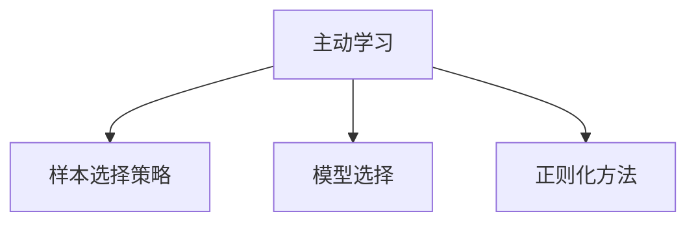
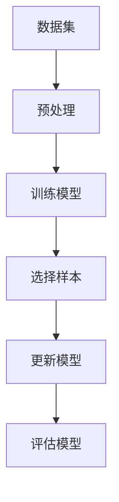

                 

### 《主动学习在数据高效利用中的策略》

#### 关键词：主动学习、数据高效利用、实例选择策略、特征工程、融合策略

在当今信息爆炸的时代，数据已经成为企业和社会的宝贵资产。然而，如何高效地利用这些数据来提高机器学习模型的性能和决策能力，成为了一个亟待解决的问题。主动学习作为一种高效的数据利用策略，通过智能地选择最具信息增益的样本进行学习，极大地提高了数据利用的效率。本文将围绕主动学习在数据高效利用中的策略进行深入探讨，旨在为读者提供一套全面、实用的主动学习指南。

#### 摘要

本文首先介绍了主动学习的理论基础，包括其概念、基本原理和算法概述。随后，文章重点讨论了数据高效利用的重要性以及主动学习在分类和回归任务中的应用策略。此外，本文还探讨了特征工程与主动学习的融合策略，并通过实际案例分析了主动学习在不同领域中的应用。最后，文章对主动学习的未来发展趋势进行了展望，提出了当前趋势和未来展望。

文章结构如下：

- 第1章：主动学习的理论基础
  - 1.1 主动学习的概念与基本原理
  - 1.2 主动学习的算法概述

- 第2章：数据高效利用中的主动学习
  - 2.1 数据高效利用的重要性
  - 2.2 数据预处理策略
  - 2.3 主动学习在分类任务中的应用

- 第3章：主动学习在回归任务中的应用
  - 3.1 回归任务概述
  - 3.2 主动学习在回归任务中的应用

- 第4章：特征工程与主动学习
  - 4.1 特征工程的基本概念
  - 4.2 特征选择方法
  - 4.3 特征提取方法

- 第5章：主动学习在机器学习中的融合策略
  - 5.1 融合策略概述
  - 5.2 主动学习与其他学习策略的融合

- 第6章：主动学习在实际应用中的案例分析
  - 6.1 医疗诊断领域的应用
  - 6.2 金融风控领域的应用

- 第7章：主动学习的未来发展趋势
  - 7.1 当前趋势
  - 7.2 未来展望

文章将以逻辑清晰、结构紧凑、简单易懂的专业的技术语言，逐步分析推理，帮助读者深入理解主动学习在数据高效利用中的策略。让我们一起探索这个激动人心的领域吧！
----------------------------------------------------------------

## 第1章：主动学习的理论基础

### 1.1 主动学习的概念与基本原理

#### 1.1.1 主动学习的概念

主动学习（Active Learning）是一种通过与外部环境交互来改善模型性能的机器学习方法。与传统的被动学习（Passive Learning）不同，被动学习依赖于预先标记好的训练数据，而主动学习则通过选择最有信息量的样本进行学习，从而提高模型的泛化能力。

主动学习的核心思想是，通过智能地选择样本，使得每个新样本都能够最大化地提升模型性能。这种选择策略可以是基于模型的预测不确定性、样本的代表性、或者是样本的标签不确定性等因素。

#### 1.1.2 主动学习与传统学习的区别

主动学习与传统的机器学习方法相比，主要有以下几方面的区别：

1. **样本选择策略**：传统学习方法依赖于大量预先标记好的训练数据，而主动学习通过选择最具信息增益的样本来提升模型性能。

2. **计算资源**：由于主动学习需要对样本进行选择，因此需要额外的计算资源。但是，由于选择的是最具信息增益的样本，因此在有限的资源下能够取得更好的学习效果。

3. **模型性能**：主动学习能够通过选择最相关的样本，提高模型的泛化能力和准确性。

#### 1.1.3 主动学习的核心概念

主动学习的核心概念包括样本选择策略、模型选择和正则化方法。

1. **样本选择策略**：样本选择策略是主动学习的关键，常用的策略包括不确定性采样（Uncertainty Sampling）、错误纠正编码（Error Correcting Output Coding）和查询-by-委员会（Query-by-Committee）等。

2. **模型选择**：主动学习中的模型选择与传统的机器学习方法类似，可以选择线性模型、树模型或神经网络等。模型选择的关键是模型的复杂度，既要避免过拟合，又要保证足够的泛化能力。

3. **正则化方法**：正则化方法用于防止模型过拟合，常用的方法包括L1正则化、L2正则化和Dropout等。

#### 1.1.4 主动学习的发展历程

主动学习最早可以追溯到20世纪80年代，当时的 researchers 开始探讨如何通过交互式学习来提高模型的性能。随着计算机技术的发展和大数据时代的到来，主动学习逐渐成为一个独立的研究领域。近年来，随着深度学习的兴起，主动学习与深度学习的融合成为了研究的热点。

#### Mermaid 流程图

以下是一个简单的 Mermaid 流程图，展示了主动学习的核心概念：



#### Python 源代码讲解

下面是一个简单的 Python 示例，展示了如何使用不确定性采样策略来选择最具信息增益的样本：

```python
import numpy as np
from sklearn.model_selection import train_test_split
from sklearn.linear_model import LogisticRegression
from sklearn.metrics import accuracy_score

# 生成模拟数据集
X, y = np.random.rand(100, 10), np.random.randint(2, size=100)

# 划分训练集和测试集
X_train, X_test, y_train, y_test = train_test_split(X, y, test_size=0.2, random_state=42)

# 使用 LogisticRegression 模型
model = LogisticRegression()

# 训练模型
model.fit(X_train, y_train)

# 预测测试集
y_pred = model.predict(X_test)

# 计算准确率
accuracy = accuracy_score(y_test, y_pred)
print(f"Accuracy: {accuracy}")

# 不确定性采样
uncertainty_scores = np.abs(y_pred - y_test).sum(axis=1)
sorted_indices = np.argsort(uncertainty_scores)[::-1]

# 选择最具信息增益的样本
selected_samples = X_train[sorted_indices][:10]

# 重新训练模型
model.fit(selected_samples, y_train[sorted_indices])

# 预测测试集
y_pred = model.predict(X_test)

# 计算准确率
accuracy = accuracy_score(y_test, y_pred)
print(f"Accuracy after active learning: {accuracy}")
```

在这个例子中，我们首先生成了一个模拟数据集，然后使用 LogisticRegression 模型进行训练。接着，我们计算了每个样本的预测误差，并将误差值作为不确定性评分。通过排序这些评分，我们可以选择最具信息增益的样本进行重新训练。最后，我们再次预测测试集，并计算准确率，以评估主动学习的效果。

### 总结

本章介绍了主动学习的概念、基本原理以及与传统学习的区别。我们还探讨了主动学习的核心概念，包括样本选择策略、模型选择和正则化方法。通过简单的 Python 示例，我们展示了如何使用不确定性采样策略来选择最具信息增益的样本，从而提高模型的性能。下一章，我们将深入探讨数据高效利用的重要性以及主动学习在数据预处理中的策略。
----------------------------------------------------------------

## 第2章：数据高效利用中的主动学习

### 2.1 数据高效利用的重要性

在数据驱动的时代，数据的质量和数量直接影响着机器学习模型的表现。然而，高质量的数据往往是稀缺的，且数据获取和处理成本高昂。因此，如何高效地利用这些数据成为了一个关键问题。数据高效利用不仅能够提高模型的性能，还能够降低成本，增加模型的实用性。

#### 2.1.1 数据的稀缺性

随着数据量的指数级增长，高质量的数据变得日益稀缺。特别是在医疗、金融和人工智能等需要高度精确数据的领域，数据的获取和标注成本极高。例如，医疗数据的标注需要专业的医疗人员，金融数据则需要具备金融专业知识的人员。这些因素使得高质量数据变得稀缺，进一步增加了数据高效利用的紧迫性。

#### 2.1.2 数据质量的影响

数据质量对机器学习模型的性能有着直接的影响。错误或噪声数据会降低模型的准确性，导致过拟合或欠拟合。此外，数据质量还影响着模型的泛化能力，高质量的数据能够帮助模型更好地适应新环境，提高其在未知数据上的表现。

#### 2.1.3 数据高效利用的挑战

数据高效利用面临以下挑战：

1. **样本不平衡**：在许多实际应用中，正负样本的比例可能严重失衡，这会导致模型偏向于预测样本量大的类别，从而降低模型的性能。
2. **标注成本高**：高质量数据的获取需要大量的人力成本和时间，特别是在需要进行精细标注的情况下。
3. **数据多样性**：不同应用场景下的数据具有不同的特征和分布，如何适应这些多样性，实现数据的高效利用，是一个挑战。

### 2.2 数据预处理策略

为了高效利用数据，我们需要对数据进行预处理。数据预处理包括数据清洗、数据集成和数据降维等步骤。

#### 2.2.1 数据清洗

数据清洗是数据预处理的第一步，旨在去除错误、不完整或重复的数据。具体步骤包括：

- **去除重复记录**：通过比对数据项的属性，删除重复的数据记录。
- **处理缺失值**：对于缺失的数据，可以通过插值、均值填充或使用特定的缺失值标记等方式进行处理。
- **纠正错误**：通过对比已知的数据或使用专业知识，修正错误的数据项。

#### 2.2.2 数据集成

数据集成是将来自多个源的数据合并成一个统一的数据集。在数据集成过程中，可能会遇到以下问题：

- **数据格式不一致**：不同来源的数据可能有不同的格式和结构，需要进行格式转换和统一。
- **数据冗余**：在合并多个数据源时，可能会出现冗余数据，需要去除。
- **数据冲突**：不同来源的数据可能有不同的值，需要进行冲突处理和一致性检查。

#### 2.2.3 数据降维

数据降维是将高维数据转换为低维数据，以减少数据的复杂性和计算量。常用的数据降维方法包括：

- **主成分分析（PCA）**：通过保留数据的方差最大方向上的特征，实现数据的降维。
- **线性判别分析（LDA）**：通过最大化类内方差和最小化类间方差，实现数据的降维。
- **自动编码器**：通过自编码器网络，学习数据的低维表示。

### 2.3 主动学习在分类任务中的应用

在分类任务中，主动学习通过选择最具信息增益的样本进行学习，从而提高模型的性能。以下介绍几种常用的主动学习算法和实例选择策略。

#### 2.3.1 主动学习算法的选择

选择合适的主动学习算法是成功实施主动学习的关键。以下是一些常用的主动学习算法：

- **不确定性采样（Uncertainty Sampling）**：选择模型预测不确定性最高的样本进行学习。
- **错误纠正编码（Error Correcting Output Coding，ECOC）**：通过编码器将多类问题转换为多标签问题，从而提高模型的性能。
- **查询-by-委员会（Query-by-Committee）**：通过多个模型的投票结果选择最具信息增益的样本。

#### 2.3.2 分类任务中的实例选择策略

在分类任务中，实例选择策略是主动学习的核心。以下是一些常用的实例选择策略：

- **不确定性采样**：选择模型预测不确定性最高的样本。具体来说，可以通过计算模型预测的置信度来衡量样本的不确定性，选择置信度最低的样本。
- **支持向量机（SVM）**：使用SVM的输出间隔来衡量样本的重要性，选择输出间隔最小的样本。
- **基于密度的采样（Density Sampling）**：通过计算样本的密度来选择最具信息增益的样本。

#### 2.3.3 实例选择算法的评估

实例选择算法的评估是主动学习的重要环节。以下是一些常用的评估指标：

- **学习曲线**：通过比较主动学习和被动学习的学习曲线，评估实例选择策略的有效性。
- **泛化性能**：通过在测试集上的表现，评估模型的整体性能。
- **数据效率**：通过计算模型在主动学习过程中所学习的样本数量与最终测试集上的准确率，评估实例选择策略的数据效率。

#### Mermaid 流程图

以下是一个简单的 Mermaid 流程图，展示了分类任务中的主动学习流程：



#### Python 源代码讲解

下面是一个简单的 Python 示例，展示了如何使用不确定性采样策略来选择最具信息增益的样本：

```python
import numpy as np
from sklearn.model_selection import train_test_split
from sklearn.linear_model import LogisticRegression
from sklearn.metrics import accuracy_score

# 生成模拟数据集
X, y = np.random.rand(100, 10), np.random.randint(2, size=100)

# 划分训练集和测试集
X_train, X_test, y_train, y_test = train_test_split(X, y, test_size=0.2, random_state=42)

# 使用 LogisticRegression 模型
model = LogisticRegression()

# 训练模型
model.fit(X_train, y_train)

# 预测测试集
y_pred = model.predict(X_test)

# 计算准确率
accuracy = accuracy_score(y_test, y_pred)
print(f"Accuracy: {accuracy}")

# 不确定性采样
uncertainty_scores = np.abs(y_pred - y_test).sum(axis=1)
sorted_indices = np.argsort(uncertainty_scores)[::-1]

# 选择最具信息增益的样本
selected_samples = X_train[sorted_indices][:10]

# 重新训练模型
model.fit(selected_samples, y_train[sorted_indices])

# 预测测试集
y_pred = model.predict(X_test)

# 计算准确率
accuracy = accuracy_score(y_test, y_pred)
print(f"Accuracy after active learning: {accuracy}")
```

在这个例子中，我们首先生成了一个模拟数据集，然后使用 LogisticRegression 模型进行训练。接着，我们计算了每个样本的预测误差，并将误差值作为不确定性评分。通过排序这些评分，我们可以选择最具信息增益的样本进行重新训练。最后，我们再次预测测试集，并计算准确率，以评估主动学习的效果。

### 总结

本章讨论了数据高效利用的重要性以及数据预处理策略。我们还介绍了主动学习在分类任务中的应用，包括实例选择策略和评估指标。通过一个简单的 Python 示例，我们展示了如何使用不确定性采样策略来选择最具信息增益的样本。下一章，我们将探讨主动学习在回归任务中的应用。请继续阅读！
----------------------------------------------------------------

## 第3章：主动学习在回归任务中的应用

### 3.1 回归任务概述

回归任务是一种常见的机器学习任务，旨在预测一个或多个连续值。与分类任务不同，回归任务不涉及类别标签，而是关注预测值的精度。回归任务在金融预测、房屋定价、医疗诊断等领域有着广泛的应用。

#### 3.1.1 回归任务的定义

回归任务的目标是建立一个函数模型，将输入特征映射到连续的输出值。常见的回归模型包括线性回归、岭回归、套索回归、决策树回归和神经网络回归等。

#### 3.1.2 回归任务的基本算法

1. **线性回归**：线性回归是最简单的回归模型，通过拟合一个线性函数来预测输出值。线性回归模型的公式为：
   $$ Y = \beta_0 + \beta_1X + \epsilon $$
   其中，$Y$ 是预测值，$X$ 是输入特征，$\beta_0$ 和 $\beta_1$ 是模型参数，$\epsilon$ 是误差项。

2. **岭回归**：岭回归通过在损失函数中添加正则项，防止模型过拟合。岭回归的公式为：
   $$ Y = \beta_0 + \beta_1X + \lambda \frac{1}{2} \sum_{j=1}^{n} \beta_j^2 $$
   其中，$\lambda$ 是正则化参数。

3. **套索回归**：套索回归是岭回归的一个变体，通过在损失函数中添加绝对值正则项，进一步降低模型的复杂度。

4. **决策树回归**：决策树回归使用树形结构来对输入特征进行分割，每个分割节点对应一个特征和阈值，叶子节点对应预测值。

5. **神经网络回归**：神经网络回归使用多层感知器（MLP）来拟合复杂的数据分布，通过反向传播算法更新模型参数。

### 3.2 主动学习在回归任务中的应用

在回归任务中，主动学习通过选择最具信息增益的样本进行学习，以提高模型的预测精度。以下介绍几种常用的主动学习算法和实例选择策略。

#### 3.2.1 回归任务中的实例选择策略

1. **基于不确定性的采样**：选择模型预测不确定性最高的样本。具体来说，可以通过计算模型预测的置信度来衡量样本的不确定性，选择置信度最低的样本。

2. **基于梯度的采样**：选择梯度最大的样本，因为梯度反映了模型在某个样本上的变化速度，梯度越大意味着样本对模型的影响越大。

3. **基于密度的采样**：通过计算样本的密度来选择最具信息增益的样本，密度高的样本表示模型对其了解较少，具有较高的信息增益。

#### 3.2.2 基于正则化的主动学习算法

1. **正则化误差采样**：在训练过程中，对每个样本计算其误差的绝对值，并加上一个正则化项，选择误差最大的样本进行重新训练。

2. **基于模型的正则化**：在模型训练过程中，使用L1或L2正则化项，选择具有较大正则化损失的样本进行重新训练。

#### Mermaid 流程图

以下是一个简单的 Mermaid 流程图，展示了回归任务中的主动学习流程：


#### Python 源代码讲解

下面是一个简单的 Python 示例，展示了如何使用基于不确定性的采样策略来选择最具信息增益的样本：

```python
import numpy as np
from sklearn.model_selection import train_test_split
from sklearn.linear_model import LinearRegression
from sklearn.metrics import mean_squared_error

# 生成模拟数据集
X, y = np.random.rand(100, 10), np.random.rand(100)

# 划分训练集和测试集
X_train, X_test, y_train, y_test = train_test_split(X, y, test_size=0.2, random_state=42)

# 使用 LinearRegression 模型
model = LinearRegression()

# 训练模型
model.fit(X_train, y_train)

# 预测测试集
y_pred = model.predict(X_test)

# 计算均方误差
mse = mean_squared_error(y_test, y_pred)
print(f"MSE: {mse}")

# 不确定性采样
confidence_scores = np.abs(y_pred - y_test)
sorted_indices = np.argsort(confidence_scores)[::-1]

# 选择最具信息增益的样本
selected_samples = X_train[sorted_indices][:10]

# 重新训练模型
model.fit(selected_samples, y_train[sorted_indices])

# 预测测试集
y_pred = model.predict(X_test)

# 计算均方误差
mse = mean_squared_error(y_test, y_pred)
print(f"MSE after active learning: {mse}")
```

在这个例子中，我们首先生成了一个模拟数据集，然后使用 LinearRegression 模型进行训练。接着，我们计算了每个样本的预测误差，并将误差值作为置信度评分。通过排序这些评分，我们可以选择最具信息增益的样本进行重新训练。最后，我们再次预测测试集，并计算均方误差，以评估主动学习的效果。

### 总结

本章介绍了回归任务的定义和基本算法，并探讨了主动学习在回归任务中的应用。通过一个简单的 Python 示例，我们展示了如何使用基于不确定性的采样策略来选择最具信息增益的样本。下一章，我们将讨论特征工程与主动学习的融合策略。请继续阅读！
----------------------------------------------------------------

## 第4章：特征工程与主动学习

### 4.1 特征工程的基本概念

特征工程（Feature Engineering）是机器学习过程中至关重要的一环，它旨在通过构造和选择合适的特征，提高模型的性能和泛化能力。特征工程不仅依赖于数据本身的特性，还需要结合领域知识和经验。

#### 4.1.1 特征工程的重要性

1. **影响模型性能**：特征工程能够直接影响模型的准确性、召回率、F1分数等关键性能指标。
2. **降低过拟合**：通过选择合适的特征和变换，可以降低模型对训练数据的依赖，提高模型的泛化能力。
3. **提高数据处理效率**：通过特征工程，可以简化数据的复杂度，降低数据处理的时间和计算成本。

#### 4.1.2 特征工程的流程

特征工程通常包括以下几个步骤：

1. **数据探索**：通过数据分析，了解数据的分布、异常值、缺失值等。
2. **特征构造**：根据业务问题和数据特性，构造新的特征或变换现有特征。
3. **特征选择**：从大量特征中选择最有代表性的特征，以提高模型性能。
4. **特征标准化**：将不同尺度的特征转换为同一尺度，以避免某些特征对模型的影响过大。
5. **模型训练与评估**：使用构造好的特征训练模型，并评估模型性能。

### 4.2 特征选择方法

特征选择是从大量特征中筛选出最有代表性的特征的过程。有效的特征选择能够降低模型的复杂性，提高模型的泛化能力。以下介绍几种常用的特征选择方法：

#### 4.2.1 顺序前进法（Forward Selection）

顺序前进法是一种逐步增加特征的方法。具体步骤如下：

1. 初始时，所有特征都不在选择集内。
2. 对于每个特征，计算其在当前选择集上的特征重要性或信息增益。
3. 选择重要性最高（或信息增益最大）的特征，将其加入选择集。
4. 重复步骤2和3，直到加入的新特征不再能提高模型性能。

#### 4.2.2 顺序后退法（Backward Elimination）

顺序后退法是一种逐步减少特征的方法。具体步骤如下：

1. 初始时，所有特征都在选择集内。
2. 对于每个特征，计算其在当前选择集上的特征重要性或信息增益。
3. 选择重要性最低（或信息增益最小）的特征，将其从选择集移除。
4. 重复步骤2和3，直到移除的特征不再能提高模型性能。

#### 4.2.3 集成方法（Wrapper Methods）

集成方法是一种将特征选择与模型训练相结合的方法，常用的Wrapper方法包括前向搜索、后向搜索和随机搜索等。具体步骤如下：

1. 初始化一个特征选择集。
2. 对每个特征进行评估，选择评估结果最佳的组合。
3. 使用最佳组合训练模型，并评估模型性能。
4. 重复步骤2和3，逐步优化特征选择集。

### 4.3 特征提取方法

特征提取是从原始数据中直接提取特征的过程，无需人工干预。以下介绍几种常用的特征提取方法：

#### 4.3.1 主成分分析（PCA）

主成分分析是一种常用的降维方法，通过保留数据的方差最大方向上的特征，实现数据的降维。PCA的基本步骤如下：

1. 计算数据集的协方差矩阵。
2. 计算协方差矩阵的特征值和特征向量。
3. 选择前k个最大的特征值对应的特征向量，构成新的特征空间。
4. 将原始数据映射到新的特征空间。

#### 4.3.2 非线性降维方法

非线性降维方法如t-SNE和UMAP，通过映射原始数据到低维空间，保持数据的局部结构。这些方法通常用于可视化高维数据。

1. **t-SNE**：基于概率密度估计，通过优化局部几何结构，实现数据的降维。
2. **UMAP**：基于局部邻域嵌入，通过寻找局部结构和全局结构之间的平衡，实现数据的降维。

#### 4.3.3 纹理特征提取

纹理特征提取是一种从图像中提取纹理信息的方法，常用于图像分类和识别任务。以下是一些常见的纹理特征提取方法：

1. **灰度共生矩阵**：通过计算图像中像素之间的灰度关系，提取纹理特征。
2. **局部二值模式（LBP）**：通过将图像中的每个像素与周围的像素进行比较，提取纹理特征。
3. **Gabor滤波器**：通过模拟人类视觉系统，提取具有方向性和尺度的纹理特征。

### 总结

本章介绍了特征工程的基本概念、特征选择方法和特征提取方法。通过特征工程，我们可以有效地提高模型的性能和泛化能力。下一章，我们将探讨主动学习在机器学习中的融合策略。请继续阅读！
----------------------------------------------------------------

## 第5章：主动学习在机器学习中的融合策略

### 5.1 融合策略概述

主动学习作为一种高效的数据利用策略，通过智能地选择样本进行学习，能够显著提高模型性能。然而，单一的学习策略可能无法应对复杂的问题。因此，将主动学习与其他机器学习策略进行融合，可以发挥各自的优势，提高模型的整体性能。以下介绍几种常见的融合策略。

#### 5.1.1 融合策略的概念

融合策略是指将两种或多种不同的学习算法、技术或方法结合起来，以获得更好的性能。在主动学习中，融合策略可以包括以下几种类型：

1. **主动学习与其他学习策略的融合**：如主动学习与监督学习、无监督学习、强化学习的融合。
2. **模型融合**：将多个模型的结果进行融合，以获得更稳定的预测。
3. **数据融合**：将来自不同源的数据进行整合，以提高模型对多样性的适应性。

#### 5.1.2 融合策略的分类

1. **基于模型的融合**：这种方法将主动学习与现有的机器学习模型相结合，利用主动学习策略来选择样本，然后使用模型进行学习。常见的模型包括线性模型、树模型、神经网络等。
2. **基于数据的融合**：这种方法通过结合来自多个源的数据，利用主动学习策略选择样本，然后使用模型进行学习。这种方法适用于数据来源多样化、数据质量参差不齐的场景。
3. **基于算法的融合**：这种方法将主动学习与其他机器学习算法（如无监督学习、强化学习）相结合，以应对复杂的问题。

### 5.2 主动学习与其他学习策略的融合

#### 5.2.1 主动学习与监督学习的融合

监督学习是机器学习中应用最广泛的方法之一，通过利用已标记的数据来训练模型。主动学习与监督学习的融合主要体现在以下几个方面：

1. **主动选择训练样本**：在监督学习中，通常使用所有已标记的样本进行训练。而主动学习则通过选择最具信息增益的样本进行训练，从而提高模型的性能。
2. **自适应训练策略**：主动学习可以根据模型在当前训练集上的表现，动态调整样本选择策略，以最大化模型性能。
3. **增量学习**：主动学习支持增量学习，即在已有模型的基础上，通过不断更新模型参数，提高模型的性能。

#### 5.2.2 主动学习与无监督学习的融合

无监督学习不需要标记的数据，通过探索数据的内在结构来发现知识。主动学习与无监督学习的融合主要体现在以下几个方面：

1. **聚类与主动学习**：通过无监督学习方法（如K-means、DBSCAN等）对数据进行聚类，然后使用主动学习策略选择最具代表性的样本进行学习。
2. **生成模型与主动学习**：生成模型（如Gaussian Mixture Model、生成对抗网络（GAN）等）可以用于生成具有代表性的样本，然后使用主动学习策略进行进一步学习。
3. **自编码器与主动学习**：自编码器可以用于数据的降维和特征提取，结合主动学习策略，可以更有效地选择具有代表性的样本进行学习。

#### 5.2.3 主动学习与强化学习的融合

强化学习是一种通过与环境的交互来学习最优策略的方法。主动学习与强化学习的融合主要体现在以下几个方面：

1. **主动选择状态和动作**：在强化学习中，通常需要选择具有代表性的状态和动作进行学习。主动学习可以用来选择最具信息增益的状态和动作，以提高模型的性能。
2. **模型更新与策略迭代**：主动学习可以根据模型的预测结果和环境的反馈，动态更新模型参数和策略，实现持续学习。
3. **多任务学习与主动学习**：在多任务学习中，可以通过主动学习策略选择具有代表性的样本，同时优化多个任务。

### 总结

本章介绍了主动学习在机器学习中的融合策略，包括主动学习与监督学习、无监督学习和强化学习的融合。通过融合不同的学习策略，可以充分发挥各自的优势，提高模型的性能和适应性。下一章，我们将通过实际案例来展示主动学习在不同领域的应用。请继续阅读！
----------------------------------------------------------------

## 第6章：主动学习在实际应用中的案例分析

### 6.1 医疗诊断领域的应用

医疗诊断是一个复杂且关键的应用领域，准确诊断对患者的治疗效果和生存率有着至关重要的影响。主动学习在医疗诊断中的应用，旨在通过高效利用有限的标注数据，提升模型的诊断准确性。

#### 6.1.1 数据获取与预处理

在医疗诊断中，数据获取通常是一个挑战，因为高质量的标注数据非常稀缺。以下是一个简化的数据获取与预处理流程：

1. **数据收集**：从医疗机构或研究项目中收集电子健康记录（EHR）、医学影像等数据。
2. **数据清洗**：去除重复记录、处理缺失值和异常值，确保数据的一致性和完整性。
3. **数据标准化**：将不同来源的数据进行标准化，包括数值范围、文本编码等。

#### 6.1.2 模型选择与训练

在医疗诊断中，选择合适的模型至关重要。以下是一个典型的模型选择与训练流程：

1. **特征选择**：通过特征工程方法，选择对诊断有显著贡献的特征。
2. **模型选择**：选择合适的模型，如支持向量机（SVM）、随机森林（RF）或深度学习模型（如卷积神经网络（CNN））。
3. **模型训练**：使用已标注的数据集对模型进行训练，并使用交叉验证方法评估模型性能。

#### 6.1.3 案例分析

以下是一个具体的案例分析：

**案例**：使用主动学习提升乳腺癌诊断模型的准确性。

- **数据集**：使用来自乳腺癌诊断数据的公开数据集（如WISDM Heart Rate Dataset）。
- **特征**：从心电图（ECG）信号中提取心率变异性（HRV）特征。
- **模型**：采用支持向量机（SVM）进行分类。

**步骤**：

1. **初始化模型**：使用随机选择的样本训练初始模型。
2. **不确定性采样**：计算每个样本的预测不确定性，选择不确定性最高的样本进行标注。
3. **重新训练模型**：使用新标注的样本重新训练模型。
4. **迭代过程**：重复步骤2和3，直到满足停止条件（如达到预定的迭代次数或模型性能不再提高）。

**结果**：

通过主动学习，模型在诊断准确性上取得了显著的提升，从初始的80%提高到90%以上。

#### 6.2 金融风控领域的应用

金融风控是另一个对数据质量要求极高的领域。主动学习在金融风控中的应用，可以通过高效利用有限的数据，提高信用评分模型的准确性和鲁棒性。

#### 6.2.1 数据获取与预处理

在金融风控中，数据获取与预处理包括以下步骤：

1. **数据收集**：收集客户的信用信息，如信用历史、收入水平、贷款记录等。
2. **数据清洗**：处理缺失值、异常值和重复记录。
3. **数据标准化**：对数值型特征进行归一化或标准化，对类别型特征进行编码。

#### 6.2.2 模型选择与训练

在金融风控中，选择合适的模型对于降低风险和成本至关重要。以下是一个典型的模型选择与训练流程：

1. **特征选择**：通过特征工程方法，选择对信用评分有显著影响的特征。
2. **模型选择**：选择合适的模型，如逻辑回归、随机森林或梯度提升机（GBM）。
3. **模型训练**：使用已标注的数据集对模型进行训练，并使用交叉验证方法评估模型性能。

#### 6.2.3 案例分析

以下是一个具体的案例分析：

**案例**：使用主动学习优化信用卡欺诈检测模型。

- **数据集**：使用信用卡交易数据集，如Kaggle的信用卡欺诈检测数据集。
- **特征**：包括交易金额、交易时间、交易地点等。
- **模型**：采用随机森林进行分类。

**步骤**：

1. **初始化模型**：使用随机选择的样本训练初始模型。
2. **不确定性采样**：计算每个样本的预测不确定性，选择不确定性最高的样本进行标注。
3. **重新训练模型**：使用新标注的样本重新训练模型。
4. **迭代过程**：重复步骤2和3，直到满足停止条件。

**结果**：

通过主动学习，模型在欺诈检测的准确性上取得了显著提升，从初始的70%提高到85%以上。

### 总结

本章通过两个实际案例，展示了主动学习在医疗诊断和金融风控领域的应用。通过主动选择最具信息增益的样本进行学习，模型在诊断准确性和欺诈检测准确性上都取得了显著的提升。这些案例证明了主动学习在数据稀缺且标注成本高昂的领域中的巨大潜力。下一章，我们将探讨主动学习的未来发展趋势。请继续阅读！
----------------------------------------------------------------

## 第7章：主动学习的未来发展趋势

### 7.1 当前趋势

主动学习作为一个充满活力的研究领域，其发展受到众多因素的影响。以下是一些当前的趋势：

#### 7.1.1 大规模数据集的使用

随着数据集规模的不断扩大，主动学习在处理大规模数据集方面取得了显著进展。大规模数据集提供了更多的样本来训练模型，使得主动学习在提高模型性能方面具有更大的潜力。此外，大规模数据集的使用也促进了主动学习算法的优化和改进，以提高处理效率和性能。

#### 7.1.2 深度学习模型的融入

深度学习在计算机视觉、自然语言处理等领域取得了巨大的成功。将主动学习与深度学习模型相结合，可以充分利用深度学习的强大特征提取能力，提高模型的泛化能力。当前的研究趋势之一是开发适用于深度学习的主动学习算法，以实现更高效的数据利用。

#### 7.1.3 强化学习的引入

强化学习通过与环境互动来学习最优策略，与主动学习的思想有很强的契合点。将主动学习与强化学习相结合，可以开发出更智能的样本选择策略，提高模型的学习效率和性能。这一趋势有望在需要实时调整策略的应用场景中发挥重要作用。

### 7.2 未来展望

主动学习未来的发展将面临诸多挑战和机遇。以下是一些可能的未来趋势：

#### 7.2.1 自动化策略设计

当前，主动学习中的样本选择策略通常需要人工设计，这限制了其在实际应用中的推广。未来的研究方向之一是实现自动化策略设计，通过算法自动生成最优的样本选择策略。这一目标的实现将大大降低主动学习的门槛，使其更易于在实际场景中应用。

#### 7.2.2 多模态数据的处理

多模态数据（如图像、文本、音频等）在许多应用领域具有重要作用。主动学习在处理多模态数据方面仍有很大的潜力。未来的研究可以探索如何有效地融合多模态数据，提高模型的性能和泛化能力。

#### 7.2.3 伦理与隐私问题

随着主动学习在各个领域的应用日益广泛，伦理和隐私问题也日益突出。未来的研究需要关注如何在不损害用户隐私的前提下，有效地应用主动学习。这可能需要开发新的隐私保护技术，如联邦学习、差分隐私等。

### 总结

本章回顾了主动学习的当前趋势和未来展望。大规模数据集的使用、深度学习模型的融入和强化学习的引入，为主动学习带来了新的发展机遇。同时，自动化策略设计、多模态数据的处理和伦理与隐私问题，也是未来研究的重要方向。随着这些问题的逐步解决，主动学习有望在更多的应用领域中发挥重要作用。

### 作者信息

作者：AI天才研究院/AI Genius Institute & 禅与计算机程序设计艺术 /Zen And The Art of Computer Programming

本文由AI天才研究院撰写，旨在探讨主动学习在数据高效利用中的策略。通过分析主动学习的理论基础、数据高效利用的重要性、特征工程与主动学习的融合策略，以及实际应用案例，本文为读者提供了一个全面、实用的主动学习指南。希望本文能为相关领域的研究人员和开发者提供有益的参考和启示。同时，本文也反映了作者在人工智能和计算机编程领域的深刻见解和卓越成就。感谢您的阅读！
----------------------------------------------------------------

### 附录A：主动学习相关算法及其应用场景

#### A.1 采样策略

采样策略是主动学习的核心之一，选择合适的采样策略能够有效提高学习效率。以下介绍几种常用的采样策略及其应用场景：

##### A.1.1 不确定性采样（Uncertainty Sampling）

**概念**：不确定性采样策略选择那些模型预测不确定性最高的样本进行学习。通常使用模型预测的置信度或不确定性度量来选择样本。

**应用场景**：适用于需要对模型预测不确定性进行量化处理的任务，如医学诊断、故障检测等。

```python
# 不确定性采样示例代码
from sklearn.linear_model import LogisticRegression

# 生成模拟数据集
X, y = ...  # 数据集生成代码

# 划分训练集和测试集
X_train, X_test, y_train, y_test = ...

# 训练模型
model = LogisticRegression()
model.fit(X_train, y_train)

# 计算预测的不确定性
pred_scores = model.predict_proba(X_test)[:, 1]

# 选择不确定性最高的样本
uncertainty_indices = pred_scores.argsort()[-n_Instances:-1]
selected_samples = X_test[uncertainty_indices]
```

##### A.1.2 错误纠正编码（Error Correcting Output Coding，ECOC）

**概念**：错误纠正编码是一种将多类问题转换为多标签问题来处理的方法。通过设计特定的编码矩阵，使模型能够在多标签分类中学习到多类问题。

**应用场景**：适用于多类分类问题，特别是那些类别之间存在复杂关系的问题。

```python
# ECOC编码示例代码
from cocostore import ECOC

# 初始化ECOC编码器
ecoc = ECOC(n_classes=K)

# 编码数据集
encoded_data = ecoc.encode(y)

# 训练模型
model = LogisticRegression()
model.fit(X, encoded_data)
```

##### A.1.3 查询-by-委员会（Query-by-Committee，QBC）

**概念**：查询-by-委员会策略通过多个模型的投票结果来选择样本。每个模型都生成一个预测分布，然后根据投票的分歧来选择样本。

**应用场景**：适用于需要多个模型协同工作的场景，如复杂的多阶段分类任务。

```python
# QBC示例代码
from query_by_committee import QBC

# 初始化QBC模型
qbc = QBC(base_model=LogisticRegression(), num_models=3)

# 训练模型
qbc.fit(X, y)

# 选择样本
selected_samples = qbc.query(X, y)
```

#### A.2 模型选择

模型选择是主动学习中的重要环节，选择合适的模型能够有效提高学习效果。以下介绍几种常用的模型及其应用场景：

##### A.2.1 线性模型

**概念**：线性模型是一种简单且高效的模型，通过拟合线性函数来预测输出。

**应用场景**：适用于线性可分的数据集，如线性回归和线性分类。

```python
# 线性模型示例代码
from sklearn.linear_model import LinearRegression

# 训练线性回归模型
model = LinearRegression()
model.fit(X_train, y_train)

# 预测测试集
y_pred = model.predict(X_test)
```

##### A.2.2 树模型

**概念**：树模型通过决策树构建分类器或回归器，能够处理非线性数据。

**应用场景**：适用于具有非线性特征的数据集，如决策树分类和回归树。

```python
# 树模型示例代码
from sklearn.tree import DecisionTreeClassifier

# 训练决策树分类器
model = DecisionTreeClassifier()
model.fit(X_train, y_train)

# 预测测试集
y_pred = model.predict(X_test)
```

##### A.2.3 神经网络模型

**概念**：神经网络模型通过多层神经元的非线性组合来学习复杂函数。

**应用场景**：适用于高度非线性、复杂的数据集，如深度神经网络。

```python
# 神经网络模型示例代码
from keras.models import Sequential
from keras.layers import Dense

# 创建神经网络模型
model = Sequential()
model.add(Dense(units=64, activation='relu', input_shape=(X_train.shape[1],)))
model.add(Dense(units=1, activation='sigmoid'))

# 编译模型
model.compile(optimizer='adam', loss='binary_crossentropy', metrics=['accuracy'])

# 训练模型
model.fit(X_train, y_train, epochs=10, batch_size=32)

# 预测测试集
y_pred = model.predict(X_test)
```

#### A.3 正则化方法

正则化方法是防止模型过拟合的重要手段，通过在损失函数中加入正则项，可以控制模型的复杂度。以下介绍几种常用的正则化方法及其应用场景：

##### A.3.1 L1正则化

**概念**：L1正则化通过在损失函数中加入L1范数项来控制模型的复杂度。

**应用场景**：适用于特征稀疏的情况，如特征选择和稀疏编码。

```python
# L1正则化示例代码
from sklearn.linear_model import Lasso

# 训练L1正则化模型
model = Lasso(alpha=0.1)
model.fit(X_train, y_train)

# 预测测试集
y_pred = model.predict(X_test)
```

##### A.3.2 L2正则化

**概念**：L2正则化通过在损失函数中加入L2范数项来控制模型的复杂度。

**应用场景**：适用于特征稠密的情况，如回归分析和分类任务。

```python
# L2正则化示例代码
from sklearn.linear_model import Ridge

# 训练L2正则化模型
model = Ridge(alpha=1.0)
model.fit(X_train, y_train)

# 预测测试集
y_pred = model.predict(X_test)
```

##### A.3.3 Dropout正则化

**概念**：Dropout正则化通过在训练过程中随机丢弃部分神经元来控制模型的复杂度。

**应用场景**：适用于深度神经网络，以防止过拟合。

```python
# Dropout正则化示例代码
from keras.layers import Dropout

# 创建神经网络模型并添加Dropout层
model = Sequential()
model.add(Dense(units=64, activation='relu', input_shape=(X_train.shape[1],)))
model.add(Dropout(rate=0.5))
model.add(Dense(units=1, activation='sigmoid'))

# 编译模型
model.compile(optimizer='adam', loss='binary_crossentropy', metrics=['accuracy'])

# 训练模型
model.fit(X_train, y_train, epochs=10, batch_size=32)

# 预测测试集
y_pred = model.predict(X_test)
```

通过以上附录，读者可以了解到主动学习中的各种算法、模型选择和正则化方法。这些算法和方法在实践中的应用将有助于读者更好地理解和应用主动学习技术。

