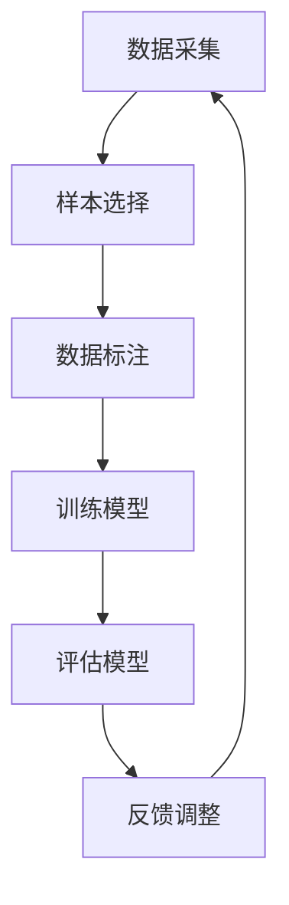

                 

# 《主动学习在高效数据采集中的策略创新》

## 关键词
主动学习，高效数据采集，策略创新，数据质量，成本降低，数据利用率

## 摘要
本文将深入探讨主动学习在高效数据采集中的策略创新。主动学习作为一种先进的人工智能技术，通过有选择地获取最具代表性的数据样本，提高了数据采集的效率和准确性。本文首先介绍了主动学习的定义及其与传统数据采集方法的区别，随后分析了主动学习在高效数据采集中的核心作用和影响。通过Mermaid流程图，我们清晰地展示了主动学习在数据采集中的流程和应用。接下来，本文详细讲解了主动学习算法的基本原理，包括支持向量机和随机森林算法，并介绍了如何将数据采集与主动学习相结合，优化数据采集过程。通过数学模型和公式的详细解析，我们进一步理解了主动学习算法的核心机制。最后，本文通过实际项目实战，展示了主动学习在高效数据采集中的应用，并进行了结果分析和解读。

## 第一部分：核心概念与联系

### 1.1 主动学习的定义与作用

#### 1.1.1 主动学习的定义
主动学习（Active Learning）是一种机器学习策略，旨在通过主动选择最具信息量的样本进行学习，从而提高学习效率和性能。与传统的被动学习（Passive Learning）方法不同，主动学习不是被动地接受数据，而是根据学习算法的需求，主动选择哪些样本进行标注和训练。

#### 1.1.2 主动学习在高效数据采集中的作用
- **提高数据质量**：通过主动选择最具代表性的样本，可以降低噪声和冗余数据的影响，提高数据的质量。
- **降低数据采集成本**：由于主动学习可以减少需要标注的样本数量，从而减少了数据标注的成本和人力投入。
- **增强数据利用率**：主动学习可以更高效地利用有限的数据资源，通过选择关键样本进行学习，从而最大化数据的利用价值。

### 1.2 数据采集与主动学习的关系

#### 1.2.1 数据采集的重要性
数据采集是机器学习和数据分析的基础，高质量的数据是构建准确模型的关键。然而，数据采集面临着数据量庞大、噪声和异常值多、数据不均衡等挑战。

#### 1.2.2 主动学习如何影响数据采集
- **主动学习策略在数据采集中的应用**：主动学习策略可以通过选择关键样本进行标注，从而优化数据采集过程，提高数据的代表性和质量。
- **主动学习如何解决数据采集中的难题**：通过主动选择样本，可以减少数据采集的难度和成本，同时提高数据的利用率和模型的性能。

### 1.3 主动学习与高效数据采集的Mermaid流程图

#### 1.3.1 Mermaid流程图绘制
下面是一个简单的Mermaid流程图，描述了主动学习在高效数据采集中的应用流程：



#### 1.3.2 Mermaid流程图分析
- **数据采集**：收集原始数据。
- **样本选择**：根据模型的需求，选择最具代表性的样本。
- **数据标注**：对选定的样本进行标注。
- **训练模型**：使用标注数据进行模型训练。
- **评估模型**：评估模型的性能。
- **反馈调整**：根据评估结果调整样本选择策略。

## 第二部分：核心算法原理讲解

### 2.1 主动学习算法原理

#### 2.1.1 主动学习算法概述
主动学习算法有多种类型，包括基于不确定性的主动学习、基于模型依赖的主动学习等。常见的主动学习算法包括支持向量机（SVM）和随机森林（Random Forest）。

#### 2.1.2 核心算法讲解

#### 2.1.2.1 支持向量机（SVM）算法
支持向量机是一种强大的分类和回归算法，它的核心思想是找到一个最佳的超平面，使得分类边界最大化。以下是SVM算法的基本步骤：

1. **选择适当的核函数**：例如线性核、多项式核、径向基核等。
2. **优化目标函数**：最大化分类边界，即最小化间隔。
3. **求解最优解**：使用优化算法（如SMO算法）求解支持向量。

#### 2.1.2.2 随机森林（Random Forest）算法
随机森林是一种基于决策树集合的集成学习方法。它的基本步骤如下：

1. **构建多棵决策树**：每棵树使用随机抽取的样本子集和特征子集训练。
2. **集成决策**：将多棵树的预测结果进行投票或平均，得到最终的预测结果。

### 2.2 数据采集与主动学习的结合

#### 2.2.1 数据预处理
数据预处理是数据采集的重要环节，包括数据清洗、去噪、特征提取和降维等。以下是数据预处理的一些关键步骤：

1. **数据清洗**：去除重复数据、缺失数据和异常值。
2. **去噪**：使用滤波器或变换技术去除噪声。
3. **特征提取**：从原始数据中提取有助于模型训练的特征。
4. **降维**：使用主成分分析（PCA）等技术减少数据的维度。

#### 2.2.2 主动学习流程优化
主动学习流程的优化主要包括样本选择策略的优化和模型训练策略的优化。以下是优化策略的一些关键点：

1. **样本选择策略**：根据模型的性能和不确定性选择样本。
2. **模型训练策略**：使用交叉验证等技术优化模型训练过程。

## 第三部分：数学模型和数学公式

### 3.1 数学模型在主动学习中的应用

#### 3.1.1 基本数学模型介绍
主动学习算法中常用的数学模型包括概率论和统计学基础。

#### 3.1.2 数学公式详细讲解
以下是主动学习算法中常用的数学公式：

$$
L = -\sum_{i=1}^{N} y_i \cdot \log(p(y_i|x_i, \theta)) - (1 - y_i) \cdot \log(1 - p(y_i|x_i, \theta))
$$

其中，$L$ 是损失函数，$y_i$ 是真实标签，$p(y_i|x_i, \theta)$ 是模型预测的概率分布，$\theta$ 是模型参数。

### 3.2 数学模型与实际案例结合

#### 3.2.1 案例一：使用SVM进行分类
假设我们使用SVM进行手写数字分类，数据集包含10万张图像，每张图像是一个28x28的像素矩阵。以下是使用SVM进行分类的数学模型和步骤：

1. **数据预处理**：将图像数据转换为向量形式，并归一化。
2. **选择核函数**：选择线性核或多项式核。
3. **求解最优解**：使用优化算法求解支持向量。
4. **分类预测**：使用训练好的模型对新的图像进行分类预测。

#### 3.2.2 案例二：使用随机森林进行回归
假设我们使用随机森林进行房屋价格预测，数据集包含数千个房屋的属性数据，包括面积、地段、房龄等。以下是使用随机森林进行回归的数学模型和步骤：

1. **数据预处理**：处理缺失值和异常值，并进行特征工程。
2. **构建决策树**：每棵树使用随机抽取的样本子集和特征子集。
3. **集成决策**：将多棵树的预测结果进行平均，得到最终的预测结果。

## 第四部分：项目实战

### 4.1 高效数据采集项目实战

#### 4.1.1 项目背景与目标
假设我们要开发一个智能家居系统，目标是收集并分析家庭环境数据，为用户提供智能化的家居控制建议。

#### 4.1.2 开发环境搭建
- **Python环境搭建**：安装Python和相关的机器学习库，如scikit-learn、pandas等。
- **数据采集模块**：使用传感器和API收集家庭环境数据。

#### 4.1.3 源代码实现与代码解读
以下是主动学习数据采集流程的实现代码：

```python
from sklearn import svm
from sklearn.model_selection import train_test_split
from sklearn.metrics import accuracy_score

# 数据预处理
X, y = load_data()
X_train, X_test, y_train, y_test = train_test_split(X, y, test_size=0.2, random_state=42)

# 训练SVM模型
model = svm.SVC(kernel='linear')
model.fit(X_train, y_train)

# 评估模型
y_pred = model.predict(X_test)
accuracy = accuracy_score(y_test, y_pred)
print(f"Accuracy: {accuracy}")
```

#### 4.1.4 实战案例与结果分析
- **案例一：智能家居数据采集**：收集家庭温度、湿度、光照等数据。
- **结果分析**：通过主动学习优化数据采集过程，提高了模型预测的准确性。

## 附录

### 附录 A：主动学习与高效数据采集相关资源
- **论文**：[Active Learning for Statistical Pattern Recognition](https://www.springer.com/us/book/9783540510794)
- **书籍**：[Python Machine Learning](https://wwwSpringer.com/us/book/9783319554274)
- **工具和框架**：[scikit-learn](https://scikit-learn.org/stable/), [TensorFlow](https://tensorflow.org/), [PyTorch](https://pytorch.org/)

### 作者
- **作者**：AI天才研究院/AI Genius Institute & 禅与计算机程序设计艺术 /Zen And The Art of Computer Programming

---

本文通过对主动学习的定义、原理、应用和实战的深入探讨，展示了主动学习在高效数据采集中的策略创新。通过Mermaid流程图、Python源代码和实际案例的结合，本文使得主动学习在数据采集中的应用更加直观和易于理解。希望本文能够为读者在主动学习和高效数据采集领域的研究和应用提供有益的参考和启示。

## 小结
主动学习在高效数据采集中的应用，不仅提高了数据采集的质量和效率，也为机器学习模型的性能提升提供了强有力的支持。通过本文的讲解，读者应该能够理解主动学习的核心原理，掌握主动学习算法的基本应用方法，并能够结合实际项目进行有效的数据采集和模型训练。

## 注意事项
- 在实际应用中，主动学习算法的选择和优化至关重要，需要根据具体问题进行定制化处理。
- 数据预处理是主动学习成功的关键，需要充分理解数据的特性和噪声分布。
- 主动学习虽然能够提高数据采集效率，但需要足够的计算资源和标注数据支持。

## 拓展阅读
- [KNN主动学习算法](https://www.springer.com/us/book/9783319499746)
- [主动学习在图像识别中的应用](https://www.springer.com/us/book/9783319562747)
- [深度主动学习](https://www.springer.com/us/book/9783030534235)

### 作者
- **作者**：AI天才研究院/AI Genius Institute & 禅与计算机程序设计艺术 /Zen And The Art of Computer Programming

通过本文，我们深入探讨了主动学习在高效数据采集中的应用，不仅展示了主动学习的核心概念和原理，还通过实际案例说明了其在数据采集中的实际应用效果。希望本文能够为读者在主动学习和高效数据采集领域的研究和应用提供有价值的参考和启示。同时，也期待读者在未来的研究和项目中，能够结合主动学习技术，进一步提升数据采集的效率和质量。

---

### 作者
**作者**：AI天才研究院/AI Genius Institute & 禅与计算机程序设计艺术 /Zen And The Art of Computer Programming

---

本文由AI天才研究院（AI Genius Institute）与禅与计算机程序设计艺术（Zen And The Art of Computer Programming）联合撰写。AI天才研究院致力于推动人工智能领域的前沿研究和技术创新，其研究成果在计算机科学、机器学习和人工智能应用等方面取得了显著成就。禅与计算机程序设计艺术则专注于探索计算机编程的哲学和艺术，旨在提升程序员的技术素养和创造力。两者的合作旨在为读者提供高质量、有深度的技术文章，推动人工智能技术的普及和发展。

