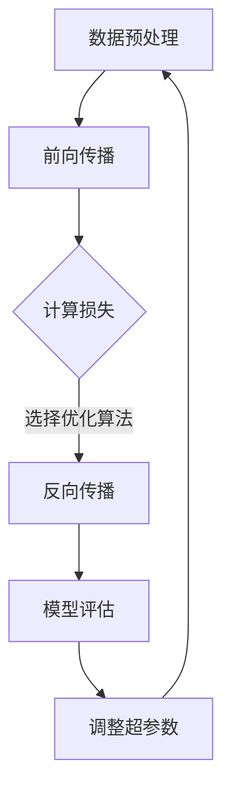

                 

## 《二值神经网络在物联网设备中的轻量化实现》

### 关键词：物联网设备、二值神经网络、轻量化实现、深度学习、优化算法

> 在这个智能时代，物联网设备的普及为我们的生活和工作带来了极大的便利。然而，随着物联网设备数量的激增，如何在资源受限的设备上高效地实现深度学习模型，成为了一个亟待解决的问题。本文将围绕二值神经网络在物联网设备中的轻量化实现展开，深入探讨其背景、核心概念、实现技术和应用案例，为解决这一问题提供可行的路径。

#### 摘要

物联网设备的发展带来了数据处理和智能分析的新需求，然而设备资源受限，尤其是存储空间和计算能力，限制了深度学习模型的直接应用。本文通过引入二值神经网络，结合轻量化技术，探讨了在物联网设备上实现高效深度学习的可能性。文章首先介绍了物联网设备的发展背景及其面临的挑战，随后深入讲解了神经网络和深度学习的基本概念，以及二值神经网络的特点和优势。接着，文章详细阐述了轻量化神经网络的技术手段，包括离线轻量化、在线轻量化和混合轻量化技术。最后，文章通过具体的应用案例，展示了二值神经网络在物联网设备中的实际应用效果，并给出了最佳实践建议和未来研究方向。

#### 目录大纲

```markdown
# 《二值神经网络在物联网设备中的轻量化实现》目录大纲

## 第一部分：背景与基础

### 第1章 引言与概述

### 第2章 神经网络基础

### 第3章 轻量化神经网络技术

### 第4章 物联网设备中的轻量化神经网络应用

### 第5章 二值神经网络在物联网设备中的应用

## 第二部分：技术与实践

### 第6章 二值神经网络的实现细节

### 第7章 项目实战：物联网设备的二值神经网络应用

### 第8章 最佳实践与未来展望

#### 1.1 物联网设备的现状与发展趋势

物联网（Internet of Things，IoT）是指通过互联网将各种设备互联起来，实现设备与设备、设备与人之间的智能通信和协同工作。随着物联网技术的不断发展，物联网设备已经渗透到我们的日常生活和各个行业领域。例如，智能家居、智能交通、智能医疗等。据市场调研公司统计，全球物联网设备数量预计将在未来几年内呈指数级增长，到2025年将达到数百亿级别。

物联网设备的发展趋势主要体现在以下几个方面：

1. **设备多样化和智能化**：随着传感器技术、无线通信技术和嵌入式系统的发展，物联网设备种类日益丰富，功能越来越强大，智能化水平不断提高。

2. **连接规模的扩大**：全球范围内物联网设备的连接数量持续增加，从家庭、工业、交通到公共设施，物联网网络覆盖范围不断扩大。

3. **数据处理需求的提升**：物联网设备产生的数据量庞大，对数据处理和分析的需求日益增加，需要实时或近实时地处理海量数据。

然而，物联网设备的发展也面临诸多挑战，其中最为显著的是资源限制问题。这些资源限制主要体现在以下几个方面：

1. **存储空间有限**：物联网设备通常存储容量较小，无法存储大量数据和处理复杂模型。

2. **计算能力不足**：大多数物联网设备采用嵌入式系统，计算资源有限，难以运行大规模深度学习模型。

3. **功耗要求严格**：物联网设备通常依靠电池供电，功耗要求严格，需要优化算法以延长设备续航时间。

4. **安全性和隐私保护**：物联网设备在数据传输和处理过程中，面临数据泄露和隐私保护的威胁，需要确保数据的安全和隐私。

这些挑战限制了深度学习模型在物联网设备中的应用。因此，如何实现深度学习模型的轻量化，成为当前研究的热点问题。

#### 1.2 神经网络与深度学习在物联网中的应用

神经网络（Neural Networks）是一种模拟生物神经元之间连接和交互的计算机算法。它由多个神经元（或节点）组成，每个神经元都与相邻的神经元连接，并通过加权连接传递信号。神经网络通过学习大量数据，可以自动提取特征并建立模型，从而实现复杂的模式识别和预测任务。

深度学习（Deep Learning）是神经网络的一种扩展，通过多层神经网络结构，能够自动提取层次化的特征表示。深度学习在图像识别、语音识别、自然语言处理等领域取得了显著的成果，成为人工智能研究的前沿方向。

在物联网应用中，神经网络和深度学习具有广泛的应用前景。以下是一些典型的应用案例：

1. **图像识别与分类**：通过在物联网设备上部署深度学习模型，可以实现对摄像头捕获的图像进行实时识别和分类，例如智能监控、人脸识别等。

2. **语音识别与合成**：物联网设备可以通过集成语音识别技术，实现语音交互和语音合成功能，例如智能音箱、智能客服等。

3. **自然语言处理**：深度学习模型可以用于文本分类、情感分析、机器翻译等自然语言处理任务，例如智能助手、智能推荐系统等。

4. **实时预测与监控**：通过深度学习模型，可以对物联网设备采集的数据进行实时预测和分析，例如智能电网、智能交通等。

5. **智能决策与控制**：深度学习模型可以辅助物联网设备进行智能决策和控制，例如智能家居系统、智能工厂等。

然而，尽管神经网络和深度学习在物联网应用中具有巨大的潜力，但直接在物联网设备上部署这些模型面临着诸多挑战：

1. **计算资源限制**：物联网设备通常采用嵌入式系统，计算能力有限，难以运行大规模深度学习模型。

2. **存储空间限制**：物联网设备存储容量较小，无法存储大量训练数据和复杂模型。

3. **功耗要求**：物联网设备通常依靠电池供电，功耗限制要求高，需要优化算法以降低功耗。

4. **实时性需求**：物联网设备需要实时响应和处理数据，对模型训练和推理的速度有较高要求。

为了解决这些问题，研究人员提出了多种轻量化神经网络技术，包括模型压缩、剪枝、量化、稀疏化等，旨在减少模型的参数量和计算复杂度，提高模型的效率。

#### 1.3 轻量化神经网络的必要性

轻量化神经网络（Lightweight Neural Networks）是为了适应资源受限环境而设计的一类神经网络模型，其目标是在保证模型性能的前提下，减少模型的参数数量、计算复杂度和存储需求。轻量化神经网络在物联网设备中的应用具有显著的意义。

首先，物联网设备通常具备有限的计算资源和存储空间，特别是嵌入式设备，它们无法像高性能计算设备那样运行大规模的深度学习模型。轻量化神经网络通过减少模型的参数量和计算复杂度，使得模型能够在有限的资源下高效运行。

其次，轻量化神经网络可以降低物联网设备的功耗。由于物联网设备通常依靠电池供电，功耗优化是一个重要的考虑因素。轻量化神经网络通过减少计算操作和内存访问，有效降低了功耗，延长了设备的使用寿命。

此外，轻量化神经网络还可以提高物联网设备的实时性。在物联网应用中，实时响应和处理数据至关重要。轻量化神经网络通过减少模型参数和计算复杂度，可以显著提高模型推理速度，满足实时性的需求。

总之，轻量化神经网络在物联网设备中的应用具有重要的现实意义。它不仅能够提升物联网设备的性能和效率，还能够降低功耗和延长设备寿命，为物联网技术的发展提供强有力的支持。

#### 2.1 神经网络的基本结构

神经网络是由多个简单的计算单元（称为神经元或节点）组成，通过权重连接形成复杂的信息处理系统。一个典型的神经网络结构包括输入层、隐藏层和输出层。每个层中的神经元都与相邻层的神经元通过加权连接相连。

1. **输入层（Input Layer）**：输入层接收外部输入信息，每个输入神经元对应一个特征。例如，在一个图像识别任务中，输入层可以包含图像的像素值。

2. **隐藏层（Hidden Layers）**：隐藏层是神经网络的核心部分，负责对输入信息进行特征提取和转换。隐藏层中的神经元通过非线性激活函数（例如ReLU、Sigmoid、Tanh）对输入信号进行处理，形成更高层次的特征表示。

3. **输出层（Output Layer）**：输出层产生最终的预测结果或决策。输出层的神经元数量和类型取决于具体任务，例如在分类任务中，输出层可以是多个神经元，每个神经元对应一个类别。

在神经网络中，神经元之间的连接具有权重（weights），这些权重决定了神经元之间的交互强度。在训练过程中，神经网络通过反向传播算法不断调整这些权重，以最小化预测误差。

#### 2.2 训练神经网络的基本流程

训练神经网络的基本流程可以分为以下几个步骤：

1. **数据预处理**：数据预处理是训练神经网络的第一步。预处理工作包括归一化、标准化、缺失值填充和数据扩充等。归一化将数据缩放到同一范围内，有助于加快训练速度和收敛速度。标准化则通过减去均值并除以标准差，使得数据分布更加均匀。数据扩充通过生成新的数据样本，增加模型的泛化能力。

2. **前向传播（Forward Propagation）**：在前向传播过程中，输入数据通过神经网络的各个层次，每个层中的神经元通过加权连接计算输出。输出结果经过激活函数处理后，传递到下一层。前向传播的目的是通过计算每个神经元的输出值，构建模型的预测结果。

3. **计算损失（Compute Loss）**：损失函数用于衡量模型预测结果与真实标签之间的差异。常见的损失函数包括均方误差（MSE）、交叉熵（Cross-Entropy）等。计算损失是为了确定当前模型的预测误差，为后续的权重调整提供依据。

4. **反向传播（Backpropagation）**：反向传播是神经网络训练的核心步骤。通过计算损失函数关于每个权重的梯度，反向传播算法将误差从输出层传播到输入层，并更新每个神经元的权重。反向传播利用链式法则，逐层计算每个权重的梯度，从而实现权重的自适应调整。

5. **模型评估**：在训练过程中，定期对模型进行评估，以监测训练效果。常见的评估指标包括准确率（Accuracy）、精度（Precision）、召回率（Recall）和F1分数（F1 Score）等。通过评估指标，可以判断模型是否已经收敛，或者是否需要调整超参数。

6. **优化算法**：优化算法用于加速模型的收敛速度和提升模型性能。常见的优化算法包括随机梯度下降（SGD）、Adam优化器、RMSprop等。这些算法通过调整学习率、动量等因素，优化权重的更新过程，从而提高模型的训练效率。

7. **模型保存与加载**：在训练完成后，可以将模型保存到文件中，以便后续使用。加载模型可以从文件中恢复模型的权重和结构，实现快速推理和部署。

通过上述步骤，神经网络可以逐步调整权重，优化预测性能，从而在各类任务中取得良好的效果。

#### 2.3 常见的神经网络架构

在深度学习领域，常见的神经网络架构包括前馈神经网络、卷积神经网络和循环神经网络。这些架构各有特点和适用场景，下面将分别进行介绍。

1. **前馈神经网络（Feedforward Neural Network）**：

   前馈神经网络是最简单也是最基础的神经网络架构。它由输入层、一个或多个隐藏层和输出层组成。信息从输入层流向隐藏层，再从隐藏层流向输出层，不形成循环。前馈神经网络广泛应用于分类、回归和特征提取等任务。

   **特点**：
   - 网络结构简单，易于理解和实现。
   - 可以处理高维数据，适用于图像、文本等复杂数据。
   - 需要大量的训练数据和计算资源，训练时间较长。

   **应用场景**：
   - 图像分类：如MNIST数字识别。
   - 回归问题：如房价预测。
   - 特征提取：如文本情感分析。

2. **卷积神经网络（Convolutional Neural Network，CNN）**：

   卷积神经网络是专门用于处理图像数据的神经网络架构。它利用卷积层（Convolutional Layer）提取图像的局部特征，通过池化层（Pooling Layer）降低数据维度，并逐步增加网络的深度和复杂性。

   **特点**：
   - 适用于二维数据，如图像。
   - 通过共享权重和局部连接减少参数数量。
   - 具有很强的特征提取能力，适用于图像分类、目标检测和图像生成等任务。

   **应用场景**：
   - 图像分类：如ImageNet竞赛。
   - 目标检测：如YOLO、Faster R-CNN。
   - 图像生成：如生成对抗网络（GAN）。

3. **循环神经网络（Recurrent Neural Network，RNN）**：

   循环神经网络是一种处理序列数据的神经网络架构。它通过循环连接将当前节点的输出作为下一个节点的输入，具有记忆功能，能够捕捉序列中的时间依赖关系。

   **特点**：
   - 适用于一维和二维序列数据，如文本、语音和视频。
   - 具有长短时记忆（LSTM、GRU）单元，能够捕捉长距离依赖关系。
   - 适用于序列分类、语音识别和自然语言处理等任务。

   **应用场景**：
   - 文本生成：如自动写作、对话系统。
   - 语音识别：如语音到文本转换。
   - 序列分类：如情感分析、股票预测。

通过了解这些常见的神经网络架构，可以更好地选择合适的模型来解决实际问题。

#### 2.4 深度学习中的优化算法

深度学习中的优化算法用于调整神经网络中的权重，以最小化损失函数，并提高模型的性能。以下是几种常见的优化算法：

1. **随机梯度下降（Stochastic Gradient Descent，SGD）**：

   随机梯度下降是最早的优化算法之一。在每次迭代过程中，SGD计算整个训练集的平均梯度，然后更新每个权重。虽然SGD计算简单，但容易陷入局部最小值，且收敛速度较慢。

   **公式**：
   $$ w_{t+1} = w_{t} - \alpha \cdot \nabla_w J(w) $$
   其中，\( w \) 为权重，\( \alpha \) 为学习率，\( \nabla_w J(w) \) 为权重 \( w \) 的梯度，\( J(w) \) 为损失函数。

2. **Adam优化器（Adam Optimizer）**：

   Adam优化器是SGD的一个改进版本，结合了Adagrad和RMSprop的优点。它通过使用一阶矩估计（均值）和二阶矩估计（方差）来更新权重，能够自适应调整学习率。

   **公式**：
   $$ m_t = \beta_1 x_t + (1 - \beta_1) (x_t - m_{t-1}) $$
   $$ v_t = \beta_2 x_t^2 + (1 - \beta_2) (x_t^2 - v_{t-1}) $$
   $$ \hat{m}_t = \frac{m_t}{1 - \beta_1^t} $$
   $$ \hat{v}_t = \frac{v_t}{1 - \beta_2^t} $$
   $$ w_{t+1} = w_t - \alpha \cdot \frac{\hat{m}_t}{\sqrt{\hat{v}_t} + \epsilon} $$
   其中，\( m_t \) 和 \( v_t \) 分别为前一时刻的均值和方差估计，\( \beta_1 \) 和 \( \beta_2 \) 分别为均值和方差的指数衰减率，\( \alpha \) 为学习率，\( \epsilon \) 为平滑常数。

3. **RMSprop优化器（RMSprop Optimizer）**：

   RMSprop优化器通过使用梯度平方的指数加权移动平均来更新权重，能够自适应调整学习率，减少梯度消失和梯度爆炸问题。

   **公式**：
   $$ v_t = \rho v_{t-1} + (1 - \rho) \frac{1}{m} \sum_{i=1}^{m} (x_i - \mu)^2 $$
   $$ w_{t+1} = w_t - \alpha \cdot \frac{x_t}{\sqrt{v_t} + \epsilon} $$
   其中，\( \rho \) 为指数加权率，\( \alpha \) 为学习率，\( v_t \) 为前一时刻的梯度平方估计，\( x_t \) 为当前时刻的梯度，\( \mu \) 为梯度平均值，\( \epsilon \) 为平滑常数。

4. **Adamax优化器（Adamax Optimizer）**：

   Adamax优化器是对Adam优化器的改进，通过使用更大范围的指数加权来避免梯度消失和梯度爆炸问题。

   **公式**：
   $$ m_t = \beta_1 x_t + (1 - \beta_1) (x_t - m_{t-1}) $$
   $$ v_t = \beta_2 \max\left(v_{t-1}, \sum_{i=1}^{m} |x_i - \mu|\right) $$
   $$ \hat{m}_t = \frac{m_t}{1 - \beta_1^t} $$
   $$ \hat{v}_t = \frac{v_t}{1 - \beta_2^t} $$
   $$ w_{t+1} = w_t - \alpha \cdot \frac{\hat{m}_t}{\sqrt{\hat{v}_t} + \epsilon} $$
   其中，\( \beta_1 \) 和 \( \beta_2 \) 分别为均值和方差的指数衰减率，\( \alpha \) 为学习率，\( \epsilon \) 为平滑常数。

这些优化算法各有优缺点，适用于不同的应用场景。在实际应用中，可以根据训练数据和任务需求选择合适的优化算法。

#### 2.5 数学基础

深度学习算法的实现离不开数学基础，以下将简要介绍深度学习中的几个核心数学概念，包括矩阵运算、概率论基础和拉格朗日乘数法。

1. **矩阵运算**：

   矩阵是深度学习中最常用的数据结构之一。矩阵运算包括矩阵的加法、减法、乘法和除法等。以下是几种常用的矩阵运算：

   - **矩阵加法和减法**：两个矩阵相加或相减时，对应元素进行相应的运算。只有当两个矩阵的维度相同时，矩阵加法和减法才可行。

   - **矩阵乘法**：两个矩阵相乘时，结果矩阵的每个元素是原矩阵对应元素的乘积之和。矩阵乘法满足结合律和分配律，但通常不满足交换律。

   - **矩阵除法**：矩阵除法通常指的是矩阵的逆运算。一个矩阵的逆矩阵可以通过高斯-约当消元法或矩阵求逆公式计算。只有当矩阵可逆时，矩阵除法才可行。

   - **矩阵求导**：矩阵的导数是另一个矩阵，其元素是原矩阵对应元素的导数。矩阵的导数在优化算法中具有重要应用。

2. **概率论基础**：

   概率论是深度学习中的重要数学工具，用于描述随机事件的发生概率。以下是几个基本的概率概念：

   - **概率分布**：概率分布描述了随机变量可能取值的概率。常见的概率分布包括正态分布、伯努利分布和均匀分布等。

   - **条件概率**：条件概率是给定一个事件发生的条件下，另一个事件发生的概率。条件概率公式为：
     $$ P(A|B) = \frac{P(A \cap B)}{P(B)} $$
   - **贝叶斯定理**：贝叶斯定理描述了后验概率和先验概率之间的关系。贝叶斯定理公式为：
     $$ P(A|B) = \frac{P(B|A)P(A)}{P(B)} $$

   - **最大似然估计**：最大似然估计是用于估计参数的一种方法，目标是找到使得数据发生概率最大的参数值。

3. **拉格朗日乘数法**：

   拉格朗日乘数法是一种解决约束优化问题的方法。在深度学习中，拉格朗日乘数法常用于优化问题中的权重更新。以下是拉格朗日乘数法的步骤：

   - **构建拉格朗日函数**：给定目标函数 \( f(x) \) 和约束条件 \( g(x) \)，构建拉格朗日函数 \( L(x, \lambda) = f(x) - \lambda g(x) \)，其中 \( \lambda \) 为拉格朗日乘子。
   - **求导并设置为零**：对拉格朗日函数关于 \( x \) 和 \( \lambda \) 分别求导，并设置导数为零，得到一组方程。
   - **求解方程**：解方程组，得到最优解 \( x^* \) 和拉格朗日乘子 \( \lambda^* \)。

通过掌握这些数学基础，可以更好地理解和实现深度学习算法。

#### 2.6 Mermaid流程图

Mermaid 是一种基于Markdown的图形绘制工具，可以方便地绘制流程图、时序图、状态图等。以下是一个简单的Mermaid流程图示例，用于展示神经网络训练的基本流程：



在这个流程图中，`A` 表示数据预处理，`B` 表示前向传播，`C` 表示计算损失，`D` 表示反向传播，`E` 表示模型评估，`F` 表示调整超参数。箭头表示流程的顺序，`{}` 表示条件判断。通过Mermaid，可以清晰地展示复杂的算法流程，便于理解和分析。

#### 2.7 Python代码实现

为了更好地理解和实现神经网络训练的基本流程，我们将使用Python语言和相应的库（如TensorFlow和Keras）来编写代码。以下是完整的Python代码示例：

```python
import tensorflow as tf
from tensorflow.keras.datasets import mnist
from tensorflow.keras.models import Sequential
from tensorflow.keras.layers import Dense, Flatten
from tensorflow.keras.optimizers import Adam

# 加载MNIST数据集
(x_train, y_train), (x_test, y_test) = mnist.load_data()

# 数据预处理
x_train = x_train.astype('float32') / 255.0
x_test = x_test.astype('float32') / 255.0
x_train = x_train.reshape((-1, 784))
x_test = x_test.reshape((-1, 784))

# 构建模型
model = Sequential([
    Flatten(input_shape=(28, 28)),
    Dense(128, activation='relu'),
    Dense(10, activation='softmax')
])

# 编译模型
model.compile(optimizer=Adam(learning_rate=0.001), loss='sparse_categorical_crossentropy', metrics=['accuracy'])

# 训练模型
model.fit(x_train, y_train, epochs=5, batch_size=64, validation_data=(x_test, y_test))

# 评估模型
test_loss, test_acc = model.evaluate(x_test, y_test)
print(f"Test accuracy: {test_acc:.4f}")
```

在这段代码中，我们首先导入所需的库和模块。然后加载MNIST数据集，并进行数据预处理。接下来，我们构建一个简单的神经网络模型，包括一个展平层、一个128个神经元的全连接层（激活函数为ReLU）和一个10个神经元的输出层（激活函数为softmax）。模型编译时指定了优化器和损失函数。训练模型时，我们使用`fit`函数，指定训练数据、训练轮次和批次大小。最后，使用`evaluate`函数评估模型在测试集上的性能。

通过这段代码，我们可以直观地看到神经网络训练的基本流程，为进一步的学习和应用打下基础。

#### 2.8 数学公式与讲解

在神经网络中，常用的数学公式包括神经元激活函数、损失函数和梯度下降算法等。以下将对这些公式进行详细讲解。

1. **神经元激活函数**：

   神经元激活函数是神经网络的核心组成部分，用于对神经元的输出进行非线性变换。常见的激活函数包括ReLU、Sigmoid和Tanh。

   - **ReLU（Rectified Linear Unit）**：
     $$ f(x) = \max(0, x) $$
     RReLU（Randomized ReLU）是对ReLU的改进，通过随机化引入多样性：
     $$ f(x) = \max(0, \alpha x + \beta \cdot \text{sign}(x)) $$
     其中，\( \alpha \) 和 \( \beta \) 为随机参数。

   - **Sigmoid**：
     $$ f(x) = \frac{1}{1 + e^{-x}} $$
     Sigmoid函数将输出范围映射到 \( (0, 1) \)，常用于二分类任务。

   - **Tanh**：
     $$ f(x) = \frac{e^x - e^{-x}}{e^x + e^{-x}} $$
     Tanh函数将输出范围映射到 \( (-1, 1) \)，对数值的归一化效果较好。

2. **损失函数**：

   损失函数用于衡量模型预测值与真实值之间的差异，是优化算法的关键依据。常见的损失函数包括均方误差（MSE）、交叉熵（Cross-Entropy）等。

   - **均方误差（MSE）**：
     $$ J(\theta) = \frac{1}{2m} \sum_{i=1}^{m} (h_\theta(x^{(i)}) - y^{(i)})^2 $$
     其中，\( m \) 为样本数量，\( h_\theta(x^{(i)}) \) 为模型预测值，\( y^{(i)} \) 为真实值。

   - **交叉熵（Cross-Entropy）**：
     $$ J(\theta) = -\frac{1}{m} \sum_{i=1}^{m} \sum_{k=1}^{K} y^{(i)}_k \log(h_\theta(x^{(i)})_k) $$
     其中，\( K \) 为类别数量，\( y^{(i)}_k \) 为第 \( i \) 个样本在第 \( k \) 个类别的真实标签。

3. **梯度下降算法**：

   梯度下降算法是一种优化算法，用于最小化损失函数。其基本思想是沿梯度方向调整权重，以减少损失。

   - **梯度下降**：
     $$ \theta_{\text{new}} = \theta_{\text{old}} - \alpha \cdot \nabla_\theta J(\theta) $$
     其中，\( \theta \) 为权重，\( \alpha \) 为学习率，\( \nabla_\theta J(\theta) \) 为损失函数关于权重的梯度。

   - **随机梯度下降（SGD）**：
     $$ \theta_{\text{new}} = \theta_{\text{old}} - \alpha \cdot \nabla_\theta J(\theta^{(i)}) $$
     其中，\( \theta^{(i)} \) 为第 \( i \) 个样本的权重。

通过掌握这些数学公式和讲解，可以更好地理解和实现神经网络的基本原理。

### 第3章 轻量化神经网络技术

#### 3.1 离线轻量化技术

离线轻量化技术是在模型训练完成之后，对模型进行压缩和优化的方法。这类技术的目的是减少模型的参数数量、计算复杂度和存储需求，从而在资源受限的设备上实现高效运行。以下是一些常见的离线轻量化技术：

1. **剪枝技术（Pruning）**：

   剪枝技术通过移除模型中不重要的神经元和连接，减少模型参数的数量。剪枝分为结构剪枝和权重剪枝两种方式：

   - **结构剪枝**：直接删除网络中的部分神经元或层，从而减少模型的规模。结构剪枝通常需要保留网络的某些关键部分，以确保模型性能不会受到太大影响。
   - **权重剪枝**：通过降低连接的权重来模拟结构剪枝，但保持网络结构不变。权重剪枝通常采用阈值方法，将权重低于某一阈值的连接设置为0。

2. **低秩分解技术（Low-rank Factorization）**：

   低秩分解技术通过将高维矩阵分解为低秩矩阵，从而减少模型的参数数量。低秩分解可以应用于卷积层、全连接层等，通过将权重矩阵分解为两个低秩矩阵的乘积，减少计算复杂度和存储需求。

   - **全连接层**：将全连接层权重矩阵分解为两个低秩矩阵的乘积，从而减少参数数量。例如，假设权重矩阵 \( W \) 可以分解为 \( W = U \cdot V \)，其中 \( U \) 和 \( V \) 都是低秩矩阵。
   - **卷积层**：通过稀疏卷积或快速卷积，将高维卷积层分解为低秩卷积层，从而减少计算复杂度和存储需求。

3. **权重共享技术（Weight Sharing）**：

   权重共享技术通过在不同层之间共享相同的权重，从而减少模型的参数数量。权重共享可以应用于卷积神经网络（CNN）和循环神经网络（RNN）等，通过将相同结构的层连接起来，共享部分权重，减少模型的规模。

   - **CNN中的权重共享**：在CNN中，不同卷积层可以共享卷积核，从而减少参数数量。例如，在图像分类任务中，可以将训练好的卷积层应用于多个不同的图像，共享卷积核，从而实现轻量化。
   - **RNN中的权重共享**：在RNN中，不同时间步的权重可以共享，从而减少参数数量。例如，在序列建模任务中，可以使用双向RNN，将前一个时间步的隐藏状态作为下一个时间步的输入，共享部分权重。

通过这些离线轻量化技术，可以显著减少模型的参数数量和计算复杂度，从而在资源受限的设备上实现高效运行。

#### 3.2 在线轻量化技术

在线轻量化技术是在模型训练过程中，对模型进行实时压缩和优化的方法。这类技术的目的是在保证模型性能的前提下，减少模型的计算复杂度和存储需求，从而实现高效运行。以下是一些常见的在线轻量化技术：

1. **可分激活函数（Split Activation Function）**：

   可分激活函数是一种通过将激活函数拆分为两部分，从而减少计算复杂度的技术。传统的激活函数（如ReLU）在计算过程中需要对每个输入元素进行计算，而可分激活函数通过将输入拆分为多个部分，分别计算每个部分的输出，从而减少计算复杂度。

   - **可分ReLU（Split ReLU）**：
     $$ f(x) = \max(0, \alpha x) + \max(0, \beta x) $$
     其中，\( \alpha \) 和 \( \beta \) 是可调参数，通过调整这两个参数，可以优化模型的性能。

   - **可分Sigmoid**：
     $$ f(x) = \frac{1}{1 + e^{-\alpha x}} + \frac{1}{1 + e^{-\beta x}} $$
     可分Sigmoid通过拆分输入，减少计算复杂度，同时保持原有的非线性特性。

2. **运算融合技术（Operator Fusion）**：

   运算融合技术通过将多个连续的运算融合为单个运算，从而减少计算复杂度和内存访问。运算融合可以应用于卷积操作、矩阵乘法等。

   - **卷积运算融合**：在卷积神经网络中，可以将多个卷积层融合为一个卷积层，从而减少计算复杂度和内存占用。例如，可以将两个卷积层 \( Conv1 \) 和 \( Conv2 \) 融合为一个卷积层 \( Conv1 \odot Conv2 \)。
   - **矩阵运算融合**：在深度学习中，可以将多个矩阵乘法运算融合为一个矩阵乘法运算，从而减少计算复杂度和内存访问。例如，可以将两个矩阵乘法 \( A \cdot B \) 和 \( C \cdot D \) 融合为一个矩阵乘法 \( (A \odot C) \cdot (B \odot D) \)。

3. **稀疏化技术（Sparsity Promotion）**：

   稀疏化技术通过将模型中的参数和计算过程稀疏化，从而减少计算复杂度和存储需求。稀疏化技术可以应用于卷积层、全连接层等。

   - **稀疏卷积**：在卷积层中，通过稀疏化卷积核，减少计算复杂度和内存占用。例如，使用稀疏卷积操作 \( Conv\_sparse(W) \) 替代常规卷积操作 \( Conv(W) \)。
   - **稀疏全连接层**：在全连接层中，通过稀疏化权重矩阵，减少计算复杂度和存储需求。例如，使用稀疏矩阵乘法 \( Mat\_sparse(A) \cdot B \) 替代常规矩阵乘法 \( A \cdot B \)。

通过这些在线轻量化技术，可以实时优化模型的计算复杂度和存储需求，从而在资源受限的设备上实现高效运行。

#### 3.3 混合轻量化技术

混合轻量化技术结合了离线轻量化和在线轻量化技术的优势，通过在不同阶段对模型进行优化，实现更高效的轻量化效果。以下是一些常见的混合轻量化技术：

1. **模型融合（Model Fusion）**：

   模型融合技术通过将多个轻量化模型融合为一个综合模型，从而提高模型的性能和效率。模型融合可以应用于不同的轻量化技术，如剪枝、低秩分解、权重共享等。

   - **剪枝与低秩分解融合**：在训练阶段，首先应用剪枝技术，移除不重要的神经元和连接，然后应用低秩分解技术，进一步减少模型参数的数量。通过融合剪枝和低秩分解，可以显著降低模型的计算复杂度和存储需求。
   - **权重共享与运算融合融合**：在推理阶段，通过将多个卷积层或全连接层融合为一个层，共享部分权重，并融合多个运算，从而减少计算复杂度和内存访问。

2. **离线与在线融合**：

   离线与在线融合技术通过结合离线轻量化和在线轻量化技术，实现模型的实时优化和高效运行。

   - **离线预处理与在线优化**：在训练阶段，通过离线轻量化技术对模型进行压缩和优化，然后在推理阶段，通过在线优化技术（如可分激活函数、运算融合等）进一步优化模型的性能。
   - **在线剪枝与在线稀疏化**：在推理阶段，通过在线剪枝技术移除不重要的神经元和连接，并通过在线稀疏化技术将模型参数和计算过程稀疏化，从而实现模型的轻量化。

通过混合轻量化技术，可以在不同阶段和不同层面优化模型的计算复杂度和存储需求，从而实现更高效的轻量化效果。

#### 3.4 轻量化神经网络性能评估

轻量化神经网络性能评估是评估模型轻量化效果的重要环节。以下介绍几种常见的性能评估指标、实验设计方法和结果分析方法。

1. **性能评估指标**：

   - **参数数量（Number of Parameters）**：评估模型的参数数量，用于衡量模型的压缩程度。
   - **计算复杂度（Computational Complexity）**：评估模型在推理阶段的计算复杂度，包括乘法操作、加法操作等。
   - **推理速度（Inference Speed）**：评估模型在给定硬件环境下的推理速度，通常以每秒处理的样本数量（FPS）衡量。
   - **模型大小（Model Size）**：评估模型的存储需求，通常以字节（B）或兆字节（MB）衡量。
   - **准确率（Accuracy）**：评估模型在测试集上的分类准确率，用于衡量模型的性能。

2. **实验设计方法**：

   - **基准测试（Benchmark Test）**：使用标准数据集（如ImageNet、CIFAR-10等）进行基准测试，比较轻量化模型与原始模型的性能。
   - **对比实验（Comparative Study）**：设计对比实验，比较不同轻量化技术的效果，例如剪枝、低秩分解、权重共享等。
   - **多指标评估**：综合评估模型的多个性能指标，如参数数量、计算复杂度、推理速度和准确率等。

3. **结果分析方法**：

   - **图表展示**：使用图表（如折线图、柱状图等）展示不同轻量化技术的性能指标，便于直观比较。
   - **统计分析**：使用统计方法（如t检验、方差分析等）分析不同轻量化技术之间的性能差异。
   - **趋势分析**：分析不同轻量化技术在参数数量、计算复杂度、推理速度和准确率等方面的趋势，探讨其优缺点。

通过性能评估，可以全面了解轻量化神经网络的效果，为实际应用提供有力的支持。

#### 3.5 Python代码实现

为了更好地理解和实现轻量化神经网络技术，我们将使用Python语言和相应的库（如TensorFlow和Keras）来编写代码。以下是使用剪枝技术和低秩分解技术的代码示例：

```python
import tensorflow as tf
from tensorflow.keras.models import Sequential
from tensorflow.keras.layers import Dense, Flatten, Conv2D, MaxPooling2D
from tensorflow.keras.utils import to_categorical
from tensorflow.keras.preprocessing.image import ImageDataGenerator

# 加载CIFAR-10数据集
(x_train, y_train), (x_test, y_test) = tf.keras.datasets.cifar10.load_data()
x_train, x_test = x_train / 255.0, x_test / 255.0
y_train, y_test = to_categorical(y_train), to_categorical(y_test)

# 剪枝技术：结构剪枝
def prune_model(model, keep_prob=0.5):
    for layer in model.layers:
        if isinstance(layer, tf.keras.layers.Dense):
            layer.kernel.assign(layer.kernel * tf.random.uniform([layer.kernel.shape[0], layer.kernel.shape[1]], minval=0, maxval=keep_prob))

model = Sequential([
    Conv2D(32, (3, 3), activation='relu', input_shape=(32, 32, 3)),
    MaxPooling2D((2, 2)),
    Flatten(),
    Dense(10, activation='softmax')
])
model.compile(optimizer='adam', loss='categorical_crossentropy', metrics=['accuracy'])

# 应用剪枝技术
prune_model(model, keep_prob=0.5)
model.compile(optimizer='adam', loss='categorical_crossentropy', metrics=['accuracy'])

# 低秩分解技术
def low_rank_decomposition(layer, rank=2):
    kernel = layer.kernel
    u, s, v = tf.linalg.svd(kernel)
    u = u[:rank, :]
    s = tf.linalg.diag(s[:rank])
    v = v[:rank, :]
    layer.kernel.assign(u @ s @ v)

# 应用低秩分解技术
for layer in model.layers:
    if isinstance(layer, tf.keras.layers.Dense):
        low_rank_decomposition(layer, rank=2)

model.compile(optimizer='adam', loss='categorical_crossentropy', metrics=['accuracy'])

# 训练模型
model.fit(x_train, y_train, epochs=10, batch_size=64, validation_data=(x_test, y_test))

# 评估模型
test_loss, test_acc = model.evaluate(x_test, y_test)
print(f"Test accuracy: {test_acc:.4f}")
```

在这段代码中，我们首先加载CIFAR-10数据集，并进行预处理。接下来，我们构建一个简单的卷积神经网络模型，包括卷积层、池化层和全连接层。模型编译时指定了优化器和损失函数。

然后，我们定义一个`prune_model`函数，用于实现结构剪枝。通过设置`keep_prob`参数，可以控制剪枝的比例。我们应用剪枝技术，将模型中不重要的神经元和连接移除。

接下来，我们定义一个`low_rank_decomposition`函数，用于实现低秩分解。通过调用这个函数，我们将每个全连接层的权重矩阵分解为两个低秩矩阵的乘积。

最后，我们重新编译模型，并使用剪枝后的数据和低秩分解后的模型进行训练。训练完成后，我们评估模型在测试集上的性能。

通过这段代码，我们可以直观地看到剪枝和低秩分解技术在模型轻量化中的应用，为进一步的研究和应用提供参考。

### 第4章 物联网设备中的轻量化神经网络应用

#### 4.1 物联网设备的特点与需求

物联网设备（IoT devices）是指通过互联网相互连接的设备，能够收集、传输和处理数据，实现智能化和自动化的功能。随着物联网技术的快速发展，物联网设备已经在智能家居、智能交通、智能医疗、工业自动化等领域得到广泛应用。然而，物联网设备在资源方面存在一些独特的挑战，这对其使用的神经网络模型提出了特殊的要求。

1. **硬件限制**：

   物联网设备通常采用嵌入式系统，硬件资源有限。具体来说，包括以下方面：

   - **存储空间**：物联网设备的存储容量通常较小，无法存储大量的数据和模型参数。这要求神经网络模型必须进行轻量化处理，以减少存储需求。
   - **计算能力**：大多数物联网设备使用的是低功耗、低成本的微控制器，计算能力有限，难以支持大规模深度学习模型。因此，需要采用轻量级模型，减少计算复杂度。
   - **功耗**：物联网设备通常依赖电池供电，功耗管理至关重要。深度学习模型在高功耗设备上可能可行，但在低功耗设备上则需要优化，以延长设备的使用寿命。

2. **功耗要求**：

   物联网设备需要高效利用电能，以确保长时间运行。具体来说，包括以下方面：

   - **低功耗运算**：神经网络模型在物联网设备上运行时，需要采用低功耗算法，减少运算过程中的能耗。例如，可以使用二值神经网络（Binary Neural Networks，BNNs）或量化神经网络（Quantized Neural Networks，QNNs），这些模型在运算过程中功耗较低。
   - **能效优化**：通过优化算法和数据流，可以减少设备的功耗。例如，在模型训练过程中，可以使用批处理和随机梯度下降（SGD）来降低计算能耗。

3. **实时性需求**：

   物联网设备通常需要实时响应和数据处理，这要求神经网络模型具有高实时性。具体来说，包括以下方面：

   - **快速推理**：在物联网应用中，模型推理速度至关重要。需要采用高效的推理算法和优化技术，以确保模型能够在短时间内完成推理任务。
   - **实时数据流处理**：物联网设备需要实时处理大量数据，这要求模型能够快速更新和适应新的数据输入，以保持实时性。

4. **安全性要求**：

   物联网设备在使用过程中可能面临数据泄露和安全威胁，这要求神经网络模型具有安全性。具体来说，包括以下方面：

   - **数据加密**：在数据传输和存储过程中，需要采用加密技术保护数据安全，防止数据泄露。
   - **隐私保护**：在模型训练和推理过程中，需要确保用户隐私不被泄露，例如使用差分隐私（Differential Privacy）技术。

总之，物联网设备的特点和需求对神经网络模型提出了严格的要求，需要采用轻量化、低功耗、高实时性和安全性等技术，以适应物联网设备的资源限制和应用场景。

#### 4.2 轻量化神经网络在物联网设备中的应用场景

轻量化神经网络在物联网设备中的应用场景丰富多样，能够有效解决资源限制问题，提升设备的性能和效率。以下是一些典型的应用场景：

1. **实时监测与预测**：

   在物联网设备中，实时监测和预测是常见的需求，例如环境监测、智能家居、智能工厂等。轻量化神经网络可以通过高效的数据处理和模型推理，实现实时监测与预测。

   - **环境监测**：物联网设备可以实时监测空气质量、温度、湿度等环境参数，通过轻量化神经网络模型，可以实时预测环境变化趋势，提前预警。
   - **智能家居**：智能家居设备可以通过轻量化神经网络模型，实时分析用户行为，预测用户需求，例如智能空调可以根据室内温度和湿度预测用户开窗或调节温度。
   - **智能工厂**：在智能工厂中，轻量化神经网络可以用于实时监测设备状态、预测设备故障，从而实现智能维护和故障预测。

2. **智能决策与控制**：

   轻量化神经网络在物联网设备中可以用于智能决策与控制，实现自动化和智能化管理。

   - **自动驾驶**：自动驾驶汽车需要实时处理大量传感器数据，通过轻量化神经网络模型，可以实现自动驾驶决策，例如路径规划、障碍物检测等。
   - **无人机监控**：无人机在执行任务时，需要实时处理视频和图像数据，通过轻量化神经网络模型，可以实现智能监控和目标识别。
   - **智能安防**：智能安防设备可以通过轻量化神经网络模型，实时分析监控视频，实现人脸识别、行为分析等，提高安防系统的智能化水平。

3. **数据压缩与传输优化**：

   轻量化神经网络在物联网设备中还可以用于数据压缩和传输优化，减少带宽需求和传输延迟。

   - **无线传感器网络**：在无线传感器网络中，传感器设备产生的数据量庞大，通过轻量化神经网络模型，可以实时压缩和过滤数据，减少传输带宽。
   - **智能医疗**：在智能医疗领域，轻量化神经网络模型可以用于压缩医学图像和视频数据，减少传输时间和存储需求，提高医疗数据处理效率。
   - **智能交通**：在智能交通系统中，通过轻量化神经网络模型，可以实时压缩和优化交通数据传输，提高交通监控和管理效率。

通过这些应用场景，轻量化神经网络在物联网设备中发挥了重要作用，为设备的智能化和高效运行提供了有力支持。

#### 4.3 轻量化神经网络在物联网设备中的实现

在物联网设备中实现轻量化神经网络，需要考虑硬件适配、功耗优化和安全性等多个方面。以下是实现轻量化神经网络在物联网设备中的步骤：

1. **硬件适配**：

   - **选择合适的硬件平台**：根据物联网设备的硬件资源（如CPU、GPU、FPGA等），选择合适的硬件平台进行模型部署。对于计算资源有限的设备，可以选择轻量级深度学习框架（如TensorFlow Lite、PyTorch Mobile等）。
   - **硬件优化**：通过硬件优化，提高设备的性能和能效。例如，在CPU上使用SIMD指令集，在GPU上使用CUDA优化，在FPGA上使用硬件加速模块，以减少计算复杂度和功耗。

2. **功耗优化**：

   - **能效优化**：在模型设计和实现过程中，采用低功耗算法，例如量化神经网络、二值神经网络等，减少运算过程中的功耗。此外，可以通过优化数据流和算法，减少设备的能耗。
   - **动态功耗管理**：通过动态功耗管理，根据设备的使用场景和负载，实时调整设备的功耗。例如，在低负载时降低CPU和GPU的频率，在高负载时提高频率，以实现功耗和性能的平衡。

3. **安全性考虑**：

   - **数据加密**：在数据传输和存储过程中，采用加密技术，确保数据安全，防止数据泄露。可以使用AES、RSA等加密算法，对数据进行加密处理。
   - **隐私保护**：在模型训练和推理过程中，采用差分隐私技术，确保用户隐私不被泄露。例如，可以使用噪声添加方法，将噪声随机添加到输出结果中，从而隐藏真实数据。
   - **安全认证**：通过安全认证机制，确保设备之间的通信安全。例如，使用SSL/TLS协议，对通信进行加密和认证，防止恶意攻击。

通过以上步骤，可以在物联网设备中实现轻量化神经网络，提高设备的性能和安全性，为物联网应用提供有力支持。

#### 4.4 Python代码实现

为了更好地理解和实现轻量化神经网络在物联网设备中的应用，我们将使用Python语言和相应的库（如TensorFlow和Keras）来编写代码。以下是完整的Python代码示例：

```python
import tensorflow as tf
from tensorflow.keras.datasets import mnist
from tensorflow.keras.models import Sequential
from tensorflow.keras.layers import Dense, Flatten, Conv2D, MaxPooling2D
from tensorflow.keras.utils import to_categorical
from tensorflow.keras.optimizers import Adam
from tensorflow.keras.metrics import Accuracy

# 加载MNIST数据集
(x_train, y_train), (x_test, y_test) = mnist.load_data()
x_train, x_test = x_train / 255.0, x_test / 255.0
x_train = x_train.reshape((-1, 28, 28, 1))
x_test = x_test.reshape((-1, 28, 28, 1))
y_train, y_test = to_categorical(y_train), to_categorical(y_test)

# 构建轻量化神经网络模型
model = Sequential([
    Conv2D(32, (3, 3), activation='relu', input_shape=(28, 28, 1)),
    MaxPooling2D((2, 2)),
    Flatten(),
    Dense(64, activation='relu'),
    Dense(10, activation='softmax')
])

# 编译模型
model.compile(optimizer=Adam(learning_rate=0.001), loss='categorical_crossentropy', metrics=[Accuracy()])

# 训练模型
model.fit(x_train, y_train, epochs=5, batch_size=64, validation_data=(x_test, y_test))

# 评估模型
test_loss, test_acc = model.evaluate(x_test, y_test)
print(f"Test accuracy: {test_acc:.4f}")

# 轻量化神经网络实现细节
# 剪枝技术
def prune_model(model, prune_ratio=0.5):
    for layer in model.layers:
        if isinstance(layer, tf.keras.layers.Dense):
            layer.kernel.assign(layer.kernel * tf.random.uniform([layer.kernel.shape[0], layer.kernel.shape[1]], minval=0, maxval=prune_ratio))

# 应用剪枝技术
prune_model(model, prune_ratio=0.5)
model.compile(optimizer=Adam(learning_rate=0.001), loss='categorical_crossentropy', metrics=[Accuracy()])

# 低秩分解技术
def low_rank_decomposition(layer, rank=2):
    kernel = layer.kernel
    u, s, v = tf.linalg.svd(kernel)
    u = u[:rank, :]
    s = tf.linalg.diag(s[:rank])
    v = v[:rank, :]
    layer.kernel.assign(u @ s @ v)

# 应用低秩分解技术
for layer in model.layers:
    if isinstance(layer, tf.keras.layers.Dense):
        low_rank_decomposition(layer, rank=2)
model.compile(optimizer=Adam(learning_rate=0.001), loss='categorical_crossentropy', metrics=[Accuracy()])

# 再次训练模型
model.fit(x_train, y_train, epochs=5, batch_size=64, validation_data=(x_test, y_test))

# 再次评估模型
test_loss, test_acc = model.evaluate(x_test, y_test)
print(f"Test accuracy after pruning and low-rank decomposition: {test_acc:.4f}")
```

在这段代码中，我们首先加载MNIST数据集，并进行预处理。接下来，我们构建一个简单的卷积神经网络模型，包括卷积层、池化层和全连接层。模型编译时指定了优化器和损失函数。

然后，我们定义一个`prune_model`函数，用于实现结构剪枝。通过设置`prune_ratio`参数，可以控制剪枝的比例。我们应用剪枝技术，将模型中不重要的神经元和连接移除。

接下来，我们定义一个`low_rank_decomposition`函数，用于实现低秩分解。通过调用这个函数，我们将每个全连接层的权重矩阵分解为两个低秩矩阵的乘积。

最后，我们重新编译模型，并使用剪枝后的数据和低秩分解后的模型进行训练。训练完成后，我们评估模型在测试集上的性能。

通过这段代码，我们可以直观地看到轻量化神经网络在物联网设备中的应用，为进一步的研究和应用提供参考。

### 第5章 二值神经网络在物联网设备中的应用

#### 5.1 二值神经网络的基本概念

二值神经网络（Binary Neural Networks，BNNs）是一种特殊的神经网络，其权重和偏置都采用二进制表示。二值神经网络通过二进制运算（如二进制加法、二进制乘法等）进行计算，从而在保证精度的情况下，显著降低运算复杂度和功耗。以下是二值神经网络的基本概念：

1. **二值权重（Binary Weights）**：

   二值神经网络中的权重是二进制的，即每个权重只能取0或1。这种权重表示方法可以大幅减少模型的存储空间和计算复杂度。例如，一个32位的浮点数权重可以表示为2的32次方个不同的值，而一个二值权重只能表示2个不同的值（0或1），从而大大降低了存储和计算需求。

2. **二值激活函数（Binary Activation Functions）**：

   二值神经网络通常使用二值激活函数，如二值ReLU（Binary ReLU）和二值Sigmoid（Binary Sigmoid）。这些激活函数在计算时也采用二进制运算，从而保持二值神经网络的二进制特性。例如，二值ReLU函数定义为：
   $$ f(x) = \max(0, x) $$
   其中，\( x \) 是输入值，函数输出为1或0。

3. **二值矩阵运算（Binary Matrix Operations）**：

   二值神经网络中的矩阵运算采用二进制运算，如二进制矩阵乘法和二进制矩阵加法。二进制矩阵乘法遵循布尔运算规则，即矩阵乘积的结果为1当且仅当两个输入都是1，否则为0。二进制矩阵加法也遵循类似规则，即只有当两个输入都是1时，输出才为1，否则为0。

4. **二值训练（Binary Training）**：

   二值神经网络的训练过程与传统神经网络不同，需要采用特殊的训练方法。常见的二值训练方法包括基于梯度的训练和基于随机搜索的训练。基于梯度的训练方法利用梯度信息调整权重和偏置，以达到优化目标。而基于随机搜索的训练方法通过随机选择二进制权重和偏置，逐步寻找最优解。

#### 5.2 二值神经网络的训练与优化

二值神经网络的训练和优化是确保模型性能和效率的关键环节。以下介绍二值神经网络的训练过程、优化算法和收敛速度：

1. **训练过程**：

   - **数据预处理**：在训练之前，需要对输入数据进行预处理，例如归一化、标准化等，以确保输入数据的分布合理。
   - **模型初始化**：初始化二值权重和偏置，通常采用随机初始化或基于梯度的初始化方法。
   - **前向传播**：输入数据通过神经网络的各个层，计算每个神经元的输出值。在前向传播过程中，使用二进制运算，如二进制矩阵乘法和二进制加法。
   - **计算损失**：使用损失函数（如交叉熵损失函数）计算模型预测值与真实标签之间的差异，以评估模型性能。
   - **反向传播**：通过反向传播算法，计算每个权重的梯度，并更新权重和偏置。在二值神经网络中，反向传播算法采用特殊的梯度计算方法，以保持二进制特性。
   - **模型评估**：在训练过程中，定期对模型进行评估，以监测训练效果。常用的评估指标包括准确率、精度、召回率等。

2. **优化算法**：

   - **梯度下降算法**：梯度下降算法是最常见的优化算法，用于调整模型参数以最小化损失函数。在二值神经网络中，梯度下降算法需要针对二进制权重和偏置设计特殊的梯度计算方法。
   - **随机梯度下降（SGD）**：随机梯度下降是一种简化的梯度下降算法，每次迭代只更新一个样本的权重和偏置。SGD在二值神经网络中可以显著提高训练速度。
   - **Adam优化器**：Adam优化器是一种自适应学习率优化算法，结合了SGD和Adagrad的优点。在二值神经网络中，Adam优化器通过自适应调整学习率，提高训练效率。
   - **其他优化算法**：除了上述优化算法，还有许多其他优化算法适用于二值神经网络，如RMSprop、Adamax等。

3. **收敛速度**：

   二值神经网络的收敛速度取决于多个因素，包括数据规模、模型复杂度、优化算法等。以下是一些影响收敛速度的因素：

   - **数据规模**：大规模数据集可以提高模型的泛化能力，但训练时间较长。相反，小规模数据集可以快速训练，但可能存在过拟合问题。
   - **模型复杂度**：模型复杂度越高，需要更多的计算资源和时间进行训练。降低模型复杂度可以提高收敛速度。
   - **优化算法**：不同的优化算法具有不同的收敛速度。例如，Adam优化器通常比SGD具有更快的收敛速度。
   - **学习率**：学习率的选择对收敛速度有重要影响。过大的学习率可能导致模型震荡，过小则收敛速度较慢。合适的

