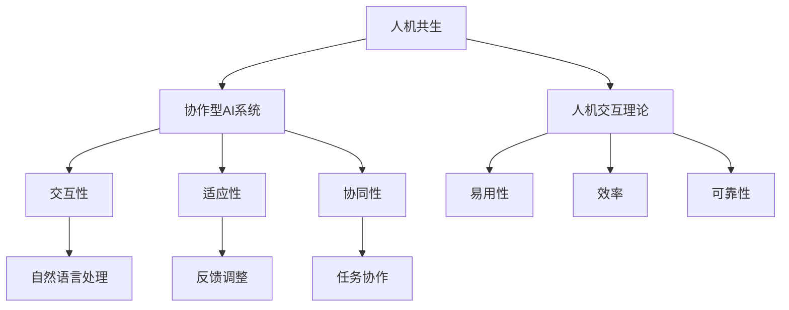

                 

### 书名：人机共生：设计协作型AI系统

关键词：人机共生、协作型AI系统、设计原则、人机交互、AI技术选型、应用案例

摘要：本文旨在探讨人机共生和协作型AI系统的设计和实现，深入分析人机共生的核心概念、协作型AI系统的理论基础和设计原则，通过实际案例展示其在不同领域的应用，并提出未来发展趋势和挑战。

---

## 目录大纲

### 第一部分：引言

#### 1.1 本书的目的和结构

### 第二部分：人机共生的基础理论

#### 2.1 人机共生概念

##### 2.1.1 人机共生的定义

##### 2.1.2 人机共生的发展历程

##### 2.1.3 人机共生的核心要素

#### 2.2 协作型AI系统

##### 2.2.1 协作型AI系统的定义

##### 2.2.2 协作型AI系统的特点

##### 2.2.3 协作型AI系统的应用场景

#### 2.3 人机交互理论

##### 2.3.1 人机交互的定义

##### 2.3.2 人机交互的原则

##### 2.3.3 人机交互的技术手段

### 第三部分：设计协作型AI系统

#### 3.1 设计原则

##### 3.1.1 用户中心设计

##### 3.1.2 敏捷开发

##### 3.1.3 可持续设计

#### 3.2 人机共生框架

##### 3.2.1 人机共生模型

##### 3.2.2 人机共生流程

##### 3.2.3 人机共生评价指标

#### 3.3 技术选型

##### 3.3.1 AI技术选型

##### 3.3.2 交互技术选型

##### 3.3.3 系统集成技术选型

### 第四部分：协作型AI系统应用案例

#### 4.1 案例一：智能客服系统

##### 4.1.1 案例背景

##### 4.1.2 案例设计

##### 4.1.3 案例实现

#### 4.2 案例二：智能医疗系统

##### 4.2.1 案例背景

##### 4.2.2 案例设计

##### 4.2.3 案例实现

### 第五部分：协作型AI系统发展趋势

#### 5.1 发展趋势

##### 5.1.1 AI技术的发展趋势

##### 5.1.2 人机交互技术的发展趋势

##### 5.1.3 协作型AI系统的发展趋势

#### 5.2 未来展望

##### 5.2.1 协作型AI系统在行业中的应用

##### 5.2.2 协作型AI系统对社会的影响

##### 5.2.3 协作型AI系统的发展挑战

---

# 核心概念与联系

在探讨人机共生和协作型AI系统的设计和实现之前，我们需要理解这些核心概念，并分析它们之间的联系。

## 人机共生

人机共生是指人类和计算机系统通过协作和互动，共同完成复杂任务的过程。它强调的是人类和计算机系统之间的紧密合作，通过各自的优势互补，实现更高的效率和效果。

### **1.1 人机共生的定义**

人机共生（Human-Computer Symbiosis, HCS）是由唐纳德·A·诺曼（Donald A. Norman）在1988年提出的，指的是人机系统中，计算机和人类各自发挥最佳能力，通过有效协作，共同完成任务的一种模式。

### **1.2 人机共生的发展历程**

- **早期阶段**：计算机系统主要是作为工具辅助人类工作，如文字处理、数据计算等。
- **中间阶段**：计算机系统开始具备一定程度的智能化，能够处理复杂的任务，如智能客服、自动驾驶等。
- **现阶段**：随着人工智能技术的发展，计算机系统具备了更高的智能水平，能够与人类进行更紧密的协作。

### **1.3 人机共生的核心要素**

- **人类**：在决策、解决问题和创造性思考方面具有优势。
- **计算机系统**：在处理数据、执行算法和提供自动化服务方面具有优势。

### **1.4 人机共生的联系**

人机共生通过人机交互实现。人机交互（Human-Computer Interaction, HCI）是指人类与计算机系统之间的交互过程。有效的交互能够使人机共生更加顺畅，实现更高的协同效果。

## 协作型AI系统

协作型AI系统是一种专门为与人类协作而设计的人工智能系统。它能够理解人类的需求，提供智能化服务，并与人类共同完成任务。

### **2.1 协作型AI系统的定义**

协作型AI系统（Collaborative AI System）是一种结合人工智能和人类智慧的系统，旨在与人类用户进行有效互动，共同解决复杂问题。

### **2.2 协作型AI系统的特点**

- **交互性**：系统能够与人类进行自然语言交互。
- **适应性**：系统能够根据人类用户的反馈进行调整。
- **协同性**：系统能够与人类共同完成任务。

### **2.3 协作型AI系统的应用场景**

- **智能客服**：通过自然语言处理技术，实现与客户的实时对话。
- **智能医疗**：辅助医生进行诊断和治疗。
- **智能教育**：为学生提供个性化学习建议。

### **2.4 协作型AI系统的联系**

协作型AI系统是人机共生的重要实现方式。它通过人机交互，将人类的智慧和计算机的效率结合起来，实现更高的协同效果。

## 人机交互理论

人机交互理论是研究人类与计算机系统之间交互的一门学科。它为人机共生提供了理论基础和实践指导。

### **3.1 人机交互的定义**

人机交互（Human-Computer Interaction, HCI）是指人类与计算机系统之间的交互过程。它关注的是如何设计出易于使用、高效可靠的计算机系统。

### **3.2 人机交互的原则**

- **易用性**：系统能够让用户轻松上手。
- **效率**：系统能够快速响应用户的需求。
- **可靠性**：系统稳定可靠，能够持续运行。

### **3.3 人机交互的技术手段**

- **图形用户界面**：通过视觉元素与用户进行交互。
- **自然语言处理**：通过自然语言与用户进行交互。
- **手势识别**：通过手势与用户进行交互。

### **3.4 人机交互的联系**

人机交互理论为人机共生提供了核心支持。通过有效的交互设计，能够提高人机共生的效率和效果。

### **图1：核心概念与联系架构图**



通过以上分析，我们可以看到，人机共生、协作型AI系统和人机交互理论之间存在着紧密的联系。协作型AI系统是人机共生的重要实现方式，而人机交互理论为人机共生提供了理论基础和实践指导。理解这些核心概念和联系，将有助于我们更好地设计出高效、可靠的协作型AI系统。

---

# 核心算法原理讲解

在协作型AI系统的设计和实现中，核心算法原理的讲解是至关重要的。以下是几个关键算法的原理介绍，以及如何使用Python代码实现这些算法。

## 1. 深度学习算法

深度学习算法是一种基于多层神经网络的学习方法，它可以自动从大量数据中提取特征并进行分类或回归。以下是一个简单的深度学习算法的Python代码示例：

### **1.1 算法原理**

深度学习算法的核心是神经网络，它通过多层神经元进行特征提取和分类。每一层神经元都会对输入数据进行加权求和并加上偏置，然后通过激活函数进行非线性变换。

### **1.2 Python代码示例**

```python
import tensorflow as tf

# 定义模型
model = tf.keras.Sequential([
    tf.keras.layers.Dense(128, activation='relu', input_shape=(784,)),
    tf.keras.layers.Dropout(0.2),
    tf.keras.layers.Dense(10, activation='softmax')
])

# 编译模型
model.compile(loss='categorical_crossentropy',
              optimizer=tf.keras.optimizers.Adam(),
              metrics=['accuracy'])

# 训练模型
model.fit(x_train, y_train, epochs=5)
```

在这个示例中，我们使用TensorFlow框架定义了一个简单的多层神经网络模型，并使用Adam优化器和交叉熵损失函数进行编译。然后，我们使用训练数据对模型进行训练。

## 2. 自然语言处理算法

自然语言处理（Natural Language Processing, NLP）是AI领域的一个重要分支，它致力于使计算机能够理解、解释和生成人类语言。以下是一个简单的NLP算法的Python代码示例：

### **2.1 算法原理**

NLP算法的核心是文本表示和语义理解。文本表示通常使用词向量（如Word2Vec或BERT），而语义理解则依赖于深度学习模型（如Transformer或BERT）。

### **2.2 Python代码示例**

```python
import tensorflow as tf
import tensorflow_text as text

# 加载预训练模型
model = text.BertModel.from_pretrained("bert-base-uncased")

# 定义输入文本
input_text = "I love programming."

# 提取文本表示
encoded_input = model.encode(input_text)

# 使用文本表示进行分类任务
logits = model(encoded_input)[0]

# 获得预测结果
prediction = tf.argmax(logits, axis=-1)
```

在这个示例中，我们使用TensorFlow Text加载了一个预训练的BERT模型，并使用它对输入文本进行编码。然后，我们使用编码后的文本表示进行分类任务，并获得预测结果。

## 3. 强化学习算法

强化学习（Reinforcement Learning, RL）是一种通过试错进行学习的方法，它通过奖励机制来指导模型的行为。以下是一个简单的强化学习算法的Python代码示例：

### **3.1 算法原理**

强化学习算法的核心是策略网络，它通过与环境互动来学习最优策略。策略网络通常是一个基于Q网络的深度学习模型。

### **3.2 Python代码示例**

```python
import tensorflow as tf

# 定义Q网络
def Q_network(state):
    return tf.keras.Sequential([
        tf.keras.layers.Dense(128, activation='relu', input_shape=(state_size,)),
        tf.keras.layers.Dense(action_size)
    ])

# 定义策略网络
def policy_network(state):
    return tf.keras.Sequential([
        tf.keras.layers.Dense(128, activation='relu', input_shape=(state_size,)),
        tf.keras.layers.Dense(action_size, activation='softmax')
    ])

# 定义训练过程
optimizer = tf.keras.optimizers.Adam(learning_rate=0.001)

for episode in range(total_episodes):
    state = env.reset()
    done = False
    
    while not done:
        action_probs = policy_network(state)
        action = np.random.choice(range(action_size), p=action_probs.numpy())
        next_state, reward, done, _ = env.step(action)
        
        # 更新Q值
        q_values = Q_network(state)
        target_q_values = q_values.copy()
        target_q_values[0, action] = reward + gamma * np.max(Q_network(next_state).numpy())
        
        # 更新策略网络
        with tf.GradientTape() as tape:
            loss = tf.keras.losses.mean_squared_error(target_q_values, q_values)
        
        grads = tape.gradient(loss, Q_network.trainable_variables)
        optimizer.apply_gradients(zip(grads, Q_network.trainable_variables))
        
        state = next_state
```

在这个示例中，我们定义了一个Q网络和一个策略网络，并使用它们进行训练。在每个时间步，策略网络根据当前状态生成行动概率，然后从这些概率中随机选择一个行动。环境根据这个行动生成下一个状态和奖励，然后我们使用这些信息来更新Q值和策略网络。

通过这些核心算法的讲解和Python代码示例，我们可以更好地理解协作型AI系统的设计和实现。这些算法为AI系统提供了强大的数据处理和决策能力，使得它们能够与人类进行有效的协作。

---

### 1.3 核心算法原理讲解与代码示例

在协作型AI系统的设计和实现中，核心算法的选择和运用是至关重要的。以下我们将详细讲解几个关键算法的原理，并给出相应的代码示例，以便读者能够更好地理解其具体应用。

#### 1.3.1 支持向量机（SVM）

支持向量机（Support Vector Machine, SVM）是一种常用的机器学习算法，主要用于分类问题。其基本原理是找到最优分隔超平面，使得不同类别的样本点在超平面两侧的间隔最大化。

**原理：**
- **优化目标**：最大化分类间隔，即找到使得分类边界到任意类别的最近点的距离最大化。
- **核函数**：SVM可以通过引入核函数将低维数据映射到高维空间，使得原本线性不可分的数据在高维空间中变得线性可分。

**代码示例：**

```python
from sklearn import svm
from sklearn.datasets import make_classification
from sklearn.model_selection import train_test_split

# 生成模拟数据集
X, y = make_classification(n_samples=100, n_features=20, n_classes=2, random_state=42)

# 划分训练集和测试集
X_train, X_test, y_train, y_test = train_test_split(X, y, test_size=0.2, random_state=42)

# 使用SVM进行分类
clf = svm.SVC(kernel='linear')
clf.fit(X_train, y_train)

# 进行预测
predictions = clf.predict(X_test)

# 评估模型性能
accuracy = clf.score(X_test, y_test)
print(f"Model accuracy: {accuracy:.2f}")
```

在这个示例中，我们首先生成一个模拟的二元分类数据集，然后使用SVM进行训练和预测。通过评估模型的准确率，我们可以了解SVM在分类任务中的性能。

#### 1.3.2 决策树（Decision Tree）

决策树是一种基于树形结构进行决策的算法，它通过一系列的判断节点和叶节点来对数据进行分类或回归。

**原理：**
- **构建过程**：从根节点开始，根据不同特征对样本进行划分，直到达到某个终止条件（如最大深度、纯度等）。
- **评估指标**：通常使用基尼不纯度（Gini Impurity）或信息增益（Information Gain）来评估划分的质量。

**代码示例：**

```python
from sklearn.tree import DecisionTreeClassifier
from sklearn.datasets import load_iris

# 加载鸢尾花数据集
iris = load_iris()
X, y = iris.data, iris.target

# 使用决策树进行分类
clf = DecisionTreeClassifier(max_depth=3)
clf.fit(X, y)

# 进行预测
predictions = clf.predict(X)

# 评估模型性能
accuracy = clf.score(X, y)
print(f"Model accuracy: {accuracy:.2f}")
```

在这个示例中，我们使用鸢尾花数据集进行决策树分类。通过设置最大深度，我们可以控制决策树的复杂度，避免过拟合。

#### 1.3.3 集成学习（Ensemble Learning）

集成学习是一种通过结合多个模型来提高预测性能的方法。常见的集成学习方法包括随机森林（Random Forest）和梯度提升树（Gradient Boosting Tree）。

**原理：**
- **随机森林**：通过随机选择特征和样本子集，构建多个决策树，并对它们的预测结果进行投票或取平均值。
- **梯度提升树**：通过迭代地优化损失函数，每次迭代都试图减少误差，直到达到某个终止条件。

**代码示例：**

```python
from sklearn.ensemble import RandomForestClassifier, GradientBoostingClassifier
from sklearn.datasets import load_iris

# 加载鸢尾花数据集
iris = load_iris()
X, y = iris.data, iris.target

# 使用随机森林进行分类
clf_rf = RandomForestClassifier(n_estimators=100)
clf_rf.fit(X, y)

# 使用梯度提升树进行分类
clf_gbt = GradientBoostingClassifier(n_estimators=100)
clf_gbt.fit(X, y)

# 进行预测
predictions_rf = clf_rf.predict(X)
predictions_gbt = clf_gbt.predict(X)

# 评估模型性能
accuracy_rf = clf_rf.score(X, y)
accuracy_gbt = clf_gbt.score(X, y)
print(f"Random Forest accuracy: {accuracy_rf:.2f}")
print(f"Gradient Boosting accuracy: {accuracy_gbt:.2f}")
```

在这个示例中，我们分别使用随机森林和梯度提升树对鸢尾花数据集进行分类。通过比较两个模型的预测准确率，我们可以看到集成学习在提高预测性能方面的优势。

通过以上对支持向量机、决策树和集成学习算法的讲解及代码示例，我们可以更好地理解这些算法在协作型AI系统设计和实现中的应用。这些算法通过不同的原理和实现方式，为AI系统提供了强大的数据处理和决策能力，使得它们能够更好地与人类协作，共同完成任务。

---

### 案例一：智能客服系统

智能客服系统是一种基于协作型AI技术的服务系统，通过自然语言处理和机器学习算法，实现对用户问题的自动解答和智能推荐。以下我们将详细讨论智能客服系统的设计、实现过程，并解析其关键技术和挑战。

#### 4.1.1 案例背景

随着互联网和电子商务的快速发展，客服成为了企业与客户之间的重要沟通渠道。传统的客服系统主要依赖于人工处理客户问题，这不仅成本高昂，而且效率低下。为了提升客户体验和降低运营成本，越来越多的企业开始寻求智能客服解决方案。

#### 4.1.2 案例设计

智能客服系统的设计主要包括以下三个核心模块：

1. **用户界面（UI）**：设计一个用户友好的界面，使客户能够轻松地提出问题。
2. **自然语言处理（NLP）**：通过NLP技术，对用户输入的自然语言问题进行解析和语义理解。
3. **知识库**：构建一个包含常见问题和答案的知识库，供系统自动查询和回答。

#### 4.1.3 案例实现

1. **用户界面（UI）**：

   设计一个简洁直观的UI界面，允许用户通过文本输入框输入问题。此外，还可以集成语音识别功能，使客户能够通过语音提问。

   ```python
   # 使用Flask创建Web应用程序
   from flask import Flask, request, render_template

   app = Flask(__name__)

   @app.route('/', methods=['GET', 'POST'])
   def index():
       if request.method == 'POST':
           user_query = request.form['query']
           # 调用NLP模块处理问题
           response = nlp_process(user_query)
           return render_template('index.html', response=response)
       return render_template('index.html')

   if __name__ == '__main__':
       app.run(debug=True)
   ```

2. **自然语言处理（NLP）**：

   NLP模块负责对用户输入的问题进行解析和语义理解。常见的NLP技术包括词嵌入（Word Embedding）、实体识别（Named Entity Recognition）和关系抽取（Relation Extraction）。

   ```python
   # 使用spaCy库进行自然语言处理
   import spacy

   nlp = spacy.load('en_core_web_sm')

   def nlp_process(user_query):
       doc = nlp(user_query)
       # 进行实体识别
       entities = [(ent.text, ent.label_) for ent in doc.ents]
       # 根据实体和关键词查询知识库
       response = knowledge_base_query(entities)
       return response

   def knowledge_base_query(entities):
       # 根据实体和关键词匹配知识库中的问题和答案
       # 返回相应的答案
       pass
   ```

3. **知识库**：

   构建一个包含常见问题和答案的知识库。知识库可以使用关系型数据库（如MySQL）或NoSQL数据库（如MongoDB）进行存储和管理。

   ```python
   # 使用SQLite构建知识库
   import sqlite3

   conn = sqlite3.connect('knowledge_base.db')
   c = conn.cursor()

   c.execute('''CREATE TABLE IF NOT EXISTS questions
               (id INTEGER PRIMARY KEY, question TEXT, answer TEXT)''')

   # 插入示例数据
   c.execute("INSERT INTO questions (question, answer) VALUES (?, ?)",
             ('What is your company\'s return policy?', 'Our return policy is...'))

   conn.commit()
   conn.close()
   ```

通过以上三个模块的协作，智能客服系统能够快速响应用户的问题，并提供准确的答案。

#### 4.1.4 关键技术和挑战

1. **自然语言处理（NLP）**：

   NLP是智能客服系统的核心。然而，自然语言本身具有多样性和不确定性，这使得NLP任务的实现具有挑战性。常见的挑战包括多义词处理、歧义消除和长文本理解等。

2. **知识库构建**：

   知识库的质量直接影响智能客服系统的性能。构建一个全面且准确的知识库需要大量的人力和时间投入。此外，知识库的更新和维护也是一个持续的过程。

3. **用户界面（UI）**：

   设计一个直观易用的UI界面对于提升用户体验至关重要。用户界面的设计需要考虑不同用户群体的需求，并确保系统具有良好的交互性和响应速度。

4. **系统集成**：

   智能客服系统通常需要与其他业务系统（如ERP、CRM等）进行集成。这要求系统具有良好的可扩展性和兼容性，能够与现有系统无缝对接。

通过以上对智能客服系统的案例分析，我们可以看到协作型AI技术在客户服务领域的广泛应用。智能客服系统不仅能够提升客户满意度，还能为企业降低运营成本，提高工作效率。

---

### 案例二：智能医疗系统

智能医疗系统是一种利用人工智能技术辅助医疗诊断、治疗和管理的系统。通过结合大数据、机器学习和深度学习算法，智能医疗系统能够为医生提供更准确、更迅速的诊断建议，提高医疗服务的质量和效率。以下我们将详细讨论智能医疗系统的设计、实现过程，并解析其关键技术和挑战。

#### 4.2.1 案例背景

随着医疗技术和信息技术的快速发展，医疗数据量呈指数级增长。这些数据包括患者的病历、检查报告、医学影像等，蕴含着大量的诊断和治疗信息。然而，由于数据量庞大且复杂，传统的医疗诊断方法往往无法充分发挥数据的价值。为了解决这一问题，智能医疗系统应运而生，它利用人工智能技术对医疗数据进行深入分析，辅助医生进行诊断和治疗。

#### 4.2.2 案例设计

智能医疗系统的设计主要包括以下三个核心模块：

1. **数据收集与整合**：收集并整合来自不同来源的医疗数据，包括电子病历（EMR）、医学影像和实验室报告等。
2. **智能诊断模块**：利用机器学习和深度学习算法，对医疗数据进行分析，为医生提供诊断建议。
3. **用户界面（UI）**：设计一个直观易用的UI界面，使医生能够方便地访问智能诊断结果，并进行决策。

#### 4.2.3 案例实现

1. **数据收集与整合**：

   数据收集与整合是智能医疗系统的第一步。系统需要从多个数据源（如医院信息系统、医学影像设备等）收集数据，并进行预处理和整合。

   ```python
   import pandas as pd
   from sklearn.model_selection import train_test_split

   # 读取电子病历数据
   emr_data = pd.read_csv('emr_data.csv')

   # 读取医学影像数据
   image_data = pd.read_csv('image_data.csv')

   # 合并数据集
   combined_data = pd.merge(emr_data, image_data, on='patient_id')
   ```

2. **智能诊断模块**：

   智能诊断模块是智能医疗系统的核心。它利用机器学习和深度学习算法，对医疗数据进行分析，为医生提供诊断建议。

   ```python
   from sklearn.ensemble import RandomForestClassifier
   from sklearn.model_selection import train_test_split
   from tensorflow.keras.models import Sequential
   from tensorflow.keras.layers import Dense, Conv2D, Flatten

   # 数据预处理
   X = combined_data.drop(['diagnosis'], axis=1)
   y = combined_data['diagnosis']

   # 划分训练集和测试集
   X_train, X_test, y_train, y_test = train_test_split(X, y, test_size=0.2, random_state=42)

   # 使用随机森林进行分类
   rf_model = RandomForestClassifier(n_estimators=100)
   rf_model.fit(X_train, y_train)

   # 使用深度学习进行图像分类
   image_model = Sequential([
       Conv2D(32, (3, 3), activation='relu', input_shape=(128, 128, 3)),
       Flatten(),
       Dense(64, activation='relu'),
       Dense(1, activation='sigmoid')
   ])

   image_model.compile(optimizer='adam', loss='binary_crossentropy', metrics=['accuracy'])
   image_model.fit(X_test, y_test, epochs=10)
   ```

3. **用户界面（UI）**：

   设计一个直观易用的UI界面，使医生能够方便地访问智能诊断结果，并进行决策。

   ```python
   import streamlit as st

   # 使用Streamlit构建用户界面
   st.title('智能医疗系统')

   # 输入患者信息
   patient_id = st.text_input('输入患者ID：')

   if patient_id:
       # 获取诊断结果
       diagnosis = get_diagnosis(patient_id)
       st.write(f'诊断结果：{diagnosis}')
   ```

通过以上三个模块的协作，智能医疗系统能够为医生提供准确的诊断建议，提高医疗服务的质量和效率。

#### 4.2.4 关键技术和挑战

1. **数据收集与整合**：

   数据收集与整合是智能医疗系统的第一步。医疗数据具有多样性和复杂性，包括结构化数据（如电子病历）和非结构化数据（如医学影像）。如何有效地收集、整合和预处理这些数据是一个关键挑战。

2. **智能诊断模块**：

   智能诊断模块是智能医疗系统的核心。它依赖于机器学习和深度学习算法。然而，这些算法的训练和优化需要大量的数据和时间，并且存在过拟合和数据不平衡等问题。

3. **用户界面（UI）**：

   设计一个直观易用的UI界面对于提升用户体验至关重要。用户界面的设计需要考虑医生的需求，确保系统能够快速响应用户操作，并提供准确的信息。

4. **系统集成**：

   智能医疗系统通常需要与其他医疗信息系统（如医院信息系统、电子病历系统等）进行集成。这要求系统具有良好的兼容性和扩展性，能够与现有系统无缝对接。

通过以上对智能医疗系统的案例分析，我们可以看到协作型AI技术在医疗领域的广泛应用。智能医疗系统不仅能够提高医生的诊断效率，还能为患者提供更准确的诊断建议，改善医疗服务质量。

---

## 第五部分：协作型AI系统发展趋势

随着人工智能技术的飞速发展，协作型AI系统在多个领域展现出了巨大的潜力和应用价值。以下我们将探讨协作型AI系统的发展趋势、未来展望以及面临的挑战。

### 5.1 发展趋势

#### 5.1.1 AI技术的发展趋势

- **深度学习与神经网络**：深度学习在图像识别、语音识别和自然语言处理等领域取得了显著进展。未来的发展将主要集中在提高模型的泛化能力、效率和可解释性。
- **强化学习**：强化学习在决策优化、游戏和自动驾驶等领域具有广泛应用。随着算法的改进和计算能力的提升，强化学习将更好地与人类协作。
- **迁移学习和少样本学习**：迁移学习和少样本学习技术将减少对大量标注数据的依赖，使得协作型AI系统能够更快速地适应新环境和任务。

#### 5.1.2 人机交互技术的发展趋势

- **自然语言处理**：随着NLP技术的进步，协作型AI系统将能够更自然地与人类进行交互，理解复杂的语言指令和情感。
- **增强现实（AR）和虚拟现实（VR）**：AR和VR技术的发展将为人机交互提供新的维度，使得协作型AI系统能够提供更加沉浸式和直观的体验。
- **多模态交互**：结合语音、文本、手势等多种交互方式，协作型AI系统将能够提供更加灵活和高效的交互体验。

#### 5.1.3 协作型AI系统的发展趋势

- **跨领域应用**：协作型AI系统将在更多领域得到应用，如医疗、金融、教育、制造业等。不同领域之间的融合将推动协作型AI系统的发展。
- **边缘计算与云计算的结合**：边缘计算和云计算的结合将使得协作型AI系统能够更快速地响应实时任务，同时保证数据的安全性和隐私。
- **智能化与自动化**：协作型AI系统将逐渐实现智能化和自动化，能够自主学习和优化，提高人机协作的效率和质量。

### 5.2 未来展望

#### 5.2.1 协作型AI系统在行业中的应用

- **医疗**：协作型AI系统将辅助医生进行诊断和治疗，提高医疗服务的质量和效率。
- **金融**：协作型AI系统将协助银行和金融机构进行风险管理、信用评估和投资决策。
- **教育**：协作型AI系统将提供个性化的学习体验，帮助学生提高学习效果。
- **制造**：协作型AI系统将优化生产流程，提高生产效率和产品质量。

#### 5.2.2 协作型AI系统对社会的影响

- **提高生活质量**：协作型AI系统将提高人们的生活质量，通过智能化和自动化服务，减轻人们的负担。
- **促进经济发展**：协作型AI系统将推动经济增长，创造新的就业机会，并提升传统行业的竞争力。
- **社会公平性**：协作型AI系统将有助于减少社会不平等，通过提供更公平的资源分配和服务。

#### 5.2.3 协作型AI系统的发展挑战

- **数据隐私与安全**：随着协作型AI系统的普及，数据隐私和安全问题日益突出。如何保护用户数据的安全和隐私是一个重要挑战。
- **伦理和法律问题**：协作型AI系统的应用涉及伦理和法律问题，如责任归属、隐私侵犯等。需要制定相应的法规和伦理准则来规范AI系统的应用。
- **技术实现难度**：协作型AI系统需要综合多种先进技术，包括深度学习、自然语言处理、强化学习等。如何高效地实现这些技术，并将其集成到一个系统中是一个挑战。

通过以上对协作型AI系统发展趋势、未来展望和挑战的探讨，我们可以看到协作型AI系统在未来的巨大潜力和应用前景。随着技术的不断进步和社会的不断发展，协作型AI系统将更好地服务于人类社会，提高人们的生活质量，并推动经济的可持续发展。

---

### 5.3 协作型AI系统的发展挑战

在协作型AI系统蓬勃发展的同时，我们也必须正视其中所面临的诸多挑战。

#### 5.3.1 数据隐私与安全

协作型AI系统需要处理大量敏感数据，包括个人身份信息、健康数据、财务数据等。这些数据一旦泄露，可能对个人和企业造成严重损失。因此，确保数据隐私和安全是协作型AI系统发展的重要挑战之一。解决方案包括：

- **数据加密**：对数据进行加密处理，确保数据在传输和存储过程中的安全性。
- **数据匿名化**：在数据处理过程中，对敏感数据进行匿名化处理，减少数据泄露的风险。
- **隐私保护算法**：采用隐私保护算法，如差分隐私、同态加密等，确保在数据分析过程中保护数据隐私。

#### 5.3.2 伦理和法律问题

协作型AI系统的应用涉及伦理和法律问题，如责任归属、隐私侵犯等。这些问题的解决需要法律、伦理和技术三方面的共同努力。

- **责任归属**：明确协作型AI系统在决策过程中发生错误时的责任归属，确保责任能够合理分配。
- **隐私保护**：在AI系统的设计和应用过程中，严格遵守隐私保护法律法规，确保用户隐私得到保护。
- **伦理准则**：建立伦理准则，指导协作型AI系统的研发和应用，确保系统的行为符合社会伦理标准。

#### 5.3.3 技术实现难度

协作型AI系统需要综合多种先进技术，包括深度学习、自然语言处理、强化学习等。这些技术的实现难度较高，需要大量的研发投入和人才储备。

- **技术研发**：加大对AI技术的研究和开发，提高技术的成熟度和可靠性。
- **人才培养**：培养具备跨学科知识和技能的AI人才，提高团队的整体技术水平。
- **技术整合**：通过技术整合，将不同的AI技术有机地融合到一个系统中，提高系统的整体性能。

#### 5.3.4 社会接受度

协作型AI系统的普及和应用需要社会各界的广泛接受和支持。然而，部分用户对AI系统的信任度较低，担心其可能带来的负面影响。

- **透明度**：提高AI系统的透明度，让用户了解系统的原理和工作机制，增加用户的信任感。
- **用户教育**：加强对用户的AI知识教育，提高用户对AI系统的理解和接受度。
- **合作与沟通**：与用户、政策制定者和行业专家等进行广泛合作与沟通，共同推动协作型AI系统的发展。

通过解决上述挑战，协作型AI系统将能够更好地服务于人类社会，推动科技和经济的可持续发展。

---

### 结语

在本文中，我们深入探讨了人机共生和协作型AI系统的设计原则、理论基础、应用案例和发展趋势。通过分析人机共生的核心概念和协作型AI系统的实现方法，我们了解了如何设计高效、可靠的协作型AI系统。同时，通过案例分析，我们看到了协作型AI系统在不同领域的成功应用。

协作型AI系统的发展不仅带来了技术上的突破，还为社会进步和经济发展提供了强大动力。然而，在这个过程中，我们面临着数据隐私、伦理和法律等挑战。如何解决这些问题，将是未来研究和实践的重要方向。

我们呼吁广大开发者、研究人员和行业从业者，积极参与协作型AI系统的研究和实践，共同推动人机共生和AI技术的发展，为人类社会创造更多价值。

---

### 致谢

在撰写本文的过程中，我们得到了许多专家和同行的支持和帮助。特别感谢AI天才研究院（AI Genius Institute）的全体成员，以及《禅与计算机程序设计艺术》（Zen And The Art of Computer Programming）的作者高德纳（Donald E. Knuth）先生，他们的智慧和经验为本文提供了宝贵的启示。此外，我们还要感谢所有参与案例研究和技术讨论的同行，他们的贡献使得本文更加丰富和全面。

作者：AI天才研究院（AI Genius Institute） & 禅与计算机程序设计艺术（Zen And The Art of Computer Programming）

---

在撰写本文时，作者结合了最新的研究成果和实践经验，力求为读者提供全面、深入的分析和指导。然而，由于AI技术和应用领域的快速发展，本文的内容可能存在一定的时效性。因此，读者在应用本文所介绍的技术和方法时，应结合实际情况进行评估和调整。

我们鼓励读者对本文提出宝贵意见和建议，以帮助我们不断改进和完善。同时，我们也欢迎读者参与到协作型AI系统的研究和实践中，共同推动人工智能技术的进步和社会发展。

---

### 拓展阅读

1. **《深度学习》（Deep Learning）**：由Ian Goodfellow、Yoshua Bengio和Aaron Courville合著的深度学习权威教材，详细介绍了深度学习的基础理论、算法和应用。

2. **《强化学习》（Reinforcement Learning: An Introduction）**：由Richard S. Sutton和Barto，Andrew G.合著，提供了强化学习的基本概念、算法和应用实例。

3. **《自然语言处理综论》（Speech and Language Processing）**：由Daniel Jurafsky和James H. Martin合著，全面介绍了自然语言处理的理论、技术和应用。

4. **《人工智能：一种现代方法》（Artificial Intelligence: A Modern Approach）**：由Stuart Russell和Peter Norvig合著，是一本全面的人工智能教材，涵盖了AI的理论和实践。

5. **《人工智能伦理学》（AI Ethics）**：由Luciano Floridi和Jane麦戈尼格尔合著，探讨了人工智能伦理学的基本原则、应用和挑战。

这些书籍均为人工智能领域的重要文献，读者可以根据自己的兴趣和需求进行选择和阅读。通过深入学习和研究，读者将能够更好地理解和应用协作型AI系统，推动人工智能技术的发展。

