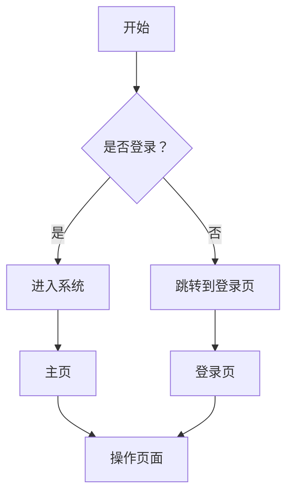

                 

### 引言与背景

在当今科技飞速发展的时代，人工智能（AI）技术已经成为推动社会进步的重要力量。随着机器学习、深度学习等领域的不断突破，AI系统在图像识别、自然语言处理、智能决策等任务上展现出了强大的能力。然而，尽管AI技术取得了显著的成就，但仍然面临许多挑战，尤其是在复杂任务和情境中，其表现往往无法与人类专家相比。

人机协作作为一种新兴的智能系统设计理念，旨在通过结合人类专家的知识和机器学习算法的优势，实现更高效、更准确的智能决策。在这种协作模式下，人工智能系统能够从人类专家那里学习和获取有价值的先验知识，从而在处理复杂任务时表现得更加智能和灵活。

本文将以《人机协作增强学习：结合人类专家知识》为题，深入探讨人机协作增强学习这一前沿领域。文章将首先介绍增强学习的基本概念及其发展历程，然后详细阐述人机协作的原理和方法，以及人类专家知识在增强学习中的应用。接下来，我们将从理论基础、数学模型、算法原理和应用实践等多个角度，全面剖析人机协作增强学习的技术细节和实践方法。

通过本文的详细分析，读者将能够深入了解人机协作增强学习的工作机制和实际应用，理解其在提升AI系统智能水平方面的重要作用，并为未来的研究和开发提供有价值的参考。

### 关键词

- 增强学习
- 人机协作
- 人类专家知识
- 智能系统
- 算法模型
- 应用实践
- 人工智能

### 摘要

本文探讨了人机协作增强学习这一前沿领域，重点分析了其基本概念、原理和实际应用。首先，介绍了增强学习的基本概念和发展历程，揭示了其在智能系统中的重要性。接着，详细阐述了人机协作的原理和方法，强调了人类专家知识在增强学习中的应用价值。文章随后从理论基础、数学模型、算法原理等多个角度，深入剖析了人机协作增强学习的技术细节和实践方法。通过具体案例和实际应用，展示了人机协作增强学习在提升AI系统智能水平方面的巨大潜力。本文旨在为相关领域的学者和开发者提供有价值的参考，推动人机协作增强学习技术的进一步发展。

## 《人机协作增强学习：结合人类专家知识》目录大纲

### 第一部分：引言与背景

**第1章：人机协作与增强学习概述**
- 1.1 增强学习的基本概念
  - 1.1.1 增强学习的起源与发展
  - 1.1.2 增强学习的核心问题
- 1.2 人机协作的原理与方法
  - 1.2.1 人机协作的定义
  - 1.2.2 人机协作的优势
- 1.3 人类专家知识在增强学习中的应用
  - 1.3.1 人类专家知识的重要性
  - 1.3.2 人类专家知识的获取与表示

### 第二部分：理论基础

**第2章：人机协作增强学习模型**
- 2.1 基本框架与架构
  - 2.1.1 增强学习的基本模型
  - 2.1.2 人机协作增强学习的扩展模型
- 2.2 策略学习与价值函数
  - 2.2.1 政策评价与优化
  - 2.2.2 值函数估计与优化
- 2.3 人机协作机制设计
  - 2.3.1 专家指导策略
  - 2.3.2 人类反馈机制

**第3章：数学模型与算法原理**
- 3.1 Q-Learning算法
  - 3.1.1 Q-Learning的基本原理
  - 3.1.2 Q-Learning算法的实现
- 3.2 SARSA算法
  - 3.2.1 SARSA的基本原理
  - 3.2.2 SARSA算法的实现
- 3.3 人机协作增强学习算法
  - 3.3.1 人机协作增强学习算法的设计
  - 3.3.2 人机协作增强学习的实现

**第4章：数学模型与公式解析**
- 4.1 基本数学公式
  - 4.1.1 增强学习的状态转移概率公式
  - 4.1.2 增强学习的奖励函数公式
- 4.2 人类专家知识表示
  - 4.2.1 人类专家知识的获取方式
  - 4.2.2 人类专家知识的表示方法
- 4.3 人机协作的优化目标
  - 4.3.1 人机协作的优化目标函数
  - 4.3.2 人机协作优化问题的求解

### 第三部分：应用实践

**第5章：人机协作增强学习在机器人控制中的应用**
- 5.1 机器人控制系统的基本架构
  - 5.1.1 机器人控制系统的构成
  - 5.1.2 机器人控制系统的挑战
- 5.2 基于人机协作增强学习的方法
  - 5.2.1 人机协作增强学习在机器人控制中的应用
  - 5.2.2 实际案例与应用效果

**第6章：人机协作增强学习在自然语言处理中的应用**
- 6.1 自然语言处理的基本概念
  - 6.1.1 自然语言处理的目标
  - 6.1.2 自然语言处理的基本任务
- 6.2 基于人机协作增强学习的NLP方法
  - 6.2.1 人机协作增强学习在NLP中的应用
  - 6.2.2 实际案例与应用效果

**第7章：人机协作增强学习在其他领域的应用**
- 7.1 人机协作增强学习在其他领域的潜力
  - 7.1.1 医疗领域的应用
  - 7.1.2 教育领域的应用
- 7.2 应用前景与挑战
  - 7.2.1 应用前景展望
  - 7.2.2 挑战与解决方案

### 第四部分：未来发展趋势与展望

**第8章：未来发展趋势与展望**
- 8.1 技术发展趋势
  - 8.1.1 增强学习技术的发展
  - 8.1.2 人机协作技术的发展
- 8.2 应用趋势与前景
  - 8.2.1 应用领域扩展
  - 8.2.2 社会影响与伦理问题

### 附录

**附录A：人机协作增强学习资源与工具**
- A.1 资源与文献推荐
- A.2 增强学习工具与框架
- A.3 实践项目与案例

**附录B：Mermaid流程图**
- B.1 Mermaid基本语法
- B.2 Mermaid流程图示例
- B.3 Mermaid在书中的应用

**附录C：Python代码示例**
- C.1 基本代码结构与实现
- C.2 代码解读与分析
- C.3 实际案例代码实现与解读

通过以上目录大纲，读者可以全面了解《人机协作增强学习：结合人类专家知识》的篇章结构和内容要点。每个章节都将详细探讨人机协作增强学习的不同方面，帮助读者深入理解这一领域的前沿技术和应用潜力。

### 第1章：人机协作与增强学习概述

#### 1.1 增强学习的基本概念

增强学习（Reinforcement Learning, RL）是机器学习中的一个重要分支，它通过智能体（Agent）在环境（Environment）中通过与环境的交互，逐步学习到最优策略（Policy），以便在未来的决策中实现最大化的累积奖励（Reward）。增强学习不同于监督学习和无监督学习，其核心在于奖励机制和反馈循环。

增强学习的起源可以追溯到1950年代，当时Richard Sutton和Andrew Barto在其开创性著作《增强学习：一种新的计算范式》（“Reinforcement Learning: An Introduction”）中，首次系统地阐述了这一概念。随后，随着人工智能和计算技术的快速发展，增强学习逐渐成为研究热点，并在多个领域取得了显著的应用成果。

增强学习的核心问题包括：

1. **策略学习**：智能体如何通过学习找到一条最优路径，实现目标最大化。
2. **价值函数估计**：如何估计智能体在不同状态下的预期奖励，以便优化策略。
3. **探索与利用**：如何在探索未知的策略和利用已有知识之间取得平衡，避免陷入局部最优。

#### 1.1.1 增强学习的起源与发展

增强学习的历史可以追溯到1950年代，当时阿兰·图灵（Alan Turing）提出了自动机理论，为计算和人工智能奠定了基础。随后，1956年达特茅斯会议（Dartmouth Conference）标志着人工智能（AI）学科的诞生，增强学习作为其重要分支之一，逐渐受到了关注。

1970年代，随着计算机硬件的进步和AI研究的深入，增强学习开始得到更多的研究与应用。此期间，Richard Sutton和Andrew Barto的研究工作对增强学习的发展起到了重要的推动作用。1990年代，深度学习（Deep Learning）的出现为增强学习带来了新的机遇，通过深度神经网络（DNN），增强学习能够处理更加复杂的问题。

进入21世纪，随着深度强化学习（Deep Reinforcement Learning）技术的发展，增强学习在游戏、机器人控制、自动驾驶等领域取得了突破性进展。现代增强学习不仅依赖于深度学习算法，还结合了强化学习、博弈论、心理学等多学科的理论，形成了一个丰富的研究领域。

#### 1.1.2 增强学习的核心问题

增强学习中的核心问题主要包括以下几个方面：

1. **策略学习**：
   - **策略定义**：策略是指智能体在某一状态s下应采取的动作a的概率分布π(a|s)。
   - **策略优化**：通过迭代更新策略，使智能体能够逐步学习到最优策略。
   - **策略评估**：评估策略π的性能，通常使用价值函数V(π)或期望回报E[∑γ^t r_t]。

2. **价值函数估计**：
   - **状态价值函数**：V(s)表示智能体在状态s下的长期预期回报。
   - **动作价值函数**：Q(s, a)表示在状态s下执行动作a并遵循某一策略π的长期预期回报。
   - **价值函数更新**：通过经验回放和梯度下降等方法，逐步优化价值函数。

3. **探索与利用**：
   - **探索（Exploration）**：智能体需要探索未知的策略，以获取更多的信息和经验。
   - **利用（Exploitation）**：智能体需要利用已有知识，选择最优策略以最大化回报。
   - **探索策略**：例如ε-贪心策略、UCB算法、 Thompson 采样等。

#### 1.2 人机协作的原理与方法

人机协作（Human-AI Collaboration）是指人类和人工智能系统通过互动和合作，共同完成任务的过程。在人机协作中，人类专家的知识、经验和判断力与人工智能系统的计算能力、数据分析和学习能力相结合，能够显著提升系统的整体性能和决策质量。

##### 1.2.1 人机协作的定义

人机协作的定义可以从以下几个方面进行理解：

1. **交互性**：人类和人工智能系统之间的互动和反馈，通过这种交互，系统能够不断学习和优化。
2. **互补性**：人类和人工智能系统各自具备不同的能力和优势，通过协作，能够实现优势互补，提高任务完成的效率和质量。
3. **协同性**：人类和人工智能系统在协作过程中，需要保持一定的协同性和一致性，以确保任务的有效完成。

##### 1.2.2 人机协作的优势

人机协作具有以下几个显著的优势：

1. **提升决策质量**：通过结合人类专家的知识和人工智能系统的计算能力，人机协作能够生成更全面、更准确的决策。
2. **扩展人类能力**：人工智能系统能够处理大量的数据和复杂的计算任务，从而扩展了人类的工作范围和能力。
3. **提高效率**：人机协作能够实现自动化和智能化，减少重复性劳动，提高工作效率。
4. **增强适应性**：人机协作系统能够根据环境和任务的变化，动态调整策略和方案，提高系统的适应性。

##### 1.2.3 人类专家知识的重要性

人类专家知识在增强学习中的应用具有重要意义，原因如下：

1. **先验知识**：人类专家拥有丰富的先验知识和经验，这些知识能够为人工智能系统提供重要的参考和指导，减少探索过程的时间。
2. **情境理解**：人类专家能够更好地理解复杂的情境和任务背景，从而提供更加精准的任务目标和优化策略。
3. **反馈与指导**：通过人类的反馈和指导，人工智能系统能够不断学习和优化，提高其性能和适应性。
4. **人机协同**：人类专家和人工智能系统的协作能够形成一种智能增强的闭环系统，进一步提升系统的决策质量和效率。

##### 1.2.4 人类专家知识的获取与表示

为了将人类专家知识有效地应用于增强学习系统中，需要解决以下几个关键问题：

1. **知识获取**：
   - **数据收集**：通过问卷调查、实验记录、观察等方式，收集人类专家的经验和知识。
   - **专家访谈**：与人类专家进行深入访谈，获取其深入见解和策略。

2. **知识表示**：
   - **符号化表示**：将人类专家的知识转化为符号化的形式，如规则、公式、图表等。
   - **结构化表示**：通过建立知识图谱、本体论等方式，将专家知识结构化，以便于计算机处理。

3. **知识融合**：
   - **规则融合**：将多个专家的规则进行整合，形成统一的规则库。
   - **模型融合**：将不同的模型和方法进行融合，以提升系统的综合性能。

#### 1.3 人类专家知识在增强学习中的应用

人类专家知识在增强学习中的应用主要体现在以下几个方面：

1. **初始策略设定**：通过人类专家的知识，设定初始的策略，为增强学习提供一个良好的起点。

2. **探索与利用策略**：利用人类专家的经验，设计探索与利用策略，以平衡探索新策略和利用已有策略。

3. **目标函数调整**：根据人类专家的知识和经验，调整目标函数，以更好地反映任务目标和奖励机制。

4. **决策支持**：人类专家能够为增强学习系统提供实时决策支持，帮助系统在复杂情境中做出更优的选择。

5. **结果评估**：通过人类专家的评估，对增强学习系统的性能进行量化分析，为后续的优化和改进提供依据。

综上所述，人机协作与增强学习相结合，能够充分发挥人类专家的知识和人工智能系统的计算能力，实现更高效、更智能的决策。本章对人机协作与增强学习的基本概念、原理和应用进行了详细阐述，为后续章节的深入探讨奠定了基础。

### 第2章：人机协作增强学习模型

人机协作增强学习模型是结合人类专家知识和机器学习算法的核心框架，旨在通过智能体与环境的交互，实现最优策略的学习与优化。本章将详细探讨人机协作增强学习的基本框架与架构，并介绍策略学习与价值函数的相关概念。

#### 2.1 基本框架与架构

人机协作增强学习模型的基本框架包括以下几个关键组成部分：

1. **智能体（Agent）**：智能体是学习系统的主体，负责执行动作、接收环境反馈并更新策略。
2. **环境（Environment）**：环境是智能体进行交互的场所，提供状态信息和奖励反馈。
3. **策略（Policy）**：策略定义了智能体在不同状态下的行动规则，策略学习的目标是最小化长期回报的期望。
4. **价值函数（Value Function）**：价值函数估计智能体在特定状态下的期望回报，用于指导策略优化。
5. **专家知识（Expert Knowledge）**：人类专家的知识和经验，通过特定的方法融入模型，提升智能体的学习效率。

##### 2.1.1 增强学习的基本模型

增强学习的基本模型通常包括状态（State）、动作（Action）、奖励（Reward）和策略（Policy）四个要素：

1. **状态（State）**：智能体在环境中的当前情况，用S表示。
2. **动作（Action）**：智能体可执行的行为，用A表示。
3. **奖励（Reward）**：环境对智能体动作的即时反馈，用R表示。
4. **策略（Policy）**：智能体在状态s下采取的动作概率分布，用π(a|s)表示。

在增强学习过程中，智能体通过与环境交互，逐步学习到最优策略。其核心机制是**状态-动作价值函数**（State-Action Value Function），用Q(s, a)表示，Q(s, a)表示在状态s下执行动作a的期望回报。

##### 2.1.2 人机协作增强学习的扩展模型

人机协作增强学习扩展了基本增强学习模型，通过引入人类专家知识，实现更高效、更精准的决策。具体扩展模型包括以下几个部分：

1. **专家指导策略（Expert Guidance Policy）**：专家根据其知识和经验，为智能体提供行动建议，指导智能体的决策过程。
2. **专家知识融合机制（Expert Knowledge Integration）**：通过符号化、结构化等方法，将人类专家的知识融入智能体的学习模型中。
3. **协同优化框架（Collaborative Optimization Framework）**：结合人类专家的反馈和智能体的学习结果，设计协同优化的目标函数和算法。

在扩展模型中，专家指导策略通过在智能体的策略更新过程中加入专家建议，实现人类知识与机器学习算法的协同优化。专家知识融合机制通过将专家知识转化为可计算的形式，提高智能体的决策质量和效率。

#### 2.2 策略学习与价值函数

策略学习是增强学习中的核心任务，目标是最小化长期回报的期望。策略学习通常分为两个方向：值函数方法和策略迭代方法。

##### 2.2.1 政策评价与优化

政策评价（Policy Evaluation）是策略学习的第一步，通过估计当前策略的价值函数，为策略优化提供基础。常用的政策评价方法包括：

1. **逆向策略迭代（Policy Iteration）**：逆向策略迭代方法通过迭代更新值函数和策略，逐步逼近最优策略。具体步骤如下：
   - 初始策略π<sub>0</sub>；
   - 评估当前策略π的价值函数V<sub>t</sub>(π)；
   - 生成新策略π<sub>t+1</sub>，使V<sub>t+1</sub>(π<sub>t+1</sub>) > V<sub>t</sub>(π)；
   - 重复上述步骤直到策略收敛。

2. **优势函数（ Advantage Function）**：优势函数A(s, a) = Q(s, a) - V(s)，表示在状态s下执行动作a的预期回报相对于最优回报的增量。通过优化优势函数，可以提高策略的期望回报。优势函数方法主要包括：
   - Q-Learning算法：Q-Learning通过迭代更新Q值，逐步优化策略。具体步骤如下：
     - 初始Q值Q<sub>0</sub>(s, a)；
     - 对于每个状态-动作对(s, a)，执行以下更新：
       $$ Q(s, a) \leftarrow Q(s, a) + \alpha [r + \gamma \max_{a'} Q(s', a') - Q(s, a)] $$
   - SARSA算法：SARSA是即时差分学习（Sarsa，即On-Policy Learning），通过更新当前策略下的Q值，实现策略优化。具体步骤如下：
     - 初始Q值Q<sub>0</sub>(s, a)；
     - 对于每个状态-动作对(s, a)，执行以下更新：
       $$ Q(s, a) \leftarrow Q(s, a) + \alpha [r + \gamma Q(s', a') - Q(s, a)] $$

##### 2.2.2 值函数估计与优化

值函数估计是策略学习的基础，通过估计值函数，智能体能够评估不同策略的性能。值函数估计的方法包括：

1. **蒙特卡洛方法（Monte Carlo Method）**：蒙特卡洛方法通过模拟大量随机样本来估计值函数。具体步骤如下：
   - 从状态s开始，执行策略π，并记录回报序列R；
   - 计算累积回报的期望值作为值函数的估计：
     $$ V(s) \approx \frac{1}{N}\sum_{k=1}^{N} R_k $$

2. **时间差分方法（Temporal Difference Method）**：时间差分方法通过更新值函数的估计值，实现值函数的优化。具体步骤如下：
   - 初始值函数V<sub>0</sub>(s)；
   - 对于每个状态-动作对(s, a)，执行以下更新：
     $$ V(s) \leftarrow V(s) + \alpha [r + \gamma V(s') - V(s)] $$

在值函数估计与优化过程中，探索与利用的平衡是一个重要问题。为了在探索未知策略和利用已有知识之间取得平衡，可以采用ε-贪心策略（ε-Greedy Policy）、UCB算法（Upper Confidence Bound）和Thompson采样（Thompson Sampling）等方法。

#### 2.3 人机协作机制设计

人机协作机制设计是确保人类专家知识有效融入增强学习模型的关键。以下是人机协作机制设计的几个关键方面：

##### 2.3.1 专家指导策略

专家指导策略通过在智能体的策略更新过程中引入人类专家的建议，实现人类知识和机器学习算法的协同。具体设计步骤如下：

1. **专家建议生成**：根据任务目标和专家知识，生成具体的行动建议。
2. **策略更新**：将专家建议作为额外的输入，调整智能体的策略更新过程。
3. **反馈循环**：智能体执行专家建议，并根据实际结果进行反馈，调整未来的建议。

##### 2.3.2 人类反馈机制

人类反馈机制通过人类专家的实时反馈，指导智能体的学习和优化。具体设计步骤如下：

1. **反馈收集**：收集人类专家对智能体决策的反馈，包括正面反馈和负面反馈。
2. **反馈处理**：分析反馈数据，识别专家建议的有效性，并根据反馈结果调整智能体的策略和学习过程。
3. **反馈融合**：将人类反馈与机器学习算法相结合，优化智能体的决策质量和效率。

通过设计有效的专家指导策略和人类反馈机制，人机协作增强学习模型能够更好地结合人类专家的知识和机器学习算法的优势，实现高效、精准的智能决策。

### 第3章：数学模型与算法原理

为了深入理解人机协作增强学习模型，本章节将详细解析其核心数学模型和算法原理。我们将首先介绍Q-Learning算法，然后是SARSA算法，最后讨论人机协作增强学习算法的设计与实现。

#### 3.1 Q-Learning算法

Q-Learning算法是增强学习中最基础的算法之一，其核心思想是通过迭代更新状态-动作价值函数Q(s, a)来学习最优策略。以下是Q-Learning算法的基本原理和实现步骤：

##### 3.1.1 Q-Learning的基本原理

Q-Learning算法的基本原理可以总结为以下三个步骤：

1. **初始化**：初始化Q值矩阵Q，通常使用较小的随机值。
   $$ Q(s, a) \leftarrow \min_{a'} (1 - \alpha) Q(s, a') + \alpha \cdot 0 $$
2. **动作选择**：在给定状态s下，智能体根据策略选择动作a。通常采用ε-贪心策略，即以概率ε随机选择动作，以概率1-ε选择当前最优动作。
   $$ a \leftarrow \begin{cases} 
   \text{随机选择} & \text{with probability } \epsilon \\
   \text{贪心选择} & \text{with probability } 1 - \epsilon 
   \end{cases} $$
3. **更新Q值**：在执行动作a后，根据获得的奖励r和新的状态s'，更新Q值。
   $$ Q(s, a) \leftarrow Q(s, a) + \alpha [r + \gamma \max_{a'} Q(s', a') - Q(s, a)] $$

其中，α是学习率（learning rate），γ是折扣因子（discount factor），它们分别控制了新信息和已有知识在Q值更新中的权重。

##### 3.1.2 Q-Learning算法的实现

以下是Q-Learning算法的Python代码实现：

```python
import numpy as np

# 参数设置
alpha = 0.1
gamma = 0.9
epsilon = 0.1
num_episodes = 1000

# 初始化Q值矩阵
Q = np.zeros((num_states, num_actions))

# 定义环境
def environment(s, a):
    # 根据状态s和动作a，返回新的状态s'和奖励r
    # 这里仅作示意，具体实现需要根据实际环境进行
    pass

# Q-Learning循环
for episode in range(num_episodes):
    s = env.reset()  # 初始化状态
    done = False

    while not done:
        # ε-贪心策略选择动作
        if np.random.rand() < epsilon:
            a = np.random.choice(num_actions)
        else:
            a = np.argmax(Q[s])

        # 执行动作，获取新状态和奖励
        s', r = environment(s, a)

        # 更新Q值
        Q[s, a] = Q[s, a] + alpha * (r + gamma * np.max(Q[s']) - Q[s, a])

        # 更新状态
        s = s'

        # 检查是否完成
        done = env.done()

# 打印最优策略
print("Optimal Policy:")
print(np.argmax(Q, axis=1))
```

上述代码展示了Q-Learning算法的基本实现过程，它通过不断迭代更新Q值矩阵，最终找到最优策略。值得注意的是，在实际应用中，需要根据具体环境对环境接口和Q值更新规则进行适当调整。

#### 3.2 SARSA算法

SARSA（同步自适应再搜索策略，Synchronous Adaptive Resonance Algorithm）算法是Q-Learning的一种变体，它属于On-Policy Learning，即智能体使用相同的策略进行状态和动作的选择，并通过该策略进行Q值的更新。以下是SARSA算法的基本原理和实现步骤：

##### 3.2.1 SARSA的基本原理

SARSA算法的基本原理与Q-Learning类似，主要区别在于Q值的更新时机：

1. **初始化**：初始化Q值矩阵Q，使用较小的随机值。
   $$ Q(s, a) \leftarrow \min_{a'} (1 - \alpha) Q(s, a') + \alpha \cdot 0 $$
2. **动作选择**：在给定状态s下，智能体根据策略选择动作a。
   $$ a \leftarrow \text{当前策略}(s) $$
3. **更新Q值**：在执行动作a后，根据获得的奖励r和新的状态s'，立即更新Q值。
   $$ Q(s, a) \leftarrow Q(s, a) + \alpha [r + \gamma Q(s', a) - Q(s, a)] $$

##### 3.2.2 SARSA算法的实现

以下是SARSA算法的Python代码实现：

```python
import numpy as np

# 参数设置
alpha = 0.1
gamma = 0.9
epsilon = 0.1
num_episodes = 1000

# 初始化Q值矩阵
Q = np.zeros((num_states, num_actions))

# 定义环境
def environment(s, a):
    # 根据状态s和动作a，返回新的状态s'和奖励r
    # 这里仅作示意，具体实现需要根据实际环境进行
    pass

# SARSA循环
for episode in range(num_episodes):
    s = env.reset()  # 初始化状态
    done = False

    while not done:
        # ε-贪心策略选择动作
        if np.random.rand() < epsilon:
            a = np.random.choice(num_actions)
        else:
            a = np.argmax(Q[s])

        # 执行动作，获取新状态和奖励
        s', r = environment(s, a)

        # 更新Q值
        Q[s, a] = Q[s, a] + alpha * (r + gamma * Q[s', a] - Q[s, a])

        # 更新状态
        s = s'

        # 检查是否完成
        done = env.done()

# 打印最优策略
print("Optimal Policy:")
print(np.argmax(Q, axis=1))
```

与Q-Learning算法相比，SARSA算法的更新时机更早，因此在某些情况下可能更快收敛。

#### 3.3 人机协作增强学习算法

人机协作增强学习算法是结合人类专家知识的一种扩展模型，通过在增强学习过程中引入人类专家的指导，实现更高效、更精准的智能决策。以下是人机协作增强学习算法的设计与实现：

##### 3.3.1 人机协作增强学习算法的设计

人机协作增强学习算法的设计包括以下几个关键部分：

1. **专家指导策略**：设计一种机制，使人类专家能够为智能体的动作选择提供实时指导。
2. **知识融合机制**：将人类专家的知识和经验转化为智能体可利用的形式，如规则、模型等。
3. **协同优化框架**：设计一个优化框架，结合人类专家的反馈和智能体的学习结果，实现协同优化。

##### 3.3.2 人机协作增强学习的实现

以下是人机协作增强学习算法的Python代码实现：

```python
import numpy as np

# 参数设置
alpha = 0.1
gamma = 0.9
epsilon = 0.1
num_episodes = 1000

# 初始化Q值矩阵
Q = np.zeros((num_states, num_actions))

# 专家指导函数
def expert Guidance(s):
    # 根据当前状态s，返回专家建议的动作
    # 这里仅作示意，具体实现需要根据实际专家知识进行
    pass

# 定义环境
def environment(s, a):
    # 根据状态s和动作a，返回新的状态s'和奖励r
    # 这里仅作示意，具体实现需要根据实际环境进行
    pass

# 人机协作增强学习循环
for episode in range(num_episodes):
    s = env.reset()  # 初始化状态
    done = False

    while not done:
        # ε-贪心策略选择动作，结合专家建议
        expert_action = expert Guidance(s)
        if np.random.rand() < epsilon:
            a = np.random.choice(num_actions)
        elif expert_action is not None:
            a = expert_action
        else:
            a = np.argmax(Q[s])

        # 执行动作，获取新状态和奖励
        s', r = environment(s, a)

        # 更新Q值
        Q[s, a] = Q[s, a] + alpha * (r + gamma * np.max(Q[s']) - Q[s, a])

        # 更新状态
        s = s'

        # 检查是否完成
        done = env.done()

# 打印最优策略
print("Optimal Policy:")
print(np.argmax(Q, axis=1))
```

在上述代码中，`expert Guidance`函数用于获取人类专家的建议。通过结合专家建议和ε-贪心策略，人机协作增强学习算法能够在智能体的动作选择过程中引入人类专家的知识，提高学习效率和决策质量。

通过本章对Q-Learning算法、SARSA算法以及人机协作增强学习算法的详细解析，读者可以深入理解这些核心算法的原理和实现方法，为后续的应用实践和深入研究打下坚实基础。

### 第4章：数学模型与公式解析

在理解和应用人机协作增强学习算法时，掌握其核心数学模型和公式至关重要。本章将详细介绍增强学习中的基本数学公式、人类专家知识的表示方法以及人机协作的优化目标，并解析相关公式。

#### 4.1 基本数学公式

增强学习中的基本数学公式是构建和优化智能体策略的基础，主要包括状态转移概率、奖励函数和价值函数等。

##### 4.1.1 状态转移概率公式

状态转移概率描述了智能体在某一状态下执行特定动作后，转移到另一个状态的概率。其公式如下：

$$ P(s', s | a) = \sum_{a'} p(s', a' | s) p(a' | s) $$

其中，\( p(s', a' | s) \) 是在状态 \( s \) 下执行动作 \( a' \) 后转移到状态 \( s' \) 的概率，而 \( p(a' | s) \) 是在状态 \( s \) 下选择动作 \( a' \) 的概率。

##### 4.1.2 增强学习的奖励函数公式

奖励函数 \( r(s, a) \) 是增强学习中环境对智能体行为的即时反馈，用于指导智能体的学习过程。其公式如下：

$$ r(s, a) = \sum_{s'} p(s' | s, a) r(s') $$

这里，\( r(s') \) 是智能体在状态 \( s' \) 下获得的奖励，而 \( p(s' | s, a) \) 是从状态 \( s \) 下执行动作 \( a \) 后转移到状态 \( s' \) 的概率。

##### 4.1.3 增强学习的价值函数公式

价值函数是衡量智能体在某一状态下的长期预期回报，分为状态价值函数 \( v(s) \) 和动作价值函数 \( q(s, a) \)。

- **状态价值函数**：

$$ v(s) = \sum_{a} \pi(a | s) q(s, a) $$

其中，\( \pi(a | s) \) 是在状态 \( s \) 下执行动作 \( a \) 的概率，而 \( q(s, a) \) 是在状态 \( s \) 下执行动作 \( a \) 的动作价值函数。

- **动作价值函数**：

$$ q(s, a) = \sum_{s'} p(s' | s, a) r(s, a) + \gamma v(s') $$

这里，\( \gamma \) 是折扣因子，用于考虑未来奖励的现值。

#### 4.2 人类专家知识表示

将人类专家知识有效表示并融入增强学习模型是提升智能体决策能力的关键。以下是两种常见的人类专家知识表示方法：

##### 4.2.1 人类专家知识的获取方式

- **数据收集**：通过问卷调查、实验记录、专家访谈等方式收集专家的经验和知识。
- **知识编码**：将专家知识转化为计算机可处理的形式，如规则、公式、图表等。

##### 4.2.2 人类专家知识的表示方法

- **符号化表示**：将专家知识符号化为规则或公式，便于计算机理解和处理。
- **结构化表示**：利用知识图谱、本体论等方法，将专家知识结构化，提高知识的可操作性和可维护性。

##### 4.2.3 知识融合方法

- **规则融合**：将多个专家的规则进行融合，形成统一的规则库。
- **模型融合**：结合不同的模型和方法，构建多层次的智能体模型，实现知识的综合利用。

#### 4.3 人机协作的优化目标

人机协作的优化目标是设计一个高效、协同的决策框架，使人类专家的知识与智能体算法相互补充，共同实现最优决策。以下是优化目标的数学描述：

##### 4.3.1 人机协作的优化目标函数

优化目标函数 \( J \) 可以表示为：

$$ J = \sum_{s, a} \pi(a | s) \left[ Q(s, a) + \lambda E[\log \pi(a | s)] \right] $$

其中，\( \pi(a | s) \) 是智能体的策略，\( Q(s, a) \) 是状态-动作价值函数，而 \( \lambda \) 是调节参数，用于平衡价值函数和策略损失之间的权重。

##### 4.3.2 人机协作优化问题的求解

求解人机协作优化问题通常采用梯度下降法和自适应优化算法。以下是求解步骤：

1. **初始化参数**：设置初始参数，如智能体策略、价值函数等。
2. **计算梯度**：计算目标函数 \( J \) 对参数的梯度。
   $$ \nabla J = \sum_{s, a} \left[ \nabla Q(s, a) + \lambda \nabla \log \pi(a | s) \right] $$
3. **更新参数**：使用梯度下降法或自适应优化算法更新参数。
   $$ \theta \leftarrow \theta - \alpha \nabla J $$

通过上述步骤，人机协作增强学习模型能够逐步优化，实现智能体决策质量和效率的提升。

本章通过详细解析增强学习的基本数学公式、人类专家知识的表示方法以及人机协作的优化目标，为读者提供了深入理解人机协作增强学习模型的理论基础。掌握这些核心概念和公式，有助于在实际应用中设计和实现高效、智能的增强学习系统。

### 第5章：人机协作增强学习在机器人控制中的应用

随着机器人技术的不断进步，机器人控制系统在工业制造、医疗辅助、家庭服务等各个领域展现出了巨大的应用潜力。然而，复杂环境中的机器人控制任务往往需要智能决策和灵活适应性，这单一依靠传统的编程控制难以实现。人机协作增强学习作为一种先进的方法，结合了人类专家的知识和机器学习算法的强大计算能力，为机器人控制系统提供了全新的解决方案。本章将详细探讨人机协作增强学习在机器人控制中的应用，包括机器人控制系统的基本架构、基于人机协作增强学习的方法及其实际应用效果。

#### 5.1 机器人控制系统的基本架构

机器人控制系统的基本架构通常包括以下几个关键组成部分：

1. **感知模块**：机器人通过传感器（如视觉、触觉、力觉传感器等）获取环境信息。
2. **决策模块**：根据感知模块获取的环境信息，机器人控制系统进行实时决策，确定下一步动作。
3. **执行模块**：机器人根据决策模块的指令执行相应的动作，如移动、抓取、装配等。
4. **通信模块**：机器人控制系统需要与外部设备（如计算机、网络等）进行通信，传输数据和控制指令。

##### 5.1.1 机器人控制系统的构成

机器人控制系统通常由以下几个部分构成：

- **控制器**：核心控制部分，负责协调和控制机器人各个模块的运行。
- **传感器**：用于感知机器人周围环境，如视觉传感器用于获取图像信息，力觉传感器用于感知力的大小和方向。
- **执行器**：用于驱动机器人的机械部分，如电机、气缸等。
- **数据处理器**：对传感器获取的数据进行处理，如图像识别、信号滤波等。
- **通信接口**：用于与外部设备通信，如计算机、网络等。

##### 5.1.2 机器人控制系统的挑战

在机器人控制系统中，面临的主要挑战包括：

1. **复杂性**：机器人需要在复杂和不确定的环境中操作，这使得控制系统的设计变得复杂。
2. **实时性**：机器人控制需要实时响应环境变化，这对系统的计算速度和响应时间提出了高要求。
3. **适应性**：机器人需要具备适应新环境和任务的能力，这要求控制系统具有一定的自适应性和学习能力。
4. **鲁棒性**：控制系统需要在各种异常情况下保持稳定运行，如传感器故障、执行器失效等。

#### 5.2 基于人机协作增强学习的方法

人机协作增强学习在机器人控制中的应用，通过结合人类专家的知识和机器学习算法，能够有效提升机器人控制的性能和适应性。以下是具体的方法：

##### 5.2.1 人机协作增强学习在机器人控制中的应用

人机协作增强学习在机器人控制中的应用主要包括以下几个步骤：

1. **人类专家知识获取**：通过专家访谈、实验记录等方式，收集人类专家的操作经验和策略。
2. **知识表示**：将人类专家的知识转化为计算机可处理的形式，如规则、模型等。
3. **智能体设计**：设计智能体，使其具备学习能力和决策能力，能够从环境中获取反馈并不断优化策略。
4. **交互与协作**：通过人机交互界面，人类专家可以实时监控和指导机器人操作，智能体根据人类专家的反馈进行调整。

##### 5.2.2 实际案例与应用效果

以下是几个基于人机协作增强学习在机器人控制中的实际案例及其应用效果：

1. **智能焊接机器人**：在汽车制造业中，智能焊接机器人需要精确控制焊接过程中的温度、速度和压力等参数。通过引入人类专家的知识，智能焊接机器人能够根据焊接材料的特性进行调整，提高焊接质量和效率。

2. **医疗机器人**：在手术中，医疗机器人需要根据医生的操作步骤和经验进行精细操作。通过人机协作增强学习，医疗机器人能够从医生的操作中学习，并在手术过程中提供实时反馈和辅助，提高手术的成功率和安全性。

3. **家庭服务机器人**：家庭服务机器人需要在复杂家庭环境中完成多种任务，如打扫、烹饪等。通过引入人类专家的知识，家庭服务机器人能够更好地理解家庭环境和用户需求，提高服务的质量和用户满意度。

#### 5.2.3 人机协作增强学习的方法优势

人机协作增强学习在机器人控制中的优势包括：

1. **高效性**：通过结合人类专家的知识，机器人能够快速适应新任务和环境，提高工作效率。
2. **灵活性**：人机协作增强学习能够根据实际情况调整策略，适应复杂多变的任务需求。
3. **鲁棒性**：通过引入人类专家的反馈和指导，机器人控制系统能够在遇到异常情况时保持稳定运行。
4. **适应性**：人机协作增强学习系统能够不断学习和优化，提高其在新任务和环境中的适应能力。

通过以上分析，我们可以看到，人机协作增强学习为机器人控制系统提供了强大的技术支持，使其在复杂任务和环境中表现出更高的智能和灵活性。未来，随着技术的不断进步，人机协作增强学习在机器人控制中的应用将更加广泛和深入。

### 第6章：人机协作增强学习在自然语言处理中的应用

自然语言处理（NLP）是人工智能领域的一个重要分支，它旨在使计算机能够理解和处理人类语言。随着互联网和大数据的发展，NLP在信息检索、机器翻译、情感分析、文本生成等领域取得了显著的成就。然而，传统的NLP方法在处理复杂和不确定的语言任务时，往往存在一定局限性。人机协作增强学习作为一种结合人类专家知识的方法，通过智能体与人类专家的互动，能够显著提升NLP系统的性能和灵活性。本章将详细介绍人机协作增强学习在自然语言处理中的应用，包括NLP的基本概念、人机协作增强学习的NLP方法以及实际案例和应用效果。

#### 6.1 自然语言处理的基本概念

自然语言处理（NLP）是计算机科学和人工智能领域的一个重要分支，它旨在使计算机能够理解、生成和处理自然语言文本。NLP的研究目标包括文本表示、语义理解、语言生成等。以下是NLP的基本概念和主要任务：

##### 6.1.1 自然语言处理的目标

- **文本表示**：将自然语言文本转换为计算机可以处理的结构化数据，如词向量、句向量等。
- **语义理解**：理解文本中的语义信息，包括实体识别、关系抽取、情感分析等。
- **语言生成**：根据输入的语义信息，生成符合语言规则的文本。

##### 6.1.2 自然语言处理的基本任务

- **分词（Tokenization）**：将连续的文本分割成单词、短语或符号等基本单位。
- **词性标注（Part-of-Speech Tagging）**：为文本中的每个词标注其词性，如名词、动词、形容词等。
- **命名实体识别（Named Entity Recognition, NER）**：识别文本中的命名实体，如人名、地名、组织机构名等。
- **关系抽取（Relation Extraction）**：提取文本中的实体间的关系，如“张三”和“清华大学”之间的学生与学校关系。
- **情感分析（Sentiment Analysis）**：分析文本的情感倾向，如正面、负面或中性。
- **机器翻译（Machine Translation）**：将一种语言的文本自动翻译成另一种语言。
- **文本生成（Text Generation）**：根据输入的语义信息，生成符合语法和语义规则的文本。

#### 6.2 基于人机协作增强学习的NLP方法

人机协作增强学习在自然语言处理中的应用，通过结合人类专家的知识和机器学习算法，能够显著提升NLP系统的性能。以下是人机协作增强学习在NLP中的具体方法：

##### 6.2.1 人机协作增强学习在NLP中的应用

人机协作增强学习在NLP中的应用主要包括以下几个步骤：

1. **专家知识获取**：通过专家访谈、实验记录等方式，收集人类专家在特定NLP任务中的经验和方法。
2. **知识表示**：将人类专家的知识转化为计算机可处理的形式，如规则、模型等。
3. **智能体设计**：设计智能体，使其具备学习能力和决策能力，能够从环境中获取反馈并不断优化策略。
4. **交互与协作**：通过人机交互界面，人类专家可以实时监控和指导智能体操作，智能体根据人类专家的反馈进行调整。

##### 6.2.2 实际案例与应用效果

以下是几个基于人机协作增强学习在自然语言处理中的实际案例及其应用效果：

1. **情感分析**：在情感分析任务中，人机协作增强学习系统能够从人类专家的情感标注数据中学习，并自动生成情感分析模型。通过结合人类专家的知识和机器学习算法，系统能够更准确地识别文本中的情感倾向。

2. **机器翻译**：在机器翻译任务中，人机协作增强学习系统能够从人类专家的翻译数据中学习，并优化翻译模型。通过实时反馈和调整，系统能够生成更准确、更自然的翻译结果。

3. **文本生成**：在人机协作增强学习框架下，智能体能够从人类专家提供的示例文本中学习，并生成符合语法和语义规则的文本。例如，在生成新闻摘要、写作助手等应用中，人机协作增强学习系统能够根据输入的主题和关键词，生成高质量的文本内容。

#### 6.2.3 人机协作增强学习的方法优势

人机协作增强学习在自然语言处理中的优势包括：

1. **提升准确性**：通过结合人类专家的知识，NLP系统能够更准确地理解和生成自然语言文本。
2. **增强灵活性**：人机协作增强学习系统能够根据任务需求和用户反馈，灵活调整策略和模型参数。
3. **提高适应性**：人机协作增强学习系统能够不断学习和优化，适应新任务和变化的语言环境。
4. **增强解释性**：通过人类专家的参与，NLP系统的决策过程和结果更加透明和可解释。

通过以上分析，我们可以看到，人机协作增强学习在自然语言处理中的应用，不仅提高了系统的性能和灵活性，还为NLP任务的实现提供了新的思路和方法。未来，随着技术的进一步发展，人机协作增强学习在自然语言处理领域的应用将更加广泛和深入。

### 第7章：人机协作增强学习在其他领域的应用

人机协作增强学习不仅在机器人控制和自然语言处理中展现出强大的应用潜力，还在其他众多领域展现出了广阔的应用前景。本章将探讨人机协作增强学习在医疗、教育等领域的潜力以及面临的应用前景与挑战。

#### 7.1 人机协作增强学习在其他领域的潜力

##### 7.1.1 医疗领域的应用

在医疗领域，人机协作增强学习有以下几个潜在的应用：

1. **疾病诊断**：通过人机协作，增强学习系统能够从医学专家的经验中学习，提高诊断准确率。例如，在影像诊断中，系统可以从医生的标注数据中学习，自动识别疾病征兆。
2. **个性化治疗**：结合患者的历史数据和医生的专业知识，人机协作增强学习系统能够为患者提供个性化的治疗方案，提高治疗效果。
3. **手术辅助**：在手术过程中，医生可以利用增强学习系统进行实时决策，提高手术的成功率和安全性。

##### 7.1.2 教育领域的应用

在教育领域，人机协作增强学习可以带来以下好处：

1. **个性化学习**：系统可以根据学生的学习情况和需求，提供个性化的学习资源和指导，提高学习效果。
2. **智能评测**：通过人机协作，增强学习系统能够自动评估学生的学习情况，提供实时反馈，帮助教师更好地指导学生。
3. **虚拟导师**：在远程教育中，虚拟导师可以根据学生的反馈和学习进度，提供实时互动和个性化辅导。

#### 7.2 应用前景与挑战

虽然人机协作增强学习在多个领域展现出了巨大的潜力，但其广泛应用仍面临一系列挑战：

##### 7.2.1 应用前景展望

1. **技术成熟度**：随着算法和硬件的不断发展，人机协作增强学习的技术成熟度将不断提高，有望在未来实现更广泛的应用。
2. **数据获取**：通过大数据和云计算技术，获取和处理大规模的专家数据和标注数据，将为人机协作增强学习提供更丰富的训练资源。
3. **跨学科融合**：人机协作增强学习将与其他领域（如心理学、认知科学等）深度融合，推动多学科交叉研究，形成更完善的智能系统。

##### 7.2.2 挑战与解决方案

1. **数据质量和标注**：高质量的数据和准确的标注是训练有效增强学习模型的基础。为此，需要建立标准化的数据标注规范，并采用自动化工具进行标注质量的评估。
2. **模型可解释性**：增强学习模型通常较为复杂，其决策过程难以解释。为此，需要开发可解释性模型，使人类专家能够理解模型的决策过程和依据。
3. **安全性**：在人机协作过程中，涉及大量敏感数据和隐私信息。为此，需要开发安全可靠的隐私保护技术，确保数据安全和用户隐私。
4. **伦理问题**：人机协作增强学习涉及到人类专家的知识和智能系统的决策，需要解决伦理和责任分配问题。例如，在医疗领域，需要明确医生和智能系统的职责和责任。

综上所述，人机协作增强学习在医疗、教育等领域展现了广阔的应用前景，但也面临一系列挑战。通过不断探索和创新，解决这些挑战，人机协作增强学习有望在未来实现更广泛和深入的应用。

### 第8章：未来发展趋势与展望

#### 8.1 技术发展趋势

人机协作增强学习作为人工智能领域的前沿研究方向，正朝着以下几个方向发展：

1. **算法优化**：随着深度学习和强化学习技术的不断发展，人机协作增强学习算法将变得更加高效和准确。例如，通过引入元学习（Meta-Learning）和联邦学习（Federated Learning），人机协作增强学习系统能够在有限的数据和计算资源下实现更好的性能。
2. **跨学科融合**：人机协作增强学习将与其他领域（如认知科学、心理学等）深度融合，推动多学科交叉研究，形成更完善的智能系统。
3. **应用场景拓展**：人机协作增强学习将逐步应用到更多领域，如智能制造、智能交通、金融分析等，推动各行各业的智能化升级。

#### 8.2 应用趋势与前景

人机协作增强学习在未来的应用前景十分广阔，具体表现在以下几个方面：

1. **自动化与智能化**：在人机协作增强学习的推动下，自动化和智能化技术将进一步提升，大幅提高生产效率和服务质量。
2. **个性化服务**：通过结合人类专家的知识和机器学习算法，人机协作增强学习系统能够为用户提供更加个性化、智能化的服务，满足不同用户的需求。
3. **决策支持**：在人机协作增强学习的支持下，决策支持系统将更加智能化和高效，帮助企业和组织做出更加准确和明智的决策。

#### 8.2.1 应用领域扩展

人机协作增强学习在未来的应用领域将不断扩展，主要包括：

1. **医疗健康**：通过人机协作增强学习，医疗诊断、治疗方案设计等将变得更加准确和高效，助力医疗领域的智能化发展。
2. **教育与培训**：人机协作增强学习将在教育领域发挥重要作用，提供个性化学习体验和智能教学辅助，提升教育质量和学习效果。
3. **工业制造**：在人机协作增强学习的推动下，智能制造将实现更高水平的自动化和智能化，提高生产效率和产品质量。
4. **金融服务**：通过人机协作增强学习，金融分析和风险管理将更加智能化和精准化，助力金融机构提高业务运营效率。

#### 8.2.2 社会影响与伦理问题

随着人机协作增强学习技术的广泛应用，社会影响与伦理问题也日益突出，主要包括：

1. **数据隐私**：在人机协作过程中，大量敏感数据被收集和使用，需要确保数据隐私和安全。
2. **责任归属**：在涉及人类生命和财产的决策中，需要明确人机协作系统的责任归属，确保安全和责任的可追溯性。
3. **伦理道德**：人机协作增强学习系统在应用过程中，需要遵守伦理规范和道德准则，确保其行为符合社会价值观和道德标准。

总之，人机协作增强学习技术的发展和应用前景十分广阔，同时也面临着一系列社会和伦理问题。通过技术创新和规范管理，人机协作增强学习有望在未来实现更加广泛和深入的应用，推动社会进步和人类福祉。

### 附录A：人机协作增强学习资源与工具

为了更好地学习和应用人机协作增强学习技术，本附录将介绍相关资源与工具，包括推荐文献、增强学习工具与框架、实践项目与案例。

#### A.1 资源与文献推荐

1. **基础教材**：
   - Sutton, B., & Barto, A. G. (2018). **Reinforcement Learning: An Introduction**. MIT Press.
   - Russell, S., & Norvig, P. (2020). **Artificial Intelligence: A Modern Approach**. Pearson Education.

2. **专业期刊和会议**：
   - Journal of Machine Learning Research (JMLR)
   - International Conference on Machine Learning (ICML)
   - Neural Information Processing Systems (NIPS)

3. **在线课程和教程**：
   - Coursera: "Reinforcement Learning" by David Silver
   - edX: "Machine Learning" by Andrew Ng

#### A.2 增强学习工具与框架

1. **开源框架**：
   - TensorFlow
   - PyTorch
   - OpenAI Gym

2. **库与模块**：
   - Stable Baselines：提供一系列预训练的增强学习算法和评估工具。
   - RLlib：Apache RocketMQ项目的一部分，提供分布式增强学习框架。

3. **工具链**：
   - Colab：Google Colaboratory，免费在线Jupyter Notebook环境。
   - Keras：用于快速构建和训练深度学习模型的高层API。

#### A.3 实践项目与案例

1. **项目示例**：
   - OpenAI Five：一个由五个强化学习智能体组成的团队，成功击败了顶级Dota 2职业玩家。
   - Robot Navigation：使用增强学习算法实现机器人自主导航。

2. **开源项目**：
   - Stable Baselines Examples：提供一系列增强学习算法的应用示例。
   - RL Zoo：收集了各种开源的增强学习算法和实验代码。

3. **竞赛与挑战**：
   - DARPA SubT Challenge：地下机器人挑战赛，涉及增强学习在复杂环境中的应用。
   - RoboCup Rescue Robot League：机器人救援竞赛，探索机器人与人类协作的潜力。

通过利用这些资源和工具，读者可以深入了解人机协作增强学习技术，并在实际项目中应用和验证所学知识。

### 附录B：Mermaid流程图

Mermaid 是一种简单的Markdown语法，用于绘制图表和流程图。它通过将文本标记转换为图形表示，使得复杂流程和架构的描述更加直观和易于理解。以下是 Mermaid 的基本语法和使用示例。

#### B.1 Mermaid基本语法

1. **基本流程图（Flowchart）**：

   ```mermaid
   graph TD
   A[Start] --> B{Is it true?}
   B -->|Yes| C[Do something]
   B -->|No| D[Do something else]
   C --> E[End]
   D --> E
   ```

   图中，`graph TD` 表示绘制一个方向从上到下的流程图。节点 `A`、`B`、`C`、`D` 和 `E` 分别表示流程图中的步骤，箭头表示步骤之间的转移。使用 `{}` 包含条件判断，`|Yes|` 和 `|No|` 分别表示条件判断的两个分支。

2. **时序图（Sequence Diagram）**：

   ```mermaid
   sequenceDiagram
   participant User
   participant System
   User->>System: Hello
   System->>User: Hello back!
   ```

   时序图用于表示事件的发生顺序。`sequenceDiagram` 标记表示开始绘制时序图。`participant` 用于定义参与角色，例如 `User` 和 `System`。箭头 `->>` 表示消息传递方向。

3. **类图（Class Diagram）**：

   ```mermaid
   classDiagram
   Class1 <|-- Class2
   Class1 : +method1()
   Class2 : +method2()
   endclassDiagram
   ```

   类图用于表示类之间的关系。`classDiagram` 标记表示开始绘制类图。`Class1` 和 `Class2` 是两个类，`<|--` 表示类之间的继承关系。`: +method1()` 和 `+method2()` 表示类的属性和方法。

#### B.2 Mermaid流程图示例

以下是一个使用Mermaid绘制的简单流程图示例：



此流程图表示一个简单的用户交互流程，包括登录验证、进入主页和操作页面的步骤。`A` 为起始节点，`B` 为条件判断节点，根据是否登录，分别跳转到 `C` 和 `D` 节点。`C` 和 `D` 分别表示进入主页和登录页，最终都导向 `G` 节点，即操作页面。

通过上述示例和语法介绍，读者可以开始使用Mermaid绘制自己的流程图，从而更直观地描述和展示复杂的过程和架构。

### 附录C：Python代码示例

在人机协作增强学习的研究和开发过程中，掌握Python编程以及相关的数学和机器学习库是至关重要的。以下是几个Python代码示例，涵盖基本代码结构、算法实现以及实际案例应用，帮助读者更好地理解和应用相关技术。

#### C.1 基本代码结构与实现

以下是一个简单的Python脚本，展示了如何实现一个基础的人工智能程序结构：

```python
import numpy as np

# 参数设置
alpha = 0.1
gamma = 0.9
epsilon = 0.1
num_episodes = 1000

# 初始化Q值矩阵
Q = np.zeros((num_states, num_actions))

# 定义环境
def environment(s, a):
    # 根据状态s和动作a，返回新的状态s'和奖励r
    # 这里仅作示意，具体实现需要根据实际环境进行
    pass

# Q-Learning循环
for episode in range(num_episodes):
    s = env.reset()  # 初始化状态
    done = False

    while not done:
        # ε-贪心策略选择动作
        if np.random.rand() < epsilon:
            a = np.random.choice(num_actions)
        else:
            a = np.argmax(Q[s])

        # 执行动作，获取新状态和奖励
        s', r = environment(s, a)

        # 更新Q值
        Q[s, a] = Q[s, a] + alpha * (r + gamma * np.max(Q[s']) - Q[s, a])

        # 更新状态
        s = s'

        # 检查是否完成
        done = env.done()

# 打印最优策略
print("Optimal Policy:")
print(np.argmax(Q, axis=1))
```

该代码实现了Q-Learning算法的基本框架，包括参数设置、初始化Q值矩阵、定义环境以及Q值更新等步骤。需要注意的是，`environment` 函数需要根据具体应用场景进行实现。

#### C.2 代码解读与分析

在上述代码中，我们首先设置了学习率α、折扣因子γ和ε-贪心策略中的ε值。然后，初始化了一个二维数组Q，用于存储状态-动作价值函数。接下来，我们进入主循环，通过`while`循环迭代更新Q值，每次迭代中：

1. **状态初始化**：使用`env.reset()`函数初始化环境，获得初始状态s。
2. **动作选择**：根据ε-贪心策略，以一定概率随机选择动作，以一定概率选择当前状态下价值最高的动作。
3. **执行动作**：调用`environment`函数执行所选动作，获得新的状态s'和奖励r。
4. **Q值更新**：根据奖励和折扣因子更新Q值矩阵。
5. **状态更新**：将新的状态s'作为当前状态，继续迭代。

最后，打印出最优策略，即Q值矩阵中每一行的最大值所对应的一维数组。

#### C.3 实际案例代码实现与解读

以下是一个基于OpenAI Gym的CartPole环境的Q-Learning实现示例：

```python
import gym
import numpy as np

# 参数设置
alpha = 0.1
gamma = 0.9
epsilon = 0.1
num_episodes = 1000

# 初始化Q值矩阵
Q = np.zeros((num_states, num_actions))

# 定义环境
env = gym.make('CartPole-v0')

# Q-Learning循环
for episode in range(num_episodes):
    s = env.reset()  # 初始化状态
    done = False
    total_reward = 0

    while not done:
        # ε-贪心策略选择动作
        if np.random.rand() < epsilon:
            a = env.action_space.sample()  # 随机选择动作
        else:
            a = np.argmax(Q[s])

        # 执行动作
        s_, reward, done, _ = env.step(a)

        # 更新Q值
        Q[s, a] = Q[s, a] + alpha * (reward + gamma * np.max(Q[s_]) - Q[s, a])

        # 更新状态
        s = s_
        total_reward += reward

    print(f"Episode {episode+1}: Total Reward = {total_reward}")

# 关闭环境
env.close()
```

此代码实现了在CartPole环境中使用Q-Learning算法进行训练的过程。以下是关键步骤的解读：

1. **环境初始化**：使用`gym.make('CartPole-v0')`创建一个CartPole环境。
2. **Q值矩阵初始化**：与之前的示例类似，初始化一个二维数组Q。
3. **主循环**：每个episode中，环境从初始状态开始，智能体通过Q值选择动作。
4. **动作选择**：使用ε-贪心策略，以一定概率随机选择动作，以一定概率选择当前状态下价值最高的动作。
5. **执行动作**：使用`env.step(a)`执行所选动作，获得新的状态s'和奖励r，以及是否完成游戏的标志。
6. **Q值更新**：根据奖励和折扣因子更新Q值矩阵。
7. **状态更新**：将新的状态s'作为当前状态，继续迭代。
8. **打印结果**：每个episode结束时，打印总奖励值。

通过这个实际案例，读者可以更直观地理解Q-Learning算法在具体环境中的应用，并了解如何通过Python代码实现和优化算法。

通过以上示例，读者可以初步掌握人机协作增强学习中的Python编程方法和核心算法实现。在实际应用中，需要根据具体任务需求和环境特点，进一步优化和调整算法参数，以实现最佳性能。

### 结论

本文系统性地探讨了人机协作增强学习这一前沿领域，从基本概念、原理到具体应用实践，为读者提供了一个全面、深入的视角。通过详细解析增强学习的基本模型、算法原理以及人机协作机制设计，我们展示了如何将人类专家的知识有效融入增强学习系统中，实现更高效、更智能的决策。

人机协作增强学习在多个领域展现出了广阔的应用前景，包括机器人控制、自然语言处理、医疗健康和教育等。通过结合人类专家的知识和机器学习算法的优势，这一方法能够显著提升AI系统的性能和适应性，推动各行各业的智能化升级。

然而，人机协作增强学习在实际应用中仍面临诸多挑战，如数据隐私、模型可解释性、责任归属等。未来的研究需要在这些方面进行深入探索，以解决实际问题，推动技术的进一步发展。

本文旨在为相关领域的学者和开发者提供有价值的参考，推动人机协作增强学习技术的应用和创新。随着技术的不断进步，我们有理由相信，人机协作增强学习将在更多领域发挥重要作用，为人类带来更多便利和福祉。希望读者能够在阅读本文后，对这一领域产生更深的兴趣，并在实际研究中不断探索和突破。

