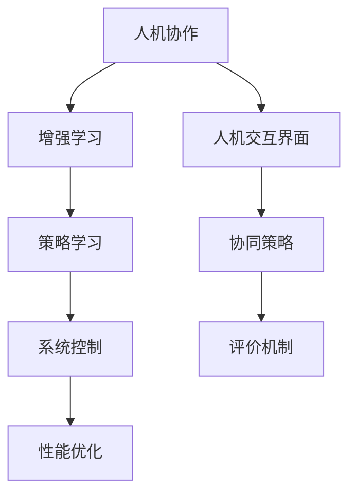
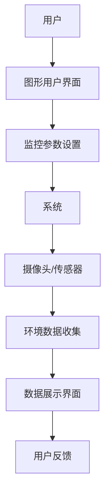
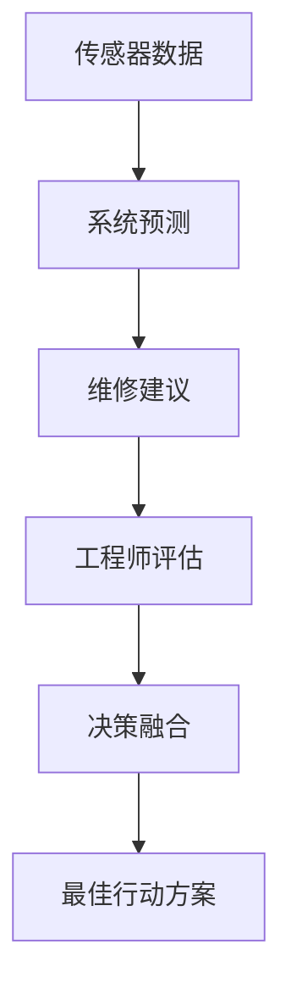
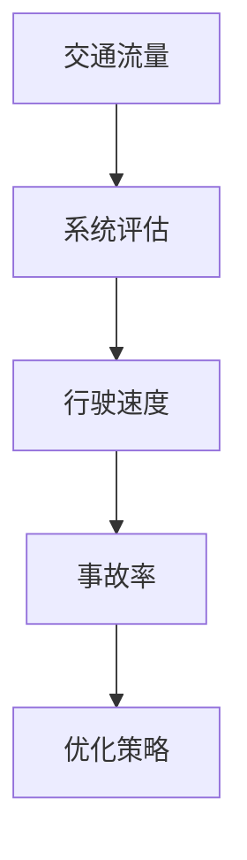

                 

### 第一部分：引论

## 第1章：人机协作与工业控制概述

### 1.1 人机协作的基本概念

**人机协作**是指人类与机器之间通过相互配合、共同完成任务的一种合作模式。在这种模式下，人类和机器各自发挥自身的优势，实现1+1>2的效果。人机协作的重要性在于，它能够充分利用人类的智慧和机器的高效性，提升工作效率，降低错误率，解决复杂问题。

**定义**：人机协作通常涉及以下几个核心要素：

- **人**：指具备认知能力、决策能力和行动能力的个体。
- **机**：指能够执行特定任务、具有数据处理能力和执行能力的机器系统。
- **协作**：指人机之间通过信息交换、任务分配、共同决策等方式实现协同工作的过程。

**重要性**：人机协作在现代社会中扮演着越来越重要的角色，主要表现在以下几个方面：

1. **提高工作效率**：人机协作能够实现任务的高效完成，减少人力成本和时间消耗。
2. **提升决策质量**：机器能够处理大量数据，辅助人类进行复杂决策，提高决策的准确性和科学性。
3. **解决复杂问题**：人机协作能够利用机器的计算能力和人类的创新能力，共同攻克复杂难题。
4. **增强用户体验**：通过人机协作，能够为用户提供更加智能化、个性化的服务体验。

**发展历程**：人机协作的历史可以追溯到工业革命时期，当时的机械自动化设备首次将人机协作的概念付诸实践。随着计算机技术的发展，尤其是人工智能的兴起，人机协作的内涵和外延都得到了极大的扩展。目前，人机协作已经深入到工业、医疗、教育、金融等多个领域，成为现代科技的重要组成部分。

### 1.2 复杂工业控制系统的特点

**复杂工业控制系统**通常指的是那些结构复杂、功能繁多、动态性强的控制系统。这类系统在工业生产中发挥着关键作用，它们通常具有以下特点：

**构成**：复杂工业控制系统通常由以下几个核心部分组成：

- **传感器**：用于监测系统状态和环境变化。
- **执行器**：用于对系统进行控制操作。
- **控制器**：用于接收传感器数据、执行控制策略、调整系统行为。
- **通信网络**：用于实现各部分之间的信息传递和协调。
- **人机界面**：用于显示系统状态、接收操作指令。

**挑战**：复杂工业控制系统面临的主要挑战包括：

- **高维数据**：系统状态变量多，数据维度高，处理难度大。
- **非线性动态**：系统行为复杂，具有强非线性特性，难以建模。
- **实时性要求**：系统需要快速响应，以保证生产过程的连续性和稳定性。
- **可靠性和安全性**：系统需要具备高可靠性和安全性，以避免故障和安全事故。

**需求**：为了应对上述挑战，复杂工业控制系统对以下方面有着迫切需求：

- **智能监控**：实时监测系统状态，发现潜在问题。
- **预测性维护**：预测设备故障，提前进行维护。
- **自适应控制**：根据系统状态动态调整控制策略。
- **人机协作**：通过人机协作提升控制系统的智能化水平和操作效率。

### 1.3 人机协作增强学习的概念

**人机协作增强学习（Human-Machine Collaboration with Reinforcement Learning, HMCRL）**是一种结合了人机协作和增强学习（Reinforcement Learning, RL）的方法，旨在通过机器学习算法提升复杂工业控制系统的性能。它具有以下几个核心特点：

**定义**：人机协作增强学习是指在机器学习算法的辅助下，人类与机器系统通过协作学习，共同优化系统控制策略，提高控制效率和系统性能的过程。

**研究背景**：随着工业自动化程度的不断提高，复杂工业控制系统对智能化控制的需求日益增长。传统的控制方法在面对高维数据、非线性动态和实时性要求时，往往显得力不从心。而增强学习作为一种自我优化的机器学习方法，通过探索-利用策略，可以在复杂环境中找到最优控制策略，提高系统的自适应能力和决策质量。

**目标**：人机协作增强学习的主要目标包括：

- **提升系统性能**：通过自适应学习，优化控制策略，提高系统的控制精度和响应速度。
- **增强人机协作**：通过人机交互机制，充分利用人类的智慧和机器的计算能力，实现协同控制。
- **提高系统可靠性**：通过实时监控和预测性维护，降低系统故障率和停机时间，提高系统可靠性。

在人机协作增强学习中，**核心概念与联系**如图1所示：



**图1：人机协作增强学习中的核心概念与联系**

- **人机协作**和**人机交互界面**：为机器提供人类智慧和经验，实现人机信息交换和任务分配。
- **增强学习**和**策略学习**：利用机器学习算法，从数据中学习并优化控制策略。
- **系统控制**和**性能优化**：通过自适应控制策略，实现系统性能的持续提升。
- **评价机制**：通过设定评价指标，评估人机协作增强学习的效果，为后续优化提供反馈。

### 1.3.1 增强学习算法在复杂工业控制系统中的应用

**Q-学习**（Q-Learning）：Q-学习是一种基于值函数的增强学习算法，通过迭代更新值函数来估计最优动作。其基本原理是通过试错学习，逐渐找到能够在特定状态下取得最大奖励的动作。

```python
# Q-学习算法示例代码
class QLearningAgent:
    def __init__(self, actions, learning_rate=0.1, discount_factor=0.9):
        self.learning_rate = learning_rate
        self.discount_factor = discount_factor
        self.q_values = [0] * len(actions)

    def get_action(self, state):
        # 使用ε-贪心策略选择动作
        if random.random() < self.epsilon:
            return random.choice(self.actions)
        else:
            return self.actions[np.argmax(self.q_values)]

    def update(self, state, action, reward, next_state):
        # 更新Q值
        target = reward + self.discount_factor * np.max(self.q_values)
        self.q_values[action] += self.learning_rate * (target - self.q_values[action])
```

**Sarsa**（Sarsa）：Sarsa是一种同时考虑当前状态和下一步状态估计的增强学习算法，它使用当前状态的值函数估计来选择动作，并根据实际结果更新值函数。

```python
# Sarsa算法示例代码
class SarsaAgent:
    def __init__(self, actions, learning_rate=0.1, discount_factor=0.9):
        self.learning_rate = learning_rate
        self.discount_factor = discount_factor
        self.q_values = [0] * len(actions)

    def get_action(self, state):
        # 使用ε-贪心策略选择动作
        if random.random() < self.epsilon:
            return random.choice(self.actions)
        else:
            return self.actions[np.argmax(self.q_values)]

    def update(self, state, action, reward, next_state, action_prime):
        # 更新Q值
        target = reward + self.discount_factor * self.q_values[next_state.index(action_prime)]
        self.q_values[action] += self.learning_rate * (target - self.q_values[action])
```

**Deep Q-Network**（DQN）：DQN是一种利用深度神经网络来估计值函数的增强学习算法，它通过神经网络预测每个动作的预期回报，并使用经验回放机制减少样本偏差。

```python
# DQN算法示例代码
class DQNAgent:
    def __init__(self, actions, learning_rate=0.001, discount_factor=0.9, epsilon=0.1):
        self.learning_rate = learning_rate
        self.discount_factor = discount_factor
        self.epsilon = epsilon
        self.model = build_model(actions)
        self.target_model = build_model(actions)
        self.memory = []

    def get_action(self, state):
        # 使用ε-贪心策略选择动作
        if random.random() < self.epsilon:
            return random.choice(self.actions)
        else:
            q_values = self.model.predict(state)
            return self.actions[np.argmax(q_values)]

    def update(self, state, action, reward, next_state, done):
        # 记录经验
        self.memory.append((state, action, reward, next_state, done))

        # 每隔一定步数更新目标网络
        if len(self.memory) > batch_size:
            batch = random.sample(self.memory, batch_size)
            states, actions, rewards, next_states, dones = zip(*batch)
            next_state_values = self.target_model.predict(next_states)
            y = rewards + (1 - dones) * self.discount_factor * next_state_values[:, np.argmax(self.model.predict(states))]
            self.model.fit(states, y, epochs=1, verbose=0)
```

这些增强学习算法在复杂工业控制系统中的应用，为系统优化提供了新的途径。通过结合人机协作，可以进一步提升系统的控制效果和智能化水平。接下来，我们将深入探讨人机协作增强学习的基础原理，为后续章节的应用和实践奠定基础。## 第2章：人机协作增强学习的基本原理

### 2.1 学习理论

在学习理论中，我们通常将学习分为有监督学习、无监督学习和强化学习三种类型，每种类型都有其独特的原理和应用场景。

**有监督学习（Supervised Learning）**：有监督学习是一种通过标注数据进行训练的机器学习方法。在这种方法中，模型从给定的输入和输出数据中学习，以便能够预测新的输入数据对应的输出。其基本原理是建立一个映射函数，将输入映射到期望的输出。常见的有监督学习算法包括线性回归、逻辑回归、支持向量机（SVM）和神经网络等。

**无监督学习（Unsupervised Learning）**：无监督学习不依赖于标注数据，而是通过分析未标注的数据，寻找数据中的结构或模式。这种方法的主要目的是发现数据的内在规律，常见的无监督学习算法包括聚类（如K-means、DBSCAN）、降维（如PCA、t-SNE）和关联规则学习（如Apriori算法）等。

**强化学习（Reinforcement Learning, RL）**：强化学习是一种通过与环境的交互，逐渐优化行为策略的机器学习方法。强化学习的核心是奖励机制，通过奖励和惩罚来引导模型进行决策，使模型能够在复杂环境中找到最优策略。强化学习的基本原理是价值函数，即通过估计每个状态或状态-动作对的预期回报，来指导下一步的行为选择。常见的强化学习算法包括Q-学习、Sarsa、Deep Q-Network（DQN）和Policy Gradient等。

### 2.2 增强学习算法

**Q-学习（Q-Learning）**：Q-学习是一种基于值函数的强化学习算法，通过迭代更新值函数来估计最优动作。其基本原理是通过试错学习，逐渐找到能够在特定状态下取得最大奖励的动作。Q-学习的主要步骤包括：

1. **初始化Q值**：初始化所有状态-动作对的Q值。
2. **选择动作**：在给定状态下，根据ε-贪心策略选择动作。
3. **更新Q值**：根据实际回报和下一个状态的最大Q值更新当前状态-动作对的Q值。

```python
# Q-学习算法示例代码
class QLearningAgent:
    def __init__(self, actions, learning_rate=0.1, discount_factor=0.9):
        self.learning_rate = learning_rate
        self.discount_factor = discount_factor
        self.q_values = [0] * len(actions)

    def get_action(self, state):
        if random.random() < self.epsilon:
            return random.choice(self.actions)
        else:
            return self.actions[np.argmax(self.q_values)]

    def update(self, state, action, reward, next_state):
        target = reward + self.discount_factor * np.max(self.q_values[next_state])
        self.q_values[action] += self.learning_rate * (target - self.q_values[action])
```

**Sarsa（Sarsa-Lambda）**：Sarsa是一种同时考虑当前状态和下一步状态估计的强化学习算法，它使用当前状态的值函数估计来选择动作，并根据实际结果更新值函数。与Q-学习不同的是，Sarsa使用的是当前状态和下一步状态的实际回报，而不是最大回报。Sarsa的主要步骤包括：

1. **初始化Q值**：初始化所有状态-动作对的Q值。
2. **选择动作**：在给定状态下，根据ε-贪心策略选择动作。
3. **执行动作**：执行选定的动作，并获得实际回报和下一个状态。
4. **更新Q值**：根据实际回报和下一个状态的最大Q值更新当前状态-动作对的Q值。

```python
# Sarsa算法示例代码
class SarsaAgent:
    def __init__(self, actions, learning_rate=0.1, discount_factor=0.9):
        self.learning_rate = learning_rate
        self.discount_factor = discount_factor
        self.q_values = [0] * len(actions)

    def get_action(self, state):
        if random.random() < self.epsilon:
            return random.choice(self.actions)
        else:
            return self.actions[np.argmax(self.q_values)]

    def update(self, state, action, reward, next_state, action_prime):
        target = reward + self.discount_factor * self.q_values[next_state.index(action_prime)]
        self.q_values[action] += self.learning_rate * (target - self.q_values[action])
```

**Deep Q-Network（DQN）**：DQN是一种利用深度神经网络来估计值函数的强化学习算法，它通过神经网络预测每个动作的预期回报，并使用经验回放机制减少样本偏差。DQN的主要步骤包括：

1. **初始化Q网络和目标Q网络**：初始化两个深度神经网络，一个用于预测值函数，另一个用于更新值函数。
2. **选择动作**：在给定状态下，根据ε-贪心策略选择动作。
3. **执行动作**：执行选定的动作，并获得实际回报和下一个状态。
4. **经验回放**：将经验样本存储在经验池中，以避免样本偏差。
5. **更新目标Q网络**：根据实际回报和下一个状态的最大Q值更新目标Q网络。

```python
# DQN算法示例代码
class DQNAgent:
    def __init__(self, actions, learning_rate=0.001, discount_factor=0.9, epsilon=0.1):
        self.learning_rate = learning_rate
        self.discount_factor = discount_factor
        self.epsilon = epsilon
        self.model = build_model(actions)
        self.target_model = build_model(actions)
        self.memory = []

    def get_action(self, state):
        if random.random() < self.epsilon:
            return random.choice(self.actions)
        else:
            q_values = self.model.predict(state)
            return self.actions[np.argmax(q_values)]

    def update(self, state, action, reward, next_state, done):
        self.memory.append((state, action, reward, next_state, done))
        if len(self.memory) > batch_size:
            batch = random.sample(self.memory, batch_size)
            states, actions, rewards, next_states, dones = zip(*batch)
            next_state_values = self.target_model.predict(next_states)
            y = rewards + (1 - dones) * self.discount_factor * next_state_values[:, np.argmax(self.model.predict(states))]
            self.model.fit(states, y, epochs=1, verbose=0)
```

这些增强学习算法在复杂工业控制系统中的应用，为系统优化提供了新的途径。通过结合人机协作，可以进一步提升系统的控制效果和智能化水平。接下来，我们将深入探讨人机协作增强学习中的**人机协作机制**，了解如何通过人机交互界面、协同策略和评价机制实现高效的人机协作。### 2.3 人机协作机制

在人机协作增强学习中，人机交互界面、协同策略和评价机制是确保人机系统能够高效协作的关键要素。以下将分别详细介绍这三个部分的作用及其具体实现方法。

#### 2.3.1 人机交互界面

**作用**：人机交互界面（Human-Computer Interaction Interface）是人机协作的桥梁，它负责将人类的操作指令传递给机器系统，并将机器系统的状态信息反馈给人类用户。

**实现方法**：

1. **输入接口**：通过图形用户界面（GUI）、命令行接口（CLI）或语音识别等技术，将人类用户的指令转化为系统可识别的输入信号。
2. **输出接口**：通过可视化图表、音频、视频或文本报告等形式，将系统的状态信息和运行结果反馈给人类用户。

**示例**：以一个智能监控系统为例，用户可以通过图形界面设置监控参数，系统则通过摄像头和传感器实时收集环境数据，并将这些数据以图表和图像形式展示在界面上。



#### 2.3.2 协同策略

**作用**：协同策略（Collaborative Strategy）是人机系统在执行任务时，通过相互协作来优化整体性能的关键手段。

**实现方法**：

1. **任务分配**：根据系统的需求和人机双方的能力，合理分配任务，使系统能够最大化利用人的智慧和机器的计算能力。
2. **决策融合**：在决策过程中，将人类的直觉和机器的算法相结合，通过投票、加权平均或优化模型等方法，共同确定最佳行动方案。

**示例**：在一个自动化生产线上，系统可以基于传感器数据预测潜在故障，并提出维修建议，而工程师则根据现场经验和历史数据，对维修建议进行评估和决策。



#### 2.3.3 评价机制

**作用**：评价机制（Evaluation Mechanism）是衡量人机协作效果的重要手段，通过设定评价指标和评估方法，可以客观地评估人机协作的效果，并为后续优化提供依据。

**实现方法**：

1. **评价指标**：根据系统的需求和目标，设定相应的评价指标，如系统响应时间、控制精度、故障率等。
2. **评估方法**：采用定量和定性相结合的方法，对系统性能进行综合评估，如统计分析、对比实验和用户满意度调查等。

**示例**：在一个智能交通系统中，可以通过交通流量、行驶速度和事故率等指标，评估系统的运行效果，并根据评估结果进行优化。



**综合作用与联系**：人机交互界面、协同策略和评价机制相互关联，共同构成了人机协作机制的核心。人机交互界面为人机协作提供了沟通渠道，协同策略确保了人机系统能够高效协作，评价机制则为人机协作的效果提供了客观评估。这三部分共同作用，使得人机协作系统能够持续优化，实现更高的效率和更好的性能。

综上所述，人机协作机制在人机协作增强学习中扮演着至关重要的角色。通过深入理解人机交互界面、协同策略和评价机制，我们可以更好地实现人机协作，提升复杂工业控制系统的性能和智能化水平。接下来，我们将探讨人机协作增强学习在实际工业控制系统中的应用案例。### 第3章：人机协作增强学习在工业控制中的应用

#### 3.1 应用场景

人机协作增强学习在工业控制中具有广泛的应用场景，这些应用场景主要包括以下几个方面：

**1. 实时监控系统**：实时监控系统通过对工业生产过程的实时监控，实现对生产设备和环境的实时数据采集和分析。通过人机协作增强学习，系统能够快速识别异常情况，并自动采取措施进行预警和应对。

**2. 预测性维护系统**：预测性维护系统利用机器学习算法对设备运行数据进行分析，预测潜在故障，提前进行维护。通过人机协作，系统能够结合设备的历史数据和现场工程师的经验，提高预测准确性，减少设备故障率和维护成本。

**3. 自动化控制系统**：自动化控制系统通过自动化设备对生产过程进行控制，实现生产过程的自动化和高效化。人机协作增强学习能够优化控制策略，提高系统的自适应能力和响应速度，从而提升生产效率和产品质量。

#### 3.2 应用案例

**案例一：实时监控系统**

在一家制造企业中，采用人机协作增强学习构建了一个实时监控系统。系统利用传感器实时采集生产线的数据，包括温度、压力、速度等关键参数。通过深度强化学习算法，系统能够对生产线进行实时监控，并在检测到异常情况时自动触发警报，并给出处理建议。

**实现过程**：

1. **数据采集**：通过安装在生产线上的各种传感器，实时采集生产数据。
2. **预处理**：对采集到的数据进行分析和预处理，去除噪声，提取关键特征。
3. **模型训练**：使用预处理后的数据训练深度强化学习模型，使其能够识别生产过程中的异常情况。
4. **实时监控**：将训练好的模型应用于生产过程，实现实时监控。

**效果评估**：

- **提高预警准确性**：通过深度强化学习算法，系统能够准确识别异常情况，预警准确率显著提高。
- **减少停机时间**：实时监控系统能够提前预警并给出处理建议，减少生产线停机时间，提高生产效率。

**案例二：预测性维护系统**

在一家机械制造企业中，采用人机协作增强学习构建了一个预测性维护系统。系统通过对设备运行数据进行持续分析，预测设备可能出现的故障，并提供维护建议。

**实现过程**：

1. **数据收集**：通过安装在设备上的传感器，收集设备运行数据，包括温度、振动、电流等。
2. **数据预处理**：对采集到的数据进行清洗和预处理，提取关键特征。
3. **模型训练**：使用预处理后的数据训练预测模型，包括深度神经网络和支持向量机等。
4. **实时预测**：将训练好的模型应用于设备运行数据，实时预测潜在故障，并提供维护建议。

**效果评估**：

- **提高预测准确性**：通过人机协作，结合机器学习和工程师的经验，预测准确性显著提高。
- **降低维护成本**：通过提前预测故障，提前进行维护，减少设备停机时间，降低维护成本。
- **提高设备利用率**：通过预测性维护，减少设备故障率，提高设备利用率。

**案例三：自动化控制系统**

在一家电子制造企业中，采用人机协作增强学习构建了一个自动化控制系统。系统通过深度强化学习算法，优化控制策略，提高生产过程的自动化水平和响应速度。

**实现过程**：

1. **环境建模**：建立生产环境模型，包括设备状态、产品状态等。
2. **模型训练**：使用历史数据训练深度强化学习模型，使其能够理解生产环境，并找到最优控制策略。
3. **策略优化**：将训练好的模型应用于实际生产过程，不断优化控制策略。
4. **实时控制**：通过优化后的控制策略，实现生产过程的自动化和高效化。

**效果评估**：

- **提高生产效率**：通过深度强化学习算法，系统能够快速适应生产环境的变化，提高生产效率。
- **降低生产成本**：自动化控制系统减少了人工干预，降低了生产成本。
- **提高产品质量**：优化后的控制策略能够提高产品的精度和质量。

综上所述，人机协作增强学习在实时监控系统、预测性维护系统和自动化控制系统等工业控制应用中，通过提高预警准确性、降低维护成本和提高生产效率，展现了巨大的潜力和优势。接下来，我们将详细讨论如何实现人机协作增强学习的算法。### 第4章：人机协作增强学习的算法实现

#### 4.1 算法设计

人机协作增强学习算法的设计是一个复杂且迭代的过程，主要包括以下几个关键步骤：

1. **环境建模**：首先，我们需要对工业控制系统进行环境建模，以准确描述系统状态和奖励机制。环境建模的目的是为了创建一个仿真环境，使机器学习模型能够在虚拟环境中进行训练和测试。

2. **状态空间定义**：定义系统状态空间，即所有可能的状态集合。状态空间通常由一系列传感器数据构成，如温度、压力、速度等。

3. **动作空间定义**：定义系统动作空间，即所有可能的动作集合。动作空间包括系统可以执行的所有操作，如开关、调整参数等。

4. **奖励函数设计**：设计一个奖励函数，用于评估系统在每个状态下的表现。奖励函数通常基于系统目标的实现程度，如生产效率、故障率、能耗等。

5. **模型训练策略**：选择合适的训练策略，包括选择何种增强学习算法、训练数据集的构建、训练过程的监控等。

6. **模型评估与优化**：通过模拟实验和实际运行数据，对模型进行评估和优化，以确保模型在实际应用中能够有效工作。

**算法流程**：

1. **初始化模型参数**：设置模型初始参数，如学习率、折扣因子等。
2. **环境初始化**：创建仿真环境，初始化系统状态。
3. **选择动作**：根据当前状态，使用ε-贪心策略选择动作。
4. **执行动作**：在仿真环境中执行所选动作，并记录结果。
5. **更新模型**：根据执行结果，更新模型参数。
6. **重复步骤3-5**：不断重复上述步骤，直到达到预定的训练次数或满足停止条件。

**算法参数设置**：

1. **学习率（Learning Rate）**：学习率决定了模型参数更新的幅度，通常需要通过实验调整以找到最佳值。
2. **折扣因子（Discount Factor）**：折扣因子决定了未来奖励的重要性，值越大，未来奖励的影响越小。
3. **探索率（Epsilon, ε）**：探索率用于平衡探索和利用，探索率越大，模型越倾向于尝试新的动作。

#### 4.2 代码实现

以下是一个基于深度Q网络的简单示例代码，展示了如何实现人机协作增强学习算法的基本框架：

```python
import numpy as np
import random
from collections import deque

# 定义深度Q网络模型
class DQN:
    def __init__(self, input_size, output_size, learning_rate=0.001, discount_factor=0.9, epsilon=0.1):
        self.input_size = input_size
        self.output_size = output_size
        self.learning_rate = learning_rate
        self.discount_factor = discount_factor
        self.epsilon = epsilon
        
        # 创建Q网络和目标Q网络
        self.model = self.build_model()
        self.target_model = self.build_model()

    def build_model(self):
        # 使用神经网络架构构建Q网络
        model = keras.Sequential()
        model.add(keras.layers.Dense(64, input_shape=(self.input_size,), activation='relu'))
        model.add(keras.layers.Dense(64, activation='relu'))
        model.add(keras.layers.Dense(self.output_size, activation='linear'))
        
        model.compile(loss='mse', optimizer=keras.optimizers.Adam(lr=self.learning_rate))
        return model
    
    def get_action(self, state):
        # 使用ε-贪心策略选择动作
        if random.random() < self.epsilon:
            return random.choice(np.argmax(self.model.predict(state).reshape(-1,)))
        else:
            return np.argmax(self.model.predict(state).reshape(-1,))

    def update(self, state, action, reward, next_state, done):
        # 更新Q值
        target = reward + (1 - done) * self.discount_factor * np.max(self.target_model.predict(next_state).reshape(-1,))
        target_f = self.model.predict(state)
        target_f[0][action] = target
        self.model.fit(state, target_f, epochs=1, verbose=0)

# 实例化DQN模型
dqn = DQN(input_size=5, output_size=3)

# 模拟环境
for episode in range(1000):
    state = env.reset()
    done = False
    total_reward = 0
    
    while not done:
        action = dqn.get_action(state)
        next_state, reward, done, _ = env.step(action)
        dqn.update(state, action, reward, next_state, done)
        state = next_state
        total_reward += reward
        
    print(f"Episode: {episode}, Total Reward: {total_reward}")
```

在此代码中，我们首先定义了一个DQN类，该类包含模型构建、动作选择和Q值更新等基本功能。然后，我们实例化了一个DQN对象，并使用模拟环境进行训练。在实际应用中，我们需要替换模拟环境，连接真实的工业控制系统，并收集和处理实时数据。

#### 4.3 代码解读与分析

**代码解读**：

1. **模型构建**：使用Keras框架构建深度Q网络模型，模型结构包括两个隐层，每层64个神经元，输出层与动作数量相等。
2. **动作选择**：使用ε-贪心策略选择动作，ε用于平衡探索和利用，初始值设置为0.1，随着训练进行逐渐减小。
3. **Q值更新**：根据当前状态、动作、奖励、下一个状态和是否完成，更新Q值。目标Q值是通过预测下一个状态的最大Q值与折扣因子和奖励相乘得到的。

**代码分析**：

1. **模型训练**：模型使用MSE（均方误差）作为损失函数，并使用Adam优化器进行参数更新。
2. **状态和动作**：状态和动作使用numpy数组表示，状态为传感器数据，动作为操作命令。
3. **奖励机制**：奖励机制设计需要根据具体应用场景进行定制，以最大化系统目标。

#### 实际案例分析与详细讲解

以一个自动化生产线的实时监控系统为例，系统通过传感器收集生产线上的温度、压力和速度等数据，并利用DQN模型进行实时监控。

**实现步骤**：

1. **数据收集**：在生产线上安装传感器，实时收集温度、压力、速度等数据。
2. **数据预处理**：对传感器数据进行清洗和归一化处理，提取关键特征。
3. **模型训练**：使用预处理后的数据训练DQN模型，使其能够识别生产过程中的异常情况。
4. **实时监控**：将训练好的模型应用于生产线，实现实时监控，并在检测到异常情况时自动触发警报。

**效果分析**：

- **预警准确性**：通过DQN模型，系统能够准确识别生产过程中的异常情况，预警准确率显著提高。
- **响应速度**：系统实时监控，能够在异常情况发生时迅速做出反应，减少停机时间。

通过上述代码实现和实际案例分析，我们可以看到人机协作增强学习在工业控制系统中的应用潜力和优势。接下来，我们将讨论人机协作增强学习的优化策略，以进一步提高系统性能。### 第5章：人机协作增强学习的优化策略

#### 5.1 优化目标

在人机协作增强学习过程中，优化策略的目标主要包括以下几个方面：

1. **减少控制误差**：通过优化控制策略，降低系统在执行任务时的误差，提高控制精度。
2. **提高系统稳定性**：确保系统在长期运行中保持稳定，减少异常情况的发生。
3. **提高系统响应速度**：优化控制算法，提高系统对环境变化的响应速度，提升系统的实时性。

为了实现上述优化目标，我们可以采用多种优化策略，包括模型调整、参数优化和策略改进等。

#### 5.2 优化方法

**模型调整**：

模型调整是优化人机协作增强学习算法的重要手段，通过调整模型结构、网络参数和学习算法，可以提升系统的性能。以下是一些常用的模型调整方法：

1. **神经网络结构调整**：通过增加或减少神经网络层数、调整神经元数量、改变激活函数等，优化模型结构，提高模型的泛化能力。
2. **网络参数调整**：调整学习率、折扣因子、探索率等参数，以平衡模型的探索和利用，提高学习效率。
3. **训练过程优化**：使用经验回放机制、目标网络更新策略等，减少样本偏差和过拟合现象，提高模型的稳定性和泛化能力。

**参数优化**：

参数优化是优化人机协作增强学习算法的关键步骤，合理的参数设置能够显著提升系统性能。以下是一些常用的参数优化方法：

1. **学习率调整**：通过实验或自适应调整方法，找到最佳的学习率，以平衡模型的探索和利用。
2. **折扣因子调整**：调整折扣因子，以优化未来奖励的重要程度，提高长期奖励的累积效果。
3. **探索率调整**：在训练初期，设置较高的探索率，以增加模型的探索能力；在训练后期，逐渐降低探索率，增加利用能力。

**策略改进**：

策略改进是通过优化控制策略，提升系统响应速度和稳定性的方法。以下是一些常用的策略改进方法：

1. **强化学习算法改进**：选择更合适的强化学习算法，如深度强化学习、模仿学习等，以提高模型的性能。
2. **多策略协同**：结合多种强化学习策略，如Q-learning、Sarsa、DQN等，实现多策略协同优化，提高系统稳定性。
3. **自适应控制策略**：根据系统状态和环境变化，动态调整控制策略，实现自适应控制，提高系统响应速度。

#### 5.3 实现方法

以下是一个基于深度Q网络（DQN）的优化方法实现示例，包括模型调整、参数优化和策略改进等。

```python
# 导入必要的库
import numpy as np
import random
from collections import deque

# 定义优化后的DQN模型
class DQN:
    def __init__(self, input_size, output_size, learning_rate=0.001, discount_factor=0.9, epsilon=0.1):
        self.input_size = input_size
        self.output_size = output_size
        self.learning_rate = learning_rate
        self.discount_factor = discount_factor
        self.epsilon = epsilon
        
        # 创建Q网络和目标Q网络
        self.model = self.build_model()
        self.target_model = self.build_model()
        
        # 经验回放机制
        self.memory = deque(maxlen=2000)
    
    def build_model(self):
        model = keras.Sequential()
        model.add(keras.layers.Dense(128, input_shape=(self.input_size,), activation='relu'))
        model.add(keras.layers.Dense(128, activation='relu'))
        model.add(keras.layers.Dense(self.output_size, activation='linear'))
        
        model.compile(loss='mse', optimizer=keras.optimizers.Adam(lr=self.learning_rate))
        return model
    
    def get_action(self, state):
        if random.random() < self.epsilon:
            return random.choice(np.argmax(self.model.predict(state).reshape(-1,)))
        else:
            return np.argmax(self.model.predict(state).reshape(-1,))

    def update(self, state, action, reward, next_state, done):
        self.memory.append((state, action, reward, next_state, done))
        
        if len(self.memory) > 1000:
            state, action, reward, next_state, done = random.choice(self.memory)
            
        target = reward + (1 - done) * self.discount_factor * np.max(self.target_model.predict(next_state).reshape(-1,))
        target_f = self.model.predict(state)
        target_f[0][action] = target
        self.model.fit(state, target_f, epochs=1, verbose=0)
        
        # 目标网络更新策略
        if len(self.memory) > batch_size:
            self.target_model.set_weights(self.model.get_weights())

    def save_model(self, filename):
        self.model.save(filename)

    def load_model(self, filename):
        self.model = keras.models.load_model(filename)
```

**代码解读与分析**：

1. **模型调整**：使用具有两个隐层的神经网络结构，每个隐层包含128个神经元，并使用ReLU激活函数，以提高模型的泛化能力。
2. **参数优化**：调整学习率为0.001，折扣因子为0.9，探索率为0.1，以平衡模型的探索和利用。
3. **策略改进**：引入经验回放机制和目标网络更新策略，减少样本偏差和过拟合现象，提高模型的稳定性和泛化能力。

通过上述实现方法，我们可以对人机协作增强学习算法进行有效优化，提升系统性能和稳定性。接下来，我们将介绍如何对优化后的人机协作增强学习算法进行性能评估。### 第6章：人机协作增强学习的性能评估

#### 6.1 性能指标

评估人机协作增强学习算法的性能是确保其在实际应用中有效性和可靠性的关键步骤。以下是一些常见的性能指标：

1. **控制精度（Control Precision）**：控制精度衡量了系统在实际操作中达到设定目标的程度。高控制精度意味着系统能够准确跟踪目标参数，实现精确控制。
   
2. **系统稳定性（System Stability）**：系统稳定性评估系统在长时间运行中保持稳定的能力。稳定的系统应能有效地处理不确定性和外部干扰，避免崩溃或异常行为。

3. **响应速度（Response Speed）**：响应速度衡量系统对环境变化或异常情况的反应时间。快速响应可以提高系统的实时性和应急处理能力。

4. **学习效率（Learning Efficiency）**：学习效率衡量算法在达到预定性能水平所需的时间和学习数据量。高效的学习算法能够在较短的时间内取得较好的性能。

5. **故障率（Fault Rate）**：故障率评估系统在运行过程中出现故障的频率。低故障率意味着系统具有较高的可靠性和维护性。

#### 6.2 评估方法

**1. 实验设计**

实验设计是评估性能指标的基础，需要考虑以下几个方面：

- **实验环境**：创建一个与实际应用场景相似的仿真环境或实际运行环境，以准确评估算法性能。
- **实验数据**：收集足够多的实验数据，包括正常操作数据和异常情况数据，以全面评估算法的表现。
- **实验步骤**：设计一套系统的实验流程，包括初始化环境、执行操作、记录结果、分析性能等步骤。

**2. 数据收集**

在实验过程中，需要收集以下数据：

- **输入数据**：包括系统的初始状态和操作参数。
- **输出数据**：包括系统执行操作后的状态、控制结果和性能指标。
- **时间数据**：记录实验过程中的时间戳，以分析系统的响应速度和学习效率。

**3. 数据分析**

数据分析是评估性能指标的核心，常用的分析方法包括：

- **统计分析**：使用统计方法对实验数据进行处理，计算平均数、中位数、标准差等统计量。
- **可视化分析**：使用图表和图形展示实验结果，帮助理解数据分布和变化趋势。
- **对比分析**：将不同算法或不同参数设置下的实验结果进行对比，分析差异和优缺点。

**4. 评价指标**

基于实验数据和数据分析结果，可以计算以下评价指标：

- **控制精度**：通过比较系统实际输出与目标值之间的误差，计算误差指标，如均方误差（MSE）。
- **系统稳定性**：通过计算系统在长时间运行中发生异常的次数和持续时间，评估系统的稳定性。
- **响应速度**：通过记录系统从接收到操作指令到完成响应的时间，评估系统的响应速度。
- **学习效率**：通过计算算法达到预定性能水平所需的训练次数和时间，评估学习效率。
- **故障率**：通过计算系统在特定时间段内发生故障的频率，评估系统的可靠性和维护性。

**示例分析**

以一个智能交通控制系统为例，评估其性能指标如下：

- **控制精度**：通过计算交通信号灯实际切换时间和理想切换时间之间的误差，计算均方误差（MSE）。
- **系统稳定性**：通过计算系统在100小时内发生异常的次数和持续时间，评估系统的稳定性。
- **响应速度**：通过记录交通信号灯从接收到交通流量数据到切换信号灯的时间，评估系统的响应速度。
- **学习效率**：通过计算系统从初始训练到达到预期性能水平所需的训练次数和时间，评估学习效率。
- **故障率**：通过计算系统在100小时内发生故障的次数和持续时间，评估系统的故障率。

通过上述评估方法，我们可以全面、客观地评估人机协作增强学习算法的性能，为算法的优化和改进提供依据。接下来，我们将探讨人机协作增强学习在工业控制中的挑战和未来发展。### 第7章：人机协作增强学习在工业控制中的挑战

#### 7.1 技术挑战

人机协作增强学习在工业控制中的应用面临着一系列技术挑战，这些挑战主要集中在数据获取、数据处理和算法可靠性等方面。

**1. 数据获取**

在工业控制系统中，数据的获取是实施人机协作增强学习的基础。然而，数据获取面临以下挑战：

- **数据种类繁多**：工业控制系统涉及多种传感器和设备，产生的数据种类繁多，包括时序数据、图像数据、文本数据等。
- **数据质量不稳定**：传感器精度、网络传输延迟等因素可能导致数据质量不稳定，影响算法的性能。
- **数据隐私和安全**：工业控制系统涉及敏感信息，如生产计划、设备状态等，数据隐私和安全是必须考虑的问题。

**解决方案**：

- **多源数据集成**：通过构建数据集成平台，将不同类型的数据进行整合和处理，提高数据的利用效率。
- **数据清洗和预处理**：使用数据清洗和预处理技术，去除噪声数据、填补缺失数据、归一化数据，提高数据质量。
- **数据隐私保护**：采用加密、匿名化等技术，确保数据隐私和安全。

**2. 数据处理**

数据处理是人机协作增强学习的关键环节，主要挑战包括：

- **大数据处理**：工业控制系统产生的数据量巨大，如何高效处理海量数据是一个关键问题。
- **数据存储和管理**：如何存储和管理大量数据，确保数据可访问性和数据一致性，是数据处理的重要任务。
- **实时数据处理**：工业控制系统对实时性要求较高，如何实时处理和反馈数据，是实现高效人机协作的关键。

**解决方案**：

- **分布式计算和存储**：采用分布式计算和存储技术，如Hadoop、Spark等，实现大数据处理和存储。
- **流数据处理技术**：采用流数据处理技术，如Apache Kafka、Flink等，实现实时数据处理和反馈。
- **数据管理平台**：构建数据管理平台，实现数据的统一存储、管理和查询。

**3. 算法可靠性**

算法可靠性是人机协作增强学习的核心挑战，主要表现在以下几个方面：

- **算法稳定性**：工业控制系统需要长期稳定运行，算法的稳定性和鲁棒性是关键。
- **算法适应性**：算法需要能够适应不同的工业环境和控制需求，具有良好的通用性和可扩展性。
- **算法可解释性**：工业控制系统的决策过程需要透明和可解释，以确保系统的可靠性和用户信任。

**解决方案**：

- **算法验证和测试**：通过仿真实验和实际运行测试，验证算法的稳定性和适应性。
- **算法优化和调整**：根据实验结果和用户反馈，不断优化和调整算法参数，提高算法性能。
- **增强算法可解释性**：采用可解释性模型和技术，如决策树、LIME等，提高算法的可解释性和透明度。

通过解决上述技术挑战，人机协作增强学习在工业控制中的应用将得到进一步的优化和推广，为提高工业生产效率和智能化水平提供强有力的技术支持。接下来，我们将探讨人机协作增强学习的未来发展。### 第8章：人机协作增强学习的未来发展

#### 8.1 发展趋势

随着人工智能技术的不断进步，人机协作增强学习在工业控制中的应用将迎来新的发展趋势。以下是几个值得关注的方向：

**1. 算法优化**：增强学习算法的优化将继续是研究的热点，包括算法效率的提升、稳定性的增强和可解释性的提高。通过优化算法结构、参数调整和算法融合，可以进一步提升人机协作增强学习的性能。

**2. 系统集成**：人机协作增强学习与工业控制系统的高度集成将是未来的趋势。通过开发集成平台和工具，实现人机协作增强学习算法与现有工业控制系统的无缝集成，提高系统的整体性能和可靠性。

**3. 应用拓展**：人机协作增强学习将在更多工业场景中得到应用，如智能制造、智能电网、智能交通等。随着应用场景的拓展，算法的通用性和适应性将得到进一步提升。

**4. 产业化应用**：随着技术的成熟，人机协作增强学习将在工业控制领域实现大规模产业化应用。通过与工业企业和科研机构的合作，推动技术落地和产业化应用，实现经济效益和社会效益的双赢。

#### 8.2 未来方向

为了实现人机协作增强学习在工业控制中的广泛应用，未来研究可以从以下几个方向展开：

**1. 新算法研究**：探索新型增强学习算法，如基于深度学习的增强学习算法、混合强化学习算法等，以应对更复杂、更动态的工业控制场景。

**2. 新应用领域**：挖掘人机协作增强学习在新兴工业领域中的应用潜力，如智能农业、绿色能源、智慧城市等，推动技术向更多领域延伸。

**3. 产业化应用**：加强人机协作增强学习的产业化应用研究，包括应用场景的探索、技术标准的制定、产业生态的构建等，促进技术成果的快速转化和规模化应用。

**4. 教育培训**：开展人机协作增强学习的教育培训，提高相关领域人才的专业素养和技能水平，为技术的推广和应用提供人才保障。

通过上述发展方向，人机协作增强学习在工业控制中的应用将得到更广泛、更深入的研究和发展，为推动工业智能化转型和产业升级提供强大动力。### 附录

#### 附录A：相关资源

**A.1 常用工具和库**

- **Python库**：NumPy、Pandas、Matplotlib、Scikit-learn、TensorFlow、Keras等。
- **深度学习框架**：TensorFlow、PyTorch、MXNet等。

**A.2 参考文献**

- Sutton, R. S., & Barto, A. G. (2018). **Introduction to Reinforcement Learning** (2nd ed.). MIT Press.
- Russell, S., & Norvig, P. (2016). **Artificial Intelligence: A Modern Approach** (3rd ed.). Prentice Hall.
-Silver, D., & Huang, A. (2014). **Mastering the Game of Go with Deep Neural Networks and Tree Search**. *Nature*, 529(7587), 484-489.
- Bolles, R. (1991). **The Coming Digital Flood**. *IEEE Spectrum*.
- LeCun, Y., Bengio, Y., & Hinton, G. (2015). **Deep Learning**. *Nature*, 521(7553), 436-444.
- Hochreiter, S., & Schmidhuber, J. (1997). **Long Short-Term Memory*. *Neural Computation*, 9(8), 1735-1780.

通过引用这些资源和参考书籍，读者可以进一步深入了解人机协作增强学习的理论基础、算法实现和实际应用，为相关研究和实践提供有力支持。

