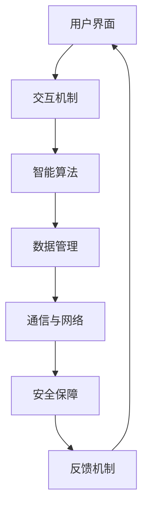
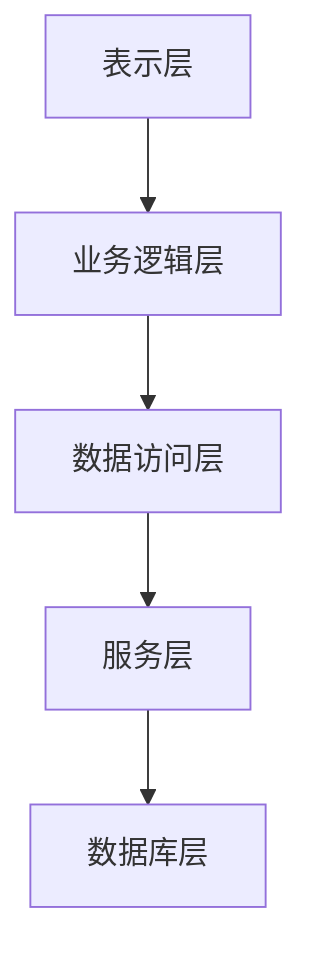

                 

### 《人机协作系统：设计原则与实现策略》概述

在当今数字化时代，人机协作系统已经成为提高工作效率、增强系统智能化的重要工具。本文旨在深入探讨人机协作系统的设计原则与实现策略，从概念解析、设计原则、交互设计、安全性设计到实现策略，全面解析这一领域的核心技术和实践方法。

首先，本文将介绍人机协作系统的定义、背景和发展趋势，明确其在现代信息技术中的重要性。接着，我们将详细阐述人机协作系统的设计原则，包括可用性、可靠性、适应性和用户体验设计原则，确保系统的有效性和用户满意度。在此基础上，本文还将探讨人机协作系统的交互设计，重点分析人机交互的基本原理、界面设计以及用户研究。

安全性是任何系统设计的关键要素，因此，本文将专门讨论人机协作系统的安全性设计，解析其重要性、安全威胁以及设计方法和工具。随后，我们将探讨人机协作系统的架构设计，从原则、分层架构到系统模块划分与功能，为系统的稳定性和扩展性提供保障。

在实现策略部分，本文将详细讲解人机协作系统的算法实现和开发与测试流程，帮助读者理解人工智能算法基础、机器学习算法在协作系统中的应用，以及系统的开发、测试与优化方法。最后，本文将介绍人机协作系统在智能客服、智能教育和智能医疗等领域的应用案例，通过实际案例展示系统的强大功能。

通过本文的深入探讨，读者将全面了解人机协作系统的设计原则与实现策略，掌握相关技术和实践方法，为未来的人机协作系统开发提供有力支持。

### 关键词

人机协作系统，设计原则，实现策略，交互设计，安全性设计，智能客服，智能教育，智能医疗。

### 文章摘要

本文系统性地探讨了人机协作系统的设计原则与实现策略。首先，介绍了人机协作系统的定义、背景和发展趋势，明确了其重要性。接着，详细阐述了设计原则，包括可用性、可靠性、适应性和用户体验设计原则。随后，讨论了交互设计、安全性设计，并介绍了人机协作系统的架构设计。在实现策略部分，本文详细讲解了算法实现和开发与测试流程，最后通过应用案例展示了人机协作系统在智能客服、智能教育和智能医疗等领域的实际应用。通过本文的阅读，读者将全面了解人机协作系统的设计原则与实现策略，为未来的系统开发提供理论支持和实践指导。

## 第一部分：人机协作系统的概念与框架

### 第1章：人机协作系统概述

#### 1.1 人机协作系统的定义与背景

人机协作系统（Human-Computer Collaboration System，简称HCCS）是一种结合人类智慧和计算机技术的智能系统，通过人机互动和协作，实现高效、智能化的任务处理和问题解决。随着信息技术的飞速发展，人机协作系统已成为提升工作效率、优化业务流程、增强系统智能化的重要手段。

人机协作系统的起源可以追溯到计算机科学和人工智能的早期发展时期。在20世纪60年代，计算机开始被用于辅助人类进行复杂计算和数据处理，人机交互（Human-Computer Interaction，简称HCI）概念逐渐形成。随着计算能力的提升和人工智能技术的突破，人机协作系统逐渐从单一的任务辅助走向综合的智能协作，成为现代信息技术体系的重要组成部分。

在现代信息技术中，人机协作系统的重要性体现在以下几个方面：

1. **提高工作效率**：通过自动化和智能化手段，人机协作系统能够显著降低人力成本，提高工作效率，特别是在处理大量重复性、繁琐的任务时，优势尤为明显。
2. **优化业务流程**：人机协作系统能够分析和优化业务流程，提高业务运行的透明度和效率，帮助企业实现资源的最优配置。
3. **增强智能化**：人机协作系统通过不断学习和优化，能够逐渐增强系统的智能化水平，实现从被动响应到主动服务的转变。

#### 1.2 人机协作系统的发展趋势

随着技术的不断进步，人机协作系统正朝着智能化、个性化和自适应化的方向发展，具体趋势如下：

1. **智能化**：人工智能技术的快速发展，使得人机协作系统能够具备更强的学习能力、推理能力和决策能力，实现更高效的人机互动。
2. **个性化**：通过大数据分析和机器学习技术，人机协作系统能够根据用户行为和需求，提供个性化的服务和支持，提高用户体验。
3. **自适应化**：人机协作系统将具备更强的自适应能力，能够根据环境变化和任务需求，动态调整系统功能和行为，实现智能化管理。

#### 1.3 人机协作系统的核心组成部分

人机协作系统的核心组成部分包括以下几个方面：

1. **用户界面**：用户界面（User Interface，简称UI）是人机协作系统的入口，用于实现用户与系统的交互。一个良好的用户界面应具备简洁、直观、易用的特点。
2. **交互机制**：交互机制是人机协作系统实现用户与系统互动的关键，包括输入、输出、反馈等环节。有效的交互机制能够提高系统的响应速度和交互体验。
3. **智能算法**：智能算法是人机协作系统的核心，用于处理和分析数据，实现任务自动分配、决策优化等功能。常见的智能算法包括机器学习、深度学习、自然语言处理等。
4. **数据管理**：数据管理是人机协作系统的数据基础，包括数据的采集、存储、处理和分析等环节。高效的数据管理能够保证系统的高效运行和数据的准确性。
5. **安全保障**：安全保障是人机协作系统的关键，包括数据安全、系统安全等。通过安全设计、加密技术等手段，确保系统的可靠性和数据的安全。

通过以上对人机协作系统的概述，我们可以看到其在现代信息技术中的重要地位和未来发展潜力。在接下来的章节中，我们将进一步探讨人机协作系统的设计原则和实现策略，为实际应用提供理论支持和实践指导。

#### 1.4 人机协作系统的基本组成部分

人机协作系统由多个关键组成部分构成，这些部分相互协作，共同实现高效的人机互动。以下是人机协作系统的几个核心组成部分及其简要说明：

1. **用户界面（User Interface, UI）**：
   用户界面是系统与用户之间的交互窗口。一个优秀的用户界面应具备简洁、直观和易用的特性，确保用户能够快速上手并高效使用系统。用户界面包括图形用户界面（GUI）和命令行界面（CLI），前者通过图形元素和布局来简化操作，后者则通过命令行进行交互。

2. **交互机制（Interaction Mechanism）**：
   交互机制是实现用户与系统间互动的基础。这包括输入设备（如键盘、鼠标、触摸屏等）和输出设备（如显示器、扬声器等）的使用。此外，交互机制还包括反馈机制，确保用户在执行操作时能够得到及时的响应。

3. **智能算法（Intelligent Algorithms）**：
   智能算法是人机协作系统的核心，用于处理和分析数据，提供智能化的决策支持。常见的智能算法包括机器学习（Machine Learning，ML）、深度学习（Deep Learning，DL）和自然语言处理（Natural Language Processing，NLP）。这些算法能够帮助系统理解和学习用户的操作模式，从而提供个性化的服务。

4. **数据管理（Data Management）**：
   数据管理是人机协作系统的基础，包括数据的采集、存储、处理和分析等环节。高效的数据管理系统能够确保数据的准确性和完整性，从而为系统的智能决策提供可靠依据。

5. **通信与网络（Communication and Network）**：
   人机协作系统通常需要通过网络与其他系统进行数据交换和协作。通信与网络部分负责确保数据传输的安全、高效和可靠。

6. **安全保障（Security）**：
   安全保障是任何系统的关键，人机协作系统也不例外。安全保障包括数据加密、访问控制、网络安全等技术，用于防止数据泄露、系统篡改等安全威胁。

通过这些关键组成部分的协同工作，人机协作系统能够实现高效、智能化的任务处理和问题解决，从而为用户和企业带来显著的价值。

为了更直观地展示人机协作系统的组成部分及其关系，我们可以使用Mermaid流程图来描绘其整体架构：



在此流程图中，用户界面（A）作为系统的入口，接收用户的操作指令；交互机制（B）处理这些指令，并提供反馈（G）；智能算法（C）分析用户操作数据，提供智能化的决策支持；数据管理（D）确保数据的准确性和完整性；通信与网络（E）负责数据交换和协作；安全保障（F）确保系统的可靠性和数据安全。整个系统通过各部分的协同工作，实现高效的人机协作。

#### 1.5 人机协作系统的发展历程

人机协作系统的发展历程可以追溯到计算机科学和人工智能的早期探索。以下是人机协作系统的发展历程及其关键里程碑：

1. **早期探索（1960s）**：
   在20世纪60年代，计算机开始被用于辅助人类进行复杂计算和数据处理。人机交互（Human-Computer Interaction，简称HCI）概念逐渐形成。这一时期，计算机主要用于科学计算和学术研究，人机协作的形式相对简单，主要集中在命令行界面和简单的图形用户界面（GUI）。

2. **图形用户界面（1980s）**：
   1980年代，图形用户界面（GUI）的广泛应用标志着人机协作系统的重要进展。这一时期，计算机操作变得更加直观和用户友好。鼠标、触摸屏等输入设备的出现，使得用户能够更方便地与计算机进行交互。代表性的操作系统如苹果公司的Macintosh和微软公司的Windows，推动了人机协作系统的发展。

3. **互联网时代（1990s-2000s）**：
   互联网的普及为人机协作系统带来了新的发展机遇。这一时期，人机协作系统开始从单一的任务辅助走向综合的智能协作。Web浏览器、电子邮件和即时通讯工具等应用的出现，使得用户能够通过网络进行远程协作，提高了工作效率和沟通效果。

4. **人工智能时代（2010s-至今）**：
   人工智能（AI）技术的突破进一步推动了人机协作系统的发展。机器学习、深度学习、自然语言处理等技术在人机协作系统中的应用，使得系统能够更好地理解和响应用户需求。智能客服、智能教育、智能医疗等领域的应用，展示了人机协作系统的巨大潜力。

5. **未来的趋势（2020s-2030s）**：
   未来的人机协作系统将更加智能化、个性化和自适应化。随着5G、物联网、云计算等技术的发展，人机协作系统将实现更高效的资源利用和更广泛的应用场景。智能助理、虚拟现实（VR）、增强现实（AR）等技术的融合，将为人机协作系统带来全新的交互体验。

通过以上发展历程，我们可以看到人机协作系统从简单的计算机辅助到高度智能化的演变过程。随着技术的不断进步，人机协作系统将继续发挥其在现代社会中的重要作用。

### 第2章：人机协作系统的设计原则

#### 2.1 可用性设计原则

可用性（Usability）是人机协作系统设计中的一个核心原则，直接影响系统的易用性和用户体验。一个高可用性的系统应具备以下特点：

1. **简洁性**：系统的界面应简洁明了，避免复杂的布局和操作步骤。简洁的界面能够降低用户的认知负荷，提高操作效率。

2. **直观性**：系统应设计得直观易用，用户能够通过视觉和直觉快速理解界面元素和操作方式。例如，按钮和图标的设计应符合用户期望和习惯，避免使用过于抽象或难以理解的元素。

3. **一致性**：系统的界面设计应保持一致性，包括色彩搭配、字体大小、按钮样式等。一致性有助于用户建立操作习惯，减少学习成本。

4. **反馈机制**：系统应提供及时的反馈，确保用户在执行操作时能够了解系统状态和结果。反馈可以是视觉提示、声音提示或文字提示，以帮助用户确认操作成功或出现错误。

5. **可访问性**：系统应考虑到不同用户群体的需求，包括视力障碍、听力障碍、行动不便等。通过无障碍设计，确保所有用户都能无障碍地使用系统。

6. **灵活性**：系统应具有一定的灵活性，允许用户根据自己的需求调整界面和操作方式。例如，用户可以选择不同的语言、界面布局或快捷键，以提高个性化体验。

#### 2.2 可靠性设计原则

可靠性（Reliability）是人机协作系统设计中的另一个关键原则，确保系统在各种环境下能够稳定运行，提供准确和一致的服务。以下是一些可靠性设计的关键点：

1. **容错性**：系统应具备容错能力，能够检测和纠正错误。例如，当系统检测到硬件故障或软件错误时，应能够自动切换到备份系统或提供错误恢复机制，确保系统的连续运行。

2. **稳定性**：系统应设计得稳定，能够在长时间运行和承受高负载的情况下保持性能。通过性能优化、资源管理和负载均衡等技术，提高系统的稳定性。

3. **安全性**：系统应具备严格的安全措施，防止未经授权的访问和数据泄露。通过加密技术、身份验证和访问控制等手段，确保系统的安全运行。

4. **备份与恢复**：系统应具备数据备份和恢复机制，确保在灾难发生时能够迅速恢复数据。例如，定期备份数据、配置冗余系统等，以减少数据丢失的风险。

5. **实时监控**：系统应具备实时监控系统状态和性能的能力。通过监控工具和告警机制，及时发现和解决问题，确保系统的可靠性和稳定性。

#### 2.3 适应性设计原则

适应性（Adaptability）设计原则强调系统应具备灵活调整和适应环境变化的能力。以下是适应性设计的几个关键点：

1. **可扩展性**：系统应设计得具有高度可扩展性，能够方便地添加新功能和模块。通过模块化设计、插件机制等，提高系统的灵活性和可维护性。

2. **可配置性**：系统应允许用户根据需求进行配置，包括界面布局、功能模块、参数设置等。通过灵活的配置选项，满足不同用户的个性化需求。

3. **灵活性**：系统应具备灵活的交互方式，支持多种输入和输出方式，如触摸、语音、手势等。通过多种交互方式的融合，提高系统的适应性和用户体验。

4. **自适应算法**：系统应采用自适应算法，能够根据用户行为和环境变化动态调整系统行为。例如，智能推荐、实时反馈等，提高系统的适应能力和用户满意度。

5. **跨平台兼容性**：系统应具备跨平台兼容性，能够在不同的操作系统、设备和网络环境下运行。通过统一的技术框架和适配层，确保系统的广泛适用性。

#### 2.4 用户体验设计原则

用户体验（User Experience，简称UX）设计是人机协作系统设计的重要组成部分，直接影响用户对系统的满意度和使用频率。以下是用户体验设计的几个关键原则：

1. **用户中心**：设计应始终以用户为中心，充分考虑用户的需求和期望。通过用户研究和需求分析，确保设计符合用户实际使用场景和操作习惯。

2. **易用性**：系统应设计得易于使用，用户能够快速上手并高效完成任务。通过简洁、直观的界面和操作流程，减少用户的学习成本和操作错误。

3. **一致性**：系统的界面和操作应保持一致性，确保用户在不同场景下有统一的使用体验。一致性有助于用户建立操作习惯，提高使用效率。

4. **反馈和引导**：系统应提供及时的反馈和引导，帮助用户了解系统状态和操作结果。例如，操作成功的提示、错误信息的明确描述等，提高用户的操作信心和满意度。

5. **个性化**：系统应具备个性化功能，允许用户根据个人偏好调整界面和操作方式。通过个性化的设置和推荐，提高用户的满意度和使用体验。

6. **可用性和可靠性**：用户体验设计不仅要关注易用性，还要确保系统的可用性和可靠性。通过严格的质量控制和测试，确保系统在各种环境下都能稳定运行。

通过以上设计原则，人机协作系统可以在可用性、可靠性、适应性和用户体验方面达到一个较高的水平，从而为用户和企业带来显著的价值。

### 第3章：人机协作系统的交互设计

#### 3.1 人机交互的基本原理

人机交互（Human-Computer Interaction，简称HCI）是设计人机协作系统的核心环节，其基本原理直接影响系统的可用性和用户体验。理解人机交互的基本原理有助于设计出更加直观、易用和高效的系统。

1. **感知原理**：人机交互的基础是用户的感知。用户通过视觉、听觉、触觉等感官感知系统的输出，了解系统的状态和反馈。因此，系统的设计应充分考虑用户感知的特性，确保输出信息清晰、直观和易于理解。

2. **反馈原理**：反馈是人机交互的关键，用户通过系统的反馈来确认自己的操作是否成功。良好的反馈机制能够提高用户的操作信心和满意度。例如，当用户执行一个操作时，系统应提供即时、明确和一致的反馈，如成功提示、错误信息等。

3. **控制原理**：控制是人机交互的核心，用户通过输入设备（如键盘、鼠标、触摸屏等）控制系统的行为。系统的设计应确保输入机制的直观性和灵活性，使用户能够方便、高效地进行操作。例如，系统的界面布局应简洁明了，操作步骤应直观易懂。

4. **适应原理**：人机交互系统应具备适应用户需求和环境变化的能力。通过自适应算法和个性化设置，系统能够根据用户行为和环境动态调整功能和行为，提高用户的操作效率和满意度。

5. **一致性原理**：一致性是人机交互设计的重要原则，确保用户在不同场景下有统一的使用体验。一致性包括界面风格、操作逻辑、反馈机制等方面的统一。通过一致性设计，用户能够快速上手并高效使用系统。

6. **易用性原理**：易用性是人机交互设计的核心目标，系统应设计得简洁、直观和易用。通过简洁的界面、直观的操作流程和清晰的反馈，降低用户的学习成本和操作错误率。

#### 3.2 人机交互界面设计

人机交互界面设计是用户与系统交互的直接媒介，其设计质量直接影响用户体验。以下是人机交互界面设计的关键要素：

1. **布局设计**：界面布局应简洁、直观，确保用户能够快速找到所需功能和信息。布局设计应遵循“黄金比例”、“F型布局”等原则，提高界面的视觉舒适度和易用性。

2. **色彩运用**：色彩设计应充分考虑用户心理和视觉舒适度。合理的色彩搭配能够提高界面的美观度和可读性，增强用户的操作信心。例如，蓝色常用于表示冷静和可靠，绿色常用于表示成功和提示。

3. **字体设计**：字体设计应选择清晰、易读的字体，确保用户能够轻松识别文本信息。字体大小和样式应保持一致，避免使用过于复杂的字体，降低用户的认知负荷。

4. **图标设计**：图标设计应简洁、直观，能够快速传达信息。图标应遵循一致性原则，避免使用过于抽象或难以理解的符号。

5. **交互元素**：交互元素（如按钮、输入框、滑块等）的设计应充分考虑用户交互习惯。按钮的大小、形状和颜色应易于点击和识别，输入框应提供适当的提示和帮助。

6. **导航设计**：导航设计应简洁、直观，确保用户能够方便地访问系统的各个部分。常见的导航设计包括顶部导航栏、侧边栏、面包屑导航等。

7. **响应速度**：界面设计应确保系统的响应速度。过长的响应时间会导致用户操作滞后，降低用户体验。通过优化页面加载速度和系统性能，提高系统的响应速度。

8. **可访问性**：界面设计应考虑到不同用户群体的需求，包括视力障碍、听力障碍、行动不便等。通过无障碍设计，确保所有用户都能无障碍地使用系统。

通过以上人机交互界面设计的原则，可以设计出更加直观、易用和高效的人机协作系统界面，为用户提供优质的交互体验。

#### 3.3 交互设计中的用户研究

交互设计中的用户研究是确保系统设计符合用户需求和使用习惯的关键环节。通过用户研究，设计师可以深入了解用户的需求、行为和偏好，从而制定出更符合实际应用场景的系统设计。

1. **用户访谈**：用户访谈是用户研究的常用方法，通过与目标用户进行面对面的交流，深入了解用户的需求、痛点和使用习惯。访谈过程中，设计师应提出开放性问题，鼓励用户分享他们的真实感受和期望。

2. **用户观察**：用户观察是通过直接观察用户在使用系统时的行为和操作，了解用户的实际使用场景和问题。观察方法可以是现场观察、视频记录等。通过观察，设计师可以发现用户在操作过程中可能遇到的困难和困惑。

3. **用户测试**：用户测试是在设计阶段邀请目标用户对系统进行实际操作，收集用户的反馈和评价。用户测试可以是功能测试、可用性测试等，通过模拟真实使用场景，评估系统的易用性和用户体验。

4. **问卷调查**：问卷调查是一种广泛应用的用户研究方法，通过设计问卷收集用户的反馈和意见。问卷应设计得简洁明了，避免过多冗长的选择题和开放式问题。通过问卷调查，可以快速收集大量用户的数据，为系统设计提供参考。

5. **用户画像**：用户画像是通过分析用户的特征和行为，构建出一个典型的用户模型。通过用户画像，设计师可以更好地理解目标用户，制定出更有针对性的系统设计。

6. **竞品分析**：竞品分析是通过研究竞争对手的产品设计，了解行业最佳实践和用户需求。竞品分析可以帮助设计师发现自身产品的优势和不足，从而进行优化和改进。

通过以上用户研究方法，设计师可以全面了解用户的需求和使用习惯，从而制定出更符合用户期望的系统设计。用户研究的深度和广度直接关系到系统设计的成功与否，因此，在交互设计过程中，用户研究应被高度重视。

#### 3.4 人机协作系统交互设计的最佳实践

在人机协作系统的交互设计中，遵循最佳实践可以显著提升系统的易用性和用户体验。以下是一些关键的最佳实践：

1. **简洁性**：界面设计应简洁明了，避免过多的功能模块和信息堆叠。通过合理布局和重点突出，确保用户能够快速找到所需功能和信息。

2. **一致性**：界面和操作应保持一致性，包括色彩、字体、图标等设计元素。一致性有助于用户建立操作习惯，降低学习成本。此外，系统在不同平台和设备上的界面设计也应保持一致。

3. **响应速度**：系统应具备良好的响应速度，确保用户操作得到即时反馈。通过优化页面加载速度和系统性能，减少用户的等待时间和操作滞后。

4. **易用性**：界面设计应充分考虑用户的操作习惯和使用场景，确保系统易于上手和使用。通过简洁的操作流程和清晰的反馈机制，提高用户的操作效率和满意度。

5. **个性化**：系统应提供个性化设置和推荐功能，允许用户根据个人偏好调整界面和操作方式。通过个性化设置，提高用户的满意度和使用体验。

6. **可访问性**：界面设计应考虑不同用户群体的需求，包括视力障碍、听力障碍、行动不便等。通过无障碍设计，确保所有用户都能无障碍地使用系统。

7. **用户测试**：在系统设计过程中，应进行多次用户测试，收集用户的反馈和意见。通过用户测试，可以发现系统存在的问题和改进方向，为优化设计提供依据。

8. **持续优化**：交互设计不是一次性的工作，而是一个持续优化的过程。通过持续的用户研究和反馈收集，不断改进系统设计，提高用户体验。

通过以上最佳实践，人机协作系统的交互设计可以更加贴近用户需求，提高系统的易用性和用户体验，从而为用户和企业带来更大的价值。

### 第4章：人机协作系统的安全性设计

#### 4.1 安全性设计的重要性

在人机协作系统中，安全性设计是一个不可忽视的重要环节。随着信息技术的飞速发展，数据泄露、网络攻击、恶意软件等安全威胁日益增多，对系统的稳定运行和用户隐私构成了严重威胁。因此，安全性设计在确保系统可靠性和数据安全方面具有至关重要的作用。

1. **保护用户隐私**：人机协作系统通常涉及大量的用户数据，包括个人信息、操作记录等。安全性设计能够有效保护用户的隐私，防止数据泄露和滥用，增强用户的信任感。

2. **确保系统稳定性**：安全性设计能够防止系统受到恶意攻击和篡改，确保系统的稳定性和连续运行。通过安全防护措施，如防火墙、入侵检测等，降低系统故障的风险。

3. **提升用户体验**：良好的安全性设计可以提高用户的使用体验，使用户在安全的环境中操作，减少因安全隐患导致的操作中断和不便。

4. **遵守法律法规**：随着各国对数据安全的法律法规不断完善，人机协作系统必须遵守相关法律法规，确保数据安全。例如，欧盟的《通用数据保护条例》（GDPR）对个人数据的保护提出了严格要求。

#### 4.2 人机协作系统的安全威胁

人机协作系统面临多种安全威胁，了解这些威胁有助于制定有效的安全设计策略。以下是一些常见的安全威胁：

1. **数据泄露**：未经授权的访问和数据泄露是系统面临的主要安全威胁之一。黑客可能通过网络攻击、漏洞利用等方式获取用户数据，导致严重后果。

2. **网络攻击**：网络攻击包括分布式拒绝服务（DDoS）攻击、SQL注入、跨站脚本攻击（XSS）等。这些攻击可以导致系统瘫痪、数据泄露等严重问题。

3. **恶意软件**：恶意软件（如病毒、木马等）可以通过网络传播，侵入系统并执行恶意操作，导致系统性能下降、数据丢失等。

4. **内部威胁**：内部威胁来自系统内部人员，如员工滥用权限、泄露敏感信息等。内部威胁通常更难防范，因为内部人员拥有合法访问权限。

5. **物理安全**：物理安全涉及系统设备的保护，如服务器、存储设备等。如果设备被盗或损坏，可能导致数据丢失和系统瘫痪。

6. **社会工程学攻击**：社会工程学攻击利用人类的心理弱点，如欺骗、诱惑等手段，骗取用户的敏感信息和访问权限。

#### 4.3 安全性设计的方法和工具

为了应对人机协作系统的安全威胁，需要采取一系列安全和防护措施。以下是几种常用的安全设计方法和工具：

1. **身份验证和访问控制**：
   - **身份验证**：通过用户名和密码、双因素认证（2FA）等方式，确保只有授权用户才能访问系统。
   - **访问控制**：通过角色权限设置、访问控制列表（ACL）等机制，限制不同用户对系统资源的访问权限。

2. **加密技术**：
   - **数据加密**：对存储和传输的数据进行加密，确保数据在未授权的情况下无法读取。
   - **传输层加密**：使用TLS（传输层安全协议）等加密技术，确保数据在传输过程中不被窃听和篡改。

3. **网络安全**：
   - **防火墙**：设置防火墙，阻止未经授权的访问和攻击。
   - **入侵检测系统（IDS）**：部署入侵检测系统，实时监控网络流量，检测和阻止攻击行为。
   - **安全审计**：定期进行安全审计，检测系统中的漏洞和安全隐患。

4. **数据备份和恢复**：
   - **定期备份**：定期备份系统数据和配置，确保在数据丢失或系统故障时能够迅速恢复。
   - **灾难恢复计划**：制定灾难恢复计划，确保在发生重大灾难时系统能够快速恢复。

5. **安全培训**：
   - **员工培训**：定期对员工进行安全培训，提高员工的安全意识和应对能力。
   - **安全意识宣传**：通过安全意识宣传活动，提高全体员工的安全意识。

6. **合规性检查**：
   - **法律合规性**：确保系统设计符合相关法律法规的要求，如GDPR、CCPA等。
   - **标准认证**：通过安全标准认证，如ISO 27001、PCI DSS等，确保系统的安全性。

通过以上方法和工具，人机协作系统的安全性设计可以更加全面和有效，确保系统的稳定运行和用户数据的安全。

### 第5章：人机协作系统的架构设计

#### 5.1 系统架构设计的原则

在人机协作系统的架构设计中，遵循一些基本原则可以确保系统的稳定性、扩展性和可维护性。以下是几个关键原则：

1. **模块化设计**：系统应采用模块化设计，将系统功能划分为多个独立的模块。模块化设计可以提高系统的可维护性，便于模块的替换和升级。每个模块应具有明确的职责和接口，降低模块之间的耦合度。

2. **分层架构**：系统应采用分层架构，将系统功能划分为多个层次，如表示层、业务逻辑层、数据访问层等。分层架构可以提高系统的可扩展性和可维护性，便于不同层次之间的分工和协作。

3. **高内聚低耦合**：系统设计应遵循高内聚低耦合原则，确保模块内部功能紧密相关，模块之间耦合度低。高内聚低耦合可以提高系统的灵活性和可维护性。

4. **性能优化**：系统架构设计应考虑性能优化，包括系统负载均衡、缓存机制、数据库优化等。通过性能优化，可以提高系统的响应速度和处理能力，提升用户体验。

5. **安全性设计**：系统架构设计应充分考虑安全性，包括数据加密、身份验证、访问控制等。通过安全性设计，可以确保系统在面临各种安全威胁时能够保持稳定运行。

6. **可扩展性**：系统架构设计应具备良好的扩展性，能够方便地添加新功能和模块。通过采用分布式架构、微服务架构等，可以提高系统的扩展能力，适应业务发展的需求。

7. **可维护性**：系统架构设计应考虑可维护性，包括代码的可读性、注释的完整性、测试的覆盖率等。良好的可维护性可以降低系统的维护成本，提高开发效率。

#### 5.2 人机协作系统的分层架构

人机协作系统的分层架构是系统设计的重要组成部分，通过分层架构可以实现系统功能的分离和模块化。以下是人机协作系统的常见分层架构：

1. **表示层（Presentation Layer）**：
   表示层是用户与系统的交互界面，负责接收用户输入、展示系统输出和响应用户操作。表示层通常包括前端代码、UI设计、客户端应用程序等。

2. **业务逻辑层（Business Logic Layer）**：
   业务逻辑层是系统的核心，负责处理业务逻辑和数据处理。业务逻辑层包括业务规则、算法实现、数据处理等，是系统功能实现的关键部分。

3. **数据访问层（Data Access Layer）**：
   数据访问层负责与数据库进行交互，实现数据的存储、读取和操作。数据访问层通常包括数据模型、数据库操作接口等。

4. **服务层（Service Layer）**：
   服务层是系统对外提供服务的接口，负责与其他系统进行通信和协作。服务层包括API接口、消息队列、微服务等。

5. **数据库层（Database Layer）**：
   数据库层负责存储和管理系统的数据，包括用户数据、业务数据等。数据库层通常采用关系型数据库或非关系型数据库。

通过分层架构，人机协作系统可以实现功能分离和模块化，提高系统的可扩展性和可维护性。以下是一个典型的分层架构图：



在此架构图中，表示层（A）负责用户交互，业务逻辑层（B）处理业务逻辑和数据操作，数据访问层（C）实现与数据库的交互，服务层（D）提供对外服务接口，数据库层（E）负责数据存储和管理。各层之间通过明确的接口进行通信，确保系统的稳定运行和功能扩展。

#### 5.3 系统模块的划分与功能

在人机协作系统中，模块的划分和功能设计是实现系统功能的关键。以下是常见的人机协作系统模块及其功能：

1. **用户管理模块**：
   用户管理模块负责用户身份验证、权限管理和用户数据管理。功能包括用户注册、登录、密码重置、权限分配等。

2. **任务管理模块**：
   任务管理模块负责任务的创建、分配、跟踪和监控。功能包括任务创建、任务分配、任务进度跟踪、任务完成状态等。

3. **数据管理模块**：
   数据管理模块负责数据的存储、读取和操作。功能包括数据表设计、数据查询、数据导入导出等。

4. **交互设计模块**：
   交互设计模块负责用户界面的设计和用户交互的实现。功能包括界面布局、UI组件设计、交互逻辑等。

5. **智能算法模块**：
   智能算法模块负责实现系统的智能功能，包括机器学习、自然语言处理、图像识别等。功能包括算法实现、模型训练、算法调用等。

6. **日志管理模块**：
   日志管理模块负责记录系统的运行日志，包括错误日志、操作日志等。功能包括日志收集、日志存储、日志查询等。

7. **安全性管理模块**：
   安全性管理模块负责系统的安全防护，包括身份验证、访问控制、数据加密等。功能包括用户认证、权限控制、数据加密等。

8. **消息通知模块**：
   消息通知模块负责系统消息的发送和通知，包括系统通知、任务通知等。功能包括消息发送、消息存储、消息推送等。

9. **系统监控模块**：
   系统监控模块负责实时监控系统的运行状态，包括性能监控、错误监控等。功能包括性能指标采集、错误日志收集、监控告警等。

通过以上模块的划分和功能设计，人机协作系统可以实现高效、稳定和智能化的运行。模块之间通过接口进行通信和协作，确保系统的整体功能和性能。

### 第6章：人机协作系统的算法实现

#### 6.1 人工智能算法基础

人工智能（AI）算法是人机协作系统的核心组成部分，它们通过处理和分析大量数据，实现智能决策和自动化任务。以下是几种常见的人工智能算法及其基本原理：

1. **机器学习（Machine Learning，ML）**：
   机器学习是AI的核心技术之一，通过训练模型从数据中自动学习规律和模式。常见的机器学习算法包括：

   - **线性回归（Linear Regression）**：用于预测连续值，通过拟合数据中的线性关系实现预测。
   - **逻辑回归（Logistic Regression）**：用于分类问题，通过拟合数据中的逻辑关系实现分类。
   - **决策树（Decision Tree）**：通过多级决策实现分类或回归，具备直观的解释性。
   - **随机森林（Random Forest）**：通过集成多个决策树实现预测，提高模型的泛化能力。
   - **支持向量机（Support Vector Machine，SVM）**：通过寻找最优超平面实现分类。

2. **深度学习（Deep Learning，DL）**：
   深度学习是机器学习的一种特殊形式，通过构建多层的神经网络模型实现复杂任务。常见的深度学习算法包括：

   - **卷积神经网络（Convolutional Neural Network，CNN）**：用于图像处理和识别，通过卷积层提取特征。
   - **循环神经网络（Recurrent Neural Network，RNN）**：用于序列数据处理，通过循环结构保持长期记忆。
   - **长短期记忆网络（Long Short-Term Memory，LSTM）**：RNN的一种改进，用于解决长期依赖问题。
   - **生成对抗网络（Generative Adversarial Network，GAN）**：通过对抗性训练生成逼真的数据。

3. **自然语言处理（Natural Language Processing，NLP）**：
   自然语言处理是AI的重要领域，用于理解和生成自然语言。常见的NLP算法包括：

   - **词袋模型（Bag of Words，BoW）**：通过统计词频实现文本表示。
   - **词嵌入（Word Embedding）**：通过将词映射到高维空间实现语义表示，如Word2Vec、GloVe等。
   - **序列标注（Sequence Labeling）**：对文本序列中的词语进行分类标注，如命名实体识别、情感分析等。
   - **文本分类（Text Classification）**：通过分类模型对文本进行分类，如主题分类、情感分类等。

通过上述人工智能算法，人机协作系统可以实现数据挖掘、智能决策、自动化任务等多种功能。接下来，我们将通过Python源代码详细讲解一个简单的机器学习算法——线性回归的实现过程，帮助读者理解算法原理和应用。

```python
import numpy as np

# 线性回归模型
class LinearRegression:
    def __init__(self):
        self.coefficients = None
    
    # 训练模型
    def fit(self, X, y):
        # X: 特征矩阵，y: 目标值
        self.coefficients = np.linalg.inv(X.T.dot(X)).dot(X.T).dot(y)
    
    # 预测
    def predict(self, X):
        # X: 特征矩阵
        return X.dot(self.coefficients)

# 示例数据
X = np.array([[1, 2], [2, 3], [3, 4], [4, 5]])
y = np.array([3, 4, 5, 6])

# 创建模型并训练
model = LinearRegression()
model.fit(X, y)

# 预测
predictions = model.predict(X)
print("预测值：", predictions)

# 比较预测值和实际值
print("实际值 - 预测值：", y - predictions)
```

在这段代码中，我们首先定义了一个线性回归模型类`LinearRegression`。模型类的`fit`方法用于训练模型，计算并设置模型的系数；`predict`方法用于预测新的特征数据。我们使用了一个简单的示例数据集，通过调用`fit`方法训练模型，然后使用`predict`方法进行预测。最后，我们比较了预测值和实际值，验证了模型的准确性。

通过这个示例，我们可以看到如何使用Python实现线性回归算法，并理解其基本原理和应用。在后续章节中，我们将继续探讨更复杂的机器学习算法和深度学习算法的实现，帮助读者深入了解人机协作系统的算法实现策略。

### 第6章：人机协作系统的算法实现（续）

#### 6.2 人机协作中的机器学习算法

在人机协作系统中，机器学习算法扮演着至关重要的角色，它们能够从大量数据中提取有价值的信息，辅助系统进行智能决策和优化操作。以下是几种常见的人机协作系统中的机器学习算法及其应用场景：

1. **决策树（Decision Tree）**：
   决策树是一种直观的机器学习算法，通过一系列的决策节点，将数据集划分成不同的区域。每个节点代表一个特征，每个分支代表不同特征取值。决策树在分类和回归任务中都有广泛应用。例如，在智能客服系统中，可以使用决策树模型来预测用户的问题类型，从而提供更准确的回答。

2. **随机森林（Random Forest）**：
   随机森林是一种集成学习方法，通过构建多个决策树，并取它们的投票结果进行预测。随机森林在处理复杂数据和高维特征时表现出色，能够提高模型的预测准确性和泛化能力。在智能医疗系统中，随机森林可以用于诊断病人的疾病，通过分析病史和检查结果，提供准确的诊断建议。

3. **支持向量机（Support Vector Machine，SVM）**：
   支持向量机是一种强大的分类算法，通过寻找最优的超平面将数据集分类。SVM在处理高维数据和线性不可分问题时表现出色。在智能教育系统中，SVM可以用于学生成绩预测，通过分析学生的学习行为和历史成绩，预测未来的成绩表现。

4. **神经网络（Neural Network）**：
   神经网络，特别是深度学习模型，能够在复杂的任务中表现出色。深度学习模型通过多层神经网络结构，逐层提取数据的特征，实现高层次的抽象和表示。在智能语音识别系统中，深度学习模型可以用于语音信号的识别，通过训练模型，实现对语音内容的准确识别和理解。

5. **聚类算法（Clustering Algorithms）**：
   聚类算法用于将数据集划分成若干个组，使得同一组内的数据点相似度较高，而不同组的数据点相似度较低。常见的聚类算法包括K-means、层次聚类等。在智能推荐系统中，聚类算法可以用于用户分群，通过分析用户的兴趣和行为，将用户划分为不同的群体，从而提供个性化的推荐。

#### 6.3 人机协作系统的算法优化

为了提高人机协作系统的性能和用户体验，算法优化是一个重要的环节。以下是一些常见的算法优化策略：

1. **模型选择与调优**：
   选择合适的模型并对其进行调优，可以提高算法的性能。通过交叉验证和超参数优化，可以找到最佳的模型参数，从而提高模型的预测准确性和泛化能力。

2. **数据预处理**：
   数据预处理是算法优化的重要步骤，包括数据清洗、缺失值填充、数据标准化等。通过合理的数据预处理，可以减少数据噪声和异常值的影响，提高模型的训练效果。

3. **特征选择**：
   特征选择是算法优化的关键，通过选择重要的特征，可以减少模型训练的时间和计算复杂度。常用的特征选择方法包括特征重要性排序、基于信息的特征选择等。

4. **分布式计算**：
   对于大规模数据集，分布式计算可以显著提高算法的训练速度。通过分布式计算框架（如Spark、TensorFlow等），可以将数据集分割成多个部分，并行进行训练，从而提高计算效率。

5. **模型压缩与加速**：
   模型压缩和加速是提高算法性能的有效方法。通过模型剪枝、量化等技术，可以减少模型的参数数量和计算复杂度，从而提高模型的运行速度。

6. **在线学习与动态调整**：
   在线学习可以让模型实时更新和调整，以适应不断变化的数据和环境。通过在线学习，系统能够不断优化和改进，提高其适应性和智能水平。

通过以上算法优化策略，人机协作系统的性能和用户体验可以得到显著提升，为用户带来更好的服务体验。在实际应用中，需要根据具体场景和需求，选择合适的优化方法，实现算法的持续改进。

### 第7章：人机协作系统的开发与测试

#### 7.1 开发环境的搭建

为了成功开发人机协作系统，首先需要搭建一个稳定且高效的开发环境。以下是搭建开发环境的详细步骤：

1. **硬件配置**：
   - **服务器**：选择性能稳定的服务器，配置应包括多核处理器、足够的内存和高速硬盘。对于大型系统，可能需要使用集群服务器以提高计算能力。
   - **网络设备**：配置高性能的网络设备，如路由器、交换机等，确保网络稳定和高速。

2. **操作系统**：
   - **Linux**：推荐使用Linux操作系统，如Ubuntu、CentOS等。Linux系统具有高性能、稳定性和开源优势，适合服务器端应用。
   - **Windows**：对于客户端应用，可以使用Windows操作系统，确保与各种软件和硬件兼容。

3. **开发工具**：
   - **集成开发环境（IDE）**：选择适合的开发环境，如Eclipse、IntelliJ IDEA等。IDE提供代码编辑、调试、构建等功能，提高开发效率。
   - **版本控制**：使用Git等版本控制工具，管理代码版本，便于协作开发和代码追踪。

4. **数据库**：
   - **关系型数据库**：如MySQL、PostgreSQL等，用于存储和管理结构化数据。
   - **非关系型数据库**：如MongoDB、Redis等，用于存储和管理非结构化数据或缓存。

5. **中间件**：
   - **消息队列**：如RabbitMQ、Kafka等，用于处理分布式系统的消息传递和异步任务。
   - **Web服务器**：如Nginx、Apache等，用于托管Web应用程序。

6. **开发语言和框架**：
   - **前端**：使用HTML、CSS、JavaScript等基础技术，结合Vue.js、React等框架开发前端界面。
   - **后端**：使用Python（Django、Flask）、Java（Spring Boot）、Node.js等语言和框架开发后端服务。

7. **开发工具链**：
   - **代码编辑器**：如Visual Studio Code、Atom等，提供丰富的插件和功能，提升代码编写体验。
   - **持续集成/持续部署（CI/CD）**：如Jenkins、GitLab CI等，实现自动化构建、测试和部署，提高开发效率和稳定性。

通过以上步骤，我们可以搭建一个完整、高效的开发环境，为接下来的系统开发奠定基础。

#### 7.2 人机协作系统的开发流程

人机协作系统的开发流程可以分为以下几个阶段，每个阶段都有明确的任务和目标：

1. **需求分析**：
   - **需求收集**：与用户、项目经理、业务专家等沟通，收集系统的需求信息。
   - **需求文档**：撰写详细的需求文档，明确系统的功能、性能、用户体验等要求。

2. **系统设计**：
   - **架构设计**：根据需求文档，设计系统的整体架构，包括前端、后端、数据库等。
   - **模块划分**：将系统功能划分为多个模块，每个模块具有独立的职责和接口。

3. **前端开发**：
   - **界面设计**：设计系统的用户界面，包括布局、颜色、字体等。
   - **功能实现**：使用HTML、CSS、JavaScript等技术开发前端功能，确保界面响应快速、用户体验良好。

4. **后端开发**：
   - **服务开发**：使用Python、Java、Node.js等语言开发后端服务，实现系统的业务逻辑和数据管理。
   - **数据库设计**：设计数据库结构，创建必要的表和索引，确保数据存储高效、安全。

5. **系统集成**：
   - **接口集成**：确保前后端接口的兼容性和一致性，实现数据传递和功能调用。
   - **模块集成**：将各个模块的功能整合到系统中，确保模块之间能够无缝协作。

6. **测试阶段**：
   - **单元测试**：对每个模块进行单元测试，确保模块的功能正确和性能良好。
   - **集成测试**：对整个系统进行集成测试，确保各个模块之间的协作无误。
   - **性能测试**：对系统进行负载测试和性能测试，确保系统在高并发情况下能够稳定运行。

7. **部署上线**：
   - **环境搭建**：配置服务器和数据库，搭建生产环境。
   - **部署代码**：将开发好的系统代码部署到服务器，确保系统正常运行。
   - **监控与维护**：部署监控工具，实时监控系统的运行状态，及时处理问题和故障。

通过以上开发流程，人机协作系统可以从需求分析到最终上线，确保系统的功能完备、性能稳定、用户体验良好。

#### 7.3 人机协作系统的测试方法

在人机协作系统的开发过程中，测试是确保系统质量的重要环节。以下是几种常见的测试方法和工具：

1. **单元测试（Unit Testing）**：
   单元测试是对系统中的最小可测试单元（如函数、方法）进行验证。通过编写测试用例，检查每个单元是否按预期工作。Python等编程语言提供了丰富的测试库，如`unittest`、`pytest`，便于编写和执行单元测试。

   ```python
   import unittest
   from my_module import my_function

   class TestMyFunction(unittest.TestCase):
       def test_my_function(self):
           result = my_function(2)
           self.assertEqual(result, 4)

   if __name__ == '__main__':
       unittest.main()
   ```

2. **集成测试（Integration Testing）**：
   集成测试是验证不同模块之间的交互和协作是否正确。通过模拟实际运行环境，将多个模块集成在一起进行测试。常见的工具包括JUnit（Java）、pytest（Python）、Selenium（Web自动化测试）等。

3. **性能测试（Performance Testing）**：
   性能测试旨在评估系统在高负载下的表现，包括响应时间、吞吐量、并发处理能力等。常用的工具包括JMeter、LoadRunner等。通过性能测试，可以发现系统的性能瓶颈，并进行优化。

4. **安全测试（Security Testing）**：
   安全测试用于识别系统中的安全漏洞，防止数据泄露和攻击。常见的安全测试包括SQL注入、XSS攻击、DDoS攻击等。工具如OWASP ZAP、Burp Suite等可以帮助进行安全测试。

5. **用户体验测试（User Experience Testing）**：
   用户体验测试通过模拟用户的使用场景，评估系统的易用性和用户满意度。可以使用工具如Gaze Tracker进行眼动追踪，收集用户的操作数据，分析用户的行为和偏好。

通过以上测试方法和工具，可以全面评估人机协作系统的质量和性能，确保系统在实际应用中的稳定性和可靠性。

### 第8章：人机协作系统的部署与维护

#### 8.1 系统部署的策略

在人机协作系统的开发完成后，系统的部署是确保其能够顺利上线并稳定运行的关键环节。以下是系统部署的策略和步骤：

1. **部署前的准备**：
   - **环境配置**：根据开发环境，配置生产环境的服务器、数据库、中间件等，确保所有硬件和软件组件正常运行。
   - **软件安装**：安装操作系统、开发工具、数据库、中间件等，确保软件版本兼容性。
   - **依赖管理**：确保所有依赖库和框架的正确安装，如Python的库、Node.js的模块等。

2. **部署流程**：
   - **代码部署**：通过版本控制系统（如Git）将代码从开发环境推送到生产环境，确保代码的版本一致性。
   - **配置管理**：配置系统参数和环境变量，如数据库连接信息、服务器端口等，确保系统配置正确。
   - **自动化部署**：使用自动化部署工具（如Jenkins、Ansible）实现代码的自动化部署，提高部署效率和一致性。

3. **部署方式**：
   - **手动部署**：通过手工执行部署命令，逐个安装和配置软件。这种方法适用于小型系统，但在大规模系统中容易出错且效率低下。
   - **容器化部署**：使用容器化技术（如Docker）部署系统，将应用程序及其依赖打包成一个容器镜像，确保部署的一致性和可移植性。容器化部署适用于分布式系统和微服务架构。
   - **持续集成/持续部署（CI/CD）**：结合CI/CD工具，实现自动化构建、测试和部署，提高部署效率和稳定性。通过CI/CD流水线，可以确保代码从提交到生产环境的全过程自动化，减少人工干预。

#### 8.2 系统维护与管理

系统部署后，持续的维护与管理是确保系统稳定运行和高效服务的关键。以下是系统维护与管理的策略和措施：

1. **监控与告警**：
   - **性能监控**：使用性能监控工具（如Prometheus、Grafana）实时监控系统的CPU、内存、磁盘等资源使用情况，及时发现和处理性能问题。
   - **日志监控**：收集和分析系统日志，包括错误日志、操作日志等，通过日志分析工具（如ELK Stack、Logstash）识别潜在问题。
   - **告警机制**：配置告警机制，当系统出现异常时，通过邮件、短信、电话等方式及时通知运维人员。

2. **备份与恢复**：
   - **数据备份**：定期备份系统数据和配置，确保在数据丢失或系统故障时能够快速恢复。可以使用本地备份、远程备份、云存储等多种备份方式。
   - **灾难恢复**：制定灾难恢复计划，包括数据恢复、系统重建等步骤，确保在发生重大灾难时系统能够迅速恢复。

3. **软件更新与维护**：
   - **版本控制**：使用版本控制系统管理软件更新，确保每次更新都是可控的。更新前进行充分测试，避免引入新问题。
   - **补丁管理**：定期更新系统补丁和依赖库，修复已知漏洞和安全问题。
   - **优化与重构**：定期对系统进行性能优化和重构，提升系统性能和可维护性。

4. **用户反馈与改进**：
   - **用户支持**：提供24/7的用户支持服务，及时响应用户的反馈和问题。
   - **用户满意度调查**：定期进行用户满意度调查，了解用户需求和意见，为系统的改进提供依据。
   - **持续改进**：根据用户反馈和系统监控数据，持续优化系统功能和用户体验。

#### 8.3 系统的可持续性发展

系统的可持续性发展是确保其在长期内能够稳定运行和持续改进的关键。以下是一些策略和措施：

1. **技术更新与迭代**：
   - **技术调研**：定期调研新技术和趋势，评估其对系统的潜在影响，及时引入新技术以提升系统性能和用户体验。
   - **迭代开发**：采用敏捷开发方法，持续迭代和改进系统，快速响应业务需求和变化。

2. **人才队伍建设**：
   - **培训与学习**：为团队成员提供技术培训和学习机会，提高团队的技术水平和创新能力。
   - **人才引进与培养**：吸引和培养优秀人才，建立一支稳定、高效的技术团队。

3. **组织架构优化**：
   - **职责分工**：明确团队职责分工，确保每个成员都有明确的职责和目标。
   - **协作机制**：建立高效的协作机制，促进团队成员之间的沟通和协作，提高团队整体效率。

4. **可持续性发展战略**：
   - **战略规划**：制定系统的长期发展战略，明确系统的发展方向和目标。
   - **持续创新**：鼓励创新思维和探索精神，推动系统的持续改进和创新发展。

通过以上策略和措施，人机协作系统可以实现可持续性发展，为用户和企业带来长期的价值和收益。

### 第9章：人机协作系统在智能客服中的应用

#### 9.1 智能客服概述

智能客服是一种利用人工智能技术实现自动化的客户服务系统，能够高效地处理大量客户咨询，提升客户体验和企业效率。智能客服系统结合自然语言处理（NLP）、机器学习（ML）和深度学习（DL）等技术，通过文本和语音交互与客户进行沟通，提供实时、个性化的服务。

#### 9.2 智能客服系统架构

智能客服系统的架构通常包括以下几个主要部分：

1. **前端界面**：
   - **Web/移动端应用**：通过网页或移动应用与客户进行交互，提供友好的用户界面和便捷的沟通渠道。
   - **语音识别模块**：通过语音识别技术，将客户的语音输入转换为文本，便于后续处理。

2. **后端服务**：
   - **NLP处理模块**：对客户的文本或语音输入进行语义分析、情感分析和意图识别，理解客户的需求。
   - **对话管理模块**：根据识别的结果，生成相应的回复，并与客户进行对话。

3. **业务逻辑层**：
   - **知识库**：存储企业的产品信息、常见问题和答案，供智能客服系统查询和使用。
   - **业务逻辑**：处理复杂的业务逻辑，如订单处理、投诉处理等。

4. **数据存储**：
   - **数据库**：存储客户数据、对话记录、操作日志等，用于分析和优化智能客服系统。

5. **API接口**：
   - **内部API**：智能客服系统内部各模块之间的通信接口。
   - **外部API**：与外部系统（如CRM、ERP等）的接口，实现数据同步和功能扩展。

#### 9.3 智能客服系统实现策略

智能客服系统的实现策略包括以下几个方面：

1. **自然语言处理（NLP）**：
   - **分词**：将客户的文本输入分解为词或短语，便于后续处理。
   - **词性标注**：对每个词进行词性标注，如名词、动词、形容词等，帮助理解文本语义。
   - **情感分析**：分析客户的情绪和态度，如愤怒、满意、失望等，为后续对话提供指导。
   - **意图识别**：识别客户的意图，如咨询产品信息、投诉问题、购买产品等，为系统提供响应策略。

2. **机器学习与深度学习**：
   - **文本分类**：通过训练模型，对客户的问题进行分类，如常见问题、投诉问题等。
   - **序列模型**：使用循环神经网络（RNN）或长短期记忆网络（LSTM）等序列模型，处理复杂的多轮对话。
   - **生成对抗网络（GAN）**：通过对抗性训练，生成更自然的回复，提高对话质量。

3. **对话管理**：
   - **对话状态跟踪**：记录对话过程中的关键信息，如用户意图、上下文等，确保对话连贯性。
   - **对话策略**：根据客户的问题和情绪，设计合适的对话策略，如直接回答、引导提问、推荐解决方案等。
   - **多轮对话**：处理复杂的客户需求，通过多轮对话逐步了解客户的问题，提供个性化的服务。

4. **知识库管理**：
   - **自动更新**：通过机器学习技术，自动更新知识库，确保知识库的实时性和准确性。
   - **人工审核**：定期对知识库进行人工审核，确保答案的准确性和完整性。

5. **性能优化**：
   - **模型优化**：通过模型压缩、量化等技术，提高模型在移动端和边缘设备的运行效率。
   - **负载均衡**：通过负载均衡技术，确保系统在高并发情况下的稳定运行。

通过以上实现策略，智能客服系统能够高效、准确地处理客户咨询，提升客户满意度和企业效率。在实际应用中，可以根据具体需求和环境，灵活调整和优化系统架构和实现策略。

### 第10章：人机协作系统在智能教育中的应用

#### 10.1 智能教育概述

智能教育是利用人工智能技术提升教育质量和学习效果的一种新兴教育模式。通过智能教育系统，教育者可以更好地了解学生的学习情况，提供个性化教学方案，而学生则能够通过智能化的学习工具提高学习效率和兴趣。智能教育系统结合了自然语言处理、机器学习、数据挖掘和大数据分析等技术，旨在实现教育资源的智能分配和个性化学习体验。

#### 10.2 智能教育系统架构

智能教育系统的架构设计需要综合考虑教学管理、学习资源、学生互动等多个方面，以下是其主要组成部分：

1. **教学管理平台**：
   - **课程管理**：管理课程信息、教学计划、课程资源等，支持在线课程发布和管理。
   - **作业与考试管理**：发布作业、考试题库，监控学生的作业完成情况和考试成绩。

2. **学习资源平台**：
   - **教材与资料库**：存储各类教材、课件、视频、音频等多媒体学习资源。
   - **题库系统**：包含丰富的练习题和考试题，支持自动评分和解析。

3. **学生交互平台**：
   - **在线学习**：提供在线学习工具，支持视频学习、文档阅读、在线测验等。
   - **互动交流**：通过论坛、聊天室、讨论组等方式，促进师生和同学之间的互动交流。

4. **数据分析与智能推荐**：
   - **学习行为分析**：收集学生的学习数据，包括学习时长、知识点掌握情况等。
   - **智能推荐**：基于数据分析，为学生推荐合适的学习资源和练习题。

5. **安全与隐私保护**：
   - **数据加密**：对用户数据和应用内容进行加密，确保数据安全。
   - **隐私保护**：遵循隐私保护法规，保护学生和教师的个人信息。

#### 10.3 智能教育系统实现策略

智能教育系统的实现策略包括以下几个方面：

1. **个性化教学**：
   - **学习路径规划**：根据学生的学习进度和能力，自动生成个性化的学习路径。
   - **动态调整教学策略**：根据学生的学习反馈和数据分析，动态调整教学难度和内容。

2. **学习资源智能管理**：
   - **资源推荐**：利用机器学习算法，根据学生的学习习惯和知识点掌握情况，推荐合适的学习资源。
   - **资源优化**：通过数据挖掘技术，分析资源的使用情况，优化资源库。

3. **互动交流与协作**：
   - **实时互动**：利用实时通信技术，实现师生和同学之间的实时互动。
   - **协作学习**：通过分组学习、讨论组等方式，促进学生之间的协作。

4. **教学数据分析**：
   - **学习行为监控**：记录学生的学习行为，如学习时长、学习频率、题目完成情况等。
   - **数据分析**：通过数据分析，了解学生的学习效果，为教学调整提供依据。

5. **系统优化与维护**：
   - **性能优化**：通过性能优化，确保系统在高并发情况下的稳定运行。
   - **持续更新**：定期更新系统功能和技术，引入新技术和新方法，提高系统智能化水平。

通过以上实现策略，智能教育系统能够提供个性化、智能化和高效的教育服务，帮助学生更好地学习，提高教学质量。在实际应用中，可以根据具体需求和环境，灵活调整和优化系统架构和实现策略。

### 第11章：人机协作系统在智能医疗中的应用

#### 11.1 智能医疗概述

智能医疗是指利用人工智能、大数据、物联网等先进技术，提升医疗服务的质量和效率。通过智能医疗系统，医生和患者能够更加精准、高效地进行诊断、治疗和康复。智能医疗系统在医疗影像分析、疾病预测、患者监护等多个领域发挥着重要作用，显著提高了医疗服务的智能化和个性化水平。

#### 11.2 智能医疗系统架构

智能医疗系统的架构设计需要考虑数据的采集、存储、处理、分析和应用等多个方面。以下是智能医疗系统的典型架构：

1. **数据采集层**：
   - **医疗设备**：连接各种医疗设备，如CT、MRI、心电监护仪等，实时采集患者生理指标和健康数据。
   - **物联网设备**：通过物联网技术，将医疗设备的数据上传到中央系统，实现数据的集中管理。

2. **数据存储层**：
   - **数据库**：存储患者的基本信息、病历、检查报告、药物信息等，采用分布式数据库技术，确保数据的高可用性和安全性。
   - **数据仓库**：用于存储大量的历史数据和实时数据，支持数据分析和挖掘。

3. **数据处理层**：
   - **数据清洗**：对采集到的数据进行清洗、去噪和标准化处理，确保数据的质量和一致性。
   - **数据整合**：将来自不同来源和格式的数据进行整合，构建统一的患者健康档案。

4. **数据分析与挖掘层**：
   - **数据挖掘**：利用机器学习、深度学习等技术，从海量数据中提取有价值的信息，如疾病风险预测、治疗方案推荐等。
   - **自然语言处理**：处理医疗文本数据，如病历、医学术语，实现结构化和语义理解。

5. **智能应用层**：
   - **诊断支持**：利用人工智能算法，辅助医生进行疾病诊断，提高诊断准确率。
   - **患者监护**：通过实时数据监测，监控患者的生命体征，及时预警潜在的健康风险。
   - **健康管理**：为患者提供个性化的健康建议和康复方案，实现健康管理和预防。

6. **用户界面层**：
   - **医生端**：为医生提供专业的诊断和治疗方案，支持电子病历、远程会诊等功能。
   - **患者端**：为患者提供健康数据查询、预约挂号、在线咨询、康复指导等服务。

#### 11.3 智能医疗系统实现策略

智能医疗系统的实现策略包括以下几个方面：

1. **数据整合与标准化**：
   - **数据采集**：采用标准化的数据采集接口，确保医疗设备的数据能够准确、快速地传输到系统。
   - **数据标准化**：对采集到的数据进行标准化处理，统一数据格式和术语，便于数据整合和分析。

2. **数据安全与隐私保护**：
   - **数据加密**：对敏感数据进行加密存储和传输，防止数据泄露。
   - **隐私保护**：遵循医疗数据隐私保护法规，确保患者的隐私和数据安全。

3. **机器学习与深度学习**：
   - **模型训练**：利用大量医疗数据，训练机器学习模型，提高诊断和预测的准确性。
   - **算法优化**：不断优化算法，提升系统的性能和鲁棒性，确保在复杂环境下稳定运行。

4. **实时监测与预警**：
   - **实时数据监控**：利用物联网技术，实时监控患者的生命体征，及时发现健康风险。
   - **预警机制**：基于实时数据分析和机器学习模型，实现健康风险的预警和预测。

5. **个性化健康管理**：
   - **个性化推荐**：根据患者的健康数据和病史，为其推荐合适的治疗方案和健康建议。
   - **康复指导**：为康复患者提供个性化的康复方案，实现全面、科学的康复管理。

6. **跨平台与跨系统协作**：
   - **标准化接口**：通过标准化接口，实现不同系统之间的数据共享和协作。
   - **跨平台支持**：支持多种设备和平台，如手机、平板、电脑等，确保用户随时随地使用智能医疗系统。

通过以上实现策略，智能医疗系统能够提供全面、准确、个性化的医疗服务，显著提高医疗效率和患者满意度。在实际应用中，可以根据具体需求和环境，灵活调整和优化系统架构和实现策略。

### 附录

#### 附录A：人机协作系统常用工具和库

在人机协作系统的开发中，选择合适的工具和库可以显著提高开发效率和系统性能。以下是人机协作系统中常用的工具和库：

1. **前端开发**：
   - **React**：一个用于构建用户界面的JavaScript库，具有组件化、高性能和灵活性强等特点。
   - **Vue.js**：一个渐进式JavaScript框架，易于上手，能够快速构建交互式界面。
   - **Angular**：由Google开发的框架，适合大型复杂应用，具有强大的数据绑定和依赖注入能力。

2. **后端开发**：
   - **Django**：一个高层次的Python Web框架，具备快速开发和简洁设计的特点。
   - **Flask**：一个轻量级的Python Web框架，适合构建中小型Web应用。
   - **Spring Boot**：一个用于开发Java应用的框架，具备快速开发、自动化配置和微服务支持等特点。

3. **数据存储**：
   - **MySQL**：一个流行的开源关系型数据库，支持复杂的查询和数据一致性。
   - **MongoDB**：一个开源的NoSQL数据库，具有灵活的文档存储和数据模型。
   - **Redis**：一个高性能的内存数据库，适用于缓存和实时数据处理。

4. **人工智能与机器学习**：
   - **TensorFlow**：由Google开发的开源机器学习库，支持深度学习和各种算法。
   - **PyTorch**：一个流行的深度学习框架，具备灵活性和动态计算图的特点。
   - **Scikit-learn**：一个用于数据挖掘和数据分析的Python库，提供多种机器学习算法。

5. **测试工具**：
   - **JUnit**：用于Java应用程序的单元测试框架，支持自动化测试和测试覆盖率。
   - **pytest**：一个Python测试框架，支持快速测试和灵活的测试插件。
   - **Selenium**：一个用于Web应用的自动化测试工具，支持多种浏览器。

6. **持续集成与部署**：
   - **Jenkins**：一个开源的持续集成工具，支持自动化构建、测试和部署。
   - **GitLab CI/CD**：一个基于GitLab的持续集成和持续部署工具，支持管道化和自动化部署。

通过使用这些工具和库，人机协作系统的开发可以更加高效、稳定和可扩展。

#### 附录B：人机协作系统开发指南

在人机协作系统的开发过程中，遵循以下开发指南可以确保项目的顺利进行和系统的稳定运行：

1. **需求分析**：
   - **明确需求**：在项目开始前，与相关利益相关者进行沟通，明确系统的功能需求、性能需求和用户体验需求。
   - **文档化**：将需求整理成文档，包括功能需求说明书、用户手册等，为后续开发提供依据。

2. **系统设计**：
   - **模块化**：将系统功能划分为多个模块，每个模块具有明确的职责和接口，便于开发和管理。
   - **分层架构**：采用分层架构，将系统分为表示层、业务逻辑层、数据访问层等，提高系统的可维护性和扩展性。

3. **代码管理**：
   - **版本控制**：使用版本控制系统（如Git）管理代码，确保代码的版本一致性和可追溯性。
   - **代码规范**：制定代码规范，包括命名规则、代码风格等，提高代码的可读性和可维护性。

4. **测试与质量保证**：
   - **单元测试**：对每个模块进行单元测试，确保功能正确和性能良好。
   - **集成测试**：对系统进行集成测试，确保模块之间协作无误。
   - **性能测试**：对系统进行性能测试，确保在高并发情况下能够稳定运行。

5. **持续集成与部署**：
   - **自动化构建**：使用自动化构建工具（如Jenkins），实现代码的自动化编译和构建。
   - **持续集成**：使用持续集成工具，将代码集成到系统中，确保代码的稳定性和一致性。
   - **持续部署**：使用持续部署工具，实现自动化部署和上线，提高部署效率和稳定性。

6. **安全性与隐私保护**：
   - **数据加密**：对敏感数据进行加密存储和传输，确保数据安全。
   - **访问控制**：实施严格的访问控制机制，防止未经授权的访问。
   - **安全审计**：定期进行安全审计，检测系统中的漏洞和安全隐患。

7. **用户反馈与改进**：
   - **用户支持**：提供24/7的用户支持服务，及时响应用户的问题和反馈。
   - **用户满意度调查**：定期进行用户满意度调查，了解用户需求和意见，为系统的改进提供依据。

通过以上开发指南，可以确保人机协作系统的开发过程高效、有序，系统质量和用户体验得到保障。

#### 附录C：人机协作系统参考文献

为了更深入地了解人机协作系统的相关理论和实践，以下是几本推荐的重要参考文献：

1. **《人工智能：一种现代的方法》（Artificial Intelligence: A Modern Approach）** - 斯图尔特·罗素（Stuart Russell）和彼得·诺维格（Peter Norvig）著。这本书是人工智能领域的经典教材，涵盖了人工智能的基本理论、技术和应用。

2. **《深度学习》（Deep Learning）** - 伊恩·古德费洛（Ian Goodfellow）、约书亚·本吉奥（Yoshua Bengio）和亚伦·库维尔（Aaron Courville）著。这本书详细介绍了深度学习的基础理论、算法实现和应用场景。

3. **《用户界面设计指南》（The Design of Everyday Things）** - 多纳德·诺尔曼（Donald Norman）著。这本书是用户体验设计的经典之作，提供了用户界面设计的核心原则和实践方法。

4. **《数据科学入门：Python基础与应用》** - 马志宏著。这本书介绍了Python编程和数据科学的基础知识，适合初学者快速入门。

5. **《机器学习实战》** - 周志华等著。这本书通过实际案例，讲解了机器学习的基本算法和实现方法，适合希望掌握机器学习技术的读者。

6. **《智能医疗：技术与实践》** - 胡志勇等著。这本书详细介绍了智能医疗的技术体系、应用场景和未来发展，为智能医疗的研究和实践提供了参考。

通过阅读这些参考文献，读者可以深入了解人机协作系统的理论依据和实践方法，为系统开发提供有力的支持。同时，这些文献也为进一步的研究和探索提供了丰富的资源。

