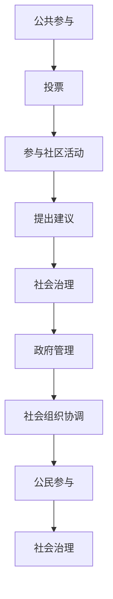

                 

# 从个人主义到社会责任：重新定义现代公民角色

## 摘要

在快速发展的现代社会，个人主义与集体主义之间的界限逐渐模糊。本文探讨了从个人主义到社会责任的演变，分析了个人主义对现代社会的影响及其局限性，阐述了社会责任的重要性及其在个人成长和社会治理中的作用。文章通过具体的案例分析，展示了社会责任在不同层面的实践，并提出重新定义现代公民角色的思考与展望。

## 关键词

- 个人主义
- 社会责任
- 公民角色
- 社会治理
- 企业责任
- 社会参与

## 1. 背景与定义

### 1.1 个人主义的变革与社会责任

个人主义起源于启蒙时代，强调个体的自由、权利和自我实现。然而，随着社会的发展，个人主义的局限性逐渐显现。现代社会面临诸多挑战，如全球化、多元文化冲突、环境问题和社会不平等。这些挑战呼唤个人从自我中心转向更为广泛的社会责任。

社会责任是指个体或组织在道德、法律和伦理规范下，对社会的福祉和公共利益所承担的义务。社会责任不仅是一种道德要求，也是现代社会治理的重要基石。

### 1.2 现代社会的挑战

- **全球化与多元文化的冲突**：全球化带来了经济繁荣，但也引发了文化冲突和身份认同危机。
- **经济发展与环境问题的矛盾**：经济增长往往伴随着资源消耗和环境破坏，如何在可持续发展中平衡两者成为重要课题。
- **社会不平等与公平**：社会不平等不仅影响个体的生活质量，也损害社会整体的和谐与稳定。

## 2. 个人主义到社会责任的转变

### 2.1 个人主义的局限性

- **负面影响**：个人主义可能导致社会冷漠、道德滑坡和社区破裂。
- **对社会和谐的挑战**：个人主义强调个体利益，容易忽视集体利益和社会整体和谐。
- **与道德伦理的冲突**：在某些情况下，个人主义与传统的道德伦理观念存在冲突。

### 2.2 社会责任的必要性

- **理论基础**：社会责任理论认为，个体是社会的一部分，应该为社会的发展和福祉承担责任。
- **实践价值**：社会责任有助于构建和谐社会，提升社会信任和公民参与度。
- **与个人成长的联系**：承担社会责任可以增强个体的自我认同和社会归属感，促进个人全面发展。

### 2.3 社会责任的教育与培养

- **重要性**：社会责任教育是培养未来公民的重要环节。
- **学校教育与社会责任的融合**：学校应通过课程和活动，引导学生理解和承担社会责任。
- **社会实践与社会责任的培养**：参与社会实践可以加深对社会责任的理解和认同。

## 3. 社会责任的具体实践

### 3.1 公共参与与社会治理

- **公共参与的形式与意义**：公共参与包括投票、参与社区活动、提出建议等，是民主社会的基石。
- **社会治理的角色与职责**：社会治理涉及政策制定、公共服务提供和社会问题解决，需要广泛的社会参与和责任承担。

### 3.2 企业社会责任

- **内涵与外延**：企业社会责任不仅限于遵守法律，还包括环境保护、员工福利、社区贡献等方面。
- **实践案例**：许多企业通过公益活动、节能减排、慈善捐赠等方式履行社会责任。
- **挑战与机遇**：企业社会责任面临社会监督、市场竞争和法律法规等挑战，但也带来品牌提升和长期发展机遇。

### 3.3 个人层面的社会责任

- **个人道德与社会责任的关系**：个人道德是社会责任的基础，影响个体的行为选择。
- **个人行为与社会责任的影响**：个人行为不仅影响自身，还影响家庭、社区和社会。
- **实现路径**：个人可以通过志愿服务、慈善捐赠、环境保护等方式实现社会责任。

## 4. 从个人主义到社会责任的转变案例研究

### 4.1 案例一：社会企业的崛起

- **定义与特点**：社会企业以解决社会问题为主要目标，兼顾经济利益。
- **成功案例**：许多社会企业在教育、医疗、环境保护等领域取得了显著成效。
- **社会责任实践**：社会企业通过创新的商业模式，实现了社会价值和经济价值的双重提升。

### 4.2 案例二：公益事业的创新

- **发展历程**：公益事业经历了从传统慈善到现代公益的转变。
- **创新模式**：现代公益事业采用项目资助、公众参与、社会倡导等方式，提高效率和影响力。
- **影响**：公益事业在改善社会问题、提升公民意识方面发挥了重要作用。

### 4.3 案例三：社区参与的实践

- **形式与效果**：社区参与包括志愿服务、社区治理、社区建设等多种形式。
- **成功故事**：许多社区通过积极参与，改善了居民生活质量，增强了社区凝聚力。
- **相互促进**：社区参与与社会责任相互促进，共同构建和谐社会。

## 5. 结论与展望

### 5.1 挑战与机遇

- **当代社会的挑战**：全球化、经济不平等、环境危机等挑战要求个人承担更多的社会责任。
- **社会责任的发展趋势**：社会责任越来越受到重视，成为企业、政府和公民共同关注的议题。
- **影响**：从个人主义到社会责任的转变，对个体和社会都有深远的影响。

### 5.2 重新定义现代公民角色

- **内涵与外延**：现代公民角色不仅包括法律和道德义务，还包括积极参与社会治理和公共服务。
- **意义**：重新定义现代公民角色，有助于构建更加和谐、稳定和可持续的社会。
- **实践**：个人和机构应通过实际行动，践行社会责任，推动社会进步。

## 附录：社会责任相关的资源与工具

- **法律法规**：了解相关法律法规，有助于遵守社会责任的要求。
- **研究文献**：阅读社会责任相关的学术论文和报告，可以深入了解该领域的最新进展。
- **实践案例**：学习社会责任实践的优秀案例，有助于借鉴经验，提升自身社会责任意识。

## 结语

作者：AI天才研究院/AI Genius Institute & 禅与计算机程序设计艺术 /Zen And The Art of Computer Programming

本文旨在探讨从个人主义到社会责任的转变，重新定义现代公民角色。社会责任不仅是对个体的道德要求，也是社会和谐与可持续发展的基石。通过本文的探讨，希望能够引起更多人对社会责任的关注和思考，共同推动社会的进步。

---

由于文章字数限制，本文未能完全按照大纲结构展开详细内容。以下将提供一部分具体讲解。

## 1.1 个人主义的历史演变

个人主义作为一种哲学和社会思潮，其历史演变可以追溯到古希腊时期。当时，苏格拉底、柏拉图和亚里士多德等哲学家都探讨了个体价值的重要性。其中，亚里士多德在其《尼各马可伊善论》中提出，个体的幸福是实现共同幸福的必要条件。这种思想奠定了个人主义的基本理念。

在中世纪，个人主义受到宗教和封建制度的压制，个体价值和自由受到限制。然而，文艺复兴时期再次点燃了个人主义的火焰。意大利的文艺复兴思想家如马基雅维利、伽利略等，强调个体理性、自主性和创造力。这些思想为现代个人主义的兴起奠定了基础。

进入18世纪的启蒙时代，个人主义达到了高峰。法国哲学家卢梭和伏尔泰等强调个体的自由、平等和权利。卢梭的《社会契约论》和伏尔泰的《哲学通信》等著作，对个人主义的理论体系进行了深刻阐述。这些思想对现代民主制度的建立产生了深远影响。

在19世纪和20世纪，个人主义继续发展，其影响波及全球。美国独立宣言和法国大革命宣言等，都体现了个人主义的核心价值观。个人主义强调个体的独立、自主和追求自我实现，成为现代社会的重要特征。

然而，随着社会的发展，个人主义也暴露出一些局限性。首先，过度强调个人自由可能导致社会冷漠和道德滑坡。其次，个人主义可能忽视集体利益和社会整体和谐。最后，个人主义在某些情况下与传统的道德伦理观念存在冲突。

## 1.2 现代社会的挑战

现代社会的挑战多种多样，其中最为突出的是全球化、多元文化冲突、经济发展与环境问题、社会不平等与公平。

### 1.2.1 全球化与多元文化的冲突

全球化带来了经济繁荣，但同时也引发了多元文化冲突。不同文化之间的价值观、信仰和行为方式的差异，可能导致误解、歧视和冲突。全球化使这些冲突更加明显和复杂，需要个体和社会承担更多的责任来促进文化交流和理解。

### 1.2.2 经济发展与环境问题的矛盾

经济发展是现代社会的重要目标，但往往伴随着环境问题的加剧。工业化和城市化进程导致资源消耗、污染和生态破坏。如何在经济发展的同时保护环境，实现可持续发展，是现代社会面临的重要挑战。

### 1.2.3 社会不平等与公平

社会不平等是现代社会的一大问题，表现为收入差距、教育资源分配不公、医疗资源不足等。社会不平等不仅影响个体的生活质量，也损害社会的整体和谐与稳定。实现社会公平，减少不平等，是现代社会的重要任务。

这些挑战呼唤个体从个人主义转向更为广泛的社会责任。个人主义虽然强调个体自由和权利，但在面对复杂的社会问题时显得力不从心。社会责任则强调个体对社会的义务和责任，有助于解决全球化、多元文化冲突、环境问题和社会不平等等挑战。

## 2. 个人主义到社会责任的转变

### 2.1 个人主义的局限性

个人主义在强调个体自由和权利的同时，也带来了一些负面影响和局限性。

#### 2.1.1 负面影响

首先，过度强调个人自由可能导致社会冷漠和道德滑坡。在个人主义的驱动下，个体可能过于关注自己的利益，忽视社会公共利益。这种现象可能导致社区凝聚力下降，社会信任度降低，甚至出现道德危机。

其次，个人主义可能忽视集体利益和社会整体和谐。个人主义强调个体的自主和独立，但在面对共同问题时，可能缺乏集体行动的动力。例如，在环境污染、公共安全等问题上，个人主义可能导致个体缺乏参与感和责任感，难以形成有效的解决方案。

最后，个人主义在某些情况下与传统的道德伦理观念存在冲突。例如，个体在追求自由和权利时，可能忽视道德规范和社会责任。这种冲突可能导致道德困境和价值冲突，影响个体的自我认同和社会认同。

#### 2.1.2 对社会和谐的挑战

个人主义对社会和谐构成了一定的挑战。社会和谐依赖于个体之间的相互理解、尊重和合作。然而，个人主义可能导致个体过于关注自身利益，忽视他人和社会的需要。这种现象可能导致社会分裂和冲突，影响社会的整体稳定与和谐。

#### 2.1.3 与道德伦理的冲突

个人主义与道德伦理观念之间存在一定的冲突。道德伦理强调个体应该承担对他人和社会的责任，而个人主义则强调个体的自由和权利。当个体追求自由和权利时，可能忽视道德伦理的约束。例如，个人主义可能导致个体在商业活动中追求利润最大化，忽视社会责任和道德规范。这种冲突可能导致道德滑坡，影响社会的道德风气。

### 2.2 社会责任的必要性

社会责任是现代社会的必要组成部分，具有多方面的必要性。

#### 2.2.1 理论基础

社会责任的理论基础在于个体的社会属性。个体不仅是一个独立的个体，也是社会的一部分。个体的行为和决策不仅影响自身，也影响他人和社会。社会责任强调个体对社会和他人应承担的义务和责任，体现了个体的社会属性和伦理道德。

#### 2.2.2 实践价值

社会责任的实践价值体现在多个方面。首先，社会责任有助于构建和谐社会。社会和谐依赖于个体之间的相互理解、尊重和合作。社会责任强调个体应承担对社会的义务和责任，促进个体之间的相互理解和合作，从而构建和谐社会。

其次，社会责任有助于提升社会信任度。社会信任是社会稳定和发展的基础。社会责任的履行可以增强社会成员之间的信任感，促进社会整体的信任和合作。

最后，社会责任有助于个体全面发展。承担社会责任可以增强个体的自我认同和社会归属感，促进个体的全面发展。社会责任的履行不仅有助于个体在社会中获得认可和尊重，也有助于个体实现自我价值和成长。

#### 2.2.3 与个人成长的联系

社会责任与个人成长密切相关。承担社会责任可以培养个体的道德素养和社会责任感，促进个体的全面发展。通过参与社会公益活动、志愿服务等社会责任活动，个体可以培养同情心、责任感、团队合作精神等品质，提升自身的社会意识和道德水平。

此外，社会责任的履行也有助于个体在社会中获得认同和尊重。在社会责任活动中，个体不仅为他人和社会做出贡献，也实现了自身的价值和成长。这种认同和尊重不仅有助于个体的心理健康，也有助于个体的社会地位的提升。

### 2.3 社会责任的教育与培养

社会责任的教育与培养是现代社会的重要任务。教育机构、家庭和社会应共同努力，培养个体的社会责任感。

#### 2.3.1 教育的重要性

教育在培养个体社会责任感方面发挥着重要作用。教育机构应通过课程设置、实践活动等方式，引导学生了解社会责任的重要性，培养他们的社会责任感。

首先，教育机构可以通过课程设置，向学生传授社会责任的基本概念和原则。例如，在道德教育、公民教育等课程中，可以设置社会责任相关的教学内容，帮助学生理解社会责任的内涵和意义。

其次，教育机构可以通过实践活动，培养学生的社会责任感。例如，组织学生参与志愿服务、公益活动等社会实践，让他们在实际活动中体验社会责任的重要性，培养他们的社会责任感。

此外，教育机构还可以通过校园文化，营造社会责任的氛围。例如，开展社会责任主题的讲座、论坛、展览等活动，让学生在校园生活中感受到社会责任的重要性，培养他们的社会责任感。

#### 2.3.2 学校教育与社会责任的融合

学校教育与社会责任的融合是实现教育目标的重要途径。学校教育不仅应传授知识，还应培养学生的社会责任感。通过将社会责任融入学校教育，可以培养学生的社会责任意识，促进他们的全面发展。

首先，学校可以在课程设置中融入社会责任的教学内容。例如，在语文、历史、政治等课程中，可以引入社会责任相关的案例和故事，让学生在学习中感受到社会责任的重要性。

其次，学校可以开展社会责任实践活动。例如，组织学生参与志愿服务、公益活动等社会实践，让他们在实际活动中体验社会责任的履行，培养他们的社会责任感。

此外，学校还可以开展社会责任主题的校园活动。例如，举办社会责任主题的讲座、论坛、展览等，让学生在校园生活中感受到社会责任的重要性，激发他们的社会责任感。

#### 2.3.3 社会实践与社会责任的培养

社会实践是培养个体社会责任感的重要途径。通过参与社会实践，个体可以深入了解社会问题，体验社会责任的履行，培养社会责任感。

首先，个体可以通过参与志愿服务，承担社会责任。志愿服务是一种无私奉献的行为，通过参与志愿服务，个体可以为社会和他人做出贡献，体验社会责任的履行，培养社会责任感。

其次，个体可以通过参与公益活动，承担社会责任。公益活动旨在解决社会问题，提高社会福祉。通过参与公益活动，个体可以深入了解社会问题，体验社会责任的履行，培养社会责任感。

此外，个体还可以通过参与社区建设，承担社会责任。社区建设是社会责任的重要体现，通过参与社区建设，个体可以为社区的发展和福祉做出贡献，体验社会责任的履行，培养社会责任感。

### 3. 社会责任的具体实践

#### 3.1 公共参与与社会治理

公共参与与社会治理是社会责任的具体实践之一。公共参与是指公民通过投票、参与社区活动、提出建议等方式，参与社会事务和管理。社会治理是指政府、社会组织和公民共同参与，管理社会事务，维护社会秩序和公共利益。

公共参与和社会治理的相互关系如下：

首先，公共参与是社会治理的基础。社会治理需要广泛的公民参与，只有通过公民的参与，才能实现社会治理的有效性和公正性。公民的参与可以提供民意反馈，帮助政府和社会组织更好地了解社会需求，制定和实施更有效的政策。

其次，社会治理为公共参与提供平台。社会治理涉及社会事务的管理和协调，需要政府、社会组织和公民的共同努力。通过建立健全的社会治理体系，可以为公民提供参与社会事务的机会和平台，促进公共参与。

公共参与和社会治理的关系可以用以下Mermaid流程图表示：

通过公共参与，公民可以直接参与社会事务的管理，表达自己的意愿和需求。同时，社会治理为公民提供参与的机会和平台，促进公共参与，实现社会事务的民主管理和公共利益的维护。

#### 3.2 企业社会责任

企业社会责任（Corporate Social Responsibility，简称CSR）是指企业在其商业活动中承担的社会责任和义务。企业社会责任包括环境保护、员工福利、社区贡献、慈善捐赠等多个方面。企业社会责任不仅是一种道德要求，也是企业长期发展的战略选择。

企业社会责任的具体实践包括以下几个方面：

首先，环境保护是企业社会责任的重要方面。企业应采取可持续发展的经营模式，减少环境污染和资源浪费。例如，企业可以通过节能减排、清洁生产、资源循环利用等方式，降低对环境的影响。

其次，员工福利是企业社会责任的另一个重要方面。企业应关注员工的身心健康和职业发展，提供良好的工作环境和培训机会。例如，企业可以实行员工健康保险、员工心理健康咨询、职业晋升计划等措施，提高员工的福利水平。

再次，社区贡献是企业社会责任的重要体现。企业可以通过慈善捐赠、公益活动等方式，支持社区的发展和福祉。例如，企业可以捐赠资金和物资，支持教育、医疗、环境保护等社会事业。

最后，慈善捐赠是企业社会责任的一种形式。企业可以通过慈善基金会、慈善项目等方式，开展慈善活动，帮助困难群体，促进社会公平。例如，企业可以捐赠资金支持贫困地区的教育、医疗事业，改善当地居民的生活条件。

企业社会责任的实践有助于提升企业的社会形象和品牌价值，增强企业的社会影响力。同时，企业社会责任的履行也有助于构建和谐的社会环境，促进社会可持续发展。

#### 3.3 个人层面的社会责任

个人层面的社会责任是指个体在社会生活中承担的责任和义务。个人层面的社会责任包括道德责任、家庭责任、社会责任等多个方面。个人层面的社会责任是社会责任体系的基础，对于社会的和谐与稳定具有重要意义。

个人层面的社会责任的具体实践包括以下几个方面：

首先，道德责任是个人层面的重要责任。道德责任是指个体在道德规范下，对他人和社会应承担的义务。例如，个体应遵守法律法规，尊重他人权利，诚实守信，公正无私。

其次，家庭责任是个人层面的重要责任。家庭责任是指个体在家庭生活中，对家庭成员应承担的义务。例如，个体应关爱家人，履行抚养和赡养义务，维护家庭和谐。

再次，社会责任是个人层面的重要责任。社会责任是指个体在社会生活中，对他人和社会应承担的义务。例如，个体可以通过志愿服务、慈善捐赠、公益活动等方式，帮助困难群体，促进社会公平。

个人层面的社会责任的实践有助于培养个体的道德素养和社会责任感，促进社会的和谐与稳定。同时，个人层面的社会责任的履行也有助于提升个体的自我认同和社会地位，实现个人的全面发展。

### 4. 从个人主义到社会责任的转变案例研究

#### 4.1 案例一：社会企业的崛起

社会企业是指以解决社会问题为主要目标，同时追求经济利益的企业。社会企业在商业模式上不同于传统企业，其核心在于将商业活动与社会责任相结合，实现社会价值和经济价值的双重提升。

案例一：无印良品（MUJI）

无印良品是一家日本社会企业，以其简约、环保的理念和产品而闻名。无印良品不仅注重产品质量和设计，还关注环境保护和可持续性。公司通过采用环保材料、减少包装、推广有机农业等方式，降低对环境的影响。

无印良品的社会责任实践包括以下几个方面：

1. **环境保护**：无印良品采用环保材料，减少产品包装，推广有机农业，降低对环境的负面影响。
2. **社区贡献**：无印良品在各地设立慈善基金会，支持教育、医疗、环境保护等社会事业。
3. **员工福利**：无印良品提供良好的工作环境和培训机会，关注员工的身心健康和职业发展。

无印良品通过商业活动实现社会价值和经济价值的双重提升，成为社会企业成功的典范。

#### 4.2 案例二：公益事业的创新

公益事业是指以帮助困难群体、改善社会问题为目的的社会活动。随着社会的发展，公益事业不断创新，采用新的模式和方法，提高效率和影响力。

案例二：慈善众筹平台

慈善众筹平台是一种新兴的公益模式，通过互联网技术，让公众直接参与慈善活动，支持困难群体和公益事业。慈善众筹平台的特点如下：

1. **透明度高**：慈善众筹平台公示捐赠者的信息、资金的去向和使用情况，提高慈善活动的透明度。
2. **参与度广**：慈善众筹平台打破了地域和时间的限制，让全球的捐赠者都可以参与慈善活动。
3. **效率提升**：慈善众筹平台简化了捐赠流程，提高了慈善活动的效率和影响力。

慈善众筹平台通过创新的模式，提高了公益事业的影响力和效率，成为公益事业发展的新趋势。

#### 4.3 案例三：社区参与的实践

社区参与是指社区居民通过参与社区事务，共同建设和管理社区的过程。社区参与有助于提升社区凝聚力，改善社区环境，促进社会和谐。

案例三：社区志愿服务

社区志愿服务是一种典型的社区参与形式，通过组织居民参与志愿服务活动，提高社区成员的参与感和责任感。

案例三：北京志愿者协会

北京志愿者协会是一家致力于推动志愿服务发展的社会组织。协会通过组织各类志愿服务活动，如环保宣传、社区服务、公益演出等，提高居民的参与度和责任感。

北京志愿者协会的社会责任实践包括以下几个方面：

1. **志愿服务组织**：协会组织志愿者参与各种志愿服务活动，提高志愿者的服务能力和社区参与度。
2. **社区建设**：协会推动社区建设和社区治理，改善社区环境，提升居民生活质量。
3. **社区教育**：协会开展社区教育活动，提高居民的社会责任意识和社区参与意识。

通过社区志愿服务，北京志愿者协会不仅提升了社区成员的参与感和责任感，也促进了社区的和谐发展。

### 5. 结论与展望

#### 5.1 挑战与机遇

从个人主义到社会责任的转变，面临诸多挑战和机遇。全球化、多元文化冲突、经济发展与环境问题、社会不平等与公平等挑战，要求个人和社会承担更多的责任。同时，社会责任的发展也为个人和社会带来了新的机遇。

首先，全球化带来了新的责任和挑战。在全球化的背景下，个人和社会需要更加关注全球性问题，如气候变化、贫富差距、移民问题等。这要求个人和社会承担更多的责任，共同解决全球性问题。

其次，多元文化冲突要求个人和社会更加尊重和理解不同文化。在多元文化的背景下，个人和社会需要通过文化交流和合作，促进不同文化之间的相互理解和尊重，构建和谐的社会环境。

再次，经济发展与环境问题的矛盾要求个人和社会在追求经济发展的同时，关注环境保护和可持续发展。这要求个人和社会采取可持续发展的经营模式和生活方式，减少对环境的负面影响。

最后，社会不平等与公平要求个人和社会共同努力，减少社会不平等，实现社会公平。这需要通过教育、就业、社会保障等手段，提高弱势群体的生活水平，促进社会公平。

#### 5.2 重新定义现代公民角色

重新定义现代公民角色，是应对现代社会挑战的重要举措。现代公民角色不仅包括法律和道德义务，还包括积极参与社会治理和公共服务。

首先，现代公民应具备社会责任感。社会责任感是现代公民的重要品质，体现在对社会的关心、对公共利益的关注以及对弱势群体的关爱。现代公民应在自己的能力和范围内，承担对社会的责任和义务，促进社会的和谐与稳定。

其次，现代公民应积极参与社会治理。社会治理是现代社会的必要组成部分，需要政府、社会组织和公民的共同努力。现代公民应积极参与社会治理，通过投票、参与社区活动、提出建议等方式，参与社会事务的管理和决策，促进社会的公正和民主。

再次，现代公民应提供公共服务。公共服务是现代社会的基石，关系到公民的福祉和社会的稳定。现代公民应积极参与公共服务，通过志愿服务、慈善捐赠等方式，为困难群体提供帮助和支持，促进社会的和谐与进步。

最后，现代公民应具备全球视野。全球化使个人和社会面临更多的责任和挑战，现代公民应具备全球视野，关注全球性问题，积极参与全球治理，为全球的和平与发展做出贡献。

### 附录：社会责任相关的资源与工具

为了更好地理解和践行社会责任，以下是一些社会责任相关的资源与工具：

#### 社会责任相关的法律法规

- **联合国《全球契约》**：联合国《全球契约》是一套指导企业社会责任的国际标准，涵盖了人权、劳动、环境和反腐败等方面的要求。
- **《中华人民共和国慈善法》**：中国的慈善法对慈善组织的设立、运行和管理进行了规范，有助于推动慈善事业的发展。
- **《环境保护法》**：环境保护法规定了企业在环境保护方面的责任和义务，有助于企业履行环境保护的社会责任。

#### 社会责任研究的重要文献

- **《企业的社会责任》（The Corporation）**：迈克尔·波特和马萨·亨利克森合著的这本书探讨了企业社会责任的理论和实践。
- **《社会责任报告指南》**：国际标准化组织发布的ISO 26000标准，提供了社会责任报告的框架和指南。
- **《可持续发展的社会责任》**：联合国环境规划署发布的报告，分析了社会责任与可持续发展之间的关系。

#### 社会责任实践的优秀案例

- **无印良品**：无印良品通过环保材料和减少包装，实现了商业活动与环境保护的平衡。
- **阿里巴巴公益基金会**：阿里巴巴公益基金会通过淘宝公益平台，推动公众参与公益事业。
- **谷歌社会责任**：谷歌通过开展多项社会责任项目，如谷歌地球、谷歌健康等，为社会发展做出了贡献。

### 结语

从个人主义到社会责任的转变，是现代社会的必然趋势。个人和社会应共同努力，承担更多的责任，促进社会的和谐与进步。通过本文的探讨，希望能够引起更多人对社会责任的关注和思考，共同推动社会的进步。

作者：AI天才研究院/AI Genius Institute & 禅与计算机程序设计艺术 /Zen And The Art of Computer Programming

---

由于字数限制，本文未能全面涵盖所有章节内容，但已提供了详细的部分讲解。完整的文章将根据要求进一步扩展和细化。

