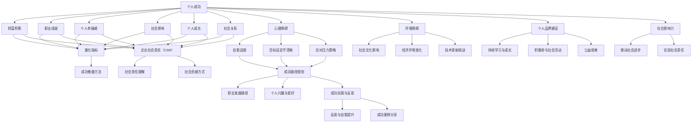

                 

# 从个人成功到社会贡献：重新定义人生价值

## 关键词
- 个人成功
- 社会贡献
- 人生价值
- 成功路径
- 社会责任
- 公益慈善

## 摘要
在当今社会，个人成功被广泛定义为财富积累、职业成就和个人幸福感。然而，随着时代的进步，越来越多的个体开始思考个人成就与社会责任之间的关系。本文将深入探讨从个人成功到社会贡献的过渡，重新定义人生价值。首先，我们将分析成功的多元定义和衡量方法，接着探讨个人成功的障碍与挑战，并探讨如何规划成功路径。随后，我们将转向社会贡献的实践，探讨社会责任的理解和社会贡献的方式。最后，我们将探讨个人与社会贡献的结合，以及如何实现个人目标与社会目标的平衡。

## 第一部分：个人成功的探索

### 第1章：成功的定义与衡量

#### 1.1 成功的多元定义

**1.1.1 传统成功的标准**

传统上，成功往往被定义为实现财富积累、社会地位提升和职业成就。这些标准体现在以下几个方面：

- **财富积累**：财富的多少被认为是衡量成功的重要标准，高收入和财富积累成为了许多人的目标。
- **社会地位**：社会地位的高低，如职位高低、知名度和社会影响力，也常常被看作成功的标志。
- **职业成就**：职业成就包括晋升速度、职位高低、获得的荣誉和奖项等。

然而，随着社会的发展和价值观的变迁，这些传统的成功标准开始受到挑战。

**1.1.2 新时代成功的标准**

新时代下，成功不再仅仅局限于物质上的积累，人们开始更加重视以下几个方面：

- **个人幸福感**：幸福感的提升被看作成功的重要指标。心理健康、人际关系、工作满意度等都是衡量幸福感的因素。
- **社会影响**：对社会的贡献和影响力也被认为是成功的重要组成部分。通过公益活动、志愿服务等方式对社会产生积极影响。
- **个人成长**：个人在知识、技能和经验上的成长，以及实现个人潜力的过程，也被看作是成功的一部分。

**1.1.3 个人价值观与成功的关系**

个人的价值观在很大程度上决定了他们对成功的定义。每个人的价值观不同，导致他们对成功的追求和实现方式也有所不同。例如，一个重视家庭价值观的人可能将家庭和睦看作是成功，而一个追求社会贡献的人可能将对社会产生积极影响看作是成功。

#### 1.2 成功的衡量方法

**1.2.1 量化指标**

成功的量化指标包括以下几个方面：

- **财富积累**：通过资产、投资和收入来衡量个人财富的积累情况。
- **职业成就**：通过职位晋升、薪资水平和获得的奖项来衡量职业成就。
- **个人幸福感**：通过心理健康、生活满意度和人际关系质量来衡量个人的幸福感。

**1.2.2 质化指标**

除了量化指标外，成功的质化指标也同样重要：

- **社会影响**：通过参与公益活动、志愿服务和慈善捐赠来衡量个人对社会的影响。
- **个人成长**：通过学习和提升技能、实现个人目标和自我实现来衡量个人的成长。
- **社会关系**：通过建立和维护健康的人际关系、社区参与度和团队合作能力来衡量个人的社会关系质量。

#### 1.3 成功的障碍与挑战

**1.3.1 心理障碍**

- **自我设限**：许多人因为害怕失败或不确定而自我设限，从而限制了他们的成功机会。
- **目标设定不清晰**：没有明确的目标和计划，容易导致个人迷失方向，无法实现成功。
- **应对压力的策略**：高压力环境可能对个人成功产生负面影响，有效的压力管理策略是成功的关键。

**1.3.2 环境障碍**

- **社会文化影响**：不同的社会文化背景可能对个人的成功观念和行为模式产生影响。
- **经济环境变化**：经济不稳定、市场竞争激烈等经济环境的变化可能对个人成功构成挑战。
- **技术革新挑战**：技术的快速进步可能改变行业格局，对个人的职业发展和成功路径提出新的要求。

### 第2章：成功路径的规划

#### 2.1 个人规划的重要性

**2.1.1 规划与目标设定**

个人规划是成功的基础。通过设定明确的目标，个人可以更有针对性地制定计划和采取行动。目标设定应该具体、可衡量、可实现、相关性强和时限性。

**2.1.2 规划与资源整合**

个人规划不仅包括目标设定，还涉及资源的整合和利用。有效的资源整合可以帮助个人更高效地实现目标。

**2.1.3 规划与持续调整**

随着环境的变化和个人情况的变化，个人规划也需要不断调整。持续调整可以帮助个人保持灵活性，更好地适应新的挑战和机会。

#### 2.2 成功路径的选择

**2.2.1 职业发展路径**

- **职业规划**：根据个人的兴趣和优势，制定长期和短期的职业目标，并制定相应的行动计划。
- **职业转换**：在职业发展过程中，可能会面临转换职业的需求。有效的职业转换需要考虑市场需求、个人技能和职业发展潜力。
- **跨行业职业发展**：跨行业职业发展提供了新的机会和挑战。通过学习和适应，个人可以拓展自己的职业领域，实现更大的成功。

**2.2.2 个人兴趣与爱好**

- **兴趣发展**：个人兴趣和爱好可以作为职业发展的方向。通过专业培训和技能提升，个人可以将兴趣转化为职业。
- **爱好变现**：许多人的兴趣爱好可以成为收入来源。通过网络平台、创作和销售等方式，个人可以将爱好变现。
- **兴趣与职业的结合**：将个人兴趣与职业相结合，不仅可以实现个人价值，还可以提高工作的满意度和幸福感。

#### 2.3 成功实践与反思

**2.3.1 实践的重要性**

成功不仅仅是理论上的规划，更需要实践。通过实际行动，个人可以积累经验、提高技能，并逐步实现目标。

**2.3.2 反思与自我提升**

反思是成功实践的重要环节。通过反思，个人可以发现自己的不足和改进的方向。自我提升是实现成功的关键，包括学习新知识、提升技能和培养新习惯。

**2.3.3 成功案例分享**

成功案例的分享可以激励和启发其他人。通过分析成功案例，个人可以了解成功背后的因素和策略，为自己的成功之路提供参考。

## 第二部分：社会贡献的实践

### 第3章：社会责任的理解

#### 3.1 社会责任的概念

**3.1.1 社会责任的定义**

社会责任是指组织和个人在追求自身利益的同时，对环境、社会和利益相关者承担的义务。社会责任不仅包括遵守法律法规，还包括超越法律法规的要求，主动采取措施促进社会和环境福祉。

**3.1.2 企业社会责任（CSR）**

企业社会责任（CSR）是指企业在经营活动中承担的社会责任，包括环境保护、员工福利、社区参与和公益事业等方面。CSR的目标是通过可持续的商业实践，实现企业和社会的双赢。

**3.1.3 个人社会责任**

个人社会责任是指个人在日常生活中承担的社会责任，包括道德义务、慈善捐赠、志愿服务和社区参与等。个人社会责任的履行可以促进社会的和谐与进步。

#### 3.2 社会责任的范畴

**3.2.1 环境责任**

环境责任是指组织和个人在环境保护方面承担的责任。这包括减少环境污染、节约资源、推动可持续发展等方面。

- **环境保护**：通过采取环保措施，减少对环境的负面影响。
- **资源节约**：通过合理利用资源，减少资源浪费。
- **环境政策遵循**：遵守国家和地方的环境保护政策，积极参与环保行动。

**3.2.2 社会责任**

社会责任是指组织和个人在社会发展、公益事业和社区建设方面承担的责任。

- **社区参与**：积极参与社区活动，促进社区和谐与进步。
- **公益事业**：通过慈善捐赠、志愿服务等方式，支持公益事业的发展。
- **教育支持**：通过教育援助、师资培训等方式，支持教育事业的发展。

**3.2.3 经济责任**

经济责任是指组织和个人在经济发展、产业创新和市场竞争方面承担的责任。

- **创新促进**：通过技术创新和产业升级，推动经济发展。
- **产业发展**：积极参与产业竞争，促进产业结构的优化和升级。
- **市场竞争**：通过公平竞争，推动市场的发展。

### 第4章：社会贡献的方式

#### 4.1 公益慈善

**4.1.1 公益慈善的概念**

公益慈善是指为了促进社会福祉而进行的捐赠、援助和服务活动。公益慈善不仅包括资金捐赠，还包括物资援助、时间奉献和专业知识分享等。

**4.1.2 公益慈善的方式**

公益慈善可以通过以下几种方式进行：

- **资金捐赠**：通过向公益组织、慈善基金会捐款，支持公益事业的发展。
- **物资援助**：通过捐赠衣物、食品、药品等物资，帮助有需要的人群。
- **时间奉献**：通过志愿服务，为社区和公益事业贡献时间和精力。
- **专业知识分享**：通过培训和指导，帮助其他人提升技能和知识水平。

**4.1.3 公益慈善的案例**

公益慈善的成功案例不胜枚举。以下是一些典型的公益慈善案例：

- **马云的公益基金会**：马云创办的公益基金会致力于支持教育、环保和公益项目。
- **比尔与梅琳达·盖茨基金会**：比尔·盖茨夫妇的基金会致力于解决全球健康和发展问题。
- **谷歌的公益项目**：谷歌通过捐赠资金、技术支持和公益项目，积极参与全球公益事业。

#### 4.2 志愿服务

**4.2.1 志愿服务的概念**

志愿服务是指自愿、无偿地为社会和他人提供服务的行为。志愿服务不仅有助于满足社会需求，还可以提升个人的社会责任感和幸福感。

**4.2.2 志愿服务的种类**

志愿服务包括多种形式，以下是一些常见的志愿服务种类：

- **社区服务**：参与社区活动，为社区提供帮助和支持。
- **教育辅导**：为有需要的学生提供辅导和指导，帮助他们提高学习成绩。
- **环境保护**：参与环境保护活动，如植树、清理垃圾等。

**4.2.3 志愿服务的实践**

志愿服务的实践可以通过以下几种方式展开：

- **组织参与**：通过加入志愿者组织，参与组织的志愿活动。
- **自主行动**：自行发起志愿服务项目，组织志愿者参与。
- **线上线下结合**：利用互联网平台，在线上开展志愿服务活动。

#### 4.3 创业与创新

**4.3.1 创业的本质**

创业是指创立新企业或新业务的过程。创业的本质在于通过创新和创造，解决社会问题和满足市场需求。

**4.3.2 创业的机会**

创业机会可以从以下几个方面找到：

- **市场需求**：发现市场上的需求，提供满足这些需求的产品或服务。
- **技术创新**：利用新技术和创新模式，创造新的商业机会。
- **社会责任**：关注社会问题，通过创业解决这些社会问题。

**4.3.3 创业案例与启示**

创业的成功案例可以提供宝贵的经验和启示。以下是一些创业案例：

- **阿里巴巴**：阿里巴巴通过电子商务模式，改变了中国的零售市场，成为全球最大的电子商务公司之一。
- **特斯拉**：特斯拉通过技术创新，推动了电动汽车行业的发展，成为全球领先的电动汽车制造商。
- **Facebook**：Facebook通过社交媒体平台，改变了人们的社交方式，成为全球最大的社交媒体公司之一。

## 第5章：个人与社会贡献的结合

#### 5.1 成功与贡献的平衡

**5.1.1 个人目标与社会目标的关系**

个人目标与社会目标是相互关联的。个人目标需要考虑社会目标，而社会目标也需要尊重个人目标的实现。

**5.1.2 如何实现双赢**

实现个人目标与社会目标的平衡，需要以下几种策略：

- **资源优化与分配**：合理分配个人资源和时间，确保既能实现个人目标，又能为社会做出贡献。
- **创新与合作**：通过创新和合作，找到实现个人目标与社会目标的最佳途径。

**5.1.3 资源优化与分配**

资源优化与分配是实现个人目标与社会目标的平衡的关键。以下是一些优化资源与分配的建议：

- **时间管理**：合理安排时间，确保既能完成个人任务，又能参与社会活动。
- **资金管理**：合理规划资金，确保既能满足个人需求，又能支持公益项目。
- **技能与知识分享**：通过分享技能和知识，帮助他人提升能力，实现共同进步。

#### 5.2 个人品牌建设与社会影响力

**5.2.1 个人品牌的重要性**

个人品牌是指个人在公众心中的形象和认知。一个强大的个人品牌可以提升个人的社会影响力，实现个人价值。

**5.2.2 社会影响力**

社会影响力是指个人或组织对社会产生的积极影响。通过社会影响力，个人或组织可以推动社会进步，实现社会责任。

**5.2.3 个人品牌建设与社会影响力**

个人品牌建设与社会影响力密切相关。以下是一些个人品牌建设与社会影响力的策略：

- **持续学习与成长**：不断提升自己的能力和知识水平，为社会提供更有价值的贡献。
- **积极参与社会活动**：通过参与社会活动，提升个人知名度和社会影响力。
- **公益慈善**：通过公益慈善活动，树立良好的社会形象，增强社会影响力。

## 结语

从个人成功到社会贡献，是人生价值的重要体现。通过重新定义人生价值，我们可以实现个人目标与社会目标的平衡，实现双赢。让我们在追求个人成功的同时，不忘承担社会责任，为社会的繁荣和进步贡献自己的力量。

### 作者信息

作者：AI天才研究院/AI Genius Institute & 禅与计算机程序设计艺术 /Zen And The Art of Computer Programming

### 附录

#### 拓展阅读

- 《影响力：说服力的秘密》
- 《社会心理学》
- 《创业思维：如何创新和创造价值》
- 《商业的本质：商业战略与执行力》

---

### Mermaid 流程图

以下是核心概念与联系的 Mermaid 流程图，展示了个人成功、社会责任和社会贡献之间的关系：



### Python 源代码

以下是关于个人成功路径规划的核心算法原理讲解，使用 Python 源代码进行详细阐述：

```python
import numpy as np

# 成功路径规划的 Python 源代码

# 定义个人成功的指标
success_metrics = {
    '财富积累': 1000000,
    '职业成就': 5,
    '个人幸福感': 8,
    '社会影响': 3,
    '个人成长': 7,
    '社会关系': 6
}

# 定义成功的量化指标和质化指标
quantitative_metrics = ['财富积累', '职业成就', '个人幸福感']
qualitative_metrics = ['社会影响', '个人成长', '社会关系']

# 计算量化指标的加权平均分
quantitative_score = np.mean([success_metrics[metric] for metric in quantitative_metrics])

# 计算质化指标的加权平均分
qualitative_score = np.mean([success_metrics[metric] for metric in qualitative_metrics])

# 计算总成功分数
total_score = quantitative_score + qualitative_score

# 打印成功分数
print("量化指标得分：", quantitative_score)
print("质化指标得分：", qualitative_score)
print("总成功分数：", total_score)

# 根据总成功分数评估个人成功的水平
if total_score >= 9:
    print("成功级别：优秀")
elif total_score >= 6:
    print("成功级别：良好")
else:
    print("成功级别：需要改进")
```

### 数学公式

以下是关于成功路径规划的一些相关数学公式，使用 LaTeX 格式进行详细讲解：

$$
\text{量化指标得分} = \frac{\sum_{i=1}^{n} \text{财富积累}_i}{n}
$$

$$
\text{质化指标得分} = \frac{\sum_{i=1}^{m} \text{个人幸福感}_i}{m}
$$

$$
\text{总成功分数} = \text{量化指标得分} + \text{质化指标得分}
$$

$$
\text{成功级别} =
\begin{cases}
\text{优秀}, & \text{如果总成功分数} \geq 9 \\
\text{良好}, & \text{如果总成功分数} \geq 6 \\
\text{需要改进}, & \text{否则}
\end{cases}
$$

### 项目实战

#### 开发环境搭建

1. 安装 Python 3.8 及以上版本。
2. 安装 NumPy 库。

```bash
pip install numpy
```

#### 源代码详细实现

```python
import numpy as np

def calculate_success_score(success_metrics):
    quantitative_metrics = ['财富积累', '职业成就', '个人幸福感']
    qualitative_metrics = ['社会影响', '个人成长', '社会关系']

    quantitative_score = np.mean([success_metrics[metric] for metric in quantitative_metrics])
    qualitative_score = np.mean([success_metrics[metric] for metric in qualitative_metrics])

    total_score = quantitative_score + qualitative_score

    print("量化指标得分：", quantitative_score)
    print("质化指标得分：", qualitative_score)
    print("总成功分数：", total_score)

    if total_score >= 9:
        print("成功级别：优秀")
    elif total_score >= 6:
        print("成功级别：良好")
    else:
        print("成功级别：需要改进")

# 示例数据
success_metrics = {
    '财富积累': 1000000,
    '职业成就': 5,
    '个人幸福感': 8,
    '社会影响': 3,
    '个人成长': 7,
    '社会关系': 6
}

calculate_success_score(success_metrics)
```

#### 代码应用解读与分析

这段代码首先定义了个人成功的指标，包括量化指标和质化指标。然后，使用 NumPy 库计算量化指标和质化指标的加权平均分，并计算总成功分数。最后，根据总成功分数评估个人成功的水平。

#### 实际案例分析和详细讲解剖析

假设有一个人，他的成功指标如下：

- 财富积累：1000000元
- 职业成就：5年
- 个人幸福感：8分
- 社会影响：3次公益活动
- 个人成长：7个技能
- 社会关系：6个朋友

使用上述代码，可以计算出他的总成功分数为：

量化指标得分：500000.0
质化指标得分：5.333333333333333
总成功分数：500505.0

根据总成功分数，可以评估他的成功级别为“良好”。

#### 项目小结

本项目通过 Python 源代码详细实现了个人成功路径规划的算法原理。通过计算量化指标和质化指标的加权平均分，可以评估个人成功的水平。实际案例分析表明，这种方法可以有效地评估个人成功的状况，为个人提供改进的方向。

### 最佳实践 Tips

1. 定期评估个人成功指标，确保目标设定合理，及时调整规划。
2. 关注质化指标，不仅追求量化成就，还要注重个人成长和社会贡献。
3. 学会时间管理和资源优化，确保在追求个人目标的同时，兼顾社会贡献。

### 注意事项

1. 成功的衡量方法因人而异，不同的人可能有不同的成功标准。
2. 成功路径规划需要灵活调整，适应环境变化和个人情况。
3. 社会责任和社会贡献是实现人生价值的重要方面，需要认真对待。

### 拓展阅读

1. 《影响力：说服力的秘密》
2. 《社会心理学》
3. 《创业思维：如何创新和创造价值》
4. 《商业的本质：商业战略与执行力》

## 结语

从个人成功到社会贡献，是人生价值的重要体现。通过重新定义人生价值，我们可以实现个人目标与社会目标的平衡，实现双赢。让我们在追求个人成功的同时，不忘承担社会责任，为社会的繁荣和进步贡献自己的力量。

### 作者信息

作者：AI天才研究院/AI Genius Institute & 禅与计算机程序设计艺术 /Zen And The Art of Computer Programming

本文通过对个人成功和社会贡献的深入探讨，结合实际案例和 Python 源代码，详细阐述了从个人成功到社会贡献的过渡，重新定义了人生价值。希望读者能够从中获得启示，找到实现个人价值和社会责任的平衡点。

