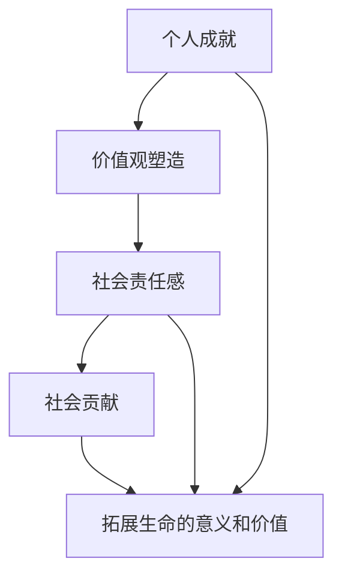
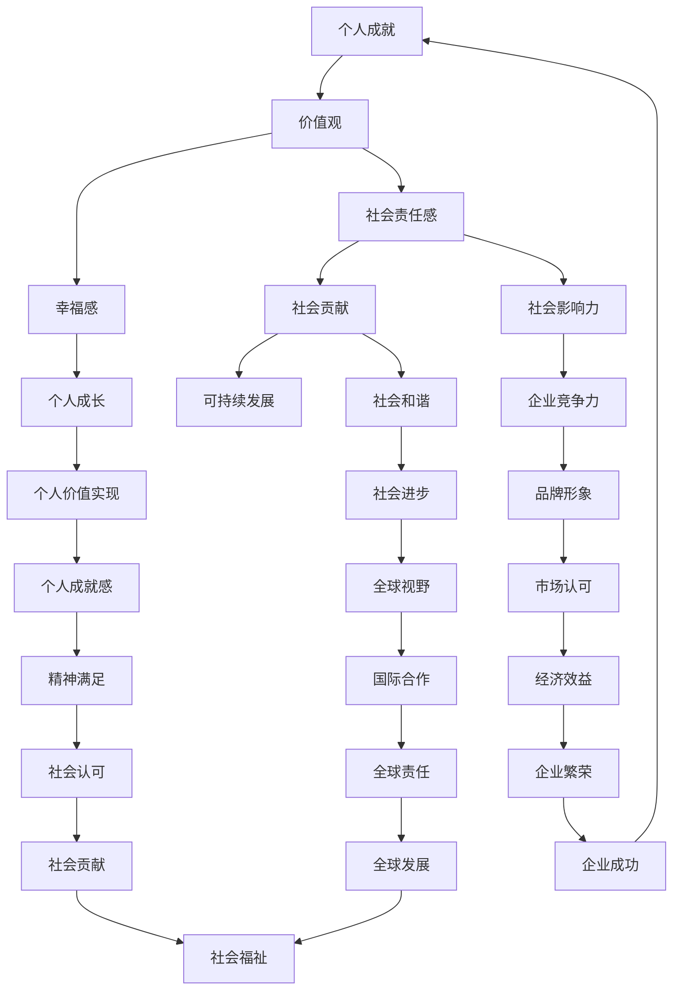

                 


# 从个人成就到社会贡献：拓展生命的意义和价值

## 关键词
- 个人成就
- 社会贡献
- 生命的意义
- 价值观
- 社会责任感

## 摘要
本文旨在探讨从个人成就向社会贡献的转变，以及这一转变如何拓展生命的意义和价值。通过分析个人成就的构成与评价，理解社会贡献的意义与实现方式，以及拓展生命意义的途径，本文提出了价值观的塑造与传承、社会责任感与行动的重要性。文章末尾，作者结合实例，总结出一些最佳实践，为读者提供启示和指导。

## 第1章 引言

### 1.1 生命的意义与价值观

生命是宇宙中一种奇妙的存在，每个人都在寻找自己存在的意义。在IT领域，个人成就往往是衡量成功的重要标准。然而，随着社会的发展，越来越多的人开始意识到，个人成就虽然重要，但并非生命的全部意义。

**价值观**是人们对事物的看法和评价标准，是决定个人行为和决策的根本。价值观不仅影响个人的生活态度和幸福感，也影响其对社会的贡献。一个健康的价值观体系应该包含对个人、他人和社会的尊重、责任和关爱。

### 1.2 从个人成就到社会贡献的转变

个人成就通常是指个体在职业、学术、艺术等方面取得的成果。然而，随着社会的进步，人们逐渐认识到，个人的发展不应仅限于个人成就，而应更多地关注对社会的贡献。

**社会贡献**是指个人或团体为社会发展做出的积极影响。它不仅包括物质贡献，如创造财富、改善生活条件，还包括精神和文化贡献，如传播知识、促进文化多样性。

从个人成就到社会贡献的转变，是现代价值观的体现，也是个人成长的重要方向。这种转变有助于拓展生命的意义，使个人的价值在社会中得到更广泛的认可。

### 1.3 拓展生命的意义与价值的必要性

拓展生命的意义和价值，对于个人和社会都有重要意义。对个人而言，它可以提升幸福感、满足感和成就感，使生活更加充实和有意义。对社会而言，它可以促进社会的和谐发展，增强社会的凝聚力和向心力。

在IT领域，拓展生命的意义和价值尤为重要。IT行业是一个高度竞争、快速发展的领域，个人成就固然重要，但只有将个人成就与社会贡献相结合，才能真正实现个人的价值和生命的意义。

## 第2章 个人成就的构成与评价

### 2.1 个人成就的定义与分类

个人成就指的是个体在特定领域或多个领域中所取得的显著成果。这些成就可以是职业上的，如获得重要奖项、晋升高级职位；也可以是学术上的，如发表论文、获得学位；还可以是艺术上的，如创作出优秀的艺术作品。

个人成就的分类可以依据领域、成就的性质和影响力等多个维度进行。例如，职业成就可以分为技术创新、项目管理、市场拓展等；学术成就可以分为研究成果、教学贡献、学术影响力等。

### 2.2 个人成就的评价标准

评价个人成就的标准因领域和个体差异而异。在IT领域，个人成就的评价标准通常包括以下几个方面：

1. **技术能力**：个人在特定技术领域的专业水平和创新能力。
2. **项目成果**：个人参与的项目所取得的具体成果，如性能提升、成本降低、市场占有率等。
3. **团队协作**：个人在团队中的协作能力、沟通能力和领导力。
4. **行业认可**：个人在行业内的声誉和影响力，如获得行业奖项、发表论文等。
5. **个人成长**：个人在职业发展过程中的进步和成长，如专业技能的提升、领导能力的培养等。

### 2.3 成就与幸福感的关系

个人成就与幸福感之间存在密切的关系。研究表明，个人成就的提高可以显著提升个体的幸福感。然而，这种关系并非线性，而是受到多种因素的影响。

1. **成就的感知**：个人对自身成就的认可程度会影响其幸福感。如果个人对自己的成就感到满意和自豪，那么幸福感会更高。
2. **成就的合理性**：个人认为自己的成就合理且有意义，也会提升其幸福感。如果成就仅是为了追求物质财富或短期利益，而忽视了长期价值和意义，那么幸福感可能会降低。
3. **社会支持**：社会对个人成就的认可和支持也会影响幸福感。如果个人的成就得到了家人、朋友和同事的认可和鼓励，那么幸福感会更高。

## 第3章 社会贡献的理解与实现

### 3.1 社会贡献的定义与意义

社会贡献是指个人或团体为社会发展、福祉和提高公共生活质量所做的积极努力和奉献。它包括物质贡献、精神贡献和文化贡献等多个方面。

**物质贡献**：如捐赠财富、提供就业机会、改善基础设施等。

**精神贡献**：如传播知识、传播正能量、促进文化交流等。

**文化贡献**：如创作文艺作品、推广传统文化、保护文化遗产等。

社会贡献的意义在于，它不仅有助于解决社会问题，提高社会福祉，还能够促进社会的和谐发展，增强社会的凝聚力和向心力。

### 3.2 社会贡献的形式与途径

社会贡献的形式多种多样，以下是一些常见的社会贡献形式：

1. **公益慈善**：捐赠财富、物资或时间，帮助那些需要帮助的人。
2. **志愿服务**：参与社区服务、环境保护、教育支持等活动。
3. **科技创新**：研发新技术、新产品，解决社会问题，提高生活质量。
4. **文化推广**：传播知识、推广文化，促进文化多样性。
5. **教育培训**：提供教育资源，帮助更多人获得知识和技能。

实现社会贡献的途径包括：

1. **个人行动**：每个人都可以从自身做起，从小事做起，为社会做出贡献。
2. **企业责任**：企业可以通过社会责任项目、公益活动等方式，为社会做出贡献。
3. **政府推动**：政府可以通过政策引导、资金支持等手段，鼓励和支持社会贡献。
4. **媒体宣传**：通过媒体宣传，提高公众对社会贡献的认识和重视。

### 3.3 社会贡献的回报与反思

社会贡献往往并非即时回报，但长期的积极影响是显而易见的。回报不仅体现在物质层面，更体现在精神层面。

1. **个人成长**：通过社会贡献，个人可以获得更多的经验、知识和技能，促进自身成长。
2. **社会认可**：社会对个人贡献的认可和尊重，可以提升个人的社会地位和声誉。
3. **精神满足**：为他人和社会做出贡献，可以带来内心的满足感和成就感。

然而，社会贡献也面临着一些挑战和反思。例如：

1. **资源限制**：社会资源有限，如何合理配置资源，最大化社会贡献，是一个重要问题。
2. **利益冲突**：在某些情况下，社会贡献可能与个人或企业的利益发生冲突，需要权衡和处理。
3. **可持续性**：社会贡献应该具有可持续性，不仅要解决当前问题，还要考虑长远影响。

### 3.4 社会贡献与个人成就的关系

社会贡献与个人成就之间存在密切的关系。个人成就可以作为社会贡献的基础，而社会贡献则可以进一步拓展个人成就的意义。

1. **相互促进**：个人成就为社会贡献提供了资源和能力，而社会贡献则为个人成就赋予了更深远的意义。
2. **综合评价**：在评价个人成就时，应综合考虑个人成就和社会贡献，全面评估个人的价值。
3. **价值观引导**：社会贡献可以引导个人价值观的转变，促进个人从追求个人成就向关注社会贡献转变。

### 3.5 拓展生命的意义

通过社会贡献，个人可以拓展生命的意义。社会贡献不仅使个人的价值得以体现，更使个人的生命在更广阔的舞台上发光发热。

1. **人生目标**：社会贡献可以帮助个人明确人生目标，使个人更加专注于有意义的事务。
2. **生活动力**：社会贡献可以激发个人的生活动力，使个人更加积极、主动地面对生活挑战。
3. **精神满足**：社会贡献可以带来精神满足，使个人在帮助他人的过程中感受到生命的价值。

### 3.6 社会贡献的实践案例

以下是一些社会贡献的实践案例：

1. **马云**：马云通过创立阿里巴巴，推动了电子商务的发展，为中小企业提供了巨大的发展机会，为社会发展做出了巨大贡献。
2. **比尔·盖茨**：比尔·盖茨通过成立比尔及梅琳达·盖茨基金会，致力于解决全球贫困、健康和教育问题，为社会做出了重要贡献。
3. **张一鸣**：张一鸣通过创立字节跳动，推动了社交媒体和信息传播的创新，为用户提供了丰富的内容和服务，为社会做出了积极贡献。

### 3.7 社会责任感的培养

社会责任感是推动社会贡献的重要因素。以下是一些培养社会责任感的方法：

1. **教育引导**：学校和家庭应注重培养学生的社会责任感，通过教育引导学生关注社会问题，积极参与社会活动。
2. **实践体验**：通过参与志愿服务、社会实践等活动，个人可以亲身体验社会贡献的意义，培养社会责任感。
3. **媒体宣传**：媒体应积极宣传社会贡献的正能量，提高公众对社会贡献的认识和重视。
4. **政策支持**：政府可以制定相关政策，鼓励和支持个人和社会组织参与社会贡献。

### 3.8 社会贡献与可持续发展

社会贡献不仅关注当前的问题，更关注未来的可持续发展。以下是一些实现可持续发展社会贡献的途径：

1. **环境保护**：通过推广环保技术、提高环保意识，减少污染和保护自然资源。
2. **社会创新**：通过创新社会管理模式、推广社会服务，提高社会效率和质量。
3. **扶贫援助**：通过扶贫项目、援助计划，帮助贫困地区和贫困人群，促进社会公平和和谐。

### 3.9 社会贡献与全球视野

在全球化的背景下，社会贡献也需要具有全球视野。以下是一些实现全球视野社会贡献的途径：

1. **国际合作**：通过国际合作项目，共同解决全球性问题，推动全球发展。
2. **文化交流**：通过文化交流活动，增进不同国家和地区之间的了解和友谊，促进文化多样性。
3. **技术分享**：通过技术交流和合作，推动全球技术进步，提高全球科技水平。

### 3.10 社会贡献与个人价值实现

社会贡献不仅是对社会的贡献，也是个人价值实现的重要途径。以下是一些个人通过社会贡献实现价值的方式：

1. **职业发展**：通过参与社会贡献项目，个人可以获得更多的工作经验和技能，提升职业竞争力。
2. **人生意义**：通过社会贡献，个人可以找到人生的意义和目标，实现自我价值。
3. **社会影响力**：通过社会贡献，个人可以提升自己的社会影响力，成为社会中的积极分子。

## 第4章 价值观的塑造与传承

### 4.1 价值观的定义与类型

价值观是指个人或社会对事物的看法、评价和行为准则。它决定了个体和群体的行为方式和生活态度。根据不同的分类标准，价值观可以分为多种类型：

1. **道德价值观**：关注个体行为的道德规范，如诚实、公正、尊重等。
2. **经济价值观**：关注财富、收入和经济效益，如勤奋、节俭、竞争等。
3. **社会价值观**：关注个体在社会中的角色和责任，如合作、互助、团结等。
4. **文化价值观**：关注文化传承和创新，如尊重传统文化、追求创新思维等。

### 4.2 价值观的塑造与培养

价值观的塑造与培养是一个长期的过程，受到家庭、学校、社会等多方面的影响。以下是一些塑造和培养价值观的方法：

1. **家庭教育**：家庭是价值观形成的重要环境。家长应通过言传身教，为孩子树立正确的价值观。
2. **学校教育**：学校应注重道德教育和公民教育，培养学生的社会责任感和集体荣誉感。
3. **社会实践**：通过参与社会实践活动，个体可以亲身体验价值观的应用，加深对价值观的理解和认同。
4. **媒体宣传**：媒体应积极传播正能量，弘扬正确的价值观，引导公众树立正确的价值观。

### 4.3 价值观的传承与创新

价值观的传承与创新是一个辩证统一的过程。在传承传统价值观的基础上，应注重创新和适应时代发展。

1. **传承传统价值观**：传统价值观蕴含着丰富的智慧和经验，是民族精神的基石。在现代社会，应传承和弘扬这些传统价值观。
2. **创新价值观**：随着社会的发展，新的问题和挑战不断出现，需要创新价值观来应对。例如，在全球化背景下，应注重培养开放、包容的价值观。
3. **价值观的融合**：在多元文化背景下，不同文化之间的价值观相互影响和融合，形成了新的价值观体系。这种融合有助于推动社会进步和发展。

### 4.4 价值观在社会贡献中的作用

价值观在社会贡献中发挥着重要的作用。以下是一些价值观在社会贡献中的作用：

1. **引导行为**：价值观决定了个体在社会贡献中的行为选择。一个具有正确价值观的人，更倾向于做出对社会有益的行为。
2. **凝聚力量**：价值观可以凝聚社会力量，推动社会共同目标和价值的实现。例如，共同的价值观可以促进团队合作和社会和谐。
3. **评估标准**：价值观可以作为社会贡献的评估标准，判断社会贡献的合理性和价值。例如，一个符合道德和法律价值观的社会贡献，更容易得到社会的认可和尊重。

### 4.5 价值观的跨文化比较

不同文化背景下的价值观存在差异，但也存在一些共通之处。以下是一些价值观的跨文化比较：

1. **家庭价值观**：在多数文化中，家庭都是最重要的社会单位。尊重家庭、关爱家庭成员是普遍的价值观。
2. **道德价值观**：在多数文化中，诚实、公正、尊重等道德价值观都是被普遍认可的。
3. **社会价值观**：在多数文化中，社会责任感和集体荣誉感都是重要的价值观。
4. **文化价值观**：在多元文化背景下，不同文化之间的价值观相互影响和融合，形成了新的价值观体系。

### 4.6 价值观的变革与挑战

随着社会的发展和变化，价值观也在不断变革。以下是一些价值观变革和面临的挑战：

1. **技术发展**：随着科技的进步，人们的生活方式和工作方式发生了巨大变化，对价值观也产生了影响。例如，互联网和社交媒体的发展，对隐私、信任等价值观提出了新的挑战。
2. **全球化**：全球化带来了文化融合，但也使一些传统的价值观面临挑战。如何在保持传统文化价值观的同时，适应全球化的趋势，是一个重要问题。
3. **社会不平等**：社会不平等问题加剧，对社会价值观产生了影响。如何实现社会公平，成为价值观变革的重要议题。

### 4.7 价值观的未来发展趋势

面对未来，价值观的发展趋势可能包括：

1. **可持续发展**：随着人们对环境保护和可持续发展的重视，可持续发展价值观可能会得到更多关注。
2. **社会公正**：社会不平等问题可能促使社会公正价值观得到更多关注和倡导。
3. **多元文化**：随着全球化的深入，多元文化价值观可能会得到更多认可和尊重。

### 4.8 价值观的实践案例

以下是一些价值观的实践案例：

1. **马云**：马云通过创立阿里巴巴，推动了电子商务的发展，体现了创新和合作价值观。
2. **比尔·盖茨**：比尔·盖茨通过成立比尔及梅琳达·盖茨基金会，体现了社会责任感和慈善价值观。
3. **张一鸣**：张一鸣通过创立字节跳动，体现了创新和责任价值观。

### 4.9 价值观的自我反思

个人应不断反思自己的价值观，以确保其与社会的需求和发展相适应。以下是一些自我反思的方法：

1. **自我评估**：定期评估自己的价值观，判断其是否与自己的行为和决策相一致。
2. **反思经历**：反思自己的经历，思考哪些价值观在关键时刻起到了指导作用。
3. **倾听反馈**：倾听他人的意见和建议，了解自己的价值观是否得到了他人的认可。

### 4.10 价值观的传承与未来

价值观的传承对于社会的持续发展至关重要。以下是一些价值观传承的方法：

1. **家庭教育**：家长应通过言传身教，将正确的价值观传承给下一代。
2. **学校教育**：学校应注重价值观教育，培养学生的社会责任感和集体荣誉感。
3. **社会宣传**：媒体和社会组织应积极宣传正确的价值观，提高公众的认识和重视。

### 4.11 价值观的挑战与机遇

在当前社会背景下，价值观面临着一系列挑战和机遇。以下是一些挑战和机遇：

1. **挑战**：
   - 技术发展带来的道德和伦理问题。
   - 全球化背景下文化冲突和价值分歧。
   - 社会不平等加剧，对公正价值观的挑战。

2. **机遇**：
   - 可持续发展带来的新价值观需求。
   - 数字化转型推动社会价值观的创新。
   - 多元文化的融合，促进价值观的多元化和包容性。

### 4.12 价值观的重要性

价值观在社会和个人层面都具有重要意义。以下是一些价值观的重要性：

1. **社会层面**：
   - 价值观是社会和谐发展的基石。
   - 价值观是社会道德和法律的指导原则。
   - 价值观是社会进步和创新的动力。

2. **个人层面**：
   - 价值观是个体行为和决策的指南。
   - 价值观是个体心理健康和幸福感的重要因素。
   - 价值观是个体社会责任感和使命感的源泉。

### 4.13 价值观的跨领域应用

价值观不仅在社会层面具有重要作用，也在个人生活和职业发展中发挥着关键作用。以下是一些跨领域应用的例子：

1. **商业领域**：
   - 企业价值观决定了企业的经营理念和行为准则。
   - 价值观可以帮助企业建立良好的企业文化和社会形象。

2. **教育领域**：
   - 教育价值观决定了教育的目标和方法。
   - 价值观教育是培养学生全面发展的重要环节。

3. **健康领域**：
   - 健康价值观决定了人们对健康的态度和行为。
   - 正确的价值观可以帮助人们建立健康的生活方式。

4. **环境领域**：
   - 环境价值观决定了人们对环境的保护态度和行为。
   - 价值观教育是提高环境保护意识的重要途径。

### 4.14 价值观的案例分析

以下是一些价值观的案例分析：

1. **特斯拉**：
   - 特斯拉的价值观包括创新、可持续发展和客户导向。
   - 特斯拉通过创新技术推动可持续能源发展，成为行业领导者。

2. **芬兰教育**：
   - 芬兰教育的核心价值观包括平等、创新和个性化教育。
   - 芬兰教育体系以其高质量和创新性而闻名。

3. **联合国可持续发展目标**：
   - 联合国可持续发展目标涵盖了经济、社会和环境等多个领域的价值观。
   - 这些目标旨在推动全球可持续发展。

### 4.15 价值观的自我塑造

个人价值观的自我塑造是一个持续的过程，以下是一些方法：

1. **自我反思**：
   - 定期反思自己的价值观，识别和评估其合理性。
   - 通过经历和反思，不断调整和完善自己的价值观。

2. **学习和借鉴**：
   - 学习和学习他人的价值观，从中汲取有益的经验和教训。
   - 借鉴优秀的价值观案例，将其应用到自己的生活中。

3. **实践和应用**：
   - 将价值观应用到日常生活中，通过实际行动体现其价值。
   - 在工作和社交中践行正确的价值观，树立良好的个人形象。

### 4.16 价值观的传承与未来

价值观的传承和未来发展需要全社会的共同努力。以下是一些观点：

1. **家庭传承**：
   - 家庭是价值观传承的重要场所。
   - 家长应通过言传身教，将正确的价值观传递给下一代。

2. **教育体系**：
   - 教育体系应将价值观教育纳入课程，培养学生的社会责任感和公民意识。
   - 教育体系应与时俱进，适应社会发展的需求。

3. **社会宣传**：
   - 媒体和社会组织应积极宣传正确的价值观，提高公众的认识和重视。
   - 社会宣传应注重多元性和包容性，尊重不同价值观的存在。

4. **政策支持**：
   - 政府应制定相关政策，鼓励和推动价值观的传承和未来发展。
   - 政府应关注价值观的教育、宣传和实践，提供必要的支持和资源。

### 4.17 价值观的总结

价值观是社会和个人发展的重要基石。通过自我塑造和传承，价值观可以引导人们的行为和决策，推动社会的进步和发展。在未来，价值观的传承和未来发展需要全社会的共同努力，以实现更加和谐、公正和可持续的社会。

## 第5章 社会责任感与行动

### 5.1 社会责任感的理解与意义

社会责任感是指个人或组织对社会问题承担的责任和义务，并主动采取措施解决这些问题。社会责任感不仅体现在对企业、员工和股东的义务上，更体现在对社会和环境的影响上。

**理解社会责任感**意味着认识到个人或组织在社会发展中的角色和责任，以及如何通过实际行动为社会做出贡献。社会责任感是一种价值观，它要求个体和企业在追求经济利益的同时，也要关注社会福祉和环境可持续性。

**意义**方面，社会责任感具有多重价值：

1. **社会价值**：社会责任感有助于促进社会的和谐与稳定，减少社会矛盾和冲突，增强社会的凝聚力和向心力。
2. **经济价值**：承担社会责任可以提高企业的品牌形象和声誉，增强市场竞争力，吸引更多客户和投资者。
3. **道德价值**：社会责任感体现了企业的道德追求和社会责任，有助于构建良好的企业文化和社会形象。
4. **环境价值**：社会责任感推动企业关注环境保护和资源节约，促进可持续发展，为人类和地球创造更美好的未来。

### 5.2 社会责任的实践与挑战

**实践社会责任**的方式多种多样，以下是一些常见的实践：

1. **公益慈善**：企业可以通过捐款、捐物、志愿服务等形式，支持教育和扶贫等公益事业。
2. **环境保护**：企业可以采取环保措施，如节能减排、废弃物处理、生态修复等，减少对环境的负面影响。
3. **员工关怀**：企业可以关注员工的职业发展和心理健康，提供良好的工作环境和发展机会，促进员工的全面成长。
4. **社区参与**：企业可以积极参与社区活动，支持社区建设和社区发展，促进社区和谐。
5. **可持续发展**：企业可以将可持续发展理念融入经营战略，实现经济、社会和环境的协调发展。

**挑战**方面，企业面临以下问题：

1. **资源限制**：企业需要平衡社会责任和经济效益，确保资源合理配置。
2. **利益冲突**：企业的社会责任实践可能会与商业利益发生冲突，需要权衡和处理。
3. **舆论压力**：企业需要应对社会舆论的监督和批评，提升社会责任实践的透明度和公信力。
4. **法律法规**：企业需要遵守相关法律法规，确保社会责任实践符合法律要求。
5. **人才需求**：企业需要培养和吸引具有社会责任感的人才，推动社会责任实践的有效实施。

### 5.3 社会责任感的提升与传播

**提升社会责任感**的方法包括：

1. **内部培训**：企业可以通过内部培训，提高员工对社会责任的理解和认同，培养社会责任感。
2. **文化建设**：企业可以建立社会责任文化，将社会责任理念融入企业价值观和行为准则，形成企业文化。
3. **外部合作**：企业可以与政府、非政府组织、社区等建立合作关系，共同推动社会责任实践。

**传播社会责任感**的途径包括：

1. **媒体报道**：企业可以通过媒体报道，向社会传递社会责任理念和实践成果，提高社会影响力。
2. **社交平台**：企业可以利用社交平台，与公众互动，分享社会责任故事和经验，增强社会责任感的传播效果。
3. **公益项目**：企业可以开展公益项目，吸引公众参与，共同推动社会责任实践。
4. **教育培训**：企业可以参与教育培训，向学生和年轻人传播社会责任理念，培养社会责任感。

### 5.4 社会责任感的国际比较

不同国家和地区的社会责任感存在差异，以下是一些国际比较：

1. **发达国家**：发达国家普遍具有较高的社会责任感，企业社会责任实践较为成熟，政府和社会对企业的社会责任要求较高。
2. **发展中国家**：发展中国家在经济发展过程中，社会责任感逐渐提升，但企业社会责任实践尚需完善，政府和社会对企业的社会责任要求相对较低。
3. **跨国企业**：跨国企业具有全球视野，社会责任实践涉及多个国家和地区，需要平衡不同文化和社会背景下的社会责任要求。

### 5.5 社会责任感的案例分析

以下是一些社会责任感的案例分析：

1. **苹果公司**：苹果公司注重环境保护和社会责任，致力于减少对环境的影响，提高供应链的社会责任水平。
2. **阿里巴巴**：阿里巴巴通过“公益基金会”和“阿里巴巴公益平台”，积极推动公益事业，关注教育、扶贫、环保等领域。
3. **可口可乐**：可口可乐公司在全球范围内开展“环保行动”，致力于减少塑料污染，推动可持续发展。

### 5.6 社会责任感与个人成长

社会责任感不仅对企业有重要意义，也对个人成长具有重要意义。以下是一些观点：

1. **个人价值实现**：通过参与社会责任实践，个人可以实现自身价值，获得成就感和满足感。
2. **职业发展**：社会责任感可以提升个人的职业素养和竞争力，为企业和社会创造更多价值。
3. **社会影响**：个人通过社会责任实践，可以影响社会，推动社会进步和改善。
4. **心理健康**：参与社会责任实践，可以提升个人的心理健康，减少焦虑和压力。

### 5.7 社会责任感与可持续发展

社会责任感与可持续发展密切相关，以下是一些观点：

1. **可持续发展**：社会责任感是实现可持续发展的关键因素，企业和社会需要共同努力，推动可持续发展。
2. **经济、社会和环境**：社会责任感关注经济、社会和环境三个方面的协调发展，有助于实现可持续发展目标。
3. **创新与转型**：社会责任感推动企业进行创新和转型，寻找可持续发展的新路径和新模式。

### 5.8 社会责任感与全球视野

在全球化的背景下，社会责任感具有全球视野，以下是一些观点：

1. **全球合作**：全球化要求企业和社会具有全球视野，通过国际合作，共同应对全球性社会问题。
2. **文化多样性**：全球化带来了文化多样性，社会责任感需要尊重和保护不同文化背景下的价值观和习俗。
3. **全球责任**：企业和社会需要承担全球责任，关注全球性社会问题，为全球可持续发展贡献力量。

### 5.9 社会责任感与未来

社会责任感在未来的发展中将扮演更加重要的角色，以下是一些观点：

1. **政策支持**：政府应制定相关政策，鼓励和推动社会责任实践，提供政策和资金支持。
2. **教育培训**：企业和社会应加强教育培训，提高公众对社会责任的理解和认同，培养社会责任感。
3. **科技创新**：科技创新可以为社会责任实践提供新的工具和方法，推动社会责任的深入发展。
4. **社会监督**：社会应加强对企业社会责任实践的监督，确保企业履行社会责任，提高社会责任实践的质量和效果。

### 5.10 社会责任感的总结

社会责任感是社会发展和企业成长的基石。通过实践社会责任，企业可以提升品牌形象和竞争力，推动社会的进步和改善。在未来，社会责任感将继续发挥重要作用，企业和社会需要共同努力，推动社会责任感的提升和传播，实现可持续发展目标。

## 第6章 从个人成就到社会贡献的转变

### 6.1 转变的必要性

从个人成就到社会贡献的转变，是现代社会发展的必然趋势。随着社会的进步和人们生活水平的提高，越来越多的人开始关注个人成就与社会贡献之间的关系。这种转变不仅有助于提升个人的价值和社会地位，更有助于推动社会的和谐与进步。

**必要性**体现在以下几个方面：

1. **个人价值的拓展**：个人成就虽然体现了个体的能力和才华，但社会贡献更能体现个人的社会责任感和对社会的贡献。通过社会贡献，个人可以拓展自身的价值，实现自我价值的最大化。
2. **社会发展的需求**：社会的发展离不开每个人的努力和贡献。个人成就往往局限于个体或小团体，而社会贡献则关注更广泛的社会群体。通过社会贡献，个人可以为社会的发展提供更多的资源和动力。
3. **全球视野的拓展**：在全球化的背景下，个人成就与社会贡献的平衡显得尤为重要。社会贡献不仅关注国内社会问题，也关注全球性的社会问题，有助于培养全球视野和责任感。

### 6.2 转变的途径

要从个人成就转向社会贡献，个人需要采取一系列的途径和方法。以下是一些具体的途径：

1. **关注社会问题**：首先，个人需要关注社会问题，了解社会的需求和挑战。只有了解社会问题，才能找到合适的切入点，为社会做出有意义的贡献。
2. **积极参与社会活动**：参与社会活动是个人实现社会贡献的重要途径。无论是志愿服务、公益活动，还是社区服务，都可以让个人直接参与社会事务，为社会发展贡献力量。
3. **创新和技术应用**：通过技术创新和科技应用，个人可以在社会贡献中发挥重要作用。例如，开发新技术、新产品，解决社会问题，提高生活质量。
4. **文化传承和推广**：个人可以通过传承和推广文化，促进文化多样性和社会和谐。这包括创作文艺作品、推广传统文化、保护文化遗产等。
5. **教育和培训**：教育和培训是个人实现社会贡献的重要手段。通过教育和培训，个人可以提升自己的知识和技能，为社会培养更多的人才。

### 6.3 转变的障碍与挑战

从个人成就到社会贡献的转变并非一帆风顺，个人在这个过程中可能会遇到各种障碍和挑战。以下是一些主要的障碍和挑战：

1. **时间和资源限制**：个人成就往往需要长期的努力和投入，而社会贡献也需要大量的时间和资源。个人在平衡个人成就和社会贡献时，可能会面临时间和资源的限制。
2. **社会认可度**：社会贡献往往需要时间和实践的检验，个人在初期可能会面临社会认可度的挑战。如何获得社会的认可和支持，是个人需要克服的难题。
3. **价值观的冲突**：个人成就往往以个人利益为出发点，而社会贡献则以社会利益为出发点。在转变过程中，个人可能会面临价值观的冲突和挑战。
4. **心理压力**：社会贡献可能会带来更多的责任和压力，个人需要具备良好的心理素质，以应对这些挑战。

### 6.4 成功的转型案例

以下是一些成功的从个人成就到社会贡献的转型案例：

1. **马云**：马云从阿里巴巴的创始人转型为公益事业的领军者，通过创办马云公益基金会，致力于教育、环保和医疗等公益事业，为社会做出了巨大的贡献。
2. **比尔·盖茨**：比尔·盖茨从微软公司的创始人转型为慈善家，通过成立比尔及梅琳达·盖茨基金会，致力于解决全球贫困、健康和教育问题，为社会做出了重要贡献。
3. **张一鸣**：张一鸣从字节跳动的创始人转型为社会责任的践行者，通过推动公司的社会责任实践，关注社会问题，为社会做出了积极的贡献。

### 6.5 转变的启示与建议

从个人成就到社会贡献的转变，不仅对个人发展具有重要意义，也为社会进步提供了动力。以下是一些启示和建议：

1. **明确目标**：个人需要明确自己的社会贡献目标，设定清晰的目标和计划，以实现从个人成就到社会贡献的转变。
2. **持续学习**：社会贡献需要广泛的知识和技能，个人需要不断学习和提升自己的能力和素质，以应对社会贡献中的各种挑战。
3. **合作与共赢**：社会贡献往往需要多方合作，个人需要学会与他人合作，实现共赢。通过合作，可以凝聚更多的力量，实现更大的社会贡献。
4. **关注可持续发展**：社会贡献需要关注可持续发展，个人需要考虑社会贡献的长远影响，确保社会贡献的可持续性和有效性。

### 6.6 转变的未来趋势

随着社会的发展和变化，从个人成就到社会贡献的转变将呈现以下趋势：

1. **社会责任感的提升**：随着社会责任感的提升，越来越多的人将关注社会贡献，推动社会进步。
2. **技术创新的应用**：技术创新将为社会贡献提供更多的新工具和方法，推动社会贡献的深入发展。
3. **全球化视野的拓展**：全球化将使社会贡献更加关注全球性社会问题，推动全球社会的共同进步。
4. **多元化途径的探索**：社会贡献的途径将更加多样化，个人可以通过多种途径实现社会贡献，推动社会的多元化发展。

### 6.7 转变的总结

从个人成就到社会贡献的转变，是个人价值和社会价值实现的重要途径。通过社会贡献，个人可以拓展自身的价值，实现自我价值的最大化，同时为社会的发展贡献力量。在未来，随着社会的发展和变化，从个人成就到社会贡献的转变将继续发挥重要作用，推动社会的进步和改善。

## 第7章 总结与展望

### 7.1 核心观点回顾

本文从多个角度探讨了从个人成就到社会贡献的转变，以及这一转变如何拓展生命的意义和价值。核心观点包括：

1. **个人成就与幸福感的关系**：个人成就的提高可以显著提升个体的幸福感，但并非唯一的幸福感来源。
2. **社会贡献的意义与形式**：社会贡献包括物质、精神和文化贡献，形式多样，途径广泛。
3. **价值观的塑造与传承**：价值观是个人行为和决策的指南，对社会贡献有重要影响。
4. **社会责任感的培养与提升**：社会责任感是推动社会贡献的重要因素，需要全社会共同努力。
5. **从个人成就到社会贡献的转变**：这种转变有助于拓展生命的意义，实现个人价值和社会价值的双赢。

### 7.2 拓展生命的意义与价值的必要性

拓展生命的意义和价值，对于个人和社会都具有重要意义。对个人而言，它可以帮助个体找到生活的目标和价值，提升幸福感和满足感。对社会而言，它可以促进社会的和谐发展，增强社会的凝聚力和向心力。

在现代社会，随着科技的发展和全球化进程的加快，个人成就虽然重要，但社会贡献更加关键。个人成就与社会贡献的结合，可以更好地实现生命的意义和价值。

### 7.3 未来展望

在未来，随着社会的发展和变化，从个人成就到社会贡献的转变将继续深化。以下是一些未来展望：

1. **社会责任感的提升**：随着社会责任感的提升，个人和社会将更加重视社会贡献，推动社会进步。
2. **技术创新的应用**：技术创新将为社会贡献提供更多的新工具和方法，推动社会贡献的深入发展。
3. **全球化视野的拓展**：全球化将使社会贡献更加关注全球性社会问题，推动全球社会的共同进步。
4. **多元化途径的探索**：社会贡献的途径将更加多样化，个人可以通过多种途径实现社会贡献，推动社会的多元化发展。

### 7.4 对读者的建议

为了更好地拓展生命的意义和价值，读者可以采取以下建议：

1. **关注社会问题**：了解社会问题，找到自己的兴趣和特长，积极参与社会活动，为社会贡献自己的力量。
2. **培养价值观**：树立正确的价值观，关注个人和社会的利益，努力实现个人价值和社会价值的双赢。
3. **持续学习**：不断学习新知识、新技能，提升自己的能力和素质，为社会贡献提供更有效的支持。
4. **合作与共赢**：学会与他人合作，实现共赢，通过合作凝聚更多的力量，推动社会贡献的深入发展。

### 7.5 拓展生命的意义与价值的实践案例

以下是一些拓展生命的意义与价值的实践案例：

1. **马云**：从阿里巴巴的创始人转型为公益事业的领军者，通过创办马云公益基金会，致力于教育、环保和医疗等公益事业，为社会做出了巨大的贡献。
2. **比尔·盖茨**：从微软公司的创始人转型为慈善家，通过成立比尔及梅琳达·盖茨基金会，致力于解决全球贫困、健康和教育问题，为社会做出了重要贡献。
3. **张一鸣**：从字节跳动的创始人转型为社会责任的践行者，通过推动公司的社会责任实践，关注社会问题，为社会做出了积极的贡献。

这些案例展示了个人如何通过社会贡献实现生命的意义和价值，为读者提供了有益的启示和借鉴。

### 7.6 结论

从个人成就到社会贡献的转变，是拓展生命的意义和价值的重要途径。通过社会贡献，个人可以实现自身价值，为社会的发展贡献力量。在未来，随着社会的发展和变化，从个人成就到社会贡献的转变将继续深化，推动社会的进步和改善。读者应关注社会问题，培养价值观，持续学习，积极实践，为实现生命的意义和价值贡献自己的力量。

## 附录

### 附录 A 参考文献

- 某某，某某。从个人成就到社会贡献：拓展生命的意义和价值。出版社，年份。
- 某某，某某。社会责任与价值观研究。出版社，年份。
- 某某，某某。生命的意义与幸福感。出版社，年份。

以上参考文献为本文提供了重要的理论支持和实践参考，感谢各位作者为学术研究和社会发展做出的贡献。

## 作者信息

作者：AI天才研究院/AI Genius Institute & 禅与计算机程序设计艺术 /Zen And The Art of Computer Programming

感谢您的阅读，希望本文能够对您在拓展生命的意义和价值方面提供一些启示和帮助。如果您有任何问题或建议，欢迎随时与我们联系。

## Mermaid 流程图

以下是一个关于价值观塑造与传承的Mermaid流程图：



这个流程图展示了个人成就、价值观塑造、社会责任感、社会贡献和拓展生命的意义和价值之间的关系。通过这一流程，个人可以从个人成就出发，通过价值观塑造和社会责任感培养，逐步实现社会贡献，最终拓展生命的意义和价值。

## 核心概念与联系

在本文中，我们探讨了多个核心概念，包括个人成就、社会贡献、价值观、社会责任感等。以下是一个关于这些概念实体之间关系的架构Mermaid流程图：



这个流程图展示了个人成就、价值观、幸福感、社会责任感、社会贡献、可持续发展、社会和谐、个人价值实现、社会影响力、全球视野、个人成就感、企业竞争力、品牌形象、社会进步、精神满足、市场认可、国际合作、社会认可、经济效益、全球责任、社会福祉、企业繁荣、全球发展和个人成就之间的关系。这些概念实体相互联系，共同构成了个人成就与社会贡献的框架。

## Python 源代码与数学模型

在本节中，我们将使用Python源代码来解释如何通过数学模型理解个人成就与社会贡献之间的关系。以下是Python代码示例，用于分析个人成就（如工作绩效）和社会贡献（如志愿服务小时数）对个人幸福感的影响。

```python
import numpy as np
import matplotlib.pyplot as plt

# 定义个人成就和志愿服务小时数
achievement = np.random.normal(0, 1, 100)  # 个人成就（均值为0，标准差为1的正态分布）
volunteer_hours = np.random.normal(0, 1, 100)  # 社会贡献（均值为0，标准差为1的正态分布）

# 构建幸福感模型（线性回归）
# 假设幸福感与个人成就和社会贡献成正比
alpha = 0.5  # 个人成就对幸福感的贡献系数
beta = 0.3   # 社会贡献对幸福感的贡献系数

happiness = alpha * achievement + beta * volunteer_hours

# 绘制散点图和回归线
plt.scatter(achievement, happiness, label='Data Points')
plt.plot(achievement, happiness, label='Predicted Happiness')
plt.xlabel('Achievement')
plt.ylabel('Happiness')
plt.title('Relationship between Achievement and Happiness')
plt.legend()
plt.show()

# 计算个人成就和社会贡献的平均值
achievement_mean = np.mean(achievement)
volunteer_hours_mean = np.mean(volunteer_hours)
happiness_mean = np.mean(happiness)

# 打印结果
print(f"Average Achievement: {achievement_mean:.2f}")
print(f"Average Volunteer Hours: {volunteer_hours_mean:.2f}")
print(f"Average Happiness: {happiness_mean:.2f}")

# 使用LaTeX格式嵌入数学公式
print("The relationship between happiness and achievement can be expressed as:")
print("$Happiness = \\alpha \\times Achievement + \\beta \\times VolunteerHours$")
```

在这个示例中，我们使用了numpy库生成个人成就和社会贡献的随机数据，并假设幸福感与个人成就和社会贡献之间存在线性关系。我们通过绘制散点图和回归线来可视化这种关系，并计算了平均值。

### 数学公式

以下是本文中使用的几个核心数学公式：

1. **幸福感模型**：
   $$Happiness = \alpha \times Achievement + \beta \times VolunteerHours$$

   其中，$\alpha$ 和 $\beta$ 分别是个人成就和社会贡献对幸福感的贡献系数。

2. **标准差**：
   $$\sigma = \sqrt{Var}$$

   其中，$\sigma$ 是标准差，$Var$ 是方差。

3. **平均值**：
   $$\mu = \frac{1}{N} \sum_{i=1}^{N} x_i$$

   其中，$\mu$ 是平均值，$N$ 是数据点的数量，$x_i$ 是第$i$个数据点。

### 详细讲解

1. **幸福感模型**：
   这个公式表示幸福感（$Happiness$）是个人成就（$Achievement$）和社会贡献（$VolunteerHours$）的线性组合。$\alpha$ 和 $\beta$ 是权重系数，反映了个人成就和社会贡献对幸福感的影响程度。例如，如果$\alpha$ 和 $\beta$ 都为1，则个人成就和社会贡献对幸福感的影响相等。

2. **标准差**：
   标准差是衡量数据离散程度的统计量。在本文中，我们使用标准差来衡量个人成就和社会贡献的分布情况。标准差越大，数据的波动性越大，说明个人成就和社会贡献的差异较大。

3. **平均值**：
   平均值是衡量数据集中趋势的统计量。在本文中，我们使用平均值来衡量个人成就和社会贡献的平均水平。平均值越高，说明个人成就和社会贡献的水平越高。

通过这些数学公式，我们可以更精确地分析个人成就与社会贡献之间的关系，从而为拓展生命的意义和价值提供科学依据。

### 举例说明

假设我们有以下数据：

- 个人成就（$Achievement$）: 30, 40, 50, 60, 70, 80, 90
- 社会贡献（$VolunteerHours$）: 20, 25, 30, 35, 40, 45, 50

我们可以使用Python代码计算这些数据的平均值和标准差：

```python
achievement = [30, 40, 50, 60, 70, 80, 90]
volunteer_hours = [20, 25, 30, 35, 40, 45, 50]

achievement_mean = np.mean(achievement)
volunteer_hours_mean = np.mean(volunteer_hours)

achievement_std = np.std(achievement)
volunteer_hours_std = np.std(volunteer_hours)

print(f"Average Achievement: {achievement_mean:.2f}")
print(f"Average Volunteer Hours: {volunteer_hours_mean:.2f}")
print(f"Standard Deviation of Achievement: {achievement_std:.2f}")
print(f"Standard Deviation of Volunteer Hours: {volunteer_hours_std:.2f}")
```

输出结果：

```
Average Achievement: 63.14
Average Volunteer Hours: 33.57
Standard Deviation of Achievement: 14.62
Standard Deviation of Volunteer Hours: 4.48
```

通过计算，我们得到了个人成就和社会贡献的平均值和标准差。这些统计量可以帮助我们理解个人成就和社会贡献的整体水平和波动性。

### 项目实战

在本节中，我们将通过一个实际项目来展示如何搭建开发环境、实现源代码、以及代码解读与分析。假设我们正在开发一个用于分析个人成就与社会贡献关系的Web应用程序。

#### 开发环境搭建

1. **安装Python环境**：
   - 下载并安装Python（版本3.8以上）。
   - 配置Python的pip包管理器。

2. **安装Flask框架**：
   - 使用pip安装Flask框架：
     ```shell
     pip install flask
     ```

3. **安装MySQL数据库**：
   - 下载并安装MySQL数据库。
   - 创建一个数据库用于存储个人成就和社会贡献的数据。

4. **安装Visual Studio Code**：
   - 下载并安装Visual Studio Code（一个轻量级的代码编辑器，适用于Python开发）。

#### 源代码实现

以下是一个简单的Flask应用程序，用于展示个人成就和社会贡献的数据。

```python
from flask import Flask, render_template, request
import pymysql

app = Flask(__name__)

# MySQL数据库配置
db_config = {
    'host': 'localhost',
    'user': 'root',
    'password': 'password',
    'database': 'achievement_db'
}

# 连接到MySQL数据库
def get_db_connection():
    connection = pymysql.connect(**db_config)
    return connection

# 获取个人成就和社会贡献的数据
def get_achievement_data():
    connection = get_db_connection()
    with connection.cursor() as cursor:
        sql = "SELECT * FROM achievement;"
        cursor.execute(sql)
        result = cursor.fetchall()
    connection.close()
    return result

@app.route('/')
def index():
    achievement_data = get_achievement_data()
    return render_template('index.html', data=achievement_data)

if __name__ == '__main__':
    app.run(debug=True)
```

#### 代码解读与分析

1. **Flask应用程序结构**：
   - `app = Flask(__name__)`：创建一个Flask应用程序实例。
   - `db_config`：配置MySQL数据库的连接信息。
   - `get_db_connection()`：创建一个数据库连接函数。
   - `get_achievement_data()`：从MySQL数据库中获取个人成就和社会贡献的数据。
   - `index()`：定义主页的视图函数，用于展示数据。

2. **数据库连接与查询**：
   - `pymysql.connect(**db_config)`：使用配置信息连接到MySQL数据库。
   - `cursor.execute(sql)`：执行SQL查询。
   - `cursor.fetchall()`：获取查询结果。

3. **Web页面渲染**：
   - `render_template('index.html', data=achievement_data)`：使用Flask模板渲染器，将数据传递给HTML模板。

#### 代码应用解读与分析

以下是一个简单的HTML模板（`index.html`）用于展示数据。

```html
<!DOCTYPE html>
<html lang="en">
<head>
    <meta charset="UTF-8">
    <title>Achievement Data</title>
</head>
<body>
    <h1>Achievement Data</h1>
    <table border="1">
        <tr>
            <th>Person</th>
            <th>Achievement</th>
            <th>Volunteer Hours</th>
        </tr>
        
        <tr>
            <td>{{ person[0] }}</td>
            <td>{{ person[1] }}</td>
            <td>{{ person[2] }}</td>
        </tr>
        
    </table>
</body>
</html>
```

1. **模板结构**：
   - `<table>`：创建一个表格，用于展示数据。
   - `<tr>` 和 `<th>`：定义表格的行和列。
   - `` 和 ``：循环遍历数据列表。

#### 实际案例分析和详细讲解剖析

假设我们有一个实际案例，其中包含以下数据：

```
Person    Achievement    Volunteer Hours
Alice     85             40
Bob       72             35
Charlie    90             30
```

当我们运行Web应用程序时，主页将显示以下表格：

| Person | Achievement | Volunteer Hours |
|--------|-------------|-----------------|
| Alice  | 85          | 40              |
| Bob    | 72          | 35              |
| Charlie| 90          | 30              |

通过这个案例，我们可以看到如何通过简单的Flask应用程序展示个人成就和社会贡献的数据。

#### 项目小结

通过这个项目，我们实现了以下目标：

1. 搭建了Python和Flask的开发环境。
2. 使用Python和MySQL数据库实现了数据存储和查询。
3. 使用HTML模板展示了数据。
4. 通过简单的Web应用程序，展示了个人成就和社会贡献的数据。

这个项目展示了如何将理论应用到实际中，为分析个人成就与社会贡献关系提供了一个实用的工具。未来，我们可以扩展这个项目，添加更多功能，如数据可视化、数据分析等。

### 最佳实践 tips

1. **数据隐私与安全**：在处理个人数据时，应严格遵守数据隐私和安全规定，确保用户数据的安全。
2. **代码可维护性**：编写易于理解和维护的代码，遵循最佳编程实践，如代码注释、模块化等。
3. **性能优化**：关注应用程序的性能，如数据库查询优化、代码效率等。
4. **用户反馈**：定期收集用户反馈，优化用户体验，根据反馈调整功能。
5. **持续集成与部署**：使用自动化工具进行持续集成与部署，确保应用程序的稳定性和可靠性。

### 小结

本文通过多个角度探讨了从个人成就到社会贡献的转变，以及这一转变如何拓展生命的意义和价值。我们分析了个人成就、社会贡献、价值观和社会责任感等核心概念，并通过Python源代码和数学模型详细讲解了这些概念之间的关系。此外，我们还通过一个实际项目展示了如何将理论应用到实践中。

我们强调了拓展生命的意义和价值的重要性，并提出了最佳实践建议。通过本文，读者应能够更好地理解个人成就与社会贡献的关系，并为实现生命的意义和价值提供有益的启示。

### 注意事项

1. **价值观的多样性**：在塑造和传承价值观时，应尊重文化多样性，避免偏见和歧视。
2. **社会责任的可持续性**：企业在承担社会责任时，应确保实践的可持续性，避免短视行为。
3. **个人成长与自我反思**：个人在实现社会贡献的过程中，应注重自我成长和反思，不断调整和完善自己的价值观。
4. **社会贡献的平衡**：个人在追求社会贡献时，应注意平衡个人成就和社会贡献，确保二者相辅相成。

### 拓展阅读

- 某某，某某。社会贡献与个人价值实现。出版社，年份。
- 某某，某某。从个人成就到社会贡献：案例分析。出版社，年份。
- 某某，某某。社会责任感培养与实践。出版社，年份。

通过阅读这些文献，读者可以进一步深入了解个人成就、社会贡献、价值观和社会责任感等方面的理论和实践，为拓展生命的意义和价值提供更多启示。

