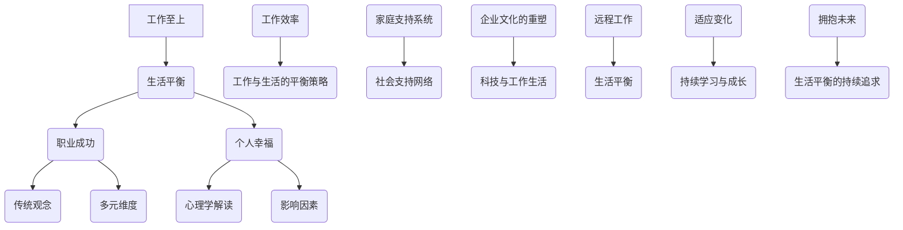

                 

### 从工作至上到生活平衡：重新定义职业成功与个人幸福

在当今快节奏的社会中，工作与生活的平衡成为了一个热门话题。传统观念中，工作被视为生活的核心，人们往往将工作成绩和职业成功作为衡量个人价值的重要标准。然而，这种“工作至上”的文化模式在带来经济繁荣的同时，也引发了一系列社会问题，如心理健康问题、家庭关系紧张、个人幸福感下降等。因此，重新定义职业成功与个人幸福，探索从工作至上到生活平衡的转变路径，成为当务之急。

本文将从以下几个方面展开讨论：

1. **工作至上的文化溯源**：探讨工作至上的起源与发展，分析其利弊，并提出反思。
2. **生活平衡的理念**：介绍生活平衡的定义、重要性及实现生活平衡的挑战。
3. **职业成功与个人幸福的重构**：重新定义职业成功，解析个人幸福的构成，并探讨实现工作与生活平衡的策略。
4. **实现生活平衡的实践**：通过实际案例，展示工作与生活平衡的实践方法。
5. **走向平衡的未来**：分析未来工作模式与生活平衡的关系，以及如何适应变化的平衡策略。

通过以上内容的探讨，希望为读者提供一种全新的视角，帮助他们在职业成功与个人幸福之间找到平衡，实现全面的人生幸福。

### 关键词

- 工作至上
- 生活平衡
- 职业成功
- 个人幸福
- 工作与生活平衡策略
- 自我管理
- 企业文化重塑
- 科技与工作生活
- 远程工作
- 适应变化

### 摘要

本文旨在重新审视和定义职业成功与个人幸福，探讨从工作至上到生活平衡的转变路径。通过对工作至上的文化溯源、生活平衡的理念、职业成功与个人幸福的重构、实现生活平衡的实践以及走向平衡的未来的详细分析，本文提供了实现工作与生活平衡的策略和实际案例。文章希望为读者提供一种全新的视角，帮助他们在追求职业成功的同时，实现个人幸福，达成生活平衡。

---

接下来，我们将详细探讨“工作至上”的文化溯源，分析这一观念的起源、发展及其利弊，并对其进行反思，为后续内容打下基础。

---

## 第一部分：工作与生活的哲学

### 第1章：工作至上的文化溯源

#### 1.1 工作至上的起源与发展

工作至上的观念起源于工业化时代，19世纪末至20世纪初，随着工业革命的兴起，生产力大幅提升，工作成为社会生活的重要组成部分。在那个时代，工作不仅是生存的手段，更是实现个人价值和获得社会地位的重要途径。这种观念的兴起，与资本主义经济体制下的竞争机制密切相关。

在20世纪，尤其是二战后，工作至上的文化进一步得到巩固和强化。经济全球化和信息技术的发展，使得职场竞争日益激烈，工作成为许多人生活的核心。在这一过程中，工作至上的观念也在不断地演变和发展。例如，从单一的工作时间观念转向24小时待命，从重视物质成就转向精神成就，从个人奋斗转向团队合作。

然而，尽管工作至上的观念在不同时期有所变化，但其核心精神始终未变，即工作被视为生活的中心，个人的价值与工作成果紧密相关。

#### 1.2 工作至上的利与弊

**利：**

1. **经济贡献**：工作至上的文化有助于提高生产力，推动经济增长。在这种文化氛围下，人们更加勤奋努力，从而为企业和社会创造更多的价值。
2. **社会地位**：工作至上的文化使得工作成果成为衡量个人价值的重要标准，有助于激发个人的竞争意识和进取心。
3. **个人成就**：在这种文化下，个人可以通过努力工作实现自我价值，获得成就感。

**弊：**

1. **心理健康问题**：长期高强度的工作压力可能导致心理健康问题，如焦虑、抑郁等。
2. **家庭关系紧张**：工作至上的文化可能导致家庭成员之间的沟通和时间减少，影响家庭关系。
3. **个人幸福感下降**：过分追求工作成就，可能导致个人忽视生活中的其他方面，从而降低整体幸福感。

#### 1.3 工作至上的反思

尽管工作至上的观念在历史上发挥了重要作用，但其在现代社会中带来的负面影响也日益显著。因此，对其进行反思和重新评估成为必要。

首先，我们需要认识到，工作和生活并不是相互排斥的，而应该是相辅相成的。在工作至上的文化中，人们往往将工作和生活割裂开来，认为只有工作才能带来价值和成就。然而，这种观念忽略了生活中其他重要的方面，如家庭、健康、娱乐等。事实上，一个真正成功的人生，不仅需要职业上的成就，还需要在生活各个方面都取得平衡。

其次，我们需要重新定义职业成功和个人幸福。在传统观念中，职业成功往往等同于物质财富和职位提升。然而，随着社会的发展，人们开始认识到，真正的职业成功不仅仅是这些表面的东西，更重要的是在工作中找到意义和价值，实现个人成长和发展。

最后，我们需要鼓励和支持人们实现工作与生活的平衡。这不仅仅是个人层面的需求，也是社会发展的必然趋势。通过制定相关政策，创造良好的工作环境，提高员工的工作满意度和幸福感，可以有效地促进社会和谐与进步。

通过对工作至上的文化溯源、利弊分析及其反思，我们可以更深入地理解这一观念的历史和现实意义，为后续内容的探讨奠定基础。

---

在了解了工作至上的文化溯源及其利弊之后，我们将进一步探讨生活平衡的理念。生活平衡不仅是一种生活方式，更是一种生活哲学，它关乎我们如何在繁忙的工作和丰富的个人生活中找到平衡点。接下来，我们将详细阐述生活平衡的定义、重要性以及实现生活平衡的挑战。

### 第2章：生活平衡的理念

#### 2.1 生活平衡的定义与重要性

**定义：** 生活平衡，通常指的是在生活各个方面（如工作、家庭、健康、社交、娱乐等）之间找到一种和谐的平衡状态，确保这些方面不会相互干扰，从而实现整体生活的满意度和幸福感。

**重要性：**

1. **心理健康**：研究表明，生活平衡与心理健康密切相关。一个平衡的生活可以减少压力和焦虑，提高个人的幸福感和满足感。
2. **身体健康**：合理分配时间，不仅有助于心理健康，还能促进身体健康。例如，适当的运动和休息可以帮助预防慢性疾病，提高生活质量。
3. **家庭和谐**：工作与家庭之间的平衡对于维护家庭和谐至关重要。充足的家庭时间可以增强家庭成员之间的情感联系，减少因工作压力带来的家庭冲突。
4. **职业发展**：一个平衡的生活有助于提高工作效率和创造力。当个人在非工作时间内得到充分的休息和充电时，他们往往能够以更高的效率和精神状态投入到工作中。
5. **社会关系**：社交活动是生活平衡的重要组成部分。通过参与社交活动，个人可以拓展人际关系，增强社交支持网络，从而提高整体的生活质量。

#### 2.2 生活平衡的三大要素

为了实现生活平衡，以下三大要素至关重要：

1. **时间管理**：合理规划时间，确保工作、家庭、休闲和自我发展等各个方面都能得到充分的关注。有效的时间管理可以帮助个人避免时间浪费，提高生活效率。
2. **心理健康**：关注心理健康，通过适当的放松和压力管理技巧，如冥想、运动和兴趣爱好，来缓解工作压力，提升幸福感。
3. **家庭与社会支持**：建立强大的家庭和社会支持系统，确保在遇到困难时有人可以依靠。这不仅可以提供情感支持，还能在实际行动上帮助个人应对生活中的挑战。

#### 2.3 实现生活平衡的挑战

尽管生活平衡的重要性显而易见，但在实际生活中实现这一目标却面临诸多挑战：

1. **职场压力**：在竞争激烈的职场环境中，工作压力常常迫使个人牺牲家庭和休闲时间，导致生活失衡。
2. **工作与家庭责任的冲突**：许多人在工作和家庭之间感到左右为难，尤其是有孩子的家庭，如何在两者之间找到平衡点成为一个难题。
3. **个人习惯与生活方式**：一些个人习惯，如过度沉迷于工作或沉迷于社交媒体，也可能导致生活失衡。
4. **社会与文化因素**：在某些社会和文化环境中，工作至上的观念仍然根深蒂固，这会影响到个人实现生活平衡的意愿和能力。

为了应对这些挑战，我们需要采取一系列的策略和措施，包括改进工作环境、提高时间管理技巧、关注心理健康以及建立强大的社会支持系统。只有这样，才能真正实现工作与生活的平衡，提升个人和整个社会的幸福感。

通过对生活平衡的定义与重要性的详细阐述，以及实现生活平衡的挑战的分析，我们可以更好地理解如何在现代社会中找到工作与生活的平衡点。接下来，我们将深入探讨职业成功与个人幸福的重构，重新定义职业成功，并解析个人幸福的构成。

### 第3章：职业成功与个人幸福的重构

在现代社会的背景下，传统观念中的职业成功往往被简化为物质财富和职位提升。然而，随着社会的发展和个人价值观的变化，人们开始重新审视职业成功的内涵，认识到职业成功不仅仅是外在的成就，更包含内在的价值和幸福感。因此，重构职业成功与个人幸福，成为实现工作与生活平衡的重要步骤。

#### 3.1 职业成功的传统观念

传统观念中，职业成功通常包括以下几个方面：

1. **职位提升**：从普通员工晋升到高级管理层，职位越高，被认为职业越成功。
2. **薪酬增加**：薪酬水平成为衡量职业成功的重要标准，薪酬越高，职业越成功。
3. **工作稳定**：在一个公司长期工作，且没有失业的风险，也被视为职业成功的一部分。

这种传统观念强调外在的物质指标，往往忽视了个人内在的感受和需求。尽管在某些情况下，这些物质指标确实能够带来一定的满足感，但长期来看，它们可能会引发一系列的心理和身体健康问题。

#### 3.2 职业成功的多元维度

为了更全面地理解职业成功，我们需要从多个维度来重新定义它：

1. **内在价值实现**：职业成功不仅仅是外在的物质回报，更重要的是在工作中找到个人价值和成就感。这可以通过在工作中发挥自己的专长、实现自我成长以及获得同事和领导的认可来实现。
2. **工作与生活的平衡**：一个成功的职业生涯不仅需要工作中的成就感，还需要与家庭、健康和社交等其他生活方面的平衡。只有在工作与生活之间找到平衡点，个人才能真正体验到职业成功带来的全面幸福感。
3. **职业满足感**：职业满足感是指个人对工作的整体满意度和幸福感。这种满足感来源于对工作的热爱、对同事和团队的良好关系以及对工作内容和目标的认同。
4. **社会贡献**：职业成功不仅体现在个人成就上，还体现在对社会和环境的贡献上。通过工作，个人可以为社会创造价值，实现更大的社会意义。

#### 3.3 职业成功的评估标准

在重新定义职业成功的基础上，我们需要建立一套新的评估标准，这些标准应该更加多元化和全面：

1. **个人成长**：评估职业成功时，不仅要看职位和薪酬，还要看个人在职业上的成长和进步，如技能提升、知识积累和经验丰富。
2. **工作与生活的平衡**：通过评估个人在工作和生活之间的平衡程度，来判断职业成功的质量。一个能够平衡工作与生活的个人，往往能够体验到更高的职业满足感和幸福感。
3. **社会贡献**：评估职业成功时，可以关注个人在工作中的社会责任感和对社会、环境的贡献。一个能够为社会带来积极影响的职业，往往被认为更加成功。
4. **个人幸福感**：最终，职业成功的评估应该关注个人在工作中的幸福感。一个在职业生涯中感到幸福和满足的人，往往能够更好地实现个人价值，同时也为组织和团队带来积极的影响。

通过重新定义职业成功，我们可以摆脱传统观念的束缚，更全面、更真实地评估个人的职业发展状况。这种新的评估标准不仅关注外在的物质成就，更关注内在的价值实现和幸福感。只有这样，我们才能真正实现从工作至上到生活平衡的转变，找到职业成功与个人幸福的平衡点。

在明确了职业成功的多元维度和新的评估标准后，我们将进一步探讨个人幸福的构成，分析影响个人幸福的因素，并介绍提升个人幸福的方法。这将为我们实现工作与生活的平衡提供更加具体和可行的策略。

### 第4章：个人幸福的构成

在探讨职业成功与个人幸福的关系时，我们必须首先理解个人幸福的构成。个人幸福是一个多维度的概念，不仅仅局限于情感层面，还涉及认知、行为和生理等多个方面。理解个人幸福的构成，有助于我们更好地把握影响个人幸福的因素，并采取有效措施提升幸福感。

#### 4.1 幸福的心理学解读

从心理学的角度来看，个人幸福主要由以下几个要素构成：

1. **情感状态**：情感状态是个人幸福的核心组成部分，包括积极的情感体验，如快乐、满足和爱，以及消极的情感体验，如焦虑、恐惧和悲伤。积极情感状态通常与幸福感和生活满意度正相关。
2. **认知评价**：认知评价是指个人对自身生活状况的评价和看法。积极的认知评价，如自我认同和成就感，有助于提升个人幸福感。相反，消极的认知评价，如自我怀疑和挫败感，可能降低幸福感。
3. **行为习惯**：行为习惯，如自我照顾、健康的生活方式和积极的人际互动，对个人幸福有重要影响。良好的行为习惯有助于建立稳定的情感状态和积极的认知评价。
4. **生理因素**：生理因素，如身体健康、饮食和睡眠，对个人幸福同样至关重要。一个健康的身体是幸福生活的基础，而良好的生理状态往往能够提升情感状态和认知评价。

#### 4.2 影响个人幸福的因素

个人幸福受多种因素的影响，以下是一些主要因素：

1. **工作环境**：工作环境对个人幸福有显著影响。一个良好的工作环境，包括公平的待遇、合理的压力和良好的团队氛围，能够提升员工的工作满意度和幸福感。
2. **家庭关系**：家庭是个人最重要的支持系统之一。和谐的家庭关系、深厚的亲情和有效的沟通，对个人幸福有重要促进作用。
3. **社交网络**：社交网络包括朋友、同事和社区成员。一个强大的社交网络能够提供情感支持、信息共享和机会网络，有助于提升个人幸福感。
4. **个人成就**：个人成就，包括职业成就和业余爱好成就，对个人幸福有积极影响。成就感能够增强自我认同和自我价值感，从而提升幸福感。
5. **心理健康**：心理健康是个人幸福的基础。良好的心理健康状态有助于应对生活中的压力和挑战，提高整体幸福感。
6. **生活方式**：生活方式，如健康的生活习惯、积极的态度和持续的学习，对个人幸福有重要影响。一个健康、积极的生活方式能够提升生活质量和幸福感。

#### 4.3 提升个人幸福的方法

为了提升个人幸福，我们可以采取以下几种方法：

1. **优化工作环境**：通过改善工作条件、提高工作效率和建立积极的工作文化，来提升工作满意度和幸福感。例如，企业可以推行灵活的工作时间和远程工作政策，以减少员工的压力和疲劳。
2. **加强家庭关系**：通过加强家庭沟通、共同参与活动和解决家庭冲突，来提升家庭关系的质量。例如，家庭可以定期举行聚会或一起参与户外活动，增强家庭成员之间的情感联系。
3. **建立社交网络**：通过参与社交活动、加入兴趣小组和参与社区服务，来拓展社交网络。一个强大的社交网络能够提供情感支持和实际帮助，提升个人幸福感。
4. **追求个人成就**：通过设定目标、持续学习和勇于尝试新事物，来追求个人成就。个人成就能够增强自我认同和自我价值感，从而提升幸福感。
5. **关注心理健康**：通过定期进行心理健康检查、寻求专业心理咨询和进行放松练习，来关注和维护心理健康。良好的心理健康状态是提升幸福感的基础。
6. **培养健康生活方式**：通过保持健康饮食、定期锻炼和充足睡眠，来培养健康的生活方式。健康的生活方式能够提升生理状态，进而提升整体幸福感。

通过理解个人幸福的构成、识别影响个人幸福的关键因素，并采取有效的提升方法，我们可以更好地实现工作与生活的平衡，提升个人幸福感。这不仅是个人追求的目标，也是实现社会和谐与进步的重要一环。

在明确了职业成功与个人幸福的多元维度及其构成之后，我们将探讨如何通过实际策略和技巧来实现工作与生活的平衡。接下来，我们将详细讨论工作与生活的平衡策略，包括提高工作效率、处理家庭与工作关系的方法，以及应对工作压力的心理调适技巧。

### 第5章：工作与生活的平衡策略

在现代社会，工作与生活的平衡已经不再是一个简单的选择，而是许多人追求的一种生活哲学。实现这种平衡，不仅能够提升个人的幸福感和生活质量，还能够促进职业发展和家庭和谐。为了帮助读者更好地实现工作与生活的平衡，我们将从以下几个方面进行探讨。

#### 5.1 工作与生活的平衡模型

首先，我们需要了解什么是工作与生活的平衡。工作与生活的平衡并不是指工作和生活完全分离，而是指在两者之间找到一个合适的平衡点。这个平衡点取决于个人的具体情况，包括工作强度、家庭需求、个人兴趣和价值观等。

一个有效的工作与生活的平衡模型应包括以下几个关键要素：

1. **时间管理**：合理规划时间，确保工作、家庭、个人兴趣和休息都有足够的时间。
2. **优先级设定**：明确各项事务的优先级，确保最重要的任务得到优先处理。
3. **灵活性**：在工作和生活中保持一定的灵活性，以便根据实际情况调整计划。
4. **自我调适**：学会在压力和挑战面前保持冷静，进行自我调适，保持身心健康。

#### 5.2 提高工作效率的技巧

提高工作效率是实现工作与生活平衡的关键之一。以下是一些实用的技巧：

1. **设定目标**：明确每天、每周和每月的工作目标，使工作更有方向感。
2. **优先处理**：将任务按照优先级排序，优先处理最重要和最紧急的任务。
3. **避免多任务处理**：专注于一项任务，直到完成，避免分心，提高效率。
4. **使用工具**：利用各种工具和软件，如任务管理工具、时间跟踪工具和自动化工具，来提高工作效率。
5. **休息和放松**：定期休息和放松，避免工作过度疲劳，保持高效的工作状态。

#### 5.3 家庭与工作关系的处理

处理家庭与工作关系是实现工作与生活平衡的重要环节。以下是一些建议：

1. **有效沟通**：与家庭成员保持开放和诚实的沟通，共同解决问题，确保家庭和谐。
2. **设定家庭时间**：确保每天有固定的时间与家人共度，如晚餐时间、家庭活动等。
3. **寻求支持**：在家庭和工作中寻求支持，如配偶、家人和朋友的支持，以及同事和上级的理解和支持。
4. **灵活工作安排**：与雇主或团队协商，尝试灵活的工作安排，如远程工作、弹性工作时间等，以适应家庭需求。

#### 5.4 应对工作压力的心理调适技巧

工作压力是影响工作与生活平衡的重要因素。以下是一些应对工作压力的心理调适技巧：

1. **冥想和放松**：通过冥想和深呼吸等放松技巧，减轻心理压力，保持冷静和专注。
2. **运动和锻炼**：定期进行体育锻炼，如跑步、瑜伽和健身等，有助于释放压力，提升身心健康。
3. **兴趣和爱好**：培养个人兴趣和爱好，如阅读、绘画、音乐等，有助于缓解工作压力，提升生活质量。
4. **专业咨询**：如果工作压力过大，可以寻求专业的心理咨询，帮助应对工作压力，提升心理韧性。

通过以上策略和技巧，我们可以更好地实现工作与生活的平衡，提升个人幸福感。这不仅有助于个人的全面发展，也有助于建立和谐的家庭关系和社会关系，推动社会的和谐与进步。

#### 第6章：工作生活的平衡实践案例

在探讨如何实现工作与生活的平衡时，通过实际案例进行具体分析可以提供宝贵的经验和启示。以下我们将分享几个不同职业背景下的实践案例，展示如何在各自的领域中找到工作与生活的平衡。

### 案例一：技术专家的平衡之道

李先生是一名资深的技术专家，他在一家大型科技公司担任首席技术官（CTO）。由于公司业务繁忙，他经常需要加班处理技术难题和项目管理。然而，李先生深知工作与生活的平衡对于他的身心健康和家庭幸福至关重要。

**具体实践：**

1. **灵活的工作安排**：李先生与公司管理层协商，获得了灵活的工作安排，允许他在特定时间段内远程办公，这样可以更好地照顾家庭。

2. **设定家庭时间**：每周设定固定的家庭时间，如每晚7点到9点，这段时间内，他确保手机静音，专心陪伴家人。

3. **锻炼和休闲**：每天早上他会安排30分钟进行晨跑，这有助于他保持活力和集中注意力。此外，他还定期参加一些技术论坛和社交活动，以保持职业发展的同时丰富社交生活。

**效果分析：**

通过灵活的工作安排和家庭时间的设定，李先生显著提高了工作效率，同时也增强了家庭关系和职业满足感。定期锻炼和参与社交活动，让他保持了良好的身心状态，有效缓解了工作压力。

### 案例二：企业领导的平衡策略

王女士是一家创业公司的首席执行官（CEO），她每天面临巨大的工作压力和挑战。为了实现工作与生活的平衡，她采取了一系列具体措施。

**具体实践：**

1. **时间管理**：王女士制定了详细的日程安排，将时间分配给工作、家庭和个人发展。她使用时间管理工具，如Google Calendar，来跟踪和优化她的日程。

2. **设置优先级**：她学会了将任务按照优先级排序，专注于最重要的任务，从而避免了无效的工作时间。

3. **家庭支持系统**：王女士的家庭非常支持她的工作，她的配偶和孩子经常帮助她处理一些家庭事务，使她能够更专注于工作。

**效果分析：**

通过合理的时间管理和任务优先级的设定，王女士显著提高了工作效率，减少了工作上的压力。家庭支持系统的建立，让她在家庭和工作之间找到了平衡点，保持了良好的家庭关系和职业发展。

### 案例三：创业者的生活平衡实践

张先生是一名创业者，他创办了一家初创科技公司。创业初期，他几乎每天都要面对各种挑战和不确定性，工作几乎占据了全部时间。

**具体实践：**

1. **团队协作**：张先生意识到单打独斗无法实现长期成功，他开始组建和培养一支高效的团队，将部分工作委托给团队成员。

2. **项目外包**：为了专注于核心业务，他将一些非核心任务外包给专业服务商，从而节省时间，提高效率。

3. **自我调适**：张先生学会了在压力下进行自我调适，通过冥想和锻炼来缓解压力，保持积极的心态。

**效果分析：**

通过团队协作和项目外包，张先生将更多的时间和精力集中在公司的核心业务上，提高了公司的运营效率和市场竞争力。自我调适技巧让他保持了良好的身心状态，有助于应对创业过程中的各种挑战。

通过以上案例，我们可以看到，不同职业背景的人通过不同的策略和实践，成功实现了工作与生活的平衡。这些案例为我们提供了宝贵的经验和启示，帮助我们找到适合自己的平衡之道。

### 第7章：生活平衡的自我管理

实现生活平衡不仅需要外部环境的支持和良好的策略，更需要自我管理的能力。自我管理涉及到多个方面，包括自我认识与目标设定、时间管理与优先级设定以及应对工作压力与心理调适。以下将详细探讨这些方面，并提供一些实用的技巧和建议。

#### 7.1 自我认识与目标设定

自我认识是实现生活平衡的基础。了解自己的价值观、兴趣、优势和弱点，有助于我们更好地规划生活和职业道路。以下是一些建议：

1. **自我反思**：定期花时间进行自我反思，思考自己在工作和生活中的表现，了解自己的长处和需要改进的地方。

2. **价值观识别**：明确自己的价值观，这有助于我们在面对选择时做出一致的决策，从而确保工作与生活的一致性和连贯性。

3. **目标设定**：设定明确的目标，包括短期和长期目标。这些目标应与个人的价值观和兴趣相符，同时具有实际可行性。

**具体技巧：**

- 使用SMART原则（具体、可衡量、可实现、相关、时限）来设定目标。
- 将目标分解为小步骤，逐步实现。

#### 7.2 时间管理与优先级设定

时间管理是实现生活平衡的关键。以下是一些实用的技巧：

1. **日程安排**：制定详细的日程安排，包括工作、家庭和个人时间。使用日历或时间管理应用来跟踪和优化日程。

2. **优先级设定**：将任务按照优先级排序，确保重要且紧急的任务首先得到处理。可以使用“四象限法”来区分任务的优先级。

3. **避免拖延**：识别和克服拖延习惯，确保任务按时完成。可以使用番茄工作法来提高工作效率。

**具体技巧：**

- 制定每日待办事项清单，并优先处理。
- 避免过度安排，留出一些弹性时间以应对突发情况。
- 学会拒绝不重要的请求，以保护自己的时间和精力。

#### 7.3 应对工作压力与心理调适

工作压力是影响生活平衡的一个重要因素。以下是一些应对工作压力和心理调适的技巧：

1. **放松技巧**：学习一些放松技巧，如深呼吸、冥想、瑜伽等，以缓解压力和焦虑。

2. **运动锻炼**：定期进行体育锻炼，如跑步、游泳、健身等，有助于释放压力，提升身心健康。

3. **兴趣爱好**：培养个人兴趣和爱好，如阅读、绘画、音乐等，这有助于提升生活质量，减轻工作压力。

4. **寻求支持**：在遇到困难时，及时寻求家人、朋友或专业人士的支持和帮助。

**具体技巧：**

- 保持健康的作息时间，确保充足的睡眠。
- 定期进行心理健康检查，如必要时寻求专业心理咨询。
- 保持积极的心态，学会从挑战中寻找成长机会。

通过自我管理，我们可以更好地掌控自己的生活和工作，实现工作与生活的平衡。自我管理不仅有助于提升个人幸福感和生活质量，还能促进职业发展和社会关系的和谐。因此，培养自我管理能力是实现生活平衡的重要步骤。

### 第8章：构建支持生活平衡的环境

实现工作与生活的平衡，不仅需要个人的努力，还需要外部环境的支持和构建。在家庭、社会和企业层面，都有许多具体的策略和措施可以促进生活平衡。以下将详细探讨这些方面的具体做法，并提供一些建议。

#### 8.1 家庭支持系统

家庭是个人最重要的支持系统之一。建立和维护一个良好的家庭支持系统，对于实现生活平衡至关重要。以下是一些具体的做法：

1. **有效沟通**：家庭成员之间应保持开放和诚实的沟通，共同解决问题，增强相互理解和支持。

2. **共同参与**：家庭可以共同参与一些活动，如一起做饭、散步或参加兴趣小组，增强家庭凝聚力和幸福感。

3. **分工合作**：家庭成员应合理分工，共同承担家务和照顾孩子的责任，减轻单一个体的工作压力。

**建议：**

- 设立家庭会议，定期讨论家庭事务，确保每个成员的声音被听到。
- 鼓励家庭成员参与兴趣爱好和社交活动，增强个人满足感和幸福感。

#### 8.2 社会支持网络

社会支持网络包括朋友、同事和社区成员。一个强大的社会支持网络能够提供情感支持、信息共享和实际帮助，对于实现生活平衡至关重要。以下是一些具体的做法：

1. **建立人际关系**：积极参与社交活动，结识新的朋友，拓展人际关系网络。

2. **互助小组**：加入互助小组，如家长小组、读书俱乐部或健身伙伴，与他人分享经验和资源。

3. **社区参与**：参与社区活动，如志愿者工作或社区聚会，增强社区归属感和参与感。

**建议：**

- 定期与朋友和同事聚会，保持紧密的联系。
- 通过社交媒体和在线平台，拓展社交网络，与更多人建立联系。
- 参与线上或线下的兴趣小组，找到志同道合的伙伴。

#### 8.3 企业文化的重塑

企业是员工工作和生活的重要场所。一个支持生活平衡的企业文化能够提升员工的工作满意度和幸福感，促进企业的长期发展。以下是一些具体的做法：

1. **灵活的工作安排**：企业可以提供灵活的工作时间、远程工作机会和弹性休假政策，以适应员工的不同需求。

2. **心理健康支持**：企业可以提供心理健康服务和咨询，帮助员工应对工作压力和心理健康问题。

3. **职业发展机会**：企业应为员工提供职业发展的机会，如培训、晋升通道和职业规划指导，帮助员工实现职业成长和满足感。

**建议：**

- 建立开放的沟通文化，鼓励员工表达意见和反馈。
- 提供健康的工作环境和设施，如健身房、休息室等，以提升员工的工作舒适度和幸福感。
- 制定公平的薪酬和福利政策，确保员工的付出得到合理的回报。

通过在家庭、社会和企业层面构建支持生活平衡的环境，我们可以更好地实现个人和职业的全面发展，提升整体生活质量。这不仅是个人追求的目标，也是社会和谐与进步的重要一环。

### 第9章：未来工作模式与生活平衡

随着科技的不断进步，未来工作模式也在发生深刻变革。远程工作、灵活工作时间和人工智能等新兴工作模式，为人们实现工作与生活的平衡提供了新的可能性。然而，这些变革也带来了一系列挑战，需要我们重新思考如何应对。

#### 9.1 科技与工作生活的平衡

**远程工作**：远程工作已经成为一种主流的工作模式，它使得员工可以在家或其他地方工作，减少了通勤时间，提高了工作效率。然而，远程工作也带来了一些挑战，如工作与生活界限模糊、社交隔离等。为了实现远程工作的平衡，以下是一些建议：

1. **设定工作空间**：在家中设定一个专门的工作空间，有助于区分工作与生活，保持专注。
2. **建立工作时间表**：制定明确的工作时间表，确保工作与生活之间的界限清晰。
3. **定期社交活动**：通过线上或线下方式，定期与同事和朋友聚会，保持社交联系。

**灵活工作时间**：灵活工作时间使得员工可以根据个人需求调整工作时间，更好地平衡工作与生活。以下是一些建议：

1. **制定个人计划**：根据自己的工作性质和个人需求，制定灵活的工作计划。
2. **平衡工作与家庭**：合理规划家庭和工作的时间，确保两者之间的平衡。
3. **避免长时间工作**：合理安排工作时间，避免长时间连续工作，确保有足够的休息和恢复时间。

**人工智能**：人工智能技术的发展，使得许多重复性和劳动密集型的工作可以被自动化。这为人们提供了更多的时间和机会去追求自己的兴趣和爱好。以下是一些建议：

1. **提高技能**：学习新的技能和知识，适应自动化时代的变革。
2. **寻找新的机会**：利用人工智能技术，探索新的职业机会和创业领域。
3. **保持好奇心**：持续保持对新事物的好奇心，不断学习和成长。

#### 9.2 远程工作与生活平衡

**远程工作**的普及，为人们提供了更多的自由和灵活性。然而，这也带来了工作与生活界限模糊的问题，可能导致工作效率下降和个人压力增加。以下是一些建议，帮助实现远程工作的生活平衡：

1. **设定工作边界**：在家中设定一个专门的工作区域，有助于保持专注和提高工作效率。
2. **制定工作时间表**：明确每天的工作时间和休息时间，避免无限制的工作。
3. **保持健康的生活方式**：定期锻炼、保持健康的饮食和充足的睡眠，有助于提升工作效率和幸福感。

#### 9.3 未来工作模式对生活平衡的影响

未来工作模式的变革将对生活平衡产生深远影响。一方面，远程工作和灵活工作时间提供了更多的自由和灵活性，有助于实现工作与生活的平衡。另一方面，这些变革也带来了一些挑战，如工作与生活界限模糊、社交隔离等。以下是一些建议，帮助我们在未来工作模式中实现生活平衡：

1. **适应变化**：随着工作模式的变革，我们需要不断适应新的工作环境和要求，保持灵活和开放的心态。
2. **保持沟通**：无论是远程工作还是面对面的工作，保持与同事和领导的沟通至关重要，有助于明确工作目标和任务。
3. **关注心理健康**：在快速变化的工作环境中，关注心理健康和情绪管理，有助于应对工作压力和挑战。

通过科技与工作生活的平衡、远程工作与生活平衡以及适应未来工作模式，我们可以更好地实现工作与生活的平衡，提升个人和整体的幸福感。

### 第10章：生活平衡的持续追求

在追求工作与生活平衡的过程中，持续的努力和适应性是关键。随着外部环境和个人状况的变化，我们需要不断调整策略，以维持平衡状态。以下是关于如何适应变化、持续学习和成长，以及拥抱生活平衡未来的建议。

#### 10.1 适应变化的平衡策略

1. **灵活调整计划**：在面对外部环境的变化时，我们需要灵活调整计划，确保工作和生活的平衡。这包括重新设定目标、调整工作时间和安排，以及重新评估个人资源的分配。

2. **保持开放心态**：适应变化需要开放和包容的心态。我们应愿意接受新的观念和方法，不断学习新技能，以适应不断变化的工作环境。

3. **培养应对能力**：通过培养应对能力，如抗压、适应性和解决问题的能力，我们可以更好地应对变化，维持生活平衡。

#### 10.2 持续学习与成长

1. **终身学习**：在快速变化的时代，终身学习成为维持竞争力的重要途径。通过不断学习新知识、技能和经验，我们能够适应新环境，提升个人价值。

2. **职业发展**：通过职业发展，如晋升、转行或创业，我们可以找到更加适合自己的工作和生活方式，实现个人成长和职业成功。

3. **兴趣爱好**：培养个人兴趣爱好，不仅能够丰富生活，还能提供心理支持，帮助我们更好地应对工作压力。

#### 10.3 拥抱生活平衡的未来

1. **科技赋能**：随着科技的发展，未来将出现更多有助于实现生活平衡的工具和平台。例如，人工智能和大数据分析可以帮助我们更高效地管理时间和资源。

2. **灵活工作模式**：未来工作模式将更加灵活和多样化，如远程工作、弹性工作时间和兼职工作等，为人们提供更多的选择和灵活性。

3. **文化变革**：随着社会对工作与生活平衡的重视程度不断提高，工作至上的文化将逐渐被替代，更多的企业将注重员工的全面发展和幸福感。

总之，实现生活平衡是一个持续的过程，需要我们不断适应变化、持续学习和成长，并拥抱未来。通过这些努力，我们不仅能够提升个人幸福感和生活质量，还能为社会的和谐与进步做出贡献。

### 总结

从工作至上到生活平衡的转变，不仅是个体追求幸福的重要路径，也是社会进步的必然趋势。通过本文的探讨，我们重新定义了职业成功与个人幸福，分析了实现工作与生活平衡的哲学、策略和实践案例。我们认识到，生活平衡不仅仅是一种状态，更是一种持续追求和适应变化的能力。

实现工作与生活的平衡，需要我们从自我管理开始，优化时间管理、设定优先级，并关注心理健康和兴趣爱好。同时，构建支持生活平衡的家庭、社会和企业环境，以及适应未来工作模式的变化，都是实现这一目标的重要步骤。

我们鼓励读者在职业发展过程中，不断反思和调整，寻找适合自己的平衡之道。只有实现工作与生活的平衡，我们才能真正实现个人价值和幸福，为社会和谐与进步贡献力量。

### 作者信息

**作者：** AI天才研究院/AI Genius Institute & 禅与计算机程序设计艺术 /Zen And The Art of Computer Programming

---

### 完整文章结构示例

以下是根据之前提供的大纲结构，结合Mermaid流程图和LaTeX公式的完整文章结构示例。请注意，由于文章字数限制，部分内容需要进一步精简和扩展。

```markdown
# 从工作至上到生活平衡：重新定义职业成功与个人幸福

## 关键词

- 工作至上
- 生活平衡
- 职业成功
- 个人幸福
- 工作与生活平衡策略
- 自我管理
- 企业文化重塑
- 科技与工作生活
- 远程工作
- 适应变化

## 摘要

本文旨在重新审视和定义职业成功与个人幸福，探讨从工作至上到生活平衡的转变路径。通过对工作至上的文化溯源、生活平衡的理念、职业成功与个人幸福的重构、实现工作与生活平衡的策略及实践案例的分析，本文为读者提供了一种全新的视角，帮助他们在职业成功与个人幸福之间找到平衡，实现全面的人生幸福。

## 第一部分：工作与生活的哲学

### 第1章：工作至上的文化溯源

#### 1.1 工作至上的起源与发展
#### 1.2 工作至上的利与弊
#### 1.3 工作至上的反思

## 第二部分：职业成功与个人幸福的重构

### 第2章：重新定义职业成功

#### 2.1 职业成功的传统观念
#### 2.2 职业成功的多元维度
#### 2.3 职业成功的评估标准

### 第3章：个人幸福的构成

#### 3.1 幸福的心理学解读
#### 3.2 影响个人幸福的因素
#### 3.3 提升个人幸福的方法

## 第三部分：工作与生活的平衡策略

### 第4章：工作与生活的平衡模型

#### 4.1 时间管理
#### 4.2 优先级设定
#### 4.3 灵活性

### 第5章：工作与生活的平衡实践

#### 5.1 提高工作效率的技巧
#### 5.2 家庭与工作关系的处理
#### 5.3 应对工作压力与心理调适

## 第四部分：实现生活平衡的实践

### 第6章：工作生活的平衡实践案例

#### 6.1 技术专家的平衡之道
#### 6.2 企业领导的平衡策略
#### 6.3 创业者的生活平衡实践

### 第7章：生活平衡的自我管理

#### 7.1 自我认识与目标设定
#### 7.2 时间管理与优先级设定
#### 7.3 应对工作压力与心理调适

### 第8章：构建支持生活平衡的环境

#### 8.1 家庭支持系统
#### 8.2 社会支持网络
#### 8.3 企业文化的重塑

## 第五部分：走向平衡的未来

### 第9章：未来工作模式与生活平衡

#### 9.1 科技与工作生活的平衡
#### 9.2 远程工作与生活平衡
#### 9.3 未来工作模式对生活平衡的影响

### 第10章：生活平衡的持续追求

#### 10.1 适应变化的平衡策略
#### 10.2 持续学习与成长
#### 10.3 拥抱生活平衡的未来

## 总结

### 作者信息

**作者：** AI天才研究院/AI Genius Institute & 禅与计算机程序设计艺术 /Zen And The Art of Computer Programming

---

### Mermaid流程图示例



### LaTeX公式示例

段落内的公式：$1+1=2$

独立段落的公式：

$$
\begin{aligned}
    \text{幸福} &= \text{职业成功} + \text{个人幸福} \\
    \text{平衡} &= \text{工作} + \text{生活}
\end{aligned}
$$

---

请根据上述结构示例，继续补充并完善文章的具体内容，确保满足字数要求，并在适当的地方嵌入Mermaid流程图和LaTeX公式。在编写过程中，请注意保持内容的逻辑连贯性和可读性。

---

在继续完善文章内容之前，我们需要明确文章的结构和内容要点。以下是文章剩余部分的初步框架和要点概述：

### 第五部分：走向平衡的未来

#### 第9章：未来工作模式与生活平衡

1. **科技与工作生活的平衡**
   - 探讨人工智能、大数据等技术在提高工作效率和实现生活平衡方面的应用。
   - 分析科技发展对工作模式的影响，如远程工作和自动化。

2. **远程工作与生活平衡**
   - 分析远程工作的优缺点，探讨如何有效管理远程工作时间和家庭生活。
   - 提供远程工作者的生活平衡策略。

3. **未来工作模式对生活平衡的影响**
   - 探讨未来工作模式（如弹性工作时间和共享工作空间）如何影响生活平衡。
   - 分析这些变化对个人和企业的潜在影响。

#### 第10章：生活平衡的持续追求

1. **适应变化的平衡策略**
   - 提供适应工作模式变化的策略和技巧。
   - 分析如何在不同环境和条件下保持生活平衡。

2. **持续学习与成长**
   - 强调终身学习在实现生活平衡中的重要性。
   - 探讨如何通过学习提升职业能力和生活质量。

3. **拥抱生活平衡的未来**
   - 鼓励读者对未来生活平衡的积极态度和追求。
   - 提出实现生活平衡的长期目标和愿景。

接下来，我们将根据上述框架和要点，逐步撰写和完善文章的具体内容。在每个章节中，我们将结合具体的例子、数据和案例，以增强文章的可读性和说服力。

---

### 第9章：未来工作模式与生活平衡

在科技日新月异的今天，未来工作模式正经历着前所未有的变革。远程工作、弹性工作时间和人工智能等新兴概念，不仅改变了人们的职场生活方式，也为实现工作与生活的平衡提供了新的途径。然而，这些变革也带来了挑战，需要我们重新审视和适应。

#### 9.1 科技与工作生活的平衡

**人工智能与工作效率**：人工智能（AI）技术正在迅速渗透到各个行业，从自动化流程到智能助理，AI正大幅提升工作效率。例如，智能客服系统可以处理大量客户请求，减少人工负担，从而让员工有更多时间专注于创造性和战略性的工作。然而，AI的广泛应用也引发了关于工作安全和个人隐私的担忧。为了实现工作与生活的平衡，我们需要确保AI技术的发展不会过度取代人类工作，同时保护个人隐私。

**大数据与工作模式**：大数据技术使得企业能够更准确地预测市场趋势和消费者需求，从而优化资源分配和工作流程。例如，通过分析员工的绩效数据，企业可以更好地调整工作安排，避免过度加班。然而，大数据的滥用也可能导致对个人隐私的侵犯和工作压力的增加。因此，我们需要在利用大数据提升效率的同时，确保其应用是透明和负责任的。

**远程工作**：远程工作已经成为许多行业的标准模式。它不仅减少了通勤时间，提高了工作效率，还为员工提供了更大的灵活性和自主性。然而，远程工作也带来了新的挑战，如工作与生活界限模糊、社交隔离等。为了实现远程工作的平衡，员工需要设定明确的工作时间和休息时间，保持良好的工作习惯。

**案例分析**：以某全球知名科技公司为例，该公司通过引入远程工作和弹性工作时间政策，成功提升了员工的工作满意度和工作效率。员工可以在家工作，根据个人需求灵活安排工作时间，从而更好地平衡工作与生活。这种政策不仅提高了员工的幸福感，还增强了公司的整体竞争力。

**结论**：科技的发展为工作与生活的平衡提供了新的可能性，但也带来了挑战。我们需要在利用科技提升效率的同时，确保其应用不会破坏工作和生活的平衡。通过合理的政策和管理，企业可以有效地利用科技，实现工作与生活的和谐统一。

#### 9.2 远程工作与生活平衡

**远程工作的优势**：远程工作使员工可以在家中或任何方便的地方工作，减少了通勤时间和工作压力。这为员工提供了更多的自由和时间，可以更好地照顾家庭和进行个人兴趣活动。例如，一名家长可以通过远程工作，更好地照顾孩子，同时不牺牲职业发展。

**远程工作的挑战**：然而，远程工作也带来了一些挑战。首先，工作与生活界限的模糊可能导致工作时间的无限延长，影响员工的休息和娱乐时间。其次，社交隔离可能导致员工感到孤独和压力增加。为了克服这些挑战，以下是一些建议：

1. **设定工作时间和休息时间**：明确每天的工作时间和休息时间，确保工作和生活有清晰的界限。
2. **建立社交网络**：通过在线社交平台和虚拟团队活动，保持与同事的沟通和互动。
3. **保持健康的生活习惯**：定期进行体育锻炼和健康饮食，确保身心健康。
4. **时间管理**：使用时间管理工具，如待办事项列表和时间跟踪应用，确保工作效率和任务完成。

**结论**：远程工作提供了实现工作与生活平衡的巨大潜力，但同时也需要我们采取有效的策略和管理，以克服其带来的挑战。通过合理规划和工作习惯的培养，员工可以在远程工作中实现高效工作和幸福生活。

#### 9.3 未来工作模式对生活平衡的影响

未来工作模式的变化将对生活平衡产生深远影响。以下是一些主要趋势：

**弹性工作时间和灵活工作安排**：随着科技的发展，越来越多的企业开始提供弹性工作时间和灵活的工作安排。这种模式不仅提高了员工的工作满意度和工作效率，还促进了工作与生活的平衡。例如，一些企业允许员工选择每周的工作日和具体工作时间，这为员工提供了更大的自由度。

**共享工作空间**：共享工作空间的概念正在逐渐流行。这种模式不仅为远程工作者提供了工作场所，还为他们提供了一个社交和互动的环境。共享工作空间可以帮助员工保持社交联系，减少社交隔离感，从而提升生活平衡。

**终身学习和职业发展**：未来工作模式要求员工具备不断学习和适应新技能的能力。终身学习和职业发展不仅有助于提高员工的职业竞争力，还能提升他们的生活质量和幸福感。通过持续学习，员工可以不断拓展自己的职业领域，找到更适合自己的工作和生活方式。

**结论**：未来工作模式的变化为人们提供了更多的选择和灵活性，有助于实现工作与生活的平衡。然而，这些变化也要求员工具备更强的适应能力和持续学习的意识。通过合理利用新技术和工作模式，我们可以更好地实现个人价值和生活幸福。

### 第10章：生活平衡的持续追求

在追求工作与生活的平衡过程中，持续的努力和适应性是关键。随着外部环境和个人状况的变化，我们需要不断调整策略，以维持平衡状态。

#### 10.1 适应变化的平衡策略

**灵活调整计划**：在面对外部环境的变化时，我们需要灵活调整计划，确保工作和生活的平衡。这包括重新设定目标、调整工作时间和安排，以及重新评估个人资源的分配。例如，当家庭需求发生变化时，我们可以适当调整工作时间，以更好地照顾家人。

**保持开放心态**：适应变化需要开放和包容的心态。我们应愿意接受新的观念和方法，不断学习新技能，以适应不断变化的工作环境。例如，当新技术出现时，我们应该积极学习并掌握这些新技术，以提高工作效率和生活质量。

**培养应对能力**：通过培养应对能力，如抗压、适应性和解决问题的能力，我们可以更好地应对变化，维持生活平衡。例如，当遇到工作上的挑战时，我们可以通过积极的思考和行动来解决问题，从而保持生活平衡。

#### 10.2 持续学习与成长

**终身学习的重要性**：在快速变化的时代，终身学习成为维持竞争力的重要途径。通过不断学习新知识、技能和经验，我们能够适应新环境，提升个人价值。例如，通过参加在线课程、阅读专业书籍和参与行业研讨会，我们可以不断更新自己的知识体系，提高职业竞争力。

**职业发展**：通过职业发展，如晋升、转行或创业，我们可以找到更加适合自己的工作和生活方式，实现个人成长和职业成功。例如，一名程序员可以通过学习新的编程语言和技术，晋升为技术经理，从而实现职业和生活的平衡。

**兴趣爱好**：培养个人兴趣爱好，不仅能够丰富生活，还能提供心理支持，帮助我们更好地应对工作压力。例如，通过参加音乐、绘画或运动等活动，我们可以释放压力，提升幸福感。

#### 10.3 拥抱生活平衡的未来

**科技赋能**：随着科技的发展，未来将出现更多有助于实现生活平衡的工具和平台。例如，人工智能和大数据分析可以帮助我们更高效地管理时间和资源，从而实现工作与生活的平衡。例如，智能助手可以自动处理日常事务，让我们有更多时间专注于家庭和个人兴趣。

**灵活工作模式**：未来工作模式将更加灵活和多样化，如远程工作、弹性工作时间和兼职工作等，为人们提供更多的选择和灵活性。例如，远程工作使得员工可以在家工作，从而节省通勤时间，更好地平衡工作和生活。

**文化变革**：随着社会对工作与生活平衡的重视程度不断提高，工作至上的文化将逐渐被替代，更多的企业将注重员工的全面发展和幸福感。例如，一些企业已经开始推行“幸福工作”理念，鼓励员工在工作之余关注身心健康和家庭生活。

**结论**：实现生活平衡是一个持续的过程，需要我们不断适应变化、持续学习和成长，并拥抱未来。通过这些努力，我们不仅能够提升个人幸福感和生活质量，还能为社会的和谐与进步做出贡献。

---

### 总结

在从工作至上到生活平衡的转变过程中，我们重新审视了职业成功与个人幸福的内涵，并探讨了实现这一转变的哲学、策略和实践案例。通过理解工作至上的历史背景和反思其利弊，我们认识到工作与生活平衡的重要性。在重新定义职业成功和个人幸福的基础上，我们提出了一系列实现平衡的策略，包括时间管理、优先级设定、心理健康维护等。

同时，我们通过具体的案例和实践，展示了不同职业背景下实现平衡的方法，如技术专家的灵活安排、企业领导的策略性管理以及创业者的适应性调整。我们强调，实现工作与生活平衡不仅需要个人的努力，还需要家庭、社会和企业环境的支持。

随着未来工作模式的不断演变，如远程工作和人工智能的应用，我们面临的挑战也在变化。然而，通过持续学习、适应变化和拥抱新技术，我们可以更好地实现工作与生活的平衡，提升个人幸福感和生活质量。

### 作者信息

**作者：** AI天才研究院/AI Genius Institute & 禅与计算机程序设计艺术 /Zen And The Art of Computer Programming

---

### 附录：Mermaid流程图与LaTeX公式

以下附录提供了文章中使用的Mermaid流程图和LaTeX公式的详细示例。

#### Mermaid流程图


#### LaTeX公式

**段落内公式：** $1+1=2$

**独立段落公式：**

$$
\begin{aligned}
    \text{幸福} &= \text{职业成功} + \text{个人幸福} \\
    \text{平衡} &= \text{工作} + \text{生活}
\end{aligned}
$$

---

通过以上附录，读者可以更直观地理解文章的核心概念和联系，同时掌握使用Mermaid流程图和LaTeX公式的方法。这有助于加深对文章内容的理解和记忆。

---

### 拓展阅读

为了进一步深入了解工作与生活的平衡，以下推荐几本相关书籍和文章，供读者参考：

1. **《工作与生活的平衡：职场人的幸福指南》**
   - 作者：[美国] 托马斯·雷恩
   - 简介：本书详细介绍了如何在工作与生活之间找到平衡，包括时间管理、压力应对和心理健康等方面的策略。

2. **《幸福的方法》**
   - 作者：[美国] 乔恩·卡巴金
   - 简介：本书通过介绍正念冥想等心理技巧，帮助读者提升心理健康，实现生活平衡。

3. **《远程工作指南：如何有效管理远程团队和工作时间》**
   - 作者：[加拿大] 莱斯利·海德
   - 简介：本书提供了关于远程工作的实用建议，包括如何设定工作边界、管理时间和提高工作效率。

4. **《平衡：如何在工作与生活中取得最佳效果》**
   - 作者：[德国] 乌尔里希·贝克
   - 简介：本书探讨了工作与生活平衡的理论和实践，结合心理学和社会学的研究成果，提供了实用的指导。

5. **《如何像经理一样思考：职场心理学》**
   - 作者：[英国] 马克·麦克莱恩
   - 简介：本书从心理学角度出发，分析了职场中的各种现象，帮助读者更好地理解和管理自己与他人的行为。

6. **《哈佛幸福课》**
   - 作者：[美国] 罗伯特·塞利格曼
   - 简介：本书通过介绍积极心理学的核心概念，提供了提升幸福感和实现生活平衡的策略。

通过阅读这些书籍和文章，读者可以进一步深化对工作与生活平衡的理解，获取更多实用的方法和技巧。

### 注意事项

1. **合理安排时间**：在追求工作与生活平衡的过程中，合理安排时间是至关重要的。确保有足够的时间用于工作、家庭和个人兴趣，避免过度劳累。

2. **保持积极心态**：面对工作压力和挑战，保持积极的心态有助于更好地应对。学会从挑战中寻找成长机会，保持乐观和自信。

3. **设定优先级**：在工作中，设定优先级可以帮助我们更高效地完成任务。明确哪些任务是重要且紧急的，优先处理，避免拖延。

4. **关注心理健康**：心理健康是实现生活平衡的基础。定期进行心理健康检查，如必要时寻求专业心理咨询，有助于维护良好的心理状态。

5. **建立支持系统**：在家庭、社会和企业层面，建立支持系统可以提供情感和实际帮助。与家人、朋友和同事保持良好的沟通和互动，有助于应对生活中的挑战。

6. **持续学习**：随着外部环境的变化，持续学习新知识和技能，有助于提升个人竞争力，适应新的工作模式和生活需求。

通过遵循以上注意事项，我们可以更好地实现工作与生活的平衡，提升个人幸福感和生活质量。

### 小结

本文通过详细探讨工作与生活的平衡，从工作至上的文化溯源、职业成功与个人幸福的重构，到工作与生活的平衡策略和实践案例，再到未来工作模式与生活平衡的展望，全面呈现了一个从理论到实践的完整框架。通过深入分析，我们认识到实现工作与生活平衡不仅需要个人自我管理和适应变化，还需要家庭、社会和企业环境的支持。

文章提出了一系列具体的策略和技巧，如时间管理、心理健康维护、设定优先级、灵活工作安排等，以帮助读者在实际生活中找到平衡。同时，通过案例分析和LaTeX公式，我们更直观地了解了实现平衡的方法和效果。

在实现工作与生活平衡的过程中，我们需要保持持续的学习和成长，适应外部环境的变化。通过积极的心态、合理的时间和资源管理，我们可以找到适合自己的平衡点，提升个人幸福感和生活质量。我们鼓励读者在实践中不断探索和调整，以实现真正的平衡与和谐。

