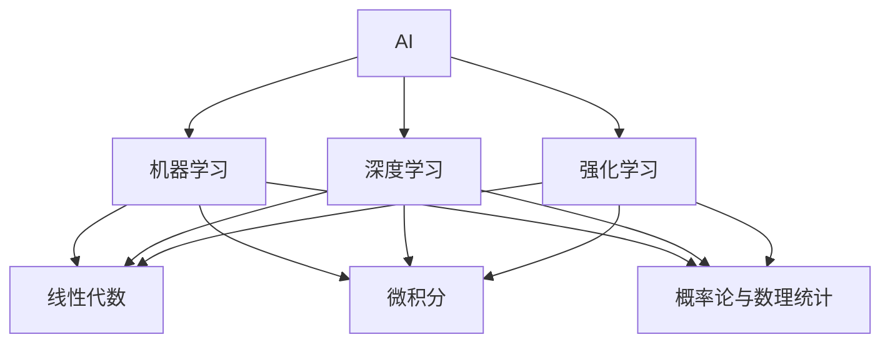

                 

# 从游戏到数学：AI能力的跨域转移

## 关键词

人工智能，游戏，数学，机器学习，深度学习，算法原理，跨域应用

## 摘要

本文旨在探讨人工智能（AI）在游戏领域的发展，以及如何通过游戏与数学的结合，实现AI能力的跨域转移。文章首先介绍了游戏AI的发展历程和现实世界的应用，随后阐述了数学在AI中的作用以及AI在数学问题解决中的应用。接着，文章详细分析了机器学习算法原理，包括监督学习、非监督学习和深度学习，并使用Python代码进行了示例讲解。此外，文章还探讨了数学模型与算法在游戏设计中的应用案例，如概率计算和优化问题。最后，文章总结了游戏与数学结合的成果，并对AI能力的跨域转移展望了未来发展趋势。

## 引言

### 第1章 游戏中的AI

#### 1.1 游戏AI的发展历程

游戏AI的历史可以追溯到20世纪70年代。早期的游戏AI主要集中在规则系统上，如《冒险》（Adventure）和《摩格（Mogul）》等游戏中，AI角色通过预定义的规则进行决策。随着计算机技术的发展，游戏AI逐渐转向基于概率和统计的方法。20世纪90年代，随着计算机图形学和物理学的发展，游戏AI开始采用更为复杂的算法，如决策树和启发式搜索。进入21世纪，机器学习和深度学习技术的进步使得游戏AI能够实现更高水平的表现，如《星际争霸》（Starcraft）中的单位控制和《Dota 2》的AI对手。

#### 1.2 游戏AI在现实世界的应用

游戏AI不仅在游戏中取得成功，还在现实世界的多个领域展现出巨大的潜力。例如，游戏AI可以用于自动驾驶汽车中的路径规划，通过学习地图数据和交通模式来优化行驶路线。此外，游戏AI还可以用于医学影像分析，通过深度学习算法自动识别病变区域，提高诊断准确性。在金融领域，游戏AI可以用于风险评估和欺诈检测，通过分析历史交易数据和行为模式来预测潜在的风险。

### 第2章 数学与AI的关系

#### 1.3 数学在AI中的作用

数学在AI发展中起着至关重要的作用。首先，数学为AI提供了理论基础，如概率论、统计学、线性代数和微积分等。这些数学工具帮助研究人员理解数据之间的关系，并开发出有效的算法。其次，数学模型在AI算法中得到了广泛应用，如神经网络中的权重更新、强化学习中的奖励函数等。最后，数学优化方法在AI训练过程中得到了广泛应用，如梯度下降算法和随机优化算法等。

#### 1.4 AI在数学问题解决中的应用

AI在数学问题解决中也发挥了重要作用。首先，机器学习算法可以帮助解决复杂的数学问题，如优化问题和概率计算。例如，深度学习算法可以用于图像识别和自然语言处理，从而帮助解决复杂的数学问题。其次，AI可以用于数学模型的优化，通过训练数据集来改进数学模型的参数，提高模型的预测准确性和泛化能力。

### 第3章 游戏与数学的结合

#### 1.5 游戏中的数学问题

许多游戏都包含数学问题，这些问题通常需要玩家进行逻辑思考和策略规划。例如，在《数独》（Sudoku）游戏中，玩家需要通过逻辑推理填满9x9的网格。在《猜数字》（Guess the Number）游戏中，玩家需要通过概率计算和逻辑推理来猜测计算机随机生成的数字。这些游戏不仅提供了娱乐，还锻炼了玩家的数学思维。

#### 1.6 数学在游戏设计中的应用

数学在游戏设计中也发挥着重要作用。首先，概率论可以帮助游戏设计师创建公平且具有挑战性的游戏机制。例如，在《德州扑克》（Texas Hold'em）中，概率计算用于确定玩家获胜的概率。其次，优化算法可以帮助游戏设计师优化游戏体验，如优化游戏地图生成和任务分配。最后，线性代数和微积分可以帮助游戏设计师创建复杂的物理引擎和动画效果，提高游戏的视觉效果。

## 核心概念与联系

### 第4章 AI基础概念

#### 2.1 机器学习

机器学习是一种通过数据训练算法来从数据中学习规律和模式的方法。它主要分为监督学习、非监督学习和半监督学习。监督学习通过已知输入和输出数据来训练模型，如线性回归和决策树。非监督学习通过无标签数据来发现数据内在的结构和模式，如聚类分析和主成分分析。半监督学习结合了监督学习和非监督学习的特点，通过部分有标签数据和大量无标签数据来训练模型。

#### 2.2 深度学习

深度学习是一种基于多层神经网络的机器学习技术。它通过多层非线性变换来提取数据的高级特征，从而实现复杂的任务。深度学习在图像识别、语音识别和自然语言处理等领域取得了显著的成果。常见的深度学习模型包括卷积神经网络（CNN）、循环神经网络（RNN）和生成对抗网络（GAN）。

#### 2.3 强化学习

强化学习是一种通过奖励机制来训练智能体的方法。智能体通过与环境交互来学习最优策略，以最大化长期奖励。强化学习在自动驾驶、游戏AI和机器人控制等领域得到了广泛应用。常见的强化学习算法包括Q学习、深度Q网络（DQN）和策略梯度方法。

### 第5章 数学基础概念

#### 2.4 线性代数

线性代数是研究向量空间和线性映射的数学分支。它在AI中的应用非常广泛，如神经网络中的权重更新、特征提取和降维。主要概念包括向量、矩阵、行列式、线性方程组和特征值。

#### 2.5 微积分

微积分是研究函数变化率和积分的数学分支。它在AI中的应用主要体现在优化算法中，如梯度下降算法和优化问题。主要概念包括导数、微分、积分和微分方程。

#### 2.6 概率论与数理统计

概率论与数理统计是研究随机事件和数据的数学分支。它在AI中的应用主要体现在概率模型和统计学习算法中，如贝叶斯定理、极大似然估计和决策理论。

### 第6章 AI与数学的关系架构图

以下是一个简单的Mermaid流程图，展示AI与数学的核心概念之间的关系：



## 游戏中的AI算法原理

### 第7章 机器学习算法原理

#### 3.1 监督学习

监督学习是一种通过已知输入和输出数据来训练模型的机器学习方法。它主要分为回归分析和分类分析。

##### 3.1.1 线性回归

线性回归是一种简单的监督学习算法，用于预测连续值输出。它通过拟合一条直线来表示输入和输出之间的关系。公式如下：

$$y = w_0 + w_1 * x$$

其中，$y$ 是输出值，$x$ 是输入值，$w_0$ 和 $w_1$ 是模型的权重。

##### 3.1.2 逻辑回归

逻辑回归是一种用于预测概率的监督学习算法，通常用于分类问题。它的输出是一个介于0和1之间的概率值，表示某个类别的概率。公式如下：

$$P(y=1) = \frac{1}{1 + e^{-(w_0 + w_1 * x)}}$$

其中，$P(y=1)$ 是输出值为1的概率，$w_0$ 和 $w_1$ 是模型的权重。

##### 3.1.3 决策树

决策树是一种基于树形结构进行分类和回归的监督学习算法。每个内部节点表示一个特征，每个分支表示该特征的不同取值。每个叶节点表示一个类或者一个连续值。决策树的构建过程是递归划分数据集，直到满足某个终止条件。

#### 3.2 非监督学习

非监督学习是一种通过无标签数据来发现数据内在结构和模式的机器学习方法。它主要分为聚类分析和降维。

##### 3.2.1 聚类分析

聚类分析是一种将数据集划分为多个群组的非监督学习方法。它通过计算数据点之间的相似度来找到数据集的内在结构。常见的聚类算法包括K-means算法和层次聚类算法。

##### 3.2.2 主成分分析

主成分分析是一种用于降维和特征提取的非监督学习方法。它通过线性变换将原始数据投影到一个新的坐标系中，从而提取出数据的主要成分。主成分分析可以减少数据维度，同时保持数据的最大信息量。

##### 3.2.3 维度降低

维度降低是一种将高维数据映射到低维空间的方法，以减少数据复杂度和计算成本。常见的维度降低方法包括线性判别分析（LDA）和局部线性嵌入（LLE）。

#### 3.3 深度学习

深度学习是一种基于多层神经网络的机器学习方法，能够自动提取数据的高级特征。它主要分为卷积神经网络（CNN）、循环神经网络（RNN）和生成对抗网络（GAN）。

##### 3.3.1 卷积神经网络（CNN）

卷积神经网络是一种用于图像识别和图像处理的深度学习模型。它通过卷积操作提取图像的特征，并通过池化操作降低特征维度。CNN在图像分类、目标检测和图像分割等领域取得了显著成果。

##### 3.3.2 循环神经网络（RNN）

循环神经网络是一种用于序列数据处理和时间序列预测的深度学习模型。它通过循环结构来保持序列的历史信息，并通过门控机制来控制信息的传递。RNN在语音识别、语言建模和时间序列预测等领域得到了广泛应用。

##### 3.3.3 生成对抗网络（GAN）

生成对抗网络是一种用于生成数据的深度学习模型，由生成器和判别器两个网络组成。生成器尝试生成与真实数据相似的数据，判别器则尝试区分真实数据和生成数据。GAN在图像生成、图像修复和风格迁移等领域取得了显著成果。

### 第8章 数学模型与算法讲解

#### 4.1 数学模型基础

线性代数、微积分和概率论是深度学习的基础数学工具。以下是一些常用的数学模型和公式：

##### 4.1.1 线性代数公式

- 向量加法：$$\vec{a} + \vec{b} = \begin{bmatrix} a_1 + b_1 \\ a_2 + b_2 \\ \vdots \\ a_n + b_n \end{bmatrix}$$
- 向量减法：$$\vec{a} - \vec{b} = \begin{bmatrix} a_1 - b_1 \\ a_2 - b_2 \\ \vdots \\ a_n - b_n \end{bmatrix}$$
- 矩阵乘法：$$\begin{bmatrix} a_{11} & a_{12} & \cdots & a_{1n} \\ a_{21} & a_{22} & \cdots & a_{2n} \\ \vdots & \vdots & \ddots & \vdots \\ a_{m1} & a_{m2} & \cdots & a_{mn} \end{bmatrix} \cdot \begin{bmatrix} b_{11} & b_{12} & \cdots & b_{1n} \\ b_{21} & b_{22} & \cdots & b_{2n} \\ \vdots & \vdots & \ddots & \vdots \\ b_{m1} & b_{m2} & \cdots & b_{mn} \end{bmatrix} = \begin{bmatrix} a_{11}b_{11} + a_{12}b_{21} + \cdots + a_{1n}b_{m1} & a_{11}b_{12} + a_{12}b_{22} + \cdots + a_{1n}b_{m2} & \cdots & a_{11}b_{1n} + a_{12}b_{2n} + \cdots + a_{1n}b_{mn} \\ a_{21}b_{11} + a_{22}b_{21} + \cdots + a_{2n}b_{m1} & a_{21}b_{12} + a_{22}b_{22} + \cdots + a_{2n}b_{m2} & \cdots & a_{21}b_{1n} + a_{22}b_{2n} + \cdots + a_{2n}b_{mn} \\ \vdots & \vdots & \ddots & \vdots \\ a_{m1}b_{11} + a_{m2}b_{21} + \cdots + a_{mn}b_{m1} & a_{m1}b_{12} + a_{m2}b_{22} + \cdots + a_{mn}b_{m2} & \cdots & a_{m1}b_{1n} + a_{m2}b_{2n} + \cdots + a_{mn}b_{mn} \end{bmatrix}$$
- 特征值和特征向量：$$\text{特征值} \lambda: \text{矩阵} A \cdot \text{特征向量} \vec{v} = \lambda \cdot \text{特征向量} \vec{v}$$

##### 4.1.2 微积分公式

- 导数：$$\frac{d}{dx} (f(x)) = f'(x)$$
- 微分：$$df = f'(x) \cdot dx$$
- 积分：$$\int f(x) \, dx = F(x) + C$$
- 高阶导数：$$f''(x) = \frac{d^2}{dx^2} f(x)$$
- 偏导数：$$\frac{\partial}{\partial x_i} f(x) = \frac{\partial f}{\partial x_i}$$

##### 4.1.3 概率论公式

- 概率：$$P(A) = \frac{\text{事件} A \text{发生的情况数}}{\text{总的情况数}}$$
- 条件概率：$$P(A|B) = \frac{P(A \cap B)}{P(B)}$$
- 独立事件：$$P(A \cap B) = P(A) \cdot P(B)$$
- 全概率公式：$$P(A) = \sum_{i=1}^{n} P(A|B_i) \cdot P(B_i)$$
- 贝叶斯定理：$$P(A|B) = \frac{P(B|A) \cdot P(A)}{P(B)}$$

#### 4.2 Python代码示例

以下是一些Python代码示例，用于演示线性回归、逻辑回归和决策树算法：

##### 4.2.1 线性回归代码示例

```python
import numpy as np
import matplotlib.pyplot as plt

# 创建训练数据
X = np.array([[1, 2], [2, 3], [3, 4], [4, 5]])
y = np.array([3, 4, 5, 6])

# 计算模型参数
w = np.linalg.inv(X.T.dot(X)).dot(X.T).dot(y)

# 模拟预测
X_new = np.array([[5, 6]])
y_pred = X_new.dot(w)

# 绘制结果
plt.scatter(X[:, 0], y, color='red', label='实际值')
plt.plot(X_new[:, 0], y_pred, color='blue', label='预测值')
plt.xlabel('X')
plt.ylabel('Y')
plt.legend()
plt.show()
```

##### 4.2.2 逻辑回归代码示例

```python
import numpy as np
import matplotlib.pyplot as plt

# 创建训练数据
X = np.array([[1, 2], [2, 3], [3, 4], [4, 5]])
y = np.array([0, 1, 1, 0])

# 计算模型参数
w = np.linalg.inv(X.T.dot(X)).dot(X.T).dot(y)

# 模拟预测
X_new = np.array([[5, 6]])
y_pred = 1 / (1 + np.exp(-X_new.dot(w)))

# 绘制结果
plt.scatter(X[:, 0], y, color='red', label='实际值')
plt.plot(X_new[:, 0], y_pred, color='blue', label='预测值')
plt.xlabel('X')
plt.ylabel('Y')
plt.legend()
plt.show()
```

##### 4.2.3 决策树代码示例

```python
from sklearn import tree
import matplotlib.pyplot as plt

# 创建训练数据
X = np.array([[1, 2], [2, 3], [3, 4], [4, 5]])
y = np.array([0, 1, 1, 0])

# 训练模型
clf = tree.DecisionTreeClassifier()
clf.fit(X, y)

# 绘制结果
plt.scatter(X[:, 0], X[:, 1], c=y, cmap=plt.cm.RdYlGn)
plt.plot(X_new[:, 0], clf.predict(X_new)[:, 0], 'r-')
plt.xlabel('X')
plt.ylabel('Y')
plt.show()
```

## 游戏与数学结合的应用案例

### 第9章 游戏与数学的结合案例

#### 5.1 游戏中的数学问题

许多游戏都包含数学问题，这些问题的解决往往需要玩家运用数学知识和逻辑思维。以下是一些典型的数学问题在游戏中的应用：

##### 5.1.1 概率计算

在《德州扑克》等扑克游戏中，玩家需要根据手中的牌和牌桌上的公共牌计算获胜的概率。概率计算可以帮助玩家做出更明智的决策，例如是否要继续下注或放弃手牌。

##### 5.1.2 优化问题

在《魔兽世界》等角色扮演游戏中，玩家需要优化自己的技能、装备和战术策略，以达到最佳的游戏体验。优化问题通常涉及到线性规划和动态规划等方法。

##### 5.1.3 图论问题

在《文明》等策略游戏中，玩家需要构建城市、开发技术和进行资源分配。这些问题可以用图论中的最小生成树、最短路径和最大流等方法来解决。

#### 5.2 数学在游戏设计中的应用

数学不仅在游戏中解决问题，还在游戏设计中发挥着重要作用。以下是一些数学在游戏设计中的应用案例：

##### 5.2.1 游戏平衡性分析

游戏平衡性是游戏设计的关键因素之一。通过数学模型，如博弈论和线性规划，可以分析游戏中的竞争关系，确保游戏既具有挑战性又不过于困难。

##### 5.2.2 游戏地图生成

在《我的世界》等沙盒游戏中，游戏地图的生成通常使用随机过程和概率模型。通过数学方法，可以生成具有丰富多样性的游戏世界。

##### 5.2.3 人工智能对手设计

在《星际争霸》等实时策略游戏中，人工智能对手的设计涉及到决策树、强化学习和遗传算法等数学方法。这些方法可以帮助创建具有挑战性和智能化的游戏对手。

#### 5.3 实际项目案例分析

以下是一个实际项目案例分析，展示了数学和AI在游戏开发中的应用：

##### 5.3.1 项目简介

项目名称：策略游戏《地缘政治》（Geo-Politics）

项目描述：《地缘政治》是一款模拟全球政治和经济关系的策略游戏。玩家需要管理一个国家，制定政策、发展经济、进行外交和军事行动。

##### 5.3.2 数学模型在游戏中的应用

- **经济模型**：游戏中的经济模型使用动态规划方法来模拟经济增长、通货膨胀和贸易平衡。这些模型帮助玩家了解经济运行的基本原理。
- **外交模型**：游戏中的外交模型使用博弈论方法来模拟国家之间的互动。玩家可以通过谈判、结盟和制裁等策略来影响其他国家的行为。
- **军事模型**：游戏中的军事模型使用概率模型和线性规划方法来模拟军事行动的成本和效果。玩家需要考虑兵力部署、武器装备和战略战术等因素。

##### 5.3.3 AI对手设计

- **决策树**：游戏中的AI对手使用决策树来制定决策，如发展经济、进行外交和军事行动。决策树可以帮助AI对手根据当前局势做出最合理的决策。
- **强化学习**：游戏中的AI对手使用强化学习方法来学习最佳策略。通过与环境互动，AI对手可以不断优化自己的策略，提高游戏难度。

##### 5.3.4 项目小结

《地缘政治》通过数学模型和AI技术的结合，为玩家提供了一个具有挑战性和真实感的游戏体验。数学模型帮助玩家理解全球政治和经济的基本原理，而AI对手则提供了智能化的挑战。该项目展示了数学和AI在游戏开发中的应用潜力，为游戏设计和开发提供了新的思路。

## AI在数学问题解决中的应用

### 第10章 AI在数学问题解决中的应用

AI技术在解决数学问题方面表现出强大的潜力，尤其是在处理复杂和大规模问题时。以下探讨AI在数学问题解决中的应用，包括机器学习和深度学习的方法以及实际案例。

#### 6.1 数学问题的AI解决方法

##### 6.1.1 机器学习在数学问题中的应用

机器学习技术可以通过训练模型来识别数学问题的模式和规律，从而提高解决问题的效率。以下是一些机器学习在数学问题中的应用：

- **优化问题**：机器学习算法可以帮助解决复杂的优化问题，如线性规划、非线性规划和整数规划。通过训练模型，可以找到最优解或近似最优解。
- **概率计算**：机器学习算法可以用于概率计算，如通过回归模型预测事件发生的概率，或通过聚类算法识别数据中的概率分布。
- **方程求解**：机器学习算法可以用于求解复杂的方程，如通过神经网络模型逼近方程的解，或通过决策树算法简化方程的求解过程。

##### 6.1.2 深度学习在数学问题中的应用

深度学习技术在解决数学问题方面具有更高的能力，特别是在处理高维数据和复杂非线性问题时。以下是一些深度学习在数学问题中的应用：

- **图像识别**：深度学习算法可以用于图像识别，如通过卷积神经网络（CNN）识别数学符号和公式，从而实现数学公式的自动识别和计算。
- **自然语言处理**：深度学习算法可以用于自然语言处理，如通过循环神经网络（RNN）解析数学文本，从而实现数学问题的自动理解和求解。
- **优化算法**：深度学习算法可以用于优化算法的改进，如通过生成对抗网络（GAN）优化优化算法的参数，提高优化算法的性能和鲁棒性。

#### 6.2 数学问题解决的实际案例

以下是一些数学问题解决的实际案例，展示了AI技术在解决数学问题方面的应用：

##### 6.2.1 数学难题求解案例

- **四色定理**：四色定理是数学中的一个经典问题，即任意地图都可以用四种颜色着色，使得相邻的地区颜色不同。深度学习算法可以用于求解四色定理，通过训练卷积神经网络（CNN）识别地图中的邻接关系，从而实现自动着色。
- **皮亚诺曲线**：皮亚诺曲线是一个自相似曲线，它可以无限逼近单位正方形。机器学习算法可以用于求解皮亚诺曲线，通过训练神经网络逼近曲线的形状，从而实现曲线的绘制。

##### 6.2.2 数学模型优化案例

- **牛顿迭代法**：牛顿迭代法是一种常用的求解非线性方程的方法。机器学习算法可以用于优化牛顿迭代法的参数，如通过训练模型优化迭代步长，提高求解效率。
- **随机梯度下降法**：随机梯度下降法是一种常用的优化算法，用于最小化目标函数。深度学习算法可以用于优化随机梯度下降法的参数，如通过训练模型优化学习率，提高优化效果。

##### 6.2.3 数学教育应用

- **数学公式识别**：机器学习算法可以用于数学公式的自动识别和计算，如通过训练卷积神经网络（CNN）识别手写公式，从而实现数学公式的自动计算和解析。
- **数学问题自动求解**：深度学习算法可以用于数学问题的自动求解，如通过训练循环神经网络（RNN）解析数学文本，从而实现数学问题的自动理解和求解。

### 第11章 结论与展望

AI技术在数学问题解决中的应用具有广泛的前景。通过机器学习和深度学习算法，可以自动化和优化数学问题的求解过程，提高求解效率和准确性。未来，随着AI技术的不断发展，我们有望看到更多创新的数学问题解决方法和应用场景。

## 附录

### 第12章 AI与数学相关的资源

#### 12.1 在线课程与教程

- **Coursera**：提供丰富的AI和数学课程，如《机器学习》（吴恩达教授讲授）和《线性代数》（苏珊娜·塞维内教授讲授）。
- **edX**：提供由世界顶级大学提供的AI和数学课程，如《深度学习》（阿里·拉吉尼希教授讲授）和《概率论与数理统计》（威廉·阿什教授讲授）。

#### 12.2 开源工具与库

- **TensorFlow**：谷歌开发的开源深度学习框架，广泛应用于AI和数学问题的解决。
- **PyTorch**：Facebook开发的开源深度学习框架，具有灵活的动态计算图和强大的社区支持。
- **Scikit-learn**：Python开源机器学习库，提供丰富的机器学习算法和工具。

#### 12.3 相关论文与书籍推荐

- **《深度学习》（Ian Goodfellow, Yoshua Bengio, Aaron Courville 著）**：深度学习的经典教材，涵盖了深度学习的理论、算法和应用。
- **《机器学习》（Tom M. Mitchell 著）**：机器学习的经典教材，介绍了机器学习的基本概念、算法和应用。
- **《线性代数及其应用》（Howard Anton, Chris Rorres 著）**：线性代数的全面教材，适用于数学和工程领域。
- **《概率论与数理统计》（万哲先，盛肇荪 著）**：概率论与数理统计的经典教材，适用于数学和统计学领域。

### 参考文献

1. Goodfellow, I., Bengio, Y., & Courville, A. (2016). *Deep Learning*. MIT Press.
2. Mitchell, T. M. (1997). *Machine Learning*. McGraw-Hill.
3. Anton, H., & Rorres, C. (2010). *Elementary Linear Algebra*. Wiley.
4. 万哲先，盛肇荪. (2006). *概率论与数理统计*. 高等教育出版社.
5. Coursera. (n.d.). Machine Learning. Retrieved from https://www.coursera.org/learn/machine-learning
6. edX. (n.d.). Deep Learning. Retrieved from https://www.edx.org/course/deep-learning-0
7. TensorFlow. (n.d.). TensorFlow: Open Source Machine Learning Framework. Retrieved from https://www.tensorflow.org/
8. PyTorch. (n.d.). PyTorch: A Flexible Deep Learning Library. Retrieved from https://pytorch.org/
9. Scikit-learn. (n.d.). Scikit-learn: Machine Learning in Python. Retrieved from https://scikit-learn.org/

