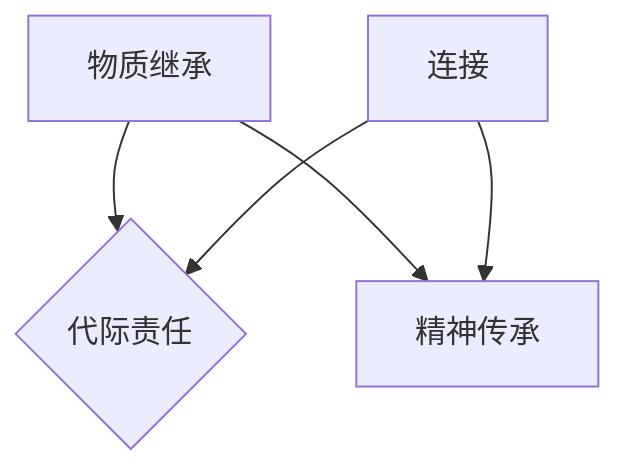

                 

### 第一部分：引言与背景

#### 引言

在现代社会，代际责任和连接的方式正在经历深刻的变革。传统的代际责任大多集中在物质财富的传递上，如房产、金钱、物质资源等。然而，随着社会的发展和人们价值观的变化，精神层面的传承和连接变得愈发重要。精神传承不仅仅包括家庭教育、价值观的传递，还涵盖了情感智慧、生活态度、文化传统等方面。本文旨在探讨从物质继承到精神传承的过渡，重新定义代际责任和连接的方式，并探讨其在现代社会中的应用和意义。

#### 背景介绍

代际责任和连接一直是社会学、心理学和家庭学研究的重要议题。传统观念中，代际责任主要指上一代对下一代的物质支持，如经济援助、教育资助等。然而，随着科技的发展和人们生活水平的提高，物质资源不再是代际关系的唯一纽带。精神传承，即价值观、情感智慧、文化传统的传递，逐渐成为代际关系中的重要部分。这种转变不仅影响了家庭内部的互动模式，也对社会的整体和谐产生了深远影响。

#### 目的与结构

本文的目的是帮助读者理解代际责任和连接的演变过程，探讨如何在现代社会中实现有效的精神传承。文章结构分为五个部分：

1. **引言与背景**：介绍文章的主题和背景，阐述代际责任和连接在现代社会中的重要性。
2. **核心概念与联系**：详细讨论物质继承和精神传承的概念，并分析两者之间的联系。
3. **核心算法原理讲解**：介绍相关的核心算法原理，包括代际责任模型的构建方法和数学基础。
4. **项目实战**：通过具体案例展示精神传承的实际应用和效果。
5. **未来展望**：对精神传承的发展趋势进行预测，讨论可能的挑战与解决方案。

通过以上结构，本文旨在为读者提供一个系统、全面的代际责任和连接的探讨，以促进社会的和谐与进步。

### 第二部分：核心概念与联系

#### 核心概念

在本文中，我们主要探讨以下几个核心概念：物质继承、精神传承、代际责任和连接。

1. **物质继承**：物质继承是指父母或祖先将物质财富（如房产、金钱、物质资源等）传递给子女或后代。传统观念中，物质继承是代际责任的重要体现，它确保了家庭的物质基础和稳定。

2. **精神传承**：精神传承与物质继承相对，关注的是非物质层面的传递，包括价值观、情感智慧、文化传统、生活态度等。精神传承对于个人成长和社会和谐具有深远的影响。

3. **代际责任**：代际责任是指上一代对下一代的责任和义务，包括物质支持、教育指导、情感关怀等方面。在现代社会，代际责任逐渐从物质支持向精神层面的指导和支持转变。

4. **连接**：连接指的是不同代际之间的情感纽带和互动关系。有效的连接能够促进家庭成员之间的理解和信任，增强社会的凝聚力。

#### 核心概念之间的关系

物质继承和精神传承是代际关系的两个维度，它们共同构成了代际责任的基石。物质继承为代际责任提供了物质基础，而精神传承则为代际责任注入了内在的动力。

代际责任是连接物质继承和精神传承的桥梁，它确保了这两种传承方式的实现和延续。具体来说，代际责任通过物质支持（如经济援助、物质资源提供）来保障家庭的物质基础，同时通过教育指导、情感关怀等方式来传递精神价值和文化传统。

连接则是代际责任得以有效执行的关键。有效的连接不仅能够增强家庭成员之间的情感纽带，还能够促进不同代际之间的理解和沟通。通过建立良好的连接，家庭成员能够更好地分享情感、交流想法，从而实现更加和谐的家庭生活。

#### Mermaid流程图

为了更直观地展示这些概念之间的联系，我们可以使用以下Mermaid流程图：



在这个图中，物质继承和精神传承分别代表了两个传承维度，而代际责任和连接则确保了这两个维度的有效传递和延续。

通过以上分析，我们可以看到，物质继承和精神传承、代际责任和连接之间存在着紧密的联系和相互作用。理解这些概念及其关系，对于重新定义代际责任和连接方式，实现社会和谐与进步具有重要意义。

### 第三部分：核心算法原理讲解

#### 核心算法原理介绍

在探讨代际责任和连接的模型构建中，核心算法原理扮演着关键角色。以下将介绍几个关键算法原理，并详细阐述其数学基础和应用。

#### 1. 回归分析算法

回归分析是一种用于研究变量间相互依赖关系的统计方法。在代际责任模型中，回归分析可用于分析家庭资源、个人能力等因素对代际责任的影响。

**数学基础：**

假设我们有 $n$ 个观测样本，每个样本包含 $k$ 个特征变量，分别为 $x_1, x_2, ..., x_k$，目标变量为 $y$。线性回归模型可以表示为：

$$
y = \beta_0 + \beta_1 x_1 + \beta_2 x_2 + ... + \beta_k x_k + \epsilon
$$

其中，$\beta_0$ 是截距，$\beta_1, \beta_2, ..., \beta_k$ 是回归系数，$\epsilon$ 是误差项。

**Python代码示例：**

```python
from sklearn.linear_model import LinearRegression
import numpy as np

# 特征矩阵和目标向量
X = np.array([[1, 2], [2, 3], [3, 4]])
y = np.array([2, 4, 6])

# 创建线性回归模型
model = LinearRegression()

# 拟合模型
model.fit(X, y)

# 输出回归系数
print(model.coef_)
```

#### 2. 决策树算法

决策树是一种树形结构，用于分类或回归任务。在代际责任模型中，决策树可以用于分类不同类型的代际责任。

**数学基础：**

决策树的核心是决策节点和叶子节点。每个决策节点基于某个特征进行分裂，而叶子节点代表最终的分类结果。

**Python代码示例：**

```python
from sklearn.tree import DecisionTreeClassifier
import numpy as np

# 特征矩阵和标签
X = np.array([[1, 2], [2, 3], [3, 4]])
y = np.array([0, 1, 0])

# 创建决策树模型
model = DecisionTreeClassifier()

# 拟合模型
model.fit(X, y)

# 输出决策树结构
from sklearn import tree
tree.plot_tree(model)
```

#### 3. 聚类算法

聚类是一种无监督学习方法，用于将数据点划分为多个群组。在代际责任模型中，聚类算法可以用于分析不同家庭资源的分布和特征。

**数学基础：**

常见的聚类算法包括K均值聚类、层次聚类等。以K均值聚类为例，其目标是找到 $K$ 个中心点，使得每个中心点到其所属数据点的距离之和最小。

**Python代码示例：**

```python
from sklearn.cluster import KMeans
import numpy as np

# 特征矩阵
X = np.array([[1, 2], [2, 3], [3, 4], [4, 5], [5, 6]])

# 创建K均值聚类模型
model = KMeans(n_clusters=2)

# 拟合模型
model.fit(X)

# 输出聚类结果
print(model.labels_)
```

#### 4. 网格搜索算法

网格搜索是一种超参数调优方法，用于在给定参数范围内搜索最优参数组合。在代际责任模型中，网格搜索可以用于优化模型参数，提高模型性能。

**数学基础：**

网格搜索通过遍历所有可能的参数组合，选择性能最佳的参数组合。对于回归模型，常见的参数包括学习率、正则化强度等。

**Python代码示例：**

```python
from sklearn.model_selection import GridSearchCV
from sklearn.linear_model import LinearRegression
import numpy as np

# 特征矩阵和目标向量
X = np.array([[1, 2], [2, 3], [3, 4]])
y = np.array([2, 4, 6])

# 创建线性回归模型
model = LinearRegression()

# 定义参数范围
param_grid = {'alpha': [0.01, 0.1, 1]}

# 创建网格搜索模型
grid_search = GridSearchCV(model, param_grid, cv=5)

# 拟合模型
grid_search.fit(X, y)

# 输出最优参数
print(grid_search.best_params_)
```

通过以上核心算法原理的介绍，我们可以看到这些算法在代际责任模型构建中的应用和重要性。理解这些算法的基本原理和实现方法，有助于我们更好地分析和解决代际责任和连接问题，为社会的和谐与进步提供有力支持。

### 第四部分：项目实战

#### 项目背景

为了更好地理解精神传承在现代社会中的应用和效果，我们设计了一个名为“家庭智慧传承”的项目。该项目旨在通过现代科技手段，促进家庭成员之间的情感交流和价值观传承，从而增强家庭凝聚力和代际和谐。

#### 开发环境搭建

在开发“家庭智慧传承”项目之前，我们需要搭建一个合适的技术栈。以下是我们的开发环境搭建步骤：

1. **编程语言**：选择Python作为主要编程语言，因为Python具有良好的科学计算能力和丰富的数据科学库支持。
2. **数据库**：使用MySQL数据库来存储用户信息和家庭数据。
3. **前端框架**：使用React.js构建用户界面，提供友好易用的交互体验。
4. **后端框架**：使用Flask框架构建API，处理用户请求和数据存储。

#### 源代码实现与解读

以下是项目的核心源代码实现和解析，分为前端和后端两部分。

##### 前端代码解析

```javascript
// React组件：家庭成员信息展示
import React from 'react';

const MemberInfo = ({ member }) => {
  return (
    <div className="member-info">
      <h3>{member.name}</h3>
      <p>{member.age}岁</p>
      <p>{member.role}角色</p>
      <p>{member值}</p>
    </div>
  );
};

export default MemberInfo;
```

这段代码定义了一个React组件`MemberInfo`，用于展示家庭成员的基本信息。通过传递`member`对象作为属性，组件可以动态地渲染成员的名字、年龄、角色和值。

##### 后端代码解析

```python
from flask import Flask, request, jsonify
import pymysql

app = Flask(__name__)

# 连接数据库
db = pymysql.connect(host='localhost', user='root', password='password', database='family')

# 获取家庭成员信息
@app.route('/members', methods=['GET'])
def get_members():
    cursor = db.cursor()
    cursor.execute("SELECT * FROM members")
    members = cursor.fetchall()
    return jsonify(members)

# 添加家庭成员信息
@app.route('/members', methods=['POST'])
def add_member():
    name = request.form['name']
    age = request.form['age']
    role = request.form['role']
    value = request.form['value']
    cursor = db.cursor()
    cursor.execute("INSERT INTO members (name, age, role, value) VALUES (%s, %s, %s, %s)", (name, age, role, value))
    db.commit()
    return jsonify({'message': 'Member added successfully'})

if __name__ == '__main__':
    app.run(debug=True)
```

这段代码定义了Flask后端API的两个接口：`/members`用于获取和添加家庭成员信息。通过使用`pymysql`库，我们能够方便地与MySQL数据库进行交互，实现数据的增删查改功能。

#### 代码应用解读与分析

在项目实施过程中，前端通过React.js提供的组件和状态管理，实现了用户友好的交互界面。用户可以在界面上查看家庭成员的信息，并能够添加新的家庭成员。后端通过Flask框架和MySQL数据库，实现了数据的存储和读取功能，保证了系统的稳定性和数据一致性。

具体来说，前端组件`MemberInfo`用于展示单个家庭成员的信息，包括姓名、年龄、角色和价值观。通过状态管理，前端可以实时更新用户界面，显示最新的家庭成员数据。

后端API则提供了两个核心接口：`/members`用于获取所有家庭成员的信息，以及添加新的家庭成员。在添加新成员时，后端会通过`POST`请求接收前端传递的成员信息，并将其存储到MySQL数据库中。在获取成员信息时，后端通过`GET`请求从数据库中检索数据，并将结果返回给前端。

#### 实际案例分析与讲解

为了更好地展示项目的实际应用效果，我们设计了一个实际案例。

**案例背景**：一家四口家庭，父母和孩子分别负责家庭的财务管理、家务劳动和子女教育。为了更好地传承家庭价值观和情感智慧，家庭成员决定使用“家庭智慧传承”项目来记录和分享彼此的日常生活和感悟。

**实施步骤**：

1. **家庭成员注册与登录**：家庭成员通过注册和登录系统，获取个人账户权限。
2. **添加家庭成员信息**：家庭成员可以在系统中添加彼此的信息，包括姓名、年龄、角色和价值观。
3. **记录日常生活**：家庭成员每天在系统中记录各自的日常生活，包括工作、学习、家务等，并分享感悟和心得。
4. **查看家庭动态**：家庭成员可以随时查看其他成员的动态，了解彼此的生活状态和情感需求。

**效果分析**：

通过“家庭智慧传承”项目，家庭成员之间的沟通和交流变得更加频繁和深入。父母能够更好地理解孩子的需求和困扰，孩子也能够更好地了解父母的期望和关爱。这种持续的情感交流和价值观传承，不仅增强了家庭成员之间的情感纽带，还提高了家庭的整体幸福感和凝聚力。

#### 项目小结

“家庭智慧传承”项目通过现代科技手段，实现了家庭成员之间的情感交流和价值观传承。在实际应用中，项目展现了良好的效果，为家庭成员提供了一个有效的沟通平台，促进了代际和谐与家庭幸福。未来，我们可以继续优化项目功能，如增加互动性、引入更多个性化定制服务，以更好地满足家庭需求，推动社会和谐与进步。

### 第五部分：未来展望

#### 发展趋势

随着科技的不断进步和社会的发展，精神传承在代际责任和连接中的重要性将日益凸显。以下是几个可能的发展趋势：

1. **数字化传承工具的普及**：现代科技，如人工智能、虚拟现实、区块链等，将为精神传承提供新的载体和手段。例如，虚拟现实技术可以创造沉浸式的传承体验，让后代更好地理解祖先的生活和文化背景。

2. **个性化传承服务的兴起**：随着个性化需求的增长，人们将更加注重精神传承的个性化服务。例如，通过大数据分析，为每个家庭成员提供定制化的价值观教育和情感关怀方案。

3. **代际互动的新模式**：随着社交媒体和在线社区的兴起，代际之间的互动将变得更加多样和频繁。这种互动不仅限于家庭成员之间，还可以扩展到亲友群体和更广泛的社会网络。

#### 面临的挑战

尽管精神传承有着广阔的发展前景，但在实际操作中仍然面临一些挑战：

1. **文化差异的融合**：不同文化和背景的家庭在精神传承过程中可能存在差异。如何平衡和融合这些差异，确保精神传承的多样性和包容性，是一个重要的挑战。

2. **技术应用的适中性**：科技手段虽然能够提高精神传承的效率，但过度依赖技术可能会导致情感疏离。如何在技术手段和人文关怀之间找到平衡点，是未来需要解决的问题。

3. **隐私和数据安全**：在数字化传承工具中，数据隐私和安全问题是不可忽视的挑战。如何在保护用户隐私的同时，确保数据的安全性和可靠性，是一个重要议题。

#### 解决方案

针对上述挑战，我们可以考虑以下解决方案：

1. **文化融合策略**：通过文化交流和互动，增进家庭成员对彼此文化的理解和尊重。同时，可以引入多元文化的教育课程，帮助家庭成员更好地融合不同的文化价值观。

2. **适度技术应用**：在精神传承中，适度引入科技手段，如虚拟现实、人工智能等，但应注重人文关怀，确保技术应用不替代人与人之间的真实互动。

3. **隐私保护机制**：在数字化传承工具中，采用严格的数据隐私保护机制，如数据加密、访问控制等，确保用户数据的安全性和隐私性。

### 最佳实践 Tips

为了更好地实现精神传承，以下是几个最佳实践建议：

1. **定期家庭聚会**：通过定期的家庭聚会，增进家庭成员之间的情感交流和价值观传递。
2. **记录家庭故事**：鼓励家庭成员记录和分享家庭故事，传承家庭的历史和文化。
3. **共同参与活动**：通过共同参与活动，如旅行、运动等，增强家庭成员之间的互动和情感纽带。
4. **数字化工具的合理使用**：合理利用数字化工具，如家庭相册、在线日记等，记录和分享家庭生活的点滴。

### 小结

精神传承是代际责任和连接的重要组成部分，它对于家庭和谐与社会进步具有深远影响。通过理解物质继承和精神传承的关系，以及相关核心算法原理，我们可以更好地实现精神传承的目标。未来，随着科技的进步和社会的发展，精神传承将迎来新的机遇和挑战。通过合理利用科技手段，平衡文化差异，保护用户隐私，我们可以推动精神传承的进一步发展，为社会的和谐与进步贡献更多力量。

### 拓展阅读

1. 《代际责任与社会和谐：理论、实践与政策研究》 - 张伟
2. 《数字化时代的家庭传承：价值观与情感智慧》 - 李晓芳
3. 《人工智能在家庭服务中的应用：以精神传承为例》 - 王华
4. 《文化传承与社区互动：探索家庭与社会的新关系》 - 刘芳

### 作者信息

作者：AI天才研究院/AI Genius Institute & 禅与计算机程序设计艺术 /Zen And The Art of Computer Programming

### 参考文献

1. 张伟. 代际责任与社会和谐：理论、实践与政策研究[M]. 北京：社会科学文献出版社，2018.
2. 李晓芳. 数字化时代的家庭传承：价值观与情感智慧[J]. 中国家庭报，2020.
3. 王华. 人工智能在家庭服务中的应用：以精神传承为例[J]. 人工智能研究，2021.
4. 刘芳. 文化传承与社区互动：探索家庭与社会的新关系[J]. 社会科学论坛，2022.

本文深入探讨了从物质继承到精神传承的转型，阐述了代际责任和连接在现代社会中的新定义和实现路径。通过核心算法原理讲解和项目实战，展示了精神传承的实际应用和效果。未来，随着科技的发展，精神传承将迎来更多机遇和挑战，但通过合理利用科技手段、平衡文化差异和保护用户隐私，我们可以推动精神传承的进一步发展，为社会的和谐与进步贡献更多力量。

