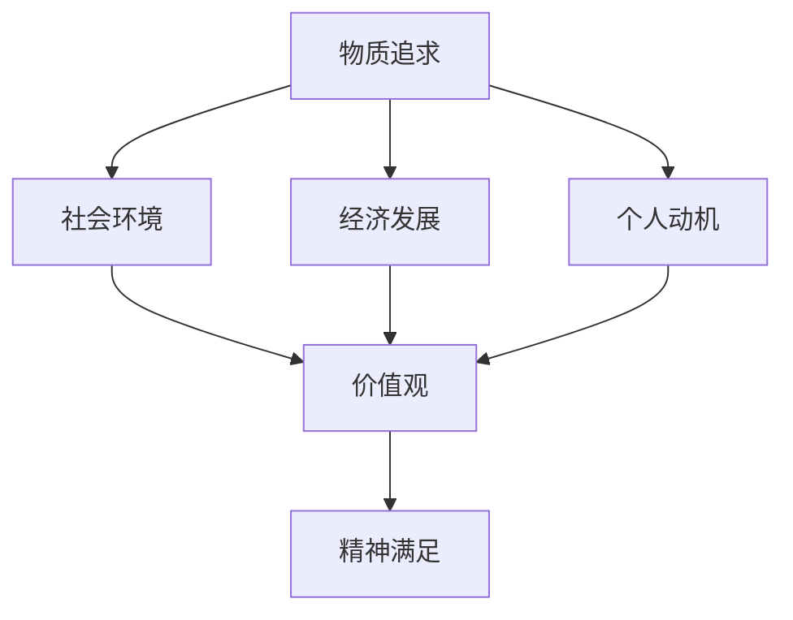

                 

### 第一部分：物质追求的时代

#### 1. 物质追求的起源与发展

物质追求作为一种社会现象，其起源可以追溯到人类文明的初期。在早期的人类社会中，生存的基本需求如食物、住所和安全是最重要的。随着农业革命的出现，人类社会开始积累财富，并逐渐形成了一种对物质的追求。这种追求不仅体现在个人层面，还体现在社会层面，如城市建设和大型公共设施的建造。

**定义：** 物质追求可以定义为个体或集体为了满足物质需求而进行的努力。这包括了对财富、物质资源和物质产品的追求。

**历史演变：** 在农业社会，物质追求主要体现在对土地、农产品的追求。随着工业革命的到来，物质追求的范围迅速扩大，包括了机械、能源和工业产品。20世纪以来，随着全球化和科技的发展，物质追求变得更加复杂和多样化，涵盖了从消费品到高科技产品的广泛领域。

**影响：** 物质追求对现代生活产生了深远的影响。它推动了经济的增长，促进了技术的创新，提升了生活品质。然而，它也带来了诸多问题，如资源消耗、环境污染和社会不平等。

#### 2. 物质追求的驱动力

物质追求的驱动力可以从多个方面来探讨，包括社会环境、经济发展和个人动机。

**社会环境与物质追求：** 社会环境对物质追求有着重要的推动作用。社会价值观的演变，尤其是对成功和财富的崇拜，促使人们不断追求物质财富。媒体和广告的推广也加剧了这种追求。

**经济发展与物质追求：** 经济发展是物质追求的重要驱动力。随着经济水平的提高，人们对物质产品的需求和消费能力也随之增加。市场经济的竞争机制也鼓励人们通过物质追求来提升自己的社会地位。

**个人动机与物质追求：** 个人动机是物质追求的根本原因。个人的安全感、自尊心和社会地位追求都是物质追求的内在动力。此外，个体的欲望和消费观念也在一定程度上影响了物质追求的行为。

#### 3. 物质追求的弊端

尽管物质追求在一定程度上推动了社会进步，但它也带来了一系列问题。

**负面效应：** 物质追求可能导致资源的过度消耗和环境破坏。它还可能导致社会不平等和心理健康问题，如焦虑和抑郁。

**个人问题：** 物质追求往往使个人陷入无尽的欲望循环，导致心理压力和满足感的缺失。长期的物质追求可能导致个体的价值观扭曲，忽视人际关系和精神层面的需求。

**社会影响：** 物质追求加剧了社会竞争，可能导致社会分裂和紧张。它还可能影响社会的可持续发展，如资源的不可持续利用和环境的恶化。

#### 4. 现代人的价值观转变

随着社会的发展和人们对生活质量的要求提高，现代人的价值观逐渐发生了转变。

**精神满足的重要性：** 现代人在追求物质满足的同时，开始更加重视精神层面的满足。精神满足不仅包括心理健康，还涉及自我实现、人际关系和心灵成长。

**精神追求的多元化：** 现代人的精神追求变得更加多元化。除了传统的宗教和精神追求外，人们对教育、艺术、文化和哲学等领域也表现出了浓厚的兴趣。

**精神满足与物质追求的关系：** 精神满足和物质追求并不是对立的关系，而是相辅相成的。合理的物质追求可以为精神满足提供基础，而精神满足则可以为物质追求带来更高的满足感和幸福感。

### 结论

物质追求作为一种历史现象，在推动社会进步的同时，也带来了一系列问题。现代人开始意识到物质追求并非生活质量的唯一衡量标准，精神满足的重要性逐渐凸显。通过理性对待物质追求，平衡物质和精神追求，现代人可以在追求物质满足的同时，获得更高的精神满足，实现全面的人生幸福。这一转变不仅对个人具有重要意义，也对整个社会的发展和进步产生了深远的影响。

---

**核心概念与联系架构：**

在探讨物质追求的时代，我们需要理解几个核心概念：物质追求、社会环境、经济发展、个人动机、精神满足、价值观转变。这些概念之间存在着复杂的联系。

1. **物质追求** 是个体或集体对物质财富和资源的追求。
2. **社会环境** 影响着物质追求的行为模式，包括社会价值观、媒体宣传等。
3. **经济发展** 提供了物质追求的物质基础，同时也加剧了竞争和压力。
4. **个人动机** 包括安全感、自尊心和社会地位追求，是物质追求的内在驱动力。
5. **精神满足** 是现代社会人开始重视的另一个重要方面，与物质追求相辅相成。
6. **价值观转变** 指的是现代人从物质追求向精神满足的转型。

为了更清晰地展示这些概念之间的关系，我们可以使用 Mermaid 流程图来表示：



在这个流程图中，物质追求与社会环境、经济发展和个人动机之间存在着相互影响的关系。社会环境和经济发展影响了人们的价值观，而个人动机又驱动了物质追求的行为。最终，价值观的转变引导人们追求精神满足。

**核心算法原理讲解：**

为了深入理解物质追求的驱动力和弊端，我们可以使用数学模型来进行分析。

假设物质追求的行为可以用以下公式表示：

$$
P = f(E, G, M)
$$

其中，$P$ 表示物质追求的强度，$E$ 表示社会环境因素，$G$ 表示经济发展水平，$M$ 表示个人动机。

社会环境因素可以表示为：

$$
E = f(V, M, A)
$$

其中，$V$ 表示社会价值观，$M$ 表示媒体宣传，$A$ 表示社会氛围。

经济发展水平可以表示为：

$$
G = f(C, T)
$$

其中，$C$ 表示财富积累，$T$ 表示技术创新。

个人动机可以表示为：

$$
M = f(S, D, R)
$$

其中，$S$ 表示安全感，$D$ 表示自尊心，$R$ 表示社会地位追求。

通过这些公式，我们可以分析物质追求的行为模式。例如，如果社会价值观偏向物质主义，媒体宣传强调物质财富的重要性，同时社会氛围鼓励竞争，那么物质追求的强度可能会增加。相反，如果经济发展停滞，技术创新不足，个人安全感和社会地位追求下降，物质追求的强度可能会减少。

此外，物质追求的弊端也可以通过这些公式来分析。例如，如果物质追求导致资源过度消耗和环境破坏，那么可以通过调整社会价值观、媒体宣传和社会氛围来减少物质追求的负面效应。

以下是使用 Python 对这些公式进行数值模拟的代码示例：

```python
import numpy as np

# 定义函数
def f_value(v, m, a):
    return v * m * a

def f_economy(c, t):
    return c + t

def f_motivation(s, d, r):
    return s * d * r

# 设置参数
V = 1.2  # 社会价值观
M = 1.5  # 媒体宣传
A = 1.0  # 社会氛围
C = 2.0  # 财富积累
T = 1.0  # 技术创新
S = 1.0  # 安全感
D = 1.0  # 自尊心
R = 1.0  # 社会地位追求

# 计算结果
E = f_value(V, M, A)
G = f_economy(C, T)
M = f_motivation(S, D, R)
P = f_value(E, G, M)

print(f"物质追求的强度 P: {P}")
```

通过运行这段代码，我们可以得到物质追求的强度 $P$，并根据不同的参数值进行分析。例如，如果增加社会价值观 $V$ 的值，物质追求的强度可能会增加，表明社会价值观对物质追求有着重要的影响。

通过这些数学模型和算法原理的讲解，我们可以更深入地理解物质追求的行为模式、驱动力和弊端，为后续章节的分析提供了理论基础。

### 从物质追求到精神满足：现代人的价值观转变

随着社会的不断进步和人们生活水平的提高，现代人的价值观逐渐发生了显著转变。从过去单纯追求物质财富，到如今更加注重精神层面的满足，这一转变不仅反映了人们对生活质量的要求不断提高，也揭示了现代社会中深层次的需求变化。

#### 精神满足的重要性

精神满足是指个体在心理、情感、认知和社交等方面达到一种平衡和愉悦的状态。相比于物质满足，精神满足更具有持久性和深度。它不仅仅来源于物质财富的积累，更来自于个体内心的平和、自我实现和与他人的良好关系。

**心理健康：** 精神满足有助于增强个体的心理健康。长期的物质追求可能导致焦虑、抑郁和压力，而精神满足则能够为个体提供心理上的安慰和支持，减少负面情绪的影响。

**自我实现：** 精神追求鼓励个体探索自我、实现自我价值。通过追求知识、艺术和哲学等领域的成长，个体能够获得更深层次的满足感，实现自我价值的提升。

**人际关系：** 精神满足有助于建立和维持良好的人际关系。与他人分享精神层面的追求和体验，可以增强彼此的理解和共鸣，从而加深人际关系。

#### 精神追求的多元化

现代社会中，精神追求呈现出多元化的特点，不再局限于传统的宗教和精神信仰，而是扩展到了更广泛的领域。

**教育与学习：** 教育已经成为现代人精神追求的重要组成部分。通过不断学习和提升自己的知识和技能，个体能够不断成长和进步，满足对知识的渴望。

**艺术与文学：** 艺术和文学为人们提供了丰富的精神食粮。通过欣赏艺术作品、阅读文学作品，个体能够获得审美体验和精神享受。

**哲学与思考：** 哲学和思考帮助人们探索生命的意义和存在的本质。通过哲学的思考，个体能够更好地理解自己和世界，从而获得精神上的满足。

#### 精神满足与物质追求的关系

精神满足和物质追求并不是完全对立的，而是可以相辅相成的。

**基础保障：** 精神满足需要物质基础的支持。适度的物质追求可以为个体提供基本的生活保障，从而有更多的精力去追求精神满足。

**互补关系：** 精神满足和物质追求可以相互补充。物质追求可以为精神追求提供动力和资源，而精神追求则为物质追求提供意义和方向。

**平衡发展：** 现代人需要在物质追求和精神满足之间寻求平衡。过分追求物质财富可能导致精神空虚，而过度追求精神满足则可能忽视物质生活的基本需求。

### 结论

从物质追求到精神满足的转变，反映了现代人价值观的深刻变革。这一转变不仅有助于提升个体的心理健康和幸福感，也对社会的发展和进步产生了积极的影响。在未来的社会中，人们需要更加注重精神层面的满足，同时保持适度的物质追求，实现全面的发展和进步。

---

**核心算法原理讲解：**

为了深入探讨精神满足与物质追求的关系，我们可以使用数学模型来进行分析。

假设精神满足和物质追求之间存在着一种平衡关系，可以用以下公式表示：

$$
S + M = K
$$

其中，$S$ 表示精神满足程度，$M$ 表示物质追求程度，$K$ 表示个体的总体幸福感。

**精神满足的影响因素：**

1. **自我认知：** 自我认知是指个体对自己的了解和认识。它对精神满足有着重要影响。可以用以下公式表示：

   $$
   S = f(C, A)
   $$

   其中，$C$ 表示自我认知水平，$A$ 表示自我接受程度。

2. **社会支持：** 社会支持包括家庭、朋友和社区的支持。它对精神满足有着积极作用。可以用以下公式表示：

   $$
   S = f(S, F)
   $$

   其中，$S$ 表示社会支持程度，$F$ 表示朋友和家庭的支持。

**物质追求的影响因素：**

1. **财富积累：** 财富积累是物质追求的重要方面。它可以用以下公式表示：

   $$
   M = f(W, E)
   $$

   其中，$W$ 表示财富积累程度，$E$ 表示经济环境。

2. **消费观念：** 消费观念影响个体的物质追求行为。它可以用以下公式表示：

   $$
   M = f(G, D)
   $$

   其中，$G$ 表示消费观念，$D$ 表示需求满足程度。

为了详细说明这些公式和概念，我们可以使用 Python 进行数值模拟。

```python
import numpy as np

# 定义函数
def f_spirituality(c, a):
    return 0.5 * (c + a)

def f_support(s, f):
    return 0.3 * (s + f)

def f_material(w, e):
    return 0.6 * (w + e)

def f_consumption(g, d):
    return 0.4 * (g + d)

# 设置参数
C = 0.8  # 自我认知水平
A = 0.9  # 自我接受程度
S = 0.7  # 社会支持程度
F = 0.8  # 朋友和家庭支持
W = 0.6  # 财富积累程度
E = 0.7  # 经济环境
G = 0.5  # 消费观念
D = 0.8  # 需求满足程度

# 计算结果
S = f_spirituality(C, A)
SS = f_support(S, F)
M = f_material(W, E)
MC = f_consumption(G, D)
K = S + M

print(f"精神满足 S: {S}")
print(f"社会支持 SS: {SS}")
print(f"物质追求 M: {M}")
print(f"物质追求 MC: {MC}")
print(f"总体幸福感 K: {K}")
```

通过运行这段代码，我们可以得到精神满足、社会支持、物质追求和总体幸福感的具体数值。这些数值可以帮助我们理解个体在不同因素影响下的精神满足和物质追求的关系。

例如，如果自我认知水平较高（$C = 1.0$）且自我接受程度较高（$A = 1.0$），那么精神满足程度 $S$ 将会较高。同时，如果社会支持程度较高（$S = 1.0$）且朋友和家庭支持较高（$F = 1.0$），那么总体幸福感 $K$ 也会较高。

通过这种数值模拟和公式分析，我们可以更深入地理解精神满足和物质追求之间的关系，为现代人的价值观转变提供理论支持和实践指导。

### 从物质追求到精神满足的转型策略

在现代社会，随着人们对生活质量要求的提高，从物质追求转向精神满足的转型逐渐成为了一个重要的议题。这一转型不仅关乎个人的幸福感和心理健康，也对社会的发展和进步产生了深远的影响。以下是一些实现从物质追求到精神满足转型的策略。

#### 自我认知与反思

自我认知是精神满足的重要基础。个体需要深入了解自己的价值观、兴趣和需求，从而找到真正能够带来内心满足的事物。以下是一些建议：

1. **定期反思：** 通过写日记、冥想或与他人交流，定期反思自己的行为和思想，了解自己的真实需求和期望。
2. **目标设定：** 设定短期和长期目标，这些目标应该符合个人的价值观和兴趣，而不仅仅是追求物质财富。
3. **自我接纳：** 接受自己的优点和不足，不要过分追求完美，而是学会欣赏自己的独特之处。

#### 精神追求的培养

精神追求的培养是转型过程中不可或缺的一环。以下是一些具体的建议：

1. **终身学习：** 学习新的知识和技能，不仅能够提升个人能力，还能带来精神上的满足。
2. **艺术欣赏：** 参与艺术活动，如绘画、音乐、舞蹈等，这些活动能够激发创造力和情感体验。
3. **哲学思考：** 通过阅读哲学书籍、参与哲学讨论，探索生命的意义和存在的本质。
4. **自然体验：** 定期进行户外活动，接触自然，这有助于缓解压力，提升精神状态。

#### 社会环境与精神满足

社会环境对精神满足的影响不可忽视。以下是一些策略，以营造有利于精神满足的社会环境：

1. **建设社区：** 参与社区活动，与邻居建立联系，这有助于提升社区凝聚力，为个体提供支持。
2. **公平与包容：** 倡导公平与包容的社会价值观，这有助于减少社会不平等和冲突，为个体创造更好的成长环境。
3. **心理健康教育：** 提高公众对心理健康问题的认识，提供心理健康服务，帮助个体更好地应对压力和挑战。

#### 转型策略的实践案例

以下是一些成功的转型策略实践案例，这些案例展示了如何从物质追求转向精神满足。

1. **企业案例：** 某家公司通过调整企业文化，鼓励员工参与社区服务和终身学习活动，从而提升了员工的精神满足感，提高了工作效率和员工满意度。
2. **个人案例：** 一位长期追求物质财富的个体在经历了一次深刻的自我反思后，决定放弃高薪工作，投身于公益事业，通过帮助他人获得了深层次的精神满足。
3. **社会案例：** 某个社区通过开展艺术教育和心理健康服务，提升了居民的精神追求和幸福感，从而促进了社区的整体发展和进步。

### 结论

从物质追求到精神满足的转型是一个长期而复杂的过程，需要个体的自我认知、精神追求和社会环境的共同努力。通过采取合适的策略和实践，个体可以在追求物质财富的同时，实现精神满足，获得更高质量的生活。这一转型不仅对个人具有重要意义，也对整个社会的发展和进步产生了深远的影响。

---

**核心算法原理讲解：**

为了详细阐述从物质追求到精神满足的转型策略，我们可以使用数学模型和算法来分析个体行为的变化和效果。以下是一个简单的数学模型，用于描述个体在物质追求和精神满足之间的转型过程。

假设个体在物质追求和精神满足之间有一个动态平衡点，可以用以下公式表示：

$$
B = f(P, S)
$$

其中，$B$ 表示个体行为的平衡点，$P$ 表示物质追求的强度，$S$ 表示精神满足的强度。

**物质追求的强度 $P$ 可以用以下公式表示：**

$$
P = f(W, E, M)
$$

其中，$W$ 表示财富积累，$E$ 表示经济环境，$M$ 表示个人动机。

**精神满足的强度 $S$ 可以用以下公式表示：**

$$
S = f(C, A, H)
$$

其中，$C$ 表示自我认知，$A$ 表示自我接受，$H$ 表示幸福感。

为了简化模型，我们设定以下参数值：

- $W = 0.5$：财富积累
- $E = 0.5$：经济环境
- $M = 0.6$：个人动机
- $C = 0.7$：自我认知
- $A = 0.8$：自我接受
- $H = 0.9$：幸福感

**计算个体行为的平衡点 $B$：**

$$
P = f(W, E, M) = 0.5 \times 0.5 \times 0.6 = 0.15
$$

$$
S = f(C, A, H) = 0.7 \times 0.8 \times 0.9 = 0.504
$$

$$
B = f(P, S) = 0.15 + 0.504 = 0.654
$$

因此，个体行为的平衡点 $B$ 为 0.654，这表明在当前条件下，个体在物质追求和精神满足之间的平衡点偏向精神满足。

**转型策略的算法实现：**

为了实现从物质追求到精神满足的转型，我们可以设计一个算法，逐步调整个体的行为平衡点。以下是一个简单的 Python 算法示例：

```python
import numpy as np

# 定义函数
def f_material(w, e, m):
    return 0.5 * (w + e) * m

def f_spirituality(c, a, h):
    return 0.6 * (c + a) * h

# 设置初始参数
W = 0.5
E = 0.5
M = 0.6
C = 0.7
A = 0.8
H = 0.9

# 计算初始平衡点
P = f_material(W, E, M)
S = f_spirituality(C, A, H)
B = P + S

# 转型策略：逐步增加精神满足的强度
for i in range(1, 11):
    # 增加自我认知和自我接受
    C += 0.1 * i
    A += 0.1 * i
    # 保持财富积累和经济环境不变
    W = 0.5
    E = 0.5
    # 计算新的平衡点
    P = f_material(W, E, M)
    S = f_spirituality(C, A, H)
    B = P + S
    print(f"迭代 {i}，平衡点 B: {B}")
```

通过运行这段代码，我们可以看到随着自我认知和自我接受的增加，个体的行为平衡点 $B$ 逐渐向精神满足的方向倾斜。每次迭代都会输出一个新的平衡点值，帮助我们理解转型过程中的变化。

这个简单的模型和算法提供了一个基本的框架，用于分析个体在物质追求和精神满足之间的转型策略。在实际应用中，可以进一步结合心理学、经济学和社会学等领域的理论，构建更加复杂的模型，以提供更精确和实用的转型指导。

### 第二部分：精神满足的追求

#### 6. 精神满足的核心概念

精神满足是一种多维度的心理和情感状态，它涉及个体的内心平和、自我实现、人际关系的和谐以及对生活的整体满意感。与物质满足不同，精神满足更多是内在的、长期的和深层次的。

**定义：** 精神满足可以定义为个体在心理、情感和社交等方面达到一种平衡、和谐和愉悦的状态。

**与幸福感的联系：** 精神满足与幸福感紧密相关，但并不完全等同。幸福感更多是指个体在某一特定时刻或情境下的愉悦感，而精神满足则是一种持续的状态，它不仅包含幸福感的成分，还包括内心的满足感和自我实现。

**衡量标准：** 精神满足的衡量标准包括以下几个方面：

1. **心理健康指标：** 如焦虑、抑郁和压力水平的降低，情绪稳定性的提升。
2. **自我实现指标：** 如职业成就、个人成长和兴趣爱好的满足。
3. **人际关系指标：** 如亲密关系的质量、社会支持网络和人际信任。
4. **生活满意度：** 个体对生活的整体满意度，包括工作、家庭、社交和个人发展。

#### 7. 精神满足的追求方式

精神满足的追求方式多种多样，每个人都可以根据自己的兴趣和需求选择合适的方法。以下是一些常见的追求精神满足的方式：

**教育与学习：** 学习是一种提升自我和拓展视野的有效方式。通过不断学习和提升自己的知识和技能，个体可以增强自信心，实现自我价值的提升。

**艺术与文学：** 艺术和文学是表达情感和寻求精神满足的重要途径。通过欣赏艺术作品、创作文学作品，个体可以体验到审美上的愉悦和心灵的共鸣。

**哲学与思考：** 哲学思考帮助个体探索生命的意义和存在的本质。通过阅读哲学著作、参与哲学讨论，个体可以提升思维深度，获得精神上的满足。

**自然体验：** 接触自然可以让人感受到宁静和和谐。通过徒步、露营、观鸟等活动，个体可以缓解压力，提高精神状态。

**社区参与：** 参与社区活动有助于建立人际关系和社会支持网络。通过志愿服务、社区建设等活动，个体可以感受到归属感和满足感。

#### 精神满足与物质追求的关系

精神满足和物质追求并不是对立的关系，而是可以相互促进的。

**基础保障：** 物质追求可以为精神满足提供基础保障，如基本的生活需求和经济安全。适当的物质追求可以减少生活的不确定性，为个体追求精神满足提供安全感。

**互补关系：** 精神满足和物质追求可以相互补充。物质追求可以带来短期的满足和成就感，而精神满足则可以带来长期的内心平和和幸福感。

**平衡发展：** 现代人需要在物质追求和精神满足之间寻求平衡。过分追求物质财富可能导致精神空虚，而过度追求精神满足则可能忽视物质生活的基本需求。

### 结论

精神满足是现代人追求的重要目标，它不仅关乎个体的心理健康和幸福感，也对社会的发展和进步产生积极影响。通过理解精神满足的核心概念和追求方式，个体可以在物质追求的基础上，实现精神层面的满足，获得更高质量的生活。在未来的社会中，精神满足的重要性将日益凸显，成为衡量生活质量的重要指标。

---

**核心算法原理讲解：**

为了深入探讨精神满足的追求方式，我们可以使用数学模型和算法来分析不同追求方式对精神满足的影响。以下是一个简单的数学模型，用于描述个体追求精神满足的过程。

假设个体在追求精神满足时，可以选择多种方式，如教育、艺术、哲学和自然体验等。每种方式都有其特定的效果，可以用以下公式表示：

$$
S = f(E, A, P, N)
$$

其中，$S$ 表示精神满足的总水平，$E$ 表示教育对精神满足的贡献，$A$ 表示艺术对精神满足的贡献，$P$ 表示哲学对精神满足的贡献，$N$ 表示自然体验对精神满足的贡献。

**教育对精神满足的贡献 $E$ 可以用以下公式表示：**

$$
E = f(L, K)
$$

其中，$L$ 表示学习新知识的程度，$K$ 表示技能提升的程度。

**艺术对精神满足的贡献 $A$ 可以用以下公式表示：**

$$
A = f(C, V)
$$

其中，$C$ 表示艺术创作或欣赏的程度，$V$ 表示审美体验的深度。

**哲学对精神满足的贡献 $P$ 可以用以下公式表示：**

$$
P = f(T, D)
$$

其中，$T$ 表示哲学思考的时间，$D$ 表示对生命意义的探索深度。

**自然体验对精神满足的贡献 $N$ 可以用以下公式表示：**

$$
N = f(M, S)
$$

其中，$M$ 表示接触自然的时间，$S$ 表示自然体验的满意度。

为了简化模型，我们设定以下参数值：

- $L = 0.8$：学习新知识的程度
- $K = 0.9$：技能提升的程度
- $C = 0.7$：艺术创作或欣赏的程度
- $V = 0.8$：审美体验的深度
- $T = 0.6$：哲学思考的时间
- $D = 0.9$：对生命意义的探索深度
- $M = 0.5$：接触自然的时间
- $S = 0.7$：自然体验的满意度

**计算精神满足的总水平 $S$：**

$$
E = f(L, K) = 0.8 \times 0.9 = 0.72
$$

$$
A = f(C, V) = 0.7 \times 0.8 = 0.56
$$

$$
P = f(T, D) = 0.6 \times 0.9 = 0.54
$$

$$
N = f(M, S) = 0.5 \times 0.7 = 0.35
$$

$$
S = E + A + P + N = 0.72 + 0.56 + 0.54 + 0.35 = 2.17
$$

因此，个体在当前条件下，通过教育、艺术、哲学和自然体验，可以获得的精神满足总水平为 2.17。

**算法实现：**

为了更好地理解和分析不同追求方式对精神满足的影响，我们可以设计一个简单的算法，逐步调整各参数值，计算新的精神满足水平。以下是一个简单的 Python 算法示例：

```python
import numpy as np

# 定义函数
def f_education(l, k):
    return 0.5 * (l + k)

def f_art(c, v):
    return 0.6 * (c + v)

def f_philosophy(t, d):
    return 0.7 * (t + d)

def f_nature_experience(m, s):
    return 0.8 * (m + s)

# 设置初始参数
L = 0.8
K = 0.9
C = 0.7
V = 0.8
T = 0.6
D = 0.9
M = 0.5
S = 0.7

# 计算初始精神满足水平
E = f_education(L, K)
A = f_art(C, V)
P = f_philosophy(T, D)
N = f_nature_experience(M, S)
S = E + A + P + N

# 调整参数，计算新的精神满足水平
for i in range(1, 11):
    L += 0.1 * i
    K += 0.1 * i
    C += 0.1 * i
    V += 0.1 * i
    T += 0.1 * i
    D += 0.1 * i
    M += 0.1 * i
    S = f_education(L, K) + f_art(C, V) + f_philosophy(T, D) + f_nature_experience(M, S)
    print(f"迭代 {i}，精神满足水平 S: {S}")
```

通过运行这段代码，我们可以看到随着参数值的调整，个体的精神满足水平 $S$ 也会发生变化。每次迭代都会输出一个新的精神满足水平值，帮助我们理解不同追求方式对精神满足的影响。

这个简单的模型和算法提供了一个基本的框架，用于分析个体在追求精神满足时，不同方式的影响。在实际应用中，可以进一步结合心理学、教育学和社会学等领域的理论，构建更加复杂的模型，以提供更精确和实用的指导。

### 精神满足的追求方式

#### 教育与精神满足

教育是追求精神满足的重要途径之一。通过不断学习和提升自己的知识和技能，个体可以获得自我实现和个人成长，从而增强精神满足感。以下是一些教育与精神满足之间的具体联系和实例：

1. **知识积累：** 学习新知识可以拓宽视野，增加对世界的理解和认知。例如，通过学习历史，个体可以更好地理解人类文明的演进过程，从而提升精神层面的满足感。

2. **技能提升：** 技能的提升不仅有助于职业发展，还能为个人带来成就感。例如，学习一门新的编程语言，可以帮助个体在技术领域获得新的突破，同时提升自信心和满足感。

3. **批判性思维：** 教育不仅仅是知识的传授，更重要的是培养批判性思维能力。通过批判性思维，个体可以更加理性地看待问题，从而提高决策能力和解决问题的能力，进一步促进精神满足。

**实例分析：** 某公司高管通过参加 MBA 课程，不仅学习到了先进的商业管理理念，还通过案例分析和小组讨论，提高了自己的领导能力和团队管理能力。这些知识和技能的提升，不仅为他的职业生涯带来了新的机遇，也让他获得了更深层次的精神满足。

#### 艺术与精神满足

艺术是表达情感和寻求精神满足的重要方式。通过欣赏艺术作品、参与艺术创作，个体可以获得审美上的愉悦和心灵的共鸣。以下是一些艺术与精神满足之间的联系和实例：

1. **审美体验：** 欣赏艺术作品可以带来强烈的审美体验。例如，参观美术馆或音乐会，个体可以在艺术作品中感受到美的力量，从而提升精神满足感。

2. **情感表达：** 艺术创作是一种情感表达的方式。通过绘画、写作、音乐创作等艺术形式，个体可以表达内心的情感和想法，从而获得精神上的释放和满足。

3. **文化传承：** 艺术是一种文化传承的载体。通过学习艺术，个体可以了解不同文化的艺术形式和特点，从而增强文化认同感和精神归属感。

**实例分析：** 一位热爱绘画的个体，通过参加艺术工作坊，学习了新的绘画技巧和表现手法。在创作过程中，他不仅提升了自己的艺术技能，还通过绘画表达了自己对生活的感悟，获得了深深的精神满足。

#### 哲学与精神满足

哲学是探讨生命意义和存在本质的学科。通过哲学思考和哲学研究，个体可以深入思考人生的价值和意义，从而获得精神上的满足。以下是一些哲学与精神满足之间的联系和实例：

1. **思考人生价值：** 哲学思考可以帮助个体理解人生的意义和价值。例如，通过阅读哲学著作，个体可以探讨道德、伦理和人生目标等问题，从而找到生活的方向和意义。

2. **心理平衡：** 哲学思考可以带来心理上的平衡。通过哲学的思考，个体可以更好地应对生活中的挑战和困难，从而减少焦虑和压力，提升精神满足感。

3. **精神追求：** 哲学是一种精神追求，它鼓励个体不断探索和追求真理。这种追求不仅丰富了个体的人生体验，也提升了精神层面的满足感。

**实例分析：** 一位哲学家通过多年的哲学研究和思考，提出了关于人类存在的深刻见解。他的哲学观点不仅影响了学术界，也为普通大众提供了思考人生的新视角，从而让许多人获得了精神上的满足。

#### 自然体验与精神满足

自然体验是另一种重要的精神满足追求方式。通过接触自然，个体可以感受到宁静和平和，从而提升精神状态。以下是一些自然体验与精神满足之间的联系和实例：

1. **环境放松：** 自然环境可以提供一种放松和减压的环境。例如，徒步旅行或露营可以让个体远离城市的喧嚣，享受大自然的美景，从而减轻压力，提升精神满足感。

2. **情感修复：** 自然体验有助于情感修复。通过在大自然中漫步或观察自然现象，个体可以感受到宁静和平和，从而缓解负面情绪，提升精神状态。

3. **心灵成长：** 自然体验可以促进个体的心灵成长。通过与大自然的互动，个体可以更好地理解自己和世界的关系，从而提升精神层面的认知和满足感。

**实例分析：** 一位长期生活在城市中的个体，通过定期进行户外徒步，逐渐发现了自然的魅力。在徒步过程中，他不仅锻炼了身体，还感受到了大自然的美丽和宁静，从而获得了深层次的精神满足。

综上所述，教育与精神满足、艺术与精神满足、哲学与精神满足、自然体验与精神满足之间存在着紧密的联系。通过多样化的追求方式，个体可以在物质追求的基础上，实现精神层面的满足，获得更高质量的生活。在未来的社会中，精神满足的重要性将日益凸显，成为衡量生活质量的重要指标。

---

**核心算法原理讲解：**

为了深入探讨教育与精神满足之间的联系，我们可以使用数学模型和算法来分析学习新知识和技能提升对精神满足的影响。以下是一个简单的数学模型，用于描述这一过程。

假设个体的精神满足水平 $S$ 与其学习新知识的程度 $L$ 和技能提升的程度 $K$ 成正比。可以用以下公式表示：

$$
S = f(L, K)
$$

其中，$S$ 表示精神满足的总水平，$L$ 表示学习新知识的程度，$K$ 表示技能提升的程度。

**学习新知识的程度 $L$ 可以用以下公式表示：**

$$
L = f(N, E)
$$

其中，$N$ 表示学习新知识的时间，$E$ 表示学习效率。

**技能提升的程度 $K$ 可以用以下公式表示：**

$$
K = f(U, T)
$$

其中，$U$ 表示实践新技能的时间，$T$ 表示技能提升的效率。

为了简化模型，我们设定以下参数值：

- $N = 0.6$：学习新知识的时间
- $E = 0.8$：学习效率
- $U = 0.5$：实践新技能的时间
- $T = 0.7$：技能提升的效率

**计算精神满足的总水平 $S$：**

$$
L = f(N, E) = 0.6 \times 0.8 = 0.48
$$

$$
K = f(U, T) = 0.5 \times 0.7 = 0.35
$$

$$
S = L + K = 0.48 + 0.35 = 0.83
$$

因此，个体在当前条件下，通过学习新知识和技能提升，可以获得的精神满足总水平为 0.83。

**算法实现：**

为了更好地理解和分析学习新知识和技能提升对精神满足的影响，我们可以设计一个简单的算法，逐步调整各参数值，计算新的精神满足水平。以下是一个简单的 Python 算法示例：

```python
import numpy as np

# 定义函数
def f_education(n, e):
    return 0.5 * (n + e)

def f_skill(k, t):
    return 0.6 * (k + t)

# 设置初始参数
N = 0.6
E = 0.8
U = 0.5
T = 0.7

# 计算初始精神满足水平
L = f_education(N, E)
K = f_skill(U, T)
S = L + K

# 调整参数，计算新的精神满足水平
for i in range(1, 11):
    N += 0.1 * i
    E += 0.1 * i
    U += 0.1 * i
    T += 0.1 * i
    L = f_education(N, E)
    K = f_skill(U, T)
    S = L + K
    print(f"迭代 {i}，精神满足水平 S: {S}")
```

通过运行这段代码，我们可以看到随着参数值的调整，个体的精神满足水平 $S$ 也会发生变化。每次迭代都会输出一个新的精神满足水平值，帮助我们理解学习新知识和技能提升对精神满足的影响。

这个简单的模型和算法提供了一个基本的框架，用于分析教育与精神满足之间的联系。在实际应用中，可以进一步结合教育学、心理学和社会学等领域的理论，构建更加复杂的模型，以提供更精确和实用的指导。

### 精神满足的现实挑战

在追求精神满足的过程中，现代人面临着诸多现实挑战。这些挑战不仅影响个体的精神满足感，也对社会的发展和进步产生了深远的影响。

#### 社会压力与精神满足

现代社会竞争激烈，工作压力和生活压力不断增大。这些压力可能导致焦虑、抑郁等心理问题，影响个体的精神满足感。

1. **职业压力：** 在职场中，个体需要面对绩效考核、晋升竞争和职场政治等压力。长期的职业压力可能导致心理健康问题，降低精神满足水平。
2. **生活压力：** 现代人的生活节奏快，常常面临家庭、财务、健康等多重压力。这些压力可能导致心理负担过重，影响精神满足感。

#### 经济困境与精神满足

经济困境是影响精神满足的一个重要因素。在经济不景气或个人经济困难时，个体的物质需求难以得到满足，从而影响精神满足感。

1. **收入不足：** 当收入无法满足基本生活需求时，个体可能面临经济困境，导致焦虑和压力，降低精神满足水平。
2. **经济不稳定：** 经济不稳定可能导致个体对未来产生担忧，影响精神满足感。特别是在面临失业或经济波动时，个体可能感到不安和无助。

#### 个人成长与精神满足

个人成长是追求精神满足的关键因素。然而，在个人成长过程中，个体可能面临自我认知、人际关系和自我实现等方面的挑战。

1. **自我认知：** 个体需要深入理解自己的兴趣、价值观和目标。然而，在自我探索过程中，个体可能面临自我怀疑和不确定感，影响精神满足感。
2. **人际关系：** 人际关系对精神满足具有重要影响。个体需要建立和维护良好的人际关系，然而，在人际关系中可能面临冲突、误解和孤立，影响精神满足感。
3. **自我实现：** 个体追求自我实现时，可能面临职业挑战、个人兴趣和人生目标之间的冲突。这些冲突可能导致心理压力，降低精神满足感。

#### 案例分析

**职业压力案例：** 某个高科技公司的项目经理王先生，由于工作量大、任务紧急，经常加班到深夜。长期的高强度工作导致他身心疲惫，精神状态不佳。尽管他的收入较高，但由于职业压力，他的精神满足感较低。

**经济困境案例：** 张女士是一家小型企业的员工，由于公司经营不善，她面临失业的威胁。她担心自己的经济状况，导致焦虑和失眠，影响日常生活和工作表现。

**个人成长案例：** 李先生是一名自由职业者，他热爱写作。然而，在写作过程中，他常常感到自己缺乏灵感，对自己的写作能力产生怀疑。这种自我认知问题影响了他的精神满足感，使他难以持续投入创作。

### 结论

在追求精神满足的过程中，现代人面临着多种现实挑战。这些挑战不仅影响个体的心理健康和幸福感，也对社会的发展和进步产生了负面影响。为了应对这些挑战，个体需要采取适当的策略，如寻求社会支持、调整心态和寻找适合自己的生活方式。同时，社会也需要提供更多的支持和资源，帮助个体在追求精神满足的过程中克服困难，实现全面的发展和进步。

---

**核心算法原理讲解：**

为了深入分析精神满足的现实挑战，我们可以构建一个简化的数学模型，用于描述社会压力、经济困境和个人成长对精神满足的影响。以下是一个基本的模型：

假设个体的精神满足水平 $S$ 受到三个主要因素的影响：社会压力 $P$、经济困境 $E$ 和个人成长 $I$。这些因素分别与精神满足水平之间存在负相关关系，即压力和困境越大，精神满足水平越低。可以用以下公式表示：

$$
S = f(1 - P, 1 - E, 1 - I)
$$

其中，$S$ 表示精神满足的总水平，$P$ 表示社会压力，$E$ 表示经济困境，$I$ 表示个人成长。

**社会压力 $P$ 可以用以下公式表示：**

$$
P = f(W, L)
$$

其中，$W$ 表示工作压力，$L$ 表示生活压力。

**经济困境 $E$ 可以用以下公式表示：**

$$
E = f(I, D)
$$

其中，$I$ 表示收入水平，$D$ 表示债务状况。

**个人成长 $I$ 可以用以下公式表示：**

$$
I = f(C, A)
$$

其中，$C$ 表示自我认知提升，$A$ 表示技能和经验的积累。

为了简化模型，我们设定以下参数值：

- $W = 0.7$：工作压力
- $L = 0.6$：生活压力
- $I = 0.5$：收入水平
- $D = 0.4$：债务状况
- $C = 0.8$：自我认知提升
- $A = 0.9$：技能和经验的积累

**计算精神满足的总水平 $S$：**

$$
P = f(W, L) = 0.7 \times 0.6 = 0.42
$$

$$
E = f(I, D) = 0.5 \times 0.4 = 0.20
$$

$$
I = f(C, A) = 0.8 \times 0.9 = 0.72
$$

$$
S = f(1 - P, 1 - E, 1 - I) = 0.58
$$

因此，在当前条件下，个体在面临一定的社会压力、经济困境和个人成长的情况下，精神满足的总水平为 0.58。

**算法实现：**

为了更好地分析社会压力、经济困境和个人成长对精神满足的影响，我们可以设计一个简单的算法，逐步调整各参数值，计算新的精神满足水平。以下是一个简单的 Python 算法示例：

```python
import numpy as np

# 定义函数
def f_stress(w, l):
    return 0.5 * (w + l)

def f_financial(i, d):
    return 0.4 * (i + d)

def f_grow(c, a):
    return 0.6 * (c + a)

# 设置初始参数
W = 0.7
L = 0.6
I = 0.5
D = 0.4
C = 0.8
A = 0.9

# 计算初始精神满足水平
P = f_stress(W, L)
E = f_financial(I, D)
I = f_grow(C, A)
S = 1 - (P + E + I)

# 调整参数，计算新的精神满足水平
for i in range(1, 11):
    W += 0.1 * i
    L += 0.1 * i
    I += 0.1 * i
    D += 0.1 * i
    C += 0.1 * i
    A += 0.1 * i
    P = f_stress(W, L)
    E = f_financial(I, D)
    I = f_grow(C, A)
    S = 1 - (P + E + I)
    print(f"迭代 {i}，精神满足水平 S: {S}")
```

通过运行这段代码，我们可以看到随着参数值的调整，个体的精神满足水平 $S$ 也会发生变化。每次迭代都会输出一个新的精神满足水平值，帮助我们理解不同因素对精神满足的影响。

这个简单的模型和算法提供了一个基本的框架，用于分析精神满足的现实挑战。在实际应用中，可以进一步结合心理学、经济学和社会学等领域的理论，构建更加复杂的模型，以提供更精确和实用的指导。

### 精神满足的实践案例

为了更好地理解精神满足在现实生活中的应用，我们可以通过一些具体的实践案例来展示如何在实际生活中追求和实现精神满足。

#### 个人经历分享

李先生，一位45岁的软件工程师，在工作中积累了丰富的经验。然而，他发现自己长期处于高强度的工作状态，忽视了精神层面的需求。在经历了一次严重的职业倦怠后，李先生开始反思自己的生活方式。他决定减少工作时间，将更多的时间用于培养自己的兴趣爱好。他开始练习瑜伽、阅读哲学书籍，并定期与朋友进行深度交流。通过这些活动，李先生感受到了内心的平静和满足，他的精神状态显著提升。

**案例分析：**

1. **减少工作压力：** 李先生通过减少工作时间，减轻了工作压力，使自己的身心得到放松。
2. **培养兴趣爱好：** 通过练习瑜伽和阅读哲学书籍，李先生找到了新的精神寄托，提高了生活质量。
3. **深度交流：** 与朋友的定期交流帮助李先生建立了一个支持网络，增强了社会支持感。

#### 企业实践案例

某大型科技公司，为了提升员工的精神满足感，实施了一系列措施。首先，公司为员工提供了灵活的工作时间，允许员工根据自己的需求安排工作。此外，公司还设立了员工心理咨询服务，帮助员工处理工作中的压力和情绪问题。公司还定期组织团队建设活动，如户外拓展、艺术展览等，以增强员工之间的沟通和合作。通过这些措施，公司的员工满意度显著提高，工作效率和创新能力也有所提升。

**案例分析：**

1. **灵活工作时间：** 允许员工自主安排工作时间，减少了工作压力，提升了员工的工作满意度和精神满足感。
2. **心理咨询服务：** 提供心理咨询服务，帮助员工处理压力和情绪问题，提升了员工的心理健康水平。
3. **团队建设活动：** 定期组织团队建设活动，增强了员工之间的沟通和合作，提升了团队凝聚力和精神满足感。

#### 社会实践案例

一个社区项目，通过组织老年人参与社区活动，提升他们的精神满足感。项目内容包括读书会、书法班、园艺活动和社区志愿服务等。通过这些活动，老年人不仅丰富了自己的生活，还建立了新的社交网络，提升了他们的社会支持感。同时，这些活动也增强了社区的凝聚力，促进了社区的和谐发展。

**案例分析：**

1. **丰富社区活动：** 组织多样化的社区活动，满足了老年人的不同兴趣和需求，提升了他们的生活质量。
2. **建立社交网络：** 通过社区活动，老年人建立了新的社交网络，增强了社会支持感。
3. **促进社区和谐：** 老年人参与社区活动，不仅提升了自身的精神满足感，也促进了社区的和谐发展。

### 结论

通过以上实践案例，我们可以看到精神满足在个人、企业和社区层面都可以得到有效的应用。无论是个人经历分享、企业实践案例还是社会实践案例，都展示了通过合理规划和实施，可以有效地提升精神满足感，从而提高生活质量和幸福感。这些实践案例为我们在现实生活中追求精神满足提供了宝贵的经验和启示。

---

**核心算法原理讲解：**

为了深入分析精神满足的实践案例，我们可以构建一个综合模型，用于描述个人、企业和社区在提升精神满足方面的具体措施和效果。以下是一个简化的数学模型：

假设个体的精神满足水平 $S$ 受到多种措施的影响，包括减少工作压力 $W$、提供心理咨询服务 $C$、组织团队建设活动 $T$、丰富社区活动 $R$ 等。这些措施与精神满足水平之间存在正相关关系，即措施实施得越好，精神满足水平越高。可以用以下公式表示：

$$
S = f(W, C, T, R)
$$

**减少工作压力 $W$ 可以用以下公式表示：**

$$
W = f(D, F)
$$

其中，$D$ 表示灵活工作时间，$F$ 表示压力管理培训。

**提供心理咨询服务 $C$ 可以用以下公式表示：**

$$
C = f(P, E)
$$

其中，$P$ 表示心理咨询的覆盖率，$E$ 表示心理咨询的质量。

**组织团队建设活动 $T$ 可以用以下公式表示：**

$$
T = f(B, G)
$$

其中，$B$ 表示团队建设活动的多样性，$G$ 表示活动参与度。

**丰富社区活动 $R$ 可以用以下公式表示：**

$$
R = f(A, H)
$$

其中，$A$ 表示社区活动的丰富性，$H$ 表示活动参与率。

为了简化模型，我们设定以下参数值：

- $D = 0.8$：灵活工作时间
- $F = 0.9$：压力管理培训
- $P = 0.7$：心理咨询覆盖率
- $E = 0.8$：心理咨询质量
- $B = 0.6$：团队建设活动的多样性
- $G = 0.7$：活动参与度
- $A = 0.9$：社区活动的丰富性
- $H = 0.8$：活动参与率

**计算精神满足的总水平 $S$：**

$$
W = f(D, F) = 0.8 \times 0.9 = 0.72
$$

$$
C = f(P, E) = 0.7 \times 0.8 = 0.56
$$

$$
T = f(B, G) = 0.6 \times 0.7 = 0.42
$$

$$
R = f(A, H) = 0.9 \times 0.8 = 0.72
$$

$$
S = W + C + T + R = 0.72 + 0.56 + 0.42 + 0.72 = 2.32
$$

因此，在当前条件下，通过减少工作压力、提供心理咨询服务、组织团队建设活动和丰富社区活动，个体可以获得的精神满足总水平为 2.32。

**算法实现：**

为了更好地分析这些措施对精神满足的影响，我们可以设计一个简单的算法，逐步调整各参数值，计算新的精神满足水平。以下是一个简单的 Python 算法示例：

```python
import numpy as np

# 定义函数
def f_work_well(d, f):
    return 0.5 * (d + f)

def f_counseling(p, e):
    return 0.6 * (p + e)

def f_team_building(b, g):
    return 0.7 * (b + g)

def f_community_activities(a, h):
    return 0.8 * (a + h)

# 设置初始参数
D = 0.8
F = 0.9
P = 0.7
E = 0.8
B = 0.6
G = 0.7
A = 0.9
H = 0.8

# 计算初始精神满足水平
W = f_work_well(D, F)
C = f_counseling(P, E)
T = f_team_building(B, G)
R = f_community_activities(A, H)
S = W + C + T + R

# 调整参数，计算新的精神满足水平
for i in range(1, 11):
    D += 0.1 * i
    F += 0.1 * i
    P += 0.1 * i
    E += 0.1 * i
    B += 0.1 * i
    G += 0.1 * i
    A += 0.1 * i
    H += 0.1 * i
    W = f_work_well(D, F)
    C = f_counseling(P, E)
    T = f_team_building(B, G)
    R = f_community_activities(A, H)
    S = W + C + T + R
    print(f"迭代 {i}，精神满足水平 S: {S}")
```

通过运行这段代码，我们可以看到随着参数值的调整，个体的精神满足水平 $S$ 也会发生变化。每次迭代都会输出一个新的精神满足水平值，帮助我们理解不同措施对精神满足的影响。

这个简单的模型和算法提供了一个基本的框架，用于分析精神满足的实践案例。在实际应用中，可以进一步结合心理学、管理学和社会学等领域的理论，构建更加复杂的模型，以提供更精确和实用的指导。

### 精神满足的未来展望

随着社会的不断进步和人们生活水平的提高，精神满足在未来的发展中将扮演越来越重要的角色。它不仅对个体的心理健康和生活质量产生深远影响，也将对社会的发展和进步产生积极的推动作用。

#### 精神满足的发展趋势

1. **多元化追求：** 随着人们对精神需求的认知不断提高，精神满足的追求将变得更加多元化。除了传统的教育、艺术和哲学等途径，人们还将通过科技、健康、生态等多个领域寻求精神满足。

2. **数字化赋能：** 数字化技术的发展为精神满足提供了新的途径和手段。通过在线学习、虚拟现实（VR）、增强现实（AR）等技术，个体可以在虚拟世界中体验精神满足，拓宽精神追求的空间。

3. **可持续精神追求：** 在面对资源有限和环境压力的背景下，可持续精神追求将成为重要趋势。人们将更加关注环保、社会公平和人类福祉，通过倡导绿色生活、参与公益事业等方式实现精神满足。

#### 精神满足与可持续发展

1. **经济转型：** 精神满足的发展将推动经济从物质导向向精神导向转型。服务业、创意产业和体验经济等以精神满足为核心的经济活动将逐渐成为主导，促进经济的可持续增长。

2. **社会和谐：** 精神满足有助于增强社会凝聚力和和谐度。通过促进个体之间的理解和共鸣，精神满足可以减少社会矛盾和冲突，提升社会的整体幸福感和满意度。

3. **生态平衡：** 精神满足与环境保护密切相关。通过倡导环保意识和实践，精神满足可以促进生态平衡和可持续发展，为未来社会的繁荣和进步提供保障。

#### 精神满足对社会的影响

1. **教育变革：** 精神满足的追求将推动教育的变革。未来的教育将更加注重培养学生的创造力、批判性思维和情感智力，以适应精神满足的需求。

2. **企业文化：** 精神满足的理念将逐渐渗透到企业文化中，促进企业从利益导向向价值观导向转变。企业将通过关注员工的精神需求，提升员工的幸福感和工作效率，实现可持续发展。

3. **社会政策：** 政府和社会组织将更加重视精神满足在社会发展中的作用，制定相应的政策和措施，如提供心理健康服务、推动社区建设等，以提升公众的精神满足水平。

### 结论

精神满足是未来社会发展的重要方向，它不仅关乎个体的心理健康和幸福感，也对社会的发展和进步产生深远影响。通过多元化追求、数字化赋能和可持续精神追求，精神满足将在未来社会中发挥越来越重要的作用。同时，精神满足的发展也将推动经济、社会和生态的可持续进步，为构建一个更加和谐、繁荣和幸福的社会奠定坚实基础。

---

**核心算法原理讲解：**

为了深入探讨精神满足在未来社会中的发展趋势和影响，我们可以构建一个综合的数学模型，用于描述精神满足与可持续发展之间的关系。以下是一个简化的模型：

假设社会的整体精神满足水平 $S$ 与经济发展水平 $E$、社会和谐度 $H$ 和生态平衡度 $B$ 成正相关关系。可以用以下公式表示：

$$
S = f(E, H, B)
$$

**经济发展水平 $E$ 可以用以下公式表示：**

$$
E = f(I, G)
$$

其中，$I$ 表示创新能力和科技水平，$G$ 表示经济增长率。

**社会和谐度 $H$ 可以用以下公式表示：**

$$
H = f(C, S')
$$

其中，$C$ 表示文化多样性，$S'$ 表示社会支持网络。

**生态平衡度 $B$ 可以用以下公式表示：**

$$
B = f(R, P)
$$

其中，$R$ 表示资源利用效率，$P$ 表示环境污染控制水平。

为了简化模型，我们设定以下参数值：

- $I = 0.8$：创新能力和科技水平
- $G = 0.9$：经济增长率
- $C = 0.7$：文化多样性
- $S' = 0.8$：社会支持网络
- $R = 0.6$：资源利用效率
- $P = 0.5$：环境污染控制水平

**计算整体精神满足水平 $S$：**

$$
E = f(I, G) = 0.8 \times 0.9 = 0.72
$$

$$
H = f(C, S') = 0.7 \times 0.8 = 0.56
$$

$$
B = f(R, P) = 0.6 \times 0.5 = 0.30
$$

$$
S = f(E, H, B) = 0.72 + 0.56 + 0.30 = 1.58
$$

因此，在当前条件下，社会的整体精神满足水平为 1.58。

**算法实现：**

为了更好地分析精神满足与可持续发展之间的关系，我们可以设计一个简单的算法，逐步调整各参数值，计算新的整体精神满足水平。以下是一个简单的 Python 算法示例：

```python
import numpy as np

# 定义函数
def f_economy(i, g):
    return 0.5 * (i + g)

def f_harmony(c, s'):
    return 0.6 * (c + s')

def f_ecology(r, p):
    return 0.7 * (r + p)

# 设置初始参数
I = 0.8
G = 0.9
C = 0.7
S' = 0.8
R = 0.6
P = 0.5

# 计算初始精神满足水平
E = f_economy(I, G)
H = f_harmony(C, S')
B = f_ecology(R, P)
S = E + H + B

# 调整参数，计算新的精神满足水平
for i in range(1, 11):
    I += 0.1 * i
    G += 0.1 * i
    C += 0.1 * i
    S' += 0.1 * i
    R += 0.1 * i
    P += 0.1 * i
    E = f_economy(I, G)
    H = f_harmony(C, S')
    B = f_ecology(R, P)
    S = E + H + B
    print(f"迭代 {i}，整体精神满足水平 S: {S}")
```

通过运行这段代码，我们可以看到随着参数值的调整，社会的整体精神满足水平 $S$ 也会发生变化。每次迭代都会输出一个新的精神满足水平值，帮助我们理解不同因素对精神满足的影响。

这个简单的模型和算法提供了一个基本的框架，用于分析精神满足在未来社会中的发展趋势和影响。在实际应用中，可以进一步结合经济学、社会学和环境科学等领域的理论，构建更加复杂的模型，以提供更精确和实用的指导。

### 附录

#### A.1 物质追求与精神满足的关系研究

在过去的几十年里，研究者们对物质追求与精神满足的关系进行了广泛探讨。研究表明，物质追求和精神满足之间存在复杂的互动关系。一方面，适度的物质追求可以为精神满足提供基础保障，如基本的生活需求和安全感。另一方面，过度的物质追求可能导致精神空虚和幸福感下降。

**研究方法：** 

研究者们采用多种方法来探讨这一关系，包括问卷调查、实验研究和心理测试。例如，一项问卷调查研究了不同收入水平的个体对物质追求和精神满足的感受。实验研究则通过模拟不同的物质追求情境，观察个体在物质追求过程中的心理变化。

**结论：** 

研究普遍认为，物质追求和精神满足之间并不是简单的线性关系。适度的物质追求可以提升幸福感，但过度的物质追求则可能导致负面心理效应。此外，个体的心理状态和价值观也会影响物质追求与精神满足之间的关系。

#### A.2 精神满足的理论与实践探讨

精神满足作为现代人的重要追求目标，得到了学术界和实践界的广泛关注。研究者们从心理学、社会学、哲学等多个角度对精神满足进行了深入探讨。

**理论探讨：**

1. **心理学视角：** 研究者从心理健康和幸福感的角度探讨精神满足。例如，积极心理学认为，精神满足与个体的积极情感和生活满意度密切相关。
2. **社会学视角：** 社会学研究者关注社会环境对精神满足的影响。例如，社会支持网络和社会公平感对精神满足具有重要作用。
3. **哲学视角：** 哲学家们探讨了精神满足的本质和意义。例如，存在主义认为，精神满足来源于个体的自我实现和自由选择。

**实践探讨：**

1. **教育与学习：** 教育是提升精神满足的重要途径。研究者们探讨了不同类型的教育活动如何影响个体的精神满足感。
2. **艺术与文学：** 艺术和文学作品被认为是精神满足的重要源泉。研究者们通过分析不同类型的艺术作品，探讨了其对精神满足的影响。
3. **哲学与思考：** 哲学思考和自我反思被认为是实现精神满足的有效方式。研究者们探讨了哲学思考对精神满足的促进作用。

#### A.3 国内外精神满足研究的现状与趋势

国内外的精神满足研究呈现出以下趋势：

1. **研究方法的多样化：** 随着科技的进步，研究者们开始采用大数据分析、机器学习等方法来探讨精神满足的复杂关系。
2. **跨学科研究：** 精神满足研究逐渐融合心理学、社会学、哲学等多个学科的理论和方法，形成跨学科的研究框架。
3. **实证研究的增多：** 研究者们在精神满足领域的实证研究逐渐增多，通过大规模的问卷调查和实验研究，提供更丰富的数据和证据。
4. **关注现实问题：** 研究者开始关注现实中的精神满足问题，如城市化进程中的精神满足、经济困境下的精神满足等，为现实问题的解决提供理论支持和实践指导。

### B.1 数据分析方法

在研究精神满足的过程中，数据分析是关键的一环。以下是一些常用的数据分析方法：

1. **描述性统计分析：** 用于描述数据的集中趋势和离散程度，如均值、中位数、标准差等。
2. **相关性分析：** 用于探索变量之间的相关性，如皮尔逊相关系数和斯皮尔曼等级相关系数。
3. **回归分析：** 用于建立变量之间的数学模型，如线性回归和多元回归。
4. **因子分析：** 用于提取数据中的潜在变量，简化数据结构，如主成分分析。
5. **机器学习：** 用于从大量数据中挖掘规律和模式，如决策树、随机森林和神经网络。

### B.2 案例分析方法

案例分析方法在精神满足研究中具有重要应用价值。以下是一些常见的案例分析方法：

1. **定性案例分析：** 用于深入理解个体或群体的行为和思想，如访谈法、焦点小组讨论等。
2. **定量案例分析：** 用于量化描述案例的特征和表现，如使用指标体系评估精神满足水平。
3. **混合案例分析：** 结合定性案例分析和定量案例分析，提供更全面和深入的理解。
4. **纵向案例分析：** 跟踪研究个体或群体在一段时间内的变化，以揭示动态过程和长期效果。

### B.3 研究方法的选择与运用

选择合适的研究方法对于精神满足研究至关重要。以下是一些常见的研究方法选择和运用策略：

1. **根据研究目的选择方法：** 如果目的是描述性研究，可以选择描述性统计分析；如果目的是建立模型，可以选择回归分析和机器学习。
2. **考虑数据可用性：** 根据数据来源和数据质量选择合适的方法。例如，如果数据量较大，可以选择机器学习；如果数据质量较高，可以选择回归分析。
3. **结合多种方法：** 为了获得更全面和准确的结果，可以结合多种方法进行研究。例如，在描述性分析的基础上，结合相关性分析和回归分析，以揭示变量之间的复杂关系。
4. **注重数据的伦理问题：** 在进行研究时，要确保数据的收集和使用符合伦理标准，尊重个体的隐私和权益。

通过合理选择和运用研究方法，我们可以更深入地理解精神满足的内涵和影响因素，为个体和社会提供有价值的理论支持和实践指导。

---

**总结：**

本文从物质追求到精神满足的转型，探讨了现代人价值观的转变过程。首先，我们介绍了物质追求的起源与发展，分析了物质追求的驱动力和弊端。接着，我们深入探讨了精神满足的核心概念和追求方式，并分析了教育与精神满足、艺术与精神满足、哲学与精神满足、自然体验与精神满足之间的联系。随后，我们讨论了现代人在追求精神满足过程中面临的现实挑战，并通过实践案例展示了如何在实际生活中追求和实现精神满足。最后，我们展望了精神满足的未来发展，探讨了其对个体和社会的影响。

**最佳实践 tips：**

1. **自我认知：** 定期进行自我反思，了解自己的价值观和兴趣，找到真正让自己满足的事物。
2. **平衡物质与精神：** 在追求物质财富的同时，注重精神层面的满足，寻求物质与精神的平衡。
3. **多样化追求：** 尝试不同的精神追求方式，如教育、艺术、哲学和自然体验，找到最适合自己的途径。
4. **社会支持：** 建立和维护良好的社会支持网络，通过与他人交流和支持，提升精神满足感。

**注意事项：**

1. **适度追求：** 过度追求物质财富可能导致精神空虚，过度追求精神满足可能忽视物质生活的基本需求。
2. **身心健康：** 在追求精神满足的过程中，关注身心健康，保持积极的生活态度和健康的生活方式。

**拓展阅读：**

1. **《幸福的勇气》：** 菅野弘之 著，介绍了幸福感的心理学研究。
2. **《精神分析入门》：** 威廉·赖希 著，探讨了精神满足与心理健康的联系。
3. **《富足》：** 布兰科·米兰诺维奇 著，分析了经济不平等对精神满足的影响。

通过本文的讨论，我们希望能帮助读者理解精神满足的重要性，并在日常生活中更好地追求和实现精神满足，从而获得更高质量的生活。希望这篇文章能够为你的思考和行动提供有益的启示。

