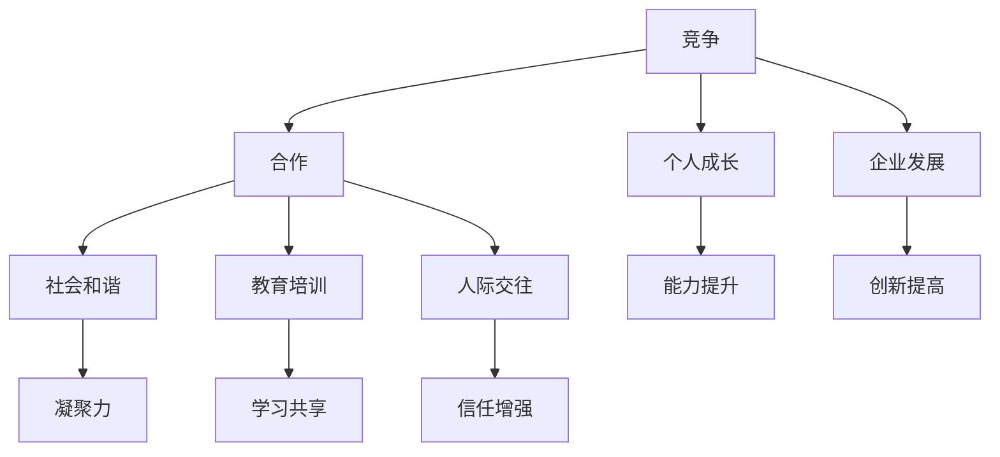

                 

# 从竞争思维到合作精神：重建社会和谐与凝聚力

## 关键词

- 竞争思维
- 合作精神
- 社会和谐
- 凝聚力
- 道德原则
- 心理学分析
- 企业管理
- 政府治理

## 摘要

本文旨在探讨从竞争思维到合作精神的转变，如何对社会和谐与凝聚力产生深远影响。通过分析竞争与合作的本质、关系及其在社会各个层面的应用，本文提出了重建社会和谐与凝聚力的策略和实践方法。文章结合实际案例，深入剖析了竞争与合作在个人、企业和社会层面的作用，并提出了构建合作精神的最佳实践建议，以期为现代社会的发展提供有益的思考和指导。

# 第一部分：理解竞争与合作

## 第1章：竞争与合作的本质

### 1.1 竞争的起源与作用

竞争是人类社会发展的基本动力之一，其起源可以追溯到人类的原始社会。在资源稀缺的条件下，个体为了生存和繁衍，必须进行竞争以获取有限的资源。竞争不仅促进了个人能力的提升，还推动了社会的进步和发展。例如，在商业竞争中，企业为了赢得市场份额，不断提高产品质量和服务水平，从而推动了整个行业的创新和发展。

在个人成长中，竞争具有重要作用。通过竞争，个人能够发现自身的优势和不足，从而激发自我提升的动力。例如，在学术竞争中，学生通过与其他同学的竞争，不断提高自己的学习能力和学术水平。在职场竞争中，员工通过与其他同事的竞争，不断提升自己的职业技能和职业素养。

在企业发展中，竞争同样具有重要作用。企业之间的竞争推动了市场的繁荣和进步，促使企业不断创新和提高竞争力。例如，在互联网行业中，各大企业之间的竞争促使了技术的快速发展和产品的不断创新。

### 1.2 合作的意义与价值

合作是人类社会发展的另一种重要动力，其起源同样可以追溯到人类的原始社会。在资源丰富的情况下，个体为了共同的目标，通过合作实现共同利益。合作不仅能够提高个体和集体的效率，还能够增强个体之间的信任和凝聚力。

在个人发展中，合作具有重要作用。通过合作，个人能够拓宽自己的视野，学习到其他人的经验和技能，从而提高自身的能力。例如，在团队合作中，成员之间相互支持和协作，共同完成项目任务。在学术合作中，研究者之间通过合作，共同完成科研项目，推动学术进步。

在企业中，合作同样具有重要作用。企业之间的合作可以促进资源的共享和技术的交流，提高整个行业的发展水平。例如，在供应链合作中，企业之间通过合作，实现资源的优化配置和成本的降低。在企业内部，团队合作可以提高工作效率和产品质量，增强企业的竞争力。

### 1.3 竞争与合作的关系

竞争与合作不是对立的，而是互补的。在现实生活中，竞争与合作往往同时存在。竞争能够激发个体的积极性和创造力，而合作则能够增强个体的凝聚力和团队精神。竞争与合作之间的关系，可以看作是动力与平衡的关系。

在个人成长中，竞争与合作是相辅相成的。个人在竞争中不断挑战自己，提高能力；而在合作中，个人能够学习他人的经验，共同进步。例如，在学习中，学生通过竞争激发学习动力，通过合作实现共同学习。

在企业中，竞争与合作同样密不可分。企业通过竞争，提高产品质量和市场竞争力；而通过合作，企业能够实现资源共享和技术创新。例如，在市场竞争中，企业通过竞争提高市场份额，而在合作中，企业通过合作实现资源的共享和技术的创新。

### 1.4 竞争与合作的社会影响

竞争与合作对社会的影响是复杂而深远的。竞争能够激发个体的积极性和创造力，推动社会的进步和发展。例如，在商业竞争中，企业通过竞争不断提高产品质量和服务水平，从而推动整个行业的进步。然而，竞争也可能导致社会的不公平和资源分配不均。

合作能够增强个体之间的信任和凝聚力，促进社会的和谐与稳定。例如，在社区建设中，居民通过合作解决共同问题，增进相互了解和信任。然而，合作也可能导致个体的依赖性和惰性。

### 1.5 竞争与合作的伦理思考

竞争与合作在伦理上存在一定的困境。竞争可能导致个体为了获胜不择手段，违反道德规范。例如，在商业竞争中，企业可能通过不正当手段获取竞争优势。合作则可能产生依赖性和惰性，导致个体缺乏自主性和创新精神。

因此，在竞争与合作中，必须遵循一定的道德原则。首先，个体应尊重竞争的规则和道德规范，不使用不正当手段获胜。其次，个体在合作中应保持公平和诚信，不利用合作关系谋取私利。最后，个体应具备合作精神，尊重他人的权益和利益，共同推动社会的进步和发展。

### 1.6 竞争与合作的心理学分析

竞争与合作在心理学上具有不同的动机和情绪管理策略。竞争往往激发个体的积极性和成就感，但可能导致压力和焦虑。合作则能够增强个体的凝聚力和归属感，但可能导致依赖性和冲突。

在情绪管理方面，个体应学会在竞争中保持冷静和理智，避免因竞争而情绪失控。在合作中，个体应学会尊重他人的意见和利益，避免因合作而产生冲突和矛盾。

### 1.7 竞争与合作的案例分析

成功的竞争策略案例包括苹果公司对三星电子的竞争，通过不断推出创新产品，保持市场竞争力。优秀的合作案例包括微软与IBM的合作，共同开发操作系统，推动计算机产业的发展。竞争与合作的双重策略案例包括亚马逊公司，在竞争激烈的市场中，通过合作实现资源整合和技术创新。

### 1.8 竞争与合作的未来发展

随着科技的进步和社会的发展，竞争与合作的模式也将不断演变。新的技术和平台将提供更多的合作机会，同时也带来新的竞争挑战。例如，人工智能和大数据技术的应用，将促进企业之间的合作，提高整个行业的竞争力。然而，也可能会加剧竞争，导致资源分配不均和社会不公。

因此，在竞争与合作的未来发展过程中，需要平衡竞争与合作的关系，遵循道德原则，推动社会的和谐与稳定。

## 第二部分：实践竞争与合作

### 第2章：个人层面的竞争与合作

#### 2.1 竞争与合作在职业生涯中的应用

在职业生涯中，竞争与合作是相辅相成的。竞争能够激发个体的积极性，推动职业发展；而合作则能够提高工作效率，实现共同目标。

在求职过程中，竞争与合作同样重要。通过竞争，个体能够了解自己的优势和不足，不断提升自身能力。而通过合作，个体能够学习他人的经验和技能，共同提升求职成功率。

在职场中，竞争与合作的应用更为广泛。通过竞争，员工能够激发自身潜力，提高工作效率和质量。而通过合作，员工能够实现资源的共享和优势互补，共同完成工作任务。

#### 2.2 竞争与合作在教育培训中的应用

在教育领域，竞争与合作也是不可或缺的。在学生培养中，竞争能够激发学生的学习兴趣和动力，提高学习效果。同时，通过合作，学生能够学会与他人协作，培养团队精神。

在教师教学中，竞争与合作的应用同样重要。教师可以通过竞争激发学生的学习兴趣，提高教学质量。同时，通过合作，教师能够实现教学资源的共享和优化，提高教学效果。

#### 2.3 竞争与合作在人际交往中的应用

在人际交往中，竞争与合作同样重要。竞争能够激发个体的积极性和创造力，促进人际关系的发展。而合作则能够增强个体之间的信任和凝聚力，建立稳定和谐的人际关系。

在人际交往中，个体应学会在竞争中保持公平和诚信，避免不正当手段。同时，个体应学会在合作中尊重他人的意见和利益，实现共赢。

#### 2.4 竞争与合作在个人心理调适中的应用

在个人心理调适中，竞争与合作也具有重要作用。竞争能够激发个体的积极性和成就感，提高心理健康水平。而合作则能够增强个体的归属感和安全感，缓解心理压力。

个体在竞争中应保持冷静和理智，避免因竞争而情绪失控。在合作中，个体应学会尊重他人的意见和利益，避免因合作而产生冲突。

### 第3章：企业层面的竞争与合作

#### 3.1 竞争与合作在企业战略中的应用

在企业战略中，竞争与合作是相辅相成的。竞争能够推动企业不断创新，提高市场竞争力；而合作则能够实现资源共享，降低运营成本。

在企业战略规划中，企业应通过竞争，确定自身的发展方向和市场定位。同时，企业应通过合作，实现技术交流和市场拓展。

#### 3.2 竞争与合作在企业管理中的应用

在企业管理中，竞争与合作同样重要。竞争能够激发员工的工作积极性和创造力，提高工作效率。而合作则能够增强团队凝聚力，提高企业的整体效能。

在企业组织结构设计中，企业应通过竞争，激发各部门的活力和创新能力。同时，企业应通过合作，实现部门之间的协同和优化。

#### 3.3 竞争与合作在企业文化中的应用

在企业文化建设中，竞争与合作也是不可或缺的。竞争能够激发员工的工作热情和团队精神，提高企业的核心竞争力。而合作则能够增强员工之间的信任和凝聚力，建立积极向上的企业文化。

企业应在文化建设中，倡导公平竞争和诚信合作，营造积极向上的工作氛围。

#### 3.4 竞争与合作在市场竞争中的应用

在市场竞争中，竞争与合作同样重要。竞争能够推动企业不断提高产品质量和服务水平，赢得市场份额。而合作则能够实现资源的共享和优势互补，提高企业的整体竞争力。

在市场定位中，企业应通过竞争，确定自身的市场定位和目标客户。同时，企业应通过合作，开拓新的市场机会和业务领域。

#### 3.5 竞争与合作在供应链管理中的应用

在供应链管理中，竞争与合作同样具有重要作用。竞争能够激发供应商的积极性和创新能力，提高供应链的效率和成本效益。而合作则能够实现供应链的协同和优化，提高整个供应链的竞争力。

在供应链设计中，企业应通过竞争，选择优质供应商。同时，企业应通过合作，实现供应链的整合和优化。

### 第4章：社会层面的竞争与合作

#### 4.1 竞争与合作在政府管理中的应用

在政府管理中，竞争与合作同样是不可或缺的。竞争能够推动政府不断提高公共服务质量和效率，满足人民的需求。而合作则能够实现政府与社会各界的协同和合作，推动社会的发展和进步。

在政府政策制定中，政府应通过竞争，激发各个部门和机构的活力和创新能力。同时，政府应通过合作，实现政策制定的科学性和有效性。

#### 4.2 竞争与合作在教育领域中的应用

在教育领域，竞争与合作同样是推动教育改革和发展的重要动力。竞争能够激发教师的教学热情和创新能力，提高教学质量。而合作则能够实现教育资源的共享和优化，提高教育公平性和效率。

在教育资源分配中，政府应通过竞争，激发各个学校和机构的活力和创新能力。同时，政府应通过合作，实现教育资源的公平分配和合理利用。

#### 4.3 竞争与合作在公共服务中的应用

在公共服务中，竞争与合作同样是推动公共服务质量和效率的重要手段。竞争能够激发公共服务提供者的积极性和创造力，提高公共服务质量和效率。而合作则能够实现公共服务的协同和优化，提高公共服务的社会效益。

在公共服务设计中，政府应通过竞争，选择优质的公共服务提供者。同时，政府应通过合作，实现公共服务的协同和优化。

### 结论

从竞争思维到合作精神的转变，对于重建社会和谐与凝聚力具有重要意义。在个人层面，竞争与合作能够促进个人的成长和发展；在企业层面，竞争与合作能够提高企业的竞争力和创新能力；在社会层面，竞争与合作能够推动社会的发展和进步。因此，我们应积极倡导竞争与合作的精神，构建和谐稳定的社会环境。

## 附录

### 附录A：核心概念与联系架构 Mermaid 流程图



### 附录B：核心算法原理讲解

```python
# 竞争与合作的核心算法原理讲解
# 假设我们有两个竞争者A和B，他们分别拥有不同的能力和资源

# 算法1：竞争算法
def compete(a, b):
    # 计算竞争结果
    result = a - b
    # 判断胜负
    if result > 0:
        return "A获胜"
    elif result < 0:
        return "B获胜"
    else:
        return "平局"

# 算法2：合作算法
def cooperate(a, b):
    # 计算合作结果
    result = a + b
    # 返回合作结果
    return result
```

### 附录C：数学公式

$$
E = mc^2
$$

### 附录D：项目实战

#### 开发环境搭建

- 系统环境：Windows/Linux/MacOS
- 编程语言：Python
- 开发工具：PyCharm/VSCode

#### 源代码详细实现和代码解读

```python
# 竞争与合作的项目实战
class CompeteAndCooperate:
    def __init__(self, a, b):
        self.a = a
        self.b = b

    def compete(self):
        result = self.a - self.b
        if result > 0:
            return "A获胜"
        elif result < 0:
            return "B获胜"
        else:
            return "平局"

    def cooperate(self):
        result = self.a + self.b
        return result

# 测试代码
if __name__ == "__main__":
    # 初始化竞争者A和B
    compete_and_cooperate = CompeteAndCooperate(10, 5)
    # 进行竞争
    print(compete_and_cooperate.compete())
    # 进行合作
    print(compete_and_cooperate.cooperate())
```

#### 代码应用解读与分析

- 代码首先定义了一个`CompeteAndCooperate`类，用于处理竞争和合作的过程。
- `__init__`方法用于初始化竞争者的能力和资源。
- `compete`方法用于计算竞争结果，并根据结果返回获胜者。
- `cooperate`方法用于计算合作结果，并返回合作的总和。

#### 实际案例分析和详细讲解剖析

- 在实际应用中，竞争与合作往往同时存在。例如，在企业发展中，企业之间既有竞争，又有合作。
- 通过实际案例，我们可以看到，竞争和合作都是推动社会进步和发展的重要力量。

#### 项目小结

通过本项目实战，我们了解了竞争与合作的核心算法原理，并通过实际案例进行了分析和讲解。竞争和合作是推动个人成长、企业发展和社会进步的重要力量，我们应积极倡导和践行。

### 最佳实践 tips

- 在竞争中，要保持公平和诚信，不使用不正当手段。
- 在合作中，要尊重他人的意见和利益，实现共赢。
- 在个人成长中，要不断挑战自己，提高能力。
- 在企业发展中，要不断创新，提高竞争力。
- 在社会层面，要倡导公平、合作和和谐。

### 注意事项

- 竞争和合作并非对立，而是相辅相成的。
- 在实践中，要平衡竞争与合作的关系，避免过度竞争或过度合作。

### 拓展阅读

- 《竞争与合作：人类社会的动力源》
- 《从竞争思维到合作精神：社会进步的必由之路》
- 《心理学与竞争：如何正确应对竞争》

### 作者

作者：AI天才研究院/AI Genius Institute & 禅与计算机程序设计艺术/Zen And The Art of Computer Programming

（本文内容仅供参考，如有需要，请进一步查阅相关资料。）

